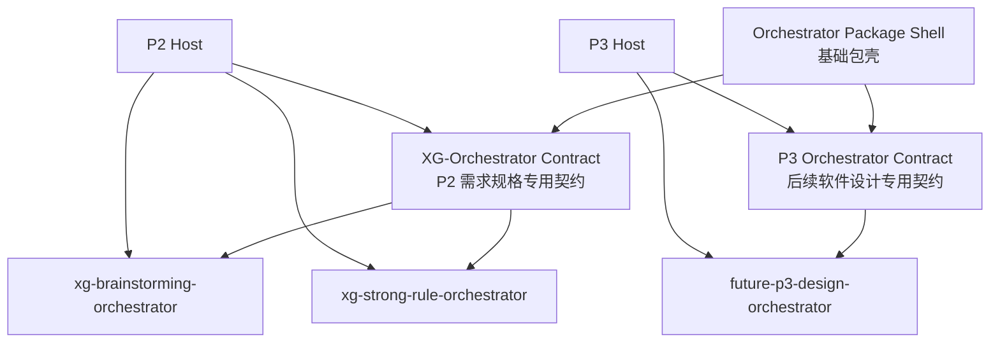

# Orchestrator 基础包壳与注册机制设计

**日期：** 2026-05-02

**定位：** 跨阶段组织器包壳规范，不是某个阶段的业务组织器契约。

**关联正式文档：**

- `DOC/CODEX_DOC/02_设计说明/00_总纲/00-软件工厂平台总体设计.md`
- `DOC/CODEX_DOC/02_设计说明/00_总纲/03-P1-P6数据互联互通与平台交换层设计.md`
- `DOC/CODEX_DOC/02_设计说明/P2_需求分析系统/P2-XG-Orchestrator组织器包规范设计.md`

## 1. 设计结论

`Orchestrator` 在 `CodeFactoryV2` 中应分为两层：

1. `Orchestrator Package Shell`：基础包壳层，规定一个组织器包如何声明、被发现、被校验、被注册、被 Host 装载和被替换。
2. `Stage Orchestrator Contract`：阶段专用运行契约，规定某个阶段、某类文档或某类业务目标的输入、输出、状态机、审计字段和闭环规则。

基础包壳不是业务父类，也不是任意文档转换引擎。

它不回答：

- 如何从自然语言生成需求规格说明。
- 如何从需求规格说明生成软件设计说明。
- 如何判断某个阶段的业务闭环是否完成。
- 如何写入某个阶段的正式成果物。

它只回答：

- 一个组织器包长什么样。
- 组织器包如何声明自己支持哪个契约。
- Host 如何发现、校验、注册、配置和调用它。
- 组织器包与 Host 的责任边界是什么。
- 后续如何在不重写 Host 主业务的情况下替换组织器。

因此，当前采用：

```text
基础包壳通用，运行契约专用。
```

`P2 XG-Orchestrator` 是第一个落地实例。它复用本文件定义的基础包壳，但运行契约仍是 `xg-orchestrator-contract@1`，只服务于需求规格说明生成与补全。

## 2. 命名边界

### 2.1 Orchestrator Package Shell

中文名：组织器基础包壳。

含义：组织器包的通用载体规范。

它可以被 `P2`、`P3` 或后续阶段复用，但不包含任何阶段业务规则。

### 2.2 Stage Orchestrator Contract

中文名：阶段组织器契约。

含义：某个阶段对组织器输入输出和状态机的专用约束。

示例：

| 契约 | 阶段 | 文档或业务目标 | 说明 |
| --- | --- | --- | --- |
| `xg-orchestrator-contract@1` | `P2` | 需求规格说明 | 把用户输入、知识上下文和模板目标组织为需求规格补充 |
| 后续 P3 契约 | `P3` | 软件设计说明 | 从冻结需求规格组织出软件设计说明和设计包 |

后续 P3 不应直接复用 `xg-orchestrator-contract@1`。P3 可以复用本文件的包壳结构，但必须定义自己的阶段契约。

### 2.3 Orchestrator Host

中文名：组织器宿主。

含义：具体阶段系统中负责装载和调用组织器的服务。

示例：

- `P2 Brainstorming / Requirement Analysis Host`
- 后续 `P3 Software Design Host`

Host 是权威状态拥有者。组织器包只能产出候选过程结果或契约输出，不能绕过 Host 直接写正式成果物。

### 2.4 Orchestrator Package

中文名：组织器包。

含义：一个可注册、可替换的组织策略包，形态接近 skill。

它至少包含机器可读的 `manifest.json` 和面向人审查的说明、策略、契约样例与测试材料。

## 3. 分层结构



解释：

- 基础包壳提供共同装载机制。
- 阶段契约提供业务运行规则。
- 组织器实例提供具体策略。
- Host 负责把组织器输出纳入本阶段权威状态。

## 4. 目录形态

组织器包以阶段契约族为一级分组：

```text
orchestrators/
  <contract-family>/
    <orchestrator-id>/
      manifest.json
      ORCHESTRATOR.md
      contract.schema.json
      policy.md
      prompt.md
      examples/
      tests/
      runner.py
      remote.json
```

其中 `<contract-family>` 是契约族，不是任意业务目录。

当前已落地：

```text
orchestrators/
  xg/
    xg-brainstorming-orchestrator/
    xg-strong-rule-orchestrator/
```

后续如果进入 P3，应新增 P3 自己的契约族目录，而不是把 P3 组织器塞进 `orchestrators/xg/`。

## 5. 包内文件职责

| 文件或目录 | 是否基础包壳要求 | 说明 |
| --- | --- | --- |
| `manifest.json` | 必须 | 机器可读身份、版本、契约、运行模式、能力和入口声明 |
| `ORCHESTRATOR.md` | 必须 | 面向人审查的组织器说明 |
| `contract.schema.json` | 必须 | 该包声明遵守的契约结构或契约引用 |
| `policy.md` | 必须 | 组织策略、决策边界、禁止事项 |
| `examples/` | 必须 | 输入输出样例，用于人工审查和契约回归 |
| `tests/` | 必须 | 包级契约测试材料或测试说明 |
| `prompt.md` | 按模式要求 | `policy_interpreted` 模式下必须存在 |
| `runner.py` | 按模式要求 | `local_runner` 模式下必须存在，且只能由 Host 受控调用 |
| `remote.json` | 按模式要求 | `remote_service` 模式下用于声明远程服务入口 |

基础包壳只规定文件职责，不规定阶段业务字段如何解释。业务字段由阶段契约决定。

## 6. manifest 基础字段

`manifest.json` 至少包含以下基础字段：

```json
{
  "id": "xg-brainstorming-orchestrator",
  "name": "XG Brainstorming Orchestrator",
  "version": "0.1.0",
  "stage": "P2",
  "document_type": "requirement_spec",
  "contract": "xg-orchestrator-contract@1",
  "mode": "policy_interpreted",
  "status": "available",
  "description": "面向需求规格说明的开放式 Brainstorming 组织器。",
  "entry": null,
  "capabilities": ["conversation", "quick_options", "document_patch"],
  "requires": {
    "model_provider": true,
    "knowledge_binding": true
  },
  "priority": 10
}
```

字段解释：

| 字段 | 基础含义 |
| --- | --- |
| `id` | 全局或契约族内唯一组织器 ID |
| `name` | 人可读名称 |
| `version` | 包版本 |
| `stage` | 主要服务阶段 |
| `document_type` | 主要服务的成果物或文档类型 |
| `contract` | 必须遵守的阶段契约版本 |
| `mode` | 运行模式 |
| `status` | `available / experimental / disabled / deprecated` |
| `description` | 简短说明 |
| `entry` | 本地 runner 或远程入口，按模式解释 |
| `capabilities` | 能力声明，供 UI 和 Host 展示或过滤 |
| `requires` | 对模型、知识、模板、草稿等依赖的声明 |
| `priority` | 默认排序权重 |

Host 必须以 `contract` 为核心判断能否装载包，而不是只看目录名。

## 7. 运行模式

### 7.1 policy_interpreted

Host 读取组织器的 `policy.md` 和 `prompt.md`，结合阶段上下文、模板、知识绑定和历史状态，调用模型 Provider 生成候选输出。

适用场景：

- 启发式 Brainstorming。
- 需要大模型生成候选表达。
- 组织策略主要由提示词和政策约束表达。

要求：

- 模型输出必须经过 Host 结构校验。
- 模型不能直接写正式成果物。
- Provider 调用日志必须由 Host 记录。

### 7.2 local_runner

Host 调用受控本地规则路径生成契约输出。

适用场景：

- 强规则组织器。
- 不依赖模型或只弱依赖模型。
- 需要稳定、可重复、可测试的状态机行为。

要求：

- `runner.py` 不能自行读取任意项目状态。
- `runner.py` 不能自行保存权威状态。
- Host 只传入契约允许的上下文，并只接受契约允许的输出。

### 7.3 remote_service

远程组织器服务模式当前只保留扩展位，首版不实现。

后续启用前必须补充：

- 远程调用认证。
- 超时、重试和熔断。
- 契约版本协商。
- 输入输出脱敏。
- 审计日志与调用回放。

## 8. Host 装载流程

```text
扫描 orchestrators/<contract-family>/*/manifest.json
  -> 读取 manifest
  -> 校验基础包壳文件完整性
  -> 校验 mode 与入口文件
  -> 校验 contract 是否被当前 Host 支持
  -> 校验 contract.schema.json / examples / tests
  -> 注册为可选组织器
  -> 前端或配置选择组织器
  -> Host 组装阶段上下文
  -> 调用组织器
  -> 校验输出
  -> Host 保存过程状态、调用日志和审计链
```

Host 不应因为某个组织器包存在就自动信任它。注册成功只代表“可被选择和验证”，不代表它可以绕过阶段契约。

## 9. Host 与组织器的责任边界

### 9.1 Host 负责

- 发现组织器包。
- 校验基础包壳。
- 判断契约兼容性。
- 管理 API Key、模型 Provider、知识源、模板、草稿和正式成果物。
- 组装阶段上下文。
- 调用组织器。
- 校验组织器输出。
- 保存会话、过程产物、调用日志和审计链。
- 决定是否把候选输出写入阶段草稿或正式成果物。
- 暴露前端可用的组织器列表和运行状态。

### 9.2 组织器包负责

- 声明自身身份、契约、能力和运行模式。
- 提供组织策略。
- 根据 Host 提供的上下文产出契约允许的候选输出。
- 给出可审查的下一步推进建议。
- 遵守禁止事项和输出结构。

### 9.3 组织器包禁止

- 直接修改正式成果物。
- 直接冻结、发布或撤销阶段成果物。
- 直接修改模板、知识库或上游成果物。
- 绕过 Host 保存会话状态。
- 自行读取或泄露 API Key。
- 通过本地 runner 执行与组织任务无关的副作用。
- 伪造契约版本或输出未声明字段作为权威事实。

## 10. 契约挂载机制

基础包壳通过 `contract` 字段挂载阶段契约。

例如：

```text
manifest.contract = "xg-orchestrator-contract@1"
```

这表示：

- 该包可以被支持 `xg-orchestrator-contract@1` 的 Host 装载。
- 该包必须接收 XG 契约定义的输入对象。
- 该包必须输出 XG 契约定义的 Turn 结构。
- 该包的 `policy.md`、`prompt.md`、`examples/` 和 `tests/` 都应围绕 XG 契约组织。

如果后续 P3 定义自己的契约，则 P3 组织器应声明 P3 契约，而不是声明 XG 契约。

## 11. 版本策略

组织器体系至少有三类版本：

| 版本 | 示例 | 变化含义 |
| --- | --- | --- |
| 包壳规范版本 | `orchestrator-package-shell@1` | 目录形态、基础 manifest 字段、运行模式发生变化 |
| 阶段契约版本 | `xg-orchestrator-contract@1` | 输入输出、状态机、审计字段发生变化 |
| 组织器包版本 | `0.1.0` | 某个具体组织器策略或实现变化 |

兼容原则：

- 包壳版本变化不应强迫阶段业务契约变化。
- 阶段契约破坏性变化必须升级契约版本。
- 组织器包可以在同一契约下独立迭代。
- Host 必须明确声明自己支持哪些契约版本。

## 12. 与当前实现的关系

当前 P2 已有初步实现：

- `orchestrators/xg/xg-brainstorming-orchestrator/`
- `orchestrators/xg/xg-strong-rule-orchestrator/`
- `apps/api/app/brainstorm/orchestrators.py`

这说明 XG 组织器包已经具备首版注册形态。

但当前实现仍有一个架构缺口：

- `OrchestratorPackage` 和 `OrchestratorRegistry` 目前位于 `app.brainstorm` 下。
- 默认扫描根固定为 `orchestrators/xg`。
- 因此它还不是跨阶段基础注册层，只是 P2/XG 的首版实现。

后续如果要把基础包壳真正落到代码层，应将通用注册能力迁移到中性模块，例如：

```text
apps/api/app/orchestrators/
  models.py
  registry.py
  validation.py
```

同时保留 XG 专用 Host 在 P2 业务域中：

```text
apps/api/app/brainstorm/
  service.py
  orchestrator_host.py
```

这类代码重构应单独规划和测试，不在本文档落版时强行完成。

## 13. 当前验收口径

本设计落版后，应满足：

1. 能明确回答“基础组织器在哪里”：基础层是 `Orchestrator Package Shell`，正式设计位于本文件。
2. 能明确回答“XG 组织器是不是通用父类”：不是，XG 只是需求规格说明专用契约。
3. 能解释为什么 P3 不能直接复用 XG 契约：P3 的输入、输出、闭环和审计对象不同，应定义自己的阶段契约。
4. 能解释代码现状与目标架构的差距：当前注册器还在 P2/XG 层，后续需要抽到中性基础注册层。
5. 能保证两个首版 XG 组织器仍可作为同一基础包壳下的两个实例存在。
