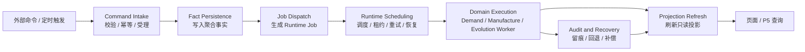
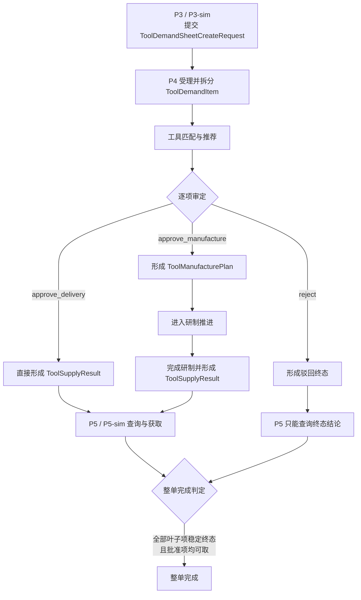
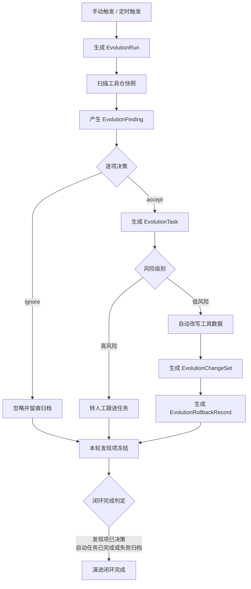
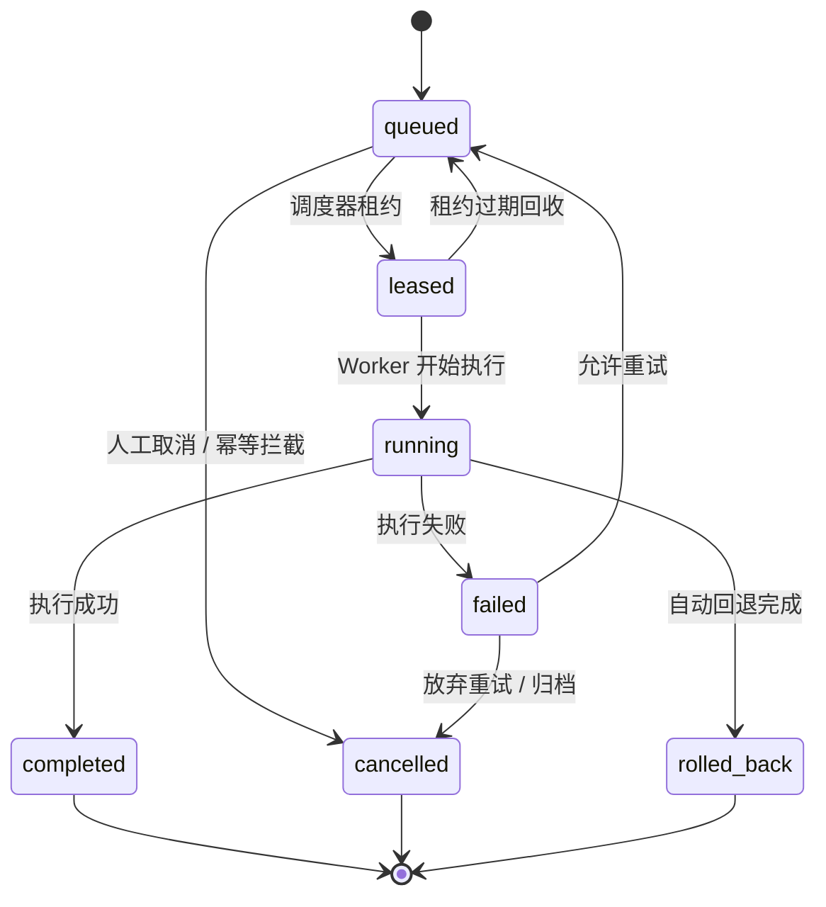

# P4 核心业务循环设计

> 归档说明：本文件归档自 `docs/superpowers/specs/2026-04-18-p4-core-business-cycle-design.md`，作为 `P4` 后端演进设计的正式引用入口之一。后续若工作层文档继续迭代，以本文件为正式归档基线。

**日期：** 2026-04-18

**对应节点建议：**
- `P4` 工具仓库 / 工具中台
- `P4.2` 输入工序链闭环探索
- `P4.3` 自演进巡检闭环

## 1. 设计目标

在 `P4.2` 和 `P4.3` 都已经成立的前提下，把 `P4` 从“工具仓库页 + 若干后台推进逻辑”正式提升为一个可独立部署、可承接高并发、多协作的后台业务中台。

本设计要固定的不是某个页面怎么画，而是 `P4` 的核心业务循环：

`接收命令 -> 写入业务事实 -> 投递后台任务 -> 统一调度 -> 分域执行 -> 刷新查询投影 -> 对外供给查询 -> 留痕与回退`

本轮目标：

- 把 `P4.2` 和 `P4.3` 统一收敛到同一套后台运行语义
- 明确 `P4` 的业务闭环、状态流和完成判定
- 明确当前单体实现与未来独立 `P4 backend service` 之间的映射
- 为后续运行时重构、数据库落地和 worker 化改造提供总设计基线

## 2. 设计边界

### 2.1 本轮要固定

- `P4` 的两条业务主循环与一条公共运行循环
- `P4` 的核心事实对象和状态流
- `P4` 的命令侧、执行侧、查询侧职责划分
- `P4` 与 `P1 / P3 / P5` 的对外边界
- `P4` 的失败、重试、回退和审计口径

### 2.2 本轮不展开

- 不规定最终消息队列或数据库产品的唯一技术选型
- 不直接做微服务拆分实施
- 不设计复杂权限体系
- 不设计真实工具研发编排平台
- 不把 `P4` 扩展成跨全厂的通用调度中心

## 3. P4 的角色重定义

`P4` 不是单纯的“工具列表管理器”，而是软件工厂中的**工具资产运行中台**。

它同时承担两类业务闭环：

### 3.1 外部输入闭环

面向 `P3 / P3-sim` 输入：

`工具需求单 -> 拆叶子工具项 -> 匹配 -> 审定 -> 直接交付或进入研制 -> 对 P5 提供查询与获取`

这一闭环对应 `P4.2`。

### 3.2 内部自演进闭环

面向 `P4` 工具池自身：

`工具仓快照 -> 巡检 -> 发现项 -> 采纳/忽略 -> 内部任务 -> 自动改写或人工跟进 -> 回退`

这一闭环对应 `P4.3`。

### 3.3 公共运行闭环

为以上两条业务链统一提供后台运行骨架：

`命令接入 -> 事实持久化 -> 任务投递 -> 调度与租约 -> Worker 执行 -> 查询投影刷新 -> 审计留痕`

这一闭环不对应单独页面，但它是未来 `P4 backend service` 能否承载高并发和多人协作的根基。

## 4. 总体业务循环

### 4.1 统一总图

`外部命令/定时触发 -> 命令处理 -> 聚合写入 -> 运行任务入队 -> 调度器分发 -> 分域 Worker 执行 -> 聚合更新 -> 投影刷新 -> 页面/P5 查询 -> 审计与回退`

这条总图必须覆盖 `P4.2` 和 `P4.3`，不能分别维护两套完全不同的后台推进方式。

### 4.2 统一阶段

第一阶段：`Command Intake`

- 接收外部命令或内部触发
- 进行参数校验、幂等校验、边界校验
- 只负责登记，不负责长耗时推进

第二阶段：`Fact Persistence`

- 把业务事实写成稳定对象
- 事实对象写入成功后，才允许后续任务入队

第三阶段：`Job Dispatch`

- 把需要后台执行的动作转成标准任务
- 同步请求只返回“已登记/已进入队列/当前状态”

第四阶段：`Runtime Scheduling`

- 由统一协调器决定哪些任务可执行
- 处理定时触发、重试、超时、补偿、恢复

第五阶段：`Domain Execution`

- 由分域 Worker 推进具体业务
- 不允许由页面查询动作反向驱动内部推进

第六阶段：`Projection Refresh`

- 每次事实变化后刷新只读投影
- 前端和 `P5` 查询只读投影，不直接拼原始事实

第七阶段：`Audit and Recovery`

- 所有关键动作记录操作者、时间、结果、原因
- 自动改写必须可回退
- 长流程必须可恢复

## 5. 两条业务主循环的标准化

### 5.1 `P4.2` 输入工序链循环

#### 5.1.1 入口

- `P3 / P3-sim` 提交 `ToolDemandSheetCreateRequest`
- `P4` 受理后拆成 `ToolDemandItem`

#### 5.1.2 中段

- 系统执行工具匹配与推荐
- 操作者逐项审定
- 每个叶子项只有三类决策：
  - `approve_delivery`
  - `approve_manufacture`
  - `reject`

#### 5.1.3 出口

- 已命中项形成 `ToolSupplyResult`
- 未命中项形成 `ToolManufacturePlan`
- `P5 / P5-sim` 只能查询：
  - 整单状态
  - 叶子项状态
  - 进度视图
  - 获取清单

#### 5.1.4 完成判定

`P4.2` 的“单项处理完成”口径：

- 直接交付项：已形成可取结果
- 研制项：已完成研制并形成可取结果
- 驳回项：已形成终态结论

`P4.2` 的“整单完成”口径：

- 全部叶子项都进入稳定终态
- 且所有批准项都已形成可对 `P5` 查询/获取的结果

这里必须强调：

- `已审定` 不等于 `已交付`
- `进入研制` 不等于 `已完成`

### 5.2 `P4.3` 自演进巡检循环

#### 5.2.1 入口

- 手动触发
- 定时触发

#### 5.2.2 中段

- 生成 `EvolutionRun`
- 产生 `EvolutionFinding`
- 操作者执行 `accept / ignore`
- `accept` 后立即生成 `EvolutionTask`

#### 5.2.3 出口

- 低风险任务自动改写工具数据
- 高风险任务保留为人工跟进任务
- 自动改写会生成：
  - `EvolutionChangeSet`
  - `EvolutionRollbackRecord`

#### 5.2.4 完成判定

`P4.3` 的“巡检轮次完成”口径：

- 本轮扫描已结束
- 发现项已冻结

`P4.3` 的“演进闭环完成”口径：

- 发现项已决策
- 自动任务已执行完成或失败归档
- 所有自动改写都具备留痕

这里同样必须强调：

- 巡检完成不等于优化全部完成
- 发现项被采纳不等于任务已执行完成

## 6. 公共运行循环的统一语义

为让 `P4.2` 和 `P4.3` 真正共用同一套后台模型，必须固定如下统一语义。

### 6.1 统一触发源

- `external_command`
- `internal_command`
- `scheduled_trigger`

### 6.2 统一后台任务类型

第一版至少包含：

- `demand_analysis`
- `manufacture_execution`
- `evolution_scan`
- `evolution_auto_apply`
- `projection_refresh`

### 6.3 统一运行状态

后台任务统一使用：

- `queued`
- `leased`
- `running`
- `completed`
- `failed`
- `cancelled`
- `rolled_back`

### 6.4 统一运行留痕

每个后台任务至少记录：

- `job_id`
- `job_type`
- `aggregate_type`
- `aggregate_id`
- `trigger_source`
- `trigger_actor`
- `attempt_count`
- `leased_until`
- `started_at`
- `finished_at`
- `error_code`
- `error_message`

这样 `P4.2` 的研制推进和 `P4.3` 的自动改写虽然业务不同，但都可以落在同一个运行框架里。

## 7. P4 的核心事实对象

`P4` 必须以事实对象为中心，不以页面状态为中心。

### 7.1 工具资产事实

- `ToolDefinition`
- `ToolVerification`
- `ToolFetchManifest`

### 7.2 输入工序链事实

- `ToolDemandSheet`
- `ToolDemandItem`
- `ToolDemandLifecycleEvent`
- `ToolManufacturePlan`
- `ToolSupplyResult`

### 7.3 自演进事实

- `EvolutionInspectionConfig`
- `EvolutionRun`
- `EvolutionFinding`
- `EvolutionTask`
- `EvolutionChangeSet`
- `EvolutionRollbackRecord`
- `EvolutionRuntimeState`

### 7.4 公共运行事实

未来应补上：

- `RuntimeJob`
- `RuntimeLease`
- `RuntimeRetryRecord`
- `ProjectionRefreshRecord`

当前代码里 `run_runtime_cycle()` 已经体现出“统一运行循环”的雏形，但还没有把这些公共运行对象显式建模。

## 8. P4 的命令侧、执行侧、查询侧分离

### 8.1 命令侧

负责：

- 接收变更请求
- 做校验和状态判断
- 写入聚合事实
- 生成后台任务

不负责：

- 长耗时执行
- 大规模查询拼装
- 直接推页面状态

### 8.2 执行侧

负责：

- 领取后台任务
- 推进领域逻辑
- 写回事实对象
- 触发投影刷新

不负责：

- 暴露页面接口
- 直接面向用户拼装展示数据

### 8.3 查询侧

负责：

- 提供总览
- 提供页面卡片所需投影
- 提供 `P5` 查询与获取视图

不负责：

- 触发隐式状态推进
- 直接操作事实对象

## 9. 与 `P1 / P3 / P5` 的边界

### 9.1 与 `P1`

`P4` 只消费 `P1` 的标准知识出口、只读 API 或冻结快照。

禁止：

- 依赖 `P1` 未发布的中间 JSON
- 依赖治理工作态细节
- 依赖临时脚本输出

### 9.2 与 `P3`

`P3` 只负责提交工具需求，不进入 `P4` 内部处理细节。

`P3` 能做：

- 创建需求单
- 撤销需求单
- 查询受理状态

`P3` 不能做：

- 直接改工具仓
- 直接改研制计划
- 直接改巡检任务

### 9.3 与 `P5`

`P5` 只负责消费结果。

`P5` 能做：

- 查询整单状态
- 查询叶子项进度
- 查询结果可取信息

`P5` 不能做：

- 驱动 `P4` 内部推进
- 修改 `P4` 的审定状态
- 修改制造任务

## 10. 当前实现与未来目标的映射

当前实现已经具备以下前提：

- 统一服务入口：`ToolHubService`
- 统一后台循环：`run_runtime_cycle()`
- 分域事实对象：`ToolDemand* / Evolution* / ToolDefinition`
- 基于目录的文件型仓储

但距离未来目标仍有以下差距：

- 运行循环仍是单进程内的定时 tick
- 后台任务未显式建模为标准 job
- 查询投影仍以快照拼装为主
- 没有租约、重试、死信、恢复机制
- 没有数据库级并发控制和索引体系

因此，后续应当做的是**运行骨架升级**，而不是推翻 `P4.2 / P4.3` 已经确认的业务模型。

## 11. 面向高并发和多人协作的要求

若 `P4` 面向未来需要承接约 `1000` 名程序员级用户的开发与使用，其核心业务循环必须满足：

- 读写分离
- 长任务异步化
- 任务可租约与可恢复
- 聚合版本控制
- 幂等处理
- 审计完备
- 自动改写可回退
- 查询投影增量刷新
- 外部接口稳定而内部执行可替换

## 12. 建议的后续设计分解

本总设计之后，建议继续固定三类专项设计：

1. `P4 runtime coordinator / worker / queue`
2. `P4 backend service 边界与分域接口`
3. `P4 数据模型与投影模型`

这样 `P4` 的总设计、运行骨架、服务边界和数据结构四层才真正闭合。

## 13. 验收标准

本设计完成后，应能明确回答以下问题：

- `P4.2` 和 `P4.3` 如何在同一套后台循环内运行
- `P4` 哪些对象是事实对象，哪些对象是查询投影
- 哪些动作属于同步命令，哪些必须转后台任务
- `P3 / P5` 与 `P4` 的边界分别是什么
- 当前单体实现如何演进为独立的 `P4 backend service`
