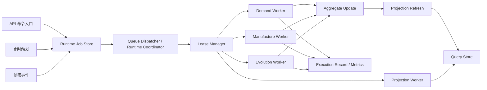
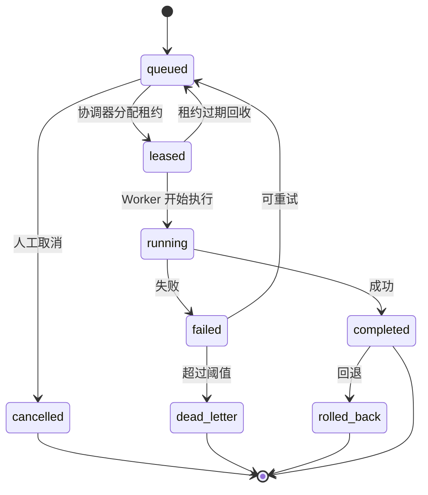
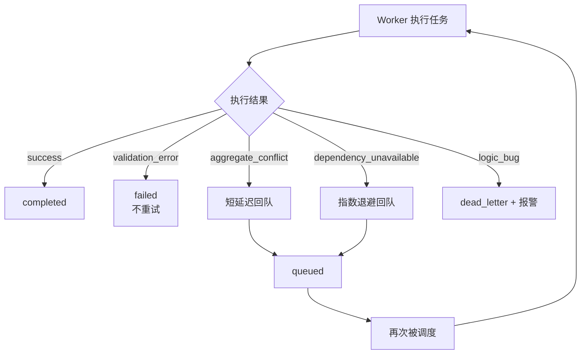

# P4 Runtime Coordinator、Worker 与 Queue 设计

> 归档说明：本文件归档自 `docs/superpowers/specs/2026-04-18-p4-runtime-coordinator-worker-queue-design.md`，作为 `P4` 运行时设计的正式引用入口之一。后续若工作层文档继续迭代，以本文件为正式归档基线。

**日期：** 2026-04-18

**对应节点建议：**
- `P4`
- `P4.2`
- `P4.3`

## 1. 设计目标

把当前 `P4` 中“由单个后台线程 tick 推进多个流程”的验证实现，升级为未来可独立演进的运行时设计。

本设计聚焦：

- 统一运行协调器 `Runtime Coordinator`
- 标准后台任务模型 `Queue / Job`
- 分域执行器 `Worker`
- 任务租约、重试、恢复与投影刷新机制

目标不是立刻引入重型分布式系统，而是先把运行时抽象定对。

## 2. 为什么要单独设计运行时

当前实现中，后台运行统一入口是：

- `run_scheduled_evolution_cycle()`
- `run_evolution_task_cycle()`
- `run_manufacture_executor_cycle()`

这一方式适合 MVP，但存在天然上限：

- 所有推进逻辑耦合在一个进程内
- 无法水平扩展
- 无任务租约，难以避免重复执行
- 无标准重试和死信机制
- 无法支撑未来高并发、多节点部署

因此，必须把“业务逻辑”与“运行推进”解耦。

## 3. 运行时总图

推荐未来运行时总图如下：

`API 命令入口 -> Runtime Job Store -> Queue Dispatcher -> Worker Pool -> Aggregate Update -> Projection Refresh -> Query Store`

其中：

- `API` 只负责命令登记
- `Runtime Coordinator` 只负责调度
- `Worker` 负责执行具体业务
- `Projection Refresh` 负责查询投影



## 4. 核心组件

### 4.1 Runtime Coordinator

职责：

- 拉取可执行任务
- 触发定时任务
- 管理租约
- 处理超时和重试
- 发现僵尸任务并回收
- 触发投影刷新任务

它不是：

- 业务规则总入口
- 页面接口层
- 聚合对象仓储本体

### 4.2 Job Queue

职责：

- 承载所有异步任务
- 提供标准状态流转
- 保证任务顺序、租约和幂等

### 4.3 Worker Pool

职责：

- 按任务类型执行对应逻辑
- 不关心页面表现
- 不直接对外暴露接口

### 4.4 Lease Manager

职责：

- 给任务分配执行租约
- 避免多个 worker 同时处理同一任务
- 支持续租和租约过期回收

### 4.5 Retry and Dead Letter Handler

职责：

- 失败后按规则重试
- 超过阈值后进入死信
- 记录失败原因与可恢复信息

### 4.6 Projection Refresher

职责：

- 把事实对象变化转成只读投影
- 避免查询时实时扫全量聚合

## 5. 任务分类

第一版建议固定如下任务类型。

### 5.1 输入工序链任务

- `demand_sheet_acceptance`
- `demand_item_matching`
- `manufacture_execution`
- `delivery_projection_refresh`

### 5.2 自演进任务

- `evolution_scan`
- `evolution_task_auto_apply`
- `evolution_projection_refresh`

### 5.3 公共任务

- `overview_projection_refresh`
- `runtime_recovery`
- `stuck_job_reaper`

## 6. 标准任务对象

建议未来引入统一 `RuntimeJob`。

```yaml
job_id:
job_type:
queue_name:
aggregate_type:
aggregate_id:
trigger_source:
trigger_actor_id:
payload_ref:
status:
attempt_count:
max_attempts:
priority:
not_before:
leased_by:
leased_until:
started_at:
finished_at:
error_code:
error_message:
created_at:
updated_at:
```

字段规则：

- `aggregate_type + aggregate_id` 用于绑定业务事实对象
- `payload_ref` 指向详细任务载荷，而不把大载荷直接塞入队列
- `not_before` 支持延迟执行
- `leased_until` 支持租约过期回收

## 7. 任务生命周期

统一任务状态固定为：

- `queued`
- `leased`
- `running`
- `completed`
- `failed`
- `cancelled`
- `rolled_back`
- `dead_letter`

推荐状态流：

`queued -> leased -> running -> completed`

异常路径：

- `queued -> leased -> running -> failed -> queued`
- `queued -> leased -> running -> failed -> dead_letter`
- `completed -> rolled_back`



## 8. 租约机制

### 8.1 目的

为支持多 worker 并发执行，必须避免同一任务被重复消费。

### 8.2 规则

- worker 领取任务时写入 `leased_by / leased_until`
- 只有当前租约持有者能提交完成结果
- 若超时未续租，则租约失效
- 协调器可回收过期租约并重投

### 8.3 续租

对长任务支持心跳续租：

- worker 周期性刷新 `leased_until`
- 若 worker 异常退出，租约自动过期

## 9. 队列组织建议

### 9.1 逻辑分队列

建议按域划分逻辑队列：

- `p4-demand`
- `p4-manufacture`
- `p4-evolution`
- `p4-projection`
- `p4-runtime`

### 9.2 并发控制

同一聚合建议采用串行执行原则：

- 同一个 `ToolDemandSheet` 不应被多个修改任务同时推进
- 同一个 `ToolDefinition` 不应被多个自动改写任务同时推进
- 同一个 `EvolutionTask` 不应被多个 worker 同时处理

实现方式：

- 用 `aggregate_id` 做分片或逻辑锁
- 同聚合按顺序消费

## 10. Worker 设计

### 10.1 Demand Worker

负责：

- 工具需求叶子项分析
- 推荐结果落库
- 审定后派生制造任务

### 10.2 Manufacture Worker

负责：

- 推进 `ToolManufacturePlan`
- 更新预计完成时间、进度和完成结果
- 产出可取清单

### 10.3 Evolution Scan Worker

负责：

- 运行巡检扫描
- 生成 `EvolutionRun` 和 `EvolutionFinding`

### 10.4 Evolution Task Worker

负责：

- 执行自动改写任务
- 生成 `EvolutionChangeSet`
- 更新回退可用状态

### 10.5 Projection Worker

负责：

- 刷新总览
- 刷新工单查询结果
- 刷新巡检卡片数据

## 11. 失败与重试策略

### 11.1 失败分类

- `validation_error`
- `transient_error`
- `dependency_unavailable`
- `aggregate_conflict`
- `logic_bug`

### 11.2 重试策略

- `validation_error`：不重试，直接失败
- `aggregate_conflict`：短延迟重试
- `dependency_unavailable`：指数退避重试
- `logic_bug`：进入死信并报警

### 11.3 死信

死信任务保留：

- 原始任务上下文
- 失败堆栈摘要
- 已尝试次数
- 人工恢复建议



## 12. 调度触发模型

统一支持三类触发：

### 12.1 命令触发

例如：

- 审定通过后投递制造任务
- 采纳发现项后投递自动改写任务

### 12.2 定时触发

例如：

- 定时巡检
- 概览聚合刷新
- 僵尸任务回收

### 12.3 事件触发

例如：

- 工具定义变化后触发投影刷新
- 自动改写成功后触发总览刷新

## 13. 运行时观测

必须暴露以下运行指标：

- 队列长度
- 各类任务成功率
- 重试次数
- 死信数量
- 平均执行时长
- 超时任务数
- 回退任务数

并提供运行态查询面：

- 最近任务列表
- 失败任务列表
- 按任务类型的统计
- 当前 worker 健康状态

## 14. 当前实现到目标实现的迁移路径

### 14.1 阶段一：保留单服务，显式建模 Job

- 现有后台线程继续存在
- 但不再直接循环扫业务对象
- 改为循环扫标准 `RuntimeJob`

### 14.2 阶段二：API 与 Worker 分进程

- API 进程不再内嵌执行逻辑
- Worker 独立启动

### 14.3 阶段三：接入正式队列与数据库

- JSON 文件仓储迁移到 DB
- 后台任务迁移到标准队列

### 14.4 阶段四：按域横向扩展 Worker

- `manufacture worker`
- `evolution worker`
- `projection worker`

## 15. 与核心业务循环设计的关系

本设计是 `P4 核心业务循环设计` 的运行时落地层。

它回答的是：

- 后台任务如何建模
- 谁负责调度
- 谁负责执行
- 失败后怎么办
- 如何避免重复执行
- 如何支撑未来高并发

## 16. 验收标准

本设计完成后，应能明确回答：

- `P4.2` 的制造推进和 `P4.3` 的自动改写如何共用同一运行时
- 后台任务如何入队、租约、执行、重试、回收
- API 进程与 Worker 进程如何分工
- 当前单线程 tick 如何平滑演进为正式运行时
