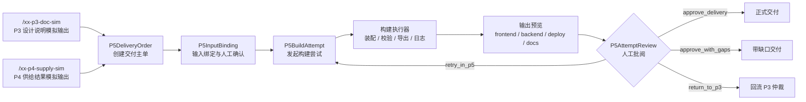

# P5.1 最小构建闭环设计

> 归档说明：本文件归档自 `docs/superpowers/specs/2026-04-20-p5-1-minimal-build-loop-design.md`，作为 `P5.1` 节点的正式专项设计入口。凡涉及 `P5.1` 的输入命名、订单模型、批阅模型、页面分区和最小后端服务边界，均以本文件为准。
>
> 维护规则：后续若在 `brainstorming / specs / plans` 中对 `P5.1` 的设计继续细化，必须在同一轮同步回写本文件；本文件优先于工作层文档，作为 `P5.1` 可评审口径的正式基线。

**日期：** 2026-04-20

**对应节点：**
- `P5.1` 最小构建闭环

**关联正式文档：**
- `DOC/CODEX_DOC/02_设计说明/07-P5-软件构建系统设计.md`
- `DOC/CODEX_DOC/02_设计说明/04-P3-软件设计系统设计.md`
- `DOC/CODEX_DOC/02_设计说明/05-P4-工具仓库设计.md`
- `DOC/CODEX_DOC/02_设计说明/06-P4-核心业务循环设计.md`
- `DOC/CODEX_DOC/02_设计说明/08-P4-Backend服务边界设计.md`

## 1. 设计定位

`P5` 总体设计不能替代 `P5.1` 节点专项设计。

`P5.1` 必须单独锁定以下内容：

- 最小闭环到底消费什么输入
- 页面到底由哪些工作区组成
- 订单、构建尝试、人工批阅、反馈任务如何流转
- `P3` 与 `P4` 的模拟输出在 `P5.1` 中分别叫什么、放在哪里

当前已有的演示工作台与 `bootstrap demo` 只能视为旧原型，不视为 `P5.1` 已完成的正式基线。

## 2. 目标与边界

`P5.1` 的目标不是“先把目录导出来”，而是形成一条可审查的最小交付闭环：

`P3` 冻结设计说明输入 -> `P4` 已供给结果输入 -> 创建 `P5` 交付主单 -> 绑定输入 -> 发起构建尝试 -> 形成导出结果 -> 人工批阅 -> 交付或回流

`P5.1` 首版必须同时具备：

- 前端独立工作台
- 后端交付主单服务
- 后端构建尝试服务
- 后端运行监控与日志查询
- 后端人工批阅与反馈任务服务
- `P3 / P4` 最小模拟输出接入

`P5.1` 首版不负责：

- 多执行器并行调度
- 全量真实代码生成
- 自动重试编排
- 完整回流追溯图谱

这些属于 `P5.2 / P5.3`。

## 3. 输入输出契约

### 3.1 `P3` 正式输入

`P5.1` 的 `P3` 主输入不是 `xx-p3-sim` 的工具包页面，而是 `P3` 冻结后的设计说明投影。

`P5.1` 首版至少消费以下 `P3` 信息：

- `p3_order_id`
- `requirement_spec_id`
- `software_design_description_id`
- `software_design_baseline_id`
- `application_name`
- `frozen_at`
- 模块摘要
- 设计约束摘要

这里必须明确：

- `/xx-p3-sim` 继续承担 `P3 -> P4` 的工具包 / 工单包模拟输入角色
- `P5.1` 不复用 `/xx-p3-sim` 充当“设计说明输入台”

### 3.2 `P4` 正式输入

`P5.1` 的 `P4` 输入是已审定、已可查询/可获取的供给结果快照。

最小输入语义至少包括：

- `supply_snapshot_id`
- `tool_demand_sheet_id`
- `reviewed_item_count`
- `supplied_result_refs`
- `unresolved_items`
- `reviewed_at`

### 3.3 `P5.1` 模拟输入命名

`P5.1` 首版新增两类专门模拟输入：

1. `/xx-p3-doc-sim`
   - 只负责模拟 `P3` 冻结设计说明输出
   - 不承担 `P3 -> P4` 工具包发单职责

2. `/xx-p4-supply-sim`
   - 只负责模拟 `P4` 已供给结果输出
   - 不承担 `P4` 内部审定和研制推进职责

命名约束固定如下：

- `/xx-p3-sim`：保留给 `P3 -> P4` 工具包 / 工单包输入链
- `/xx-p3-doc-sim`：专供 `P5.1` 消费 `P3` 设计说明模拟输出
- `/xx-p4-supply-sim`：专供 `P5.1` 消费 `P4` 供给结果模拟输出

### 3.4 `P5.1` 输出

`P5.1` 每次构建尝试至少输出三层结果：

1. 运行事实层
   - `P5BuildAttempt`
   - `P5AttemptReview`

2. 导出物层
   - `frontend/`
   - `backend/`
   - `deploy/`
   - `docs/`
   - `build-manifest.json`

3. 回流层
   - `P5FeedbackTask`
   - `gap-list.md`
   - `delivery-review.md`

## 4. 最小闭环总流程

## 5. 核心对象模型

### 5.1 `P5DeliveryOrder`

主单是 `P5.1` 的第一核心对象。

最小字段至少包括：

- `delivery_order_id`
- `p3_order_id`
- `requirement_spec_id`
- `application_name`
- `status`
- `input_binding_status`
- `latest_attempt_id`
- `review_status`
- `created_at`
- `updated_at`

最小状态至少包括：

- `binding_pending`
- `ready_for_build`
- `building`
- `review_pending`
- `delivered`
- `delivered_with_gaps`
- `returned_to_p3`
- `failed`

### 5.2 `P5InputBinding`

`P5.1` 不能跳过输入确认。

因此必须显式存在一个输入绑定对象，用于记录本次主单到底绑定了什么：

- `binding_id`
- `delivery_order_id`
- `p3_doc_source_kind`
- `p3_doc_source_id`
- `p4_supply_source_kind`
- `p4_supply_source_id`
- `confirmed_by`
- `confirmed_at`
- `binding_notes`

### 5.3 `P5BuildAttempt`

尝试单记录每一轮实际构建事实。

最小字段至少包括：

- `attempt_id`
- `delivery_order_id`
- `sequence`
- `status`
- `assembly_summary`
- `runtime_snapshot`
- `validation_summary`
- `export_root`
- `exported_files`
- `gap_summary`
- `created_at`
- `updated_at`

最小状态至少包括：

- `queued`
- `assembling`
- `validating`
- `exported`
- `review_pending`
- `retry_required`
- `returned_to_p3`
- `approved_delivery`
- `approved_with_gaps`
- `failed`

### 5.4 `P5AttemptReview`

`P5.1` 必须有人工批阅层，不能只有“导出完毕”。

最小字段至少包括：

- `review_id`
- `attempt_id`
- `decision`
- `reviewer`
- `review_comment`
- `created_feedback_task_ids`
- `created_at`

最小决策固定为：

- `approve_delivery`
- `approve_with_gaps`
- `retry_in_p5`
- `return_to_p3`

### 5.5 `P5FeedbackTask`

反馈任务是 `P5.1` 的正式输出之一。

最小字段至少包括：

- `task_id`
- `attempt_id`
- `kind`
- `title`
- `detail`
- `target_stage`
- `status`

其中 `kind` 至少包括：

- `design_gap`
- `supply_gap`
- `assembly_or_build_gap`

## 6. 页面级交互设计

### 6.1 页面入口与壳层

`P5.1` 正式入口固定为 `/build`。

页面必须采用独立工作台壳层，并满足：

- 不显示知识库主导航
- 不因切换工作区而跳离当前订单上下文
- 当前选中的主单、attempt、批阅结论在同一页面内可持续回看

### 6.2 页面区块

`P5.1` 首版页面固定为 6 个区块：

1. 交付主单队列区
2. 输入绑定与确认区
3. 装配流程主视图区
4. 构建运行与服务监控区
5. 输出结果预览区
6. 批阅与反馈区

### 6.3 关键交互

交付主单队列区至少支持：

- 查看主单列表
- 切换当前主单
- 查看该主单最近一次批阅结果

输入绑定与确认区至少支持：

- 绑定 `/xx-p3-doc-sim` 输出
- 绑定 `/xx-p4-supply-sim` 输出
- 显式确认本次输入组合

装配流程主视图区至少支持：

- 查看模块装配路径
- 区分已命中供给、占位装配、阻塞模块

构建运行与服务监控区至少支持：

- 查看执行阶段
- 查看最近日志
- 查看服务状态与阻塞原因

输出结果预览区至少支持：

- 查看导出目录结构
- 查看关键文件摘要
- 查看构建清单和缺口清单

批阅与反馈区至少支持：

- 做出 4 类批阅决策
- 录入批阅意见
- 生成回流任务

## 7. 后端最小服务设计

`P5.1` 首版至少需要以下服务接口族：

### 7.1 主单与输入绑定

- `POST /api/software-build/orders`
- `GET /api/software-build/orders`
- `GET /api/software-build/orders/{delivery_order_id}`
- `POST /api/software-build/orders/{delivery_order_id}/bindings`

### 7.2 构建尝试与运行监控

- `POST /api/software-build/orders/{delivery_order_id}/attempts`
- `GET /api/software-build/attempts/{attempt_id}`
- `GET /api/software-build/attempts/{attempt_id}/monitor`

### 7.3 人工批阅与反馈任务

- `POST /api/software-build/attempts/{attempt_id}/reviews`
- `GET /api/software-build/attempts/{attempt_id}/reviews`
- `GET /api/software-build/feedback-tasks`

### 7.4 模拟输入接入

- `POST /api/software-build/sim-inputs/p3-doc`
- `POST /api/software-build/sim-inputs/p4-supply`

禁止把用户主入口设计成单个 `bootstrap demo` 动作。

若保留开发辅助初始化接口，也只能作为开发便利能力，不得替代正式页面入口和正式状态流。

## 8. 验收口径

`P5.1` 只有同时满足以下条件，才算达到可评审状态：

1. 存在独立 `P5` 工作台 `/build`
2. 存在独立的 `/xx-p3-doc-sim` 与 `/xx-p4-supply-sim`
3. `P5` 页面显式存在主单、输入绑定、构建尝试、运行监控、输出预览、人工批阅 6 个区块
4. 后端存在主单、attempt、monitor、review、feedback 这 5 类最小服务能力
5. 批阅决策至少支持 `approve_delivery / approve_with_gaps / retry_in_p5 / return_to_p3`
6. 能从一组模拟输入形成一次可导出、可批阅、可回流的最小循环

## 9. 与后续节点的关系

- `P5.2` 在 `P5.1` 之上补执行器深化、重试、多轮对比、正式校验闭合
- `P5.3` 在 `P5.1` 之上补回流仲裁链、跨阶段追溯和反馈任务闭环

因此，`P5.3` 的缺口回流绝不能替代 `P5.1` 的订单、批阅和最小构建闭环。
