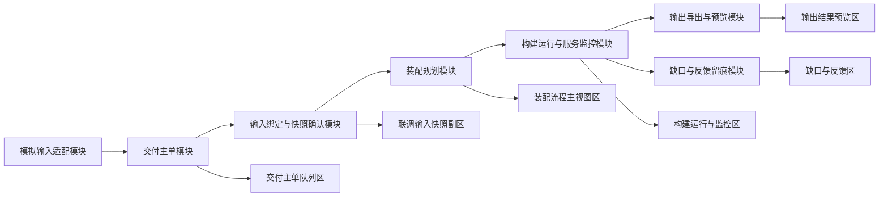

# P5.1 最小构建闭环设计

> 归档说明：本文件承接 `DOC/CODEX_DOC/02_设计说明/07-P5-软件构建系统设计.md` 中对 `P5.1` 的节点边界约束，作为 `P5.1` 最小构建闭环的正式详细设计入口。
>
> 维护规则：阶段共性规则、阶段级工作台风格和跨节点边界继续以 `07-P5` 为准；`P5.1` 的模块设计、页面区块映射、关键交互和节点级例外以本文件为准。若节点改动触及阶段边界或阶段风格，必须同步回写 `07-P5`。

**日期：** 2026-04-20

**对应节点：**

- `P5.1` 最小构建闭环
- `P5` 首版前后端最小联调入口

## 1. 节点目标

`P5.1` 的目标不是先做复杂回流，也不是先做完整真实构建，而是先建立一条订单驱动、输入可确认、运行可观察、结果可导出、缺口可留痕的最小闭环。

这条闭环固定为：

`冻结设计输入 -> 供给输入确认 -> 创建交付主单 -> 生成装配尝试 -> 运行模拟执行器 -> 导出版本目录 -> 产出缺口与反馈`

## 2. 节点范围与完成判定

### 2.1 本节点必须负责

- 接收一份冻结设计输入，并将其绑定到交付主单
- 接收一份 `P4` 已供给资产快照，或在模拟模式下显式记录“供给为空”
- 创建交付主单 (`Delivery Order`, `P5DeliveryOrder`)
- 创建装配尝试 (`Assembly Attempt`, `P5AssemblyAttempt`)
- 形成装配计划、运行快照、输出预览和缺口记录
- 在独立 `P5` 工作台中完成查看、切换、发起尝试和结果回看

### 2.2 本节点暂不负责

- 完整真实构建执行器编排
- 多运行单并发调度
- 页面内直接驱动 `P3 / P4` 回流修订
- 正式闭合级别的本地构建、部署和多环境验证

### 2.3 完成判定

`P5.1` 达到完成状态时，至少应满足：

- 可以创建并切换多张交付主单
- 每张主单都能看到当前输入绑定结果
- 可以基于当前绑定生成一次新的装配尝试
- 每次尝试都生成独立输出目录
- 页面能回看当前尝试的运行态、输出预览和缺口
- 缺口会生成待确认反馈任务，而不是静默吞掉

## 3. 输入输出契约

### 3.1 输入契约

`P5.1` 只接受以下四类输入：

1. 冻结设计输入
   - 正式来源：`P3` 冻结设计对象
   - 模拟来源：`xx/P3/DOC/sim`
2. 供给快照输入
   - 正式来源：`P4` 已审定 / 已供给资产结果
   - 模拟来源：`xx/P4/sim`
3. 构建导出配置
   - 导出根目录
   - 构建 profile
   - 尝试备注
4. 操作者触发动作
   - 选择主单
   - 确认输入绑定
   - 调整模块绑定
   - 发起构建尝试

### 3.2 输出契约

`P5.1` 至少输出以下正式对象与文件：

- `P5DeliveryOrder`
- `P5AssemblyAttempt`
- `P5AssemblyPlan`
- `P5RuntimeSnapshot`
- `P5OutputPreview`
- `P5GapRecord`
- `P5FeedbackTask`
- `build-manifest.json`
- `docs/delivery-report.md`
- `docs/gap-list.md`

### 3.3 输入异常处理

输入异常口径固定为：

- 没有冻结设计输入：不允许创建交付主单
- 没有供给快照输入：允许创建主单，但尝试结果必须显式进入占位与缺口模式
- 使用未审定资产：不允许作为绑定候选输入
- 导出根目录未提供：回退到系统默认导出根目录

## 4. 核心功能模块

核心功能模块负责“处理职责”，对象模型负责“数据契约”。二者不是一回事，不能混写。

### 4.1 交付主单模块

责任：

- 创建交付主单
- 列表展示与当前主单切换
- 维护当前主单状态、最新尝试和完成标记

消费输入：

- 冻结设计输入标识
- 操作者基础信息

产出对象：

- `P5DeliveryOrder`

### 4.2 输入绑定与快照确认模块

责任：

- 维护“当前主单消费哪份冻结设计输入、哪份供给快照输入”
- 在发起尝试前完成绑定确认
- 在尝试创建时把当前绑定冻结成该次 `input_snapshot`

消费输入：

- 当前 `delivery_order_id`
- 当前设计输入标识
- 当前供给快照标识

产出对象：

- `P5DeliveryOrder.active_input_binding`
- `P5AssemblyAttempt.input_snapshot`

### 4.3 装配规划模块

责任：

- 把冻结设计模块投影为装配计划
- 决定每个模块落入 `frontend / backend / deploy / docs` 的位置
- 标识已命中资产、占位模块和链路顺序

消费输入：

- 当前主单输入绑定
- 当前供给快照

产出对象：

- `P5AssemblyPlan`
- `P5AssemblyModule[]`

### 4.4 构建运行与服务监控模块

责任：

- 发起一次新的构建尝试
- 推进模拟执行器
- 记录运行阶段、日志、阻塞原因和完成状态

消费输入：

- 当前主单
- 当前装配计划
- 导出配置

产出对象：

- `P5AssemblyAttempt`
- `P5RuntimeSnapshot`

### 4.5 输出导出与预览模块

责任：

- 生成版本化导出目录
- 写出清单与说明文件
- 在页面中投影目录结构和关键文件状态

消费输入：

- 当前尝试
- 导出配置

产出对象：

- `P5OutputPreview`
- `build-manifest.json`
- `docs/delivery-report.md`
- `docs/gap-list.md`

### 4.6 缺口与反馈留痕模块

责任：

- 记录供给缺口、装配缺口和构建阻塞
- 生成默认待确认反馈任务
- 保证缺口、反馈和当前尝试一一对应

消费输入：

- 当前尝试的验证结果
- 当前运行阻塞与占位信息

产出对象：

- `P5GapRecord[]`
- `P5FeedbackTask[]`

### 4.7 模拟输入适配模块

责任：

- 在正式 `P3 / P4` 全链路未接通前，提供最小模拟输入装载能力
- 统一把模拟输入转成与正式输入同形的消费对象

消费输入：

- `xx/P3/DOC/sim`
- `xx/P4/sim`

产出对象：

- 冻结设计输入快照
- 供给快照输入

## 5. 核心对象模型与模块关系

### 5.1 关系原则

本节点正式固定以下关系：

- 模块负责处理职责
- 对象负责表达数据事实
- 页面区块负责展示模块处理后的投影

因此：

- `P5DeliveryOrder` 不是“交付主单模块”本身
- `P5AssemblyPlan` 不是“装配规划模块”本身
- 页面区块也不是对象模型本身

### 5.2 对象到模块映射

| 对象模型 | 中文语义 | 主负责模块 | 主要消费模块 |
| --- | --- | --- | --- |
| `P5DeliveryOrder` | 交付主单 | 交付主单模块 | 输入绑定模块、运行监控模块 |
| `P5AssemblyAttempt` | 装配尝试 | 构建运行与服务监控模块 | 输出导出模块、缺口反馈模块 |
| `P5AssemblyPlan` | 装配计划 | 装配规划模块 | 运行监控模块、输出导出模块 |
| `P5RuntimeSnapshot` | 运行快照 | 构建运行与服务监控模块 | 页面运行监控区 |
| `P5OutputPreview` | 输出预览 | 输出导出与预览模块 | 页面输出预览区 |
| `P5GapRecord` | 缺口记录 | 缺口与反馈留痕模块 | 页面缺口区、交付说明文件 |
| `P5FeedbackTask` | 反馈任务 | 缺口与反馈留痕模块 | 页面缺口区、后续 `P5.3` |

## 6. 模块关系图

## 7. 页面结构设计

### 7.1 首版布局

`P5.1` 页面采用“三栏一壳”的最小工作台布局：

- 左栏：交付主单队列区
- 中栏上半：装配流程主视图区
- 中栏下半：构建运行与监控区
- 右栏上半：联调输入快照副区
- 右栏中部：输出结果预览区
- 右栏下半：缺口与反馈区

页面顶部只保留工作台头部条，不允许再叠加门户式全站导航。

### 7.2 布局目标

该布局必须同时满足：

- 主单切换时可以看到整页联动
- 当前运行与当前输出可以同屏回看
- 输入绑定确认不会脱离当前主单上下文
- 缺口与反馈不会被隐藏到二级弹窗后面

## 8. 页面区块到模块映射

| 页面区块 | 对应模块 | 主要对象 | 主要交互 |
| --- | --- | --- | --- |
| 交付主单队列区 | 交付主单模块 | `P5DeliveryOrder` | 切换主单 |
| 联调输入快照副区 | 输入绑定与快照确认模块 | `active_input_binding`、`input_snapshot` | 查看绑定、确认输入 |
| 装配流程主视图区 | 装配规划模块 | `P5AssemblyPlan` | 调整模块资产绑定 |
| 构建运行与监控区 | 构建运行与服务监控模块 | `P5AssemblyAttempt`、`P5RuntimeSnapshot` | 发起构建尝试、查看日志 |
| 输出结果预览区 | 输出导出与预览模块 | `P5OutputPreview` | 查看目录、复制导出路径 |
| 缺口与反馈区 | 缺口与反馈留痕模块 | `P5GapRecord`、`P5FeedbackTask` | 查看缺口、查看反馈任务 |

## 9. 关键交互与数据影响

### 9.1 切换交付主单

可接受输入：

- 一个存在的 `delivery_order_id`

影响的数据层：

- 更新 `active_delivery_order_id`
- 同步切换 `active_input_binding`
- 默认切换到该主单最新一次 `attempt`
- 刷新装配计划、运行快照、输出预览和缺口列表

不可接受输入：

- 不存在的主单标识
- 当前主单外的陈旧 `attempt_id`

### 9.2 确认输入绑定

可接受输入：

- 一份冻结设计输入
- 一份已审定供给快照，或显式标记“供给为空”

影响的数据层：

- 写入 `P5DeliveryOrder.active_input_binding`
- 生成当前主单的“已确认绑定”状态
- 后续新尝试冻结该绑定到 `input_snapshot`

不可接受输入：

- 未冻结的 `P3` 设计草稿
- 未审定的 `P4` 资产
- 与当前主单来源不一致的输入标识

### 9.3 发起构建尝试

可接受输入：

- 当前主单
- 已确认输入绑定
- 导出配置

影响的数据层：

- 新建 `P5AssemblyAttempt`
- 冻结当前 `input_snapshot`
- 推进 `P5RuntimeSnapshot`
- 生成新的导出目录与说明文件
- 生成当前尝试的缺口与反馈任务

不可接受输入：

- 没有已确认输入绑定
- 上一次尝试仍处于不可重入状态且未显式重试

### 9.4 调整模块资产绑定

可接受输入：

- 当前装配计划中的 `module_id`
- 当前供给快照内的已审定资产

影响的数据层：

- 更新 `P5AssemblyPlan.modules[].binding_status`
- 更新 `bound_tool_id / bound_tool_name`
- 重新计算当前计划的缺口与待校验状态

不可接受输入：

- 不属于当前供给快照的资产
- 试图借绑定调整去改写模块语义

### 9.5 回看输出与缺口

可接受输入：

- 当前主单下的某个 `attempt_id`

影响的数据层：

- 输出预览区只展示该尝试目录
- 缺口与反馈区只展示该尝试结果
- 联调输入快照副区回看该尝试冻结时的输入

不可接受输入：

- 混用不同主单的尝试结果
- 把“最新运行态”和“历史输出结果”拼成同一展示上下文

## 10. 风格继承与节点例外

### 10.1 继承规则

`P5.1` 不单独定义一套新的阶段风格，默认继承以下正式基线：

- `DOC/CODEX_DOC/02_设计说明/02-P4-核心业务循环设计.md` 中固定的 `P4` 工作台视觉基线
- `DOC/CODEX_DOC/02_设计说明/07-P5-软件构建系统设计.md` 中固定的 `P5` 阶段级工作台视觉风格

### 10.2 节点例外

`P5.1` 只允许定义以下局部例外：

- 交付主单选中卡片可以使用更明确的选中边框和侧向强调条
- 运行日志区可以使用更低明度的中性子面板，但必须仍位于白色主卡片体系内
- 缺口卡片可以使用低饱和暖色提示面，不能升级为整页告警底色
- 输出目录预览区可使用等宽字和轻控制台风格，但不能演化成整页终端界面

## 11. 正式文档关系

本节点的正式文档关系固定为：

- 阶段级设计：`DOC/CODEX_DOC/02_设计说明/07-P5-软件构建系统设计.md`
- 阶段计划：`DOC/CODEX_DOC/03_研制计划/05-WBS-P5-软件构建系统-研制计划.md`
- 工作层节点设计：`docs/superpowers/specs/2026-04-20-p5-1-minimal-build-loop-design.md`

如果后续继续补充 `P5.1` 的页面区块、模块契约或关键交互，优先回写本文件；只有在确定会影响整个 `P5` 阶段边界或阶段风格时，才同时回写 `07-P5`。
