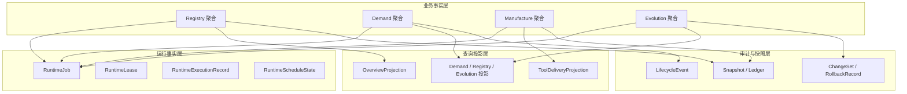
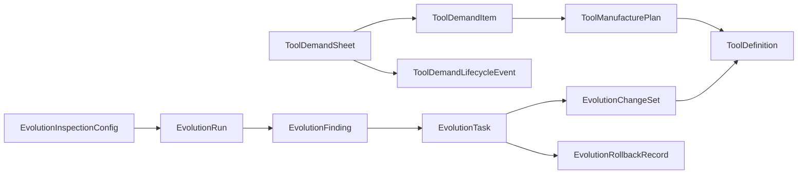
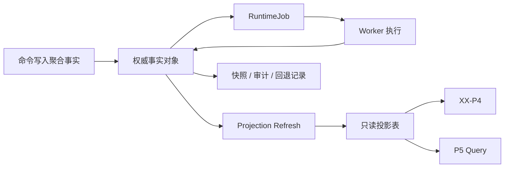

# P4 数据模型与投影模型设计

> 归档说明：本文件归档自 `docs/superpowers/specs/2026-04-18-p4-data-and-projection-model-design.md`，作为 `P4` 数据层与查询投影设计的正式引用入口之一。后续若工作层文档继续迭代，以本文件为正式归档基线。自 `2026-04-19` 起，本文件作为 `P4` 总体设计下的专题设计之一按逻辑顺序归位。

**日期：** 2026-04-18

**对应节点建议：**
- `P4`
- `P4.2`
- `P4.3`
- `P4.1.6` 统一数据层与同源快照验证

## 1. 设计目标

为未来独立的 `P4 backend service` 固定一套可扩展的数据模型，使其同时支撑：

- 工具资产管理
- 输入工序链闭环
- 自演进巡检闭环
- 后台运行调度
- 页面与外部系统的查询投影

本设计强调：

- 写模型与读模型分离
- 聚合事实与查询投影分离
- 审计、回退、快照和运行记录可追踪

## 2. 总体数据分层

推荐把 `P4` 数据固定为四层。

### 2.1 业务事实层

存放权威业务对象。

### 2.2 运行事实层

存放后台任务、租约、重试、执行记录。

### 2.3 查询投影层

存放面向页面和外部查询的只读视图。

### 2.4 审计与快照层

存放变更前后快照、回退记录、执行账本。

## 3. 业务事实模型

### 3.1 Tool Registry 聚合

#### `ToolDefinition`

核心字段建议包括：

- `tool_id`
- `slug`
- `name`
- `summary`
- `problem_statement`
- `primary_domain_id`
- `tool_form_id`
- `runtime_platform_ids`
- `lifecycle_stage_ids`
- `tags`
- `verification_status`
- `status`
- `created_at`
- `updated_at`
- `version`

说明：

- `version` 用于并发控制
- `status` 区分 `active / draft / archived`

### 3.2 Demand 聚合

#### `ToolDemandSheet`

建议核心字段：

- `sheet_id`
- `sheet_name`
- `source`
- `business_case`
- `lifecycle_status`
- `review_status`
- `delivery_status`
- `processing_status`
- `item_ids`
- `item_count`
- `submitted_at`
- `updated_at`
- `version`

#### `ToolDemandItem`

建议核心字段：

- `item_id`
- `sheet_id`
- `source_node_id`
- `ancestry`
- `component_name`
- `business_domain_id`
- `required_input_types`
- `expected_output_types`
- `preferred_tool_forms`
- `preferred_runtime_platforms`
- `recommendation_type`
- `recommended_tool_id`
- `review_status`
- `processing_status`
- `supply_result`
- `reviewed_by`
- `reviewed_at`
- `updated_at`
- `version`

### 3.3 Manufacture 聚合

#### `ToolManufacturePlan`

建议核心字段：

- `plan_id`
- `item_id`
- `sheet_id`
- `status`
- `simulation_profile`
- `estimated_ready_at`
- `started_at`
- `completed_at`
- `failure_reason`
- `result_tool_id`
- `updated_at`
- `version`

### 3.4 Evolution 聚合

#### `EvolutionInspectionConfig`

- `config_id`
- `enabled`
- `schedule_mode`
- `interval_minutes`
- `focus_rule_ids`
- `auto_apply_rule_ids`
- `overlap_threshold`
- `updated_by`
- `updated_at`
- `version`

#### `EvolutionRun`

- `run_id`
- `status`
- `trigger_type`
- `triggered_by`
- `snapshot_id`
- `summary`
- `created_at`
- `updated_at`
- `version`

#### `EvolutionFinding`

- `finding_id`
- `run_id`
- `rule_id`
- `severity`
- `title`
- `description`
- `affected_tool_ids`
- `decision_status`
- `decision_by`
- `decision_at`
- `linked_task_id`
- `created_at`
- `updated_at`
- `version`

#### `EvolutionTask`

- `task_id`
- `source_run_id`
- `source_finding_id`
- `task_type`
- `task_status`
- `planned_action`
- `target_tool_ids`
- `rollback_available`
- `result_summary`
- `created_by`
- `created_at`
- `updated_at`
- `version`

### 3.5 审计与回退聚合

#### `EvolutionChangeSet`

- `change_set_id`
- `task_id`
- `tool_id`
- `change_kind`
- `before_snapshot`
- `after_snapshot`
- `applied_at`
- `applied_by`

#### `EvolutionRollbackRecord`

- `rollback_id`
- `task_id`
- `change_set_ids`
- `rolled_back_by`
- `rolled_back_at`
- `rollback_summary`

#### `ToolDemandLifecycleEvent`

- `event_id`
- `sheet_id`
- `event_type`
- `actor_phase`
- `actor_id`
- `from_status`
- `to_status`
- `reason_code`
- `reason_message`
- `occurred_at`

## 4. 运行事实模型

当前实现只有 `EvolutionRuntimeState`，未来需要补齐标准运行对象。

### 4.1 `RuntimeJob`

用于统一承载后台任务。

### 4.2 `RuntimeLease`

用于记录任务租约。

### 4.3 `RuntimeExecutionRecord`

用于记录每次任务执行尝试。

### 4.4 `RuntimeScheduleState`

用于记录定时推进状态。

当前 `EvolutionRuntimeState` 可视为该层的初始雏形，未来应提升为公共运行态，而不是只服务于 `evolution`。

## 5. 查询投影模型

`P4` 页面与 `P5` 查询不能长期直接扫描权威事实对象，必须有显式只读投影。

### 5.1 总览投影

#### `OverviewProjection`

包含：

- 工具总数
- 已验证工具数
- 活跃工具链数
- 待研制数
- 巡检积压数
- 最近运行摘要
- 覆盖矩阵摘要

### 5.2 输入工序链投影

#### `DemandSheetListProjection`

用于列表页展示：

- 总单摘要
- 聚合状态
- 待审项数
- 待交付项数

#### `DemandSheetDetailProjection`

用于选中某张总单时展示：

- 树结构摘要
- 工具需求列表
- 当前选中项详情
- 审定结果
- 供给结果

#### `DemandItemProgressProjection`

给 `P5` 和 `XX-P4` 共用：

- 当前状态
- 预计完成时间
- 是否可获取
- 最近更新时间

### 5.3 工具仓库投影

#### `RegistryProjection`

包含：

- 工具列表
- 域分布
- 形态分布
- 平台分布
- 覆盖热力矩阵
- 模拟研制队列摘要

### 5.4 自演进巡检投影

#### `EvolutionWorkspaceProjection`

包含：

- 配置摘要
- 轮次列表
- 当前轮次摘要
- 发现项列表
- 队列任务
- 已完成优化项

### 5.5 P5 供给投影

#### `ToolDeliveryProjection`

包含：

- `sheet_id`
- `item_id`
- `delivery_status`
- `fetchable`
- `fetch_manifest`
- `estimated_ready_at`

## 6. 快照模型

当前已有 `ToolHubStateSnapshot`，它适合作为开发期统一快照和回归验证工具。

未来应把它定位为：

- 调试快照
- 诊断快照
- 投影一致性校验快照

而不是正式高并发查询的主数据来源。

推荐保留：

- `snapshot_id`
- `generated_at`
- `meta`
- `raw aggregate refs`
- `projection refs`

## 7. 存储建议

### 7.1 当前阶段

当前文件型目录已经按域初步分开：

- `tools`
- `demand_sheets`
- `demand_items`
- `manufacture_plans`
- `runs/evolution`
- `evolution/config`
- `evolution/tasks`
- `evolution/change_sets`
- `evolution/rollbacks`
- `runtime/state`

这适合作为验证基线。

### 7.2 未来正式形态

建议迁移到关系型数据库为主：

- `PostgreSQL` 承载权威事实
- `Redis` 或队列系统承载运行任务
- 大快照可进入对象存储

## 8. 数据库逻辑分表建议

### 8.1 Registry

- `tool_definition`
- `tool_verification`
- `tool_fetch_manifest`

### 8.2 Demand

- `tool_demand_sheet`
- `tool_demand_item`
- `tool_demand_lifecycle_event`

### 8.3 Manufacture

- `tool_manufacture_plan`
- `tool_manufacture_execution_log`

### 8.4 Evolution

- `evolution_config`
- `evolution_run`
- `evolution_finding`
- `evolution_task`
- `evolution_change_set`
- `evolution_rollback_record`

### 8.5 Runtime

- `runtime_job`
- `runtime_lease`
- `runtime_execution_record`

### 8.6 Projection

- `overview_projection`
- `demand_sheet_projection`
- `demand_item_progress_projection`
- `registry_projection`
- `evolution_workspace_projection`
- `tool_delivery_projection`

## 9. 版本与并发控制

所有核心聚合建议增加：

- `version`
- `updated_at`

更新时采用乐观锁原则：

- 读取版本
- 写入时检查版本
- 冲突则返回 `aggregate_conflict`

适用对象：

- `ToolDefinition`
- `ToolDemandSheet`
- `ToolDemandItem`
- `ToolManufacturePlan`
- `EvolutionRun`
- `EvolutionTask`
- `EvolutionInspectionConfig`

## 10. 审计、快照与回退

### 10.1 审计要求

关键动作必须能追溯：

- 谁操作
- 何时操作
- 从什么状态到什么状态
- 原因是什么

### 10.2 快照要求

对自动改写类动作必须保留：

- 修改前快照
- 修改后快照

### 10.3 回退要求

至少支持：

- 任务级回退
- 回退后重建投影

## 11. 投影刷新策略

推荐优先采用增量刷新：

- 工具变化 -> 刷新注册表投影、总览投影
- 工单变化 -> 刷新工单详情投影、进度投影、总览投影
- 演进任务变化 -> 刷新自演进工作区投影、总览投影

只有调试、重建或恢复场景，才触发全量快照重算。

## 12. 与 `P4.1.6` 的关系

`P4.1.6` 已经证明：

- 总览
- 输入工序链
- 自演进巡检
- 工具仓库

可以从同一份统一快照读取。

本设计在此基础上更进一步：

- 保留“统一事实源”原则
- 但把“统一快照”从主查询机制降级为校验和诊断机制
- 正式查询改为读专用投影

## 13. 迁移建议

### 13.1 第一阶段

- 保留现有事实对象
- 新增标准 `RuntimeJob`
- 新增显式投影对象

### 13.2 第二阶段

- 文件仓储迁移到数据库
- 保留 `snapshot_id` 做一致性校验

### 13.3 第三阶段

- 引入增量投影刷新
- 引入正式索引和归档策略

## 14. 验收标准

本设计完成后，应能明确回答：

- `P4` 的权威事实对象有哪些
- 哪些数据属于运行态，哪些属于查询投影
- 当前统一快照在未来系统中扮演什么角色
- 数据库分表和投影分层应该如何组织
- 自动改写与回退需要保留哪些数据
