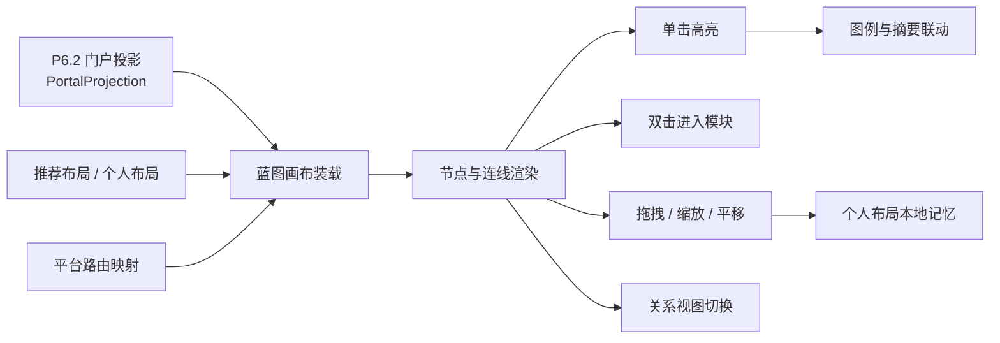
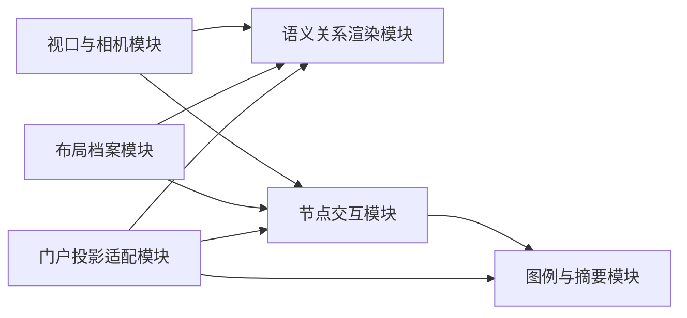
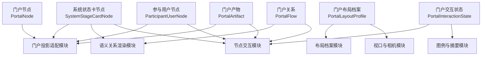
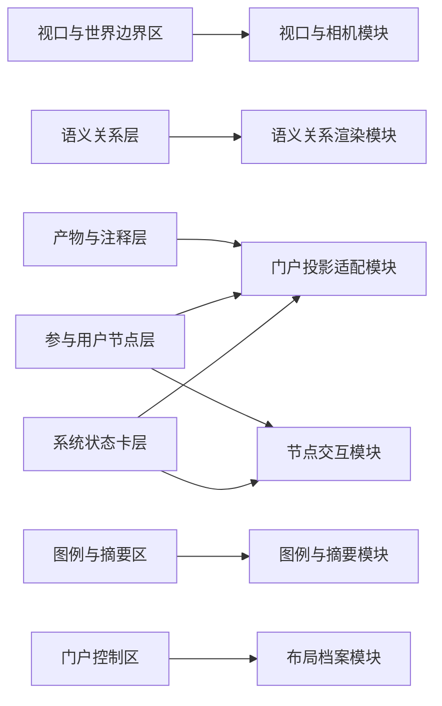

# P6.1 首屏观察门户设计

> 归档说明：本文件归档自 `docs/superpowers/specs/2026-04-17-portal-home-design.md` 与 `docs/superpowers/specs/2026-04-19-p6-detailed-subsystem-design.md`，作为 `P6.1` 节点的正式专项设计入口。凡涉及 `/portal` 的页面身份、投影输入、对象模型、布局模式、交互约束和最小支撑机制，均以本文件为准。
>
> 维护规则：后续若在 `P6.1` 的 `brainstorming / specs / plans` 中继续细化蓝图画布、节点交互或布局机制，必须在同一轮同步回写本文件；本文件优先于工作层文档，作为 `P6.1` 可评审口径的正式基线。

**日期：** 2026-04-20

**对应节点：**
- `P6.1` 首屏观察门户

**关联正式文档：**
- `DOC/CODEX_DOC/02_设计说明/10-P6-门户与平台入口设计.md`
- `DOC/CODEX_DOC/02_设计说明/12-P6.2-跨阶段只读集成与状态投影设计.md`
- `DOC/CODEX_DOC/02_设计说明/13-P6.3-设计语言与前端展示基线设计.md`
- `DOC/CODEX_DOC/02_设计说明/14-P6.4-前端展示工具化实验场设计.md`

## 1. 设计定位

`P6.1` 不是普通业务页，也不是“系统首页大卡片”。

`P6.1` 必须单独锁定以下内容：

- 平台首屏入口到底承载哪些稳定对象
- 门户到底消费什么投影数据
- 节点、关系、产物、图例和布局状态如何协同
- 单击、双击、拖拽、缩放和关系视图切换各自如何生效
- 推荐布局和个人布局的边界到底在哪里

`P6.1` 是 `P6` 稳定平台层中的首个正式实现对象，负责把 `P1 ~ P5` 的阶段关系、主数据流、阶段入口和运行摘要，以全屏蓝图画布的方式呈现给用户。

## 2. 目标与边界

`P6.1` 的目标不是造一个“能看见模块的首页”，而是形成一张可观察、可跳转、可维持结构语义的正式门户蓝图。

### 2.1 当前负责

- 独立路由 `/portal`
- 全屏、可拖拽、可缩放的蓝图画布
- `P1 ~ P5` 主节点、主链路、产物节点和平台摘要的统一表达
- 单击高亮、双击进入模块、关系视图切换
- 推荐布局与个人布局的显式切换
- 右下角图例与门户级说明

### 2.2 当前不负责

- 在门户页直接编辑业务数据
- 弹窗式摘要中心
- 登录与权限流程
- 多人协同编辑布局
- 对 `P1 ~ P5` 反写状态
- 任意增删系统主节点

### 2.3 门户硬约束

`P6.1` 首版固定遵守以下硬约束：

- 单击节点只做高亮，不打开遮挡主画布的详情弹窗
- 双击系统节点直接进入稳定模块路由
- 门户主节点固定为 `行业用户 + P1 ~ P5`
- 连线必须从锚点 / pin 出发，而不是从节点中心出发
- 个人布局只允许覆盖位置，不允许覆盖节点和关系语义

## 3. 输入输出契约

### 3.1 门户投影输入

`P6.1` 的主输入不是阶段私有接口，而是 `P6.2` 输出的 `PortalProjection`。

`P6.1` 首版至少消费以下输入：

- `node_list`
- `flow_list`
- `artifact_list`
- `portal_summary`
- `knowledge_context`
- `freshness`
- `degraded_reason`

### 3.2 节点显示输入

`P6.1` 的节点显示输入必须直接来自 `P6.2` 已固定的状态输出契约，而不是由前端页面临时决定。

系统状态卡节点统一至少消费以下显示字段：

- `headline_value`
- `summary_line`
- `metric_items`
- `entry_badge`
- `health_badge`
- `timestamp_label`
- `degraded_hint`

参与用户节点统一至少消费以下显示字段：

- `role_label`
- `title`
- `context_label`
- `interaction_hints`
- `availability_hint`

门户页可以决定这些字段如何排版，但不能改变它们的含义。

### 3.3 布局与视口输入

`P6.1` 首版至少具备以下布局与视口输入：

- `RecommendedLayoutProfile`
- `PersonalLayoutProfile`
- `viewport_state`
- `relationship_view_mode`
- `layout_mode`

其中：

- `RecommendedLayoutProfile` 由系统提供推荐世界坐标
- `PersonalLayoutProfile` 只覆盖节点位置和视口偏好

### 3.4 交互状态输出

`P6.1` 每次交互至少输出两层结果：

1. 当前门户交互状态
   - `selected_node_id`
   - `hovered_node_id`
   - `active_relationship_view`
   - `camera_state`
2. 当前路由跳转动作
   - `route_target`
   - `route_hint`
   - `route_available`

### 3.5 门户级展示输出

`P6.1` 每次稳定渲染至少形成以下展示输出：

1. 节点层输出
   - 系统状态卡节点
   - 参与用户节点
2. 关系层输出
   - 主生产链连线
   - 知识供给连线
   - 设计转化连线
   - 工具匹配连线
   - 构建执行连线
3. 摘要层输出
   - 图例
   - 当前知识库
   - 平台提示
   - 新鲜度和降级说明

## 4. 门户最小闭环总流程

## 5. 核心对象模型

对象模型回答的是“门户页中有哪些稳定事实对象、它们各自保存什么数据”。

它不等于页面模块设计，但必须锁定门户级对象边界。

### 5.1 门户节点（Portal Node / `PortalNode`）

门户节点是 `P6.1` 的第一核心对象。

最小字段至少包括：

- `node_id`
- `node_kind`
- `stage_id`
- `title`
- `summary`
- `status`
- `metrics`
- `route`
- `pins`
- `projection_mode`

对象关系约束固定如下：

- 系统节点、用户节点和产物节点都必须显式标注 `node_kind`
- 只有具备稳定路由的系统节点才允许双击进入模块

### 5.2 系统状态卡节点（System Stage Card Node / `SystemStageCardNode`）

系统状态卡节点是门户页中最主要的节点类型。

每个系统状态卡节点固定采用 5 层信息结构：

1. 顶部识别层
   - 阶段编号
   - 正式阶段名称
   - 入口可用性标记
2. 标题层
   - `headline_value`
   - 一行阶段摘要 `summary_line`
3. 状态层
   - `primary_status`
   - `freshness`
   - `degraded_hint`
4. 指标层
   - `metric_items`
   - 固定显示 2 到 4 个核心指标
5. 页脚层
   - `health_badge`
   - `timestamp_label`

系统状态卡节点的样式结构固定如下：

- 以矩形状态卡为主形态
- 宽度优先控制在 `260 ~ 320px`
- 高度优先控制在 `132 ~ 168px`
- 使用平台浅色卡面、细边框和阶段识别色强调条
- 保留 pin / 锚点可见性
- 不使用大面积英雄横幅式渐变

状态变化时的视觉行为固定如下：

- 默认态：清晰边框、轻阴影、指标可读
- 悬停态：边框和阴影轻度增强
- 选中态：外环强调、相关连线同步增强
- 降级态：显示降级提示，不隐藏节点
- 阻塞 / 异常态：通过状态标签和辅助描边表达，不改变卡片基本结构

### 5.3 五阶段系统节点差异字段

五个系统节点在门户页中不能只用一套完全同构的文案。

统一骨架相同，但各自必须突出不同的主信息：

| 阶段 | 标题下第一优先信息 | 指标层最少展示 | 页脚优先提示 |
| --- | --- | --- | --- |
| `P1` | 当前知识库名称、最新发布状态 | 已发布知识规模、来源文档规模 | 图谱入口、最近发布时间 |
| `P2` | 当前需求建模批次、规格状态 | 活跃需求数、已建模需求数 | 需求规格入口、最近分析时间 |
| `P3` | 当前设计单、冻结状态、评审状态 | 活跃设计单数、待评审数 | 软设入口、最近冻结 / 评审时间 |
| `P4` | 当前供给快照、需求单状态、演进状态 | 供给快照数、开放需求单数 | 工具仓入口、最近巡检 / 供给时间 |
| `P5` | 当前交付主单、最近尝试状态、缺口状态 | 活跃交付单数、待批阅尝试数 | 构建入口、最近交付 / 批阅时间 |

门户页必须保证：

- `P1 ~ P5` 的标题结构一致
- 差异信息只体现在状态卡内部字段，不体现在卡片骨架随意漂移
- `P4 / P5` 不得因为信息更复杂而无限加高节点卡

### 5.4 参与用户节点（Participant User Node / `ParticipantUserNode`）

参与用户节点不是缩小版系统状态卡，它是角色节点。

最小字段至少包括：

- `node_id`
- `role_label`
- `title`
- `context_label`
- `interaction_hints`
- `availability_hint`

参与用户节点固定显示以下信息：

- 角色身份，例如 `行业用户`
- 当前上下文，例如当前知识库或当前参与关系
- 2 到 3 条主要交互方向提示

参与用户节点固定不显示：

- 系统级 2x2 指标栅格
- 阶段级入口状态矩阵
- 多重系统状态标签堆叠

参与用户节点的样式结构固定如下：

- 视觉权重低于系统状态卡节点
- 体量优先控制在 `180 ~ 220px` 宽、`84 ~ 108px` 高
- 允许使用更圆角、更轻量的卡片或胶囊式形态
- 以角色标签和关系提示为主，不抢门户主链视觉中心
- 默认不承担系统模块跳转入口

### 5.5 门户关系（Portal Flow / `PortalFlow`）

门户关系记录节点之间的正式蓝图关系。

最小字段至少包括：

- `flow_id`
- `from_node_id`
- `to_node_id`
- `semantic_type`
- `direction`
- `from_pin`
- `to_pin`
- `render_tone`

对象关系约束固定如下：

- 每条关系都必须声明语义类型
- 连线几何计算必须依附锚点，而不是依附节点中心

### 5.6 门户产物（Portal Artifact / `PortalArtifact`）

门户产物用于承载阶段间流转的关键中间产物。

最小字段至少包括：

- `artifact_id`
- `artifact_kind`
- `title`
- `summary`
- `linked_node_ids`
- `source_mode`
- `render_tone`

对象关系约束固定如下：

- 产物节点必须显式声明其关联的系统节点集合
- 产物节点允许被高亮联动，但不允许独立篡改链路语义

### 5.7 门户布局档案（Portal Layout Profile / `PortalLayoutProfile`）

门户布局档案记录推荐布局和个人布局的正式边界。

最小字段至少包括：

- `profile_id`
- `profile_kind`
- `node_positions`
- `camera_state`
- `updated_at`

对象关系约束固定如下：

- `system` 布局是推荐布局来源
- `personal` 布局只允许覆盖位置和视口状态
- 两者切换时，不允许导致节点和关系语义变化

### 5.8 门户交互状态（Portal Interaction State / `PortalInteractionState`）

门户交互状态是页面级当前读写状态对象。

最小字段至少包括：

- `selected_node_id`
- `hovered_node_id`
- `layout_mode`
- `relationship_view_mode`
- `camera_state`
- `route_target`

对象关系约束固定如下：

- 交互状态只属于当前页面作用域
- 交互状态不回写 `PortalProjection` 的语义数据

## 6. 核心功能模块设计

模块设计回答的是“谁负责处理门户页的投影、布局、交互、连线和图例动作”。

### 6.1 模块清单

`P6.1` 首版固定拆成以下 6 个核心功能模块：

1. 门户投影适配模块（Portal Projection Adapter）
2. 视口与相机模块（Viewport and Camera）
3. 布局档案模块（Layout Profile Manager）
4. 语义关系渲染模块（Semantic Flow Renderer）
5. 节点交互模块（Node Interaction Controller）
6. 图例与摘要模块（Legend and Summary Presenter）

### 6.2 模块职责、输入和输出

| 模块 | 主要职责 | 可接受输入 | 产出输出 |
| --- | --- | --- | --- |
| 门户投影适配模块 | 把 `PortalProjection` 转成门户页可渲染节点、关系、产物集合 | `PortalProjection`、节点状态负载、路由映射 | `PortalNode`、`SystemStageCardNode`、`ParticipantUserNode`、`PortalFlow`、`PortalArtifact` |
| 视口与相机模块 | 维护世界坐标、平移、缩放和边界 | 视口尺寸、相机状态、拖拽动作 | 当前 `camera_state` |
| 布局档案模块 | 管理推荐布局与个人布局切换、恢复和保存 | 推荐布局、个人布局、节点拖拽结果 | `PortalLayoutProfile`、当前 `layout_mode` |
| 语义关系渲染模块 | 根据节点位置和锚点渲染语义连线与聚合摘要 | `PortalFlow`、节点位置、关系视图模式 | 连线路径、节点关系摘要 |
| 节点交互模块 | 处理单击高亮、双击跳转和悬停联动 | 节点事件、路由映射、交互状态 | `PortalInteractionState`、路由动作 |
| 图例与摘要模块 | 负责右下角图例、当前知识库、交互提示与降级提示 | 门户摘要、新鲜度、知识库上下文 | 图例内容、摘要内容 |

### 6.3 模块依赖关系图

## 7. 对象模型与模块设计关系

对象不是模块，模块也不是对象。

- 对象负责保存门户事实
- 模块负责消费门户事实、更新交互状态和推进渲染

### 7.1 对象归属映射

| 对象 | 主要归属模块 | 被哪些模块消费 |
| --- | --- | --- |
| `PortalNode` | 门户投影适配模块 | 系统状态卡节点、参与用户节点、节点交互模块 |
| `SystemStageCardNode` | 门户投影适配模块 | 语义关系渲染模块、节点交互模块、图例与摘要模块 |
| `ParticipantUserNode` | 门户投影适配模块 | 语义关系渲染模块、节点交互模块 |
| `PortalFlow` | 语义关系渲染模块 | 节点交互模块、图例与摘要模块 |
| `PortalArtifact` | 门户投影适配模块 | 节点交互模块、图例与摘要模块 |
| `PortalLayoutProfile` | 布局档案模块 | 视口与相机模块、语义关系渲染模块 |
| `PortalInteractionState` | 节点交互模块 | 图例与摘要模块、布局档案模块 |

### 7.2 对象与模块关系图

## 8. 数据来源、作用域与切换规则

### 8.1 三层数据作用域

`/portal` 页面固定区分三层数据：

1. 门户全局参考层
   - 当前 `PortalProjection`
   - 当前系统状态卡节点集合
   - 当前参与用户节点集合
   - 路由映射
   - 推荐布局
   - 图例配置与状态字典
2. 当前门户交互作用域层
   - 当前选中节点
   - 当前悬停节点
   - 当前关系视图模式
   - 当前相机状态
3. 个人布局作用域层
   - 个人节点位置
   - 个人相机偏好
   - 当前布局模式

### 8.2 切换布局模式时的替换规则

当 `layout_mode` 被切换时，必须整体替换以下数据：

- 当前节点位置集合
- 当前相机状态
- 当前布局来源标记

以下数据不应因为切换布局模式而丢失：

- `PortalProjection` 本身
- 路由映射
- 关系语义
- 图例和摘要配置

### 8.3 切换关系视图时的替换规则

当 `relationship_view_mode` 在“语义线”和“投影聚合”之间切换时：

- 应替换关系层表达方式
- 应替换节点关系摘要
- 不应改变底层 `PortalFlow` 语义
- 不应影响节点跳转路由

### 8.4 单击、双击与拖拽对数据层的影响

单击节点至少会写入：

- `selected_node_id`
- 相关连线和产物的强调状态

双击节点至少会写入：

- `route_target`
- `route_available`

拖拽节点至少会写入：

- 当前节点新位置
- 个人布局档案的更新版本

## 9. 页面级交互设计与模块映射

### 9.1 页面入口与壳层

`P6.1` 正式入口固定为 `/portal`。

页面必须采用独立工作台壳层，并满足：

- 不显示普通业务导航壳层
- 不依赖顶部大表头解释页面身份
- 当前选中的节点、关系视图和布局模式在同一页内可持续回看

### 9.2 风格继承与节点例外

`P6.1` 不单独定义整套平台风格。

本节点只负责记录两件事：

1. 继承 `P6.3` 的平台级设计语言
2. 说明门户页相对平台通用基线的局部例外

`P6.1` 的局部例外固定为：

- 全屏蓝图画布
- 世界坐标、网格和 pin 语言
- 右下角低干扰图例
- 连线流动感和轻量脉冲表达

### 9.3 页面区块

`P6.1` 首版页面固定为 7 个区块：

1. 视口与世界边界区
2. 语义关系层
3. 系统状态卡层
4. 参与用户节点层
5. 产物与注释层
6. 图例与摘要区
7. 门户控制区

### 9.4 页面区块到模块映射

| 页面区块 | 对应模块 | 读取数据 | 写入数据 | 会影响的后续模块 |
| --- | --- | --- | --- | --- |
| 视口与世界边界区 | 视口与相机模块 | 世界尺寸、相机状态 | 当前 `camera_state` | 语义关系渲染模块、节点交互模块 |
| 语义关系层 | 语义关系渲染模块 | `PortalFlow`、节点位置、关系视图模式 | 当前连线表达状态 | 图例与摘要模块 |
| 系统状态卡层 | 门户投影适配模块 + 节点交互模块 | `SystemStageCardNode`、路由映射、布局位置 | 当前节点交互状态 | 图例与摘要模块、布局档案模块 |
| 参与用户节点层 | 门户投影适配模块 + 节点交互模块 | `ParticipantUserNode`、布局位置 | 当前用户节点交互状态 | 语义关系渲染模块 |
| 产物与注释层 | 门户投影适配模块 | `PortalArtifact`、门户摘要 | 当前产物强调状态 | 图例与摘要模块 |
| 图例与摘要区 | 图例与摘要模块 | 当前知识库、门户摘要、新鲜度 | 无直接写入 | 无 |
| 门户控制区 | 布局档案模块 | 布局模式、关系视图模式、个人布局状态 | 布局模式切换、恢复动作 | 视口与相机模块、语义关系渲染模块 |

### 9.5 页面-模块关系图

### 9.6 关键交互

系统状态卡层至少支持：

- 单击高亮节点
- 双击进入模块
- 悬停联动关系与产物

参与用户节点层至少支持：

- 查看角色身份和当前上下文
- 通过悬停理解其与主链节点的关系
- 保持低干扰，不与系统状态卡争主位

门户控制区至少支持：

- 推荐布局与个人布局切换
- 关系视图切换
- 恢复推荐布局

视口与世界边界区至少支持：

- 画布平移
- 画布缩放
- 边界约束和最小留白约束

## 10. 最小支撑服务与机制设计

`P6.1` 首版至少需要以下查询接口与支撑机制：

### 10.1 门户投影查询

- `GET /api/platform-read/portal-projection`
- `GET /api/platform-read/stage-snapshots`

### 10.2 路由与摘要查询

- `GET /api/platform-config/routes`
- `GET /api/platform-config/legend`

### 10.3 推荐布局与个人布局机制

`P6.1` 首版允许采用以下双轨机制：

- 推荐布局由系统配置提供
- 个人布局通过本地存储记录

硬约束固定如下：

- 个人布局不得替代推荐布局成为语义真相来源
- 清除个人布局后，必须可恢复到推荐布局

### 10.4 门户级降级与空态机制

当 `PortalProjection` 暂时不可用时：

- 页面仍保留门户壳层和图例位置
- 以“数据暂不可用”替代静默空白
- 不允许退化成普通业务卡片首页

## 11. 验收口径

`P6.1` 只有同时满足以下条件，才算达到可评审状态：

1. `/portal` 打开后直接进入全屏蓝图画布。
2. 页面不再依赖顶部大表头解释页面身份。
3. 单击节点只高亮，不再弹窗。
4. 双击节点可直接进入对应稳定模块。
5. 连线始终从锚点 / pin 出发，并在缩放、拖拽后保持对齐。
6. 推荐布局与个人布局的边界清晰，不发生语义混改。
7. 图例固定在右下角，且不与业务主节点争抢视觉中心。
8. 关系视图切换只改变展示方式，不改变底层关系语义。

## 12. 与后续节点的关系

- `P6.2` 为 `P6.1` 提供正式门户投影和阶段快照
- `P6.3` 为 `P6.1` 提供命名、状态和展示基元基线
- `P6.4` 以 `P6.1` 作为展示实验的主要承载页面之一

因此，`P6.1` 不能越权去承担 `P6.2` 的读侧聚合职责，也不能越权去冻结 `P6.4` 的实验结论。

## 13. 风格继承与节点例外

`P6.1` 默认继承以下正式基线：

- `DOC/CODEX_DOC/02_设计说明/13-P6.3-设计语言与前端展示基线设计.md`
- `DOC/CODEX_DOC/02_设计说明/10-P6-门户与平台入口设计.md` 中对平台层的页面约束

`P6.1` 只允许定义以下节点级例外：

- 系统主节点可以使用更明确的阶段识别色和 pin 标记
- 用户节点和产物节点可以采用更低干扰的形态，不与系统节点争主位
- 图例可以使用低饱和说明性卡片，不升级为视觉中心横幅

## 14. 正式文档关系

本节点的正式文档关系固定为：

- 阶段级总体设计：`DOC/CODEX_DOC/02_设计说明/10-P6-门户与平台入口设计.md`
- 读侧投影设计：`DOC/CODEX_DOC/02_设计说明/12-P6.2-跨阶段只读集成与状态投影设计.md`
- 展示基线设计：`DOC/CODEX_DOC/02_设计说明/13-P6.3-设计语言与前端展示基线设计.md`
- 展示实验设计：`DOC/CODEX_DOC/02_设计说明/14-P6.4-前端展示工具化实验场设计.md`
- 工作层设计：`docs/superpowers/specs/2026-04-17-portal-home-design.md`

如果后续继续补充蓝图画布、门户节点、布局模式或关键交互，优先回写本文件；只有在确定会影响整个 `P6` 阶段定位或总作用域时，才同时回写 `10-P6` 总体设计。
