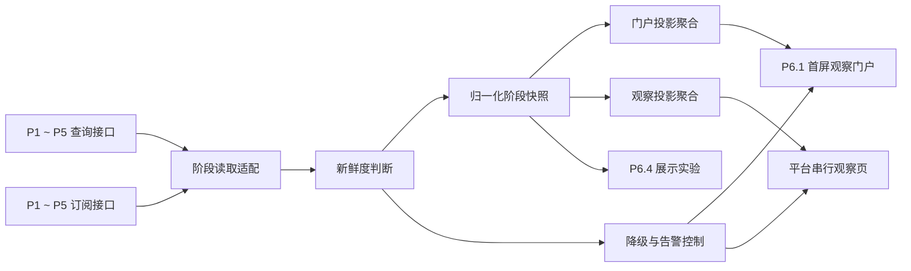
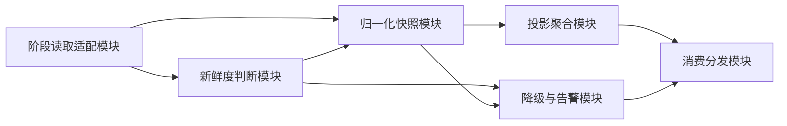
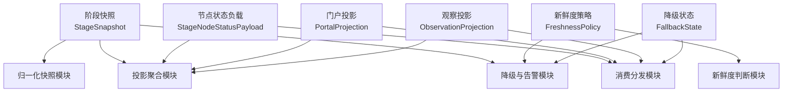
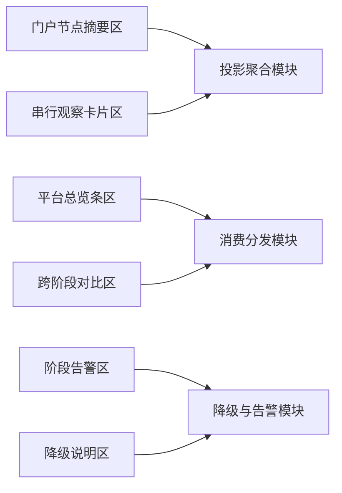

# P6.2 跨阶段只读集成与状态投影设计

> 归档说明：本文件归档自 `docs/superpowers/specs/2026-04-19-p6-detailed-subsystem-design.md`，作为 `P6.2` 节点的正式专项设计入口。凡涉及 `P1 ~ P5 -> P6` 的读侧契约、归一化对象、聚合模块、新鲜度规则、降级机制和消费边界，均以本文件为准。
>
> 维护规则：后续若在 `P6.2` 的 `brainstorming / specs / plans` 中继续细化查询接口、订阅接口、投影对象或降级机制，必须在同一轮同步回写本文件；本文件优先于工作层文档，作为 `P6.2` 可评审口径的正式基线。

**日期：** 2026-04-20

**对应节点：**
- `P6.2` 跨阶段只读集成与状态投影

**关联正式文档：**
- `DOC/CODEX_DOC/02_设计说明/10-P6-门户与平台入口设计.md`
- `DOC/CODEX_DOC/02_设计说明/11-P6.1-首屏观察门户设计.md`
- `DOC/CODEX_DOC/02_设计说明/13-P6.3-设计语言与前端展示基线设计.md`
- `DOC/CODEX_DOC/02_设计说明/14-P6.4-前端展示工具化实验场设计.md`

## 1. 设计定位

`P6.2` 不是一个页面功能，也不是一个“方便读取各阶段数据”的临时中转层。

`P6.2` 必须单独锁定以下内容：

- `P1 ~ P5` 面向 `P6` 的正式读接口边界
- 门户页和观察页到底消费什么平台级投影对象
- 数据来源、新鲜度、降级和对比视角如何统一表达
- 读侧模块如何协同，而不是各页面各自抓取阶段数据

`P6.2` 是 `P6` 稳定平台层的读侧集成底座，负责把 `P1 ~ P5` 的阶段状态、入口状态、核心指标和摘要信息，收敛为平台可消费的统一投影。

## 2. 目标与边界

`P6.2` 的目标不是“把各阶段接口串起来”，而是形成一条可审查、可降级、可复用的跨阶段只读投影链。

### 2.1 当前负责

- 收敛 `P1 ~ P5 -> P6` 的最小查询接口
- 逐步补入统一订阅接口
- 归一化阶段快照、门户投影和观察投影
- 标注来源、新鲜度、降级原因和告警摘要
- 为 `P6.1`、串行观察页和 `P6.4` 提供统一读模型

### 2.2 当前不负责

- 写入 `P1 ~ P5` 内部事实对象
- 触发阶段命令
- 修改阶段语义
- 直接读取阶段内部数据库
- 直接抓取页面私有状态
- 把临时脚本输出当正式接口交给平台消费

### 2.3 读侧硬约束

`P6.2` 首版固定遵守以下硬约束：

- 页面必须消费归一化投影，而不是阶段私有结构
- 接口不可用时允许降级，但不允许静默伪装“有数据”
- 订阅接口可后补，但查询接口是首版硬要求
- 阶段对外只暴露读侧成果，不暴露内部实现细节

## 3. 输入输出契约

### 3.1 查询接口输入

每个阶段至少需要提供以下查询对象：

- `StageOverview`
- `StageEntryProjection`
- `StageMetricProjection`
- `StageHealthProjection`

推荐最小字段如下：

| 对象 | 最小字段 |
| --- | --- |
| `StageOverview` | `stage_id`、`stage_name`、`summary`、`status`、`updated_at` |
| `StageEntryProjection` | `route`、`available`、`reason` |
| `StageMetricProjection` | `key`、`label`、`value`、`trend` |
| `StageHealthProjection` | `level`、`message`、`source`、`captured_at` |

### 3.2 五阶段状态输出契约

`P6.2` 必须明确区分两层职责：

1. 阶段侧职责
   - `P1 ~ P5` 各自负责生产正式状态事实
   - 阶段字段语义、状态来源和更新时间由各阶段自己的正式读接口负责
2. 平台侧职责
   - `P6.2` 负责固定平台消费这些状态事实时的最小必需字段
   - `P6.2` 负责把阶段事实映射成 `StageSnapshot` 和门户节点状态负载

因此，状态输出接口的“事实来源”不应配置在 `P6.1` 页面里，也不应由门户页临时拼字段；但“平台至少消费哪些字段、怎样映射成门户节点状态卡”必须在 `P6.2` 明确固定。

平台统一骨架字段固定为：

- `stage_id`
- `stage_name`
- `primary_status`
- `summary`
- `entry_route`
- `entry_available`
- `updated_at`
- `freshness`
- `health_level`

五阶段差异字段固定如下：

| 阶段 | 门户节点必须展示的差异信息 | 最少核心指标 | 页脚 / 辅助信息 |
| --- | --- | --- | --- |
| `P1` | 当前知识库名称、最新发布状态 | `published_knowledge_count`、`source_document_count` | 图谱入口可用性、最近发布时间 |
| `P2` | 当前需求建模批次、规格状态 | `active_requirement_count`、`modeled_requirement_count` | 需求规格入口、最近分析更新时间 |
| `P3` | 当前设计单、冻结状态、评审状态 | `active_design_order_count`、`review_pending_count` | 软设入口、最近冻结或评审时间 |
| `P4` | 当前供给快照、需求单状态、演进状态 | `active_supply_snapshot_count`、`tool_demand_open_count` | 工具仓入口、最近巡检 / 供给时间 |
| `P5` | 当前交付主单、最近尝试状态、缺口状态 | `active_delivery_order_count`、`review_pending_attempt_count` | 构建入口、最近交付 / 批阅时间 |

为保证门户节点可实施，`P6.2` 还必须对每个阶段输出一个统一的节点状态负载：

- `headline_value`
- `summary_line`
- `metric_items`
- `entry_badge`
- `health_badge`
- `timestamp_label`

这些字段属于平台消费契约，允许从各阶段事实字段映射得到，但不允许由门户页自行捏造。

### 3.3 订阅接口输入

当阶段具备订阅能力时，推荐输出统一事件包络：

- `event_type`
- `stage_id`
- `timestamp`
- `payload`
- `source`

事件类型首版建议固定为：

- `stage_status_changed`
- `metrics_changed`
- `health_changed`
- `entry_changed`
- `alert_created`

### 3.4 归一化投影输出

`P6.2` 首版至少输出以下归一化对象：

1. `StageSnapshot`
2. `PortalProjection`
3. `ObservationProjection`

这些对象必须同时携带：

- `freshness`
- `captured_at`
- `projection_at`
- `degraded_reason`

### 3.5 降级与告警输出

当任一阶段读接口不可用时，`P6.2` 至少输出：

- `FallbackState`
- `alert_summary`
- `last_stable_snapshot_ref`

平台消费方必须能区分以下情况：

- `无数据`
- `数据暂不可用`
- `过期快照`

## 4. 最小读侧闭环总流程

## 5. 核心对象模型

对象模型回答的是“`P6.2` 中有哪些稳定的读侧事实对象、它们各自保存什么数据”。

### 5.1 阶段快照（Stage Snapshot / `StageSnapshot`）

`StageSnapshot` 是 `P6.2` 的第一核心对象。

最小字段至少包括：

- `snapshot_id`
- `stage_id`
- `stage_name`
- `summary`
- `status`
- `entry_projection`
- `metric_list`
- `health_projection`
- `captured_at`
- `projection_at`
- `freshness`

对象关系约束固定如下：

- 每个阶段在任一平台稳定时刻应存在 1 个当前快照
- 门户页和观察页都只消费当前快照的归一化结果

### 5.2 节点状态负载（Stage Node Status Payload / `StageNodeStatusPayload`）

`StageNodeStatusPayload` 是平台投影层面向门户节点状态卡的统一负载对象。

最小字段至少包括：

- `stage_id`
- `headline_value`
- `summary_line`
- `metric_items`
- `entry_badge`
- `health_badge`
- `timestamp_label`
- `degraded_hint`

对象关系约束固定如下：

- 每个阶段当前稳定快照都必须可映射为 1 个节点状态负载
- 节点状态负载服务于门户节点显示，不直接替代阶段快照

### 5.3 门户投影（Portal Projection / `PortalProjection`）

`PortalProjection` 是 `P6.1` 门户页的正式输入对象。

最小字段至少包括：

- `node_list`
- `flow_list`
- `artifact_list`
- `portal_summary`
- `knowledge_context`
- `freshness`
- `degraded_reason`

对象关系约束固定如下：

- `PortalProjection` 由多个 `StageSnapshot` 聚合生成
- 门户页不得自行绕过该对象去读阶段接口

### 5.4 观察投影（Observation Projection / `ObservationProjection`）

`ObservationProjection` 是平台串行观察面的正式输入对象。

最小字段至少包括：

- `stage_cards`
- `comparison_items`
- `alert_summary`
- `route_actions`
- `focus_stage_id`
- `freshness`

对象关系约束固定如下：

- 观察投影服务于顺序观察和跨阶段比对
- 它与门户投影共用上游快照，但不共用页面结构

### 5.5 新鲜度策略（Freshness Policy / `FreshnessPolicy`）

`FreshnessPolicy` 负责描述当前投影的新鲜度评估规则。

最小字段至少包括：

- `policy_id`
- `stale_after_ms`
- `allowed_fallback`
- `warning_threshold_ms`
- `critical_threshold_ms`

对象关系约束固定如下：

- 每类投影对象都必须绑定明确的新鲜度策略
- 新鲜度判断不得由页面临时决定

### 5.6 降级状态（Fallback State / `FallbackState`）

`FallbackState` 记录阶段接口异常时的平台降级事实。

最小字段至少包括：

- `fallback_id`
- `stage_id`
- `fallback_level`
- `reason`
- `last_stable_snapshot_ref`
- `created_at`

对象关系约束固定如下：

- 降级状态属于读侧事实，不属于页面临时文案
- 平台消费方必须能直接读取该对象

## 6. 核心功能模块设计

模块设计回答的是“谁负责读取、判断新鲜度、归一化、聚合和分发投影”。

### 6.1 模块清单

`P6.2` 首版固定拆成以下 6 个核心功能模块：

1. 阶段读取适配模块（Stage Reader Adapter）
2. 新鲜度判断模块（Freshness Evaluator）
3. 归一化快照模块（Snapshot Normalizer）
4. 投影聚合模块（Projection Aggregator）
5. 降级与告警模块（Fallback and Alert Controller）
6. 消费分发模块（Consumer Dispatcher）

### 6.2 模块职责、输入和输出

| 模块 | 主要职责 | 可接受输入 | 产出输出 |
| --- | --- | --- | --- |
| 阶段读取适配模块 | 面向 `P1 ~ P5` 执行标准查询和订阅适配 | 阶段读接口、阶段配置 | 阶段原始读结果 |
| 新鲜度判断模块 | 根据时间戳和策略判定数据是新鲜、过期还是未知 | 原始读结果、`FreshnessPolicy` | 新鲜度判定结果 |
| 归一化快照模块 | 把各阶段结果统一转成 `StageSnapshot` | 原始读结果、新鲜度结果 | `StageSnapshot` |
| 投影聚合模块 | 聚合节点状态负载、门户投影和观察投影 | `StageSnapshot`、聚合规则 | `StageNodeStatusPayload`、`PortalProjection`、`ObservationProjection` |
| 降级与告警模块 | 记录降级、过期快照、接口异常和告警摘要 | 新鲜度结果、快照结果、接口错误 | `FallbackState`、`alert_summary` |
| 消费分发模块 | 把投影对象分发给门户页、观察页和实验页 | 投影对象、降级状态、消费配置 | 页面级读模型输出 |

### 6.3 模块依赖关系图

## 7. 对象模型与模块设计关系

对象不是模块，模块也不是对象。

- 对象负责保存读侧事实
- 模块负责读取、归一化、聚合和分发这些事实

### 7.1 对象归属映射

| 对象 | 主要归属模块 | 被哪些模块消费 |
| --- | --- | --- |
| `StageSnapshot` | 归一化快照模块 | 投影聚合模块、降级与告警模块、消费分发模块 |
| `StageNodeStatusPayload` | 投影聚合模块 | 消费分发模块、`P6.1` 门户节点适配 |
| `PortalProjection` | 投影聚合模块 | 消费分发模块 |
| `ObservationProjection` | 投影聚合模块 | 消费分发模块 |
| `FreshnessPolicy` | 新鲜度判断模块 | 归一化快照模块、降级与告警模块 |
| `FallbackState` | 降级与告警模块 | 消费分发模块 |

### 7.2 对象与模块关系图

## 8. 数据来源、作用域与切换规则

### 8.1 三层读侧作用域

`P6.2` 首版固定区分三层读侧作用域：

1. 阶段全局参考层
   - `P1 ~ P5` 原始查询结果
   - 订阅事件
   - 新鲜度策略
2. 当前平台投影作用域层
   - 当前 `StageSnapshot` 集合
   - 当前 `StageNodeStatusPayload` 集合
   - 当前 `PortalProjection`
   - 当前 `ObservationProjection`
   - 当前 `alert_summary`
3. 当前聚焦 / 对比作用域层
   - `focus_stage_id`
   - 当前对比项
   - 当前降级说明

### 8.2 切换平台聚焦阶段时的替换规则

当 `focus_stage_id` 被切换时，必须整体替换以下数据：

- 当前聚焦阶段卡片
- 当前对比项
- 当前阶段告警摘要
- 当前入口跳转提示

以下数据不应因为切换聚焦阶段而丢失：

- 各阶段当前稳定快照
- 门户投影
- 新鲜度策略
- 全局告警与接口可用性状态

### 8.3 新鲜度判断对数据层的影响

新鲜度判断至少会影响以下读侧结果：

- 标记投影是 `fresh / stale / unknown`
- 触发是否允许回退到上次稳定快照
- 触发是否生成降级与告警摘要

页面不得自行覆盖这些判断结果。

### 8.4 降级与对比视图对数据层的影响

当某阶段进入降级状态时：

- 门户页仍展示该阶段节点，但必须明确标识“数据暂不可用”或“过期”
- 观察页仍保留该阶段卡片位置，但必须显式展示降级说明
- 对比视图允许继续展示上次稳定快照，但必须明确来源时间

## 9. 页面级交互设计与模块映射

### 9.1 消费页面与承载壳层

`P6.2` 当前直接服务以下消费承载面：

- `P6.1` 首屏观察门户
- 平台串行观察页
- 平台总览条与摘要卡
- `P6.4` 展示实验预览面

这些承载面必须满足：

- 只消费平台投影，不直接读取阶段私有结构
- 在降级时显示明确提示，不静默消失
- 在对比视图中维持阶段顺序稳定

### 9.2 展示继承与节点例外

`P6.2` 不定义新的平台视觉风格，但要固定其展示继承规则：

1. 状态文案、状态色和降级提示必须继承 `P6.3`
2. 门户页、观察页和实验页允许根据页面类型采用不同布局表达

当前例外固定为：

- 门户页以节点和连线承载快照摘要
- 观察页以卡片链和比对条承载快照摘要
- 实验页以绑定预览卡承载快照摘要

### 9.3 平台消费区块

`P6.2` 首版直接支撑以下 6 类消费区块：

1. 门户节点摘要区
2. 串行观察卡片区
3. 平台总览条区
4. 阶段告警区
5. 降级说明区
6. 跨阶段对比区

### 9.4 消费区块到模块映射

| 消费区块 | 对应模块 | 读取数据 | 写入数据 | 会影响的后续模块 |
| --- | --- | --- | --- | --- |
| 门户节点摘要区 | 投影聚合模块 | `StageNodeStatusPayload`、`PortalProjection` | 无直接写入 | 消费分发模块 |
| 串行观察卡片区 | 投影聚合模块 | `ObservationProjection` | 当前聚焦阶段 | 消费分发模块 |
| 平台总览条区 | 消费分发模块 | `StageSnapshot`、总览指标 | 无直接写入 | 无 |
| 阶段告警区 | 降级与告警模块 | 告警摘要、健康度、接口错误 | 告警查看状态 | 消费分发模块 |
| 降级说明区 | 降级与告警模块 | `FallbackState`、上次稳定快照引用 | 无直接写入 | 消费分发模块 |
| 跨阶段对比区 | 消费分发模块 | 当前对比项、快照集合 | 当前对比视角 | 投影聚合模块 |

### 9.5 页面-模块关系图

### 9.6 关键交互

消费侧至少支持：

- 查看阶段总览和入口可用性
- 切换聚焦阶段
- 查看告警与降级说明
- 在门户和观察页之间共享统一快照语义
- 在实验页中复用相同的读侧投影

## 10. 最小支撑服务与机制设计

`P6.2` 首版至少需要以下读侧接口与机制：

### 10.1 阶段读取注册机制

必须维护统一的阶段读取注册表，至少记录：

- `stage_id`
- `query_adapter`
- `subscription_adapter`
- `freshness_policy_ref`

### 10.2 平台投影查询接口

- `GET /api/platform-read/stage-snapshots`
- `GET /api/platform-read/portal-projection`
- `GET /api/platform-read/observation-projection`
- `GET /api/platform-read/alerts`

### 10.3 订阅与快照缓存机制

当阶段具备订阅能力时，允许采用：

- 统一事件通道
- 当前稳定快照缓存
- 上次稳定快照回退机制

但事件流不得替代查询接口成为唯一入口。

### 10.4 降级证据与审计机制

当进入降级状态时，至少应记录：

- 降级原因
- 影响阶段
- 上次稳定快照引用
- 触发时间

这些信息属于平台证据，不得只存在于页面文案中。

## 11. 验收口径

`P6.2` 只有同时满足以下条件，才算达到可评审状态：

1. `P6` 对 `P1 ~ P5` 的读写边界在正式设计中清晰固定。
2. 每个阶段至少具备最小查询投影要求。
3. 门户页、观察页和实验页消费的是归一化投影，而不是阶段私有结构。
4. 数据来源、新鲜度、降级原因有明确字段，不出现“看起来有数据但不知道来自哪”的情况。
5. 阶段接口不可用时，`P6` 能降级展示而不是整页失效。
6. 订阅接口被定位为增强能力，而不是首版前提。

## 12. 与后续节点的关系

- `P6.1` 直接消费 `PortalProjection`
- 串行观察页直接消费 `ObservationProjection`
- `P6.3` 提供状态文案、状态色和反馈基线，约束 `P6.2` 的展示表达
- `P6.4` 使用 `P6.2` 提供的投影作为展示实验数据源

因此，`P6.2` 只负责读侧契约和投影层，不负责页面实现和展示实验逻辑。

## 13. 展示继承与节点例外

`P6.2` 默认继承以下正式基线：

- `DOC/CODEX_DOC/02_设计说明/13-P6.3-设计语言与前端展示基线设计.md`
- `DOC/CODEX_DOC/02_设计说明/10-P6-门户与平台入口设计.md` 中对平台展示的约束

`P6.2` 只允许定义以下消费侧例外：

- 门户页允许把快照摘要压缩进节点和图例
- 观察页允许把快照摘要扩展成卡片链路
- 实验页允许把快照摘要嵌入预览与绑定结果卡中

## 14. 正式文档关系

本节点的正式文档关系固定为：

- 阶段级总体设计：`DOC/CODEX_DOC/02_设计说明/10-P6-门户与平台入口设计.md`
- 门户专项设计：`DOC/CODEX_DOC/02_设计说明/11-P6.1-首屏观察门户设计.md`
- 展示基线设计：`DOC/CODEX_DOC/02_设计说明/13-P6.3-设计语言与前端展示基线设计.md`
- 展示实验设计：`DOC/CODEX_DOC/02_设计说明/14-P6.4-前端展示工具化实验场设计.md`
- 工作层设计：`docs/superpowers/specs/2026-04-19-p6-detailed-subsystem-design.md`

如果后续继续补充查询接口、投影对象、降级规则或对比视图，优先回写本文件；只有在确定会影响整个 `P6` 阶段总契约时，才同时回写 `10-P6` 总体设计。
