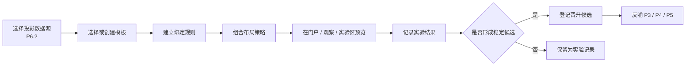
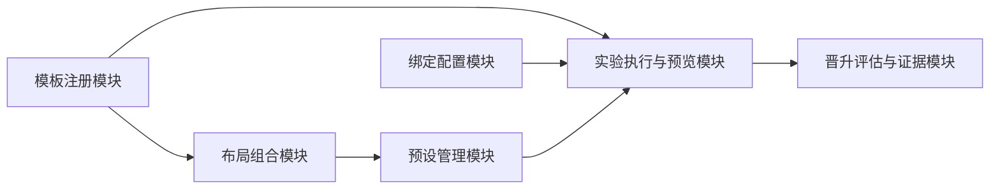
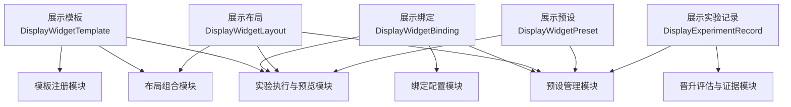
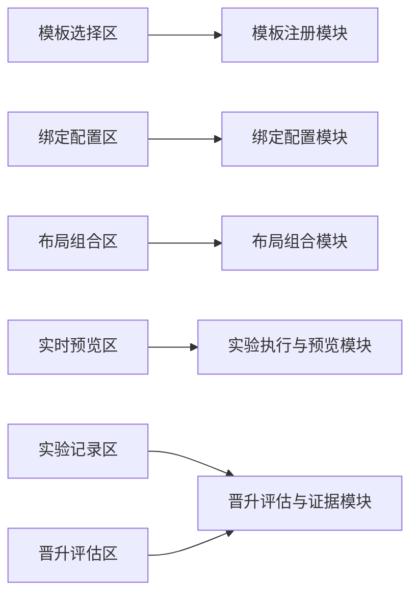

# P6.4 前端展示工具化实验场设计

> 归档说明：本文件归档自 `docs/superpowers/specs/2026-04-19-p6-detailed-subsystem-design.md`，作为 `P6.4` 节点的正式专项设计入口。凡涉及展示模板、数据绑定、布局组合、预设、实验记录、晋升候选和实验承载面边界，均以本文件为准。
>
> 维护规则：后续若在 `P6.4` 的 `brainstorming / specs / plans` 中继续细化模板体系、绑定规则、布局实验或晋升机制，必须在同一轮同步回写本文件；本文件优先于工作层文档，作为 `P6.4` 可评审口径的正式基线。

**日期：** 2026-04-20

**对应节点：**
- `P6.4` 前端展示工具化实验场

**关联正式文档：**
- `DOC/CODEX_DOC/02_设计说明/10-P6-门户与平台入口设计.md`
- `DOC/CODEX_DOC/02_设计说明/11-P6.1-首屏观察门户设计.md`
- `DOC/CODEX_DOC/02_设计说明/12-P6.2-跨阶段只读集成与状态投影设计.md`
- `DOC/CODEX_DOC/02_设计说明/13-P6.3-设计语言与前端展示基线设计.md`

## 1. 设计定位

`P6.4` 不是正式业务模块，也不是另一个 `P4` 工具仓库页面。

`P6.4` 必须单独锁定以下内容：

- 前端展示到底能被结构化到什么程度
- 模板、绑定、布局、预设和实验记录如何形成稳定对象
- 实验结果如何晋升为候选，而不是直接变成正式能力
- `P6.4` 如何在平台门户页、观察页和实验区中承载展示验证

`P6.4` 是 `P6` 探索验证层中的核心节点，负责验证“前端展示是否可以像工具一样被配置、绑定、组合和复用”。

## 2. 目标与边界

`P6.4` 的目标不是“现场改页面”，而是把展示能力对象化、证据化，并让其能被 `P3 / P4 / P5` 消费为正式候选资产。

### 2.1 当前负责

- 定义展示工具化的最小对象模型
- 提供模板、数据绑定、布局组合和预设的实验框架
- 记录实验结果、问题结论和晋升建议
- 将实验结论反哺 `P3 / P4 / P5`

### 2.2 当前不负责

- 直接替代正式业务页
- 直接反写业务数据
- 直接替代 `P4` 工具仓库
- 在当前阶段冻结为正式生产能力
- 绕过 `P6.2` 直接绑定阶段内部状态

### 2.3 实验场硬约束

`P6.4` 首版固定遵守以下硬约束：

- 实验数据只允许来自 `P6.2` 的只读投影
- 实验样式必须先继承 `P6.3` 基线，再声明实验性例外
- 实验通过只能形成晋升候选，不自动升级为正式资产
- 模板、绑定、布局和预设都必须能独立命名和被复用

## 3. 输入输出契约

### 3.1 实验输入

`P6.4` 首版至少消费以下输入：

- `P6.2` 提供的门户投影和观察投影
- `P6.3` 提供的 token、状态文案和共享展示基元
- 当前展示模板集合
- 当前绑定规则集合
- 当前布局策略集合

### 3.2 实验输出

`P6.4` 首版至少输出以下正式对象：

1. `DisplayWidgetTemplate`
2. `DisplayWidgetBinding`
3. `DisplayWidgetLayout`
4. `DisplayWidgetPreset`
5. `DisplayExperimentRecord`

### 3.3 晋升候选输出

当实验结果稳定时，`P6.4` 至少输出：

- `promotion_candidate_id`
- `candidate_kind`
- `target_stage`
- `adoption_reason`
- `evidence_refs`

### 3.4 实验承载输出

`P6.4` 每次稳定实验至少形成以下承载输出：

1. 预览输出
   - 当前模板预览
   - 当前绑定结果
   - 当前布局结果
2. 记录输出
   - 实验目标
   - 问题结论
   - 晋升建议

## 4. 实验最小闭环总流程

## 5. 核心对象模型

对象模型回答的是“`P6.4` 中有哪些稳定的实验事实对象、它们各自保存什么数据”。

### 5.1 展示模板（Display Widget Template / `DisplayWidgetTemplate`）

展示模板定义展示组件模板本身。

最小字段至少包括：

- `template_id`
- `template_name`
- `template_kind`
- `slot_schema`
- `supported_field_map`
- `supported_states`
- `style_profile_ref`

对象关系约束固定如下：

- 模板必须显式声明自身支持的输入槽位和状态集合
- 模板不得隐式依赖某个阶段私有页面结构

### 5.2 展示绑定（Display Widget Binding / `DisplayWidgetBinding`）

展示绑定定义模板与数据源之间的绑定关系。

最小字段至少包括：

- `binding_id`
- `source_projection_kind`
- `source_stage_scope`
- `field_map`
- `transform_rules`
- `fallback_rules`

对象关系约束固定如下：

- 绑定来源必须明确属于 `PortalProjection`、`ObservationProjection` 或其子集
- 绑定规则必须显式处理空值和错误回退

### 5.3 展示布局（Display Widget Layout / `DisplayWidgetLayout`）

展示布局定义多个展示组件如何组合成一个页面片段。

最小字段至少包括：

- `layout_id`
- `layout_name`
- `region_schema`
- `ordering_rules`
- `size_rules`
- `responsive_rules`

对象关系约束固定如下：

- 布局必须与模板集合和绑定集合解耦
- 布局策略不得直接篡改模板和绑定定义

### 5.4 展示预设（Display Widget Preset / `DisplayWidgetPreset`）

展示预设定义一组可复用的展示组合。

最小字段至少包括：

- `preset_id`
- `preset_name`
- `applicable_scenarios`
- `template_refs`
- `binding_refs`
- `layout_refs`
- `status`

对象关系约束固定如下：

- 预设是可复用组合，不是一次性实验副产物
- 预设必须标注适用场景和当前状态

### 5.5 展示实验记录（Display Experiment Record / `DisplayExperimentRecord`）

展示实验记录定义一次实验的正式事实。

最小字段至少包括：

- `experiment_id`
- `goal`
- `projection_scope`
- `template_refs`
- `binding_refs`
- `layout_refs`
- `result_summary`
- `issues`
- `promotion_recommendation`
- `created_at`

对象关系约束固定如下：

- 每次实验都必须显式记录目标、范围和结论
- 没有实验记录的页面试验，不视为 `P6.4` 正式产物

## 6. 核心功能模块设计

模块设计回答的是“谁负责模板、绑定、布局、预设、实验执行和晋升评估”。

### 6.1 模块清单

`P6.4` 首版固定拆成以下 6 个核心功能模块：

1. 模板注册模块（Template Registry）
2. 绑定配置模块（Binding Configurator）
3. 布局组合模块（Layout Composer）
4. 预设管理模块（Preset Manager）
5. 实验执行与预览模块（Experiment Runner and Preview）
6. 晋升评估与证据模块（Promotion Review and Evidence）

### 6.2 模块职责、输入和输出

| 模块 | 主要职责 | 可接受输入 | 产出输出 |
| --- | --- | --- | --- |
| 模板注册模块 | 管理模板定义、槽位和支持状态 | 模板草案、共享基元、token 约束 | `DisplayWidgetTemplate` |
| 绑定配置模块 | 管理展示模板与投影数据的字段绑定 | 投影对象、字段映射、回退规则 | `DisplayWidgetBinding` |
| 布局组合模块 | 管理组件组合、区域划分和响应式布局策略 | 模板集合、布局规则 | `DisplayWidgetLayout` |
| 预设管理模块 | 管理可复用的展示组合预设 | 模板、绑定、布局、适用场景 | `DisplayWidgetPreset` |
| 实验执行与预览模块 | 组织实验预览、生成当前效果和实验结论草稿 | 投影数据、模板、绑定、布局 | 预览结果、实验草稿 |
| 晋升评估与证据模块 | 记录实验结论、评估是否形成晋升候选 | 预览结果、实验草稿、评价规则 | `DisplayExperimentRecord`、晋升候选 |

### 6.3 模块依赖关系图

## 7. 对象模型与模块设计关系

对象不是模块，模块也不是对象。

- 对象负责保存展示实验事实
- 模块负责定义、组合、执行和评估这些实验事实

### 7.1 对象归属映射

| 对象 | 主要归属模块 | 被哪些模块消费 |
| --- | --- | --- |
| `DisplayWidgetTemplate` | 模板注册模块 | 布局组合模块、实验执行与预览模块 |
| `DisplayWidgetBinding` | 绑定配置模块 | 预设管理模块、实验执行与预览模块 |
| `DisplayWidgetLayout` | 布局组合模块 | 预设管理模块、实验执行与预览模块 |
| `DisplayWidgetPreset` | 预设管理模块 | 实验执行与预览模块、晋升评估与证据模块 |
| `DisplayExperimentRecord` | 晋升评估与证据模块 | 预设管理模块、后续反哺链 |

### 7.2 对象与模块关系图

## 8. 数据来源、作用域与切换规则

### 8.1 三层实验作用域

`P6.4` 首版固定区分三层实验作用域：

1. 模板与预设参考层
   - 当前模板集合
   - 当前绑定规则集合
   - 当前布局规则集合
   - 当前预设集合
2. 当前实验实例作用域层
   - 当前投影数据源
   - 当前选中的模板、绑定和布局
   - 当前预览结果
3. 证据与晋升作用域层
   - 当前实验记录
   - 当前晋升建议
   - 当前目标阶段和反哺方向

### 8.2 切换实验场景时的替换规则

当实验场景从门户页切换到观察页，或从观察页切换到独立实验区时，必须整体替换以下数据：

- 当前投影数据源
- 当前预览布局
- 当前适用场景标记

以下数据不应因为切换实验场景而丢失：

- 模板定义
- 绑定规则
- 布局定义
- 已有实验记录

### 8.3 切换预设时的替换规则

当 `current_preset_id` 被切换时：

- 当前模板、绑定、布局组合应整体替换
- 当前预览结果应重新生成
- 当前实验记录草稿应标记为新的预设上下文

但以下数据不应被直接覆盖：

- 其他预设定义
- 历史实验记录
- 已登记的晋升候选

### 8.4 实验结论对数据层的影响

实验通过至少会写入：

- 新的 `DisplayExperimentRecord`
- 当前晋升建议
- 当前目标阶段引用

实验失败或暂不晋升至少会写入：

- 问题清单
- 暂不晋升理由
- 后续复验建议

## 9. 页面级交互设计与模块映射

### 9.1 页面入口与壳层

`P6.4` 首版不强制要求完整独立系统，但至少应有两个正式承载场景：

- 平台门户页中的实验承载面
- 平台串行观察页中的实验承载面

后续可补充独立实验页或实验区，但必须满足：

- 不直接进入阶段业务壳层
- 不直接绑定阶段内部状态
- 不把实验配置流程伪装成正式业务操作流程

### 9.2 风格继承与节点例外

`P6.4` 不单独定义整套平台风格。

本节点只固定两件事：

1. 模板和预览必须继承 `P6.3` 的平台展示基线
2. 实验面允许保留更强的配置、绑定和布局语义

当前局部例外固定为：

- 模板卡允许显式展示槽位和支持状态
- 绑定面板允许显式展示字段映射与回退规则
- 预览面允许并排展示多个实验变体

### 9.3 页面区块

`P6.4` 首版实验承载面固定为 6 个区块：

1. 模板选择区
2. 绑定配置区
3. 布局组合区
4. 实时预览区
5. 实验记录区
6. 晋升评估区

### 9.4 页面区块到模块映射

| 页面区块 | 对应模块 | 读取数据 | 写入数据 | 会影响的后续模块 |
| --- | --- | --- | --- | --- |
| 模板选择区 | 模板注册模块 | 模板定义、支持状态 | 当前模板选择 | 布局组合模块、实验执行与预览模块 |
| 绑定配置区 | 绑定配置模块 | 投影数据、字段映射、回退规则 | 当前绑定规则 | 实验执行与预览模块 |
| 布局组合区 | 布局组合模块 | 模板集合、布局规则 | 当前布局选择 | 预设管理模块、实验执行与预览模块 |
| 实时预览区 | 实验执行与预览模块 | 当前模板、绑定、布局、投影数据 | 当前预览结果 | 晋升评估与证据模块 |
| 实验记录区 | 晋升评估与证据模块 | 当前预览结果、实验目标 | 实验记录草稿 | 预设管理模块 |
| 晋升评估区 | 晋升评估与证据模块 | 实验记录、评价规则、目标阶段 | 晋升候选、反哺建议 | `P3 / P4 / P5` 后续承接链 |

### 9.5 页面-模块关系图

### 9.6 关键交互

实验承载面至少支持：

- 选择模板并查看其槽位和支持状态
- 绑定投影字段并查看回退规则
- 组合布局并实时预览
- 保存实验记录并形成结论
- 评估是否生成晋升候选

## 10. 最小支撑服务与机制设计

`P6.4` 首版至少需要以下支撑机制与实验登记能力：

### 10.1 模板与预设登记机制

至少需要登记：

- 模板定义
- 预设定义
- 模板与预设版本
- 适用场景

### 10.2 绑定预览与数据适配机制

至少需要登记：

- 绑定来源投影类型
- 字段映射规则
- 回退规则
- 预览结果摘要

### 10.3 布局预览与持久化机制

至少需要登记：

- 布局区域划分
- 排列顺序
- 尺寸策略
- 响应式约束

### 10.4 实验记录与晋升候选机制

至少需要登记：

- 实验目标
- 关键结果
- 问题清单
- 晋升建议
- 证据引用

## 11. 验收口径

`P6.4` 只有同时满足以下条件，才算达到可评审状态：

1. `P6.4` 已从概念性描述提升为独立正式设计对象。
2. 展示模板、绑定、布局、预设、实验记录五类对象边界清晰。
3. 实验流程能够解释“从展示实验到正式沉淀”的路径。
4. 实验只消费 `P6.2` 读侧投影，不直接绑定阶段私有状态。
5. `P6.4` 与 `P3 / P4 / P5` 的关系是反哺，不是替代。

## 12. 与后续节点的关系

- `P6.1` 和串行观察页是 `P6.4` 的主要承载场景
- `P6.2` 提供 `P6.4` 所需的统一读侧数据
- `P6.3` 提供 `P6.4` 实验时必须继承的展示基线
- `P3 / P4 / P5` 消费 `P6.4` 输出的晋升候选和实验结论

因此，`P6.4` 负责举证和筛选，不负责直接冻结正式资产。

## 13. 风格继承与节点例外

`P6.4` 默认继承以下正式基线：

- `DOC/CODEX_DOC/02_设计说明/13-P6.3-设计语言与前端展示基线设计.md`
- `DOC/CODEX_DOC/02_设计说明/10-P6-门户与平台入口设计.md` 中对平台承载面的约束

`P6.4` 只允许定义以下实验性例外：

- 实验卡片可显式展示模板槽位、字段绑定和预览版本
- 布局预览区可并排展示多个实验变体
- 晋升评估区可使用更强的对比和标记语义，但不得升级为正式业务页面语义

## 14. 正式文档关系

本节点的正式文档关系固定为：

- 阶段级总体设计：`DOC/CODEX_DOC/02_设计说明/10-P6-门户与平台入口设计.md`
- 门户专项设计：`DOC/CODEX_DOC/02_设计说明/11-P6.1-首屏观察门户设计.md`
- 读侧投影设计：`DOC/CODEX_DOC/02_设计说明/12-P6.2-跨阶段只读集成与状态投影设计.md`
- 展示基线设计：`DOC/CODEX_DOC/02_设计说明/13-P6.3-设计语言与前端展示基线设计.md`
- 工作层设计：`docs/superpowers/specs/2026-04-19-p6-detailed-subsystem-design.md`

如果后续继续补充模板体系、绑定规则、布局预设、实验记录或晋升机制，优先回写本文件；只有在确定会影响整个 `P6` 阶段总契约时，才同时回写 `10-P6` 总体设计。
