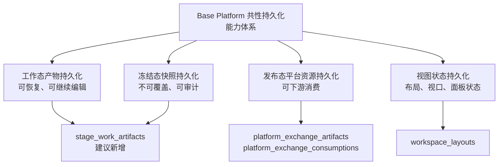
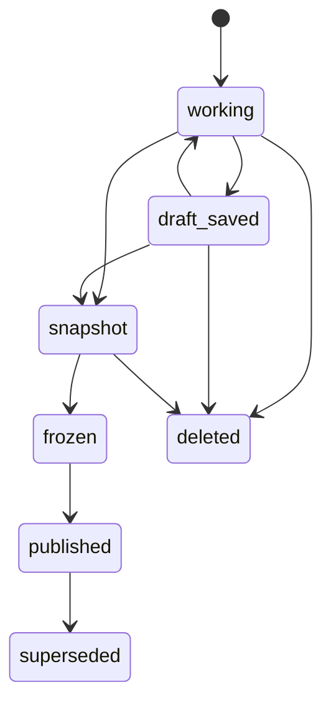

# BasePlatform 共性持久化能力体系设计

**日期：** 2026-06-21
**所属系统：** CodeFactoryV2 Base Platform
**对应需求规格：** `DOC/CODEX_DOC/01_需求分析/04-BasePlatform共性持久化能力需求规格说明.md`
**首个深化接入阶段：** P3 软件设计系统

## 1. 设计目标

本文补充 Base Platform 的共性持久化能力体系。目标不是推翻既有平台数据资源底座设计，而是在其“发布态平台资源”边界之外，补齐阶段工作态恢复、冻结态快照和发布态登记之间的连续能力。

设计必须满足三条原则：

1. 共性平台提供持久化能力体系，不为某个阶段临时补表。
2. 平台交换层继续只承接发布态、可下游消费的标准资源。
3. 阶段业务对象仍由阶段系统定义，基础平台只统一信封、生命周期、版本、追溯和恢复规则。

## 2. 能力分层

Base Platform 持久化体系按三类能力组织：



本设计建议新增工作态/冻结态持久化模块，并把既有 `platform_exchange` 与 `workspace_layouts` 纳入同一能力体系说明。

## 3. 模块职责

### 3.1 现有模块

| 模块 | 当前职责 | 在共性持久化体系中的定位 |
| --- | --- | --- |
| `platform_exchange` | 发布态资源登记和消费留痕 | 发布态平台资源持久化 |
| `workspace_layouts` | 工作区布局保存、恢复、快照 | 视图状态持久化 |

### 3.2 建议新增模块

| 模块 | 职责 |
| --- | --- |
| `app.stage_artifacts.models` | 工作态产物和冻结态快照的 Pydantic DTO |
| `app.stage_artifacts.repository` | 持久化对象查询、保存、状态过滤 |
| `app.stage_artifacts.service` | 生命周期、版本、快照、恢复和发布前校验 |
| `app.api.routes.stage_artifacts` | 通用 HTTP API |
| `app.db.models.stage_artifacts` | SQLAlchemy 表模型 |

命名 `stage_artifacts` 表示阶段产物持久化，不等同于平台交换层 `platform_exchange_artifacts`。前者可以保存工作态，后者只保存发布态。

## 4. 数据模型

### 4.1 StageWorkArtifact

建议新增通用表：

```text
stage_work_artifacts
```

字段建议如下：

| 字段 | 类型 | 说明 |
| --- | --- | --- |
| artifact_id | string | 工作态/快照对象主键 |
| owner_user_id | string | 所有者，首版默认 `default` |
| producer_stage | string | 生产阶段，如 `P3` |
| artifact_type | string | 阶段产物类型，如 `software_design_session` |
| artifact_version | string | 阶段产物版本 |
| schema_version | string | payload schema 版本 |
| scope_type | string | 业务作用域类型 |
| scope_id | string | 业务作用域标识 |
| source_artifact_ids | json | 上游平台资源或阶段产物引用 |
| lifecycle_status | string | `working`、`draft_saved`、`snapshot`、`frozen` 等 |
| payload_mode | string | `inline` 或 `ref` |
| payload | json | 结构化正文 |
| payload_ref | string | 外部对象存储引用，首版可为空 |
| payload_hash | string | payload 哈希 |
| parent_artifact_id | string | 上一版本或父快照 |
| source_trace | json | 来源追溯 |
| created_at | datetime | 创建时间 |
| updated_at | datetime | 更新时间 |
| frozen_at | datetime | 冻结时间 |
| published_artifact_id | string | 发布到平台交换层后的 artifact id |

### 4.2 与平台交换表的关系

`stage_work_artifacts` 不替代 `platform_exchange_artifacts`。

当某个阶段产物从 `frozen` 发布为可下游消费资源时，流程为：

```text
stage_work_artifacts.lifecycle_status = frozen
  -> StageArtifactService.publish_to_exchange()
  -> PlatformExchangeService.publish_artifact()
  -> platform_exchange_artifacts 生成发布态副本
  -> stage_work_artifacts.published_artifact_id 回写发布结果
```

发布态副本必须能够独立被下游读取，不能只保存对工作态对象的运行时引用。

## 5. 生命周期设计

通用生命周期如下：



规则：

1. `working` 可被自动保存覆盖。
2. `draft_saved` 可继续编辑，但必须保留用户显式保存时间。
3. `snapshot` 不允许被覆盖，只能派生新版本。
4. `frozen` 不允许被编辑，只能发布或创建修订。
5. `published` 对应平台交换资源，不能回写修改。
6. `superseded` 只表示被新发布版本替代，不删除历史。

## 6. API 设计

### 6.1 查询阶段产物

```http
GET /api/stage-artifacts?producer_stage=P3&artifact_type=software_design_session&scope_type=p3_design_input&scope_id=art-...
```

### 6.2 Upsert 当前工作态

```http
PUT /api/stage-artifacts/current
```

请求体示例：

```json
{
  "owner_user_id": "default",
  "producer_stage": "P3",
  "artifact_type": "software_design_session",
  "artifact_version": "v0.1",
  "schema_version": "p3_software_design_session.v1",
  "scope_type": "p3_design_input",
  "scope_id": "art-77aafa39162e41d5",
  "lifecycle_status": "working",
  "payload": {},
  "source_artifact_ids": ["art-77aafa39162e41d5"],
  "source_trace": {}
}
```

### 6.3 创建不可覆盖快照

```http
POST /api/stage-artifacts/{artifact_id}/snapshots
```

### 6.4 冻结快照

```http
POST /api/stage-artifacts/{artifact_id}/freeze
```

### 6.5 发布到平台交换层

```http
POST /api/stage-artifacts/{artifact_id}/publish
```

该接口内部调用 `PlatformExchangeService.publish_artifact()`。

## 7. 与现有能力的融合

### 7.1 与 `workspace_layouts`

`workspace_layouts` 继续保留独立表。它可以使用同样的 `owner_user_id`、`scope_type`、`scope_id` 约束，但不保存业务产物正文。

P3 中同一个设计会话会同时产生：

| 能力 | 保存对象 |
| --- | --- |
| `stage_work_artifacts` | 软设正文、设计基线、P4 投影、turns |
| `workspace_layouts` | 画布位置、窗口尺寸、视口、当前激活窗口 |

### 7.2 与 `platform_exchange`

平台交换层只保存发布态副本。P3 的 `frozen_package` 发布后，才应成为 `software_design_package` 或 `software_design_baseline` 类型的 `PlatformExchangeArtifact`。

### 7.3 与阶段业务仓储

阶段可以选择：

1. 完全使用 `stage_work_artifacts` 保存工作态聚合。
2. 使用阶段私有表保存强结构字段，同时把快照和发布候选登记到 `stage_work_artifacts`。

P3 首版建议采用第一种方式，因为当前 P3 v2 产物主要是 JSON 聚合对象，适合通过通用信封落地。

## 8. P3 接入映射

| P3 对象 | 共性持久化类型 | artifact_type | 生命周期 |
| --- | --- | --- | --- |
| `P3DesignLabSession` | 工作态产物 | `software_design_session` | `working` / `draft_saved` |
| `design_document` | 工作态 payload 子对象 | 随 session payload | 随 session |
| `design_baseline` | 工作态 payload 子对象 / 冻结快照核心 | 随 session 或 `software_design_baseline` | `working` / `frozen` |
| `workorder_projection` | 工作态 payload 子对象 | 随 session payload | `working` / `frozen` |
| `turns` | 过程追溯 payload 子对象 | 随 session payload | `working` |
| `frozen_package` | 冻结态快照 | `software_design_package` | `frozen` |
| 下游可消费设计包 | 平台交换资源 | `software_design_package` | `published` |

## 9. 错误处理

| 场景 | 处理 |
| --- | --- |
| payload hash 与同版本冲突 | 返回 409，提示版本冲突 |
| 非冻结态发布 | 返回 400，提示生命周期不允许 |
| 恢复对象不存在 | 返回 404 |
| payload schema 不支持 | 返回 422 |
| 平台交换发布失败 | 保持工作态对象不变，记录失败原因 |

## 10. 测试设计

后端测试至少覆盖：

1. 创建和查询工作态产物。
2. 当前工作态 upsert 不产生重复记录。
3. 创建快照后原快照不可覆盖。
4. 冻结后不允许继续更新 payload。
5. 发布后生成 `platform_exchange_artifacts`。
6. P3 后端重启后可恢复软设会话。

前端测试至少覆盖：

1. P3 页面刷新后能恢复已生成软设。
2. 后端返回关联软设时，输入包列表能打开历史设计。
3. 布局恢复和软设产物恢复互不干扰。

## 11. 演进方向

首版完成后可继续补充：

1. 对象存储支持大 payload。
2. 多用户所有权与权限。
3. 快照差异比较。
4. 保留策略与归档。
5. 平台监控页展示工作态、冻结态和发布态分层统计。

## 12. 设计结论

Base Platform 共性持久化能力体系应成为独立基础能力域。它统一承接阶段产物从工作态、冻结态到发布态的生命周期，但不替代阶段业务服务，也不把平台交换层扩展为万能后台。

P3 软设产物持久化应作为该能力体系的首个深化接入场景。
