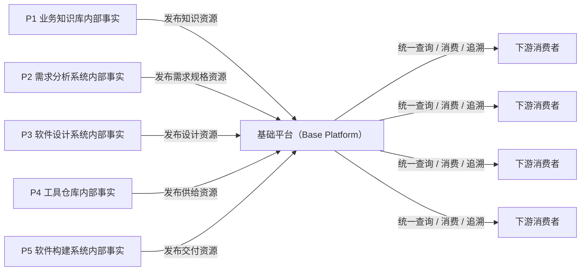
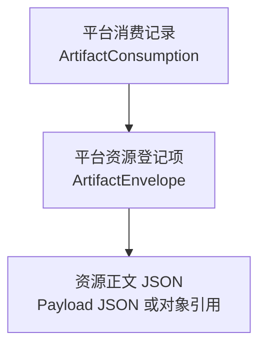
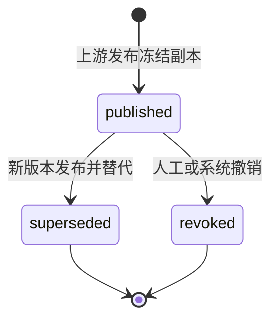
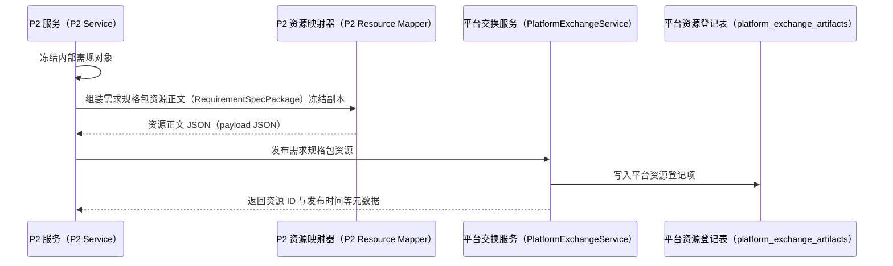
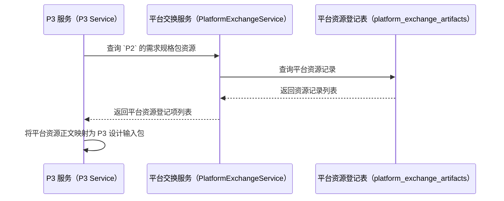
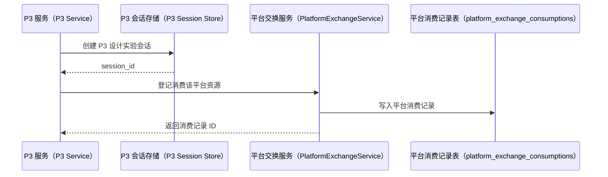

# 基础平台（Base Platform）平台数据资源底座设计

> 本文件是软件工厂平台（CodeFactoryV2）中基础平台（Base Platform）的正式软件设计说明。本文把基础平台定义为跨阶段标准数据资源的登记、存储、追溯、版本治理和消费分发底座。
>
> 本文主线不是某两个阶段之间的接口适配，而是回答：基础平台（Base Platform）是什么、存什么、谁写入、谁读取、物理上如何存、与 `P1 ~ P5` 五个业务阶段的关系是什么。
>
> `P2 -> P3` 是本文的首个详细样例；`P1` 业务知识库、`P4` 工具仓库、`P5` 软件构建系统先给出资源占位和统一口径。

**日期：** 2026-05-14

**关联正式文档：**

- `DOC/CODEX_DOC/02_设计说明/00_总纲/03-P1-P6数据互联互通与平台交换层设计.md`
- `DOC/CODEX_DOC/02_设计说明/P2_需求分析系统/P2-需求分析系统设计.md`
- `DOC/CODEX_DOC/02_设计说明/P3_软件设计系统/P3-软件设计系统设计.md`
- `DOC/CODEX_DOC/07_过程文档/02_历史计划/2026-05-14-1709-P-BasePlatform分支开设说明.md`

## 1. 文档目的与设计口径

### 1.1 文档目的

本文用于回答以下问题：

1. 基础平台（Base Platform）在软件工厂平台（CodeFactoryV2）里到底是什么。
2. 它是“所有系统的中央数据库”，还是“跨阶段标准成果物的数据底座”。
3. 平台里有哪些数据资源类型，这些资源分别来自哪些阶段。
4. 这些资源在物理上是什么：数据库一行、结构化数据（JavaScript Object Notation，`JSON`）字段、对象存储文件，还是导出副本。
5. `P2` 和 `P3` 在平台里分别写入什么、读取什么。
6. 平台统一存储和统一输出的边界在哪里，哪些数据不应进入平台。

### 1.2 设计口径

本文固定采用以下口径：

- 先讲平台定义，再讲资源类型，再讲物理形态，最后讲 `P2 -> P3` 样例。
- 不把阶段内部草稿、工作流和运行态直接上收为平台权威事实。
- 平台只承接“已冻结 / 已发布 / 可下游消费”的标准数据资源。
- 平台资源默认定义为“发布时刻冻结副本”，不是“运行时回源引用”。
- 导出文件、报表、压缩包可以存在，但默认不是首版权威事实存储。

### 1.3 一句话结论

基础平台（Base Platform）不是“所有业务状态都先写进去”的中央业务系统，而是：

```text
跨阶段标准数据资源的后台底座
```

更完整一点说：

```text
各阶段先在自己的子系统内部形成业务事实
  -> 当事实达到冻结、发布、可消费边界时
    -> 基础平台（Base Platform）登记一份发布时刻冻结副本
      -> 下游阶段统一从基础平台查询、消费和追溯
```

## 2. 基础平台（Base Platform）定义

### 2.1 基础平台（Base Platform）是什么

基础平台（Base Platform）是平台级数据资源后台，它主要负责五件事：

1. **登记**  
   把各阶段发布出来的标准成果物登记成平台资源副本。
2. **存储**  
   统一保存跨阶段资源副本的元数据、资源正文（payload）、版本、哈希摘要（hash）和追溯信息。
3. **分发**  
   为下游阶段提供统一查询和读取入口，默认读取的是平台内副本，而不是回源到上游库。
4. **留痕**  
   记录谁消费过、何时消费、消费结果如何。
5. **治理**  
   管理资源版本、幂等键、生命周期状态和后续替代 / 撤销（supersede / revoke），并保证已发布副本不被原地覆盖。

### 2.2 基础平台（Base Platform）不是什么

基础平台（Base Platform）不应被设计成以下东西：

1. **所有阶段内部状态的总数据库**
   - `P2` 草稿、问答轮次、临时正文
   - `P3` 设计回合补丁（patch）、工作台编辑态
   - `P4` 制造过程细节
   - `P5` 构建执行过程日志
   这些默认都不应该直接进入平台权威存储。

2. **替代业务子系统的万能后台**
   - 它不生成需求规格说明；
   - 不生成软件设计说明；
   - 不做工具制造；
   - 不执行构建。

3. **先文件后结构的文件仓库**
   - 首版不应把平台设计成“只存一堆 zip / pdf / md 文件，再附一层索引”。
   - 首版权威事实应优先是结构化资源记录。

### 2.3 平台写入边界

判断某个数据是否应该进入 `Base Platform`，固定看它是否已经达到以下边界：

- 已冻结；
- 已发布；
- 可被下游正式消费；
- 需要可追溯的跨阶段资源身份。

因此平台写入边界不是“所有数据先落平台”，而是：

```text
所有跨阶段正式资源必须落平台
所有阶段内部工作态默认不落平台
```

这里的“落平台”必须明确解释为：

```text
在平台内形成一份独立的发布副本
而不是只保存一个指向上游库的运行时引用
```

### 2.4 平台与 P1-P5 的关系



这张图的重点是：

- 平台承接的是“发布出来的资源”；
- 不是直接承接每个阶段的全部内部表和全部运行时状态。

## 3. 平台数据资源总模型

### 3.1 两层对象模型

`CodeFactoryV2` 中的数据对象应分为两层：

#### 第一层：阶段内部业务对象

它们归各阶段自己维护，例如：

- `P2.RequirementSpecWorkItem`（需求规格工作项）
- `P2.RequirementAuthoringDocument`（需求规格编写文档）
- `P3.P3DesignLabSession`（P3 设计实验会话）
- `P4.ToolDemandSheet`（工具需求单）
- `P5.SoftwareBuildOrder`（软件构建主单）

这些对象回答的是：

- 本阶段现在在做什么；
- 草稿进行到哪里；
- 工作流状态如何；
- 谁能继续编辑。

#### 第二层：平台数据资源对象

它们归 `Base Platform` 维护，例如：

- 平台资源登记项（ArtifactEnvelope）
- 平台资源正文（payload）
- 平台消费记录（ArtifactConsumption）

这些对象回答的是：

- 某个阶段正式发布了什么；
- 这个资源的结构模式（schema）、版本、来源、哈希摘要（hash）是什么；
- 哪个下游消费了它；
- 这个资源现在是否仍是当前有效版本。

这些对象默认不回答的问题是：

- 上游当前草稿已经被编辑到哪里；
- 上游今天最新的一版临时状态是什么；
- 是否应回源读取上游最新值。

因为平台对象默认保存的是发布时刻的冻结副本，不是上游对象的实时引用。

### 3.2 平台核心对象

平台首版至少有三个核心概念：

1. **平台资源登记项（ArtifactEnvelope）**
   - 平台里“一份已发布资源副本”的主记录。

2. **资源正文（payload）**
   - 某类资源副本的正文内容，例如需求规格包（RequirementSpecPackage）。

3. **平台消费记录（ArtifactConsumption）**
   - 某个下游系统对某份资源的正式消费事实。

### 3.3 统一资源关系



它表示：

- 一条平台资源登记项关联一份资源正文（payload）；
- 多条消费记录可以指向同一条资源登记项。

## 4. 平台资源的物理存储形态

### 4.1 先回答：平台里一份资源在物理上是什么

首版推荐使用“关系表 + JSON 资源正文（payload）”的组合。

物理上：

```text
平台资源登记表（`platform_exchange_artifacts`）
  一行 = 一份已发布资源副本

平台消费记录表（`platform_exchange_consumptions`）
  一行 = 一次正式消费
```

也就是说，首版平台中的“一份数据资源”默认不是一个文件，而是：

```text
数据库表中的一行资源记录
  + 行内的资源正文（payload JSON）
```

而且这里的资源正文 JSON（payload JSON）必须理解为：

```text
发布时刻冻结副本
不是指向上游数据库记录的动态引用
```

### 4.2 物理形态分层

平台首版建议只使用下面四类物理形态：

| 形态 | 用途 | 首版是否必需 |
| --- | --- | --- |
| 标量列 | 资源 ID、类型、版本、状态、时间、生产者 | 是 |
| JSON 列 | 资源正文（payload）、追溯链（trace）、父级依赖列表 | 是 |
| 对象存储引用 | 大文件、大包、导出件引用 | 否 |
| 导出文件副本 | `.md`（Markdown）、`.pdf`、`.json`、`.zip` | 否 |

### 4.3 平台资源登记项（ArtifactEnvelope）的物理形态

平台资源登记项（ArtifactEnvelope）在首版里应是：

```text
platform_exchange_artifacts 表中的一行记录
```

建议至少包含以下列类型。下面列名第一次出现时按“中文名（英文列名）”解释，后文表结构章节再给出完整字段表。

#### 标量列

- 平台资源 ID（`artifact_id`）
- 资源类型（`artifact_type`）
- 资源业务版本（`artifact_version`）
- 结构模式版本（`schema_version`）
- 生产阶段（`producer_stage`）
- 生产者内部引用 ID（`producer_ref_id`）
- 生命周期状态（`lifecycle_status`）
- 资源正文存储模式（`payload_mode`）
- 平台对象存储引用（`payload_ref`）
- 资源正文哈希摘要（`payload_hash`）
- 幂等键（`idempotency_key`）
- 创建时间（`created_at`）
- 上游冻结时间（`frozen_at`）
- 平台发布时间（`published_at`）
- 发布人（`published_by`）

#### JSON 列

- 平台资源正文副本（`payload`）
- 父级资源 ID 列表（`parent_artifact_ids`）
- 来源追溯（`source_trace`）

所以，平台资源登记项（ArtifactEnvelope）不是某个字段名，而是平台资源表中的一整行。

这条记录的核心语义不是“平台知道去哪里找上游对象”，而是：

```text
平台自己持有一份可被下游直接消费的冻结副本
```

生产者内部引用 ID（`producer_ref_id`）、资源业务版本（`artifact_version`）、来源追溯（`source_trace`）和资源正文哈希摘要（`payload_hash`）的作用，是把这份副本与上游源对象关联起来，而不是让下游消费时再回源读取上游最新值。

### 4.4 平台消费记录（ArtifactConsumption）的物理形态

平台消费记录（ArtifactConsumption）在首版里应是：

```text
platform_exchange_consumptions 表中的一行记录
```

它通常不需要大资源正文（payload），只需要保存消费事实：

- 消费记录 ID（`consumption_id`）
- 被消费资源 ID（`artifact_id`）
- 消费阶段（`consumer_stage`）
- 消费者内部对象 ID（`consumer_ref_id`）
- 消费方式（`consumption_mode`）
- 接受的结构模式版本（`accepted_schema_version`）
- 消费结果（`result_status`）
- 消费说明（`result_message`）
- 消费时间（`consumed_at`）

### 4.5 什么时候才需要文件或对象存储

只有在以下情况出现时，平台才需要把资源正文（payload）从行内 JSON 升级为对象存储引用：

1. 资源正文（payload）体量明显偏大；
2. 需要保留 `.md` / `.pdf` / `.docx` / `.zip` 等导出件；
3. 需要一条资源绑定多个大文件副本；
4. 数据库存储 JSON 已不再合适。

届时物理形态再升级为：

```text
platform_exchange_artifacts 一行
  + 资源正文存储模式（payload_mode） = 平台对象引用（object_ref）/ 平台文件引用（file_ref）
  + 平台对象存储引用（payload_ref） = MinIO 对象键（MinIO key）或受控文件路径
```

但首版不建议从文件模式起步。

即使后续使用平台对象引用（object_ref）或平台文件引用（file_ref），这个引用也应指向**平台自己管理的对象存储副本**，而不是直接指向 `P2`、`P3` 等上游业务库中的实时记录。

## 5. 平台资源类型矩阵

### 5.1 资源类型总表

平台资源类型必须先以资源矩阵固定下来，再进入表结构和接口实现。

| 资源类型 | 中文名 | 生产阶段 | 主要消费阶段 | 首版物理形态 | 首版状态 |
| --- | --- | --- | --- | --- | --- |
| `published_knowledge_snapshot` | 发布知识快照 | `P1` | `P2` | `platform_exchange_artifacts.payload` JSON 副本 | 占位 |
| `requirement_spec_package` | 需求规格包 | `P2` | `P3` | `platform_exchange_artifacts.payload` JSON 冻结副本 | 首版详细实现 |
| `software_design_package` | 软件设计包 | `P3` | `P4` / `P5` | `platform_exchange_artifacts.payload` JSON 冻结副本 | 占位 |
| `module_workorder_batch_package` | 模块工单批次包 | `P3` | `P4` | `platform_exchange_artifacts.payload` JSON 冻结副本 | 占位 |
| `tool_delivery_manifest` | 工具供给清单 | `P4` | `P5` | JSON 副本或对象存储副本 | 占位 |
| `delivery_catalog` | 交付目录 | `P5` | 外部交付 / `P6` | JSON 副本或对象存储副本 | 占位 |
| `build_manifest` | 构建清单 | `P5` | 外部交付 / `P6` | JSON 副本或对象存储副本 | 占位 |

资源类型编码只用于系统内部识别；第一次使用时必须同时给出中文名。例如发布知识快照（`published_knowledge_snapshot`）、需求规格包（`requirement_spec_package`）、软件设计包（`software_design_package`）、模块工单批次包（`module_workorder_batch_package`）、工具供给清单（`tool_delivery_manifest`）、交付目录（`delivery_catalog`）和构建清单（`build_manifest`）。

### 5.2 资源类型通用规则

每一种平台资源类型都必须明确：

1. 资源名称；
2. 生产阶段；
3. 主要消费阶段；
4. 资源正文结构模式（payload schema）；
5. 版本规则；
6. 副本生成时机；
7. 消费记录是否必需；
8. 是否允许后续撤销或替代。

首版所有资源均采用：

```text
发布时生成平台副本
下游读取平台副本
上游修订生成新版本
旧版本不原地覆盖
```

### 5.3 `P1` 资源占位

`P1` 首版在平台层建议只暴露“已发布知识资源”，不暴露治理中间态。

建议资源名：

```text
发布知识快照（published_knowledge_snapshot）
```

当前只保留占位口径：

- 生产者：`P1`
- 消费者：`P2`
- 物理形态：平台资源登记项的资源正文（`ArtifactEnvelope.payload`）中的知识快照 JSON 副本
- 副本规则：发布态知识形成后再落平台，不读取治理中间态作为正式资源

### 5.4 `P2` 资源详细说明

`P2` 是当前平台首版最重要的生产者。

#### 5.4.1 `P2` 内部对象

当前 `P2` 主要内部对象包括：

- `RequirementSpecWorkItem`（需求规格工作项）
- `RequirementAuthoringDocument`（需求规格编写文档）
- `RequirementAnalysisSession`（需求分析会话）
- `RequirementSpec`（结构化需求规格）

这些对象全部归 `P2` 自己维护，不应直接作为平台资源暴露给 `P3`。

#### 5.4.2 `P2` 对平台发布的正式资源

`P2` 对平台发布的正式资源应命名为：

```text
需求规格包（requirement_spec_package）
```

它在逻辑上是：

```text
需求规格包资源正文（RequirementSpecPackage）
```

它在物理上是：

```text
platform_exchange_artifacts 表中的一行
  其中资源正文列（payload） = 需求规格包资源正文（RequirementSpecPackage）JSON 冻结副本
```

这里必须明确：

```text
这是一份平台内发布副本
不是指向 P2 原始表记录的运行时引用
```

#### 5.4.3 需求规格包资源正文（RequirementSpecPackage）字段结构

需求规格包资源正文（RequirementSpecPackage）是 `P2` 在发布边界上，为下游消费而整理出的**标准资源正文副本**。

它不是：

- `RequirementSpecWorkItem` 本身；
- `RequirementAuthoringDocument` 本身；
- `RequirementSpec` 这张表的一行本身；
- 一个“读的时候再回 P2 取最新值”的引用壳；
- 一个必须先导出的文件包。

首版建议字段：

| 字段 | 中文名 | 发布时取值来源 | 物理形态 |
| --- | --- | --- | --- |
| `standard_document` | 标准需求规格正文 | `RequirementAuthoringDocument.frozen_package.standard_document` | 资源正文 JSON 内字段 |
| `structured_spec` | 结构化需求规格 | `RequirementAuthoringDocument.frozen_package.structured_spec` | 资源正文 JSON 内字段 |
| `annotations` | 批注与提示 | `RequirementAuthoringDocument.frozen_package.annotations` | 资源正文 JSON 内字段 |
| `check_result` | 检查结果 | `RequirementAuthoringDocument.check_result` | 资源正文 JSON 内字段 |
| `knowledge_binding` | 知识绑定摘要 | `RequirementAuthoringDocument.semantic_state.knowledge_binding` | 资源正文 JSON 内字段 |
| `source_trace` | 来源追溯 | `P2` 组装的追溯信息 | 资源正文 JSON 内字段 |
| `p3_consumable` | 是否允许 P3 消费 | 发布边界标记 | 资源正文 JSON 内字段 |

这里“发布时取值来源”的含义必须固定为：

```text
平台在发布动作发生时，从 P2 当前冻结事实中取值并写入自己的资源正文（payload）副本
而不是在平台中保存一个可回源解析的字段级引用关系
```

因此：

- `P2` 后续再修改 `RequirementAuthoringDocument`，不会原地改变既有平台资源；
- 平台中的 `RequirementSpecPackage` 与 `P2.frozen_package` 是“发布时取值复制关系”，不是“运行时联动关系”；
- `P3` 若要判断上游是否产生新版本，应查询平台中新发布的资源版本，而不是回源读取旧资源对应的 `P2` 当前值。

#### 5.4.4 当前 `P2` 物理事实长什么样

按当前代码：

- `RequirementAuthoringDocument` 是 `requirement_authoring_documents` 表中的一行；
- `document` 是该行上的 JSON 字段；
- `frozen_package` 也是该行上的 JSON 字段；
- `RequirementSpec` 是 `requirement_specs` 表中的一行，主体内容在 `payload` JSON 字段。

所以当前 `P2` 已经具备“结构化 JSON 存储”的基础，并不需要为了首版平台先转成物理文件。

但要特别注意：当前 `P2` 自己有一份冻结事实，并不等于平台层应该继续只保留一条引用。平台层的职责恰恰是再生成一份跨阶段发布副本。

#### 5.4.5 需求规格说明是不是文件

当前正式口径是：

1. **权威事实**
   - 在 `P2` 当前实现里，是数据库 JSON；
   - 在基础平台（Base Platform）首版里，也应继续是平台行内资源正文 JSON（payload JSON）；
   - 这份平台资源正文（payload）是发布时刻副本，不是运行时引用。

2. **导出文件**
   - 可以后续生成 `md/pdf/docx/json`；
   - 但它们是导出副本，不是首版主链权威事实。

### 5.5 `P3` 资源详细说明

`P3` 在平台中同时扮演两种角色：

1. `P2` 资源的消费者；
2. 后续 `P4` / `P5` 资源的生产者。

#### 5.5.1 `P3` 作为消费者

`P3` 自己的内部对象包括：

- P3 设计输入包（`P3DesignInputPackage`）
- P3 设计实验会话（`P3DesignLabSession`）
- 后续 `SoftwareDesignBaseline`（软件设计基线）

这些对象与平台对象不是一回事。

其中：

- P3 设计输入包（`P3DesignInputPackage`）是 `P3` 的输入适配数据传输对象（Data Transfer Object，`DTO`）；
- 它不应独立存成平台资源；
- 它应从平台资源登记项的资源正文（`ArtifactEnvelope.payload`）动态映射出来；
- 它的正式来源应是平台副本，不应再回 `P2` 取同一资源的最新态。

也就是说：

```text
平台资源登记项的资源正文（ArtifactEnvelope.payload）
  -> P3 设计输入包（P3DesignInputPackage）
  -> P3 设计实验会话（P3DesignLabSession）
```

同一个 `artifact_id` 一旦确定，`P3` 消费的就是该 `artifact_id` 对应的固定副本，而不是去 `P2` 查询“当前最新那份”。

#### 5.5.2 `P3` 作为消费者时，平台里会新增什么

`P3` 消费 `P2` 资源时，平台里新增的是：

```text
平台消费记录（ArtifactConsumption）
```

物理上就是：

```text
platform_exchange_consumptions 表中的一行
```

而不是在 `P3DesignLabSession` 这一行上多塞几个消费字段。

#### 5.5.3 `P3` 未来对平台发布的资源

`P3` 后续应至少向平台发布两类资源：

1. 软件设计包（`software_design_package`）
2. 模块工单批次包（`module_workorder_batch_package`）

当前先保留占位口径：

- 生产者：`P3`
- 消费者：`P4` / `P5`
- 物理形态：平台资源表一行 + 资源正文 JSON（payload JSON）冻结副本

### 5.6 `P4` 资源占位

`P4` 后续建议发布：

```text
工具供给清单（tool_delivery_manifest）
```

当前只保留占位口径：

- 生产者：`P4`
- 消费者：`P5`
- 物理形态：平台资源表一行 + 资源正文 JSON（payload JSON）副本，或平台对象存储副本

### 5.7 `P5` 资源占位

`P5` 后续建议发布：

```text
交付目录（delivery_catalog）
构建清单（build_manifest）
```

当前只保留占位口径：

- 生产者：`P5`
- 消费者：外部交付侧 / `P6`
- 物理形态：平台资源表一行 + 资源正文 JSON（payload JSON）副本，或平台对象存储副本

## 6. 平台表结构设计草案

### 6.1 `platform_exchange_artifacts` 平台资源登记表

该表是基础平台最核心的数据表。它保存所有跨阶段已发布资源的冻结副本登记。

| 字段 | 中文名 | 类型建议 | 必填 | 说明 |
| --- | --- | --- | --- | --- |
| `artifact_id` | 平台资源 ID | string | 是 | 平台生成的全局唯一资源 ID |
| `artifact_type` | 资源类型 | string | 是 | 例如 `requirement_spec_package` |
| `artifact_version` | 资源业务版本 | string | 是 | 同一业务对象的发布版本，例如 `1`、`2`、`v1.0` |
| `schema_version` | 结构模式版本 | string | 是 | 资源正文结构模式版本（payload schema version） |
| `producer_stage` | 生产阶段 | string | 是 | 例如 `P2` |
| `producer_ref_id` | 生产者内部引用 ID | string | 是 | 指向上游阶段内部对象 ID，仅用于追溯，不用于下游回源读取 |
| `producer_ref_type` | 生产者内部对象类型 | string | 否 | 例如 `RequirementSpecWorkItem` |
| `lifecycle_status` | 生命周期状态 | string | 是 | `published / superseded / revoked` |
| `payload_mode` | 资源正文存储模式 | string | 是 | 首版默认行内存储（`inline`） |
| `payload` | 平台资源正文副本 | JSON | 是，当 `payload_mode=inline` | 下游正式消费的冻结副本 |
| `payload_ref` | 平台对象存储引用 | string | 否 | 当 `payload_mode=object_ref/file_ref` 时使用 |
| `payload_hash` | 资源正文哈希摘要 | string | 是 | 用于核对副本内容 |
| `parent_artifact_ids` | 父级资源 ID 列表 | JSON | 否 | 上游依赖链 |
| `source_trace` | 来源追溯 | JSON | 是 | 生产对象、模板、知识来源、冻结时间等 |
| `idempotency_key` | 幂等键 | string | 是 | 防止同一发布动作重复生成不可区分副本 |
| `created_at` | 创建时间 | datetime | 是 | 平台登记时间 |
| `frozen_at` | 上游冻结时间 | datetime/string | 否 | 来自上游冻结事实 |
| `published_at` | 平台发布时间 | datetime | 是 | 平台资源发布时间 |
| `published_by` | 发布人 | string | 否 | 发布操作者或系统身份 |

### 6.2 `platform_exchange_consumptions` 平台消费记录表

该表记录下游阶段对平台资源的正式消费事实。

| 字段 | 中文名 | 类型建议 | 必填 | 说明 |
| --- | --- | --- | --- | --- |
| `consumption_id` | 消费记录 ID | string | 是 | 平台生成 |
| `artifact_id` | 被消费资源 ID | string | 是 | 指向 `platform_exchange_artifacts.artifact_id` |
| `consumer_stage` | 消费阶段 | string | 是 | 例如 `P3` |
| `consumer_ref_id` | 消费者内部对象 ID | string | 是 | 例如 `P3DesignLabSession.session_id` |
| `consumer_ref_type` | 消费者内部对象类型 | string | 否 | 例如 `P3DesignLabSession` |
| `consumption_mode` | 消费方式 | string | 是 | 首版默认快照消费（`snapshot`） |
| `accepted_schema_version` | 接受的结构模式版本 | string | 是 | 消费者实际接受的结构模式版本（schema version） |
| `result_status` | 消费结果 | string | 是 | `accepted / rejected / failed` |
| `result_message` | 消费说明 | string | 否 | 错误说明或接受说明 |
| `consumed_at` | 消费时间 | datetime | 是 | 消费发生时间 |

### 6.3 约束与索引建议

首版建议至少建立以下约束：

| 约束 | 说明 |
| --- | --- |
| `artifact_id` 主键 | 每份平台资源唯一 |
| `idempotency_key` 唯一索引 | 防止重复发布生成不可区分副本 |
| `artifact_type + producer_stage + lifecycle_status` 索引 | 支持下游查询可消费资源 |
| `producer_stage + producer_ref_id` 索引 | 支持从上游对象追溯平台发布记录 |
| `artifact_id` 外键或逻辑外键 | 消费记录关联资源 |
| `consumer_stage + consumer_ref_id` 索引 | 支持查询某个下游对象消费过什么 |

## 7. 平台资源生命周期

### 7.1 生命周期状态

首版平台资源状态建议固定为：

| 状态 | 含义 | 是否可消费 |
| --- | --- | --- |
| `published` | 已发布，当前可消费 | 是 |
| `superseded` | 已被新版本替代 | 只允许历史回放，不作为默认可消费资源 |
| `revoked` | 已撤销 | 否 |

### 7.2 生命周期流程



### 7.3 版本规则

平台资源版本规则固定为：

1. 上游同一业务对象的每次正式修订，应生成新的 `artifact_version`。
2. 新版本发布后，旧版本可标记为 `superseded`，但不能原地覆盖旧资源正文（payload）。
3. 下游已消费旧版本时，消费记录仍指向旧版本的 `artifact_id`。
4. 下游要使用新版本，必须显式消费新版本资源。
5. 下游若要核对上游是否已有更新，应重新查询同一 `producer_ref_id` 的最新 `published` 资源，而不是让旧 `artifact_id` 回源读取上游当前值。

### 7.4 幂等规则

同一次发布动作应生成稳定的 `idempotency_key`。建议首版使用：

```text
producer_stage + artifact_type + producer_ref_id + artifact_version + payload_hash
```

若同一幂等键再次发布：

- 资源正文哈希摘要（payload hash）相同：返回已有资源；
- 资源正文哈希摘要（payload hash）不同：拒绝发布并提示版本冲突，要求上游生成新版本。

## 8. 平台交换服务与应用程序接口（API）设计草案

### 8.1 后端服务边界

建议新增：

```text
apps/api/app/platform_exchange/
  models.py
  repository.py
  service.py
apps/api/app/db/models/platform_exchange.py
apps/api/app/api/routes/platform_exchange.py
```

其中：

| 文件 | 职责 |
| --- | --- |
| `db/models/platform_exchange.py` | SQLAlchemy 表模型 |
| `platform_exchange/models.py` | Pydantic 数据传输对象（DTO）和响应模型 |
| `platform_exchange/repository.py` | 资源与消费记录读写 |
| `platform_exchange/service.py` | 发布、查询、消费、幂等、哈希摘要（hash）计算 |
| `api/routes/platform_exchange.py` | 平台交换超文本传输协议应用程序接口（HTTP API） |

### 8.2 服务方法草案

平台交换服务（PlatformExchangeService）首版建议提供：

| 方法 | 用途 |
| --- | --- |
| `publish_artifact(command)` | 发布通用平台资源 |
| `publish_requirement_spec_package(command)` | 发布 `P2` 需求规格包 |
| `list_artifacts(filters)` | 查询平台资源 |
| `get_artifact(artifact_id)` | 读取平台资源详情 |
| `consume_artifact(command)` | 登记消费记录 |
| `list_consumptions(filters)` | 查询消费记录 |

### 8.3 超文本传输协议应用程序接口（HTTP API）草案

| 方法 | 路径 | 用途 |
| --- | --- | --- |
| `GET` | `/api/platform-exchange/artifacts` | 查询平台资源 |
| `GET` | `/api/platform-exchange/artifacts/{artifact_id}` | 获取资源详情 |
| `POST` | `/api/platform-exchange/artifacts` | 登记平台资源，首版可仅内部使用 |
| `POST` | `/api/platform-exchange/artifacts/{artifact_id}/consume` | 登记消费 |
| `GET` | `/api/platform-exchange/consumptions` | 查询消费记录 |

### 8.4 首版查询参数

`GET /api/platform-exchange/artifacts` 首版建议支持：

| 参数 | 说明 |
| --- | --- |
| `artifact_type` | 资源类型 |
| `producer_stage` | 生产阶段 |
| `lifecycle_status` | 生命周期状态 |
| `consumer_stage` | 可选，用于筛选某消费阶段可用资源 |

### 8.5 首版消费命令

`POST /api/platform-exchange/artifacts/{artifact_id}/consume` 请求体建议包含：

| 字段 | 说明 |
| --- | --- |
| `consumer_stage` | 消费阶段 |
| `consumer_ref_id` | 消费者内部对象 ID |
| `consumer_ref_type` | 消费者内部对象类型 |
| `consumption_mode` | 首版默认快照消费（`snapshot`） |
| `accepted_schema_version` | 接受的结构模式版本（schema version） |
| `result_status` | 消费结果 |
| `result_message` | 消费说明 |

## 9. 写入、读取与所有权规则

### 9.1 写入所有权

平台规则应固定为：

| 谁 | 能写什么 |
| --- | --- |
| `P1 ~ P5` 各阶段 | 只能写自己的内部业务对象 |
| `Base Platform` | 只能写平台资源登记项和消费记录 |
| 下游阶段 | 不能回写上游内部对象 |

这意味着：

- `P3` 不能直接改 `P2.RequirementAuthoringDocument`；
- `P4` 不能直接改 `P3.SoftwareDesignBaseline`；
- 平台也不应去改 `P2` 或 `P3` 的内部草稿态。

### 9.2 读取路径

下游阶段的正式读取路径应固定为：

```text
下游阶段
  -> Base Platform
    -> 读取平台中的上游已发布副本
```

不应固定为：

```text
P3 -> 直接查 P2 表
P4 -> 直接查 P3 表
P5 -> 直接查 P4 表
```

也不应变成：

```text
P3 -> Base Platform 取到 P2 引用 -> 再回 P2 读实时数据
```

### 9.3 统一输出的真实含义

“平台统一输出”不等于：

```text
平台代替所有阶段生成所有业务页面返回
```

它真正的含义应是：

```text
平台统一输出跨阶段标准资源
```

也就是说，平台统一输出的是：

- 标准资源清单；
- 资源详情；
- 消费记录；
- 追溯与版本信息。

它不负责统一输出每个阶段自己的全部内部 UI 数据。

## 10. `P2 -> Base Platform -> P3` 详细样例

### 10.1 样例角色

在这个样例里：

- `P2` 是资源生产者；
- `Base Platform` 是资源登记与分发平台；
- `P3` 是资源消费者。

### 10.2 `P2` 发布样例



这里的关键不是“`P2` 调哪个 HTTP”，而是：

```text
P2 在自己的发布边界上
  -> 生成一份标准资源正文副本
  -> 让平台生成一条资源记录
```

### 10.3 `P3` 查询样例



这里的关键不是“`P3` 找到了上游对象入口”，而是：

```text
P3 直接消费平台副本
不再依赖 P2 原始库作为正式读取源
```

### 10.4 `P3` 消费样例



### 10.5 `P2/P3` 样例里的物理形态

这个样例里每个关键对象在物理上分别是：

| 对象 | 物理形态 |
| --- | --- |
| `P2.RequirementAuthoringDocument` | `P2` 表中的一行 |
| `P2.frozen_package` | `P2` 该行中的 JSON 字段 |
| 需求规格包资源正文（`RequirementSpecPackage`） | 平台资源行中的 `payload` JSON 副本 |
| 平台资源登记项（`ArtifactEnvelope`） | `platform_exchange_artifacts` 一行 |
| P3 设计输入包（`P3DesignInputPackage`） | `P3` 运行时数据传输对象（DTO） |
| P3 设计实验会话（`P3DesignLabSession`） | `P3` 自己的业务对象 |
| 平台消费记录（`ArtifactConsumption`） | `platform_exchange_consumptions` 一行 |

## 11. 首版后端落地建议

### 11.1 平台目录

建议新增：

```text
apps/api/app/platform_exchange/
  models.py
  repository.py
  service.py
apps/api/app/db/models/platform_exchange.py
apps/api/app/api/routes/platform_exchange.py
```

### 11.2 平台表建议

建议首版先引入两张表：

1. `platform_exchange_artifacts`
2. `platform_exchange_consumptions`

不建议首版一开始就引入：

- 多层文件索引表；
- 导出件中心；
- 独立事件总线；
- 微服务拆分。

### 11.3 `P2/P3` 首版资源策略

首版建议固定为：

```text
平台资源登记项（ArtifactEnvelope） = 平台表一行
需求规格包资源正文（RequirementSpecPackage） = 行内 payload JSON 冻结副本
平台消费记录（ArtifactConsumption） = 平台消费表一行
```

先把资源身份、读写边界和消费留痕做对，再考虑文件化和大对象化。

## 12. 反模式与风险

### 12.1 反模式一：把平台做成所有阶段内部状态总库

问题：

- 边界塌陷；
- 每个阶段都失去自主演化能力；
- 平台会变成超大中央业务系统。

### 12.2 反模式二：平台只存文件，不存结构化资源记录

问题：

- 下游查询和过滤困难；
- 版本（version）/ 哈希摘要（hash）/ 追溯（trace）/ 消费（consume）无法稳定治理；
- 很快退化成文件仓库。

### 12.3 反模式三：下游继续直查上游内部表

问题：

- 平台失去存在意义；
- 上游内部表结构变化会直接冲击下游；
- 消费留痕无法统一。

### 12.4 反模式四：平台反向解析所有阶段内部对象

问题：

- 平台被迫理解 `P1 ~ P5` 所有业务细节；
- 公共底座会再次沦为阶段私有实现层。

## 13. 附录：当前仓库中的 `P2/P3` 现状注记

本节只作为当前代码事实注记，不作为主设计结构。

截至 2026-05-14，仓库中的现状是：

1. `P2` 已把冻结包存入 `RequirementAuthoringDocument.frozen_package` JSON 字段。
   - 代码依据：`apps/api/app/db/models/requirements.py`
2. `P2` 发布时会创建 `RequirementSpec`，并回写 `RequirementSpecWorkItem.published_*` 指针。
   - 代码依据：`apps/api/app/requirement_spec_work_items/service.py` 中 `publish_item()`
3. `P3` 当前仍直接扫描 `RequirementAuthoringDocument.frozen_package` 来构造 `input-packages`。
   - 代码依据：`apps/api/app/software_design_v2/service.py` 中 `list_input_packages()`
4. `P3` 当前构造输入包时，直接从 `document.frozen_package` 取 `standard_document`、`structured_spec`、`annotations` 等字段。
   - 代码依据：`apps/api/app/software_design_v2/service.py` 中 `_build_input_package()`
5. 平台级 `ArtifactEnvelope` 和 `ArtifactConsumption` 还未正式落库。
6. `P3DesignLabSession` 当前仍是进程内内存对象，不是持久化表。

因此，当前仓库代码已经具备：

```text
P2 冻结 -> P3 可读
```

但还不具备：

```text
平台统一资源登记 -> 平台统一消费留痕 -> 下游只经平台读取
```

这正是 `Base Platform` 首版后续要补齐的能力。
