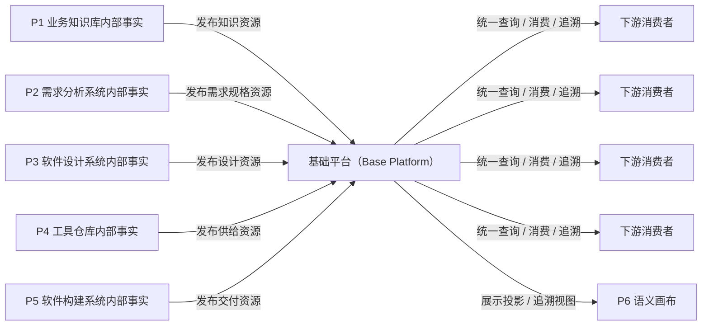
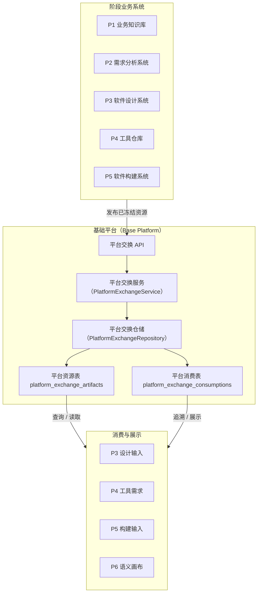
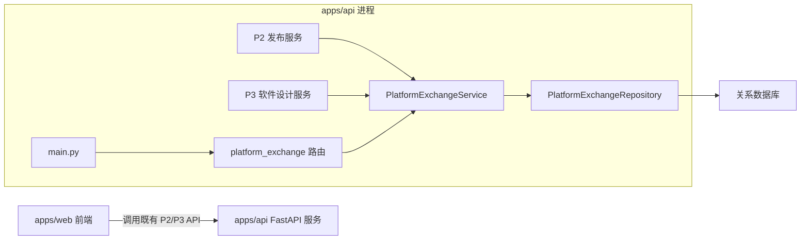
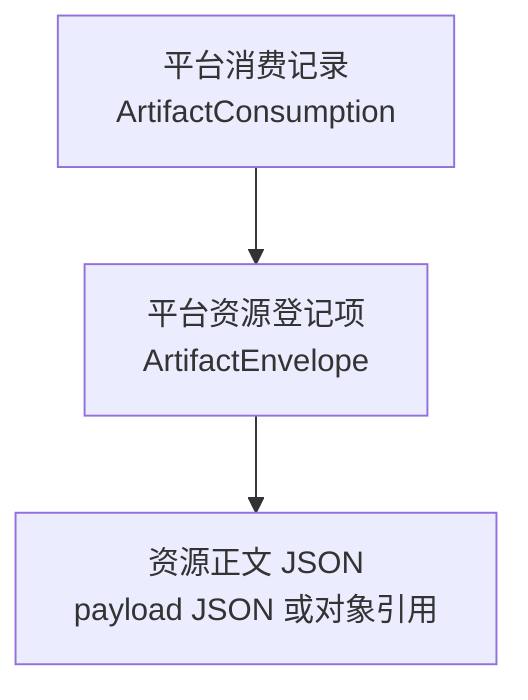
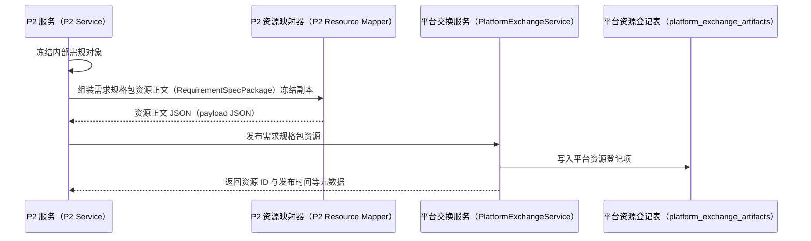
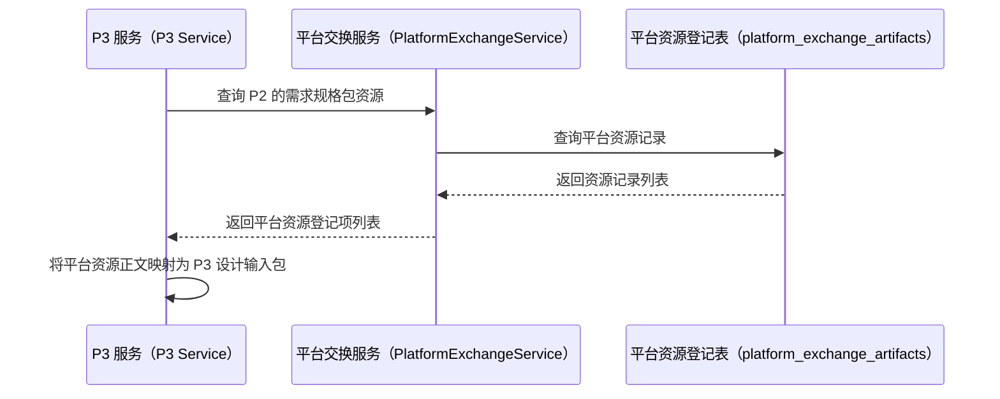
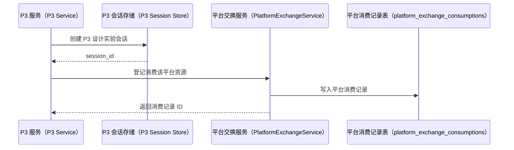
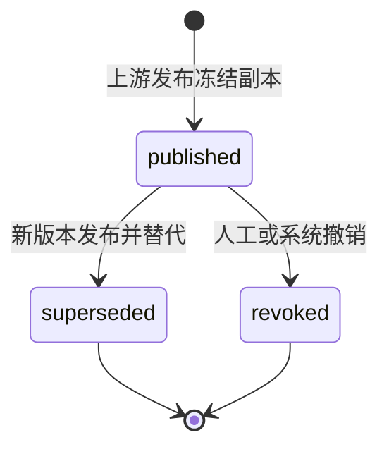

# 基础平台（Base Platform）软件设计说明

> 本文件是软件工厂平台（CodeFactoryV2）中基础平台（Base Platform）的正式软件设计说明。
>
> 本文把基础平台（Base Platform）定义为跨阶段标准数据资源的登记、存储、追溯、版本治理和消费分发底座。它不是某两个阶段之间的临时接口适配，也不是所有阶段内部状态的中央业务库。
>
> 本文同时回答“基础平台是什么”和“基础平台在当前仓库中应如何实现”。因此本文不再拆分补充设计文档；后续实现要求、后台模块、类、表、应用程序接口（Application Programming Interface，API）和工作机制均在本文件内维护。

**日期：** 2026-05-14  
**本轮整理日期：** 2026-05-15  
**首版聚焦链路：** `P2 -> Base Platform -> P3`

**关联正式文档：**

- `DOC/CODEX_DOC/02_设计说明/00_总纲/03-P1-P6数据互联互通与平台交换层设计.md`
- `DOC/CODEX_DOC/02_设计说明/P2_需求分析系统/P2-需求分析系统设计.md`
- `DOC/CODEX_DOC/02_设计说明/P3_软件设计系统/P3-软件设计系统设计.md`
- `DOC/CODEX_DOC/02_设计说明/P4_工具仓库/P4-工具仓库设计.md`
- `DOC/CODEX_DOC/07_过程文档/02_历史计划/2026-05-14-1709-P-BasePlatform分支开设说明.md`

## 1. 文档目的与设计口径

### 1.1 文档目的

本文用于回答以下问题：

1. 基础平台（Base Platform）在软件工厂平台（CodeFactoryV2）里到底是什么。
2. 它在运行时是什么形态：一组 Python 语言文件、一个微服务、一个后端模块，还是某个前端页面的后台。
3. 它是“所有系统的中央数据库”，还是“跨阶段标准成果物的数据底座”。
4. 平台里有哪些数据资源类型，这些资源分别来自哪些阶段。
5. 这些资源在物理上是什么：数据库一行、结构化数据（JavaScript Object Notation，JSON）字段、对象存储文件，还是导出副本。
6. `P2` 和 `P3` 在平台里分别写入什么、读取什么。
7. 后台一共有哪几个模块、哪些主要类、如何注册到当前应用、如何工作。
8. 平台统一存储和统一输出的边界在哪里，哪些数据不应进入平台。

### 1.2 设计口径

本文固定采用以下口径：

- 以软件设计说明的结构组织内容，而不是把概念解释、数据定义和实现方案拆成多份文档。
- 先说明系统定位和运行形态，再说明业务边界、总体架构、后端模块、核心对象、存储、API、关键流程和验收口径。
- 不把阶段内部草稿、工作流和运行态直接上收为平台权威事实。
- 平台只承接“已冻结 / 已发布 / 可下游消费”的标准数据资源。
- 平台资源默认定义为“发布时刻冻结副本”，不是“运行时回源引用”。
- 导出文件、报表、压缩包可以存在，但默认不是首版权威事实存储。

### 1.3 术语使用规则

第一次出现英文名称时，必须同时给出中文对应。本文固定使用以下术语：

| 英文名称 | 中文名称 | 说明 |
| --- | --- | --- |
| Base Platform | 基础平台 | 跨阶段标准数据资源后台底座 |
| ArtifactEnvelope | 平台资源登记项 | 平台里“一份已发布资源副本”的主记录 |
| ArtifactConsumption | 平台消费记录 | 下游阶段消费平台资源的正式留痕 |
| payload | 资源正文 | 被下游实际读取和消费的结构化内容 |
| RequirementSpecPackage | 需求规格包资源正文 | `P2` 发布给 `P3` 的标准需求资源正文 |
| P3DesignInputPackage | P3 设计输入包 | `P3` 从平台资源映射出的输入数据传输对象 |
| Data Transfer Object，DTO | 数据传输对象 | 服务层或接口层传输用对象 |
| FastAPI | Python Web 框架（FastAPI） | 当前 `apps/api` 后端应用框架 |
| SQLAlchemy | Python SQL 工具包（SQLAlchemy） | 当前后端表模型和数据库访问基础 |
| Pydantic | Python 数据校验模型库（Pydantic） | 当前后端请求、命令、响应模型基础 |
| HTTP API | 超文本传输协议应用程序接口 | 前后端或系统间通过 HTTP 暴露的 API |
| JSON | JavaScript Object Notation | 当前资源正文首版存储格式 |
| hash | 哈希摘要 | 用于核对资源正文内容是否一致 |

### 1.4 系统主路径

基础平台（Base Platform）首版主路径固定为：

```text
P2 发布冻结需求规格包
  -> Base Platform 生成平台资源登记项（ArtifactEnvelope）
  -> Base Platform 保存资源正文（payload）发布时刻冻结副本
  -> P3 查询可消费的需求规格包资源
  -> P3 将平台资源映射为 P3 设计输入包（P3DesignInputPackage）
  -> P3 创建设计会话
  -> Base Platform 登记平台消费记录（ArtifactConsumption）
```

一句话结论：

```text
基础平台（Base Platform）是跨阶段标准数据资源的后台底座。
```

更完整一点说：

```text
各阶段先在自己的子系统内部形成业务事实
  -> 当事实达到冻结、发布、可消费边界时
    -> 基础平台登记一份发布时刻冻结副本
      -> 下游阶段统一从基础平台查询、消费和追溯
```

## 2. 系统定位

### 2.1 一句话定位

基础平台（Base Platform）是软件工厂平台（CodeFactoryV2）的平台级数据资源后台。

它不是 `P1`、`P2`、`P3`、`P4`、`P5` 中任何一个阶段的业务子系统，而是这些阶段之间正式成果物流转的公共底座。

### 2.2 当前运行时具体形态

首版基础平台（Base Platform）的当前运行形态必须明确为：

```text
一个运行在既有 apps/api 后端服务内的后端领域模块
```

更具体地说，它是：

1. `apps/api` 现有 Python Web 框架（FastAPI）应用中的一个后端模块；
2. 一组 `platform_exchange` Python 包、服务类、仓储类和数据传输对象；
3. 两张平台交换数据库表；
4. 一组 `/api/platform-exchange/...` HTTP API；
5. 一组被 `P2` 发布服务和 `P3` 设计服务调用的内部应用服务能力。

它首版不是：

1. 独立微服务；
2. 独立进程；
3. 独立前端应用；
4. `P6` 的专属后台；
5. 只保存文件索引的文件仓库。

首版启动服务时，基础平台的存在形式是：

```text
启动 apps/api FastAPI 服务
  -> main.py 注册 platform_exchange 路由
  -> db/models/__init__.py 注册 platform_exchange 表模型
  -> SQLAlchemy 元数据（metadata）创建或识别平台表
  -> P2/P3 服务通过 PlatformExchangeService 调用平台能力
```

因此，从代码实现角度看，基础平台不是“抽象概念”，也不是“另一个 App”。它在当前仓库中的物理形态是：

```text
Python 后端模块 + 数据库表 + HTTP API 路由 + P2/P3 服务集成点
```

### 2.3 正面工作对象

基础平台主要负责五件事：

1. **登记**  
   把各阶段发布出来的标准成果物登记成平台资源副本。

2. **存储**  
   统一保存跨阶段资源副本的元数据、资源正文（payload）、版本、哈希摘要（hash）和追溯信息。

3. **分发**  
   为下游阶段提供统一查询和读取入口，默认读取的是平台内副本，而不是回源到上游库。

4. **留痕**  
   记录谁消费过、何时消费、消费结果如何。

5. **治理**  
   管理资源版本、幂等键、生命周期状态和后续替代 / 撤销（supersede / revoke），并保证已发布副本不被原地覆盖。

### 2.4 基础平台不是什么

基础平台不应被设计成以下东西：

1. **所有阶段内部状态的总数据库**
   - `P2` 草稿、问答轮次、临时正文；
   - `P3` 设计回合补丁（patch）、工作台编辑态；
   - `P4` 制造过程细节；
   - `P5` 构建执行过程日志。

   这些默认都不应该直接进入平台权威存储。

2. **替代业务子系统的万能后台**
   - 它不生成需求规格说明；
   - 不生成软件设计说明；
   - 不做工具制造；
   - 不执行构建。

3. **先文件后结构的文件仓库**
   - 首版不应把平台设计成“只存一堆 zip / pdf / md 文件，再附一层索引”。
   - 首版权威事实应优先是结构化资源记录。

4. **`P6` 的专属后台**
   - `P6` 可以读取平台资源、消费记录、追溯链和展示投影；
   - 但基础平台的职责不是为 `P6` 单独生成页面数据；
   - 基础平台服务的是 `P1 ~ P5` 的正式资源流转，`P6` 是观察者、展示者或消费者之一。

### 2.5 与 `P1 ~ P5` 的关系



这张图的重点是：

- 平台承接的是“发布出来的资源”；
- 平台不是直接承接每个阶段的全部内部表和全部运行时状态；
- `P6` 读取的是平台资源的展示投影和追溯结果，不拥有平台资源的生产权。

## 3. 业务目标与边界

### 3.1 首版负责

首版基础平台负责：

1. 打通 `P2 -> Base Platform -> P3` 的正式资源流转。
2. 保存 `P2` 发布的需求规格包（`requirement_spec_package`）平台冻结副本。
3. 为 `P3` 提供统一的需求规格包查询入口。
4. 在 `P3` 创建设计会话时登记消费记录。
5. 通过资源 ID、版本、哈希摘要和来源追溯支持后续核对。
6. 保留 `P1`、`P4`、`P5` 资源类型占位，避免首版模型只适配 `P2/P3`。
7. 提供基础平台全阶段只读监控日志台，用于按 `P1 ~ P5` 分系统观察资源发布、平台存储和消费状态。

### 3.2 首版不负责

首版不负责：

1. 不引入微服务拆分。
2. 不引入独立事件总线。
3. 不引入多租户权限模型。
4. 不引入对象存储或文件中心。
5. 不把 `P1/P4/P5` 资源全部落地。
6. 不重做 `P2` 或 `P3` 前端页面。
7. 不把 `P3DesignLabSession` 改成持久化表。
8. 不统一接管各阶段的内部草稿、过程日志和工作流状态。
9. 不提供业务操作型平台工作台，不允许在基础平台页面上编辑、发布、撤销或手工消费资源。

### 3.3 平台写入边界

判断某个数据是否应该进入基础平台，固定看它是否已经达到以下边界：

- 已冻结；
- 已发布；
- 可被下游正式消费；
- 需要可追溯的跨阶段资源身份。

因此平台写入边界不是“所有数据先落平台”，而是：

```text
所有跨阶段正式资源必须落平台
所有阶段内部工作态默认不落平台
```

这里的“落平台”必须明确解释为：

```text
在平台内形成一份独立的发布副本
而不是只保存一个指向上游库的运行时引用
```

### 3.4 写入、读取与所有权规则

平台规则应固定为：

| 谁 | 能写什么 |
| --- | --- |
| `P1 ~ P5` 各阶段 | 只能写自己的内部业务对象 |
| 基础平台（Base Platform） | 只能写平台资源登记项和消费记录 |
| 下游阶段 | 不能回写上游内部对象 |

这意味着：

- `P3` 不能直接改 `P2.RequirementAuthoringDocument`；
- `P4` 不能直接改 `P3.SoftwareDesignBaseline`；
- 平台也不应去改 `P2` 或 `P3` 的内部草稿态。

下游阶段的正式读取路径应固定为：

```text
下游阶段
  -> Base Platform
    -> 读取平台中的上游已发布副本
```

不应固定为：

```text
P3 -> 直接查 P2 表
P4 -> 直接查 P3 表
P5 -> 直接查 P4 表
```

也不应变成：

```text
P3 -> Base Platform 取到 P2 引用 -> 再回 P2 读实时数据
```

### 3.5 统一输出的真实含义

“平台统一输出”不等于：

```text
平台代替所有阶段生成所有业务页面返回
```

它真正的含义应是：

```text
平台统一输出跨阶段标准资源
```

也就是说，平台统一输出的是：

- 标准资源清单；
- 资源详情；
- 消费记录；
- 追溯与版本信息。

它不负责统一输出每个阶段自己的全部内部用户界面（User Interface，UI）数据。

## 4. 总体架构

### 4.1 总体分层

基础平台位于阶段业务系统和下游消费系统之间。



### 4.2 当前部署和运行架构

首版不拆微服务。当前部署结构是：



代码结论：

- 基础平台首版是 `apps/api` 内部模块；
- `P2` 和 `P3` 通过服务类调用它；
- 平台 API 作为调试、验收和后续统一查询入口；
- `P1 ~ P5` 业务页面仍优先调用各自既有业务 API；
- 基础平台必须提供一个独立的只读监控日志台页面，用于人工观察平台资源流转事实。

### 4.3 产品能力模块

基础平台首版能力模块如下：

| 模块 | 职责 | 首版状态 |
| --- | --- | --- |
| 平台资源登记模块 | 登记已发布资源，生成资源 ID、版本、哈希摘要和来源追溯 | 必做 |
| 平台资源存储模块 | 保存行内 JSON 资源正文冻结副本 | 必做 |
| 平台资源查询模块 | 按类型、生产阶段、状态查询资源 | 必做 |
| 平台消费记录模块 | 登记下游消费事实 | 必做 |
| 全阶段监控日志台模块 | 按 `P1 ~ P5` 分系统展示发布、存储和消费状态 | 必做 |
| 版本与幂等治理模块 | 控制重复发布、版本冲突、旧版本替代 | 必做 |
| 文件 / 对象存储模块 | 管理大文件、导出件和对象引用 | 占位 |
| 事件发布模块 | 发布跨阶段资源事件 | 占位 |
| P6 展示投影模块 | 面向语义画布输出资源和消费追溯视图 | 占位 |

### 4.4 产品能力与后端层次关系

```text
平台资源登记模块
  -> PlatformExchangeService.publish_artifact()
  -> PlatformExchangeRepository.save_artifact()
  -> PlatformExchangeArtifact

平台资源查询模块
  -> PlatformExchangeService.list_artifacts()
  -> PlatformExchangeRepository.list_artifacts()
  -> PlatformExchangeArtifact

平台消费记录模块
  -> PlatformExchangeService.consume_artifact()
  -> PlatformExchangeRepository.save_consumption()
  -> PlatformExchangeConsumption

P2 发布集成
  -> RequirementSpecWorkItemService.publish_item()
  -> PlatformExchangeService.publish_requirement_spec_package()

P3 查询与消费集成
  -> SoftwareDesignV2Service.list_input_packages()
  -> SoftwareDesignV2Service.create_session()
  -> PlatformExchangeService
```

## 5. 前端软件设计

### 5.1 首版前端定位

基础平台首版需要一个独立的只读前端页面，但它不是业务工作台。

首版前端定位固定为：

```text
基础平台全阶段监控日志台（Base Platform Monitor）
```

它回答的是：

```text
P1 ~ P5 各分系统向平台发布了什么
Base Platform 实际登记和保存了什么
P1 ~ P5 各分系统从平台消费了什么
```

它不回答也不处理：

```text
如何编辑需求
如何生成设计
如何制造工具
如何执行构建
如何手工发布、撤销或消费平台资源
```

因此，首版前端规则是：

1. `P1 ~ P5` 业务页面仍调用各自既有业务 API。
2. 基础平台新增一个只读监控日志台页面，用于观察平台资源流转。
3. 监控日志台不提供输入框、保存按钮、发布按钮、撤销按钮或手工消费按钮。
4. 监控日志台不归入 `P6` 页面体系，也不替代 `P6` 总观察台。
5. 页面展示风格可以采用黑色背景的日志台形式，但数据来源必须来自平台后端 API，而不是浏览器控制台日志。

### 5.2 全阶段监控日志台结构

基础平台监控日志台必须按分系统分框展示，不能把所有记录混成一个全局流水列表。

首版页面结构建议为：

```text
┌──────────────┐ ┌──────────────┐ ┌──────────────┐
│ P1 框         │ │ P2 框         │ │ P3 框         │
│ 发布 / 消费   │ │ 发布 / 消费   │ │ 发布 / 消费   │
└──────────────┘ └──────────────┘ └──────────────┘

┌──────────────┐ ┌──────────────┐ ┌────────────────────┐
│ P4 框         │ │ P5 框         │ │ Base Platform 框    │
│ 发布 / 消费   │ │ 发布 / 消费   │ │ 平台资源总账        │
└──────────────┘ └──────────────┘ └────────────────────┘
```

其中：

- `P1` 框展示 `P1` 发布到平台的知识资源，以及 `P1` 作为消费者时消费的平台资源。
- `P2` 框展示 `P2` 消费的 `P1` 资源，以及 `P2` 发布到平台的需求规格包。
- `P3` 框展示 `P3` 消费的 `P2` 需求规格包，以及 `P3` 后续发布的软件设计包和模块工单批次包。
- `P4` 框展示 `P4` 消费的 `P3` 工单或设计资源，以及 `P4` 发布的工具供给清单。
- `P5` 框展示 `P5` 消费的 `P3/P4` 资源，以及 `P5` 发布的交付目录和构建清单。
- `Base Platform` 框展示平台当前持有的资源总账、资源类型计数、最新发布资源和最新消费记录。

首版虽然只真实打通 `P2 -> Base Platform -> P3`，但页面结构必须从第一版就包含 `P1 ~ P5` 全部框。未接入阶段显示：

```text
暂无平台资源
暂无消费记录
未接入首版链路
```

### 5.3 监控日志台数据来源

首版监控日志台不新增审计事件表。它直接从现有平台资源表和平台消费表派生展示内容。

数据来源固定为：

| 页面区域 | 数据来源 | 派生规则 |
| --- | --- | --- |
| `P1 ~ P5` 发布区 | `platform_exchange_artifacts` | 按 `producer_stage` 分组 |
| `P1 ~ P5` 消费区 | `platform_exchange_consumptions` | 按 `consumer_stage` 分组 |
| `Base Platform` 资源总账 | `platform_exchange_artifacts` | 按 `artifact_type`、`producer_stage`、`lifecycle_status` 汇总 |
| `Base Platform` 消费总账 | `platform_exchange_consumptions` | 按 `consumer_stage`、`result_status` 汇总 |

因此，首版不引入：

```text
platform_exchange_audit_events
```

不新增审计事件表的原因是：

1. 平台已发布资源可以由平台资源登记项证明。
2. 平台已消费资源可以由平台消费记录证明。
3. 当前验收重点是“谁发布了什么、平台存了什么、谁消费了什么”，现有两张表已经足够。

只有后续明确需要记录“查询列表、预览资源、读取失败、页面载入”等非业务消费动作时，才新增独立审计事件对象或审计事件表。

### 5.4 监控日志台展示内容

每个分系统框内至少包含两组信息：

1. **发布到平台**
   - 最近发布时间；
   - 资源类型；
   - 平台资源 ID（`artifact_id`）；
   - 资源业务版本（`artifact_version`）；
   - 生命周期状态；
   - 资源正文哈希摘要（`payload_hash`）。

2. **从平台消费**
   - 最近消费时间；
   - 被消费平台资源 ID（`artifact_id`）；
   - 消费者内部对象 ID（`consumer_ref_id`）；
   - 消费方式；
   - 消费结果。

`Base Platform` 框至少包含：

1. 按资源类型统计的平台资源数量；
2. 按生产阶段统计的平台资源数量；
3. 按生命周期状态统计的平台资源数量；
4. 最新平台资源登记记录；
5. 最新平台消费记录；
6. 当前首版主链状态，例如：

```text
P2 requirement_spec_package: 3 published
P3 ArtifactConsumption: 2 accepted
P1 published_knowledge_snapshot: 0
P4 tool_delivery_manifest: 0
P5 delivery_catalog/build_manifest: 0
```

日志台中的每条记录可以采用类似控制台日志的视觉表达，但它是普通页面渲染，不是浏览器 `console.log`。

示例：

```text
[P2][14:03:11] 发布 requirement_spec_package artifact=art_001 version=1 hash=...
[BASE][14:03:11] 登记 artifact=art_001 type=requirement_spec_package status=published
[P3][14:05:22] 消费 artifact=art_001 session=p3-session-001 status=accepted
```

### 5.5 监控日志台 API 口径

监控日志台可以复用既有平台查询 API：

```text
GET /api/platform-exchange/artifacts
GET /api/platform-exchange/consumptions
```

若前端需要减少多次请求，可以后续新增只读聚合 API：

```text
GET /api/platform-exchange/monitor
```

该聚合 API 只做读取和汇总，不产生新业务状态，不写入审计事件。

### 5.6 前端准实时读取策略

`P2 -> Base Platform -> P3` 首版链路在后端采用同步写入和同步查询：

```text
P2 发布需求规格包
  -> Base Platform 写入平台资源登记项（ArtifactEnvelope）
  -> P3 查询平台资源并映射为 P3 设计输入包（P3DesignInputPackage）
```

但是前端页面如果只在首次打开时请求一次数据，会出现“后端已经有新资源，已打开页面仍显示旧数据”的体验问题。该问题不是平台存储失败，也不是 `P3` 后端查询失败，而是已打开前端页面缺少准实时刷新机制。

首版统一采用以下前端准实时读取策略：

```text
页面首次打开：立即请求
页面保持可见：每 1 秒轮询一次
页面从后台切回前台：立即请求
用户手动刷新：立即请求
请求未完成时：不发起并发重复请求
请求失败时：保留上一版可用数据并显示错误
```

该策略适用于：

| 页面或模块 | 请求接口 | 刷新周期 | 说明 |
| --- | --- | --- | --- |
| 基础平台监控日志台（Base Platform Monitor） | `GET /api/platform-exchange/monitor` | 1 秒 | 展示 `P1 ~ P5` 与 `Base Platform` 总账 |
| P3 设计输入包列表（P3 Input Packages） | `GET /api/software-design-v2/input-packages` | 1 秒 | 让 `P2` 发布后的需求规格包尽快进入 `P3` 可选输入 |
| 后续 `P4/P5` 输入列表 | 待定 | 1 秒 | 延续相同策略 |

虽然基础平台监控日志台是只读观察页面，`P3` 输入包列表是业务入口，但从用户验收视角看，两者的实时性要求一致：

```text
P2 已发布
  -> P3 应能尽快看到
  -> Base Platform Monitor 也应能尽快看到
```

因此首版不再为两者设置不同刷新策略，二者统一使用同一套前端准实时读取机制。

技术实现上，前端应提供通用读取机制：

```text
usePollingResource
```

中文口径为：

```text
前端轮询资源读取 Hook
```

职责包括：

1. 组件挂载后立即加载数据；
2. 页面可见时按固定周期轮询；
3. 浏览器标签页从后台切回前台时立即刷新；
4. 浏览器窗口重新获得焦点时立即刷新；
5. 避免同一资源重复并发请求；
6. 组件卸载时清理定时器和事件监听；
7. 请求失败时调用错误处理，但不强制清空旧数据。

基础平台监控日志台通过以下方式读取：

```text
usePollingResource(
  intervalMs = 1000,
  load = GET /api/platform-exchange/monitor
)
```

`P3DesignLabPage` 通过以下方式读取：

```text
usePollingResource(
  intervalMs = 1000,
  load = GET /api/software-design-v2/input-packages
)
```

`P3` 输入包列表刷新后必须保留用户当前选择：

```text
如果当前 selectedPackageId 仍存在
  -> 保留当前选择
否则
  -> 选择最新列表中的第一项
```

这样可以避免页面自动刷新时打断用户正在查看或操作的输入包。

1 秒轮询是首版准实时方案，不是最终事件驱动架构。后续如果需要更强实时性，可以演进为：

```text
Server-Sent Events（服务端事件推送，SSE）
WebSocket（双向实时通信）
平台事件总线
```

即使后续切换为推送机制，也应优先复用当前抽象边界：

```text
页面不直接绑定传输机制
  -> 页面调用统一资源读取/订阅抽象
  -> 底层可从 polling 替换为 SSE/WebSocket
```

也就是说，`usePollingResource` 当前是轮询实现；后续可扩展为统一的 `useRealtimeResource` 或在内部增加推送能力，而不是让每个页面各自实现实时通信。

### 5.7 与 `P6` 的前端关系

基础平台不是 `P6` 的后台专属模块。

更准确的关系是：

```text
Base Platform 保存跨阶段标准资源和消费记录
P6 可以读取这些资源的展示投影
P6 不拥有这些资源的生产权和存储权
```

基础平台监控日志台也不放入 `P6`。两者边界如下：

| 页面 | 归属 | 目的 |
| --- | --- | --- |
| 基础平台监控日志台 | 基础平台 | 按 `P1 ~ P5` 分系统观察平台资源发布、存储、消费事实 |
| `P6` 总观察台 | `P6` | 面向平台全局状态、语义画布、跨阶段总览和展示投影 |

后续如果 `P6` 展示 `P1 ~ P5` 流转图，应通过平台查询资源关系、消费记录、版本和追溯链，而不是直接扫描 `P2/P3/P4/P5` 内部表。

### 5.8 前端改动边界

首版不改 `P1 ~ P5` 既有业务页面。若需要实现基础平台监控日志台，候选位置为：

```text
apps/web/src/lib/api.ts
apps/web/src/lib/platformExchange.ts
apps/web/src/lib/usePollingResource.ts
apps/web/src/pages/BasePlatformMonitorPage.tsx
apps/web/src/lib/softwareDesignV2.ts
apps/web/src/pages/P3DesignLabPage.tsx
apps/web/src/pages/RequirementAnalysisLabPage.tsx
```

其中：

- `BasePlatformMonitorPage.tsx` 是基础平台自己的只读页面；
- `platformExchange.ts` 可封装平台资源和消费记录查询；
- `usePollingResource.ts` 承接跨页面准实时读取机制；
- `P3DesignLabPage.tsx` 可以接入同一准实时读取机制以刷新平台输入包，但不因监控日志台而重做业务工作区。

## 6. 后端软件设计

### 6.1 后端技术栈

基础平台首版复用当前 `apps/api` 后端技术栈：

| 技术 | 用途 |
| --- | --- |
| Python | 后端编程语言 |
| FastAPI | HTTP API 框架 |
| SQLAlchemy | 数据库表模型与访问 |
| Pydantic | 命令、查询、响应对象校验 |
| pytest | Python 自动化测试框架 |

### 6.2 后端模块总览

首版后台一共包含以下代码模块：

| 序号 | 模块路径 | 模块类型 | 职责 |
| --- | --- | --- | --- |
| 1 | `apps/api/app/db/models/platform_exchange.py` | 数据库表模型模块 | 定义平台资源表和平台消费表 |
| 2 | `apps/api/app/platform_exchange/models.py` | 契约模型模块 | 定义命令、查询参数、响应对象和常量 |
| 3 | `apps/api/app/platform_exchange/repository.py` | 仓储模块 | 封装平台资源和消费记录的数据库读写 |
| 4 | `apps/api/app/platform_exchange/service.py` | 领域服务模块 | 封装发布、查询、消费、哈希、幂等和映射逻辑 |
| 5 | `apps/api/app/api/routes/platform_exchange.py` | API 路由模块 | 暴露 `/api/platform-exchange/...` HTTP API |
| 6 | `apps/api/app/db/models/__init__.py` | 表模型注册点 | 注册平台表模型，使建表流程可识别 |
| 7 | `apps/api/app/main.py` | 应用路由注册点 | 注册平台交换路由 |
| 8 | `apps/api/app/requirement_spec_work_items/service.py` | `P2` 集成点 | 发布需规时调用平台服务 |
| 9 | `apps/api/app/software_design_v2/service.py` | `P3` 集成点 | 查询平台资源并登记消费 |

从职责边界看，真正归基础平台所有的是前五个模块；后四个是注册或跨阶段集成点。

### 6.3 后端类与职责

#### 6.3.1 数据库表模型类

模块：

```text
apps/api/app/db/models/platform_exchange.py
```

必须定义以下表模型类：

| 类名 | 中文名 | 对应表 | 职责 |
| --- | --- | --- | --- |
| `PlatformExchangeArtifact` | 平台交换资源表模型 | `platform_exchange_artifacts` | 保存一份已发布平台资源副本 |
| `PlatformExchangeConsumption` | 平台交换消费表模型 | `platform_exchange_consumptions` | 保存一次下游消费事实 |

这两个类只表达数据库持久化形态，不承担业务判断。

#### 6.3.2 契约模型类

模块：

```text
apps/api/app/platform_exchange/models.py
```

建议定义以下数据传输对象（DTO）或命令对象：

| 类名 | 中文名 | 职责 |
| --- | --- | --- |
| `PublishArtifactCommand` | 发布平台资源命令 | 通用发布入口参数 |
| `PublishRequirementSpecPackageCommand` | 发布需求规格包命令 | `P2` 发布需求规格包时使用 |
| `ConsumeArtifactCommand` | 消费平台资源命令 | `P3` 或其他下游登记消费时使用 |
| `ArtifactQueryFilters` | 平台资源查询过滤条件 | 查询资源列表时使用 |
| `ConsumptionQueryFilters` | 平台消费查询过滤条件 | 查询消费记录时使用 |
| `ArtifactEnvelopeDTO` | 平台资源登记项数据传输对象 | API 和服务返回平台资源 |
| `ArtifactConsumptionDTO` | 平台消费记录数据传输对象 | API 和服务返回消费记录 |

命名可以根据当前代码风格略有调整，但职责不能混淆：命令对象用于输入，数据传输对象用于输出，数据库表模型不直接作为 API 响应合同暴露。

#### 6.3.3 仓储类

模块：

```text
apps/api/app/platform_exchange/repository.py
```

必须定义：

```text
PlatformExchangeRepository
```

职责：

1. 保存平台资源登记项。
2. 按资源 ID 查询平台资源。
3. 按过滤条件查询平台资源列表。
4. 按幂等键查询已有资源。
5. 按生产者、资源类型、业务版本查询潜在冲突资源。
6. 将旧版本标记为 `superseded`。
7. 保存平台消费记录。
8. 查询平台消费记录列表。

仓储层不应组装 `P2` 需求规格包，也不应把平台资源映射成 `P3DesignInputPackage`。这些属于服务层或阶段集成层职责。

#### 6.3.4 服务类

模块：

```text
apps/api/app/platform_exchange/service.py
```

必须定义：

```text
PlatformExchangeService
```

首版服务方法：

| 方法 | 用途 |
| --- | --- |
| `publish_artifact(command)` | 通用发布入口 |
| `publish_requirement_spec_package(command)` | `P2` 需求规格包发布入口 |
| `list_artifacts(filters)` | 查询平台资源 |
| `get_artifact(artifact_id)` | 读取平台资源 |
| `consume_artifact(command)` | 登记平台消费 |
| `list_consumptions(filters)` | 查询消费记录 |
| `compute_payload_hash(payload)` | 计算规范化资源正文哈希摘要 |
| `build_idempotency_key(command, payload_hash)` | 生成幂等键 |

服务层必须承担以下业务判断：

1. 资源正文哈希摘要计算。
2. 幂等发布判断。
3. 同版本不同正文的冲突检测。
4. 旧版本替代。
5. 被撤销资源不可消费。
6. 消费结构模式版本校验。

#### 6.3.5 API 路由模块

模块：

```text
apps/api/app/api/routes/platform_exchange.py
```

职责：

1. 暴露平台资源查询 API。
2. 暴露平台资源详情 API。
3. 暴露平台资源登记 API。
4. 暴露平台资源消费 API。
5. 暴露消费记录查询 API。

路由层不应直接访问数据库表模型，必须通过 `PlatformExchangeService`。

#### 6.3.6 `P2` 集成点

模块：

```text
apps/api/app/requirement_spec_work_items/service.py
```

目标集成点：

```text
RequirementSpecWorkItemService.publish_item()
```

职责：

1. 保持当前 `P2` 发布入口不变。
2. 完成 `P2` 内部冻结和 `RequirementSpec` 创建。
3. 组装需求规格包资源正文（RequirementSpecPackage）冻结副本。
4. 调用 `PlatformExchangeService.publish_requirement_spec_package()`。
5. 将 `published_package_id` 回写为平台资源 ID（`artifact_id`）。

`P2` 集成点不应让 `P3` 直接读取 `P2` 内部对象。

#### 6.3.7 `P3` 集成点

模块：

```text
apps/api/app/software_design_v2/service.py
```

目标集成点：

```text
SoftwareDesignV2Service.list_input_packages()
SoftwareDesignV2Service.create_session()
```

职责：

1. 查询平台中已发布的需求规格包资源。
2. 将平台资源正文映射为 P3 设计输入包（P3DesignInputPackage）。
3. 创建 `P3DesignLabSession` 时登记平台消费记录。
4. 在平台表为空时保留旧扫描路径作为短期降级。

`P3` 集成点不应把平台资源理解为“回源到 `P2` 的引用”。

### 6.4 后端工作机制

#### 6.4.1 发布机制

```text
上游阶段完成内部冻结
  -> 上游阶段组装标准资源正文（payload）
  -> PlatformExchangeService 计算 payload_hash
  -> PlatformExchangeService 生成 idempotency_key
  -> 检测是否重复发布或版本冲突
  -> 写入 PlatformExchangeArtifact
  -> 返回 artifact_id
```

发布机制的核心不是“登记一个上游 ID”，而是“保存一份平台可直接消费的资源正文副本”。

#### 6.4.2 查询机制

```text
下游阶段按 artifact_type / producer_stage / lifecycle_status 查询
  -> PlatformExchangeService.list_artifacts()
  -> PlatformExchangeRepository.list_artifacts()
  -> 返回平台资源登记项和资源正文
  -> 下游映射成自己的输入 DTO
```

查询默认只返回 `published` 状态资源。历史回放可以显式查询 `superseded`。

#### 6.4.3 消费机制

```text
下游阶段基于 artifact_id 创建自己的业务对象
  -> 调用 PlatformExchangeService.consume_artifact()
  -> 校验资源存在、状态可消费、schema 可接受
  -> 写入 PlatformExchangeConsumption
  -> 返回 consumption_id
```

消费记录是平台事实，不应藏在 `P3DesignLabSession` 等下游对象内部。

#### 6.4.4 幂等机制

资源正文哈希摘要（payload hash）必须基于规范化 JSON 计算：

```text
json.dumps(payload, sort_keys=True, ensure_ascii=False, separators=(",", ":"))
```

首版幂等键：

```text
producer_stage + artifact_type + producer_ref_id + artifact_version + payload_hash
```

处理规则：

1. 若同一幂等键已存在，返回已有资源。
2. 若同一 `producer_stage + artifact_type + producer_ref_id + artifact_version` 已存在但 `payload_hash` 不同，返回版本冲突，要求上游生成新版本。
3. 不允许覆盖既有 `payload`。
4. 发布新版本时，同一 `producer_stage + artifact_type + producer_ref_id` 下旧的 `published` 资源可标记为 `superseded`。
5. 已存在的消费记录仍指向旧 `artifact_id`。

#### 6.4.5 降级机制

`P3` 首版保留旧扫描路径作为降级：

```text
优先读 Base Platform
  -> 若平台表中无 requirement_spec_package
    -> 回退到旧的 RequirementAuthoringDocument.frozen_package 扫描
```

降级规则：

1. 只允许平台表为空时回退。
2. 一旦平台存在 `P2` 已发布资源，`P3` 默认不得再混合读取旧路径。
3. 测试中应覆盖平台路径，不能只依赖回退路径。

#### 6.4.6 事务机制

当前仓储内部多处直接 `commit()`，短期无法天然保证完整发布链路的单事务原子性。

首版采用两步策略：

1. **本次实现内的最小修正**
   - 平台写入具备幂等键和版本冲突检测。
   - 对已经由旧仓储提前提交的 `RequirementSpec`，通过幂等键和版本冲突检测保证重试可恢复。
   - `P2` 发布返回的 `published_package_id` 必须指向平台 `artifact_id`，便于后续核对平台写入是否完成。

2. **后续重构方向**
   - 将 `RequirementSpecRepository.add_spec()`、`RequirementSpecWorkItemRepository.save_item()` 拆分为 `add/flush/commit` 语义。
   - 让 `P2` 发布完整链路由应用服务统一提交。

首版不应为了追求事务完美而大面积重构所有既有仓储。当前更稳妥的做法是把平台写入设计成幂等、可重试、可检测冲突。

#### 6.4.7 前端轮询与后端一致性边界

前端 1 秒轮询只解决“已打开页面是否及时重新读取后端状态”的可见性问题，不改变后端权威事实。

后端权威链路仍然是：

```text
P2 发布接口返回 200
  -> Base Platform 已写入 published 状态 artifact
  -> P3 input-packages API 从 Base Platform 查询该 artifact
```

如果出现以下问题，不能归因为前端轮询：

1. `P2` 发布接口失败；
2. `P2` 发布接口返回 200 但平台表没有写入资源；
3. `P3` 后端 `input-packages` 查询条件错误；
4. 平台资源生命周期状态不是 `published`；
5. 数据库事务未提交或服务连接到不同数据库。

这些属于后端链路一致性问题，应通过后端合同测试和接口检查定位。

### 6.5 注册和装配要求

模型注册要求：

```text
apps/api/app/db/models/__init__.py
```

必须导入 `platform_exchange` 模型模块，确保 SQLAlchemy 元数据建表入口（`Base.metadata.create_all(engine)`）能创建新表。

路由注册要求：

```text
apps/api/app/main.py
```

必须 include 平台交换路由，例如：

```text
platform_exchange_router
```

服务装配要求：

```text
P2 publish_item()
  -> PlatformExchangeService

P3 list_input_packages() / create_session()
  -> PlatformExchangeService
```

### 6.6 错误处理

首版错误分类：

| 场景 | 建议状态码 | 说明 |
| --- | --- | --- |
| 资源不存在 | `404` | `artifact_id` 不存在 |
| 资源版本冲突 | `409` | 同一版本已有不同 payload hash |
| 结构模式不支持 | `400` | 当前消费者不接受该结构模式版本 |
| 被撤销资源不可消费 | `409` | `revoked` 不允许消费 |
| 参数不合法 | `400` | 请求字段缺失或非法 |

`P3` 创建会话时，若消费登记失败：

1. 首版建议直接返回失败，不应静默忽略。
2. 因当前 `P3DesignLabSession` 是内存态对象，消费失败后应删除刚创建的内存会话，避免出现无消费记录的会话。

## 7. 核心对象模型

### 7.1 两层对象模型

软件工厂平台（CodeFactoryV2）中的数据对象应分为两层：

#### 7.1.1 阶段内部业务对象

它们归各阶段自己维护，例如：

- `P2.RequirementSpecWorkItem`（需求规格工作项）
- `P2.RequirementAuthoringDocument`（需求规格编写文档）
- `P3.P3DesignLabSession`（P3 设计实验会话）
- `P4.ToolDemandSheet`（工具需求单）
- `P5.SoftwareBuildOrder`（软件构建主单）

这些对象回答的是：

- 本阶段现在在做什么；
- 草稿进行到哪里；
- 工作流状态如何；
- 谁能继续编辑。

#### 7.1.2 平台数据资源对象

它们归基础平台维护，例如：

- 平台资源登记项（ArtifactEnvelope）
- 资源正文（payload）
- 平台消费记录（ArtifactConsumption）

这些对象回答的是：

- 某个阶段正式发布了什么；
- 这个资源的结构模式（schema）、版本、来源、哈希摘要（hash）是什么；
- 哪个下游消费了它；
- 这个资源现在是否仍是当前有效版本。

这些对象默认不回答的问题是：

- 上游当前草稿已经被编辑到哪里；
- 上游今天最新的一版临时状态是什么；
- 是否应回源读取上游最新值。

因为平台对象默认保存的是发布时刻的冻结副本，不是上游对象的实时引用。

### 7.2 平台核心对象

平台首版至少有三个核心概念：

1. **平台资源登记项（ArtifactEnvelope）**  
   平台里“一份已发布资源副本”的主记录。

2. **资源正文（payload）**  
   某类资源副本的正文内容，例如需求规格包资源正文（RequirementSpecPackage）。

3. **平台消费记录（ArtifactConsumption）**  
   某个下游系统对某份资源的正式消费事实。

### 7.3 统一资源关系



它表示：

- 一条平台资源登记项关联一份资源正文（payload）；
- 多条消费记录可以指向同一条平台资源登记项。

### 7.4 对象与模块映射

| 对象 | 归属模块 | 物理形态 | 说明 |
| --- | --- | --- | --- |
| 平台资源登记项（ArtifactEnvelope） | 基础平台 | `PlatformExchangeArtifact` 表模型 / `platform_exchange_artifacts` 一行 | 平台资源主记录 |
| 资源正文（payload） | 基础平台 | `platform_exchange_artifacts.payload` JSON | 下游正式消费的冻结副本 |
| 平台消费记录（ArtifactConsumption） | 基础平台 | `PlatformExchangeConsumption` 表模型 / `platform_exchange_consumptions` 一行 | 消费留痕 |
| 需求规格包资源正文（RequirementSpecPackage） | `P2` 发布，平台持有副本 | `payload` JSON 内对象 | `P2` 发布给 `P3` 的标准资源正文 |
| P3 设计输入包（P3DesignInputPackage） | `P3` | 运行时 DTO | 从平台资源正文映射而来 |

## 8. 平台资源类型与阶段映射

### 8.1 资源类型总表

平台资源类型必须先以资源矩阵固定下来，再进入表结构和接口实现。

| 资源类型 | 中文名 | 生产阶段 | 主要消费阶段 | 首版物理形态 | 首版状态 |
| --- | --- | --- | --- | --- | --- |
| `published_knowledge_snapshot` | 发布知识快照 | `P1` | `P2` | `platform_exchange_artifacts.payload` JSON 副本 | 占位 |
| `requirement_spec_package` | 需求规格包 | `P2` | `P3` | `platform_exchange_artifacts.payload` JSON 冻结副本 | 首版详细实现 |
| `software_design_package` | 软件设计包 | `P3` | `P4` / `P5` | `platform_exchange_artifacts.payload` JSON 冻结副本 | 占位 |
| `module_workorder_batch_package` | 模块工单批次包 | `P3` | `P4` | `platform_exchange_artifacts.payload` JSON 冻结副本 | 占位 |
| `tool_delivery_manifest` | 工具供给清单 | `P4` | `P5` | JSON 副本或对象存储副本 | 占位 |
| `delivery_catalog` | 交付目录 | `P5` | 外部交付 / `P6` | JSON 副本或对象存储副本 | 占位 |
| `build_manifest` | 构建清单 | `P5` | 外部交付 / `P6` | JSON 副本或对象存储副本 | 占位 |

资源类型编码只用于系统内部识别；第一次使用时必须同时给出中文名。例如发布知识快照（`published_knowledge_snapshot`）、需求规格包（`requirement_spec_package`）、软件设计包（`software_design_package`）、模块工单批次包（`module_workorder_batch_package`）、工具供给清单（`tool_delivery_manifest`）、交付目录（`delivery_catalog`）和构建清单（`build_manifest`）。

### 8.2 资源类型通用规则

每一种平台资源类型都必须明确：

1. 资源名称；
2. 生产阶段；
3. 主要消费阶段；
4. 资源正文结构模式（payload schema）；
5. 版本规则；
6. 副本生成时机；
7. 消费记录是否必需；
8. 是否允许后续撤销或替代。

首版所有资源均采用：

```text
发布时生成平台副本
下游读取平台副本
上游修订生成新版本
旧版本不原地覆盖
```

### 8.3 `P1` 资源占位

`P1` 首版在平台层建议只暴露“已发布知识资源”，不暴露治理中间态。

建议资源名：

```text
发布知识快照（published_knowledge_snapshot）
```

当前只保留占位口径：

- 生产者：`P1`
- 消费者：`P2`
- 物理形态：平台资源登记项的资源正文（`ArtifactEnvelope.payload`）中的知识快照 JSON 副本
- 副本规则：发布态知识形成后再落平台，不读取治理中间态作为正式资源

### 8.4 `P2` 资源详细说明

`P2` 是当前平台首版最重要的生产者。

#### 8.4.1 `P2` 内部对象

当前 `P2` 主要内部对象包括：

- `RequirementSpecWorkItem`（需求规格工作项）
- `RequirementAuthoringDocument`（需求规格编写文档）
- `RequirementAnalysisSession`（需求分析会话）
- `RequirementSpec`（结构化需求规格）

这些对象全部归 `P2` 自己维护，不应直接作为平台资源暴露给 `P3`。

#### 8.4.2 `P2` 对平台发布的正式资源

`P2` 对平台发布的正式资源应命名为：

```text
需求规格包（requirement_spec_package）
```

它在逻辑上是：

```text
需求规格包资源正文（RequirementSpecPackage）
```

它在物理上是：

```text
platform_exchange_artifacts 表中的一行
  其中资源正文列（payload） = 需求规格包资源正文（RequirementSpecPackage）JSON 冻结副本
```

这里必须明确：

```text
这是一份平台内发布副本
不是指向 P2 原始表记录的运行时引用
```

#### 8.4.3 需求规格包资源正文（RequirementSpecPackage）字段结构

需求规格包资源正文（RequirementSpecPackage）是 `P2` 在发布边界上，为下游消费而整理出的标准资源正文副本。

它不是：

- `RequirementSpecWorkItem` 本身；
- `RequirementAuthoringDocument` 本身；
- `RequirementSpec` 这张表的一行本身；
- 一个“读的时候再回 P2 取最新值”的引用壳；
- 一个必须先导出的文件包。

首版建议字段：

| 字段 | 中文名 | 发布时取值来源 | 物理形态 |
| --- | --- | --- | --- |
| `standard_document` | 标准需求规格正文 | `RequirementAuthoringDocument.frozen_package.standard_document` | 资源正文 JSON 内字段 |
| `structured_spec` | 结构化需求规格 | `RequirementAuthoringDocument.frozen_package.structured_spec` | 资源正文 JSON 内字段 |
| `annotations` | 批注与提示 | `RequirementAuthoringDocument.frozen_package.annotations` | 资源正文 JSON 内字段 |
| `check_result` | 检查结果 | `RequirementAuthoringDocument.check_result` | 资源正文 JSON 内字段 |
| `knowledge_binding` | 知识绑定摘要 | `RequirementAuthoringDocument.semantic_state.knowledge_binding` | 资源正文 JSON 内字段 |
| `source_trace` | 来源追溯 | `P2` 组装的追溯信息 | 资源正文 JSON 内字段 |
| `p3_consumable` | 是否允许 P3 消费 | 发布边界标记 | 资源正文 JSON 内字段 |

这里“发布时取值来源”的含义必须固定为：

```text
平台在发布动作发生时，从 P2 当前冻结事实中取值并写入自己的资源正文（payload）副本
而不是在平台中保存一个可回源解析的字段级引用关系
```

因此：

- `P2` 后续再修改 `RequirementAuthoringDocument`，不会原地改变既有平台资源；
- 平台中的 `RequirementSpecPackage` 与 `P2.frozen_package` 是“发布时取值复制关系”，不是“运行时联动关系”；
- `P3` 若要判断上游是否产生新版本，应查询平台中新发布的资源版本，而不是回源读取旧资源对应的 `P2` 当前值。

#### 8.4.4 当前 `P2` 物理事实长什么样

按当前代码：

- `RequirementAuthoringDocument` 是 `requirement_authoring_documents` 表中的一行；
- `document` 是该行上的 JSON 字段；
- `frozen_package` 也是该行上的 JSON 字段；
- `RequirementSpec` 是 `requirement_specs` 表中的一行，主体内容在 `payload` JSON 字段。

所以当前 `P2` 已经具备“结构化 JSON 存储”的基础，并不需要为了首版平台先转成物理文件。

但要特别注意：当前 `P2` 自己有一份冻结事实，并不等于平台层应该继续只保留一条引用。平台层的职责恰恰是再生成一份跨阶段发布副本。

#### 8.4.5 需求规格说明是不是文件

当前正式口径是：

1. **权威事实**
   - 在 `P2` 当前实现里，是数据库 JSON；
   - 在基础平台首版里，也应继续是平台行内资源正文 JSON（payload JSON）；
   - 这份平台资源正文（payload）是发布时刻副本，不是运行时引用。

2. **导出文件**
   - 可以后续生成 `md/pdf/docx/json`；
   - 但它们是导出副本，不是首版主链权威事实。

### 8.5 `P3` 资源详细说明

`P3` 在平台中同时扮演两种角色：

1. `P2` 资源的消费者；
2. 后续 `P4` / `P5` 资源的生产者。

#### 8.5.1 `P3` 作为消费者

`P3` 自己的内部对象包括：

- P3 设计输入包（`P3DesignInputPackage`）
- P3 设计实验会话（`P3DesignLabSession`）
- 软件设计基线（`SoftwareDesignBaseline`，后续）

这些对象与平台对象不是一回事。

其中：

- P3 设计输入包（`P3DesignInputPackage`）是 `P3` 的输入适配数据传输对象（DTO）；
- 它不应独立存成平台资源；
- 它应从平台资源登记项的资源正文（`ArtifactEnvelope.payload`）动态映射出来；
- 它的正式来源应是平台副本，不应再回 `P2` 取同一资源的最新态。

也就是说：

```text
平台资源登记项的资源正文（ArtifactEnvelope.payload）
  -> P3 设计输入包（P3DesignInputPackage）
  -> P3 设计实验会话（P3DesignLabSession）
```

同一个 `artifact_id` 一旦确定，`P3` 消费的就是该 `artifact_id` 对应的固定副本，而不是去 `P2` 查询“当前最新那份”。

#### 8.5.2 `P3` 作为消费者时，平台里会新增什么

`P3` 消费 `P2` 资源时，平台里新增的是：

```text
平台消费记录（ArtifactConsumption）
```

物理上就是：

```text
platform_exchange_consumptions 表中的一行
```

而不是在 `P3DesignLabSession` 这一行上多塞几个消费字段。

#### 8.5.3 `P3` 未来对平台发布的资源

`P3` 后续应至少向平台发布两类资源：

1. 软件设计包（`software_design_package`）
2. 模块工单批次包（`module_workorder_batch_package`）

当前先保留占位口径：

- 生产者：`P3`
- 消费者：`P4` / `P5`
- 物理形态：平台资源表一行 + 资源正文 JSON（payload JSON）冻结副本

### 8.6 `P4` 资源占位

`P4` 后续建议发布：

```text
工具供给清单（tool_delivery_manifest）
```

当前只保留占位口径：

- 生产者：`P4`
- 消费者：`P5`
- 物理形态：平台资源表一行 + 资源正文 JSON（payload JSON）副本，或平台对象存储副本

### 8.7 `P5` 资源占位

`P5` 后续建议发布：

```text
交付目录（delivery_catalog）
构建清单（build_manifest）
```

当前只保留占位口径：

- 生产者：`P5`
- 消费者：外部交付侧 / `P6`
- 物理形态：平台资源表一行 + 资源正文 JSON（payload JSON）副本，或平台对象存储副本

## 9. 数据与存储设计

### 9.1 平台里一份资源在物理上是什么

首版推荐使用“关系表 + JSON 资源正文（payload）”的组合。

物理上：

```text
平台资源登记表（platform_exchange_artifacts）
  一行 = 一份已发布资源副本

平台消费记录表（platform_exchange_consumptions）
  一行 = 一次正式消费
```

也就是说，首版平台中的“一份数据资源”默认不是一个文件，而是：

```text
数据库表中的一行资源记录
  + 行内的资源正文（payload JSON）
```

而且这里的资源正文 JSON（payload JSON）必须理解为：

```text
发布时刻冻结副本
不是指向上游数据库记录的动态引用
```

### 9.2 物理形态分层

平台首版建议只使用下面四类物理形态：

| 形态 | 用途 | 首版是否必需 |
| --- | --- | --- |
| 标量列 | 资源 ID、类型、版本、状态、时间、生产者 | 是 |
| JSON 列 | 资源正文（payload）、追溯链（trace）、父级依赖列表 | 是 |
| 对象存储引用 | 大文件、大包、导出件引用 | 否 |
| 导出文件副本 | `.md`（Markdown）、`.pdf`、`.json`、`.zip` | 否 |

### 9.3 平台资源登记项的物理形态

平台资源登记项（ArtifactEnvelope）在首版里应是：

```text
platform_exchange_artifacts 表中的一行记录
```

建议至少包含以下列类型。

#### 9.3.1 标量列

- 平台资源 ID（`artifact_id`）
- 资源类型（`artifact_type`）
- 资源业务版本（`artifact_version`）
- 结构模式版本（`schema_version`）
- 生产阶段（`producer_stage`）
- 生产者内部引用 ID（`producer_ref_id`）
- 生命周期状态（`lifecycle_status`）
- 资源正文存储模式（`payload_mode`）
- 平台对象存储引用（`payload_ref`）
- 资源正文哈希摘要（`payload_hash`）
- 幂等键（`idempotency_key`）
- 创建时间（`created_at`）
- 上游冻结时间（`frozen_at`）
- 平台发布时间（`published_at`）
- 发布人（`published_by`）

#### 9.3.2 JSON 列

- 平台资源正文副本（`payload`）
- 父级资源 ID 列表（`parent_artifact_ids`）
- 来源追溯（`source_trace`）

所以，平台资源登记项（ArtifactEnvelope）不是某个字段名，而是平台资源表中的一整行。

这条记录的核心语义不是“平台知道去哪里找上游对象”，而是：

```text
平台自己持有一份可被下游直接消费的冻结副本
```

生产者内部引用 ID（`producer_ref_id`）、资源业务版本（`artifact_version`）、来源追溯（`source_trace`）和资源正文哈希摘要（`payload_hash`）的作用，是把这份副本与上游源对象关联起来，而不是让下游消费时再回源读取上游最新值。

### 9.4 平台消费记录的物理形态

平台消费记录（ArtifactConsumption）在首版里应是：

```text
platform_exchange_consumptions 表中的一行记录
```

它通常不需要大资源正文（payload），只需要保存消费事实：

- 消费记录 ID（`consumption_id`）
- 被消费资源 ID（`artifact_id`）
- 消费阶段（`consumer_stage`）
- 消费者内部对象 ID（`consumer_ref_id`）
- 消费方式（`consumption_mode`）
- 接受的结构模式版本（`accepted_schema_version`）
- 消费结果（`result_status`）
- 消费说明（`result_message`）
- 消费时间（`consumed_at`）

### 9.5 `platform_exchange_artifacts` 平台资源登记表

该表是基础平台最核心的数据表。它保存所有跨阶段已发布资源的冻结副本登记。

| 字段 | 中文名 | 类型建议 | 必填 | 说明 |
| --- | --- | --- | --- | --- |
| `artifact_id` | 平台资源 ID | string | 是 | 平台生成的全局唯一资源 ID |
| `artifact_type` | 资源类型 | string | 是 | 例如 `requirement_spec_package` |
| `artifact_version` | 资源业务版本 | string | 是 | 同一业务对象的发布版本，例如 `1`、`2`、`v1.0` |
| `schema_version` | 结构模式版本 | string | 是 | 资源正文结构模式版本（payload schema version） |
| `producer_stage` | 生产阶段 | string | 是 | 例如 `P2` |
| `producer_ref_id` | 生产者内部引用 ID | string | 是 | 指向上游阶段内部对象 ID，仅用于追溯，不用于下游回源读取 |
| `producer_ref_type` | 生产者内部对象类型 | string | 否 | 例如 `RequirementSpecWorkItem` |
| `lifecycle_status` | 生命周期状态 | string | 是 | `published / superseded / revoked` |
| `payload_mode` | 资源正文存储模式 | string | 是 | 首版默认行内存储（`inline`） |
| `payload` | 平台资源正文副本 | JSON | 是，当 `payload_mode=inline` | 下游正式消费的冻结副本 |
| `payload_ref` | 平台对象存储引用 | string | 否 | 当 `payload_mode=object_ref/file_ref` 时使用 |
| `payload_hash` | 资源正文哈希摘要 | string | 是 | 用于核对副本内容 |
| `parent_artifact_ids` | 父级资源 ID 列表 | JSON | 否 | 上游依赖链 |
| `source_trace` | 来源追溯 | JSON | 是 | 生产对象、模板、知识来源、冻结时间等 |
| `idempotency_key` | 幂等键 | string | 是 | 防止同一发布动作重复生成不可区分副本 |
| `created_at` | 创建时间 | datetime | 是 | 平台登记时间 |
| `frozen_at` | 上游冻结时间 | datetime/string | 否 | 来自上游冻结事实 |
| `published_at` | 平台发布时间 | datetime | 是 | 平台资源发布时间 |
| `published_by` | 发布人 | string | 否 | 发布操作者或系统身份 |

对应表模型命名：

```text
PlatformExchangeArtifact
```

最小字段类型建议：

| 字段 | 类型建议 | 说明 |
| --- | --- | --- |
| `artifact_id` | `String` 主键 | 平台资源 ID |
| `artifact_type` | `String(64)` | 首版固定支持 `requirement_spec_package` |
| `artifact_version` | `String(32)` | 业务版本，首版使用 `RequirementSpecWorkItem.version` |
| `schema_version` | `String(32)` | 首版使用 `requirement_spec_package.v1` |
| `producer_stage` | `String(16)` | 首版为 `P2` |
| `producer_ref_id` | `String(255)` | 首版为 `RequirementSpecWorkItem.id` |
| `producer_ref_type` | `String(128)` | 首版为 `RequirementSpecWorkItem` |
| `lifecycle_status` | `String(32)` | `published / superseded / revoked` |
| `payload_mode` | `String(32)` | 首版固定为 `inline` |
| `payload` | `JSON` | 平台资源正文冻结副本 |
| `payload_ref` | `String` 可空 | 首版为空 |
| `payload_hash` | `String(128)` | 规范化 JSON 后计算 |
| `parent_artifact_ids` | `JSON` | 首版可为空列表 |
| `source_trace` | `JSON` | 发布来源追溯 |
| `idempotency_key` | `String(512)` 唯一 | 幂等键 |
| `created_at` | `DateTime` | 平台登记时间 |
| `frozen_at` | `DateTime` 或 `String` | 上游冻结时间 |
| `published_at` | `DateTime` | 平台发布时间 |
| `published_by` | `String` 可空 | 首版可为 `system` |

### 9.6 `platform_exchange_consumptions` 平台消费记录表

该表记录下游阶段对平台资源的正式消费事实。

| 字段 | 中文名 | 类型建议 | 必填 | 说明 |
| --- | --- | --- | --- | --- |
| `consumption_id` | 消费记录 ID | string | 是 | 平台生成 |
| `artifact_id` | 被消费资源 ID | string | 是 | 指向 `platform_exchange_artifacts.artifact_id` |
| `consumer_stage` | 消费阶段 | string | 是 | 例如 `P3` |
| `consumer_ref_id` | 消费者内部对象 ID | string | 是 | 例如 `P3DesignLabSession.session_id` |
| `consumer_ref_type` | 消费者内部对象类型 | string | 否 | 例如 `P3DesignLabSession` |
| `consumption_mode` | 消费方式 | string | 是 | 首版默认快照消费（`snapshot`） |
| `accepted_schema_version` | 接受的结构模式版本 | string | 是 | 消费者实际接受的结构模式版本（schema version） |
| `result_status` | 消费结果 | string | 是 | `accepted / rejected / failed` |
| `result_message` | 消费说明 | string | 否 | 错误说明或接受说明 |
| `consumed_at` | 消费时间 | datetime | 是 | 消费发生时间 |

对应表模型命名：

```text
PlatformExchangeConsumption
```

最小字段类型建议：

| 字段 | 类型建议 | 说明 |
| --- | --- | --- |
| `consumption_id` | `String` 主键 | 平台消费记录 ID |
| `artifact_id` | `String` | 被消费平台资源 ID |
| `consumer_stage` | `String(16)` | 首版为 `P3` |
| `consumer_ref_id` | `String(255)` | 首版为 `P3DesignLabSession.session_id` |
| `consumer_ref_type` | `String(128)` | 首版为 `P3DesignLabSession` |
| `consumption_mode` | `String(32)` | 首版为 `snapshot` |
| `accepted_schema_version` | `String(32)` | 首版为 `requirement_spec_package.v1` |
| `result_status` | `String(32)` | `accepted / rejected / failed` |
| `result_message` | `String` 可空 | 消费说明 |
| `consumed_at` | `DateTime` | 消费时间 |

### 9.7 约束与索引建议

首版建议至少建立以下约束：

| 约束 | 说明 |
| --- | --- |
| `artifact_id` 主键 | 每份平台资源唯一 |
| `idempotency_key` 唯一索引 | 防止重复发布生成不可区分副本 |
| `artifact_type + producer_stage + lifecycle_status` 索引 | 支持下游查询可消费资源 |
| `producer_stage + producer_ref_id` 索引 | 支持从上游对象追溯平台发布记录 |
| `artifact_id` 外键或逻辑外键 | 消费记录关联资源 |
| `consumer_stage + consumer_ref_id` 索引 | 支持查询某个下游对象消费过什么 |

表模型索引建议：

- `platform_exchange_artifacts`: `artifact_type + producer_stage + lifecycle_status`
- `platform_exchange_artifacts`: `producer_stage + producer_ref_id`
- `platform_exchange_artifacts`: `idempotency_key` 唯一索引
- `platform_exchange_consumptions`: `artifact_id`
- `platform_exchange_consumptions`: `consumer_stage + consumer_ref_id`

### 9.8 文件或对象存储升级规则

只有在以下情况出现时，平台才需要把资源正文（payload）从行内 JSON 升级为对象存储引用：

1. 资源正文（payload）体量明显偏大；
2. 需要保留 `.md` / `.pdf` / `.docx` / `.zip` 等导出件；
3. 需要一条资源绑定多个大文件副本；
4. 数据库存储 JSON 已不再合适。

届时物理形态再升级为：

```text
platform_exchange_artifacts 一行
  + 资源正文存储模式（payload_mode） = 平台对象引用（object_ref）/ 平台文件引用（file_ref）
  + 平台对象存储引用（payload_ref） = MinIO 对象存储键（MinIO key）或受控文件路径
```

但首版不建议从文件模式起步。

即使后续使用平台对象引用（object_ref）或平台文件引用（file_ref），这个引用也应指向平台自己管理的对象存储副本，而不是直接指向 `P2`、`P3` 等上游业务库中的实时记录。

## 10. API 设计

### 10.1 平台交换 API

新增路由：

```text
apps/api/app/api/routes/platform_exchange.py
```

首版接口：

| 方法 | 路径 | 用途 |
| --- | --- | --- |
| `GET` | `/api/platform-exchange/artifacts` | 查询平台资源 |
| `GET` | `/api/platform-exchange/artifacts/{artifact_id}` | 获取资源详情 |
| `POST` | `/api/platform-exchange/artifacts` | 登记平台资源，首版可仅内部使用 |
| `POST` | `/api/platform-exchange/artifacts/{artifact_id}/consume` | 登记消费 |
| `GET` | `/api/platform-exchange/consumptions` | 查询消费记录 |

首版 `P2` 发布不要求前端直接调用 `/platform-exchange/artifacts`。更合适的入口仍是：

```text
POST /api/requirement-analysis/spec-items/{spec_item_id}/publish
```

平台 API 主要用于调试、验收和后续跨阶段统一查询。

### 10.2 首版查询参数

`GET /api/platform-exchange/artifacts` 首版建议支持：

| 参数 | 说明 |
| --- | --- |
| `artifact_type` | 资源类型 |
| `producer_stage` | 生产阶段 |
| `lifecycle_status` | 生命周期状态 |
| `consumer_stage` | 可选，用于筛选某消费阶段可用资源 |

### 10.3 首版消费命令

`POST /api/platform-exchange/artifacts/{artifact_id}/consume` 请求体建议包含：

| 字段 | 说明 |
| --- | --- |
| `consumer_stage` | 消费阶段 |
| `consumer_ref_id` | 消费者内部对象 ID |
| `consumer_ref_type` | 消费者内部对象类型 |
| `consumption_mode` | 首版默认快照消费（`snapshot`） |
| `accepted_schema_version` | 接受的结构模式版本（schema version） |
| `result_status` | 消费结果 |
| `result_message` | 消费说明 |

### 10.4 既有 `P2` API 保持

当前 `P2` 发布入口保持不变：

```text
POST /api/requirement-analysis/spec-items/{spec_item_id}/publish
```

发布完成后，响应中的 `published_package_id` 应指向平台 `artifact_id`。

### 10.5 既有 `P3` API 保持

`P3` 对外仍保留：

```text
GET /api/software-design-v2/input-packages
POST /api/software-design-v2/sessions
```

目标是保持页面兼容，同时把输入来源逐步切换到平台交换层。

## 11. 关键运行流程

### 11.1 `P2 -> Base Platform -> P3` 样例角色

在这个样例里：

- `P2` 是资源生产者；
- 基础平台（Base Platform）是资源登记与分发平台；
- `P3` 是资源消费者。

### 11.2 `P2` 发布样例



这里的关键不是“`P2` 调哪个 HTTP”，而是：

```text
P2 在自己的发布边界上
  -> 生成一份标准资源正文副本
  -> 让平台生成一条资源记录
```

### 11.3 `P2` 发布链路改造

当前 `P2` 发布入口保持不变：

```text
POST /api/requirement-analysis/spec-items/{spec_item_id}/publish
```

在 `RequirementSpecWorkItemService.publish_item()` 中，冻结文档和创建 `RequirementSpec` 后，组装需求规格包资源正文（RequirementSpecPackage）。

资源正文包含：

| 字段 | 来源 |
| --- | --- |
| `standard_document` | `document["frozen_package"]["standard_document"]` |
| `structured_spec` | `document["frozen_package"]["structured_spec"]` |
| `annotations` | `document["frozen_package"]["annotations"]` |
| `check_result` | `document["check_result"]` |
| `knowledge_binding` | `item.knowledge_binding` 或 `document["semantic_state"]["knowledge_binding"]` |
| `source_trace` | 由 `P2` 发布服务组装 |
| `p3_consumable` | `true` |

`source_trace` 至少包含：

```text
spec_item_id
authoring_document_id
requirement_spec_id
requirement_spec_version
frozen_at
published_from
```

`RequirementSpecWorkItem` 当前已有：

```text
published_requirement_spec_id
published_package_id
p3_consumable
```

首版发布后回写规则：

1. `published_requirement_spec_id` 继续指向当前 `RequirementSpec.id`。
2. `published_package_id` 改为平台 `artifact_id`。
3. `p3_consumable` 保持 `True`。
4. `status` 保持 `published_to_p3`。

这里 `published_package_id` 的语义应从“P3 输入包 ID”收敛为“平台资源 ID”。这是必要的，因为主链权威读取源已经从 `P2` 内部表转为平台资源表。

### 11.4 `P3` 查询样例



这里的关键不是“`P3` 找到了上游对象入口”，而是：

```text
P3 直接消费平台副本
不再依赖 P2 原始库作为正式读取源
```

### 11.5 `P3` 读取改造

改造：

```text
SoftwareDesignV2Service.list_input_packages()
```

目标读取路径：

```text
PlatformExchangeService.list_artifacts(
  artifact_type="requirement_spec_package",
  producer_stage="P2",
  lifecycle_status="published"
)
  -> map ArtifactEnvelope.payload to P3DesignInputPackage
```

映射规则：

| `P3DesignInputPackage` 字段 | 平台来源 |
| --- | --- |
| `input_package_id` | `artifact_id` |
| `source_document_id` | `payload.source_trace.authoring_document_id` |
| `source_title` | `payload.standard_document.title` 或 `source_trace.title` |
| `standard_document` | `payload.standard_document` |
| `structured_spec` | `payload.structured_spec` |
| `annotations` | `payload.annotations` |
| `knowledge_binding` | `payload.knowledge_binding` |
| `frozen_at` | `source_trace.frozen_at` |
| `p3_consumable` | `payload.p3_consumable` |
| `related_designs` | 继续用当前内存会话关系计算 |

### 11.6 `P3` 消费样例



### 11.7 `P3` 消费改造

改造：

```text
SoftwareDesignV2Service.create_session()
```

目标行为：

1. 根据 `input_package_id` 读取平台资源。
2. 创建当前内存态 `P3DesignLabSession`。
3. 调用 `PlatformExchangeService.consume_artifact()` 登记消费记录。
4. 返回原有会话响应结构，保持页面兼容。

消费命令：

```text
artifact_id = input_package_id
consumer_stage = P3
consumer_ref_id = session_id
consumer_ref_type = P3DesignLabSession
consumption_mode = snapshot
accepted_schema_version = requirement_spec_package.v1
result_status = accepted
```

### 11.8 `P2/P3` 样例里的物理形态

这个样例里每个关键对象在物理上分别是：

| 对象 | 物理形态 |
| --- | --- |
| `P2.RequirementAuthoringDocument` | `P2` 表中的一行 |
| `P2.frozen_package` | `P2` 该行中的 JSON 字段 |
| 需求规格包资源正文（`RequirementSpecPackage`） | 平台资源行中的 `payload` JSON 副本 |
| 平台资源登记项（`ArtifactEnvelope`） | `platform_exchange_artifacts` 一行 |
| P3 设计输入包（`P3DesignInputPackage`） | `P3` 运行时数据传输对象（DTO） |
| P3 设计实验会话（`P3DesignLabSession`） | `P3` 自己的业务对象 |
| 平台消费记录（`ArtifactConsumption`） | `platform_exchange_consumptions` 一行 |

## 12. 资源生命周期、版本与幂等

### 12.1 生命周期状态

首版平台资源状态建议固定为：

| 状态 | 含义 | 是否可消费 |
| --- | --- | --- |
| `published` | 已发布，当前可消费 | 是 |
| `superseded` | 已被新版本替代 | 只允许历史回放，不作为默认可消费资源 |
| `revoked` | 已撤销 | 否 |

### 12.2 生命周期流程



### 12.3 版本规则

平台资源版本规则固定为：

1. 上游同一业务对象的每次正式修订，应生成新的 `artifact_version`。
2. 新版本发布后，旧版本可标记为 `superseded`，但不能原地覆盖旧资源正文（payload）。
3. 下游已消费旧版本时，消费记录仍指向旧版本的 `artifact_id`。
4. 下游要使用新版本，必须显式消费新版本资源。
5. 下游若要核对上游是否已有更新，应重新查询同一 `producer_ref_id` 的最新 `published` 资源，而不是让旧 `artifact_id` 回源读取上游当前值。

### 12.4 幂等规则

同一次发布动作应生成稳定的 `idempotency_key`。建议首版使用：

```text
producer_stage + artifact_type + producer_ref_id + artifact_version + payload_hash
```

若同一幂等键再次发布：

- 资源正文哈希摘要（payload hash）相同：返回已有资源；
- 资源正文哈希摘要（payload hash）不同：拒绝发布并提示版本冲突，要求上游生成新版本。

## 13. 运行时、存储与部署设计

### 13.1 当前运行形态

当前运行形态固定为：

```text
apps/api 单体后端内的基础平台模块
```

它随 `apps/api` 服务启动和停止，不独立部署。

当前首版没有独立服务名、独立端口、独立容器或独立数据库实例。

当前首版有一个基础平台自己的只读前端页面：

```text
基础平台全阶段监控日志台（Base Platform Monitor）
```

该页面随 `apps/web` 前端应用部署，调用 `apps/api` 中的平台交换 API。它不是独立前端应用，也不属于 `P6` 页面体系。

### 13.2 目标运行形态

中长期可以演进为独立平台服务，但不应在首版实现中提前拆分。

可演进方向：

1. 独立平台交换服务；
2. 独立对象存储；
3. 事件 outbox；
4. 面向 `P6` 的只读投影；
5. 跨阶段资源权限模型。
6. 独立审计事件表或事件流，用于记录查询、预览、读取失败等非业务消费动作。

这些方向不改变首版核心语义：

```text
平台持有发布副本
下游消费平台副本
上游修订生成新版本
```

### 13.3 存储分层

首版存储分层：

```text
关系数据库
  -> platform_exchange_artifacts
  -> platform_exchange_consumptions
```

后续扩展存储分层：

```text
关系数据库
  -> 平台资源元数据
  -> 平台消费记录

对象存储
  -> 大资源正文
  -> 导出件
  -> 文件包
```

### 13.4 与 `P6` 的运行关系

`P6` 可以把基础平台当作跨阶段资源图谱和追溯事实来源，但 `P6` 不应直接拥有基础平台的写入职责。

合理关系：

```text
P1 ~ P5 发布资源
  -> Base Platform 存储资源和消费记录
  -> P6 查询资源图谱 / 消费链 / 版本链
```

不合理关系：

```text
P6 页面需要什么
  -> Base Platform 只按 P6 页面形状存什么
```

基础平台监控日志台与 `P6` 的运行关系固定为：

```text
Base Platform Monitor
  -> 基础平台自己的只读运维/验收页面
  -> 按 P1 ~ P5 分系统展示平台交换事实

P6
  -> 平台总观察台和语义画布
  -> 可读取平台投影，但不承接基础平台监控日志台职责
```

## 14. 设计约束与质量门

### 14.1 命名约束

1. 平台资源类型必须使用稳定英文编码和中文名。
2. 第一次出现英文名称时必须给出中文对应。
3. `published_package_id` 在 `P2` 发布后应明确指向平台资源 ID（`artifact_id`）。
4. 不应继续把 `published_package_id` 理解为 `P3` 本地输入包 ID。

### 14.2 模块边界约束

1. `platform_exchange` 模块不反向解析所有阶段内部对象。
2. `P2` 负责组装需求规格包资源正文。
3. `P3` 负责把平台资源正文映射为 `P3DesignInputPackage`。
4. 仓储层只读写平台表，不承载跨阶段业务规则。
5. 服务层负责平台幂等、版本、消费和错误处理。
6. API 路由层只做请求响应适配，不直接访问数据库表模型。

### 14.3 测试约束

新增：

```text
apps/api/tests/test_platform_exchange_p2_p3_api.py
```

覆盖：

1. `P2` 发布后生成平台资源。
2. 平台资源 `artifact_type = requirement_spec_package`。
3. 平台资源 `payload` 包含 `standard_document`、`structured_spec`、`source_trace`。
4. 平台资源 `producer_ref_id` 指向 `RequirementSpecWorkItem.id`。
5. `P3` 的 `GET /api/software-design-v2/input-packages` 返回平台资源映射出的输入包。
6. `P3` 创建会话后生成 `ArtifactConsumption`。
7. 重复发布同一版本不会生成不可区分的重复资源。
8. 平台资源被 `superseded` 后，默认查询只返回最新 `published` 资源。

回归测试：

```bash
uv run pytest apps/api/tests/test_requirement_spec_work_items_api.py apps/api/tests/test_software_design_v2_api.py -q
uv run pytest apps/api/tests/test_platform_exchange_p2_p3_api.py -q
```

若 `P3` 响应结构发生变化，应优先保持旧字段兼容，而不是同步改前端页面。

若实现基础平台监控日志台，应补充前端测试覆盖：

1. 页面存在 `P1/P2/P3/P4/P5/Base Platform` 六个框。
2. 未接入阶段显示空态，不从页面结构中消失。
3. `P2` 发布记录来自平台资源登记接口。
4. `P3` 消费记录来自平台消费记录接口。
5. 页面不渲染任何写操作按钮。

## 15. 目标目录结构

### 15.1 后端目录结构

首版新增或重点修改：

```text
apps/api/app/platform_exchange/
  __init__.py
  models.py
  repository.py
  service.py

apps/api/app/db/models/
  __init__.py
  platform_exchange.py

apps/api/app/api/routes/
  platform_exchange.py

apps/api/app/
  main.py

apps/api/app/requirement_spec_work_items/
  service.py

apps/api/app/software_design_v2/
  service.py

apps/api/tests/
  test_platform_exchange_p2_p3_api.py
  test_requirement_spec_work_items_api.py
  test_software_design_v2_api.py
```

### 15.2 前端目录结构

首版不新增独立前端应用或独立前端目录体系。

若必须补充类型或调用封装，候选位置为：

```text
apps/web/src/lib/api.ts
apps/web/src/lib/platformExchange.ts
apps/web/src/lib/usePollingResource.ts
apps/web/src/pages/BasePlatformMonitorPage.tsx
apps/web/src/lib/softwareDesignV2.ts
apps/web/src/pages/P3DesignLabPage.tsx
apps/web/src/pages/RequirementAnalysisLabPage.tsx
```

`BasePlatformMonitorPage.tsx` 是基础平台首版只读监控页；`usePollingResource.ts` 承接跨页面准实时读取机制；`P3DesignLabPage.tsx` 可以接入同一准实时读取机制以刷新平台输入包，但不因监控日志台而重做业务工作区。其余位置只能用于 API 封装或保持既有页面兼容，不能把首版基础平台扩展成业务操作型前端系统。

## 16. 验收口径

### 16.1 产品验收

首版实现完成时，应满足：

1. `POST /api/requirement-analysis/spec-items/{id}/publish` 返回的 `published_package_id` 是平台 `artifact_id`。
2. `GET /api/platform-exchange/artifacts?artifact_type=requirement_spec_package` 能查到该资源。
3. 资源详情中的 `payload` 是完整冻结副本，不需要回源 `P2` 才能给 `P3` 使用。
4. `GET /api/software-design-v2/input-packages` 返回的平台输入包 `input_package_id = artifact_id`。
5. `POST /api/software-design-v2/sessions` 成功后，`GET /api/platform-exchange/consumptions` 能查到对应消费记录。
6. 基础平台监控日志台能展示 `P1 ~ P5` 全部分系统框和 `Base Platform` 总账框。
7. 当前首版链路中，`P2` 框能展示需求规格包发布记录，`P3` 框能展示消费记录，`Base Platform` 框能展示资源总账和消费总账。
8. `P1/P4/P5` 在未接入时显示“暂无平台资源 / 暂无消费记录 / 未接入首版链路”，而不是从页面结构中缺失。
9. 用户无需进入基础平台监控日志台即可完成当前 `P2 -> P3` 主业务链；监控日志台只用于观察和验收。
10. 基础平台监控日志台打开后，`P2` 发布新资源应在约 1 秒内显示到 `P2` 框。
11. `P3DesignLabPage` 打开后，`P2` 发布新需求规格包应在约 1 秒内进入 `P3` 输入包列表。
12. `P3` 输入包自动刷新不得打断用户当前选中的输入包；若当前选中项仍存在，必须保留选择。
13. `P3` 输入包列表必须提供手动刷新入口，触发与自动刷新相同的数据读取逻辑。

### 16.2 架构验收

架构验收必须证明：

1. `P2` 发布的是平台副本，不是仅保存上游引用。
2. `P3` 正式读取路径默认从平台表读取。
3. 平台资源 ID、资源版本、资源正文哈希摘要和来源追溯完整。
4. 消费记录不依附于 `P3` 内部对象，独立落在平台消费表。
5. 旧扫描路径只是短期降级，不是长期事实源。
6. 基础平台监控日志台的数据来源来自 `platform_exchange_artifacts` 和 `platform_exchange_consumptions`，首版不新增审计事件表。
7. 基础平台监控日志台不提供任何业务写操作，不改变平台资源和消费记录。
8. 前端准实时读取只改变页面新鲜度，不改变后端权威事实来源；`P3` 仍必须通过 `GET /api/software-design-v2/input-packages` 从平台资源映射输入包。

### 16.3 测试入口

后端最小验证：

```bash
uv run pytest apps/api/tests/test_platform_exchange_p2_p3_api.py -q
uv run pytest apps/api/tests/test_requirement_spec_work_items_api.py apps/api/tests/test_software_design_v2_api.py -q
```

若只改后端平台交换层，前端测试不是每次必跑；但如果改了 `apps/web/src/lib/api.ts`、`P2` 或 `P3` 页面，必须跑对应前端测试。

如果实现或修改基础平台监控日志台，必须跑该页面对应的前端测试，证明全阶段分框、空态、平台资源记录、平台消费记录和只读约束都符合设计。

如果实现或修改前端准实时读取策略，必须跑：

```bash
corepack pnpm --dir apps/web exec vitest run \
  src/test/BasePlatformMonitorPage.test.tsx \
  src/test/P3DesignLabPage.test.tsx

corepack pnpm --dir apps/web exec tsc --noEmit
```

## 17. 风险、约束与反模式

### 17.1 事务半成功风险

当前仓储提交边界分散，是首版最大实现风险。首版必须依赖幂等键、版本冲突检测和可重试发布降低风险；后续再统一仓储事务语义。

### 17.2 `published_package_id` 语义迁移风险

当前 `published_package_id` 更像 `P3` 输入包 ID。首版改成平台 `artifact_id` 后，必须确认前端和测试没有依赖旧格式 `p3-input-*`。

### 17.3 旧路径回退风险

保留旧扫描路径是为了平滑迁移，但不能让它长期存在为默认事实源。首版测试必须证明平台路径被真实使用。

### 17.4 `P3DesignLabSession` 非持久化风险

当前 `P3DesignLabSession` 是进程内内存对象。消费记录可以落库，但会话本身重启后丢失。这是当前 `P3` 既有约束，不在本次基础平台首版中解决。

### 17.5 反模式一：把平台做成所有阶段内部状态总库

问题：

- 边界塌陷；
- 每个阶段都失去自主演化能力；
- 平台会变成超大中央业务系统。

### 17.6 反模式二：平台只存文件，不存结构化资源记录

问题：

- 下游查询和过滤困难；
- 版本（version）/ 哈希摘要（hash）/ 追溯（trace）/ 消费（consume）无法稳定治理；
- 很快退化成文件仓库。

### 17.7 反模式三：下游继续直查上游内部表

问题：

- 平台失去存在意义；
- 上游内部表结构变化会直接冲击下游；
- 消费留痕无法统一。

### 17.8 反模式四：平台反向解析所有阶段内部对象

问题：

- 平台被迫理解 `P1 ~ P5` 所有业务细节；
- 公共底座会再次沦为阶段私有实现层。

## 18. 当前实现状态注记

本节只作为当前代码事实注记，不作为主设计结构。

截至 2026-05-14，本分支中的实现状态是：

1. `P2` 已把冻结包存入 `RequirementAuthoringDocument.frozen_package` JSON 字段。
   - 代码依据：`apps/api/app/db/models/requirements.py`
2. `P2` 发布时会创建 `RequirementSpec`，并回写 `RequirementSpecWorkItem.published_*` 指针。
   - 代码依据：`apps/api/app/requirement_spec_work_items/service.py` 中 `publish_item()`
3. `P2` 发布时同时生成平台资源登记项（ArtifactEnvelope），资源类型为 `requirement_spec_package`。
   - 代码依据：`apps/api/app/requirement_spec_work_items/service.py`
   - 代码依据：`apps/api/app/platform_exchange/service.py`
4. 平台资源和消费记录已具备独立表模型。
   - 代码依据：`apps/api/app/db/models/platform_exchange.py`
5. `P3` 查询输入包时优先读取平台资源；当平台资源为空时，短期回退旧的 `RequirementAuthoringDocument.frozen_package` 扫描路径。
   - 代码依据：`apps/api/app/software_design_v2/service.py`
6. `P3` 基于平台资源创建设计会话时，会登记平台消费记录（ArtifactConsumption）。
   - 代码依据：`apps/api/app/software_design_v2/service.py`
7. `P3DesignLabSession` 当前仍是进程内内存对象，不是持久化表。

因此，本分支首版已经具备：

```text
P2 发布冻结副本
  -> Base Platform 资源登记
  -> P3 优先从平台资源读取输入包
  -> P3 创建会话时登记平台消费记录
```

但仍未解决：

```text
全链路单事务提交
P3DesignLabSession 持久化
P1/P4/P5 全量资源落地
对象存储 / 文件中心 / 事件总线
```

这些能力应作为后续阶段继续推进，不能混入 `P2 -> Base Platform -> P3` 首版闭环。

## 19. 设计结论

基础平台（Base Platform）的设计结论如下：

1. 它首版是 `apps/api` 内部后端领域模块，不是独立微服务。
2. 它的代码形态是 `platform_exchange` Python 包、两张数据库表、一组 HTTP API 路由和 `P2/P3` 集成点。
3. 它有一个基础平台自己的只读监控日志台，但没有业务操作型前端工作台，也不是 `P6` 专属后台。
4. 监控日志台必须包含 `P1 ~ P5` 全部分系统框和 `Base Platform` 总账框；当前只有 `P2/P3` 有真实链路数据时，其他阶段也必须以空态占位显示。
5. 监控日志台首版从平台资源登记表和平台消费记录表派生展示内容，不新增审计事件表。
6. 它存储的是跨阶段已发布资源的冻结副本，不是上游业务库实时引用。
7. `P2` 生产需求规格包，基础平台登记并保存该包副本，`P3` 从平台副本映射设计输入包。
8. 平台消费记录独立归基础平台维护，用于追溯谁消费了哪一版资源。
9. `P1/P4/P5` 先按统一资源类型占位，不能为了首版把模型收窄成只服务 `P2/P3` 的临时接口。
