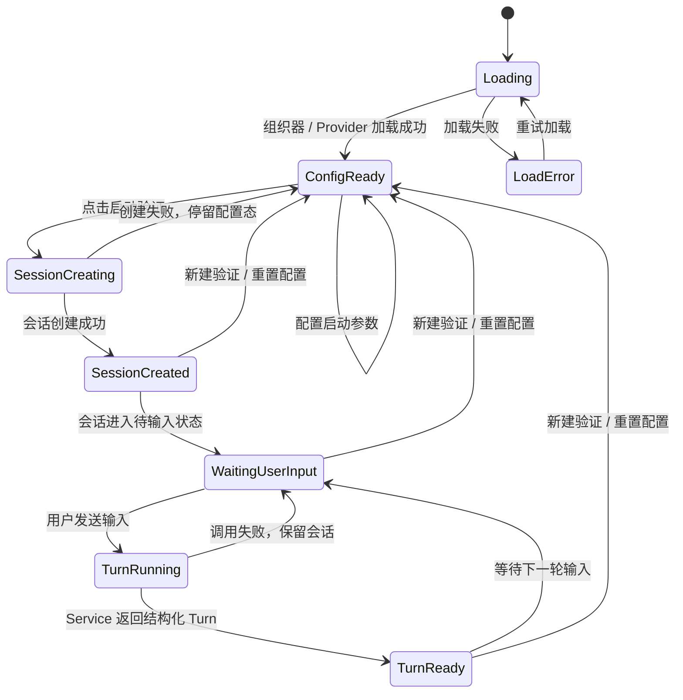
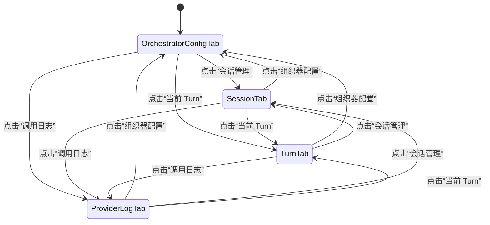
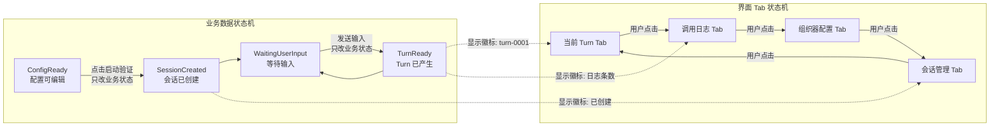

# P2 XG 需求分析组织器 Lab 状态机与 v3 原型草案

**日期：** 2026-05-01

**文档状态：** 草案，待用户评审

**目标：** 修正当前 `P2 XG 需求分析组织器 Lab` 的状态机和页面结构，使“组织器配置、会话管理、当前 Turn、调用日志”成为显式视图切换，而不是由业务数据变化自动切换界面状态。

## 1. 当前问题

当前实现存在两个关键问题：

1. **页面结构顺序不符合业务流程。**
   - 当前组织器配置对象下面，主工作区优先出现 `CLI 式问答区`。
   - 但真实流程应该是：先选择可替换组织器，再配置启动参数，再查看稳定契约，再点击启动验证，最后才进入会话问答。

2. **业务状态错误驱动了界面 Tab。**
   - 点击“启动验证”后，系统创建了 `RequirementAnalysisSession`，左侧对象树就自动高亮“会话对象”。
   - 发送输入产生 `RequirementAnalysisTurn` 后，左侧对象树又自动高亮或强化 “Turn 对象”。
   - 这会让用户感觉页面自己跳状态，而不是用户显式切换视图。

核心修正原则：

```text
业务数据状态变化 != 界面 Tab 自动切换
```

## 2. 目标交互原则

1. 左侧不再是“对象树自动高亮”，而是 **显式 Tab 导航**。
2. Tab 是否选中只由用户点击决定。
3. 业务状态可以在 Tab 上显示徽标或摘要，但不能替用户切换 Tab。
4. “启动验证”只创建会话，不自动切换到“会话管理”。
5. “发送输入”只产生 Turn，不自动切换到“当前 Turn”。
6. 用户要查看会话、Turn、日志，必须显式点击对应 Tab。

## 3. 业务数据状态机

业务数据状态机描述 `XG 需求分析组织器 Lab` 的后台业务进程：组织器加载、会话创建、Turn 运行。



说明：

- `ConfigReady` 表示组织器、Provider、模板、知识包等配置可以编辑。
- `SessionCreated` 表示已经创建会话，但不代表界面要切到会话管理。
- `TurnReady` 表示当前 Turn 已产生，但不代表界面要切到当前 Turn。

## 4. 界面 Tab 状态机

界面 Tab 状态机只描述用户当前看哪个视图。



约束：

```text
只有用户点击 Tab，才允许改变当前 Tab。
```

因此：

- `handleStart()` 可以创建 `session`，但不能自动设置 `activeTab = "session"`。
- `handleSend()` 可以创建 `currentTurn`，但不能自动设置 `activeTab = "turn"`。
- Tab 上可以显示状态：
  - 会话管理：`已创建`
  - 当前 Turn：`turn-0001`
  - 调用日志：`2 条`

## 5. 双状态机关系图



重点：

- 实线表示状态真实转换。
- 虚线表示业务状态给 Tab 提供“状态徽标”，不是自动切换。

## 6. v3 原型总结构

v3 页面仍是独立 Lab，不进入正式需求规格工作台。

```text
┌────────────────────────────────────────────────────────────────────┐
│ P2 XG 需求分析组织器 Lab                                                │
│ 独立验证问答组织器、Provider 和结构化 Turn 输出                     │
├──────────────┬─────────────────────────────────────────────────────┤
│ 左侧显式Tab  │ 当前Tab内容区                                        │
│              │                                                     │
│ 组织器配置   │ 根据左侧选中的 Tab 显示对应工作区                    │
│ 会话管理     │                                                     │
│ 当前 Turn    │                                                     │
│ 调用日志     │                                                     │
└──────────────┴─────────────────────────────────────────────────────┘
```

左侧 Tab 示例：

```text
┌────────────────────┐
│ 组织器配置          │  selected
│ RequirementAnalysis │
├────────────────────┤
│ 会话管理            │  badge: 已创建 / 未创建
│ RequirementAnalysisSession   │
├────────────────────┤
│ 当前 Turn           │  badge: turn-0001 / 暂无
│ RequirementAnalysisTurn      │
├────────────────────┤
│ 调用日志            │  badge: 2 条
│ Provider Calls      │
└────────────────────┘
```

## 7. Tab 1：组织器配置

默认进入页面时显示此 Tab。

布局顺序必须符合业务流程：

```text
┌────────────────────────────────────────────────────────────────────┐
│ 组织器配置                                                         │
│ RequirementAnalysisOrchestrator 插槽                               │
├──────────────────────┬──────────────────────┬──────────────────────┤
│ 1. 可替换组织器       │ 2. 启动参数           │ 3. 稳定契约 / 输出协议 │
│                      │                      │                      │
│ ● Requirement Analysis      │ 课题输入              │ 正式需求规格文档       │
│ ○ Wizard             │ Provider             │ 模板对象               │
│ ○ FormDriven         │ Model                │ 知识绑定               │
│ ○ RuleBasedReview    │ 模板 81433号          │ 草稿持久化             │
│                      │ 知识包 demo           │ 检查与冻结             │
│                      │ 写入策略 patch only   │ P2 -> P3 输出          │
│                      │                      │ 输出协议：             │
│                      │ [启动验证]            │ assistant_message      │
│                      │                      │ next_suggestion        │
│                      │                      │ document_patch         │
└──────────────────────┴──────────────────────┴──────────────────────┘
```

状态规则：

- 选择组织器：停留在组织器配置 Tab。
- 修改启动参数：停留在组织器配置 Tab。
- 点击“启动验证”：仍停留在组织器配置 Tab。
- 会话创建成功后，在当前 Tab 中显示轻提示：

```text
会话已创建：bs-xxxx
可点击左侧“会话管理”进入 CLI 式问答。
```

## 8. Tab 2：会话管理

用户显式点击“会话管理”后显示。

```text
┌────────────────────────────────────────────────────────────────────┐
│ 会话管理                                                           │
│ RequirementAnalysisSession: bs-xxxx                                         │
├────────────────────────────────────┬───────────────────────────────┤
│ CLI 式问答区                       │ 会话摘要 / 过程产物            │
│                                    │                               │
│ assistant: 我会先验证需求边界...   │ 已确认事实                    │
│ user: A，先按计算分析工具理解      │ - 系统初步定位为空域计算分析工具│
│ assistant: 已确认... 下一步...     │                               │
│                                    │ 待确认问题                    │
│ 输入框                             │ - 输入数据来源                 │
│ [发送]                             │ - 输出结果形式                 │
│                                    │                               │
│                                    │ document_patch 建议            │
│                                    │ 1.1 系统目标                   │
└────────────────────────────────────┴───────────────────────────────┘
```

状态规则：

- 如果尚未创建会话，则显示空态：

```text
尚未创建 Requirement Analysis 会话。
请先回到“组织器配置”点击“启动验证”。
```

- 发送输入后：
  - `user` 消息立即追加到消息流，不等待 Provider 返回。
  - Provider 运行期间可显示 pending assistant 消息。
  - 更新消息流。
  - 更新会话摘要。
  - 更新 `document_patch`。
  - 不自动切换到“当前 Turn”。
  - “当前 Turn” Tab 徽标更新为最新 Turn ID。

CLI 问答区的输入和选项规则：

- 输入框为多行文本框，默认 2 行，最多约 6 行，超出后输入框内部滚动。
- `Enter` 发送，`Shift+Enter` 换行。
- `quick_options` 可为空，不强制每轮出现。
- 当 `quick_options` 存在时，采用纵向列表展示；每个选项一行，左侧显示推荐标签、选项 key 和选项文本，右侧显示独立“选择 X”按钮。
- 选项行本身不可点击，只有“选择 X”按钮触发提交，避免误触。
- 选项提交后转化为普通用户输入，例如 `B，先确认输出`。
- 当消息、pending 状态或快捷选项变化时，消息列表自动滚动到底部，避免选项区遮住最后一轮会话。

会话摘要 / 过程产物规则：

- 摘要区展示 `QuestionItem / ConfirmedFact / DocumentPatchProposal` 三类对象，而不是无编号字符串列表。
- 问题编号使用 `Q-xxx`，事实编号使用 `F-xxx`，文档建议编号使用 `P-xxx`。
- 问题具有状态：`open` 显示为“待确认”，`confirmed` 显示为“已确认”，后续可扩展“已取消 / 被替代 / 需复核”。
- 已确认问题保留在问题工作项中，并通过 `resolution_fact_ids` 指向转化出的事实。
- 已确认事实显示来源问题和来源 Turn。
- 文档修补建议显示目标章节、来源事实和关联问题；目标章节来自模板或模型建议时必须能被用户辨认。
- 会话管理布局中，CLI 区可以略收窄，摘要区应获得更大展示宽度。
- 右侧工作区不再显示与左侧 Tab 重复的大抬头。

## 9. Tab 3：当前 Turn

用户显式点击“当前 Turn”后显示。

> 2026-05-01 修订：当前 Turn 的内容基线以 `P2-Requirement Analysis-Turn引擎与状态机设计.md` 为准。Turn 从用户输入开始，上一轮建议话题只是上下文；本视图不再表达为“上一轮问题 / 用户回答 / 当前节点关闭”的问卷式模型。

```text
┌────────────────────────────────────────────────────────────────────┐
│ 当前 Turn 决策审计                                                 │
│ RequirementAnalysisTurn: turn-0001                                          │
├────────────────────────────────────┬───────────────────────────────┤
│ 本轮沟通对象                       │ Requirement Analysis Service 循环     │
│                                    │                               │
│ previous_interaction               │ 1. 接收用户输入                │
│ 上轮系统留题：确认系统目标用户     │ 2. 读取会话状态                │
│                                    │ 3. 读取上轮系统留题            │
│ user_input                         │ 4. 判断输入承接关系            │
│ 先不谈目标用户，先修正系统定位     │ 5. 解释用户意图                │
│                                    │ 6. 执行组织器 / Provider       │
│ input_relation                     │ 7. 校验结构化输出              │
│ topic_shift                        │ 8. 执行规格补充                │
│                                    │ 9. 补充后状态回看              │
│ spec_execution                     │ 10. 生成本轮闭环判断           │
│ 用户要求优先澄清系统定位           │ 11. 生成下一轮交互对象         │
│ REQ-2.1 软件定位                   │                               │
│                                    │                               │
│ post_update_review                 │ state_delta / patch / risks    │
│ 补充后回看当前树状态               │                               │
│                                    │                               │
│ next_interaction                   │ decision_trace                 │
│ 可为空或建议下一轮方向             │ 本轮判断依据                   │
└────────────────────────────────────┴───────────────────────────────┘
```

旧版示意曾把 Turn 表达为“上一轮问题 -> user_input -> normalized_input -> confirmed_facts_delta -> document_patch”。该表达只适用于早期实验，不再作为 UI 和数据协议基线。

新的当前 Turn 必须至少展示：

- `上轮系统留题`：上一轮系统留下的开放问题、选择题或建议方向；首轮显示“无，用户自由发起”。
- `本轮用户输入`：原文。
- `输入关系判断`：采纳、部分承接、改题、反驳、补充、无关等。
- `规格补充执行`：组织器如何理解用户输入、回应用户，并投影到哪些需求规格节点。
- `补充后状态回看`：规格树当前是否足够、下一处缺口是什么、是否需要继续同题追问。
- `本轮处理闭环`：本轮执行措施是否已吸收用户输入，下一步策略是什么。
- `下一轮交互设计`：可为空、开放问题或选择题，不是强制问题。
- `决策依据`：组织器的判断链。

状态规则：

- 如果没有 Turn，则显示空态：

```text
暂无 Turn。
请先进入“会话管理”发送一轮输入。
```

- 当前 Turn 默认显示最新 Turn。
- 后续可以增加 Turn 列表，但首版不必增加复杂历史切换。

## 10. Tab 4：调用日志

用户显式点击“调用日志”后显示。

```text
┌────────────────────────────────────────────────────────────────────┐
│ 调用日志                                                           │
│ Provider Calls                                                     │
├────────────────────────────────────┬───────────────────────────────┤
│ 调用列表                           │ 调用详情                       │
│                                    │                               │
│ call-0001                          │ Provider: mock                │
│ status: mocked                     │ Model: mock-requirement-analysis-v1     │
│ model: mock-requirement-analysis-v1          │ Status: mocked                │
│ time: 2026-05-01 ...               │                               │
│                                    │ raw_model_response             │
│ call-0002                          │ {                             │
│ status: mocked                     │   mock: true,                 │
│                                    │   user_input: "A..."          │
│                                    │ }                             │
└────────────────────────────────────┴───────────────────────────────┘
```

状态规则：

- 如果没有调用日志，则显示空态。
- 创建会话可以记录一次初始化日志，也可以只在 Turn 调用 Provider 后记录日志。
- 日志只用于 Lab 可观测性，不进入正式需求规格文档。

## 11. 关键动作与状态变化表

| 用户动作 | 业务状态变化 | 当前 Tab 是否变化 | UI 反馈 |
| --- | --- | --- | --- |
| 选择组织器 | `selectedOrchestratorId` 更新 | 不变化 | 组织器卡片选中态变化 |
| 修改启动参数 | 启动参数更新 | 不变化 | 参数字段变化 |
| 点击启动验证 | 创建 `RequirementAnalysisSession` | 不变化 | 当前 Tab 显示“会话已创建”；会话管理 Tab 出现徽标 |
| 点击会话管理 Tab | 无业务变化 | 切到会话管理 | 显示 CLI 问答区 |
| 发送输入 | 创建 `RequirementAnalysisTurn`，更新会话状态 | 不变化 | user 消息立即上屏；Provider 返回后会话消息流和摘要更新；当前 Turn Tab 出现最新 Turn 徽标 |
| 点击快捷选项的“选择 X”按钮 | 按普通用户输入创建 `RequirementAnalysisTurn` | 不变化 | 转化为 `X，选项文本` 并进入消息流；选项行本身点击不触发 |
| 点击当前 Turn Tab | 无业务变化 | 切到当前 Turn | 显示最新 Turn 输入/输出对象 |
| 点击调用日志 Tab | 无业务变化 | 切到调用日志 | 显示 Provider 调用日志 |

## 12. v3 验收标准

1. 首屏默认只展示“组织器配置”，且主区顺序为：
   - 可替换组织器
   - 启动参数
   - 稳定契约 / 输出协议
2. CLI 式问答区只出现在“会话管理”Tab。
3. 当前 Turn 输入/输出对象只出现在“当前 Turn”Tab。
4. 调用日志只出现在“调用日志”Tab。
5. 创建会话不会自动切 Tab。
6. 创建 Turn 不会自动切 Tab。
7. 左侧 Tab 的选中态只由用户点击决定。
8. Tab 可以显示业务状态徽标，但不能把徽标当选中态。
9. Lab 仍保持独立路由 `/p2-requirement-analysis-lab`，不进入 MainShell。
10. Lab 不直接写入正式需求规格草稿。
11. CLI 输入框支持多行输入，且不会撑坏会话布局。
12. 快捷选项为纵向列表，推荐项可突出展示，但只能通过右侧选择按钮提交。
13. 快捷选项出现后，消息流自动滚到底部，不遮挡最后一轮会话。
14. 会话摘要区使用 Q/F/P 编号对象展示问题、事实和文档建议之间的来源关系。
15. 右侧工作区不重复显示当前 Tab 名称抬头，释放垂直空间。

## 13. 待确认点

当前建议：

```text
点击“启动验证”后，仍停留在“组织器配置”Tab。
```

可选替代：

```text
点击“启动验证”后，不自动切 Tab，但弹出轻提示，并提供一个“进入会话管理”的明确按钮。
```

这仍然是显式切换，因为用户需要点击“进入会话管理”。
