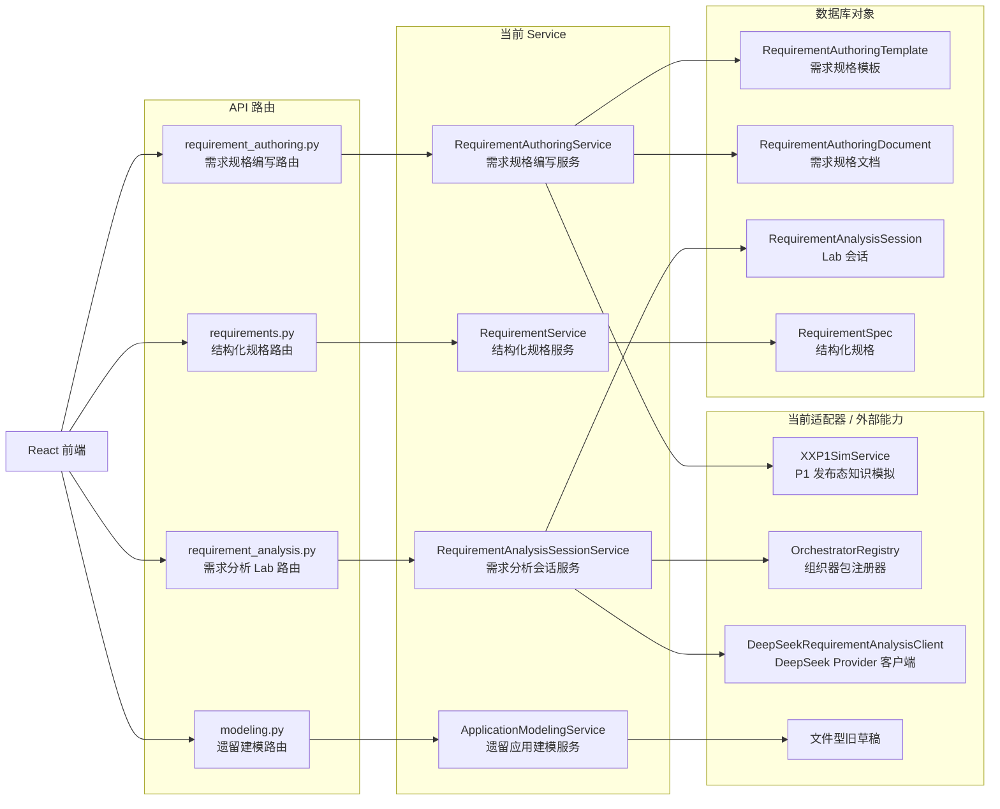

# P2 需求分析系统现状到目标架构重构说明

> 本文件承接 `P2` 当前实现、架构债务、命名债务和从现状迁移到目标态设计的重构路径。它不是 `P2` 的主软件设计说明文档。
>
> 主软件设计说明文档为：`P2-需求分析系统设计.md`。主文档描述目标态系统设计；本文描述当前实现如何调整到该目标态。

**日期：** 2026-05-02

## 1. 文档目的

本文回答以下问题：

1. 当前 `P2` 实现有哪些能力线。
2. 当前实现与目标态设计差在哪里。
3. 哪些命名、模块边界和策略包设计需要调整。
4. 后续如何按风险可控的顺序迁移。

本文保留现状审查和重构路径，避免这些内容污染主软件设计说明。

## 2. 当前实现概览

### 2.1 当前后端能力线

| 能力线 | 当前路由 | 当前服务 | 当前定位 |
| --- | --- | --- | --- |
| 需求规格编写 | `apps/api/app/api/routes/requirement_authoring.py` | `apps/api/app/requirement_authoring/service.py` | 专家工作台主路径 |
| 需求分析会话 / Lab | `apps/api/app/api/routes/requirement_analysis.py` | `apps/api/app/requirement_analysis/session_service.py` | 组织器和模型调用验证台 |
| 遗留应用需求建模 | `apps/api/app/api/routes/modeling.py` | `apps/api/app/application_modeling/service.py` | 早期建模器，过渡保留 |
| 结构化 RequirementSpec | `apps/api/app/api/routes/requirements.py` | `apps/api/app/requirements/service.py` | 冻结包和旧规格池 |

### 2.2 当前前端入口

| 页面 | 当前文件 | 当前定位 |
| --- | --- | --- |
| 专家需求规格编写工作台 | `apps/web/src/pages/RequirementAuthoringPage.tsx` | 主路径页面 |
| 配置与模板管理台 | `apps/web/src/pages/RequirementAuthoringAdminPage.tsx` | 管理配置页面 |
| 需求分析组织器 Lab | `apps/web/src/pages/RequirementAnalysisLabPage.tsx` | 原理验证与审计页面 |
| 遗留应用需求建模器 | `apps/web/src/components/ApplicationRequirementModeler.tsx` | 早期能力，需降级说明 |
| 需求规格池 | `apps/web/src/pages/RequirementsPage.tsx` | 结构化规格列表和详情 |
| P2 模拟输入 | `apps/web/src/pages/XXP2SimPage.tsx` | 轻量联调入口 |

### 2.3 当前后端调用关系



## 3. 当前实现与目标态差距

### 3.1 前端差距

| 当前表现 | 目标态 | 影响 |
| --- | --- | --- |
| `RequirementAuthoringPage` 同时承担状态、API、业务动作和渲染 | 页面、hooks、领域组件、API 适配分层 | 页面持续变大后难以维护 |
| `RequirementAnalysisLabPage` 混合配置、会话、Turn 审计和日志展示 | Lab 按配置、会话、Turn、日志拆分 | 状态关系不清晰 |
| 遗留 `ApplicationRequirementModeler` 仍容易被理解为主路径 | 降级为过渡能力 | 容易误导 P2 产品定位 |

### 3.2 后端差距

| 当前表现 | 目标态 | 影响 |
| --- | --- | --- |
| `RequirementAuthoringService` 承担模板、文档、语义状态、正文、检查、冻结 | 拆为需求规格编写模块和配置模块内的细服务 | 职责过粗，难以测试 |
| `RequirementAnalysisSessionService` 承担会话、Turn、组织器、Provider、完成度树和过程产物 | 拆为需求分析组织器模块 | 状态机和策略边界混在一起 |
| `OrchestratorRegistry` 只读取 manifest | 组织器包由 loader、validator、runner host 统一装载 | 组织器包没有真正控制策略 |
| `DeepSeekRequirementAnalysisClient` 自己拼 prompt | Host 装载组织器 prompt，Provider 只负责模型调用 | Provider 与策略耦合 |

### 3.3 命名差距

| 当前命名 | 问题 | 目标命名 |
| --- | --- | --- |
| `RequirementAnalysisSessionService` | Requirement Analysis 是方式，不是系统功能 | `RequirementAnalysisSessionService` |
| `XG 需求分析组织器 Lab` | 容易被理解为聊天功能 | `XG 需求分析组织器 Lab` |
| `RequirementAnalysisTurn` | 不能绑定某一种启发方法 | `RequirementAnalysisTurn` |
| 组织器注册器放在需求分析包内 | 不具备基础注册层语义 | `apps/api/app/orchestrators/package_loader.py` / `runner_host.py` |

## 4. 需求规格编写服务重构

### 4.1 当前职责分布

`apps/api/app/requirement_authoring/service.py` 当前承担：

- 默认模板初始化。
- 模板增删改查和激活。
- 文档创建、打开、保存、删除。
- 文档名称、模板、知识绑定保存。
- 问答消息追加。
- 表单字段 patch。
- 正文条款 patch。
- 缺口检查。
- 冻结包生成。
- 文档正文渲染。
- 条款批注生成。
- 结构化 `RequirementSpec` 包生成。

### 4.2 函数级迁移归属

| 当前函数 | 当前职责 | 目标归属 |
| --- | --- | --- |
| `list_templates` / `create_template` / `update_template` / `activate_template` | 模板生命周期 | `requirement_configuration/template_service.py` |
| `list_documents` / `create_document` / `get_document` / `delete_document` / `save_document` | 文档草稿生命周期 | `requirement_authoring/document_service.py` |
| `list_knowledge_providers` / `bind_knowledge` | `P1` 知识绑定 | `requirement_exchange/knowledge_binding_service.py` |
| `append_message` | 问答输入、语义状态更新、回复生成 | `semantic_state_service.py` |
| `patch_form_fields` | 表单字段更新、正文重渲染 | `semantic_state_service.py` |
| `patch_clause` | 正文条款编辑、批注更新 | `document_renderer.py` / `annotation_service.py` |
| `run_check` | 缺口检查 | `gap_checker.py` |
| `freeze` | 冻结包生成 | `freeze_service.py` |
| `_render_document` / `_render_clause` / `_render_text` | 正文渲染 | `document_renderer.py` |
| `_build_annotations` | 条款批注 | `annotation_service.py` |
| `_build_structured_spec` | 冻结结构化包 | `freeze_service.py` / `requirement_spec_service.py` |

### 4.3 迁移原则

- 先补测试，再拆服务。
- 先抽纯函数型服务，例如正文渲染、批注、缺口检查。
- 再抽带仓储的文档生命周期服务。
- 最后拆 API 路由和配置模块。
- 对正式前端入口保持响应结构稳定；不为早期旧称保留额外 API 路由。

### 4.4 2026-05-02 迁移进展

本轮已完成需求规格编写模块的第一批后端拆分，外部 API 保持不变。

已落地模块：

| 模块文件 | 当前职责 |
| --- | --- |
| `apps/api/app/requirement_authoring/document_renderer.py` | 标准需求规格正文渲染、条款轻量编辑投影 |
| `apps/api/app/requirement_authoring/annotation_service.py` | 条款批注、语义映射和待确认提示生成 |
| `apps/api/app/requirement_authoring/gap_checker.py` | 必填字段缺口检查、阻断项生成 |
| `apps/api/app/requirement_authoring/freeze_service.py` | 冻结包和结构化 `RequirementSpec` 生成 |
| `apps/api/app/requirement_authoring/document_repository.py` | 模板、草稿文档和默认模板初始化的数据库访问 |

当前保留：

- `RequirementAuthoringService` 仍作为 `/api/requirement-authoring` 的应用服务门面。
- 模板生命周期、草稿生命周期和知识绑定仍由该门面编排；数据库访问已下沉到文档仓储，后续可继续拆到配置模块和交换模块。
- 本轮没有改变前端 API、数据库表和响应结构。

## 5. 需求分析组织器服务重构

### 5.1 当前职责分布

早期单体需求分析会话服务承担：

- 列出组织器。
- 列出模型 Provider。
- 创建分析会话。
- 保存会话状态。
- 归一化用户输入。
- 调用组织器或 Provider。
- 构造需求规格完成度树。
- 维护 open questions / facts / patches。
- 更新 Turn 审计链。
- 生成下一轮交互对象。
- 记录 Provider 调用日志。

### 5.2 函数级迁移归属

| 当前位置 | 当前职责 | 目标归属 |
| --- | --- | --- |
| `PROVIDER_DEFINITIONS` | Provider 列表 | `provider_registry.py` 或配置 |
| `CLAUSE_QUESTIONS` | 规格节点提问 | 组织器包 `spec_strategy.json` |
| `create_session` | 会话创建、初始状态、树初始化 | `session_service.py` |
| `add_turn` | 一轮输入到输出的完整状态机 | `turn_engine.py` |
| `_run_orchestrator` | 组织器选择 | `orchestrator_host.py` |
| `_run_provider` | Provider 调用 | `provider_call_service.py` |
| `_normalize_input` | A/B/C 和自由文本归一化 | `input_normalizer.py` |
| `_mock_model_output` | Mock 输出 | Mock Provider 或测试夹具 |
| `_strong_rule_model_output` | 强规则输出 | `runner_host.py` |
| `_new_spec_tree` | 完成度树初始化 | `spec_tree_service.py` |
| `_fact_for_node` / `_patch_for_node` | 事实和正文补丁文案 | `process_artifact_service.py` / 组织器包 `artifact_rules.json` |
| `_quick_options_for_node` | 选项生成 | 组织器包 `artifact_rules.json` |
| `new_spec_tree` 中的节点问题 | 完成度树节点提问 | 组织器包 `spec_strategy.json` |
| `_update_spec_tree` | 节点关闭和状态更新 | `spec_tree_service.py` |
| `_classify_input_relation` | 输入关系判断 | `input_relation_classifier.py` |
| `DeepSeekRequirementAnalysisClient._build_prompt` | 模型提示词 | `orchestrator_host.py` + Provider Client |

### 5.3 组织器包重构重点

当前组织器包的实际情况是：

```text
组织器包 = 注册壳 + 说明
真正运行逻辑 = RequirementAnalysisSessionService / DeepSeekRequirementAnalysisClient 中的硬编码
```

需要迁移到：

```text
组织器包 = manifest + contract + policy + prompt + artifact_rules + spec_strategy + runner/examples/tests
Host = 装载、校验、执行、记录
Provider = 模型调用
```

### 5.4 迁移原则

- 先定义并测试组织器输入输出契约。
- 再把强规则组织器迁入 `local_runner` 执行。
- 再让 Requirement Analysis 组织器的 prompt 从包中加载。
- 最后完成早期旧称包、路由和测试入口删除。

### 5.5 2026-05-02 迁移进展

本轮已完成需求分析组织器 Lab 的第一批结构性拆分，并完成早期旧称接口清理。当前正式后端入口只使用 `/api/requirement-analysis/*`，不保留早期旧称路由。

已落地模块：

| 模块文件 | 当前职责 |
| --- | --- |
| `apps/api/app/requirement_analysis/session_service.py` | 需求分析会话应用服务，承接原 `RequirementAnalysisSessionService` 主入口 |
| `apps/api/app/requirement_analysis/turn_engine.py` | 一轮 Turn 的状态机编排 |
| `apps/api/app/requirement_analysis/input_normalizer.py` | 自由文本、短命令、A/B/C 选择输入归一化 |
| `apps/api/app/requirement_analysis/input_relation_classifier.py` | 本轮输入与上轮系统留题的关系判断 |
| `apps/api/app/requirement_analysis/spec_tree_service.py` | 需求规格完成度树初始化、查找、关闭和父节点状态刷新；节点提问来自组织器 `spec_strategy.json` |
| `apps/api/app/requirement_analysis/process_artifact_service.py` | 按目标条款生成事实、正文 patch 和快捷选项 |
| `apps/api/app/requirement_analysis/provider_call_service.py` | Mock / DeepSeek / 本地 runner 组织器调用分派 |
| `apps/api/app/requirement_analysis/summary_artifact_service.py` | questions / facts / patches 过程产物维护 |
| `apps/api/app/requirement_analysis/turn_audit_service.py` | Turn 审计链、闭环判断、下一轮交互对象生成 |
| `apps/api/app/requirement_analysis/turn_output_service.py` | Provider 输出规整、patch 章节对齐、下一问题补齐和影响节点投影 |
| `apps/api/app/requirement_analysis/provider_registry.py` | Provider 定义列表 |
| `apps/api/app/requirement_analysis/session_repository.py` | Lab 会话创建、读取和保存的数据库访问 |

组织器包基础运行时已落地：

| 模块文件 | 当前职责 |
| --- | --- |
| `apps/api/app/orchestrators/package_loader.py` | 组织器包 manifest、policy、prompt、contract 和入口文件装载 |
| `apps/api/app/orchestrators/contract_validator.py` | 组织器 / Provider 输出归一化 |
| `apps/api/app/orchestrators/runner_host.py` | 基于组织器包组装 Provider prompt，动态执行 local runner，并保留 Turn 协议约束 |

当前保留：

- `DeepSeekRequirementAnalysisClient._build_prompt` 作为内部测试和 prompt 生成辅助入口保留，实际运行 prompt 由 `OrchestratorRunnerHost` 组装。
- `xg-strong-rule-orchestrator/runner.py` 已作为本地 runner 入口被 `OrchestratorRunnerHost` 动态加载执行；API 回归会校验 `runner_invoked` 与 `runner_entry`。
- `xg-heuristic-orchestrator` 与 `xg-strong-rule-orchestrator` 现均提供 `artifact_rules.json`，章节事实模板、patch 模板与快捷选项不再写死在主后端服务中。
- `xg-heuristic-orchestrator` 与 `xg-strong-rule-orchestrator` 现均提供 `spec_strategy.json`，完成度树节点问题不再由后端 `question_bank.py` 维护。
- 数据库存储表为 `requirement_analysis_sessions`，测试入口为 `test_requirement_analysis_api.py`；早期旧称路由、包和测试文件不再作为现行系统的一部分。

## 6. 迁移顺序建议

### 6.1 第一阶段：文档与测试护栏

- 主设计文档保持目标态口径。
- 本文维护现状差距和迁移路径。
- 补齐需求规格编写和 Lab 的关键回归测试。

### 6.2 第二阶段：需求规格编写模块拆分

- 已完成：抽 `document_renderer.py`。
- 已完成：抽 `annotation_service.py`。
- 已完成：抽 `gap_checker.py`。
- 已完成：抽 `freeze_service.py`。
- 已完成：抽 `document_repository.py`。

### 6.3 第三阶段：需求分析组织器模块拆分

- 已完成：抽 `input_normalizer.py`。
- 已完成：抽 `input_relation_classifier.py`。
- 已完成：抽 `spec_tree_service.py`。
- 已完成：抽 `process_artifact_service.py`。
- 已完成：抽 `turn_engine.py`。
- 已完成：抽 `provider_call_service.py`。
- 已完成：抽 `summary_artifact_service.py`。
- 已完成：抽 `turn_audit_service.py`。
- 已完成：抽 `turn_output_service.py`。
- 已完成：抽 `session_repository.py`。

### 6.4 第四阶段：组织器包真正接入

- 已完成：实现 `package_loader.py`。
- 已完成：实现 `contract_validator.py`。
- 已完成：实现 `runner_host.py`。
- 已完成：让 `xg-heuristic-orchestrator` 通过 `policy.md` / `prompt.md` 影响 Provider prompt。
- 已完成：让 `xg-strong-rule-orchestrator` 通过 runner 文件动态执行。
- 已完成：让两类组织器都通过包内 `artifact_rules.json` 承载节点级事实模板、patch 模板和轻量选项规则。
- 已完成：让两类组织器都通过包内 `spec_strategy.json` 承载完成度树节点问题策略，并删除后端 `question_bank.py`。

### 6.5 第五阶段：命名和路由迁移

- 已完成：删除早期旧称路由和包。
- 已完成：前端迁移到 `/api/requirement-analysis/*`。
- 已完成：测试文件和测试数据迁移到 `RequirementAnalysis` 命名。
- 后续只允许在历史文档中引用早期旧称，不允许在现行接口、模块和目标设计中继续使用早期旧称。

## 7. 验收方式

每个迁移阶段必须满足：

- API 回归测试通过。
- 前端关键页面测试通过。
- 主设计文档仍保持目标态口径。
- 本文同步记录实际迁移进展。
- 不因拆分破坏当前可测试页面。
