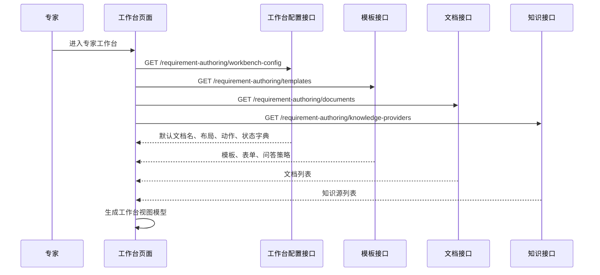

# P2-需求分析系统设计-260505-前端解耦补充

> 本文件是 `P2 需求分析系统` 前端解耦的独立设计方案，先用于评审，不直接并入《P2-需求分析系统设计.md》。待方案确认后，再把稳定结论归并到主软件设计说明的前端章节和接口章节中。

**日期：** 2026-05-05

## 1. 设计背景

当前 `P2` 后端已经按需求规格编写、需求规格配置、需求分析会话与运算、规格输出与交换等模块拆分，组织器、模型提供方、会话、轮次和调用日志也有较明确的服务边界。

前端仍存在明显滞后：页面一部分数据来自后端接口，另一部分业务默认值、字段说明、状态文案和启动参数仍写在页面代码中。典型问题是 `RequirementAnalysisLabPage` 中直接写有：

```ts
const DEFAULT_TOPIC = "空域运算软件需求规格探索";
const DEFAULT_TEMPLATE = "81433号";
const DEFAULT_KNOWLEDGE = "airspace-domain-demo";
const DEFAULT_POLICY = "patch_suggestion_only";
const DEFAULT_ORCHESTRATOR_ID = "xg-heuristic-orchestrator";
```

这会造成两个问题：

1. 前端页面看起来可以选择组织器、Provider、模板和知识包，但默认上下文仍由页面代码决定。
2. 后端组织器、模板、知识包、Provider 和日志契约升级后，前端可能继续展示旧的默认值或旧的字段解释。

本方案目标是把前端从“页面自带业务默认值”调整为“前端消费后端配置和契约，负责交互编排与展示”。

## 2. 设计目标

### 2.1 正向目标

前端解耦后应满足：

1. 业务默认值由后端配置下发，前端页面不直接定义默认课题、默认模板、默认知识包、默认组织器、默认写入策略。
2. 可选项由后端下发，前端不假设组织器、Provider、模板、知识源、写入策略的固定集合。
3. 业务字段说明由后端契约下发，尤其是 Provider 调用日志、Turn 审计字段、启动参数字段。
4. 前端页面只管理交互状态，例如当前选中项、输入框内容、加载状态、错误状态、脏状态和弹窗开关。
5. 页面组件不直接访问后端，页面编排层通过 API 适配层和视图模型层拿到可渲染对象。
6. 配置加载失败时，前端不能伪造正常业务状态；应明确显示配置不可用，并阻止启动会话或新建文档。

### 2.2 非目标

本方案不把前端改造成完全由后端控制布局的低代码页面系统。

以下内容仍归前端负责：

- 路由路径。
- React 组件结构。
- CSS 布局、响应式规则和视觉样式。
- 通用交互控件选择。
- 页面局部 loading、error、dirty、modal 状态。
- 通用按钮行为，如点击、输入、滚动到底部、Tab 切换。

后端负责的是业务配置、契约解释和能力列表，不负责像素级 UI。

## 3. 当前硬编码点清单

### 3.1 需求分析组织器 Lab

`RequirementAnalysisLabPage` 当前硬编码点包括：

| 类别 | 当前表现 | 解耦方向 |
| --- | --- | --- |
| Lab 默认课题 | `空域运算软件需求规格探索` | 后端 `lab_config.defaults.topic` 下发 |
| 默认模板 | `81433号` | 后端 `lab_config.defaults.template_id` 下发 |
| 默认知识包 | `airspace-domain-demo` | 后端 `lab_config.defaults.knowledge_package_id` 下发 |
| 默认写入策略 | `patch_suggestion_only` | 后端 `lab_config.defaults.write_policy` 下发 |
| 默认组织器 | `xg-heuristic-orchestrator` | 后端根据组织器注册表给出默认值 |
| 默认模型 | `mock-requirement-analysis-v1` / `provider-default` | 后端 Provider 配置给出默认模型或模型策略 |
| Provider 日志字段说明 | `PROVIDER_LOG_FIELD_NOTES` 写在前端 | 后端日志 schema 下发字段解释 |
| 状态标签 | `active`、`not_configured` 等在前端转义 | 后端下发 status label，前端保留兜底显示 |
| 写入策略标签 | `patch_suggestion_only` 在前端转义 | 后端下发策略定义和显示名 |
| Tab 文案和导航摘要 | 页面内固定 | 可保留为 UI 框架，也可由后端下发 Lab 视图配置 |
| Turn 协议校验字段 | 前端维护必填字段列表 | 后端下发当前 Turn 审计协议版本和字段 schema |

### 3.2 专家需求规格编写工作台

`RequirementAuthoringPage` 已经通过接口加载模板、文档列表和知识 Provider，但仍有若干页面级硬编码：

| 类别 | 当前表现 | 解耦方向 |
| --- | --- | --- |
| 默认文档名 | `未命名软件需求规格说明` | 后端工作台配置下发 |
| 文档状态中文映射 | `draft`、`checking` 等在前端映射 | 后端下发状态字典 |
| 分屏比例选项 | `2:3`、`1:1` 写在页面 | 后端工作台配置下发允许比例和默认比例 |
| 快捷输入兜底 | `可以`、`更正式`、`加超时` 等 | 模板问答策略或工作台配置下发 |
| 工具栏动作集合 | 新建、打开、保存、删除、检查、冻结写在页面 | 后端下发动作能力和可用性规则，前端负责渲染和触发 |
| 空状态文案 | 页面内固定 | 后端工作台配置或前端静态 UI 文案集中管理 |
| 文档 ribbon 文案 | `页面 A4`、`样式 标准正文` 等固定 | 模板或工作台配置下发文档表现提示 |
| 知识库默认提示 | `默认知识库` | 后端知识绑定配置下发 |

这些硬编码不一定都要一次性移到后端，但必须区分“业务配置”和“纯 UI 文案”。业务配置必须后端化，纯 UI 文案可以集中到前端文案表，避免散落在页面组件中。

## 4. 目标架构

### 4.1 前端分层

目标前端分层为：

```text
页面路由层
  -> 页面编排层
    -> 配置加载与视图模型层
      -> 领域组件层
        -> API 适配层
          -> 后端配置接口 / 业务接口
```

| 层 | 职责 | 约束 |
| --- | --- | --- |
| 页面路由层 | 绑定 URL 和页面入口 | 不定义业务默认值 |
| 页面编排层 | 管理加载、选中、提交、错误、脏状态 | 不直接拼业务默认对象 |
| 配置加载与视图模型层 | 把后端配置、模板、Provider、文档状态转换为前端可渲染模型 | 不访问 DOM，不写 CSS |
| 领域组件层 | 渲染组织器卡片、启动参数表单、问答区、文档区、日志详情 | 不直接调用 API |
| API 适配层 | 封装 HTTP 调用和 DTO 类型 | 不处理页面状态 |

### 4.2 后端配置成为前端入口依赖

前端进入 P2 页面时，不再直接初始化业务默认值，而是先加载配置：

```text
进入 Lab 页面
  -> GET /requirement-analysis/lab-config
  -> 根据 defaults 初始化启动参数
  -> 根据 options 渲染组织器、Provider、模板、知识包、写入策略
  -> 用户修改参数
  -> POST /requirement-analysis/sessions
```

```text
进入专家工作台
  -> GET /requirement-authoring/workbench-config
  -> GET /requirement-authoring/templates
  -> GET /requirement-authoring/documents
  -> GET /requirement-authoring/knowledge-providers
  -> 根据工作台配置和模板配置初始化页面
```

### 4.3 配置对象归属

| 配置对象 | 权威来源 | 前端使用方式 |
| --- | --- | --- |
| Lab 默认课题 | 需求分析会话与运算模块 | 初始化课题输入框 |
| 默认组织器 | 组织器注册表 / Lab 配置服务 | 初始化组织器选择 |
| 默认 Provider 和模型 | Provider 注册表 / 本地运行配置 | 初始化 Provider 和模型 |
| 默认模板 | 需求规格配置模块 | 初始化模板选择 |
| 默认知识包 | 规格输出与交换模块或知识绑定配置 | 初始化知识包选择 |
| 写入策略 | 需求分析会话与运算模块 | 初始化会话创建参数 |
| Provider 日志字段说明 | 模型提供方子模块 / 日志 schema 服务 | 渲染调用日志详情 |
| Turn 审计字段说明 | 轮次执行子模块 / Turn schema 服务 | 渲染当前 Turn 审计视图 |
| 工作台动作 | 需求规格编写模块 | 渲染新建、打开、保存、删除、检查、冻结等动作 |
| 文档状态标签 | 需求规格编写模块 | 渲染状态 Tag 和按钮可用性 |
| 表单字段、快捷输入、缺口规则 | 需求规格配置模块 | 渲染表单模式、问答模式和检查结果 |

## 5. 后端新增接口设计

### 5.1 Lab 配置接口

新增：

```text
GET /requirement-analysis/lab-config
```

返回建议结构：

```json
{
  "page": {
    "title": "P2 XG 需求分析组织器 Lab",
    "subtitle": "独立验证问答组织器、模型 Provider 和结构化 Turn 输出，不写入正式需求规格编辑器。"
  },
  "defaults": {
    "topic": "空域运算软件需求规格探索",
    "orchestrator_id": "xg-heuristic-orchestrator",
    "provider_id": "mock",
    "model": "mock-requirement-analysis-v1",
    "template_id": "81433号",
    "knowledge_package_id": "airspace-domain-demo",
    "write_policy": "patch_suggestion_only"
  },
  "startup_fields": [
    {
      "field": "topic",
      "label": "课题输入",
      "control": "textarea",
      "required": true,
      "placeholder": "输入本次需求规格探索课题"
    }
  ],
  "write_policies": [
    {
      "policy_id": "patch_suggestion_only",
      "label": "仅生成补丁建议",
      "description": "Lab 只生成 document_patch 建议，不直接写入正式需求规格草稿。"
    }
  ],
  "provider_log_schema": {
    "fields": [
      {
        "path": "provider_request.messages",
        "label": "Provider Request Messages",
        "description": "发给模型的最终 messages 数组，模型调用时直接使用。",
        "used_when": "每次调用真实或模拟 Provider 时生成。"
      }
    ]
  },
  "turn_audit_schema": {
    "protocol_version": "xg-turn-audit-v1",
    "required_fields": [
      "previous_interaction",
      "input_relation",
      "spec_execution",
      "post_update_review",
      "closure_decision",
      "next_interaction",
      "decision_trace"
    ]
  }
}
```

说明：

- `defaults` 是启动参数默认值，前端可以展示并允许用户修改。
- `startup_fields` 决定启动参数表单怎么渲染，不要求后端控制布局，只控制业务字段。
- `provider_log_schema` 替代前端 `PROVIDER_LOG_FIELD_NOTES`。
- `turn_audit_schema` 替代前端手写 Turn 协议字段列表。

### 5.2 工作台配置接口

新增：

```text
GET /requirement-authoring/workbench-config
```

返回建议结构：

```json
{
  "page": {
    "title": "P2 专家需求规格编写工作台",
    "subtitle": "面向专家的标准需求规格说明正文编写、校对、检查与冻结。"
  },
  "defaults": {
    "document_title": "未命名软件需求规格说明",
    "layout_ratio": "2:3",
    "allow_empty_knowledge_binding": true
  },
  "layout_options": [
    { "ratio": "2:3", "label": "2:3" },
    { "ratio": "1:1", "label": "1:1" }
  ],
  "document_statuses": [
    { "status": "draft", "label": "草稿", "editable": true },
    { "status": "checking", "label": "检查中", "editable": false },
    { "status": "ready_to_freeze", "label": "待冻结", "editable": true },
    { "status": "frozen", "label": "已冻结", "editable": false }
  ],
  "actions": [
    { "action_id": "create_document", "label": "新建文档", "style": "primary" },
    { "action_id": "open_document", "label": "打开文档" },
    { "action_id": "save_draft", "label": "保存草稿", "requires_document": true, "disabled_when_frozen": true },
    { "action_id": "delete_document", "label": "删除文档", "requires_document": true, "danger": true },
    { "action_id": "run_check", "label": "缺口检查", "requires_document": true },
    { "action_id": "freeze", "label": "冻结版本", "requires_document": true }
  ],
  "document_surface": {
    "title": "标准需求规格说明",
    "badges": ["可导出稿"],
    "ribbon": ["页面 A4", "样式 标准正文", "段落 1.5 倍行距", "导出 DOCX / PDF"]
  },
  "empty_states": {
    "question_mode": "创建规格文档后开始问答协作",
    "form_mode": "创建规格文档后开始表单校对",
    "document": "创建文档后，右侧会持续生成标准正文。"
  }
}
```

说明：

- 工作台配置不替代模板接口。模板章节、表单、映射和问答策略仍由 `/requirement-authoring/templates` 返回。
- 工作台配置只提供页面运行所需的默认值、动作、状态标签和展示策略。

### 5.3 接口聚合策略

首版可采用轻量聚合接口，不需要新建数据库表：

```text
LabConfigService
  -> OrchestratorRegistry
  -> ProviderRegistry
  -> RequirementConfigurationService
  -> 本地 settings / env

WorkbenchConfigService
  -> RequirementAuthoringService
  -> RequirementConfigurationService
  -> KnowledgeProviderRegistry
  -> 本地 settings / env
```

后续如果需要管理员在线配置，再把这些配置对象落入配置表。

## 6. 前端模块拆分设计

### 6.1 新增 API 适配

建议新增或扩展：

```text
apps/web/src/lib/requirementAnalysis.ts
  - getRequirementAnalysisLabConfig()

apps/web/src/lib/requirementAuthoring.ts
  - getRequirementAuthoringWorkbenchConfig()
```

相关类型放入：

```text
apps/web/src/lib/api.ts
```

新增类型建议：

```ts
export type RequirementAnalysisLabConfig = {
  page: RequirementAnalysisPageMeta;
  defaults: RequirementAnalysisLabDefaults;
  startup_fields: RequirementAnalysisStartupField[];
  write_policies: RequirementAnalysisWritePolicyOption[];
  provider_log_schema: RequirementAnalysisFieldSchema;
  turn_audit_schema: RequirementAnalysisTurnAuditSchema;
};

export type RequirementAuthoringWorkbenchConfig = {
  page: RequirementAnalysisPageMeta;
  defaults: RequirementAuthoringWorkbenchDefaults;
  layout_options: Array<{ ratio: RequirementAuthoringLayoutRatio; label: string }>;
  document_statuses: RequirementAuthoringStatusDefinition[];
  actions: RequirementAuthoringActionDefinition[];
  document_surface: RequirementAuthoringDocumentSurfaceConfig;
  empty_states: Record<string, string>;
};
```

### 6.2 新增视图模型层

建议新增：

```text
apps/web/src/lib/requirementAnalysisLabViewModel.ts
apps/web/src/lib/requirementAuthoringWorkbenchViewModel.ts
```

职责：

- 接收后端配置、模板列表、Provider 列表、组织器列表、文档状态。
- 生成页面组件需要的 `selected defaults`、按钮可用性、状态标签、日志字段说明、启动参数表单模型。
- 提供最小兜底函数，但兜底只用于错误展示，不用于伪造正常业务状态。

### 6.3 页面组件职责调整

`RequirementAnalysisLabPage` 目标结构：

```text
RequirementAnalysisLabPage
  - useRequirementAnalysisLabBootstrap
  - LabConfigTab
  - LabSessionTab
  - LabCurrentTurnTab
  - LabProviderLogTab
```

其中：

- `useRequirementAnalysisLabBootstrap` 负责加载 `lab-config`、组织器列表、Provider 列表。
- `LabConfigTab` 只渲染配置对象，不保存硬编码默认值。
- `LabProviderLogTab` 使用 `provider_log_schema` 渲染字段说明。
- `LabCurrentTurnTab` 使用 `turn_audit_schema` 做协议校验和字段解释。

`RequirementAuthoringPage` 目标结构：

```text
RequirementAuthoringPage
  - useRequirementAuthoringWorkbenchBootstrap
  - RequirementAuthoringToolbar
  - DocumentNameBar
  - InputModePanel
  - StandardDocumentPane
  - KnowledgeBindingDialog
  - DocumentOpenDialog
  - DocumentDeleteDialog
```

其中：

- `useRequirementAuthoringWorkbenchBootstrap` 负责加载工作台配置、模板、文档、知识 Provider。
- `RequirementAuthoringToolbar` 使用 `actions` 和当前文档状态渲染动作。
- `DocumentNameBar` 使用 `defaults.document_title` 初始化名称。
- `InputModePanel` 的快捷输入优先来自模板，模板没有时使用工作台配置兜底。
- `StandardDocumentPane` 的 ribbon 和 badge 来自工作台配置或模板配置。

## 7. 运行流程

### 7.1 Lab 启动流程

```mermaid
sequenceDiagram
  participant User as 用户
  participant Page as Lab 页面
  participant Config as Lab 配置接口
  participant Option as 组织器/Provider接口
  participant Session as 会话接口

  User->>Page: 进入 Lab 路由
  Page->>Config: GET /requirement-analysis/lab-config
  Page->>Option: GET /requirement-analysis/orchestrators + /providers
  Config-->>Page: 默认启动参数、字段 schema、日志 schema
  Option-->>Page: 可选组织器和 Provider
  Page->>Page: 初始化表单和选择项
  User->>Page: 修改课题、组织器、Provider、模板、知识包
  User->>Page: 点击启动验证
  Page->>Session: POST /requirement-analysis/sessions
  Session-->>Page: RequirementAnalysisSession
```

### 7.2 专家工作台启动流程



## 8. 配置加载失败策略

配置加载失败时，前端必须采取“失败显式化”策略。

| 场景 | 页面行为 |
| --- | --- |
| Lab 配置加载失败 | 禁止启动验证，显示“Lab 配置不可用” |
| 组织器列表为空 | 禁止启动验证，显示“无可用组织器” |
| Provider 列表为空 | 禁止启动验证，显示“无可用 Provider” |
| 默认组织器不存在 | 选择第一个 active 组织器，并显示配置不一致提示 |
| 默认 Provider 未配置 | 允许选择其他可用 Provider；不自动伪装为可用 |
| 工作台配置加载失败 | 禁止新建文档，保留错误状态 |
| 模板列表为空 | 禁止新建文档，提示“无可用规格模板” |
| 知识源为空 | 允许选择空知识绑定，但必须显示“未绑定领域知识” |

前端可以保留技术兜底，例如把未知状态显示为原始状态值；但不能用前端写死业务默认值创建真实会话或真实文档。

## 9. 迁移步骤

### 9.1 第一阶段：Lab 前端配置化

目标是解决当前最明显的问题。

工作内容：

1. 后端新增 `GET /requirement-analysis/lab-config`。
2. 前端新增 `getRequirementAnalysisLabConfig()`。
3. 删除 `RequirementAnalysisLabPage` 中的 `DEFAULT_TOPIC`、`DEFAULT_TEMPLATE`、`DEFAULT_KNOWLEDGE`、`DEFAULT_POLICY`、`DEFAULT_ORCHESTRATOR_ID`。
4. 会话创建参数全部来自配置初始化后的页面状态。
5. Provider 日志字段说明改为读取 `provider_log_schema`。
6. Turn 协议校验字段改为读取 `turn_audit_schema`。
7. 测试改为 mock `lab-config`，断言页面跟随后端配置变化。

### 9.2 第二阶段：专家工作台配置化

工作内容：

1. 后端新增 `GET /requirement-authoring/workbench-config`。
2. 前端新增 `getRequirementAuthoringWorkbenchConfig()`。
3. 默认文档名、布局比例、状态标签、动作集合、空状态文案、文档 ribbon 从配置读取。
4. `RequirementAuthoringPage` 拆出 bootstrap hook 和 toolbar/document/view-model 子模块。
5. 测试改为 mock `workbench-config`，断言默认文档名、状态标签、动作显示来自配置。

### 9.3 第三阶段：前端硬编码清理和测试压实

工作内容：

1. 对 `apps/web/src/pages/RequirementAnalysisLabPage.tsx` 和 `RequirementAuthoringPage.tsx` 执行硬编码扫描。
2. 业务默认值不得出现在页面组件文件中。
3. 允许保留 CSS 类名、组件名、通用交互文案。
4. 所有新增配置接口有后端单元测试和前端 Testing Library 测试。
5. 更新主软件设计说明。

## 10. 验收口径

前端解耦完成后，应通过以下验收：

1. 修改后端 `lab-config.defaults.topic`，前端 Lab 默认课题同步变化，无需改前端代码。
2. 修改后端默认组织器，前端默认选中项同步变化。
3. 修改后端默认 Provider 或模型，前端启动参数同步变化。
4. 修改后端 Provider 日志字段说明，调用日志详情页显示新说明。
5. 修改后端工作台默认文档名，前端新建文档默认名称同步变化。
6. 修改后端工作台状态标签，前端文档状态 Tag 同步变化。
7. 配置接口失败时，前端不允许启动 Lab 会话或新建正式文档。
8. `rg "空域运算软件需求规格探索|81433号|airspace-domain-demo|patch_suggestion_only|xg-heuristic-orchestrator" apps/web/src/pages` 不应命中页面业务默认值。
9. 前端测试不再通过硬编码字符串证明页面正确，而是通过 mock 后端配置证明页面消费配置正确。

## 11. 设计判断

本方案不要求一次性把所有页面文案后端化。真正必须迁移的是会影响业务语义、启动参数、能力选择和契约解释的内容。

前端可以保留三类内容：

1. 视觉布局：CSS、网格比例、响应式规则。
2. 通用交互：发送、关闭、取消、确认等基础控件行为。
3. 技术兜底：未知状态显示原始值、配置失败显示错误。

前端不应保留三类内容：

1. 业务默认值：默认课题、默认模板、默认知识包、默认组织器、默认 Provider、默认写入策略。
2. 业务契约解释：Provider 日志字段说明、Turn 审计协议字段、写入策略解释。
3. 业务能力集合：可用动作、可用组织器、可用 Provider、可用模板、可用知识源。

这个边界可以让前端保持工程上可维护，同时保证业务含义由后端和配置模块统一控制。
