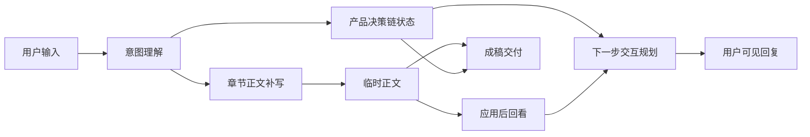

# P2 需求分析系统设计-260506-决策模式与组织器整改策略补充

**文档日期：** 2026-05-06

**文档性质：** 设计补充方案，供评审。本文只提出整改策略和证据链，不直接修改 `P2-需求分析系统设计.md`，不代表已完成代码实现。

**分析对象：**

- 当前 `P2` 需求分析 Lab：`xg-heuristic-orchestrator`
- 当前 `P2` 后端架构：`apps/api/app/requirement_analysis/*`
- 当前真实 Codex `brainstorming` skill：`/home/wgw/.codex/skills/brainstorming/SKILL.md`
- 已落盘测试报告：
  - `DOC/CODEX_DOC/06_测试文档/03_机测记录/2026-05-06-P2需求分析Lab-态势分析系统多轮效果验证报告.md`
  - `DOC/CODEX_DOC/06_测试文档/03_机测记录/2026-05-06-Codex真实BrainstormingSkill-态势分析系统深化测试报告.md`
  - `DOC/CODEX_DOC/06_测试文档/03_机测记录/2026-05-06-P2与Codex-Brainstorming-20回合决策模式对比测试报告.md`

## 1. 结论摘要

当前 `P2` 已经从单次写作调用升级为 `intent_understanding -> write -> review_after_apply -> next_interaction_planning` 四阶段模型调用链，但实际用户体验仍然没有接近真实 Codex `brainstorming` skill。

核心原因不是“模型调用次数不够”，也不是“正文 patch 完全无效”，而是系统仍以“需求规格模板章节完成度树”为主牵引对象，缺少一条独立的“产品决策链”。

真实 `brainstorming` 的优势不是某一句提示词更长，而是它把需求探索视为一个连续决策过程：

1. 先识别当前项目范围是否会膨胀。
2. 一轮只问一个关键决策点。
3. 每个问题给出为什么重要、可选方案和推荐理由。
4. 在关键决策足够闭合后进入方案比较。
5. 最后把已闭合决策转成设计或需求文档。

当前 `P2` 则主要表现为：

1. 意图理解阶段能识别一些目标章节候选，但结果没有沉淀为长期决策链。
2. `write` 阶段很快生成章节 patch，导致系统过早进入“已写入某章节”的节奏。
3. `review_after_apply` 主要评价正文块是否存在和当前目标是否可接受，而不是评价关键产品决策是否闭合。
4. `next_interaction_planning` 虽然调用模型，但最终用户可见回复被服务端压缩成“本轮已把若干章节写入临时正文 + 建议下一步确认”。
5. 到第 20 回合，`P2` 仍倾向请用户整体复核，而不稳定交付完整草案。

因此，整改方向应从“继续细修章节 patch”转向“决策链 + 章节正文双驱动”。

## 2. 分析口径

### 2.1 先盲测，再读源码

本轮分析遵循以下顺序：

1. 先基于真实长轮次测试报告判断 `P2` 与 Codex `brainstorming` 的外在效果差异。
2. 再阅读真实 `brainstorming` skill 的文档源码，确认它的组织机制。
3. 再阅读 `P2` 后端阶段调用、Prompt 组装、正文应用、Review 和最终回复合成代码。
4. 最后把测试现象与代码原因逐条对应，提出整改策略。

### 2.2 不把 Codex skill 直接等同于 P2 组织器

真实 Codex `brainstorming` skill 是一个本地技能包，目标是把想法转成设计和规格，并在写代码前形成设计文档。它不是需求规格正文 patch 系统。

因此，`P2` 不应该机械复制它的所有流程，例如：

- 不必照搬 `docs/superpowers/specs/YYYY-MM-DD-<topic>-design.md` 的输出路径。
- 不必照搬“写设计文档后再调用 writing-plans”的实现链路。
- 不必把 `brainstorming` 的所有问题都作为固定题库。

但 `P2` 必须学习它的三个核心机制：

1. **决策链优先**：先把影响产品形态的关键问题问清楚，再组织正文。
2. **一轮一个主问题**：每轮用户可见层只抓最值得确认的关键点。
3. **后期主动成稿**：达到足够闭合或轮次上限时，不继续追问，而是输出当前版本文档并列待确认项。

## 3. 真实 Brainstorming Skill 源码证据

### 3.1 Skill 的载体不是动态库，而是过程规则文档

真实 skill 文件为：

```text
/home/wgw/.codex/skills/brainstorming/SKILL.md
```

其开头直接定义目标：

```text
Help turn ideas into fully formed designs and specs through natural collaborative dialogue.
```

这说明该 skill 的本体是一份过程规则和行为约束文档，不是一段 Python 业务代码，也不是动态库。

### 3.2 Skill 有明确硬门禁

源码第 12-14 行规定，在设计被确认前，不允许进入实现动作：

```text
Do NOT invoke any implementation skill, write any code, scaffold any project, or take any implementation action until you have presented a design and the user has approved it.
```

这对 `P2` 的启发是：`P2` 也应有类似门禁，但门禁对象不是“是否写代码”，而是“是否进入正式成稿 / 是否继续追问 / 是否允许只输出章节 patch”。

当前 `P2` 缺少这种门禁，导致它从第 1 回合开始就写正文，但用户并没有感知到关键决策已经被充分讨论。

### 3.3 Skill 明确要求顺序执行

源码第 20-32 行给出固定 checklist：

| 顺序 | 真实 skill 步骤 | 对 P2 的启发 |
| ---: | --- | --- |
| 1 | Explore project context | 先理解上下文，不直接填章节 |
| 2 | Offer visual companion | 视觉问题才用视觉，不机械套用 |
| 3 | Ask clarifying questions | 一轮一个澄清问题 |
| 4 | Propose 2-3 approaches | 中后期进入方案比较 |
| 5 | Present design | 分段展示设计 |
| 6 | Write design doc | 再写成文档 |
| 7 | Spec self-review | 写完后自审 |
| 8 | User reviews written spec | 让用户审阅 |
| 9 | Transition to implementation | 再进入实现 |

这条链路中，“问问题”和“写文档”不是同一个阶段。真实 skill 在早期并不急于写正文，而是先建立可解释的决策路径。

### 3.4 Skill 的交互原则是用户可理解的

源码第 70-84 行明确要求：

- 先检查项目状态。
- 如果项目过大，要先提示分解。
- 一次只问一个问题。
- 优先给多选问题。
- 提出 2-3 个方案并解释取舍。

这解释了为什么真实 `brainstorming` 的输出虽然不一定每轮很长，但用户会感觉“它在带着我思考”。它每轮都在回答三个隐含问题：

1. 为什么现在问这个？
2. 我有哪些可选方向？
3. 你推荐哪一个，为什么？

当前 `P2` 的用户可见层多数只回答：

1. 本轮写了哪些章节。
2. 下一轮问什么。

这不足以支撑需求探索感。

## 4. 测试证据

### 4.1 20 回合统计差异

来自 `2026-05-06-P2与Codex-Brainstorming-20回合决策模式对比测试报告.md`：

| 指标 | P2 | Codex Brainstorming |
| --- | ---: | ---: |
| 独立会话组数 | 3 | 3 |
| 总回合数 | 60 | 60 |
| 平均助手回复长度 | 128.07 字 | 555.75 字 |
| 中位数助手回复长度 | 106.50 字 | 359.50 字 |
| 最大助手回复长度 | 764 字 | 3931 字 |
| 助手回复超过 300 字的回合 | 3 / 60 | 明显高于 P2 |
| 第 20 回合表现 | 仍偏“请整体复核” | 稳定输出需求草案 |

这个差异不能简单解释为“P2 字数少”。更准确地说，`P2` 的用户可见回复没有承载决策分析、取舍理由、当前闭合状态和成稿动作。

### 4.2 P2 代表输出

P2 第 1 回合：

```text
本轮已把1.1 编写目的写入临时正文。建议下一步确认：请描述该态势分析系统的软件定位……
```

P2 第 10 回合：

```text
本轮已把4.1.1 性能指标、4.1.2 安全要求、4.1.3 部署要求写入临时正文。建议下一步确认：请说明在系统运行过程中，当出现数据缺失、分析失败、冲突或需要人工复核时……
```

P2 第 15 回合：

```text
本轮已把5.1.1 验收场景写入临时正文。建议下一步确认：请对整份需求规格进行一次整体复核……
```

P2 第 20 回合：

```text
本轮已把1.1 编写目的、2.1 软件定位、3.1 用户与角色、3.2 核心业务流程、3.3 异常与补偿、4.1 性能与可靠性写入临时正文。建议下一步确认：请您整体审阅当前需求规格说明草案……
```

第 20 回合用户已经明确要求停止追问并输出完整草案，但 P2 的对话层仍是写入通知和复核邀请。这说明“最终成稿”没有成为用户可见层的一等动作。

### 4.3 Brainstorming 代表输出

真实 `brainstorming` 第 1 回合：

```text
第一个问题：这个态势分析系统的第一版，最主要服务哪类用户？

A. 指挥/管理人员……
B. GIS/分析人员……
C. 外勤/部署人员……
D. 演示/售前原型用户……
```

真实 `brainstorming` 第 10 回合：

```text
这组非功能要求已经把第一版拉到“可内网部署的准生产系统”，不是单机演示工具……

下一个关键问题：第一版按多大的空间范围和数据规模设计？
```

真实 `brainstorming` 第 18 回合：

```text
我回看后，当前需求探索已经收敛出一个比较清晰的第一版轮廓了。可以分成两部分看。

已经闭合的关键决策……
还没有闭合的关键决策……
下一步最应该确认的一个问题……
```

真实 `brainstorming` 第 20 回合：

```text
下面是一版需求规格说明草案。我不再继续追问，只基于当前已探索内容整理。
```

它在第 20 回合明确切换为成稿模式，并直接交付结构化草案。

### 4.4 关键现象对照

| 现象 | P2 | Brainstorming | 说明 |
| --- | --- | --- | --- |
| 起始输入处理 | 快速写入 `1.1 编写目的` | 先问主用户 | P2 以模板章节为牵引，Brainstorming 以产品决策为牵引 |
| 每轮问题 | 常围绕下一模板节点 | 围绕当前最关键决策点 | P2 容易机械推进章节 |
| 用户可见解释 | 短句写入通知 | 解释为什么问、选项、推荐 | P2 对话层承载信息不足 |
| 中期收束 | 继续补章节 | 方案比较 | P2 缺少方案形态比较 |
| 后期动作 | 整体复核 | 输出草案 | P2 缺少成稿触发和交付模式 |

## 5. P2 源码证据与架构根因

### 5.1 当前四阶段调用已经存在

`RequirementAnalysisTurnEngine.run_turn` 中可以看到当前执行链：

- `intent` 阶段：`apps/api/app/requirement_analysis/turn_engine.py` 第 93-109 行。
- `write` 阶段：第 115-135 行。
- 应用 patch 到 `working_document`：第 171-180 行。
- `review` 阶段：第 200-224 行。
- `next_interaction` 阶段：第 250 行后续逻辑。

这说明当前问题不是“一轮只有一次模型调用”。系统已经有四阶段模型调用骨架。

### 5.2 Review 阶段存在上下文传递问题

当前代码先构造了完整 `stage_input`：

```python
stage_input = self.stage_runtime_context_builder.build(...).to_prompt_context()
stage_input.update(review_stage_input)
```

但真正调用时传入的是：

```python
stage_input=review_stage_input
```

也就是说，构造出来的完整上下文没有传给 `review_after_apply` 阶段。这样会削弱 Review 对意图结果、章节配置、任务定义、质量约束、模板形态和锚点规划的理解。

这与主设计文档中“review_after_apply 必须读取意图结果、章节配置上下文、模板形态分析、目标锚点规划和阶段任务定义”的目标不一致。

### 5.3 服务端仍在用弱规则预判 Review

`WorkingDocumentReviewService.review` 当前核心逻辑是：

```python
if not excerpt:
    status = "insufficient"
else:
    status = "acceptable"
```

也就是说，只要目标范围存在正文片段，服务端预审就倾向认为可接受。虽然后续模型 Review 可能覆盖部分字段，但这会给整个流程一个很强的“有正文即可推进”的基础倾向。

这正是 P2 过早关闭章节节点的结构性原因之一。

### 5.4 全局 Review 结果存在服务端重算倾向

`RequirementAnalysisTurnEngine._resolved_global_review` 对模型返回的 `global_review` 进行处理时，如果不是 `continue_same_topic`，会调用：

```python
self.working_document_review_service.build_global_review(
    next_spec_node=next_spec_node,
    target_review=target_review,
)
```

这意味着模型在 `review_after_apply` 中对全局推进状态的判断，可能被服务端根据完成度树下一节点重新计算。

结果是：即使四阶段都调用了模型，最终推进策略仍受到完成度树结构的强牵引。

### 5.5 最终助手回复被服务端压缩

`RequirementAnalysisTurnEngine._assistant_message_after_planning` 的关键逻辑是：

```python
if sections:
    write_summary = f"本轮已把{'、'.join(sections)}写入临时正文。"
...
if planning_message and "临时正文" in planning_message:
    base_message = planning_message
else:
    base_message = write_summary
...
base_message = append("建议下一步确认：{next_question}")
```

这导致一个明显后果：即便 `next_interaction_planning` 模型返回了较完整的 `user_message`，只要该文本不包含“临时正文”四个字，最终助手消息就会退回“本轮已把某些章节写入临时正文”。

这可以直接解释测试中 P2 用户可见回复长期只有 100 字左右的问题。

### 5.6 完成度树仍是主推进对象

`RequirementSpecTreeService.update_spec_tree` 根据 `can_close` 关闭当前节点，再调用 `first_open_spec_node_id` 找下一个 open 叶子节点。

这套机制适合“模板完成度管理”，但不适合作为“需求探索决策管理”的唯一推进对象。

例如：

- 主用户是否闭合；
- 主场景是否闭合；
- 数据模式是否闭合；
- 协同深度是否闭合；
- 第一版部署边界是否闭合；
- 验收规模是否闭合；
- 是否应该进入方案比较；
- 是否应该停止追问并成稿；

这些都不是模板章节节点本身。它们可能跨章节，也可能先于章节正文存在。

### 5.7 组织器包描述仍然过薄

当前 `orchestrators/xg/xg-heuristic-orchestrator/ORCHESTRATOR.md` 只有定位、适用场景、运行原则三小段。

`policy.md` 也只有四条原则：

```text
用户输入驱动。
允许改题、反驳、补充。
只有在需要轻量决策时生成快捷选项。
规格补充必须优先服务于 XG 模板章节成文。
```

这不足以支撑类似真实 `brainstorming` 的决策链行为。真实 skill 不是只写“定位”和“原则”，而是详细定义流程、门禁、每一步的行为、交互原则和审查规则。

当前组织器包对以下关键行为缺少明确说明：

- 起始模糊需求时优先问什么。
- 何时不急于写正文。
- 如何识别关键产品决策。
- 如何避免重复追问。
- 何时进入方案比较。
- 何时进入成稿。
- 成稿时如何组织待确认项。
- 用户可见回复应该包含哪些信息。

## 6. 根因归纳

### 6.1 根因一：P2 仍是“章节 patch 优先”，不是“决策链优先”

当前系统以 `spec_tree` 和 `working_document` 为核心状态。它能回答“哪个章节写了正文”，但不能稳定回答“哪个产品决策已经闭合”。

这使得系统会把起始模糊输入迅速写入 `1.1 编写目的`，而不是像真实 `brainstorming` 那样先判断“态势分析系统可能膨胀成平台，第一版必须先定主用户”。

### 6.2 根因二：四阶段调用没有形成四阶段产品行为

当前四阶段的模型调用已经存在，但阶段之间缺少一个长期状态对象承接“决策链”。

| 阶段 | 当前能做 | 当前缺口 |
| --- | --- | --- |
| `intent_understanding` | 判断输入类型、目标章节、任务候选 | 没有把“决策事件”写入长期状态 |
| `write` | 生成模板锚点和正文 patch | 容易过早写正文，缺少“本轮是否适合写正文”的门禁 |
| `review_after_apply` | 审查应用后的正文 | 更像正文质量审查，不足以评价决策闭合 |
| `next_interaction_planning` | 生成下一问和选项 | 缺少决策链状态输入，且最终消息被压缩 |

### 6.3 根因三：用户可见层没有使用阶段模型的真实价值

测试数据已经证明，P2 内部确实生成过较丰富的 `plan_user_message`、`plan_reason`、`review_acknowledgement`，但最终助手回复被服务端压成固定句式。

这相当于模型已经做了一部分分析，但用户看不到。

### 6.4 根因四：缺少成稿模式

真实 `brainstorming` 在第 20 回合会明确说“不再继续追问，只基于当前已探索内容整理”，并输出完整草案。

当前 `P2` 即使用户要求强制成稿，也仍把结果表达为“已写入临时正文 + 请整体审阅”。这说明 `P2` 没有一等的 `draft_delivery` 动作。

### 6.5 根因五：Prompt 包没有把行为规则写实

当前 prompt 已经比早期好，但仍主要围绕阶段职责、JSON 输出和章节锚点。它没有完整定义需求探索决策策略。

尤其缺少：

- 产品决策类型清单。
- 决策优先级规则。
- 一轮一个主问题规则。
- 选项设计规则。
- 方案比较触发规则。
- 成稿触发规则。
- 对用户可见回复的结构要求。

## 7. 证据到整改项追踪矩阵

本节把测试现象、源码证据和整改动作对齐，避免后续实现时只改局部提示词或只改前端展示。

| 编号 | 测试 / 源码证据 | 判断出的架构问题 | 必须整改项 | 验收信号 |
| --- | --- | --- | --- | --- |
| E-01 | P2 第 1 回合直接回复“本轮已把1.1 编写目的写入临时正文”，真实 `brainstorming` 第 1 回合先问“第一版最主要服务哪类用户” | 起始模糊需求被模板章节牵引，未先识别产品关键决策 | 引入 `DecisionChainState`，让起始输入先产生决策项和当前焦点 | 首轮回复必须说明范围膨胀风险、当前最关键决策和一个主问题 |
| E-02 | P2 平均助手回复 128.07 字，真实 `brainstorming` 平均 555.75 字 | 用户可见层没有承载模型分析结果 | 新增 `AssistantResponseComposer`，采用 planning / review / decision 结果合成回复 | CLI 对话区可看到本轮理解、写入摘要、回看结论、下一问理由 |
| E-03 | P2 三组只有 3 / 60 个回复超过 300 字，且长回复集中在第 18 回合 | P2 的长输出不是稳定交互机制，而是后期整体回看偶发结果 | 将“已闭合 / 未闭合决策回看”设计为规划策略，不作为偶发长回复 | 中后期可稳定出现阶段性回看和方案比较 |
| E-04 | P2 第 20 回合仍“建议下一步确认：请您整体审阅当前需求规格说明草案” | 缺少 `draft_delivery` 成稿动作 | `next_interaction_planning` 增加 `draft_delivery` 策略，用户显式要求或轮次上限时触发 | 第 20 回合直接输出完整草案和待确认项，不继续默认追问 |
| E-05 | `turn_engine.py` 构造完整 review `stage_input` 后，调用时传入 `review_stage_input` | Review 阶段拿不到完整阶段上下文 | 修复 review provider 入参，确保完整 `StageRuntimeContext` 进入 Prompt | 调用日志中 review 阶段含意图结果、章节配置、任务定义、锚点规划、应用后正文 |
| E-06 | `WorkingDocumentReviewService.review` 只要有 excerpt 就倾向 `acceptable` | 服务端弱规则代替了语义 review 的入口判断 | 将其降级为证据预检，不再决定语义可接受和推进状态 | Review 结论由模型输出主导，服务端只提供证据和校验 |
| E-07 | `_resolved_global_review` 可按 `next_spec_node` 重算全局状态 | 模型全局判断被完成度树覆盖 | 服务端只校验模型 `global_review`，不机械覆盖 | 模型建议继续同一决策、方案比较或成稿时，不被 first open 节点覆盖 |
| E-08 | 当前 `ORCHESTRATOR.md` 只有定位、适用场景、运行原则 | 组织器包不是可执行的行为规格 | 重写组织器包文档、策略、Prompt 和 schema | 组织器包能解释早期澄清、中期方案比较、后期成稿的规则 |
| E-09 | `spec_tree` 只能表示模板章节状态，不能表示主用户、场景、数据、协同、验收规模等跨章节决策 | 完成度树承载了不该承载的业务决策职责 | 新增产品决策链状态，与章节树并行 | 调用日志和当前 Turn 可展示决策项状态，而不是只展示章节状态 |
| E-10 | P2 第 15 回合完成度树已无 open 节点，但后续仍出现大量未闭合业务问题 | “章节节点关闭”不等于“需求探索闭合” | 闭合判断从章节闭合升级为章节状态 + 决策链状态 + Review 证据 | 章节写完但关键决策未闭合时，系统不会误判为整体完成 |

## 8. 整改目标态

### 8.1 目标态一句话

`P2` 需求分析 Lab 应从“模板章节 patch 生成器”升级为“以产品决策链驱动的需求规格探索与临时正文成稿系统”。

### 8.2 双状态模型

目标态必须同时维护两条状态：

| 状态 | 中文名 | 作用 | 是否替代另一方 |
| --- | --- | --- | --- |
| `spec_tree` / `working_document` | 规格章节状态与临时正文 | 管理需求规格说明正文、章节锚点、修订片段和模板完成度 | 否 |
| `decision_chain_state` | 产品决策链状态 | 管理主用户、场景、数据、边界、协同、权限、验收、成稿等关键决策 | 否 |

两者关系如下：



`decision_chain_state` 不替代 `spec_tree`。它回答“需求探索是否想清楚”，`spec_tree` 回答“需求规格说明是否写进去”。

### 8.3 决策链对象建议

建议新增会话级对象 `DecisionChainState`：

| 字段 | 含义 |
| --- | --- |
| `decision_items` | 决策项列表 |
| `current_focus_decision_id` | 当前最值得推进的决策项 |
| `closed_decision_ids` | 已闭合决策 |
| `open_decision_ids` | 未闭合决策 |
| `deferred_decision_ids` | 暂缓到后续确认的决策 |
| `draft_readiness` | 当前是否具备成稿条件 |
| `last_option_set` | 上轮给出的选项，用于判断用户是否选择、组合或改题 |

`DecisionItem` 建议结构：

| 字段 | 含义 |
| --- | --- |
| `decision_id` | 稳定 ID，如 `decision.primary_user` |
| `title` | 中文标题，如“第一版主用户” |
| `question` | 当前需要确认的问题 |
| `status` | `open / proposed / confirmed / assumed / deferred / contradicted` |
| `value_summary` | 当前结论摘要 |
| `evidence_turn_ids` | 支撑该决策的轮次 |
| `document_refs` | 已写入的章节锚点 |
| `depends_on` | 依赖的其他决策 |
| `priority` | 高、中、低 |
| `confidence` | 高、中、低 |

态势分析系统类需求的初始决策项可包括：

1. 第一版主用户。
2. 下游查看者。
3. 核心业务场景。
4. 数据模式。
5. 分析工具边界。
6. 部署影响分析边界。
7. 协同深度。
8. 指挥员消费方式。
9. 准实时刷新口径。
10. 角色权限。
11. 非功能底线。
12. 精度责任。
13. 导出成果。
14. 明确不做范围。
15. 验收链路。
16. 异常补偿。
17. 成稿条件。

这些不是固定写死在 Python 里的题库，而应作为组织器包可配置的“决策维度策略”。代码只加载、保存、校验，不做业务判断。

## 9. 四阶段模型调用的整改设计

当前不建议新增第五个顶层模型阶段。原因是当前四阶段已经覆盖了“理解、写入、审查、规划”闭环，问题在于阶段契约和状态对象不够完整。

应在四阶段内部强化以下职责。

### 9.1 `intent_understanding`：从输入分类升级为决策事件识别

当前 `intent_understanding` 应增加输出：

| 新增输出 | 含义 |
| --- | --- |
| `decision_event_candidates` | 本轮用户输入影响了哪些产品决策 |
| `previous_question_handling` | 用户是否回答、部分回答、组合回答、拒绝或改题 |
| `topic_shift_assessment` | 是否从上一轮问题切换到新主题 |
| `supplemental_fact_events` | 即使用户选择了 A/B/C，也要识别补充事实 |
| `draft_request_detected` | 用户是否要求停止追问并成稿 |

该阶段应明确处理三类关键输入：

1. **选项回答**：用户只选择 A/B/C。
2. **组合意图**：用户选择了选项，同时补充关键事实。
3. **改题输入**：用户忽略上一轮选项，直接提出新的主题或修正。

### 9.2 `write`：继续负责章节规划和正文 patch，但要读取决策事件

`write` 阶段仍然负责：

- 分析模板形态；
- 规划目标锚点；
- 生成正文 patch；
- 处理 replace/delete，而不是只 append。

但它必须增加：

| 新增输出 | 含义 |
| --- | --- |
| `written_decision_refs` | 本轮正文补丁对应哪些决策项 |
| `write_depth_assessment` | 本轮写入是浅写、正常写、成稿写还是修订写 |
| `skipped_write_reason` | 如果本轮不适合写正文，说明原因 |

重要约束：

- 不是每轮都必须大量写正文。
- 起始模糊输入可以只写简短项目背景，同时主要推进决策链。
- 当用户要求成稿时，`write` 可进入 `draft_write` 模式，生成完整草案 patch 或成稿正文。

### 9.3 `review_after_apply`：从正文是否存在升级为“写入是否支撑决策”

Review 阶段必须把输出重点从“当前章节是否有正文”升级为：

| 输出 | 含义 |
| --- | --- |
| `written_fact_summary` | 本轮实际写入了哪些事实 |
| `decision_coverage_delta` | 哪些决策因此变得更闭合 |
| `blocking_findings` | 写入内容有哪些阻断问题 |
| `blocking_reasons` | 为什么阻断 |
| `planning_evidence` | 供下一步规划使用的证据 |
| `draft_readiness_evidence` | 是否足以进入成稿 |

Review 不应该直接规划下一题，但必须为规划提供足够证据。

### 9.4 `next_interaction_planning`：从下一题生成升级为交互策略决策

该阶段应成为“决策链闭环”的核心。

建议 `planning_strategy` 枚举至少包含：

| 策略 | 含义 |
| --- | --- |
| `clarify_one_decision` | 继续追问一个关键决策 |
| `continue_current_decision` | 当前决策没闭合，继续补同一问题 |
| `option_comparison` | 进入 2-3 个方案比较 |
| `draft_delivery` | 停止追问，输出当前版本需求草案 |
| `whole_document_review` | 让用户复核完整文档 |
| `wait_user_free_input` | 不主动设题，等待用户自由输入 |

其中 `option_comparison` 不建议升级为第五个模型阶段。它应是 `next_interaction_planning` 的一种输出模式。这样既能支持 Brainstorming 式方案比较，又不会继续膨胀轮次状态机。

### 9.5 成稿模式

成稿模式应由 `next_interaction_planning` 或用户显式要求触发：

触发条件包括：

1. 用户明确要求“停止追问，输出完整草案”。
2. 达到最大轮次上限。
3. `decision_chain_state` 中高优先级决策大部分闭合。
4. Review 判定当前正文足以形成草案，剩余问题可列为待确认项。

成稿模式下，最终用户可见回复必须直接包含：

- 当前版本需求规格说明草案；
- 已闭合关键决策；
- 仍需确认事项；
- 不继续提出下一题，除非用户主动要求继续。

## 10. 代码整改建议

### 10.1 新增决策链状态服务

建议新增子模块：

```text
apps/api/app/requirement_analysis/decision_chain_service.py
apps/api/app/requirement_analysis/decision_chain_models.py
```

职责：

- 初始化会话级 `decision_chain_state`。
- 根据 `intent_understanding`、`write`、`review` 和 `next_interaction_planning` 输出更新决策项。
- 只做结构校验、状态归并和审计记录。
- 不用 Python 判断“主用户是谁”“下一问问什么”。

### 10.2 新增用户可见回复合成服务

建议新增：

```text
apps/api/app/requirement_analysis/assistant_response_composer.py
```

替代 `RequirementAnalysisTurnEngine._assistant_message_after_planning` 中基于字符串判断的合成逻辑。

目标回复结构：

1. 本轮理解。
2. 本轮写入 / 修改了什么，并给出具体内容摘要。
3. 本轮回看结论。
4. 下一步主问题及原因。
5. 如有必要，给出不超过 3 个选项。

成稿模式下结构改为：

1. 明确说明不再继续追问。
2. 输出完整草案。
3. 列出待确认项。

### 10.3 修复 Review 阶段输入传递

当前 `review_after_apply` 调用应传入完整 `stage_input`，不能只传 `review_stage_input`。

整改原则：

- `StageRuntimeContext(review_after_apply)` 必须完整进入 provider request。
- 调用日志中应能看到 `intent_understanding_result`、`chapter_configuration_context`、`stage_task_definition`、`template_shape_assessment`、`target_anchor_plan`、`working_document_after_apply`。

### 10.4 降低服务端语义回看权重

`WorkingDocumentReviewService` 应从“语义 review 服务”改为“服务端证据预检服务”。

它可以判断：

- 是否有正文块；
- 是否有本轮修订片段；
- 是否存在锚点；
- 是否存在 evidence block / fragment。

它不应判断：

- 当前目标是否已经语义上可接受；
- 是否应该推进下一节点；
- 是否应该整体复核；
- 是否应该成稿。

这些应由 `review_after_apply` 和 `next_interaction_planning` 模型阶段输出，再由服务端做 schema 和状态校验。

### 10.5 不再用服务端覆盖模型的全局推进判断

`_resolved_global_review` 不应基于 `next_spec_node` 重新生成全局 review。

目标原则：

- 模型输出 `global_review.status` 是语义候选。
- 服务端只校验枚举合法性、目标节点存在性和审计完整性。
- 如果模型建议推进到不存在节点，阻断或要求重试，不由服务端自动猜一个下一节点。

### 10.6 保留章节校验，但不做业务判断

以下仍应保留在服务端：

- `target_anchor_plan.plan_id` 唯一。
- `document_patch.plan_ref` 必须存在。
- `template_clause_id` 必须属于模板配置。
- `operation` 必须属于允许枚举。
- patch 应用必须可审计。

以下不应由服务端判断：

- 用户真实意图。
- 本轮应该写哪个业务章节。
- 下一轮应该问哪个业务问题。
- 当前需求是否已经充分。
- 是否进入方案比较或成稿。

### 10.7 实现落点清单

为避免后续编码时再次出现“概念上合理，但不知道改哪里”的问题，现将主要整改项映射到预期实现位置。

#### 10.7.1 后端运行链路

| 整改项 | 主要文件 | 处理重点 |
| --- | --- | --- |
| 增加 `DecisionChainState` 会话对象 | `apps/api/app/requirement_analysis/models.py`、`session_snapshot.py`、`session_service.py` | 扩展会话快照和持久化结构 |
| 决策链状态归并服务 | `apps/api/app/requirement_analysis/decision_chain_service.py`、`decision_chain_models.py` | 新增服务和对象模型 |
| 意图阶段输出增强 | `deepseek_client.py`、`turn_stage_reducer.py`、`turn_engine.py` | 扩展 `intent_understanding` schema 与归并逻辑 |
| Review 阶段完整输入传递 | `turn_engine.py` | 修复 `review_after_apply` 实际传参 |
| 全局 Review 不再被服务端重算 | `turn_engine.py`、`working_document_review_service.py` | 收窄 `_resolved_global_review` 和 `build_global_review` 职责 |
| 回复合成逻辑重构 | `assistant_response_composer.py`、`turn_engine.py` | 废弃 `_assistant_message_after_planning` 的字符串拼接主导逻辑 |
| 成稿模式 | `turn_engine.py`、`turn_decision_service.py`、`turn_output_service.py` | 支持 `draft_delivery` 分支和完整草案输出 |

#### 10.7.2 组织器包

| 整改项 | 主要文件 | 处理重点 |
| --- | --- | --- |
| 行为规格重写 | `orchestrators/xg/xg-heuristic-orchestrator/ORCHESTRATOR.md` | 从概述改为可执行行为规格 |
| 决策优先级策略 | `orchestrators/xg/xg-heuristic-orchestrator/policy.md` | 写清早期澄清、中期比较、后期成稿原则 |
| 阶段 prompt 增强 | `prompts/intent_understanding.*.md`、`write.*.md`、`review_after_apply.*.md`、`next_interaction_planning.*.md` | 增加决策链字段和用户可见回复要求 |
| schema 扩展 | `schemas/*.json` | 增加决策事件、决策覆盖、成稿模式等字段 |
| 组织器阶段策略 | `spec_strategy.json` | 如有必要，补充草案交付与方案比较策略约束 |

#### 10.7.3 前端工作台

| 整改项 | 主要区域 | 处理重点 |
| --- | --- | --- |
| CLI 问答区回复增强 | 会话管理 Tab / CLI 问答区 | 展示理解、写入、回看、下一步原因 |
| 决策链快照 | 当前 Turn、调用日志页 | 增加决策链状态视图或子 tab |
| 临时正文与决策关联 | 会话摘要和过程产物 / 临时正文 | 修订标签能映射 `decision_id` |
| 成稿模式展示 | 会话管理 Tab / 当前 Turn | 显式显示“已进入成稿模式”“已交付草案” |

#### 10.7.4 测试与报告

| 整改项 | 主要位置 | 处理重点 |
| --- | --- | --- |
| 20 回合回归脚本 | 现有 `/tmp/p2-decision-compare.*` 对应脚本基础 | 固化为仓内测试入口 |
| Brainstorming 对照测试 | 现有隔离 `codex exec` 方案 | 固化为对照验证工具，不污染工作树 |
| 机测报告模板 | `DOC/CODEX_DOC/06_测试文档/03_机测记录/` | 增加决策链闭合、成稿触发、用户可见解释力指标 |

## 11. 组织器包整改建议

### 11.1 `ORCHESTRATOR.md` 应重写为行为规格

当前 `ORCHESTRATOR.md` 过薄。建议扩展为以下结构：

1. 组织器定位。
2. 文档类型边界。
3. 需求探索目标。
4. 决策链维度。
5. 轮次行为原则。
6. 早期澄清策略。
7. 中期方案比较策略。
8. 后期成稿策略。
9. 用户可见回复规则。
10. 不允许的行为。

### 11.2 `policy.md` 应定义决策优先级

建议补充：

- 起始模糊需求优先确认主用户、场景、数据模式和边界。
- 不因模板 `1.1` open 就只写编写目的。
- 一轮只输出一个主问题。
- 必须说明为什么问这个问题。
- 选项必须互斥、可执行、能降低用户负担。
- 当用户要求成稿时，禁止继续追问作为默认动作。

### 11.3 Stage prompt 应增加决策链字段

`intent_understanding.system.md` 应突出“决策事件识别”。

`write.system.md` 应突出“决策事件 -> 章节正文”的映射。

`review_after_apply.system.md` 应突出“写入是否支撑决策闭合”。

`next_interaction_planning.system.md` 应突出“下一步策略选择”，包括是否进入方案比较或成稿。

### 11.4 Schema 应增加可测试字段

建议新增或强化以下字段：

| Schema | 字段 |
| --- | --- |
| `intent_understanding.output.schema.json` | `decision_event_candidates`、`previous_question_handling`、`draft_request_detected` |
| `write.output.schema.json` | `written_decision_refs`、`write_depth_assessment`、`skipped_write_reason` |
| `review_after_apply.output.schema.json` | `decision_coverage_delta`、`blocking_findings`、`planning_evidence`、`draft_readiness_evidence` |
| `next_interaction_planning.output.schema.json` | `planning_strategy` 枚举化、`decision_focus`、`question_rationale`、`draft_delivery` |

## 12. 前端与日志整改建议

### 12.1 会话管理页

当前会话管理页不应只展示简短助手回复，还应让用户看到：

- 本轮理解；
- 本轮正文实际变化；
- 本轮 Review 结论；
- 下一步为什么这样问；
- 当前已闭合 / 未闭合关键决策。

这些内容不应全部塞进完成度树。应在 CLI 对话区或当前 Turn 区以可读方式展示。

### 12.2 调用日志页

调用日志页应继续保留四阶段请求与响应，但应新增“决策链状态快照”子 tab，便于确认：

- 本轮输入影响了哪些决策项；
- 哪些决策项被确认；
- 哪些决策项仍 open；
- 为什么下一步选择当前问题。

### 12.3 临时正文视图

临时正文仍然以需求规格说明正文为主视图，不应变成轮次流水账。

但修订标记应能关联：

- `turn_id`；
- `decision_id`；
- `document_patch.plan_ref`；
- `review_after_apply` 证据。

这样用户点击右侧修订标签时，不仅知道“第几轮写的”，也能知道“这段正文支撑哪个产品决策”。

## 13. 测试与验收建议

### 13.1 不再只测正文增长

原有指标如正文长度、patch 数量仍有价值，但不能作为主指标。

新增主指标：

| 指标 | 目标 |
| --- | --- |
| 关键决策闭合数 | 20 回合内应闭合主要高优先级决策 |
| 重复追问次数 | 同一已回答问题不应反复出现 |
| 每轮主问题数量 | 默认 1 个 |
| 每轮问题理由覆盖率 | 大多数轮次应说明为什么问 |
| 选项质量 | 选项互斥、可执行、数量不超过 3-4 |
| 方案比较触发 | 10-18 回合应出现方案比较或回看收束 |
| 成稿触发 | 第 20 回合必须输出完整草案 |
| 用户可见 Review | 用户能看到写入是否合格和下一步依据 |

### 13.2 固定回归样例

建议继续使用态势分析系统作为金样例。

起始输入：

```text
我希望创建一个态势分析系统。这个态势分析系统里面要有态势的展示，要有一些一系列的这种态势分析工具。你比如说地理信息的分析工具、同时量算、坡度，还有一些这个部署的这个分析系统。啊，这个，但是当前的用户啊、使用模式啊，我都没有想清楚，希望你来一块帮我想清楚
```

首轮期望不应是单纯“写入 1.1 编写目的”，而应类似：

- 识别系统范围可能膨胀；
- 说明为什么先定主用户；
- 给出主用户选项；
- 可少量写入项目背景，但不应把章节写入作为主要用户反馈。

### 13.3 代码级测试

必须补充：

1. `review_after_apply` 阶段 provider request 包含完整 `StageRuntimeContext`。
2. `AssistantResponseComposer` 不再依赖“临时正文”字符串决定是否采用 planning message。
3. `global_review` 不被服务端按完成度树机械覆盖。
4. 用户显式要求成稿时，`planning_strategy=draft_delivery` 并输出草案。
5. 选项回答 + 补充事实能同时进入 `decision_chain_state`。
6. 输入改题时不强行解释为 active 节点答案。
7. 第 20 回合强制成稿测试通过。

### 13.4 对照测试

继续保留两套对照：

- `P2` 真实 Lab：通过 FastAPI TestClient 调真实 API。
- Codex 真实 `brainstorming` skill：通过隔离 git 仓库和 `codex exec` 执行。

对照目的不是要求 `P2` 输出完全等同，而是验证：

- 早期是否围绕关键决策推进；
- 中期是否能方案比较；
- 后期是否能成稿；
- 用户可见层是否有足够解释力。

## 14. 分阶段整改路线

### 14.1 P0：修正当前明显架构偏差

1. 修复 `review_after_apply` 阶段输入传递。
2. 新增 `AssistantResponseComposer`，废弃当前字符串拼接逻辑。
3. 降低 `WorkingDocumentReviewService` 的语义决策权重。
4. 不再用服务端完成度树覆盖模型全局 Review 判断。
5. 在调用日志中展示完整阶段上下文和采用结果。

### 14.2 P1：引入决策链状态

1. 新增 `DecisionChainState` 会话对象。
2. 改造四阶段 schema，加入决策事件、决策覆盖和规划策略。
3. 改造组织器 prompt，明确产品决策链策略。
4. 下一步规划优先基于决策链缺口，而不是单纯基于 `spec_tree.first_open_spec_node_id`。

### 14.3 P2：强化 Brainstorming 式收束能力

1. `next_interaction_planning` 支持 `option_comparison`。
2. 支持 `draft_delivery` 成稿模式。
3. 支持最大轮次强制成稿。
4. 支持“已闭合 / 未闭合决策”用户可见回看。

### 14.4 P3：完善前端审计与验收

1. 当前 Turn 增加决策链视图。
2. 临时正文修订片段关联决策项。
3. 调用日志增加决策链快照。
4. 建立 20 回合金样例回归测试。

## 15. 风险与边界

### 15.1 不应把决策链写死为态势分析系统题库

态势分析系统只是测试样例。组织器应配置“决策维度策略”，而不是把“参谋分析员、指挥员、通视、坡度”等内容写进 Python。

### 15.2 不应删除章节树

章节树仍然有价值。它保证正文最终能落到需求规格说明模板中。

问题是：章节树不能成为唯一推进逻辑。它应与决策链并行。

### 15.3 不应让模型完全无约束

“不写死业务判断”不等于“服务端不校验”。服务端仍必须做：

- schema 校验；
- 枚举校验；
- 锚点合法性校验；
- 状态转移合法性校验；
- 日志和审计完整性校验；
- 模型失败阻断。

### 15.4 不应把所有内容都塞进助手回复

助手回复要比当前更充分，但不能变成完整调用日志。建议用户可见回复保持：

- 1 段本轮理解；
- 1 段本轮更新；
- 1 段回看结论；
- 1 个主问题和选项。

完整 JSON、Prompt、Provider 请求和后处理仍放调用日志。

## 16. 是否应并入主设计文档

本补充文档建议评审通过后并入 `P2-需求分析系统设计.md` 的以下位置：

| 主文档位置 | 并入内容 |
| --- | --- |
| `6.6.1 模块定位、职责与核心概念` | 增加“产品决策链状态”概念，明确它与会话、轮次、组织器、完成度树的关系 |
| `6.6.2.5 轮次状态机` | 补充四阶段不仅处理正文，还维护决策链；增加成稿状态 |
| `6.6.4 会话对象与生命周期设计` | 增加 `DecisionChainState` 会话级对象 |
| `6.6.5 轮次执行设计` | 重写四阶段输入输出和采用策略 |
| `6.6.6 模块接口设计` | 增加内部接口：决策链服务、回复合成服务 |
| `6.6.7.4 轮次执行子模块` | 补充 `DecisionChainService`、`AssistantResponseComposer`、`DraftDeliveryService` |
| `6.6.7.6 组织器运行子模块` | 补充组织器包必须承载决策链策略和阶段化 Prompt |
| `5.7 需求分析组织器 Lab 设计` | 补充前端决策链状态展示、成稿模式展示和调用日志子 tab |

## 17. 最终整改判断

当前 `P2` 的架构已经具备四阶段模型调用和可插拔组织器包基础，因此不是推倒重来。

但它距离理想组织器仍差一个核心层：**产品决策链状态与围绕该状态的用户可见交互策略**。

只修改 prompt 文案，不能根治问题；只修改前端显示，也不能根治问题；只增加模型调用次数，也不能根治问题。

必须同时改三层：

1. **状态层**：增加 `DecisionChainState`，把“想清楚了什么”作为一等状态。
2. **阶段契约层**：让四阶段模型围绕决策链、正文和成稿共同工作。
3. **用户可见层**：把模型的理解、回看、规划和成稿结果真正展示给用户，而不是压缩成章节写入通知。

完成这些整改后，`P2` 才可能接近真实 Codex `brainstorming` 的体验，同时保留自己作为需求规格说明 Lab 的结构化正文、修订痕迹、调用日志和模板适配优势。
