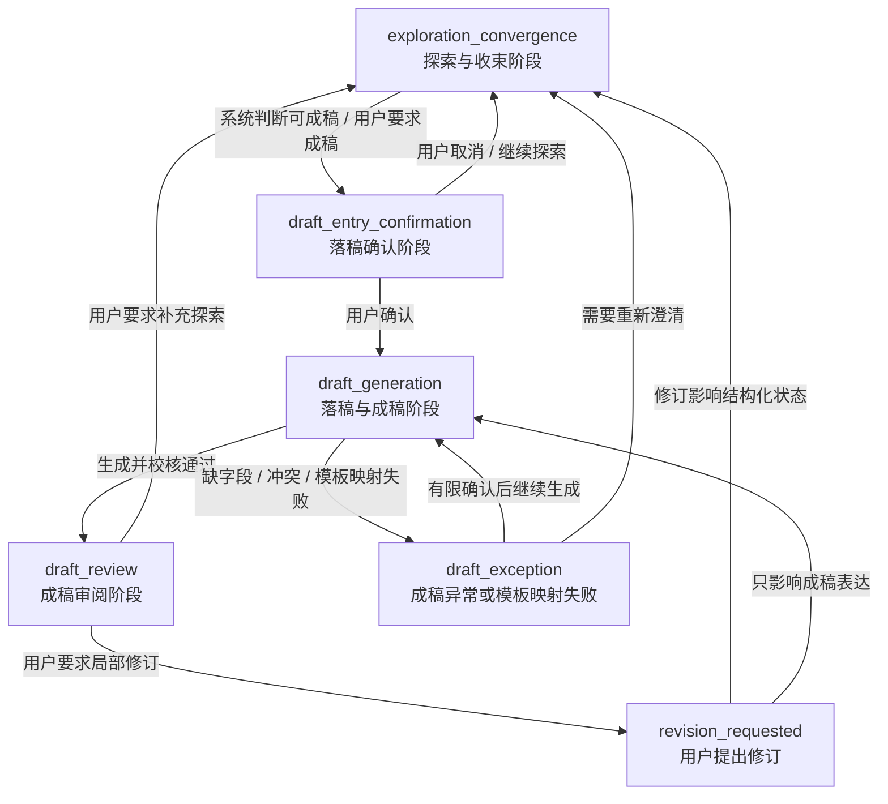
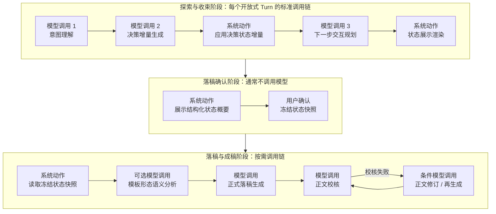
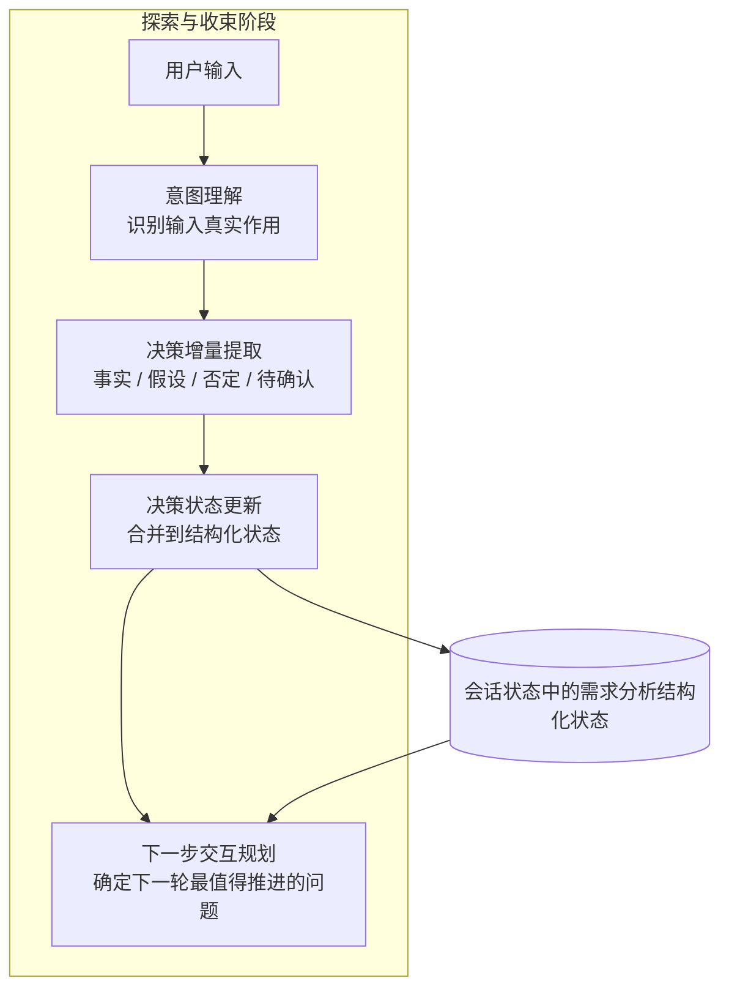
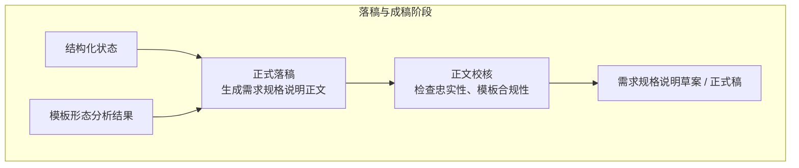

# P2 需求分析系统设计-260507-Write产物重定义与模板约束补充

**文档日期：** 2026-05-07

**文档性质：** 设计补充稿，供评审和后续细化探索。本文聚焦需求分析结构化状态、探索阶段主循环、状态展示职责，以及正式落稿阶段的模板约束边界，不直接修改主设计文档，不进行代码实现。

**关联文档：**

- `P2-需求分析系统设计-260506-决策模式与组织器整改策略补充.md`
- `P2-需求分析系统设计-260506-Write阶段章节配置与规划约束补充.md`
- `P2-需求分析系统设计.md`

## 1. 本轮修订的直接结论

本轮讨论对前一版最关键的纠偏是：

> `write` 不再承担“更新决策状态”或“推进决策”的职责。  
> 它只是把已经更新后的需求分析结构化状态，以用户可读、可观察的形式展示出来。

因此，前一版中“`write` 物化稳定内容”的说法还不够严谨。更准确的目标态应是把系统拆成三类不同动作：

1. **决策主循环**：识别用户意图、更新决策状态、规划下一步交互。
2. **状态展示**：把当前决策状态投影成 A4 临时正文、过程产物、会话摘要等可视视图。
3. **正式落稿**：当决策状态足够稳定，或用户明确要求输出文稿时，再把结构化状态转换成需求规格说明正文。

这三类动作的关系不是串行强绑定，而是：

```text
先运行决策主循环
-> 决策状态被更新
-> 可选执行状态展示
-> 在满足条件时进入正式落稿
```

由此可得出两个直接结论：

1. 在探索阶段，一轮对话是否有效，首要标准不是写了多少正文，而是是否推进了决策状态。
2. 在探索阶段，即使本轮完全不展示正文，也不影响系统继续完成需求分析。

## 2. 核心术语重定义

### 2.1 需求分析结构化状态（Decision Chain State）

需求分析结构化状态是需求分析会话的核心业务状态对象。它不是一段正文，也不是一轮回复文本，而是系统对“当前已经理解和沉淀了什么”的结构化表达。

它至少应包含以下类型信息：

- 已确认事实；
- 已确认决策；
- 暂定假设；
- 未闭合问题；
- 被否定方向；
- 决策之间的依赖关系；
- 下一步交互关注点；
- 与需求规格模板的章节投影关系。

它是探索阶段的权威业务状态，不应由 A4 临时正文反向定义。

### 2.2 意图理解（Intent Understanding）

意图理解负责识别本轮用户输入在当前会话中的真实作用，包括但不限于：

- 补充新事实；
- 修正旧事实；
- 否定已有判断；
- 接受或拒绝系统建议；
- 引入新主题；
- 要求系统停止追问并进入落稿；
- 要求系统回看、总结或对比已有结论。

意图理解输出的不是正文，而是供后续状态更新使用的结构化判定结果。

### 2.3 决策状态更新（Decision State Update）

决策状态更新负责把本轮输入产生的有效决策事件合并到需求分析结构化状态中。

这里要严格区分“语义判断”和“状态应用”：

- 语义判断由模型负责，例如识别哪些是新事实、哪些是暂定假设、哪些是对旧结论的否定。
- 状态应用由系统代码负责，例如依据固定 schema 合并、替换、关闭、标记或建立引用关系。

这样做的原因是：

1. 不把业务语义判断写死在 Python `if/else` 中；
2. 同时避免让模型直接随意改写整份长期状态；
3. 保证状态更新可校验、可追溯、可持久化。

因此，理想形态不是“代码自己判断业务”，也不是“模型直接重写整份状态”，而是：

> 模型输出结构化决策增量，系统对增量做合法性校验后，再应用到会话状态中。

### 2.4 下一步交互规划（Next Interaction Planning）

下一步交互规划负责基于当前结构化状态，决定下一轮最值得推进的交互动作。

它的目标不是简单地“问模板里下一节缺什么”，而是回答三个问题：

1. 当前最关键的不确定性是什么；
2. 继续推进哪个决策最能减少整体模糊度；
3. 当前应继续追问、做方案比较、回看总结，还是进入落稿。

### 2.5 状态展示（State Artifact Rendering）

本补充稿不再把 `write` 作为核心术语。更准确的名称应是 **状态展示**。

状态展示的职责是：

> 读取已经更新后的需求分析结构化状态，把它投影成用户可观察的过程产物或工作视图。

状态展示可以对应现有实现中的 `write` 概念，但语义已经改变。它不再是“补齐正文”，而是“展示状态”。

可展示对象包括：

- A4 临时正文视图；
- 会话摘要；
- 过程产物清单；
- 决策笔记；
- 稳定需求片段；
- 章节投影提示。

### 2.6 正式落稿（Draft Generation）

正式落稿是把已经较稳定的结构化状态，按照选定需求规格模板，转换成正式需求规格说明文本的阶段。

正式落稿不是探索阶段的默认动作，而是下列条件之一成立后才进入：

- 用户明确要求输出草案；
- 系统判断关键决策已基本闭合；
- 达到轮次上限，需要基于现状给出阶段性成稿；
- 某一局部主题已经足够稳定，适合先局部落稿。

### 2.7 正文校核（Draft Verification）

正文校核只服务于正式落稿，不再服务于状态展示。

它主要判断：

- 生成的正文是否忠实反映结构化状态；
- 是否把暂定假设写成确定事实；
- 是否遗漏已确认的关键约束；
- 是否符合模板章节、编号、锚点和表达要求；
- 是否需要标注待确认项或风险说明。

因此，正文校核不是“检查 A4 展示好不好看”，而是“检查正式文稿是否忠实、合规、可交付”。

### 2.8 会话阶段（Session Phase）

会话阶段用于描述一个需求分析会话当前处于哪种生命周期状态。它不是前端 Tab 状态，也不是单轮 Turn 状态，而是会话级业务状态。

目标态至少应包含以下阶段：

| 阶段 | 中文名称 | 主要目标 | 主要交互形态 |
| --- | --- | --- | --- |
| `exploration_convergence` | 探索与收束阶段 | 多轮澄清、更新结构化状态、推进决策闭合 | 用户与助手持续对话 |
| `draft_entry_confirmation` | 落稿确认阶段 | 确认是否冻结当前结构化状态并进入成稿 | 用户确认或取消 |
| `draft_generation` | 落稿与成稿阶段 | 基于结构化状态和模板生成需求规格说明正文 | 系统生成、有限异常确认 |
| `draft_review` | 成稿审阅阶段 | 展示正式草案，支持用户审阅和提出修订 | 用户审阅、局部修订 |

其中，主要开放式交互应停留在 `exploration_convergence` 阶段。进入 `draft_generation` 后，系统不应继续发散探索，而应围绕成稿生成、正文校核和异常处理展开。

### 2.9 决策状态承载页（Decision State View）

决策状态承载页是探索与收束阶段新增的核心页面，用于承载和展示需求分析结构化状态。

它不是临时正文页，也不是完成度树页，而是探索阶段最接近业务主状态的用户可见视图。

它应展示：

- 已确认事实；
- 已确认决策；
- 暂定假设；
- 未闭合问题；
- 被否定方向；
- 决策依据和证据来源；
- 下一步交互焦点；
- 与需求规格模板的章节投影。

因此，目标态下三类页面的关系应是：

```text
决策状态承载页：展示探索阶段业务主状态
临时正文页：把结构化状态投影成类 A4 的阅读视图
完成度树页：把结构化状态投影到需求规格模板结构上
```

## 3. 双阶段总流程

### 3.1 探索与收束阶段

探索与收束阶段的目标不是直接写正文，而是逐轮形成高质量、可追溯、可复用的结构化决策状态。

该阶段的核心问题是：

- 用户真正想表达什么；
- 当前哪些内容已经可以确认；
- 哪些内容只是暂定；
- 哪些关键问题还没有闭合；
- 下一轮最值得问什么。

### 3.2 落稿与成稿阶段

落稿与成稿阶段的目标是把已经沉淀的结构化状态，映射到具体模板，并输出用户可审阅的需求规格说明草案或正式稿。

该阶段的核心问题是：

- 当前状态是否足以生成某个层级的文稿；
- 模板形态是什么；
- 哪些内容进入哪一章哪一节；
- 哪些仍必须标注为待确认；
- 文稿是否忠实和可交付。

### 3.3 两个阶段的关系

| 维度 | 探索与收束阶段 | 落稿与成稿阶段 |
| --- | --- | --- |
| 主目标 | 推进决策状态 | 输出正式文稿 |
| 核心输入 | 用户输入、对话历史、当前决策状态 | 决策状态、模板结构、对话证据 |
| 主产物 | 更新后的结构化状态 | 需求规格说明草案 / 正文 patch |
| 模型关注点 | 理解、判断、规划 | 生成、映射、校核 |
| 模板约束强度 | 弱到中 | 强 |
| 是否每轮都必须发生 | 是 | 否 |

### 3.4 会话阶段状态机

双阶段设计需要落成会话级状态机，否则前端和后端都会继续把“当前还能不能继续聊、什么时候开始成稿、成稿失败怎么办”混在单轮逻辑里处理。

推荐状态机如下：



这里的关键边界是：

1. 探索与收束阶段承载主要开放式沟通。
2. 落稿确认阶段负责冻结当前结构化状态快照。
3. 落稿与成稿阶段以生成、校核和展示为主，不再默认继续需求探索。
4. 成稿异常可以有限询问用户，但不能把成稿阶段重新变成无限发散的对话阶段。

### 3.5 会话阶段、调用链与处理节点总览

现有 `intent_understanding -> write -> review_after_apply -> next_interaction_planning` 四阶段不是完全没有价值，但不能继续作为目标态主流程。

这里需要先明确三个不同层次的概念，避免把它们混成“阶段数量”：

1. **会话阶段**：指整个需求分析会话当前所处的业务阶段，例如探索与收束、落稿确认、落稿与成稿。
2. **调用链**：指在某个会话阶段下，本轮处理通常会经过的一组调用顺序。
3. **处理节点**：指调用链中的具体节点，它可能是模型调用、系统动作或用户确认动作。

因此，本节图中的方框不是“12 个同级阶段”，而是分属于不同层级的处理节点。

更准确的判断是：

| 现有阶段 | 是否保留 | 目标态处理 |
| --- | --- | --- |
| `intent_understanding` | 保留并强化 | 继续作为探索阶段第一类模型调用，负责识别输入真实意图和输入关系 |
| `write` | 不再作为探索主流程模型调用 | 拆为“状态展示”和“正式落稿”：状态展示通常不需要模型，正式落稿只在成稿阶段调用模型 |
| `review_after_apply` | 不再用于探索阶段 | 改为“正文校核”，只服务正式落稿后的文稿检查 |
| `next_interaction_planning` | 保留并强化 | 继续作为探索阶段模型调用，负责选择下一步交互策略 |

目标态不应再理解为“每个 Turn 固定四次模型调用”。应改为按会话阶段选择调用链，并在调用链内部组合不同处理节点：



因此，目标态的常规模型调用数量应是：

| 场景 | 常规模型调用数 | 说明 |
| --- | ---: | --- |
| 探索阶段普通 Turn | 3 次 | 意图理解、决策增量生成、下一步交互规划 |
| 探索阶段状态展示 | 0 次为主 | 结构化状态到 A4 视图的渲染应优先由系统完成 |
| 落稿确认 | 0 次为主 | 展示概要、确认、冻结快照通常不需要模型 |
| 正式落稿 | 2 次起 | 正式落稿生成、正文校核；模板形态语义分析和修订再生成按需追加 |

这个设计的核心目的不是减少或增加调用次数，而是让每次模型调用都有明确职责：模型负责语义理解、决策提取、交互规划、正文生成和正文校核；系统负责状态应用、状态持久化、视图渲染和会话阶段迁移。

## 4. 探索与收束阶段的主循环

### 4.1 主循环定义

探索阶段的最小闭环应定义为：

```text
用户输入
-> 意图理解
-> 决策状态更新
-> 下一步交互规划
```

这个闭环才是需求分析组织器真正的主循环。

如果这个循环稳定运行，即使系统暂时不展示 A4 临时正文，也不会影响需求分析继续推进。

### 4.2 主循环流程图



### 4.3 阶段职责边界

| 环节 | 是否建议调用模型 | 职责 | 不负责什么 |
| --- | --- | --- | --- |
| 意图理解 | 是 | 识别输入真实作用和决策事件类型 | 不直接改正文 |
| 决策增量提取 | 是 | 产出结构化的事实、假设、否定、待确认项 | 不直接持久化 |
| 决策状态更新 | 否，按规则应用 | 把合法增量合并到长期状态 | 不做开放语义猜测 |
| 下一步交互规划 | 是 | 选择最值得推进的下一步策略 | 不直接写正文 |

这里必须强调：

> “不用硬编码业务判断”不等于“所有事情都让模型自由发挥”。  
> 模型负责语义判断，系统负责结构约束、合法性校验和状态持久化。

### 4.4 本阶段的直接产物

探索阶段的直接产物不是正式正文，而是更新后的结构化状态。该状态可以包含如下层次：

- 用户明确确认的结论；
- 系统暂定但未确认的工作假设；
- 当前最关键的未闭合问题；
- 已被用户否定的方向；
- 建议下一步推进的决策点；
- 与模板章节的粗粒度投影。

这意味着：

1. 系统每一轮都应优先让结构化状态变得更清晰；
2. 正文增长不是探索阶段是否成功的主要指标；
3. 如果状态没有推进，就算写出一段正文，也不算高质量的一轮。

## 5. 需求分析结构化状态的存储与权威性

### 5.1 结构化状态不能只存在于大模型上下文中

普通大模型对话可以主要依赖线程上下文，但 P2 是一个正式系统，不能把需求分析结果只寄托在上下文记忆里。

原因包括：

- 上下文会被裁剪或压缩；
- 刷新页面或服务重启后会丢失；
- 无法做结构化比较、回看、统计和展示；
- 无法支撑后续正式落稿。

因此，需求分析结构化状态必须有正式宿主。目标态应是：

```text
RequirementAnalysisSession
  -> 当前轮次列表
  -> 结构化状态 payload
  -> 过程产物 / 工作视图
  -> 正式文稿对象
```

### 5.2 运行时内存与持久化状态的关系

可以在内存里持有一份运行时对象，用于当前请求的处理效率；但权威副本应持久化在会话状态中，而不是只放在模型上下文或 Python 进程内存里。

更严谨的表达是：

- **运行时对象**：当前请求处理时使用的内存对象；
- **会话持久化状态**：跨请求、跨页面、跨重启可恢复的权威状态；
- **对话历史**：作为证据保留原始交流内容；
- **状态展示视图**：对权威状态的投影；
- **正式需求文稿**：基于权威状态和模板生成的目标输出。

### 5.3 四类信息的权威顺序

| 对象 | 作用 | 是否权威 |
| --- | --- | --- |
| 对话历史 | 保存原始证据 | 证据权威 |
| 结构化状态 | 保存系统当前理解和决策结果 | 业务权威 |
| 状态展示视图 | 供用户观察当前状态 | 展示投影，不是业务权威 |
| 正式需求文稿 | 对外输出和审阅 | 交付物权威 |

## 6. 状态展示的职责边界

### 6.1 状态展示的输入

状态展示读取的主输入应是已经更新后的结构化状态，而不是“用户刚才说的话”。

推荐输入包括：

- 当前结构化状态；
- 当前轮次的新增或变更部分；
- 用户当前所处的展示视图偏好；
- 模板章节投影信息；
- 过程产物展示规则。

### 6.2 状态展示的输出

状态展示可以输出多种形式，但这些形式都应被理解为“状态投影”，而不是“正文主真相”。例如：

- 决策状态承载页；
- A4 临时正文；
- “本轮新增了哪些确认项 / 假设 / 待确认项”的边注；
- 会话摘要卡片；
- 过程产物列表；
- 局部稳定片段预览。

### 6.2.1 决策状态承载页与现有页面的关系

目标态下，探索与收束阶段至少需要三个互补页面：

| 页面 | 作用 | 是否业务主状态 |
| --- | --- | --- |
| 决策状态承载页 | 结构化展示已确认事实、假设、未闭合问题、决策依赖和下一步焦点 | 最接近业务主状态 |
| 临时正文页 | 把结构化状态投影成类 A4 的阅读视图，方便用户从文稿角度理解当前结果 | 否 |
| 完成度树页 | 把结构化状态映射到需求规格模板结构，观察哪些章节已有投影、哪些仍缺失 | 否 |

如果没有决策状态承载页，用户将只能看到正文投影和模板投影，而看不到探索阶段真正被系统维护的业务状态。

### 6.2.2 决策状态承载页的展示重点

该页面建议至少分为以下几个区块：

1. 已确认事实与决策；
2. 暂定假设；
3. 未闭合问题；
4. 被否定方向；
5. 下一步交互焦点；
6. 章节投影关系；
7. 当前阶段标识。

其中，“当前阶段标识”用于明确告知用户当前会话仍处于探索与收束阶段，还是已经进入落稿与成稿阶段。

### 6.2.3 决策状态承载页的 A4 视图形态

决策状态承载页建议继续采用 A4 纸视图，但其内容不是正式需求正文，而是结构化状态块。

这样设计有三个原因：

1. 与现有临时正文页保持相近阅读习惯，降低用户理解成本；
2. 让用户看到“当前系统已经沉淀了什么”，而不是只看到聊天记录；
3. 保持探索阶段产物的正式感，但不把它误认为最终需求规格说明正文。

该页面不需要复杂视觉装饰。推荐采用简洁块状结构：

```text
需求分析结构化状态

一、已确认事实
  - ...

二、已确认决策
  - ...

三、暂定假设
  - ...

四、未闭合问题
  - ...

五、被否定方向
  - ...

六、下一步交互焦点
  - ...

七、章节投影
  - ...
```

这里的 A4 纸只是展示容器，不改变结构化状态的权威位置。真正的业务主状态仍存储在会话结构化状态中。

### 6.3 状态展示不参与主决策循环

状态展示不应负责以下动作：

- 判断主用户是否已经闭合；
- 判断某个假设是否应转为事实；
- 判断下一轮该问什么；
- 判断是否应进入方案比较；
- 判断是否已具备正式成稿条件。

这些都属于主决策循环，不属于状态展示。

### 6.4 用户纠正展示内容时的回流路径

如果用户看到 A4 临时正文或其他状态展示后提出纠正，这个纠正也不应由状态展示层直接修改业务状态。

正确路径应是：

```text
用户看到展示结果
-> 提出纠正或补充
-> 形成新的用户输入
-> 重新进入意图理解
-> 重新更新结构化状态
```

这可以保证：

1. 所有业务变化都经过同一套决策主循环；
2. 状态展示层保持只读投影角色；
3. 不会出现“用户改了一处展示文本，但结构化状态没改”的双轨失真。

### 6.5 状态展示不一定需要模型

在多数情况下，状态展示只是把结构化状态按固定视图规则展开，因此原则上可以不调用模型。

只有在以下情况中，才可以考虑让模型辅助生成展示文案：

- 需要把结构化状态整理成更自然的长段说明；
- 需要生成对用户友好的阶段性总结；
- 需要把多个结构化字段压缩成一段可读提示。

即便如此，状态展示也不应反向定义结构化状态。

## 7. 正式落稿与模板约束

### 7.1 模板不再驱动探索阶段逐章填空

模板不应再以“哪一节空着就问哪一节”的方式牵引探索主循环。

探索阶段更合理的模板作用是：

- 记录当前决策未来可能影响哪些章节；
- 让系统保持成稿感知；
- 防止长期探索后无法落稿；
- 为后续正式正文生成提供映射入口。

因此，模板在探索阶段的角色是 **投影约束器**，不是 **写作驱动器**。

### 7.2 模板形态必须被分析，而不是写死为 81433

当前设计不能假定所有模板都等同于 `81433`。目标态应引入模板形态分析能力，从当前选定模板实例中提取：

- 章节层级结构；
- 编号规则；
- 可编辑区域；
- 锚点规则；
- 章节语义说明；
- 是否允许新增章节；
- 是否允许在既有章节下扩写子节。

只有这样，系统才能在不写死某一模板结构的前提下，完成正式落稿。

### 7.3 正式落稿的输入

正式落稿的核心输入应包括：

- 当前结构化状态；
- 已选模板实例；
- 模板形态分析结果；
- 对话证据与引用来源；
- 用户明确的落稿要求，例如“输出草案”“整理成正式需求规格说明”。

### 7.3.1 进入正式落稿前的确认与快照机制

正式落稿前建议增加一个明确的落稿确认点，而不是在探索阶段中无感切换。

该确认点的职责包括：

1. 向用户说明当前会话准备从探索与收束阶段切换到落稿与成稿阶段；
2. 展示当前结构化状态的概要，例如已闭合决策、待确认项和主要风险；
3. 允许用户确认进入成稿，或继续回到探索阶段补充；
4. 在用户确认后冻结一份结构化状态快照，供正式落稿使用。

这里的“冻结快照”非常关键。原因是：

- 探索阶段的结构化状态仍可能继续变化；
- 成稿过程需要一个稳定输入，不能边生成边变更；
- 成稿失败时需要知道失败的是哪一版状态快照，而不是哪一轮聊天文本。

因此，正式落稿的直接输入不应是“会话当前正在变化的实时状态”，而应是：

> 经确认后冻结的结构化状态快照 + 当前选定模板实例 + 模板形态分析结果。

### 7.4 正式落稿流程图



### 7.5 正文校核的边界

正文校核只在正式落稿后发生。它不再承担“审查探索阶段展示产物”的职责。

正文校核应重点检查：

- 是否忠实引用结构化状态；
- 是否错误强化了暂定假设；
- 是否遗漏关键约束；
- 是否符合模板编号与章节规则；
- 是否需要显式保留未闭合项。

如果正文校核失败，反馈的是正式文稿需要修正，而不是探索主循环本身失效。

### 7.6 落稿与成稿阶段的交互边界

落稿与成稿阶段不应再承担开放式需求探索。它的正常交互应主要限于：

- 进入成稿前的确认；
- 成稿失败时的有限异常确认；
- 成稿后用户对文稿提出的审阅意见；
- 用户要求重新回到探索阶段补充决策。

因此，目标态并不是“成稿阶段完全不需要交互”，而是：

> 成稿阶段只保留受控、有限、围绕文稿生成的交互，不再承担发散式探索职责。

## 8. 对旧“write / review”说法的修正

### 8.1 旧说法的问题

旧说法把探索过程理解成：

```text
用户输入
-> write
-> review
-> next planning
```

这会导致两个问题：

1. 把正文增长误当成决策推进；
2. 把 review 的职责误压在“检查这段写出来的话像不像正文”上。

### 8.2 修正后的理解

修正后应拆成如下结构：

```text
探索主循环：
用户输入
-> 意图理解
-> 决策状态更新
-> 下一步交互规划

可选展示支路：
决策状态
-> 状态展示

正式成稿支路：
决策状态 + 模板
-> 正式落稿
-> 正文校核
```

### 8.3 新旧概念映射

| 旧概念 | 问题 | 新概念 |
| --- | --- | --- |
| `write` | 被误解为直接补正文 | 状态展示 / 正式落稿，按职责拆开 |
| `review_after_apply` | 被误解为每轮都要审查正文 | 正文校核，仅服务正式落稿 |
| `working_document` | 容易被误解为业务主状态 | 工作视图 / 展示投影 |
| 章节完成度推进 | 容易替代真实决策推进 | 决策状态推进为主，模板投影为辅 |

## 9. 极端边界检验

### 9.1 如果探索阶段完全不做状态展示，系统还能否工作

可以。

只要主决策循环仍能：

- 识别用户输入；
- 更新结构化状态；
- 规划下一轮问题；

系统就仍然具备需求分析能力。此时只是用户对系统当前理解的可见性降低，不代表需求分析失效。

### 9.2 如果只有状态展示，没有结构化状态，系统还能否工作

不能。

这会退化成一种“边聊边写”的表面系统。看起来有 A4 纸、有边注、有片段，但没有稳定的业务状态承载，最终既无法可靠回看，也无法可靠成稿。

### 9.3 如果只有模板逐章填空，没有决策主循环，系统还能否工作

也不能。

这会退化成“章节填空器”。用户会得到一些看似正式的段落，但系统并没有真正理解和收束需求决策。

### 9.4 如果有结构化状态，但没有正式落稿阶段，系统还能否交付结果

不能完整交付。

它可以完成需求探索，但不能把结果稳定转成用户最终需要的需求规格说明文稿。

因此，完整系统必须同时具备：

1. 决策主循环；
2. 结构化状态持久化；
3. 状态展示能力；
4. 正式落稿与正文校核能力。

## 10. 本轮设计判断

本轮讨论形成如下判断：

1. 探索阶段的业务主状态应是需求分析结构化状态，而不是临时正文。
2. 探索阶段的主循环应是“意图理解 -> 决策状态更新 -> 下一步交互规划”。
3. 状态展示只是把更新后的结构化状态投影给用户看，不参与主决策循环。
4. 状态展示原则上可以不依赖模型，至少不应把模型输出再次作为业务真相来源。
5. 正式落稿应从探索主循环中拆出，成为单独阶段。
6. 正文校核只服务正式落稿，不再服务探索阶段的状态展示。
7. 模板在探索阶段是投影约束器，在正式落稿阶段才是强约束器。
8. 模板形态必须被分析，不能写死为 `81433` 一种结构。
9. “不用硬编码做业务判断”应落实为“模型负责语义判断，系统负责结构约束与状态应用”。
10. P2 要比普通对话型 brainstorming 多出的关键能力，不是更早写正文，而是把探索结果沉淀为可持久、可展示、可成稿的结构化状态。
11. 现有四阶段调用链不能作为目标态固定流程；应按会话阶段选择调用链，并区分模型调用、系统动作和用户确认动作。
12. 探索阶段普通 Turn 的目标态模型调用以三类为主：意图理解、决策增量生成、下一步交互规划。
13. 状态展示页应优先采用系统渲染，不应成为每轮固定模型调用。
14. 决策状态承载页可采用 A4 纸视图，但纸面内容是结构化状态块，不是正式需求规格正文。

以上判断用于修正前一版对 `write` 和 `review` 的泛化理解。后续如需回写主设计文档，建议优先落到以下位置：

- `6.6.2` 状态机设计；
- `6.6.4` 会话对象与生命周期设计；
- `6.6.5` 轮次执行设计；
- `6.6.7.4` 轮次执行子模块；
- `5.7` 需求分析组织器 Lab 设计。
