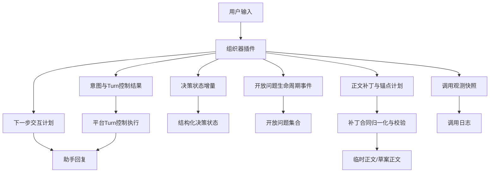
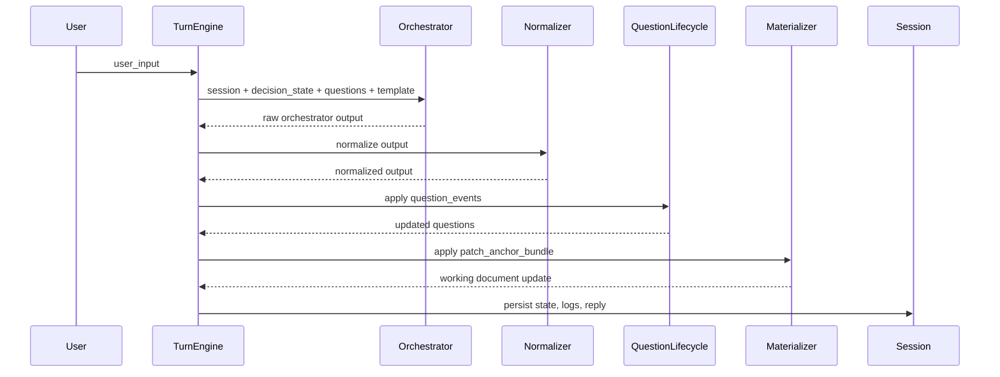
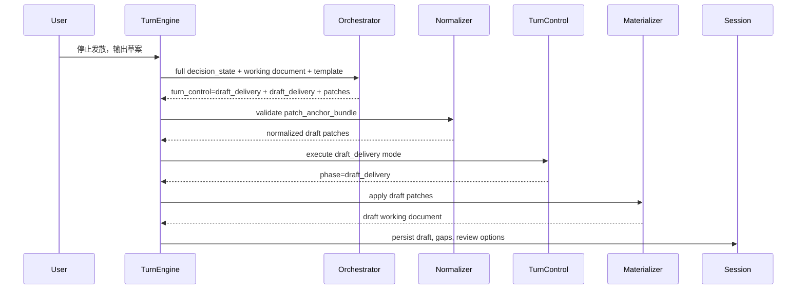

# P2 需求分析系统设计-260509-三组织器连续会话整改升级补充

## 1. 背景

2026-05-09 对 P2 需求分析 Lab 当前 3 个组织器执行了同题 12 Turn 连续测试，原始记录见：

`DOC/CODEX_DOC/06_测试文档/03_机测记录/2026-05-09-P2三组织器同题12Turn连续测试记录.md`

测试输入覆盖了态势分析系统从模糊起始需求到最终要求收束成稿的完整探索链路。测试证明当前系统已经具备“多组织器可运行、结构化状态可增长、临时正文可物化”的基础，但还不能认为已经具备稳定的连续会话需求探索能力。

本补充设计不替代 `P2-需求分析系统设计.md`，而是作为一次针对连续会话问题的专项升级依据。待用户审阅通过后，再按合理部分回并到主设计文档。

## 2. 测试暴露的问题

### 2.1 `brainstorm-v1` 收束阶段合同错误

第 12 Turn 用户明确要求：

```text
先停止继续发散，基于当前信息收束，给我形成一版需求规格说明草案，并保留仍然没有确认的问题。
```

`brainstorm-v1` 返回：

```json
{
  "detail": "document_patch.plan_ref is not in target_anchor_plan: plan-draft-001"
}
```

问题性质：

1. 这是合同错误，不是普通回复质量问题。
2. 模型或组织器生成了 `document_patch.plan_ref=plan-draft-001`。
3. 但对应的 `target_anchor_plan.plan_id` 中没有该值。
4. 后端按现有合同拒绝该 Turn，导致连续会话在最终收束节点失败。

### 2.2 本地组织器开放问题膨胀

12 Turn 测试结果：

| 组织器 | Turn 1 开放问题 | Turn 12 开放问题 | 现象 |
| --- | ---: | ---: | --- |
| `xg-local-heuristic-orchestrator` | 6 | 33 | 用户补充越多，问题越多 |
| `brainstorm-v1` | 6 | 34 | 事实吸收最多，但问题也持续增长 |

问题性质：

1. 当前组织器会新增开放问题，但缺少稳定的关闭问题机制。
2. 用户补充事实后，系统没有判断哪些旧问题已经被回答。
3. 下一步规划阶段容易重新提出已经被用户部分回答的问题。
4. 结果是连续会话越聊越散，无法自然进入收束。

### 2.3 显式收束意图没有被稳定执行

12 Turn 测试结果：

| 组织器 | 第 12 Turn 结果 |
| --- | --- |
| `xg-local-heuristic-orchestrator` | 继续追问适用范围，未进入草案 |
| `brainstorm-v1` | 尝试进入草案，但合同错误导致 400 |
| `brainstorm-v1-dify-workflow` | 返回“本轮输入尚不足以稳定写入正文”，未进入草案 |

问题性质：

1. “停止发散 / 输出草案 / 收束成稿”应是高优先级用户意图。
2. 当前三个组织器都没有完整实现该意图的闭环。
3. 如果信息不足，也应输出“带缺口的草案”，而不是退回普通追问。

### 2.4 Dify 工作流可观测性不足

`brainstorm-v1-dify-workflow` 12 Turn 全部成功，但：

- `provider_log_count_total=0`
- 无法查看 Dify 输入、workflow run id、原始 outputs、规范化结果、分支判断依据

问题性质：

1. Dify 是外部工作流，不应伪装成本地多阶段 Provider 调用。
2. 但系统仍需要可审计的外部工作流调用日志。
3. 否则无法判断 Dify 是 prompt 问题、输入字段问题、workflow 分支问题还是平台物化问题。

## 3. 设计目标

### 3.1 功能目标

本次升级目标如下：

1. 修复 `brainstorm-v1` 草案分支的 `plan_ref` 合同错误。
2. 建立开放问题生命周期，使问题可以被新增、更新、关闭、保留。
3. 将“收束成稿”作为显式 Turn 控制结果，而不是普通下一问。
4. 让 Dify 工作流提供最小可审计调用快照。
5. 形成可重复的 10 至 20 Turn 连续测试基线。

### 3.2 设计原则

1. **业务判断交给模型或组织器插件**
   Python 平台代码不得用中文关键词、章节名称或业务语义做硬编码判断。

2. **平台只做协议执行和机械校验**
   平台可以校验 `plan_ref` 是否存在、ID 是否一致、字段是否完整；不能替模型判断“某个需求事实应该写到哪个章节”。

3. **组织器必须显式输出决策**
   是否关闭问题、是否进入草案、是否继续追问，都必须由组织器输出结构化字段。

4. **合同错误优先在组织器侧修复，平台侧兜底诊断**
   平台可以补齐缺省机械字段，但不应默默吞掉业务不一致。

5. **探索阶段和成稿阶段分开表达**
   探索阶段可以持续维护结构化状态和临时正文；成稿阶段必须明确输出草案、缺口和后续人工确认事项。

## 4. 方案比较

### 4.1 方案 A：只修改 Prompt

做法：

- 修改 `brainstorm-v1`、`xg-local-heuristic-orchestrator` 和 Dify workflow 的 prompt。
- 强调不要重复追问、要求输出草案、要求 `plan_ref` 对齐。

优点：

- 改动小。
- 不触动平台结构。

缺点：

- 无法稳定解决合同错误。
- 开放问题关闭缺少结构化承载。
- Dify 仍缺少可观测输出。
- 容易在下一次测试中复发。

结论：不推荐作为主方案，只能作为辅助改动。

### 4.2 方案 B：组织器输出合同升级 + 平台机械校验增强

做法：

1. 组织器输出新增问题生命周期事件、收束控制结果和草案交付结果。
2. 平台只负责执行结构化事件和合同校验。
3. `document_patch` 与 `target_anchor_plan` 引入统一归一化和诊断。
4. Dify 工作流返回外部调用快照。

优点：

- 符合“不要把业务判断写死在 Python 里”的原则。
- 能同时解决合同错误、问题膨胀、收束失败和可观测不足。
- 能形成长期可测试的协议。

缺点：

- 需要改 schema、prompt、物化层和测试。
- 短期工作量中等。

结论：推荐采用。

### 4.3 方案 C：拆成独立 Draft Delivery 组织器

做法：

- 保留现有组织器负责探索。
- 用户要求收束时，平台改调一个专用成稿组织器。

优点：

- 成稿逻辑可以单独优化。
- 不影响探索组织器。

缺点：

- 会引入跨组织器状态传递问题。
- 当前测试暴露的问题不只是成稿，也包括开放问题膨胀和可观测不足。
- 会增加用户选择和调试复杂度。

结论：暂不作为本轮主方案。后续如果成稿质量要求独立升级，可作为二期方案。

## 5. 推荐总体方案

采用方案 B：组织器输出合同升级 + 平台机械校验增强。

整体思路：



平台不从用户文本中直接判断“是否成稿”，而是读取组织器输出的 `turn_control`。平台只根据枚举值执行状态机分支。

## 6. 核心合同升级

### 6.1 新增 `turn_control`

每个组织器 Turn 输出必须包含 `turn_control`：

```json
{
  "turn_control": {
    "mode": "continue_exploration",
    "reason": "用户仍在补充需求事实，需要继续探索",
    "draft_requested": false,
    "draft_delivery_required": false,
    "should_ask_next_question": true
  }
}
```

`mode` 枚举：

| 值 | 含义 |
| --- | --- |
| `continue_exploration` | 继续探索和澄清 |
| `focused_clarification` | 聚焦补一个关键缺口 |
| `draft_delivery` | 用户要求收束或系统判断可交付草案 |
| `draft_with_gaps` | 信息不足，但仍输出带缺口草案 |
| `handoff_ready` | 已满足进入后续 P3/P4 的交付条件 |

约束：

1. 用户显式要求“停止追问、形成草案、先成稿、输出需求规格说明”时，组织器应输出 `draft_delivery` 或 `draft_with_gaps`。
2. 如果组织器认为信息不足，不能只说“不足以写入正文”，必须输出 `draft_with_gaps` 并列出缺口。
3. 平台不得用中文关键词硬编码设置 `mode`，只能执行组织器输出的枚举。

### 6.2 新增 `question_events`

当前 `open_questions_delta` 只能表达新增问题，不足以表达关闭和更新。新增统一事件：

```json
{
  "question_events": [
    {
      "event": "close",
      "question_id": "DS-Q-003",
      "reason": "用户已确认主要用户为参谋分析员、指挥员和数据管理员",
      "evidence_fact_ids": ["DS-F-003", "DS-F-004"]
    },
    {
      "event": "add",
      "question_id": "DS-Q-009",
      "content": "是否需要多用户协同标绘和结果共享？",
      "priority": "medium",
      "target_section": "3 功能需求 / 结果输出与共享"
    }
  ]
}
```

事件枚举：

| 事件 | 含义 |
| --- | --- |
| `add` | 新增开放问题 |
| `update` | 修改问题内容、优先级或目标章节 |
| `close` | 用户已回答或系统已吸收，关闭问题 |
| `defer` | 保留为后续阶段，不作为下一轮追问 |
| `merge` | 合并重复问题 |

平台职责：

1. 按 `question_id` 执行事件。
2. 记录关闭原因和证据事实 ID。
3. 拒绝无 ID 的 `close/update/merge` 事件。
4. 不判断某个问题是否应该关闭。

组织器职责：

1. 判断用户输入是否回答了旧问题。
2. 输出应关闭、合并或保留的问题。
3. 下一步规划只能优先追问仍处于 `open` 且优先级高的问题。

### 6.3 升级 `draft_delivery`

当 `turn_control.mode` 为 `draft_delivery` 或 `draft_with_gaps` 时，输出必须包含：

```json
{
  "draft_delivery": {
    "draft_type": "requirements_spec_draft",
    "coverage_summary": "已覆盖总则、项目概述、功能需求、数据需求、非功能需求和验收准则的初稿。",
    "remaining_gaps": [
      {
        "gap_id": "GAP-001",
        "content": "安全权限模型尚未确认",
        "target_section": "5 非功能需求 / 安全与权限",
        "blocking_level": "non_blocking"
      }
    ],
    "delivery_message": "以下为基于当前信息形成的需求规格说明草案，未确认项已作为缺口保留。"
  }
}
```

约束：

1. `draft_delivery` 不等于“停止写入正文”。
2. 信息不足时输出 `draft_with_gaps`，而不是退回普通追问。
3. 草案正文仍通过 `document_patch` 和 `target_anchor_plan` 表达。
4. `next_interaction` 应变为“审阅草案/继续补缺口/进入后续阶段”，不能继续普通开放式追问。

### 6.4 升级 `patch_anchor_bundle`

为避免 `plan_ref` 错误，定义逻辑对象 `patch_anchor_bundle`。实现上可以仍沿用 `target_anchor_plan` 和 `document_patch` 字段，但归一化时必须按统一规则处理。

```json
{
  "target_anchor_plan": [
    {
      "plan_id": "DRAFT-AP-001",
      "template_clause_id": "REQ-1.1",
      "anchor_path": "1 总则 / 编写目的",
      "display_heading": "1.1 编写目的"
    }
  ],
  "document_patch": [
    {
      "plan_ref": "DRAFT-AP-001",
      "operation": "upsert",
      "content": "本系统用于支持军事和应急联合指挥场景下的态势展示、空间分析和部署辅助研判。"
    }
  ]
}
```

归一化规则：

1. 每个 `document_patch.plan_ref` 必须能命中一个 `target_anchor_plan.plan_id`。
2. 如果 patch 没有 `plan_ref`，但有 `anchor_path` 或 `template_clause_id`，平台可以机械生成 plan。
3. 如果 patch 有 `plan_ref`，但 plan 缺失，同时 patch 有明确锚点信息，平台可以机械补齐同 ID plan。
4. 如果 patch 只有 `plan_ref`，没有任何锚点信息，平台必须返回结构化合同错误。
5. 平台补齐行为必须记录到 `normalization_warnings`，不能静默吞掉。

这属于机械合同归一化，不属于业务判断硬编码。

## 7. 模块设计

### 7.1 组织器输出合同归一化服务

建议新增或强化：

`OrchestratorTurnOutputNormalizer`

职责：

1. 接收组织器原始输出。
2. 归一化 `turn_control`、`question_events`、`draft_delivery`、`target_anchor_plan`、`document_patch`。
3. 生成 `normalization_warnings`。
4. 在无法机械修复时返回结构化合同错误。

输入：

- 组织器原始输出
- 当前模板章节配置
- 当前 decision state
- 当前 open questions

输出：

- normalized orchestrator output
- normalization warnings
- contract diagnostics

不做：

- 不判断业务事实是否正确。
- 不判断用户是否真的想成稿。
- 不决定某个事实应该落到哪个章节。

### 7.2 开放问题生命周期服务

建议新增或强化：

`QuestionLifecycleService`

职责：

1. 根据 `question_events` 更新问题集合。
2. 支持 `add/update/close/defer/merge`。
3. 维护问题状态：`open`、`closed`、`deferred`、`merged`。
4. 记录问题关闭证据和来源 turn。
5. 为下一步规划提供仍待处理的问题视图。

输入：

- 当前问题集合
- `question_events`
- 本轮新增事实

输出：

- 更新后的问题集合
- closed question count
- open question count
- question lifecycle audit

不做：

- 不根据正文内容自行关闭问题。
- 不使用中文关键词识别问题是否回答。

### 7.3 Turn 收束控制执行器

建议新增或强化：

`TurnControlExecutor`

职责：

1. 读取 `turn_control.mode`。
2. 根据枚举执行平台状态机分支。
3. 当 `draft_delivery` 或 `draft_with_gaps` 时，要求存在 `draft_delivery` 对象。
4. 生成会话阶段变化：`exploration_convergence`、`draft_delivery`、`waiting_review`。
5. 约束 `next_interaction` 类型。

输入：

- normalized `turn_control`
- normalized `draft_delivery`
- 当前 session phase

输出：

- session phase update
- assistant response mode
- next interaction mode

不做：

- 不从用户原文中识别收束意图。
- 不自行决定是否可以成稿。

### 7.4 外部工作流调用日志服务

建议新增或强化：

`ExternalWorkflowCallLogService`

职责：

1. 记录 Dify workflow 的输入摘要。
2. 记录 workflow run id、workflow id、response mode、status、耗时。
3. 记录 Dify outputs 摘要。
4. 记录规范化后的组织器输出摘要。
5. 在前端调用日志中以“外部工作流调用”方式展示。

注意：

- 这不是普通大模型 Provider 日志。
- UI 可以统一放在调用日志页，但类型必须区分为 `model_provider_call` 与 `external_workflow_call`。

最小日志结构：

```json
{
  "call_type": "external_workflow_call",
  "workflow_provider": "dify",
  "workflow_id": "dify-workflow-id",
  "workflow_run_id": "dify-workflow-run-id",
  "request_summary": {
    "user_input": "...",
    "template_id": "...",
    "decision_state_fact_count": 20
  },
  "response_summary": {
    "document_patch_count": 7,
    "question_event_count": 3,
    "turn_control_mode": "draft_delivery"
  },
  "raw_outputs_excerpt": {}
}
```

## 8. 组织器改造要求

### 8.1 `xg-local-heuristic-orchestrator`

重点改造：

1. 在 `decision_state_delta` 阶段输出 `question_events`。
2. 在 `next_interaction_planning` 阶段读取问题状态，不再重复追问已回答问题。
3. 用户要求收束时，输出 `turn_control.mode=draft_delivery` 或 `draft_with_gaps`。
4. 草案输出必须通过 `patch_anchor_bundle` 形成可物化正文。

验收目标：

- 12 Turn 测试中开放问题不应单调膨胀。
- 第 12 Turn 应进入草案或带缺口草案。

### 8.2 `brainstorm-v1`

重点改造：

1. 修复草案分支 `plan_ref` 与 `target_anchor_plan` 不一致问题。
2. 所有草案 patch 必须引用有效 plan。
3. 输出 `question_events`，支持关闭旧问题。
4. 第 12 Turn 收束请求不得返回 400。

验收目标：

- 12 Turn 测试第 12 Turn 返回 `200 OK`。
- 输出草案或带缺口草案。
- 合同校验无 `plan_ref` 错误。

### 8.3 `brainstorm-v1-dify-workflow`

重点改造：

1. Dify workflow 输出 `turn_control`。
2. Dify workflow 输出 `question_events`。
3. Dify workflow 在用户要求收束时进入 `draft_delivery` 或 `draft_with_gaps`。
4. Adapter 返回 `external_workflow_call` 日志。
5. 助手回复应包含已吸收内容和下一步明确动作，避免模板化短句。

验收目标：

- 12 Turn 测试仍全部 `200 OK`。
- 第 12 Turn 不再返回“输入不足以稳定写入正文”。
- 调用日志能看到 Dify workflow run id 和输出摘要。

## 9. 数据流设计

### 9.1 普通探索 Turn



### 9.2 收束成稿 Turn



## 10. 接口与前端影响

### 10.1 后端会话输出新增字段

建议在 session payload 中增加：

```json
{
  "turn_control": {},
  "question_lifecycle_summary": {
    "added": 0,
    "closed": 0,
    "deferred": 0,
    "merged": 0,
    "open_total": 0
  },
  "draft_delivery": {},
  "normalization_warnings": [],
  "external_workflow_logs": []
}
```

### 10.2 前端展示影响

调用日志页：

1. 增加调用类型：模型 Provider 调用、外部工作流调用。
2. Dify 组织器显示 workflow 输入摘要、workflow run id、输出摘要。

会话管理页：

1. 结构化状态页增加问题生命周期统计。
2. 当进入 `draft_delivery` 时，助手回复应显示“草案已形成/带缺口草案”。
3. 下一步选项从普通追问变为“审阅草案、继续补缺口、进入后续阶段”。

## 11. 测试设计

### 11.1 单元测试

新增或更新：

1. `QuestionLifecycleService` 测试：
   - add/update/close/defer/merge
   - close 无 ID 时失败
   - merge 后不重复追问

2. `OrchestratorTurnOutputNormalizer` 测试：
   - patch 缺 `plan_ref` 但有 anchor，可补齐
   - patch 有 `plan_ref` 且 plan 缺失但有 anchor，可补齐并记录 warning
   - patch 只有未知 `plan_ref`，返回合同错误

3. `TurnControlExecutor` 测试：
   - `draft_delivery` 要求存在 `draft_delivery`
   - `draft_with_gaps` 允许剩余缺口
   - `continue_exploration` 不触发草案态

4. Dify adapter 测试：
   - 返回 external workflow log
   - workflow 输出 `draft_delivery` 时平台可消费

### 11.2 集成测试

固定 12 Turn 输入链，测试 3 个组织器：

| 验收项 | 目标 |
| --- | --- |
| `brainstorm-v1` 第 12 Turn | 必须 `200 OK` |
| 三个组织器最终 Turn | 必须进入 `draft_delivery` 或 `draft_with_gaps` |
| 开放问题 | 不允许只增不减，必须有关闭事件 |
| patch 合同 | 所有 `plan_ref` 都能命中 plan |
| Dify 日志 | 至少有 external workflow log |

### 11.3 人测重点

1. 用户是否能看懂当前还缺什么。
2. 用户要求停止时，系统是否真的停止发散。
3. 草案是否能作为后续需求规格说明基础。
4. 调用日志是否能解释 Dify 为什么这么输出。

## 12. 实施计划建议

### 阶段一：合同与测试先行

1. 固化 12 Turn 测试脚本。
2. 增加 `plan_ref` 合同回归测试。
3. 增加 question lifecycle 单元测试。

### 阶段二：修复 `brainstorm-v1` 阻塞问题

1. 修复草案分支输出 schema/prompt。
2. 强化 `target_anchor_plan` 与 `document_patch` 归一化。
3. 确保第 12 Turn 不再 400。

### 阶段三：开放问题生命周期

1. 增加 `question_events`。
2. 改造两个本地组织器的决策状态输出。
3. 前端展示问题关闭统计。

### 阶段四：收束成稿控制

1. 增加 `turn_control`。
2. 增加 `draft_delivery` 对象。
3. 三个组织器全部支持 `draft_delivery` / `draft_with_gaps`。

### 阶段五：Dify 可观测性

1. Dify adapter 输出 external workflow log。
2. 调用日志页区分外部工作流调用。
3. Dify workflow 输出 question events 和 turn control。

## 13. 风险与边界

### 13.1 风险

1. 组织器输出合同升级后，现有测试需要同步更新。
2. Dify workflow 修改需要保证远端发布版本与本地 manifest 一致。
3. 如果平台过度兜底，可能重新滑向业务判断硬编码。

### 13.2 边界

本轮不处理：

1. 需求规格说明正式冻结与 P3 交付。
2. 多模板复杂章节重排。
3. 多会话并发治理。
4. 前端大规模视觉改版。

## 14. 验收标准

升级完成后，重新执行同一条 12 Turn 输入链。

最低通过标准：

1. 三个组织器均完成 12 Turn，且无 400/500。
2. `brainstorm-v1` 第 12 Turn 不再出现 `plan_ref` 错误。
3. 三个组织器第 12 Turn 均进入 `draft_delivery` 或 `draft_with_gaps`。
4. 本地组织器开放问题存在关闭事件，不再单调膨胀。
5. Dify 组织器产生可查看的 external workflow log。
6. 所有 `document_patch.plan_ref` 均能命中 `target_anchor_plan.plan_id`。

增强通过标准：

1. 最终草案覆盖总则、项目概述、功能需求、数据需求、非功能需求、验收准则。
2. 助手回复能说明“已吸收什么、还缺什么、下一步为什么这样做”。
3. 用户要求停止时，不再继续普通追问。
4. 测试报告能自动生成每轮事实数、问题关闭数、正文块数和失败诊断。

## 15. 与主设计文档的回并建议

如果本方案通过审阅，建议回并到主设计文档的以下位置：

1. `6.6.2 状态机设计`：补充 `draft_delivery` 和 `draft_with_gaps` 的 Turn 控制分支。
2. `6.6.5 轮次执行设计`：补充 `turn_control`、`question_events`、`draft_delivery` 的执行顺序。
3. `6.6.6 模块接口设计`：补充组织器输出合同升级字段。
4. `6.6.7 内部功能组成与类划分`：补充 `QuestionLifecycleService`、`OrchestratorTurnOutputNormalizer`、`TurnControlExecutor`、`ExternalWorkflowCallLogService`。
5. `6.6.8 可观测性设计`：补充外部工作流调用日志与模型 Provider 调用日志的区别。
