# P2 需求分析系统软件设计说明

> 本文件是 `CodeFactoryV2` 中 `P2 需求分析系统` 的主软件设计说明文档。本文描述本阶段认可的目标态系统设计：系统边界、前端形态、后端架构、模块职责、对象模型、接口、运行流程和验收口径。
>
> 本文不承担实现审查和迁移计划职责；相关内容由独立说明承接。
>
> 当前与 `P2 Lab` 组织器解耦直接相关的补充文档包括：
>
> - `P2-需求分析系统设计-260505-1311-Lab临时正文驱动补充.md`
> - `P2-需求分析系统设计-260505-1701-轮次多阶段模型调用补充.md`
> - `P2-需求分析系统设计-260506-0250-Write阶段章节配置与规划约束补充.md`
> - `P2-需求分析系统设计-260506-1710-可观测组织器插件解耦补充.md`
> - `P2-需求分析系统设计-260512-1904-面向用户工作流升级补充.md`
> - `P2-需求分析系统设计-260512-2130-Lab真实系统同步升级方案补充.md`
> - `P2-需求分析系统设计-260513-1105-需规管理发布工作流补充.md`

**日期：** 2026-05-02

**对应节点：**

- `P2` 需求分析系统
- `P2.1` 专家需求规格编写工作台
- `P2.2` 需求规格对象输出与投影
- `P2.3` 上游知识输入模拟与联调入口
- `P2 Lab` 需求分析组织器原理验证能力

## 1. 文档目的与设计口径

### 1.1 文档目的

本文用于回答以下设计问题：

1. `P2` 是什么系统，边界在哪里。
2. 专家正面工作的对象是什么。
3. 前端有哪些页面、区块和状态协作关系。
4. 后端按什么层次组织，核心模块分别承担什么职责。
5. 关键对象如何持久化和流转。
6. API 如何承载前端、上游知识、下游规格输出和组织器 Lab。
7. 一份需求规格说明如何从草稿进入冻结。

### 1.2 设计口径

本文采用目标态软件设计说明口径：

- 描述“系统应该如何设计”，不混入“现有代码哪里不足”。
- 描述“模块职责和接口”，不把实施步骤写成系统设计。
- 描述“本阶段可实现的理想形态”，不要求一次性覆盖未来所有阶段。
- 设计内容在本文内自包含，读者不需要依赖其他专题文档才能理解 `P2` 主架构。

### 1.3 术语使用规则

本文面向软件设计评审，优先使用中文概念名。英文名只在第一次出现时作为实现命名对照，或在代码路径、接口字段、类名、枚举值、文件名中使用。

例如：

- 需求分析会话与运算模块（`Requirement Analysis Session and Computation Module`）。
- 需求分析会话（`RequirementAnalysisSession`）。
- 需求分析轮次（`RequirementAnalysisTurn`）。
- 需求分析组织器对象（`RequirementAnalysisOrchestrator`）。
- 组织器描述包（`Orchestrator Package`）。
- 组织器宿主（`Orchestrator Host`）。
- 模型提供方（`Provider`）。

后续正文若讨论设计概念，应使用中文名；若讨论实现对象、字段或文件，应保留英文名。

### 1.4 系统主路径

`P2` 的主路径是：

```text
新建或选择需求规格说明对象
  -> 选择规格模板与领域知识
  -> 进入组织器配置或专家工作台
  -> 专家通过问答或表单输入需求
    -> 系统维护需求语义状态
      -> 生成并修补标准需求规格说明正文
        -> 缺口检查与条款批注
          -> 专家冻结 / 发布
            -> 输出标准需求规格说明 + RequirementSpec / P3 可接收包给 P3
```

需求分析组织器 Lab 是主路径的原理验证能力，用于验证问答式需求收敛、轮次审计、模型提供方和可替换组织器，不直接替代专家工作台。

面向业务用户的入口以“需求规格说明对象”为主。一个需求规格说明对象代表一份可管理的需求规格说明任务，关联工作文档、组织器会话和最终发布包；普通用户先管理对象，再进入配置、会话、审计和发布动作。

## 2. 系统定位

### 2.1 一句话定位

`P2 需求分析系统` 是面向专业知识专家的软件需求规格说明编写系统。它把 `P1` 发布态知识、专家自然输入、表单填报和模板规则收敛为可冻结、可审查、可交给 `P3` 的标准需求规格说明文档和结构化 `RequirementSpec` 包。

### 2.2 正面工作对象

专家正面工作的对象是：

```text
标准需求规格说明文档
```

不是：

- 低代码模型。
- 组件装配结果。
- 纯表单。
- 模型聊天记录。
- 组织器内部状态。

结构化对象仍然存在，但它是后台事实状态和下游消费包，用于支撑：

- 正文生成。
- 一致性校验。
- 条款批注。
- 来源追溯。
- `P3` 结构化输入。

### 2.3 用户角色

| 角色 | 主要目标 | 使用入口 |
| --- | --- | --- |
| 专业知识专家 | 编写、审阅、冻结标准需求规格说明 | 专家需求规格编写工作台 |
| 需求分析人员 | 协助专家把自然描述收敛为规格条款 | 专家工作台、组织器 Lab |
| 管理员 / 开发者 | 配置模板、字段、问答策略、缺口检查规则和领域知识来源 | 配置与模板管理台 |
| 下游系统 | 获取冻结后的规格文档和结构化规格包 | `P2 -> P3` 输出接口 |

## 3. 业务目标与边界

### 3.1 首版负责

首版 `P2` 负责：

- 提供需求规格说明对象的创建、打开、进入配置、发布和归档入口。
- 提供专家需求规格编写工作台。
- 支持 `问答模式 / 表单模式` 两种同源输入。
- 实时呈现完整标准需求规格说明正文。
- 支持文档模板选择、领域知识绑定、草稿保存、打开草稿、删除草稿。
- 支持正文轻量编辑和条款批注浮层。
- 支持缺口检查、冻结版本和冻结包输出。
- 支持 `P2 -> P3` 发布边界和 `P3 可接收` 状态展示。
- 支持配置台维护规格模板、表单字段、字段映射、问答策略和缺口检查规则。
- 支持独立 Lab 验证需求分析组织器、模型提供方和轮次审计协议。
- 支持 `XX-P1-Sim` 在 `P1` 未完成时提供发布态知识输入模拟。

### 3.2 首版不负责

首版 `P2` 不负责：

- 软件设计说明生成。
- `P3` 模块设计、工单包生成或软件设计冻结。
- 工具仓库资产匹配。
- 可运行原型生成。
- BPMN / 泳道图编辑器。
- 技术人员低代码建模平台。
- 直接调用 `P4` 或 `P5`。

### 3.3 上下游边界

```text
P1 发布态知识
  -> P2 需求分析系统
    -> 冻结需求规格说明 + RequirementSpec 包
      -> P3 软件设计系统
```

`P2` 只能消费 `P1` 的发布态知识，不读取候选知识、治理工作态或审核中间数据。

`P3` 只消费 `P2` 冻结后的正式版本，不读取 `P2` 草稿态、交互临时状态或未确认批注。

`P3` 也不直接消费 `P2` 的组织器会话、临时正文投影、Provider 原始日志或未发布的需求规格说明对象草稿。

### 3.4 需求建模原则

#### 3.4.1 对象优先于流程

`P2` 坚持“对象优先于流程”。需求规格说明要描述系统应当管理的业务对象、角色、行为、约束和状态变化，而不是只复刻既有业务流程。

需求规格的最小可解释单元是：

```text
参与方 + 业务对象 + 行为 + 结果 / 状态变化
```

流程作为对象、角色和行为之间的组织方式出现，不替代对象建模。

#### 3.4.2 需求收敛阶段

专家工作台和需求分析组织器服务于同一个收敛目标：

1. 业务目标收敛。
2. 使用对象与范围收敛。
3. 系统边界与模块范围收敛。
4. 模块内动作、数据和状态变化收敛。
5. 模块链路与交接动作收敛。
6. 需求规格正文补齐、检查和冻结。

该阶段不是强制向导。专家可以跳跃输入、补充、修正和否定，后台语义状态负责把输入归入规格构成要素。

#### 3.4.3 推荐与补齐来源

`P2` 的推荐、缺口补齐和问答提示来自三类事实：

| 来源 | 说明 | 来源标识 |
| --- | --- | --- |
| 通用软件工程经验 | 通用角色、模块、数据、非功能、约束和需求规格写法 | `recommended_common` |
| `P1` 发布态领域知识 | 已发布领域对象、事件、流程、术语和关系 | `recommended_domain` |
| 用户输入 | 专家的自然语言、选择题、表单、正文编辑和确认动作 | `manual` |

若知识尚未进入正式 `P1` 发布态，但在联调阶段由模拟器临时提供，则标识为 `temporary_pending_intake`。

#### 3.4.4 完成条件

一份需求规格草稿满足以下条件，才可以进入冻结准备态：

- 已选择可用规格模板。
- 已绑定领域知识，或明确选择不绑定领域知识。
- 必填章节已补齐。
- 阻断型缺口检查通过。
- 正文与结构化语义状态不存在未确认阻断映射。
- 已生成可供 `P3` 消费的冻结结构化包。

## 4. 总体架构

### 4.1 总体分层


```mermaid
flowchart TB
  User["专业知识专家 / 管理员"]

  subgraph Web["前端层：用户工作界面"]
    AuthoringPage["专家需求规格编写工作台"]
    AdminPage["配置与模板管理台"]
    LabPage["需求分析组织器 Lab"]
    SimPage["P1/P2 模拟与联调入口"]
  end

  subgraph Api["API 路由层：对外 HTTP 契约"]
    AuthoringApi["需求规格编写 API"]
    TemplateApi["模板配置 API"]
    AnalysisApi["需求分析会话 API"]
    ExchangeApi["规格输出与交换 API"]
  end

  subgraph App["应用服务层：用例编排与事务边界"]
    AuthoringApp["需求规格编写应用服务"]
    TemplateApp["配置管理应用服务"]
    AnalysisApp["需求分析会话应用服务"]
    ExchangeApp["规格输出应用服务"]
  end

  subgraph Domain["领域能力层：业务规则与状态机"]
    SemanticState["需求语义状态服务"]
    DocumentRenderer["标准正文渲染服务"]
    GapChecker["缺口检查服务"]
    TurnEngine["轮次执行引擎"]
    SpecTree["需求规格完成度树服务"]
    FreezeService["冻结包生成服务"]
  end

  subgraph Strategy["策略与适配层：可替换能力"]
    P1Adapter["P1 发布态知识适配器"]
    OrchestratorHost["组织器宿主"]
    ProviderAdapter["模型提供方适配器"]
    P6Projector["P6 展示投影适配器"]
  end

  subgraph Store["持久化层：权威事实存储"]
    TemplateStore["规格模板"]
    DocumentStore["规格文档草稿与冻结包"]
    SessionStore["需求分析会话"]
    SpecStore["结构化 RequirementSpec"]
  end

  User --> Web
  Web --> Api
  Api --> App
  App --> Domain
  App --> Strategy
  App --> Store
  Domain --> Store
  Strategy --> Store
```

### 4.2 产品能力模块

| 模块 | 中文名 | 主要使用者 | 设计目标 |
| --- | --- | --- | --- |
| `Requirement Authoring` | 需求规格编写模块 | 专业知识专家 | 编写、保存、检查、冻结标准需求规格说明 |
| `Requirement Configuration` | 需求规格配置模块 | 管理员 / 开发者 | 配置模板、表单、映射、问答策略和缺口规则 |
| `XG 需求分析组织器 Lab` | 需求分析组织器 Lab | 需求分析人员 / 开发者 | 验证问答式需求收敛、轮次协议和可替换组织器 |
| `Requirement Spec Exchange` | 规格输出与交换模块 | `P3`、`P6`、联调工具 | 输出冻结包、结构化规格和展示投影 |

### 4.3 产品能力与后端层次关系

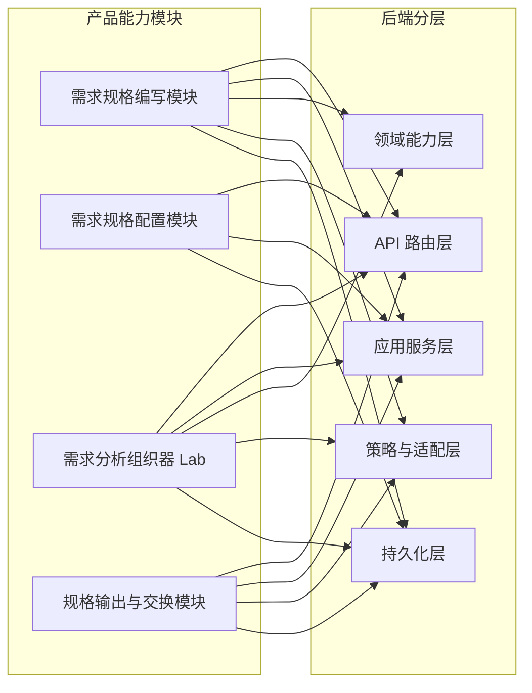
```mermaid
flowchart LR
  subgraph M["产品能力模块"]
    M1["需求规格编写模块"]
    M2["需求规格配置模块"]
    M3["需求分析组织器 Lab"]
    M4["规格输出与交换模块"]
  end

  subgraph L["后端分层"]
    L1["API 路由层"]
    L2["应用服务层"]
    L3["领域能力层"]
    L4["策略与适配层"]
    L5["持久化层"]
  end

  M1 --> L1
  M1 --> L2
  M1 --> L3
  M1 --> L4
  M1 --> L5

  M2 --> L1
  M2 --> L2
  M2 --> L5

  M3 --> L1
  M3 --> L2
  M3 --> L3
  M3 --> L4
  M3 --> L5

  M4 --> L1
  M4 --> L2
  M4 --> L4
  M4 --> L5
```

每个产品能力模块都不是单一代码层。它们通过 API、应用服务、领域能力、适配器和持久化共同实现。后端第 6 章按软件模块展开这些关系。

## 5. 前端软件设计

### 5.1 模块定位、职责与核心概念

前端软件是 `P2` 的交互呈现和用户操作编排层。它不拥有需求规格模板、组织器、模型提供方、知识包、写入策略、字段解释和文档状态等业务默认值；这些对象的权威来源是后端业务模块和配置接口。前端负责把后端下发的业务配置、文档快照、会话快照和契约 schema 转换为可操作、可观察、可校验的用户界面。

#### 5.1.1 技术栈

前端技术栈为：

- React 18
- TypeScript
- Vite
- Ant Design
- Axios API 适配层
- React Router
- Vitest / Testing Library

#### 5.1.2 核心概念定义

| 序号 | 概念 | 实现命名 | 类型 | 定义 |
| --- | --- | --- | --- | --- |
| 1 | 前端运行模块 | `P2 Web Runtime` | 前端模块 | 承载 `P2` 路由、页面编排、配置加载、视图模型转换和领域组件展示的前端运行整体。 |
| 2 | 页面路由对象 | `Route Entry` | 路由入口 | 把 URL 映射到专家工作台、管理台、组织器 Lab 和模拟器等页面，不保存业务上下文。 |
| 3 | 页面编排对象 | `Page Orchestrator` | React 页面 / Hook | 管理加载、选中、提交、错误、脏状态和弹窗开关，调用 API 适配层，不直接持有业务默认值。 |
| 4 | 前端配置对象 | `Frontend Config` | 后端 DTO | 后端下发给页面的默认值、动作、状态标签、字段说明、协议 schema 和页面运行策略。 |
| 5 | 视图模型对象 | `View Model` | 前端派生对象 | 由配置对象、业务 DTO 和页面临时状态组合得到的组件输入对象。 |
| 6 | 领域组件 | `Domain Component` | React 组件 | 渲染工具栏、问答区、表单区、正文区、完成度树、轮次审计和调用日志，不直接访问后端。 |
| 7 | API 适配对象 | `API Adapter` | 前端服务函数 | 封装 HTTP 请求、响应类型和错误边界，不管理页面状态。 |
| 8 | 页面临时状态 | `Local UI State` | React state | 当前 Tab、输入框内容、弹窗开关、列表选择、滚动位置、待发送消息等只影响界面交互的状态。 |
| 9 | 业务权威状态 | `Authoritative Business State` | 后端状态 | 模板、文档、知识绑定、需求分析会话、轮次、组织器、Provider 和冻结包等由后端维护的状态。 |
| 10 | 需求规格说明对象 | `RequirementSpecWorkItem` / `需规对象` | 产品聚合对象 | 代表一份可管理的需求规格说明任务，关联工作文档、分析会话、发布版本和 P3 可接收包。 |

#### 5.1.3 前端配置权威原则

前端配置权威原则如下：

| 配置类别 | 权威来源 | 前端责任 |
| --- | --- | --- |
| 默认课题、默认模板、默认知识包、默认组织器、默认 Provider、默认模型、默认写入策略 | 后端配置接口 | 初始化页面状态并允许用户修改 |
| 组织器列表、Provider 列表、模板列表、知识源列表 | 后端业务接口 | 渲染可选项并处理不可用状态 |
| 文档状态标签、动作集合、布局选项、文档默认名 | 工作台配置接口 | 渲染工具栏、状态 Tag 和默认输入 |
| Provider 日志字段说明、Turn 审计字段 schema | Lab 配置接口 | 渲染调用详情和协议校验结果 |
| 需规对象列表、行内动作、发布状态标签 | 需规对象门面接口 | 渲染 `4.1` 列表、`进入配置`、`发布` 和 `P3 可接收` 标识 |
| CSS 布局、响应式规则、组件结构 | 前端代码 | 保证界面可用、紧凑、可读 |

前端允许保留技术兜底，例如未知状态显示原始枚举值；但不得用前端写死业务默认值创建真实会话或真实文档。

### 5.2 前端分层与装载生命周期

#### 5.2.1 分层结构

```text
页面路由层
  -> 页面编排层
    -> 配置加载与视图模型层
      -> 领域组件层
        -> API 适配层
          -> 类型定义层
```

| 层 | 职责 | 约束 |
| --- | --- | --- |
| 页面路由层 | 绑定 URL 与页面入口 | 不承载业务逻辑和业务默认值 |
| 页面编排层 | 管理页面生命周期、加载、保存、错误、脏状态和弹窗开关 | 不直接拼接后端业务默认对象 |
| 配置加载与视图模型层 | 加载前端配置对象，合并业务 DTO 和页面临时状态，生成组件输入 | 不访问 DOM，不直接提交 HTTP 请求 |
| 领域组件层 | 渲染工作区、表单、文档、消息、树、审计、日志 | 不直接访问后端 |
| API 适配层 | 封装 HTTP 调用和响应类型 | 不处理 UI 状态 |
| 类型定义层 | 提供 DTO、配置对象和视图模型类型 | 不混入运行逻辑 |

#### 5.2.2 装载生命周期

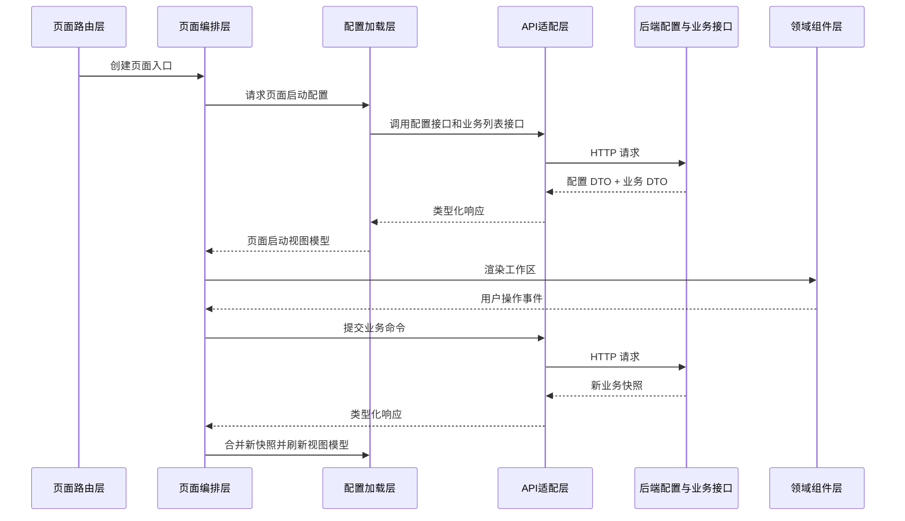
```mermaid
sequenceDiagram
  participant Route as 页面路由层
  participant Page as 页面编排层
  participant Config as 配置加载层
  participant Api as API适配层
  participant Backend as 后端配置与业务接口
  participant View as 领域组件层

  Route->>Page: 创建页面入口
  Page->>Config: 请求页面启动配置
  Config->>Api: 调用配置接口和业务列表接口
  Api->>Backend: HTTP 请求
  Backend-->>Api: 配置 DTO + 业务 DTO
  Api-->>Config: 类型化响应
  Config-->>Page: 页面启动视图模型
  Page->>View: 渲染工作区
  View-->>Page: 用户操作事件
  Page->>Api: 提交业务命令
  Api->>Backend: HTTP 请求
  Backend-->>Api: 新业务快照
  Api-->>Page: 类型化响应
  Page->>Config: 合并新快照并刷新视图模型
```

装载生命周期必须满足：

- 配置对象加载完成前，不允许启动 Lab 会话或新建正式文档。
- 配置加载失败时，页面必须进入明确错误态。
- 默认选择来自配置对象；若配置指定对象不可用，应显示配置不一致提示，并使用后端可用列表中第一个可用对象作为临时选择。
- 页面临时状态不得覆盖后端返回的新文档上下文，尤其不得回退用户刚修改的文档名称、模板和知识绑定。

### 5.3 状态机设计

#### 5.3.1 状态机分层

| 状态机 | 管理对象 | 起点 | 终点 | 说明 |
| --- | --- | --- | --- | --- |
| 前端模块装载状态机 | 页面启动上下文 | 路由进入 | 可交互或错误态 | 控制配置、业务列表和初始视图模型装载 |
| 页面交互状态机 | 页面临时状态 | 用户操作 | 本地状态更新或业务命令提交 | 控制 Tab、弹窗、输入、选择和按钮 loading |
| 专家工作台文档状态机投影 | 文档 DTO + 工作台配置 | 文档列表 / 文档详情返回 | 工具栏动作可用性和正文展示 | 只投影后端文档状态，不自行决定文档状态 |
| Lab 会话状态机投影 | Lab 配置 + 会话 DTO + Turn DTO | 配置加载完成 | 会话展示、Turn 展示或日志展示 | 只投影后端会话和轮次状态，不自行运行组织器 |
| 需规对象状态机投影 | 需规对象 DTO + 工作台 / Lab 配置 | 需规对象列表和详情返回 | 需规列表、进入配置、发布和 P3 可接收标识 | 只投影后端需规对象状态，不自行决定发布结果 |
| 错误与不可用状态机 | 配置和业务接口错误 | 请求失败或配置不一致 | 错误提示、禁止危险动作或恢复 | 防止前端伪造正常业务状态 |

#### 5.3.2 状态机与执行设计对应关系

| 状态机 | 描述重点 | 执行设计章节 | 对应实现对象 |
| --- | --- | --- | --- |
| 前端模块装载状态机 | 页面如何加载配置和业务列表 | 5.4 页面启动与配置加载设计 | `useRequirementAnalysisLabBootstrap`、`useRequirementAuthoringWorkbenchBootstrap` |
| 页面交互状态机 | 用户输入和本地 UI 状态如何更新 | 5.5 页面执行设计 | 页面编排 Hook、领域组件事件 |
| 专家工作台文档状态机投影 | 文档状态如何影响按钮和编辑能力 | 5.6 专家工作台设计 | 工作台视图模型服务 |
| Lab 会话状态机投影 | 会话、轮次、日志如何进入视图 | 5.7 需求分析组织器 Lab 设计 | Lab 视图模型服务 |
| 错误与不可用状态机 | 配置失败和对象不可用如何展示 | 5.9 约束、错误处理与模块边界 | 配置解析与错误视图组件 |

#### 5.3.3 前端模块装载状态机

```text
uninitialized
  -> loading_config
    -> ready
    -> config_error
```

状态说明：

| 状态 | 含义 | 允许动作 |
| --- | --- | --- |
| `uninitialized` | 页面刚进入，尚未发起配置加载 | 发起配置加载 |
| `loading_config` | 正在加载配置和业务列表 | 展示 loading，不允许业务提交 |
| `ready` | 配置和必要业务列表已加载 | 允许用户操作 |
| `config_error` | 配置接口失败或必要对象为空 | 展示错误，禁止启动会话或新建文档 |

#### 5.3.4 页面交互状态机

```text
idle
  -> editing_local_state
    -> submitting_command
      -> idle
      -> command_error
```

页面交互状态只表示前端是否正在处理用户操作，不替代后端业务状态。输入框内容、选中 Tab、打开弹窗和待发送消息属于页面临时状态；文档标题、模板选择、知识绑定、会话 topic、Provider、模型和写入策略属于业务上下文，必须随提交命令进入后端。

#### 5.3.5 错误与不可用状态机

```text
normal
  -> degraded
  -> blocked
```

| 状态 | 触发条件 | 页面策略 |
| --- | --- | --- |
| `normal` | 配置和业务对象可用 | 正常交互 |
| `degraded` | 默认配置与可用列表不一致，但存在可用替代项 | 显示提示，使用可用替代项初始化 |
| `blocked` | 缺少必要配置、组织器、Provider 或模板 | 禁止关键命令，显示错误 |

### 5.4 页面启动与配置加载设计

#### 5.4.1 配置接口

前端依赖两个页面配置接口：

| 接口 | 配置对象 | 使用页面 | 说明 |
| --- | --- | --- | --- |
| `GET /requirement-analysis/lab-config` | 需求分析 Lab 配置 | 需求分析组织器 Lab | 下发 Lab 默认启动参数、写入策略、日志 schema、Turn 审计 schema |
| `GET /requirement-authoring/workbench-config` | 专家工作台配置 | 专家需求规格编写工作台 | 下发默认文档名、布局选项、状态字典、动作集合、文档展示配置 |

这两个接口只承载页面运行配置，不替代模板、文档、知识源、组织器和 Provider 的业务列表接口。

配置接口的后端权威服务为：

| 配置接口 | 后端服务对象 | 职责 |
| --- | --- | --- |
| `GET /requirement-analysis/lab-config` | `RequirementAnalysisLabConfigService` | 生成 Lab 页面默认启动参数、Provider 日志字段说明和 Turn 审计协议配置。 |
| `GET /requirement-authoring/workbench-config` | `RequirementAuthoringWorkbenchConfigService` | 生成专家工作台默认文档名、布局、状态字典、动作集合和文档展示配置。 |

#### 5.4.2 Lab 启动配置

需求分析 Lab 配置对象至少包含：

| 字段 | 含义 | 前端用途 |
| --- | --- | --- |
| `page` | 页面标题、副标题和标识 | 渲染页面头部 |
| `defaults` | 默认课题、组织器、Provider、模型、模板、知识包和写入策略 | 初始化启动参数 |
| `startup_fields` | 启动参数字段定义 | 渲染课题等启动参数控件 |
| `write_policies` | 可选写入策略定义 | 渲染策略标签和说明 |
| `provider_log_schema` | 模型 Provider 调用日志字段说明 | 渲染调用日志详情页注释 |
| `turn_audit_schema` | Turn 审计协议版本和必填字段 | 渲染当前 Turn 审计视图并执行协议校验 |

Lab 默认 Provider 应优先指向真实模型 Provider。当前默认值为 `deepseek`，模型字段使用 `provider-default` 表示由后端按 Provider 配置解析实际模型；若 DeepSeek 未配置 API key，启动会话由后端返回明确错误，不回退为 Mock Provider。

#### 5.4.3 工作台启动配置

专家工作台配置对象至少包含：

| 字段 | 含义 | 前端用途 |
| --- | --- | --- |
| `page` | 页面标题、副标题和标识 | 渲染页面头部 |
| `defaults` | 默认文档名、默认布局、是否允许空知识绑定 | 初始化新建文档和页面选择 |
| `layout_options` | 可选分屏比例 | 渲染分屏控制 |
| `document_statuses` | 文档状态标签和可编辑性 | 渲染状态、按钮可用性和编辑禁用 |
| `actions` | 工具栏动作定义 | 渲染新建、打开、保存、删除、检查和冻结动作 |
| `document_surface` | 标准文档区标题、徽标和 ribbon | 渲染右侧文档工作面 |
| `empty_states` | 空状态文案 | 渲染未创建文档等空态 |

### 5.5 页面执行设计

#### 5.5.1 路由结构

| 路由 | 页面 | 设计口径 |
| --- | --- | --- |
| `/requirement-authoring` | 专家需求规格编写工作台 | 主路径 |
| `/requirement-authoring/admin` | 配置与模板管理台 | 管理路径 |
| `/p2-requirement-analysis-lab` | 需求规格说明管理 + 需求分析组织器 Lab | 需规管理与原理验证组合入口 |
| `/requirements` | 结构化需求规格池 | 冻结规格与结构化对象查看 |
| `/xx-p1-sim` | 上游知识模拟输入台 | `P1` 发布态知识联调模拟 |
| `/xx-p2-sim` | `P2` 轻量规格输出模拟台 | `P2 -> P3` 早期联调模拟 |

#### 5.5.2 页面区块与后端模块映射

| 页面区块 | 读取对象 | 写入对象 | 后端模块 |
| --- | --- | --- | --- |
| 专家工作台顶部工具栏 | 工作台配置、模板列表、知识源、文档列表 | 当前模板、知识绑定、文档状态 | 需求规格编写模块、需求规格配置模块、规格输出与交换模块 |
| 文档名称栏 | 文档详情、工作台配置 | `RequirementAuthoringDocument.title` | 需求规格编写模块 |
| 问答模式 | 对话、语义状态、标准正文、模板问答策略 | `conversation`、`semantic_state`、`document` | 需求规格编写模块 |
| 表单模式 | 模板字段、语义状态 | `semantic_state.fields`、`document` | 需求规格编写模块、需求规格配置模块 |
| 标准正文 | 文档章节、条款批注、检查结果、文档展示配置 | 条款正文 patch | 需求规格编写模块 |
| 需规管理 4.1 列表 | 需规对象列表、当前发布状态、关联文档与会话摘要 | 需规对象创建、进入配置、发布 | 需求规格说明对象门面模块、需求分析会话与运算模块、需求规格编写模块、规格输出与交换模块 |
| 需规管理新建弹窗 | 默认模板、初始说明、领域知识、创建后动作 | 需规对象创建 | 需求规格说明对象门面模块 |
| 需规管理 4.2 组织器配置 | 选中需规对象、组织器列表、Provider 列表、模板实例和写入策略 | 会话创建参数、组织器配置、模板保存请求 | 需求分析会话与运算模块、需求规格说明对象门面模块 |
| 需规管理 4.3 会话管理 | 会话详情、Turn 结果 | 用户输入 | 需求分析会话与运算模块 |
| 需规管理 4.4 当前 Turn | Turn DTO、Turn 审计 schema | 无 | 需求分析会话与运算模块 |
| 需规管理 4.5 调用日志 | Provider 日志、日志 schema | 无 | 需求分析会话与运算模块、模型提供方子模块 |
| Lab 组织器配置 | Lab 配置、组织器列表、Provider 列表、需求规格说明模板列表和模板正文 | 会话创建参数、模板 Markdown 正文保存请求 | 需求分析会话与运算模块、文件模板服务 |
| Lab 会话管理 | 会话详情、Turn 结果 | 用户输入 | 需求分析会话与运算模块 |
| Lab 当前 Turn | Turn DTO、Turn 审计 schema | 无 | 需求分析会话与运算模块 |
| Lab 调用日志 | Provider 日志、日志 schema | 无 | 需求分析会话与运算模块、模型提供方子模块 |

#### 5.5.3 页面命令提交规则

页面命令提交规则：

1. 页面提交业务命令前，必须使用当前业务上下文生成载荷，不得回退为页面初始化默认值。
2. 文档名称、模板选择、领域知识绑定、布局比例属于文档上下文，保存、问答、表单、检查和冻结前必须先同步脏状态。
3. Lab 会话创建必须提交当前页面所选课题、组织器、Provider、模型、模板、知识包和写入策略。
4. Turn 创建只提交用户本轮输入；会话上下文由后端根据 `session_id` 读取。
5. 前端不得直接运行组织器、不得直接拼装模型提示词、不得直接修改完成度树。
6. Lab 模板保存只允许更新当前选中模板的 Markdown 源文件；保存成功后必须以服务端返回正文刷新页面草稿，不能仅做本地乐观替换。
7. 需规管理页签的新建、配置和发布命令必须以需规对象为上下文，不得用当前 Tab 的临时选择替代对象身份。

### 5.6 专家需求规格编写工作台设计

#### 5.6.1 页面职责

专家需求规格编写工作台负责：

- 加载工作台配置、模板、文档列表和知识源。
- 选择文档模板。
- 设置领域知识。
- 新建、打开、保存、删除需求规格草稿。
- 编辑文档名称。
- 通过问答模式追加需求输入。
- 通过表单模式修改结构化字段。
- 展示标准需求规格正文。
- 展示条款批注浮层。
- 执行缺口检查。
- 冻结文档。

专家工作台不负责维护模板定义，不负责执行需求分析组织器，不负责直接生成冻结结构化规格包；这些能力由后端模块提供。

#### 5.6.2 页面结构

```text
RequirementAuthoringPage
  - useRequirementAuthoringWorkbenchBootstrap
  - RequirementAuthoringToolbar
  - DocumentNameBar
  - InputModePanel
    - QuestionModePanel
    - FormModePanel
  - StandardDocumentPane
  - ClauseAnnotationDrawer
  - KnowledgeBindingDialog
  - DocumentOpenDialog
  - DocumentDeleteDialog
```

#### 5.6.3 状态保存规则

保存草稿必须覆盖：

- 文档名称。
- 模板选择。
- 领域知识绑定。
- 分屏比例。
- 语义状态。
- 标准正文。
- 问答对话。
- 表单字段。
- 条款批注。
- 缺口检查结果。

文档名称、模板选择和领域知识绑定属于文档上下文，不属于临时 UI 状态。后续问答、表单或保存动作必须保持这些上下文稳定。

#### 5.6.4 工具栏动作设计

工具栏动作由工作台配置对象下发。前端只根据动作定义和当前文档状态决定渲染和禁用。

| 动作 | 后端命令 | 前端禁用条件 |
| --- | --- | --- |
| 新建文档 | `POST /requirement-authoring/documents` | 无可用模板、配置未加载、正在提交 |
| 打开文档 | `GET /requirement-authoring/documents/{document_id}` | 文档列表为空或正在提交 |
| 保存草稿 | `POST /requirement-authoring/documents/{document_id}/save` | 无当前文档、文档已冻结、正在提交 |
| 删除文档 | `DELETE /requirement-authoring/documents/{document_id}` | 无当前文档或正在提交 |
| 缺口检查 | `POST /requirement-authoring/documents/{document_id}/check` | 无当前文档或正在提交 |
| 冻结版本 | `POST /requirement-authoring/documents/{document_id}/freeze` | 无当前文档、阻断检查未通过或正在提交 |

动作标签、危险样式、主要样式和状态说明来自工作台配置对象。

### 5.7 需求规格说明管理与组织器 Lab 设计

#### 5.7.1 页面职责

需求规格说明管理与组织器 Lab 组合入口负责：

- 展示 `4.1 需求规格说明管理` 列表。
- 支持新建需规、进入配置和发布。
- 把组织器配置、会话、当前 Turn 和调用日志挂到当前需规对象下面。
- 加载 Lab 配置、组织器列表和模型提供方列表。
- 加载需求规格说明模板列表和当前模板 Markdown 正文。
- 选择组织器。
- 选择模型提供方和模型。
- 编辑启动课题、模板、知识包和写入策略。
- 编辑并保存 Lab 使用的需求规格说明模板 Markdown 正文。
- 启动分析会话。
- 展示 CLI 式交互。
- 展示探索与收束阶段的结构化状态承载页。
- 展示会话内临时正文。
- 展示需求规格完成度树和沟通路径。
- 展示本轮轮次审计。
- 展示模型调用日志。
- 展示每次模型调用的输入、原始输出、模型提供方归一化结果和服务端最终输出。

`4.1` 是业务用户入口，`4.2` 到 `4.5` 是当前需规对象下的配置、会话和审计工作区。普通用户先选择或创建需规对象，再进入组织器配置和会话过程。

Lab 不直接写正式需求规格文档。Lab 的探索阶段业务主状态是需求分析结构化状态（`decision_state`），临时正文（`working_document`）和完成度树（`spec_tree`）都是该状态的投影视图：临时正文提供 A4 阅读投影，完成度树提供模板结构投影。若后续把 Lab 验证过的能力接入专家工作台，必须先进入落稿确认阶段，冻结结构化状态快照，再由正式落稿链路生成或修订需求规格正文。

#### 5.7.2 页面结构

```text
RequirementAnalysisLabPage
  - useRequirementAnalysisLabBootstrap
  - RequirementSpecManagementTab
  - RequirementSpecCreateDialog
  - OrchestratorConfigTab
  - RequirementTemplatePanel
  - AnalysisSessionTab
  - SessionSummaryTabs
  - DecisionStateDocumentView
  - WorkingDocumentView
  - SpecCompletionTree
  - TurnPathView
  - CurrentTurnAuditTab
  - ProviderLogTab
  - QuickOptionList
  - TurnDecisionTrace
```

目标态页签顺序如下：

| 序号 | 页签 | 页面职责 |
| --- | --- | --- |
| 4.1 | 需求规格说明管理 | 需规对象列表、新建需规模态窗口、`进入配置`、`发布` 和 `P3 可接收` 状态 |
| 4.2 | 组织器配置 | 当前需规对象下的模板、组织器、Provider、知识绑定、写入策略和会话启动配置 |
| 4.3 | 会话管理 | 当前需规对象下的消息、快捷选项、结构化状态、临时正文、完成度树和沟通路径 |
| 4.4 | 当前 Turn | 当前需规对象下的单轮审计、阶段审计和协议校验 |
| 4.5 | 调用日志 | 当前需规对象下的 Provider / Runner 调用证据 |

`4.1` 不展示右侧“当前需规”详情面板，不承载完整组织器配置，不合并 `4.2`。列表行内动作只保留 `进入配置` 与 `发布` 两类主动作，避免 `打开 / 编辑 / 进入配置` 三个重复语义并存。

#### 5.7.2.1 需求规格说明管理页签

`4.1 需求规格说明管理` 是列表页，负责用户可见的需规对象管理。

页面内容如下：

| 区域 | 设计职责 |
| --- | --- |
| 顶部动作 | `新建需规`，可选搜索、状态筛选、刷新 |
| 列表列 | 需规名称、状态、模板、知识绑定、最近更新、P3 状态和操作 |
| 行内动作 | `进入配置`、`发布` |
| 空状态 | 引导用户新建第一份需求规格说明 |
| 发布态标识 | 对已发布版本显示 `P3 可接收` / `已发布` |

点击 `新建需规` 后弹出模态窗口。首版字段如下：

| 字段 | 必填 | 说明 |
| --- | --- | --- |
| 需规名称 | 是 | 列表主标题，也是默认工作文档标题 |
| 初始说明 | 否 | 用户对业务背景、目标、问题和已有材料的初始描述 |
| 需求规格模板 | 是 | 默认使用当前系统推荐模板，例如 81433 软件级需求规格说明模板实例 |
| 领域知识 | 否 | 可绑定 `P1` 发布态知识，也允许首版为空 |
| 创建后动作 | 是 | 默认 `创建并进入配置`，可选 `仅创建` |

新建窗口只收集最小业务输入，不要求用户理解 Provider、Runner、Turn 和日志等内部概念。创建成功后，系统必须形成一个可在 `4.1` 列表中看见的需规对象；默认动作是进入 `4.2` 组织器配置。

#### 5.7.3 Lab 状态机视角

```text
上一轮系统留下的交互对象
  -> 本轮用户输入
    -> 意图理解
      -> 决策增量生成
        -> 系统应用决策状态增量
          -> 下一步交互规划
            -> 系统渲染结构化状态 A4 页
              -> 同步临时正文投影和完成度树投影
                -> 回写会话状态和轮次审计
```

本轮起点是用户输入。上一轮交互对象只是上下文，不是强制问题。用户可以回答选项，也可以忽略选项重新描述需求。

#### 5.7.3.1 组织器配置页布局

组织器配置页采用左右两栏布局，而不是旧版三栏布局：

- 左栏按上下堆叠方式放置“可替换组织器”和“启动参数”。
- 右栏放置“需求规格说明模板”工作面。

模板工作面管理的是“需求规格说明模板实例”，不是直接覆盖标准基础模板。`81433`、`82259` 等标准模板是基础模板类或基础依据；Lab 启动、编辑和保存使用的是基于基础依据派生出的模板实例。启动参数区的“启动模板实例”用于决定新会话使用哪一个模板实例；右侧模板工作面用于编辑当前选中的模板实例，二者可以指向不同实例，不能隐式互相覆盖。

模板工作面必须同时具备以下能力：

1. 主界面展示当前可选模板实例列表。实例必须携带 `template_id`、`template_code`、`base_template_id`、`base_template_name`、`name`、`description` 和 `status`。
2. 主界面展示并编辑当前模板实例的名称、说明、基础依据和 Markdown 正文。
3. 支持基于基础模板依据新建模板实例。新建动作通过模态窗口完成，模态窗口内展示只读基础模板依据候选，至少能区分 `81433号`、`82259号` 的标准来源、模板编号和状态。
4. 新建模态窗口是临时创建态，不与右侧详情编辑区混用；用户关闭模态窗口后，未提交的实例草稿不得保留到下一次打开。
5. 基础模板依据只作为实例初始化来源，不进入主界面的模板实例列表，也不允许在主界面直接编辑。
6. 新实例的 Markdown 正文初始化自基础模板，但保存后只修改实例文件，不覆盖基础模板文件。
7. 支持保存当前模板实例，保存成功后必须以服务端返回对象刷新页面状态。
8. 支持删除当前模板实例，删除后应回退到仍存在的模板实例；不得删除或改写基础模板依据。
9. 支持将当前自定义模板实例“保存为基础模板”。该动作是受控沉淀动作：读取当前实例正文和元数据，在 `基础模板/` 下生成新的只读基础依据，并写入基础模板 manifest；它不是覆盖原基础模板，也不是把基础模板加入可编辑实例列表。
10. 会话启动时使用启动参数区显式选中的模板实例 id，而不是基础模板 id，也不是配置默认模板 id 的硬回填值。

模板实例的文件存储必须采用 Markdown 正文文件加 manifest 的方式。模板资产统一归属 `DOC/JB_DOC/02-软件工厂产物模板中心/01-需求与设计主链模板/01-需求规格模板/`，并按资产性质拆分为两个子目录：

```text
01-需求规格模板/
  基础模板/
    01-81433-软件级需求规格模板.md
    02-82259-平台级规格模板.md
  自定义模板/
    manifest.json
    xg-template-*.md
```

基础模板目录保存标准基础依据，只读、受控维护，不允许由 Lab 模板工作面直接覆盖、编辑或删除。自定义模板目录保存 Lab 可编辑模板实例，`manifest.json` 负责保存实例元数据，Markdown 文件负责保存实例正文。项目实例与样例目录不保存模板资产，只保存未来由模板生成出来的项目级交付样例。Lab 创建实例时只能从基础模板复制初始正文；保存和删除实例时只能作用于自定义模板目录，不能回写基础模板目录。“保存为基础模板”只能追加生成新的基础依据，不能修改已有基础依据。

模板实例同时是 Lab 会话运行时输入。会话启动时，后端必须根据启动参数区提交的 `template_id` 读取自定义模板实例 manifest 元数据和 Markdown 正文，并解析为模板运行时对象（`TemplateRuntimePayload`）。完成度树、章节配置上下文、临时正文投影和模型阶段上下文都必须从该运行时对象读取模板身份与章节条款结构。系统不得在模板实例不存在、Markdown 正文缺失或无法解析出有效章节条款时静默回退到内置 `81433` / `82259` 结构；这种情况应阻断会话创建并返回错误。

“稳定契约 / 输出协议”不再在组织器配置页占用独立栏位；相关约束改由后端配置对象和调用日志 / 当前 Turn 审计视图承载。

#### 5.7.4 当前轮次审计视图

当前轮次审计视图（`Current Turn`）用于审查组织器为什么这样处理一轮输入。前端根据 `turn_audit_schema` 校验和展示以下对象：

- 上一轮系统交互对象：问题、建议话题、选项或空等待。
- 本轮用户输入。
- 输入关系判断：承接、部分承接、偏离、否定或自由补充。
- 系统理解：抽取出的事实、约束、风险和候选规格节点。
- 写入候选 patch：本轮打算写入哪些正文位置、采用什么片段操作。
- 临时正文应用结果：本轮命中了哪些正文块、生成了哪些修订片段、应用前后正文摘录分别是什么。
- 目标范围回看：本轮命中范围是否已形成可接受表达，还缺哪些方面。
- 全局回看：整体正文还缺哪些结构、边界或约束。
- 闭环判断：本轮是否解决了上一轮交互目标，是否需要继续追问同一目标范围。
- 下一轮交互对象：自由问题、选择题、继续建议或结束建议。
- 决策轨迹：关键判断依据和模型 / 规则来源。

#### 5.7.5 模型调用日志视图

模型调用日志（`ProviderCallLog`）不是普通后台运行日志，而是用于还原模型 Provider 调用链路的可观察性视图。这里的 `Provider` 特指被配置为模型能力提供方的外部模型服务；它不是后端内部服务调用的泛称。

调用日志必须在 Lab 的 `调用日志` 页签内展示，不另开独立页面。一轮 `turn` 可以关联多条调用日志。目标态不再把每个探索 Turn 固定为四次模型调用，而是按会话阶段选择调用链。探索与收束阶段的开放式 Turn 通常展示三条模型调用日志：

1. 意图理解（`intent_understanding`）。
2. 决策增量生成（`decision_state_delta`）。
3. 下一步交互规划（`next_interaction_planning`）。

结构化状态 A4 页、临时正文投影和完成度树投影由系统渲染，不生成 Provider 调用日志。落稿与成稿阶段才会按需出现正式落稿（`draft_generation`）、正文校核（`draft_verification`）、正文修订 / 再生成等调用日志。

每一条模型调用日志至少包含：

- `call_id`：调用编号。
- `turn_id`：关联的需求分析轮次。
- `stage_id`、`stage_type`、`prompt_id`：说明本次调用属于哪个组织器阶段和哪份阶段 Prompt。
- `provider_id`、`model`、`orchestrator_id`、`orchestrator_mode`。
- `user_input`：本轮用户原始输入。
- `normalized_input`：服务端输入归一化证据。
- `provider_request.messages`：实际发给模型提供方的消息数组。
- `provider_request.prompt_bundle.assembled_prompt`：基础契约、阶段任务、当前 turn 上下文、输出格式要求和采用策略渲染后的完整提示词。
- `provider_request.prompt_bundle.context_json`：本阶段模型看到的运行时上下文；探索阶段分别对应 `StageRuntimeContext(intent_understanding)`、`StageRuntimeContext(decision_state_delta)` 或 `StageRuntimeContext(next_interaction_planning)`；成稿阶段对应 `StageRuntimeContext(draft_generation)` 或 `StageRuntimeContext(draft_verification)`。
- `provider_request.prompt_bundle.schema_json`：模型被要求返回的输出格式要求 JSON。该字段名是内部技术路径，页面分组名称使用“输出格式要求”。
- `provider_request.prompt_bundle.adoption_policy_json`：本阶段结果采用、拒绝和阻断规则。
- `provider_request.prompt_bundle.stage_task_definition_json`：本阶段任务定义；探索阶段的 `decision_state_delta` 和 `next_interaction_planning` 必须可追溯；系统渲染类节点不进入 Provider 调用日志。
- `provider_request.prompt_bundle.quality_constraints_json`：本阶段质量约束。
- `provider_response.raw_content`：模型原始文本输出。
- `provider_response.parsed_json`：模型原始文本解析后的 JSON。
- `provider_normalized_output`：模型提供方适配器按契约归一化后的输出。
- `service_output`：轮次引擎完成阶段校验、字段采用、正文应用、回看、下一步规划采用或失败阻断后的结果。

调用详情按“概览、当前 turn 上下文、输出格式要求、请求、原始输出、输出后处理”组织。字段中文说明、使用时机和展示分组来自 `provider_log_schema`，不由前端页面硬编码。

#### 5.7.6 需求规格完成度树

会话摘要 / 过程产物区必须以结构化状态承载页为默认主视图，并通过 Tab 方式切换到临时正文、完成度树和沟通路径。默认结构如下：

```text
会话摘要 / 过程产物
  -> Tab 1：结构化状态（默认主视图）
  -> Tab 2：临时正文
  -> Tab 3：需求规格完成度树
  -> Tab 4：沟通路径
```

结构化状态承载页采用 A4 纸视图，但纸面内容不是正式需求正文，而是当前 `decision_state` 的结构化块。该页至少展示已确认事实、已确认决策、暂定假设、未闭合问题、被否定方向、下一步交互焦点、章节投影和当前会话阶段。

其中临时正文（`working_document`）展示：

- 文档标题。
- A4 连续文档页栈。
- 当前生效的需求规格正文。
- 页边修订标记和正文轻微高亮。
- 每个修订事件对应的轮次来源、命中位置摘要和审计跳转入口。

临时正文主视图不是章节卡片集合，而是与真实需求规格正文同构的连续文档工作面。章节与条款只作为内部锚点和定位索引存在，不再作为界面卡片主容器。

修订展示规则如下：

1. 正文区只显示当前有效文本。
2. 不显示旧文本、删除线或替换前内容。
3. 页边修订标记的主粒度是修订事件，不是修订片段；一次用户输入形成一轮修订事件，即使命中多个正文位置，也默认只显示一个页边修订标记。
4. 一个修订事件可以关联多个修订片段；修订片段是内部追溯与高亮定位单元，不直接作为页边标签的用户可见主对象。
5. 修订事件的页边位置按其全部命中片段中的首次出现位置排序，并尽量贴近首次命中的正文位置。
6. 点击页边修订标记，应同时高亮该修订事件影响的全部正文片段，并可打开对应 `Current Turn` 审计。

完成度树映射到需求规格说明的章节和条款结构。每个节点至少包含：

- 稳定节点编号。
- 章节或条款标题。
- 节点状态：未开始、部分完成、待回看、已关闭。
- 答案摘要。
- 最近影响它的轮次。
- 子节点。

完成度树只承载规格结构和节点状态，不再作为“本轮是否足够”的第一证据。提问顺序、跳转原因和每轮输入输出由轮次审计视图承载；真正决定探索阶段是否推进的是结构化状态是否被更新以及下一步交互规划是否合理。

### 5.8 模块接口设计

#### 5.8.1 外部接口

外部接口是前端页面调用后端的 HTTP API。

| 接口对象 | 输入 | 输出 | 使用页面 |
| --- | --- | --- | --- |
| `GetRequirementAnalysisLabConfigQuery` | 无 | `RequirementAnalysisLabConfig` | 需求分析组织器 Lab |
| `ListRequirementAnalysisOrchestratorsQuery` | 无 | `RequirementAnalysisOrchestratorEnvelope` | 需求分析组织器 Lab |
| `ListRequirementAnalysisProvidersQuery` | 无 | `RequirementAnalysisProviderEnvelope` | 需求分析组织器 Lab |
| `ListRequirementAnalysisTemplateBasesQuery` | 无 | `RequirementAnalysisTemplateEnvelope` | 需求分析组织器 Lab |
| `ListRequirementAnalysisTemplatesQuery` | 无 | `RequirementAnalysisTemplateEnvelope` | 需求分析组织器 Lab |
| `CreateRequirementAnalysisTemplateCommand` | `base_template_id`、`name`、`description` | `RequirementAnalysisTemplateDetail` | 需求分析组织器 Lab |
| `GetRequirementAnalysisTemplateQuery` | 模板实例 `template_id` | `RequirementAnalysisTemplateDetail` | 需求分析组织器 Lab |
| `SaveRequirementAnalysisTemplateCommand` | 模板实例 `template_id`、`name`、`description`、`content` | `RequirementAnalysisTemplateDetail` | 需求分析组织器 Lab |
| `DeleteRequirementAnalysisTemplateCommand` | 模板实例 `template_id` | 删除结果 | 需求分析组织器 Lab |
| `CreateRequirementAnalysisSessionCommand` | Lab 启动参数 | `RequirementAnalysisSession` | 需求分析组织器 Lab |
| `CreateRequirementAnalysisTurnCommand` | `session_id`、`user_input` | `RequirementAnalysisTurnEnvelope` | 需求分析组织器 Lab |
| `GetRequirementAuthoringWorkbenchConfigQuery` | 无 | `RequirementAuthoringWorkbenchConfig` | 专家工作台 |
| `ListRequirementAuthoringTemplatesQuery` | 无 | `RequirementAuthoringTemplate[]` | 专家工作台、管理台 |
| `ListRequirementAuthoringDocumentsQuery` | 无 | `RequirementAuthoringDocumentSummary[]` | 专家工作台 |
| `ListRequirementAuthoringKnowledgeProvidersQuery` | 无 | `RequirementAuthoringKnowledgeProviderEnvelope` | 专家工作台 |
| `CreateRequirementAuthoringDocumentCommand` | 文档标题、模板、知识上下文、布局 | `RequirementAuthoringDocumentDetail` | 专家工作台 |
| `SaveRequirementAuthoringDocumentCommand` | 文档上下文和草稿内容 | `RequirementAuthoringDocumentDetail` | 专家工作台 |

#### 5.8.2 内部接口

内部接口是前端页面、Hook、视图模型服务和领域组件之间的调用边界。

| 接口对象 | 输入 | 输出 | 说明 |
| --- | --- | --- | --- |
| `useRequirementAnalysisLabBootstrap` | 无 | Lab 配置、组织器、Provider、模板列表、加载状态、错误状态 | 装载 Lab 启动上下文 |
| `resolveDefaultRequirementAnalysisOrchestratorId` | 组织器列表、默认组织器 ID | 可用组织器 ID | 按后端配置解析 Lab 默认组织器 |
| `resolveDefaultRequirementAnalysisProviderId` | Provider 列表、默认 Provider ID | 可用 Provider ID | 按后端配置解析 Lab 默认 Provider |
| `resolveRequirementAnalysisWritePolicyLabel` | 写入策略枚举、策略配置 | 显示标签 | 解析 Lab 会话写入策略显示文案 |
| `buildRequirementAnalysisWorkingDocumentViewModel` | 会话 DTO | 临时正文视图模型 | 组装 A4 连续正文、修订片段、页边标记和审计跳转对象 |
| `getRequirementAnalysisProviderLogFieldNote` | 日志 schema、字段路径 | 字段说明 | 解析调用日志字段注释 |
| `validateRequirementAnalysisTurnProtocol` | Turn DTO、Turn 审计 schema | 缺失字段列表 | 校验当前 Turn 是否满足审计协议 |
| `useRequirementAuthoringWorkbenchBootstrap` | 无 | 工作台配置、模板、文档、知识 Provider、加载状态、错误状态 | 装载专家工作台上下文 |
| `formatRequirementAuthoringDocumentStatusWithConfig` | 文档状态、工作台配置 | 状态显示标签 | 根据后端状态字典渲染状态 |
| `isRequirementAuthoringDocumentEditable` | 文档状态、工作台配置 | 是否可编辑 | 根据状态字典控制标题、问答和表单编辑能力 |
| `getRequirementAuthoringWorkbenchAction` | 工作台配置、动作 ID | 动作定义 | 从后端动作集合解析工具栏动作 |
| `getRequirementAuthoringWorkbenchActionLabel` | 工作台配置、动作 ID、技术兜底标签 | 动作显示标签 | 根据后端动作集合渲染按钮文案 |
| `isRequirementAuthoringActionDisabled` | 动作、当前文档、提交状态、模板选择 | 是否禁用 | 根据动作定义和文档状态判断按钮可用性 |

### 5.9 内部功能组成与类划分

#### 5.9.1 子模块划分总览

前端运行模块按“页面入口、配置装载、视图模型、领域组件、API 适配、测试支撑”六类职责划分。

| 子模块 | 主要文件 / 对象 | 职责 | 不负责 |
| --- | --- | --- | --- |
| 页面入口子模块 | `RequirementAuthoringPage`、`RequirementAnalysisLabPage` | 绑定页面生命周期和用户命令 | 保存业务默认值 |
| 配置装载子模块 | `useRequirementAuthoringWorkbenchBootstrap`、`useRequirementAnalysisLabBootstrap` | 加载配置与业务列表，形成启动上下文 | 渲染复杂 UI |
| 视图模型子模块 | `requirementAuthoringWorkbenchViewModel.ts`、`requirementAnalysisLabViewModel.ts` | 合并配置、DTO 和本地状态，解析可编辑性、默认选择、状态标签和审计字段 | 调用 HTTP |
| 领域组件子模块 | 工具栏、文档区、问答区、日志区、Turn 审计区 | 展示和抛出用户事件 | 访问后端 |
| API 适配子模块 | `requirementAuthoring.ts`、`requirementAnalysis.ts`、`api.ts` | 封装 HTTP 契约和类型 | 管理页面状态 |
| 测试支撑子模块 | Testing Library 测试和 mock 数据 | 验证配置驱动行为 | 依赖真实后端 |

#### 5.9.2 内部调用链

```text
Route
  -> Page
    -> Bootstrap Hook
      -> API Adapter
        -> Backend API
    -> View Model Builder
      -> Domain Components
        -> Page Event Handlers
          -> API Adapter
```

调用链约束：

- 领域组件只能通过 props 接收视图模型和回调。
- 业务默认值只能从配置 DTO 进入视图模型。
- 页面事件处理可以更新本地 UI 状态，也可以提交后端命令，但不能修改后端权威状态的本地副本后跳过保存。

#### 5.9.3 页面入口子模块

| 对象 | 类型 | 职责 | 不负责 |
| --- | --- | --- | --- |
| `RequirementAuthoringPage` | 页面入口 | 组织专家工作台加载、选择、保存、问答、表单、检查和冻结命令 | 定义模板、状态字典、默认文档名 |
| `RequirementAnalysisLabPage` | 页面入口 | 组织 Lab 配置、会话、Turn、日志和 Tab 切换 | 定义默认课题、默认组织器、日志字段说明 |

主要接口：

| 对象 | 方法 / 事件 | 输入 | 输出 |
| --- | --- | --- | --- |
| `RequirementAuthoringPage` | `handleCreateDocument` | 当前工作台视图模型和用户选择 | 新文档详情 |
| `RequirementAuthoringPage` | `handleSaveDraft` | 当前文档上下文 | 保存后的文档详情 |
| `RequirementAnalysisLabPage` | `handleStart` | 当前 Lab 启动参数 | 新会话详情 |
| `RequirementAnalysisLabPage` | `submitUserInput` | 用户输入 | Turn 执行结果 |

#### 5.9.4 配置装载子模块

| 对象 | 类型 | 职责 | 不负责 |
| --- | --- | --- | --- |
| `useRequirementAuthoringWorkbenchBootstrap` | React Hook | 并发加载工作台配置、模板、文档和知识 Provider，输出启动状态 | 渲染工具栏 |
| `useRequirementAnalysisLabBootstrap` | React Hook | 并发加载 Lab 配置、组织器和 Provider，输出启动状态 | 创建会话 |

主要接口：

| 对象 | 方法 / 输出 | 输入 | 输出 |
| --- | --- | --- | --- |
| `useRequirementAuthoringWorkbenchBootstrap` | hook 返回值 | 无 | `config`、`templates`、`documents`、`knowledgeProviders`、`loading`、`error` |
| `useRequirementAnalysisLabBootstrap` | hook 返回值 | 无 | `config`、`orchestratorsEnvelope`、`providers`、`templates`、`loading`、`error` |

#### 5.9.5 视图模型子模块

| 对象 | 类型 | 职责 | 不负责 |
| --- | --- | --- | --- |
| `resolveDefaultRequirementAnalysisOrchestratorId` | 纯函数 | 根据 Lab 配置和可用组织器列表解析默认组织器 | 修改组织器列表 |
| `resolveDefaultRequirementAnalysisProviderId` | 纯函数 | 根据 Lab 配置和可用 Provider 列表解析默认 Provider | 修改 Provider 列表 |
| `resolveRequirementAnalysisWritePolicyLabel` | 纯函数 | 根据 Lab 写入策略配置解析策略显示标签 | 决定写入策略 |
| `getRequirementAnalysisProviderLogFieldNote` | 纯函数 | 根据日志字段路径返回字段说明 | 解释模型内容质量 |
| `validateRequirementAnalysisTurnProtocol` | 纯函数 | 根据后端 schema 校验 Turn 审计字段 | 判断业务是否正确 |
| `formatRequirementAuthoringDocumentStatusWithConfig` | 纯函数 | 根据工作台状态字典渲染文档状态 | 改变文档状态 |
| `isRequirementAuthoringDocumentEditable` | 纯函数 | 根据工作台状态字典判断文档是否可编辑 | 解冻文档 |
| `getRequirementAuthoringWorkbenchAction` | 纯函数 | 从工作台动作集合解析动作定义 | 执行动作 |
| `getRequirementAuthoringWorkbenchActionLabel` | 纯函数 | 从工作台动作集合解析按钮文案 | 执行动作 |
| `isRequirementAuthoringActionDisabled` | 纯函数 | 根据动作定义、当前文档和提交状态判断动作禁用 | 提交 HTTP 请求 |

主要接口：

| 对象 | 方法 | 输入 | 输出 |
| --- | --- | --- | --- |
| `requirementAnalysisLabViewModel.ts` | `resolveDefaultRequirementAnalysisOrchestratorId` | `RequirementAnalysisOrchestrator[]`、默认 ID | 组织器 ID |
| `requirementAnalysisLabViewModel.ts` | `resolveDefaultRequirementAnalysisProviderId` | `RequirementAnalysisProvider[]`、默认 ID | Provider ID |
| `requirementAnalysisLabViewModel.ts` | `resolveRequirementAnalysisWritePolicyLabel` | 策略 ID、`write_policies` | 策略标签 |
| `requirementAnalysisLabViewModel.ts` | `validateRequirementAnalysisTurnProtocol` | `RequirementAnalysisTurn`、必填字段列表 | `string[]` |
| `requirementAnalysisLabViewModel.ts` | `getRequirementAnalysisProviderLogFieldNote` | `RequirementAnalysisFieldSchema`、字段路径 | 字段说明或空值 |
| `requirementAuthoringWorkbenchViewModel.ts` | `formatRequirementAuthoringDocumentStatusWithConfig` | 状态、工作台配置 | 状态标签 |
| `requirementAuthoringWorkbenchViewModel.ts` | `isRequirementAuthoringDocumentEditable` | 状态、工作台配置 | `boolean` |
| `requirementAuthoringWorkbenchViewModel.ts` | `getRequirementAuthoringWorkbenchActionLabel` | 工作台配置、动作 ID、兜底标签 | 动作标签 |

#### 5.9.6 领域组件子模块

| 组件 | 输入 | 输出事件 | 说明 |
| --- | --- | --- | --- |
| `KnowledgeBindingPanel` | 知识源、领域列表、当前绑定 | Provider 切换、领域切换 | 渲染领域知识设置弹窗 |
| `DocumentOpenList` | 文档列表、模板列表、工作台配置 | 打开文档 | 渲染草稿 / 文档列表，并按配置显示状态 |
| `QuestionMode` | 当前文档、快捷输入、输入框状态 | 问答发送、快捷输入发送 | 渲染问答模式 |
| `FormMode` | 模板字段、语义字段、编辑状态 | 字段修改 | 渲染表单模式 |
| `StandardDocumentView` | 文档正文、批注打开事件 | 打开批注 | 渲染右侧 Word 感正文 |
| `SpecManagementTab` | 需规对象列表、状态、模板、知识绑定和操作 | 进入配置、发布、新建 | 渲染 `4.1` 需求规格说明管理 |
| `SpecCreateDialog` | 默认模板、初始说明、领域知识和创建后动作 | 创建需规对象 | 渲染新建需规模态窗口 |
| `ConfigTab` | Lab 配置、组织器、Provider、模板实例列表、当前模板实例正文、模板实例新建模态状态、启动状态 | 组织器选择、Provider 选择、基础模板选择、模板实例选择、模板实例新建、模板实例正文修改、模板实例保存、模板实例删除、启动参数修改、启动验证 | 渲染 Lab 配置页 |
| `SessionTab` | 会话、当前 Turn、写入策略配置、输入状态 | 用户输入、快捷选项选择 | 渲染 CLI 式问答区和摘要 |
| `SessionSummaryTabs` | 会话临时正文、完成度树、沟通路径 | Tab 切换 | 渲染“会话摘要 / 过程产物”三视图 |
| `WorkingDocumentView` | 临时正文、修订标记、审计入口 | 无 | 渲染会话内 A4 连续正文主视图 |
| `TurnTab` | 当前 Turn、Turn 审计 schema | 重置会话 | 渲染当前 Turn 审计 |
| `LogTab` | 模型 Provider 调用日志、日志 schema | 选择调用日志 | 渲染模型调用日志和详情 |
| `SpecCompletionTree` | 会话完成度树 | 无 | 渲染需求规格完成度树 |

#### 5.9.7 API 适配子模块

| 文件 | 主要函数 | 职责 |
| --- | --- | --- |
| `apps/web/src/lib/requirementAnalysis.ts` | `getRequirementAnalysisLabConfig`、`getRequirementAnalysisOrchestrators`、`getRequirementAnalysisProviders`、`getRequirementAnalysisTemplates`、`getRequirementAnalysisTemplate`、`saveRequirementAnalysisTemplate`、`createRequirementAnalysisSession`、`createRequirementAnalysisTurn` | 封装 Lab 和需求分析会话 API |
| `apps/web/src/lib/requirementSpecWorkItems.ts` | `getRequirementSpecWorkItems`、`createRequirementSpecWorkItem`、`updateRequirementSpecWorkItem`、`configureRequirementSpecWorkItem`、`publishRequirementSpecWorkItem` | 封装需规对象门面 API |
| `apps/web/src/lib/requirementAuthoring.ts` | `getRequirementAuthoringWorkbenchConfig`、`getRequirementAuthoringTemplates`、`getRequirementAuthoringDocuments`、`saveRequirementAuthoringDocument` 等 | 封装专家工作台 API |
| `apps/web/src/lib/api.ts` | 类型定义 | 定义后端 DTO、配置 DTO 和视图模型输入类型 |

### 5.10 约束、错误处理与模块边界

#### 5.10.1 模块不变量

| 不变量 | 约束 | 防止的问题 |
| --- | --- | --- |
| 前端不拥有业务默认值 | 默认课题、模板、知识包、组织器、Provider、模型、写入策略来自后端配置 | 页面代码固化演示数据 |
| 前端不拥有业务契约解释 | 日志字段说明和 Turn 审计字段来自后端 schema | 前后端字段解释不一致 |
| 前端不执行组织器 | Turn 执行只通过后端会话接口 | 绕过会话状态机 |
| 前端不修改完成度树 | 完成度树只展示后端会话快照 | 前端状态污染分析结果 |
| 页面临时状态不替代保存 | 文档标题、模板、知识绑定必须进入保存接口 | 后续问答覆盖未保存上下文 |
| 配置失败不可伪装正常 | 必要配置缺失时禁止关键命令 | 使用前端兜底值创建错误会话或文档 |

#### 5.10.2 错误处理

| 错误 | 页面响应 |
| --- | --- |
| Lab 配置加载失败 | 显示配置错误，禁止启动验证 |
| 组织器列表为空 | 显示无可用组织器，禁止启动验证 |
| Provider 列表为空 | 显示无可用 Provider，禁止启动验证 |
| 默认组织器不存在 | 显示配置不一致提示，选择第一个可用组织器 |
| 默认 Provider 未配置 | 显示未配置状态，允许选择其他可用 Provider |
| 工作台配置加载失败 | 显示配置错误，禁止新建文档 |
| 模板列表为空 | 显示无可用模板，禁止新建文档 |
| 保存、问答、表单、检查、冻结失败 | 保留当前页面输入和选中状态，显示错误 |

#### 5.10.3 与后端模块边界

| 后端模块 | 前端读取 | 前端写入 | 边界约束 |
| --- | --- | --- | --- |
| 需求规格编写模块 | 文档列表、文档详情、保存结果、检查结果、冻结结果 | 文档命令、问答输入、表单 patch、条款 patch | 前端不能直接改数据库状态 |
| 需求规格配置模块 | 模板、表单、字段映射、问答策略、缺口规则 | 模板管理台命令 | 专家工作台只消费模板，不修改模板 |
| 需求规格说明对象门面模块 | 需规对象列表、状态、发布结果、关联摘要 | 需规对象创建、进入配置、发布、修订 | 前端不能直接伪造发布态或跳过冻结 |
| 需求分析会话与运算模块 | Lab 配置、会话、Turn、日志、组织器、Provider | 会话创建、Turn 输入 | 前端不能直接运行组织器或调用模型 |
| 规格输出与交换模块 | 知识源、知识绑定、冻结规格投影 | 知识绑定选择 | 前端不能读取 P1 非发布态知识 |

## 6. 后端软件设计

### 6.1 后端技术栈

后端技术栈为：

- Python 3.12
- FastAPI
- SQLAlchemy
- Pydantic
- PostgreSQL
- JSON 字段承载配置对象、草稿状态和过程状态
- OpenAI 风格接口模型提供方
- Pytest

### 6.2 后端分层原则

后端采用五层结构。

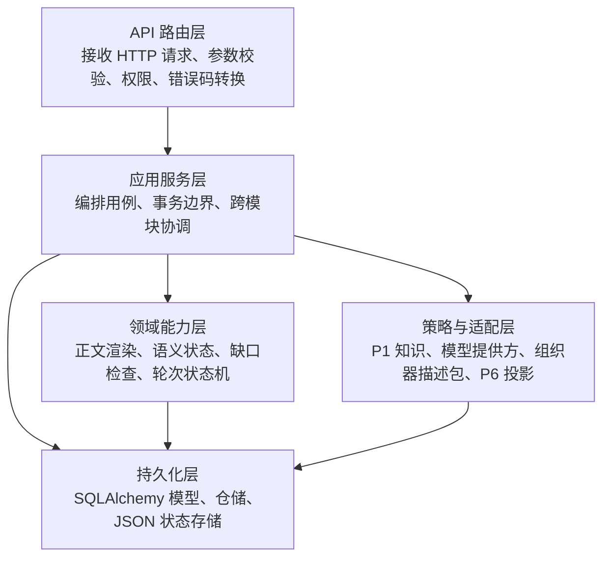
```mermaid
flowchart TB
  L1["API 路由层<br/>接收 HTTP 请求、参数校验、权限、错误码转换"]
  L2["应用服务层<br/>编排用例、事务边界、跨模块协调"]
  L3["领域能力层<br/>正文渲染、语义状态、缺口检查、轮次状态机"]
  L4["策略与适配层<br/>P1 知识、模型提供方、组织器描述包、P6 投影"]
  L5["持久化层<br/>SQLAlchemy 模型、仓储、JSON 状态存储"]

  L1 --> L2
  L2 --> L3
  L2 --> L4
  L2 --> L5
  L3 --> L5
  L4 --> L5
```

各层职责：

| 层 | 职责 | 约束 |
| --- | --- | --- |
| API 路由层 | 接收参数、绑定认证、转换错误码、返回 DTO | 不写业务状态机 |
| 应用服务层 | 编排用例、控制事务、协调多个领域服务 | 不承载细粒度规则 |
| 领域能力层 | 实现需求语义、正文渲染、缺口检查、轮次执行、冻结规则 | 不直接处理 HTTP |
| 策略与适配层 | 接入 `P1`、模型提供方、组织器描述包和展示投影 | 不拥有 `P2` 权威状态 |
| 持久化层 | 保存模板、文档、会话、冻结包和规格对象 | 不做业务决策 |

### 6.3 后端模块总览

后端按四个核心业务模块和一个门面编排模块组织，每个模块跨越上述五层。门面编排模块不替代核心模块的权威状态，只负责把需规对象、工作文档、分析会话和发布包组合成面向用户的用例。

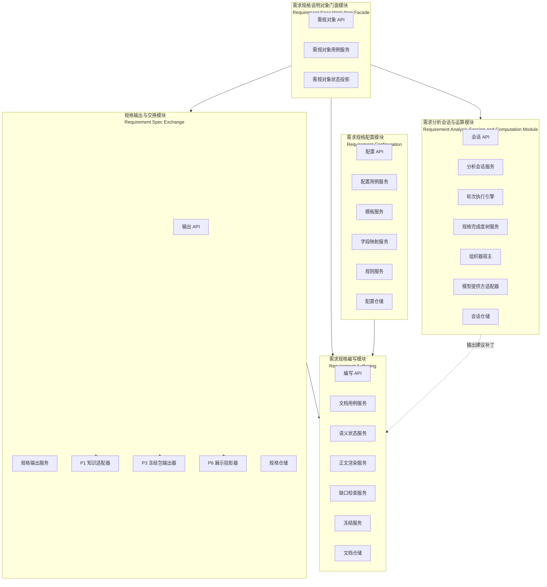
```mermaid
flowchart TB
  subgraph Authoring["需求规格编写模块<br/>Requirement Authoring"]
    AApi["编写 API"]
    AApp["文档用例服务"]
    ASem["语义状态服务"]
    ARender["正文渲染服务"]
    AGap["缺口检查服务"]
    AFreeze["冻结服务"]
    ARepo["文档仓储"]
  end

  subgraph SpecItem["需求规格说明对象门面模块<br/>Requirement Spec Work Item Facade"]
    SApi["需规对象 API"]
    SApp["需规对象用例服务"]
    SState["需规对象状态投影"]
  end

  subgraph Config["需求规格配置模块<br/>Requirement Configuration"]
    CApi["配置 API"]
    CApp["配置用例服务"]
    CTemplate["模板服务"]
    CMapping["字段映射服务"]
    CRule["规则服务"]
    CRepo["配置仓储"]
  end

  subgraph Analysis["需求分析会话与运算模块<br/>Requirement Analysis Session and Computation Module"]
    BApi["会话 API"]
    BApp["分析会话服务"]
    BTurn["轮次执行引擎"]
    BTree["规格完成度树服务"]
    BHost["组织器宿主"]
    BProvider["模型提供方适配器"]
    BRepo["会话仓储"]
  end

  subgraph Exchange["规格输出与交换模块<br/>Requirement Spec Exchange"]
    EApi["输出 API"]
    EApp["规格输出服务"]
    EP1["P1 知识适配器"]
    EP3["P3 冻结包输出器"]
    EP6["P6 展示投影器"]
    ERepo["规格仓储"]
  end

  SpecItem --> Authoring
  SpecItem --> Analysis
  SpecItem --> Exchange
  Config --> Authoring
  Exchange --> Authoring
  Analysis -. "输出建议补丁" .-> Authoring
  Exchange --> EP1
  Exchange --> EP3
  Exchange --> EP6
```

模块与层级关系：

| 后端模块 | API 路由层 | 应用服务层 | 领域能力层 | 策略与适配层 | 持久化层 |
| --- | --- | --- | --- | --- | --- |
| 需求规格编写模块 | 编写 API | 文档用例服务 | 语义状态、正文渲染、批注、缺口、冻结 | 领域知识读取 | 文档仓储 |
| 需求规格配置模块 | 配置 API | 配置用例服务 | 模板校验、映射校验、规则校验 | 无外部依赖或少量校验适配 | 模板仓储 |
| 需求分析会话与运算模块 | 会话 API | 分析会话服务 | 轮次引擎、完成度树、过程产物 | 组织器宿主、模型提供方 | 会话仓储 |
| 规格输出与交换模块 | 输出 API | 输出用例服务 | 冻结包投影、规格包序列化 | `P1`、`P3`、`P6` 适配器 | 规格仓储 |
| 需求规格说明对象门面模块 | 需规对象 API | 需规对象用例服务 | 需规对象状态投影、发布编排 | 复用核心模块接口 | 可选轻量关联仓储 / 门面 DTO |

#### 6.3.1 模块权威状态矩阵

权威状态指“哪个模块有权修改哪类核心事实”。这个矩阵是后端边界的第一约束。

| 后端模块 | 权威对象 | 可写状态 | 只读输入 | 禁止直接写入的对象 |
| --- | --- | --- | --- | --- |
| 需求规格编写模块 | `RequirementAuthoringDocument` | 文档标题、语义状态、正文、对话、批注、检查结果、冻结包、文档状态 | 模板、知识绑定、分析建议补丁 | 模板版本、需求分析会话、结构化规格主记录 |
| 需求规格配置模块 | `RequirementAuthoringTemplate` | 章节结构、表单结构、字段映射、问答策略、缺口规则、模板启停状态 | 无或少量外部校验依赖 | 需求规格文档、需求分析会话、冻结规格 |
| 需求分析会话与运算模块 | 需求分析会话（`RequirementAnalysisSession`） | 会话消息、轮次、完成度树、过程产物、下一轮交互对象、模型调用日志 | 模板、知识包、用户输入 | 需求规格文档正文、冻结包、模板版本 |
| 规格输出与交换模块 | `RequirementSpec` 与导出视图 | 结构化规格记录、对外投影视图、导出包 | 冻结文档、发布态知识、展示请求 | 草稿态需求规格文档、需求分析会话 |
| 需求规格说明对象门面模块 | 需求规格说明对象投影 | 标题、初始说明、对象状态、关联文档 / 会话 / 发布包引用、发布状态 | 文档、会话、冻结包、结构化规格 | 模板正文、正式文档正文、Provider 日志明细 |

#### 6.3.2 模块间调用规则

后端模块之间允许的调用关系如下：

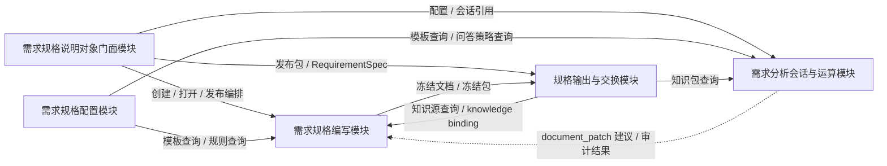
```mermaid
flowchart LR
  Config["需求规格配置模块"]
  SpecItem["需求规格说明对象门面模块"]
  Authoring["需求规格编写模块"]
  Analysis["需求分析会话与运算模块"]
  Exchange["规格输出与交换模块"]

  SpecItem -->|"创建 / 打开 / 发布编排"| Authoring
  SpecItem -->|"配置 / 会话引用"| Analysis
  SpecItem -->|"发布包 / RequirementSpec"| Exchange
  Config -->|"模板查询 / 规则查询"| Authoring
  Config -->|"模板查询 / 问答策略查询"| Analysis
  Exchange -->|"知识源查询 / knowledge binding"| Authoring
  Exchange -->|"知识包查询"| Analysis
  Analysis -. "document_patch 建议 / 审计结果" .-> Authoring
  Authoring -->|"冻结文档 / 冻结包"| Exchange
```

调用约束：

- 编写模块可以读取模板和知识绑定，但不能修改模板定义。
- 分析模块可以读取模板和知识包，但不能直接写文档正文。
- 交换模块只能消费冻结态文档，不读取草稿态文档作为正式输出。
- 配置模块不依赖文档模块和会话模块的运行状态。
- 需规对象门面模块只能编排和投影，不拥有模板、正文、会话过程和结构化规格的细节权威。

### 6.4 需求规格编写模块

#### 6.4.1 模块定位、职责与核心概念

需求规格编写模块是专家工作台的正式文档工作模块。它负责把专家在问答页签、表单页签和正文编辑区产生的输入，归并到同一份需求规格草稿，并持续渲染为标准需求规格说明正文。

该模块的权威对象是需求规格编写文档（`RequirementAuthoringDocument`）。它可以保存草稿、打开草稿、删除草稿、执行缺口检查和冻结文档；但它不拥有模板定义权，不直接执行需求分析组织器，也不把实验态会话结果直接写入正式文档。

核心概念按父子层级定义如下。

| 序号 | 中文概念 | 英文实现名 | 层级关系 | 定义 |
| --- | --- | --- | --- | --- |
| 1 | 需求规格编写模块 | `requirement_authoring` | `P2` 后端业务模块 | 支撑专家工作台正式文档编写的业务模块。它管理文档生命周期、输入归并、正文渲染、批注、缺口检查和冻结，不管理模板版本和组织器策略。 |
| 2 | 需求规格编写文档 | `RequirementAuthoringDocument` | 模块管理的文档聚合对象 | 一份标准需求规格说明的草稿或冻结对象。它绑定一个模板版本，可以绑定领域知识，保存标题、正文、语义状态、对话历史、表单值、批注、缺口检查结果和冻结包。 |
| 3 | 文档语义状态 | `semantic_state` | 文档内部状态对象 | 问答输入、表单输入和正文 patch 归并后的结构化需求语义。正文渲染、缺口检查和批注都从该状态读取信息。 |
| 4 | 标准正文 | `standard_body` | 文档投影对象 | 按模板章节、条款和语义状态渲染出的标准需求规格说明正文。它面向专家阅读和导出，不是唯一的内部状态来源。 |
| 5 | 正文补丁 | `document_patch` | 文档编辑增量 | 对条款正文、章节内容或分析模块建议的增量修改。补丁必须引用稳定条款 id，不能绕过文档语义状态造成正文孤岛。 |
| 6 | 条款批注 | `annotations` | 文档辅助投影 | 面向正文条款的说明、知识引用、待确认提示和缺口提示。批注不改变正文权威内容。 |
| 7 | 缺口检查结果 | `gap_check_result` | 文档质量状态 | 根据模板规则、必填字段、正文和语义状态生成的检查结果。阻断型缺口未关闭时不能冻结。 |
| 8 | 冻结需求规格包 | `FrozenRequirementPackage` | 文档冻结输出 | 从同一冻结快照生成的标准正文、结构化语义、模板版本、知识绑定、检查结果和追溯信息。它是进入输出与交换模块的正式输入。 |

静态归属和调用关系如下。

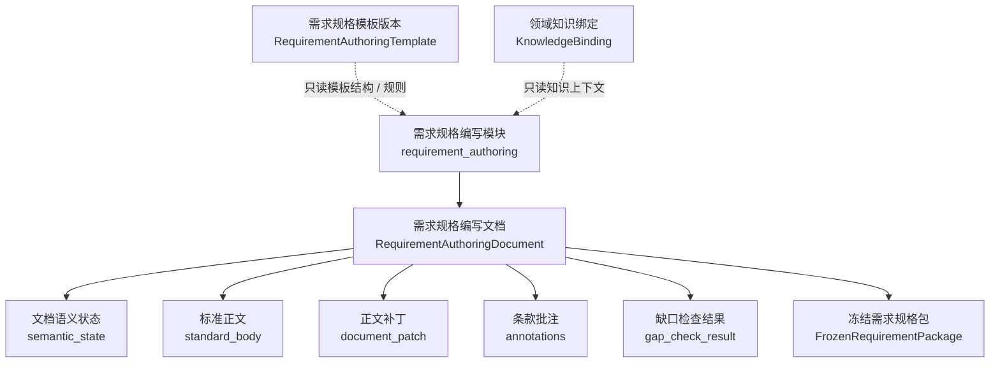
```mermaid
flowchart TB
  Module["需求规格编写模块<br/>requirement_authoring"]
  Document["需求规格编写文档<br/>RequirementAuthoringDocument"]
  Semantic["文档语义状态<br/>semantic_state"]
  Body["标准正文<br/>standard_body"]
  Patch["正文补丁<br/>document_patch"]
  Annotation["条款批注<br/>annotations"]
  Gap["缺口检查结果<br/>gap_check_result"]
  Frozen["冻结需求规格包<br/>FrozenRequirementPackage"]
  Template["需求规格模板版本<br/>RequirementAuthoringTemplate"]
  Knowledge["领域知识绑定<br/>KnowledgeBinding"]

  Module --> Document
  Document --> Semantic
  Document --> Body
  Document --> Patch
  Document --> Annotation
  Document --> Gap
  Document --> Frozen
  Template -. "只读模板结构 / 规则" .-> Module
  Knowledge -. "只读知识上下文" .-> Module
```

##### 6.4.1.1 运行装载生命周期

需求规格编写模块的运行生命周期围绕文档对象展开。模板和知识绑定是文档创建与渲染的上下文，不是该模块的权威状态。

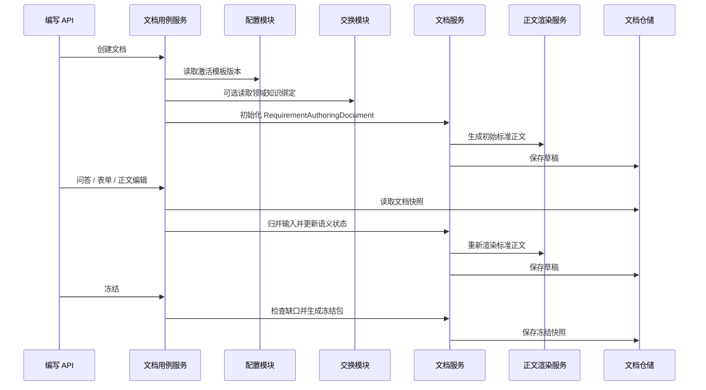
```mermaid
sequenceDiagram
  participant API as 编写 API
  participant App as 文档用例服务
  participant Template as 配置模块
  participant Exchange as 交换模块
  participant Doc as 文档服务
  participant Render as 正文渲染服务
  participant Repo as 文档仓储

  API->>App: 创建文档
  App->>Template: 读取激活模板版本
  App->>Exchange: 可选读取领域知识绑定
  App->>Doc: 初始化 RequirementAuthoringDocument
  Doc->>Render: 生成初始标准正文
  Doc->>Repo: 保存草稿
  API->>App: 问答 / 表单 / 正文编辑
  App->>Repo: 读取文档快照
  App->>Doc: 归并输入并更新语义状态
  Doc->>Render: 重新渲染标准正文
  Doc->>Repo: 保存草稿
  API->>App: 冻结
  App->>Doc: 检查缺口并生成冻结包
  Doc->>Repo: 保存冻结快照
```

生命周期约束如下：

| 时点 | 主要动作 | 说明 |
| --- | --- | --- |
| 创建前 | 读取模板版本和可选知识绑定 | 未选择领域知识时可以创建空知识上下文文档 |
| 创建文档 | 初始化标题、模板版本、语义状态、正文和布局偏好 | 文档绑定的模板版本在创建后保持稳定 |
| 编辑文档 | 归并问答、表单、正文 patch | 三路输入必须写入同一语义状态和同一文档快照 |
| 保存草稿 | 保存标题、模板绑定、知识绑定、正文、语义状态、对话和检查结果 | 保存必须是完整草稿保存，不允许只保存右侧正文 |
| 缺口检查 | 根据模板规则、语义状态和正文生成检查结果 | 检查结果属于文档质量状态 |
| 冻结 | 生成冻结包并把文档置为冻结态 | 冻结后普通编辑接口必须拒绝修改 |

##### 6.4.1.2 职责与责任划分

需求规格编写模块负责：

- 创建、打开、保存、删除需求规格草稿。
- 保存文档标题、模板版本、领域知识绑定、布局偏好和当前编辑状态。
- 将问答输入、表单字段变更和正文编辑归并到同一文档语义状态。
- 根据模板和语义状态渲染标准正文。
- 生成条款批注、知识引用提示和待确认提示。
- 执行缺口检查，区分阻断型缺口和提示型缺口。
- 冻结文档，生成可交给规格输出与交换模块的冻结包。

它不负责：

- 创建或修改模板章节、字段和规则。
- 调用模型提供方或执行需求分析组织器策略。
- 保存需求分析会话的轮次、完成度树或模型调用日志。
- 把未冻结草稿作为正式 `RequirementSpec` 输出。

责任划分如下：

| 子能力 | 主要对象 | 责任 |
| --- | --- | --- |
| 文档生命周期 | `RequirementAuthoringDocument`、`DocumentService` | 创建、打开、保存、删除、冻结文档 |
| 输入归并 | `SemanticStateService`、`DocumentPatchService` | 把问答、表单、正文 patch 归并到文档语义状态 |
| 正文渲染 | `DocumentRenderer` | 根据模板和语义状态生成标准正文 |
| 批注与缺口 | `AnnotationService`、`GapChecker` | 生成条款批注和缺口检查结果 |
| 冻结输出 | `FreezeService` | 生成冻结包和冻结快照 |
| 持久化 | `DocumentRepository` | 保存文档聚合对象和冻结包 |

#### 6.4.2 状态机设计

需求规格编写模块的状态机必须同时描述模块请求、文档生命周期和单次编辑保存过程。文档状态是长期状态；单次编辑保存状态是一次命令内部的短生命周期。

##### 6.4.2.1 状态机分层

| 层级 | 管理对象 | 起点 | 终点 | 责任 |
| --- | --- | --- | --- | --- |
| 模块级状态机 | 编写 API 请求 | 接收创建、保存、编辑、检查、冻结请求 | 返回文档详情或错误 | 校验请求、控制事务、路由到文档服务 |
| 文档状态机 | `RequirementAuthoringDocument` | 创建草稿 | 删除、冻结或归档 | 保存文档长期状态和可编辑性 |
| 编辑保存状态机 | 单次输入归并命令 | 收到问答、表单或正文 patch | 草稿保存完成或失败 | 归并语义状态、渲染正文、生成批注和检查摘要 |
| 冻结状态机 | 单次冻结命令 | 用户触发冻结 | 冻结包保存或失败 | 校验阻断缺口、生成冻结快照 |

##### 6.4.2.2 状态机与执行设计对应关系

| 状态机层级 | 本节定义内容 | 后续执行设计章节 | 执行设计展开内容 |
| --- | --- | --- | --- |
| 模块级状态机 | API 请求如何进入事务和错误映射 | 6.4.3 模块运行编排设计 | 创建、保存、检查、冻结命令如何调度服务 |
| 文档状态机 | 文档长期状态及合法转移 | 6.4.4 文档对象与生命周期设计 | 文档字段、快照、冻结包和保存策略 |
| 编辑保存状态机 | 一次输入如何归并并保存 | 6.4.5 输入归并与正文渲染设计 | 问答、表单、正文 patch 如何更新同一语义状态 |
| 冻结状态机 | 冻结命令如何校验和生成输出 | 6.4.5、6.4.6 | 缺口检查、冻结包接口和交换边界 |

##### 6.4.2.3 模块级状态机

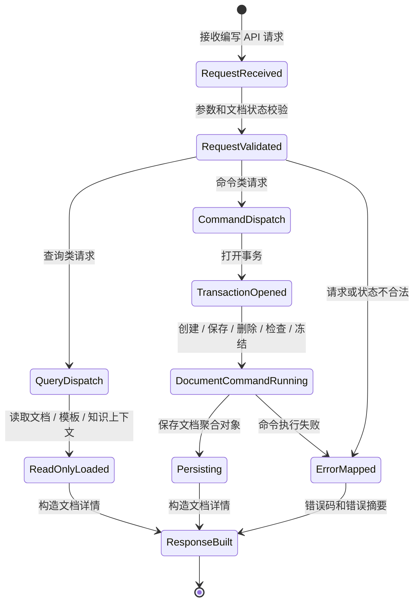
```mermaid
stateDiagram-v2
  [*] --> RequestReceived: 接收编写 API 请求
  RequestReceived --> RequestValidated: 参数和文档状态校验
  RequestValidated --> QueryDispatch: 查询类请求
  RequestValidated --> CommandDispatch: 命令类请求
  QueryDispatch --> ReadOnlyLoaded: 读取文档 / 模板 / 知识上下文
  ReadOnlyLoaded --> ResponseBuilt: 构造文档详情
  CommandDispatch --> TransactionOpened: 打开事务
  TransactionOpened --> DocumentCommandRunning: 创建 / 保存 / 删除 / 检查 / 冻结
  DocumentCommandRunning --> Persisting: 保存文档聚合对象
  Persisting --> ResponseBuilt: 构造文档详情
  RequestValidated --> ErrorMapped: 请求或状态不合法
  DocumentCommandRunning --> ErrorMapped: 命令执行失败
  ErrorMapped --> ResponseBuilt: 错误码和错误摘要
  ResponseBuilt --> [*]
```

模块级状态机约束：

- 查询类请求不得触发正文重渲染、缺口检查或冻结。
- 命令类请求必须进入事务边界。
- 保存命令必须携带完整文档上下文，不能只保存局部 UI 状态。
- 冻结命令必须重新读取最新文档快照，不能使用前端旧快照直接冻结。

##### 6.4.2.4 文档状态机

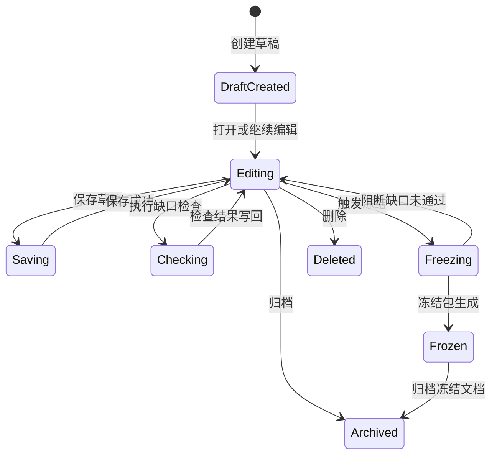
```mermaid
stateDiagram-v2
  [*] --> DraftCreated: 创建草稿
  DraftCreated --> Editing: 打开或继续编辑
  Editing --> Saving: 保存草稿
  Saving --> Editing: 保存成功
  Editing --> Checking: 执行缺口检查
  Checking --> Editing: 检查结果写回
  Editing --> Freezing: 触发冻结
  Freezing --> Frozen: 冻结包生成
  Freezing --> Editing: 阻断缺口未通过
  Editing --> Archived: 归档
  Editing --> Deleted: 删除
  Frozen --> Archived: 归档冻结文档
```

文档状态机约束：

- 只有草稿态可以编辑正文、表单、对话和标题。
- 冻结态只允许读取、导出和投影，不允许普通保存命令修改。
- 删除只作用于草稿或明确允许删除的归档文档；冻结文档默认不物理删除。
- 阻断缺口未通过时，冻结命令不能改变文档状态。

##### 6.4.2.5 编辑保存状态机

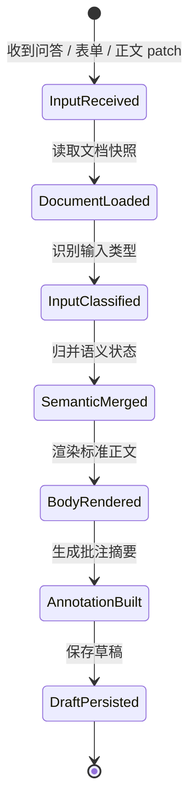
```mermaid
stateDiagram-v2
  [*] --> InputReceived: 收到问答 / 表单 / 正文 patch
  InputReceived --> DocumentLoaded: 读取文档快照
  DocumentLoaded --> InputClassified: 识别输入类型
  InputClassified --> SemanticMerged: 归并语义状态
  SemanticMerged --> BodyRendered: 渲染标准正文
  BodyRendered --> AnnotationBuilt: 生成批注摘要
  AnnotationBuilt --> DraftPersisted: 保存草稿
  DraftPersisted --> [*]
```

编辑保存状态机约束：

- 文档标题修改是文档状态的一部分，必须和其他输入一样可保存。
- 问答、表单、正文 patch 的最终落点都是同一份 `semantic_state` 和 `standard_body`。
- 服务端返回的新文档快照不得覆盖前端正在编辑但尚未保存的标题，前端需要显式脏状态保护；后端保存接口必须接受标题字段。
- 正文 patch 如果无法映射到稳定条款 id，必须拒绝或进入未绑定补丁队列，不能直接丢弃。

##### 6.4.2.6 冻结状态机

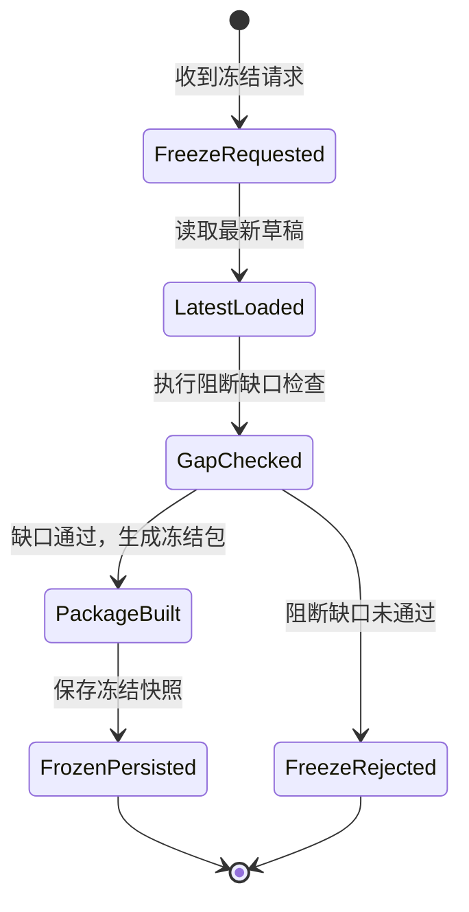
```mermaid
stateDiagram-v2
  [*] --> FreezeRequested: 收到冻结请求
  FreezeRequested --> LatestLoaded: 读取最新草稿
  LatestLoaded --> GapChecked: 执行阻断缺口检查
  GapChecked --> PackageBuilt: 缺口通过，生成冻结包
  GapChecked --> FreezeRejected: 阻断缺口未通过
  PackageBuilt --> FrozenPersisted: 保存冻结快照
  FrozenPersisted --> [*]
  FreezeRejected --> [*]
```

冻结状态机约束：

- 冻结包必须从同一最新草稿快照生成。
- 冻结包必须携带模板版本、知识绑定、正文、语义状态、批注和检查结果。
- 冻结成功后，文档正文和语义状态不可被普通编辑接口修改。

#### 6.4.3 模块运行编排设计

模块运行编排设计对应模块级状态机，回答“一次专家工作台请求进入后，如何被路由、事务化、调用下级服务并返回文档详情”。

模块级入口分为五类：

| 入口类型 | API / 命令 | 是否进入事务 | 是否修改文档 | 说明 |
| --- | --- | --- | --- | --- |
| 文档查询 | `ListDocumentsQuery`、`GetDocumentQuery` | 否 | 否 | 读取草稿、冻结文档和文档详情 |
| 文档生命周期命令 | `CreateDocumentCommand`、`DeleteDocumentCommand` | 是 | 是 | 创建或删除草稿 |
| 编辑保存命令 | `SaveDocumentCommand`、`AppendQuestionInputCommand`、`PatchFormFieldsCommand`、`PatchClauseCommand` | 是 | 是 | 归并输入并保存完整草稿 |
| 质量检查命令 | `RunGapCheckCommand` | 是 | 是 | 检查结果写回文档 |
| 冻结命令 | `FreezeDocumentCommand` | 是 | 是 | 生成冻结包并更新文档状态 |

标准编排链路如下：

```text
DocumentApplicationService
  -> TemplateQueryPort
  -> KnowledgeBindingQueryPort
  -> DocumentService
    -> SemanticStateService
    -> DocumentPatchService
    -> DocumentRenderer
    -> AnnotationService
    -> GapChecker
    -> FreezeService
  -> DocumentRepository
```

| 编排步骤 | 执行对象 | 输入 | 输出 |
| --- | --- | --- | --- |
| 读取上下文 | `TemplateQueryPort`、`KnowledgeBindingQueryPort` | 模板 id、知识绑定 id | 模板快照、知识绑定摘要 |
| 读取文档 | `DocumentRepository` | `document_id` | `RequirementAuthoringDocument` |
| 执行命令 | `DocumentService` | 文档快照、命令 payload、模板快照 | 更新后的文档聚合对象 |
| 语义归并 | `SemanticStateService` | 旧语义状态、输入增量、模板映射 | 新语义状态 |
| 正文渲染 | `DocumentRenderer` | 模板、语义状态、正文 patch | 标准正文 |
| 批注检查 | `AnnotationService`、`GapChecker` | 模板、语义状态、正文、知识绑定 | 批注和缺口检查结果 |
| 保存返回 | `DocumentRepository`、DTO 投影 | 文档聚合对象 | `RequirementAuthoringDocumentDetail` |

运行编排约束：

- 应用服务只控制用例顺序和事务边界，不把语义归并规则写在路由层。
- 文档服务可以调用领域服务，但不能直接访问 HTTP 请求对象。
- 模板和知识绑定通过端口读取，不能让编写模块修改配置模块和交换模块的权威状态。
- 冻结命令成功后，输出与交换模块再消费冻结包；编写模块不主动推送未冻结草稿。

#### 6.4.4 文档对象与生命周期设计

需求规格编写文档是该模块的聚合根。它必须保存完整草稿，而不是只保存右侧正文。

目标对象结构如下。

```text
RequirementAuthoringDocument
  document_id
  title
  status
  template_id
  template_version
  knowledge_binding
  layout_preferences
  semantic_state
    form_values
    question_answers
    extracted_facts
    clause_bindings
    knowledge_references
  standard_body
    sections[]
      section_id
      title
      clauses[]
        clause_id
        title
        content
        source_state_keys[]
  document_patches[]
  conversations[]
  annotations[]
  gap_check_result
  frozen_package
  created_at
  updated_at
  frozen_at
```

文档生命周期规则：

| 规则 | 说明 |
| --- | --- |
| 文档创建时绑定模板版本 | 后续模板升级不改变既有草稿结构 |
| 领域知识绑定可为空 | 未选择领域知识时，使用空知识上下文继续创建 |
| 领域知识绑定可替换 | 替换后必须记录新的知识绑定摘要，并触发批注和引用提示更新 |
| 标题是文档权威字段 | 标题修改必须进入保存接口，不能只保存在前端 |
| 对话历史属于草稿 | 问答式输入形成的消息和状态必须随草稿保存 |
| 冻结包属于冻结快照 | 冻结包生成后不能被草稿编辑隐式覆盖 |

#### 6.4.5 输入归并与正文渲染设计

输入归并与正文渲染设计回答“问答、表单和正文编辑为什么不会互相覆盖”。

三类输入的处理方式如下。

| 输入类型 | 输入来源 | 归并目标 | 渲染影响 | 说明 |
| --- | --- | --- | --- | --- |
| 问答输入 | 左侧问答页签 | `semantic_state.question_answers`、`semantic_state.extracted_facts` | 影响相关条款正文和批注 | 专家自然输入被保存为对话和语义事实 |
| 表单输入 | 左侧表单页签 | `semantic_state.form_values` | 影响映射条款正文 | 表单字段是严肃规整输入，优先保持结构化 |
| 正文编辑 | 右侧文档正文 | `document_patches`、必要时回写 `semantic_state.clause_bindings` | 直接影响条款内容 | 正文 patch 必须引用稳定条款 id |
| 分析建议补丁 | 需求分析会话与运算模块 | 待确认 `document_patch` | 经确认后影响正文 | Lab 输出不能自动写正式正文 |

正文渲染规则：

1. 先读取模板章节和条款结构。
2. 再读取语义状态中与条款绑定的结构化值。
3. 再应用已确认正文 patch。
4. 然后生成标准正文。
5. 最后生成批注、知识引用提示和缺口提示。

正文渲染的优先级如下。

| 优先级 | 来源 | 说明 |
| --- | --- | --- |
| 1 | 已确认正文 patch | 专家直接编辑优先于自动渲染 |
| 2 | 表单字段值 | 明确字段输入优先于自然语言抽取 |
| 3 | 问答抽取事实 | 支撑自动补写和批注 |
| 4 | 模板默认文本 | 缺少输入时提供章节骨架 |

渲染约束：

- 渲染服务必须是确定性的，同一模板、语义状态和 patch 应得到同一正文。
- 正文渲染不能调用模型提供方。
- 缺口检查读取渲染结果，但不能反向修改正文。
- 批注可以提示不确定性，但不改变正文权威内容。

#### 6.4.6 模块接口设计

##### 6.4.6.1 外部接口

外部接口面向专家工作台、管理页和输出与交换模块。

| 接口对象 | 输入 | 输出 | 说明 |
| --- | --- | --- | --- |
| `ListDocumentsQuery` | 过滤条件 | `RequirementAuthoringDocumentSummary[]` | 查询草稿和冻结文档列表 |
| `GetDocumentQuery` | `document_id` | `RequirementAuthoringDocumentDetail` | 打开文档详情 |
| `CreateDocumentCommand` | `template_id`、`title`、`knowledge_binding`、`layout_ratio` | `RequirementAuthoringDocumentDetail` | 新建草稿 |
| `DeleteDocumentCommand` | `document_id` | 删除结果 | 删除或归档草稿 |
| `SaveDocumentCommand` | 文档标题、模板上下文、领域知识绑定、正文、语义状态、对话、批注、检查结果 | `RequirementAuthoringDocumentDetail` | 保存完整草稿 |
| `AppendQuestionInputCommand` | `document_id`、用户输入 | 更新后的文档详情 | 问答输入写入同一语义状态 |
| `PatchFormFieldsCommand` | `document_id`、字段变更 | 更新后的文档详情 | 表单输入写入同一语义状态 |
| `PatchClauseCommand` | `document_id`、`clause_id`、正文内容 | 更新后的文档详情 | 轻量正文编辑 |
| `RunGapCheckCommand` | `document_id` | 含检查结果的文档详情 | 缺口检查 |
| `FreezeDocumentCommand` | `document_id` | `RequirementAuthoringDocumentDetail` | 冻结文档并保存冻结包 |

外部接口约束：

- 保存接口必须允许保存文档名称、模板选择和领域知识选择。
- 创建文档不要求必须先选择领域知识；没有知识绑定时保存空绑定。
- 冻结接口返回文档详情，但正式对外输出由规格输出与交换模块读取冻结包后生成。

##### 6.4.6.2 内部接口

内部接口是模块内服务和跨模块端口之间的调用边界。

| 内部服务 / 端口 | 输入 | 输出 | 调用方 |
| --- | --- | --- | --- |
| `DocumentService.create` | 模板快照、标题、知识绑定、布局偏好 | 新文档聚合对象 | 文档用例服务 |
| `DocumentService.save` | 文档快照、完整保存 payload | 更新后的文档聚合对象 | 文档用例服务 |
| `SemanticStateService.apply_question_input` | 旧语义状态、用户输入、模板、知识绑定 | 新语义状态、对话回复建议 | 文档服务 |
| `SemanticStateService.apply_form_patch` | 旧语义状态、字段 patch、模板 | 新语义状态 | 文档服务 |
| `DocumentPatchService.apply_clause_patch` | 正文 patch、条款 id、模板结构 | 新正文 patch 集 | 文档服务 |
| `DocumentRenderer.render` | 模板、语义状态、正文 patch | 标准正文 | 文档服务 |
| `AnnotationService.build_annotations` | 模板、语义状态、知识引用、检查结果 | 条款批注 | 文档服务 |
| `GapChecker.check` | 模板规则、语义状态、正文 | 缺口检查结果 | 文档服务 / 冻结服务 |
| `FreezeService.freeze` | 文档详情、检查结果 | `FrozenRequirementPackage` | 文档服务 |
| `TemplateQueryPort.get_template_snapshot` | `template_id`、版本约束 | 模板快照 | 文档用例服务 |
| `KnowledgeBindingQueryPort.get_binding` | 知识绑定请求 | 知识绑定摘要 | 文档用例服务 |

#### 6.4.7 内部功能组成与类划分

##### 6.4.7.1 子模块划分总览

需求规格编写模块按七个子模块组织。

| 序号 | 子模块 | 主要职责 | 主要类 / 服务 |
| --- | --- | --- | --- |
| 1 | 文档用例子模块 | API 命令编排、事务边界、DTO 投影 | `DocumentApplicationService`、`DocumentDtoAssembler` |
| 2 | 文档生命周期子模块 | 创建、保存、删除、冻结前状态控制 | `DocumentService`、`DocumentRepository` |
| 3 | 输入归并子模块 | 问答、表单、正文 patch 归并 | `SemanticStateService`、`DocumentPatchService` |
| 4 | 正文渲染子模块 | 标准正文生成和章节条款投影 | `DocumentRenderer`、`ClauseBindingService` |
| 5 | 批注与缺口子模块 | 批注、知识引用、缺口检查 | `AnnotationService`、`GapChecker` |
| 6 | 冻结子模块 | 冻结校验、冻结包生成 | `FreezeService`、`FrozenPackageBuilder` |
| 7 | 契约对象子模块 | 命令、查询、文档 DTO 和内部快照 | `models.py`、`DocumentSnapshot` |

##### 6.4.7.2 内部调用链

```text
DocumentApplicationService
  -> TemplateQueryPort
  -> KnowledgeBindingQueryPort
  -> DocumentService
    -> SemanticStateService
    -> DocumentPatchService
    -> DocumentRenderer
    -> AnnotationService
    -> GapChecker
    -> FreezeService
  -> DocumentRepository
  -> DocumentDtoAssembler
```

##### 6.4.7.3 文档用例子模块

| 类 / 服务 | 类型 | 职责 | 不应承担的职责 |
| --- | --- | --- | --- |
| `DocumentApplicationService` | 应用服务 | 承接外部命令 / 查询，控制事务和跨模块读取 | 实现语义归并规则 |
| `DocumentDtoAssembler` | 投影服务 | 将文档聚合对象转换为前端 DTO | 修改文档状态 |

主要接口：

| 类 / 服务 | 主要方法 | 输入 | 输出 |
| --- | --- | --- | --- |
| `DocumentApplicationService` | `create_document` | `CreateDocumentCommand` | `RequirementAuthoringDocumentDetail` |
| `DocumentApplicationService` | `save_document` | `SaveDocumentCommand` | `RequirementAuthoringDocumentDetail` |
| `DocumentApplicationService` | `freeze_document` | `FreezeDocumentCommand` | `RequirementAuthoringDocumentDetail` |
| `DocumentDtoAssembler` | `to_detail` | `RequirementAuthoringDocument` | `RequirementAuthoringDocumentDetail` |

###### 6.4.7.3.1 `RequirementAuthoringApplicationService`

| 项 | 内容 |
| --- | --- |
| 文件 | `apps/api/app/requirement_authoring/document_application_service.py` |
| 类型 | 文档用例应用服务 |
| 主要输入 | `RequirementAuthoringDocumentCreate`、`RequirementAuthoringDocumentSave`、`RequirementAuthoringMessageWrite`、`RequirementAuthoringFormPatch`、`document_id`、`clause_id` |
| 主要输出 | 文档详情 DTO、文档摘要列表、冻结后的文档详情、`None` |
| 主要方法 | `list_documents`、`create_document`、`get_document`、`delete_document`、`save_document`、`append_message`、`patch_form_fields`、`patch_clause`、`run_check`、`freeze` |
| 功能说明 | 作为专家工作台文档用例入口，负责读取模板、读取知识绑定、调用文档领域服务、保存文档聚合对象并投影前端 DTO。 |
| 边界说明 | 不直接实现模板生命周期和知识源绑定规则；模板能力委托 `RequirementConfigurationApplicationService`，知识能力委托 `RequirementExchangeApplicationService`。 |

###### 6.4.7.3.2 `RequirementAuthoringService`

| 项 | 内容 |
| --- | --- |
| 文件 | `apps/api/app/requirement_authoring/service.py` |
| 类型 | API 路由公开服务入口 |
| 主要输入 | FastAPI 路由传入的文档命令、模板命令和数据库会话 |
| 主要输出 | 与 `RequirementAuthoringApplicationService` 和 `RequirementConfigurationApplicationService` 一致的 DTO |
| 主要方法 | 继承文档用例方法，并提供 `list_templates`、`create_template`、`update_template`、`activate_template` |
| 功能说明 | 保持 `/requirement-authoring` 路由的单一依赖入口，同时把文档编写和模板配置分派到各自模块。 |
| 边界说明 | 该类不承载业务规则，不能继续堆叠模板、知识、冻结或渲染逻辑。 |

##### 6.4.7.4 文档生命周期子模块

| 类 / 服务 | 类型 | 职责 | 不应承担的职责 |
| --- | --- | --- | --- |
| `RequirementAuthoringDocument` | 聚合对象 | 保存文档权威状态 | 调用模型提供方 |
| `DocumentService` | 领域服务 | 创建、保存、删除、状态转移和冻结前控制 | 直接处理 HTTP |
| `DocumentRepository` | 仓储 | 保存和读取文档聚合对象 | 判断缺口规则 |

主要接口：

| 类 / 服务 | 主要方法 | 输入 | 输出 |
| --- | --- | --- | --- |
| `DocumentService` | `create` | 模板快照、标题、知识绑定 | `RequirementAuthoringDocument` |
| `DocumentService` | `apply_save_payload` | 文档快照、保存 payload | 更新后的文档 |
| `DocumentService` | `mark_frozen` | 文档快照、冻结包 | 冻结态文档 |
| `DocumentRepository` | `get` | `document_id` | `RequirementAuthoringDocument` |
| `DocumentRepository` | `save` | `RequirementAuthoringDocument` | 保存后的文档 |

###### 6.4.7.4.1 `RequirementDocumentService`

| 项 | 内容 |
| --- | --- |
| 文件 | `apps/api/app/requirement_authoring/document_service.py` |
| 类型 | 文档生命周期与状态控制领域服务 |
| 主要输入 | 文档聚合对象、模板聚合对象、标题、模板 id、知识绑定、字段 patch、用户输入、条款正文 |
| 主要输出 | 新建的 `RequirementAuthoringDocument`，或被原地更新后的文档聚合对象 |
| 主要方法 | `create_document`、`save_document_context`、`change_template`、`append_message`、`patch_form_fields`、`patch_clause`、`run_check`、`freeze`、`write_document_state` |
| 功能说明 | 维护草稿、对话、语义状态、正文、批注、检查结果和冻结状态之间的一致性。 |
| 边界说明 | 不直接提交数据库事务；持久化由 `RequirementAuthoringRepository` 完成。 |

###### 6.4.7.4.2 `RequirementAuthoringRepository`

| 项 | 内容 |
| --- | --- |
| 文件 | `apps/api/app/requirement_authoring/document_repository.py` |
| 类型 | 文档仓储 |
| 主要输入 | SQLAlchemy 会话、`RequirementAuthoringDocument`、`document_id` |
| 主要输出 | 文档聚合对象、文档列表、保存后的文档对象、删除结果 |
| 主要方法 | `list_documents`、`get_document`、`add_document`、`save_document`、`delete_document` |
| 功能说明 | 只负责需求规格编写文档的持久化读写。 |
| 边界说明 | 模板持久化已归属需求规格配置模块，不在本仓储中实现。 |

##### 6.4.7.5 输入归并子模块

| 类 / 服务 | 类型 | 职责 | 不应承担的职责 |
| --- | --- | --- | --- |
| `SemanticStateService` | 领域服务 | 将问答和表单输入归并到 `semantic_state` | 渲染完整正文 |
| `DocumentPatchService` | 领域服务 | 管理正文 patch、条款 patch 和分析建议 patch | 执行缺口检查 |
| `ClauseBindingService` | 领域服务 | 管理字段、语义状态和条款 id 的映射 | 修改模板定义 |

主要接口：

| 类 / 服务 | 主要方法 | 输入 | 输出 |
| --- | --- | --- | --- |
| `SemanticStateService` | `apply_question_input` | 语义状态、用户输入、模板快照 | 新语义状态 |
| `SemanticStateService` | `apply_form_patch` | 语义状态、字段 patch、模板快照 | 新语义状态 |
| `DocumentPatchService` | `apply_clause_patch` | patch 集、条款 id、正文 | 新 patch 集 |
| `ClauseBindingService` | `resolve_clause` | 字段 key 或语义 key、模板快照 | 条款 id |

###### 6.4.7.5.1 `RequirementDocumentService` 输入归并方法

| 项 | 内容 |
| --- | --- |
| 文件 | `apps/api/app/requirement_authoring/document_service.py` |
| 类型 | 输入归并领域服务方法组 |
| 主要输入 | `user_content`、`fields_patch`、`clause_id`、条款正文、当前 `semantic_state` |
| 主要输出 | 更新后的 `semantic_state.fields`、对话消息、正文、批注、检查结果 |
| 主要方法 | `append_message`、`patch_form_fields`、`patch_clause`、`write_document_state`、`build_semantic_state` |
| 功能说明 | 当前实现把问答输入、表单 patch 和条款正文 patch 统一归并到文档状态，再触发正文与批注重算。 |
| 边界说明 | 后续若输入归并规则复杂化，可从该类继续拆出 `SemanticStateService` 和 `DocumentPatchService`，但外部 API 不应变化。 |

##### 6.4.7.6 正文渲染子模块

| 类 / 服务 | 类型 | 职责 | 不应承担的职责 |
| --- | --- | --- | --- |
| `DocumentRenderer` | 领域服务 | 根据模板、语义状态和 patch 生成标准正文 | 保存文档 |
| `ClauseRenderer` | 领域服务 | 渲染单个条款内容 | 执行冻结 |

主要接口：

| 类 / 服务 | 主要方法 | 输入 | 输出 |
| --- | --- | --- | --- |
| `DocumentRenderer` | `render` | 模板快照、语义状态、patch 集 | `standard_body` |
| `ClauseRenderer` | `render_clause` | 条款模板、语义状态、patch | 条款正文 |

###### 6.4.7.6.1 `RequirementDocumentRenderer`

| 项 | 内容 |
| --- | --- |
| 文件 | `apps/api/app/requirement_authoring/document_renderer.py` |
| 类型 | 标准正文渲染服务 |
| 主要输入 | 模板 payload、语义字段 `fields`、文档正文、`clause_id`、条款正文 |
| 主要输出 | 标准正文对象、单条款正文、patch 后的正文对象、标准文档标题 |
| 主要方法 | `render_document`、`patch_clause`、`standard_document_title`、`render_clause` |
| 功能说明 | 根据 81433 / 82259 模板结构和语义字段生成右侧标准需求规格正文。 |
| 边界说明 | 不保存文档，不执行缺口检查，不生成冻结包。 |

##### 6.4.7.7 批注与缺口子模块

| 类 / 服务 | 类型 | 职责 | 不应承担的职责 |
| --- | --- | --- | --- |
| `AnnotationService` | 领域服务 | 生成条款批注、知识引用和待确认提示 | 修改正文 |
| `GapChecker` | 领域服务 | 根据模板规则和正文状态生成缺口检查结果 | 冻结文档 |

主要接口：

| 类 / 服务 | 主要方法 | 输入 | 输出 |
| --- | --- | --- | --- |
| `AnnotationService` | `build_annotations` | 模板、语义状态、知识绑定、检查结果 | `annotations[]` |
| `GapChecker` | `check` | 模板规则、语义状态、标准正文 | `gap_check_result` |

###### 6.4.7.7.1 `RequirementAnnotationService`

| 项 | 内容 |
| --- | --- |
| 文件 | `apps/api/app/requirement_authoring/annotation_service.py` |
| 类型 | 批注生成服务 |
| 主要输入 | 模板 payload、语义字段 `fields`、阻断缺口列表、条款 id |
| 主要输出 | 条款批注列表、被标记为待映射确认的批注列表 |
| 主要方法 | `build_annotations`、`mark_clause_pending_mapping` |
| 功能说明 | 为每个标准条款生成解释、知识引用、结构化映射、缺口提示和待确认提示。 |
| 边界说明 | 不修改正文内容；正文修改由渲染服务或文档服务完成。 |

###### 6.4.7.7.2 `RequirementGapChecker`

| 项 | 内容 |
| --- | --- |
| 文件 | `apps/api/app/requirement_authoring/gap_checker.py` |
| 类型 | 缺口检查服务 |
| 主要输入 | 模板 payload、语义字段 `fields` |
| 主要输出 | `blocking_count`、`warning_count`、`passed_count`、`items[]` |
| 主要方法 | `run`、`empty_check_result`、`form_labels`、`field_clause_id` |
| 功能说明 | 根据模板 `gap_rules.required_fields` 判断冻结前是否存在阻断缺口。 |
| 边界说明 | 不改变文档状态；文档状态由 `RequirementDocumentService.run_check` 根据检查结果更新。 |

##### 6.4.7.8 冻结子模块

| 类 / 服务 | 类型 | 职责 | 不应承担的职责 |
| --- | --- | --- | --- |
| `FreezeService` | 领域服务 | 校验冻结条件并生成冻结包 | 发布到 `P3` |
| `FrozenPackageBuilder` | 领域服务 | 组装冻结正文、结构化语义、模板和知识追溯 | 修改草稿 |

主要接口：

| 类 / 服务 | 主要方法 | 输入 | 输出 |
| --- | --- | --- | --- |
| `FreezeService` | `freeze` | 文档快照、模板快照、检查结果 | `FrozenRequirementPackage` |
| `FrozenPackageBuilder` | `build` | 冻结快照 | `FrozenRequirementPackage` |

###### 6.4.7.8.1 `RequirementFreezeService`

| 项 | 内容 |
| --- | --- |
| 文件 | `apps/api/app/requirement_authoring/freeze_service.py` |
| 类型 | 冻结包生成服务 |
| 主要输入 | 标准正文、批注、语义字段、知识档案 id、冻结时间 |
| 主要输出 | `FrozenRequirementPackage` 字典对象、`structured_spec` 结构化规格载荷 |
| 主要方法 | `build_frozen_package`、`build_structured_spec` |
| 功能说明 | 将已检查通过的标准正文、批注和语义字段组装成 `P3` 可消费的冻结包。 |
| 边界说明 | 不判断文档能否冻结；冻结条件由文档服务结合缺口检查结果控制。 |

##### 6.4.7.9 契约对象子模块

| 契约对象 | 生成者 | 消费者 | 作用 |
| --- | --- | --- | --- |
| `RequirementAuthoringDocumentDetail` | 文档 DTO 投影 | 前端专家工作台 | 展示完整文档状态 |
| `DocumentSnapshot` | 文档服务 | 渲染、批注、检查、冻结服务 | 提供只读文档快照 |
| `SemanticStatePatch` | 输入归并子模块 | 文档服务 | 描述语义状态增量 |
| `ClausePatch` | 正文编辑区 / 分析模块建议 | 文档补丁服务 | 描述条款正文增量 |
| `FrozenRequirementPackage` | 冻结服务 | 规格输出与交换模块 | 作为正式输出输入 |

###### 6.4.7.9.1 `requirement_authoring.models` 契约模型

| 项 | 内容 |
| --- | --- |
| 文件 | `apps/api/app/requirement_authoring/models.py` |
| 类型 | Pydantic 命令模型与默认模板工厂 |
| 主要输入 | 前端提交的模板、文档、消息、表单、条款、知识绑定载荷 |
| 主要输出 | `RequirementAuthoringTemplateWrite`、`RequirementAuthoringDocumentCreate`、`RequirementAuthoringMessageWrite`、`RequirementAuthoringFormPatch`、`RequirementAuthoringDocumentSave`、`RequirementAuthoringClausePatch`、`RequirementAuthoringKnowledgeBindingWrite`、默认模板 payload |
| 主要方法 / 对象 | `default_template_payload` 以及上述 Pydantic 模型 |
| 功能说明 | 约束专家工作台和后端文档编写模块之间的输入形态。 |
| 边界说明 | 模型对象只描述数据契约，不承载文档生命周期和模板校验逻辑。 |

##### 6.4.7.10 目标目录结构

```text
requirement_authoring/
  document_application_service.py   # 文档用例编排
  document_service.py               # 文档生命周期与状态控制
  semantic_state_service.py         # 问答、表单、正文到语义状态的归并
  document_patch_service.py         # 条款 patch 和建议 patch
  clause_binding_service.py         # 字段 / 语义状态 / 条款映射
  document_renderer.py              # 标准需求规格正文渲染
  annotation_service.py             # 条款批注和知识引用提示
  gap_checker.py                    # 缺口检查
  freeze_service.py                 # 冻结包生成
  document_repository.py            # 文档持久化
  models.py                         # 命令、查询、DTO、内部快照
```

#### 6.4.8 约束、错误处理与模块边界

##### 6.4.8.1 模块不变量

| 不变量 | 含义 | 破坏后影响 |
| --- | --- | --- |
| 文档绑定模板版本稳定 | 文档创建后绑定确定模板版本 | 历史草稿被新模板结构破坏 |
| 问答、表单、正文同源 | 三种输入都归并到同一 `semantic_state` | 右侧正文、表单和对话互相覆盖 |
| 文档标题是可保存状态 | 标题修改必须进入保存 payload | 后续输入返回旧标题，覆盖用户修改 |
| 标准正文条款有稳定 id | 章节、条款、批注和字段映射都可追踪 | 无法保存正文 patch 和条款批注 |
| 冻结前必须通过阻断检查 | 阻断型缺口未通过不能冻结 | `P3` 接收到不完整规格 |
| 冻结后只读 | 冻结包生成后正文和语义状态不可被普通编辑修改 | 下游引用失去稳定性 |

##### 6.4.8.2 错误处理

| 错误场景 | 处理方式 |
| --- | --- |
| 文档不存在 | 返回 `404 document_not_found` |
| 模板不存在或不可用 | 返回 `400 template_unavailable` |
| 文档已冻结仍尝试编辑 | 返回 `409 document_frozen` |
| 条款 id 不存在 | 返回 `400 clause_not_found` |
| 正文 patch 无法绑定条款 | 返回 `400 clause_patch_unbound` 或进入未绑定补丁队列 |
| 阻断缺口未通过仍尝试冻结 | 返回 `409 blocking_gap_not_resolved` |
| 保存载荷缺少标题、模板、知识绑定或语义状态上下文 | 返回 `400 invalid_document_payload` |

##### 6.4.8.3 与其他模块边界

| 对方模块 | 编写模块读取 | 编写模块写入 | 边界说明 |
| --- | --- | --- | --- |
| 需求规格配置模块 | 模板、字段映射、问答策略、缺口规则 | 无 | 编写模块只能消费模板版本，不能修改模板定义 |
| 需求分析会话与运算模块 | 建议补丁、事实摘要、规格节点引用 | 可选择接收为待确认文档 patch | Lab 输出必须经过确认机制，不能自动写正式正文 |
| 规格输出与交换模块 | 知识绑定、知识源信息 | 冻结包输入 | 只有冻结态进入正式交换，草稿态不进入 `P3` |

### 6.5 需求规格配置模块

#### 6.5.1 模块定位、职责与核心概念

需求规格配置模块是 `P2` 的模板与规则权威模块。它负责维护专家工作台、需求分析会话和冻结输出共同依赖的需求规格模板版本、章节条款结构、表单字段、字段映射、问答策略、缺口规则和知识绑定配置。

该模块不编辑任何一份专家草稿。它定义“草稿应该按什么结构创建、按什么字段填报、按什么规则检查、按什么模板渲染”；具体某份文档的内容、状态和冻结包由需求规格编写模块管理。

核心概念按父子层级定义如下。

| 序号 | 中文概念 | 英文实现名 | 层级关系 | 定义 |
| --- | --- | --- | --- | --- |
| 1 | 需求规格配置模块 | `requirement_configuration` | `P2` 后端业务模块 | 管理需求规格模板、字段、映射、规则和启停状态的权威模块。 |
| 2 | 需求规格模板对象 | `RequirementAuthoringTemplate` | 模块管理的模板聚合对象 | 一套可用于创建需求规格文档的模板版本，包含章节条款、表单字段、映射、问答策略、缺口规则和知识绑定配置。 |
| 3 | 模板版本 | `template_version` | 模板对象的版本属性 | 同一模板编码下的一次稳定版本。文档创建后绑定模板版本，不随后续模板升级隐式变化。 |
| 4 | 章节条款结构 | `section_schema` | 模板内部结构对象 | 标准需求规格说明的章节、条款、条款 id、默认文本和必填字段要求。 |
| 5 | 表单结构 | `form_schema` | 模板内部结构对象 | 面向严肃规整填报的字段分组、字段 key、类型、必填性、选项和校验规则。 |
| 6 | 字段映射 | `field_mapping` | 模板内部映射对象 | 描述表单字段、语义状态字段和正文条款之间的映射关系。 |
| 7 | 问答策略 | `questionnaire_policy` | 模板内部策略对象 | 描述问答式输入优先收敛哪些章节、字段或条款，为专家工作台和分析会话提供结构化引导约束。 |
| 8 | 缺口规则 | `gap_rule` | 模板内部规则对象 | 描述哪些字段、事实或条款缺失会形成提示型或阻断型缺口。 |
| 9 | 模板校验结果 | `template_validation_result` | 配置质量状态 | 激活模板前对章节、字段、映射、策略、缺口规则和知识绑定配置进行一致性校验的结果。 |

静态归属和调用关系如下。

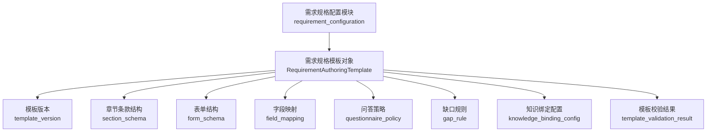
```mermaid
flowchart TB
  Module["需求规格配置模块<br/>requirement_configuration"]
  Template["需求规格模板对象<br/>RequirementAuthoringTemplate"]
  Version["模板版本<br/>template_version"]
  Section["章节条款结构<br/>section_schema"]
  Form["表单结构<br/>form_schema"]
  Mapping["字段映射<br/>field_mapping"]
  Policy["问答策略<br/>questionnaire_policy"]
  Gap["缺口规则<br/>gap_rule"]
  Knowledge["知识绑定配置<br/>knowledge_binding_config"]
  Validation["模板校验结果<br/>template_validation_result"]

  Module --> Template
  Template --> Version
  Template --> Section
  Template --> Form
  Template --> Mapping
  Template --> Policy
  Template --> Gap
  Template --> Knowledge
  Template --> Validation
```

##### 6.5.1.1 运行装载生命周期

配置模块的生命周期围绕模板版本展开。模板被创建、编辑和激活后，才会被编写模块、分析模块和输出模块消费。

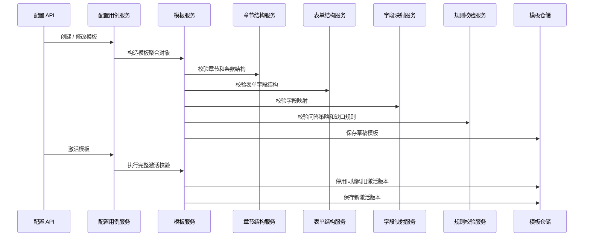
```mermaid
sequenceDiagram
  participant API as 配置 API
  participant App as 配置用例服务
  participant Template as 模板服务
  participant Section as 章节结构服务
  participant Form as 表单结构服务
  participant Mapping as 字段映射服务
  participant Rule as 规则校验服务
  participant Repo as 模板仓储

  API->>App: 创建 / 修改模板
  App->>Template: 构造模板聚合对象
  Template->>Section: 校验章节和条款结构
  Template->>Form: 校验表单字段结构
  Template->>Mapping: 校验字段映射
  Template->>Rule: 校验问答策略和缺口规则
  Template->>Repo: 保存草稿模板
  API->>App: 激活模板
  App->>Template: 执行完整激活校验
  Template->>Repo: 停用同编码旧激活版本
  Template->>Repo: 保存新激活版本
```

生命周期约束如下：

| 时点 | 主要动作 | 说明 |
| --- | --- | --- |
| 创建模板 | 生成模板 id、编码、版本和草稿状态 | 草稿模板不能直接创建正式文档 |
| 编辑模板 | 修改章节、字段、映射和规则 | 已被文档引用的模板版本不能被隐式覆盖 |
| 校验模板 | 检查结构、映射、策略和规则一致性 | 激活前必须完整校验 |
| 激活模板 | 设为可创建文档的模板版本 | 同一模板编码只能有一个激活版本 |
| 停用模板 | 禁止新建文档继续使用 | 历史文档仍可读取该版本 |
| 归档模板 | 版本只读保留 | 用于历史追溯，不再编辑 |

##### 6.5.1.2 职责与责任划分

需求规格配置模块负责：

- 管理需求规格模板版本。
- 管理模板章节和条款结构。
- 管理表单字段、字段类型、字段分组和字段校验规则。
- 管理字段到语义状态、正文条款的映射。
- 管理问答策略。
- 管理缺口检查规则。
- 管理领域知识绑定配置。
- 校验模板完整性和一致性。
- 激活、停用或归档模板版本。

它不负责：

- 修改某一份专家草稿。
- 解释用户自然语言输入。
- 生成冻结规格包。
- 判断某一份文档当前是否可以冻结。
- 读取需求分析会话状态。

责任划分如下：

| 子能力 | 主要对象 | 责任 |
| --- | --- | --- |
| 模板生命周期 | `RequirementAuthoringTemplate`、`TemplateService` | 创建、复制、编辑、激活、停用、归档模板版本 |
| 章节条款配置 | `SectionSchemaService` | 管理章节、条款、条款 id、默认正文和必填字段引用 |
| 表单配置 | `FormSchemaService` | 管理字段分组、字段类型、选项和校验规则 |
| 映射配置 | `FieldMappingService` | 管理字段、语义状态和正文条款的映射 |
| 策略规则配置 | `QuestionnairePolicyService`、`GapRuleService` | 管理问答策略和缺口规则 |
| 配置校验 | `TemplateValidationService` | 在保存和激活前校验模板一致性 |
| 持久化 | `TemplateRepository` | 保存和读取模板版本 |

#### 6.5.2 状态机设计

配置模块的状态机围绕模板版本，而不是围绕文档。它必须确保被文档引用的模板版本稳定，激活版本可用，归档版本可追溯。

##### 6.5.2.1 状态机分层

| 层级 | 管理对象 | 起点 | 终点 | 责任 |
| --- | --- | --- | --- | --- |
| 模块级状态机 | 配置 API 请求 | 接收模板查询、创建、修改、校验、激活请求 | 返回模板详情或错误 | 校验请求、控制事务、路由到模板服务 |
| 模板版本状态机 | `RequirementAuthoringTemplate` | 创建草稿模板 | 激活、停用、归档或删除 | 管理模板版本生命周期 |
| 激活校验状态机 | 单次激活命令 | 收到激活请求 | 激活成功或失败 | 执行完整一致性校验和同编码互斥激活 |

##### 6.5.2.2 状态机与执行设计对应关系

| 状态机层级 | 本节定义内容 | 后续执行设计章节 | 执行设计展开内容 |
| --- | --- | --- | --- |
| 模块级状态机 | 配置请求如何进入事务和错误映射 | 6.5.3 模块运行编排设计 | 查询、保存、校验、激活命令如何调度服务 |
| 模板版本状态机 | 模板版本的长期状态和合法转移 | 6.5.4 模板对象与生命周期设计 | 模板字段、版本规则和状态约束 |
| 激活校验状态机 | 激活前校验和旧激活版本停用 | 6.5.5 配置对象与校验规则设计 | 章节、字段、映射、策略、规则的校验内容 |

##### 6.5.2.3 模块级状态机

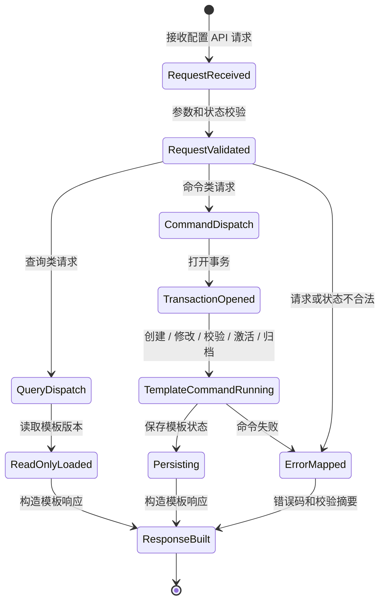
```mermaid
stateDiagram-v2
  [*] --> RequestReceived: 接收配置 API 请求
  RequestReceived --> RequestValidated: 参数和状态校验
  RequestValidated --> QueryDispatch: 查询类请求
  RequestValidated --> CommandDispatch: 命令类请求
  QueryDispatch --> ReadOnlyLoaded: 读取模板版本
  ReadOnlyLoaded --> ResponseBuilt: 构造模板响应
  CommandDispatch --> TransactionOpened: 打开事务
  TransactionOpened --> TemplateCommandRunning: 创建 / 修改 / 校验 / 激活 / 归档
  TemplateCommandRunning --> Persisting: 保存模板状态
  Persisting --> ResponseBuilt: 构造模板响应
  RequestValidated --> ErrorMapped: 请求或状态不合法
  TemplateCommandRunning --> ErrorMapped: 命令失败
  ErrorMapped --> ResponseBuilt: 错误码和校验摘要
  ResponseBuilt --> [*]
```

##### 6.5.2.4 模板版本状态机

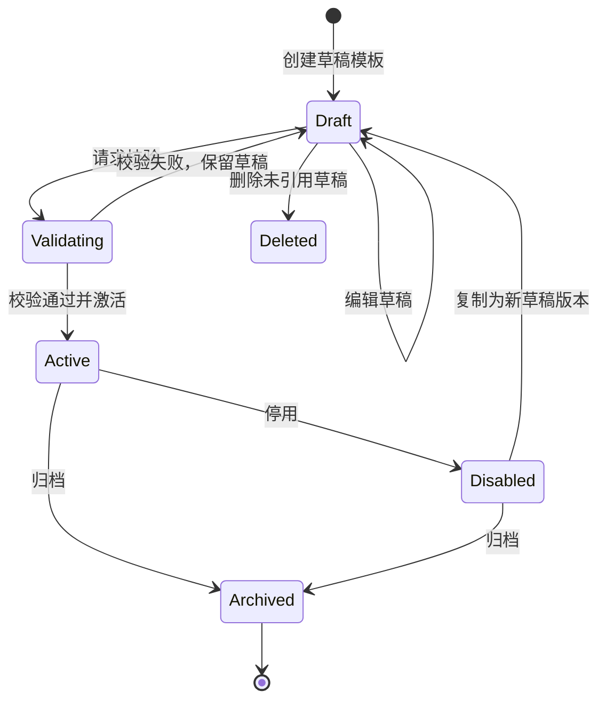
```mermaid
stateDiagram-v2
  [*] --> Draft: 创建草稿模板
  Draft --> Draft: 编辑草稿
  Draft --> Validating: 请求校验
  Validating --> Draft: 校验失败，保留草稿
  Validating --> Active: 校验通过并激活
  Active --> Disabled: 停用
  Active --> Archived: 归档
  Disabled --> Draft: 复制为新草稿版本
  Disabled --> Archived: 归档
  Draft --> Deleted: 删除未引用草稿
  Archived --> [*]
```

模板版本状态机约束：

- `Draft` 可以编辑，但不能被正式文档创建接口使用。
- `Active` 是可创建新文档的唯一状态。
- 同一模板编码同一时间只能有一个 `Active` 版本。
- `Disabled` 不再用于新建文档，但历史文档仍可读取。
- `Archived` 只读保留，不能继续编辑。
- 被文档引用的版本不能物理删除。

##### 6.5.2.5 激活校验状态机

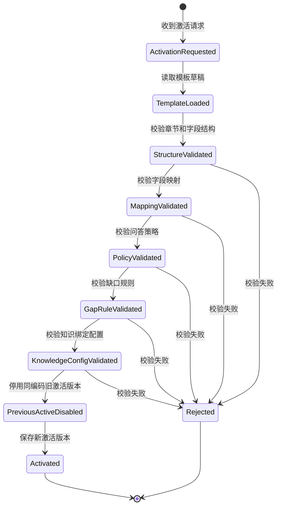
```mermaid
stateDiagram-v2
  [*] --> ActivationRequested: 收到激活请求
  ActivationRequested --> TemplateLoaded: 读取模板草稿
  TemplateLoaded --> StructureValidated: 校验章节和字段结构
  StructureValidated --> MappingValidated: 校验字段映射
  MappingValidated --> PolicyValidated: 校验问答策略
  PolicyValidated --> GapRuleValidated: 校验缺口规则
  GapRuleValidated --> KnowledgeConfigValidated: 校验知识绑定配置
  KnowledgeConfigValidated --> PreviousActiveDisabled: 停用同编码旧激活版本
  PreviousActiveDisabled --> Activated: 保存新激活版本
  StructureValidated --> Rejected: 校验失败
  MappingValidated --> Rejected: 校验失败
  PolicyValidated --> Rejected: 校验失败
  GapRuleValidated --> Rejected: 校验失败
  KnowledgeConfigValidated --> Rejected: 校验失败
  Activated --> [*]
  Rejected --> [*]
```

激活校验约束：

- 激活命令必须在同一事务中完成“校验新版本”和“停用旧激活版本”。
- 校验失败时不得改变模板状态。
- 校验结果必须保存或返回到前端，便于管理者修正。

#### 6.5.3 模块运行编排设计

模块运行编排设计对应模块级状态机，回答“配置请求如何被路由、事务化、校验并保存模板版本”。

模块级入口分为四类：

| 入口类型 | API / 命令 | 是否进入事务 | 是否修改模板 | 说明 |
| --- | --- | --- | --- | --- |
| 模板查询 | `ListTemplatesQuery`、`GetTemplateQuery` | 否 | 否 | 查询模板版本和激活模板 |
| 模板编辑 | `CreateTemplateCommand`、`UpdateTemplateCommand` | 是 | 是 | 创建或修改草稿模板 |
| 模板校验 | `ValidateTemplateCommand` | 否或是 | 可选写入校验结果 | 校验模板 payload 或模板版本 |
| 模板状态命令 | `ActivateTemplateCommand`、`DisableTemplateCommand`、`ArchiveTemplateCommand` | 是 | 是 | 修改模板版本状态 |

标准编排链路如下：

```text
TemplateApplicationService
  -> TemplateService
    -> SectionSchemaService
    -> FormSchemaService
    -> FieldMappingService
    -> QuestionnairePolicyService
    -> GapRuleService
    -> TemplateValidationService
  -> TemplateRepository
```

| 编排步骤 | 执行对象 | 输入 | 输出 |
| --- | --- | --- | --- |
| 构造模板 | `TemplateService` | 创建或更新 payload | 模板聚合对象 |
| 校验章节结构 | `SectionSchemaService` | `sections[]` | 章节校验结果 |
| 校验表单结构 | `FormSchemaService` | `form_groups[]` | 表单校验结果 |
| 校验字段映射 | `FieldMappingService` | 字段、条款、映射 | 映射校验结果 |
| 校验策略规则 | `QuestionnairePolicyService`、`GapRuleService` | 问答策略、缺口规则 | 策略和规则校验结果 |
| 合并校验结果 | `TemplateValidationService` | 各项校验结果 | `template_validation_result` |
| 保存模板 | `TemplateRepository` | 模板聚合对象 | 保存后的模板 |

运行编排约束：

- 模板服务只能保存结构正确的模板草稿；激活必须执行完整校验。
- 配置模块不读取文档草稿内容来决定模板结构。
- 激活模板只改变配置模块状态，不能自动迁移历史文档。
- 模板查询应支持按模板编码、状态和版本过滤。

#### 6.5.4 模板对象与生命周期设计

需求规格模板对象是配置模块的聚合根。

目标对象结构如下。

```text
RequirementAuthoringTemplate
  template_id
  template_code
  name
  version
  status
  description
  sections[]
    section_id
    title
    order
    clauses[]
      clause_id
      title
      order
      required_fields[]
      semantic_keys[]
      template_text
  form_groups[]
    group_id
    title
    order
    fields[]
      field_key
      label
      type
      required
      options[]
      validation_rule
  field_mappings[]
    field_key
    semantic_key
    clause_id
    mapping_type
  questionnaire_policy
    initial_topics[]
    priority_sections[]
    option_style
    free_text_allowed
  gap_rules[]
    rule_id
    level
    target_type
    target_key
    condition
    message
  knowledge_binding_config
  validation_result
  created_at
  updated_at
  activated_at
  archived_at
```

模板生命周期规则：

| 规则 | 说明 |
| --- | --- |
| 模板编码标识模板族 | 同一模板编码下可以有多个版本 |
| 模板版本不可隐式覆盖 | 修改已被文档引用的模板时，应生成新版本 |
| 文档绑定创建时模板版本 | 旧文档继续使用旧模板版本 |
| 同一模板编码只能有一个激活版本 | 创建新文档时只使用激活版本 |
| 草稿模板可编辑 | 草稿模板不能用于创建正式文档 |
| 归档版本只读 | 归档版本可被历史文档读取，不能再编辑 |

#### 6.5.5 配置对象与校验规则设计

配置对象之间必须能够对账：字段必须能映射到语义状态或条款，问答策略和缺口规则不能引用不存在的字段或条款。

##### 6.5.5.1 章节条款结构

章节条款结构是标准需求规格正文的骨架。

| 校验项 | 校验内容 |
| --- | --- |
| 章节 id | `section_id` 在模板内唯一且稳定 |
| 条款 id | `clause_id` 在模板内唯一且稳定 |
| 排序 | 章节和条款必须有确定顺序 |
| 必填字段引用 | `required_fields[]` 引用的字段必须存在 |
| 语义 key 引用 | `semantic_keys[]` 不得和字段映射冲突 |

##### 6.5.5.2 表单结构

表单结构是严肃规整填报入口的骨架。

| 校验项 | 校验内容 |
| --- | --- |
| 字段 key | `field_key` 稳定且唯一 |
| 字段类型 | 字段类型必须可被前端和后端共同识别 |
| 必填字段 | 必填字段必须有清晰标签和校验规则 |
| 选项字段 | 枚举型字段必须提供选项 |
| 分组排序 | 字段分组和字段顺序必须稳定 |

##### 6.5.5.3 字段映射

字段映射连接表单输入、语义状态和标准正文。

| 校验项 | 校验内容 |
| --- | --- |
| 字段引用 | 每个映射引用的 `field_key` 必须存在 |
| 条款引用 | 映射到正文时，`clause_id` 必须存在 |
| 语义 key | 同一字段映射到的语义 key 必须稳定 |
| 映射类型 | 映射类型必须在允许集合内 |
| 冲突检测 | 同一字段不能被两个互斥规则解释 |

##### 6.5.5.4 问答策略

问答策略为专家工作台问答输入和需求分析会话提供模板约束，但不直接执行组织器。

| 校验项 | 校验内容 |
| --- | --- |
| 初始话题 | 引用的章节、字段或条款必须存在 |
| 优先章节 | 优先章节必须在 `sections[]` 中存在 |
| 选项策略 | 选项数量、推荐项和自由文本策略必须可被前端展示 |
| 追问范围 | 追问范围不能引用不存在的字段或条款 |

##### 6.5.5.5 缺口规则

缺口规则为编写模块的缺口检查提供规则来源。

| 校验项 | 校验内容 |
| --- | --- |
| 规则 id | `rule_id` 唯一且稳定 |
| 规则等级 | 必须区分阻断型和提示型 |
| 目标对象 | 目标字段、语义 key 或条款必须存在 |
| 条件表达式 | 条件必须可被缺口检查服务执行 |
| 提示文案 | 阻断型规则必须有明确提示 |

##### 6.5.5.6 知识绑定配置

知识绑定配置描述模板可以消费哪些领域知识来源。

| 校验项 | 校验内容 |
| --- | --- |
| 知识源类型 | 引用的知识源类型可被规格输出与交换模块识别 |
| 必选性 | 模板可声明是否建议选择知识源，但不能强制所有文档必须绑定 |
| 引用粒度 | 知识绑定粒度应能追溯到领域、版本或知识包 |

#### 6.5.6 模块接口设计

##### 6.5.6.1 外部接口

外部接口面向模板管理页、专家工作台创建文档入口、需求分析会话和输出追溯。

| 接口对象 | 输入 | 输出 | 说明 |
| --- | --- | --- | --- |
| `ListTemplatesQuery` | 状态、模板编码、关键字 | `RequirementAuthoringTemplate[]` | 查询模板列表 |
| `GetTemplateQuery` | `template_id` | `RequirementAuthoringTemplate` | 查询模板详情 |
| `GetActiveTemplateQuery` | `template_code` | 激活模板版本 | 创建文档时读取 |
| `CreateTemplateCommand` | 模板编码、名称、章节、表单、映射、规则 | `RequirementAuthoringTemplate` | 新建模板版本 |
| `UpdateTemplateCommand` | 模板 id、配置 payload | `RequirementAuthoringTemplate` | 修改草稿模板 |
| `ValidateTemplateCommand` | 模板 id 或模板 payload | 校验结果 | 检查章节、字段、映射和规则一致性 |
| `ActivateTemplateCommand` | 模板 id | 激活后的模板 | 设为可创建文档 |
| `DisableTemplateCommand` | 模板 id | 停用后的模板 | 禁止新建文档使用 |
| `ArchiveTemplateCommand` | 模板 id | 归档后的模板 | 只读保留 |

##### 6.5.6.2 内部接口

| 内部服务 | 输入 | 输出 | 调用方 |
| --- | --- | --- | --- |
| `TemplateService.create` | 创建 payload | 模板聚合对象 | 配置用例服务 |
| `TemplateService.update` | 模板快照、更新 payload | 更新后的模板 | 配置用例服务 |
| `TemplateService.activate` | 模板快照、同编码旧激活版本 | 激活后的模板 | 配置用例服务 |
| `SectionSchemaService.validate` | `sections[]` | 章节校验结果 | 模板服务 |
| `FormSchemaService.validate` | `form_groups[]` | 表单校验结果 | 模板服务 |
| `FieldMappingService.validate` | 字段、条款、映射 | 映射校验结果 | 模板服务 |
| `QuestionnairePolicyService.validate` | 问答策略、模板结构 | 策略校验结果 | 模板服务 |
| `GapRuleService.validate` | 缺口规则、字段和条款 | 规则校验结果 | 模板服务 |
| `TemplateValidationService.validate_all` | 模板聚合对象 | 模板校验结果 | 模板服务 |
| `TemplateRepository.list_by_code` | `template_code` | 模板版本列表 | 配置用例服务 |
| `TemplateRepository.save` | 模板聚合对象 | 保存后的模板 | 配置用例服务 |

#### 6.5.7 内部功能组成与类划分

##### 6.5.7.1 子模块划分总览

需求规格配置模块按七个子模块组织。

| 序号 | 子模块 | 主要职责 | 主要类 / 服务 |
| --- | --- | --- | --- |
| 1 | 配置用例子模块 | API 命令编排、事务边界、DTO 投影 | `TemplateApplicationService`、`TemplateDtoAssembler` |
| 2 | 模板生命周期子模块 | 模板创建、复制、编辑、激活、停用、归档 | `TemplateService`、`TemplateRepository` |
| 3 | 章节条款子模块 | 管理章节、条款和默认正文结构 | `SectionSchemaService`、`ClauseSchemaService` |
| 4 | 表单结构子模块 | 管理字段分组、字段类型和字段规则 | `FormSchemaService`、`FieldSchemaService` |
| 5 | 映射关系子模块 | 管理字段、语义状态和条款映射 | `FieldMappingService` |
| 6 | 策略规则子模块 | 管理问答策略和缺口规则 | `QuestionnairePolicyService`、`GapRuleService` |
| 7 | 校验与契约子模块 | 模板整体校验、命令和 DTO | `TemplateValidationService`、`models.py` |

##### 6.5.7.2 内部调用链

```text
TemplateApplicationService
  -> TemplateService
    -> SectionSchemaService
    -> FormSchemaService
    -> FieldMappingService
    -> QuestionnairePolicyService
    -> GapRuleService
    -> TemplateValidationService
  -> TemplateRepository
  -> TemplateDtoAssembler
```

##### 6.5.7.3 配置用例子模块

| 类 / 服务 | 类型 | 职责 | 不应承担的职责 |
| --- | --- | --- | --- |
| `TemplateApplicationService` | 应用服务 | 承接模板查询、创建、修改、校验和激活命令 | 实现字段映射细则 |
| `TemplateDtoAssembler` | 投影服务 | 生成前端模板 DTO 和模板摘要 | 修改模板状态 |

主要接口：

| 类 / 服务 | 主要方法 | 输入 | 输出 |
| --- | --- | --- | --- |
| `TemplateApplicationService` | `list_templates` | 查询条件 | 模板摘要列表 |
| `TemplateApplicationService` | `create_template` | `CreateTemplateCommand` | `RequirementAuthoringTemplate` |
| `TemplateApplicationService` | `activate_template` | `ActivateTemplateCommand` | 激活模板 |

###### 6.5.7.3.1 `RequirementConfigurationApplicationService`

| 项 | 内容 |
| --- | --- |
| 文件 | `apps/api/app/requirement_configuration/template_application_service.py` |
| 类型 | 配置用例应用服务 |
| 主要输入 | SQLAlchemy 会话、`RequirementAuthoringTemplateWrite`、`template_id`、模板 payload |
| 主要输出 | 模板 DTO、模板 DTO 列表、模板聚合对象、模板校验结果、`None` |
| 主要方法 | `ensure_default_templates`、`list_templates`、`get_template_model`、`create_template`、`update_template`、`activate_template`、`validate_template`、`serialize_template` |
| 功能说明 | 作为模板配置用例入口，负责默认模板初始化、模板查询、创建、更新、激活和校验结果投影。 |
| 边界说明 | 不生成正式文档正文；文档创建只读取它提供的模板聚合对象。 |

##### 6.5.7.4 模板生命周期子模块

| 类 / 服务 | 类型 | 职责 | 不应承担的职责 |
| --- | --- | --- | --- |
| `RequirementAuthoringTemplate` | 聚合对象 | 保存模板版本权威状态 | 读取文档草稿 |
| `TemplateService` | 领域服务 | 管理模板版本状态机和激活互斥 | 直接处理 HTTP |
| `TemplateRepository` | 仓储 | 保存和读取模板版本 | 校验缺口规则语义 |

主要接口：

| 类 / 服务 | 主要方法 | 输入 | 输出 |
| --- | --- | --- | --- |
| `TemplateService` | `create` | 创建 payload | 模板草稿 |
| `TemplateService` | `update` | 模板快照、更新 payload | 更新后的模板 |
| `TemplateService` | `activate` | 模板快照、同编码版本列表 | 激活模板 |
| `TemplateRepository` | `get` | `template_id` | 模板聚合对象 |
| `TemplateRepository` | `save` | 模板聚合对象 | 保存后的模板 |

###### 6.5.7.4.1 `RequirementTemplateService`

| 项 | 内容 |
| --- | --- |
| 文件 | `apps/api/app/requirement_configuration/template_service.py` |
| 类型 | 模板生命周期领域服务 |
| 主要输入 | `RequirementAuthoringTemplateWrite`、已有 `RequirementAuthoringTemplate` |
| 主要输出 | 新建或更新后的模板聚合对象、带校验结果的模板 payload |
| 主要方法 | `build_template_payload`、`create_template`、`update_template`、`activate_template` |
| 功能说明 | 根据模板写入命令构造完整模板 payload，并在激活前执行整体验证。 |
| 边界说明 | 不提交数据库事务；事务由 `RequirementTemplateRepository` 和应用服务控制。 |

###### 6.5.7.4.2 `RequirementTemplateRepository`

| 项 | 内容 |
| --- | --- |
| 文件 | `apps/api/app/requirement_configuration/template_repository.py` |
| 类型 | 模板仓储 |
| 主要输入 | SQLAlchemy 会话、`RequirementAuthoringTemplate`、`template_id`、`template_code` |
| 主要输出 | 模板聚合对象、模板列表、保存后的模板对象 |
| 主要方法 | `list_templates`、`list_templates_by_code`、`get_template`、`add_template`、`save_template`、`ensure_default_templates` |
| 功能说明 | 负责模板版本持久化，并初始化 81433 号和 82259 号默认模板。 |
| 边界说明 | 只处理模板持久化，不保存专家文档草稿。 |

##### 6.5.7.5 章节条款子模块

| 类 / 服务 | 类型 | 职责 | 不应承担的职责 |
| --- | --- | --- | --- |
| `SectionSchemaService` | 领域服务 | 校验章节 id、排序和章节结构 | 保存模板 |
| `ClauseSchemaService` | 领域服务 | 校验条款 id、默认文本和必填字段引用 | 管理模板状态 |

主要接口：

| 类 / 服务 | 主要方法 | 输入 | 输出 |
| --- | --- | --- | --- |
| `SectionSchemaService` | `validate` | `sections[]` | 章节校验结果 |
| `ClauseSchemaService` | `validate_clause` | 条款定义、字段集合 | 条款校验结果 |

###### 6.5.7.5.1 `SectionSchemaService`

| 项 | 内容 |
| --- | --- |
| 文件 | `apps/api/app/requirement_configuration/section_schema_service.py` |
| 类型 | 章节结构校验服务 |
| 主要输入 | `sections[]` |
| 主要输出 | 章节和条款 id 缺失 / 重复错误列表 |
| 主要方法 | `validate` |
| 功能说明 | 校验章节 id 和条款 id 的必填性、唯一性，为模板激活提供结构基础检查。 |
| 边界说明 | 不校验字段映射是否指向有效字段；该职责属于字段映射服务。 |

###### 6.5.7.5.2 `ClauseSchemaService`

| 项 | 内容 |
| --- | --- |
| 文件 | `apps/api/app/requirement_configuration/clause_schema_service.py` |
| 类型 | 条款结构查询服务 |
| 主要输入 | `sections[]` |
| 主要输出 | 条款 id 集合 |
| 主要方法 | `clause_ids` |
| 功能说明 | 为字段映射校验提供模板中可用条款 id 集合。 |
| 边界说明 | 当前实现只提供条款 id 提取；更复杂的条款内容校验应继续收敛到本服务。 |

##### 6.5.7.6 表单结构子模块

| 类 / 服务 | 类型 | 职责 | 不应承担的职责 |
| --- | --- | --- | --- |
| `FormSchemaService` | 领域服务 | 校验字段分组和字段顺序 | 解释用户输入 |
| `FieldSchemaService` | 领域服务 | 校验字段 key、类型、必填性和选项 | 修改正文条款 |

主要接口：

| 类 / 服务 | 主要方法 | 输入 | 输出 |
| --- | --- | --- | --- |
| `FormSchemaService` | `validate` | `form_groups[]` | 表单校验结果 |
| `FieldSchemaService` | `validate_field` | 字段定义 | 字段校验结果 |

###### 6.5.7.6.1 `FormSchemaService`

| 项 | 内容 |
| --- | --- |
| 文件 | `apps/api/app/requirement_configuration/form_schema_service.py` |
| 类型 | 表单结构校验服务 |
| 主要输入 | `form_groups[]` |
| 主要输出 | 字段 key 缺失 / 重复错误列表 |
| 主要方法 | `validate` |
| 功能说明 | 校验表单字段定义的基本完整性，防止草稿保存时出现不可定位字段。 |
| 边界说明 | 不解释字段值语义，不参与文档正文渲染。 |

###### 6.5.7.6.2 `FieldSchemaService`

| 项 | 内容 |
| --- | --- |
| 文件 | `apps/api/app/requirement_configuration/field_schema_service.py` |
| 类型 | 字段结构查询服务 |
| 主要输入 | `form_groups[]` |
| 主要输出 | 字段 key 集合 |
| 主要方法 | `field_keys` |
| 功能说明 | 为字段映射和缺口规则校验提供模板中可用字段集合。 |
| 边界说明 | 当前实现聚焦字段 key 提取；字段类型、选项和必填规则校验应继续归入本服务。 |

##### 6.5.7.7 映射关系子模块

| 类 / 服务 | 类型 | 职责 | 不应承担的职责 |
| --- | --- | --- | --- |
| `FieldMappingService` | 领域服务 | 校验和查询字段、语义状态、正文条款映射 | 渲染正文 |
| `MappingConflictChecker` | 领域服务 | 检测互斥映射和重复映射 | 保存模板 |

主要接口：

| 类 / 服务 | 主要方法 | 输入 | 输出 |
| --- | --- | --- | --- |
| `FieldMappingService` | `validate` | 字段集合、条款集合、映射集合 | 映射校验结果 |
| `FieldMappingService` | `resolve_by_field` | `field_key` | 映射目标 |
| `MappingConflictChecker` | `check` | 映射集合 | 冲突列表 |

###### 6.5.7.7.1 `FieldMappingService`

| 项 | 内容 |
| --- | --- |
| 文件 | `apps/api/app/requirement_configuration/field_mapping_service.py` |
| 类型 | 字段到条款映射校验服务 |
| 主要输入 | `field_mappings[]`、字段 key 集合、条款 id 集合 |
| 主要输出 | 未知字段、未知条款等映射错误列表 |
| 主要方法 | `validate` |
| 功能说明 | 校验模板字段映射是否引用真实存在的字段和条款。 |
| 边界说明 | 不渲染正文；正文渲染只消费已经校验过的模板结构。 |

##### 6.5.7.8 策略规则子模块

| 类 / 服务 | 类型 | 职责 | 不应承担的职责 |
| --- | --- | --- | --- |
| `QuestionnairePolicyService` | 领域服务 | 校验和提供问答策略摘要 | 执行需求分析轮次 |
| `GapRuleService` | 领域服务 | 校验和提供缺口规则摘要 | 判断具体文档是否可冻结 |

主要接口：

| 类 / 服务 | 主要方法 | 输入 | 输出 |
| --- | --- | --- | --- |
| `QuestionnairePolicyService` | `validate` | 问答策略、模板结构 | 策略校验结果 |
| `QuestionnairePolicyService` | `summarize_for_analysis` | 模板对象 | 问答策略摘要 |
| `GapRuleService` | `validate` | 缺口规则、模板结构 | 规则校验结果 |
| `GapRuleService` | `summarize_for_authoring` | 模板对象 | 缺口规则摘要 |

###### 6.5.7.8.1 `QuestionnairePolicyService`

| 项 | 内容 |
| --- | --- |
| 文件 | `apps/api/app/requirement_configuration/questionnaire_policy_service.py` |
| 类型 | 问答策略校验与摘要服务 |
| 主要输入 | `questionnaire_policy`、模板 payload |
| 主要输出 | 策略校验错误列表、分析模块可消费的问答策略摘要 |
| 主要方法 | `validate`、`summarize_for_analysis` |
| 功能说明 | 确保模板携带的问答策略是对象结构，并向需求分析运算模块提供策略摘要。 |
| 边界说明 | 不执行需求分析轮次，不调用组织器。 |

###### 6.5.7.8.2 `GapRuleService`

| 项 | 内容 |
| --- | --- |
| 文件 | `apps/api/app/requirement_configuration/gap_rule_service.py` |
| 类型 | 缺口规则校验与摘要服务 |
| 主要输入 | `gap_rules`、字段 key 集合、模板 payload |
| 主要输出 | 缺口规则错误列表、编写模块可消费的缺口规则摘要 |
| 主要方法 | `validate`、`summarize_for_authoring` |
| 功能说明 | 校验缺口规则引用的必填字段是否存在，并向文档编写模块提供冻结前检查依据。 |
| 边界说明 | 不直接判断某份文档是否可冻结；文档实例检查由编写模块完成。 |

##### 6.5.7.9 校验与契约子模块

| 契约对象 | 生成者 | 消费者 | 作用 |
| --- | --- | --- | --- |
| `RequirementAuthoringTemplate` | 模板服务 | 编写模块、分析模块、交换模块 | 模板完整对象 |
| `TemplateSnapshot` | 配置查询端口 | 编写模块、分析模块 | 只读模板快照 |
| `TemplateValidationResult` | 模板校验服务 | 配置管理页、激活命令 | 展示结构和规则校验结果 |
| `QuestionnairePolicySummary` | 问答策略服务 | 编写模块、分析模块 | 提供问答和完成度树初始化约束 |
| `GapRuleSummary` | 缺口规则服务 | 编写模块 | 提供缺口检查规则 |

###### 6.5.7.9.1 `TemplateValidationService`

| 项 | 内容 |
| --- | --- |
| 文件 | `apps/api/app/requirement_configuration/template_validation_service.py` |
| 类型 | 模板整体验证服务 |
| 主要输入 | 模板 payload |
| 主要输出 | `{"valid": bool, "errors": list}` 校验结果 |
| 主要方法 | `validate_all` |
| 功能说明 | 汇总章节、条款、表单、字段映射、问答策略和缺口规则的校验结果。 |
| 边界说明 | 只返回校验结果，不保存模板，不改变模板状态。 |

###### 6.5.7.9.2 `RequirementAuthoringTemplateWrite`

| 项 | 内容 |
| --- | --- |
| 文件 | `apps/api/app/requirement_authoring/models.py` |
| 类型 | 模板写入命令对象 |
| 主要输入 | 模板编码、名称、状态、描述、章节、表单分组、字段映射、问答策略、缺口规则、知识绑定 |
| 主要输出 | Pydantic 校验后的模板写入对象 |
| 主要方法 / 对象 | `RequirementAuthoringTemplateWrite` |
| 功能说明 | 当前模板配置 API 复用编写模块模型文件中的写入契约；业务处理已经归属 `requirement_configuration`。 |
| 边界说明 | 后续可迁移到配置模块专属模型文件，但迁移不应改变外部 API 字段。 |

##### 6.5.7.10 目标目录结构

```text
requirement_configuration/
  template_application_service.py   # 配置用例编排
  template_service.py               # 模板生命周期
  section_schema_service.py         # 章节结构校验
  clause_schema_service.py          # 条款结构校验
  form_schema_service.py            # 表单分组校验
  field_schema_service.py           # 字段定义校验
  field_mapping_service.py          # 字段映射
  questionnaire_policy_service.py   # 问答策略
  gap_rule_service.py               # 缺口规则
  template_validation_service.py    # 模板整体验证
  template_repository.py            # 模板持久化
  models.py                         # 命令、查询、DTO、内部快照
```

#### 6.5.8 约束、错误处理与模块边界

##### 6.5.8.1 模块不变量

| 不变量 | 含义 | 破坏后影响 |
| --- | --- | --- |
| 模板版本稳定 | 已被文档引用的模板版本不能隐式改变 | 历史文档无法重现 |
| 同编码单激活版本 | 同一模板编码只能有一个激活版本 | 新建文档模板来源不确定 |
| 章节和条款 id 稳定 | 正文 patch、批注、缺口检查依赖稳定 id | 文档编辑和冻结追溯失效 |
| 字段 key 稳定 | 表单保存和语义状态映射依赖稳定字段 | 草稿表单数据丢失 |
| 映射引用必须存在 | 映射不能引用不存在的字段、语义 key 或条款 | 渲染和检查运行期失败 |
| 激活前必须完整校验 | 未通过校验的模板不能创建文档 | 专家工作台出现不可用模板 |

##### 6.5.8.2 错误处理

| 错误场景 | 处理方式 |
| --- | --- |
| 模板不存在 | 返回 `404 template_not_found` |
| 模板编码重复或版本冲突 | 返回 `409 template_code_conflict` |
| 激活模板校验失败 | 返回 `409 template_validation_failed`，返回校验明细 |
| 修改归档模板 | 返回 `409 template_archived` |
| 删除被文档引用的模板版本 | 返回 `409 template_in_use` |
| 字段映射引用不存在对象 | 返回 `400 mapping_target_not_found` |
| 同编码已有激活版本但无法停用 | 返回 `409 active_template_conflict` |

##### 6.5.8.3 与其他模块边界

| 对方模块 | 配置模块提供 | 配置模块接收 | 边界说明 |
| --- | --- | --- | --- |
| 需求规格编写模块 | 激活模板、模板版本、字段映射、缺口规则 | 无 | 编写模块不能绕过配置模块修改模板 |
| 需求分析会话与运算模块 | 模板结构、问答策略、规格节点结构 | 无 | 分析模块按模板初始化完成度树，但不修改模板 |
| 规格输出与交换模块 | 模板版本元数据 | 无 | 冻结包和 `RequirementSpec` 保留模板版本追溯 |

### 6.6 需求分析会话与运算模块

#### 6.6.1 模块定位、职责与核心概念

需求分析会话与运算模块必须先把“谁管理谁、谁调用谁、谁只是策略载体”讲清楚。核心概念按父子层级定义如下。

| 序号 | 中文概念 | 英文实现名 | 层级关系 | 定义 |
| --- | --- | --- | --- | --- |
| 1 | 需求分析会话与运算模块 | 无单独类名 | `P2` 后端业务模块 | 承载问答式需求收敛能力的后端业务模块。它对外提供分析会话 API，对内管理多个需求分析会话，调度轮次执行，装载需求分析组织器对象，调用模型提供方，并保存审计结果。它的本质是“会话管理 + 轮次运算”的系统模块，而不是某一个组织器，也不是模型代理。 |
| 2 | 需求分析会话 | `RequirementAnalysisSession` | 模块管理的会话聚合对象 | 围绕一个需求规格课题持续收敛的多轮容器。同一时间模块可以管理多个会话；每个会话只绑定一个当前组织器对象、一个当前模板、一个知识上下文和一组轮次历史。会话保存长期状态，包括完成度树、事实、问题、补丁建议、下一轮交互对象和模型调用日志。 |
| 3 | 需求分析轮次 | `RequirementAnalysisTurn` | 会话下的单轮处理记录 | 一次用户输入触发一个轮次。轮次属于某个会话，是会话的历史组成部分和审计单元；它不是组织器直接持有的长期对象。轮次记录本轮输入、输入关系、阶段执行、规格补充、补充后回看、闭环判断和下一轮交互对象。 |
| 4 | 需求分析组织器对象 | `RequirementAnalysisOrchestrator` | 会话执行时选用的策略对象 | 面向需求规格收敛目标的策略对象。它规定一轮轮次如何拆分阶段、哪些阶段调用模型、模型输入上下文和输出格式要求是什么、候选结果如何被采纳，以及多轮会话如何沿完成度树推进。它不是后端业务模块，也不保存会话权威状态。 |
| 5 | 组织器描述包 | `Orchestrator Package` | 组织器对象的可导入描述载体 | 对一个组织器对象的文件化描述和交付包，包含 manifest、契约、策略、提示词、规则、样例和测试。它描述“这个组织器如何工作”，不负责运行自己。 |
| 6 | 组织器宿主 | `Orchestrator Host` | 运行组织器描述包的基础设施 | 后端运行时组件，负责发现和装载组织器描述包、校验契约、组装上下文、调用模型提供方，并把阶段候选结果交给轮次引擎。它不拥有组织器策略，也不拥有正式文档状态。 |
| 7 | 模型提供方 | `Provider` | 组织器可调用的外部语义能力适配 | 模型调用适配能力，负责 API Key、base URL、model、request / response、基础解析和调用错误。它只提供候选语义输出，不拥有需求规格树，不决定轮次流程。 |

这几个概念的父子与调用关系如下。该图只表达静态归属和调用边界，不表达运行时加载顺序；运行时装载顺序见 6.6.1.1。

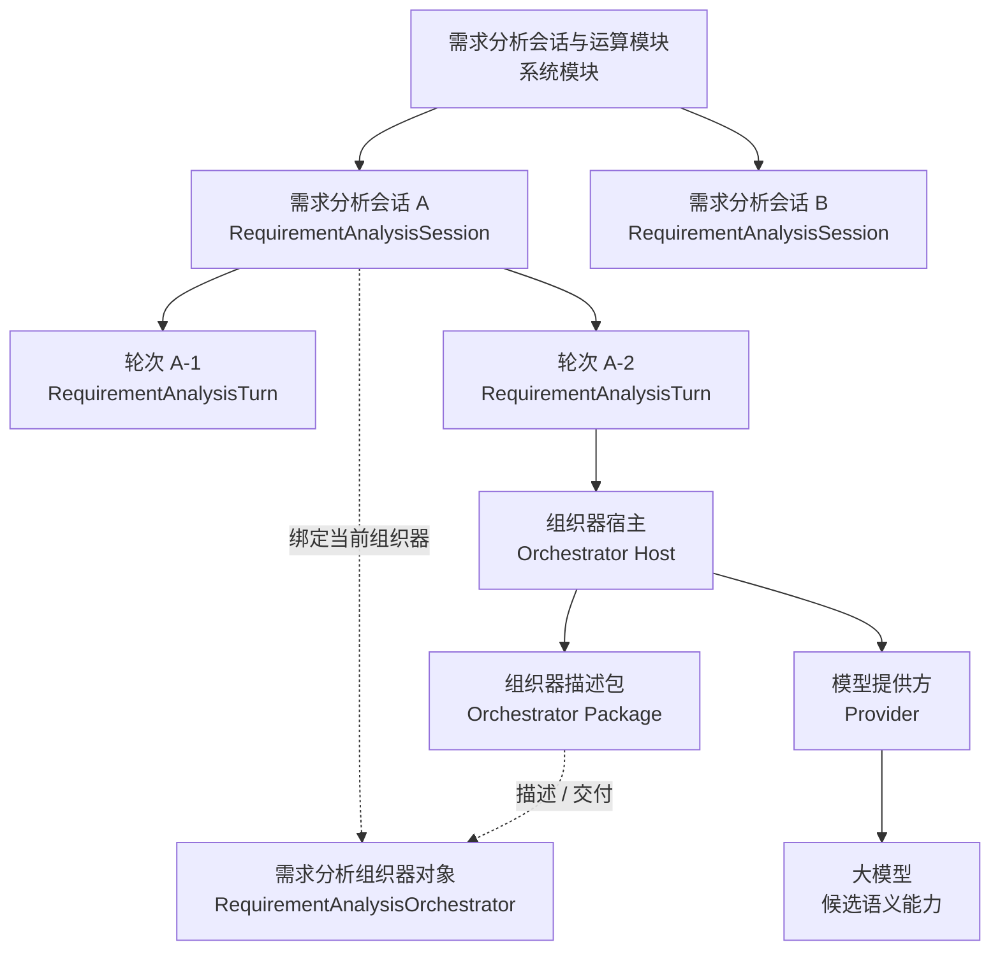
```mermaid
flowchart TB
  Module["需求分析会话与运算模块<br/>系统模块"]
  SessionA["需求分析会话 A<br/>RequirementAnalysisSession"]
  SessionB["需求分析会话 B<br/>RequirementAnalysisSession"]
  TurnA1["轮次 A-1<br/>RequirementAnalysisTurn"]
  TurnA2["轮次 A-2<br/>RequirementAnalysisTurn"]
  Orchestrator["需求分析组织器对象<br/>RequirementAnalysisOrchestrator"]
  Package["组织器描述包<br/>Orchestrator Package"]
  Host["组织器宿主<br/>Orchestrator Host"]
  Provider["模型提供方<br/>Provider"]
  LLM["大模型<br/>候选语义能力"]

  Module --> SessionA
  Module --> SessionB
  SessionA --> TurnA1
  SessionA --> TurnA2
  SessionA -. "绑定当前组织器" .-> Orchestrator
  Host --> Package
  Package -. "描述 / 交付" .-> Orchestrator
  TurnA2 --> Host
  Host --> Provider
  Provider --> LLM
```

从运行关系看：

1. 需求分析会话与运算模块是父级业务模块，可以同时管理多个需求分析会话。
2. 需求分析会话是模块内的长期状态对象；一个会话对应一个需求规格课题，可以包含多轮需求分析轮次。
3. 需求分析轮次是会话内的单轮处理记录；轮次不会脱离会话单独存在。
4. 需求分析组织器对象是会话执行时选用的策略对象；会话绑定它，轮次执行时使用它，但它不保存会话长期状态。
5. 组织器描述包是组织器对象的文件化描述；组织器宿主读取描述包，把策略转化为可执行阶段。
6. 组织器宿主是运行基础设施；它根据轮次上下文和组织器描述包执行阶段，并按阶段需要调用模型提供方。
7. 模型提供方只返回候选理解、候选正文补丁、候选回看和候选下一轮交互；最终采纳结果必须由轮次引擎和组织器策略共同收束。
8. 轮次结果最终回写到需求分析会话，供下一轮继续收敛。

因此，需求分析组织器对象不是“替用户聊天”的能力，而是“把多轮自然输入组织成可审计需求规格补充”的策略能力；需求分析会话与运算模块不是“一个组织器”，而是运行会话、轮次、组织器描述包、宿主和模型提供方的系统模块。

在 `P2` 语境中，需求分析组织器对象（`RequirementAnalysisOrchestrator`）是通用组织器（`Orchestrator`）抽象在需求规格说明领域的业务实例，也可称为需求规格组织器（`XG Orchestrator`）。它只处理需求规格说明收敛，不承担 `P3` 软件设计说明或其他文档类型的组织规则。

该模块不直接写正式需求规格文档。它输出的是可审计的理解结果、规格节点状态和建议补丁。正式写入由需求规格编写模块接收和确认。

该模块必须遵守两个边界：

- `组织器对象` 是轮次处理策略的载体，决定一轮输入分几步处理、哪些阶段调用模型、模型结果如何被采纳。
- `大模型` 是组织器可调用的语义能力，只产生候选理解、候选正文、候选回看和候选下一步，不拥有会话状态和正式文档控制权。

##### 6.6.1.1 运行装载生命周期

运行装载生命周期用于说明“哪些对象先被发现或加载，哪些对象只在会话或轮次中被调用”。它和前面的父子调用关系图不同：父子调用关系图描述静态边界，生命周期图描述运行时顺序。

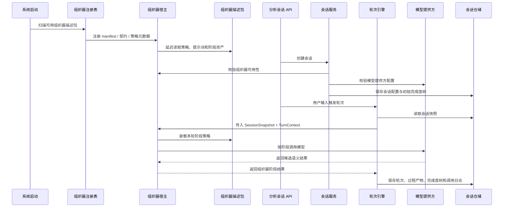
```mermaid
sequenceDiagram
  participant Boot as 系统启动
  participant Registry as 组织器注册表
  participant Host as 组织器宿主
  participant Package as 组织器描述包
  participant API as 分析会话 API
  participant Session as 会话服务
  participant Turn as 轮次引擎
  participant Provider as 模型提供方
  participant Store as 会话仓储

  Boot->>Registry: 扫描可用组织器描述包
  Registry->>Host: 注册 manifest / 契约 / 策略元数据
  Host->>Package: 延迟读取策略、提示词和阶段资产
  API->>Session: 创建会话
  Session->>Host: 校验组织器可用性
  Session->>Provider: 校验模型提供方配置
  Session->>Store: 保存会话配置与初始完成度树
  API->>Turn: 用户输入触发轮次
  Turn->>Store: 读取会话快照
  Turn->>Host: 传入 SessionSnapshot + TurnContext
  Host->>Package: 装载本轮阶段策略
  Host->>Provider: 按阶段调用模型
  Provider-->>Host: 返回候选语义结果
  Host-->>Turn: 返回组织器阶段结果
  Turn->>Store: 保存轮次、过程产物、完成度树和调用日志
```

生命周期约束如下：

| 时点 | 装载 / 调用内容 | 说明 |
| --- | --- | --- |
| 系统启动 | 组织器注册表、组织器描述包元数据 | 只发现和注册可用组织器，不创建会话，不执行模型调用 |
| 会话创建 | 模板、知识包引用、组织器 id、模型提供方配置 | 只建立会话长期状态和初始完成度树，不真正执行组织器阶段 |
| 轮次开始 | 会话快照、上一轮交互对象、本轮用户输入 | 轮次引擎创建轮次并组装 `TurnContext` |
| 组织器执行 | 组织器描述包的阶段策略、提示词和阶段资产 | 组织器通过宿主被调用，只读取上下文并返回候选结果 |
| 模型调用 | 模型提供方 request / response | 只在组织器阶段需要语义能力时发生 |
| 轮次收束 | 候选结果校验、节点投影、过程产物、调用日志 | 轮次引擎决定哪些候选进入会话权威状态 |

因此，不能把父子调用关系图理解成“箭头驱动加载”。真实顺序是：系统先发现组织器能力，会话创建时绑定策略和上下文，轮次执行时才真正装载阶段策略并调用模型提供方。

##### 6.6.1.2 职责与责任划分

需求分析会话与运算模块负责：

- 创建、读取和保存需求分析会话（`RequirementAnalysisSession`）。
- 在会话内按用户输入创建新的需求分析轮次（`RequirementAnalysisTurn`）。
- 装载并执行需求分析组织器对象（`RequirementAnalysisOrchestrator`）。
- 维护完成度树、事实、待确认问题、风险和正文补丁建议。
- 判断本轮用户输入与上一轮交互对象的关系。
- 在单轮次内组织阶段化处理和模型调用。
- 生成当前轮次审计链（`Current Turn`）。
- 生成下一轮交互对象。
- 记录可审计的模型提供方调用日志（`Provider` 调用日志）。

它不负责：

- 决定正式需求规格正文最终是否写入。
- 冻结需求规格文档。
- 修改规格模板。
- 管理模型 API Key 的持久化配置界面。
- 让大模型直接拥有会话状态或正式文档控制权。

责任划分如下：

| 子能力 | 主要对象 | 责任 |
| --- | --- | --- |
| 会话生命周期 | 需求分析会话（`RequirementAnalysisSession`） | 创建会话、保存多轮状态、绑定模板 / 知识 / 组织器对象 / 模型提供方 |
| 单轮执行 | 需求分析轮次（`RequirementAnalysisTurn`）、`TurnEngine` | 以用户输入创建轮次，执行阶段，生成最终轮次结果 |
| 策略组织 | 需求分析组织器对象（`RequirementAnalysisOrchestrator`） | 声明阶段、模型调用、上下文、采纳规则和下一轮交互策略 |
| 包装载与运行 | `OrchestratorHost` | 装载组织器描述包，校验契约，调用模型提供方 |
| 模型适配 | 模型提供方（`Provider`） | 执行模型 API 调用，记录 request / response / 归一化输出 |
| 审计展示 | `TurnAuditService`、`ProviderCallLogService` | 还原本轮决策链和每次模型调用链路 |

#### 6.6.2 状态机设计

状态机设计只回答“有哪些状态、状态由谁拥有、什么事件触发转移、哪些转移合法、失败进入哪里”。它不展开每个状态内部由哪些类执行；执行细化放在后续模块运行编排、会话生命周期和轮次执行章节中。

`P2` 的需求分析能力不能只从“轮次”开始理解。轮次只是一次用户输入触发的单轮处理记录；它上面还有模块级 API 编排和会话级长期状态，下面还有组织器阶段和模型调用。

整体关系如下：

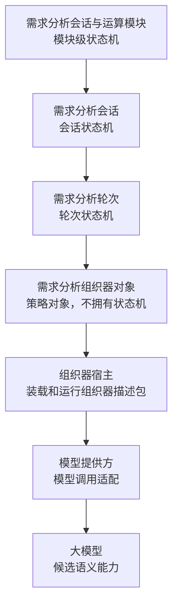
```mermaid
flowchart TB
  Module["需求分析会话与运算模块<br/>模块级状态机"]
  Session["需求分析会话<br/>会话状态机"]
  Turn["需求分析轮次<br/>轮次状态机"]
  Orchestrator["需求分析组织器对象<br/>策略对象，不拥有状态机"]
  Host["组织器宿主<br/>装载和运行组织器描述包"]
  Provider["模型提供方<br/>模型调用适配"]
  Model["大模型<br/>候选语义能力"]

  Module --> Session
  Session --> Turn
  Turn --> Orchestrator
  Orchestrator --> Host
  Host --> Provider
  Provider --> Model
```

##### 6.6.2.1 状态机分层

状态机分为三层：

| 层级 | 管理对象 | 起点 | 终点 | 责任 |
| --- | --- | --- | --- | --- |
| 模块级状态机 | 需求分析会话与运算模块 | 接收会话 API 请求 | 返回会话、轮次、日志或错误 | 校验请求、控制事务、调用会话服务、保证状态落库和审计完整 |
| 会话状态机 | 需求分析会话 | 创建会话并绑定模板、知识、组织器对象和模型提供方 | 会话完成、归档、删除或进入错误状态 | 保存多轮上下文、结构化状态、结构化状态 A4 页、临时正文投影、完成度树投影、下一轮交互对象和模型调用日志 |
| 轮次状态机 | 需求分析轮次 | 会话处于可运行状态且收到一次用户输入 | 本轮结果写回会话并生成下一轮交互对象 | 组装轮次上下文、调用组织器、更新结构化状态、规划下一步交互、渲染状态投影、保存审计链 |

##### 6.6.2.2 状态机与执行设计对应关系

状态机章节与后续执行设计章节必须一一对账。

| 状态机层级 | 本节定义内容 | 后续执行设计章节 | 执行设计展开内容 |
| --- | --- | --- | --- |
| 模块级状态机 | API 请求进入模块后的请求态、事务态和错误态 | 6.6.3 模块运行编排设计 | API 命令如何路由到会话服务、轮次引擎、组织器宿主和仓储 |
| 会话状态机 | 会话从创建、配置、等待输入、运行轮次到完成 / 失败的长期状态 | 6.6.4 会话对象与生命周期设计 | 会话保存哪些字段、哪些服务可写会话状态、轮次结果如何回写 |
| 轮次状态机 | 一次用户输入在 `RunningTurn` 内部如何被处理和审计 | 6.6.5 轮次执行设计 | 轮次上下文、阶段执行、结构化状态应用、投影视图渲染、收束和审计落库 |

因此，本节只定义状态骨架；后续章节再说明骨架中的每个状态怎样落到服务、类、输入输出和持久化。

##### 6.6.2.3 模块级状态机

模块级状态机是一次 API 请求进入需求分析会话与运算模块后的用例状态机。它不是持久化业务对象，但必须约束请求如何进入会话状态机和轮次状态机。

```mermaid
stateDiagram-v2
  [*] --> RequestReceived: 接收 API 请求
  RequestReceived --> RequestValidated: 参数、权限、会话 id 校验
  RequestValidated --> QueryDispatch: 查询类请求
  RequestValidated --> CommandDispatch: 命令类请求
  QueryDispatch --> ReadOnlyLoaded: 读取会话 / 组织器 / 模型提供方
  ReadOnlyLoaded --> ResponseBuilt: 构造查询响应
  CommandDispatch --> TransactionOpened: 打开事务边界
  TransactionOpened --> SessionCommandRunning: 创建 / 配置 / 归档会话
  TransactionOpened --> TurnCommandRunning: 执行一轮需求分析轮次
  SessionCommandRunning --> Persisting: 保存会话长期状态
  TurnCommandRunning --> Persisting: 保存轮次、完成度树、过程产物和日志
  Persisting --> ResponseBuilt: 构造命令响应
  RequestValidated --> ErrorMapped: 参数或状态不合法
  TransactionOpened --> ErrorMapped: 事务内失败
  SessionCommandRunning --> ErrorMapped: 会话命令失败
  TurnCommandRunning --> ErrorMapped: 轮次执行失败
  ErrorMapped --> ResponseBuilt: 错误码和审计摘要
  ResponseBuilt --> [*]
```

模块级状态机的核心约束：

- 查询类请求只能读取状态，不能触发组织器阶段或模型调用。
- 命令类请求必须进入事务边界，不能半写会话状态。
- 创建会话只进入会话状态机，不执行轮次状态机。
- 执行轮次必须先确认会话处于可运行状态，再进入轮次状态机。
- 组织器输出失败、模型调用失败或契约校验失败，必须被映射为明确错误或阻断结果，不能让前端拿到半成品状态。

##### 6.6.2.4 会话状态机

会话状态机的目标状态如下：

```mermaid
stateDiagram-v2
  [*] --> Created: 创建会话
  Created --> Configured: 绑定模板 / 知识 / 组织器 / 模型提供方
  Configured --> ExplorationConvergence: 初始化结构化状态与投影视图
  ExplorationConvergence --> RunningTurn: 收到用户输入
  RunningTurn --> ExplorationConvergence: 探索阶段轮次完成
  ExplorationConvergence --> DraftEntryConfirmation: 系统判断可成稿 / 用户要求成稿
  DraftEntryConfirmation --> ExplorationConvergence: 用户取消，继续探索
  DraftEntryConfirmation --> DraftGeneration: 用户确认并冻结状态快照
  DraftGeneration --> DraftReview: 成稿与正文校核通过
  DraftGeneration --> Error: 成稿失败且需阻断
  DraftReview --> ExplorationConvergence: 用户要求回到探索阶段补充
  DraftReview --> Completed: 草案被接受或进入后续流程
  ExplorationConvergence --> Archived: 人工归档
  RunningTurn --> Error: 组织器或模型调用失败且需阻断
  Error --> ExplorationConvergence: 人工重试或恢复
```

会话状态机的核心约束：

- `Created` 和 `Configured` 用于区分“会话对象已存在”和“可进入探索阶段”的状态。
- `ExplorationConvergence` 是开放式需求分析主阶段；只有该状态可以正常接收新的用户输入。
- `RunningTurn` 是会话状态，不是轮次状态；它表示会话正在被某一轮占用。
- `DraftEntryConfirmation` 负责确认是否冻结当前结构化状态快照并进入成稿。
- `DraftGeneration` 和 `DraftReview` 属于受控生成阶段，不再承担开放式需求探索。
- `Completed` 和 `Archived` 不再接收新的轮次，除非后续定义显式恢复动作。

##### 6.6.2.5 轮次状态机

轮次状态机只在会话状态 `RunningTurn` 内部运行。它的目标不是管理整个会话，也不是包装一次模型调用，而是把一次用户输入变成一次可审计、可回放、可回退的结构化状态推进闭环。

一轮需求分析轮次可以包含多个组织器阶段和多次模型调用。探索与收束阶段的目标态标准调用链为：

```text
intent_understanding
  -> decision_state_delta
    -> system_apply_decision_state
      -> next_interaction_planning
        -> system_render_state_views
```

该设计的核心目标是把语义判断从 Python、前端页面和固定规则树中移出，交由阶段化模型调用完成；同时把结构化状态应用、A4 结构化状态页渲染、临时正文投影和完成度树投影明确为系统动作，而不是再让模型承担“写了多少正文就算推进”的职责。

```mermaid
stateDiagram-v2
  [*] --> TurnCreated: 创建轮次记录
  TurnCreated --> ContextPrepared: 读取会话快照和上一轮交互对象
  ContextPrepared --> StrategyLoaded: 装载当前组织器策略
  StrategyLoaded --> StagePlanReady: 解析阶段计划
  StagePlanReady --> IntentStageRunning: 意图理解
  IntentStageRunning --> IntentReady: 得到意图理解结果
  IntentReady --> DecisionDeltaRunning: 决策增量生成
  DecisionDeltaRunning --> DecisionDeltaReady: 得到结构化增量
  DecisionDeltaReady --> DecisionStateApplied: 应用到结构化状态
  DecisionStateApplied --> NextInteractionPlanningRunning: 下一步交互规划
  NextInteractionPlanningRunning --> NextInteractionPlanReady: 得到交互规划结果
  NextInteractionPlanReady --> StateViewsRendered: 渲染结构化状态 A4、临时正文投影和完成度树投影
  StateViewsRendered --> Projected: 投影到规格收敛状态
  Projected --> DecisionBuilt: 校验并采用闭环判断
  DecisionBuilt --> Finalized: 收束本轮结果
  Finalized --> Persisted: 回写会话与审计日志
  IntentStageRunning --> StageFailedFatal: 意图模型失败或输出非法
  DecisionDeltaRunning --> StageFailedFatal: 阶段不可恢复失败
  NextInteractionPlanningRunning --> StageFailedFatal: 规划模型失败或输出非法
  StageFailedFatal --> Persisted: 保存错误审计
  Persisted --> [*]
```

其中，`IntentStageRunning`、`DecisionDeltaRunning` 和 `NextInteractionPlanningRunning` 都是阶段运行状态，不等同于模型调用状态。每个模型阶段内部还应遵守以下子状态：

```text
StageQueued
  -> StageInputBuilt
    -> ModelCallRunning
      -> StageOutputReceived
        -> StageOutputValidated
          -> StageAuditAttached
```

阶段子状态的设计含义如下：

| 子状态 | 说明 | 是否允许调用模型 |
| --- | --- | --- |
| `StageQueued` | 阶段进入执行队列，等待构造输入 | 否 |
| `StageInputBuilt` | 根据会话快照、轮次上下文和上一阶段输出构造阶段输入 | 否 |
| `ModelCallRunning` | 通过模型提供方执行阶段调用 | 是 |
| `StageOutputReceived` | 得到模型候选输出 | 否 |
| `StageOutputValidated` | 按阶段 schema 校验和归一化候选输出 | 否 |
| `StageAuditAttached` | 生成阶段审计并关联本阶段模型调用日志 | 否 |

轮次状态机的核心约束：

- 轮次起点永远是本轮用户输入，上一轮交互对象只是上下文。
- 组织器阶段只允许在阶段运行状态中被调用，不能绕过 `TurnEngine` 直接写会话。
- 模型调用只允许发生在组织器声明的阶段中。
- `intent_understanding` 负责判断用户真实意图、输入类型和下游任务候选；代码不得用固定规则替代该判断。
- `decision_state_delta` 只能基于已采纳的意图理解结果、会话结构化状态、模板投影和上下文约束生成结构化决策增量；不得重新主导意图判断。
- `DecisionStateApplied` 是系统动作，不是模型阶段；它负责把结构化增量合法地并入会话权威状态。
- `StateViewsRendered` 也是系统动作；结构化状态 A4 页、临时正文投影和完成度树投影应优先由系统渲染，不作为探索阶段固定模型调用。
- `next_interaction_planning` 必须晚于结构化状态应用，并综合当前结构化状态、规格投影和用户沟通负担规划下一轮交互。
- `DecisionBuilt` 只校验和采用 `next_interaction_planning` 的结果，不再由规则树机械生成最终下一题。
- 模型不可用、阶段输出无法解析、阶段 schema 校验失败或语义结果与硬事实冲突时，本轮必须阻断并保存错误审计；不得用“输入较长”“active 节点缺口”等服务端猜测继续生成正文。
- 只有 `Persisted` 完成后，会话才能从 `RunningTurn` 回到 `ExplorationConvergence`。

##### 6.6.2.6 状态机边界

状态机拥有者与被调用对象必须分开。

| 对象 | 是否拥有状态机 | 状态机角色 | 边界 |
| --- | --- | --- | --- |
| 需求分析会话与运算模块 | 是 | 拥有模块级请求状态机 | 负责 API 用例编排、事务、错误映射和审计完整性 |
| 需求分析会话 | 是 | 拥有会话长期状态机 | 保存多轮上下文、完成度树、事实、问题、patch、下一轮交互对象和模型调用日志 |
| 需求分析轮次 | 是 | 拥有单轮执行状态机 | 记录一次用户输入如何被处理、哪些阶段被执行、哪些结果被采纳 |
| 需求分析组织器对象 | 否 | 被轮次状态机调用的策略对象 | 声明阶段、模型调用、采纳规则和下一轮交互策略，不保存会话权威状态 |
| 组织器宿主 | 否 | 被组织器运行子模块调用的基础设施 | 装载组织器描述包、组装阶段请求、代组织器调用模型提供方 |
| 模型提供方 | 否 | 被组织器阶段调用的适配能力 | 管理 base URL、model、request / response、基础解析和调用错误 |

由此得到三个基本原则：

1. 会话状态机属于需求分析会话与运算模块，不属于组织器。
2. 组织器需要读取当前轮次上下文，但不拥有当前轮次。
3. 大模型只提供候选语义能力；候选结果能否进入会话状态，必须由组织器策略和轮次引擎共同约束。

#### 6.6.3 模块运行编排设计

模块运行编排设计对应 6.6.2.3 的模块级状态机，回答“一次 API 请求进入模块后，怎样被路由、事务化、调用下级服务并返回结果”。它不描述会话字段细节，也不描述轮次内部阶段细节。

模块级入口分为四类：

| 入口类型 | API / 命令 | 是否进入事务 | 是否进入会话状态机 | 是否进入轮次状态机 |
| --- | --- | --- | --- | --- |
| 能力查询 | `ListOrchestratorsQuery`、`ListProvidersQuery` | 否 | 否 | 否 |
| 会话查询 | `GetAnalysisSessionQuery` | 否 | 只读取 | 否 |
| 会话命令 | `CreateAnalysisSessionCommand`、归档 / 恢复命令 | 是 | 是 | 否 |
| 轮次命令 | `RunTurnCommand` | 是 | 是 | 是 |

模块运行编排如下：

```mermaid
sequenceDiagram
  participant API as 分析会话 API
  participant App as SessionApplicationService
  participant Session as SessionService
  participant Turn as TurnEngine
  participant Runtime as PolicyInterpretedRuntime
  participant Strategy as TurnStrategyService
  participant Stage as TurnStageExecutor
  participant Doc as WorkingDocumentService
  participant Provider as ProviderCallService
  participant Decision as TurnDecisionService
  participant Repo as SessionRepository

  API->>App: 接收查询或命令
  App->>App: 参数校验和错误映射
  alt 查询类请求
    App->>Session: 读取会话或能力清单
    Session->>Repo: 只读查询
    Repo-->>Session: 会话 / 组织器 / 模型提供方信息
    Session-->>App: 查询 DTO
  else 创建或配置会话
    App->>Session: 创建 / 配置会话
    Session->>Strategy: 校验组织器描述包可用
    Session->>Provider: 校验模型提供方配置可用
    Session->>Repo: 保存会话状态
    Session-->>App: 会话详情
  else 执行轮次
    App->>Session: 读取会话快照
    Session->>Turn: 执行轮次状态机
    Turn->>Runtime: 通过插件 adapter 调用策略解释型运行时
    Runtime->>Strategy: 解析组织器阶段计划
    Strategy-->>Runtime: 阶段列表与采纳策略
    Runtime->>Stage: 执行 intent_understanding 阶段
    Stage->>Provider: 调用意图理解模型
    Provider-->>Stage: 意图候选输出与调用审计
    Stage-->>Runtime: 意图理解、目标结构、阶段任务和质量约束
    Runtime->>Runtime: 按 output_targets 写入 StageOutputSlots
    Runtime->>Stage: 执行 decision_state_delta 阶段
    Stage->>Provider: 调用决策增量模型
    Provider-->>Stage: 决策状态增量候选与调用审计
    Stage-->>Runtime: 决策状态增量与投影候选
    Runtime->>Runtime: 校验并应用结构化状态增量
    Runtime->>Stage: 执行 next_interaction_planning 阶段
    Stage->>Provider: 调用交互规划模型
    Provider-->>Stage: 交互规划候选输出与调用审计
    Stage-->>Runtime: 下一步交互规划结果
    Runtime->>Doc: 渲染结构化状态 A4 页、临时正文投影和完成度树投影
    Doc-->>Runtime: 状态投影视图
    Runtime->>Decision: 校验并采用交互规划结果
    Decision-->>Runtime: 闭环判断与下一轮交互对象
    Runtime-->>Turn: TurnExecutionResult
    Turn-->>Session: 最终轮次结果和状态变化
    Session->>Repo: 原子保存会话、轮次和日志
    Session-->>App: 更新后的会话详情
  end
  App-->>API: 返回 DTO 或错误码
```

模块编排写入边界如下：

| 编排动作 | 可写对象 | 禁止写入 |
| --- | --- | --- |
| 创建会话 | 会话配置、初始完成度树、初始下一轮交互对象 | 正式需求规格文档正文 |
| 执行轮次 | 会话状态、轮次记录、完成度树、过程产物、模型调用日志 | 模板定义、冻结包、正式文档正文 |
| 归档会话 | 会话状态、更新时间 | 轮次历史、模型调用日志内容 |
| 查询能力 | 无写入 | 所有业务状态 |

模块级错误处理原则：

- 参数错误、会话不存在、组织器不可用、模型提供方不可用应在模块级映射为稳定错误码。
- 轮次内部阶段失败必须保存可审计摘要，不能丢失已发生的模型调用日志。
- 轮次内部多阶段调用不得被模块级接口暴露为多个外部 API 请求；外部仍只看到一次 `RunTurnCommand`。
- 会话服务只接收轮次引擎最终 `TurnExecutionResult`，不能在阶段中途把半成品状态写入会话权威状态。
- 语义阶段失败不得用模块级规则兜底继续推进；模块级职责是返回错误、保存审计并阻断本轮，而不是替模型做语义判断。
- 事务失败时不得部分保存完成度树或过程产物。
- 查询类请求不得触发模型调用。

#### 6.6.4 会话对象与生命周期设计

需求分析会话是长期状态对象，不是某一轮执行对象。轮次结束后，轮次结果必须回写到会话；组织器读取的是会话快照，而不是持有会话本体。

会话至少保存：

- 课题、模板、知识包、组织器对象和模型提供方绑定。
- 会话内临时正文及其回看状态。
- 当前完成度树、当前活动节点、事实、问题、patch、风险。
- 消息历史、轮次历史、下一轮交互对象。
- 组织器自身可序列化状态和模型调用日志。

会话属性分组如下：

| 属性组 | 字段 | 说明 |
| --- | --- | --- |
| 身份与配置 | `session_id`、`topic`、`status`、`template_id`、`knowledge_package_id`、`provider_id`、`model`、`write_policy` | 决定会话服务于哪个需求规格课题，以及使用哪套模板、知识、组织器和模型提供方 |
| 组织器绑定 | `orchestrator_id`、`orchestrator_state`、`strategy_version` | 表示当前会话选用的组织器对象和可序列化策略状态 |
| 临时正文状态 | `working_document` | 会话内临时正文，包括连续正文块、修订片段、来源 patch、来源 turn 和最近回看状态 |
| 规格收敛状态 | `spec_tree`、`active_spec_node_id`、`artifacts`、`next_interaction` | 表示会话当前推进到哪里、已确认什么、还缺什么、下一轮建议怎么继续 |
| 历史与审计 | `messages`、`turns`、`provider_call_logs`、`created_at`、`updated_at` | 保存对话展示、轮次审计和模型调用审计 |

会话给组织器提供只读会话快照（`SessionSnapshot`）。该快照用于让组织器知道当前上下文，但不能让组织器直接修改会话权威状态。

```text
SessionSnapshot
  session_id
  topic
  template_id
  knowledge_package_id
  working_document
  spec_tree
  artifacts
  previous_interaction
  recent_turn_summaries[]
```

会话中的 `orchestrator_state` 只保存组织器可序列化状态，例如偏好、阶段游标或启发式策略参数。它不是会话权威状态，也不能绕过轮次引擎直接修改完成度树。

会话状态写入规则：

- 只有会话服务和轮次引擎可以更新会话权威状态。
- 组织器只能读取 `SessionSnapshot`，返回候选阶段结果。
- 模型提供方只能记录模型调用输入输出，不写会话状态。
- Lab 会话不得直接写正式需求规格文档；若进入专家工作台，必须通过 `document_patch` 接收和确认机制进入 `RequirementAuthoringDocument`。

会话生命周期与类的对应关系如下：

| 生命周期动作 | 入口类 / 服务 | 主要写入对象 | 说明 |
| --- | --- | --- | --- |
| 创建会话 | `SessionApplicationService`、`SessionService` | `RequirementAnalysisSession` | 校验模板、知识包、组织器和模型提供方，生成初始会话 |
| 初始化完成度树 | `SessionService`、`SpecTreeService` | `spec_tree`、`active_spec_node_id` | 根据模板结构生成会话内的规格完成度树 |
| 初始化临时正文 | `SessionService`、`WorkingDocumentService` | `working_document` | 根据模板和会话课题生成临时正文骨架 |
| 读取会话快照 | `SessionService.load_snapshot` | 无写入 | 为轮次引擎和组织器提供只读 `SessionSnapshot` |
| 回写轮次结果 | `TurnEngine`、`SessionService` | `turns`、`working_document`、`spec_tree`、`artifacts`、`next_interaction`、`provider_call_logs` | 把单轮结果合并回会话长期状态 |
| 归档或完成 | `SessionService` | `status`、`updated_at` | 会话停止继续收敛，但不影响正式需求规格文档 |

##### 6.6.4.1 规格收敛状态对象

规格收敛状态对象是需求分析会话内部的运行态对象，用于描述当前会话距离“可形成需求规格说明补充”的状态。它不是需求规格模板，也不是正式需求规格正文。

模板提供静态结构，规格收敛状态对象提供运行态进度：

| 对象 | 归属 | 性质 | 说明 |
| --- | --- | --- | --- |
| 需求规格模板 | 需求规格配置模块 | 静态配置 | 定义章节、条款、字段、缺口规则和问答策略 |
| 会话内临时正文（`working_document`） | 需求分析会话 | 运行态正文 | 保存当前会话已经写出的连续正文块、修订片段、来源 patch 和回看结果，是本轮闭环判断的第一证据面 |
| 需求规格完成度树（`spec_tree`） | 需求分析会话 | 运行态状态 | 根据模板章节和条款生成，记录每个规格节点的状态、摘要和最近影响轮次 |
| 当前活动节点（`active_spec_node_id`） | 需求分析会话 | 运行态指针 | 表示当前默认工作焦点，不是强制解释框架 |
| 过程产物（`artifacts`） | 需求分析会话 | 运行态过程结果 | 保存事实、待确认问题、正文补丁、风险等过程信息 |
| 下一轮交互对象（`next_interaction`） | 需求分析会话 | 运行态交互建议 | 保存下一轮建议问题、选项或空等待状态 |

这些对象共同构成会话的“规格收敛状态”。其中，`working_document` 是正文证据面，`spec_tree` 是结构主轴，`active_spec_node_id` 是默认焦点，`artifacts` 是过程内容，`next_interaction` 是下一轮交互出口。

设计约束如下：

- `spec_tree` 由模板结构初始化，但一旦进入会话，就是会话状态，不再等同于模板。
- `working_document` 只属于 Lab 会话，不等同于正式需求规格文档。
- `working_document` 以连续正文块和修订片段组织，不以章节卡片作为主存储结构。
- `active_spec_node_id` 只能作为默认焦点，不能把用户输入强行解释为该节点答案。
- `artifacts` 可以引用 `spec_tree` 节点，也可以暂时进入未绑定补充队列。
- `next_interaction` 可以指向某个 `spec_tree` 节点，也可以是自由建议或空等待。
- 正式需求规格文档是否接收这些结果，仍由需求规格编写模块决定。

#### 6.6.5 轮次执行设计

轮次阶段化执行闭环只描述会话状态 `RunningTurn` 内部的处理过程，不是完整系统状态机。完整状态机已经在 6.6.2 中定义；本节只回答“一次用户输入进入既有会话后，本轮怎样被处理、审计并回写会话”。

轮次是单轮执行和审计对象。它不保存长期记忆，也不脱离需求分析会话单独存在。每次用户输入都会创建新的轮次；轮次执行结束后，最终结果回写到会话。

轮次不是“一次模型调用”的同义词。轮次是用户输入触发的一次业务闭环；模型调用是轮次内部语义判断和规划能力的来源。目标态需求分析组织器在探索与收束阶段的一轮 `turn` 通常包含三次模型调用：意图理解、决策状态增量生成、下一步交互规划；结构化状态应用、结构化状态 A4 页渲染、临时正文投影和完成度树投影属于系统动作。

探索阶段三调用链的核心目标是避免服务端用硬编码语义规则替代模型判断。服务端可以整理硬事实、构造上下文、校验 schema、应用结构化状态增量、渲染投影视图、持久化和记录审计；服务端不得用 `if/else` 直接决定用户真实意图、决策是否成立、下一轮应该问什么、是否应该跳题或推进。

轮次属性分组如下：

| 属性组 | 字段 | 说明 |
| --- | --- | --- |
| 身份与输入 | `turn_id`、`session_id`、`turn_index`、`previous_interaction`、`user_input`、`normalized_input` | 标识本轮属于哪个会话、是第几轮、用户输入是什么 |
| 上下文判断 | `input_relation`、`turn_context`、`active_spec_node_id` | 记录服务端整理出的硬事实和本轮上下文证据，不替代模型意图理解 |
| 阶段任务 | `intent_understanding_result`、`target_document_structure`、`stage_task_definition`、`stage_quality_constraints` | 保存 `intent_understanding` 阶段输出的意图理解、目标文档结构、正式写作任务和质量约束 |
| 阶段执行 | `stage_results`、`stage_audits`、`provider_call_logs`、`strategy_version` | 保存探索阶段三次模型调用结果、阶段审计和模型调用审计引用 |
| 规格补充 | `turn_interpretation`、`spec_execution`、`post_update_review` | 记录本轮如何理解输入、更新结构化状态、渲染投影视图以及形成闭环判断 |
| 收束结果 | `next_interaction_plan`、`closure_decision`、`next_interaction`、`decision_trace`、`created_at` | 记录模型规划的下一步交互、服务端采用结果、闭环判断和关键决策依据 |

```mermaid
flowchart TB
  A["创建轮次记录<br/>TurnCreated"]
  B["准备轮次上下文<br/>ContextPrepared"]
  C["装载组织器策略<br/>StrategyLoaded"]
  D["解析阶段计划<br/>StagePlanReady"]
  E["模型阶段 1：意图理解<br/>intent_understanding"]
  F["阶段输出槽位采纳<br/>StageOutputSlots"]
  G["模型阶段 2：决策状态增量生成<br/>decision_state_delta"]
  H["系统动作：应用结构化状态增量<br/>DecisionStateApplied"]
  I["模型阶段 3：下一步交互规划<br/>next_interaction_planning"]
  J["系统动作：渲染结构化状态与投影视图<br/>StateViewsRendered"]
  K["投影并采用闭环判断<br/>Projected / DecisionBuilt"]
  L["收束本轮结果<br/>Finalized"]
  M["回写会话与审计日志<br/>Persisted"]

  A --> B --> C --> D --> E --> F --> G --> H --> I --> J --> K --> L --> M
```

该闭环服务于三个目标：

- 让组织器行为可审计。
- 让不同组织器遵守同一输入输出契约。
- 让模型调用只出现在明确阶段中，避免把“组织器策略”退化成一次大模型黑盒输出。

轮次状态与阶段职责如下：

| 轮次状态 | 主要阶段 | 归属 | 是否调用模型 | 输出 |
| --- | --- | --- | --- | --- |
| `TurnCreated` | 创建轮次编号和初始审计记录 | 轮次引擎 | 否 | `turn_id`、`turn_index`、初始状态 |
| `ContextPrepared` | 读取会话快照、归一化用户输入、解析上一轮交互对象、整理硬事实证据 | 轮次引擎 + 输入处理服务 | 否 | `SessionSnapshot`、`TurnContext`、`server_precheck` |
| `StrategyLoaded` | 装载组织器描述包并解析本轮策略 | 组织器宿主 + 组织器对象 | 否 | `XGTurnStrategy` |
| `StagePlanReady` | 将组织器策略解析为阶段计划，包括阶段顺序、输入依赖、调用方式和采纳策略 | 轮次引擎 + 策略服务 | 否 | `TurnStagePlan` |
| `IntentStageRunning` | 执行意图理解阶段，判断用户真实意图、输入类型、与上一轮关系和任务候选 | 意图理解服务 + 模型提供方 | 是 | `IntentUnderstandingResult` |
| `TaskDefined` | 从 `intent_understanding` 阶段输出中采纳目标文档结构、阶段任务定义和质量约束 | 策略解释型运行时 + 阶段归并器 | 否 | `TargetDocumentStructure`、`StageTaskDefinition`、`StageQualityConstraints` |
| `DecisionDeltaRunning` | 按正式任务定义生成结构化状态增量、事实候选、问题候选和章节投影候选 | 阶段执行器 + 模型提供方 | 是 | `TurnStageResult(decision_state_delta)` |
| `DecisionStateApplied` | 将决策状态增量应用到会话内权威结构化状态 | 决策状态服务 + 轮次引擎 | 否 | `decision_state`、`decision_state_change_summary` |
| `NextInteractionPlanningRunning` | 基于更新后的结构化状态、目标文档结构和沟通负担生成下一步交互规划 | 阶段执行器 + 模型提供方 | 是 | `NextInteractionPlan` |
| `StateViewsRendered` | 将结构化状态渲染为 A4 状态页、临时正文投影和完成度树投影 | 决策状态服务 + 临时正文服务 + 规格树服务 | 否 | `decision_state_document`、`working_document`、`spec_tree` |
| `Projected` | 基于结构化状态变化和规划结果投影规格节点、更新完成度树和过程产物候选 | 轮次引擎 + 规格投影服务 | 否 | `projected_nodes`、`state_changes`、`document_patches` |
| `DecisionBuilt` | 校验并采用下一步交互规划，生成闭环判断和决策链 | 轮次引擎 + 决策服务 + 审计服务 | 否 | `closure_decision`、`next_interaction`、`decision_trace` |
| `Finalized` | 采纳 / 修正候选结果，形成最终轮次结果 | 轮次引擎 | 否 | `RequirementAnalysisTurnResult` |
| `Persisted` | 保存轮次、过程产物、临时正文、完成度树和模型调用日志 | 会话服务 + 仓储 | 否 | 更新后的需求分析会话 |

轮次阶段与类职责映射如下：

| 轮次阶段 | 主责类 / 服务 | 协作类 / 服务 | 写入边界 |
| --- | --- | --- | --- |
| `TurnCreated` | `TurnEngine` | `SessionService` | 只创建轮次初始记录，不修改完成度树 |
| `ContextPrepared` | `TurnContextBuilder` | `InputNormalizer`、`InputRelationClassifier`、`SessionService` | 只生成 `TurnContext`，不采纳业务结果 |
| `StrategyLoaded` | `TurnStrategyService` | `OrchestratorHost`、`ContractValidator` | 只读取组织器策略，不写会话状态 |
| `StagePlanReady` | `TurnStagePlanner`、`TurnStrategyService` | `OrchestratorHost`、`ContractValidator` | 只生成阶段计划，不执行模型调用 |
| `IntentStageRunning` | `TurnStageExecutor` | `StageRuntimeContextBuilder`、`ProviderCallService`、`OrchestratorHost`、`TurnStageReducer` | 只产生意图理解、目标文档结构、阶段任务定义、质量约束和阶段日志 |
| `TaskDefined` | `TurnStageReducer`、`StageOutputSlots` | `StageRuntimeContextBuilder` | 只将已通过契约的阶段输出采纳为后续槽位，不调用模型、不写正文 |
| `DecisionDeltaRunning` | `TurnStageExecutor` | `ProviderCallService`、`StageRuntimeContextBuilder`、`OrchestratorHost`、`TurnStageReducer` | 只产生结构化状态增量候选和正文投影候选，不直接写会话状态 |
| `DecisionStateApplied` | `DecisionStateService`、`TurnEngine` | `TurnOutputService` | 只将已通过契约校验的增量并入结构化状态，不直接持久化会话 |
| `NextInteractionPlanningRunning` | `TurnStageExecutor` | `StageRuntimeContextBuilder`、`ProviderCallService`、`TurnAuditService` | 生成下一步交互规划，不修改结构化状态 |
| `StateViewsRendered` | `DecisionStateService`、`WorkingDocumentService`、`SpecTreeService` | `TurnOutputService` | 只刷新状态投影视图，不重新解释用户意图 |
| `Projected` | `SpecProjectionService` | `SpecTreeService`、`ProcessArtifactService` | 基于结构化状态变化和规划结果生成待采纳的节点投影和过程产物变化 |
| `DecisionBuilt` | `TurnDecisionService`、`TurnAuditService` | `SpecProjectionService`、`DecisionStateDelta`、`NextInteractionPlan` | 校验和采用闭环判断、下一轮交互和决策依据 |
| `Finalized` | `TurnEngine` | `ProviderCallLogService` | 形成最终 `RequirementAnalysisTurnResult` |
| `Persisted` | `SessionService`、`SessionRepository` | `ProviderCallLogService` | 回写会话长期状态和审计日志 |

轮次写入规则：

- `TurnEngine` 是单轮执行的唯一收束者，组织器和模型提供方不能直接写会话仓储。
- `TurnContextBuilder` 只组装上下文和硬事实证据，不负责解释用户真实意图。
- `intent_understanding` 阶段输出是用户意图、输入类型、承接关系和任务候选的唯一语义来源。
- `StageOutputSlots` 只把已采纳的意图理解阶段输出暴露给后续阶段，不重新判断用户想干什么。
- `WorkingDocumentService` 只维护会话内临时正文投影，不写正式需求规格文档。
- `DecisionStateService` 是结构化状态和结构化状态 A4 页的权威维护者；它负责增量合法化、状态合并和状态文档渲染。
- `SpecProjectionService` 只生成节点投影和候选状态变化，最终采纳必须由 `TurnEngine` 完成。
- `ProviderCallService` 只记录模型调用事实，不能决定 `closure_decision`。
- `TurnAuditService` 只构造审计视图，不反向改变轮次结果。
- `TurnStageReducer` 只负责阶段结果归并与字段采纳，不负责会话持久化。
- `TurnDecisionService` 只校验和采用 `NextInteractionPlan`，不通过固定规则生成下一轮主问题或快捷选项。

轮次内部代码必须硬编码的规则如下：

| 规则 | 是否允许组织器覆盖 | 原因 |
| --- | --- | --- |
| 用户输入是轮次起点 | 否 | 防止系统退化为固定问卷，上一轮留题只能作为上下文 |
| 阶段必须按计划顺序执行 | 否 | 保证审计链可回放 |
| 阶段输出必须通过契约校验 | 否 | 保证不同组织器可替换 |
| 每次模型调用必须产生独立 Provider 日志 | 否 | 保证可审计 |
| 下一轮交互必须晚于结构化状态应用 | 否 | 防止模型基于旧状态匆忙跳题 |
| 模型语义阶段失败后阻断本轮 | 否 | 防止服务端猜测替代模型理解 |
| 具体问题措辞、状态增量内容、选项内容、是否继续当前缺口 | 是 | 这是阶段模型、组织器策略和提示词的职责 |

##### 6.6.5.1 轮次内模型调用策略

一轮需求分析轮次可以包含一次或多次模型调用，调用次数由组织器声明。`P2` 启发式需求规格组织器在探索与收束阶段的目标态使用 `decision_state_loop` 策略，即三个语义模型阶段加系统状态应用 / 渲染动作完整覆盖一轮需求分析闭环。

可支持的执行策略如下：

| 策略 | 模型调用次数 | 定位 | 适用范围 |
| --- | --- | --- | --- |
| `decision_state_loop` | 3 次 | 探索阶段目标态启发式策略 | 意图理解、决策状态增量生成、下一步规划全部由阶段模型完成，状态应用和投影视图渲染由系统完成 |
| `remote_service_pipeline` | 由远端组织器决定 | 外部组织器策略 | 远端组织器必须返回同一阶段契约和审计材料 |

启发式组织器的标准流程如下：

```mermaid
flowchart TB
  A["接收用户输入<br/>系统状态机"]
  B["整理上下文与硬事实证据<br/>TurnContext / server_precheck"]
  C["模型调用 1：意图理解<br/>IntentUnderstandingResult"]
  D["生成目标文档结构、任务定义和质量约束<br/>TaskDefinition"]
  E["模型调用 2：决策状态增量<br/>decision_state_delta"]
  F["服务端应用结构化状态增量<br/>decision_state"]
  G["模型调用 3：下一步交互规划<br/>NextInteractionPlan"]
  H["服务端渲染结构化状态与投影视图<br/>state views"]
  I["服务端校验采用、投影、持久化<br/>TurnExecutionResult"]

  A --> B --> C --> D --> E --> F --> G --> H --> I
```

该流程的关键约束：

- `intent_understanding` 是本轮语义任务来源，不能由 `write` 阶段临时猜测替代。
- `decision_state_delta` 只负责把意图理解结果和当前结构化状态转成可应用的结构化状态增量，不生成最终下一题。
- 服务端必须先把通过契约校验的结构化状态增量应用到 `decision_state`，再进入 `next_interaction_planning`。
- `next_interaction_planning` 综合更新后的结构化状态、整体文档结构和用户沟通负担，生成下一步交互计划。
- 结构化状态 A4 页、临时正文和完成度树是系统投影视图，不是探索阶段语义模型调用。
- `next_interaction` 是服务端校验并采用 `NextInteractionPlan` 后的结果，不是规则树机械生成。
- 每次模型调用都必须生成独立的模型调用日志（`ProviderCallLog`），并记录各自的 `provider_request / provider_response / provider_normalized_output / service_output`。
- 任一语义模型阶段不可用、输出无法解析或违反阶段契约，本轮必须阻断并保存错误审计；不得用模板缺口、active 节点或输入长度规则替代模型结果继续推进。

轮次内多阶段调用的输入输出关系如下：

| 阶段 | 输入 | 输出 | 后续阶段是否可见 |
| --- | --- | --- | --- |
| `intent_understanding` | `IntentStageContext`：用户输入、上一轮交互、快捷选项、结构化状态摘要、临时正文投影摘要、规格树摘要、硬事实证据 | `IntentUnderstandingResult`：用户意图、输入类型、承接关系、目标章节候选、任务候选 | `TaskDefined`、`decision_state_delta`、`next_interaction_planning` 可见 |
| `TaskDefined` | `IntentUnderstandingResult`、模板、规格树、结构化状态、组织器策略 | `TargetDocumentStructure`、`ChapterConfigurationContext`、`StageTaskDefinition`、`StageQualityConstraints` | `decision_state_delta`、`next_interaction_planning` 可见 |
| `decision_state_delta` | `StageRuntimeContext(decision_state_delta)`：意图结果、当前结构化状态、目标结构、章节配置上下文、任务定义、质量约束、投影视图摘要 | `DecisionStateDelta`：事实、决策、假设、未闭合问题、否定方向、章节投影和候选下一步关注点；可选输出临时正文投影候选 | `apply_decision_state`、`next_interaction_planning`、`project` 可见 |
| `apply_decision_state` | `DecisionStateDelta`、当前 `decision_state`、目标锚点和硬事实证据 | 更新后的 `decision_state`、`decision_state_change_summary` | `next_interaction_planning`、`project`、`render_state_views` 可见 |
| `next_interaction_planning` | `StageRuntimeContext(next_interaction_planning)`：更新后的结构化状态、整体文档结构、完成度树、用户沟通约束 | `NextInteractionPlan`：下一步策略、用户说明、主问题、快捷选项、规划理由 | `decide` 可见 |
| `render_state_views` | 更新后的结构化状态、模板结构、临时正文投影候选、完成度树 | `decision_state_document`、`working_document`、`spec_tree` | 最终轮次结果可见 |
| `project_state` | 结构化状态变化、规划结果、完成度树、active 节点 | 投影节点、状态变化、过程产物变化 | `decide` 可见 |
| `decide` | `NextInteractionPlan`、投影结果、阶段审计、调用日志 | 校验后的闭环判断、下一轮交互对象、决策链 | 最终轮次结果可见 |

轮次内模型调用策略必须和阶段化提示词策略一一对应。探索阶段三个语义模型阶段不得共用一段总提示词，也不得共用一份输出格式要求：

| 阶段 | 提示词资产 | 输出格式要求 | 结果采用策略 |
| --- | --- | --- | --- |
| `intent_understanding` | `prompts/intent_understanding.system.md`、`prompts/intent_understanding.user.md` | `schemas/intent_understanding.output.schema.json` | 采纳用户意图、输入类型、承接关系、目标章节候选和任务候选；不生成正文 |
| `decision_state_delta` | `prompts/decision_state_delta.system.md`、`prompts/decision_state_delta.user.md` | `schemas/decision_state_delta.output.schema.json` | 采纳结构化状态增量、章节投影、候选事实、候选问题和可选投影 patch；不生成最终下一轮交互 |
| `next_interaction_planning` | `prompts/next_interaction_planning.system.md`、`prompts/next_interaction_planning.user.md` | `schemas/next_interaction_planning.output.schema.json` | 采纳下一步策略、用户说明、主问题、快捷选项和规划理由；不修改结构化状态 |

`decision_state_delta` 的输入必须来自意图理解结果和当前会话结构化状态，而不是模型对自由正文的即时发挥。该阶段至少读取：

- `IntentUnderstandingResult`；
- `decision_state`；
- `decision_state_document`；
- `ChapterConfigurationContext`；
- `TargetDocumentStructure`；
- `StageTaskDefinition`；
- `StageQualityConstraints`；
- 当前临时正文投影摘要；
- 当前完成度树投影。

如果 `decision_state_delta` 或 `next_interaction_planning` 调用模型失败或输出结构不合法，轮次引擎必须保留失败审计并阻断本轮，不得使用服务端规则假装完成语义判断。后续是否重试或重新提交输入，由外部会话命令触发。

##### 6.6.5.2 探索阶段章节投影与模板约束规则

章节配置与章节投影属于 `decision_state_delta` 阶段需要显式考虑的业务判断，不属于 Python 服务端硬编码规则，也不作为独立顶层模型阶段。其原因是：在探索阶段，章节投影只是结构化状态与需求规格模板之间的引用关系；若拆成独立顶层阶段，规划阶段和状态增量阶段可能对同一用户输入形成两套判断，反而要求宿主再做语义调和。

因此，目标态 `decision_state_delta` 阶段必须在一次阶段输出中同时给出三类结果：

1. `DecisionStateDelta`：说明本轮新增、替换、关闭或标记了哪些事实、决策、假设、问题和否定方向。
2. `chapter_projections`：说明这些结构化状态未来可能投影到哪些模板条款或合法子主题。
3. 可选 `document_patch` / `target_anchor_plan`：仅用于临时正文投影视图，不作为探索阶段业务主状态。

`ChapterConfigurationContext` 是 `decision_state_delta` 阶段进行章节投影判断的结构化输入，不是自由文本提示。它至少包含当前模板条款、标准条款映射、允许细化方式、已有子主题、编号策略、禁止动作和模板修订权限。该对象必须保持模板无关，不能把当前 `81433` 模板当成所有需求规格模板的默认形态。

模板形态分类如下：

| 模板形态 | 含义 | 探索阶段处理方式 |
| --- | --- | --- |
| `fine_grained_fixed` | 模板已经给出足够细的条款，且不允许新增子主题 | 只能把状态投影到既有条款，不能新增子主题 |
| `fine_grained_extensible` | 模板条款较细，但允许在条款下新增细化说明 | 优先投影到既有条款；必要时建议条款内子主题 |
| `coarse_grained_extensible` | 模板条款较粗，允许在条款下细化子主题 | 必须先选择父条款，再建议子主题 |
| `coarse_grained_fixed` | 模板条款较粗，但结构刚性，不允许新增子主题 | 只能投影到父条款，不得生成新标题 |
| `editable_template` | 模板本身允许被配置台或用户修订 | 只能提出模板修订建议，不能在本轮直接改模板 |

章节规划动作类型如下：

| 动作类型 | 含义 | 约束 |
| --- | --- | --- |
| `project_existing_clause` | 将结构化状态投影到已有模板条款 | 必须引用合法 `template_clause_id` |
| `revise_existing_projection` | 修订已有结构化状态到模板条款的投影关系 | 必须引用已有锚点或已有子主题 |
| `create_subtopic_under_clause` | 建议在合法模板条款下新增细化子主题 | 必须由模板策略允许，并挂靠合法父条款 |

禁止的结构动作如下：

| 禁止动作 | 原因 |
| --- | --- |
| `invent_new_template_clause` | 会破坏模板一级条款边界 |
| `invent_new_section_number` | 会把临时正文变成模型自由目录 |
| `rebind_projection_by_python_guess` | 会把业务判断退回到服务端硬编码 |

服务端只允许进行结构校验和协议校验，包括：

- `plan_id` 唯一。
- 可选 `document_patch.plan_ref` 能在 `target_anchor_plan` 中找到。
- `template_clause_id` 存在于 `ChapterConfigurationContext.canonical_clause_map`。
- 枚举值属于阶段 schema 允许范围。
- 当前模板策略允许 `create_subtopic_under_clause` 等结构动作。

服务端不得根据中文章节名、关键词、`section` 字符串或 `anchor_path` 自行判断结构化状态应投影到哪里。若模型输出无法通过上述校验，本轮必须阻断并保存阶段审计，不得由 Python 猜测修复。

如果实践证明单次 `decision_state_delta` 调用无法稳定完成“模板形态分析、章节投影、状态增量生成”三步，优先降级为会话级或模板级预处理：在会话创建或模板加载时冻结 `TemplateShapeAssessment`，每轮 `decision_state_delta` 读取冻结结果后只做状态增量和章节投影。只有在反复验证该降级仍不能稳定工作时，才允许把章节投影提升为独立顶层阶段。

##### 6.6.5.3 输入投影与 Active 节点规则

输入投影作用于会话的规格收敛状态对象。这里的完成度树指 `spec_tree`，它是根据需求规格模板生成的会话运行态结构，不是模板本体。

`active_spec_node_id` 只是默认工作焦点，不是强制解释框架。用户本轮输入可以：

- 回答上一轮留题。
- 补充当前 active 节点。
- 跳到其他规格章节。
- 反驳上一轮方向。
- 提出与模板节点无直接对应的新约束。

因此轮次执行必须做“输入投影”判断：根据用户输入、上轮留题、当前完成度树和模板章节语义，选择本轮最合理影响的规格节点。不能因为当前 active 节点是某章节，就把所有输入都强行解释为该章节答案。

输入投影可以由模型生成候选，但最终必须通过服务端校验：

- 如果模型给出的目标锚点能匹配 `spec_tree.target_section`，可作为投影节点。
- 如果不能匹配，应回退到 active 节点或进入未绑定补充队列。
- 投影结果必须写入轮次审计链，供当前轮次审计视图解释“为什么本轮影响这些节点”。

#### 6.6.6 模块接口设计

模块接口设计分为外部接口和内部接口。外部接口面向 API 调用者和模块外部协作方；内部接口面向模块内部服务、组织器宿主、组织器对象和模型提供方之间的调用关系。

##### 6.6.6.1 外部接口

对外接口面向需求分析会话和需求分析轮次，不面向组织器对象本身。组织器对象是会话运行时选用的策略对象，不能成为绕过会话状态机的独立 API 入口。

对外接口保持稳定，不因组织器内部调用次数变化而变化。

| 接口对象 | 输入 | 输出 | 说明 |
| --- | --- | --- | --- |
| `CreateAnalysisSessionCommand` | 课题、组织器 id、模型提供方、模板、知识包、写入策略 | `RequirementAnalysisSessionDetail` | 创建会话，进入会话状态机，不执行组织器阶段 |
| `RunTurnCommand` | `session_id`、用户输入 | 更新后的会话详情 | 在既有会话中创建需求分析轮次，并触发轮次状态机 |
| `GetAnalysisSessionQuery` | `session_id` | `RequirementAnalysisSessionDetail` | 读取会话长期状态、轮次历史、完成度树和日志 |
| `ListOrchestratorsQuery` | 无 | 组织器清单 | 显示可替换组织器描述包，不直接运行组织器 |
| `ListProvidersQuery` | 无 | 模型提供方清单 | 显示可用模型提供方 |

外部接口边界约束：

- 外部调用者只能通过会话和轮次入口驱动系统，不能直接调用组织器对象。
- 外部接口只暴露稳定用例对象，不暴露内部阶段对象或内部快照对象。
- 外部接口的稳定性高于组织器内部实现；组织器可以替换，但会话和轮次入口不应频繁变动。

##### 6.6.6.2 内部接口

内部接口用于约束会话服务、轮次引擎、组织器对象、组织器宿主和模型提供方之间的调用关系与数据交换。它不面向 API 使用者，而面向模块内部协作和可替换组织器运行。

组织器契约不能再被理解为“模型一次性返回完整轮次结果”。契约必须同时描述输入和输出：输入用于说明组织器如何知道当前轮次，输出用于说明组织器只能返回候选结果，最终结果由轮次引擎采纳。

在多阶段轮次设计下，内部接口必须额外满足两条要求：

1. **阶段接口稳定**：每个阶段都要能被单独记录、单独审计、单独失败阻断。
2. **阶段结果不越权**：阶段结果只能是候选，不得越过轮次引擎直接变成会话权威状态。

组织器输入分为三层：

| 输入层 | 产生者 | 作用 |
| --- | --- | --- |
| `SessionSnapshot` | 会话服务 | 只读会话快照，包括模板、知识、完成度树、事实、问题、patch、上一轮交互对象和近期摘要 |
| `TurnContext` | 轮次引擎 | 本轮执行上下文，包括 `turn_id`、轮次序号、用户输入、归一化输入、输入关系和当前活动节点 |
| `OrchestratorState` | 会话服务 + 组织器对象 | 组织器自身可序列化状态，例如偏好、阶段游标、启发式策略参数；它不是会话权威状态 |

组织器输入示例：

```text
OrchestratorRunInput
  session_snapshot
    session_id
    topic
    template_id
    knowledge_package_id
    spec_tree
    artifacts
    previous_interaction
    recent_turn_summaries[]
  turn_context
    turn_id
    turn_index
    user_input
    normalized_input
    input_relation
    active_spec_node_id
  orchestrator_state
    orchestrator_id
    mode
    strategy_version
    state_json
```

除上述三层外，轮次内部还必须存在一组稳定的章节配置与锚点规划对象，用于消除“模型自由输出章节名 + Python 猜测挂载位置”的隐式耦合。该组对象属于模块内部接口，不直接暴露给外部 API：

| 对象 | 产生者 | 作用 |
| --- | --- | --- |
| `ChapterConfigurationContext` | `ChapterConfigurationContextBuilder` / 模板配置服务 | 提供当前模板的规范条款、编号策略、允许细化方式、已有子主题和禁止动作，作为 `decision_state_delta` 与 `next_interaction_planning` 的共同结构边界 |
| `TemplateShapeAssessment` | `decision_state_delta` 阶段模型输出，经 `TurnStageReducer.reduce_stage` 按输出槽位采纳 | 描述当前模板属于细粒度 / 粗粒度、可扩展 / 刚性 / 可编辑中的哪一类，以及本轮允许的写入方式 |
| `TargetAnchorPlan` | `decision_state_delta` 阶段模型输出，经 `TurnStageReducer.reduce_stage` 按输出槽位采纳 | 描述本轮每个正文 patch 应挂靠到哪个模板条款或合法子主题，以及属于补写、修订还是新增子主题 |

章节配置与锚点规划接口必须满足三条原则：

1. 顶层章节和一级条款身份由模板配置定义，不允许由 Python 或模型自由发明新的一级编号。
2. `document_patch` 不能再把自由文本 `section` 当作权威锚点身份；正文 patch 必须引用已采纳的 `TargetAnchorPlan.plan_id`。
3. Python 只能校验 `plan_id`、`plan_ref`、`template_clause_id`、枚举值和模板策略是否合法，不能根据中文标题猜测“这段正文大概该挂到哪里”。

目标设计将输出分为三层：

| 层 | 产生者 | 作用 |
| --- | --- | --- |
| `ModelStageResult` | 模型提供方 / 组织器专用 mock stage provider | 某个阶段的候选输出，例如理解候选、正文候选、回看候选 |
| `OrchestratorStageResult` | 组织器运行时 | 对阶段候选进行采纳、修正、丢弃或补齐后的阶段结果 |
| `RequirementAnalysisTurnResult` | 轮次引擎 | 系统最终保存和展示的一轮轮次结果 |

在三层输出之外，还需要一个“阶段计划层”：

| 层 | 产生者 | 作用 |
| --- | --- | --- |
| `TurnStagePlan` | `TurnStrategyService` / `TurnStagePlanner` | 规定一轮内部有哪些阶段、先后顺序、阶段输入依赖、是否调用模型、失败阻断方式 |

阶段计划示例：

```text
TurnStagePlan
  strategy_id
  orchestrator_id
  adoption_policy
  stages[]
    stage_id
    stage_kind
    stage_type
    execution_mode
    provider_id
    model
    input_sources[]
    requires_provider_call
    adopt_fields[]
    failure_blocking_policy
```

阶段候选输出示例：

```text
ModelStageResult
  stage_id
  stage_type
  provider_call_id
  candidate
    turn_interpretation
    confirmed_facts_delta[]
    candidate_affected_nodes[]
    document_patch[]
    sufficiency_review
    next_interaction_candidate
  raw_provider_response
```

组织器阶段输出示例：

```text
OrchestratorStageResult
  stage_id
  stage_type
  accepted_fields[]
  rejected_fields[]
  normalized_output
  validation_notes[]
  provider_call_log_id
```

阶段审计输出示例：

```text
TurnStageAudit
  stage_id
  stage_kind
  stage_type
  execution_mode
  provider_call_log_id
  validation_status
  blocking_used
  adopted_fields[]
  summary
```

最终轮次输出示例：

```text
RequirementAnalysisTurnResult
  previous_interaction
  normalized_input
  input_relation
  turn_interpretation
  spec_execution
    affected_nodes[]
    document_patches[]
    state_changes[]
  post_update_review
    summary
    remaining_gaps[]
  closure_decision
    status
    reason
    next_action
  next_interaction
    type
    prompt
    options[]
  decision_trace[]
  provider_call_logs[]
```

契约约束：

- `turn_interpretation` 表示系统对本轮用户输入的结构化理解，包括意图、上下文承接、关键事实和章节映射，不是组织器内部私有状态。
- `affected_nodes` 必须引用 `spec_tree` 中存在的节点。
- `document_patches` 只能是建议补丁，不能自动写正式文档。
- `next_interaction.options` 可以为空；不是每轮都必须生成选择题。
- `decision_trace` 必须解释关键判断依据。
- 每次模型调用的 `raw_provider_response` 必须保留模型调用审计信息，不能只保留状态摘要。
- `TurnStagePlan` 必须在轮次开始时确定，后续阶段只能按计划读取和执行。
- `TurnStageAudit` 必须对每个阶段分别生成，即使该阶段未触发真实模型 Provider 调用。
- `next_interaction_planning` 阶段的输入必须显式包含已经应用后的 `decision_state` 和 `decision_state_document`。
- 模型 Provider 调用日志按真实调用顺序生成；未调用模型 Provider 的确定性基础设施步骤不生成调用日志。
- Provider 调用日志编号以会话既有模型调用日志数量为基准递增，保证跨轮次唯一和可排序。

内部接口边界约束：

- `SessionSnapshot`、`TurnContext` 等对象只用于内部接口链路，不是对外 API DTO。
- `TurnStagePlan`、`ModelStageResult`、`OrchestratorStageResult` 和 `TurnStageAudit` 都属于轮次内部对象，不直接暴露给外部 API。
- `ModelStageResult` 和 `OrchestratorStageResult` 是候选层结果，不得直接替代最终轮次结果。
- `RequirementAnalysisTurnResult` 是内部执行结果对象；对外返回时可投影为会话详情 DTO。
- 组织器替换时，优先保证内部契约稳定，而不是要求外部 API 一起变化。

#### 6.6.7 内部功能组成与类划分

内部功能组成必须从核心概念和运行流程推导，而不是只罗列文件。需求分析会话与运算模块内部按以下子模块划分。

本节是编码设计章节，不再把功能写成松散的 1、2、3 列表。模块先划分为子模块，子模块再展开到类和主要接口。每个类都必须能说明职责、主要方法、输入和输出。

本节描述 `6.6` 的定版目标设计。若需要查看 2026-05-04 这一轮 J5 解耦重构的执行依据、迁移顺序和完成判据，参见同目录补充文档《P2-需求分析系统设计-260504-J5重构补充》。

##### 6.6.7.1 子模块划分总览

需求分析会话与运算模块内部按“长期状态、单轮执行、规格收敛、组织器运行、模型调用、契约对象”六类职责划分。这个划分来自 6.6.1 的核心概念和 6.6.2 至 6.6.6 的状态机、模块编排、会话生命周期、轮次执行和模块接口设计。

| 子模块 | 对应核心概念 | 状态归属 | 职责 |
| --- | --- | --- | --- |
| 会话管理子模块 | 需求分析会话 | 拥有会话长期状态 | 创建会话、绑定模板 / 知识 / 组织器 / 模型提供方，读取会话快照，保存轮次结果 |
| 轮次执行子模块 | 需求分析轮次 | 拥有单轮执行状态 | 创建轮次、归一化输入、判断输入关系、组装上下文、执行并收束轮次 |
| 规格收敛子模块 | 规格收敛状态对象 | 更新会话中的规格收敛状态 | 维护完成度树、节点投影、事实、问题、patch、风险和下一轮交互对象 |
| 组织器运行子模块 | 需求分析组织器对象、组织器描述包、组织器宿主 | 不拥有会话权威状态 | 装载组织器描述包，解析阶段策略，执行策略解释型共享运行时，校验组织器输出 |
| 模型提供方子模块 | 模型提供方、模型调用日志 | 只拥有模型调用审计状态 | 调用模型提供方或组织器专用 mock stage provider，保存 request / response / 归一化输出 / 服务端输出 |
| 契约对象子模块 | 输入输出 DTO / schema | 不拥有状态 | 约束会话、轮次、组织器和模型调用之间的输入输出边界 |

##### 6.6.7.2 内部调用链

内部接口必须体现“会话服务管理长期状态，轮次引擎管理单轮执行，组织器宿主管理组织器装载与运行，模型提供方管理模型调用”这条链路，不能让组织器看起来像直接拥有会话或轮次。

标准内部调用链如下：

```text
SessionApplicationService
  -> SessionService
    -> TurnEngine
      -> TurnContextBuilder
        -> InputNormalizer
        -> InputRelationClassifier
      -> TurnStrategyService
      -> TurnStagePlanner
      -> TurnStageExecutor
        -> OrchestratorHost
        -> ProviderCallService
      -> TurnStageReducer
      -> WorkingDocumentService
      -> DecisionStateService
      -> SpecProjectionService
      -> SpecTreeService
      -> ProcessArtifactService
      -> TurnDecisionService
      -> NextInteractionService
      -> TurnAuditService
      -> ProviderCallLogService
    -> SessionRepository
```

| 内部服务 | 输入 | 输出 | 说明 |
| --- | --- | --- | --- |
| `SessionService.create_session` | 会话创建命令 | `RequirementAnalysisSession` | 创建并初始化会话长期状态 |
| `SessionService.load_snapshot` | `session_id` | `SessionSnapshot` | 提供组织器只读会话快照 |
| `RequirementAnalysisTemplateService.list_base_templates` | 无 | 基础模板依据清单 | 只读列出 `基础模板/` 下的标准模板依据 |
| `RequirementAnalysisTemplateService.list_templates` | 无 | 模板实例清单 | 列出 `自定义模板/manifest.json` 中登记的 Lab 可编辑模板实例 |
| `RequirementAnalysisTemplateService.create_template` | 基础模板 id、实例名称、实例说明 | 模板实例详情 | 从 `基础模板/` 复制初始 Markdown 到 `自定义模板/`，并写入 manifest |
| `RequirementAnalysisTemplateService.get_template` | 模板实例 id | 模板实例详情 | 读取实例元数据和实例 Markdown 正文 |
| `RequirementAnalysisTemplateService.save_template` | 模板实例 id、实例名称、实例说明、Markdown 正文 | 模板实例详情 | 只保存 `自定义模板/` 下的实例元数据和正文 |
| `RequirementAnalysisTemplateService.delete_template` | 模板实例 id | 删除结果 | 只删除 `自定义模板/` 下的实例登记和实例正文 |
| `TurnEngine.run_turn` | `SessionSnapshot`、原始用户输入 | `TurnExecutionResult` | 创建轮次、执行阶段并形成单轮最终执行结果 |
| `InputNormalizer.normalize` | 原始用户输入、上一轮选项 | 标准输入对象 | 支持自由文本和 A/B/C |
| `InputRelationClassifier.classify` | 标准输入、上一轮交互对象 | 承接关系 | 判断回答、偏离、否定、自由补充 |
| `TurnStrategyService.load` | 组织器描述包、`SessionSnapshot`、`TurnContext` | `XGTurnStrategy` | 读取本轮阶段策略、调用次数和采纳规则 |
| `TurnStagePlanner.build_plan` | `XGTurnStrategy`、组织器描述包、`TurnContext` | `TurnStagePlan` | 生成本轮可执行阶段计划 |
| `TurnStageExecutor.run` | 阶段定义、上下文、模型提供方、上一阶段输出 | `TurnStageResult` | 执行单个阶段，调用真实模型 Provider 或组织器专用 mock stage provider |
| `TurnStageReducer.reduce_stage` | 阶段结果、阶段计划、输出目标、采纳字段 | 输出槽位、可采纳字段和阶段审计 | 按 `output_targets` / `adopt_fields` 归并阶段候选，阻止模型输出直接越权进入会话状态 |
| `StageOutputSlots.set/get` | 阶段输出、输出目标名 | 运行时槽位视图 | 保存阶段输出槽位、已采纳字段和供后续阶段读取的上下文值 |
| `WorkingDocumentService.apply_patches` | 临时正文、候选 patch、投影节点 | 应用后临时正文和修订片段 | 将候选正文补写落到 Lab 临时正文 |
| `DecisionStateService.apply_delta` | 当前结构化状态、决策状态增量、目标规格节点 | `decision_state`、`decision_state_change_summary` | 基于阶段模型输出更新权威结构化状态 |
| `SpecProjectionService.project` | 模型候选章节、完成度树、active 节点 | 投影节点 | 防止所有输入被强行解释成 active 节点答案 |
| `ContractValidator.validate_stage_result` | 阶段结果、阶段 schema | 校验结果 | 阻断不合格候选进入后续状态 |
| `SpecTreeService.apply` | 完成度树、已采纳阶段输出 | 新完成度树 | 更新节点状态 |
| `ProcessArtifactService.apply` | 过程产物、已采纳阶段输出 | 新 facts/questions/patches/risks | 维护过程产物 |
| `TurnDecisionService.decide` | 正文应用结果、回看结果、投影结果、下一 open 节点 | 闭环判断和下一步动作 | 生成本轮收束决策 |
| `TurnAuditService.build` | 输入、关系、执行结果、状态变化 | 轮次审计对象 | 支持当前轮次审计展示 |
| `NextInteractionService.build` | 完成度树、闭环判断、模型候选 | 下一轮交互对象 | 支持问题、选项、继续或结束 |
| `ProviderCallService.run_*` | 阶段上下文、模型提供方、prompt | 模型候选输出和原始调用审计 | 记录 prompt、上下文、原始响应；不负责业务判断 |
| `ProviderCallLogService.build` | 轮次、模型提供方输出、服务端最终输出 | `ProviderCallLog` | 支持调用日志页签追溯 |

##### 6.6.7.3 会话管理子模块

会话管理子模块负责需求分析会话的生命周期和长期状态。它是会话状态的权威写入者，轮次执行结果必须通过它回写到会话。

| 类 / 服务 | 类型 | 职责 | 不应承担的职责 |
| --- | --- | --- | --- |
| `RequirementAnalysisSession` | 聚合对象 | 保存会话配置、完成度树、过程产物、轮次历史、下一轮交互对象和模型调用日志引用 | 执行组织器阶段、调用模型 |
| `SessionApplicationService` | 应用服务 | 承接外部命令 / 查询，控制用例入口和事务边界 | 保存细粒度状态、拼装模型提示词 |
| `SessionService` | 领域服务 | 创建会话、读取会话快照、回写轮次结果、维护会话状态机 | 直接调用模型提供方 |
| `RequirementAnalysisTemplateService` | 文件型领域服务 | 管理 Lab 模板资产中心中的基础模板依据和自定义模板实例 | 修改需求规格配置模块中的正式模板版本、回写基础模板依据 |
| `SessionRepository` | 仓储 | 保存和读取会话聚合对象 | 解释用户输入、修改轮次结果 |

主要接口：

| 类 / 服务 | 主要方法 | 输入 | 输出 |
| --- | --- | --- | --- |
| `SessionApplicationService` | `create_session` | `CreateAnalysisSessionCommand` | `RequirementAnalysisSessionDetail` |
| `SessionApplicationService` | `get_session` | `GetAnalysisSessionQuery` | `RequirementAnalysisSessionDetail` |
| `SessionApplicationService` | `run_turn` | `RunTurnCommand` | `RequirementAnalysisSessionDetail` |
| `RequirementAnalysisApplicationService` | `list_base_templates` | 无 | 基础模板依据清单 |
| `RequirementAnalysisApplicationService` | `list_templates` | 无 | 模板实例清单 |
| `RequirementAnalysisApplicationService` | `create_template` | `base_template_id`、`name`、`description` | `RequirementAnalysisTemplateDetail` |
| `RequirementAnalysisApplicationService` | `get_template` | `template_id` | `RequirementAnalysisTemplateDetail` |
| `RequirementAnalysisApplicationService` | `save_template` | `template_id`、`name`、`description`、`content` | `RequirementAnalysisTemplateDetail` |
| `RequirementAnalysisApplicationService` | `delete_template` | `template_id` | 删除结果 |
| `SessionService` | `create_session` | 会话创建命令、模板摘要、知识包摘要、组织器 id、模型提供方配置 | `RequirementAnalysisSession` |
| `SessionService` | `load_snapshot` | `session_id` | `SessionSnapshot` |
| `SessionService` | `apply_turn_execution_result` | `session_id`、`TurnExecutionResult` | 更新后的 `RequirementAnalysisSession` |
| `RequirementAnalysisTemplateService` | `list_base_templates` | 无 | 只读基础模板依据清单 |
| `RequirementAnalysisTemplateService` | `list_templates` | 无 | Lab 可编辑模板实例清单 |
| `RequirementAnalysisTemplateService` | `create_template` | 基础模板 id、实例名称、实例说明 | 新模板实例详情 |
| `RequirementAnalysisTemplateService` | `get_template` | 模板实例 id | 模板实例详情 |
| `RequirementAnalysisTemplateService` | `save_template` | 模板实例 id、实例名称、实例说明、Markdown 正文 | 保存后的模板实例详情 |
| `RequirementAnalysisTemplateService` | `delete_template` | 模板实例 id | 删除结果 |
| `SessionRepository` | `get` | `session_id` | `RequirementAnalysisSession` |
| `SessionRepository` | `save` | `RequirementAnalysisSession` | 保存后的 `RequirementAnalysisSession` |

###### 6.6.7.3.1 `RequirementAnalysisApplicationService`

| 项 | 内容 |
| --- | --- |
| 文件 | `apps/api/app/requirement_analysis/session_application_service.py` |
| 类型 | 需求分析会话应用服务 |
| 主要输入 | SQLAlchemy 会话、`RequirementAnalysisSessionCreate`、`RequirementAnalysisTurnCreate`、`session_id` |
| 主要输出 | 组织器清单、模型提供方清单、会话详情、轮次执行结果、`None` |
| 主要方法 | `list_orchestrators`、`list_providers`、`create_session`、`get_session`、`add_turn` |
| 功能说明 | 作为 `/requirement-analysis` API 的用例入口，把外部命令转交给会话服务执行。 |
| 边界说明 | 不直接处理完成度树、模型调用或组织器策略；这些职责由会话服务及其子服务承担。 |

###### 6.6.7.3.1.1 `RequirementAnalysisTemplateService`

| 项 | 内容 |
| --- | --- |
| 文件 | `apps/api/app/requirement_analysis/template_service.py` |
| 类型 | Lab 模板资产文件服务 |
| 主要输入 | 基础模板 id、模板实例 id、实例名称、实例说明、Markdown 正文 |
| 主要输出 | 基础模板依据清单、模板实例清单、模板实例详情、删除结果 |
| 主要方法 | `list_base_templates`、`list_templates`、`get_template`、`create_template`、`save_template`、`delete_template`、`save_template_as_base` |
| 功能说明 | 管理需求分析 Lab 使用的需求规格模板资产。服务将模板资产中心中的 `基础模板/` 视为只读依据，将 `自定义模板/manifest.json + xg-template-*.md` 视为可编辑实例集合，并负责实例 id 生成、实例 Markdown 读写、实例 manifest 维护，以及将成熟实例追加沉淀为新的只读基础模板依据。 |
| 边界说明 | 不修改需求规格配置模块中的数据库模板版本，不覆盖或删除已有基础模板依据，不负责会话创建和轮次执行。 |

###### 6.6.7.3.1.2 Lab 模板资产目录约束

Lab 模板资产属于文件型运行配置，不属于项目实例样例，也不属于需求规格配置模块的数据库模板版本。其目录和权限边界固定如下：

```text
DOC/JB_DOC/02-软件工厂产物模板中心/
  01-需求与设计主链模板/
    01-需求规格模板/
      基础模板/
        01-81433-软件级需求规格模板.md
        02-82259-平台级规格模板.md
      自定义模板/
        manifest.json
        xg-template-*.md
```

目录约束：

- `基础模板/` 只保存标准基础模板依据，只读、受控维护。
- `自定义模板/` 保存 Lab 可编辑模板实例；`manifest.json` 保存实例元数据，Markdown 文件保存实例正文。
- `create_template` 只能从 `基础模板/` 复制初始正文到 `自定义模板/`。
- `save_template` 和 `delete_template` 只能作用于 `自定义模板/`。
- `save_template_as_base` 只能把当前自定义模板实例追加保存为新的基础模板依据，写入 `基础模板/manifest.json` 和新的 Markdown 文件；不得覆盖 `81433`、`82259` 等既有基础依据。
- `DOC/JB_DOC/03-项目实例与样例/` 不保存模板资产，只保存未来基于模板生成的项目级交付样例。

###### 6.6.7.3.2 `RequirementAnalysisSessionService`

| 项 | 内容 |
| --- | --- |
| 文件 | `apps/api/app/requirement_analysis/session_service.py` |
| 类型 | 需求分析会话服务 |
| 主要输入 | 数据库会话、会话创建命令、轮次创建命令、组织器 id、模型提供方 id、模板 id、`TurnExecutionResult` |
| 主要输出 | 会话详情 DTO、会话聚合对象、组织器清单、模型提供方清单 |
| 主要方法 | `list_orchestrators`、`list_providers`、`create_session`、`get_session`、`add_turn`、`load_snapshot`、`apply_turn_execution_result`、`_serialize_session` |
| 功能说明 | 维护需求分析会话长期状态，负责会话创建、读取、保存、DTO 投影，以及为轮次引擎装配依赖。`add_turn` 先读取会话聚合对象，再生成只读 `SessionSnapshot` 交给轮次引擎，最后通过 `apply_turn_execution_result` 统一回写状态。 |
| 边界说明 | 会话服务是长期状态的权威写入者，但不是轮次规则总控制器；单轮业务规则应沉到轮次引擎、投影、过程产物、下一轮交互和调用日志等子服务。轮次引擎不得直接修改 `session.payload` 或 `session.status`。 |

###### 6.6.7.3.3 `RequirementAnalysisSessionRepository`

| 项 | 内容 |
| --- | --- |
| 文件 | `apps/api/app/requirement_analysis/session_repository.py` |
| 类型 | 会话仓储 |
| 主要输入 | SQLAlchemy 会话、`RequirementAnalysisSession`、`session_id` |
| 主要输出 | 保存后的会话聚合对象、读取到的会话聚合对象、`None` |
| 主要方法 | `add`、`get`、`save` |
| 功能说明 | 负责需求分析 Lab 会话聚合对象的持久化。 |
| 边界说明 | 不解释用户输入，不生成模型提示词，不修改轮次内容。 |

##### 6.6.7.4 轮次执行子模块

轮次执行子模块负责一次用户输入触发的单轮处理。它拥有轮次状态机，但不拥有会话长期状态。它的设计核心是：**把一次用户输入组织成三次语义模型调用加系统状态应用 / 渲染动作的执行闭环**，而不是把用户输入直接交给某个模型生成一份混合结果。

轮次执行子模块内部再划分为六类职责：

1. 输入与上下文：创建轮次、归一化输入、整理硬事实证据、构造 `TurnContext`。
2. 意图理解：调用 `intent_understanding` 模型阶段，生成 `IntentUnderstandingResult`，并同时产出 `TargetDocumentStructure`、`StageTaskDefinition` 和 `StageQualityConstraints` 这组后续阶段输入对象。
3. 章节边界：结合模板、规格树和临时正文生成 `ChapterConfigurationContext`，约束章节编号、可扩展范围和锚点合法性。
4. 阶段执行与归并：按 `decision_state_delta`、`next_interaction_planning` 顺序调用模型，并在中间显式应用结构化状态增量。
5. 决策收束：基于结构化状态变化、状态投影视图、规格投影和 `NextInteractionPlan` 生成闭环判断与下一轮交互。
6. 审计输出：生成当前 Turn 审计，并为真实模型 Provider 调用生成调用日志。

| 类 / 服务 | 类型 | 职责 | 不应承担的职责 |
| --- | --- | --- | --- |
| `RequirementAnalysisTurn` | 轮次记录对象 | 保存本轮输入、输入关系、阶段结果、规格补充、闭环判断和下一轮交互对象 | 脱离会话单独存在 |
| `TurnEngine` | 领域服务 | 驱动轮次状态机，按阶段计划执行、归并、应用、回看、投影并形成最终轮次结果 | 直接保存会话仓储、直接提交数据库事务 |
| `TurnContextBuilder` | 领域服务 | 组装本轮上下文，包括上一轮交互对象、用户输入、活动节点、近期摘要和硬事实证据 | 判断用户真实意图、关闭节点 |
| `StageRuntimeContextBuilder` | 领域服务 | 基于 `TurnContext`、阶段任务、质量约束、当前结构化状态和已完成阶段结果，构造当前阶段可执行的运行上下文 | 调用模型、采纳阶段输出、写会话状态 |
| `ChapterConfigurationContextBuilder` | 领域服务 | 从模板条款、标准条款映射、编号策略、已有投影子主题和组织器策略生成章节配置上下文 | 根据中文标题猜测正文归属、修改模板定义、生成目标锚点规划 |
| `InputNormalizer` | 领域服务 | 将自由文本、A/B/C、选项点击等输入归一化 | 修改完成度树 |
| `InputRelationClassifier` | 领域服务 | 整理本轮输入与上一轮交互对象之间的硬事实证据，例如是否精确命中选项、是否追加文本 | 生成最终语义意图、生成正文补丁 |
| `TurnStagePlanner` | 领域服务 | 将组织器策略解析为本轮阶段计划 | 执行模型调用 |
| `TurnStageExecutor` | 领域服务 | 执行单个阶段，调用真实模型 Provider 或组织器专用 mock stage provider | 回写会话状态、替代模型做语义判断 |
| `TurnStageReducer` | 领域服务 | 按阶段声明的输出目标和采纳字段归并阶段候选输出 | 写临时正文、关闭规格节点、生成下一轮问题、按业务阶段名决定采纳 |
| `StageOutputSlots` | 运行时对象 | 保存已完成阶段的输出槽位、原始阶段输出和采纳字段，供后续阶段按 `input_sources` 读取 | 判断业务语义、持久化会话 |
| `DecisionStateService` | 领域服务 | 维护权威结构化状态，负责增量应用、状态文档渲染和状态变更摘要 | 判断用户意图、直接持久化会话 |
| `TurnDecisionService` | 领域服务 | 校验和采用 `NextInteractionPlan`，形成闭环判断与下一轮动作 | 生成正文 patch、直接调用模型、用规则生成下一题、修改完成度树 |
| `TurnAuditService` | 领域服务 | 构造当前轮次审计视图 | 反向修改轮次结果 |

主要接口：

| 类 / 服务 | 主要方法 | 输入 | 输出 |
| --- | --- | --- | --- |
| `TurnEngine` | `run_turn` | `SessionSnapshot`、原始用户输入 | `TurnExecutionResult` |
| `TurnContextBuilder` | `build` | `SessionSnapshot`、原始用户输入 | `TurnContext` |
| `ChapterConfigurationContextBuilder` | `build` | 模板结构、模板条款、编号策略、临时正文已有子主题、组织器策略 | `ChapterConfigurationContext` |
| `StageRuntimeContextBuilder` | `build` | `TurnContext`、阶段定义、阶段计划、意图结果、任务定义、质量约束、当前结构化状态、已完成阶段结果和投影视图输入 | `StageRuntimeContext` |
| `InputNormalizer` | `normalize` | 原始用户输入、上一轮交互对象 | 标准输入对象 |
| `InputRelationClassifier` | `classify` | 标准输入对象、上一轮交互对象 | 输入关系硬事实证据 |
| `TurnStagePlanner` | `build_plan` | `XGTurnStrategy`、`TurnContext`、组织器描述包 | `TurnStagePlan` |
| `TurnStageExecutor` | `run` | `StageRunInput` / `OrchestratorRunInput` | `TurnStageResult` |
| `TurnStageReducer` | `reduce_stage`、`reduce_latest_by_targets`、`stage_audit`、`build_audits` | 阶段结果、阶段计划、阶段定义、`StageOutputSlots` | 按 `output_targets` / `adopt_fields` 写入运行时槽位，读取目标输出并生成阶段审计 |
| `DecisionStateService` | `apply_delta`、`render_document`、`build_delta_from_legacy_output` | 当前 `decision_state`、决策状态增量、轮次 id、目标规格节点 | 更新后的 `decision_state`、`decision_state_document`、变更摘要 |
| `TurnDecisionService` | `decide` | 结构化状态变化、规格投影结果、`NextInteractionPlan` | `closure_decision`、`next_interaction`、`decision_trace` |
| `TurnAuditService` | `build` | `TurnExecutionResult`、阶段审计、模型调用日志引用 | 轮次审计对象 |

###### 6.6.7.4.0 轮次执行对象模型与引用关系

轮次执行子模块必须同时描述“服务类”和“契约对象”。服务类表达行为，契约对象表达数据边界。轮次执行的主要输入不能只散落在服务方法参数和临时 `dict` 中，必须通过稳定对象串联。

轮次执行对象分为四层：

| 层级 | 对象 | 生成者 | 消费者 | 作用 |
| --- | --- | --- | --- | --- |
| API 输入层 | `RequirementAnalysisTurnCreate` | 前端 / API 路由 | `SessionService`、`TurnEngine` | 承载本轮用户原始输入 |
| 会话快照层 | `SessionSnapshot` | `SessionService` | `TurnEngine`、`TurnContextBuilder`、阶段执行链 | 提供会话只读状态，避免轮次服务直接依赖 ORM 聚合对象 |
| 轮次上下文层 | `TurnContext` | `TurnContextBuilder` | `TurnEngine`、`TurnStrategyService`、`StageRuntimeContextBuilder` | 承载本轮输入、上一轮交互、规格树、当前节点、结构化状态、临时正文投影和过程产物 |
| 阶段计划层 | `XGTurnStrategy`、`TurnStagePlan` | `TurnStrategyService`、`TurnStagePlanner` | `TurnEngine`、`StageRuntimeContextBuilder`、`TurnStageExecutor` | 说明本轮有哪些阶段、每个阶段读取什么、怎么执行和怎么失败阻断 |
| 意图理解层 | `IntentUnderstandingResult`、`TargetDocumentStructure`、`StageTaskDefinition`、`StageQualityConstraints` | `intent_understanding` 阶段模型、`TurnStageReducer` | `StageRuntimeContextBuilder`、`TurnAuditService` | 明确用户真实意图、输入类型、承接关系、目标章节候选、任务候选和质量约束 |
| 章节边界层 | `ChapterConfigurationContext` | `ChapterConfigurationContextBuilder` | `StageRuntimeContextBuilder`、`decision_state_delta`、`next_interaction_planning` | 描述模板条款、编号策略、允许细化方式和禁止结构动作 |
| 结构化状态层 | `DecisionState`、`DecisionStateDelta`、`DecisionStateDocument`、`TemplateShapeAssessment`、`TargetAnchorPlan` | `DecisionStateService`、`decision_state_delta` 阶段模型、`TurnStageReducer` | `StageRuntimeContextBuilder`、`WorkingDocumentService`、`SpecProjectionService`、`next_interaction_planning`、审计视图 | 显式表达本轮状态增量、状态变更摘要和章节投影，临时正文 patch 只作为投影视图候选 |
| 阶段运行层 | `StageRuntimeContext` | `StageRuntimeContextBuilder` | `StagePromptBundleBuilder`、模型 Provider、调用日志 | 承载某个阶段真正要读取的上下文快照 |
| 阶段调用层 | `StageRunInput` / `OrchestratorRunInput` | `TurnEngine` / `StageRuntimeContextBuilder` | `TurnStageExecutor` | 把阶段定义、组织器包、会话快照、轮次上下文和阶段运行上下文合并为单阶段统一输入 |
| 模型请求层 | `StagePromptBundle` | `OrchestratorRunnerHost` / `StagePromptBundleBuilder` | `DeepSeekRequirementAnalysisClient`、调用日志 | 承载最终交给 Provider 的提示词、上下文 JSON、输出格式要求和采用策略 |
| 阶段结果层 | `ProviderRunResult`、`TurnStageResult` | Provider / 组织器专用 mock stage provider、`TurnStageExecutor` | `TurnStageReducer`、`ProviderCallLogService` | 保存候选输出、原始调用材料和阶段执行摘要 |
| 阶段输出槽位层 | `StageOutputSlots` | `TurnStageReducer` | `StageRuntimeContextBuilder`、`PolicyInterpretedRuntime` | 保存已完成阶段的输出槽位，使后续阶段通过 `input_sources` 明确读取依赖 |
| 轮次结果层 | `TurnExecutionResult` | `TurnEngine` | `SessionService` | 保存最终 turn、会话状态补丁和 Provider 调用日志 |

对象引用关系如下：

```text
RequirementAnalysisTurnCreate.user_input
  + SessionSnapshot
      -> TurnContextBuilder
          -> TurnContext
              -> TurnStrategyService
                  -> XGTurnStrategy
              -> TurnStagePlanner
                  -> TurnStagePlan
              -> StageRuntimeContextBuilder(stage=intent_understanding)
                  -> StageRuntimeContext(intent_understanding)
                  -> TurnStageExecutor
                      -> ProviderRunResult(intent_understanding)
                      -> TurnStageResult(intent_understanding)
                  -> TurnStageReducer.reduce_stage
                      -> StageOutputSlots(intent_understanding_result, target_document_structure, stage_task_definition, stage_quality_constraints)
              -> StageRuntimeContextBuilder(stage=decision_state_delta)
                  -> StageRuntimeContext(decision_state_delta)
                  -> StageRunInput(decision_state_delta)
                      -> TurnStageExecutor
                          -> ProviderRunResult
                          -> TurnStageResult(decision_state_delta)
                          -> DecisionStateDelta
                      -> TurnStageReducer.reduce_stage
                          -> StageOutputSlots(decision_state_delta, document_patch, template_shape_assessment, target_anchor_plan)
              -> DecisionStateService.apply_delta
                  -> DecisionState
                  -> DecisionStateDocument
              -> StageRuntimeContextBuilder(stage=next_interaction_planning)
                  -> StageRuntimeContext(next_interaction_planning)
                  -> StageRunInput(next_interaction_planning)
                      -> TurnStageExecutor
                          -> ProviderRunResult
                          -> NextInteractionPlan
                      -> TurnStageReducer.reduce_stage
              -> TurnDecisionService
              -> TurnExecutionResult
```

`TurnContextBuilder` 与 `StageRuntimeContextBuilder` 的边界必须明确：

- `TurnContextBuilder` 只回答“这一轮用户输入发生在什么会话状态下”，不关心当前执行哪个阶段。
- `intent_understanding` 阶段是语义意图判断的入口，输出必须被结构校验和硬事实校验后才能进入后续阶段。
- `StageRuntimeContextBuilder` 只回答“当前阶段应读取哪些轮次和阶段数据”，不重新解释用户输入，不关闭节点，不写入会话。
- `StageRuntimeContextBuilder` 必须优先按阶段 `input_sources` 从 `StageOutputSlots` 读取已完成阶段输出，避免通过临时变量或业务命名方法隐式耦合阶段。
- `decision_state_delta` 阶段的 `StageRuntimeContext` 主要读取意图理解结果、阶段任务定义、目标文档结构、章节配置上下文、质量约束、当前结构化状态、临时正文投影、近期消息、事实和问题。
- `DecisionStateService.apply_delta` 必须晚于 `decision_state_delta` 阶段输出归并，早于 `next_interaction_planning` 阶段输入构造。
- `next_interaction_planning` 阶段的 `StageRuntimeContext` 必须读取更新后的结构化状态、结构化状态 A4 投影、整体文档结构、完成度树状态和用户沟通约束。
- `StagePromptBundle` 只能从 `StageRuntimeContext` 投影生成 `context_json`，不得再绕过该对象直接读取 `session.payload` 拼装模型输入。

轮次执行子模块的标准内部调用链如下：

```text
TurnEngine.run_turn
  -> TurnContextBuilder.build
    -> InputNormalizer.normalize
    -> InputRelationClassifier.classify
  -> TurnStrategyService.load
  -> TurnStagePlanner.build_plan
  -> StageOutputSlots 初始化
  -> StageRuntimeContextBuilder.build(stage=intent_understanding)
  -> TurnStageExecutor.run(StageRunInput)
    -> ProviderCallService.run_orchestrator
  -> TurnStageReducer.reduce_stage(output_targets=intent_understanding_result,target_document_structure,stage_task_definition,stage_quality_constraints)
  -> StageRuntimeContextBuilder.build(stage=decision_state_delta)
  -> TurnStageExecutor.run(StageRunInput)
    -> ProviderCallService.run_orchestrator
  -> TurnStageReducer.reduce_stage(output_targets=decision_state_delta,document_patch,template_shape_assessment,target_anchor_plan)
  -> TurnStageReducer.reduce_latest_by_targets(decision_state_delta,document_patch)
  -> TurnOutputService.normalize_turn_model_output / validate_anchor_plan_refs
  -> DecisionStateService.apply_delta
  -> DecisionStateService.render_document
  -> StageOutputSlots 写入 decision_state / decision_state_document
  -> SpecProjectionService.project
  -> SummaryArtifactService.build_structured_summary_update
  -> WorkingDocumentService.apply_patches
  -> WorkingDocumentReviewService.review
  -> SpecTreeService.update_spec_tree
  -> WorkingDocumentReviewService.build_global_review
  -> StageRuntimeContextBuilder.build(stage=next_interaction_planning)
  -> TurnStageExecutor.run(StageRunInput)
    -> ProviderCallService.run_orchestrator
  -> TurnStageReducer.reduce_stage(output_targets=next_interaction_plan,planning_trace)
  -> TurnDecisionService.decide
  -> TurnAuditService.spec_execution / post_update_review / decision_trace
  -> ProviderCallLogService.build 按阶段逐条生成 ProviderCallLog
  -> TurnExecutionResult
```

该调用链的关键约束：

- `TurnEngine` 只编排单轮执行，不直接持久化会话。
- `TurnContext` 是轮次级输入，`StageRuntimeContext` 是阶段级输入，二者不能互相替代。
- `IntentUnderstandingResult` 是后续任务定义的语义来源，不能由 `decision_state_delta` 阶段重算。
- `StageTaskDefinition` 是 `decision_state_delta` 和 `next_interaction_planning` 的共同依据。
- `TurnStageExecutor` 每次只执行一个阶段，不知道整轮是否闭环。
- `TurnStageReducer` 负责按 `output_targets` / `adopt_fields` 采纳阶段结果并写入 `StageOutputSlots`，但不应用结构化状态。
- `DecisionStateService` 应用结构化状态增量后，`next_interaction_planning` 阶段才能启动。
- `TurnDecisionService` 必须读取结构化状态变化、规格投影结果和 `NextInteractionPlan`，不能只根据 `decision_state_delta` 阶段模型输出生成下一轮问题。
- `ProviderCallLogService` 必须只为真实模型 Provider 调用生成日志，一轮可以有多条调用日志；非模型基础设施步骤只进入 Turn 阶段审计，不进入 `ProviderCallLog`。

###### 6.6.7.4.1 `RequirementAnalysisTurnEngine`

| 项 | 内容 |
| --- | --- |
| 文件 | `apps/api/app/requirement_analysis/turn_engine.py` |
| 类型 | 单轮次执行引擎 |
| 主要输入 | `SessionSnapshot`、`RequirementAnalysisTurnCreate`、`OrchestratorRunRequest`、组织器插件 adapter、`OrchestratorRuntimeHost` |
| 主要输出 | `TurnExecutionResult` |
| 主要方法 | `run_turn`、`_build_plugin_request` |
| 功能说明 | 以用户输入为 turn 起点，构造 `TurnContext` 和统一 `OrchestratorRunRequest`，再通过插件 adapter 调用宿主运行时。对 `policy_interpreted` 组织器，实际阶段链路由 `OrchestratorRuntimeHost.run_policy_interpreted` 映射到 `PolicyInterpretedRuntime.run_turn` 后执行。轮次引擎本身不再按插件类型、阶段名或 adapter 入口分发具体阶段逻辑。 |
| 边界说明 | 不直接持久化数据库，不直接修改会话聚合对象，不直接执行 `intent_understanding`、`decision_state_delta`、`next_interaction_planning` 等阶段；执行完成后只返回 `TurnExecutionResult`，由会话服务调用仓储保存。 |

###### 6.6.7.4.1.1 轮次引擎依赖注入原则

轮次引擎的设计目标是“显式输入、显式输出、显式依赖”。因此，轮次引擎只保留轮次入口和组织器插件调用边界；策略解释型阶段运行依赖由 `OrchestratorRuntimeHost` 装配到 `PolicyInterpretedRuntime`，而不是由 `TurnEngine` 直接持有所有阶段服务。

轮次引擎必须通过构造函数或等价装配机制接收以下直接依赖：

- `TurnContextBuilder`
- `WorkingDocumentService`
- `OrchestratorRuntimeHost`

`OrchestratorRuntimeHost` 必须装配以下策略解释型运行时依赖：

- `InputNormalizer`
- `InputRelationClassifier`
- `TurnStrategyService`
- `TurnStagePlanner`
- `TurnStageExecutor`
- `TurnStageReducer`
- `StageOutputSlots`
- `StageRuntimeContextBuilder`
- `RequirementAnalysisProviderCallService`
- `SpecProjectionService`
- `RequirementAnalysisSummaryArtifactService`
- `RequirementSpecTreeService`
- `RequirementAnalysisTurnOutputService`
- `DecisionStateService`
- `WorkingDocumentService`
- `WorkingDocumentReviewService`
- `TurnDecisionService`
- `NextInteractionService`
- `RequirementAnalysisTurnAuditService`
- `ProviderCallLogService`

该原则的作用不是增加类数量，而是保证：

- 单轮执行链路可被拆分单测。
- 组织器替换不会牵连会话服务内部结构。
- 模型调用、规格投影、下一轮交互和调用日志可独立演进。
- 多阶段调用链可以被单独测试，避免轮次引擎重新膨胀成一个不可拆的大方法。

###### 6.6.7.4.2 `TurnContextBuilder`

| 项 | 内容 |
| --- | --- |
| 文件 | `apps/api/app/requirement_analysis/turn_context_builder.py` |
| 类型 | 轮次上下文构建服务 |
| 主要输入 | `SessionSnapshot`、`turn_id`、原始用户输入 |
| 主要输出 | `TurnContext` |
| 主要方法 | `build` |
| 功能说明 | 从只读会话快照中读取上一轮交互、上一轮快捷选项、当前完成度树、当前活动节点、问题列表、事实列表和 patch 列表，并结合 `InputNormalizer` 与 `InputRelationClassifier` 生成本轮统一上下文。 |
| 边界说明 | 只负责上下文拼装和硬事实证据整理，不执行模型调用，不判断用户真实意图，不关闭规格节点，不写会话长期状态。 |

###### 6.6.7.4.2.1 `ChapterConfigurationContextBuilder`

| 项 | 内容 |
| --- | --- |
| 文件 | `apps/api/app/requirement_analysis/chapter_configuration_context_builder.py` |
| 类型 | 章节配置上下文构建服务 |
| 主要输入 | 当前模板结构、模板条款、标准条款映射、编号策略、已有章节投影子主题、组织器策略、模板修订权限 |
| 主要输出 | `ChapterConfigurationContext` |
| 主要方法 | `build` |
| 功能说明 | 为 `decision_state_delta` 和 `next_interaction_planning` 提供同一份章节配置边界，明确哪些模板条款存在、哪些条款允许新增子主题、当前已有子主题是什么、编号如何显示、哪些结构动作被禁止。 |
| 边界说明 | 不根据中文标题猜测正文归属，不生成 `TemplateShapeAssessment`，不生成 `TargetAnchorPlan`，不修改模板定义。模板形态分析和章节投影由 `decision_state_delta` 阶段模型完成。 |

###### 6.6.7.4.2.2 阶段输出对象来源

| 项 | 内容 |
| --- | --- |
| 文件 | `orchestrators/xg/*/spec_strategy.json`、`orchestrators/xg/*/prompts/`、`orchestrators/xg/*/schemas/`、`orchestrators/xg/*/adoption/` |
| 类型 | 阶段输出契约与组织器资产 |
| 主要输入 | `TurnContext`、`StageRuntimeContext`、组织器阶段提示词、阶段输出格式要求、阶段采用策略 |
| 主要输出 | `IntentUnderstandingResult`、`TargetDocumentStructure`、`StageTaskDefinition`、`StageQualityConstraints`、`NextInteractionPlan` |
| 主要方法 | 不要求独立后端 service；由 `TurnStageExecutor` 调用模型、`TurnStageReducer.reduce_stage` 按输出目标采纳 |
| 功能说明 | `IntentUnderstandingResult`、`TargetDocumentStructure`、`StageTaskDefinition` 和 `StageQualityConstraints` 是阶段输出对象，不是服务端硬编码业务判断类。它们由组织器提示词、输出 schema 和采用策略约束，由模型阶段产出，再进入 `StageOutputSlots`。 |
| 边界说明 | 服务端不得用 Python 规则替代这些对象的语义生成；服务端只做上下文构造、schema 校验、槽位采纳和错误阻断。 |

###### 6.6.7.4.3 `InputNormalizer`

| 项 | 内容 |
| --- | --- |
| 文件 | `apps/api/app/requirement_analysis/input_normalizer.py` |
| 类型 | 用户输入归一化服务 |
| 主要输入 | 原始用户输入、上一轮快捷选项 |
| 主要输出 | `input_type`、`matched_option`、`matched_option_label`、`semantic` |
| 主要方法 | `normalize_input`、`normalize_quick_options`、`find_quick_option` |
| 功能说明 | 支持自由文本、短命令和 A/B/C 选择输入，将它们转换为统一的轮次输入对象。 |
| 边界说明 | 不判断本轮是否回答了上轮问题；承接关系由 `InputRelationClassifier` 判断。 |

###### 6.6.7.4.4 `InputRelationClassifier`

| 项 | 内容 |
| --- | --- |
| 文件 | `apps/api/app/requirement_analysis/input_relation_classifier.py` |
| 类型 | 输入关系判断服务 |
| 主要输入 | 上一轮交互对象、标准输入对象、上一轮快捷选项 |
| 主要输出 | `relation` 与 `reason` |
| 主要方法 | `classify` |
| 功能说明 | 整理用户输入与上一轮系统留题之间的硬事实关系，包括是否精确命中选项、是否命中选项前缀、是否同时追加自由文本、是否存在明显否定或纠错表达。 |
| 边界说明 | 不生成最终语义意图，不判断组合意图或新话题；这些判断必须由 `intent_understanding` 模型阶段完成。 |

###### 6.6.7.4.5 `TurnStagePlanner`

| 项 | 内容 |
| --- | --- |
| 文件 | `apps/api/app/orchestrators/runtime/stage_plan.py` |
| 类型 | 轮次阶段计划服务 |
| 主要输入 | `XGTurnStrategy`、组织器描述包、`TurnContext` |
| 主要输出 | `TurnStagePlan` |
| 主要方法 | `build_plan`、`validate_plan` |
| 功能说明 | 将组织器声明的 `decision_state_loop` 或 `remote_service_pipeline` 解析为当前轮次可执行的阶段计划，明确阶段顺序、输入依赖、执行方式、采纳字段和失败阻断方式。 |
| 边界说明 | 不执行阶段，不调用模型，不写会话状态。 |

###### 6.6.7.4.6 `TurnStageExecutor`

| 项 | 内容 |
| --- | --- |
| 文件 | `apps/api/app/orchestrators/runtime/stage_executor.py` |
| 类型 | 轮次阶段执行服务 |
| 主要输入 | 阶段定义、`SessionSnapshot`、`TurnContext`、`StageRuntimeContext`、组织器描述包 |
| 主要输出 | `TurnStageResult` |
| 主要方法 | `run` |
| 功能说明 | 执行单个阶段。`policy_interpreted` 阶段通过 `RequirementAnalysisProviderCallService.run_orchestrator` 调用模型提供方；当会话使用 mock provider 时，可调用组织器包内的专用 mock stage provider 生成同契约候选输出。探索阶段的 `intent_understanding`、`decision_state_delta` 和 `next_interaction_planning` 必须通过阶段输出契约产出结构化结果，服务端不能用内部规则替代语义判断。每个阶段都产生 `TurnStageResult`，供后续归并和审计。 |
| 边界说明 | 不归并多阶段结果，不决定本轮闭环，不回写会话长期状态。 |

###### 6.6.7.4.7 `TurnStageReducer`

| 项 | 内容 |
| --- | --- |
| 文件 | `apps/api/app/orchestrators/runtime/stage_reducer.py` |
| 类型 | 阶段结果归并服务 |
| 主要输入 | `TurnStagePlan`、阶段定义、`TurnStageResult`、`StageOutputSlots`、可选兜底输出 |
| 主要输出 | 已采纳字段、运行时输出槽位、阶段审计 |
| 主要方法 | `reduce_stage`、`reduce_latest_by_targets`、`stage_audit`、`build_audits` |
| 功能说明 | 把模型阶段输出从“候选层”归并为后续阶段可读取的运行时槽位。它只按阶段声明的 `output_targets` 和 `adopt_fields` 采纳字段，并记录每个阶段的原始输出与采纳字段；不得通过 `reduce_intent_stage`、`reduce_review_stage` 这类业务命名方法绑定阶段语义。 |
| 边界说明 | 不应用 patch，不关闭规格节点，不生成下一轮问题。 |

###### 6.6.7.4.7.1 `StageOutputSlots`

| 项 | 内容 |
| --- | --- |
| 文件 | `apps/api/app/orchestrators/runtime/stage_output_slots.py` |
| 类型 | 阶段输出槽位对象 |
| 主要输入 | 阶段 id、阶段模型输出、阶段采纳字段、运行时手工写入字段 |
| 主要输出 | `values`、`stage_outputs`、`stage_adoptions`、按 `input_sources` 投影的上下文值 |
| 主要方法 | `set_stage_output`、`set`、`get`、`adopted_fields`、`context_values` |
| 功能说明 | 保存本轮已完成阶段的输出槽位。`TurnStageReducer.reduce_stage` 按 `output_targets` / `adopt_fields` 写入该对象，`StageRuntimeContextBuilder` 按阶段 `input_sources` 从该对象读取前序输出，从而让新增阶段尽量通过组织器策略资产表达，而不是修改运行时主流程。 |
| 边界说明 | 不判断字段业务含义，不做语义归约，不持久化会话。 |

###### 6.6.7.4.8 `TurnDecisionService`

| 项 | 内容 |
| --- | --- |
| 文件 | `apps/api/app/requirement_analysis/turn_decision_service.py` |
| 类型 | 轮次闭环决策服务 |
| 主要输入 | 标准输入对象、结构化状态变化、规格投影结果、下一 open 节点、组织器候选下一步 |
| 主要输出 | `closure_decision`、`next_interaction`、决策链片段 |
| 主要方法 | `build_closure_decision`、`decide` |
| 功能说明 | 在结构化状态已经应用、规格投影已经生成之后，校验并采用模型规划的下一轮交互对象，形成闭环判断和决策轨迹。 |
| 边界说明 | 不生成正文 patch，不调用模型，不修改完成度树；它只做本轮执行后的收束判断。 |

###### 6.6.7.4.9 `RequirementAnalysisTurnAuditService`

| 项 | 内容 |
| --- | --- |
| 文件 | `apps/api/app/requirement_analysis/turn_audit_service.py` |
| 类型 | 轮次审计服务 |
| 主要输入 | 投影节点、标准输入、上轮交互对象、阶段审计、模型输出、正文应用结果、回看结果、受影响节点、状态变化、下一轮交互 |
| 主要输出 | `previous_interaction`、`spec_execution`、`post_update_review`、`closure_decision`、`next_interaction`、`decision_trace` |
| 主要方法 | `decision_trace_seed`、`previous_interaction`、`state_changes`、`spec_execution`、`post_update_review`、`closure_decision`、`next_interaction`、`decision_trace` |
| 功能说明 | 生成当前 Turn 审计视图，让前端可以解释本轮为什么这样理解、更新结构化状态、刷新投影视图、形成闭环和留题。 |
| 边界说明 | 不反向修改模型输出和完成度树；它只构造审计对象。 |

##### 6.6.7.5 规格收敛子模块

规格收敛子模块负责会话中的规格投影对象，包括 `spec_tree`、`active_spec_node_id`、`artifacts`、`working_document` 投影视图和 `next_interaction`。它不拥有探索阶段的权威业务状态，也不直接写正式需求规格文档。
在结构化状态驱动方案下，探索阶段的权威业务状态是 `decision_state`；本子模块只把该状态和阶段候选结果投影到完成度树、临时正文、过程产物和下一轮交互审计中。系统侧正文证据整理服务只能提供辅助证据，不能替代 `decision_state_delta`、`DecisionStateService` 或 `next_interaction_planning`。

| 类 / 服务 | 类型 | 职责 | 不应承担的职责 |
| --- | --- | --- | --- |
| `SpecTreeService` | 领域服务 | 根据模板初始化完成度树，更新节点状态 | 调用模型 |
| `WorkingDocumentService` | 领域服务 | 把候选 patch 应用到会话内临时正文并维护正文块与修订片段 | 写正式需求规格文档 |
| `WorkingDocumentReviewService` | 领域服务 | 基于临时正文投影视图输出系统侧目标范围证据和全局缺口证据 | 直接关闭节点或替代探索阶段模型判断 |
| `WorkingDocumentProjectionService` | 领域服务 | 将临时正文投影为 A4 连续正文视图和页边修订标记 | 修改会话权威状态 |
| `SpecProjectionService` | 领域服务 | 将候选事实、候选 patch 和用户输入投影到规格节点 | 直接采纳模型输出 |
| `ProcessArtifactService` | 领域服务 | 维护事实、待确认问题、正文补丁和风险 | 生成下一轮交互问题 |
| `NextInteractionService` | 领域服务 | 根据完成度树、闭环判断和候选建议生成下一轮交互对象 | 修改模型原始返回 |

主要接口：

| 类 / 服务 | 主要方法 | 输入 | 输出 |
| --- | --- | --- | --- |
| `SpecTreeService` | `initialize` | 模板结构、问答策略摘要 | `spec_tree`、`active_spec_node_id` |
| `SpecTreeService` | `apply` | 当前 `spec_tree`、已采纳阶段输出 | 新 `spec_tree` |
| `WorkingDocumentService` | `apply_patches` | `working_document`、`document_patch`、投影节点 | `working_document_update` |
| `WorkingDocumentReviewService` | `review` | `working_document`、目标范围、当前节点 | 系统侧 `target_review`、`global_review` 证据 |
| `WorkingDocumentProjectionService` | `project_view` | `working_document`、修订片段、模板锚点 | `WorkingDocumentViewProjection` |
| `SpecProjectionService` | `project` | 候选锚点 / 节点、`spec_tree`、`active_spec_node_id` | 投影节点列表 |
| `ProcessArtifactService` | `apply` | 当前 `artifacts`、已采纳阶段输出、投影节点 | 新 `artifacts` |
| `NextInteractionService` | `build` | `spec_tree`、闭环判断、模型候选下一步 | `next_interaction` |

###### 6.6.7.5.1 `RequirementSpecTreeService`

| 项 | 内容 |
| --- | --- |
| 文件 | `apps/api/app/requirement_analysis/spec_tree_service.py` |
| 类型 | 需求规格完成度树服务 |
| 主要输入 | 模板 id、模板运行时对象、组织器 id、完成度树、节点 id、回答摘要、轮次 id、目标锚点 |
| 主要输出 | 初始化完成度树、活动节点上下文、节点路径、`SpecTreeUpdateResult`、下一个 open 叶子节点 |
| 主要方法 | `new_spec_tree`、`resolve_template_payload`、`active_spec_node_context`、`spec_node_path`、`update_spec_tree`、`find_spec_node`、`find_spec_node_by_target_section`、`first_open_spec_node_id`、`refresh_parent_statuses` |
| 功能说明 | 根据模板运行时对象中的章节条款和组织器 `spec_strategy` 创建并维护需求规格完成度树。会话创建路径必须优先使用 `RequirementAnalysisTemplateService.resolve_runtime_payload` 得到的 `TemplateRuntimePayload`，不能只根据 `template_id` 提取模板编号后回退内置结构。 |
| 边界说明 | 不调用模型，不决定用户输入语义，不解析用户输入章节归属；只负责树结构和节点状态。 |

###### 6.6.7.5.1.1 `MarkdownTemplateParser`

| 项 | 内容 |
| --- | --- |
| 文件 | `apps/api/app/requirement_analysis/template_parser.py` |
| 类型 | Markdown 模板解析服务 |
| 主要输入 | 模板实例 Markdown 正文 |
| 主要输出 | `sections`、`clauses`、`parse_diagnostics` |
| 主要方法 | `parse` |
| 功能说明 | 将 Lab 自定义模板实例的 Markdown 标题层级解析为运行时章节条款结构。一级标题只作为模板标题忽略；二级标题解析为模板章节；三级及更深的编号标题解析为条款节点，条款 id 统一为 `REQ-{编号}`。 |
| 边界说明 | 不做业务语义判断，不按固定 81433 章节重排，不生成 Prompt，不判断用户输入应该写到哪里。 |

###### 6.6.7.5.2 `RequirementAnalysisSummaryArtifactService`

| 项 | 内容 |
| --- | --- |
| 文件 | `apps/api/app/requirement_analysis/summary_artifact_service.py` |
| 类型 | 过程产物归并服务 |
| 主要输入 | 模型输出、标准输入、问题列表、事实列表、patch 列表、目标锚点规划、轮次 id、会话对象 |
| 主要输出 | `ArtifactUpdateResult`，包括更新后的 `questions`、`facts`、`patches`、回答摘要、来源问题 id |
| 主要方法 | `build_structured_summary_update`、`resolve_answering_question`、`resolve_patch_anchor_from_plan`、`is_same_question_content` |
| 功能说明 | 把模型候选输出转化为可追踪的问题、事实和正文建议，并把已回答的问题关闭。正文建议的目标位置只能来自已采纳的 `TargetAnchorPlan`，不能由过程产物服务根据标题或关键词推断。 |
| 边界说明 | 不更新完成度树节点状态，不推断章节语义，不为缺失锚点的 patch 补章节；树状态由 `RequirementSpecTreeService` 更新，缺失锚点应阻断本轮。 |

###### 6.6.7.5.3 `RequirementAnalysisTurnOutputService`

| 项 | 内容 |
| --- | --- |
| 文件 | `apps/api/app/requirement_analysis/turn_output_service.py` |
| 类型 | 轮次输出收束服务 |
| 主要输入 | 模型输出、当前规格节点、`SessionSnapshot` |
| 主要输出 | 归一化后的模型输出、通过锚点规划引用校验的 `document_patch` |
| 主要方法 | `normalize_turn_model_output`、`normalize_organizer_interpretation`、`validate_anchor_plan_refs` |
| 功能说明 | 在模型候选输出进入轮次结果前进行基础字段收束，保证组织器解释、模板形态分析、目标锚点规划、候选事实、候选问题、正文 patch、注记、风险和置信度字段稳定存在，并校验每个 `document_patch.plan_ref` 都能引用已采纳的 `TargetAnchorPlan.plan_id`。 |
| 边界说明 | 不直接调用模型，不提交数据库事务，不生成下一轮交互对象，不做规格节点投影；下一轮交互由 `NextInteractionService` 负责，规格节点投影由 `SpecProjectionService` 负责。 |

###### 6.6.7.5.4 `WorkingDocumentService`

| 项 | 内容 |
| --- | --- |
| 文件 | `apps/api/app/requirement_analysis/working_document_service.py` |
| 类型 | 临时正文应用服务 |
| 主要输入 | `working_document`、候选 `document_patch`、投影节点、轮次 id |
| 主要输出 | 更新后的 `working_document`、`working_document_update` |
| 主要方法 | `initialize`、`apply_patches`、`get_block_snapshot`、`build_review_target` |
| 功能说明 | 维护 Lab 会话内临时正文，以连续正文块和修订片段组织内容，记录正文应用前后摘录、来源 patch、来源 turn 和修订片段。 |
| 边界说明 | 只维护 Lab 临时正文，不写正式需求规格文档，不决定关闭节点。 |

###### 6.6.7.5.5 `WorkingDocumentReviewService`

| 项 | 内容 |
| --- | --- |
| 文件 | `apps/api/app/requirement_analysis/working_document_review_service.py` |
| 类型 | 临时正文证据整理服务 |
| 主要输入 | `working_document`、目标范围快照、当前节点、上一轮交互对象 |
| 主要输出 | `target_review`、`global_review` |
| 主要方法 | `review` |
| 功能说明 | 基于应用后的临时正文投影视图生成目标范围证据和整体缺口证据，为完成度树投影、轮次审计和兼容性回看字段提供系统侧参考。该服务不是探索阶段语义模型调用，不替代 `decision_state_delta` 或 `next_interaction_planning`。 |
| 边界说明 | 不直接更新完成度树，不替代结构化状态主循环，不决定下一轮交互；它只输出证据结果供 `TurnEngine`、`SpecTreeService` 和审计视图引用。 |

###### 6.6.7.5.6 `WorkingDocumentProjectionService`

| 项 | 内容 |
| --- | --- |
| 文件 | `apps/api/app/requirement_analysis/working_document_projection_service.py` |
| 类型 | 临时正文投影视图服务 |
| 主要输入 | `working_document`、模板锚点结构、最近修订片段、轮次审计摘要 |
| 主要输出 | `WorkingDocumentViewProjection`，包括 A4 连续正文块、页边修订标记、修订审计卡片投影 |
| 主要方法 | `project_view`、`build_margin_markers`、`build_marker_audit_card` |
| 功能说明 | 将会话内临时正文投影为前端可直接渲染的 A4 连续正文视图，并生成页边修订标记与审计跳转对象。 |
| 边界说明 | 不修改会话状态，不参与节点关闭；它只做显示投影。 |

###### 6.6.7.5.7 `SpecProjectionService`

| 项 | 内容 |
| --- | --- |
| 文件 | `apps/api/app/requirement_analysis/spec_projection_service.py` |
| 类型 | 规格节点投影服务 |
| 主要输入 | `spec_tree`、`active_spec_node_id`、候选锚点、候选 patch、候选 affected nodes |
| 主要输出 | `SpecProjectionResult`，包括投影节点、受影响节点、回退标志和原因 |
| 主要方法 | `project` |
| 功能说明 | 判断本轮输入和候选输出真正影响哪些规格节点，防止所有输入都被机械解释成 active 节点答案。 |
| 边界说明 | 只负责投影和解释原因，不关闭节点，不直接修改会话。 |

###### 6.6.7.5.8 `NextInteractionService`

| 项 | 内容 |
| --- | --- |
| 文件 | `apps/api/app/requirement_analysis/next_interaction_service.py` |
| 类型 | 下一轮交互生成服务 |
| 主要输入 | 下一 open 节点、闭环判断、组织器候选建议、快捷选项规则 |
| 主要输出 | `next_interaction` |
| 主要方法 | `build` |
| 功能说明 | 在当前轮规格补充和补充后回看完成后，生成下一轮开放问题、选择题、自由继续或完成复核对象。 |
| 边界说明 | 不修改模型原始输出，不直接修改完成度树。 |

###### 6.6.7.5.9 `ProcessArtifactService`

| 项 | 内容 |
| --- | --- |
| 文件 | `apps/api/app/requirement_analysis/process_artifact_service.py` |
| 类型 | 组织器过程产物规则服务 |
| 主要输入 | 组织器 id、规格节点、用户语义摘要 |
| 主要输出 | 事实文本、正文 patch 文本、快捷选项列表 |
| 主要方法 | `fact_for_node`、`patch_for_node`、`quick_options_for_node`、`clause_id_from_node` |
| 功能说明 | 从组织器描述包的 `artifact_rules.json` 中读取节点级事实、patch 和快捷选项规则。 |
| 边界说明 | 不保存过程产物；真正的 facts/questions/patches 更新由 `RequirementAnalysisSummaryArtifactService` 完成。 |

##### 6.6.7.6 组织器运行子模块

组织器运行子模块负责把可替换组织器描述包变成可执行阶段。它只运行策略，不拥有会话状态。

| 类 / 服务 | 类型 | 职责 | 不应承担的职责 |
| --- | --- | --- | --- |
| `OrchestratorRegistry` | 基础设施服务 | 发现、登记和列出可用组织器描述包 | 解析用户输入 |
| `PackageLoader` | 基础设施服务 | 读取 manifest、policy、prompt、strategy 等组织器资产 | 调用模型提供方 |
| `StagePromptResolver` | 基础设施服务 | 按阶段解析 system prompt、user prompt 和基础契约 prompt | 决定业务采纳 |
| `StageSchemaResolver` | 基础设施服务 | 按阶段解析输出格式要求 | 归一化模型输出 |
| `StageAdoptionPolicyResolver` | 基础设施服务 | 按阶段解析字段采纳、忽略和失败阻断策略 | 执行会话状态写入 |
| `StagePromptBundleBuilder` | 基础设施服务 | 将阶段提示词、上下文和输出格式要求组装为 Provider request 的 prompt bundle | 发送 HTTP 请求 |
| `ContractValidator` | 基础设施服务 | 校验组织器描述包、阶段输出和最终输出契约 | 决定业务采纳 |
| `OrchestratorRunRequestMapper` | 基础设施服务 | 将插件统一请求映射为宿主运行时输入 | 组织器策略判断、语义理解 |
| `PolicyInterpretedRuntime` | 领域运行时服务 | 执行策略解释型共享运行时，统一承载启发式组织器与 Brainstorm V1 的阶段链路 | 由插件 adapter 自建会话服务或复制阶段 runtime |
| `StageRuntimeContextBuilder` | 领域服务 | 按阶段输入依赖构造阶段运行上下文 | 调用模型、采纳输出 |
| `StageOutputSlots` | 运行时对象 | 保存阶段输出槽位并向后续阶段提供输入 | 判断业务语义 |
| `TurnStrategyService` | 领域服务 | 根据组织器描述包和上下文解析本轮阶段策略 | 保存会话 |
| `TurnStagePlanner` | 领域服务 | 将阶段策略转换为可执行阶段计划 | 执行阶段 |
| `TurnStageExecutor` | 领域服务 | 执行单个组织器阶段，调用模型提供方或组织器专用 mock stage provider | 回写会话长期状态 |
| `OrchestratorHost` | 基础设施服务 | 组织器运行入口，协调包、策略、阶段执行和契约校验 | 拥有组织器业务策略 |

主要接口：

| 类 / 服务 | 主要方法 | 输入 | 输出 |
| --- | --- | --- | --- |
| `OrchestratorRegistry` | `list` | 无 | 组织器清单 |
| `PackageLoader` | `load` | 组织器 id | 组织器描述包 |
| `StagePromptResolver` | `resolve` | 组织器描述包、阶段定义 | 阶段 Prompt 文本 |
| `StageSchemaResolver` | `resolve` | 组织器描述包、阶段定义 | 阶段输出格式要求 |
| `StageAdoptionPolicyResolver` | `resolve` | 组织器描述包、阶段定义 | 阶段采用策略 |
| `StagePromptBundleBuilder` | `build` | 阶段定义、提示词文本、阶段上下文、输出格式要求 | `StagePromptBundle` |
| `ContractValidator` | `validate_stage_result` | 阶段结果、阶段输出格式要求 | 校验结果 |
| `OrchestratorRunRequestMapper` | `build` | `OrchestratorRunRequest`、`OrchestratorPluginManifest` | `OrchestratorRuntimeInput` |
| `PolicyInterpretedRuntime` | `run_turn` | `SessionSnapshot`、`RequirementAnalysisTurnCreate` | `TurnExecutionResult` |
| `StageRuntimeContextBuilder` | `build` | `SessionSnapshot`、`TurnContext`、阶段定义、`StageOutputSlots` | `StageRuntimeContext` |
| `StageOutputSlots` | `set`、`get`、`context_values` | 阶段输出字段、阶段输入依赖 | 当前轮次阶段槽位值 |
| `TurnStrategyService` | `load` | 组织器描述包、`SessionSnapshot`、`TurnContext` | `XGTurnStrategy` |
| `TurnStagePlanner` | `build_plan` | `XGTurnStrategy`、`TurnContext` | `TurnStagePlan` |
| `TurnStageExecutor` | `run` | 阶段定义、`OrchestratorRunInput`、模型提供方配置 | `TurnStageResult` |
| `OrchestratorHost` | `run_turn` | `SessionSnapshot`、`TurnContext`、`XGTurnStrategy` | `OrchestratorStageResult[]` |

###### 6.6.7.6.1 `OrchestratorPackageLoader`

| 项 | 内容 |
| --- | --- |
| 文件 | `apps/api/app/orchestrators/package_loader.py` |
| 类型 | 组织器描述包装载服务 |
| 主要输入 | 组织器根目录、组织器 id、`manifest.json` |
| 主要输出 | `LoadedOrchestratorPackage`、组织器描述包列表 |
| 主要方法 | `load_all`、`load` |
| 功能说明 | 读取组织器包中的 manifest、`ORCHESTRATOR.md`、`policy.md`、`artifact_rules.json`、`spec_strategy.json`、契约 schema、阶段提示词、阶段输出格式要求和阶段采用策略。 |
| 边界说明 | 不解释会话状态，不调用模型；只负责文件系统包加载和基本完整性检查。 |

###### 6.6.7.6.2 `OrchestratorRegistry`

| 项 | 内容 |
| --- | --- |
| 文件 | `apps/api/app/orchestrators/package_loader.py` |
| 类型 | 组织器注册表 |
| 主要输入 | 组织器根目录、组织器 id |
| 主要输出 | `OrchestratorPackage`、`LoadedOrchestratorPackage`、组织器清单 |
| 主要方法 | `list_packages`、`list_loaded_packages`、`get`、`get_loaded`、`require`、`require_loaded` |
| 功能说明 | 在服务启动后提供可替换 XG 组织器的查询、强制读取和排序清单。 |
| 边界说明 | 不运行组织器；运行职责由 `OrchestratorRunnerHost` 承担。 |

###### 6.6.7.6.3 `OrchestratorRunnerHost`

| 项 | 内容 |
| --- | --- |
| 文件 | `apps/api/app/orchestrators/runner_host.py` |
| 类型 | 组织器宿主基础设施 |
| 主要输入 | 组织器 id、阶段定义、阶段上下文、输出格式要求 |
| 主要输出 | 阶段化 Provider 提示词包、归一化输出 |
| 主要方法 | `build_stage_prompt_bundle`、`build_provider_prompt_bundle`、`normalize_output` |
| 功能说明 | 为策略解释型组织器按阶段组装模型提示词，并统一调用契约校验器归一化输出。它是提示词解析与契约归一化入口，不负责构造会话快照，也不承担当前 P2 链路的阶段执行主流程。 |
| 边界说明 | 不拥有会话状态；它只接收上下文并返回候选输出。 |

###### 6.6.7.6.4 `OrchestratorRunRequestMapper`

| 项 | 内容 |
| --- | --- |
| 文件 | `apps/api/app/orchestrators/runtime/request_mapper.py` |
| 类型 | 宿主请求映射服务 |
| 主要输入 | `OrchestratorRunRequest`、`OrchestratorPluginManifest` |
| 主要输出 | `OrchestratorRuntimeInput`，其中包含 `SessionSnapshot` 和 `RequirementAnalysisTurnCreate` |
| 主要方法 | `build` |
| 功能说明 | 统一把插件入口收到的 `request.session`、`request.turn` 和 `request.document_context` 映射为宿主运行时输入，并补齐会话 payload 默认槽位。策略解释型插件 adapter 不得自行构造 `SessionSnapshot` 或 `RequirementAnalysisTurnCreate`；该映射必须收口在宿主运行时。 |
| 边界说明 | 不执行模型调用，不理解组织器业务策略，不持久化会话。 |

###### 6.6.7.6.5 `PolicyInterpretedRuntime`

| 项 | 内容 |
| --- | --- |
| 文件 | `apps/api/app/orchestrators/runtime/policy_interpreted_runtime.py` |
| 类型 | 策略解释型共享运行时 |
| 主要输入 | `SessionSnapshot`、`RequirementAnalysisTurnCreate`、运行时服务依赖 |
| 主要输出 | `TurnExecutionResult` |
| 主要方法 | `run_turn` |
| 功能说明 | 统一承载 `xg-heuristic-orchestrator` 与 `brainstorm-v1` 的阶段化运行闭环。它负责装配 `TurnContextBuilder`、`TurnStrategyService`、`TurnStagePlanner`、`TurnStageExecutor`、`TurnStageReducer`、`DecisionStateService`、`WorkingDocumentService` 和 `TurnDecisionService` 等依赖，按阶段顺序执行，并通过 `StageOutputSlots` 管理前序阶段输出。主流程不得再依赖 `reduce_intent_stage`、`reduce_review_stage` 这类业务命名归约方法。 |
| 边界说明 | 不由插件目录复制实现，不由插件 adapter 自建数据库会话；它是宿主侧共享运行时。 |

###### 6.6.7.6.6 `StagePromptResolver`、`StageSchemaResolver`、`StageAdoptionPolicyResolver` 与 `StagePromptBundleBuilder`

| 项 | 内容 |
| --- | --- |
| 文件 | `apps/api/app/orchestrators/stage_prompt_resolver.py`、`stage_schema_resolver.py`、`stage_adoption_policy_resolver.py`、`stage_prompt_bundle_builder.py` |
| 类型 | 组织器阶段资产解析与组装服务 |
| 主要输入 | 已加载组织器描述包、阶段定义、阶段上下文、会话快照、轮次上下文 |
| 主要输出 | 阶段提示词文本、阶段输出格式要求、阶段采用策略、`StagePromptBundle` |
| 主要方法 | `resolve`、`build` |
| 功能说明 | 将组织器包内的 `prompts/`、`schemas/` 和 `adoption/` 文件解析为运行时可用对象，并把基础契约、组织器策略、阶段提示词、上下文和输出格式要求组装为模型提供方请求。 |
| 边界说明 | 不发送模型请求，不解释模型输出，不写会话长期状态；它们只负责阶段资产解析和请求材料组装。 |

###### 6.6.7.6.7 `TurnStrategyService`

| 项 | 内容 |
| --- | --- |
| 文件 | `apps/api/app/orchestrators/runtime/turn_strategy_service.py` |
| 类型 | 组织器阶段策略解析服务 |
| 主要输入 | 已加载组织器描述包、`SessionSnapshot`、`TurnContext` |
| 主要输出 | `XGTurnStrategy` |
| 主要方法 | `load`、`_normalize_stage` |
| 功能说明 | 根据组织器描述包、当前轮次上下文和组织器 mode，解析本轮阶段策略。从 `spec_strategy.json` 读取 `turn_strategy` 声明，并为每个阶段补齐 `stage_id`、`stage_type`、`provider_id`、`model`、输入依赖和失败阻断规则。当前需求分析组织器统一采用 `decision_state_loop` 探索阶段策略。 |
| 边界说明 | 只解析本轮阶段和调用策略，不保存会话，不直接执行模型调用。 |

###### 6.6.7.6.8 `TurnStagePlanner`

| 项 | 内容 |
| --- | --- |
| 文件 | `apps/api/app/orchestrators/runtime/stage_plan.py` |
| 类型 | 组织器阶段计划服务 |
| 主要输入 | `XGTurnStrategy`、组织器描述包、`TurnContext` |
| 主要输出 | `TurnStagePlan` |
| 主要方法 | `build_plan`、`validate_plan` |
| 功能说明 | 把组织器策略中的阶段声明转换为轮次引擎可执行的阶段计划，明确每个阶段的 `stage_id`、`stage_kind`、输入依赖、是否调用 Provider、采纳字段和失败阻断策略。 |
| 边界说明 | 不执行阶段，不调用模型，不写会话状态。 |

###### 6.6.7.6.9 `StageRuntimeContextBuilder`

| 项 | 内容 |
| --- | --- |
| 文件 | `apps/api/app/orchestrators/runtime/stage_context.py` |
| 类型 | 阶段运行上下文构建服务 |
| 主要输入 | `SessionSnapshot`、`TurnContext`、阶段定义、`StageOutputSlots`、可选阶段产物 |
| 主要输出 | `StageRuntimeContext` |
| 主要方法 | `build` |
| 功能说明 | 按阶段 `input_sources` 从 `StageOutputSlots` 和当前会话快照中读取上下文，生成某一阶段真正可见的运行时上下文。它是“阶段上下文 JSON”的权威来源，不能绕过该对象直接从 `session.payload` 临时拼接模型输入。 |
| 边界说明 | 不调用模型，不采纳阶段输出，不写会话状态。 |

###### 6.6.7.6.10 `TurnStageExecutor`

| 项 | 内容 |
| --- | --- |
| 文件 | `apps/api/app/orchestrators/runtime/stage_executor.py` |
| 类型 | 单阶段执行服务 |
| 主要输入 | 阶段定义、`OrchestratorPackage`、`SessionSnapshot`、`TurnContext`、`StageRuntimeContext` |
| 主要输出 | `TurnStageResult` |
| 主要方法 | `run` |
| 功能说明 | 执行单个组织器阶段。对 `policy_interpreted` 阶段，把阶段定义、组织器包和阶段运行上下文交给 `RequirementAnalysisProviderCallService`，得到 `ProviderRunResult`；当 provider 为 mock 时，可由组织器包内专用 mock stage provider 产生同契约输出。 |
| 边界说明 | 只生成阶段候选输出，不回写会话长期状态。 |

###### 6.6.7.6.11 `OrchestratorContractValidator`

| 项 | 内容 |
| --- | --- |
| 文件 | `apps/api/app/orchestrators/contract_validator.py` |
| 类型 | 组织器输出契约校验与归一化服务 |
| 主要输入 | 组织器输出 payload、Provider id、模型名、写入策略、原始响应 |
| 主要输出 | 归一化后的 Turn 输出字段 |
| 主要方法 | `normalize_stage_output`、`normalize_confidence`、`normalize_intent_understanding`、`normalize_decision_state_delta`、`normalize_document_patch`、`normalize_next_interaction_plan` |
| 功能说明 | 将模型返回内容收敛为稳定的 XG 阶段输出协议，分别校验意图理解、结构化状态增量、可选临时正文投影和下一步交互规划。 |
| 边界说明 | 不决定业务采纳顺序；轮次引擎负责将归一化输出投影到会话状态。 |

##### 6.6.7.7 模型提供方子模块

模型提供方子模块负责外部模型 Provider 的调用适配和审计记录。它不理解需求规格树，也不决定轮次闭环。

| 类 / 服务 | 类型 | 职责 | 不应承担的职责 |
| --- | --- | --- | --- |
| `ProviderCallService` | 应用 / 领域服务 | 接收 `StagePromptBundle`，调用适配器，生成模型阶段结果和调用审计 | 决定规格节点关闭、拼装业务 Prompt |
| `ProviderAdapter` | 适配器 | 适配 DeepSeek、OpenAI 等模型 Provider 的 request / response | 修改会话状态 |
| `ProviderCallLogService` | 领域服务 | 生成、保存和查询模型调用日志 | 替代轮次审计 |

主要接口：

| 类 / 服务 | 主要方法 | 输入 | 输出 |
| --- | --- | --- | --- |
| `ProviderCallService` | `run_stage_call` | 阶段上下文、模型提供方配置、提示词包、输出格式要求 | `ModelStageResult`、`ProviderCallLog` |
| `ProviderAdapter` | `call` | provider request | provider raw response |
| `ProviderAdapter` | `normalize` | provider raw response、输出格式要求 | provider normalized output |
| `ProviderCallLogService` | `save` | `ProviderCallLog` | 保存后的 `ProviderCallLog` |
| `ProviderCallLogService` | `list_by_turn` | `turn_id` | `ProviderCallLog[]` |

###### 6.6.7.7.1 `RequirementAnalysisProviderCallService`

| 项 | 内容 |
| --- | --- |
| 文件 | `apps/api/app/requirement_analysis/provider_call_service.py` |
| 类型 | 模型提供方调用服务 |
| 主要输入 | `StagePromptBundle`、Provider 配置、阶段定义 |
| 主要输出 | `ProviderRunResult`，包括模型候选输出、mock 输出和 Provider 调用审计字段 |
| 主要方法 | `run_orchestrator`、`run_provider`、`mock_model_output`、`_to_provider_run_result` |
| 功能说明 | 根据 provider id 路由到 DeepSeek 或 mock Provider，并统一封装为 `ProviderRunResult`，固定 `provider_request`、`provider_response`、`normalized_output` 三层调用结果边界。该服务只消费已经组装好的 `StagePromptBundle`，不负责从会话对象拼接业务 Prompt。 |
| 边界说明 | 不判断完成度树节点是否关闭；节点关闭由轮次执行和规格收敛子模块完成。 |

###### 6.6.7.7.2 `DeepSeekRequirementAnalysisClient`

| 项 | 内容 |
| --- | --- |
| 文件 | `apps/api/app/requirement_analysis/deepseek_client.py` |
| 类型 | DeepSeek OpenAI 风格接口适配器 |
| 主要输入 | API key、base URL、模型名、`StagePromptBundle` |
| 主要输出 | 归一化 Turn 输出、Provider request、Provider response、原始模型内容 |
| 主要方法 | `run_stage`、`_build_request`、`_normalize_output` |
| 功能说明 | 调用 DeepSeek chat completions 接口，直接消费 `StagePromptBundle` 形成请求，并将模型 JSON 输出归一化为对应阶段可消费的结构。 |
| 边界说明 | 不保存会话，不修改完成度树；它只是模型调用适配器。 |

###### 6.6.7.7.3 `provider_registry`

| 项 | 内容 |
| --- | --- |
| 文件 | `apps/api/app/requirement_analysis/provider_registry.py` |
| 类型 | 模型提供方静态注册表 |
| 主要输入 | 无 |
| 主要输出 | Provider 定义列表、支持的 provider id 集合 |
| 主要方法 / 对象 | `PROVIDER_DEFINITIONS`、`supported_provider_ids` |
| 功能说明 | 为 Lab 页面和会话创建命令提供可选 Provider 的基础定义。 |
| 边界说明 | 不检查具体 API key 是否可用；可用状态由会话服务结合本地配置判断。 |

###### 6.6.7.7.4 `ProviderCallLogService`

| 项 | 内容 |
| --- | --- |
| 文件 | `apps/api/app/requirement_analysis/provider_call_log_service.py` |
| 类型 | 模型调用日志生成服务 |
| 主要输入 | `SessionSnapshot`、Provider 调用审计原料、服务端最终采纳输出、`turn_id`、`stage_id` |
| 主要输出 | `ProviderCallLog` |
| 主要方法 | `build`、`provider_normalized_output`、`service_output` |
| 功能说明 | 统一生成多阶段模型调用日志，确保 request、response、provider_normalized_output 和 service_output 四层并列可追踪。 |
| 边界说明 | 不决定轮次闭环，不替代轮次审计对象。 |

##### 6.6.7.8 契约对象子模块

契约对象子模块负责定义模块内部接口使用的 DTO 和 schema。它不包含业务执行逻辑，只约束输入输出边界。

| 契约对象 | 生成者 | 消费者 | 作用 |
| --- | --- | --- | --- |
| `SessionSnapshot` | `SessionService` | `TurnEngine`、`OrchestratorHost` | 提供只读会话快照 |
| `TurnContext` | `TurnContextBuilder` | `TurnEngine`、`TurnStrategyService`、`OrchestratorHost` | 描述本轮输入和上下文 |
| `IntentUnderstandingResult` | `intent_understanding` 阶段模型、`TurnStageReducer` | `StageRuntimeContextBuilder`、`TurnAuditService` | 保存用户意图、输入类型、与上一轮关系和任务候选 |
| `TargetDocumentStructure` | `intent_understanding` 阶段模型、`TurnStageReducer` | `StageRuntimeContextBuilder` | 描述本轮目标章节、锚点、最低章节要求和当前主要缺口 |
| `ChapterConfigurationContext` | `ChapterConfigurationContextBuilder` | `StageRuntimeContextBuilder`、`decision_state_delta`、`next_interaction_planning`、`TurnStageReducer` | 描述模板条款、编号策略、允许细化方式、已有子主题和禁止结构动作 |
| `StageTaskDefinition` | `intent_understanding` 阶段模型、`TurnStageReducer` | `StageRuntimeContextBuilder`、`decision_state_delta`、`next_interaction_planning` | 描述本轮状态更新任务、非目标、目标章节、必须输出项和状态更新标准 |
| `StageQualityConstraints` | `intent_understanding` 阶段模型、`TurnStageReducer` | `StageRuntimeContextBuilder`、`decision_state_delta`、`next_interaction_planning` | 描述本轮最小状态增量深度、必须覆盖维度和助手回复要求 |
| `TemplateShapeAssessment` | `decision_state_delta` 阶段模型、`TurnStageReducer` | `WorkingDocumentService`、`TurnAuditService` | 描述当前模板形态和允许投影方式 |
| `TargetAnchorPlan` | `decision_state_delta` 阶段模型、`TurnStageReducer` | `WorkingDocumentService`、`TurnAuditService` | 描述临时正文投影 patch 的目标条款、子主题、动作类型和显示标题 |
| `DecisionState` | `DecisionStateService` | `StageRuntimeContextBuilder`、`next_interaction_planning`、前端结构化状态页 | 需求分析会话的权威业务主状态 |
| `DecisionStateDelta` | `decision_state_delta` 阶段模型、`TurnStageReducer` | `DecisionStateService`、`TurnAuditService` | 描述本轮新增、替换、关闭或标记的结构化状态项 |
| `DecisionStateDocument` | `DecisionStateService` | `StageRuntimeContextBuilder`、前端结构化状态页、调用日志 | 结构化状态 A4 视图投影 |
| `StageRuntimeContext` | `StageRuntimeContextBuilder` | `OrchestratorHost`、`StagePromptBundleBuilder`、Provider 调用链 | 描述单个阶段真正读取的运行上下文 |
| `StageRunInput` / `OrchestratorRunInput` | `TurnEngine` / `StageRuntimeContextBuilder` | `TurnStageExecutor` | 给组织器阶段提供统一输入 |
| `StagePromptBundle` | `OrchestratorHost` / `StagePromptBundleBuilder` | 模型 Provider、调用日志 | 描述最终模型请求中的提示词、上下文 JSON、输出格式要求和采用策略 |
| `TurnStagePlan` | `TurnStagePlanner` | `TurnEngine`、`TurnStageExecutor`、`TurnStageReducer` | 描述一轮内部阶段顺序、输入依赖、执行方式和失败阻断 |
| `ModelStageResult` | 模型提供方或组织器专用 mock stage provider | `TurnStageExecutor`、`OrchestratorHost` | 保存模型阶段候选输出 |
| `OrchestratorStageResult` | 组织器运行子模块 | `TurnEngine` | 保存被组织器采纳、修正或丢弃后的阶段输出 |
| `NextInteractionPlan` | `next_interaction_planning` 阶段模型、`TurnStageExecutor`、`TurnStageReducer` | `TurnDecisionService`、`TurnAuditService`、前端会话详情 | 保存下一步策略、用户说明、主问题、快捷选项和规划理由 |
| `TurnStageAudit` | `TurnStageReducer`、`ProviderCallLogService` | `TurnAuditService`、前端审计视图 | 保存单阶段输入、输出、校验、采纳和阻断摘要 |
| `TurnExecutionResult` | `TurnEngine` | `SessionService`、`TurnAuditService`、前端投影层 | 保存最终轮次结果、会话状态补丁和模型 Provider 调用日志 |

契约对象设计约束：

- 契约对象不直接访问数据库。
- 契约对象不调用模型提供方。
- 契约对象字段必须稳定，组织器替换不应导致外部接口变化。
- 对外 DTO 可以从契约对象投影生成，但不能把所有内部字段直接暴露给前端。

###### 6.6.7.8.1 `requirement_analysis.models` 契约模型

| 项 | 内容 |
| --- | --- |
| 文件 | `apps/api/app/requirement_analysis/models.py` |
| 类型 | API 输入契约模型 |
| 主要输入 | 前端提交的会话创建载荷和轮次创建载荷 |
| 主要输出 | `RequirementAnalysisSessionCreate`、`RequirementAnalysisTurnCreate` |
| 主要方法 / 对象 | Pydantic 模型字段校验 |
| 功能说明 | 约束 Lab 会话启动参数和用户 Turn 输入。 |
| 边界说明 | 不包含组织器策略、Provider 调用或完成度树业务逻辑。 |

###### 6.6.7.8.1.1 目标内部契约对象

主设计文档在本节固定以下内部契约对象名称和职责边界，用于约束后续重构和实现：

| 契约对象 | 作用 | 关键字段 |
| --- | --- | --- |
| `TurnContext` | 统一承载本轮输入和上下文 | `turn_id`、`turn_index`、`user_input`、`normalized_input`、`previous_interaction`、`input_relation`、`active_spec_node_id` |
| `IntentStageContext` | 统一承载意图理解阶段输入 | `turn_id`、`user_input`、`normalized_input`、`server_precheck`、`previous_interaction`、`previous_quick_options`、`working_document_snapshot`、`spec_tree_snapshot` |
| `IntentUnderstandingResult` | 统一承载意图理解阶段输出 | `user_goal_summary`、`input_type`、`relation_to_previous_interaction`、`matched_option`、`supplemental_facts`、`target_section_candidates`、`document_strategy`、`write_task_candidate`、`review_focus_candidate` |
| `TargetDocumentStructure` | 统一承载本轮目标文档结构 | `template_id`、`target_sections`、`target_anchor_paths`、`section_requirements`、`current_primary_gap`、`is_empty_working_document` |
| `ChapterConfigurationContext` | 统一承载章节配置上下文 | `template_id`、`template_sections`、`template_clauses`、`canonical_clause_map`、`allowed_extension_profiles`、`existing_subtopics`、`numbering_policy`、`forbidden_actions`、`template_shape_policy`、`template_revision_policy` |
| `StageTaskDefinition` | 统一承载阶段任务定义 | `task_mode`、`task_statement`、`task_goals`、`task_non_goals`、`target_sections`、`required_outputs`、`review_criteria` |
| `StageQualityConstraints` | 统一承载阶段质量约束 | `min_patch_count`、`min_content_depth`、`must_cover_dimensions`、`must_not_do`、`assistant_message_requirements` |
| `TemplateShapeAssessment` | 统一承载 `decision_state_delta` 阶段模板形态分析结果 | `shape_type`、`reason`、`allowed_write_modes`、`forbidden_write_modes`、`template_revision_recommendations` |
| `TargetAnchorPlan` | 统一承载 `decision_state_delta` 阶段目标锚点规划 | `plan_id`、`decision_type`、`template_clause_id`、`canonical_clause_heading`、`subtopic_action`、`subtopic_key`、`subtopic_title`、`display_heading`、`template_shape_ref`、`reason`、`confidence` |
| `DecisionState` | 统一承载会话权威结构化状态 | `confirmed_facts`、`confirmed_decisions`、`tentative_assumptions`、`open_questions`、`rejected_directions`、`chapter_projections`、`next_focus` |
| `DecisionStateDelta` | 统一承载本轮结构化状态增量 | `confirmed_facts`、`confirmed_decisions`、`tentative_assumptions`、`open_questions`、`rejected_directions`、`chapter_projections`、`next_focus` |
| `DecisionStateDocument` | 统一承载结构化状态 A4 投影 | `document_id`、`title`、`phase`、`sections[]` |
| `StageRuntimeContext` | 统一承载单阶段运行上下文 | `stage_id`、`stage_kind`、`prompt_id`、`turn_context`、`intent_understanding_result`、`target_document_structure`、`chapter_configuration_context`、`stage_task_definition`、`stage_quality_constraints`、`template_shape_assessment`、`target_anchor_plan`、`decision_state`、`decision_state_document`、`working_document`、`working_document_after_apply`、`working_document_update`、`review_after_apply_result(系统侧兼容证据字段，不属于探索主语义链)` |
| `StageRunInput` / `OrchestratorRunInput` | 统一承载单阶段执行输入 | `session`、`orchestrator`、`stage`、`turn_context`、`runtime_context` |
| `StagePromptBundle` | 统一承载模型请求 prompt 包 | `orchestrator_id`、`stage_id`、`prompt_id`、`context_json`、`schema_json`、`adoption_policy_json`、`assembled_prompt` |
| `TurnStagePlan` | 统一承载本轮阶段计划 | `strategy_id`、`stages`、`stage_id`、`stage_kind`、`execution_mode`、`input_sources`、`failure_blocking_policy` |
| `TurnStageAudit` | 统一承载阶段审计 | `stage_id`、`stage_kind`、`provider_call_log_id`、`validation_status`、`blocking_used`、`adopted_fields` |
| `ProviderRunResult` | 统一承载模型调用后的候选结果和调用原料 | `provider_request`、`provider_response`、`normalized_output` |
| `NextInteractionPlan` | 统一承载下一步交互规划输出 | `planning_strategy`、`user_message`、`next_question`、`quick_options`、`plan_reason`、`review_acknowledgement`、`target_spec_nodes`、`confidence` |
| `SpecProjectionResult` | 统一承载规格节点投影结果 | `projection_spec_node_id`、`affected_spec_nodes`、`projection_status`、`reason` |
| `ArtifactUpdateResult` | 统一承载过程产物更新结果 | `questions`、`facts`、`patches`、`answer_summary`、`source_question_id` |
| `SpecTreeUpdateResult` | 统一承载完成度树更新结果 | `spec_tree`、`closed_node_ids`、`active_spec_node_id`、`next_spec_node` |
| `TurnExecutionResult` | 统一承载单轮最终执行结果 | `turn`、`state_patch`、`provider_logs` |

###### 6.6.7.8.1.2 `TurnContext`

| 项 | 内容 |
| --- | --- |
| 文件 | `apps/api/app/requirement_analysis/turn_context_builder.py` |
| 类型 | 轮次上下文契约对象 |
| 主要输入 | 会话快照、轮次 id、用户输入、归一化输入、输入关系、完成度树与过程产物、模板运行时对象 |
| 主要输出 | `turn_id`、`turn_index`、`session_id`、`topic`、`template_id`、`knowledge_package_id`、`orchestrator_id`、`provider_id`、`model`、`write_policy`、`user_input`、`normalized_input`、`previous_interaction`、`input_relation`、`spec_tree`、`active_spec_node_id`、`active_spec_node`、`questions`、`facts`、`patches`、`last_quick_options`、`template_runtime` |
| 主要方法 / 对象 | `TurnContext` dataclass |
| 功能说明 | 固化一轮需求分析处理所需的全部只读上下文，使组织器策略、阶段执行、投影、审计和下一轮交互服务不需要直接读取会话聚合对象。`template_runtime` 是该对象的一部分，用于证明当前轮次到底绑定了哪个模板实例、有哪些章节条款可以引用。 |
| 边界说明 | 不保存状态，不调用模型，不自行推导事实、patch 或完成度树关闭结果。 |

###### 6.6.7.8.1.3 `StageRuntimeContext`

| 项 | 内容 |
| --- | --- |
| 文件 | `apps/api/app/orchestrators/runtime/stage_context.py` |
| 类型 | 阶段运行上下文契约对象 |
| 主要输入 | `TurnContext`、`IntentUnderstandingResult`、`TargetDocumentStructure`、`ChapterConfigurationContext`、`StageTaskDefinition`、`StageQualityConstraints`、阶段定义、阶段计划、当前结构化状态、已完成阶段结果、临时正文投影视图输入 |
| 主要输出 | `stage_id`、`stage_kind`、`prompt_id`、`turn_context`、`intent_understanding_result`、`target_document_structure`、`chapter_configuration_context`、`stage_task_definition`、`stage_quality_constraints`、`template_shape_assessment`、`target_anchor_plan`、`decision_state`、`decision_state_document`、`working_document`、`working_document_after_apply`、`working_document_update`、`review_after_apply_result(系统侧兼容证据字段，不属于探索主语义链)`、`recent_revision_fragments`、`review_target_paths`、`template_runtime` |
| 主要方法 / 对象 | `StageRuntimeContext` dataclass、`StageRuntimeContext.to_prompt_context` |
| 功能说明 | 固化“阶段上下文 JSON”的权威来源。`decision_state_delta` 阶段读取意图理解结果、任务定义、目标文档结构、章节配置上下文、质量约束、当前结构化状态和临时正文投影视图；`next_interaction_planning` 阶段读取更新后的结构化状态、结构化状态 A4 投影、整体文档结构、完成度树和用户沟通约束。模板实例身份与解析后的章节结构必须通过 `template_runtime` 明确进入该上下文，保证调用日志能证明模型真正看到了所选模板实例。 |
| 边界说明 | 不调用模型，不拼装 markdown Prompt，不采纳模型输出，不关闭节点。它只负责把阶段可读取状态显式化，避免 Provider 适配器临时从 `session.payload` 拼上下文。 |

###### 6.6.7.8.1.4 `StageRunInput` / `OrchestratorRunInput`

| 项 | 内容 |
| --- | --- |
| 文件 | `apps/api/app/orchestrators/runtime/stage_executor.py`、`apps/api/app/orchestrators/plugin_contracts.py` |
| 类型 | 单阶段执行输入契约对象 |
| 主要输入 | `SessionSnapshot`、`OrchestratorPackage`、阶段定义、`TurnContext`、`StageRuntimeContext` |
| 主要输出 | `session`、`orchestrator`、`stage`、`turn_context`、`runtime_context`、`provider_id`、`model` |
| 主要方法 / 对象 | `StageRunInput` dataclass；面向组织器宿主时可命名为 `OrchestratorRunInput` |
| 功能说明 | 统一 `TurnStageExecutor` 的输入边界。阶段执行器不应接收散落参数和匿名 `dict`，而应只接收一个单阶段输入对象，再根据阶段类型调用模型 Provider 或组织器专用 mock stage provider。 |
| 边界说明 | 不保存阶段结果，不修改会话状态；它只是单阶段执行命令对象。 |

###### 6.6.7.8.1.5 `StagePromptBundle`

| 项 | 内容 |
| --- | --- |
| 文件 | `apps/api/app/orchestrators/stage_prompt_bundle_builder.py` |
| 类型 | 阶段 Prompt 包契约对象 |
| 主要输入 | 组织器描述包、阶段定义、阶段提示词、`StageRuntimeContext` 投影出的 prompt context、输出格式要求、采用策略、任务定义、章节配置上下文、质量约束 |
| 主要输出 | `orchestrator_id`、`mode`、`stage_id`、`stage_kind`、`prompt_id`、`context_json`、`schema_json`、`adoption_policy_json`、`stage_task_definition_json`、`chapter_configuration_context_json`、`quality_constraints_json`、`assembled_prompt`、`base_contract_text`、`policy_text`、`stage_prompt_text` |
| 主要方法 / 对象 | `StagePromptBundleBuilder.build` |
| 功能说明 | 把基础契约、阶段任务定义、组织器策略、阶段提示词、阶段上下文 JSON、章节配置上下文、阶段质量约束、阶段采用策略和输出格式要求组装成模型 Provider 可调用的请求材料。 |
| 边界说明 | 不自行读取会话状态。`context_json` 必须来自 `StageRuntimeContext`，不能由 Provider 适配器直接拼接临时上下文。 |

###### 6.6.7.8.1.6 `SessionSnapshot`

| 项 | 内容 |
| --- | --- |
| 文件 | `apps/api/app/requirement_analysis/session_snapshot.py` |
| 类型 | 会话只读快照契约对象 |
| 主要输入 | `RequirementAnalysisSession` 聚合对象的当前字段和值 |
| 主要输出 | `session_id`、`topic`、`orchestrator_id`、`provider_id`、`model`、`template_id`、`knowledge_package_id`、`write_policy`、`status`、`payload` |
| 主要方法 / 对象 | `SessionSnapshot` dataclass |
| 功能说明 | 为轮次引擎、上下文构建、阶段执行和 Provider 调用提供只读会话输入，避免这些服务直接依赖 ORM 聚合对象。 |
| 边界说明 | 不提供写方法，不提交事务，不刷新数据库对象；会话长期状态仍由 `RequirementAnalysisSessionService.apply_turn_execution_result` 写回。 |

###### 6.6.7.8.1.7 `TurnExecutionResult`

| 项 | 内容 |
| --- | --- |
| 文件 | `apps/api/app/requirement_analysis/turn_execution_result.py` |
| 类型 | 单轮执行结果契约对象 |
| 主要输入 | 轮次引擎生成的 turn、会话状态补丁、模型 Provider 调用日志 |
| 主要输出 | `turn`、`state_patch`、`provider_logs` |
| 主要方法 / 对象 | `TurnExecutionResult` dataclass |
| 功能说明 | 固化轮次引擎与会话服务之间的写回边界。轮次引擎只返回该对象，会话服务负责把 `state_patch` 和 `provider_logs` 合并进会话 payload。 |
| 边界说明 | 不直接持有数据库 session，不调用仓储，不自行修改会话聚合对象。 |

###### 6.6.7.8.1.8 `XGTurnStrategy` 与 `TurnStageResult`

| 项 | 内容 |
| --- | --- |
| 文件 | `apps/api/app/orchestrators/runtime/turn_strategy_service.py`、`apps/api/app/orchestrators/runtime/stage_executor.py` |
| 类型 | 组织器阶段策略与阶段结果契约对象 |
| 主要输入 | 组织器包、轮次上下文、阶段定义、会话快照 |
| 主要输出 | `XGTurnStrategy.strategy_id`、`orchestrator_id`、`orchestrator_mode`、`stages`、`adoption_policy`；`TurnStageResult.stage_id`、`stage_type`、`provider_run_result`、`model_output` |
| 主要方法 / 对象 | `XGTurnStrategy` dataclass、`TurnStageResult` dataclass |
| 功能说明 | 把“本轮怎么调用组织器”和“单阶段调用得到什么候选输出”从轮次引擎主流程中抽出。启发式组织器通过描述包声明 `decision_state_loop` 探索阶段策略；其中 `intent_understanding` 判断用户意图，`decision_state_delta` 生成结构化状态增量，`next_interaction_planning` 基于更新后的结构化状态规划下一步交互。 |
| 边界说明 | 策略对象和阶段结果对象只表达调用计划与候选结果，不关闭规格节点，不写会话长期状态。 |

###### 6.6.7.8.1.9 `TurnStagePlan` 与 `TurnStageAudit`

| 项 | 内容 |
| --- | --- |
| 文件 | `apps/api/app/orchestrators/runtime/stage_plan.py`、`apps/api/app/orchestrators/runtime/stage_reducer.py` |
| 类型 | 轮次阶段计划与阶段审计契约对象 |
| 主要输入 | `XGTurnStrategy`、阶段定义、阶段执行结果、校验结果、可选的模型 Provider 调用日志引用 |
| 主要输出 | `TurnStagePlan.strategy_id`、`orchestrator_id`、`stages[]`、`adoption_policy`；`TurnStageAudit.stage_id`、`stage_kind`、`stage_type`、`execution_mode`、`provider_call_log_id`、`validation_status`、`blocking_used`、`adopted_fields`、`summary` |
| 主要方法 / 对象 | `TurnStagePlan` dataclass、`TurnStageAudit` dataclass |
| 功能说明 | `TurnStagePlan` 用于让轮次引擎在执行前知道本轮有哪些阶段以及它们之间的输入依赖；`TurnStageAudit` 用于让当前 Turn 审计视图解释每个阶段做了什么、采纳了哪些字段、是否触发阻断。 |
| 边界说明 | 阶段计划和阶段审计都不是会话长期状态的写入者，也不替代最终 `TurnExecutionResult`。 |

###### 6.6.7.8.1.10 `ProviderRunResult`、`ArtifactUpdateResult` 与 `SpecTreeUpdateResult`

| 项 | 内容 |
| --- | --- |
| 文件 | `apps/api/app/requirement_analysis/provider_call_service.py`、`apps/api/app/requirement_analysis/summary_artifact_service.py`、`apps/api/app/requirement_analysis/spec_tree_service.py` |
| 类型 | 内部执行结果契约对象 |
| 主要输入 | Provider 原始输出、过程产物更新输入、完成度树更新输入 |
| 主要输出 | `ProviderRunResult.model_output`、`ProviderRunResult.provider_request`、`ProviderRunResult.provider_response`、`ProviderRunResult.normalized_output`；`ArtifactUpdateResult.questions`、`facts`、`patches`、`answer_summary`、`source_question_id`；`SpecTreeUpdateResult.spec_tree`、`closed_node_ids`、`active_spec_node_id`、`next_spec_node` |
| 主要方法 / 对象 | dataclass 定义与必要的 `to_dict` 投影 |
| 功能说明 | 将模型调用结果、过程产物更新结果和完成度树更新结果稳定化，避免这些服务继续通过匿名字典隐式耦合。 |
| 边界说明 | 这些对象只用于内部模块边界，不直接暴露给前端 DTO。 |

###### 6.6.7.8.2 `OrchestratorPackage` 与 `LoadedOrchestratorPackage`

| 项 | 内容 |
| --- | --- |
| 文件 | `apps/api/app/orchestrators/package_loader.py` |
| 类型 | 组织器描述包契约对象 |
| 主要输入 | manifest、策略文件、契约 schema、提示词资产、阶段输出格式要求、阶段采用策略 |
| 主要输出 | API 可投影组织器摘要、完整已加载组织器描述包 |
| 主要方法 / 对象 | `OrchestratorPackage.to_api`、`LoadedOrchestratorPackage` |
| 功能说明 | 固化组织器 id、名称、版本、阶段、文档类型、契约、模式、能力、依赖和包路径。 |
| 边界说明 | 契约对象不执行组织器；执行由宿主完成。 |

##### 6.6.7.9 目标目录结构

物理文件可以按实现阶段演进，但代码边界必须围绕这些子模块组织。目录结构不是为了制造文件数量，而是为了让职责边界可以被代码审查和单元测试验证。

```text
requirement_analysis/
  session_application_service.py    # 会话用例编排
  session_service.py                # 会话生命周期
  session_repository.py             # 会话持久化
  session_snapshot.py               # 会话只读快照契约

  turn_engine.py                    # 单轮次执行闭环
  turn_context_builder.py           # 轮次上下文组装
  turn_execution_result.py          # 单轮执行结果契约
  turn_stage_planner.py             # 轮次阶段计划
  turn_stage_executor.py            # 执行阶段化组织器流程
  turn_stage_reducer.py             # 阶段结果归并与采纳
  turn_strategy_service.py          # 解析组织器轮次策略与阶段定义
  turn_decision_service.py          # 轮次闭环判断与下一步动作
  turn_audit_service.py             # 当前轮次审计
  input_normalizer.py               # 用户输入归一化
  input_relation_classifier.py      # 输入承接判断

  spec_tree_service.py              # 完成度树生成与更新
  spec_projection_service.py        # 用户输入 / patch 到规格节点的投影
  process_artifact_service.py       # facts / questions / patches / risks
  working_document_service.py       # Lab 临时正文应用
  working_document_review_service.py # 临时正文目标范围与全局回看
  working_document_projection_service.py # A4 连续正文视图和修订标记投影
  next_interaction_service.py       # 下一轮交互对象收束
  provider_call_service.py          # 模型调用
  provider_call_log_service.py      # 多阶段模型调用审计

orchestrators/runtime/
  runtime_host.py                   # 策略解释型运行时宿主端口
  request_mapper.py                 # OrchestratorRunRequest 到运行时输入的统一映射
  policy_interpreted_runtime.py     # 策略解释型共享运行时
  stage_context.py                  # 阶段运行上下文构建
  stage_output_slots.py             # 阶段输出槽位
  stage_plan.py                     # 阶段计划
  stage_executor.py                 # 单阶段执行
  stage_reducer.py                  # 通用阶段归并与采纳
  turn_strategy_service.py          # 组织器轮次策略解析
  decision_state_service.py         # 结构化状态机械合并与渲染

orchestrators/
  package_loader.py                 # 读取 manifest / policy / prompt / strategy
  plugin_discovery.py               # 组织器插件发现
  plugin_registry.py                # 组织器插件注册
  runner_host.py                    # 阶段 Prompt 组装与输出归一化宿主
  contract_validator.py             # 组织器阶段输出契约校验
```

#### 6.6.8 组织器与模型调用设计

组织器、模型提供方和大模型必须分开设计：组织器负责需求分析策略，模型提供方负责模型调用，大模型只提供候选语义能力。

##### 6.6.8.1 组织器职责

需求分析组织器对象负责声明和执行需求规格收敛策略。它的职责是“如何组织一轮或多轮输入，使其变成可审计的需求规格补充”，而不是“直接聊天”或“直接写正式文档”。

组织器负责：

- 声明一轮轮次包含哪些阶段。
- 声明哪些阶段需要模型调用，哪些阶段是确定性基础设施步骤。
- 声明每个阶段读取哪些会话上下文和轮次上下文。
- 声明候选结果的采纳、修正、丢弃和失败阻断规则。
- 生成下一轮交互对象的候选策略。

组织器不负责：

- 保存会话权威状态。
- 保存模型 API Key、base URL 和 HTTP 细节。
- 直接写正式需求规格正文。
- 绕过轮次引擎关闭规格节点。

##### 6.6.8.2 组织器与会话、轮次关系

组织器与会话、轮次的关系必须按“被调用的策略对象”理解。它参与轮次处理，但不拥有会话和轮次。

| 问题 | 设计结论 |
| --- | --- |
| 组织器是否需要知道当前是哪一轮？ | 需要知道当前轮次上下文，包括 `turn_id`、轮次序号、用户输入、上一轮交互对象、当前完成度树、当前活动节点、近期摘要和组织器自身可序列化状态。 |
| 组织器是否拥有当前轮次？ | 不拥有。轮次由需求分析会话与运算模块创建、保存、审计和回写。 |
| 组织器是否维护会话长期状态？ | 不维护。会话长期状态属于需求分析会话，组织器只能读取会话快照并返回候选结果。 |
| 组织器是否能决定一轮分几步执行？ | 能。组织器对象声明阶段策略、模型调用策略、上下文策略和结果采纳策略。 |
| 组织器是否能直接写数据库或正式文档？ | 不能。组织器输出必须经过轮次引擎校验、投影和采纳，正式文档写入仍由需求规格编写模块控制。 |

标准调用形态如下：

```text
轮次引擎创建当前轮次
  -> 读取需求分析会话快照
    -> 组装轮次上下文
      -> 调用需求分析组织器对象
        -> 组织器按策略调用模型提供方
          -> 返回候选理解、候选结构化状态增量和候选下一轮交互
            -> 轮次引擎校验、投影、采纳、落库
```

组织器的阶段化模型调用必须围绕阶段提示词、输出格式要求和阶段采用策略三类资产展开。三者的边界如下：

| 对象 | 归属 | 作用 | 不应承担的责任 |
| --- | --- | --- | --- |
| 阶段提示词 | 组织器描述包 | 说明该阶段要模型完成什么任务、禁止模型做什么 | 不决定结果如何写入会话 |
| 阶段输出格式要求 | 组织器描述包 | 约束模型必须返回的 JSON 结构 | 不解释业务含义 |
| 阶段采用策略 | 组织器描述包 + 轮次引擎 | 声明哪些字段可采纳、哪些字段只审计、失败如何阻断 | 不构造模型请求正文 |
| 提示词包（Prompt Bundle） | 组织器宿主运行时对象 | 把阶段提示词、当前 turn 上下文和输出格式要求组装为模型提供方请求 | 不直接保存会话 |

`intent_understanding`、`decision_state_delta` 与 `next_interaction_planning` 必须使用不同阶段提示词和不同输出格式要求。`decision_state_delta` 阶段只生成结构化状态增量和可选投影候选；`next_interaction_planning` 阶段只基于已经应用后的结构化状态规划下一轮交互。两者都不得直接绕过轮次引擎修改会话权威状态。

##### 6.6.8.3 模型提供方职责

模型提供方（`Provider`）只负责模型调用适配。

模型提供方负责：

- API Key。
- base URL。
- model。
- request / response。
- 调用日志。
- JSON 解析失败处理。

模型提供方不拥有需求规格树。组织器不拥有 API Key 和 HTTP 细节。大模型不拥有会话状态，也不能直接决定节点关闭或正式文档写入。

模型提供方适配器不得硬编码具体阶段的业务 Prompt 和业务 schema。它只接收组织器宿主组装好的 `StagePromptBundle`，负责：

- 转换为目标模型 API 的 request；
- 发送请求；
- 解析原始响应；
- 按阶段 schema 做最小结构校验或交给契约校验器；
- 返回 `provider_request`、`provider_response` 和 `provider_normalized_output`。

如果某个 Provider 需要额外 system message，该 system message 只能承载技术约束，例如“只返回 JSON”，不得承载需求分析策略。

##### 6.6.8.4 模型调用审计

模型调用日志（`ProviderCallLog.audit`）用于还原每次模型 Provider 调用链路。这里的 Provider 特指被配置为模型能力提供方的外部模型服务；它不是后端内部服务的泛称。一个需求分析轮次可以关联多条模型调用日志；每条日志必须绑定到明确的 `stage_id` 和 `stage_type`。

模型调用日志不是轮次审计的替代品，也不是后台函数调用日志。轮次审计解释“本轮为什么这样处理”；模型调用日志只解释“某个阶段向模型 Provider 输入了什么、得到什么、服务端怎么归一化和采纳”。服务端内部规则、结构化状态应用、状态投影和闭环判断不应进入 `ProviderCallLog`，这些内容应进入 `TurnStageAudit`、`post_update_review` 和 `decision_trace`。

```text
ProviderCallLog
  call_id
  turn_id
  stage_id
  stage_type
  provider_id
  model
  orchestrator_id
  orchestrator_mode
  status
  audit
    user_input
    normalized_input
    provider_request
      messages[]
      prompt_bundle
        assembled_prompt
        stage_id
        base_contract_text
        context_json
        schema_json
        policy_text
        prompt_text
        stage_prompt_text
    provider_response
      raw_content
      parsed_json
    provider_normalized_output
    service_output
```

其中：

- `provider_request` 表示真正交给模型提供方的输入。
- `provider_response` 表示模型提供方的原始返回。
- `provider_normalized_output` 表示模型提供方适配层按照契约规整后的输出。
- `service_output` 表示当前阶段或最终轮次引擎执行投影、补齐和重写后的输出。
- `prompt_bundle.stage_id` 表示本次调用属于哪个组织器阶段。
- `prompt_bundle.base_contract_text`、`policy_text`、`stage_prompt_text`、`context_json` 和 `schema_json` 必须能还原本次模型调用的完整提示词来源。

这四层必须同时保留。只有这样才能区分“模型输出弱”“提示词弱”“模型提供方适配层规整错误”和“服务端后处理覆盖过度”四类问题。

多阶段调用下，日志分组规则如下：

| 场景 | 日志规则 |
| --- | --- |
| 阶段调用外部模型 | 生成一条 `ProviderCallLog`，记录 request / response / normalized / service_output |
| 非模型基础设施步骤 | 不生成 `ProviderCallLog`，但必须生成 `TurnStageAudit` |
| 阶段失败但已发出模型请求 | 必须保存失败日志，包括请求、原始响应或错误摘要 |
| 一轮内多次调用模型 | `turn_id` 相同，`stage_id` 不同，前端调用日志按阶段排序展示 |
| 单阶段组织器 | 只生成该阶段的一条日志，不为不存在的阶段补空日志 |

`service_output` 的含义必须按阶段解释：

- `intent_understanding` 阶段的 `service_output` 表示服务端采纳后的意图理解、目标文档结构、阶段任务定义和质量约束。
- `decision_state_delta` 阶段的 `service_output` 表示服务端采纳后的结构化状态增量、章节投影、可选临时正文投影候选和被拒绝字段。
- `next_interaction_planning` 阶段的 `service_output` 表示服务端采纳后的下一步策略、用户说明、主问题、快捷选项和规划理由。
- 任务定义、结构化状态应用、投影视图渲染、规格投影和最终采用属于非模型基础设施步骤，不产生 Provider 日志，但其摘要进入 `TurnStageAudit` 和 `TurnAuditService`。

##### 6.6.8.5 模型提供方与组织器边界

模型调用日志必须跨越边界记录四层结果，但不能把责任混在一起：

- 模型提供方层负责记录 `request / response / provider_normalized_output`。
- 轮次引擎负责记录 `service_output`。
- 调用日志视图负责并列展示四层，不替任何一层解释或掩盖另一层。

##### 6.6.8.6 阶段化 Prompt 与模型调用设计

阶段化 Prompt 是组织器策略的一部分，不是 Provider 适配器的一部分。`P2` 的启发式组织器探索阶段目标态使用三个模型阶段：

| 阶段 | 模型任务 | 输入重点 | 输出重点 |
| --- | --- | --- | --- |
| `intent_understanding` | 判断用户这一轮想干什么，并给出后续任务候选 | 用户原文、上一轮交互、快捷选项、结构化状态摘要、临时正文投影摘要、规格树摘要、硬事实证据 | `IntentUnderstandingResult` |
| `decision_state_delta` | 根据意图理解结果生成结构化状态增量和章节投影候选 | 意图理解结果、当前结构化状态、目标文档结构、章节配置上下文、任务定义、质量约束、临时正文投影 | `decision_state_delta`、`template_shape_assessment`、`target_anchor_plan`、可选 `document_patch` |
| `next_interaction_planning` | 基于已应用的结构化状态设计下一轮交互 | 更新后的结构化状态、结构化状态 A4 投影、整体文档结构、完成度树、用户沟通负担约束 | `NextInteractionPlan` |

三阶段模型调用设计的目标是：如果某个语义判断可以由模型完成，就由模型阶段完成；代码只负责编排、校验、结构化状态应用、投影渲染、持久化、审计和失败阻断。代码不应在 turn 内通过硬编码规则直接完成以下语义动作：

- 判断用户真实意图；
- 判断用户是在承接上一轮、组合承接、忽略选项还是纠错；
- 判断本轮结构化状态是否已经充分推进；
- 判断下一步是继续补当前缺口还是推进下一个主题；
- 设计下一轮主问题和快捷选项。

探索阶段 Prompt 资产必须一一对应：

| 阶段 | Prompt 资产 | 输出格式要求 | 结果采用策略 |
| --- | --- | --- | --- |
| `intent_understanding` | `prompts/intent_understanding.system.md`、`prompts/intent_understanding.user.md` | `schemas/intent_understanding.output.schema.json` | `adoption/intent_understanding.adoption.json` |
| `decision_state_delta` | `prompts/decision_state_delta.system.md`、`prompts/decision_state_delta.user.md` | `schemas/decision_state_delta.output.schema.json` | `adoption/decision_state_delta.adoption.json` |
| `next_interaction_planning` | `prompts/next_interaction_planning.system.md`、`prompts/next_interaction_planning.user.md` | `schemas/next_interaction_planning.output.schema.json` | `adoption/next_interaction_planning.adoption.json` |

`intent_understanding` 阶段输出格式要求至少包含：

```json
{
  "user_goal_summary": "",
  "input_type": "first_round_product_concept|answer_previous_question|section_supplement|option_answer|option_answer_with_supplement|ignore_options_new_topic|topic_shift|challenge_or_correction|free_supplement",
  "relation_to_previous_interaction": "",
  "matched_option": {
    "option_id": "",
    "option_label": "",
    "option_content": "",
    "matched_by": "exact_id|exact_label|semantic|none"
  },
  "supplemental_facts": [],
  "target_section_candidates": [],
  "document_strategy": "explore_decision_state|update_decision_state|request_draft_entry|revise_existing_content|collect_clarification",
  "write_task_candidate": [],
  "review_focus_candidate": [],
  "ambiguities": [],
  "confidence": "low|medium|high",
  "reason": ""
}
```

`decision_state_delta` 阶段输出格式要求至少包含：

```json
{
  "organizer_interpretation": {},
  "decision_state_delta": {
    "confirmed_facts": [],
    "confirmed_decisions": [],
    "tentative_assumptions": [],
    "open_questions": [],
    "rejected_directions": [],
    "chapter_projections": [],
    "next_focus": ""
  },
  "template_shape_assessment": {
    "shape_type": "fine_grained_fixed|fine_grained_extensible|coarse_grained_extensible|coarse_grained_fixed|editable_template",
    "reason": "",
    "allowed_write_modes": [],
    "forbidden_write_modes": [],
    "template_revision_recommendations": []
  },
  "target_anchor_plan": [
    {
      "plan_id": "",
      "decision_type": "project_existing_clause|revise_existing_projection|create_subtopic_under_clause",
      "template_clause_id": "",
      "canonical_clause_heading": "",
      "subtopic_action": "none|create|reuse",
      "subtopic_key": "",
      "subtopic_title": "",
      "display_heading": "",
      "template_shape_ref": "",
      "reason": "",
      "confidence": "low|medium|high"
    }
  ],
  "confirmed_facts_delta": [],
  "open_questions_delta": [],
  "document_patch": [
    {
      "plan_ref": "",
      "operation": "append_or_update|replace_fragment|delete_fragment",
      "content": ""
    }
  ],
  "annotations": [],
  "risks": [],
  "confidence": "low|medium|high"
}
```

`decision_state_delta` 阶段内部必须按以下顺序完成并输出：

1. 分析当前模板形态，形成 `template_shape_assessment`。
2. 基于意图理解结果和当前结构化状态形成 `decision_state_delta`。
3. 基于章节配置上下文和模板形态形成章节投影和可选 `target_anchor_plan`。
4. 如需刷新临时正文投影视图，再生成引用 `plan_ref` 的可选 `document_patch`。

`document_patch.section` 或同类自由文本章节名不得作为权威锚点。显示标题可以由 `TargetAnchorPlan.display_heading` 提供，但权威身份必须来自 `template_clause_id`、`subtopic_key` 和 `plan_id`。探索阶段的权威业务结果仍然是 `decision_state_delta`，不是 `document_patch`。

`next_interaction_planning` 阶段输出格式要求至少包含：

```json
{
  "planning_strategy": "continue_current_gap|advance_next_topic|request_clarification|wait_for_user_free_input|propose_completion_review",
  "user_message": "",
  "next_question": "",
  "quick_options": [],
  "plan_reason": "",
  "review_acknowledgement": "",
  "target_spec_nodes": [],
  "confidence": "low|medium|high"
}
```

结果采用策略如下：

| 阶段 | 可直接采纳字段 | 只作候选或审计字段 | 阻断规则 |
| --- | --- | --- | --- |
| `intent_understanding` | 输入类型、与上一轮关系、目标章节候选、任务候选 | 原因说明、歧义说明 | 输出不合法、与硬事实冲突时阻断本轮 |
| `decision_state_delta` | 经过结构校验后的结构化状态增量、模板形态分析、章节投影、候选事实、候选问题和可选正文投影 patch | 助手说明、注记、风险、模板修订建议 | 无任务定义、章节配置上下文缺失、状态增量不合法、锚点非法、输出不合法时阻断本轮 |
| `next_interaction_planning` | 下一步策略、用户说明、主问题、快捷选项、规划理由 | 置信度和补充说明 | 输出不合法或与更新后的结构化状态冲突时阻断本轮 |

正式落稿阶段另设 `draft_generation` 与 `draft_verification` Prompt。它们只在会话进入落稿与成稿阶段后使用，不参与探索阶段常规 turn。正文校核只检查正式文稿是否忠实反映冻结的结构化状态，不再检查探索阶段临时正文投影。

#### 6.6.9 约束、错误处理与模块边界

##### 6.6.9.1 模块不变量

| 不变量 | 含义 | 破坏后影响 |
| --- | --- | --- |
| 轮次起点是用户输入 | 上一轮交互对象只是上下文 | 会退化为系统问卷 |
| 会话状态独立于正式文档 | Lab 不直接写 `RequirementAuthoringDocument` | 实验状态污染正式规格 |
| 完成度树节点稳定 | 轮次、patch、事实都引用稳定节点 | 审计链无法追溯 |
| 组织器输出必须过契约校验 | 不同组织器返回同一结构 | 前端无法稳定展示 |
| 模型调用可追踪 | 每次模型调用有日志引用 | 无法审计模型行为 |
| 阶段输出与最终输出分离 | 模型候选不能直接等同于轮次结果 | 无法区分模型问题和服务端后处理问题 |

##### 6.6.9.2 错误处理

| 错误场景 | 处理方式 |
| --- | --- |
| 会话不存在 | 返回 `404 session_not_found` |
| 组织器不存在或不可用 | 返回 `400 orchestrator_unavailable` |
| 模型提供方不可用或未配置 | 返回 `400 provider_unavailable` |
| 组织器输出不符合契约 | 返回 `502 orchestrator_contract_failed`，保存错误审计 |
| 模型返回无法解析 | 返回 `502 provider_response_invalid`，保存原始响应摘要 |
| 阶段结果无法投影到规格节点 | 回退 active 节点或进入未绑定补充队列，并写入轮次审计 |
| 意图理解阶段失败 | 返回 `502 intent_understanding_failed`，保存失败阶段日志和错误审计，终止本轮 |
| 决策状态增量阶段失败 | 返回 `502 decision_state_delta_failed`，保存失败阶段日志和错误审计，终止本轮 |
| 下一步交互规划阶段失败 | 返回 `502 next_interaction_planning_failed`，保存失败阶段日志和错误审计，终止本轮 |
| 决策状态增量成功但状态应用失败 | 不更新会话结构化状态，保留阶段日志和失败摘要，返回可重试错误 |
| 阶段计划不合法 | 返回 `502 turn_stage_plan_invalid`，不执行任何模型调用 |
| 阶段输出字段缺失 | 返回 `502 turn_stage_output_invalid` 并保存阶段审计与原始阶段响应，不伪造后续阶段输入 |
| 用户输入为空 | 返回 `400 empty_user_input` |

##### 6.6.9.3 与其他模块边界

| 对方模块 | 分析模块读取 | 分析模块写入 | 边界说明 |
| --- | --- | --- | --- |
| 需求规格配置模块 | 模板结构、问答策略、缺口规则摘要 | 无 | 分析模块按模板生成完成度树 |
| 需求规格编写模块 | 可选读取文档上下文 | 建议补丁，不直接写正文 | 正式写入必须经编写模块确认 |
| 规格输出与交换模块 | 知识包、领域术语、模型提供方可用性 | 模型调用日志引用 | 不输出正式冻结包 |

### 6.7 规格输出与交换模块

#### 6.7.1 模块定位、职责与核心概念

规格输出与交换模块是 `P2` 与其他阶段之间的数据交换模块。它负责读取 `P1` 发布态知识，为 `P2` 文档提供领域知识绑定；也负责把 `P2` 的冻结需求规格文档转换成结构化 `RequirementSpec`、`P3` 可消费输入和 `P6` 展示投影。

该模块的权威对象是结构化需求规格（`RequirementSpec`）和对外导出视图。它不编辑草稿文档，不决定需求规格条款正文，也不执行需求分析组织器。它只消费冻结态文档和发布态知识，不能把实验态 Lab 会话或草稿态正文当成正式输出。

核心概念按父子层级定义如下。

| 序号 | 中文概念 | 英文实现名 | 层级关系 | 定义 |
| --- | --- | --- | --- | --- |
| 1 | 规格输出与交换模块 | `requirement_exchange` | `P2` 后端业务模块 | 负责 `P1 -> P2` 知识读取、`P2 -> P3` 冻结规格输出、`P2 -> P6` 展示投影和模拟器联调适配的交换模块。 |
| 2 | 知识提供方 | `KnowledgeProvider` | 外部输入适配对象 | `P1` 或 `XX-P1-Sim` 暴露的发布态知识来源，提供领域目录、知识包和版本信息。 |
| 3 | 领域知识绑定 | `KnowledgeBinding` | 文档知识上下文对象 | 专家工作台选中的知识来源、领域、版本和知识包引用。该对象可被编写模块和分析模块读取。 |
| 4 | 冻结需求规格包 | `FrozenRequirementPackage` | 编写模块冻结输出 | 从需求规格编写模块读取的冻结快照，是生成结构化规格和对外导出的唯一正式输入。 |
| 5 | 结构化需求规格 | `RequirementSpec` | 模块权威输出对象 | 面向 `P3` 和平台交换层的结构化需求规格包，必须与冻结正文同源并可追溯模板、知识和冻结时间。 |
| 6 | `P3` 输出包 | `P3RequirementInput` | 下游阶段输入投影 | 将 `RequirementSpec` 投影为 `P3` 设计系统可消费的输入对象。 |
| 7 | `P6` 展示投影 | `P6RequirementProjection` | 门户展示视图 | 将 `P2` 阶段状态、冻结规格摘要和交换状态投影为门户只读展示数据。 |
| 8 | 模拟器适配 | `SimAdapter` | 联调输入 / 输出适配对象 | 支持 `XX-P1-Sim` 提供假知识、`XX-P2-Sim` 写入样例 `RequirementSpec`，用于阶段联调。 |

静态归属和调用关系如下。

```mermaid
flowchart TB
  Module["规格输出与交换模块<br/>requirement_exchange"]
  Provider["知识提供方<br/>KnowledgeProvider"]
  Binding["领域知识绑定<br/>KnowledgeBinding"]
  Frozen["冻结需求规格包<br/>FrozenRequirementPackage"]
  Spec["结构化需求规格<br/>RequirementSpec"]
  P3["P3 输出包<br/>P3RequirementInput"]
  P6["P6 展示投影<br/>P6RequirementProjection"]
  Sim["模拟器适配<br/>SimAdapter"]
  Authoring["需求规格编写模块"]
  P1["P1 / XX-P1-Sim"]

  Module --> Provider
  Module --> Binding
  Module --> Spec
  Module --> P3
  Module --> P6
  Module --> Sim
  P1 -. "发布态知识" .-> Provider
  Provider --> Binding
  Authoring -. "冻结包" .-> Frozen
  Frozen --> Spec
  Spec --> P3
  Spec --> P6
```

##### 6.7.1.1 运行装载生命周期

规格输出与交换模块存在两条主要生命周期：知识绑定生命周期和冻结输出生命周期。前者服务于文档创建与分析；后者服务于 `P3`、`P6` 和平台交换。

```mermaid
sequenceDiagram
  participant API as 交换 API
  participant App as 交换用例服务
  participant P1 as P1 知识适配器
  participant Bind as 知识绑定服务
  participant Authoring as 编写模块
  participant Projector as 冻结包投影服务
  participant Spec as RequirementSpec 服务
  participant P3 as P3 输出服务
  participant P6 as P6 投影服务
  participant Repo as 规格仓储

  API->>App: 查询知识源 / 领域目录
  App->>P1: 读取发布态知识目录
  P1-->>App: 知识源和领域清单
  API->>App: 绑定领域知识
  App->>Bind: 生成 KnowledgeBinding
  Bind-->>App: 知识绑定对象
  API->>App: 生成结构化规格
  App->>Authoring: 读取冻结需求规格包
  App->>Projector: 投影冻结包
  Projector->>Spec: 构造 RequirementSpec
  Spec->>Repo: 保存结构化规格
  API->>App: P3 / P6 读取
  App->>P3: 构造 P3 输入包
  App->>P6: 构造 P6 展示投影
```

生命周期约束如下：

| 时点 | 主要动作 | 说明 |
| --- | --- | --- |
| 查询知识源 | 读取 `P1` 或 `XX-P1-Sim` 发布态知识目录 | 只读取发布态，不读取草稿态知识 |
| 绑定知识 | 生成 `KnowledgeBinding` | 绑定对象保存来源、领域、版本和知识包引用 |
| 读取冻结包 | 从编写模块读取冻结文档或冻结包 | 草稿态文档不能进入正式输出 |
| 生成结构化规格 | 从冻结快照生成 `RequirementSpec` | 结构化规格必须与冻结正文同源 |
| 下游输出 | 投影为 `P3` 输入和 `P6` 展示 | 下游投影不能反向修改 `P2` 权威状态 |

##### 6.7.1.2 职责与责任划分

规格输出与交换模块负责：

- 读取 `P1` 发布态知识目录和知识包。
- 支持 `XX-P1-Sim` 作为假知识输入源。
- 为专家工作台和需求分析会话提供领域知识绑定对象。
- 从冻结需求规格包生成结构化 `RequirementSpec`。
- 提供冻结规格列表和详情。
- 生成 `P3` 可消费的需求规格输入包。
- 生成 `P6` 阶段展示投影。
- 支持 `XX-P2-Sim` 直接写入样例结构化规格，用于下游联调。

它不负责：

- 编辑草稿态需求规格文档。
- 决定需求规格条款的正文内容。
- 决定需求分析组织器下一轮问什么。
- 修改模板章节和字段结构。
- 读取 Lab 会话并把其过程产物当成正式输出。

责任划分如下：

| 子能力 | 主要对象 | 责任 |
| --- | --- | --- |
| 知识读取 | `P1KnowledgeAdapter`、`KnowledgeProviderRegistry` | 读取发布态知识目录和知识包 |
| 知识绑定 | `KnowledgeBindingService` | 生成文档可保存的知识绑定对象 |
| 冻结包投影 | `FrozenPackageProjector` | 将冻结包投影为结构化规格基础对象 |
| 结构化规格 | `RequirementSpecService`、`RequirementSpecRepository` | 保存和查询 `RequirementSpec` |
| 下游输出 | `P3ExportService`、`P6DisplayProjector` | 生成 `P3` 输入和 `P6` 展示数据 |
| 模拟器适配 | `SimAdapter` | 适配 `XX-P1-Sim` 和 `XX-P2-Sim` 的联调输入 |

#### 6.7.2 状态机设计

规格输出与交换模块的状态机分为知识绑定状态机、结构化规格状态机和导出投影状态机。它们的共同约束是：正式输出只能来自冻结态文档或明确标记的模拟器输入。

##### 6.7.2.1 状态机分层

| 层级 | 管理对象 | 起点 | 终点 | 责任 |
| --- | --- | --- | --- | --- |
| 模块级状态机 | 交换 API 请求 | 接收知识查询、绑定、规格生成、导出请求 | 返回绑定、规格、导出或错误 | 校验请求、控制事务、路由适配器和投影服务 |
| 知识绑定状态机 | `KnowledgeBinding` | 选择知识提供方 | 绑定成功、失效或替换 | 保存领域知识上下文和来源追溯 |
| 结构化规格状态机 | `RequirementSpec` | 读取冻结包或模拟器输入 | 发布、归档或错误 | 生成和保存正式结构化规格 |
| 导出投影状态机 | `P3` / `P6` 投影 | 下游请求读取规格 | 返回投影对象或错误 | 构造只读下游视图 |

##### 6.7.2.2 状态机与执行设计对应关系

| 状态机层级 | 本节定义内容 | 后续执行设计章节 | 执行设计展开内容 |
| --- | --- | --- | --- |
| 模块级状态机 | 交换请求如何进入事务和错误映射 | 6.7.3 模块运行编排设计 | 知识、绑定、规格、投影请求如何调度服务 |
| 知识绑定状态机 | 知识绑定从选择到有效或失效 | 6.7.4 知识输入与绑定设计 | 知识源、领域、版本和知识包如何形成绑定对象 |
| 结构化规格状态机 | `RequirementSpec` 从冻结包生成到发布 | 6.7.5 冻结输出与结构化规格设计 | 冻结包如何投影、保存、追溯和发布 |
| 导出投影状态机 | `P3` / `P6` 只读投影 | 6.7.6 模块接口设计 | 下游如何读取规格和展示投影 |

##### 6.7.2.3 模块级状态机

```mermaid
stateDiagram-v2
  [*] --> RequestReceived: 接收交换 API 请求
  RequestReceived --> RequestValidated: 参数和来源校验
  RequestValidated --> QueryDispatch: 查询类请求
  RequestValidated --> CommandDispatch: 命令类请求
  QueryDispatch --> ReadOnlyLoaded: 读取知识源 / 规格 / 投影
  ReadOnlyLoaded --> ResponseBuilt: 构造查询响应
  CommandDispatch --> TransactionOpened: 打开事务
  TransactionOpened --> ExchangeCommandRunning: 绑定知识 / 生成规格 / 写入模拟规格
  ExchangeCommandRunning --> Persisting: 保存绑定或结构化规格
  Persisting --> ResponseBuilt: 构造命令响应
  RequestValidated --> ErrorMapped: 请求不合法
  ExchangeCommandRunning --> ErrorMapped: 交换命令失败
  ErrorMapped --> ResponseBuilt: 错误码和追溯摘要
  ResponseBuilt --> [*]
```

##### 6.7.2.4 知识绑定状态机

```mermaid
stateDiagram-v2
  [*] --> ProviderSelected: 选择知识提供方
  ProviderSelected --> DomainSelected: 选择领域
  DomainSelected --> PackageSelected: 选择知识包或版本
  PackageSelected --> BindingBuilt: 生成绑定对象
  BindingBuilt --> Active: 绑定有效
  Active --> Replaced: 被新绑定替换
  Active --> Invalid: 知识源不可用或版本失效
  Replaced --> [*]
  Invalid --> [*]
```

知识绑定状态机约束：

- 知识绑定只保存引用和摘要，不复制完整知识库。
- 绑定对象必须可追溯知识提供方、领域、版本和知识包。
- 知识源不可用不能破坏已保存文档，但应提示绑定失效。

##### 6.7.2.5 结构化规格状态机

```mermaid
stateDiagram-v2
  [*] --> SourceLoaded: 读取冻结包或模拟器输入
  SourceLoaded --> SourceValidated: 校验来源和冻结状态
  SourceValidated --> Projected: 投影为 RequirementSpec
  Projected --> Persisted: 保存结构化规格
  Persisted --> Published: 可供 P3 / P6 读取
  Published --> Archived: 归档
  SourceValidated --> Rejected: 来源不合法
  Rejected --> [*]
```

结构化规格状态机约束：

- 正式 `RequirementSpec` 只能来自冻结需求规格包。
- 模拟器写入必须显式标记来源，不能伪装成正式冻结输出。
- `RequirementSpec` 发布后默认只读；修正应生成新版本或新记录。

##### 6.7.2.6 导出投影状态机

```mermaid
stateDiagram-v2
  [*] --> ExportRequested: 下游请求读取
  ExportRequested --> SpecLoaded: 读取结构化规格
  SpecLoaded --> ProjectionBuilt: 构造 P3 / P6 投影
  ProjectionBuilt --> ResponseReturned: 返回只读投影
  SpecLoaded --> ExportRejected: 规格不存在或状态不允许
  ExportRejected --> ResponseReturned
  ResponseReturned --> [*]
```

导出投影状态机约束：

- 导出投影不保存为新的权威业务状态，除非平台交换层另有发布记录要求。
- `P6` 展示投影只能展示阶段状态，不能反向修改 `P2`。
- `P3` 输出包必须包含 `RequirementSpec` id、版本、来源追溯和冻结摘要。

#### 6.7.3 模块运行编排设计

模块运行编排设计对应模块级状态机，回答“知识读取、知识绑定、规格生成和下游投影请求如何进入交换服务”。

模块级入口分为五类：

| 入口类型 | API / 命令 | 是否进入事务 | 是否修改状态 | 说明 |
| --- | --- | --- | --- | --- |
| 知识查询 | `ListKnowledgeProvidersQuery`、`ListKnowledgeDomainsQuery`、`GetKnowledgePackageQuery` | 否 | 否 | 读取发布态知识源 |
| 知识绑定 | `BindKnowledgeCommand` | 是 | 是 | 生成可保存到文档的知识绑定对象 |
| 规格生成 | `BuildRequirementSpecCommand`、`BuildFrozenPackageCommand` | 是 | 是 | 从冻结包生成结构化规格 |
| 规格查询 | `ListRequirementSpecsQuery`、`GetRequirementSpecQuery` | 否 | 否 | 查询结构化规格 |
| 下游投影 | `BuildP3ExportQuery`、`BuildP6ProjectionQuery` | 否 | 否 | 生成只读输出视图 |

标准编排链路如下：

```text
ExchangeApplicationService
  -> KnowledgeProviderRegistry
  -> P1KnowledgeAdapter
  -> KnowledgeBindingService
  -> FrozenPackageProjector
  -> RequirementSpecService
  -> P3ExportService
  -> P6DisplayProjector
  -> SimAdapter
  -> RequirementSpecRepository
```

| 编排步骤 | 执行对象 | 输入 | 输出 |
| --- | --- | --- | --- |
| 发现知识源 | `KnowledgeProviderRegistry` | 无或过滤条件 | 知识提供方清单 |
| 读取知识包 | `P1KnowledgeAdapter` | 提供方、领域、版本 | 发布态知识包摘要或详情 |
| 生成绑定 | `KnowledgeBindingService` | 提供方、领域、版本、知识包 | `KnowledgeBinding` |
| 读取冻结包 | 编写模块查询端口 | `document_id` 或冻结包 id | `FrozenRequirementPackage` |
| 投影冻结包 | `FrozenPackageProjector` | 冻结包 | 结构化规格草案 |
| 保存规格 | `RequirementSpecService`、`RequirementSpecRepository` | 结构化规格草案 | `RequirementSpec` |
| 构造下游输出 | `P3ExportService`、`P6DisplayProjector` | `RequirementSpec`、阶段状态 | 下游投影 |
| 适配模拟器 | `SimAdapter` | 模拟器输入 | 模拟知识源或样例规格 |

运行编排约束：

- 查询发布态知识不得写入 `P2` 权威状态。
- 知识绑定命令只生成绑定对象，不修改模板或文档正文。
- 从冻结包生成结构化规格必须进入事务。
- 下游投影默认只读，不能修改结构化规格。
- 模拟器输入必须带来源标记，便于测试数据和正式数据区分。

#### 6.7.4 知识输入与绑定设计

知识输入与绑定设计回答“P2 如何在 P1 未完成时使用模拟知识，又不污染正式编辑器”。

知识输入来源分为两类：

| 来源 | 说明 | 是否正式 | 典型用途 |
| --- | --- | --- | --- |
| `P1` 发布态知识 | `P1` 正式发布的领域目录、术语、规则和知识包 | 是 | 专家工作台和分析会话真实知识上下文 |
| `XX-P1-Sim` 模拟知识 | 用于 P2 联调的假领域知识和假知识包 | 否 | `P1` 未完成时模拟 P1 输入端口 |

知识绑定对象结构如下。

```text
KnowledgeBinding
  binding_id
  provider_id
  provider_type
  domain_id
  domain_name
  package_id
  package_version
  source_status
  source_label
  summary
  references[]
  created_at
```

知识绑定规则：

| 规则 | 说明 |
| --- | --- |
| 绑定对象只保存引用和摘要 | 不复制完整知识库，避免知识版本失真 |
| 模拟知识必须显式标记 | `provider_type` 或 `source_label` 必须能区分模拟输入 |
| 文档可绑定空知识 | 专家可以先创建文档，后续再设置或替换领域知识 |
| 替换知识不改模板 | 知识绑定变更只影响文档上下文、批注和分析上下文 |
| 知识读取只读 | 交换模块不能反向修改 `P1` 或模拟器数据 |

#### 6.7.5 冻结输出与结构化规格设计

冻结输出与结构化规格设计回答“标准需求规格说明如何变成下游可消费对象”。

正式输出链路如下：

```text
RequirementAuthoringDocument(Frozen)
  -> FrozenRequirementPackage
    -> FrozenPackageProjector
      -> RequirementSpec
        -> P3RequirementInput
        -> P6RequirementProjection
```

`RequirementSpec` 目标结构如下。

```text
RequirementSpec
  spec_id
  source_document_id
  source_frozen_package_id
  title
  status
  version
  template_trace
    template_id
    template_code
    template_version
  knowledge_trace
    binding_id
    provider_id
    domain_id
    package_version
  standard_body_snapshot
  structured_payload
    application
    stakeholders
    functional_requirements[]
    non_functional_requirements[]
    constraints[]
    acceptance_criteria[]
  annotations_snapshot
  gap_check_snapshot
  source_trace
  created_at
  published_at
```

当前实现态说明：

- `apps/api/app/requirement_authoring/freeze_service.py` 当前生成的 `frozen_package` 已包含 `p3_consumable`、`frozen_at`、`standard_document`、`annotations` 和 `structured_spec`。
- `apps/api/app/requirement_spec_work_items/service.py` 当前发布时会从 `frozen_package.structured_spec` 创建 `RequirementSpec`，并在 `RequirementSpecWorkItem` 上记录 `published_requirement_spec_id`、`published_package_id` 和 `p3_consumable=true`。
- `template_trace`、完整 `knowledge_trace`、`gap_check_snapshot` 和 `source_trace` 属于目标交换层增强字段；当前实现主要通过 `RequirementAuthoringDocument.template_id`、`archive_ids`、`semantic_state.knowledge_binding`、`check_result` 和 `frozen_package` 的组合保持追溯，不应误写为已全部进入 `RequirementSpec` payload。

冻结输出规则：

| 规则 | 说明 |
| --- | --- |
| 只消费冻结态文档 | 草稿态文档不能生成正式对外输出 |
| 输出对象可追溯模板版本 | 冻结包和结构化规格必须携带模板版本信息 |
| 输出对象可追溯知识绑定 | 冻结包和结构化规格必须携带领域知识来源 |
| 结构化规格与标准正文同源 | `RequirementSpec` 与冻结正文来自同一冻结快照 |
| 模拟规格有来源标记 | `XX-P2-Sim` 写入规格必须可被识别为模拟来源 |
| P6 只读展示态 | P6 投影不能反向修改 `P2` 权威状态 |

#### 6.7.6 模块接口设计

##### 6.7.6.1 外部接口

外部接口面向专家工作台、需求分析会话、`P3`、`P6` 和模拟器。

| 接口对象 | 输入 | 输出 | 说明 |
| --- | --- | --- | --- |
| `ListKnowledgeProvidersQuery` | 无或过滤条件 | 知识源清单 | 专家工作台选择领域知识 |
| `ListKnowledgeDomainsQuery` | `provider_id` | 领域目录 | 选择领域 |
| `GetKnowledgePackageQuery` | `provider_id`、`domain_id`、版本 | 知识包摘要或详情 | 编写模块和分析模块读取知识上下文 |
| `BindKnowledgeCommand` | `provider_id`、`domain_id`、`package_id` | `KnowledgeBinding` | 生成文档知识上下文 |
| `BuildRequirementSpecCommand` | 冻结文档 id 或冻结包 id | `RequirementSpec` | 从冻结包生成结构化规格 |
| `ListRequirementSpecsQuery` | 过滤条件 | 规格列表 | 结构化规格池 |
| `GetRequirementSpecQuery` | `spec_id` | 规格详情 | 下游读取 |
| `BuildP3ExportQuery` | `spec_id` | `P3RequirementInput` | `P3` 读取需求输入 |
| `BuildP6ProjectionQuery` | 阶段状态请求 | `P6RequirementProjection` | 门户展示 |
| `CreateSimRequirementSpecCommand` | 模拟规格 payload | `RequirementSpec` | `XX-P2-Sim` 写入样例规格 |

##### 6.7.6.2 内部接口

| 内部服务 / 端口 | 输入 | 输出 | 调用方 |
| --- | --- | --- | --- |
| `KnowledgeProviderRegistry.list` | 过滤条件 | `KnowledgeProvider[]` | 交换用例服务 |
| `P1KnowledgeAdapter.list_domains` | `provider_id` | 领域目录 | 知识绑定服务 |
| `P1KnowledgeAdapter.get_package` | 提供方、领域、版本 | 知识包 | 知识绑定服务 / 分析模块查询端口 |
| `KnowledgeBindingService.bind` | 提供方、领域、知识包 | `KnowledgeBinding` | 交换用例服务 |
| `AuthoringFrozenPackagePort.get` | 文档 id 或冻结包 id | `FrozenRequirementPackage` | 规格服务 |
| `FrozenPackageProjector.project` | 冻结包 | 结构化规格草案 | 规格服务 |
| `RequirementSpecService.create_from_frozen_package` | 冻结包 | `RequirementSpec` | 交换用例服务 |
| `RequirementSpecRepository.save` | `RequirementSpec` | 保存后的规格 | 规格服务 |
| `P3ExportService.build` | `RequirementSpec` | `P3RequirementInput` | 交换用例服务 |
| `P6DisplayProjector.build` | `RequirementSpec`、阶段状态 | `P6RequirementProjection` | 交换用例服务 |
| `SimAdapter.create_spec` | 模拟规格 payload | `RequirementSpec` 草案 | 规格服务 |

#### 6.7.7 内部功能组成与类划分

##### 6.7.7.1 子模块划分总览

规格输出与交换模块按七个子模块组织。

| 序号 | 子模块 | 主要职责 | 主要类 / 服务 |
| --- | --- | --- | --- |
| 1 | 交换用例子模块 | API 命令编排、事务边界、DTO 投影 | `ExchangeApplicationService`、`ExchangeDtoAssembler` |
| 2 | 知识输入子模块 | 知识源发现、领域目录、知识包读取 | `KnowledgeProviderRegistry`、`P1KnowledgeAdapter` |
| 3 | 知识绑定子模块 | 生成领域知识绑定对象 | `KnowledgeBindingService` |
| 4 | 冻结包投影子模块 | 冻结包到结构化规格草案投影 | `FrozenPackageProjector` |
| 5 | 结构化规格子模块 | `RequirementSpec` 创建、保存、查询、归档 | `RequirementSpecService`、`RequirementSpecRepository` |
| 6 | 下游投影子模块 | `P3` 输入和 `P6` 展示投影 | `P3ExportService`、`P6DisplayProjector` |
| 7 | 模拟器适配与契约子模块 | `XX-P1-Sim`、`XX-P2-Sim` 适配和 DTO | `SimAdapter`、`models.py` |

##### 6.7.7.2 内部调用链

```text
ExchangeApplicationService
  -> KnowledgeProviderRegistry
  -> P1KnowledgeAdapter
  -> KnowledgeBindingService
  -> AuthoringFrozenPackagePort
  -> FrozenPackageProjector
  -> RequirementSpecService
    -> RequirementSpecRepository
  -> P3ExportService
  -> P6DisplayProjector
  -> SimAdapter
  -> ExchangeDtoAssembler
```

##### 6.7.7.3 交换用例子模块

| 类 / 服务 | 类型 | 职责 | 不应承担的职责 |
| --- | --- | --- | --- |
| `ExchangeApplicationService` | 应用服务 | 承接知识查询、绑定、规格生成和投影查询 | 修改草稿正文 |
| `ExchangeDtoAssembler` | 投影服务 | 生成前端和下游 DTO | 读取外部知识源 |

主要接口：

| 类 / 服务 | 主要方法 | 输入 | 输出 |
| --- | --- | --- | --- |
| `ExchangeApplicationService` | `list_knowledge_providers` | 查询条件 | 知识源清单 |
| `ExchangeApplicationService` | `bind_knowledge` | `BindKnowledgeCommand` | `KnowledgeBinding` |
| `ExchangeApplicationService` | `build_requirement_spec` | `BuildRequirementSpecCommand` | `RequirementSpec` |
| `ExchangeApplicationService` | `build_p3_export` | `BuildP3ExportQuery` | `P3RequirementInput` |

###### 6.7.7.3.1 `RequirementExchangeApplicationService`

| 项 | 内容 |
| --- | --- |
| 文件 | `apps/api/app/requirement_exchange/exchange_application_service.py` |
| 类型 | 规格输出与交换应用服务 |
| 主要输入 | SQLAlchemy 会话、知识提供方 id、领域 id、冻结文档详情 |
| 主要输出 | 知识提供方清单、知识绑定对象、结构化 `RequirementSpec` DTO |
| 主要方法 | `list_knowledge_providers`、`bind_knowledge`、`build_requirement_spec_from_document` |
| 功能说明 | 作为编写模块与交换模块之间的应用入口，负责知识绑定和冻结文档到结构化规格的生成编排。 |
| 边界说明 | 不修改草稿正文，不直接读取 Lab 会话过程产物。 |

##### 6.7.7.4 知识输入子模块

| 类 / 服务 | 类型 | 职责 | 不应承担的职责 |
| --- | --- | --- | --- |
| `KnowledgeProviderRegistry` | 基础设施服务 | 登记和列出 `P1`、`XX-P1-Sim` 知识提供方 | 生成正式规格 |
| `P1KnowledgeAdapter` | 适配器 | 读取发布态知识目录和知识包 | 修改知识源 |
| `KnowledgePackageCache` | 基础设施服务 | 可选缓存知识包摘要 | 作为知识权威来源 |

主要接口：

| 类 / 服务 | 主要方法 | 输入 | 输出 |
| --- | --- | --- | --- |
| `KnowledgeProviderRegistry` | `list` | 过滤条件 | `KnowledgeProvider[]` |
| `P1KnowledgeAdapter` | `list_domains` | `provider_id` | 领域目录 |
| `P1KnowledgeAdapter` | `get_package` | `provider_id`、`domain_id`、版本 | 知识包 |

###### 6.7.7.4.1 `KnowledgeProviderRegistry`

| 项 | 内容 |
| --- | --- |
| 文件 | `apps/api/app/requirement_exchange/knowledge_provider_registry.py` |
| 类型 | 知识提供方注册表 |
| 主要输入 | 无 |
| 主要输出 | 知识提供方列表 |
| 主要方法 | `list` |
| 功能说明 | 当前从 `XXP1SimService` 获取 P1 模拟知识提供方，并向专家工作台提供可选知识源。 |
| 边界说明 | 不绑定领域知识；绑定动作由知识绑定服务完成。 |

###### 6.7.7.4.2 `P1KnowledgeAdapter`

| 项 | 内容 |
| --- | --- |
| 文件 | `apps/api/app/requirement_exchange/p1_knowledge_adapter.py` |
| 类型 | P1 知识源适配器 |
| 主要输入 | `provider_id`、`domain_id` |
| 主要输出 | 领域知识绑定对象或 `None` |
| 主要方法 | `bind_requirement_authoring_knowledge` |
| 功能说明 | 当前连接 `XX-P1-Sim`，模拟 P1 尚未完成时的领域知识绑定输入。 |
| 边界说明 | 不把模拟数据伪装成正式 P1 发布数据；来源由 provider 信息显式表达。 |

##### 6.7.7.5 知识绑定子模块

| 类 / 服务 | 类型 | 职责 | 不应承担的职责 |
| --- | --- | --- | --- |
| `KnowledgeBindingService` | 领域服务 | 将知识源、领域和知识包引用组装为绑定对象 | 保存文档 |
| `KnowledgeBindingValidator` | 领域服务 | 校验绑定对象完整性和来源状态 | 读取模型提供方 |

主要接口：

| 类 / 服务 | 主要方法 | 输入 | 输出 |
| --- | --- | --- | --- |
| `KnowledgeBindingService` | `bind` | 提供方、领域、知识包 | `KnowledgeBinding` |
| `KnowledgeBindingValidator` | `validate` | `KnowledgeBinding` | 校验结果 |

###### 6.7.7.5.1 `KnowledgeBindingService`

| 项 | 内容 |
| --- | --- |
| 文件 | `apps/api/app/requirement_exchange/knowledge_binding_service.py` |
| 类型 | 知识绑定服务 |
| 主要输入 | 知识提供方 id、领域 id |
| 主要输出 | `{"items": KnowledgeProvider[]}`、知识绑定对象、`None` |
| 主要方法 | `list_providers`、`bind` |
| 功能说明 | 协调知识提供方注册表与 P1 适配器，生成专家工作台可保存的领域知识绑定。 |
| 边界说明 | 不保存文档；文档保存由编写模块在 `semantic_state.knowledge_binding` 中承载。 |

##### 6.7.7.6 冻结包投影子模块

| 类 / 服务 | 类型 | 职责 | 不应承担的职责 |
| --- | --- | --- | --- |
| `FrozenPackageProjector` | 领域服务 | 将冻结包投影为结构化规格草案 | 判断文档是否可冻结 |
| `RequirementPayloadMapper` | 领域服务 | 映射应用、角色、功能、约束、验收标准等结构字段 | 读取外部知识源 |

主要接口：

| 类 / 服务 | 主要方法 | 输入 | 输出 |
| --- | --- | --- | --- |
| `FrozenPackageProjector` | `project` | `FrozenRequirementPackage` | `RequirementSpecDraft` |
| `RequirementPayloadMapper` | `map_payload` | 冻结正文、语义状态 | `structured_payload` |

###### 6.7.7.6.1 `FrozenPackageProjector`

| 项 | 内容 |
| --- | --- |
| 文件 | `apps/api/app/requirement_exchange/frozen_package_projector.py` |
| 类型 | 冻结包投影服务 |
| 主要输入 | 文档详情 DTO，尤其是 `frozen_package.structured_spec` |
| 主要输出 | `RequirementSpec` 草案字典，包括来源文档、标题、archive id、状态和 payload |
| 主要方法 | `project` |
| 功能说明 | 将编写模块生成的冻结包转为结构化规格服务可创建的草案。 |
| 边界说明 | 不判断文档是否允许冻结；它只消费已经生成的冻结包。 |

##### 6.7.7.7 结构化规格子模块

| 类 / 服务 | 类型 | 职责 | 不应承担的职责 |
| --- | --- | --- | --- |
| `RequirementSpecService` | 领域服务 | 创建、查询、归档结构化规格 | 修改模板 |
| `RequirementSpecRepository` | 仓储 | 保存和读取结构化规格 | 生成知识绑定 |

主要接口：

| 类 / 服务 | 主要方法 | 输入 | 输出 |
| --- | --- | --- | --- |
| `RequirementSpecService` | `create_from_frozen_package` | 冻结包 | `RequirementSpec` |
| `RequirementSpecService` | `create_from_sim_input` | 模拟规格 payload | `RequirementSpec` |
| `RequirementSpecService` | `get` | `spec_id` | `RequirementSpec` |
| `RequirementSpecRepository` | `save` | `RequirementSpec` | 保存后的规格 |

###### 6.7.7.7.1 `RequirementSpecApplicationService`

| 项 | 内容 |
| --- | --- |
| 文件 | `apps/api/app/requirement_exchange/requirement_spec_service.py` |
| 类型 | 结构化规格应用服务 |
| 主要输入 | 冻结包投影草案、`RequirementSpecWrite`、`spec_id`、正式元素查询参数、档案知识服务 |
| 主要输出 | `RequirementSpec` 聚合对象、规格摘要列表、规格详情 DTO、正式元素列表、`None` |
| 主要方法 | `create_from_projected_draft`、`list_specs`、`get_spec`、`create_spec`、`update_spec`、`list_formal_elements`、`serialize_summary`、`serialize_detail` |
| 功能说明 | 负责结构化需求规格的创建、更新、查询、投影和正式元素辅助查询。 |
| 边界说明 | 不维护专家工作台草稿；草稿冻结后才进入本服务。 |

###### 6.7.7.7.2 `RequirementSpecRepository`

| 项 | 内容 |
| --- | --- |
| 文件 | `apps/api/app/requirement_exchange/requirement_spec_repository.py` |
| 类型 | 结构化规格仓储 |
| 主要输入 | SQLAlchemy 会话、`RequirementSpec`、`spec_id` |
| 主要输出 | 保存后的 `RequirementSpec`、读取到的规格对象、规格列表、`None` |
| 主要方法 | `add_spec`、`save_spec`、`get_spec`、`list_specs` |
| 功能说明 | 负责 `RequirementSpec` 聚合对象持久化。 |
| 边界说明 | 不生成结构化 payload，不读取领域知识。 |

###### 6.7.7.7.3 `RequirementSpecService`

| 项 | 内容 |
| --- | --- |
| 文件 | `apps/api/app/requirements/service.py` |
| 类型 | `/requirements` API 公开服务入口 |
| 主要输入 | 与 `RequirementSpecApplicationService` 相同 |
| 主要输出 | 与 `RequirementSpecApplicationService` 相同 |
| 主要方法 | 继承 `RequirementSpecApplicationService` 的结构化规格方法 |
| 功能说明 | 作为现有 `/requirements/specs` 路由的服务入口，实际业务由交换模块中的结构化规格应用服务承载。 |
| 边界说明 | 不新增业务规则，避免结构化规格能力分散在两个模块内。 |

##### 6.7.7.8 下游投影子模块

| 类 / 服务 | 类型 | 职责 | 不应承担的职责 |
| --- | --- | --- | --- |
| `P3ExportService` | 投影服务 | 将 `RequirementSpec` 构造为 `P3` 可消费输入 | 创建软件设计草稿 |
| `P6DisplayProjector` | 投影服务 | 构造门户阶段展示视图 | 修改 `P2` 阶段状态 |

主要接口：

| 类 / 服务 | 主要方法 | 输入 | 输出 |
| --- | --- | --- | --- |
| `P3ExportService` | `build` | `RequirementSpec` | `P3RequirementInput` |
| `P6DisplayProjector` | `build` | `RequirementSpec`、阶段状态 | `P6RequirementProjection` |

###### 6.7.7.8.1 当前实现状态

| 项 | 内容 |
| --- | --- |
| 实现状态 | 当前重构已完成 `RequirementSpec` 创建、查询、更新和冻结包投影；独立的 `P3ExportService` 与 `P6DisplayProjector` 尚未物理拆出。 |
| 当前承载 | `RequirementSpecApplicationService.serialize_summary`、`serialize_detail` 为下游和前端提供结构化规格投影基础。 |
| 后续要求 | 当 `P3` 正式消费 `P2` 规格时，应从结构化规格服务中拆出只读投影服务，不能让 `P3` 直接读取编写草稿或 Lab 会话。 |

##### 6.7.7.9 模拟器适配与契约子模块

| 契约对象 | 生成者 | 消费者 | 作用 |
| --- | --- | --- | --- |
| `KnowledgeProvider` | 知识源注册表 | 专家工作台、分析模块 | 展示可选知识源 |
| `KnowledgeBinding` | 知识绑定服务 | 编写模块、分析模块 | 保存领域知识上下文 |
| `FrozenRequirementPackage` | 编写模块 | 交换模块 | 正式结构化规格输入 |
| `RequirementSpecDraft` | 冻结包投影服务 | 结构化规格服务 | 创建 `RequirementSpec` 前的内部草案 |
| `RequirementSpec` | 结构化规格服务 | `P3`、`P6`、平台交换层 | 正式结构化需求规格 |
| `P3RequirementInput` | `P3` 输出服务 | `P3` 软件设计系统 | 下游设计输入 |
| `P6RequirementProjection` | `P6` 投影服务 | 门户平台 | 阶段展示视图 |

###### 6.7.7.9.1 `requirements.schemas` 结构化规格契约

| 项 | 内容 |
| --- | --- |
| 文件 | `apps/api/app/requirements/schemas.py` |
| 类型 | 结构化需求规格 Pydantic 契约 |
| 主要输入 | 应用、对象、流程、规则、指标、约束、规格写入状态和 archive id |
| 主要输出 | `RequirementSpecPayload`、`RequirementSpecWrite` 及其子对象 |
| 主要方法 / 对象 | `RequirementApplication`、`RequirementObject`、`RequirementProcess`、`RequirementRule`、`RequirementMetric`、`RequirementConstraint`、`RequirementSpecPayload`、`RequirementSpecWrite` |
| 功能说明 | 约束结构化规格 API 和下游交换对象的数据形态。 |
| 边界说明 | 不负责知识绑定和冻结包投影，只描述结构化规格载荷。 |

##### 6.7.7.10 目标目录结构

```text
requirement_exchange/
  exchange_application_service.py   # 输出用例编排
  knowledge_provider_registry.py    # 知识提供方注册
  p1_knowledge_adapter.py           # P1 发布态知识读取
  knowledge_binding_service.py      # 领域知识绑定对象
  frozen_package_projector.py       # 冻结包投影
  requirement_payload_mapper.py     # 结构化 payload 映射
  requirement_spec_service.py       # 结构化 RequirementSpec
  p3_export_service.py              # P3 输出接口
  p6_display_projector.py           # P6 展示投影
  sim_adapter.py                    # P1/P2 模拟器适配
  requirement_spec_repository.py    # 规格仓储
  models.py                         # 命令、查询、DTO、内部快照
```

#### 6.7.8 约束、错误处理与模块边界

##### 6.7.8.1 模块不变量

| 不变量 | 含义 | 破坏后影响 |
| --- | --- | --- |
| 正式输出只来自冻结包 | 草稿态文档不能生成正式 `RequirementSpec` | 下游基于未确认需求设计 |
| 结构化规格与标准正文同源 | `RequirementSpec` 与冻结正文来自同一冻结快照 | 文档和结构化包互相矛盾 |
| 知识绑定可追溯 | 输出对象必须携带知识来源和版本 | 下游无法解释需求依据 |
| 模拟来源显式标记 | 模拟知识和样例规格不得伪装正式来源 | 测试数据污染正式流程 |
| 下游投影只读 | `P3`、`P6` 投影不能反向修改 `P2` | 阶段边界被破坏 |
| 交换模块不读 Lab 会话生成正式输出 | Lab 过程产物必须先进入正式文档并冻结 | 实验态内容绕过专家确认 |

##### 6.7.8.2 错误处理

| 错误场景 | 处理方式 |
| --- | --- |
| 请求的知识源不存在 | 返回 `404 knowledge_provider_not_found` |
| 领域目录不存在 | 返回 `404 knowledge_domain_not_found` |
| 知识包不存在或版本不可用 | 返回 `404 knowledge_package_not_found` |
| 领域知识绑定失败 | 返回 `400 knowledge_binding_failed` |
| 尝试为草稿文档生成正式输出 | 返回 `409 document_not_frozen` |
| 冻结包缺少模板或知识追溯 | 返回 `400 invalid_frozen_package` |
| 结构化规格不存在 | 返回 `404 requirement_spec_not_found` |
| P3 投影缺少必要结构字段 | 返回 `400 invalid_p3_export_request` |
| P6 投影缺少阶段状态输入 | 返回 `400 invalid_projection_request` |

##### 6.7.8.3 与其他模块边界

| 对方模块 | 交换模块读取 | 交换模块写入 | 边界说明 |
| --- | --- | --- | --- |
| 需求规格编写模块 | 冻结文档、冻结包、知识绑定请求 | 结构化规格记录 | 交换模块不修改草稿文档 |
| 需求规格配置模块 | 模板版本元数据 | 无 | 只做追溯，不修改模板 |
| 需求分析会话与运算模块 | 知识包查询请求 | 无 | 不读取 Lab 会话生成正式输出 |
| `P1` 或 `XX-P1-Sim` | 发布态知识目录、知识包 | 无 | 只读消费知识源 |
| `P3` 软件设计系统 | 无 | `P3RequirementInput` | 输出只读需求输入 |
| `P6` 门户平台 | 无 | `P6RequirementProjection` | 输出只读展示投影 |

## 7. 核心对象模型

### 7.1 持久化对象

| 对象 | 表 / 存储 | 职责 |
| --- | --- | --- |
| 需求规格说明对象（`RequirementSpecWorkItem`） | `requirement_spec_work_items` 或门面投影 | 需规对象列表、状态投影、发布编排、工作文档 / 会话 / 发布包引用 |
| `RequirementAuthoringTemplate` | `requirement_authoring_templates` | 规格模板、表单、映射、规则配置 |
| `RequirementAuthoringDocument` | `requirement_authoring_documents` | 规格草稿、正文、语义状态、批注、冻结包 |
| 需求分析会话（`RequirementAnalysisSession`） | `requirement_analysis_sessions` | Lab 会话、轮次、过程产物、模型调用日志 |
| `RequirementSpec` | `requirement_specs` | 结构化需求规格包 |

### 7.2 对象与模块映射

```mermaid
flowchart TB
  WorkItem["需求规格说明对象<br/>RequirementSpecWorkItem"]
  Template["RequirementAuthoringTemplate<br/>规格模板对象"]
  Document["RequirementAuthoringDocument<br/>规格文档对象"]
  Session["需求分析会话对象<br/>RequirementAnalysisSession"]
  Spec["RequirementSpec<br/>结构化规格对象"]

  TemplateModule["需求规格配置模块"]
  AuthoringModule["需求规格编写模块"]
  AnalysisModule["需求分析会话与运算模块"]
  ExchangeModule["规格输出与交换模块"]

  WorkItem --> TemplateModule
  WorkItem --> AuthoringModule
  WorkItem --> AnalysisModule
  WorkItem --> ExchangeModule
  TemplateModule --> Template
  AuthoringModule --> Document
  AuthoringModule --> Template
  AnalysisModule --> Session
  AnalysisModule --> Template
  ExchangeModule --> Spec
  ExchangeModule --> Document
  WorkItem --> Document
  WorkItem --> Session
  WorkItem --> Spec
```

对象模型回答“系统保存什么事实”，模块设计回答“谁负责处理这些事实”。

#### 7.2.1 对象状态归属

| 对象 | 创建模块 | 更新模块 | 冻结 / 归档模块 | 对外暴露模块 |
| --- | --- | --- | --- | --- |
| 需求规格说明对象（`RequirementSpecWorkItem`） | 需规对象门面模块 | 需规对象门面模块 | 需规对象门面模块 | 需规对象门面模块、需求规格编写模块、需求分析会话与运算模块、规格输出与交换模块 |
| `RequirementAuthoringTemplate` | 需求规格配置模块 | 需求规格配置模块 | 需求规格配置模块 | 需求规格配置模块 |
| `RequirementAuthoringDocument` | 需求规格编写模块 | 需求规格编写模块 | 需求规格编写模块 | 需求规格编写模块、规格输出与交换模块 |
| 需求分析会话（`RequirementAnalysisSession`） | 需求分析会话与运算模块 | 需求分析会话与运算模块 | 需求分析会话与运算模块 | 需求分析会话与运算模块 |
| `RequirementSpec` | 规格输出与交换模块 | 规格输出与交换模块 | 规格输出与交换模块 | 规格输出与交换模块 |

### 7.3 需求规格说明对象

需求规格说明对象是面向用户的产品聚合对象。它代表一份可管理的需求规格说明任务，挂接正式工作文档、组织器分析会话和发布后的结构化规格。它可以是独立持久化对象，也可以在首版实现中由门面 DTO 聚合现有对象；无论实现方式如何，前端和 API 必须把它呈现为统一的用户对象。

需求规格说明对象至少包含：

- `spec_item_id`
- `title`
- `initial_description`
- `status`
- `template_id`
- `knowledge_binding`
- `authoring_document_id`
- `analysis_session_id`
- `published_requirement_spec_id`
- `published_package_id`
- `version`
- `p3_consumable`
- `created_at`
- `updated_at`

对象关系如下：

```text
需求规格说明对象
  -> 关联 RequirementAuthoringDocument
  -> 关联 RequirementAnalysisSession
  -> 发布后生成 RequirementSpec / P3 input package
```

需求规格说明对象不保存模板正文、不保存正式文档正文、不保存 Provider 调用日志明细。它保存的是用户入口、状态和关联引用。模板正文归属配置模块，正式正文归属编写模块，会话与日志归属分析模块，结构化规格归属交换模块。

需求规格说明对象状态如下：

| 状态 | 含义 | 可执行动作 |
| --- | --- | --- |
| `draft` | 已新建，尚未完成配置或分析 | 进入配置、编辑标题、删除 |
| `configured` | 已完成模板、知识、组织器和 Provider 配置 | 进入配置、启动 / 恢复会话、删除 |
| `analyzing` | 已启动会话，正在通过 Turn 收敛需求 | 进入配置、继续会话、运行检查 |
| `ready_to_publish` | 阻断型缺口已处理，可发布 | 进入配置、发布 |
| `published_to_p3` | 当前版本已冻结并可被 P3 接收 | 查看配置、创建修订草稿、归档 |
| `revision_draft` | 基于已发布版本创建的修订草稿 | 进入配置、继续分析、重新发布 |
| `archived` | 历史归档 | 查看 |
| `deleted` | 删除或软删除 | 默认不展示 |

新建状态变化如下：

```text
无对象
  -> 用户填写新建需规模态窗口
  -> 创建需求规格说明对象
  -> 创建或准备 RequirementAuthoringDocument
  -> 写入默认模板、标题、初始说明和可选知识绑定
  -> 状态进入 draft
  -> 默认跳转 4.2 组织器配置
```

发布状态变化如下：

```text
ready_to_publish
  -> 锁定当前工作文档版本
  -> 生成冻结包
  -> 生成或更新结构化 RequirementSpec
  -> 标记 P3 可接收
  -> 状态进入 published_to_p3
```

发布前置条件：

- 已存在需求规格说明对象。
- 已存在可冻结的工作文档。
- 当前无正在运行的 Turn。
- 阻断型缺口检查通过，或用户具备明确的强制发布权限。
- 当前版本的模板、知识绑定和组织器配置可追溯。
- 能生成 `P3` 可接收包。

发布后约束：

- 发布版本不可作为普通草稿直接修改。
- 列表展示 `P3 可接收`。
- `P3` 只读取发布后的正式版本，不读取草稿、临时正文、未确认批注和 Lab 实验态数据。
- 修改已发布内容时，应创建修订草稿或新版本，再重新发布。

### 7.4 规格模板对象

`RequirementAuthoringTemplate` 至少包含：

- `template_id`
- `template_code`
- `name`
- `version`
- `status`
- `sections`
- `form_groups`
- `field_mappings`
- `questionnaire_policy`
- `gap_rules`
- `knowledge_bindings`

模板必须可替换、可版本化、可启停。已有文档稳定绑定创建时模板版本。

### 7.5 规格文档对象

`RequirementAuthoringDocument` 至少包含：

- `document_id`
- `title`
- `template_id`
- `template_version`
- `status`
- `layout_ratio`
- `archive_ids`
- `semantic_state`
- `document`
- `conversation`
- `annotations`
- `check_result`
- `frozen_package`
- `knowledge_binding`

保存草稿必须保存正文、语义状态、对话、模板选择、领域知识绑定和检查状态。冻结后文档只读。草稿态不能进入 `P3` 正式消费。

### 7.6 文档状态

| 状态 | 含义 | 可写 |
| --- | --- | --- |
| `draft` | 正在编辑 | 是 |
| `checking` | 正在或刚完成检查 | 是 |
| `ready_to_freeze` | 阻断缺口已通过，可冻结 | 是 |
| `frozen` | 已冻结 | 否 |
| `submitted_to_p3` | 已交给 `P3` | 否 |
| `archived` | 已归档 | 否 |

### 7.7 冻结包对象

`FrozenRequirementPackage` 至少包含：

当前实现字段：

- `p3_consumable` 标识。
- `frozen_at` 冻结时间。
- `standard_document` 标准需求规格说明正文。
- `annotations` 条款批注和检查提示。
- `structured_spec` 结构化需求规格载荷。

目标增强字段：

- 模板版本快照。
- 领域知识绑定快照。
- 缺口检查结果快照。
- 冻结人。
- 发布追溯信息和来源摘要。
- 可稳定传递给平台交换层的 `source_trace`。

冻结包是 `P2 -> P3` 边界的正式输出，但它不是需规对象本身。需规对象保存的是发布状态和关联引用；冻结包保存的是当次可发布版本的具体内容。

### 7.8 需求分析会话对象

需求分析会话（`RequirementAnalysisSession`）是需求分析会话与运算模块维护的多轮收敛容器。它围绕一个需求规格课题，把用户输入、系统回应、结构化决策状态、临时正文投影、完成度树投影、下一轮交互对象和模型调用日志组织在同一个会话上下文中。

会话不等于正式需求规格文档。会话探索阶段的业务主状态是 `decision_state`，可以派生临时正文投影和完成度树投影，但不能直接改变 `RequirementAuthoringDocument` 的正式正文。

会话是长期状态对象，不是某一轮执行对象。轮次结束后，轮次结果必须回写到会话；组织器读取的是会话快照，而不是持有会话本体。

需求分析会话至少包含以下实现字段：

- `session_id`
- `topic`
- `orchestrator_id`
- `provider_id`
- `model`
- `template_id`
- `knowledge_package_id`
- `write_policy`
- `status`
- `session_phase`
- `active_spec_node_id`
- `orchestrator_state`
- `messages`
- `turns`
- `decision_state`
- `decision_state_document`
- `draft_snapshot`
- `spec_tree`
- `artifacts`
- `next_interaction`
- `provider_call_logs`

Lab 会话状态不得直接写正式需求规格文档。若进入专家工作台，必须先冻结 `decision_state` 快照，再通过正式落稿链路进入 `RequirementAuthoringDocument`。

#### 7.8.1 会话状态与会话阶段

| 状态 | 含义 |
| --- | --- |
| `created` | 会话已创建，但尚未完成模板 / 知识 / 组织器 / 模型提供方绑定 |
| `configured` | 会话配置已完成，已初始化结构化状态和基础投影视图 |
| `exploration_convergence` | 当前处于探索与收束阶段，允许继续开放式输入 |
| `draft_entry_confirmation` | 当前处于落稿确认阶段，等待用户确认是否冻结结构化状态快照 |
| `draft_generation` | 当前处于落稿与成稿阶段，生成或修订正式需求规格文稿 |
| `draft_review` | 当前处于成稿审阅阶段，展示草案并等待用户审阅 |
| `running_turn` | 正在执行某一轮需求分析轮次 |
| `completed` | 当前会话目标已收敛完成 |
| `archived` | 会话被人工归档，不再继续收敛 |
| `failed` | 组织器、模型提供方或轮次执行失败，等待恢复或重试 |

### 7.9 需求分析轮次对象

需求分析轮次（`RequirementAnalysisTurn`）是需求分析会话中的单轮处理单元。一轮轮次的起点是本轮用户输入，终点是系统完成本轮吸收、更新结构化状态、生成状态投影视图并生成下一轮交互对象。

需求分析轮次不等同于聊天消息。一次轮次通常会产生一条用户消息和一条系统回应，但轮次本身记录的是处理过程：输入关系、意图理解、决策增量、结构化状态更新、投影视图渲染、闭环判断、下一轮交互和模型调用审计。

上一轮系统交互对象是本轮上下文，不是本轮轮次的起点。用户可以回答它、忽略它、反驳它，或直接提出新的需求信息。

轮次是单轮执行和审计对象，不保存长期状态，也不脱离需求分析会话单独存在。组织器要知道“当前是第几轮、上下文是什么”，但这些信息必须由轮次引擎通过 `TurnContext` 输入给组织器，而不是由组织器自己维护。

需求分析轮次至少包含以下实现字段：

```text
turn_id
session_id
turn_index
previous_interaction
user_input
normalized_input
input_relation
intent_understanding_result
target_document_structure
stage_task_definition
stage_quality_constraints
decision_state_delta
decision_state_change_summary
turn_interpretation
spec_execution
next_interaction_plan
closure_decision
next_interaction
decision_trace
stage_audits
provider_call_logs
created_at
```

轮次与会话的关系：

- 一个需求分析会话包含零到多轮需求分析轮次。
- 每次用户输入会创建一个新的轮次。
- 轮次的最终输出会回写到会话的结构化状态、结构化状态 A4 页、临时正文投影、完成度树投影、消息和下一轮交互对象中。
- 会话保存长期状态，轮次保存单轮审计。

### 7.10 过程产物对象

| 过程产物 | 含义 | 展示方式 |
| --- | --- | --- |
| `spec_tree` | 需求规格完成度树 | 树形结构，按章节和条款展开 |
| `turns` | 交互审计链 | 按时间顺序展示每轮输入、判断、执行和下一轮交互 |
| `artifacts` | 事实、待确认问题、正文补丁、风险 | 按节点、类型和轮次过滤 |
| `intent_understanding_result` | 意图理解结果 | 当前 turn 审计中展示用户意图、输入类型、与上一轮关系和目标章节候选 |
| `decision_state` | 需求分析结构化状态 | A4 结构化状态页，展示已确认事实、暂定假设、未闭合问题、被否定方向和章节投影 |
| `decision_state_document` | 结构化状态 A4 投影 | 会话摘要 / 过程产物区默认主视图 |
| `stage_task_definition` | 阶段任务定义 | 当前 turn 审计和调用日志中展示本轮任务、非目标、目标章节和状态更新标准 |
| `decision_state_delta` | 决策状态增量 | 当前 turn 审计中展示本轮模型建议新增、替换、关闭或标记的结构化状态项 |
| `next_interaction_plan` | 下一步交互规划结果 | 当前 turn 审计中展示下一步策略、用户说明、主问题、快捷选项和规划理由 |
| `stage_audits` | 阶段审计 | 按阶段展示输入对象、输出对象、校验状态、采纳字段和失败阻断原因 |

待确认问题与已确认事实不是简单此消彼长。一个问题被确认后可能关闭当前节点，也可能生成子问题、风险或正文补丁。

## 8. API 设计

### 8.0 需求规格说明对象门面 API

路由前缀：

```text
/api/requirement-analysis/spec-items
```

该 API 面向 `4.1 需求规格说明管理`。它不是第五套权威业务对象，而是面向用户工作流的门面接口，用于聚合工作文档、分析会话、冻结包和结构化规格。

| 方法 | 路径 | 用途 |
| --- | --- | --- |
| `GET` | `/` | 查询需规对象列表 |
| `POST` | `/` | 新建需规对象，对应新建需规模态窗口 |
| `GET` | `/{spec_item_id}` | 读取需规对象详情和关联资源摘要 |
| `PATCH` | `/{spec_item_id}` | 修改标题、初始说明、模板、知识绑定等元数据 |
| `POST` | `/{spec_item_id}/configure` | 保存组织器配置，关联或创建分析会话 |
| `POST` | `/{spec_item_id}/publish` | 冻结当前版本并发布到 `P3` |
| `POST` | `/{spec_item_id}/revision` | 基于已发布版本创建修订草稿 |
| `DELETE` | `/{spec_item_id}` | 删除草稿或软删除对象 |

API 到模块命令 / 查询映射：

| API | 应用服务入口 | 主要领域服务 / 模块 |
| --- | --- | --- |
| `GET /` | `ListSpecWorkItemsQuery` | 需规对象门面服务、文档服务、会话服务、结构化规格服务 |
| `POST /` | `CreateSpecWorkItemCommand` | 需规对象门面服务、文档服务 |
| `GET /{id}` | `GetSpecWorkItemQuery` | 需规对象门面服务 |
| `PATCH /{id}` | `UpdateSpecWorkItemCommand` | 需规对象门面服务、文档服务 |
| `POST /{id}/configure` | `ConfigureSpecWorkItemCommand` | 需规对象门面服务、分析会话服务 |
| `POST /{id}/publish` | `PublishSpecWorkItemCommand` | 需规对象门面服务、冻结服务、冻结包投影服务、结构化规格服务 |
| `POST /{id}/revision` | `CreateSpecWorkItemRevisionCommand` | 需规对象门面服务、文档服务 |
| `DELETE /{id}` | `DeleteSpecWorkItemCommand` | 需规对象门面服务 |

发布接口约束：

- 只能发布当前需规对象关联的最新可发布工作文档。
- 发布前必须确认当前无正在运行的 Turn。
- 发布过程必须生成冻结包和 `P3` 可接收结构化输入。
- 发布成功后返回更新后的需规对象状态，前端据此展示 `P3 可接收`。
- 已发布对象再次修改必须先创建修订草稿或新版本。

### 8.1 需求规格编写 API

路由前缀：

```text
/api/requirement-authoring
```

| 方法 | 路径 | 用途 |
| --- | --- | --- |
| `GET` | `/documents` | 列出文档草稿 |
| `POST` | `/documents` | 创建文档 |
| `GET` | `/documents/{document_id}` | 获取文档详情 |
| `DELETE` | `/documents/{document_id}` | 删除文档 |
| `POST` | `/documents/{document_id}/save` | 保存完整文档上下文 |
| `POST` | `/documents/{document_id}/messages` | 追加问答输入 |
| `PATCH` | `/documents/{document_id}/form-fields` | 更新表单字段 |
| `PATCH` | `/documents/{document_id}/clauses/{clause_id}` | 编辑条款正文 |
| `POST` | `/documents/{document_id}/check` | 执行缺口检查 |
| `POST` | `/documents/{document_id}/freeze` | 冻结文档 |

API 到模块命令 / 查询映射：

| API | 应用服务入口 | 主要领域服务 |
| --- | --- | --- |
| `POST /documents` | `CreateDocumentCommand` | `DocumentService`、`DocumentRenderer` |
| `POST /documents/{id}/save` | `SaveDocumentCommand` | `DocumentService` |
| `POST /documents/{id}/messages` | `AppendQuestionInputCommand` | `SemanticStateService`、`DocumentRenderer`、`AnnotationService` |
| `PATCH /documents/{id}/form-fields` | `PatchFormFieldsCommand` | `SemanticStateService`、`DocumentRenderer` |
| `PATCH /documents/{id}/clauses/{clause_id}` | `PatchClauseCommand` | `DocumentRenderer`、`AnnotationService` |
| `POST /documents/{id}/check` | `RunGapCheckCommand` | `GapChecker` |
| `POST /documents/{id}/freeze` | `FreezeDocumentCommand` | `GapChecker`、`FreezeService` |

### 8.2 需求规格配置 API

路由前缀：

```text
/api/requirement-configuration
```

| 方法 | 路径 | 用途 |
| --- | --- | --- |
| `GET` | `/templates` | 列出模板 |
| `POST` | `/templates` | 创建模板 |
| `PUT` | `/templates/{template_id}` | 更新模板 |
| `POST` | `/templates/{template_id}/activate` | 激活模板 |
| `POST` | `/templates/{template_id}/validate` | 校验模板 |

API 到模块命令 / 查询映射：

| API | 应用服务入口 | 主要领域服务 |
| --- | --- | --- |
| `GET /templates` | `ListTemplatesQuery` | `TemplateService` |
| `POST /templates` | `CreateTemplateCommand` | `TemplateService`、`ValidateTemplateCommand` |
| `PUT /templates/{id}` | `UpdateTemplateCommand` | `TemplateService`、`ValidateTemplateCommand` |
| `POST /templates/{id}/activate` | `ActivateTemplateCommand` | `TemplateService`、`ValidateTemplateCommand` |
| `POST /templates/{id}/validate` | `ValidateTemplateCommand` | `TemplateService`、`GapRuleService`、`FieldMappingService` |

### 8.3 需求分析会话 API

路由前缀：

```text
/api/requirement-analysis-lab
```

| 方法 | 路径 | 用途 |
| --- | --- | --- |
| `GET` | `/lab-config` | 获取 Lab 页面配置 |
| `GET` | `/orchestrators` | 列出可用组织器描述包 |
| `GET` | `/providers` | 列出模型提供方 |
| `GET` | `/template-bases` | 列出只读基础模板依据 |
| `GET` | `/templates` | 列出 Lab 可编辑需求规格说明模板 |
| `POST` | `/templates` | 基于基础模板依据创建可编辑模板实例 |
| `GET` | `/templates/{template_id}` | 获取指定模板 Markdown 正文 |
| `PUT` | `/templates/{template_id}` | 保存指定模板 Markdown 正文 |
| `POST` | `/templates/{template_id}/save-as-base` | 将当前自定义模板实例追加保存为新的只读基础模板依据 |
| `DELETE` | `/templates/{template_id}` | 删除指定可编辑模板实例 |
| `POST` | `/sessions` | 创建分析会话 |
| `GET` | `/sessions/{session_id}` | 获取会话长期状态、轮次历史和完成度树 |
| `POST` | `/sessions/{session_id}/turns` | 在既有会话中创建并执行一轮需求分析轮次 |

说明：

- `/sessions` 面向会话生命周期，不面向组织器执行本身。
- `/sessions/{session_id}/turns` 是唯一合法的轮次执行入口；不能直接提供“运行组织器”接口绕过会话状态机。
- `/orchestrators` 只负责列出可选组织器描述包，不负责直接触发策略执行。
- `/template-bases` 返回的是只读基础模板依据；`/templates` 返回的是 Lab 可编辑模板实例。保存和删除接口不得作用于基础模板依据；`save-as-base` 只能追加新的基础依据，不能修改已有基础依据。
- `POST /sessions` 必须校验 `template_id` 是否能解析为有效模板实例运行时对象；模板实例不存在、Markdown 正文缺失、标题结构不可解析或存在阻断级解析诊断时返回 `400`，不得静默使用默认模板结构继续创建会话。

API 到模块命令 / 查询映射：

| API | 应用服务入口 | 主要领域服务 |
| --- | --- | --- |
| `GET /lab-config` | `GetRequirementAnalysisLabConfigQuery` | `RequirementAnalysisLabConfigService` |
| `GET /orchestrators` | `ListOrchestratorsQuery` | `OrchestratorHost` |
| `GET /providers` | `ListProvidersQuery` | `ProviderCallService` |
| `GET /template-bases` | `ListRequirementAnalysisTemplateBasesQuery` | `RequirementAnalysisTemplateService` |
| `GET /templates` | `ListRequirementAnalysisTemplatesQuery` | `RequirementAnalysisTemplateService` |
| `POST /templates` | `CreateRequirementAnalysisTemplateCommand` | `RequirementAnalysisTemplateService` |
| `GET /templates/{id}` | `GetRequirementAnalysisTemplateQuery` | `RequirementAnalysisTemplateService` |
| `PUT /templates/{id}` | `SaveRequirementAnalysisTemplateCommand` | `RequirementAnalysisTemplateService` |
| `POST /templates/{id}/save-as-base` | `SaveRequirementAnalysisTemplateAsBaseCommand` | `RequirementAnalysisTemplateService` |
| `DELETE /templates/{id}` | `DeleteRequirementAnalysisTemplateCommand` | `RequirementAnalysisTemplateService` |
| `POST /sessions` | `CreateAnalysisSessionCommand` | `SessionService`、`SpecTreeService` |
| `GET /sessions/{id}` | `GetAnalysisSessionQuery` | `SessionService` |
| `POST /sessions/{id}/turns` | `RunTurnCommand` | `TurnEngine`、`OrchestratorHost`、`SpecTreeService` |

### 8.4 规格输出与交换 API

路由前缀：

```text
/api/requirement-exchange
```

| 方法 | 路径 | 用途 |
| --- | --- | --- |
| `GET` | `/knowledge-providers` | 列出知识源 |
| `POST` | `/knowledge-bindings` | 绑定领域知识 |
| `GET` | `/specs` | 列出结构化规格 |
| `POST` | `/specs` | 创建结构化规格 |
| `GET` | `/specs/{spec_id}` | 获取结构化规格 |
| `PUT` | `/specs/{spec_id}` | 更新结构化规格 |
| `GET` | `/formal-elements` | 读取 `P1` 正式元素 |
| `GET` | `/p6-projection` | 生成 `P6` 展示投影 |

API 到模块命令 / 查询映射：

| API | 应用服务入口 | 主要领域服务 / 适配器 |
| --- | --- | --- |
| `GET /knowledge-providers` | `ListKnowledgeProvidersQuery` | `P1KnowledgeAdapter` |
| `POST /knowledge-bindings` | `BindKnowledgeCommand` | `KnowledgeBindingService` |
| `GET /specs` | `ListRequirementSpecsQuery` | `RequirementSpecService` |
| `POST /specs` | `CreateRequirementSpecCommand` | `RequirementSpecService` |
| `GET /specs/{id}` | `GetRequirementSpecQuery` | `RequirementSpecService` |
| `PUT /specs/{id}` | `UpdateRequirementSpecCommand` | `RequirementSpecService` |
| `GET /formal-elements` | `ListFormalElementsQuery` | `P1KnowledgeAdapter` |
| `GET /p6-projection` | `BuildP6ProjectionQuery` | `P6DisplayProjector` |

## 9. 关键运行流程

### 9.1 新建需规并进入配置

```mermaid
sequenceDiagram
  participant User as 用户
  participant Web as 4.1 需规管理
  participant API as 需规对象 API
  participant WorkItem as 需规对象门面服务
  participant Authoring as 文档服务
  participant Analysis as 分析会话服务
  participant Store as P2 数据库

  User->>Web: 点击新建需规
  Web->>User: 展示新建需规模态窗口
  User->>Web: 输入标题、初始说明、模板、知识绑定和创建后动作
  Web->>API: POST /spec-items
  API->>WorkItem: create_spec_work_item
  WorkItem->>Authoring: 创建或准备 RequirementAuthoringDocument
  Authoring->>Store: 保存草稿文档
  WorkItem->>Store: 保存需规对象状态和关联引用
  Store-->>API: 返回需规对象
  API-->>Web: spec_item
  alt 创建并进入配置
    Web->>API: GET /spec-items/{id}
    Web->>Analysis: 进入 4.2 组织器配置视图
  else 仅创建
    Web->>Web: 停留 4.1 列表并刷新
  end
```

新建流程约束：

- 新建窗口只收集最小业务输入，不承载完整组织器配置。
- 创建成功后必须在 `4.1` 列表可见。
- 默认动作是创建后进入 `4.2` 组织器配置。
- 需规对象创建不得绕过工作文档创建或准备步骤。

### 9.2 专家编写并冻结需求规格

```mermaid
sequenceDiagram
  participant Expert as 专家
  participant Web as 专家工作台
  participant API as 需求规格编写 API
  participant App as 文档用例服务
  participant Store as P2 数据库
  participant P3 as P3 输入池

  Expert->>Web: 选择模板和领域知识
  Web->>API: 创建文档
  API->>App: create_document
  App->>Store: 保存草稿文档
  Expert->>Web: 问答 / 表单 / 正文编辑
  Web->>API: messages / form-fields / clauses
  API->>App: 更新语义状态和正文
  App->>Store: 保存草稿
  Expert->>Web: 执行缺口检查
  Web->>API: check
  App->>Store: 保存检查结果
  Expert->>Web: 冻结
  Web->>API: freeze
  App->>Store: 保存 frozen_package
  Store-->>P3: 暴露冻结版本
```

### 9.3 需求分析组织器 Lab 运行流程

```mermaid
sequenceDiagram
  participant User as 用户
  participant Lab as 组织器 Lab
  participant API as Lab API
  participant Session as 分析会话服务
  participant Turn as 轮次引擎
  participant Intent as 意图理解服务
  participant Stage as 阶段执行器
  participant Doc as 临时正文服务
  participant Provider as 模型提供方
  participant Decision as 轮次决策服务
  participant Store as 会话仓储

  User->>Lab: 选择组织器和模型提供方
  Lab->>API: 创建会话
  API->>Session: create_session
  Session->>Store: 保存会话
  User->>Lab: 输入自然语言 / A/B/C / 继续
  Lab->>API: run_turn
  API->>Session: 执行需求分析轮次
  Session->>Turn: 读取会话快照并进入轮次状态机
  Turn->>Intent: 构造意图理解上下文
  Intent->>Provider: 模型调用 1：intent_understanding
  Provider-->>Intent: 返回 IntentUnderstandingResult
  Intent-->>Turn: 返回采纳后的意图理解结果
  Turn->>Turn: 生成目标文档结构、任务定义和质量约束
  Turn->>Stage: 构造 decision_state_delta 阶段上下文
  Stage->>Provider: 模型调用 2：decision_state_delta
  Provider-->>Stage: 返回结构化决策增量 JSON
  Stage-->>Turn: 返回决策状态增量与阶段审计
  Turn->>Turn: 校验并应用决策状态增量
  Turn->>Stage: 构造 next_interaction_planning 阶段上下文
  Stage->>Provider: 模型调用 3：next_interaction_planning
  Provider-->>Stage: 返回 NextInteractionPlan
  Stage-->>Turn: 返回下一步交互规划与阶段审计
  Turn->>Doc: 渲染结构化状态 A4 页、临时正文投影和完成度树投影
  Doc-->>Turn: 返回状态投影视图
  Turn->>Decision: 校验并采用规划结果
  Decision-->>Turn: 返回闭环判断和下一轮交互对象
  Turn->>Turn: 记录三次模型调用的 provider_request / provider_response / provider_normalized_output / service_output
  Turn-->>Session: 返回 TurnExecutionResult
  Session->>Session: 更新轮次、过程产物、临时正文、完成度树
  Session->>Store: 保存会话状态
  Store-->>Lab: 展示消息、树、当前轮次审计和日志
```

### 9.4 发布到 P3 流程

```mermaid
sequenceDiagram
  participant User as 用户
  participant Web as 4.1 需规管理
  participant API as 需规对象 API
  participant WorkItem as 需规对象门面服务
  participant Authoring as 编写模块
  participant Exchange as 交换模块
  participant Store as P2 数据库
  participant P3 as P3 输入池

  User->>Web: 点击发布
  Web->>API: POST /spec-items/{id}/publish
  API->>WorkItem: publish_spec_work_item
  WorkItem->>Authoring: 读取最新工作文档并执行缺口检查 / 冻结
  Authoring->>Store: 保存 frozen_package
  WorkItem->>Exchange: 投影冻结包为 RequirementSpec / P3RequirementInput
  Exchange->>Store: 保存结构化规格与发布记录
  WorkItem->>Store: 标记需规对象 published_to_p3 / p3_consumable
  Store-->>P3: 暴露 P3 可接收输入
  API-->>Web: 返回发布后需规对象
  Web->>Web: 列表展示 P3 可接收 / 已发布
```

发布流程约束：

- 发布不是普通导出按钮，而是 `P2 -> P3` 的边界动作。
- `P3` 只读取发布后的正式版本，不读取草稿、临时正文、未确认批注和 Lab 实验态数据。
- 发布后的版本默认不可直接编辑；修改应创建修订草稿或新版本，再重新发布。
- Provider 原始日志只作为 `P2` 审计证据保留，不作为 `P3` 正常输入。

### 9.5 P1 知识绑定流程

```text
专家打开领域知识设置
  -> 前端读取知识源
  -> 后端通过 P1 发布态知识适配器获取领域目录
  -> 用户选择领域知识
  -> 后端返回 knowledge_binding
  -> 文档 semantic_state 保存绑定
  -> 后续问答、表单、批注和冻结包都追踪该绑定
```

## 10. 组织器设计

### 10.1 基础定义

基础组织器（`Orchestrator`）是会话组织策略的抽象概念。它定义“从用户输入到目标文档补充”的组织方法，负责决定如何理解用户输入、如何组织目标对象更新、如何设计下一轮交互，以及一轮轮次内部是否拆成多个阶段、哪些阶段调用模型、模型候选如何被采纳。

组织器描述包（`Orchestrator Package`）是组织器策略的交付载体。它用文件包形式承载 manifest、契约、策略、提示词、规则、样例和测试。也就是说：

- 基础组织器是概念和能力。
- 组织器描述包是这个能力的可导入实现载体。
- 组织器宿主（`Orchestrator Host`）是运行这些包并接入模型提供方或远端服务的宿主。

基础组织器不是天然绑定 `P2` 的专有概念。它可以作为跨阶段的上位抽象，但每个阶段必须定义自己的业务契约。例如：

- 需求规格组织器（`XG Orchestrator`）是 `P2` 需求分析组织器对象的一种业务类型，只服务于需求规格说明补充和收敛。
- `P3` 后续若需要从需求规格到软件设计说明，应定义面向软设文档的组织器和契约，不能直接复用 `XG Orchestrator` 的业务语义。

因此，基础组织器只定义可插拔策略的共性：包形态、注册、契约校验、执行模式、审计和测试。具体“怎样补需求规格说明”属于需求规格组织器，不属于基础组织器。

### 10.2 基础组织器与需求规格组织器

| 层级 | 中文名 | 英文实现名 | 职责 | 是否绑定文档类型 |
| --- | --- | --- | --- | --- |
| 抽象层 | 基础组织器 | `Orchestrator` | 定义可插拔会话组织策略的抽象接口、包注册、执行模式、契约校验和审计要求 | 否 |
| 业务类型层 | 需求规格组织器 | `XG Orchestrator` | 面向需求规格说明文档的组织器类型，处理需求收敛、规格节点、正文补丁和下一轮交互 | 是 |
| 实例层 | 启发式组织器 / Brainstorm V1 | `xg-heuristic-orchestrator` / `brainstorm-v1` | 满足 `XG Orchestrator` 契约的具体组织器对象实例 | 是 |

`XG` 是“需求规格”的缩写。后续 `P3` 从需求规格到软件设计说明的组织器不复用 `XG Orchestrator` 主名，应定义自己的文档类型组织器。

两者关系是“抽象契约”和“业务实例”的关系：

- 基础组织器回答：一个组织器描述包怎样被发现、装载、运行、校验、审计和替换。
- 需求规格组织器回答：面向需求规格说明时，一轮输入怎样更新结构化状态、刷新投影视图、维护过程产物和生成下一轮交互。
- `xg-heuristic-orchestrator` 与 `brainstorm-v1` 是需求规格组织器的两个具体组织器对象实例，不是两个新的系统模块。

### 10.3 组织器描述包形态

组织器描述包目标形态接近 `skill` 包，是可导入、可审查、可测试、可替换的一组文件。

```text
orchestrator-package/
  manifest.json
  ORCHESTRATOR.md
  contract.schema.json
  policy.md
  prompts/
    base_contract.md
    intent_understanding.system.md
    intent_understanding.user.md
    decision_state_delta.system.md
    decision_state_delta.user.md
    next_interaction_planning.system.md
    next_interaction_planning.user.md
  schemas/
    intent_understanding.output.schema.json
    decision_state_delta.output.schema.json
    next_interaction_planning.output.schema.json
  adoption/
    intent_understanding.adoption.json
    decision_state_delta.adoption.json
    next_interaction_planning.adoption.json
  artifact_rules.json
  spec_strategy.json
  examples/
  tests/
```

| 文件 | 职责 |
| --- | --- |
| `manifest.json` | 声明 id、名称、版本、文档类型、执行模式、能力和入口 |
| `ORCHESTRATOR.md` | 说明组织器目标、适用范围和人工可读规则 |
| `contract.schema.json` | 约束输入输出 JSON 契约 |
| `policy.md` | 声明阶段边界、采用约束和失败阻断规则 |
| `prompts/` | 按阶段拆分的 system / user Prompt |
| `schemas/` | 按阶段拆分的输出格式要求 |
| `adoption/` | 按阶段拆分的结果采用、忽略和阻断策略 |
| `artifact_rules.json` | 规格节点事实模板、patch 模板、快捷选项等轻量策略规则 |
| `spec_strategy.json` | 输入类型规则、任务模板、质量档位、结构化状态增量档位和下一步交互策略 |
| `examples/` | 示例输入输出 |
| `tests/` | 包级测试 |

包内文件与运行时关系如下：

| 内容 | 运行时作用 |
| --- | --- |
| `manifest.json` | 被组织器宿主用于注册和能力发现 |
| `contract.schema.json` | 被组织器宿主和轮次引擎用于校验阶段输出与最终输出 |
| `policy.md` / `prompts/` / `schemas/` / `adoption/` / `spec_strategy.json` / `artifact_rules.json` | 被组织器策略读取，用于声明阶段行为、提示词、阶段输出契约、结果采用策略和轻量规则 |
| `examples/` / `tests/` | 不参与生产运行，用于人工审查和回归验证 |

### 10.4 组织器执行模式

| 模式 | 含义 | 适用场景 |
| --- | --- | --- |
| `policy_interpreted` | 组织器宿主读取组织器描述包中的策略、提示词、阶段定义和运行上下文，按阶段调用模型并校验契约输出 | 启发式需求规格组织器 |
| `remote_service` | 组织器宿主调用远端组织器服务，由远端返回阶段结果或最终契约输出 | 外部组织器服务 |

执行模式只描述“策略由谁执行”，不改变需求分析轮次结果（`RequirementAnalysisTurnResult`）的最终契约。当前 `P2` 需求分析系统只保留 `policy_interpreted` 的本地策略解释型链路；`remote_service` 是跨系统扩展模式。进入会话的结果都必须经过轮次引擎校验和投影。

### 10.5 启发式组织器与 Brainstorm V1

当前保留两个需求规格组织器对象实例，用于验证可替换性。

| 组织器对象实例 | 目标 | 判断标准 |
| --- | --- | --- |
| `xg-heuristic-orchestrator` | 对齐启发式协作方式，以更聪明的问题组织、选项建议和方向判断支持需求收敛 | 输出更有启发性、更少机械追问 |
| `brainstorm-v1` | 以结构化决策状态循环驱动需求探索、收束和下一步交互规划 | 输出更强调决策链、结构化状态和交互闭环 |

两个实例必须遵守同一个 `xg-orchestrator-contract@1`。差异只体现在组织策略：

- `xg-heuristic-orchestrator` 优先使用 `policy_interpreted` 和 `decision_state_loop`，适合验证提示词、模型理解、结构化状态增量和启发式追问是否有效。
- `brainstorm-v1` 同样运行在 `policy_interpreted` 宿主上，但更强调决策链状态、探索收束和下一步交互规划。
- 前端只能看到“可替换组织器实例”和统一轮次结果，不能依赖某个组织器内部实现。

### 10.6 组织器宿主与组织器边界

| 责任 | 组织器宿主 | 组织器 |
| --- | --- | --- |
| 会话保存 | 是 | 否 |
| API Key 管理 | 是 | 否 |
| 模板和知识上下文组装 | 是 | 只读使用 |
| 输入输出契约校验 | 是 | 遵守契约 |
| 组织策略 | 否 | 是 |
| 模型提示策略装载 | 是 | 声明 |
| 正式文档写入 | 是 | 否 |
| 冻结版本 | 是 | 否 |

更准确地说，组织器宿主是运行时基础设施，组织器是策略声明和策略执行单元：

- 组织器宿主负责“能不能装载、能不能运行、输出是否合格、日志是否完整”。
- 组织器负责“这一轮应该如何理解、更新结构化状态和设计下一步”。
- 模型提供方负责“模型调用是否成功、原始响应是什么、怎样归一化”。
- 轮次引擎负责“哪些候选进入会话权威状态、哪些只进入审计日志”。

### 10.7 需求规格轮次组织策略

需求规格轮次组织策略（`XG Turn Orchestration Strategy`）是需求规格组织器的核心策略，不等同于提示词。它定义一轮用户输入如何被拆成多个可审计阶段，以及每个阶段是否调用模型。

一个完整策略至少声明：

| 策略项 | 说明 |
| --- | --- |
| `turn_mode` | `decision_state_loop` 或 `remote_service_pipeline` |
| `stages[]` | 本轮包含哪些处理节点，例如 `intent_understanding`、`decision_state_delta`、`next_interaction_planning`、`render_state_views` |
| `model_calls[]` | 哪些阶段调用模型、调用哪个模型提供方、使用哪个 prompt 模板 |
| `context_policy` | 每次模型调用可读取哪些上下文，例如模板树、最近消息、已确认事实、上轮留题 |
| `acceptance_policy` | 模型输出哪些字段可直接采纳，哪些只进入审计 |
| `failure_blocking_policy` | 模型失败、输出不完整、与硬事实冲突或章节无法匹配时如何阻断 |
| `audit_policy` | 每个阶段如何进入当前轮次审计和模型调用日志 |
| `task_templates` | 不同输入类型和文档策略如何映射为正式阶段任务定义 |
| `quality_profiles` | 不同任务模式下的最小 patch 数、正文深度和必须覆盖维度 |
| `state_delta_profiles` | 不同输入类型下应如何输出结构化决策增量 |
| `next_interaction_profiles` | 不同结构化状态和未闭合问题对应的下一步交互策略 |

推荐的 `decision_state_loop` 策略如下：

```text
XGTurnStrategy(decision_state_loop)
  Stage 1: intent_understanding
    owner: orchestrator + model
    model_call: yes
    output: intent_understanding_result
  Stage 2: define_stage_task
    owner: system + orchestrator
    model_call: no
    output: target_document_structure, stage_task_definition, stage_quality_constraints
  Stage 3: decision_state_delta
    owner: orchestrator + model
    model_call: yes
    output: decision_state_delta, confirmed_facts_delta, open_questions_delta
  Stage 4: apply_decision_state
    owner: system
    model_call: no
    output: decision_state, decision_state_change_summary
  Stage 5: next_interaction_planning
    owner: orchestrator + model
    model_call: yes
    output: next_interaction_plan
  Stage 6: render_state_views
    owner: system
    model_call: no
    output: decision_state_document, working_document, spec_tree
  Stage 7: finalize_turn
    owner: system + orchestrator
    model_call: no
    output: closure_decision, next_interaction, decision_trace, persisted_state
```

该策略解决两个问题：

- 避免一次模型调用同时承担意图判断、状态更新和追问，导致输出匆忙。
- 让“理解意图之后更新结构化状态”“结构化状态更新之后再规划下一步”成为一轮轮次内部的显式调用链，而不是一句提示词里的要求。

### 10.8 提示词组织策略

提示词策略必须服务于需求规格轮次组织策略的具体阶段。提示词不直接定义系统状态机，也不直接决定正式文档写入。

提示词按层组成：

| 层 | 来源 | 作用 |
| --- | --- | --- |
| `base_contract_prompt` | P2 / XG 通用契约，目标态来自 `prompts/base_contract.md` | 约束只输出 JSON、不得直接写正式文档、不得控制冻结状态 |
| `orchestrator_policy_prompt` | 组织器描述包 `policy.md` | 声明阶段边界、结果采用边界和失败阻断边界 |
| `stage_prompt` | 组织器描述包按阶段声明，目标态来自 `prompts/{stage}.system.md` 与 `prompts/{stage}.user.md` | 指定本次模型调用是理解、补写、回看还是下一轮设计 |
| `stage_task_definition` | `intent_understanding` 阶段输出，经 `TurnStageReducer` 采纳 | 给出本阶段任务、目标章节、非目标和状态更新标准 |
| `target_document_structure` | `intent_understanding` 阶段输出，经 `TurnStageReducer` 采纳 | 给出规格树、章节目标、锚点和当前缺口 |
| `chapter_configuration_context` | `ChapterConfigurationContextBuilder` | 给出模板条款、标准条款映射、允许细化方式、已有子主题、编号策略和禁止结构动作 |
| `runtime_context` | `StageRuntimeContextBuilder` | 给出用户输入、上轮留题、最近消息、结构化状态、事实、问题、投影视图和规划依据 |
| `quality_constraints` | `intent_understanding` 阶段输出，经 `TurnStageReducer` 采纳 | 给出最小写作深度、必须覆盖维度和助手回复约束 |
| `output_schema` | 组织器契约 / 阶段 schema，目标态来自 `schemas/{stage}.output.schema.json` | 规定本次模型调用必须返回的结构 |
| `adoption_policy` | 阶段结果采用策略，目标态来自 `adoption/{stage}.adoption.json` | 规定模型结果哪些可采纳、哪些只审计、失败如何阻断 |

不同阶段使用不同提示词：

| 阶段 | 模型任务 | 不应让模型做什么 |
| --- | --- | --- |
| `intent_understanding` | 判断用户真实意图、输入类型、承接关系、目标章节候选和任务候选 | 不写正文，不设计最终下一轮交互 |
| `decision_state_delta` | 根据意图理解结果、当前结构化状态和模板投影生成决策状态增量 | 不重新主导意图判断，不直接生成正式正文，不生成最终下一轮交互 |
| `next_interaction_planning` | 基于更新后的结构化状态、未闭合问题和模板投影规划下一轮交互 | 不修改结构化状态，不生成正式正文，不关闭节点 |

因此，提示词文件不应是一段总提示词，而应支持阶段化：

```text
prompts/
  base_contract.md
  intent_understanding.system.md
  intent_understanding.user.md
  decision_state_delta.system.md
  decision_state_delta.user.md
  next_interaction_planning.system.md
  next_interaction_planning.user.md
schemas/
  intent_understanding.output.schema.json
  decision_state_delta.output.schema.json
  next_interaction_planning.output.schema.json
adoption/
  intent_understanding.adoption.json
  decision_state_delta.adoption.json
  next_interaction_planning.adoption.json
```

提示词文件不使用单文件总 Prompt。只有阶段化提示词、阶段输出格式要求和阶段采用策略同时存在，提示词调优才有可评测对象：某次输出不好时，可以定位是“意图理解提示词弱”“决策增量提示词弱”“交互规划提示词弱”，还是“组织器采纳策略错误”。

探索阶段 Prompt 边界如下：

| 阶段 | Prompt 目标 | 不能做的事 |
| --- | --- | --- |
| `intent_understanding` | 把用户输入转成意图理解结果和任务候选 | 不写正文，不补事实，不生成最终下一轮交互 |
| `decision_state_delta` | 把意图理解结果和当前结构化状态转成可应用的事实、决策、假设、问题、否定方向和章节投影增量 | 不生成最终下一题，不把临时正文当成业务主状态，不直接写正式文档 |
| `next_interaction_planning` | 基于更新后的结构化状态生成下一轮主问题、选项或等待策略 | 不修改结构化状态，不重新评价本轮状态增量是否成立 |

`decision_state_delta` 的 Prompt 必须看到当前 `DecisionChainState`、意图理解结果、模板投影和上轮交互对象。模型输出的是结构化增量，不是整份状态全文；服务端只做 schema、枚举值、引用 id 和硬事实一致性校验，不做业务语义猜测。

结构化状态 A4 页、临时正文投影和完成度树投影由服务端系统渲染。该渲染过程优先不调用模型，不进入 Provider 调用日志。

## 11. 设计约束与质量门

### 11.1 命名约束

| 不推荐作为系统能力名 | 原因 | 目标命名 |
| --- | --- | --- |
| `Requirement Analysis Service` | 把“分析方式”误当成单一服务名，无法表达对象边界 | 按对象命名，如需求分析会话服务（`RequirementAnalysisSessionService`） |
| `Requirement Analysis Orchestrator`（用于指代整个后端模块） | 会把“组织器策略对象”和“需求分析模块”混为一谈 | 需求分析会话与运算模块（`Requirement Analysis Session and Computation Module`） |
| `RequirementSpecWorkItem` / `需求规格说明对象` | 如果只当成文档对象，会丢失对象级发布与修订边界 | 需求规格说明对象（`RequirementSpecWorkItem`） |
| `Brainstorming Orchestrator`（用于指代默认 XG 实例） | 把某种启发方法误写成系统能力总名，不利于后续替换 | `xg-heuristic-orchestrator` |
| `Turn Message` / `聊天轮次` | 会把轮次降格成一条消息，而不是单轮处理审计对象 | 需求分析轮次（`RequirementAnalysisTurn`） |

### 11.2 模块边界约束

- 页面只做编排，复杂业务动作放入 hooks 或 API 适配层。
- API 路由只做 HTTP 参数与错误转换，不写业务状态机。
- 应用服务只编排用例，不沉积全部领域规则。
- 领域服务独立承载正文渲染、语义状态、缺口检查、轮次执行和冻结规则。
- 组织器策略必须通过包和契约表达。
- 模型提供方不拥有需求规格树。
- 需规对象门面只做对象级编排和状态投影，不直接拥有正文、会话过程、Provider 日志或结构化规格的细节权威。
- Lab 会话不直接写正式需求规格文档。
- 章节定位、模板形态判断、子主题创建和正文锚点选择属于 `decision_state_delta` 阶段模型判断；服务端只做结构校验和协议校验，不做中文标题匹配、章节语义归类或编号猜测。
- `document_patch` 必须引用已采纳的目标锚点规划；自由文本章节名只能作为展示说明或审计说明，不能作为正文写入的权威身份。

### 11.3 测试约束

关键测试必须覆盖：

- 文档草稿创建、保存、打开、删除。
- 文档名称、模板选择、领域知识绑定的保存稳定性。
- 问答模式和表单模式更新同一语义状态。
- 正文渲染和条款 patch。
- 缺口检查和冻结包生成。
- 轮次输入关系判断。
- 组织器契约校验。
- 模型调用日志。
- 需规对象列表、创建、进入配置、发布和修订流程。

## 12. 目标目录结构

### 12.1 后端目录结构

```text
apps/api/app/requirement_authoring/
  document_application_service.py
  document_service.py
  semantic_state_service.py
  document_renderer.py
  annotation_service.py
  gap_checker.py
  freeze_service.py
  knowledge_binding_service.py
  document_repository.py

apps/api/app/requirement_spec_work_items/
  spec_work_item_application_service.py
  spec_work_item_service.py
  spec_work_item_state_projector.py
  spec_work_item_publish_service.py
  spec_work_item_repository.py
  models.py

apps/api/app/requirement_configuration/
  template_application_service.py
  template_service.py
  section_schema_service.py
  form_schema_service.py
  field_mapping_service.py
  questionnaire_policy_service.py
  gap_rule_service.py
  template_repository.py

apps/api/app/requirement_analysis/
  template_service.py
  template_parser.py
  lab_config_service.py
  session_application_service.py
  session_service.py
  turn_engine.py
  turn_strategy_service.py
  turn_stage_executor.py
  turn_audit_service.py
  input_normalizer.py
  input_relation_classifier.py
  spec_projection_service.py
  spec_tree_service.py
  process_artifact_service.py
  next_interaction_service.py
  provider_call_service.py
  provider_call_log_service.py
  orchestrator_host.py
  session_repository.py

apps/api/app/requirement_exchange/
  exchange_application_service.py
  p1_knowledge_adapter.py
  knowledge_binding_service.py
  requirement_spec_service.py
  frozen_package_projector.py
  p3_export_service.py
  p6_display_projector.py
  sim_adapter.py
  requirement_spec_repository.py

apps/api/app/orchestrators/
  registry.py
  package_loader.py
  contract_validator.py
  strategy_schema.py
  runner_host.py
```

### 12.2 前端目录结构

```text
apps/web/src/pages/
  RequirementAuthoringPage.tsx
  RequirementAuthoringAdminPage.tsx
  RequirementAnalysisLabPage.tsx
  RequirementsPage.tsx

apps/web/src/features/requirement-spec-work-items/
  hooks/
  components/
  api/
  types/

apps/web/src/features/requirement-authoring/
  hooks/
  components/
  api/
  types/

apps/web/src/features/requirement-configuration/
  hooks/
  components/
  api/
  types/

apps/web/src/features/requirement-analysis-lab/
  hooks/
  components/
  api/
  types/

apps/web/src/features/requirement-exchange/
  hooks/
  components/
  api/
  types/
```

## 13. 验收口径

### 13.1 产品验收

首版产品验收只看：

1. 用户能在 `4.1 需求规格说明管理` 查看需规对象列表。
2. 用户能通过 `新建需规` 模态窗口创建需规对象，并默认进入 `4.2` 组织器配置。
3. `4.1` 列表行内动作只保留 `进入配置` 和 `发布` 两类主动作。
4. 专家能选择模板和领域知识。
5. 专家能新建、打开、保存、删除需求规格草稿。
6. 问答模式和表单模式能更新同一份正文。
7. 右侧正文像标准文档，可以审阅和冻结。
8. 正文轻量编辑不破坏模板骨架。
9. 条款批注能解释来源、缺口、结构化映射和 `P3` 映射。
10. 缺口检查能阻断关键缺口。
11. 发布后能形成标准文档、结构化 `RequirementSpec` 包和 `P3` 可接收状态。
12. 已发布对象默认不可直接作为普通草稿编辑，修改需走修订草稿或新版本。

### 13.2 架构验收

架构验收检查：

1. 主设计文档是否保持目标态软件设计说明口径。
2. 前端页面是否按页面、状态、组件、API 适配分层。
3. 后端模块是否按四个业务模块和五层结构组织。
4. 需规对象门面是否只做编排和投影，不篡改核心模块权威状态。
5. 需求规格编写模块是否拥有完整草稿到冻结闭环。
6. 组织器是否通过包形态和契约接入。
7. 模型提供方与组织器边界是否清晰。
8. Lab 状态是否不直接写入正式文档。
9. `P2 -> P3` 发布边界是否只暴露冻结后的正式版本。

### 13.3 测试入口

主要测试入口：

```text
apps/api/tests/test_requirement_specs_api.py
apps/api/tests/test_application_modeling_api.py
apps/api/tests/test_requirement_analysis_api.py
apps/web/src/test/RequirementAuthoringPage.test.tsx
apps/web/src/test/RequirementAuthoringAdminPage.test.tsx
apps/web/src/test/RequirementAnalysisLabPage.test.tsx
apps/web/src/test/XXP2SimPage.test.tsx
```

测试覆盖口径不应降低；现行测试文件名必须与正式模块命名保持一致，不保留早期旧称测试入口。

## 14. 面向 P6 的展示输出接口

`P2` 面向 `P6` 的展示输出遵循 `P6DisplayExportContract v2`。该接口只表达需求分析系统的观察态和展示态，不替代 `P2` 自身的编写工作台、草稿机制和规格冻结流程。

| 合同分组 | `P2` 输出口径 | 展示绑定 |
| --- | --- | --- |
| `stage_overview` | 阶段身份、需求分析系统名称、需求规格编写与冻结总体运行状态、入口可用性和新鲜度 | 详情卡标题与健康状态 |
| `connected_users` | 正在接入的行业用户、领域专家、需求分析人员或建模协作者 | 详情卡顶部用户轨 |
| `system_overall_metrics` | 已形成需求规格数、冻结规格数、绑定知识源数等累计承载结果 | 详情卡中段总体状态 |
| `live_counters` | 正在接收发布态知识、正在编写、正在检查或冻结输出的数量 / 速率 | 详情卡下段实时状态 |
| `flow_ports` | 左侧为 `P1` 发布态知识输入；右侧仅为 `P2 -> P3` 需求规格输出 | 左右端口与流量 |
| `queue_projection` | 规格编写队列、缺口检查队列或冻结需求队列 | 底部队列 |
| `source_trace` | 追溯到系统定位、对象模型、接口与冻结流程 | 字段来源、计算口径和展示原因 |

禁止口径：

- 不得把向导步骤、草稿、建模批次或单次会话状态放入总体指标。
- 不得用 Lab 会话状态替代 `P2` 正式阶段状态。
- `P2` 的阶段输出端口只连接 `P3`，不得为了视觉对称编造其他输出端口。

## 15. 设计结论

`P2` 不是普通聊天页面，也不是低代码建模器。它的主系统是标准需求规格说明编写系统。

本阶段目标态由四个核心业务模块和一个门面编排模块组成：

- 需求规格编写模块。
- 需求规格说明对象门面模块。
- 需求规格配置模块。
- 需求分析会话与运算模块。
- 规格输出与交换模块。

这些模块通过五层后端架构和分层前端结构协作，最终支撑专家完成标准需求规格说明的创建、配置、编写、检查、发布和下游输出。
