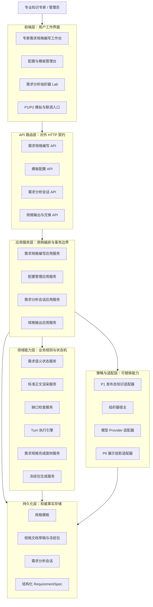
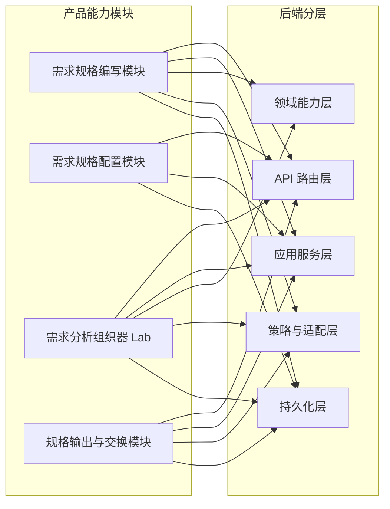
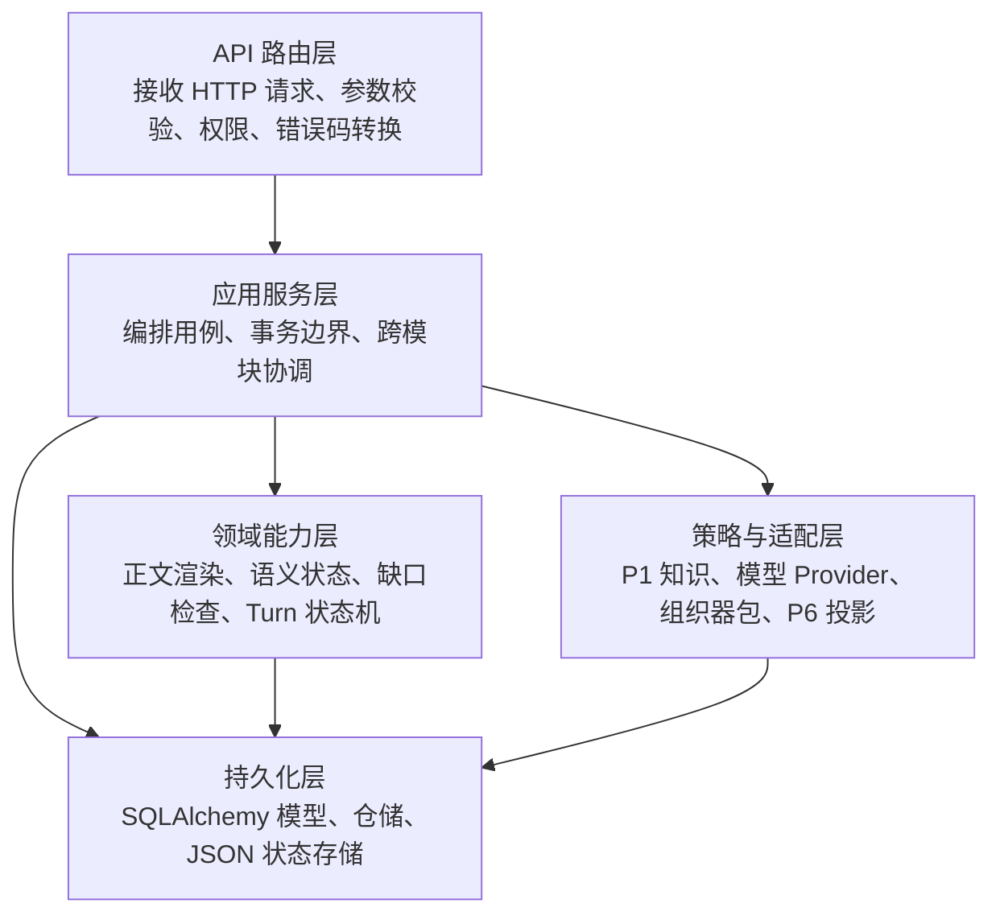
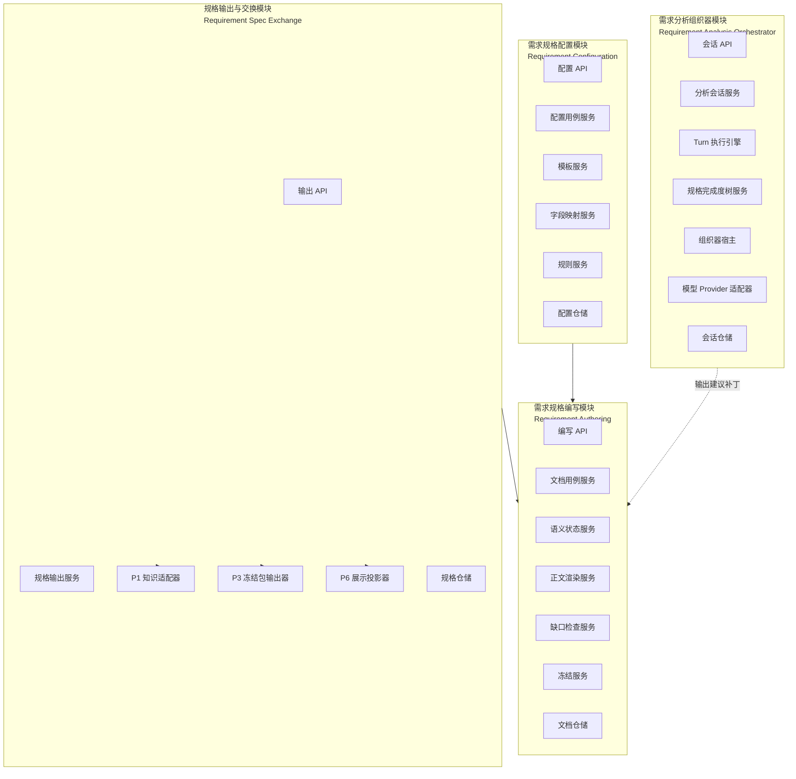
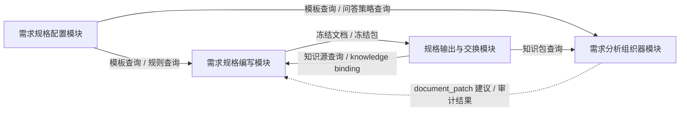
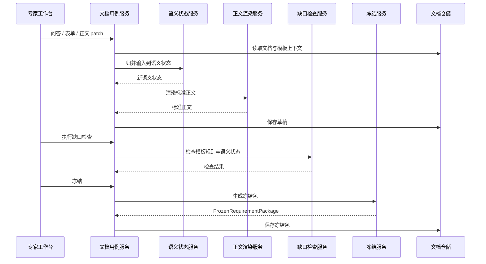
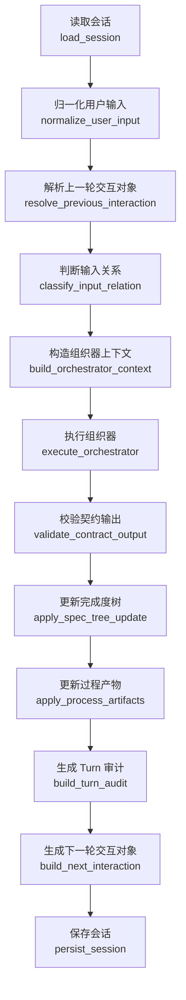
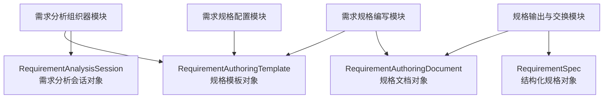
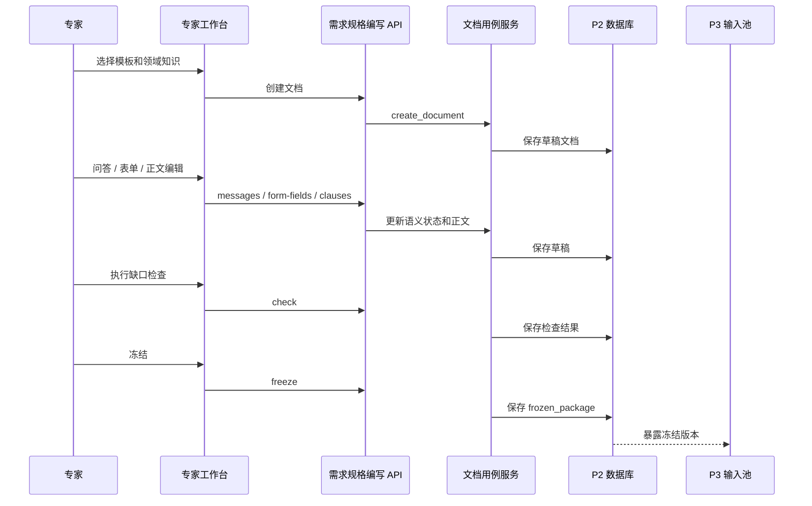
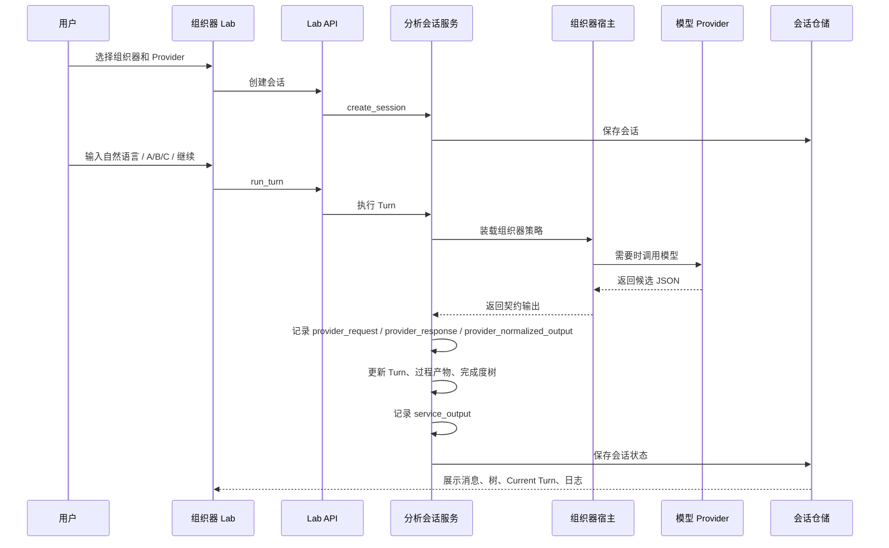

# P2 需求分析系统软件设计说明

> 本文件是 `CodeFactoryV2` 中 `P2 需求分析系统` 的主软件设计说明文档。本文描述本阶段认可的目标态系统设计：系统边界、前端形态、后端架构、模块职责、对象模型、接口、运行流程和验收口径。
>
> 本文不承担实现审查和迁移计划职责；相关内容由独立说明承接。

**日期：** 2026-05-02

**对应节点：**

- `P2` 需求分析系统
- `P2.1` 专家需求规格编写工作台
- `P2.2` 需求规格对象输出与投影
- `P2.3` 上游知识输入模拟与联调入口
- `P2 Lab` 需求分析组织器原理验证能力

## 1. 文档目的与设计口径

### 1.1 文档目的

本文用于回答以下设计问题：

1. `P2` 是什么系统，边界在哪里。
2. 专家正面工作的对象是什么。
3. 前端有哪些页面、区块和状态协作关系。
4. 后端按什么层次组织，核心模块分别承担什么职责。
5. 关键对象如何持久化和流转。
6. API 如何承载前端、上游知识、下游规格输出和组织器 Lab。
7. 一份需求规格说明如何从草稿进入冻结。

### 1.2 设计口径

本文采用目标态软件设计说明口径：

- 描述“系统应该如何设计”，不混入“现有代码哪里不足”。
- 描述“模块职责和接口”，不把实施步骤写成系统设计。
- 描述“本阶段可实现的理想形态”，不要求一次性覆盖未来所有阶段。
- 设计内容在本文内自包含，读者不需要依赖其他专题文档才能理解 `P2` 主架构。

### 1.3 系统主路径

`P2` 的主路径是：

```text
选择规格模板与领域知识
  -> 专家通过问答或表单输入需求
    -> 系统维护需求语义状态
      -> 生成并修补标准需求规格说明正文
        -> 缺口检查与条款批注
          -> 专家冻结
            -> 输出标准需求规格说明 + RequirementSpec 包给 P3
```

需求分析组织器 Lab 是主路径的原理验证能力，用于验证问答式需求收敛、Turn 审计、模型 Provider 和可替换组织器，不直接替代专家工作台。

## 2. 系统定位

### 2.1 一句话定位

`P2 需求分析系统` 是面向专业知识专家的软件需求规格说明编写系统。它把 `P1` 发布态知识、专家自然输入、表单填报和模板规则收敛为可冻结、可审查、可交给 `P3` 的标准需求规格说明文档和结构化 `RequirementSpec` 包。

### 2.2 正面工作对象

专家正面工作的对象是：

```text
标准需求规格说明文档
```

不是：

- 低代码模型。
- 组件装配结果。
- 纯表单。
- 模型聊天记录。
- 组织器内部状态。

结构化对象仍然存在，但它是后台事实状态和下游消费包，用于支撑：

- 正文生成。
- 一致性校验。
- 条款批注。
- 来源追溯。
- `P3` 结构化输入。

### 2.3 用户角色

| 角色 | 主要目标 | 使用入口 |
| --- | --- | --- |
| 专业知识专家 | 编写、审阅、冻结标准需求规格说明 | 专家需求规格编写工作台 |
| 需求分析人员 | 协助专家把自然描述收敛为规格条款 | 专家工作台、组织器 Lab |
| 管理员 / 开发者 | 配置模板、字段、问答策略、缺口检查规则和领域知识来源 | 配置与模板管理台 |
| 下游系统 | 获取冻结后的规格文档和结构化规格包 | `P2 -> P3` 输出接口 |

## 3. 业务目标与边界

### 3.1 首版负责

首版 `P2` 负责：

- 提供专家需求规格编写工作台。
- 支持 `问答模式 / 表单模式` 两种同源输入。
- 实时呈现完整标准需求规格说明正文。
- 支持文档模板选择、领域知识绑定、草稿保存、打开草稿、删除草稿。
- 支持正文轻量编辑和条款批注浮层。
- 支持缺口检查、冻结版本和冻结包输出。
- 支持配置台维护规格模板、表单字段、字段映射、问答策略和缺口检查规则。
- 支持独立 Lab 验证需求分析组织器、模型 Provider 和 Turn 审计协议。
- 支持 `XX-P1-Sim` 在 `P1` 未完成时提供发布态知识输入模拟。

### 3.2 首版不负责

首版 `P2` 不负责：

- 软件设计说明生成。
- `P3` 模块设计、工单包生成或软件设计冻结。
- 工具仓库资产匹配。
- 可运行原型生成。
- BPMN / 泳道图编辑器。
- 技术人员低代码建模平台。
- 直接调用 `P4` 或 `P5`。

### 3.3 上下游边界

```text
P1 发布态知识
  -> P2 需求分析系统
    -> 冻结需求规格说明 + RequirementSpec 包
      -> P3 软件设计系统
```

`P2` 只能消费 `P1` 的发布态知识，不读取候选知识、治理工作态或审核中间数据。

`P3` 只消费 `P2` 冻结后的正式版本，不读取 `P2` 草稿态、交互临时状态或未确认批注。

### 3.4 需求建模原则

#### 3.4.1 对象优先于流程

`P2` 坚持“对象优先于流程”。需求规格说明要描述系统应当管理的业务对象、角色、行为、约束和状态变化，而不是只复刻既有业务流程。

需求规格的最小可解释单元是：

```text
参与方 + 业务对象 + 行为 + 结果 / 状态变化
```

流程作为对象、角色和行为之间的组织方式出现，不替代对象建模。

#### 3.4.2 需求收敛阶段

专家工作台和需求分析组织器服务于同一个收敛目标：

1. 业务目标收敛。
2. 使用对象与范围收敛。
3. 系统边界与模块范围收敛。
4. 模块内动作、数据和状态变化收敛。
5. 模块链路与交接动作收敛。
6. 需求规格正文补齐、检查和冻结。

该阶段不是强制向导。专家可以跳跃输入、补充、修正和否定，后台语义状态负责把输入归入规格构成要素。

#### 3.4.3 推荐与补齐来源

`P2` 的推荐、缺口补齐和问答提示来自三类事实：

| 来源 | 说明 | 来源标识 |
| --- | --- | --- |
| 通用软件工程经验 | 通用角色、模块、数据、非功能、约束和需求规格写法 | `recommended_common` |
| `P1` 发布态领域知识 | 已发布领域对象、事件、流程、术语和关系 | `recommended_domain` |
| 用户输入 | 专家的自然语言、选择题、表单、正文编辑和确认动作 | `manual` |

若知识尚未进入正式 `P1` 发布态，但在联调阶段由模拟器临时提供，则标识为 `temporary_pending_intake`。

#### 3.4.4 完成条件

一份需求规格草稿满足以下条件，才可以进入冻结准备态：

- 已选择可用规格模板。
- 已绑定领域知识，或明确选择不绑定领域知识。
- 必填章节已补齐。
- 阻断型缺口检查通过。
- 正文与结构化语义状态不存在未确认阻断映射。
- 已生成可供 `P3` 消费的冻结结构化包。

## 4. 总体架构

### 4.1 总体分层



### 4.2 产品能力模块

| 模块 | 中文名 | 主要使用者 | 设计目标 |
| --- | --- | --- | --- |
| `Requirement Authoring` | 需求规格编写模块 | 专业知识专家 | 编写、保存、检查、冻结标准需求规格说明 |
| `Requirement Configuration` | 需求规格配置模块 | 管理员 / 开发者 | 配置模板、表单、映射、问答策略和缺口规则 |
| `XG 需求分析组织器 Lab` | 需求分析组织器 Lab | 需求分析人员 / 开发者 | 验证问答式需求收敛、Turn 协议和可替换组织器 |
| `Requirement Spec Exchange` | 规格输出与交换模块 | `P3`、`P6`、联调工具 | 输出冻结包、结构化规格和展示投影 |

### 4.3 产品能力与后端层次关系



每个产品能力模块都不是单一代码层。它们通过 API、应用服务、领域能力、适配器和持久化共同实现。后端第 6 章按软件模块展开这些关系。

## 5. 前端软件设计

### 5.1 前端技术栈

前端技术栈为：

- React 18
- TypeScript
- Vite
- Ant Design
- Axios API 适配层
- React Router
- Vitest / Testing Library

### 5.2 前端分层原则

```text
页面路由层
  -> 页面状态编排层
    -> 领域组件层
      -> API 适配层
        -> 类型定义层
```

| 层 | 职责 | 约束 |
| --- | --- | --- |
| 页面路由层 | 绑定 URL 与页面入口 | 不承载复杂业务逻辑 |
| 页面状态编排层 | 管理页面状态、加载、保存、错误 | 不拼接复杂领域对象 |
| 领域组件层 | 渲染工作区、表单、文档、消息、树 | 不直接访问后端 |
| API 适配层 | 封装 HTTP 调用 | 不处理 UI 状态 |
| 类型定义层 | 提供 DTO 和视图模型类型 | 不混入运行逻辑 |

### 5.3 前端路由结构

| 路由 | 页面 | 设计口径 |
| --- | --- | --- |
| `/requirement-authoring` | 专家需求规格编写工作台 | 主路径 |
| `/requirement-authoring/admin` | 配置与模板管理台 | 管理路径 |
| `/p2-requirement-analysis-lab` | 需求分析组织器 Lab | 原理验证路径 |
| `/requirements` | 结构化需求规格池 | 冻结规格与结构化对象查看 |
| `/xx-p1-sim` | 上游知识模拟输入台 | `P1` 发布态知识联调模拟 |
| `/xx-p2-sim` | `P2` 轻量规格输出模拟台 | `P2 -> P3` 早期联调模拟 |

### 5.4 专家需求规格编写工作台

#### 5.4.1 页面职责

专家需求规格编写工作台负责：

- 加载模板、文档列表和知识源。
- 选择文档模板。
- 设置领域知识。
- 新建、打开、保存、删除需求规格草稿。
- 编辑文档名称。
- 通过问答模式追加需求输入。
- 通过表单模式修改结构化字段。
- 展示标准需求规格正文。
- 展示条款批注浮层。
- 执行缺口检查。
- 冻结文档。

#### 5.4.2 页面结构

```text
RequirementAuthoringPage
  - RequirementAuthoringToolbar
  - DocumentNameBar
  - InputModePanel
    - QuestionModePanel
    - FormModePanel
  - StandardDocumentPane
  - ClauseAnnotationDrawer
  - KnowledgeBindingDialog
  - DocumentOpenDialog
  - DocumentDeleteDialog
```

#### 5.4.3 页面区块与模块映射

| 页面区块 | 读取对象 | 写入对象 | 后端模块 |
| --- | --- | --- | --- |
| 顶部工具栏 | 模板列表、知识源、文档列表 | 当前模板、知识绑定、文档状态 | 需求规格编写模块、配置模块 |
| 文档名称栏 | 文档摘要 | `RequirementAuthoringDocument.title` | 需求规格编写模块 |
| 问答模式 | 对话、语义状态、标准正文 | `conversation`、`semantic_state`、`document` | 需求规格编写模块 |
| 表单模式 | 模板字段、语义状态 | `semantic_state.fields`、`document` | 需求规格编写模块 |
| 标准正文 | 文档章节、条款批注、检查结果 | 条款正文 patch | 正文渲染服务、批注服务 |
| 缺口检查 | 语义状态、模板规则 | `check_result` | 缺口检查服务 |
| 冻结操作 | 文档、语义状态、批注、检查结果 | `frozen_package` | 冻结包生成服务 |

#### 5.4.4 状态保存规则

保存草稿必须覆盖：

- 文档名称。
- 模板选择。
- 领域知识绑定。
- 分屏比例。
- 语义状态。
- 标准正文。
- 问答对话。
- 表单字段。
- 条款批注。
- 缺口检查结果。

文档名称、模板选择和领域知识绑定属于文档上下文，不属于临时 UI 状态。后续问答、表单或保存动作必须保持这些上下文稳定。

### 5.5 配置与模板管理台

配置与模板管理台负责维护以下配置对象：

| 配置对象 | 用途 | 是否影响正式正文 |
| --- | --- | --- |
| 规格模板 | 定义标准章节、条款、编号和必填规则 | 是 |
| 表单模板 | 定义左侧表单字段和分组 | 是 |
| 字段映射 | 连接表单字段、语义状态和正文条款 | 是 |
| 问答策略 | 定义主路径提问范围和补齐规则 | 是 |
| 缺口检查规则 | 定义阻断型、提示型和建议型缺口 | 是 |
| 知识绑定配置 | 定义可选领域知识来源和过滤口径 | 是 |

页面结构：

```text
RequirementAuthoringAdminPage
  - TemplateListPanel
  - TemplateEditorPanel
  - TemplateStructureEditor
  - FormGroupEditor
  - FieldMappingEditor
  - QuestionnairePolicyEditor
  - GapRuleEditor
  - KnowledgeBindingConfigEditor
```

### 5.6 需求分析组织器 Lab

Lab 的职责：

- 选择组织器。
- 选择模型 Provider。
- 启动分析会话。
- 展示 CLI 式交互。
- 展示需求规格完成度树。
- 展示本轮 Turn 审计。
- 展示 Provider 调用日志。
- 展示每次模型调用的输入、原始输出、Provider 归一化结果和服务端最终输出。

页面结构：

```text
RequirementAnalysisLabPage
  - OrchestratorConfigTab
  - AnalysisSessionTab
  - CurrentTurnAuditTab
  - ProviderLogTab
  - SpecCompletionTree
  - QuickOptionList
  - TurnDecisionTrace
```

Lab 不写正式需求规格文档。Lab 只验证组织器输出协议和会话状态机。若后续把 Lab 验证过的能力接入专家工作台，必须通过明确的 `document_patch` 接收、确认和保存机制进入正式规格文档。

#### 5.6.1 Lab 状态机视角

```text
上一轮系统留下的交互对象
  -> 本轮用户输入
    -> 输入关系判断
      -> 系统理解与规格补充
        -> 更新完成度树和过程产物
          -> 本轮闭环判断
            -> 生成下一轮交互对象
```

本轮起点是用户输入。上一轮交互对象只是上下文，不是强制问题。用户可以回答选项，也可以忽略选项重新描述需求。

#### 5.6.2 Current Turn 审计视图

Current Turn 用于审查组织器为什么这样处理一轮输入，至少展示：

- 上一轮系统交互对象：问题、建议话题、选项或空等待。
- 本轮用户输入。
- 输入关系判断：承接、部分承接、偏离、否定或自由补充。
- 系统理解：抽取出的事实、约束、风险和目标节点。
- 规格执行：影响的规格节点、正文补丁、事实状态变化。
- 闭环判断：本轮是否解决了上一轮交互目标，是否需要继续追问。
- 下一轮交互对象：自由问题、选择题、继续建议或结束建议。
- 决策轨迹：关键判断依据和模型 / 规则来源。

#### 5.6.3 Provider 调用日志视图

Provider 调用日志不是普通运行日志，而是用于判断组织器效果问题来源的可观察性视图。它必须在 Lab 的 `调用日志` 页签内展示，不另开独立页面。

每一条 Provider 调用日志至少包含：

- `call_id`：调用编号。
- `turn_id`：关联的 Turn。
- `provider_id`、`model`、`orchestrator_id`、`orchestrator_mode`。
- `user_input`：本轮用户原始输入。
- `normalized_input`：服务端输入归一化结果。
- `provider_request.messages`：实际发给模型 Provider 的消息数组。
- `provider_request.prompt_bundle.assembled_prompt`：组织器包、策略、上下文和输出 schema 拼装后的完整提示词。
- `provider_request.prompt_bundle.context_json`：模型看到的会话上下文。
- `provider_request.prompt_bundle.schema_json`：模型被要求返回的 JSON 结构。
- `provider_response.raw_content`：模型原始文本输出。
- `provider_response.parsed_json`：模型原始文本解析后的 JSON。
- `provider_normalized_output`：Provider 适配器按契约归一化后的输出。
- `service_output`：Turn 引擎完成节点投影、patch 对齐、下一轮交互补齐后的最终输出。

这个视图的核心目的不是给用户阅读正式需求内容，而是帮助判断问题出在哪一层：

- 如果 `assembled_prompt` 本身缺少要求，问题在组织器包或 Host prompt 组装。
- 如果 `raw_content` 已经足够好，但 `service_output` 变差，问题在后端 Turn 后处理策略。
- 如果 `raw_content` 太弱，问题可能在 Provider、模型能力或提示词约束。
- 如果 `normalized_input` 误判 A/B/C 或自由输入，问题在输入归一化和承接判断。

#### 5.6.4 需求规格完成度树

完成度树映射到需求规格说明的章节和条款结构。每个节点至少包含：

- 稳定节点编号。
- 章节或条款标题。
- 节点状态：未开始、待确认、已确认、需追问、已关闭。
- 答案摘要。
- 最近影响它的 Turn。
- 子节点。

完成度树只承载规格结构和节点状态。提问顺序、跳转原因和每轮输入输出由 Turn 审计视图承载。

## 6. 后端软件设计

### 6.1 后端技术栈

后端技术栈为：

- Python 3.12
- FastAPI
- SQLAlchemy
- Pydantic
- PostgreSQL
- JSON 字段承载配置对象、草稿状态和过程状态
- OpenAI SDK 兼容模型 Provider
- Pytest

### 6.2 后端分层原则

后端采用五层结构。



各层职责：

| 层 | 职责 | 约束 |
| --- | --- | --- |
| API 路由层 | 接收参数、绑定认证、转换错误码、返回 DTO | 不写业务状态机 |
| 应用服务层 | 编排用例、控制事务、协调多个领域服务 | 不承载细粒度规则 |
| 领域能力层 | 实现需求语义、正文渲染、缺口检查、Turn 执行、冻结规则 | 不直接处理 HTTP |
| 策略与适配层 | 接入 `P1`、模型 Provider、组织器包和展示投影 | 不拥有 `P2` 权威状态 |
| 持久化层 | 保存模板、文档、会话、冻结包和规格对象 | 不做业务决策 |

### 6.3 后端模块总览

后端按四个业务模块组织，每个业务模块跨越上述五层。



模块与层级关系：

| 后端模块 | API 路由层 | 应用服务层 | 领域能力层 | 策略与适配层 | 持久化层 |
| --- | --- | --- | --- | --- | --- |
| 需求规格编写模块 | 编写 API | 文档用例服务 | 语义状态、正文渲染、批注、缺口、冻结 | 领域知识读取 | 文档仓储 |
| 需求规格配置模块 | 配置 API | 配置用例服务 | 模板校验、映射校验、规则校验 | 无外部依赖或少量校验适配 | 模板仓储 |
| 需求分析组织器模块 | 会话 API | 分析会话服务 | Turn 引擎、完成度树、过程产物 | 组织器宿主、模型 Provider | 会话仓储 |
| 规格输出与交换模块 | 输出 API | 输出用例服务 | 冻结包投影、规格包序列化 | `P1`、`P3`、`P6` 适配器 | 规格仓储 |

#### 6.3.1 模块权威状态矩阵

权威状态指“哪个模块有权修改哪类核心事实”。这个矩阵是后端边界的第一约束。

| 后端模块 | 权威对象 | 可写状态 | 只读输入 | 禁止直接写入的对象 |
| --- | --- | --- | --- | --- |
| 需求规格编写模块 | `RequirementAuthoringDocument` | 文档标题、语义状态、正文、对话、批注、检查结果、冻结包、文档状态 | 模板、知识绑定、分析建议补丁 | 模板版本、需求分析会话、结构化规格主记录 |
| 需求规格配置模块 | `RequirementAuthoringTemplate` | 章节结构、表单结构、字段映射、问答策略、缺口规则、模板启停状态 | 无或少量外部校验依赖 | 需求规格文档、需求分析会话、冻结规格 |
| 需求分析组织器模块 | `RequirementAnalysisSession` | 会话消息、Turn、完成度树、过程产物、下一轮交互对象、Provider 日志 | 模板、知识包、用户输入 | 需求规格文档正文、冻结包、模板版本 |
| 规格输出与交换模块 | `RequirementSpec` 与导出视图 | 结构化规格记录、对外投影视图、导出包 | 冻结文档、发布态知识、展示请求 | 草稿态需求规格文档、需求分析会话 |

#### 6.3.2 模块间调用规则

后端模块之间允许的调用关系如下：



调用约束：

- 编写模块可以读取模板和知识绑定，但不能修改模板定义。
- 分析模块可以读取模板和知识包，但不能直接写文档正文。
- 交换模块只能消费冻结态文档，不读取草稿态文档作为正式输出。
- 配置模块不依赖文档模块和会话模块的运行状态。

### 6.4 需求规格编写模块

#### 6.4.1 模块定义

需求规格编写模块负责支撑专家工作台的核心工作：创建、编辑、保存、检查和冻结一份标准需求规格说明文档。

该模块拥有 `RequirementAuthoringDocument` 的生命周期控制权。问答输入、表单输入和正文编辑都必须汇入同一份文档语义状态。

#### 6.4.2 职责

需求规格编写模块负责：

- 创建需求规格草稿。
- 打开、保存、删除草稿。
- 保存文档名称、模板、领域知识绑定和布局偏好。
- 接收问答输入并更新语义状态。
- 接收表单字段变更并更新语义状态。
- 接收正文条款编辑并更新文档正文。
- 根据模板和语义状态渲染标准正文。
- 生成条款批注。
- 执行缺口检查。
- 冻结文档并生成冻结包。

它不负责：

- 定义模板章节和字段结构。
- 直接调用模型 Provider。
- 直接执行组织器策略。
- 直接向 `P3` 推送未冻结草稿。

#### 6.4.3 功能组成

```text
requirement_authoring/
  document_application_service.py   # 文档用例编排
  document_service.py               # 草稿生命周期
  semantic_state_service.py         # 问答、表单、正文到语义状态的归并
  document_renderer.py              # 标准需求规格正文渲染
  annotation_service.py             # 条款批注
  gap_checker.py                    # 缺口检查
  freeze_service.py                 # 冻结包生成
  knowledge_binding_service.py      # 领域知识绑定
  document_repository.py            # 文档持久化
```

#### 6.4.4 输入输出接口

| 接口对象 | 输入 | 输出 | 说明 |
| --- | --- | --- | --- |
| `CreateDocumentCommand` | `template_id`、`title`、`knowledge_binding`、`layout_ratio` | `RequirementAuthoringDocumentDetail` | 新建草稿 |
| `SaveDocumentCommand` | 文档上下文、正文、语义状态、对话、批注、检查结果 | `RequirementAuthoringDocumentDetail` | 保存完整草稿 |
| `AppendQuestionInputCommand` | `document_id`、用户输入 | 更新后的文档详情 | 问答输入写入同一语义状态 |
| `PatchFormFieldsCommand` | `document_id`、字段变更 | 更新后的文档详情 | 表单输入写入同一语义状态 |
| `PatchClauseCommand` | `document_id`、`clause_id`、正文内容 | 更新后的文档详情 | 轻量正文编辑 |
| `RunGapCheckCommand` | `document_id` | 含检查结果的文档详情 | 缺口检查 |
| `FreezeDocumentCommand` | `document_id` | `FrozenRequirementPackage` | 冻结输出 |

#### 6.4.5 内部接口

| 内部服务 | 输入 | 输出 | 调用方 |
| --- | --- | --- | --- |
| `SemanticStateService.apply_question_input` | 旧语义状态、用户输入、模板、知识绑定 | 新语义状态、对话回复建议 | 文档用例服务 |
| `SemanticStateService.apply_form_patch` | 旧语义状态、字段 patch、模板 | 新语义状态 | 文档用例服务 |
| `DocumentRenderer.render` | 模板、语义状态、正文 patch | 标准正文 | 文档用例服务 |
| `AnnotationService.build_annotations` | 模板、语义状态、知识引用、检查结果 | 条款批注 | 文档用例服务 |
| `GapChecker.check` | 模板规则、语义状态、正文 | 缺口检查结果 | 文档用例服务 |
| `FreezeService.freeze` | 文档详情、检查结果 | 冻结包 | 文档用例服务 |

#### 6.4.6 模块不变量

需求规格编写模块必须维护以下不变量：

| 不变量 | 含义 | 破坏后影响 |
| --- | --- | --- |
| 文档绑定模板版本稳定 | 文档创建后绑定确定模板版本 | 历史草稿被新模板结构破坏 |
| 问答、表单、正文同源 | 三种输入都归并到同一 `semantic_state` | 右侧正文、表单和对话互相打架 |
| 标准正文条款有稳定 id | 每个章节、条款、批注和字段映射都可追踪 | 无法保存正文 patch 和条款批注 |
| 冻结前必须通过阻断检查 | 阻断型缺口未通过不能冻结 | `P3` 接收到不完整规格 |
| 冻结后只读 | 冻结包生成后正文和语义状态不可被普通编辑修改 | 下游引用失去稳定性 |

#### 6.4.7 错误处理

| 错误场景 | 处理方式 |
| --- | --- |
| 文档不存在 | 返回 `404 document_not_found` |
| 模板不存在或不可用 | 返回 `400 template_unavailable` |
| 文档已冻结仍尝试编辑 | 返回 `409 document_frozen` |
| 条款 id 不存在 | 返回 `400 clause_not_found` |
| 阻断缺口未通过仍尝试冻结 | 返回 `409 blocking_gap_not_resolved` |
| 保存载荷缺少上下文 | 返回 `400 invalid_document_payload` |

#### 6.4.8 与其他模块边界

| 对方模块 | 编写模块读取 | 编写模块写入 | 边界说明 |
| --- | --- | --- | --- |
| 需求规格配置模块 | 模板、字段映射、问答策略、缺口规则 | 无 | 编写模块只能消费激活模板版本 |
| 需求分析组织器模块 | 建议补丁、事实摘要、目标节点 | 可选择接收为文档 patch | Lab 输出必须经过确认机制 |
| 规格输出与交换模块 | 知识绑定、知识源信息 | 冻结包、结构化规格输入 | 只有冻结态进入正式交换 |

#### 6.4.9 运行流程



### 6.5 需求规格配置模块

#### 6.5.1 模块定义

需求规格配置模块负责维护专家工作台运行所需的配置对象。它不直接编辑某一份专家草稿，而是定义草稿创建、渲染、检查和冻结时遵循的模板与规则。

#### 6.5.2 职责

需求规格配置模块负责：

- 管理规格模板版本。
- 管理模板章节和条款结构。
- 管理表单字段和字段分组。
- 管理字段到语义状态、正文条款的映射。
- 管理问答策略。
- 管理缺口检查规则。
- 管理领域知识绑定配置。
- 激活、停用或归档模板版本。

它不负责：

- 修改某一份专家草稿。
- 解释用户自然语言输入。
- 生成冻结规格包。
- 判断某一份文档是否可以冻结。

#### 6.5.3 功能组成

```text
requirement_configuration/
  template_application_service.py   # 配置用例编排
  template_service.py               # 模板生命周期
  section_schema_service.py         # 章节与条款结构
  form_schema_service.py            # 表单字段结构
  field_mapping_service.py          # 字段映射
  questionnaire_policy_service.py   # 问答策略
  gap_rule_service.py               # 缺口规则
  template_repository.py            # 模板持久化
```

#### 6.5.4 输入输出接口

| 接口对象 | 输入 | 输出 | 说明 |
| --- | --- | --- | --- |
| `CreateTemplateCommand` | 模板编码、名称、章节、表单、映射、规则 | `RequirementAuthoringTemplate` | 新建模板版本 |
| `UpdateTemplateCommand` | 模板 id、配置 payload | `RequirementAuthoringTemplate` | 修改草稿或未冻结模板 |
| `ActivateTemplateCommand` | 模板 id | 激活后的模板 | 设为可创建文档 |
| `ValidateTemplateCommand` | 模板 payload | 校验结果 | 检查章节、字段、映射和规则一致性 |

#### 6.5.5 配置对象结构

```text
RequirementAuthoringTemplate
  template_id
  template_code
  name
  version
  status
  sections[]
    section_id
    title
    clauses[]
      clause_id
      title
      required_fields[]
      template_text
  form_groups[]
    group_id
    title
    fields[]
      field_key
      label
      type
      required
  field_mappings[]
  questionnaire_policy
  gap_rules[]
  knowledge_bindings
```

#### 6.5.6 模板版本规则

| 规则 | 说明 |
| --- | --- |
| 模板版本不可隐式覆盖 | 修改已被文档引用的模板时，应生成新版本 |
| 文档绑定创建时模板版本 | 旧文档继续使用旧模板版本 |
| 同一模板编码只能有一个激活版本 | 创建新文档时只使用激活版本 |
| 归档版本只读 | 归档版本可被历史文档读取，不能再编辑 |

#### 6.5.7 配置校验规则

模板激活前必须通过校验：

| 校验项 | 校验内容 |
| --- | --- |
| 章节结构 | `section_id` 和 `clause_id` 稳定且唯一 |
| 表单字段 | `field_key` 稳定且唯一，必填字段有类型定义 |
| 字段映射 | 每个映射引用的字段和条款都存在 |
| 问答策略 | 策略引用的字段、章节或条款都存在 |
| 缺口规则 | 阻断型规则有明确条件和提示文案 |
| 知识绑定配置 | 引用的知识源类型可被交换模块识别 |

#### 6.5.8 错误处理

| 错误场景 | 处理方式 |
| --- | --- |
| 模板不存在 | 返回 `404 template_not_found` |
| 模板编码重复 | 返回 `409 template_code_conflict` |
| 激活模板校验失败 | 返回 `409 template_validation_failed` |
| 修改归档模板 | 返回 `409 template_archived` |
| 删除被文档引用的模板版本 | 返回 `409 template_in_use` |

#### 6.5.9 与其他模块边界

| 对方模块 | 配置模块提供 | 配置模块接收 | 边界说明 |
| --- | --- | --- | --- |
| 需求规格编写模块 | 激活模板、模板版本、字段映射、缺口规则 | 无 | 编写模块不能绕过配置模块修改模板 |
| 需求分析组织器模块 | 模板结构、问答策略、目标节点结构 | 无 | 组织器按模板组织完成度树 |
| 规格输出与交换模块 | 模板版本元数据 | 无 | 冻结包保留模板版本追溯 |

### 6.6 需求分析组织器模块

#### 6.6.1 模块定义

需求分析组织器模块负责验证和承载“自然语言输入如何被组织成需求规格补充”的能力。它由会话服务、Turn 引擎、组织器宿主、模型 Provider 适配器和过程状态服务组成。

该模块不直接写正式需求规格文档。它输出的是可审计的理解结果、规格节点状态和建议补丁。正式写入由需求规格编写模块接收和确认。

#### 6.6.2 职责

需求分析组织器模块负责：

- 创建需求分析会话。
- 选择需求规格组织器。
- 选择模型 Provider。
- 接收用户每轮输入。
- 判断用户输入与上一轮交互对象的关系。
- 执行组织器策略。
- 更新需求规格完成度树。
- 记录事实、待确认问题、风险和正文补丁建议。
- 生成 Current Turn 审计链。
- 生成下一轮交互对象。
- 记录可审计的 Provider 调用日志。

它不负责：

- 保存正式需求规格正文。
- 冻结需求规格文档。
- 修改规格模板。
- 管理模型 API Key 的持久化配置界面。

#### 6.6.3 功能组成

```text
requirement_analysis/
  session_application_service.py    # 会话用例编排
  session_service.py                # 会话生命周期
  turn_engine.py                    # 单轮 Turn 执行闭环
  turn_audit_service.py             # Current Turn 审计
  input_normalizer.py               # 用户输入归一化
  input_relation_classifier.py      # 输入承接判断
  spec_tree_service.py              # 完成度树生成与更新
  process_artifact_service.py       # facts / questions / patches / risks
  next_interaction_service.py       # 下一轮交互对象
  provider_call_service.py          # 模型调用与日志
  orchestrator_host.py              # 组织器宿主
  session_repository.py             # 会话持久化

orchestrators/
  registry.py                       # 组织器包注册
  package_loader.py                 # 读取 manifest / policy / prompt / runner
  contract_validator.py             # 契约校验
  runner_host.py                    # local_runner 受控执行
```

#### 6.6.4 Turn 执行闭环

Turn 执行闭环用于描述一轮用户输入如何被系统理解、执行和沉淀。



该闭环不是页面工作流，而是后端单轮处理状态机。它服务于两个目标：

- 让组织器行为可审计。
- 让不同组织器遵守同一输入输出契约。

#### 6.6.5 输入输出接口

| 接口对象 | 输入 | 输出 | 说明 |
| --- | --- | --- | --- |
| `CreateAnalysisSessionCommand` | 课题、组织器 id、Provider、模板、知识包、写入策略 | `RequirementAnalysisSessionDetail` | 创建分析会话 |
| `RunTurnCommand` | `session_id`、用户输入 | 更新后的会话详情 | 执行一轮 Turn |
| `ListOrchestratorsQuery` | 无 | 组织器清单 | 显示可替换组织器 |
| `ListProvidersQuery` | 无 | Provider 清单 | 显示可用模型 Provider |

#### 6.6.6 组织器契约输出

每个组织器执行后必须返回统一契约对象：

```text
OrchestratorTurnResult
  organizer_interpretation
    summary
    extracted_facts[]
    assumptions[]
    risks[]
  spec_execution
    affected_nodes[]
    document_patches[]
    state_changes[]
  closure_assessment
    previous_interaction_closed
    reason
    needs_follow_up
  next_interaction
    type
    prompt
    options[]
    recommended_option
  decision_trace[]
  raw_provider_response
```

契约约束：

- `affected_nodes` 必须引用 `spec_tree` 中存在的节点。
- `document_patches` 只能是建议补丁，不能自动写正式文档。
- `next_interaction.options` 可以为空；不是每轮都必须生成选择题。
- `decision_trace` 必须解释关键判断依据。
- `raw_provider_response` 必须保留 Provider 调用审计信息，不能只保留状态摘要。

#### 6.6.6.1 Provider 调用审计对象

`ProviderCallLog.audit` 用于还原每轮调用链路：

```text
ProviderCallLog
  call_id
  turn_id
  provider_id
  model
  orchestrator_id
  orchestrator_mode
  status
  audit
    user_input
    normalized_input
    provider_request
      messages[]
      prompt_bundle
        assembled_prompt
        context_json
        schema_json
        policy_text
        prompt_text
    provider_response
      raw_content
      parsed_json
    provider_normalized_output
    service_output
```

其中：

- `provider_request` 表示真正交给 Provider 或本地 runner 的输入。
- `provider_response` 表示 Provider 或 runner 的原始返回。
- `provider_normalized_output` 表示 Provider 适配层按照契约规整后的输出。
- `service_output` 表示 Turn 引擎执行投影、补齐和重写后的最终输出。

这四层必须同时保留。只有这样才能区分“模型输出弱”“提示词弱”“Provider 适配层规整错误”和“服务端后处理覆盖过度”四类问题。

#### 6.6.7 内部接口

| 内部服务 | 输入 | 输出 | 说明 |
| --- | --- | --- | --- |
| `InputNormalizer.normalize` | 原始用户输入、上一轮选项 | 标准输入对象 | 支持自由文本和 A/B/C |
| `InputRelationClassifier.classify` | 标准输入、上一轮交互对象 | 承接关系 | 判断回答、偏离、否定、自由补充 |
| `OrchestratorHost.execute` | 组织器上下文、标准输入 | 组织器契约输出 | 屏蔽策略解释、本地 runner、远端服务差异 |
| `SpecTreeService.apply` | 完成度树、组织器输出 | 新完成度树 | 更新节点状态 |
| `ProcessArtifactService.apply` | 过程产物、组织器输出 | 新 facts/questions/patches/risks | 维护过程产物 |
| `TurnAuditService.build` | 输入、关系、执行结果、状态变化 | Turn 审计对象 | 支持 Current Turn 展示 |
| `NextInteractionService.build` | 完成度树、闭环判断、组织器建议 | 下一轮交互对象 | 支持问题、选项、继续或结束 |
| `ProviderCallService.run_*` | 会话、组织器、用户输入、归一化输入 | Provider 候选输出和原始调用审计 | 记录 prompt、上下文、原始响应 |
| `TurnEngine._provider_log` | Turn、Provider 输出、服务端最终输出 | `ProviderCallLog` | 支持调用日志页签追溯 |

#### 6.6.8 Provider 与组织器边界

Provider 只负责模型调用：

- API Key。
- base URL。
- model。
- request / response。
- 调用日志。
- JSON 解析失败处理。

组织器负责需求分析策略：

- 问什么。
- 如何解释用户输入。
- 如何更新规格节点。
- 如何输出正文补丁。
- 如何设计下一轮交互对象。

Provider 不拥有需求规格树。组织器不拥有 API Key 和 HTTP 细节。

Provider 日志必须跨越边界记录四层结果，但不能把责任混在一起：

- Provider 层负责记录 `request / response / provider_normalized_output`。
- Turn 引擎负责记录 `service_output`。
- 调用日志视图负责并列展示四层，不替任何一层解释或掩盖另一层。

#### 6.6.9 模块不变量

| 不变量 | 含义 | 破坏后影响 |
| --- | --- | --- |
| Turn 起点是用户输入 | 上一轮交互对象只是上下文 | 会退化为系统问卷 |
| 会话状态独立于正式文档 | Lab 不直接写 `RequirementAuthoringDocument` | 实验状态污染正式规格 |
| 完成度树节点稳定 | Turn、patch、事实都引用稳定节点 | 审计链无法追溯 |
| 组织器输出必须过契约校验 | 不同组织器返回同一结构 | 前端无法稳定展示 |
| Provider 调用可追踪 | 每轮模型调用有日志引用 | 无法审计模型行为 |

#### 6.6.10 错误处理

| 错误场景 | 处理方式 |
| --- | --- |
| 会话不存在 | 返回 `404 session_not_found` |
| 组织器不存在或不可用 | 返回 `400 orchestrator_unavailable` |
| Provider 不可用或未配置 | 返回 `400 provider_unavailable` |
| 组织器输出不符合契约 | 返回 `502 orchestrator_contract_failed`，保存错误审计 |
| 模型返回无法解析 | 返回 `502 provider_response_invalid`，保存原始响应摘要 |
| 用户输入为空 | 返回 `400 empty_user_input` |

#### 6.6.11 与其他模块边界

| 对方模块 | 分析模块读取 | 分析模块写入 | 边界说明 |
| --- | --- | --- | --- |
| 需求规格配置模块 | 模板结构、问答策略、缺口规则摘要 | 无 | 分析模块按模板生成完成度树 |
| 需求规格编写模块 | 可选读取文档上下文 | 建议补丁，不直接写正文 | 正式写入必须经编写模块确认 |
| 规格输出与交换模块 | 知识包、领域术语、Provider 可用性 | Provider 日志引用 | 不输出正式冻结包 |

### 6.7 规格输出与交换模块

#### 6.7.1 模块定义

规格输出与交换模块负责把 `P2` 内部文档、语义状态、批注和检查结果转换为下游可消费的正式对象。

它面向三个方向：

- `P1 -> P2` 的发布态知识读取。
- `P2 -> P3` 的冻结需求规格输出。
- `P2 -> P6` 的阶段展示投影。

#### 6.7.2 职责

规格输出与交换模块负责：

- 读取 `P1` 发布态知识目录和知识包。
- 为专家工作台提供领域知识绑定对象。
- 生成 `P3` 可消费的冻结规格包。
- 生成结构化 `RequirementSpec`。
- 提供冻结规格列表和详情。
- 生成 `P6` 展示输出数据。
- 支持 `XX-P1-Sim` 和 `XX-P2-Sim` 的联调模拟。

它不负责：

- 编辑草稿态需求规格文档。
- 决定需求规格条款的正文内容。
- 决定组织器下一轮问什么。
- 修改模板章节和字段结构。

#### 6.7.3 功能组成

```text
requirement_exchange/
  exchange_application_service.py   # 输出用例编排
  p1_knowledge_adapter.py           # P1 发布态知识读取
  knowledge_binding_service.py      # 领域知识绑定对象
  requirement_spec_service.py       # 结构化 RequirementSpec
  frozen_package_projector.py       # 冻结包投影
  p3_export_service.py              # P3 输出接口
  p6_display_projector.py           # P6 展示投影
  sim_adapter.py                    # P1/P2 模拟器适配
  requirement_spec_repository.py    # 规格仓储
```

#### 6.7.4 输入输出接口

| 接口对象 | 输入 | 输出 | 说明 |
| --- | --- | --- | --- |
| `ListKnowledgeProvidersQuery` | 无 | 知识源清单 | 专家工作台选择领域知识 |
| `BindKnowledgeCommand` | `provider_id`、`domain_id` | `KnowledgeBinding` | 保存文档知识上下文 |
| `BuildFrozenPackageCommand` | 文档详情 | `FrozenRequirementPackage` | 冻结包生成 |
| `ListRequirementSpecsQuery` | 过滤条件 | 规格列表 | 结构化规格池 |
| `GetRequirementSpecQuery` | `spec_id` | 规格详情 | 下游读取 |
| `BuildP6ProjectionQuery` | 阶段状态请求 | P6 展示投影 | 门户展示 |

#### 6.7.5 冻结输出规则

| 规则 | 说明 |
| --- | --- |
| 只消费冻结态文档 | 草稿态文档不能生成正式对外输出 |
| 输出对象可追溯模板版本 | 冻结包必须携带模板版本信息 |
| 输出对象可追溯知识绑定 | 冻结包和结构化规格必须携带领域知识来源 |
| 结构化规格与标准正文同源 | `RequirementSpec` 与冻结正文来自同一冻结快照 |
| P6 只读展示态 | P6 投影不能反向修改 `P2` 权威状态 |

#### 6.7.6 错误处理

| 错误场景 | 处理方式 |
| --- | --- |
| 请求的知识源不存在 | 返回 `404 knowledge_provider_not_found` |
| 领域知识绑定失败 | 返回 `400 knowledge_binding_failed` |
| 尝试为草稿文档生成正式输出 | 返回 `409 document_not_frozen` |
| 结构化规格不存在 | 返回 `404 requirement_spec_not_found` |
| P6 投影缺少阶段状态输入 | 返回 `400 invalid_projection_request` |

#### 6.7.7 与其他模块边界

| 对方模块 | 交换模块读取 | 交换模块写入 | 边界说明 |
| --- | --- | --- | --- |
| 需求规格编写模块 | 冻结文档、冻结包、知识绑定请求 | 结构化规格记录 | 交换模块不修改草稿文档 |
| 需求规格配置模块 | 模板版本元数据 | 无 | 只做追溯，不修改模板 |
| 需求分析组织器模块 | 知识包查询请求 | 无 | 不读取 Lab 会话生成正式输出 |

## 7. 核心对象模型

### 7.1 持久化对象

| 对象 | 表 / 存储 | 职责 |
| --- | --- | --- |
| `RequirementAuthoringTemplate` | `requirement_authoring_templates` | 规格模板、表单、映射、规则配置 |
| `RequirementAuthoringDocument` | `requirement_authoring_documents` | 规格草稿、正文、语义状态、批注、冻结包 |
| `RequirementAnalysisSession` | `requirement_analysis_sessions` | Lab 会话、Turn、过程产物、Provider 日志 |
| `RequirementSpec` | `requirement_specs` | 结构化需求规格包 |

### 7.2 对象与模块映射



对象模型回答“系统保存什么事实”，模块设计回答“谁负责处理这些事实”。

#### 7.2.1 对象状态归属

| 对象 | 创建模块 | 更新模块 | 冻结 / 归档模块 | 对外暴露模块 |
| --- | --- | --- | --- | --- |
| `RequirementAuthoringTemplate` | 需求规格配置模块 | 需求规格配置模块 | 需求规格配置模块 | 需求规格配置模块 |
| `RequirementAuthoringDocument` | 需求规格编写模块 | 需求规格编写模块 | 需求规格编写模块 | 需求规格编写模块、规格输出与交换模块 |
| `RequirementAnalysisSession` | 需求分析组织器模块 | 需求分析组织器模块 | 需求分析组织器模块 | 需求分析组织器模块 |
| `RequirementSpec` | 规格输出与交换模块 | 规格输出与交换模块 | 规格输出与交换模块 | 规格输出与交换模块 |

### 7.3 规格模板对象

`RequirementAuthoringTemplate` 至少包含：

- `template_id`
- `template_code`
- `name`
- `version`
- `status`
- `sections`
- `form_groups`
- `field_mappings`
- `questionnaire_policy`
- `gap_rules`
- `knowledge_bindings`

模板必须可替换、可版本化、可启停。已有文档稳定绑定创建时模板版本。

### 7.4 规格文档对象

`RequirementAuthoringDocument` 至少包含：

- `document_id`
- `title`
- `template_id`
- `template_version`
- `status`
- `layout_ratio`
- `archive_ids`
- `semantic_state`
- `document`
- `conversation`
- `annotations`
- `check_result`
- `frozen_package`
- `knowledge_binding`

保存草稿必须保存正文、语义状态、对话、模板选择、领域知识绑定和检查状态。冻结后文档只读。草稿态不能进入 `P3` 正式消费。

### 7.5 文档状态

| 状态 | 含义 | 可写 |
| --- | --- | --- |
| `draft` | 正在编辑 | 是 |
| `checking` | 正在或刚完成检查 | 是 |
| `ready_to_freeze` | 阻断缺口已通过，可冻结 | 是 |
| `frozen` | 已冻结 | 否 |
| `submitted_to_p3` | 已交给 `P3` | 否 |
| `archived` | 已归档 | 否 |

### 7.6 冻结包对象

`FrozenRequirementPackage` 至少包含：

- 标准需求规格说明正文。
- 结构化 `RequirementSpec`。
- 模板版本。
- 领域知识绑定。
- 条款批注。
- 缺口检查结果。
- 冻结时间。
- 冻结人。

### 7.7 需求分析会话对象

`RequirementAnalysisSession` 至少包含：

- `session_id`
- `topic`
- `orchestrator_id`
- `provider_id`
- `model`
- `template_id`
- `knowledge_package_id`
- `write_policy`
- `messages`
- `turns`
- `spec_tree`
- `artifacts`
- `next_interaction`
- `provider_logs`

Lab 会话状态不得直接写正式需求规格文档。若进入专家工作台，必须通过 `document_patch` 接收和确认机制进入 `RequirementAuthoringDocument`。

#### 7.7.1 会话状态

| 状态 | 含义 |
| --- | --- |
| `created` | 会话已创建，尚未执行 Turn |
| `running` | 已开始执行 Turn，仍在继续收敛 |
| `waiting_user_input` | 已生成下一轮交互对象，等待用户输入 |
| `completed` | 当前会话目标已收敛完成 |
| `failed` | Provider 或组织器执行失败 |

### 7.8 Turn 对象

一轮 Turn 的起点是用户输入。上一轮系统交互对象是上下文，不是 Turn 的起点。

Turn 至少包含：

```text
turn_id
previous_interaction
user_input
input_relation_to_previous_interaction
organizer_interpretation
spec_execution
state_changes
closure_assessment
next_interaction
decision_trace
provider_log_refs
created_at
```

### 7.9 过程产物对象

| 过程产物 | 含义 | 展示方式 |
| --- | --- | --- |
| `spec_tree` | 需求规格完成度树 | 树形结构，按章节和条款展开 |
| `turns` | 交互审计链 | 按时间顺序展示每轮输入、判断、执行和下一轮交互 |
| `artifacts` | 事实、待确认问题、正文补丁、风险 | 按节点、类型和 Turn 过滤 |

待确认问题与已确认事实不是简单此消彼长。一个问题被确认后可能关闭当前节点，也可能生成子问题、风险或正文补丁。

## 8. API 设计

### 8.1 需求规格编写 API

路由前缀：

```text
/api/requirement-authoring
```

| 方法 | 路径 | 用途 |
| --- | --- | --- |
| `GET` | `/documents` | 列出文档草稿 |
| `POST` | `/documents` | 创建文档 |
| `GET` | `/documents/{document_id}` | 获取文档详情 |
| `DELETE` | `/documents/{document_id}` | 删除文档 |
| `POST` | `/documents/{document_id}/save` | 保存完整文档上下文 |
| `POST` | `/documents/{document_id}/messages` | 追加问答输入 |
| `PATCH` | `/documents/{document_id}/form-fields` | 更新表单字段 |
| `PATCH` | `/documents/{document_id}/clauses/{clause_id}` | 编辑条款正文 |
| `POST` | `/documents/{document_id}/check` | 执行缺口检查 |
| `POST` | `/documents/{document_id}/freeze` | 冻结文档 |

API 到模块命令 / 查询映射：

| API | 应用服务入口 | 主要领域服务 |
| --- | --- | --- |
| `POST /documents` | `CreateDocumentCommand` | `DocumentService`、`DocumentRenderer` |
| `POST /documents/{id}/save` | `SaveDocumentCommand` | `DocumentService` |
| `POST /documents/{id}/messages` | `AppendQuestionInputCommand` | `SemanticStateService`、`DocumentRenderer`、`AnnotationService` |
| `PATCH /documents/{id}/form-fields` | `PatchFormFieldsCommand` | `SemanticStateService`、`DocumentRenderer` |
| `PATCH /documents/{id}/clauses/{clause_id}` | `PatchClauseCommand` | `DocumentRenderer`、`AnnotationService` |
| `POST /documents/{id}/check` | `RunGapCheckCommand` | `GapChecker` |
| `POST /documents/{id}/freeze` | `FreezeDocumentCommand` | `GapChecker`、`FreezeService` |

### 8.2 需求规格配置 API

路由前缀：

```text
/api/requirement-configuration
```

| 方法 | 路径 | 用途 |
| --- | --- | --- |
| `GET` | `/templates` | 列出模板 |
| `POST` | `/templates` | 创建模板 |
| `PUT` | `/templates/{template_id}` | 更新模板 |
| `POST` | `/templates/{template_id}/activate` | 激活模板 |
| `POST` | `/templates/{template_id}/validate` | 校验模板 |

API 到模块命令 / 查询映射：

| API | 应用服务入口 | 主要领域服务 |
| --- | --- | --- |
| `GET /templates` | `ListTemplatesQuery` | `TemplateService` |
| `POST /templates` | `CreateTemplateCommand` | `TemplateService`、`ValidateTemplateCommand` |
| `PUT /templates/{id}` | `UpdateTemplateCommand` | `TemplateService`、`ValidateTemplateCommand` |
| `POST /templates/{id}/activate` | `ActivateTemplateCommand` | `TemplateService`、`ValidateTemplateCommand` |
| `POST /templates/{id}/validate` | `ValidateTemplateCommand` | `TemplateService`、`GapRuleService`、`FieldMappingService` |

### 8.3 需求分析组织器 API

路由前缀：

```text
/api/requirement-analysis-lab
```

| 方法 | 路径 | 用途 |
| --- | --- | --- |
| `GET` | `/orchestrators` | 列出可用组织器包 |
| `GET` | `/providers` | 列出模型 Provider |
| `POST` | `/sessions` | 创建分析会话 |
| `GET` | `/sessions/{session_id}` | 获取会话 |
| `POST` | `/sessions/{session_id}/turns` | 创建 Turn |

API 到模块命令 / 查询映射：

| API | 应用服务入口 | 主要领域服务 |
| --- | --- | --- |
| `GET /orchestrators` | `ListOrchestratorsQuery` | `OrchestratorHost` |
| `GET /providers` | `ListProvidersQuery` | `ProviderCallService` |
| `POST /sessions` | `CreateAnalysisSessionCommand` | `SessionService`、`SpecTreeService` |
| `GET /sessions/{id}` | `GetAnalysisSessionQuery` | `SessionService` |
| `POST /sessions/{id}/turns` | `RunTurnCommand` | `TurnEngine`、`OrchestratorHost`、`SpecTreeService` |

### 8.4 规格输出与交换 API

路由前缀：

```text
/api/requirement-exchange
```

| 方法 | 路径 | 用途 |
| --- | --- | --- |
| `GET` | `/knowledge-providers` | 列出知识源 |
| `POST` | `/knowledge-bindings` | 绑定领域知识 |
| `GET` | `/specs` | 列出结构化规格 |
| `POST` | `/specs` | 创建结构化规格 |
| `GET` | `/specs/{spec_id}` | 获取结构化规格 |
| `PUT` | `/specs/{spec_id}` | 更新结构化规格 |
| `GET` | `/formal-elements` | 读取 `P1` 正式元素 |
| `GET` | `/p6-projection` | 生成 `P6` 展示投影 |

API 到模块命令 / 查询映射：

| API | 应用服务入口 | 主要领域服务 / 适配器 |
| --- | --- | --- |
| `GET /knowledge-providers` | `ListKnowledgeProvidersQuery` | `P1KnowledgeAdapter` |
| `POST /knowledge-bindings` | `BindKnowledgeCommand` | `KnowledgeBindingService` |
| `GET /specs` | `ListRequirementSpecsQuery` | `RequirementSpecService` |
| `POST /specs` | `CreateRequirementSpecCommand` | `RequirementSpecService` |
| `GET /specs/{id}` | `GetRequirementSpecQuery` | `RequirementSpecService` |
| `PUT /specs/{id}` | `UpdateRequirementSpecCommand` | `RequirementSpecService` |
| `GET /formal-elements` | `ListFormalElementsQuery` | `P1KnowledgeAdapter` |
| `GET /p6-projection` | `BuildP6ProjectionQuery` | `P6DisplayProjector` |

## 9. 关键运行流程

### 9.1 专家编写并冻结需求规格



### 9.2 需求分析组织器 Lab 运行流程



### 9.3 P1 知识绑定流程

```text
专家打开领域知识设置
  -> 前端读取知识源
  -> 后端通过 P1 发布态知识适配器获取领域目录
  -> 用户选择领域知识
  -> 后端返回 knowledge_binding
  -> 文档 semantic_state 保存绑定
  -> 后续问答、表单、批注和冻结包都追踪该绑定
```

## 10. 组织器设计

### 10.1 基础定义

`Orchestrator` 是需求分析会话中的组织策略包。它负责决定如何理解用户输入、如何组织规格补充、如何设计下一轮交互。

`Requirement Analysis` 只是其中一种组织方式，不是 `P2` 主功能名。

### 10.2 基础组织器与 XG 组织器

| 层级 | 中文名 | 职责 | 是否绑定文档类型 |
| --- | --- | --- | --- |
| 基础组织器 | `Orchestrator` | 定义可插拔策略包的通用包壳、注册、契约、执行模式和校验规则 | 否 |
| 需求规格组织器 | `XG Orchestrator` | 面向需求规格说明文档的组织策略，处理需求收敛、规格节点、正文补丁和下一轮交互 | 是 |

`XG` 是“需求规格”的缩写。后续 `P3` 从需求规格到软件设计说明的组织器不复用 `XG Orchestrator` 主名，应定义自己的文档类型组织器。

### 10.3 组织器包形态

组织器包目标形态接近 `skill` 包，是可导入、可审查、可测试、可替换的一组文件。

```text
orchestrator-package/
  manifest.json
  ORCHESTRATOR.md
  contract.schema.json
  policy.md
  prompt.md
  artifact_rules.json
  spec_strategy.json
  runner.py
  examples/
  tests/
```

| 文件 | 职责 |
| --- | --- |
| `manifest.json` | 声明 id、名称、版本、文档类型、执行模式、能力和入口 |
| `ORCHESTRATOR.md` | 说明组织器目标、适用范围和人工可读规则 |
| `contract.schema.json` | 约束输入输出 JSON 契约 |
| `policy.md` | 组织策略规则 |
| `prompt.md` | 模型提示策略 |
| `artifact_rules.json` | 规格节点事实模板、patch 模板、快捷选项等轻量策略规则 |
| `spec_strategy.json` | 完成度树节点问题、章节问题模板、默认叶子问题策略 |
| `runner.py` | 本地可执行组织器入口 |
| `examples/` | 示例输入输出 |
| `tests/` | 包级测试 |

### 10.4 组织器执行模式

| 模式 | 含义 | 适用场景 |
| --- | --- | --- |
| `policy_interpreted` | Host 读取 `policy.md`、`prompt.md` 和上下文，调用模型生成契约输出 | Requirement Analysis 类组织器 |
| `local_runner` | Host 调用包内受控 runner，runner 基于包内规则返回契约输出 | 强规则、确定性策略 |
| `remote_service` | Host 调用远端服务，远端返回契约输出 | 外部组织器服务 |

### 10.5 强规则组织器与 Requirement Analysis 组织器

首版至少保留两个组织器实例，用于验证可替换性。

| 组织器 | 目标 | 判断标准 |
| --- | --- | --- |
| `xg-strong-rule-orchestrator` | 将强规则 Turn 状态机、完成度树、闭环判断和下一轮交互规则固化为可测策略 | 输出稳定、可解释、可回归 |
| `xg-heuristic-orchestrator` | 对齐启发式协作方式，以更聪明的问题组织、选项建议和方向判断支持需求收敛 | 输出更有启发性、更少机械追问 |

### 10.6 Host 与组织器边界

| 责任 | Host | 组织器 |
| --- | --- | --- |
| 会话保存 | 是 | 否 |
| API Key 管理 | 是 | 否 |
| 模板和知识上下文组装 | 是 | 只读使用 |
| 输入输出契约校验 | 是 | 遵守契约 |
| 组织策略 | 否 | 是 |
| 模型提示策略装载 | 是 | 声明 |
| 正式文档写入 | 是 | 否 |
| 冻结版本 | 是 | 否 |

## 11. 设计约束与质量门

### 11.1 命名约束

| 不推荐作为系统能力名 | 原因 | 目标命名 |
| --- | --- | --- |
| `Requirement Analysis Service` | Requirement Analysis 是方式，不是系统功能 | `RequirementAnalysisSessionService` |
| `XG 需求分析组织器 Lab` | 容易误解为聊天功能 | `XG 需求分析组织器 Lab` |
| `RequirementAnalysisTurn` | 容易绑定某一种启发方法 | `RequirementAnalysisTurn` |

### 11.2 模块边界约束

- 页面只做编排，复杂业务动作放入 hooks 或 API 适配层。
- API 路由只做 HTTP 参数与错误转换，不写业务状态机。
- 应用服务只编排用例，不沉积全部领域规则。
- 领域服务独立承载正文渲染、语义状态、缺口检查、Turn 执行和冻结规则。
- 组织器策略必须通过包和契约表达。
- Provider 不拥有需求规格树。
- Lab 会话不直接写正式需求规格文档。

### 11.3 测试约束

关键测试必须覆盖：

- 文档草稿创建、保存、打开、删除。
- 文档名称、模板选择、领域知识绑定的保存稳定性。
- 问答模式和表单模式更新同一语义状态。
- 正文渲染和条款 patch。
- 缺口检查和冻结包生成。
- Turn 输入关系判断。
- 组织器契约校验。
- Provider 调用日志。

## 12. 目标目录结构

### 12.1 后端目录结构

```text
apps/api/app/requirement_authoring/
  document_application_service.py
  document_service.py
  semantic_state_service.py
  document_renderer.py
  annotation_service.py
  gap_checker.py
  freeze_service.py
  knowledge_binding_service.py
  document_repository.py

apps/api/app/requirement_configuration/
  template_application_service.py
  template_service.py
  section_schema_service.py
  form_schema_service.py
  field_mapping_service.py
  questionnaire_policy_service.py
  gap_rule_service.py
  template_repository.py

apps/api/app/requirement_analysis/
  session_application_service.py
  session_service.py
  turn_engine.py
  turn_audit_service.py
  input_normalizer.py
  input_relation_classifier.py
  spec_tree_service.py
  process_artifact_service.py
  next_interaction_service.py
  provider_call_service.py
  orchestrator_host.py
  session_repository.py

apps/api/app/requirement_exchange/
  exchange_application_service.py
  p1_knowledge_adapter.py
  knowledge_binding_service.py
  requirement_spec_service.py
  frozen_package_projector.py
  p3_export_service.py
  p6_display_projector.py
  sim_adapter.py
  requirement_spec_repository.py

apps/api/app/orchestrators/
  registry.py
  package_loader.py
  contract_validator.py
  runner_host.py
```

### 12.2 前端目录结构

```text
apps/web/src/pages/
  RequirementAuthoringPage.tsx
  RequirementAuthoringAdminPage.tsx
  RequirementAnalysisLabPage.tsx
  RequirementsPage.tsx

apps/web/src/features/requirement-authoring/
  hooks/
  components/
  api/
  types/

apps/web/src/features/requirement-configuration/
  hooks/
  components/
  api/
  types/

apps/web/src/features/requirement-analysis-lab/
  hooks/
  components/
  api/
  types/

apps/web/src/features/requirement-exchange/
  hooks/
  components/
  api/
  types/
```

## 13. 验收口径

### 13.1 产品验收

首版产品验收只看：

1. 专家能选择模板和领域知识。
2. 专家能新建、打开、保存、删除需求规格草稿。
3. 问答模式和表单模式能更新同一份正文。
4. 右侧正文像标准文档，可以审阅和冻结。
5. 正文轻量编辑不破坏模板骨架。
6. 条款批注能解释来源、缺口、结构化映射和 `P3` 映射。
7. 缺口检查能阻断关键缺口。
8. 冻结后能形成标准文档和结构化 `RequirementSpec` 包。

### 13.2 架构验收

架构验收检查：

1. 主设计文档是否保持目标态软件设计说明口径。
2. 前端页面是否按页面、状态、组件、API 适配分层。
3. 后端模块是否按四个业务模块和五层结构组织。
4. 需求规格编写模块是否拥有完整草稿到冻结闭环。
5. 组织器是否通过包形态和契约接入。
6. Provider 与组织器边界是否清晰。
7. Lab 状态是否不直接写入正式文档。

### 13.3 测试入口

主要测试入口：

```text
apps/api/tests/test_requirement_specs_api.py
apps/api/tests/test_application_modeling_api.py
apps/api/tests/test_requirement_analysis_api.py
apps/web/src/test/RequirementAuthoringPage.test.tsx
apps/web/src/test/RequirementAuthoringAdminPage.test.tsx
apps/web/src/test/RequirementAnalysisLabPage.test.tsx
apps/web/src/test/XXP2SimPage.test.tsx
```

测试覆盖口径不应降低；现行测试文件名必须与正式模块命名保持一致，不保留早期旧称测试入口。

## 14. 面向 P6 的展示输出接口

`P2` 面向 `P6` 的展示输出遵循 `P6DisplayExportContract v2`。该接口只表达需求分析系统的观察态和展示态，不替代 `P2` 自身的编写工作台、草稿机制和规格冻结流程。

| 合同分组 | `P2` 输出口径 | 展示绑定 |
| --- | --- | --- |
| `stage_overview` | 阶段身份、需求分析系统名称、需求规格编写与冻结总体运行状态、入口可用性和新鲜度 | 详情卡标题与健康状态 |
| `connected_users` | 正在接入的行业用户、领域专家、需求分析人员或建模协作者 | 详情卡顶部用户轨 |
| `system_overall_metrics` | 已形成需求规格数、冻结规格数、绑定知识源数等累计承载结果 | 详情卡中段总体状态 |
| `live_counters` | 正在接收发布态知识、正在编写、正在检查或冻结输出的数量 / 速率 | 详情卡下段实时状态 |
| `flow_ports` | 左侧为 `P1` 发布态知识输入；右侧仅为 `P2 -> P3` 需求规格输出 | 左右端口与流量 |
| `queue_projection` | 规格编写队列、缺口检查队列或冻结需求队列 | 底部队列 |
| `source_trace` | 追溯到系统定位、对象模型、接口与冻结流程 | 字段来源、计算口径和展示原因 |

禁止口径：

- 不得把向导步骤、草稿、建模批次或单次会话状态放入总体指标。
- 不得用 Lab 会话状态替代 `P2` 正式阶段状态。
- `P2` 的阶段输出端口只连接 `P3`，不得为了视觉对称编造其他输出端口。

## 15. 设计结论

`P2` 不是普通聊天页面，也不是低代码建模器。它的主系统是标准需求规格说明编写系统。

本阶段目标态由四个业务模块组成：

- 需求规格编写模块。
- 需求规格配置模块。
- 需求分析组织器模块。
- 规格输出与交换模块。

这四个模块通过五层后端架构和分层前端结构协作，最终支撑专家完成标准需求规格说明的编写、检查、冻结和下游输出。
