# P2 需求分析系统软件设计说明

> 本文件是 `CodeFactoryV2` 中 `P2 需求分析系统` 的主软件设计说明文档。本文描述本阶段认可的目标态系统设计：系统边界、前端形态、后端架构、模块职责、对象模型、接口、运行流程和验收口径。
>
> 本文不承担实现审查和迁移计划职责；相关内容由独立说明承接。

**日期：** 2026-05-02

**对应节点：**

- `P2` 需求分析系统
- `P2.1` 专家需求规格编写工作台
- `P2.2` 需求规格对象输出与投影
- `P2.3` 上游知识输入模拟与联调入口
- `P2 Lab` 需求分析组织器原理验证能力

## 1. 文档目的与设计口径

### 1.1 文档目的

本文用于回答以下设计问题：

1. `P2` 是什么系统，边界在哪里。
2. 专家正面工作的对象是什么。
3. 前端有哪些页面、区块和状态协作关系。
4. 后端按什么层次组织，核心模块分别承担什么职责。
5. 关键对象如何持久化和流转。
6. API 如何承载前端、上游知识、下游规格输出和组织器 Lab。
7. 一份需求规格说明如何从草稿进入冻结。

### 1.2 设计口径

本文采用目标态软件设计说明口径：

- 描述“系统应该如何设计”，不混入“现有代码哪里不足”。
- 描述“模块职责和接口”，不把实施步骤写成系统设计。
- 描述“本阶段可实现的理想形态”，不要求一次性覆盖未来所有阶段。
- 设计内容在本文内自包含，读者不需要依赖其他专题文档才能理解 `P2` 主架构。

### 1.3 术语使用规则

本文面向软件设计评审，优先使用中文概念名。英文名只在第一次出现时作为实现命名对照，或在代码路径、接口字段、类名、枚举值、文件名中使用。

例如：

- 需求分析会话与运算模块（`Requirement Analysis Session and Computation Module`）。
- 需求分析会话（`RequirementAnalysisSession`）。
- 需求分析轮次（`RequirementAnalysisTurn`）。
- 需求分析组织器对象（`RequirementAnalysisOrchestrator`）。
- 组织器描述包（`Orchestrator Package`）。
- 组织器宿主（`Orchestrator Host`）。
- 模型提供方（`Provider`）。

后续正文若讨论设计概念，应使用中文名；若讨论实现对象、字段或文件，应保留英文名。

### 1.4 系统主路径

`P2` 的主路径是：

```text
选择规格模板与领域知识
  -> 专家通过问答或表单输入需求
    -> 系统维护需求语义状态
      -> 生成并修补标准需求规格说明正文
        -> 缺口检查与条款批注
          -> 专家冻结
            -> 输出标准需求规格说明 + RequirementSpec 包给 P3
```

需求分析组织器 Lab 是主路径的原理验证能力，用于验证问答式需求收敛、轮次审计、模型提供方和可替换组织器，不直接替代专家工作台。

## 2. 系统定位

### 2.1 一句话定位

`P2 需求分析系统` 是面向专业知识专家的软件需求规格说明编写系统。它把 `P1` 发布态知识、专家自然输入、表单填报和模板规则收敛为可冻结、可审查、可交给 `P3` 的标准需求规格说明文档和结构化 `RequirementSpec` 包。

### 2.2 正面工作对象

专家正面工作的对象是：

```text
标准需求规格说明文档
```

不是：

- 低代码模型。
- 组件装配结果。
- 纯表单。
- 模型聊天记录。
- 组织器内部状态。

结构化对象仍然存在，但它是后台事实状态和下游消费包，用于支撑：

- 正文生成。
- 一致性校验。
- 条款批注。
- 来源追溯。
- `P3` 结构化输入。

### 2.3 用户角色

| 角色 | 主要目标 | 使用入口 |
| --- | --- | --- |
| 专业知识专家 | 编写、审阅、冻结标准需求规格说明 | 专家需求规格编写工作台 |
| 需求分析人员 | 协助专家把自然描述收敛为规格条款 | 专家工作台、组织器 Lab |
| 管理员 / 开发者 | 配置模板、字段、问答策略、缺口检查规则和领域知识来源 | 配置与模板管理台 |
| 下游系统 | 获取冻结后的规格文档和结构化规格包 | `P2 -> P3` 输出接口 |

## 3. 业务目标与边界

### 3.1 首版负责

首版 `P2` 负责：

- 提供专家需求规格编写工作台。
- 支持 `问答模式 / 表单模式` 两种同源输入。
- 实时呈现完整标准需求规格说明正文。
- 支持文档模板选择、领域知识绑定、草稿保存、打开草稿、删除草稿。
- 支持正文轻量编辑和条款批注浮层。
- 支持缺口检查、冻结版本和冻结包输出。
- 支持配置台维护规格模板、表单字段、字段映射、问答策略和缺口检查规则。
- 支持独立 Lab 验证需求分析组织器、模型提供方和轮次审计协议。
- 支持 `XX-P1-Sim` 在 `P1` 未完成时提供发布态知识输入模拟。

### 3.2 首版不负责

首版 `P2` 不负责：

- 软件设计说明生成。
- `P3` 模块设计、工单包生成或软件设计冻结。
- 工具仓库资产匹配。
- 可运行原型生成。
- BPMN / 泳道图编辑器。
- 技术人员低代码建模平台。
- 直接调用 `P4` 或 `P5`。

### 3.3 上下游边界

```text
P1 发布态知识
  -> P2 需求分析系统
    -> 冻结需求规格说明 + RequirementSpec 包
      -> P3 软件设计系统
```

`P2` 只能消费 `P1` 的发布态知识，不读取候选知识、治理工作态或审核中间数据。

`P3` 只消费 `P2` 冻结后的正式版本，不读取 `P2` 草稿态、交互临时状态或未确认批注。

### 3.4 需求建模原则

#### 3.4.1 对象优先于流程

`P2` 坚持“对象优先于流程”。需求规格说明要描述系统应当管理的业务对象、角色、行为、约束和状态变化，而不是只复刻既有业务流程。

需求规格的最小可解释单元是：

```text
参与方 + 业务对象 + 行为 + 结果 / 状态变化
```

流程作为对象、角色和行为之间的组织方式出现，不替代对象建模。

#### 3.4.2 需求收敛阶段

专家工作台和需求分析组织器服务于同一个收敛目标：

1. 业务目标收敛。
2. 使用对象与范围收敛。
3. 系统边界与模块范围收敛。
4. 模块内动作、数据和状态变化收敛。
5. 模块链路与交接动作收敛。
6. 需求规格正文补齐、检查和冻结。

该阶段不是强制向导。专家可以跳跃输入、补充、修正和否定，后台语义状态负责把输入归入规格构成要素。

#### 3.4.3 推荐与补齐来源

`P2` 的推荐、缺口补齐和问答提示来自三类事实：

| 来源 | 说明 | 来源标识 |
| --- | --- | --- |
| 通用软件工程经验 | 通用角色、模块、数据、非功能、约束和需求规格写法 | `recommended_common` |
| `P1` 发布态领域知识 | 已发布领域对象、事件、流程、术语和关系 | `recommended_domain` |
| 用户输入 | 专家的自然语言、选择题、表单、正文编辑和确认动作 | `manual` |

若知识尚未进入正式 `P1` 发布态，但在联调阶段由模拟器临时提供，则标识为 `temporary_pending_intake`。

#### 3.4.4 完成条件

一份需求规格草稿满足以下条件，才可以进入冻结准备态：

- 已选择可用规格模板。
- 已绑定领域知识，或明确选择不绑定领域知识。
- 必填章节已补齐。
- 阻断型缺口检查通过。
- 正文与结构化语义状态不存在未确认阻断映射。
- 已生成可供 `P3` 消费的冻结结构化包。

## 4. 总体架构

### 4.1 总体分层


### 4.2 产品能力模块

| 模块 | 中文名 | 主要使用者 | 设计目标 |
| --- | --- | --- | --- |
| `Requirement Authoring` | 需求规格编写模块 | 专业知识专家 | 编写、保存、检查、冻结标准需求规格说明 |
| `Requirement Configuration` | 需求规格配置模块 | 管理员 / 开发者 | 配置模板、表单、映射、问答策略和缺口规则 |
| `XG 需求分析组织器 Lab` | 需求分析组织器 Lab | 需求分析人员 / 开发者 | 验证问答式需求收敛、轮次协议和可替换组织器 |
| `Requirement Spec Exchange` | 规格输出与交换模块 | `P3`、`P6`、联调工具 | 输出冻结包、结构化规格和展示投影 |

### 4.3 产品能力与后端层次关系

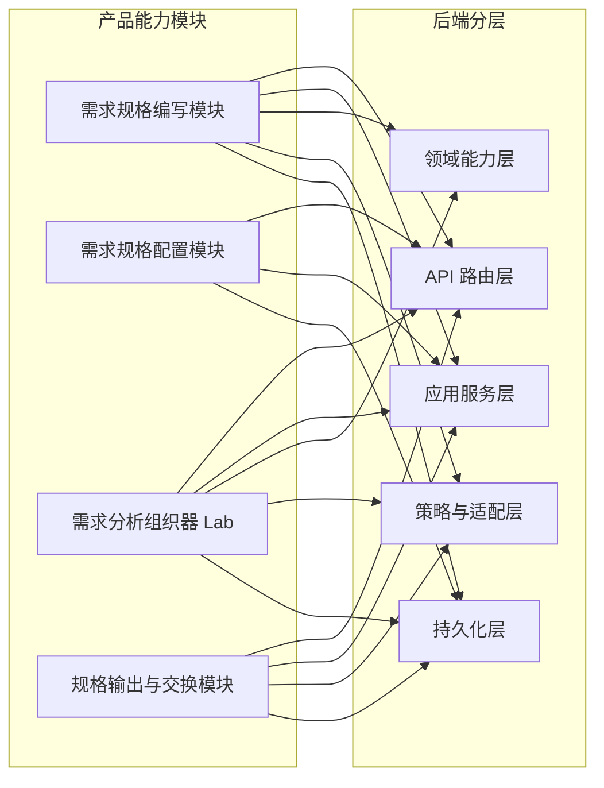

每个产品能力模块都不是单一代码层。它们通过 API、应用服务、领域能力、适配器和持久化共同实现。后端第 6 章按软件模块展开这些关系。

## 5. 前端软件设计

### 5.1 前端技术栈

前端技术栈为：

- React 18
- TypeScript
- Vite
- Ant Design
- Axios API 适配层
- React Router
- Vitest / Testing Library

### 5.2 前端分层原则

```text
页面路由层
  -> 页面状态编排层
    -> 领域组件层
      -> API 适配层
        -> 类型定义层
```

| 层 | 职责 | 约束 |
| --- | --- | --- |
| 页面路由层 | 绑定 URL 与页面入口 | 不承载复杂业务逻辑 |
| 页面状态编排层 | 管理页面状态、加载、保存、错误 | 不拼接复杂领域对象 |
| 领域组件层 | 渲染工作区、表单、文档、消息、树 | 不直接访问后端 |
| API 适配层 | 封装 HTTP 调用 | 不处理 UI 状态 |
| 类型定义层 | 提供 DTO 和视图模型类型 | 不混入运行逻辑 |

### 5.3 前端路由结构

| 路由 | 页面 | 设计口径 |
| --- | --- | --- |
| `/requirement-authoring` | 专家需求规格编写工作台 | 主路径 |
| `/requirement-authoring/admin` | 配置与模板管理台 | 管理路径 |
| `/p2-requirement-analysis-lab` | 需求分析组织器 Lab | 原理验证路径 |
| `/requirements` | 结构化需求规格池 | 冻结规格与结构化对象查看 |
| `/xx-p1-sim` | 上游知识模拟输入台 | `P1` 发布态知识联调模拟 |
| `/xx-p2-sim` | `P2` 轻量规格输出模拟台 | `P2 -> P3` 早期联调模拟 |

### 5.4 专家需求规格编写工作台

#### 5.4.1 页面职责

专家需求规格编写工作台负责：

- 加载模板、文档列表和知识源。
- 选择文档模板。
- 设置领域知识。
- 新建、打开、保存、删除需求规格草稿。
- 编辑文档名称。
- 通过问答模式追加需求输入。
- 通过表单模式修改结构化字段。
- 展示标准需求规格正文。
- 展示条款批注浮层。
- 执行缺口检查。
- 冻结文档。

#### 5.4.2 页面结构

```text
RequirementAuthoringPage
  - RequirementAuthoringToolbar
  - DocumentNameBar
  - InputModePanel
    - QuestionModePanel
    - FormModePanel
  - StandardDocumentPane
  - ClauseAnnotationDrawer
  - KnowledgeBindingDialog
  - DocumentOpenDialog
  - DocumentDeleteDialog
```

#### 5.4.3 页面区块与模块映射

| 页面区块 | 读取对象 | 写入对象 | 后端模块 |
| --- | --- | --- | --- |
| 顶部工具栏 | 模板列表、知识源、文档列表 | 当前模板、知识绑定、文档状态 | 需求规格编写模块、配置模块 |
| 文档名称栏 | 文档摘要 | `RequirementAuthoringDocument.title` | 需求规格编写模块 |
| 问答模式 | 对话、语义状态、标准正文 | `conversation`、`semantic_state`、`document` | 需求规格编写模块 |
| 表单模式 | 模板字段、语义状态 | `semantic_state.fields`、`document` | 需求规格编写模块 |
| 标准正文 | 文档章节、条款批注、检查结果 | 条款正文 patch | 正文渲染服务、批注服务 |
| 缺口检查 | 语义状态、模板规则 | `check_result` | 缺口检查服务 |
| 冻结操作 | 文档、语义状态、批注、检查结果 | `frozen_package` | 冻结包生成服务 |

#### 5.4.4 状态保存规则

保存草稿必须覆盖：

- 文档名称。
- 模板选择。
- 领域知识绑定。
- 分屏比例。
- 语义状态。
- 标准正文。
- 问答对话。
- 表单字段。
- 条款批注。
- 缺口检查结果。

文档名称、模板选择和领域知识绑定属于文档上下文，不属于临时 UI 状态。后续问答、表单或保存动作必须保持这些上下文稳定。

### 5.5 配置与模板管理台

配置与模板管理台负责维护以下配置对象：

| 配置对象 | 用途 | 是否影响正式正文 |
| --- | --- | --- |
| 规格模板 | 定义标准章节、条款、编号和必填规则 | 是 |
| 表单模板 | 定义左侧表单字段和分组 | 是 |
| 字段映射 | 连接表单字段、语义状态和正文条款 | 是 |
| 问答策略 | 定义主路径提问范围和补齐规则 | 是 |
| 缺口检查规则 | 定义阻断型、提示型和建议型缺口 | 是 |
| 知识绑定配置 | 定义可选领域知识来源和过滤口径 | 是 |

页面结构：

```text
RequirementAuthoringAdminPage
  - TemplateListPanel
  - TemplateEditorPanel
  - TemplateStructureEditor
  - FormGroupEditor
  - FieldMappingEditor
  - QuestionnairePolicyEditor
  - GapRuleEditor
  - KnowledgeBindingConfigEditor
```

### 5.6 需求分析组织器 Lab

Lab 的职责：

- 选择组织器。
- 选择模型提供方。
- 启动分析会话。
- 展示 CLI 式交互。
- 展示需求规格完成度树。
- 展示本轮轮次审计。
- 展示模型调用日志。
- 展示每次模型调用的输入、原始输出、模型提供方归一化结果和服务端最终输出。

页面结构：

```text
RequirementAnalysisLabPage
  - OrchestratorConfigTab
  - AnalysisSessionTab
  - CurrentTurnAuditTab
  - ProviderLogTab
  - SpecCompletionTree
  - QuickOptionList
  - TurnDecisionTrace
```

Lab 不写正式需求规格文档。Lab 只验证组织器输出协议和会话状态机。若后续把 Lab 验证过的能力接入专家工作台，必须通过明确的 `document_patch` 接收、确认和保存机制进入正式规格文档。

#### 5.6.1 Lab 状态机视角

```text
上一轮系统留下的交互对象
  -> 本轮用户输入
    -> 输入关系判断
      -> 系统理解与规格补充
        -> 更新完成度树和过程产物
          -> 本轮闭环判断
            -> 生成下一轮交互对象
```

本轮起点是用户输入。上一轮交互对象只是上下文，不是强制问题。用户可以回答选项，也可以忽略选项重新描述需求。

#### 5.6.2 当前轮次审计视图

当前轮次审计视图（`Current Turn`）用于审查组织器为什么这样处理一轮输入，至少展示：

- 上一轮系统交互对象：问题、建议话题、选项或空等待。
- 本轮用户输入。
- 输入关系判断：承接、部分承接、偏离、否定或自由补充。
- 系统理解：抽取出的事实、约束、风险和候选规格节点。
- 规格执行：影响的规格节点、正文补丁、事实状态变化。
- 闭环判断：本轮是否解决了上一轮交互目标，是否需要继续追问。
- 下一轮交互对象：自由问题、选择题、继续建议或结束建议。
- 决策轨迹：关键判断依据和模型 / 规则来源。

#### 5.6.3 模型调用日志视图

模型调用日志（`Provider` 调用日志）不是普通运行日志，而是用于判断组织器效果问题来源的可观察性视图。它必须在 Lab 的 `调用日志` 页签内展示，不另开独立页面。

每一条模型调用日志至少包含：

- `call_id`：调用编号。
- `turn_id`：关联的需求分析轮次。
- `provider_id`、`model`、`orchestrator_id`、`orchestrator_mode`。
- `user_input`：本轮用户原始输入。
- `normalized_input`：服务端输入归一化结果。
- `provider_request.messages`：实际发给模型提供方的消息数组。
- `provider_request.prompt_bundle.assembled_prompt`：组织器描述包、策略、上下文和输出 schema 拼装后的完整提示词。
- `provider_request.prompt_bundle.context_json`：模型看到的会话上下文。
- `provider_request.prompt_bundle.schema_json`：模型被要求返回的 JSON 结构。
- `provider_response.raw_content`：模型原始文本输出。
- `provider_response.parsed_json`：模型原始文本解析后的 JSON。
- `provider_normalized_output`：模型提供方适配器按契约归一化后的输出。
- `service_output`：轮次引擎完成节点投影、patch 对齐、下一轮交互补齐后的最终输出。

这个视图的核心目的不是给用户阅读正式需求内容，而是帮助判断问题出在哪一层：

- 如果 `assembled_prompt` 本身缺少要求，问题在组织器描述包或宿主提示词组装。
- 如果 `raw_content` 已经足够好，但 `service_output` 变差，问题在后端轮次后处理策略。
- 如果 `raw_content` 太弱，问题可能在模型提供方、模型能力或提示词约束。
- 如果 `normalized_input` 误判 A/B/C 或自由输入，问题在输入归一化和承接判断。

#### 5.6.4 需求规格完成度树

完成度树映射到需求规格说明的章节和条款结构。每个节点至少包含：

- 稳定节点编号。
- 章节或条款标题。
- 节点状态：未开始、待确认、已确认、需追问、已关闭。
- 答案摘要。
- 最近影响它的轮次。
- 子节点。

完成度树只承载规格结构和节点状态。提问顺序、跳转原因和每轮输入输出由轮次审计视图承载。

## 6. 后端软件设计

### 6.1 后端技术栈

后端技术栈为：

- Python 3.12
- FastAPI
- SQLAlchemy
- Pydantic
- PostgreSQL
- JSON 字段承载配置对象、草稿状态和过程状态
- OpenAI SDK 兼容模型提供方
- Pytest

### 6.2 后端分层原则

后端采用五层结构。

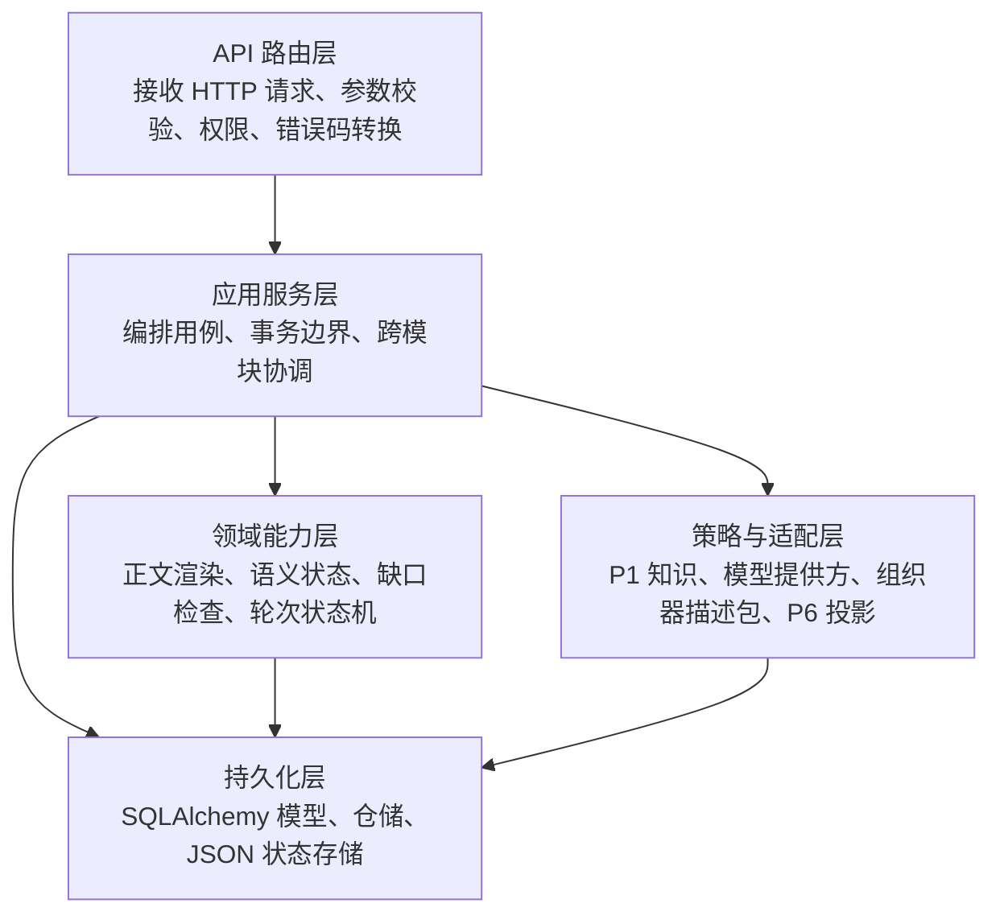

各层职责：

| 层 | 职责 | 约束 |
| --- | --- | --- |
| API 路由层 | 接收参数、绑定认证、转换错误码、返回 DTO | 不写业务状态机 |
| 应用服务层 | 编排用例、控制事务、协调多个领域服务 | 不承载细粒度规则 |
| 领域能力层 | 实现需求语义、正文渲染、缺口检查、轮次执行、冻结规则 | 不直接处理 HTTP |
| 策略与适配层 | 接入 `P1`、模型提供方、组织器描述包和展示投影 | 不拥有 `P2` 权威状态 |
| 持久化层 | 保存模板、文档、会话、冻结包和规格对象 | 不做业务决策 |

### 6.3 后端模块总览

后端按四个业务模块组织，每个业务模块跨越上述五层。

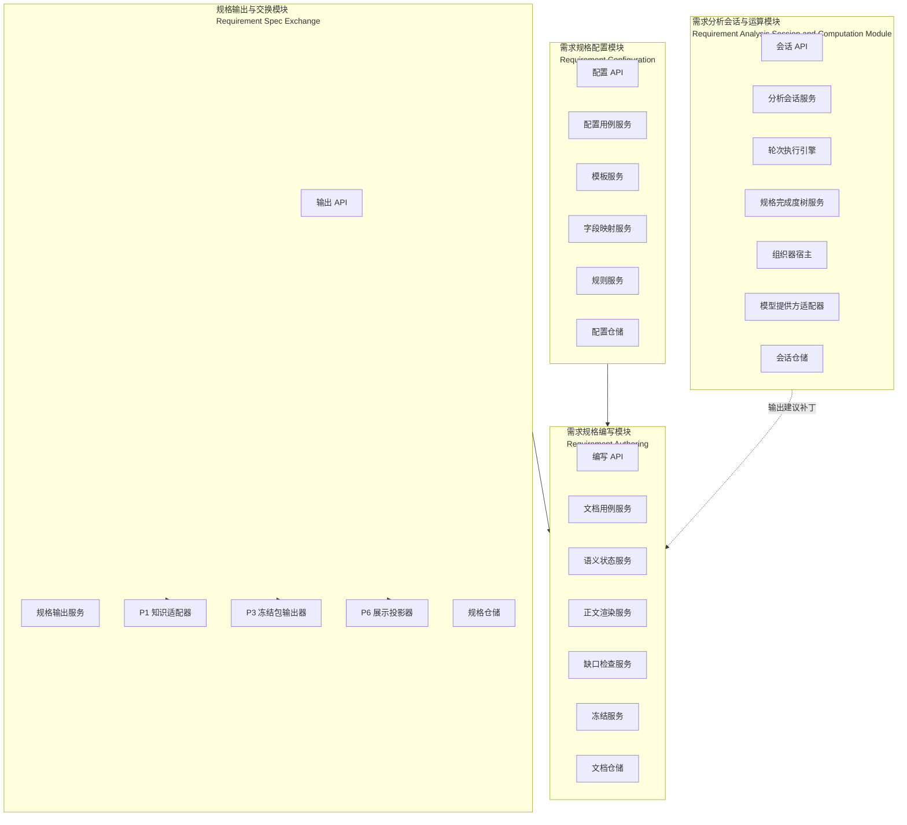

模块与层级关系：

| 后端模块 | API 路由层 | 应用服务层 | 领域能力层 | 策略与适配层 | 持久化层 |
| --- | --- | --- | --- | --- | --- |
| 需求规格编写模块 | 编写 API | 文档用例服务 | 语义状态、正文渲染、批注、缺口、冻结 | 领域知识读取 | 文档仓储 |
| 需求规格配置模块 | 配置 API | 配置用例服务 | 模板校验、映射校验、规则校验 | 无外部依赖或少量校验适配 | 模板仓储 |
| 需求分析会话与运算模块 | 会话 API | 分析会话服务 | 轮次引擎、完成度树、过程产物 | 组织器宿主、模型提供方 | 会话仓储 |
| 规格输出与交换模块 | 输出 API | 输出用例服务 | 冻结包投影、规格包序列化 | `P1`、`P3`、`P6` 适配器 | 规格仓储 |

#### 6.3.1 模块权威状态矩阵

权威状态指“哪个模块有权修改哪类核心事实”。这个矩阵是后端边界的第一约束。

| 后端模块 | 权威对象 | 可写状态 | 只读输入 | 禁止直接写入的对象 |
| --- | --- | --- | --- | --- |
| 需求规格编写模块 | `RequirementAuthoringDocument` | 文档标题、语义状态、正文、对话、批注、检查结果、冻结包、文档状态 | 模板、知识绑定、分析建议补丁 | 模板版本、需求分析会话、结构化规格主记录 |
| 需求规格配置模块 | `RequirementAuthoringTemplate` | 章节结构、表单结构、字段映射、问答策略、缺口规则、模板启停状态 | 无或少量外部校验依赖 | 需求规格文档、需求分析会话、冻结规格 |
| 需求分析会话与运算模块 | 需求分析会话（`RequirementAnalysisSession`） | 会话消息、轮次、完成度树、过程产物、下一轮交互对象、模型调用日志 | 模板、知识包、用户输入 | 需求规格文档正文、冻结包、模板版本 |
| 规格输出与交换模块 | `RequirementSpec` 与导出视图 | 结构化规格记录、对外投影视图、导出包 | 冻结文档、发布态知识、展示请求 | 草稿态需求规格文档、需求分析会话 |

#### 6.3.2 模块间调用规则

后端模块之间允许的调用关系如下：

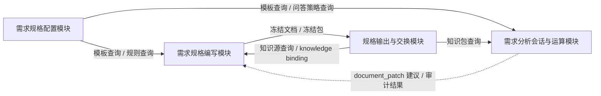

调用约束：

- 编写模块可以读取模板和知识绑定，但不能修改模板定义。
- 分析模块可以读取模板和知识包，但不能直接写文档正文。
- 交换模块只能消费冻结态文档，不读取草稿态文档作为正式输出。
- 配置模块不依赖文档模块和会话模块的运行状态。

### 6.4 需求规格编写模块

#### 6.4.1 模块定义

需求规格编写模块负责支撑专家工作台的核心工作：创建、编辑、保存、检查和冻结一份标准需求规格说明文档。

该模块拥有 `RequirementAuthoringDocument` 的生命周期控制权。问答输入、表单输入和正文编辑都必须汇入同一份文档语义状态。

#### 6.4.2 职责

需求规格编写模块负责：

- 创建需求规格草稿。
- 打开、保存、删除草稿。
- 保存文档名称、模板、领域知识绑定和布局偏好。
- 接收问答输入并更新语义状态。
- 接收表单字段变更并更新语义状态。
- 接收正文条款编辑并更新文档正文。
- 根据模板和语义状态渲染标准正文。
- 生成条款批注。
- 执行缺口检查。
- 冻结文档并生成冻结包。

它不负责：

- 定义模板章节和字段结构。
- 直接调用模型提供方。
- 直接执行组织器策略。
- 直接向 `P3` 推送未冻结草稿。

#### 6.4.3 功能组成

```text
requirement_authoring/
  document_application_service.py   # 文档用例编排
  document_service.py               # 草稿生命周期
  semantic_state_service.py         # 问答、表单、正文到语义状态的归并
  document_renderer.py              # 标准需求规格正文渲染
  annotation_service.py             # 条款批注
  gap_checker.py                    # 缺口检查
  freeze_service.py                 # 冻结包生成
  knowledge_binding_service.py      # 领域知识绑定
  document_repository.py            # 文档持久化
```

#### 6.4.4 输入输出接口

| 接口对象 | 输入 | 输出 | 说明 |
| --- | --- | --- | --- |
| `CreateDocumentCommand` | `template_id`、`title`、`knowledge_binding`、`layout_ratio` | `RequirementAuthoringDocumentDetail` | 新建草稿 |
| `SaveDocumentCommand` | 文档上下文、正文、语义状态、对话、批注、检查结果 | `RequirementAuthoringDocumentDetail` | 保存完整草稿 |
| `AppendQuestionInputCommand` | `document_id`、用户输入 | 更新后的文档详情 | 问答输入写入同一语义状态 |
| `PatchFormFieldsCommand` | `document_id`、字段变更 | 更新后的文档详情 | 表单输入写入同一语义状态 |
| `PatchClauseCommand` | `document_id`、`clause_id`、正文内容 | 更新后的文档详情 | 轻量正文编辑 |
| `RunGapCheckCommand` | `document_id` | 含检查结果的文档详情 | 缺口检查 |
| `FreezeDocumentCommand` | `document_id` | `FrozenRequirementPackage` | 冻结输出 |

#### 6.4.5 内部接口

| 内部服务 | 输入 | 输出 | 调用方 |
| --- | --- | --- | --- |
| `SemanticStateService.apply_question_input` | 旧语义状态、用户输入、模板、知识绑定 | 新语义状态、对话回复建议 | 文档用例服务 |
| `SemanticStateService.apply_form_patch` | 旧语义状态、字段 patch、模板 | 新语义状态 | 文档用例服务 |
| `DocumentRenderer.render` | 模板、语义状态、正文 patch | 标准正文 | 文档用例服务 |
| `AnnotationService.build_annotations` | 模板、语义状态、知识引用、检查结果 | 条款批注 | 文档用例服务 |
| `GapChecker.check` | 模板规则、语义状态、正文 | 缺口检查结果 | 文档用例服务 |
| `FreezeService.freeze` | 文档详情、检查结果 | 冻结包 | 文档用例服务 |

#### 6.4.6 模块不变量

需求规格编写模块必须维护以下不变量：

| 不变量 | 含义 | 破坏后影响 |
| --- | --- | --- |
| 文档绑定模板版本稳定 | 文档创建后绑定确定模板版本 | 历史草稿被新模板结构破坏 |
| 问答、表单、正文同源 | 三种输入都归并到同一 `semantic_state` | 右侧正文、表单和对话互相打架 |
| 标准正文条款有稳定 id | 每个章节、条款、批注和字段映射都可追踪 | 无法保存正文 patch 和条款批注 |
| 冻结前必须通过阻断检查 | 阻断型缺口未通过不能冻结 | `P3` 接收到不完整规格 |
| 冻结后只读 | 冻结包生成后正文和语义状态不可被普通编辑修改 | 下游引用失去稳定性 |

#### 6.4.7 错误处理

| 错误场景 | 处理方式 |
| --- | --- |
| 文档不存在 | 返回 `404 document_not_found` |
| 模板不存在或不可用 | 返回 `400 template_unavailable` |
| 文档已冻结仍尝试编辑 | 返回 `409 document_frozen` |
| 条款 id 不存在 | 返回 `400 clause_not_found` |
| 阻断缺口未通过仍尝试冻结 | 返回 `409 blocking_gap_not_resolved` |
| 保存载荷缺少上下文 | 返回 `400 invalid_document_payload` |

#### 6.4.8 与其他模块边界

| 对方模块 | 编写模块读取 | 编写模块写入 | 边界说明 |
| --- | --- | --- | --- |
| 需求规格配置模块 | 模板、字段映射、问答策略、缺口规则 | 无 | 编写模块只能消费激活模板版本 |
| 需求分析会话与运算模块 | 建议补丁、事实摘要、规格节点引用 | 可选择接收为文档 patch | Lab 输出必须经过确认机制 |
| 规格输出与交换模块 | 知识绑定、知识源信息 | 冻结包、结构化规格输入 | 只有冻结态进入正式交换 |

#### 6.4.9 运行流程

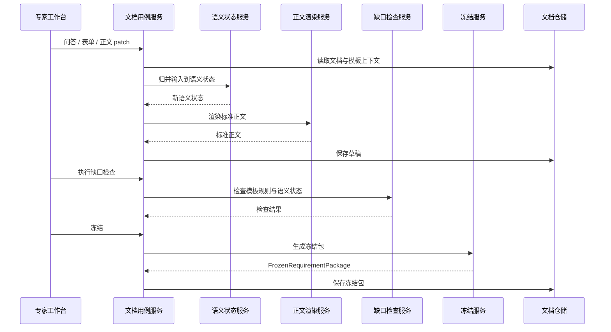

### 6.5 需求规格配置模块

#### 6.5.1 模块定义

需求规格配置模块负责维护专家工作台运行所需的配置对象。它不直接编辑某一份专家草稿，而是定义草稿创建、渲染、检查和冻结时遵循的模板与规则。

#### 6.5.2 职责

需求规格配置模块负责：

- 管理规格模板版本。
- 管理模板章节和条款结构。
- 管理表单字段和字段分组。
- 管理字段到语义状态、正文条款的映射。
- 管理问答策略。
- 管理缺口检查规则。
- 管理领域知识绑定配置。
- 激活、停用或归档模板版本。

它不负责：

- 修改某一份专家草稿。
- 解释用户自然语言输入。
- 生成冻结规格包。
- 判断某一份文档是否可以冻结。

#### 6.5.3 功能组成

```text
requirement_configuration/
  template_application_service.py   # 配置用例编排
  template_service.py               # 模板生命周期
  section_schema_service.py         # 章节与条款结构
  form_schema_service.py            # 表单字段结构
  field_mapping_service.py          # 字段映射
  questionnaire_policy_service.py   # 问答策略
  gap_rule_service.py               # 缺口规则
  template_repository.py            # 模板持久化
```

#### 6.5.4 输入输出接口

| 接口对象 | 输入 | 输出 | 说明 |
| --- | --- | --- | --- |
| `CreateTemplateCommand` | 模板编码、名称、章节、表单、映射、规则 | `RequirementAuthoringTemplate` | 新建模板版本 |
| `UpdateTemplateCommand` | 模板 id、配置 payload | `RequirementAuthoringTemplate` | 修改草稿或未冻结模板 |
| `ActivateTemplateCommand` | 模板 id | 激活后的模板 | 设为可创建文档 |
| `ValidateTemplateCommand` | 模板 payload | 校验结果 | 检查章节、字段、映射和规则一致性 |

#### 6.5.5 配置对象结构

```text
RequirementAuthoringTemplate
  template_id
  template_code
  name
  version
  status
  sections[]
    section_id
    title
    clauses[]
      clause_id
      title
      required_fields[]
      template_text
  form_groups[]
    group_id
    title
    fields[]
      field_key
      label
      type
      required
  field_mappings[]
  questionnaire_policy
  gap_rules[]
  knowledge_bindings
```

#### 6.5.6 模板版本规则

| 规则 | 说明 |
| --- | --- |
| 模板版本不可隐式覆盖 | 修改已被文档引用的模板时，应生成新版本 |
| 文档绑定创建时模板版本 | 旧文档继续使用旧模板版本 |
| 同一模板编码只能有一个激活版本 | 创建新文档时只使用激活版本 |
| 归档版本只读 | 归档版本可被历史文档读取，不能再编辑 |

#### 6.5.7 配置校验规则

模板激活前必须通过校验：

| 校验项 | 校验内容 |
| --- | --- |
| 章节结构 | `section_id` 和 `clause_id` 稳定且唯一 |
| 表单字段 | `field_key` 稳定且唯一，必填字段有类型定义 |
| 字段映射 | 每个映射引用的字段和条款都存在 |
| 问答策略 | 策略引用的字段、章节或条款都存在 |
| 缺口规则 | 阻断型规则有明确条件和提示文案 |
| 知识绑定配置 | 引用的知识源类型可被交换模块识别 |

#### 6.5.8 错误处理

| 错误场景 | 处理方式 |
| --- | --- |
| 模板不存在 | 返回 `404 template_not_found` |
| 模板编码重复 | 返回 `409 template_code_conflict` |
| 激活模板校验失败 | 返回 `409 template_validation_failed` |
| 修改归档模板 | 返回 `409 template_archived` |
| 删除被文档引用的模板版本 | 返回 `409 template_in_use` |

#### 6.5.9 与其他模块边界

| 对方模块 | 配置模块提供 | 配置模块接收 | 边界说明 |
| --- | --- | --- | --- |
| 需求规格编写模块 | 激活模板、模板版本、字段映射、缺口规则 | 无 | 编写模块不能绕过配置模块修改模板 |
| 需求分析会话与运算模块 | 模板结构、问答策略、规格节点结构 | 无 | 组织器按模板组织完成度树 |
| 规格输出与交换模块 | 模板版本元数据 | 无 | 冻结包保留模板版本追溯 |

### 6.6 需求分析会话与运算模块

#### 6.6.1 模块定位、职责与核心概念

需求分析会话与运算模块必须先把“谁管理谁、谁调用谁、谁只是策略载体”讲清楚。核心概念按父子层级定义如下。

| 序号 | 中文概念 | 英文实现名 | 层级关系 | 定义 |
| --- | --- | --- | --- | --- |
| 1 | 需求分析会话与运算模块 | 无单独类名 | `P2` 后端业务模块 | 承载问答式需求收敛能力的后端业务模块。它对外提供分析会话 API，对内管理多个需求分析会话，调度轮次执行，装载需求分析组织器对象，调用模型提供方，并保存审计结果。它的本质是“会话管理 + 轮次运算”的系统模块，而不是某一个组织器，也不是模型代理。 |
| 2 | 需求分析会话 | `RequirementAnalysisSession` | 模块管理的会话聚合对象 | 围绕一个需求规格课题持续收敛的多轮容器。同一时间模块可以管理多个会话；每个会话只绑定一个当前组织器对象、一个当前模板、一个知识上下文和一组轮次历史。会话保存长期状态，包括完成度树、事实、问题、补丁建议、下一轮交互对象和模型调用日志。 |
| 3 | 需求分析轮次 | `RequirementAnalysisTurn` | 会话下的单轮处理记录 | 一次用户输入触发一个轮次。轮次属于某个会话，是会话的历史组成部分和审计单元；它不是组织器直接持有的长期对象。轮次记录本轮输入、输入关系、阶段执行、规格补充、补充后回看、闭环判断和下一轮交互对象。 |
| 4 | 需求分析组织器对象 | `RequirementAnalysisOrchestrator` | 会话执行时选用的策略对象 | 面向需求规格收敛目标的策略对象。它规定一轮轮次如何拆分阶段、哪些阶段调用模型、模型输入上下文和输出 schema 是什么、候选结果如何被采纳，以及多轮会话如何沿完成度树推进。它不是后端业务模块，也不保存会话权威状态。 |
| 5 | 组织器描述包 | `Orchestrator Package` | 组织器对象的可导入描述载体 | 对一个组织器对象的文件化描述和交付包，包含 manifest、契约、策略、提示词、规则、runner、样例和测试。它描述“这个组织器如何工作”，不负责运行自己。 |
| 6 | 组织器宿主 | `Orchestrator Host` | 运行组织器描述包的基础设施 | 后端运行时组件，负责发现和装载组织器描述包、校验契约、组装上下文、调用模型提供方或本地 runner，并把阶段候选结果交给轮次引擎。它不拥有组织器策略，也不拥有正式文档状态。 |
| 7 | 模型提供方 | `Provider` | 组织器可调用的外部语义能力适配 | 模型调用适配能力，负责 API Key、base URL、model、request / response、基础解析和调用错误。它只提供候选语义输出，不拥有需求规格树，不决定轮次流程。 |

这几个概念的父子与调用关系如下。该图只表达静态归属和调用边界，不表达运行时加载顺序；运行时装载顺序见 6.6.1.1。

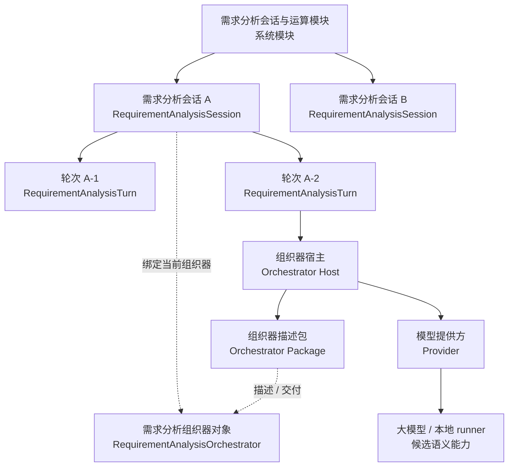

从运行关系看：

1. 需求分析会话与运算模块是父级业务模块，可以同时管理多个需求分析会话。
2. 需求分析会话是模块内的长期状态对象；一个会话对应一个需求规格课题，可以包含多轮需求分析轮次。
3. 需求分析轮次是会话内的单轮处理记录；轮次不会脱离会话单独存在。
4. 需求分析组织器对象是会话执行时选用的策略对象；会话绑定它，轮次执行时使用它，但它不保存会话长期状态。
5. 组织器描述包是组织器对象的文件化描述；组织器宿主读取描述包，把策略转化为可执行阶段。
6. 组织器宿主是运行基础设施；它根据轮次上下文和组织器描述包执行阶段，必要时调用模型提供方或本地 runner。
7. 模型提供方只返回候选理解、候选正文补丁、候选回看和候选下一轮交互；最终采纳结果必须由轮次引擎和组织器策略共同收束。
8. 轮次结果最终回写到需求分析会话，供下一轮继续收敛。

因此，需求分析组织器对象不是“替用户聊天”的能力，而是“把多轮自然输入组织成可审计需求规格补充”的策略能力；需求分析会话与运算模块不是“一个组织器”，而是运行会话、轮次、组织器描述包、宿主和模型提供方的系统模块。

在 `P2` 语境中，需求分析组织器对象（`RequirementAnalysisOrchestrator`）是通用组织器（`Orchestrator`）抽象在需求规格说明领域的业务实例，也可称为需求规格组织器（`XG Orchestrator`）。它只处理需求规格说明收敛，不承担 `P3` 软件设计说明或其他文档类型的组织规则。

该模块不直接写正式需求规格文档。它输出的是可审计的理解结果、规格节点状态和建议补丁。正式写入由需求规格编写模块接收和确认。

该模块必须遵守两个边界：

- `组织器对象` 是轮次处理策略的载体，决定一轮输入分几步处理、哪些阶段调用模型、模型结果如何被采纳。
- `大模型` 是组织器可调用的语义能力，只产生候选理解、候选正文、候选回看和候选下一步，不拥有会话状态和正式文档控制权。

##### 6.6.1.1 运行装载生命周期

运行装载生命周期用于说明“哪些对象先被发现或加载，哪些对象只在会话或轮次中被调用”。它和前面的父子调用关系图不同：父子调用关系图描述静态边界，生命周期图描述运行时顺序。

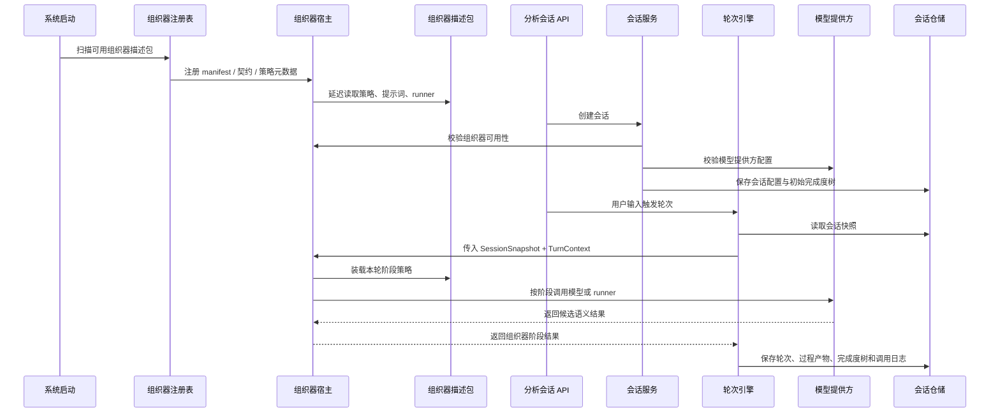

生命周期约束如下：

| 时点 | 装载 / 调用内容 | 说明 |
| --- | --- | --- |
| 系统启动 | 组织器注册表、组织器描述包元数据 | 只发现和注册可用组织器，不创建会话，不执行模型调用 |
| 会话创建 | 模板、知识包引用、组织器 id、模型提供方配置 | 只建立会话长期状态和初始完成度树，不真正执行组织器阶段 |
| 轮次开始 | 会话快照、上一轮交互对象、本轮用户输入 | 轮次引擎创建轮次并组装 `TurnContext` |
| 组织器执行 | 组织器描述包的阶段策略、提示词、runner | 组织器通过宿主被调用，只读取上下文并返回候选结果 |
| 模型调用 | 模型提供方 request / response | 只在组织器阶段需要语义能力时发生 |
| 轮次收束 | 候选结果校验、节点投影、过程产物、调用日志 | 轮次引擎决定哪些候选进入会话权威状态 |

因此，不能把父子调用关系图理解成“箭头驱动加载”。真实顺序是：系统先发现组织器能力，会话创建时绑定策略和上下文，轮次执行时才真正装载阶段策略并调用模型提供方。

##### 6.6.1.2 职责与责任划分

需求分析会话与运算模块负责：

- 创建、读取和保存需求分析会话（`RequirementAnalysisSession`）。
- 在会话内按用户输入创建新的需求分析轮次（`RequirementAnalysisTurn`）。
- 装载并执行需求分析组织器对象（`RequirementAnalysisOrchestrator`）。
- 维护完成度树、事实、待确认问题、风险和正文补丁建议。
- 判断本轮用户输入与上一轮交互对象的关系。
- 在单轮次内组织阶段化处理和模型调用。
- 生成当前轮次审计链（`Current Turn`）。
- 生成下一轮交互对象。
- 记录可审计的模型提供方调用日志（`Provider` 调用日志）。

它不负责：

- 决定正式需求规格正文最终是否写入。
- 冻结需求规格文档。
- 修改规格模板。
- 管理模型 API Key 的持久化配置界面。
- 让大模型直接拥有会话状态或正式文档控制权。

责任划分如下：

| 子能力 | 主要对象 | 责任 |
| --- | --- | --- |
| 会话生命周期 | 需求分析会话（`RequirementAnalysisSession`） | 创建会话、保存多轮状态、绑定模板 / 知识 / 组织器对象 / 模型提供方 |
| 单轮执行 | 需求分析轮次（`RequirementAnalysisTurn`）、`TurnEngine` | 以用户输入创建轮次，执行阶段，生成最终轮次结果 |
| 策略组织 | 需求分析组织器对象（`RequirementAnalysisOrchestrator`） | 声明阶段、模型调用、上下文、采纳规则和下一轮交互策略 |
| 包装载与运行 | `OrchestratorHost` | 装载组织器描述包，校验契约，调用模型提供方或 runner |
| 模型适配 | 模型提供方（`Provider`） | 执行模型 API 调用，记录 request / response / 归一化输出 |
| 审计展示 | `TurnAuditService`、`ProviderCallLogService` | 还原本轮决策链和每次模型调用链路 |

#### 6.6.2 状态机设计

状态机设计只回答“有哪些状态、状态由谁拥有、什么事件触发转移、哪些转移合法、失败进入哪里”。它不展开每个状态内部由哪些类执行；执行细化放在后续模块运行编排、会话生命周期和轮次执行章节中。

`P2` 的需求分析能力不能只从“轮次”开始理解。轮次只是一次用户输入触发的单轮处理记录；它上面还有模块级 API 编排和会话级长期状态，下面还有组织器阶段和模型调用。

整体关系如下：

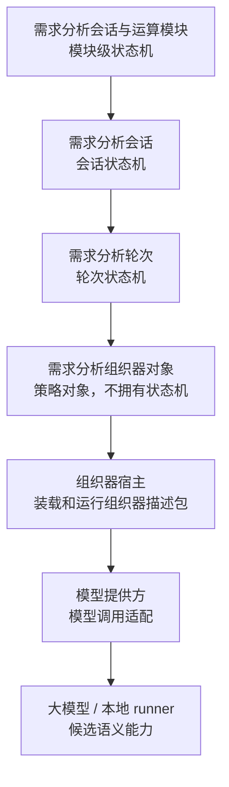

##### 6.6.2.1 状态机分层

状态机分为三层：

| 层级 | 管理对象 | 起点 | 终点 | 责任 |
| --- | --- | --- | --- | --- |
| 模块级状态机 | 需求分析会话与运算模块 | 接收会话 API 请求 | 返回会话、轮次、日志或错误 | 校验请求、控制事务、调用会话服务、保证状态落库和审计完整 |
| 会话状态机 | 需求分析会话 | 创建会话并绑定模板、知识、组织器对象和模型提供方 | 会话完成、归档、删除或进入错误状态 | 保存多轮上下文、完成度树、事实、问题、patch、下一轮交互对象和模型调用日志 |
| 轮次状态机 | 需求分析轮次 | 会话处于可运行状态且收到一次用户输入 | 本轮结果写回会话并生成下一轮交互对象 | 组装轮次上下文、调用组织器、校验候选结果、投影规格节点、保存审计链 |

##### 6.6.2.2 状态机与执行设计对应关系

状态机章节与后续执行设计章节必须一一对账。

| 状态机层级 | 本节定义内容 | 后续执行设计章节 | 执行设计展开内容 |
| --- | --- | --- | --- |
| 模块级状态机 | API 请求进入模块后的请求态、事务态和错误态 | 6.6.3 模块运行编排设计 | API 命令如何路由到会话服务、轮次引擎、组织器宿主和仓储 |
| 会话状态机 | 会话从创建、配置、等待输入、运行轮次到完成 / 失败的长期状态 | 6.6.4 会话对象与生命周期设计 | 会话保存哪些字段、哪些服务可写会话状态、轮次结果如何回写 |
| 轮次状态机 | 一次用户输入在 `RunningTurn` 内部如何被处理和审计 | 6.6.5 轮次执行设计 | 轮次上下文、阶段执行、模型调用、投影、收束和审计落库 |

因此，本节只定义状态骨架；后续章节再说明骨架中的每个状态怎样落到服务、类、输入输出和持久化。

##### 6.6.2.3 模块级状态机

模块级状态机是一次 API 请求进入需求分析会话与运算模块后的用例状态机。它不是持久化业务对象，但必须约束请求如何进入会话状态机和轮次状态机。

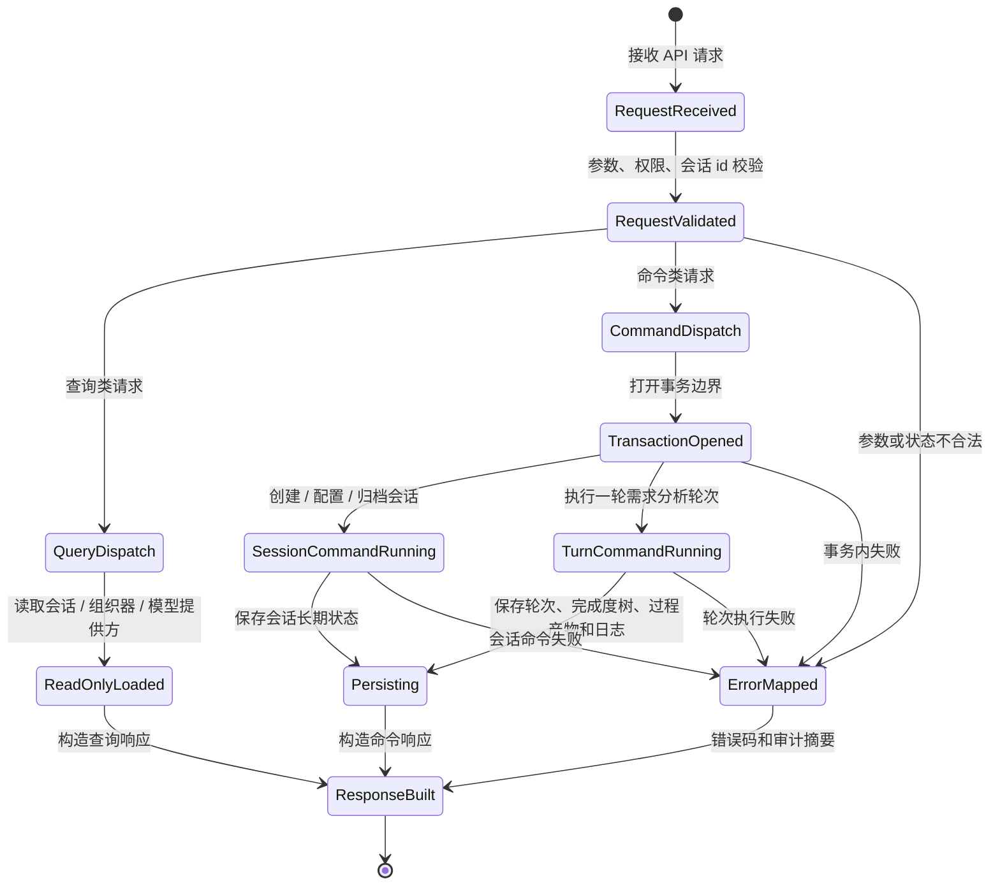

模块级状态机的核心约束：

- 查询类请求只能读取状态，不能触发组织器阶段或模型调用。
- 命令类请求必须进入事务边界，不能半写会话状态。
- 创建会话只进入会话状态机，不执行轮次状态机。
- 执行轮次必须先确认会话处于可运行状态，再进入轮次状态机。
- 组织器输出失败、模型调用失败或契约校验失败，必须被映射为明确错误或兜底结果，不能让前端拿到半成品状态。

##### 6.6.2.4 会话状态机

会话状态机的目标状态如下：

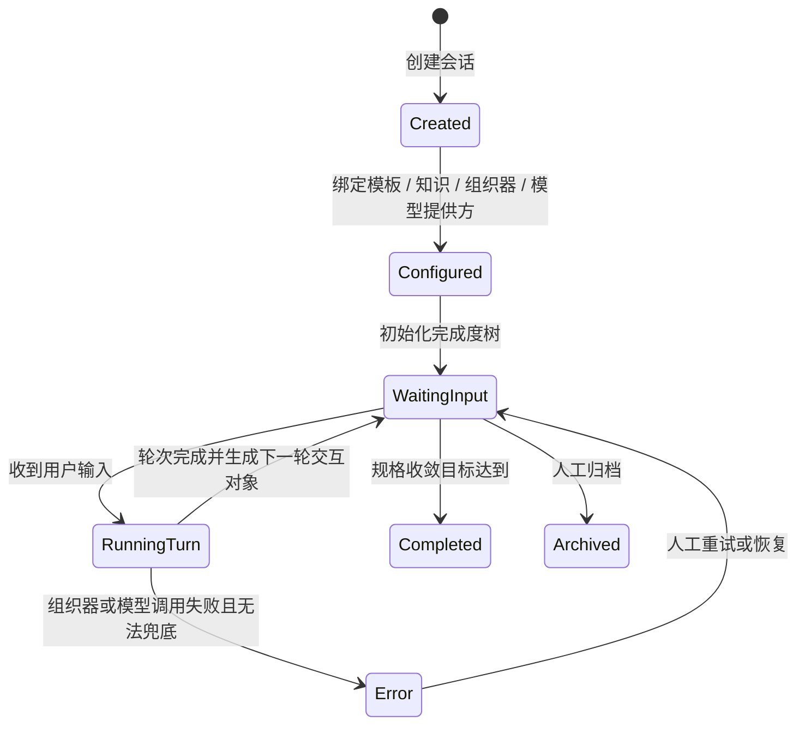

会话状态机的核心约束：

- `Created` 和 `Configured` 用于区分“会话对象已存在”和“可进入用户输入”的状态。
- 只有 `WaitingInput` 可以接收新的用户输入。
- `RunningTurn` 是会话状态，不是轮次状态；它表示会话正在被某一轮占用。
- 轮次失败后是否回到 `WaitingInput`，取决于错误是否可兜底或可重试。
- `Completed` 和 `Archived` 不再接收新的轮次，除非后续定义显式恢复动作。

##### 6.6.2.5 轮次状态机

轮次状态机只在会话状态 `RunningTurn` 内部运行。它的目标不是管理整个会话，而是把一次用户输入变成一次可审计的规格补充。

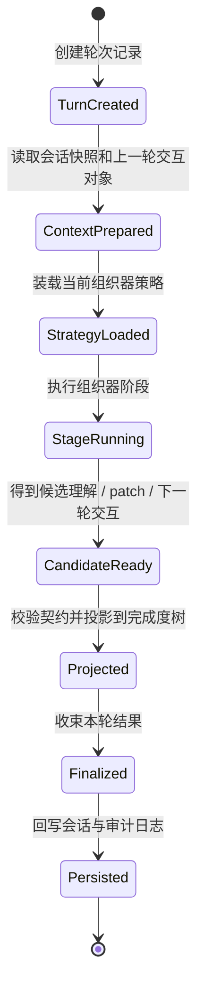

轮次状态机的核心约束：

- 轮次起点永远是本轮用户输入，上一轮交互对象只是上下文。
- 组织器阶段只在 `StageRunning` 内部被调用。
- 模型调用只允许发生在组织器声明的阶段中。
- `CandidateReady` 仍是候选状态，不能直接写会话权威状态。
- 只有 `Persisted` 完成后，会话才能从 `RunningTurn` 回到 `WaitingInput`。

##### 6.6.2.6 状态机边界

状态机拥有者与被调用对象必须分开。

| 对象 | 是否拥有状态机 | 状态机角色 | 边界 |
| --- | --- | --- | --- |
| 需求分析会话与运算模块 | 是 | 拥有模块级请求状态机 | 负责 API 用例编排、事务、错误映射和审计完整性 |
| 需求分析会话 | 是 | 拥有会话长期状态机 | 保存多轮上下文、完成度树、事实、问题、patch、下一轮交互对象和模型调用日志 |
| 需求分析轮次 | 是 | 拥有单轮执行状态机 | 记录一次用户输入如何被处理、哪些阶段被执行、哪些结果被采纳 |
| 需求分析组织器对象 | 否 | 被轮次状态机调用的策略对象 | 声明阶段、模型调用、采纳规则和下一轮交互策略，不保存会话权威状态 |
| 组织器宿主 | 否 | 被组织器运行子模块调用的基础设施 | 装载组织器描述包、执行 runner、代组织器调用模型提供方 |
| 模型提供方 | 否 | 被组织器阶段调用的适配能力 | 管理 base URL、model、request / response、基础解析和调用错误 |

由此得到三个基本原则：

1. 会话状态机属于需求分析会话与运算模块，不属于组织器。
2. 组织器需要读取当前轮次上下文，但不拥有当前轮次。
3. 大模型只提供候选语义能力；候选结果能否进入会话状态，必须由组织器策略和轮次引擎共同约束。

#### 6.6.3 模块运行编排设计

模块运行编排设计对应 6.6.2.3 的模块级状态机，回答“一次 API 请求进入模块后，怎样被路由、事务化、调用下级服务并返回结果”。它不描述会话字段细节，也不描述轮次内部阶段细节。

模块级入口分为四类：

| 入口类型 | API / 命令 | 是否进入事务 | 是否进入会话状态机 | 是否进入轮次状态机 |
| --- | --- | --- | --- | --- |
| 能力查询 | `ListOrchestratorsQuery`、`ListProvidersQuery` | 否 | 否 | 否 |
| 会话查询 | `GetAnalysisSessionQuery` | 否 | 只读取 | 否 |
| 会话命令 | `CreateAnalysisSessionCommand`、归档 / 恢复命令 | 是 | 是 | 否 |
| 轮次命令 | `RunTurnCommand` | 是 | 是 | 是 |

模块运行编排如下：

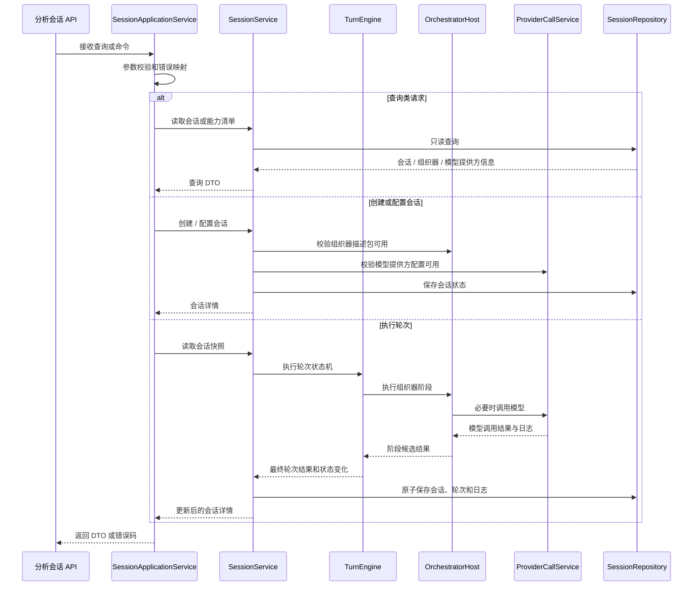

模块编排写入边界如下：

| 编排动作 | 可写对象 | 禁止写入 |
| --- | --- | --- |
| 创建会话 | 会话配置、初始完成度树、初始下一轮交互对象 | 正式需求规格文档正文 |
| 执行轮次 | 会话状态、轮次记录、完成度树、过程产物、模型调用日志 | 模板定义、冻结包、正式文档正文 |
| 归档会话 | 会话状态、更新时间 | 轮次历史、模型调用日志内容 |
| 查询能力 | 无写入 | 所有业务状态 |

模块级错误处理原则：

- 参数错误、会话不存在、组织器不可用、模型提供方不可用应在模块级映射为稳定错误码。
- 轮次内部阶段失败必须保存可审计摘要，不能丢失已发生的模型调用日志。
- 事务失败时不得部分保存完成度树或过程产物。
- 查询类请求不得触发模型调用。

#### 6.6.4 会话对象与生命周期设计

需求分析会话是长期状态对象，不是某一轮执行对象。轮次结束后，轮次结果必须回写到会话；组织器读取的是会话快照，而不是持有会话本体。

会话至少保存：

- 课题、模板、知识包、组织器对象和模型提供方绑定。
- 当前完成度树、当前活动节点、事实、问题、patch、风险。
- 消息历史、轮次历史、下一轮交互对象。
- 组织器自身可序列化状态和模型调用日志。

会话属性分组如下：

| 属性组 | 字段 | 说明 |
| --- | --- | --- |
| 身份与配置 | `session_id`、`topic`、`status`、`template_id`、`knowledge_package_id`、`provider_id`、`model`、`write_policy` | 决定会话服务于哪个需求规格课题，以及使用哪套模板、知识、组织器和模型提供方 |
| 组织器绑定 | `orchestrator_id`、`orchestrator_state`、`strategy_version` | 表示当前会话选用的组织器对象和可序列化策略状态 |
| 规格收敛状态 | `spec_tree`、`active_spec_node_id`、`artifacts`、`next_interaction` | 表示会话当前推进到哪里、已确认什么、还缺什么、下一轮建议怎么继续 |
| 历史与审计 | `messages`、`turns`、`provider_call_logs`、`created_at`、`updated_at` | 保存对话展示、轮次审计和模型调用审计 |

会话给组织器提供只读会话快照（`SessionSnapshot`）。该快照用于让组织器知道当前上下文，但不能让组织器直接修改会话权威状态。

```text
SessionSnapshot
  session_id
  topic
  template_id
  knowledge_package_id
  spec_tree
  artifacts
  previous_interaction
  recent_turn_summaries[]
```

会话中的 `orchestrator_state` 只保存组织器可序列化状态，例如偏好、阶段游标或启发式策略参数。它不是会话权威状态，也不能绕过轮次引擎直接修改完成度树。

会话状态写入规则：

- 只有会话服务和轮次引擎可以更新会话权威状态。
- 组织器只能读取 `SessionSnapshot`，返回候选阶段结果。
- 模型提供方只能记录模型调用输入输出，不写会话状态。
- Lab 会话不得直接写正式需求规格文档；若进入专家工作台，必须通过 `document_patch` 接收和确认机制进入 `RequirementAuthoringDocument`。

会话生命周期与类的对应关系如下：

| 生命周期动作 | 入口类 / 服务 | 主要写入对象 | 说明 |
| --- | --- | --- | --- |
| 创建会话 | `SessionApplicationService`、`SessionService` | `RequirementAnalysisSession` | 校验模板、知识包、组织器和模型提供方，生成初始会话 |
| 初始化完成度树 | `SessionService`、`SpecTreeService` | `spec_tree`、`active_spec_node_id` | 根据模板结构生成会话内的规格完成度树 |
| 读取会话快照 | `SessionService.load_snapshot` | 无写入 | 为轮次引擎和组织器提供只读 `SessionSnapshot` |
| 回写轮次结果 | `TurnEngine`、`SessionService` | `turns`、`spec_tree`、`artifacts`、`next_interaction`、`provider_call_logs` | 把单轮结果合并回会话长期状态 |
| 归档或完成 | `SessionService` | `status`、`updated_at` | 会话停止继续收敛，但不影响正式需求规格文档 |

##### 6.6.4.1 规格收敛状态对象

规格收敛状态对象是需求分析会话内部的运行态对象，用于描述当前会话距离“可形成需求规格说明补充”的状态。它不是需求规格模板，也不是正式需求规格正文。

模板提供静态结构，规格收敛状态对象提供运行态进度：

| 对象 | 归属 | 性质 | 说明 |
| --- | --- | --- | --- |
| 需求规格模板 | 需求规格配置模块 | 静态配置 | 定义章节、条款、字段、缺口规则和问答策略 |
| 需求规格完成度树（`spec_tree`） | 需求分析会话 | 运行态状态 | 根据模板章节和条款生成，记录每个规格节点的状态、摘要和最近影响轮次 |
| 当前活动节点（`active_spec_node_id`） | 需求分析会话 | 运行态指针 | 表示当前默认工作焦点，不是强制解释框架 |
| 过程产物（`artifacts`） | 需求分析会话 | 运行态过程结果 | 保存事实、待确认问题、正文补丁、风险等过程信息 |
| 下一轮交互对象（`next_interaction`） | 需求分析会话 | 运行态交互建议 | 保存下一轮建议问题、选项或空等待状态 |

这些对象共同构成会话的“规格收敛状态”。其中，`spec_tree` 是结构主轴，`active_spec_node_id` 是默认焦点，`artifacts` 是过程内容，`next_interaction` 是下一轮交互出口。

设计约束如下：

- `spec_tree` 由模板结构初始化，但一旦进入会话，就是会话状态，不再等同于模板。
- `active_spec_node_id` 只能作为默认焦点，不能把用户输入强行解释为该节点答案。
- `artifacts` 可以引用 `spec_tree` 节点，也可以暂时进入未绑定补充队列。
- `next_interaction` 可以指向某个 `spec_tree` 节点，也可以是自由建议或空等待。
- 正式需求规格文档是否接收这些结果，仍由需求规格编写模块决定。

#### 6.6.5 轮次执行设计

轮次阶段化执行闭环只描述会话状态 `RunningTurn` 内部的处理过程，不是完整系统状态机。完整状态机已经在 6.6.2 中定义；本节只回答“一次用户输入进入既有会话后，本轮怎样被处理、审计并回写会话”。

轮次是单轮执行和审计对象。它不保存长期记忆，也不脱离需求分析会话单独存在。每次用户输入都会创建新的轮次；轮次执行结束后，最终结果回写到会话。

轮次属性分组如下：

| 属性组 | 字段 | 说明 |
| --- | --- | --- |
| 身份与输入 | `turn_id`、`session_id`、`turn_index`、`previous_interaction`、`user_input`、`normalized_input` | 标识本轮属于哪个会话、是第几轮、用户输入是什么 |
| 上下文判断 | `input_relation`、`turn_context`、`active_spec_node_id` | 记录本轮与上一轮交互对象和当前完成度树的关系 |
| 阶段执行 | `stage_results`、`provider_call_logs`、`strategy_version` | 保存组织器阶段结果和模型调用审计引用 |
| 规格补充 | `turn_interpretation`、`spec_execution`、`post_update_review` | 记录本轮如何理解输入、影响哪些节点、补充后如何回看 |
| 收束结果 | `closure_decision`、`next_interaction`、`decision_trace`、`created_at` | 记录本轮是否闭合、下一轮如何继续、关键决策依据 |

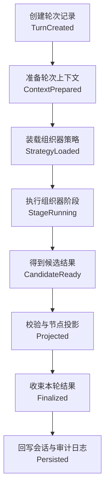

该闭环服务于三个目标：

- 让组织器行为可审计。
- 让不同组织器遵守同一输入输出契约。
- 让模型调用只出现在明确阶段中，避免把“组织器策略”退化成一次大模型黑盒输出。

轮次状态与阶段职责如下：

| 轮次状态 | 主要阶段 | 归属 | 是否调用模型 | 输出 |
| --- | --- | --- | --- | --- |
| `TurnCreated` | 创建轮次编号和初始审计记录 | 轮次引擎 | 否 | `turn_id`、`turn_index`、初始状态 |
| `ContextPrepared` | 读取会话快照、归一化用户输入、解析上一轮交互对象、判断输入关系 | 轮次引擎 + 输入处理服务 | 可选 | `SessionSnapshot`、`TurnContext`、`input_relation` |
| `StrategyLoaded` | 装载组织器描述包并解析本轮策略 | 组织器宿主 + 组织器对象 | 否 | `XGTurnStrategy` |
| `StageRunning` | 执行 `understand_and_write`、`review_after_update` 等组织器阶段 | 组织器对象 + 组织器宿主 | 可选 | 阶段候选结果和模型调用日志 |
| `CandidateReady` | 汇总阶段候选理解、正文补丁、回看和下一轮交互 | 组织器对象 | 否 | `OrchestratorStageResult[]` |
| `Projected` | 校验契约、投影规格节点、对齐 patch、更新过程产物候选 | 轮次引擎 + 规格投影服务 | 否 | `projected_nodes`、`state_changes`、`document_patches` |
| `Finalized` | 采纳 / 修正候选结果，形成闭环判断和下一轮交互对象 | 轮次引擎 + 组织器策略 | 否 | `RequirementAnalysisTurnResult` |
| `Persisted` | 保存轮次、过程产物、完成度树和模型调用日志 | 会话服务 + 仓储 | 否 | 更新后的需求分析会话 |

轮次阶段与类职责映射如下：

| 轮次阶段 | 主责类 / 服务 | 协作类 / 服务 | 写入边界 |
| --- | --- | --- | --- |
| `TurnCreated` | `TurnEngine` | `SessionService` | 只创建轮次初始记录，不修改完成度树 |
| `ContextPrepared` | `TurnContextBuilder` | `InputNormalizer`、`InputRelationClassifier`、`SessionService` | 只生成 `TurnContext`，不采纳业务结果 |
| `StrategyLoaded` | `TurnStrategyService` | `OrchestratorHost`、`ContractValidator` | 只读取组织器策略，不写会话状态 |
| `StageRunning` | `TurnStageExecutor` | `OrchestratorHost`、`ProviderCallService` | 只产生阶段候选和模型调用日志 |
| `CandidateReady` | `OrchestratorHost` | `TurnStageExecutor` | 返回 `OrchestratorStageResult[]`，仍是候选状态 |
| `Projected` | `SpecProjectionService` | `SpecTreeService`、`ProcessArtifactService` | 生成待采纳的节点投影和过程产物变化 |
| `Finalized` | `TurnEngine` | `NextInteractionService`、`TurnAuditService` | 形成最终 `RequirementAnalysisTurnResult` |
| `Persisted` | `SessionService`、`SessionRepository` | `ProviderCallLogService` | 回写会话长期状态和审计日志 |

轮次写入规则：

- `TurnEngine` 是单轮执行的唯一收束者，组织器和模型提供方不能直接写会话仓储。
- `TurnContextBuilder` 只组装上下文，不负责解释业务结论。
- `SpecProjectionService` 只生成节点投影和候选状态变化，最终采纳必须由 `TurnEngine` 完成。
- `ProviderCallService` 只记录模型调用事实，不能决定 `closure_decision`。
- `TurnAuditService` 只构造审计视图，不反向改变轮次结果。

##### 6.6.5.1 轮次内模型调用策略

一轮需求分析轮次可以包含一次或多次模型调用，调用次数由组织器声明。系统不要求所有组织器都使用同一种调用策略。

推荐定义三种标准策略：

| 策略 | 模型调用次数 | 阶段 | 优点 | 风险 |
| --- | --- | --- | --- | --- |
| `single_call` | 1 次 | 一次性生成理解、正文补丁、回看和下一轮建议 | 成本低、速度快、实现简单 | 容易匆忙推进，模型同时承担过多判断 |
| `write_then_review` | 2 次 | 第一次理解并补写，第二次回看补写结果并设计下一轮 | 更接近启发式协作，便于发现缺口 | 成本和延迟增加，需要合并两次输出 |
| `strict_pipeline` | 3 次或以上 | 意图理解、正文生成、审查 / 收束分开调用 | 审计清晰，适合高可靠验证 | 实现复杂，响应较慢 |

`P2` 当前 Lab 的启发式组织器目标应优先验证 `write_then_review`。其标准流程如下：

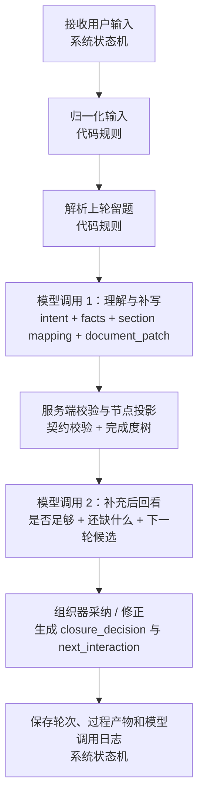

该流程的关键约束：

- 第一段模型调用只负责“理解和补写”，不直接决定本轮是否关闭。
- 服务端必须先把候选事实和正文补丁投影到完成度树，再进入回看。
- 第二段模型调用只能基于“补充后的状态”判断是否足够、是否继续追问或推进下一节点。
- `next_interaction` 是组织器最终输出，不是模型原样输出；模型只生成候选。
- 每次模型调用都必须生成独立的模型调用日志（`ProviderCallLog`），并记录各自的 `provider_request / provider_response / provider_normalized_output / service_output`。

##### 6.6.5.2 输入投影与 Active 节点规则

输入投影作用于会话的规格收敛状态对象。这里的完成度树指 `spec_tree`，它是根据需求规格模板生成的会话运行态结构，不是模板本体。

`active_spec_node_id` 只是默认工作焦点，不是强制解释框架。用户本轮输入可以：

- 回答上一轮留题。
- 补充当前 active 节点。
- 跳到其他规格章节。
- 反驳上一轮方向。
- 提出与模板节点无直接对应的新约束。

因此轮次执行必须做“输入投影”判断：根据用户输入、上轮留题、当前完成度树和模板章节语义，选择本轮最合理影响的规格节点。不能因为当前 active 节点是某章节，就把所有输入都强行解释为该章节答案。

输入投影可以由模型生成候选，但最终必须通过服务端校验：

- 如果模型给出的章节能匹配 `spec_tree.target_section`，可作为投影节点。
- 如果不能匹配，应回退到 active 节点或进入未绑定补充队列。
- 投影结果必须写入轮次审计链，供当前轮次审计视图解释“为什么本轮影响这些节点”。

#### 6.6.6 模块接口设计

模块接口设计分为外部接口和内部接口。外部接口面向 API 调用者和模块外部协作方；内部接口面向模块内部服务、组织器宿主、组织器对象和模型提供方之间的调用关系。

##### 6.6.6.1 外部接口

对外接口面向需求分析会话和需求分析轮次，不面向组织器对象本身。组织器对象是会话运行时选用的策略对象，不能成为绕过会话状态机的独立 API 入口。

对外接口保持稳定，不因组织器内部调用次数变化而变化。

| 接口对象 | 输入 | 输出 | 说明 |
| --- | --- | --- | --- |
| `CreateAnalysisSessionCommand` | 课题、组织器 id、模型提供方、模板、知识包、写入策略 | `RequirementAnalysisSessionDetail` | 创建会话，进入会话状态机，不执行组织器阶段 |
| `RunTurnCommand` | `session_id`、用户输入 | 更新后的会话详情 | 在既有会话中创建需求分析轮次，并触发轮次状态机 |
| `GetAnalysisSessionQuery` | `session_id` | `RequirementAnalysisSessionDetail` | 读取会话长期状态、轮次历史、完成度树和日志 |
| `ListOrchestratorsQuery` | 无 | 组织器清单 | 显示可替换组织器描述包，不直接运行组织器 |
| `ListProvidersQuery` | 无 | 模型提供方清单 | 显示可用模型提供方 |

外部接口边界约束：

- 外部调用者只能通过会话和轮次入口驱动系统，不能直接调用组织器对象。
- 外部接口只暴露稳定用例对象，不暴露内部阶段对象或内部快照对象。
- 外部接口的稳定性高于组织器内部实现；组织器可以替换，但会话和轮次入口不应频繁变动。

##### 6.6.6.2 内部接口

内部接口用于约束会话服务、轮次引擎、组织器对象、组织器宿主和模型提供方之间的调用关系与数据交换。它不面向 API 使用者，而面向模块内部协作和可替换组织器运行。

组织器契约不能再被理解为“模型一次性返回完整轮次结果”。契约必须同时描述输入和输出：输入用于说明组织器如何知道当前轮次，输出用于说明组织器只能返回候选结果，最终结果由轮次引擎采纳。

组织器输入分为三层：

| 输入层 | 产生者 | 作用 |
| --- | --- | --- |
| `SessionSnapshot` | 会话服务 | 只读会话快照，包括模板、知识、完成度树、事实、问题、patch、上一轮交互对象和近期摘要 |
| `TurnContext` | 轮次引擎 | 本轮执行上下文，包括 `turn_id`、轮次序号、用户输入、归一化输入、输入关系和当前活动节点 |
| `OrchestratorState` | 会话服务 + 组织器对象 | 组织器自身可序列化状态，例如偏好、阶段游标、启发式策略参数；它不是会话权威状态 |

组织器输入示例：

```text
OrchestratorRunInput
  session_snapshot
    session_id
    topic
    template_id
    knowledge_package_id
    spec_tree
    artifacts
    previous_interaction
    recent_turn_summaries[]
  turn_context
    turn_id
    turn_index
    user_input
    normalized_input
    input_relation
    active_spec_node_id
  orchestrator_state
    orchestrator_id
    mode
    strategy_version
    state_json
```

目标设计将输出分为三层：

| 层 | 产生者 | 作用 |
| --- | --- | --- |
| `ModelStageResult` | 大模型 / 本地 runner | 某个阶段的候选输出，例如理解候选、正文候选、回看候选 |
| `OrchestratorStageResult` | 组织器 | 对阶段候选进行采纳、修正、丢弃或补齐后的阶段结果 |
| `RequirementAnalysisTurnResult` | 轮次引擎 | 系统最终保存和展示的一轮轮次结果 |

阶段候选输出示例：

```text
ModelStageResult
  stage_id
  stage_type
  provider_call_id
  candidate
    turn_interpretation
    confirmed_facts_delta[]
    candidate_affected_nodes[]
    document_patch[]
    sufficiency_review
    next_interaction_candidate
  raw_provider_response
```

组织器阶段输出示例：

```text
OrchestratorStageResult
  stage_id
  stage_type
  accepted_fields[]
  rejected_fields[]
  normalized_output
  validation_notes[]
  provider_call_log_id
```

最终轮次输出示例：

```text
RequirementAnalysisTurnResult
  previous_interaction
  normalized_input
  input_relation
  turn_interpretation
  spec_execution
    affected_nodes[]
    document_patches[]
    state_changes[]
  post_update_review
    summary
    remaining_gaps[]
  closure_decision
    status
    reason
    next_action
  next_interaction
    type
    prompt
    options[]
  decision_trace[]
  provider_call_logs[]
```

契约约束：

- `turn_interpretation` 表示系统对本轮用户输入的结构化理解，包括意图、上下文承接、关键事实和章节映射，不是组织器内部私有状态。
- `affected_nodes` 必须引用 `spec_tree` 中存在的节点。
- `document_patches` 只能是建议补丁，不能自动写正式文档。
- `next_interaction.options` 可以为空；不是每轮都必须生成选择题。
- `decision_trace` 必须解释关键判断依据。
- 每次模型调用的 `raw_provider_response` 必须保留模型调用审计信息，不能只保留状态摘要。

内部接口边界约束：

- `SessionSnapshot`、`TurnContext` 等对象只用于内部接口链路，不是对外 API DTO。
- `ModelStageResult` 和 `OrchestratorStageResult` 是候选层结果，不得直接替代最终轮次结果。
- `RequirementAnalysisTurnResult` 是内部执行结果对象；对外返回时可投影为会话详情 DTO。
- 组织器替换时，优先保证内部契约兼容，而不是要求外部 API 一起变化。

#### 6.6.7 内部功能组成与类划分

内部功能组成必须从核心概念和运行流程推导，而不是只罗列文件。需求分析会话与运算模块内部按以下子模块划分。

本节是编码设计章节，不再把功能写成松散的 1、2、3 列表。模块先划分为子模块，子模块再展开到类和主要接口。每个类都必须能说明职责、主要方法、输入和输出。

##### 6.6.7.1 子模块划分总览

需求分析会话与运算模块内部按“长期状态、单轮执行、规格收敛、组织器运行、模型调用、契约对象”六类职责划分。这个划分来自 6.6.1 的核心概念和 6.6.2 至 6.6.6 的状态机、模块编排、会话生命周期、轮次执行和模块接口设计。

| 子模块 | 对应核心概念 | 状态归属 | 职责 |
| --- | --- | --- | --- |
| 会话管理子模块 | 需求分析会话 | 拥有会话长期状态 | 创建会话、绑定模板 / 知识 / 组织器 / 模型提供方，读取会话快照，保存轮次结果 |
| 轮次执行子模块 | 需求分析轮次 | 拥有单轮执行状态 | 创建轮次、归一化输入、判断输入关系、组装上下文、执行并收束轮次 |
| 规格收敛子模块 | 规格收敛状态对象 | 更新会话中的规格收敛状态 | 维护完成度树、节点投影、事实、问题、patch、风险和下一轮交互对象 |
| 组织器运行子模块 | 需求分析组织器对象、组织器描述包、组织器宿主 | 不拥有会话权威状态 | 装载组织器描述包，解析阶段策略，执行组织器阶段，校验组织器输出 |
| 模型提供方子模块 | 模型提供方、模型调用日志 | 只拥有模型调用审计状态 | 调用模型提供方或 runner，保存 request / response / 归一化输出 / 服务端输出 |
| 契约对象子模块 | 输入输出 DTO / schema | 不拥有状态 | 约束会话、轮次、组织器和模型调用之间的输入输出边界 |

##### 6.6.7.2 内部调用链

内部接口必须体现“会话服务管理长期状态，轮次引擎管理单轮执行，组织器宿主管理组织器装载与运行，模型提供方管理模型调用”这条链路，不能让组织器看起来像直接拥有会话或轮次。

标准内部调用链如下：

```text
SessionApplicationService
  -> SessionService
    -> TurnEngine
      -> TurnStrategyService
      -> OrchestratorHost
        -> ProviderCallService
      -> SpecProjectionService
      -> ProcessArtifactService
      -> NextInteractionService
    -> SessionRepository
```

| 内部服务 | 输入 | 输出 | 说明 |
| --- | --- | --- | --- |
| `SessionService.create_session` | 会话创建命令 | `RequirementAnalysisSession` | 创建并初始化会话长期状态 |
| `SessionService.load_snapshot` | `session_id` | `SessionSnapshot` | 提供组织器只读会话快照 |
| `TurnEngine.run_turn` | `SessionSnapshot`、原始用户输入 | `RequirementAnalysisTurnResult`、更新后的会话状态 | 创建轮次、执行阶段、收束并回写会话 |
| `InputNormalizer.normalize` | 原始用户输入、上一轮选项 | 标准输入对象 | 支持自由文本和 A/B/C |
| `InputRelationClassifier.classify` | 标准输入、上一轮交互对象 | 承接关系 | 判断回答、偏离、否定、自由补充 |
| `TurnStrategyService.load` | 组织器描述包、`SessionSnapshot`、`TurnContext` | `XGTurnStrategy` | 读取本轮阶段策略、调用次数和采纳规则 |
| `OrchestratorHost.run_turn` | `SessionSnapshot`、`TurnContext`、`XGTurnStrategy` | `OrchestratorStageResult[]` | 代轮次引擎运行组织器，不拥有会话状态 |
| `TurnStageExecutor.run` | 阶段定义、上下文、模型提供方 | `ModelStageResult` / `OrchestratorStageResult` | 执行单个阶段，可调用模型也可纯规则执行 |
| `SpecProjectionService.project` | 模型候选章节、完成度树、active 节点 | 投影节点 | 防止所有输入被强行解释成 active 节点答案 |
| `ContractValidator.validate_stage_result` | 阶段结果、阶段 schema | 校验结果 | 阻断不合格候选进入后续状态 |
| `SpecTreeService.apply` | 完成度树、已采纳阶段输出 | 新完成度树 | 更新节点状态 |
| `ProcessArtifactService.apply` | 过程产物、已采纳阶段输出 | 新 facts/questions/patches/risks | 维护过程产物 |
| `TurnAuditService.build` | 输入、关系、执行结果、状态变化 | 轮次审计对象 | 支持当前轮次审计展示 |
| `NextInteractionService.build` | 完成度树、闭环判断、模型候选 | 下一轮交互对象 | 支持问题、选项、继续或结束 |
| `ProviderCallService.run_*` | 阶段上下文、模型提供方、prompt | 模型候选输出和原始调用审计 | 记录 prompt、上下文、原始响应 |
| `TurnEngine._provider_log` | 轮次、模型提供方输出、服务端最终输出 | `ProviderCallLog` | 支持调用日志页签追溯 |

##### 6.6.7.3 会话管理子模块

会话管理子模块负责需求分析会话的生命周期和长期状态。它是会话状态的权威写入者，轮次执行结果必须通过它回写到会话。

| 类 / 服务 | 类型 | 职责 | 不应承担的职责 |
| --- | --- | --- | --- |
| `RequirementAnalysisSession` | 聚合对象 | 保存会话配置、完成度树、过程产物、轮次历史、下一轮交互对象和模型调用日志引用 | 执行组织器阶段、调用模型 |
| `SessionApplicationService` | 应用服务 | 承接外部命令 / 查询，控制用例入口和事务边界 | 保存细粒度状态、拼装模型提示词 |
| `SessionService` | 领域服务 | 创建会话、读取会话快照、回写轮次结果、维护会话状态机 | 直接调用模型提供方 |
| `SessionRepository` | 仓储 | 保存和读取会话聚合对象 | 解释用户输入、修改轮次结果 |

主要接口：

| 类 / 服务 | 主要方法 | 输入 | 输出 |
| --- | --- | --- | --- |
| `SessionApplicationService` | `create_session` | `CreateAnalysisSessionCommand` | `RequirementAnalysisSessionDetail` |
| `SessionApplicationService` | `get_session` | `GetAnalysisSessionQuery` | `RequirementAnalysisSessionDetail` |
| `SessionApplicationService` | `run_turn` | `RunTurnCommand` | `RequirementAnalysisSessionDetail` |
| `SessionService` | `create_session` | 会话创建命令、模板摘要、知识包摘要、组织器 id、模型提供方配置 | `RequirementAnalysisSession` |
| `SessionService` | `load_snapshot` | `session_id` | `SessionSnapshot` |
| `SessionService` | `apply_turn_result` | `session_id`、`RequirementAnalysisTurnResult` | 更新后的 `RequirementAnalysisSession` |
| `SessionRepository` | `get` | `session_id` | `RequirementAnalysisSession` |
| `SessionRepository` | `save` | `RequirementAnalysisSession` | 保存后的 `RequirementAnalysisSession` |

##### 6.6.7.4 轮次执行子模块

轮次执行子模块负责一次用户输入触发的单轮处理。它拥有轮次状态机，但不拥有会话长期状态。

| 类 / 服务 | 类型 | 职责 | 不应承担的职责 |
| --- | --- | --- | --- |
| `RequirementAnalysisTurn` | 轮次记录对象 | 保存本轮输入、输入关系、阶段结果、规格补充、闭环判断和下一轮交互对象 | 脱离会话单独存在 |
| `TurnEngine` | 领域服务 | 驱动轮次状态机，调用组织器运行子模块，采纳候选结果，形成最终轮次结果 | 直接保存会话仓储 |
| `TurnContextBuilder` | 领域服务 | 组装本轮上下文，包括上一轮交互对象、用户输入、活动节点和近期摘要 | 判断节点关闭 |
| `InputNormalizer` | 领域服务 | 将自由文本、A/B/C、选项点击等输入归一化 | 修改完成度树 |
| `InputRelationClassifier` | 领域服务 | 判断本轮输入与上一轮交互对象的关系 | 生成正文补丁 |
| `TurnAuditService` | 领域服务 | 构造当前轮次审计视图 | 反向修改轮次结果 |

主要接口：

| 类 / 服务 | 主要方法 | 输入 | 输出 |
| --- | --- | --- | --- |
| `TurnEngine` | `run_turn` | `SessionSnapshot`、原始用户输入 | `RequirementAnalysisTurnResult` |
| `TurnContextBuilder` | `build` | `SessionSnapshot`、原始用户输入 | `TurnContext` |
| `InputNormalizer` | `normalize` | 原始用户输入、上一轮交互对象 | 标准输入对象 |
| `InputRelationClassifier` | `classify` | 标准输入对象、上一轮交互对象 | 输入关系判断 |
| `TurnAuditService` | `build` | `RequirementAnalysisTurnResult`、模型调用日志引用 | 轮次审计对象 |

##### 6.6.7.5 规格收敛子模块

规格收敛子模块负责会话中的规格收敛状态对象，包括 `spec_tree`、`active_spec_node_id`、`artifacts` 和 `next_interaction`。它不直接写正式需求规格文档。

| 类 / 服务 | 类型 | 职责 | 不应承担的职责 |
| --- | --- | --- | --- |
| `SpecTreeService` | 领域服务 | 根据模板初始化完成度树，更新节点状态 | 调用模型 |
| `SpecProjectionService` | 领域服务 | 将候选事实、候选 patch 和用户输入投影到规格节点 | 直接采纳模型输出 |
| `ProcessArtifactService` | 领域服务 | 维护事实、待确认问题、正文补丁和风险 | 生成下一轮交互问题 |
| `NextInteractionService` | 领域服务 | 根据完成度树、闭环判断和候选建议生成下一轮交互对象 | 修改模型原始返回 |

主要接口：

| 类 / 服务 | 主要方法 | 输入 | 输出 |
| --- | --- | --- | --- |
| `SpecTreeService` | `initialize` | 模板结构、问答策略摘要 | `spec_tree`、`active_spec_node_id` |
| `SpecTreeService` | `apply` | 当前 `spec_tree`、已采纳阶段输出 | 新 `spec_tree` |
| `SpecProjectionService` | `project` | 候选章节 / 节点、`spec_tree`、`active_spec_node_id` | 投影节点列表 |
| `ProcessArtifactService` | `apply` | 当前 `artifacts`、已采纳阶段输出、投影节点 | 新 `artifacts` |
| `NextInteractionService` | `build` | `spec_tree`、闭环判断、模型候选下一步 | `next_interaction` |

##### 6.6.7.6 组织器运行子模块

组织器运行子模块负责把可替换组织器描述包变成可执行阶段。它只运行策略，不拥有会话状态。

| 类 / 服务 | 类型 | 职责 | 不应承担的职责 |
| --- | --- | --- | --- |
| `OrchestratorRegistry` | 基础设施服务 | 发现、登记和列出可用组织器描述包 | 解析用户输入 |
| `PackageLoader` | 基础设施服务 | 读取 manifest、policy、prompt、strategy、runner | 调用模型提供方 |
| `ContractValidator` | 基础设施服务 | 校验组织器描述包、阶段输出和最终输出契约 | 决定业务采纳 |
| `TurnStrategyService` | 领域服务 | 根据组织器描述包和上下文解析本轮阶段策略 | 保存会话 |
| `TurnStageExecutor` | 领域服务 | 执行单个组织器阶段，可调用模型提供方或本地 runner | 回写会话长期状态 |
| `OrchestratorHost` | 基础设施服务 | 组织器运行入口，协调包、策略、阶段执行和契约校验 | 拥有组织器业务策略 |

主要接口：

| 类 / 服务 | 主要方法 | 输入 | 输出 |
| --- | --- | --- | --- |
| `OrchestratorRegistry` | `list` | 无 | 组织器清单 |
| `PackageLoader` | `load` | 组织器 id | 组织器描述包 |
| `ContractValidator` | `validate_stage_result` | 阶段结果、阶段 schema | 校验结果 |
| `TurnStrategyService` | `load` | 组织器描述包、`SessionSnapshot`、`TurnContext` | `XGTurnStrategy` |
| `TurnStageExecutor` | `run` | 阶段定义、`OrchestratorRunInput`、模型提供方配置 | `ModelStageResult` / `OrchestratorStageResult` |
| `OrchestratorHost` | `run_turn` | `SessionSnapshot`、`TurnContext`、`XGTurnStrategy` | `OrchestratorStageResult[]` |

##### 6.6.7.7 模型提供方子模块

模型提供方子模块负责外部模型或本地 runner 的调用适配和审计记录。它不理解需求规格树，也不决定轮次闭环。

| 类 / 服务 | 类型 | 职责 | 不应承担的职责 |
| --- | --- | --- | --- |
| `ProviderCallService` | 应用 / 领域服务 | 组装模型调用请求，调用适配器，生成模型阶段结果和调用审计 | 决定规格节点关闭 |
| `ProviderAdapter` | 适配器 | 适配 DeepSeek、OpenAI 或本地 runner 的 request / response | 修改会话状态 |
| `ProviderCallLogService` | 领域服务 | 生成、保存和查询模型调用日志 | 替代轮次审计 |

主要接口：

| 类 / 服务 | 主要方法 | 输入 | 输出 |
| --- | --- | --- | --- |
| `ProviderCallService` | `run_stage_call` | 阶段上下文、模型提供方配置、提示词包、输出 schema | `ModelStageResult`、`ProviderCallLog` |
| `ProviderAdapter` | `call` | provider request | provider raw response |
| `ProviderAdapter` | `normalize` | provider raw response、输出 schema | provider normalized output |
| `ProviderCallLogService` | `save` | `ProviderCallLog` | 保存后的 `ProviderCallLog` |
| `ProviderCallLogService` | `list_by_turn` | `turn_id` | `ProviderCallLog[]` |

##### 6.6.7.8 契约对象子模块

契约对象子模块负责定义模块内部接口使用的 DTO 和 schema。它不包含业务执行逻辑，只约束输入输出边界。

| 契约对象 | 生成者 | 消费者 | 作用 |
| --- | --- | --- | --- |
| `SessionSnapshot` | `SessionService` | `TurnEngine`、`OrchestratorHost` | 提供只读会话快照 |
| `TurnContext` | `TurnContextBuilder` | `TurnEngine`、`TurnStrategyService`、`OrchestratorHost` | 描述本轮输入和上下文 |
| `OrchestratorRunInput` | `TurnEngine` / `OrchestratorHost` | `TurnStageExecutor` | 给组织器阶段提供统一输入 |
| `ModelStageResult` | 模型提供方或本地 runner | `TurnStageExecutor`、`OrchestratorHost` | 保存模型阶段候选输出 |
| `OrchestratorStageResult` | 组织器运行子模块 | `TurnEngine` | 保存被组织器采纳、修正或丢弃后的阶段输出 |
| `RequirementAnalysisTurnResult` | `TurnEngine` | `SessionService`、`TurnAuditService`、前端投影层 | 保存最终轮次结果 |

契约对象设计约束：

- 契约对象不直接访问数据库。
- 契约对象不调用模型提供方。
- 契约对象字段必须稳定，组织器替换不应导致外部接口变化。
- 对外 DTO 可以从契约对象投影生成，但不能把所有内部字段直接暴露给前端。

##### 6.6.7.9 目标目录结构

物理文件可以按实现阶段演进，但代码边界必须围绕这些子模块组织。目录结构不是为了制造文件数量，而是为了让职责边界可以被代码审查和单元测试验证。

```text
requirement_analysis/
  session_application_service.py    # 会话用例编排
  session_service.py                # 会话生命周期
  session_repository.py             # 会话持久化

  turn_engine.py                    # 单轮次执行闭环
  turn_context_builder.py           # 轮次上下文组装
  turn_stage_executor.py            # 执行阶段化组织器流程
  turn_audit_service.py             # 当前轮次审计
  input_normalizer.py               # 用户输入归一化
  input_relation_classifier.py      # 输入承接判断

  spec_tree_service.py              # 完成度树生成与更新
  spec_projection_service.py        # 用户输入 / patch 到规格节点的投影
  process_artifact_service.py       # facts / questions / patches / risks
  next_interaction_service.py       # 下一轮交互对象收束

  turn_strategy_service.py          # 解析组织器轮次策略与阶段定义
  orchestrator_host.py              # 组织器宿主
  provider_call_service.py          # 模型调用
  provider_call_log_service.py      # 多阶段模型调用审计

orchestrators/
  registry.py                       # 组织器描述包注册
  package_loader.py                 # 读取 manifest / policy / prompt / strategy / runner
  contract_validator.py             # 契约校验
  strategy_schema.py                # 组织器阶段策略 schema
  runner_host.py                    # local_runner 受控执行
```

#### 6.6.8 组织器与模型调用设计

组织器、模型提供方和大模型必须分开设计：组织器负责需求分析策略，模型提供方负责模型调用，大模型只提供候选语义能力。

##### 6.6.8.1 组织器职责

需求分析组织器对象负责声明和执行需求规格收敛策略。它的职责是“如何组织一轮或多轮输入，使其变成可审计的需求规格补充”，而不是“直接聊天”或“直接写正式文档”。

组织器负责：

- 声明一轮轮次包含哪些阶段。
- 声明哪些阶段需要模型调用，哪些阶段可以由规则或 runner 执行。
- 声明每个阶段读取哪些会话上下文和轮次上下文。
- 声明候选结果的采纳、修正、丢弃和兜底规则。
- 生成下一轮交互对象的候选策略。

组织器不负责：

- 保存会话权威状态。
- 保存模型 API Key、base URL 和 HTTP 细节。
- 直接写正式需求规格正文。
- 绕过轮次引擎关闭规格节点。

##### 6.6.8.2 组织器与会话、轮次关系

组织器与会话、轮次的关系必须按“被调用的策略对象”理解。它参与轮次处理，但不拥有会话和轮次。

| 问题 | 设计结论 |
| --- | --- |
| 组织器是否需要知道当前是哪一轮？ | 需要知道当前轮次上下文，包括 `turn_id`、轮次序号、用户输入、上一轮交互对象、当前完成度树、当前活动节点、近期摘要和组织器自身可序列化状态。 |
| 组织器是否拥有当前轮次？ | 不拥有。轮次由需求分析会话与运算模块创建、保存、审计和回写。 |
| 组织器是否维护会话长期状态？ | 不维护。会话长期状态属于需求分析会话，组织器只能读取会话快照并返回候选结果。 |
| 组织器是否能决定一轮分几步执行？ | 能。组织器对象声明阶段策略、模型调用策略、上下文策略和结果采纳策略。 |
| 组织器是否能直接写数据库或正式文档？ | 不能。组织器输出必须经过轮次引擎校验、投影和采纳，正式文档写入仍由需求规格编写模块控制。 |

标准调用形态如下：

```text
轮次引擎创建当前轮次
  -> 读取需求分析会话快照
    -> 组装轮次上下文
      -> 调用需求分析组织器对象
        -> 组织器按策略调用模型提供方或本地 runner
          -> 返回候选理解、候选正文补丁、候选回看和候选下一轮交互
            -> 轮次引擎校验、投影、采纳、落库
```

##### 6.6.8.3 模型提供方职责

模型提供方（`Provider`）只负责模型或本地 runner 的调用适配。

模型提供方负责：

- API Key。
- base URL。
- model。
- request / response。
- 调用日志。
- JSON 解析失败处理。

模型提供方不拥有需求规格树。组织器不拥有 API Key 和 HTTP 细节。大模型不拥有会话状态，也不能直接决定节点关闭或正式文档写入。

##### 6.6.8.4 模型调用审计

模型调用日志（`ProviderCallLog.audit`）用于还原每次模型调用链路。一个需求分析轮次可以关联多条模型调用日志。

```text
ProviderCallLog
  call_id
  turn_id
  stage_id
  stage_type
  provider_id
  model
  orchestrator_id
  orchestrator_mode
  status
  audit
    user_input
    normalized_input
    provider_request
      messages[]
      prompt_bundle
        assembled_prompt
        context_json
        schema_json
        policy_text
        prompt_text
    provider_response
      raw_content
      parsed_json
    provider_normalized_output
    service_output
```

其中：

- `provider_request` 表示真正交给模型提供方或本地 runner 的输入。
- `provider_response` 表示模型提供方或 runner 的原始返回。
- `provider_normalized_output` 表示模型提供方适配层按照契约规整后的输出。
- `service_output` 表示当前阶段或最终轮次引擎执行投影、补齐和重写后的输出。

这四层必须同时保留。只有这样才能区分“模型输出弱”“提示词弱”“模型提供方适配层规整错误”和“服务端后处理覆盖过度”四类问题。

##### 6.6.8.5 模型提供方与组织器边界

模型调用日志必须跨越边界记录四层结果，但不能把责任混在一起：

- 模型提供方层负责记录 `request / response / provider_normalized_output`。
- 轮次引擎负责记录 `service_output`。
- 调用日志视图负责并列展示四层，不替任何一层解释或掩盖另一层。

#### 6.6.9 约束、错误处理与模块边界

##### 6.6.9.1 模块不变量

| 不变量 | 含义 | 破坏后影响 |
| --- | --- | --- |
| 轮次起点是用户输入 | 上一轮交互对象只是上下文 | 会退化为系统问卷 |
| 会话状态独立于正式文档 | Lab 不直接写 `RequirementAuthoringDocument` | 实验状态污染正式规格 |
| 完成度树节点稳定 | 轮次、patch、事实都引用稳定节点 | 审计链无法追溯 |
| 组织器输出必须过契约校验 | 不同组织器返回同一结构 | 前端无法稳定展示 |
| 模型调用可追踪 | 每次模型调用有日志引用 | 无法审计模型行为 |
| 阶段输出与最终输出分离 | 模型候选不能直接等同于轮次结果 | 无法区分模型问题和服务端后处理问题 |

##### 6.6.9.2 错误处理

| 错误场景 | 处理方式 |
| --- | --- |
| 会话不存在 | 返回 `404 session_not_found` |
| 组织器不存在或不可用 | 返回 `400 orchestrator_unavailable` |
| 模型提供方不可用或未配置 | 返回 `400 provider_unavailable` |
| 组织器输出不符合契约 | 返回 `502 orchestrator_contract_failed`，保存错误审计 |
| 模型返回无法解析 | 返回 `502 provider_response_invalid`，保存原始响应摘要 |
| 阶段结果无法投影到规格节点 | 回退 active 节点或进入未绑定补充队列，并写入轮次审计 |
| 回看阶段失败 | 保留理解与补写结果，下一轮交互回退到模板缺口规则 |
| 用户输入为空 | 返回 `400 empty_user_input` |

##### 6.6.9.3 与其他模块边界

| 对方模块 | 分析模块读取 | 分析模块写入 | 边界说明 |
| --- | --- | --- | --- |
| 需求规格配置模块 | 模板结构、问答策略、缺口规则摘要 | 无 | 分析模块按模板生成完成度树 |
| 需求规格编写模块 | 可选读取文档上下文 | 建议补丁，不直接写正文 | 正式写入必须经编写模块确认 |
| 规格输出与交换模块 | 知识包、领域术语、模型提供方可用性 | 模型调用日志引用 | 不输出正式冻结包 |

### 6.7 规格输出与交换模块

#### 6.7.1 模块定义

规格输出与交换模块负责把 `P2` 内部文档、语义状态、批注和检查结果转换为下游可消费的正式对象。

它面向三个方向：

- `P1 -> P2` 的发布态知识读取。
- `P2 -> P3` 的冻结需求规格输出。
- `P2 -> P6` 的阶段展示投影。

#### 6.7.2 职责

规格输出与交换模块负责：

- 读取 `P1` 发布态知识目录和知识包。
- 为专家工作台提供领域知识绑定对象。
- 生成 `P3` 可消费的冻结规格包。
- 生成结构化 `RequirementSpec`。
- 提供冻结规格列表和详情。
- 生成 `P6` 展示输出数据。
- 支持 `XX-P1-Sim` 和 `XX-P2-Sim` 的联调模拟。

它不负责：

- 编辑草稿态需求规格文档。
- 决定需求规格条款的正文内容。
- 决定组织器下一轮问什么。
- 修改模板章节和字段结构。

#### 6.7.3 功能组成

```text
requirement_exchange/
  exchange_application_service.py   # 输出用例编排
  p1_knowledge_adapter.py           # P1 发布态知识读取
  knowledge_binding_service.py      # 领域知识绑定对象
  requirement_spec_service.py       # 结构化 RequirementSpec
  frozen_package_projector.py       # 冻结包投影
  p3_export_service.py              # P3 输出接口
  p6_display_projector.py           # P6 展示投影
  sim_adapter.py                    # P1/P2 模拟器适配
  requirement_spec_repository.py    # 规格仓储
```

#### 6.7.4 输入输出接口

| 接口对象 | 输入 | 输出 | 说明 |
| --- | --- | --- | --- |
| `ListKnowledgeProvidersQuery` | 无 | 知识源清单 | 专家工作台选择领域知识 |
| `BindKnowledgeCommand` | `provider_id`、`domain_id` | `KnowledgeBinding` | 保存文档知识上下文 |
| `BuildFrozenPackageCommand` | 文档详情 | `FrozenRequirementPackage` | 冻结包生成 |
| `ListRequirementSpecsQuery` | 过滤条件 | 规格列表 | 结构化规格池 |
| `GetRequirementSpecQuery` | `spec_id` | 规格详情 | 下游读取 |
| `BuildP6ProjectionQuery` | 阶段状态请求 | P6 展示投影 | 门户展示 |

#### 6.7.5 冻结输出规则

| 规则 | 说明 |
| --- | --- |
| 只消费冻结态文档 | 草稿态文档不能生成正式对外输出 |
| 输出对象可追溯模板版本 | 冻结包必须携带模板版本信息 |
| 输出对象可追溯知识绑定 | 冻结包和结构化规格必须携带领域知识来源 |
| 结构化规格与标准正文同源 | `RequirementSpec` 与冻结正文来自同一冻结快照 |
| P6 只读展示态 | P6 投影不能反向修改 `P2` 权威状态 |

#### 6.7.6 错误处理

| 错误场景 | 处理方式 |
| --- | --- |
| 请求的知识源不存在 | 返回 `404 knowledge_provider_not_found` |
| 领域知识绑定失败 | 返回 `400 knowledge_binding_failed` |
| 尝试为草稿文档生成正式输出 | 返回 `409 document_not_frozen` |
| 结构化规格不存在 | 返回 `404 requirement_spec_not_found` |
| P6 投影缺少阶段状态输入 | 返回 `400 invalid_projection_request` |

#### 6.7.7 与其他模块边界

| 对方模块 | 交换模块读取 | 交换模块写入 | 边界说明 |
| --- | --- | --- | --- |
| 需求规格编写模块 | 冻结文档、冻结包、知识绑定请求 | 结构化规格记录 | 交换模块不修改草稿文档 |
| 需求规格配置模块 | 模板版本元数据 | 无 | 只做追溯，不修改模板 |
| 需求分析会话与运算模块 | 知识包查询请求 | 无 | 不读取 Lab 会话生成正式输出 |

## 7. 核心对象模型

### 7.1 持久化对象

| 对象 | 表 / 存储 | 职责 |
| --- | --- | --- |
| `RequirementAuthoringTemplate` | `requirement_authoring_templates` | 规格模板、表单、映射、规则配置 |
| `RequirementAuthoringDocument` | `requirement_authoring_documents` | 规格草稿、正文、语义状态、批注、冻结包 |
| 需求分析会话（`RequirementAnalysisSession`） | `requirement_analysis_sessions` | Lab 会话、轮次、过程产物、模型调用日志 |
| `RequirementSpec` | `requirement_specs` | 结构化需求规格包 |

### 7.2 对象与模块映射

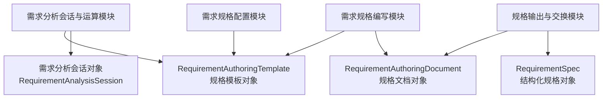

对象模型回答“系统保存什么事实”，模块设计回答“谁负责处理这些事实”。

#### 7.2.1 对象状态归属

| 对象 | 创建模块 | 更新模块 | 冻结 / 归档模块 | 对外暴露模块 |
| --- | --- | --- | --- | --- |
| `RequirementAuthoringTemplate` | 需求规格配置模块 | 需求规格配置模块 | 需求规格配置模块 | 需求规格配置模块 |
| `RequirementAuthoringDocument` | 需求规格编写模块 | 需求规格编写模块 | 需求规格编写模块 | 需求规格编写模块、规格输出与交换模块 |
| 需求分析会话（`RequirementAnalysisSession`） | 需求分析会话与运算模块 | 需求分析会话与运算模块 | 需求分析会话与运算模块 | 需求分析会话与运算模块 |
| `RequirementSpec` | 规格输出与交换模块 | 规格输出与交换模块 | 规格输出与交换模块 | 规格输出与交换模块 |

### 7.3 规格模板对象

`RequirementAuthoringTemplate` 至少包含：

- `template_id`
- `template_code`
- `name`
- `version`
- `status`
- `sections`
- `form_groups`
- `field_mappings`
- `questionnaire_policy`
- `gap_rules`
- `knowledge_bindings`

模板必须可替换、可版本化、可启停。已有文档稳定绑定创建时模板版本。

### 7.4 规格文档对象

`RequirementAuthoringDocument` 至少包含：

- `document_id`
- `title`
- `template_id`
- `template_version`
- `status`
- `layout_ratio`
- `archive_ids`
- `semantic_state`
- `document`
- `conversation`
- `annotations`
- `check_result`
- `frozen_package`
- `knowledge_binding`

保存草稿必须保存正文、语义状态、对话、模板选择、领域知识绑定和检查状态。冻结后文档只读。草稿态不能进入 `P3` 正式消费。

### 7.5 文档状态

| 状态 | 含义 | 可写 |
| --- | --- | --- |
| `draft` | 正在编辑 | 是 |
| `checking` | 正在或刚完成检查 | 是 |
| `ready_to_freeze` | 阻断缺口已通过，可冻结 | 是 |
| `frozen` | 已冻结 | 否 |
| `submitted_to_p3` | 已交给 `P3` | 否 |
| `archived` | 已归档 | 否 |

### 7.6 冻结包对象

`FrozenRequirementPackage` 至少包含：

- 标准需求规格说明正文。
- 结构化 `RequirementSpec`。
- 模板版本。
- 领域知识绑定。
- 条款批注。
- 缺口检查结果。
- 冻结时间。
- 冻结人。

### 7.7 需求分析会话对象

需求分析会话（`RequirementAnalysisSession`）是需求分析会话与运算模块维护的多轮收敛容器。它围绕一个需求规格课题，把用户输入、系统回应、完成度树、事实、问题、正文补丁、下一轮交互对象和模型调用日志组织在同一个会话上下文中。

会话不等于正式需求规格文档。会话可以产生 `document_patch` 建议，但不能直接改变 `RequirementAuthoringDocument` 的正式正文。

会话是长期状态对象，不是某一轮执行对象。轮次结束后，轮次结果必须回写到会话；组织器读取的是会话快照，而不是持有会话本体。

需求分析会话至少包含以下实现字段：

- `session_id`
- `topic`
- `orchestrator_id`
- `provider_id`
- `model`
- `template_id`
- `knowledge_package_id`
- `write_policy`
- `status`
- `active_spec_node_id`
- `orchestrator_state`
- `messages`
- `turns`
- `spec_tree`
- `artifacts`
- `next_interaction`
- `provider_call_logs`

Lab 会话状态不得直接写正式需求规格文档。若进入专家工作台，必须通过 `document_patch` 接收和确认机制进入 `RequirementAuthoringDocument`。

#### 7.7.1 会话状态

| 状态 | 含义 |
| --- | --- |
| `created` | 会话已创建，但尚未完成模板 / 知识 / 组织器 / 模型提供方绑定 |
| `configured` | 会话配置已完成，已初始化完成度树，可进入等待输入状态 |
| `waiting_user_input` | 最近一轮轮次已收束，已生成下一轮交互对象，等待用户输入 |
| `running_turn` | 正在执行某一轮需求分析轮次 |
| `completed` | 当前会话目标已收敛完成 |
| `archived` | 会话被人工归档，不再继续收敛 |
| `failed` | 组织器、模型提供方或轮次执行失败，等待恢复或重试 |

### 7.8 需求分析轮次对象

需求分析轮次（`RequirementAnalysisTurn`）是需求分析会话中的单轮处理单元。一轮轮次的起点是本轮用户输入，终点是系统完成本轮吸收、更新会话状态并生成下一轮交互对象。

需求分析轮次不等同于聊天消息。一次轮次通常会产生一条用户消息和一条系统回应，但轮次本身记录的是处理过程：输入关系、规格补充、补充后回看、闭环判断、下一轮交互和模型调用审计。

上一轮系统交互对象是本轮上下文，不是本轮轮次的起点。用户可以回答它、忽略它、反驳它，或直接提出新的需求信息。

轮次是单轮执行和审计对象，不保存长期状态，也不脱离需求分析会话单独存在。组织器要知道“当前是第几轮、上下文是什么”，但这些信息必须由轮次引擎通过 `TurnContext` 输入给组织器，而不是由组织器自己维护。

需求分析轮次至少包含以下实现字段：

```text
turn_id
session_id
turn_index
previous_interaction
user_input
normalized_input
input_relation
turn_interpretation
spec_execution
post_update_review
closure_decision
next_interaction
decision_trace
provider_call_logs
created_at
```

轮次与会话的关系：

- 一个需求分析会话包含零到多轮需求分析轮次。
- 每次用户输入会创建一个新的轮次。
- 轮次的最终输出会回写到会话的完成度树、事实、问题、patch、消息和下一轮交互对象中。
- 会话保存长期状态，轮次保存单轮审计。

### 7.9 过程产物对象

| 过程产物 | 含义 | 展示方式 |
| --- | --- | --- |
| `spec_tree` | 需求规格完成度树 | 树形结构，按章节和条款展开 |
| `turns` | 交互审计链 | 按时间顺序展示每轮输入、判断、执行和下一轮交互 |
| `artifacts` | 事实、待确认问题、正文补丁、风险 | 按节点、类型和轮次过滤 |

待确认问题与已确认事实不是简单此消彼长。一个问题被确认后可能关闭当前节点，也可能生成子问题、风险或正文补丁。

## 8. API 设计

### 8.1 需求规格编写 API

路由前缀：

```text
/api/requirement-authoring
```

| 方法 | 路径 | 用途 |
| --- | --- | --- |
| `GET` | `/documents` | 列出文档草稿 |
| `POST` | `/documents` | 创建文档 |
| `GET` | `/documents/{document_id}` | 获取文档详情 |
| `DELETE` | `/documents/{document_id}` | 删除文档 |
| `POST` | `/documents/{document_id}/save` | 保存完整文档上下文 |
| `POST` | `/documents/{document_id}/messages` | 追加问答输入 |
| `PATCH` | `/documents/{document_id}/form-fields` | 更新表单字段 |
| `PATCH` | `/documents/{document_id}/clauses/{clause_id}` | 编辑条款正文 |
| `POST` | `/documents/{document_id}/check` | 执行缺口检查 |
| `POST` | `/documents/{document_id}/freeze` | 冻结文档 |

API 到模块命令 / 查询映射：

| API | 应用服务入口 | 主要领域服务 |
| --- | --- | --- |
| `POST /documents` | `CreateDocumentCommand` | `DocumentService`、`DocumentRenderer` |
| `POST /documents/{id}/save` | `SaveDocumentCommand` | `DocumentService` |
| `POST /documents/{id}/messages` | `AppendQuestionInputCommand` | `SemanticStateService`、`DocumentRenderer`、`AnnotationService` |
| `PATCH /documents/{id}/form-fields` | `PatchFormFieldsCommand` | `SemanticStateService`、`DocumentRenderer` |
| `PATCH /documents/{id}/clauses/{clause_id}` | `PatchClauseCommand` | `DocumentRenderer`、`AnnotationService` |
| `POST /documents/{id}/check` | `RunGapCheckCommand` | `GapChecker` |
| `POST /documents/{id}/freeze` | `FreezeDocumentCommand` | `GapChecker`、`FreezeService` |

### 8.2 需求规格配置 API

路由前缀：

```text
/api/requirement-configuration
```

| 方法 | 路径 | 用途 |
| --- | --- | --- |
| `GET` | `/templates` | 列出模板 |
| `POST` | `/templates` | 创建模板 |
| `PUT` | `/templates/{template_id}` | 更新模板 |
| `POST` | `/templates/{template_id}/activate` | 激活模板 |
| `POST` | `/templates/{template_id}/validate` | 校验模板 |

API 到模块命令 / 查询映射：

| API | 应用服务入口 | 主要领域服务 |
| --- | --- | --- |
| `GET /templates` | `ListTemplatesQuery` | `TemplateService` |
| `POST /templates` | `CreateTemplateCommand` | `TemplateService`、`ValidateTemplateCommand` |
| `PUT /templates/{id}` | `UpdateTemplateCommand` | `TemplateService`、`ValidateTemplateCommand` |
| `POST /templates/{id}/activate` | `ActivateTemplateCommand` | `TemplateService`、`ValidateTemplateCommand` |
| `POST /templates/{id}/validate` | `ValidateTemplateCommand` | `TemplateService`、`GapRuleService`、`FieldMappingService` |

### 8.3 需求分析会话 API

路由前缀：

```text
/api/requirement-analysis-lab
```

| 方法 | 路径 | 用途 |
| --- | --- | --- |
| `GET` | `/orchestrators` | 列出可用组织器描述包 |
| `GET` | `/providers` | 列出模型提供方 |
| `POST` | `/sessions` | 创建分析会话 |
| `GET` | `/sessions/{session_id}` | 获取会话长期状态、轮次历史和完成度树 |
| `POST` | `/sessions/{session_id}/turns` | 在既有会话中创建并执行一轮需求分析轮次 |

说明：

- `/sessions` 面向会话生命周期，不面向组织器执行本身。
- `/sessions/{session_id}/turns` 是唯一合法的轮次执行入口；不能直接提供“运行组织器”接口绕过会话状态机。
- `/orchestrators` 只负责列出可选组织器描述包，不负责直接触发策略执行。

API 到模块命令 / 查询映射：

| API | 应用服务入口 | 主要领域服务 |
| --- | --- | --- |
| `GET /orchestrators` | `ListOrchestratorsQuery` | `OrchestratorHost` |
| `GET /providers` | `ListProvidersQuery` | `ProviderCallService` |
| `POST /sessions` | `CreateAnalysisSessionCommand` | `SessionService`、`SpecTreeService` |
| `GET /sessions/{id}` | `GetAnalysisSessionQuery` | `SessionService` |
| `POST /sessions/{id}/turns` | `RunTurnCommand` | `TurnEngine`、`OrchestratorHost`、`SpecTreeService` |

### 8.4 规格输出与交换 API

路由前缀：

```text
/api/requirement-exchange
```

| 方法 | 路径 | 用途 |
| --- | --- | --- |
| `GET` | `/knowledge-providers` | 列出知识源 |
| `POST` | `/knowledge-bindings` | 绑定领域知识 |
| `GET` | `/specs` | 列出结构化规格 |
| `POST` | `/specs` | 创建结构化规格 |
| `GET` | `/specs/{spec_id}` | 获取结构化规格 |
| `PUT` | `/specs/{spec_id}` | 更新结构化规格 |
| `GET` | `/formal-elements` | 读取 `P1` 正式元素 |
| `GET` | `/p6-projection` | 生成 `P6` 展示投影 |

API 到模块命令 / 查询映射：

| API | 应用服务入口 | 主要领域服务 / 适配器 |
| --- | --- | --- |
| `GET /knowledge-providers` | `ListKnowledgeProvidersQuery` | `P1KnowledgeAdapter` |
| `POST /knowledge-bindings` | `BindKnowledgeCommand` | `KnowledgeBindingService` |
| `GET /specs` | `ListRequirementSpecsQuery` | `RequirementSpecService` |
| `POST /specs` | `CreateRequirementSpecCommand` | `RequirementSpecService` |
| `GET /specs/{id}` | `GetRequirementSpecQuery` | `RequirementSpecService` |
| `PUT /specs/{id}` | `UpdateRequirementSpecCommand` | `RequirementSpecService` |
| `GET /formal-elements` | `ListFormalElementsQuery` | `P1KnowledgeAdapter` |
| `GET /p6-projection` | `BuildP6ProjectionQuery` | `P6DisplayProjector` |

## 9. 关键运行流程

### 9.1 专家编写并冻结需求规格

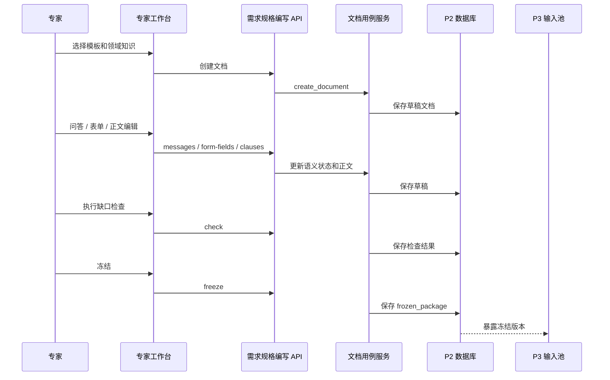

### 9.2 需求分析组织器 Lab 运行流程

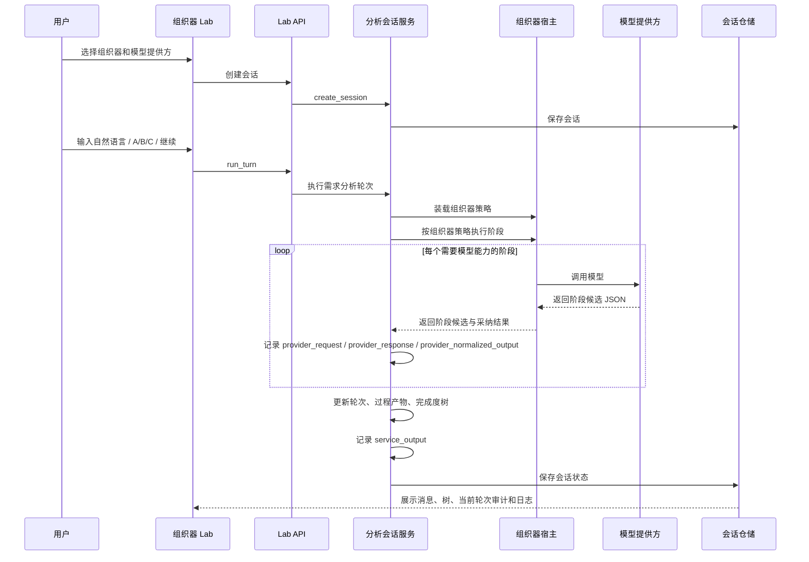

### 9.3 P1 知识绑定流程

```text
专家打开领域知识设置
  -> 前端读取知识源
  -> 后端通过 P1 发布态知识适配器获取领域目录
  -> 用户选择领域知识
  -> 后端返回 knowledge_binding
  -> 文档 semantic_state 保存绑定
  -> 后续问答、表单、批注和冻结包都追踪该绑定
```

## 10. 组织器设计

### 10.1 基础定义

基础组织器（`Orchestrator`）是会话组织策略的抽象概念。它定义“从用户输入到目标文档补充”的组织方法，负责决定如何理解用户输入、如何组织目标对象更新、如何设计下一轮交互，以及一轮轮次内部是否拆成多个阶段、哪些阶段调用模型、模型候选如何被采纳。

组织器描述包（`Orchestrator Package`）是组织器策略的交付载体。它用文件包形式承载 manifest、契约、策略、提示词、规则、runner、样例和测试。也就是说：

- 基础组织器是概念和能力。
- 组织器描述包是这个能力的可导入实现载体。
- 组织器宿主（`Orchestrator Host`）是运行这些包并接入模型提供方、本地 runner 或远端服务的宿主。

基础组织器不是天然绑定 `P2` 的专有概念。它可以作为跨阶段的上位抽象，但每个阶段必须定义自己的业务契约。例如：

- 需求规格组织器（`XG Orchestrator`）是 `P2` 需求分析组织器对象的一种业务类型，只服务于需求规格说明补充和收敛。
- `P3` 后续若需要从需求规格到软件设计说明，应定义面向软设文档的组织器和契约，不能直接复用 `XG Orchestrator` 的业务语义。

因此，基础组织器只定义可插拔策略的共性：包形态、注册、契约校验、执行模式、审计和测试。具体“怎样补需求规格说明”属于需求规格组织器，不属于基础组织器。

### 10.2 基础组织器与需求规格组织器

| 层级 | 中文名 | 英文实现名 | 职责 | 是否绑定文档类型 |
| --- | --- | --- | --- | --- |
| 抽象层 | 基础组织器 | `Orchestrator` | 定义可插拔会话组织策略的抽象接口、包注册、执行模式、契约校验和审计要求 | 否 |
| 业务类型层 | 需求规格组织器 | `XG Orchestrator` | 面向需求规格说明文档的组织器类型，处理需求收敛、规格节点、正文补丁和下一轮交互 | 是 |
| 实例层 | 强规则组织器 / 启发式组织器 | `xg-strong-rule-orchestrator` / `xg-heuristic-orchestrator` | 满足 `XG Orchestrator` 契约的具体组织器对象实例 | 是 |

`XG` 是“需求规格”的缩写。后续 `P3` 从需求规格到软件设计说明的组织器不复用 `XG Orchestrator` 主名，应定义自己的文档类型组织器。

两者关系是“抽象契约”和“业务实例”的关系：

- 基础组织器回答：一个组织器描述包怎样被发现、装载、运行、校验、审计和替换。
- 需求规格组织器回答：面向需求规格说明时，一轮输入怎样更新完成度树、正文补丁、过程产物和下一轮交互。
- `xg-strong-rule-orchestrator` 与 `xg-heuristic-orchestrator` 是需求规格组织器的两个具体组织器对象实例，不是两个新的系统模块。

### 10.3 组织器描述包形态

组织器描述包目标形态接近 `skill` 包，是可导入、可审查、可测试、可替换的一组文件。

```text
orchestrator-package/
  manifest.json
  ORCHESTRATOR.md
  contract.schema.json
  policy.md
  prompt.md
  artifact_rules.json
  spec_strategy.json
  runner.py
  examples/
  tests/
```

| 文件 | 职责 |
| --- | --- |
| `manifest.json` | 声明 id、名称、版本、文档类型、执行模式、能力和入口 |
| `ORCHESTRATOR.md` | 说明组织器目标、适用范围和人工可读规则 |
| `contract.schema.json` | 约束输入输出 JSON 契约 |
| `policy.md` | 组织策略规则 |
| `prompt.md` | 模型提示策略 |
| `artifact_rules.json` | 规格节点事实模板、patch 模板、快捷选项等轻量策略规则 |
| `spec_strategy.json` | 完成度树节点问题、章节问题模板、默认叶子问题策略 |
| `runner.py` | 本地可执行组织器入口 |
| `examples/` | 示例输入输出 |
| `tests/` | 包级测试 |

包内文件与运行时关系如下：

| 内容 | 运行时作用 |
| --- | --- |
| `manifest.json` | 被组织器宿主用于注册和能力发现 |
| `contract.schema.json` | 被组织器宿主和轮次引擎用于校验阶段输出与最终输出 |
| `policy.md` / `prompt.md` / `spec_strategy.json` / `artifact_rules.json` | 被组织器策略读取，用于声明阶段行为、提示词和轻量规则 |
| `runner.py` | 仅在 `local_runner` 模式下执行，输出仍必须满足契约 |
| `examples/` / `tests/` | 不参与生产运行，用于人工审查和回归验证 |

### 10.4 组织器执行模式

| 模式 | 含义 | 适用场景 |
| --- | --- | --- |
| `policy_interpreted` | 组织器宿主读取组织器描述包中的策略、提示词、阶段定义和运行上下文，按阶段调用模型并校验契约输出 | 启发式需求规格组织器 |
| `local_runner` | 组织器宿主调用包内受控 runner，runner 基于包内规则返回阶段结果或最终契约输出 | 强规则、确定性策略 |
| `remote_service` | 组织器宿主调用远端组织器服务，由远端返回阶段结果或最终契约输出 | 外部组织器服务 |

执行模式只描述“策略由谁执行”，不改变需求分析轮次结果（`RequirementAnalysisTurnResult`）的最终契约。无论使用模型、runner 还是远端服务，进入会话的结果都必须经过轮次引擎校验和投影。

### 10.5 强规则组织器与启发式组织器

首版至少保留两个需求规格组织器对象实例，用于验证可替换性。

| 组织器对象实例 | 目标 | 判断标准 |
| --- | --- | --- |
| `xg-strong-rule-orchestrator` | 将强规则轮次状态机、完成度树、闭环判断和下一轮交互规则固化为可测策略 | 输出稳定、可解释、可回归 |
| `xg-heuristic-orchestrator` | 对齐启发式协作方式，以更聪明的问题组织、选项建议和方向判断支持需求收敛 | 输出更有启发性、更少机械追问 |

两个实例必须遵守同一个 `xg-orchestrator-contract@1`。差异只体现在组织策略：

- `xg-strong-rule-orchestrator` 优先使用 `local_runner` 或确定性规则，适合验证状态机和契约是否稳定。
- `xg-heuristic-orchestrator` 优先使用 `policy_interpreted` 和 `write_then_review`，适合验证提示词、模型理解和启发式追问是否有效。
- 前端只能看到“可替换组织器实例”和统一轮次结果，不能依赖某个组织器内部实现。

### 10.6 组织器宿主与组织器边界

| 责任 | 组织器宿主 | 组织器 |
| --- | --- | --- |
| 会话保存 | 是 | 否 |
| API Key 管理 | 是 | 否 |
| 模板和知识上下文组装 | 是 | 只读使用 |
| 输入输出契约校验 | 是 | 遵守契约 |
| 组织策略 | 否 | 是 |
| 模型提示策略装载 | 是 | 声明 |
| 正式文档写入 | 是 | 否 |
| 冻结版本 | 是 | 否 |

更准确地说，组织器宿主是运行时基础设施，组织器是策略声明和策略执行单元：

- 组织器宿主负责“能不能装载、能不能运行、输出是否合格、日志是否完整”。
- 组织器负责“这一轮应该如何理解、补写、回看和设计下一步”。
- 模型提供方负责“模型调用是否成功、原始响应是什么、怎样归一化”。
- 轮次引擎负责“哪些候选进入会话权威状态、哪些只进入审计日志”。

### 10.7 需求规格轮次组织策略

需求规格轮次组织策略（`XG Turn Orchestration Strategy`）是需求规格组织器的核心策略，不等同于提示词。它定义一轮用户输入如何被拆成多个可审计阶段，以及每个阶段是否调用模型。

一个完整策略至少声明：

| 策略项 | 说明 |
| --- | --- |
| `turn_mode` | `single_call`、`write_then_review` 或 `strict_pipeline` |
| `stages[]` | 本轮包含哪些阶段，例如 `understand`、`write_patch`、`review_after_update`、`design_next_interaction` |
| `model_calls[]` | 哪些阶段调用模型、调用哪个模型提供方、使用哪个 prompt 模板 |
| `context_policy` | 每次模型调用可读取哪些上下文，例如模板树、最近消息、已确认事实、上轮留题 |
| `acceptance_policy` | 模型输出哪些字段可直接采纳，哪些必须由规则重算 |
| `fallback_policy` | 模型失败、输出不完整或章节无法匹配时如何兜底 |
| `audit_policy` | 每个阶段如何进入当前轮次审计和模型调用日志 |

推荐的 `write_then_review` 策略如下：

```text
XGTurnStrategy(write_then_review)
  Stage 1: normalize_input
    owner: system
    model_call: no
  Stage 2: understand_and_write
    owner: orchestrator + model
    model_call: yes
    output: intent, confirmed_facts_delta, document_patch, candidate_affected_nodes
  Stage 3: validate_and_project
    owner: system + orchestrator
    model_call: no
    output: projected_nodes, patched_state, validation_errors
  Stage 4: review_after_update
    owner: orchestrator + model
    model_call: yes
    output: sufficiency_review, remaining_gaps, next_interaction_candidate
  Stage 5: finalize_turn
    owner: system + orchestrator
    model_call: no
    output: closure_decision, next_interaction, decision_trace, persisted_state
```

该策略解决两个问题：

- 避免一次模型调用同时承担理解、补写、审查和追问，导致输出匆忙。
- 让“补完之后再回看”成为一轮轮次内部的显式阶段，而不是一句提示词里的要求。

### 10.8 提示词组织策略

提示词策略必须服务于需求规格轮次组织策略的具体阶段。提示词不直接定义系统状态机，也不直接决定正式文档写入。

提示词按层组成：

| 层 | 来源 | 作用 |
| --- | --- | --- |
| `base_contract_prompt` | P2 / XG 通用契约 | 约束只输出 JSON、不得直接写正式文档、不得控制冻结状态 |
| `orchestrator_policy_prompt` | 组织器描述包 `policy.md` | 声明该组织器风格，例如启发式、强规则、是否允许跳题 |
| `stage_prompt` | 组织器描述包按阶段声明 | 指定本次模型调用是理解、补写、回看还是下一轮设计 |
| `template_context` | 需求规格模板解析结果 | 给出规格树、章节目标、完成标准和当前缺口 |
| `runtime_context` | 会话状态 | 给出用户输入、上轮留题、最近消息、事实、问题、patch |
| `output_schema` | 组织器契约 / 阶段 schema | 规定本次模型调用必须返回的结构 |

不同阶段使用不同提示词：

| 阶段 | 模型任务 | 不应让模型做什么 |
| --- | --- | --- |
| `understand_and_write` | 理解用户输入、抽取新增事实、映射章节、生成正文补丁候选 | 不决定最终关闭节点，不生成最终下一轮交互 |
| `review_after_update` | 基于补充后的状态判断是否足够、还缺什么、候选下一步 | 不改写已投影的事实和 patch，不直接落库 |
| `design_next_interaction` | 在需要时生成问题或快捷选项候选 | 不强制每轮都生成选择题 |

因此，提示词文件不应是一段总提示词，而应支持阶段化：

```text
prompt/
  base_contract.md
  understand_and_write.md
  review_after_update.md
  design_next_interaction.md
```

首版可以仍保留单文件 `prompt.md`，但设计目标必须是阶段化迁移。只有这样，提示词调优才有可评测对象：某次输出不好时，可以定位是“理解提示词弱”“补写提示词弱”“回看提示词弱”，还是“组织器采纳策略错误”。

## 11. 设计约束与质量门

### 11.1 命名约束

| 不推荐作为系统能力名 | 原因 | 目标命名 |
| --- | --- | --- |
| `Requirement Analysis Service` | 把“分析方式”误当成单一服务名，无法表达对象边界 | 按对象命名，如需求分析会话服务（`RequirementAnalysisSessionService`） |
| `Requirement Analysis Orchestrator`（用于指代整个后端模块） | 会把“组织器策略对象”和“需求分析模块”混为一谈 | 需求分析会话与运算模块（`Requirement Analysis Session and Computation Module`） |
| `Brainstorming Orchestrator`（用于指代默认 XG 实例） | 把某种启发方法误写成系统能力总名，不利于后续替换 | `xg-heuristic-orchestrator` |
| `Turn Message` / `聊天轮次` | 会把轮次降格成一条消息，而不是单轮处理审计对象 | 需求分析轮次（`RequirementAnalysisTurn`） |

### 11.2 模块边界约束

- 页面只做编排，复杂业务动作放入 hooks 或 API 适配层。
- API 路由只做 HTTP 参数与错误转换，不写业务状态机。
- 应用服务只编排用例，不沉积全部领域规则。
- 领域服务独立承载正文渲染、语义状态、缺口检查、轮次执行和冻结规则。
- 组织器策略必须通过包和契约表达。
- 模型提供方不拥有需求规格树。
- Lab 会话不直接写正式需求规格文档。

### 11.3 测试约束

关键测试必须覆盖：

- 文档草稿创建、保存、打开、删除。
- 文档名称、模板选择、领域知识绑定的保存稳定性。
- 问答模式和表单模式更新同一语义状态。
- 正文渲染和条款 patch。
- 缺口检查和冻结包生成。
- 轮次输入关系判断。
- 组织器契约校验。
- 模型调用日志。

## 12. 目标目录结构

### 12.1 后端目录结构

```text
apps/api/app/requirement_authoring/
  document_application_service.py
  document_service.py
  semantic_state_service.py
  document_renderer.py
  annotation_service.py
  gap_checker.py
  freeze_service.py
  knowledge_binding_service.py
  document_repository.py

apps/api/app/requirement_configuration/
  template_application_service.py
  template_service.py
  section_schema_service.py
  form_schema_service.py
  field_mapping_service.py
  questionnaire_policy_service.py
  gap_rule_service.py
  template_repository.py

apps/api/app/requirement_analysis/
  session_application_service.py
  session_service.py
  turn_engine.py
  turn_strategy_service.py
  turn_stage_executor.py
  turn_audit_service.py
  input_normalizer.py
  input_relation_classifier.py
  spec_projection_service.py
  spec_tree_service.py
  process_artifact_service.py
  next_interaction_service.py
  provider_call_service.py
  provider_call_log_service.py
  orchestrator_host.py
  session_repository.py

apps/api/app/requirement_exchange/
  exchange_application_service.py
  p1_knowledge_adapter.py
  knowledge_binding_service.py
  requirement_spec_service.py
  frozen_package_projector.py
  p3_export_service.py
  p6_display_projector.py
  sim_adapter.py
  requirement_spec_repository.py

apps/api/app/orchestrators/
  registry.py
  package_loader.py
  contract_validator.py
  strategy_schema.py
  runner_host.py
```

### 12.2 前端目录结构

```text
apps/web/src/pages/
  RequirementAuthoringPage.tsx
  RequirementAuthoringAdminPage.tsx
  RequirementAnalysisLabPage.tsx
  RequirementsPage.tsx

apps/web/src/features/requirement-authoring/
  hooks/
  components/
  api/
  types/

apps/web/src/features/requirement-configuration/
  hooks/
  components/
  api/
  types/

apps/web/src/features/requirement-analysis-lab/
  hooks/
  components/
  api/
  types/

apps/web/src/features/requirement-exchange/
  hooks/
  components/
  api/
  types/
```

## 13. 验收口径

### 13.1 产品验收

首版产品验收只看：

1. 专家能选择模板和领域知识。
2. 专家能新建、打开、保存、删除需求规格草稿。
3. 问答模式和表单模式能更新同一份正文。
4. 右侧正文像标准文档，可以审阅和冻结。
5. 正文轻量编辑不破坏模板骨架。
6. 条款批注能解释来源、缺口、结构化映射和 `P3` 映射。
7. 缺口检查能阻断关键缺口。
8. 冻结后能形成标准文档和结构化 `RequirementSpec` 包。

### 13.2 架构验收

架构验收检查：

1. 主设计文档是否保持目标态软件设计说明口径。
2. 前端页面是否按页面、状态、组件、API 适配分层。
3. 后端模块是否按四个业务模块和五层结构组织。
4. 需求规格编写模块是否拥有完整草稿到冻结闭环。
5. 组织器是否通过包形态和契约接入。
6. 模型提供方与组织器边界是否清晰。
7. Lab 状态是否不直接写入正式文档。

### 13.3 测试入口

主要测试入口：

```text
apps/api/tests/test_requirement_specs_api.py
apps/api/tests/test_application_modeling_api.py
apps/api/tests/test_requirement_analysis_api.py
apps/web/src/test/RequirementAuthoringPage.test.tsx
apps/web/src/test/RequirementAuthoringAdminPage.test.tsx
apps/web/src/test/RequirementAnalysisLabPage.test.tsx
apps/web/src/test/XXP2SimPage.test.tsx
```

测试覆盖口径不应降低；现行测试文件名必须与正式模块命名保持一致，不保留早期旧称测试入口。

## 14. 面向 P6 的展示输出接口

`P2` 面向 `P6` 的展示输出遵循 `P6DisplayExportContract v2`。该接口只表达需求分析系统的观察态和展示态，不替代 `P2` 自身的编写工作台、草稿机制和规格冻结流程。

| 合同分组 | `P2` 输出口径 | 展示绑定 |
| --- | --- | --- |
| `stage_overview` | 阶段身份、需求分析系统名称、需求规格编写与冻结总体运行状态、入口可用性和新鲜度 | 详情卡标题与健康状态 |
| `connected_users` | 正在接入的行业用户、领域专家、需求分析人员或建模协作者 | 详情卡顶部用户轨 |
| `system_overall_metrics` | 已形成需求规格数、冻结规格数、绑定知识源数等累计承载结果 | 详情卡中段总体状态 |
| `live_counters` | 正在接收发布态知识、正在编写、正在检查或冻结输出的数量 / 速率 | 详情卡下段实时状态 |
| `flow_ports` | 左侧为 `P1` 发布态知识输入；右侧仅为 `P2 -> P3` 需求规格输出 | 左右端口与流量 |
| `queue_projection` | 规格编写队列、缺口检查队列或冻结需求队列 | 底部队列 |
| `source_trace` | 追溯到系统定位、对象模型、接口与冻结流程 | 字段来源、计算口径和展示原因 |

禁止口径：

- 不得把向导步骤、草稿、建模批次或单次会话状态放入总体指标。
- 不得用 Lab 会话状态替代 `P2` 正式阶段状态。
- `P2` 的阶段输出端口只连接 `P3`，不得为了视觉对称编造其他输出端口。

## 15. 设计结论

`P2` 不是普通聊天页面，也不是低代码建模器。它的主系统是标准需求规格说明编写系统。

本阶段目标态由四个业务模块组成：

- 需求规格编写模块。
- 需求规格配置模块。
- 需求分析会话与运算模块。
- 规格输出与交换模块。

这四个模块通过五层后端架构和分层前端结构协作，最终支撑专家完成标准需求规格说明的编写、检查、冻结和下游输出。
