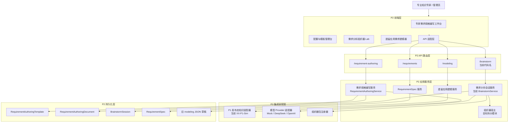
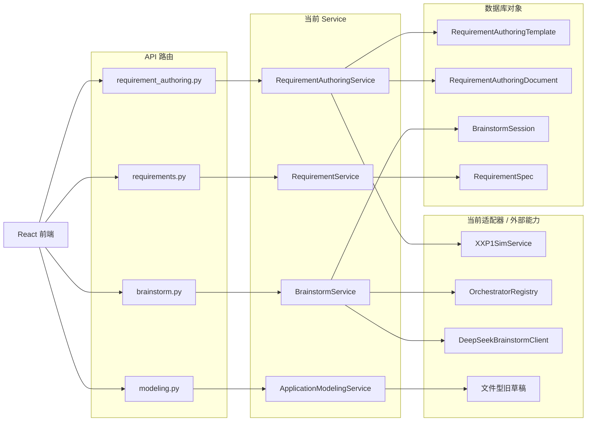
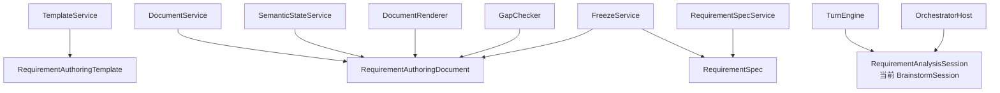
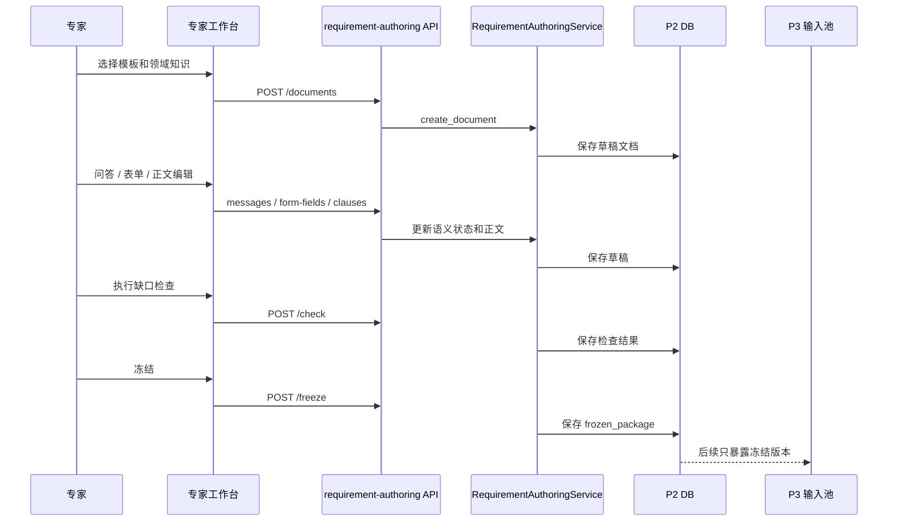
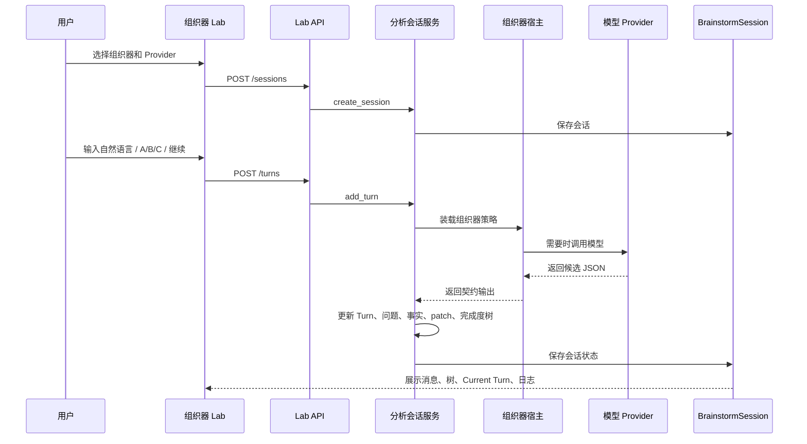

# P2 需求分析系统软件设计说明

> 本文件是 `CodeFactoryV2` 中 `P2 需求分析系统` 的主软件设计说明文档。它不是专题索引，不是概念备忘录，也不是原型说明入口；它必须在一个文档内说明 `P2` 的目标、边界、前端实现、后端实现、对象模型、接口、运行流程、当前实现状态、架构缺口和后续重构约束。
>
> 维护规则：后续对 `P2` 需求分析系统的正式设计结论，必须优先回写本文件。其他专题文档可以存在，但不能替代本文件成为理解 `P2` 全貌的入口。

**日期：** 2026-05-02

**对应节点：**

- `P2` 需求分析系统
- `P2.1` 专家需求规格编写工作台
- `P2.2` 需求规格对象输出与投影
- `P2.3` 上游知识输入模拟与联调入口
- `P2 Lab` 需求分析组织器原理验证能力

## 1. 文档目的与阅读口径

### 1.1 文档目的

本文件用于回答以下问题：

1. `P2` 到底是什么系统。
2. `P2` 的正面用户工作对象是什么。
3. `P2` 前端如何组织页面、状态、组件和 API 调用。
4. `P2` 后端如何组织路由、服务、领域对象、适配器和持久化。
5. 当前实现已经有哪些模块。
6. 当前实现有哪些明显架构债务。
7. 后续重构必须遵守什么边界。

### 1.2 阅读口径

本文件按完整软件设计说明组织，不再采用“两级目录 + 多个专题互相索引”的方式表达 `P2` 主设计。

其他专题文档仍可作为历史、原型、专项论证或实现证据存在，但以下内容必须能在本文件中直接读到：

- 需求规格编写系统的业务目标。
- 专家工作台和配置台的页面结构。
- 前端技术栈和模块结构。
- 后端技术栈和模块结构。
- 需求分析会话、组织器、模型 Provider 和 Turn 协议。
- `P1 -> P2 -> P3` 的输入输出边界。
- 当前实现与目标架构之间的差距。

## 2. 系统定位

### 2.1 一句话定位

`P2 需求分析系统` 是面向专业知识专家的软件需求规格说明编写系统。它从 `P1` 发布态知识、专家自然输入、表单填报和模板配置中收敛需求，最终形成可冻结、可审查、可交给 `P3` 的标准需求规格说明文档和结构化 `RequirementSpec` 包。

### 2.2 正面工作对象

专家正面工作的对象是：

```text
标准需求规格说明文档
```

不是：

- 低代码模型。
- 组件装配结果。
- 纯表单。
- 模型聊天记录。
- 组织器内部状态。

结构化对象仍然存在，但它是后台事实状态和下游消费包，用于支撑：

- 正文生成。
- 一致性校验。
- 条款批注。
- 来源追溯。
- `P3` 结构化输入。

### 2.3 当前主产品口径

`P2` 当前主产品口径已经从早期“应用需求建模器”调整为：

```text
可配置标准需求规格说明编写系统
```

早期 `ApplicationRequirementModeler` 仍可作为过渡能力保留，但不能再作为 `P2` 的主路径解释。

## 3. 业务目标与边界

### 3.1 首版负责

首版 `P2` 负责：

- 提供专家需求规格编写工作台。
- 支持 `问答模式 / 表单模式` 两种同源输入。
- 实时呈现完整标准需求规格说明正文。
- 支持文档模板选择、领域知识绑定、草稿保存、打开草稿、删除草稿。
- 支持正文轻量编辑和条款批注浮层。
- 支持缺口检查、冻结版本和冻结包输出。
- 支持配置台维护规格模板、表单字段、字段映射、问答策略和缺口检查规则。
- 支持独立 `Lab` 验证需求分析组织器、模型 Provider 和 Turn 审计协议。
- 支持 `XX-P1-Sim` 在 `P1` 未完成时提供发布态知识输入模拟。

### 3.2 首版不负责

首版 `P2` 不负责：

- 软件设计说明生成。
- `P3` 模块设计、工单包生成或软件设计冻结。
- 工具仓库资产匹配。
- 可运行原型生成。
- BPMN / 泳道图编辑器。
- 技术人员低代码建模平台。
- 直接调用 `P4` 或 `P5`。

### 3.3 上下游边界

```text
P1 发布态知识
  -> P2 需求分析系统
    -> 冻结需求规格说明 + RequirementSpec 包
      -> P3 软件设计系统
```

`P2` 只能消费 `P1` 的发布态知识，不应读取候选知识、治理工作态或审核中间数据。

`P3` 只消费 `P2` 冻结后的正式版本，不应读取 `P2` 草稿态、交互临时状态或未确认批注。

### 3.4 需求建模原则

#### 3.4.1 对象优先于流程

`P2` 必须坚持“对象优先于流程”。原因是需求规格说明要描述系统应当管理的业务对象、角色、行为、约束和状态变化，而不是只复刻既有业务流程。

需求规格的最小可解释单元不是裸流程节点，而是：

```text
参与方 + 业务对象 + 行为 + 结果 / 状态变化
```

流程仍然重要，但流程应当作为对象、角色和行为之间的组织方式出现，而不是替代对象建模。

#### 3.4.2 需求收敛的标准阶段

专家工作台和需求分析组织器都应服务于同一个收敛目标：

1. 业务目标收敛。
2. 使用对象与范围收敛。
3. 自建模块或系统边界收敛。
4. 模块内动作、数据和状态变化收敛。
5. 模块链路与交接动作收敛。
6. 需求规格正文补齐、检查和冻结。

这个阶段不是强制向导。专家可以跳跃输入、补充、修正和否定，但后台语义状态必须能把输入归入上述规格构成要素。

#### 3.4.3 推荐与补齐来源

`P2` 的推荐、缺口补齐和问答提示只能来自三类事实：

| 来源 | 说明 | 当前实现状态 |
| --- | --- | --- |
| 通用软件工程经验 | 通用角色、模块、数据、非功能、约束和需求规格写法 | 当前主要靠硬编码和模型提示 |
| `P1` 发布态领域知识 | 已发布领域对象、事件、流程、术语和关系 | 当前由 `XX-P1-Sim` 模拟 |
| 用户当前输入 | 专家的自然语言、选择题、表单、正文编辑和确认动作 | 当前在专家工作台和 Lab 分别保存 |

每个推荐结果、正文补丁、待确认问题和条款批注都应带来源标识，至少区分：

- `recommended_common`
- `recommended_domain`
- `manual`
- `temporary_pending_intake`

#### 3.4.4 需求规格完成条件

一份需求规格草稿至少满足以下条件，才可以从工作态进入冻结准备态：

- 已选择可用规格模板。
- 已绑定领域知识，或明确选择不绑定领域知识。
- 必填章节已补齐。
- 阻断型缺口检查通过。
- 正文与结构化语义状态不存在未确认阻断映射。
- 已生成可供 `P3` 消费的冻结结构化包。

#### 3.4.5 `P2-Sim` 与 `XX-P1-Sim` 的差异

`XX-P1-Sim` 模拟的是 `P1` 未完成时给 `P2` 的发布态领域知识输入。

`XX-P2-Sim` 模拟的是 `P2` 对下游提供的轻量 `RequirementSpec` 输入，用于早期联调 `P3`。它不是专家需求规格编写工作台，也不能替代正式 `P2` 主路径。

两者都不是为了模拟人的输入。人的输入必须在专家工作台或 Lab 中验证。

## 4. 总体架构

### 4.1 总体分层



### 4.2 当前代码事实

当前 `P2` 已经形成四条后端能力线：

| 能力线 | 当前路由 | 当前服务 | 当前定位 |
| --- | --- | --- | --- |
| 需求规格编写 | `apps/api/app/api/routes/requirement_authoring.py` | `apps/api/app/requirement_authoring/service.py` | 专家工作台主路径 |
| 需求分析会话 / Lab | `apps/api/app/api/routes/brainstorm.py` | `apps/api/app/brainstorm/service.py` | 组织器和模型调用验证台 |
| 遗留应用需求建模 | `apps/api/app/api/routes/modeling.py` | `apps/api/app/application_modeling/service.py` | 早期建模器，过渡保留 |
| 结构化 RequirementSpec | `apps/api/app/api/routes/requirements.py` | `apps/api/app/requirements/service.py` | 冻结包和旧规格池 |

当前前端对应页面包括：

| 页面 | 当前文件 | 当前定位 |
| --- | --- | --- |
| 专家需求规格编写工作台 | `apps/web/src/pages/RequirementAuthoringPage.tsx` | 主路径页面 |
| 配置与模板管理台 | `apps/web/src/pages/RequirementAuthoringAdminPage.tsx` | 管理配置页面 |
| 需求分析组织器 Lab | `apps/web/src/pages/BrainstormLabPage.tsx` | 原理验证与审计页面 |
| 遗留应用需求建模器 | `apps/web/src/components/ApplicationRequirementModeler.tsx` | 早期能力，需降级说明 |
| 需求规格池 | `apps/web/src/pages/RequirementsPage.tsx` | 结构化规格列表和详情 |
| P2 模拟输入 | `apps/web/src/pages/XXP2SimPage.tsx` | 轻量联调入口 |

### 4.3 目标设计约束

后续实现必须把“需求规格编写主路径”和“需求分析组织器实验路径”分清：

- `Requirement Authoring` 是 `P2` 主业务能力。
- `Requirement Analysis Session` 是问答式需求分析会话能力。
- `Orchestrator` 是需求分析会话内可替换的组织策略。
- `Brainstorming` 只能是组织策略的一种，不应作为长期系统能力根名。

当前代码名 `brainstorm` 可以短期保留为兼容路由和包名，但正式设计命名应向以下口径收敛：

| 当前名 | 目标语义名 | 说明 |
| --- | --- | --- |
| `BrainstormService` | `RequirementAnalysisSessionService` | 需求分析会话服务 |
| `Brainstorming Lab` | `Requirement Analysis Orchestrator Lab` | 组织器验证台 |
| `brainstorm/orchestrators.py` | `orchestrators/registry.py` | 中性组织器注册层 |
| `xg-brainstorming-orchestrator` | `XG Brainstorming Orchestrator` | 只作为一个策略实例 |

## 5. 前端软件设计

### 5.1 前端技术栈

当前前端技术栈为：

- React 18
- TypeScript
- Vite
- Ant Design
- Axios API 适配层
- React Router
- Vitest / Testing Library

### 5.2 前端分层原则

目标前端应分为五层：

```text
页面路由层
  -> 页面状态编排层
    -> 领域组件层
      -> API 适配层
        -> 类型定义层
```

各层职责如下：

| 层 | 职责 | 禁止事项 |
| --- | --- | --- |
| 页面路由层 | 绑定 URL 与页面入口 | 不承载复杂业务逻辑 |
| 页面状态编排层 | 管理当前页面状态、加载、保存、错误 | 不拼接复杂领域对象 |
| 领域组件层 | 渲染工作区、表单、文档、消息、树 | 不直接访问后端 |
| API 适配层 | 封装 HTTP 调用 | 不处理 UI 状态 |
| 类型定义层 | 提供 DTO 和视图模型类型 | 不混入运行逻辑 |

### 5.3 前端路由结构

当前 `P2` 相关前端路由由 `apps/web/src/App.tsx` 挂载。

| 路由 | 页面 | 当前文件 | 设计口径 |
| --- | --- | --- | --- |
| `/requirement-authoring` | 专家需求规格编写工作台 | `apps/web/src/pages/RequirementAuthoringPage.tsx` | 主路径 |
| `/requirement-authoring/admin` | 配置与模板管理台 | `apps/web/src/pages/RequirementAuthoringAdminPage.tsx` | 管理路径 |
| `/p2-brainstorm-lab` | 需求分析组织器 Lab | `apps/web/src/pages/BrainstormLabPage.tsx` | 实验路径，命名待迁移 |
| `/requirements` | 结构化需求规格池 | `apps/web/src/pages/RequirementsPage.tsx` | 结构化对象查看与旧规格池 |
| `/xx-p2-sim` | `P2` 轻量模拟输出台 | `apps/web/src/pages/XXP2SimPage.tsx` | 下游联调模拟 |
| `/modeling` | 遗留应用建模页 | `apps/web/src/pages/ApplicationModelerPage.tsx` | 过渡能力 |

这些页面不能被解释成同等主路径。正式用户主路径是 `/requirement-authoring`，Lab 和模拟器只服务验证、联调或过渡。

### 5.4 专家需求规格编写工作台

当前文件：

```text
apps/web/src/pages/RequirementAuthoringPage.tsx
```

当前页面职责：

- 加载模板、文档列表和知识源。
- 选择文档模板。
- 设置领域知识。
- 新建、打开、保存、删除需求规格草稿。
- 编辑文档名称。
- 问答模式发送消息。
- 表单模式修改字段。
- 展示标准需求规格正文。
- 打开条款批注。
- 执行缺口检查。
- 冻结文档。

目标拆分：

```text
RequirementAuthoringPage
  - useRequirementAuthoringWorkspace
  - RequirementAuthoringToolbar
  - DocumentNameBar
  - InputModePanel
    - QuestionModePanel
    - FormModePanel
  - StandardDocumentPane
  - ClauseAnnotationDrawer
  - KnowledgeBindingDialog
  - DocumentOpenDialog
  - DocumentDeleteDialog
```

设计约束：

- 页面文件只负责拼装，不承载所有业务动作。
- 文档名称、模板选择、领域知识绑定必须作为文档上下文状态处理。
- 问答、表单、正文必须共用同一个 `RequirementSemanticState`。
- 用户修改文档名称后，继续问答或表单输入不得回退名称。
- 保存草稿必须保存正文、语义状态、对话、模板选择和领域知识绑定。

#### 5.4.1 页面区块与模块映射

| 页面区块 | 读取对象 | 写入对象 | 后端模块 |
| --- | --- | --- | --- |
| 顶部工具栏 | 模板列表、知识源、当前文档 | 当前模板、知识绑定、文档状态 | `requirement_authoring.service` |
| 文档名称栏 | 当前文档摘要 | `RequirementAuthoringDocument.title` | `document_service` 目标拆分 |
| 问答模式 | 对话、语义状态、当前正文 | `conversation`、`semantic_state`、`document` | `semantic_state_service` 目标拆分 |
| 表单模式 | 模板字段、语义状态 | `semantic_state.fields`、`document` | `semantic_state_service` 目标拆分 |
| 标准正文 | `document.sections`、批注、检查结果 | 条款正文 patch | `document_renderer` / `annotation_service` |
| 缺口检查 | 语义状态、模板规则 | `check_result` | `gap_checker` |
| 冻结操作 | 文档、语义状态、批注、检查结果 | `frozen_package` | `freeze_service` |

#### 5.4.2 状态保存规则

专家工作台的保存不是“只保存右侧正文”。保存草稿必须覆盖：

- 文档名称。
- 模板选择。
- 领域知识绑定。
- 分屏比例。
- 语义状态。
- 标准正文。
- 问答对话。
- 表单字段。
- 条款批注。
- 缺口检查结果。

其中，文档名称和领域知识选择属于文档上下文，不属于临时 UI 状态。用户修改后必须在后续问答、表单或保存动作中保持稳定，不能被服务端旧快照覆盖。

### 5.5 配置与模板管理台

当前文件：

```text
apps/web/src/pages/RequirementAuthoringAdminPage.tsx
```

当前页面职责：

- 列出模板。
- 新增模板。
- 激活模板。
- 预览章节、表单字段、字段映射、问答策略、缺口规则、知识绑定。

目标设计：

```text
RequirementAuthoringAdminPage
  - TemplateListPanel
  - TemplateEditorPanel
  - TemplateStructureEditor
  - FormGroupEditor
  - FieldMappingEditor
  - QuestionnairePolicyEditor
  - GapRuleEditor
  - KnowledgeBindingConfigEditor
```

首版可以保留预览能力，但正式配置台必须逐步从“只读预览 + 新增模板”演进为“可编辑配置对象”。

#### 5.5.1 配置对象

配置台必须能够解释并逐步编辑以下对象：

| 配置对象 | 用途 | 是否影响正式正文 |
| --- | --- | --- |
| 规格模板 | 定义标准章节、条款、编号和必填规则 | 是 |
| 表单模板 | 定义左侧表单字段和分组 | 是 |
| 字段映射 | 连接表单字段、语义状态和正文条款 | 是 |
| 问答策略 | 定义主路径提问范围和补齐规则 | 是 |
| 缺口检查规则 | 定义阻断型、提示型和建议型缺口 | 是 |
| 知识绑定配置 | 定义可选领域知识来源和过滤口径 | 是 |

### 5.6 需求分析组织器 Lab

当前文件：

```text
apps/web/src/pages/BrainstormLabPage.tsx
```

正式命名口径：

```text
需求分析组织器 Lab
```

当前代码名 `BrainstormLabPage` 可短期保留，但文档中不应把 `Brainstorming` 当成系统主能力。

Lab 的职责：

- 选择组织器。
- 选择模型 Provider。
- 启动会话。
- 展示 CLI 式交互。
- 展示需求规格完成度树。
- 展示本轮 Turn 审计。
- 展示 Provider 调用日志。

目标拆分：

```text
RequirementAnalysisLabPage
  - OrchestratorConfigTab
  - AnalysisSessionTab
  - CurrentTurnAuditTab
  - ProviderLogTab
  - SpecCompletionTree
  - QuickOptionList
  - TurnDecisionTrace
```

设计约束：

- Lab 不写正式需求规格文档。
- Lab 只验证组织器输出协议和会话状态机。
- Lab 中组织器可替换，但正式文档模型、模板模型、知识绑定、草稿保存不应依赖某个具体组织器。

#### 5.6.1 Lab 状态机视角

Lab 必须按以下状态理解，而不是“系统先提问、用户只回答”的单向问卷：

```text
上一轮系统留下的交互对象
  -> 本轮用户输入
    -> 输入关系判断
      -> 系统理解与规格补充
        -> 更新完成度树和过程产物
          -> 本轮闭环判断
            -> 生成下一轮交互对象
```

本轮的起点是用户输入。上一轮交互对象只是上下文，不是强制问题。用户可以回答选项，也可以忽略选项重新描述需求。

#### 5.6.2 Current Turn 审计视图

Current Turn 不是单纯展示模型输出，而是用于审查组织器为什么这么处理一轮输入。

它至少应展示：

- 上一轮系统交互对象：问题、建议话题、选项或空等待。
- 本轮用户输入。
- 输入关系判断：承接、部分承接、偏离、否定或自由补充。
- 系统理解：抽取出的事实、约束、风险和目标节点。
- 规格执行：影响的规格节点、正文补丁、事实状态变化。
- 闭环判断：本轮是否解决了上一轮交互目标，是否需要继续追问。
- 下一轮交互对象：自由问题、选择题、继续建议或结束建议。
- 决策轨迹：关键判断依据和模型 / 规则来源。

#### 5.6.3 需求规格完成度树

Lab 中的完成度树不是普通列表。它应当映射到需求规格说明的章节和条款结构。

每个节点至少包含：

- 稳定节点编号。
- 章节或条款标题。
- 节点状态：未开始、待确认、已确认、需追问、已关闭。
- 当前答案摘要。
- 最近影响它的 Turn。
- 子节点。

完成度树只承载规格结构和节点状态，不承载完整对话过程。提问顺序、跳转原因和每轮输入输出应由 Turn 审计视图承载。

### 5.7 遗留应用需求建模器

当前文件：

```text
apps/web/src/components/ApplicationRequirementModeler.tsx
```

当前定位：

- 早期 `P2` 应用需求建模能力。
- 当前不再是专家正面主路径。
- 可作为历史能力、过渡能力或结构化规格池辅助入口。

目标约束：

- 不得再用它解释 `P2` 主产品形态。
- 若继续保留，应在页面和文档中标明为过渡能力。
- 后续如果其对象仍有价值，应迁入冻结 `RequirementSpec` 包或配置台能力，而不是继续独立膨胀。

## 6. 后端软件设计

### 6.1 后端技术栈

当前后端技术栈为：

- Python 3.12
- FastAPI
- SQLAlchemy
- Pydantic
- PostgreSQL
- JSON 字段承载部分可配置对象和草稿状态
- OpenAI SDK 兼容调用 DeepSeek / OpenAI
- Pytest

### 6.2 后端分层原则

目标后端分层：

```text
API 路由层
  -> 应用服务层
    -> 领域服务 / 领域策略层
      -> 适配器层
        -> 持久化层
```

各层职责：

| 层 | 职责 | 禁止事项 |
| --- | --- | --- |
| API 路由层 | 参数接收、权限、错误码转换 | 不写业务状态机 |
| 应用服务层 | 编排用例、事务、调用领域服务 | 不堆积所有领域细节 |
| 领域服务 / 策略层 | 模板渲染、缺口检查、Turn 状态机、组织器执行 | 不直接处理 HTTP |
| 适配器层 | P1 知识、模型 Provider、组织器包、外部服务 | 不拥有 P2 权威状态 |
| 持久化层 | SQLAlchemy 模型、仓储、文件草稿 | 不做业务决策 |

### 6.3 当前后端模块组成

```text
apps/api/app/
  api/routes/
    requirement_authoring.py
    brainstorm.py
    modeling.py
    requirements.py
  requirement_authoring/
    models.py
    service.py
  brainstorm/
    models.py
    service.py
    deepseek_client.py
    orchestrators.py
  requirements/
    schemas.py
    service.py
  application_modeling/
    models.py
    service.py
    common_recommendations.py
  db/models/
    requirements.py
```

#### 6.3.1 当前后端调用关系



#### 6.3.2 当前主要问题

当前后端不是没有模块，而是模块边界过粗：

- `RequirementAuthoringService` 把模板、文档、语义状态、正文渲染、批注、检查、冻结都放在一个类里。
- `BrainstormService` 把会话生命周期、Turn 状态机、组织器执行、Provider 调用、完成度树、过程产物和输入关系判断都放在一个类里。
- `OrchestratorRegistry` 只发现包和读取 `manifest.json`，没有把 `policy.md`、`prompt.md`、`runner.py` 真正纳入统一执行协议。
- `DeepSeekBrainstormClient` 自己拼接提示词，导致组织器包不能完整控制组织策略。

### 6.4 需求规格编写后端

当前服务：

```text
apps/api/app/requirement_authoring/service.py
```

当前职责：

- 默认模板初始化。
- 模板增删改查和激活。
- 文档创建、打开、保存、删除。
- 文档名称、模板、知识绑定保存。
- 问答消息追加。
- 表单字段 patch。
- 正文条款 patch。
- 缺口检查。
- 冻结包生成。
- 文档正文渲染。
- 条款批注生成。
- 结构化 `RequirementSpec` 包生成。

当前问题：

- 一个 service 承担模板、文档、对话、表单、正文、缺口检查、冻结、序列化等多类职责。
- `append_message` 中存在硬编码问答规则。
- `_render_clause` 中存在硬编码条款渲染规则。
- `_build_assistant_reply` 中存在硬编码快捷回复。
- 缺口检查逻辑过于集中在 service。

目标拆分：

```text
requirement_authoring/
  service.py                  # 用例编排
  template_service.py          # 模板生命周期
  document_service.py          # 文档草稿生命周期
  semantic_state_service.py    # 语义状态更新
  document_renderer.py         # 标准正文渲染
  annotation_service.py        # 条款批注生成
  gap_checker.py               # 缺口检查
  freeze_service.py            # 冻结包生成
  knowledge_binding_service.py # P1 知识绑定
  repository.py                # 持久化访问
```

#### 6.4.1 当前函数级职责审查

| 当前函数 | 当前职责 | 目标归属 |
| --- | --- | --- |
| `list_templates` / `create_template` / `update_template` / `activate_template` | 模板生命周期 | `template_service.py` |
| `list_documents` / `create_document` / `get_document` / `delete_document` / `save_document` | 文档草稿生命周期 | `document_service.py` |
| `list_knowledge_providers` / `bind_knowledge` | `P1` 知识绑定 | `knowledge_binding_service.py` |
| `append_message` | 问答输入、语义状态更新、回复生成 | `semantic_state_service.py` + 后续组织器接入 |
| `patch_form_fields` | 表单字段更新、正文重渲染 | `semantic_state_service.py` |
| `patch_clause` | 正文条款编辑、批注更新 | `document_renderer.py` / `annotation_service.py` |
| `run_check` | 缺口检查 | `gap_checker.py` |
| `freeze` | 冻结包生成 | `freeze_service.py` |
| `_render_document` / `_render_clause` / `_render_text` | 正文渲染 | `document_renderer.py` |
| `_build_annotations` | 条款批注 | `annotation_service.py` |
| `_build_structured_spec` | 冻结结构化包 | `freeze_service.py` |

#### 6.4.2 专家工作台后端状态闭环

```text
模板选择 / 知识绑定 / 文档名称
  -> 文档上下文
    -> 问答或表单输入
      -> semantic_state 更新
        -> 标准正文重渲染
          -> 批注与缺口状态刷新
            -> 草稿保存
              -> 冻结包生成
```

这个闭环必须保证同一个 `RequirementAuthoringDocument` 内的正文、语义状态、对话、表单、模板和知识绑定一致。

### 6.5 需求分析会话与组织器后端

当前服务：

```text
apps/api/app/brainstorm/service.py
```

正式语义：

```text
需求分析会话服务 + 组织器宿主 + Turn 状态机 + Provider 编排
```

当前职责：

- 列出组织器。
- 列出模型 Provider。
- 创建分析会话。
- 保存会话状态。
- 归一化用户输入。
- 调用组织器或 Provider。
- 构造需求规格完成度树。
- 维护 open questions / facts / patches。
- 更新 Turn 审计链。
- 生成下一轮交互对象。
- 记录 Provider 调用日志。

当前问题：

- `BrainstormService` 名称不准确，无法表达其真实职责。
- `Brainstorming` 被误用为系统能力名，实际它只是组织策略之一。
- 组织器包当前只承担注册壳作用，真正策略大量硬编码在 service。
- `xg-strong-rule-orchestrator` 的 runner 文件只是占位，实际执行逻辑仍写在 service。
- DeepSeek prompt 写在 `deepseek_client.py`，没有从组织器包读取。
- 规格节点问题、快捷选项、patch 文案、fact 文案、节点关闭规则、输入关系判断都写死在 service。

必须拆分的目标模块：

```text
requirement_analysis/
  session_service.py           # 会话生命周期
  turn_engine.py               # Turn 执行闭环
  turn_audit_service.py        # Current Turn 审计视图
  input_normalizer.py          # 用户输入归一化
  input_relation_classifier.py # 输入承接判断
  spec_tree_service.py         # 完成度树生成与更新
  process_artifact_service.py  # facts / questions / patches
  next_interaction_service.py  # 下一轮交互对象
  provider_call_service.py     # 模型调用与日志
  orchestrator_host.py         # 组织器宿主
```

组织器相关目标模块：

```text
orchestrators/
  registry.py                  # 包发现与注册
  package_loader.py            # 读取 manifest/policy/prompt/runner
  contract_validator.py        # 输入输出契约校验
  runner_host.py               # local_runner 受控执行
```

#### 6.5.1 当前函数级职责审查

| 当前位置 | 当前职责 | 问题 | 目标归属 |
| --- | --- | --- | --- |
| `PROVIDER_DEFINITIONS` | Provider 列表 | 静态硬编码 | `provider_registry.py` 或配置 |
| `CLAUSE_QUESTIONS` | 规格节点提问 | 写死在服务层 | 组织器包 / 模板问答策略 |
| `create_session` | 会话创建、初始状态、树初始化 | 状态初始化过重 | `session_service.py` |
| `add_turn` | 一轮输入到输出的完整状态机 | 单函数过大 | `turn_engine.py` |
| `_run_orchestrator` | 组织器选择 | 只按 id 分支 | `orchestrator_host.py` |
| `_run_provider` | Provider 调用 | Provider 与组织器边界不清 | `provider_call_service.py` |
| `_normalize_input` | A/B/C 和自由文本归一化 | 依赖上轮选项但放在大服务中 | `input_normalizer.py` |
| `_mock_model_output` | Mock 输出 | 示例策略硬编码 | Mock Provider 或测试夹具 |
| `_strong_rule_model_output` | 强规则输出 | 强规则组织器没有真正执行包内 runner | `runner_host.py` |
| `_new_spec_tree` | 完成度树初始化 | 树结构与模板绑定不足 | `spec_tree_service.py` |
| `_fact_for_active_node` / `_patch_for_active_node` | 事实和正文补丁文案 | 文案硬编码 | `process_artifact_service.py` / 组织器包 |
| `_quick_options_for_node` | 选项生成 | 选项语义硬编码 | `next_interaction_service.py` |
| `_update_spec_tree` | 节点关闭和状态更新 | 规则粗糙 | `spec_tree_service.py` |
| `_classify_input_relation` | 输入关系判断 | A/B/C 承接曾出现误判 | `input_relation_classifier.py` |
| `DeepSeekBrainstormClient._build_prompt` | 模型提示词 | 没有读取组织器 `prompt.md` | `orchestrator_host.py` + Provider Client |

#### 6.5.2 目标 Turn 执行闭环

```text
load_session
  -> normalize_user_input
    -> resolve_previous_interaction
      -> classify_input_relation
        -> build_orchestrator_context
          -> execute_orchestrator
            -> validate_contract_output
              -> apply_spec_tree_update
                -> apply_process_artifacts
                  -> build_turn_audit
                    -> build_next_interaction
                      -> persist_session
```

这条链路必须可测试。每个节点都应能独立构造输入和断言输出，不能继续把全部逻辑折叠进 `add_turn`。

#### 6.5.3 Provider 与组织器边界

Provider 只负责模型调用：

- API Key。
- base URL。
- model。
- request / response。
- 调用日志。
- JSON 解析失败处理。

组织器负责策略：

- 问什么。
- 如何解释用户输入。
- 如何更新规格节点。
- 如何输出正文补丁。
- 如何设计下一轮交互对象。

Provider 不应知道“需求规格树应该长什么样”。组织器不应知道 API Key 和 HTTP 细节。

### 6.6 结构化 RequirementSpec 服务

当前服务：

```text
apps/api/app/requirements/service.py
```

职责：

- 创建结构化 `RequirementSpec`。
- 查询规格列表和详情。
- 更新规格。
- 从 `P1` 知识仓读取正式元素。

目标定位：

- 它不是专家工作台主服务。
- 它是冻结包和旧规格池的结构化承载层。
- 后续应成为 `RequirementAuthoringDocument.freeze` 的输出落点之一。

### 6.7 遗留应用建模服务

当前服务：

```text
apps/api/app/application_modeling/service.py
```

职责：

- 文件型草稿存取。
- 通用推荐。
- 从知识仓生成对象、事件、流程建议。
- 导出 JSON / YAML / Markdown。

目标定位：

- 早期能力，过渡保留。
- 不再作为 `P2` 主路径。
- 后续要么归档，要么把有效对象迁入 `RequirementSpec` 或模板配置体系。

## 7. 核心对象模型

### 7.1 持久化对象

当前数据库对象位于：

```text
apps/api/app/db/models/requirements.py
```

| 对象 | 表名 | 职责 |
| --- | --- | --- |
| `RequirementAuthoringTemplate` | `requirement_authoring_templates` | 规格模板、表单、映射、规则配置 |
| `RequirementAuthoringDocument` | `requirement_authoring_documents` | 规格草稿、正文、语义状态、批注、冻结包 |
| `BrainstormSession` | `brainstorm_sessions` | Lab 会话、Turn、过程产物、Provider 日志 |
| `RequirementSpec` | `requirement_specs` | 结构化需求规格包 |

### 7.2 对象与模块映射



对象模型回答“保存什么事实”，模块设计回答“谁处理这些事实”。两者不得混写。

### 7.3 规格模板对象

`RequirementAuthoringTemplate.payload` 至少包含：

- `sections`
- `form_groups`
- `field_mappings`
- `questionnaire_policy`
- `gap_rules`
- `knowledge_bindings`

设计约束：

- `81433` 和 `82259` 只是内置默认模板。
- 模板必须可替换、可版本化、可启停。
- 已有文档必须稳定绑定创建时模板版本。

#### 7.3.1 模板 payload 结构

```text
payload
  sections[]
    section_id
    title
    clauses[]
      clause_id
      title
      required_fields[]
      template_text
  form_groups[]
    group_id
    title
    fields[]
      field_key
      label
      type
      required
  field_mappings[]
  questionnaire_policy
  gap_rules[]
  knowledge_bindings
```

### 7.4 规格文档对象

`RequirementAuthoringDocument` 至少包含：

- `title`
- `template_id`
- `status`
- `layout_ratio`
- `archive_ids`
- `semantic_state`
- `document`
- `conversation`
- `annotations`
- `check_result`
- `frozen_package`

设计约束：

- 保存草稿必须保存正文、语义状态、对话、模板选择、领域知识绑定和检查状态。
- 冻结后文档只读。
- 草稿态不能进入 `P3` 正式消费。

#### 7.4.1 文档状态

| 状态 | 含义 | 可写 |
| --- | --- | --- |
| `draft` | 正在编辑 | 是 |
| `checking` | 正在或刚完成检查 | 是 |
| `ready_to_freeze` | 阻断缺口已通过，可冻结 | 是 |
| `frozen` | 已冻结 | 否 |
| `submitted_to_p3` | 已交给 `P3` | 否 |
| `archived` | 已归档 | 否 |

#### 7.4.2 冻结包结构

冻结包至少应包含：

- 标准需求规格说明正文。
- 结构化 `RequirementSpec`。
- 模板版本。
- 领域知识绑定。
- 条款批注。
- 缺口检查结果。
- 冻结时间和冻结人。

### 7.5 需求分析会话对象

`BrainstormSession` 当前承载 Lab 会话。正式语义应理解为：

```text
RequirementAnalysisSession
```

字段包括：

- `topic`
- `orchestrator_id`
- `provider_id`
- `model`
- `template_id`
- `knowledge_package_id`
- `write_policy`
- `payload`

`payload` 当前包含：

- messages
- turns
- questions
- facts
- patches
- spec_tree
- active_spec_node_id
- turn_path
- next_interaction
- last_quick_options
- annotations
- risks
- provider_logs

设计约束：

- Lab 会话状态不得直接写正式需求规格文档。
- 如果后续并入专家工作台，必须通过明确的 `document_patch` 接收和确认机制进入 `RequirementAuthoringDocument`。

#### 7.5.1 Turn 对象语义

一轮 Turn 的起点是用户输入。上一轮系统交互对象只是上下文，不是 Turn 的起点。

Turn 至少包含：

```text
turn_id
previous_interaction
user_input
input_relation_to_previous_interaction
organizer_interpretation
spec_execution
state_changes
closure_assessment
next_interaction
decision_trace
provider_log_refs
created_at
```

#### 7.5.2 过程产物对象

Lab 的过程产物应分为三类，不应混在一个线性列表里：

| 过程产物 | 含义 | 展示方式 |
| --- | --- | --- |
| `spec_tree` | 需求规格完成度树 | 树形结构，按章节和条款展开 |
| `turns` | 交互审计链 | 按时间顺序展示每轮输入、判断、执行和下一轮交互 |
| `artifacts` | 事实、待确认问题、正文补丁、风险 | 可按节点、类型和 Turn 过滤 |

待确认问题与已确认事实不是简单此消彼长。一个问题被确认后可能关闭当前节点，也可能生成子问题、风险或正文补丁。

## 8. API 设计

### 8.1 需求规格编写 API

路由前缀：

```text
/api/requirement-authoring
```

当前接口：

| 方法 | 路径 | 用途 |
| --- | --- | --- |
| `GET` | `/templates` | 列出模板 |
| `POST` | `/templates` | 创建模板 |
| `PUT` | `/templates/{template_id}` | 更新模板 |
| `POST` | `/templates/{template_id}/activate` | 激活模板 |
| `GET` | `/documents` | 列出文档草稿 |
| `POST` | `/documents` | 创建文档 |
| `GET` | `/documents/{document_id}` | 获取文档详情 |
| `DELETE` | `/documents/{document_id}` | 删除文档 |
| `POST` | `/documents/{document_id}/save` | 保存文档上下文 |
| `POST` | `/documents/{document_id}/messages` | 追加问答消息 |
| `PATCH` | `/documents/{document_id}/form-fields` | 更新表单字段 |
| `PATCH` | `/documents/{document_id}/clauses/{clause_id}` | 编辑条款正文 |
| `POST` | `/documents/{document_id}/check` | 执行缺口检查 |
| `POST` | `/documents/{document_id}/freeze` | 冻结文档 |
| `GET` | `/knowledge-providers` | 列出知识源 |
| `POST` | `/knowledge-bindings` | 绑定领域知识 |

### 8.2 需求分析组织器 Lab API

当前路由前缀：

```text
/api/brainstorm
```

正式语义：

```text
/api/requirement-analysis-lab
```

当前接口：

| 方法 | 路径 | 用途 |
| --- | --- | --- |
| `GET` | `/orchestrators` | 列出可用组织器包 |
| `GET` | `/providers` | 列出模型 Provider |
| `POST` | `/sessions` | 创建分析会话 |
| `GET` | `/sessions/{session_id}` | 获取会话 |
| `POST` | `/sessions/{session_id}/turns` | 创建 Turn |

命名约束：

- 可保留 `/brainstorm` 作为短期兼容路由。
- 新设计和新代码不应继续把 `Brainstorming` 当成系统能力根名。

### 8.3 结构化 RequirementSpec API

路由前缀：

```text
/api/requirements
```

接口：

| 方法 | 路径 | 用途 |
| --- | --- | --- |
| `GET` | `/specs` | 列出结构化规格 |
| `POST` | `/specs` | 创建结构化规格 |
| `GET` | `/specs/{spec_id}` | 获取结构化规格 |
| `PUT` | `/specs/{spec_id}` | 更新结构化规格 |
| `GET` | `/formal-elements` | 读取 P1 正式元素 |

### 8.4 遗留建模 API

路由前缀：

```text
/api/modeling
```

接口：

| 方法 | 路径 | 用途 |
| --- | --- | --- |
| `POST` | `/requirement-drafts` | 创建旧建模草稿 |
| `GET` | `/requirement-drafts` | 列出旧建模草稿 |
| `GET` | `/requirement-drafts/{draft_id}` | 获取旧建模草稿 |
| `PUT` | `/requirement-drafts/{draft_id}` | 更新旧建模草稿 |
| `POST` | `/requirement-drafts/{draft_id}/complete` | 完成旧建模草稿 |
| `GET` | `/requirement-drafts/{draft_id}/export` | 导出旧建模草稿 |

## 9. 关键运行流程

### 9.1 专家编写并冻结需求规格



### 9.2 需求分析组织器 Lab 运行流程



### 9.3 P1 知识绑定流程

```text
专家打开领域知识设置
  -> 前端读取知识源
  -> 后端通过 XX-P1-Sim 或未来真实 P1 获取领域目录
  -> 用户选择领域知识
  -> 后端返回 knowledge_binding
  -> 文档 semantic_state 保存绑定
  -> 后续问答、表单、批注和冻结包都可追踪该绑定
```

## 10. 组织器设计与命名约束

### 10.1 基础定义

`Orchestrator` 是需求分析会话中的组织策略包。它负责决定如何理解用户输入、如何组织规格补充、如何设计下一轮交互。

`Brainstorming` 只是其中一种组织方式，不是 `P2` 主功能名。

### 10.2 基础组织器与 XG 组织器

组织器分两层：

| 层级 | 中文名 | 职责 | 是否绑定文档类型 |
| --- | --- | --- | --- |
| 基础组织器 | `Orchestrator` | 定义可插拔策略包的通用包壳、注册、契约、执行模式和校验规则 | 否 |
| 需求规格组织器 | `XG Orchestrator` | 面向需求规格说明文档的组织策略，处理需求收敛、规格节点、正文补丁和下一轮交互 | 是 |

`XG` 是“需求规格”的缩写，用于避免把当前组织器误解为适用于所有文档类型的通用组织器。

后续 `P3` 从需求规格到软件设计说明的组织器不应复用 `XG Orchestrator` 作为主名，而应定义自己的文档类型组织器，例如 `SDS Orchestrator` 或其他明确的软件设计说明组织器。

### 10.3 组织器包形态

当前已存在两个 XG 组织器包：

```text
orchestrators/xg/xg-brainstorming-orchestrator
orchestrators/xg/xg-strong-rule-orchestrator
```

当前包文件包括：

- `manifest.json`
- `ORCHESTRATOR.md`
- `contract.schema.json`
- `policy.md`
- `prompt.md`
- `examples/`
- `tests/`
- `runner.py` 或占位入口

组织器包的目标形态接近 `skill` 包，而不是数据库配置项。它应当是可导入、可审查、可测试、可替换的一组文件。

| 文件 | 目标职责 | 当前状态 |
| --- | --- | --- |
| `manifest.json` | 声明 id、名称、版本、文档类型、执行模式、能力和入口 | 已被注册器读取 |
| `ORCHESTRATOR.md` | 说明组织器目标、适用范围和人工可读规则 | 仅说明 |
| `contract.schema.json` | 约束输入输出 JSON 契约 | 仅作为包文件存在 |
| `policy.md` | 组织策略规则 | 当前未真正注入运行 |
| `prompt.md` | 模型提示策略 | 当前未真正注入 DeepSeek prompt |
| `runner.py` | 本地可执行组织器入口 | 强规则包存在，但服务未真正通过统一 runner 执行 |
| `examples/` | 示例输入输出 | 仅作为样例 |
| `tests/` | 包级测试 | 仅作为占位或说明 |

### 10.4 当前实现缺口

当前组织器包尚未真正承载组织逻辑。

实际情况是：

```text
组织器包 = 注册壳 + 说明
真正运行逻辑 = BrainstormService / DeepSeekBrainstormClient 中的硬编码
```

硬编码内容包括：

- 规格节点问题。
- A/B/C 选项语义。
- Mock 输出。
- 强规则输出。
- 完成度树生成。
- fact 文案。
- patch 文案。
- 快捷选项。
- 节点关闭规则。
- 输入关系判断。
- DeepSeek prompt。

### 10.5 组织器执行模式

目标支持三种执行模式：

| 模式 | 含义 | 适用场景 |
| --- | --- | --- |
| `policy_interpreted` | Host 读取 `policy.md`、`prompt.md` 和上下文，调用模型生成契约输出 | Brainstorming 类组织器 |
| `local_runner` | Host 调用包内受控 runner，runner 返回契约输出 | 强规则、确定性策略 |
| `remote_service` | Host 调用远端服务，远端返回契约输出 | 外部组织器服务 |

当前 `xg-brainstorming-orchestrator` 声明为策略解释型，但 prompt 没有真正从包中加载。

当前 `xg-strong-rule-orchestrator` 声明为本地 runner 型，但服务层仍有 `_strong_rule_model_output` 分支，说明它还没有真正从包执行。

### 10.6 强规则组织器与 Brainstorming 组织器

首版必须至少保留两个组织器实例，用于验证可替换性。

| 组织器 | 目标 | 判断标准 |
| --- | --- | --- |
| `xg-strong-rule-orchestrator` | 把当前多轮讨论沉淀出的强规则 Turn 状态机、完成度树、闭环判断、下一轮交互规则固化为可测策略 | 输出稳定、可解释、可回归 |
| `xg-brainstorming-orchestrator` | 对齐现有 `brainstorming` skill 的启发式协作方式，以更聪明的问题组织、选项建议和方向判断支持需求收敛 | 输出更有启发性、更少机械追问 |

这两个组织器的并存目的不是做 UI 选项凑数，而是防止组织器抽象继续走偏：

- 强规则组织器验证契约、状态机和可解释性。
- Brainstorming 组织器验证启发式质量和策略可替换性。

### 10.7 目标组织器边界

目标设计中，Host 与组织器必须拆开：

| 责任 | Host | 组织器 |
| --- | --- | --- |
| 会话保存 | 是 | 否 |
| API Key 管理 | 是 | 否 |
| 模板和知识上下文组装 | 是 | 只读使用 |
| 输入输出契约校验 | 是 | 遵守契约 |
| 组织策略 | 不硬编码 | 是 |
| 模型提示策略 | 装载并注入 | 声明 |
| 正式文档写入 | 是 | 否 |
| 冻结版本 | 是 | 否 |

组织器包必须真正影响运行，不能只作为 UI 可选项。

## 11. 当前实现审查与架构债务

### 11.1 前端债务

当前前端主要问题：

- 页面文件过大。
- 页面文件同时承担状态、API、业务动作、渲染。
- `RequirementAuthoringPage` 中保存、打开、问答、表单、冻结逻辑混在一起。
- `BrainstormLabPage` 中配置、会话、Turn 审计、日志展示混在一起。
- `ApplicationRequirementModeler` 仍以早期主路径形态存在，容易误导 `P2` 定位。

整改约束：

- 新增复杂能力前必须先拆页面组件和 hooks。
- 页面只做编排，复杂业务动作放入 hooks 或领域服务适配层。
- 前端文档必须能对应到组件树。

### 11.2 后端债务

当前后端主要问题：

- `BrainstormService` 过大，承担太多职责。
- `RequirementAuthoringService` 过大，混合模板、文档、正文、表单、检查和冻结。
- 组织器并没有真正插件化。
- Provider prompt 没有从组织器包加载。
- 部分规则仍是硬编码。
- `Brainstorming` 命名不适合作为长期系统能力名。

整改约束：

- 不允许继续把新的需求分析逻辑堆进 `BrainstormService`。
- 不允许继续把新的文档渲染和缺口检查逻辑堆进 `RequirementAuthoringService`。
- 组织器策略必须从 Host 中抽离。
- 结构化对象和模块职责必须先写清楚再编码。

### 11.3 命名债务

必须修正的命名口径：

| 不推荐继续扩大的命名 | 原因 | 目标命名 |
| --- | --- | --- |
| `Brainstorming Service` | Brainstorming 是方式，不是系统功能 | `RequirementAnalysisSessionService` |
| `Brainstorming Lab` | 容易误解为聊天功能 | `Requirement Analysis Orchestrator Lab` |
| `BrainstormTurn` | 可保留为兼容对象，但正式解释应是需求分析 Turn | `RequirementAnalysisTurn` |
| `brainstorm/orchestrators.py` | 放在 brainstorm 下不具备基础注册层语义 | `orchestrators/registry.py` |

## 12. 目标模块拆分

### 12.1 后端目标目录

```text
apps/api/app/requirement_authoring/
  service.py
  template_service.py
  document_service.py
  semantic_state_service.py
  document_renderer.py
  annotation_service.py
  gap_checker.py
  freeze_service.py
  knowledge_binding_service.py
  repository.py

apps/api/app/requirement_analysis/
  session_service.py
  turn_engine.py
  turn_audit_service.py
  input_normalizer.py
  input_relation_classifier.py
  spec_tree_service.py
  process_artifact_service.py
  next_interaction_service.py
  provider_call_service.py
  orchestrator_host.py

apps/api/app/orchestrators/
  registry.py
  package_loader.py
  contract_validator.py
  runner_host.py
```

### 12.2 前端目标目录

```text
apps/web/src/pages/
  RequirementAuthoringPage.tsx
  RequirementAuthoringAdminPage.tsx
  RequirementAnalysisLabPage.tsx

apps/web/src/features/requirement-authoring/
  hooks/
  components/
  api/
  types/

apps/web/src/features/requirement-analysis-lab/
  hooks/
  components/
  api/
  types/
```

### 12.3 迁移原则

迁移必须遵守：

- 先补测试，再拆模块。
- 一次只拆一个责任域。
- 保持 API 兼容，除非正式升级路由版本。
- 不把 Lab 内部状态直接写进正式需求规格文档。
- 不因重命名破坏当前可测试页面。

## 13. 验收口径

### 13.1 产品验收

首版产品验收只看：

1. 专家能选择模板和领域知识。
2. 专家能新建、打开、保存、删除需求规格草稿。
3. 问答模式和表单模式能更新同一份正文。
4. 右侧正文像标准文档，可以审阅和冻结。
5. 正文轻量编辑不破坏模板骨架。
6. 条款批注能解释来源、缺口、结构化映射和 `P3` 映射。
7. 缺口检查能阻断关键缺口。
8. 冻结后能形成标准文档和结构化 `RequirementSpec` 包。

### 13.2 架构验收

后续实现验收必须检查：

1. 页面文件是否继续无限增大。
2. 后端 service 是否继续承载多种不相关职责。
3. 组织器包是否真正影响运行策略。
4. Provider prompt 是否仍硬编码在 client 中。
5. `Brainstorming` 是否继续被当作系统主能力名。
6. `P2` 主设计文档是否同步反映当前实现。

### 13.3 测试入口

当前主要测试入口：

```text
apps/api/tests/test_requirement_specs_api.py
apps/api/tests/test_application_modeling_api.py
apps/api/tests/test_brainstorm_api.py
apps/web/src/test/RequirementAuthoringPage.test.tsx
apps/web/src/test/RequirementAuthoringAdminPage.test.tsx
apps/web/src/test/BrainstormLabPage.test.tsx
apps/web/src/test/XXP2SimPage.test.tsx
```

## 14. 面向 P6 的展示输出接口

`P2` 面向 `P6` 的展示输出必须遵循 `P6DisplayExportContract v2`。该接口只表达需求分析系统的观察态和展示态，不替代 `P2` 自身的编写工作台、草稿机制和规格冻结流程。

| 合同分组 | `P2` 输出口径 | 展示绑定 |
| --- | --- | --- |
| `stage_overview` | 阶段身份、需求分析系统名称、需求规格编写与冻结总体运行状态、入口可用性和新鲜度 | 详情卡标题与健康状态 |
| `connected_users` | 正在接入的行业用户、领域专家、需求分析人员或建模协作者 | 详情卡顶部用户轨 |
| `system_overall_metrics` | 已形成需求规格数、冻结规格数、绑定知识源数等累计承载结果 | 详情卡中段总体状态 |
| `live_counters` | 当前正在接收发布态知识、正在编写、正在检查或冻结输出的数量 / 速率 | 详情卡下段实时状态 |
| `flow_ports` | 左侧为 `P1` 发布态知识输入；右侧仅为 `P2 -> P3` 需求规格输出 | 左右端口与当前流量 |
| `queue_projection` | 规格编写队列、缺口检查队列或冻结需求队列 | 底部队列 |
| `source_trace` | 追溯到本文件中的系统定位、对象模型、接口与冻结流程 | 字段来源、计算口径和展示原因 |

禁止口径：

- 不得把当前向导步骤、当前草稿、当前建模批次或单次会话状态放入总体指标。
- 不得用 Lab 会话状态替代 `P2` 正式阶段状态。
- `P2` 的阶段输出端口只连接 `P3`，不得为了视觉对称编造其他输出端口。

## 15. 当前结论

`P2` 不是一个普通聊天页面，也不是一个低代码建模器。它的主系统是标准需求规格说明编写系统。

当前实现已经具备可演示界面和部分后端能力，但架构上存在明确债务：

- 前端页面过大。
- 后端 service 过大。
- 组织器没有真正插件化。
- `Brainstorming` 命名占位不准确。
- 主设计文档曾长期缺少实现架构。

后续开发必须以本文件为主设计约束：先明确模块边界，再进行代码拆分和功能扩展。
