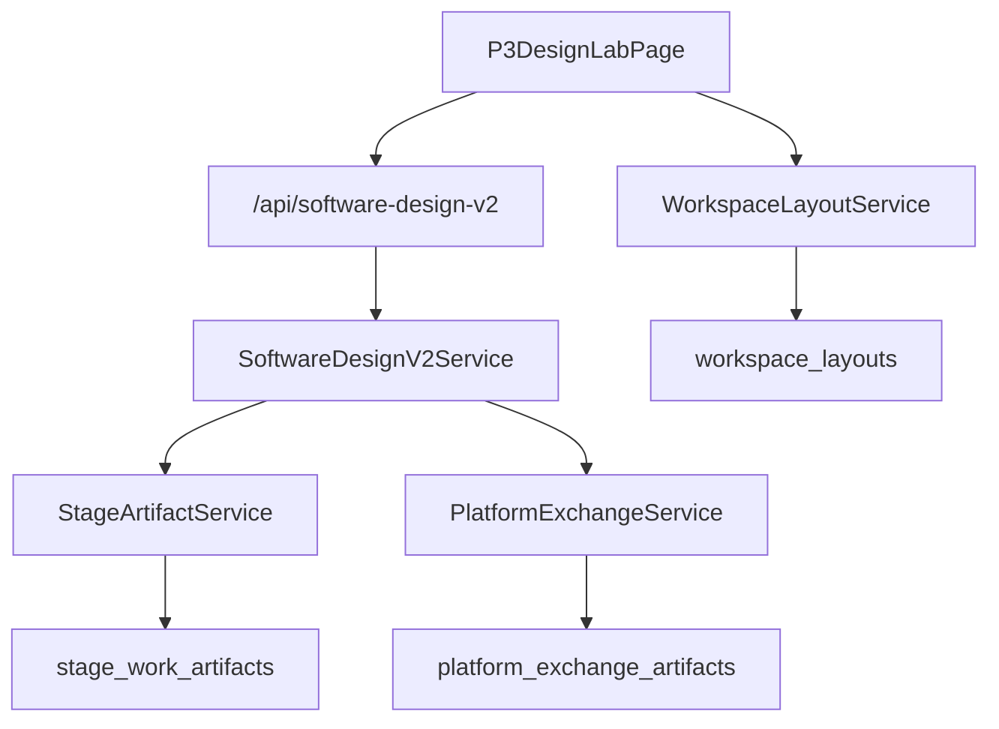

# P3 软件设计系统设计补充：软设产物持久化

**日期：** 2026-06-21
**所属系统：** P3 软件设计系统
**对应需求规格：** `DOC/CODEX_DOC/01_需求分析/05-P3软设产物持久化需求规格说明.md`
**依赖基础平台设计：** `DOC/CODEX_DOC/02_设计说明/BasePlatform_基础平台/BasePlatform-共性持久化能力体系设计.md`

## 1. 设计目标

本文补充 P3 软件设计系统的软设产物持久化设计。目标是把当前进程内 `P3DesignLabSession` 演进为可恢复、可冻结、可发布的持久化产物，同时遵守 Base Platform 共性持久化能力体系。

本文不把 Design Lab 设计为新的业务域。Design Lab 仍然是工作台编排面；权威事实仍归属 P3 软件设计输入、会话与运算、设计基线、软设说明编写、设计投影与交换、设计评审与冻结等模块。

## 2. 当前问题

当前 `SoftwareDesignV2Service` 使用类级 `_sessions` 保存会话。该方式存在以下问题：

1. 后端进程重启后会话丢失。
2. Dify 生成结果无法长期恢复。
3. “关联软设”列表依赖当前内存状态。
4. `save`、`projection`、`freeze` 只是更新内存对象。
5. P3 生成的设计包无法稳定发布给 P4/P5。

## 3. 总体方案

P3 首版持久化采用“P3 业务聚合 + Base Platform 共性信封”的方式：



P3 服务仍负责转换、编辑、检查、冻结和发布编排。Base Platform 负责保存通用持久化信封、快照和发布登记。

## 4. 持久化聚合

首版将 `P3DesignLabSession` 作为 P3 软设工作态聚合根保存。其 payload 结构保持与当前 API DTO 兼容：

```json
{
  "session_id": "p3dl-...",
  "input_package": {},
  "design_title": "",
  "version_label": "v0.1",
  "generation_policy": {},
  "status": "draft_ready",
  "conversion": {},
  "design_document": {},
  "design_baseline": {},
  "workorder_projection": {},
  "turns": [],
  "check_result": {},
  "frozen_package": null,
  "runtime_events": [],
  "created_at": "",
  "updated_at": ""
}
```

共性信封字段：

| 字段 | P3 映射 |
| --- | --- |
| `producer_stage` | `P3` |
| `artifact_type` | `software_design_session` |
| `artifact_version` | `version_label` |
| `schema_version` | `p3_software_design_session.v1` |
| `scope_type` | `p3_design_input` |
| `scope_id` | `input_package.input_package_id` |
| `source_artifact_ids` | P2 输入包 artifact id |
| `lifecycle_status` | 由 P3 status 映射 |
| `payload` | 完整 session DTO |

## 5. 服务改造设计

### 5.1 Repository 和 Service

P3 不直接操作数据库表，而是通过 Base Platform 的 `StageArtifactService` 读写。

建议在 P3 内部增加轻量适配器：

| 模块 | 职责 |
| --- | --- |
| `software_design_v2.persistence_adapter` | P3 session 与共性持久化信封互转 |
| `software_design_v2.service` | 在业务命令后调用保存/恢复 |

### 5.2 创建会话

流程：

```text
create_session(payload)
  -> 构造 P3DesignLabSession
  -> 注册 P2 输入包 consumption
  -> upsert stage_work_artifacts working
  -> 返回已持久化 session
```

### 5.3 运行转换

流程：

```text
run_conversion(session_id)
  -> 从持久化对象加载 session
  -> 标记 conversion_running 并保存
  -> 调用 Dify converter
  -> 写入 design_document / design_baseline / workorder_projection
  -> 标记 draft_ready
  -> upsert stage_work_artifacts
  -> 返回 session
```

转换失败也必须保存失败状态和错误摘要，避免用户刷新后看不到失败原因。

### 5.4 保存草稿

`save_draft()` 不再只更新内存状态，而应：

```text
load session
  -> require converted draft
  -> status = draft_saved
  -> append runtime_event
  -> upsert stage_work_artifacts lifecycle_status=draft_saved
```

### 5.5 生成投影

`generate_projection()` 应保存 `workorder_projection` 变化。首版可继续复用当前构造逻辑，但结果必须写入持久化 session。

### 5.6 冻结设计包

`freeze()` 应生成不可覆盖快照：

```text
load session
  -> run_check if needed
  -> build frozen_package
  -> status = frozen
  -> create snapshot artifact_type=software_design_package
  -> update session lifecycle=frozen
```

冻结快照 payload 应至少包含：

1. `design_document`
2. `design_baseline`
3. `workorder_projection`
4. `version_label`
5. `source_trace`
6. `frozen_at`

## 6. 查询与恢复设计

### 6.1 输入包关联软设

当前 `_list_related_designs()` 遍历 `_sessions`。改造后应查询共性持久化对象：

```text
list stage_work_artifacts
  where producer_stage = P3
    and artifact_type = software_design_session
    and scope_type = p3_design_input
    and scope_id = input_package_id
    and lifecycle_status in working,draft_saved,snapshot,frozen,published
```

### 6.2 获取会话详情

`GET /software-design-v2/sessions/{session_id}` 应从持久化对象读取。短期兼容期可以先查内存再查持久化，但目标态应以持久化为权威来源。

### 6.3 页面刷新恢复

前端可以保留当前交互方式，但应增强：

1. 创建或打开会话后，把 `session_id` 写入 URL query 或轻量本地状态。
2. 页面加载时如果存在 `session_id`，优先调用后端恢复。
3. 如果没有 `session_id`，在选中输入包后展示持久化关联软设。

## 7. 发布设计

P3 冻结设计包需要发布给下游时，应调用 Base Platform 发布能力。

建议首版发布资源：

| artifact_type | payload 来源 | 下游 |
| --- | --- | --- |
| `software_design_package` | `frozen_package` 完整对象 | P4/P5/P6 |
| `module_workorder_projection` | `workorder_projection` | P4 |

发布后：

1. `platform_exchange_artifacts` 生成记录。
2. P3 session 或 frozen snapshot 回写 `published_artifact_id`。
3. Base Platform Monitor 能看到 P3 发布资源。

## 8. 与布局持久化的关系

P3 软设产物持久化与布局持久化并行存在：

```text
P3DesignLabSession -> stage_work_artifacts
P3 Design Morph Canvas layout -> workspace_layouts
```

二者通过 `session_id` 或 `scope_id` 关联，但不互相包含 payload。删除布局不得删除软设，删除软设时应保留或清理布局由产品策略另行决定。

## 9. 兼容策略

为了减少改造风险，首版可以采用双读单写过渡：

1. 所有新会话写入持久化对象。
2. 查询详情时先查持久化对象。
3. 若持久化对象不存在，再查当前 `_sessions`。
4. 一旦会话被保存到持久化对象，后续以持久化对象为准。
5. 过渡期结束后删除 `_sessions` 权威职责，只保留必要缓存。

## 10. 错误处理

| 场景 | 后端行为 |
| --- | --- |
| 持久化失败 | 返回 500 或业务错误，不声称保存成功 |
| 转换成功但保存失败 | 返回明确错误，提示产物未持久化 |
| session 不存在 | 查询持久化对象后返回 404 |
| 冻结快照已存在且 hash 不同 | 返回 409 |
| 发布失败 | 保持 `frozen` 状态，记录失败事件 |

## 11. 测试设计

后端测试：

1. 创建 P3 会话后可从持久化对象查询。
2. 转换成功后保存 `design_document`、`design_baseline`、`workorder_projection`。
3. 清空内存 `_sessions` 后仍能 `GET session`。
4. 输入包列表能从持久化对象生成关联软设。
5. 冻结后生成不可覆盖快照。
6. 发布后生成平台交换资源。

前端测试：

1. 页面加载关联软设后可打开历史设计。
2. 刷新页面后通过 session id 恢复。
3. 布局接口失败不影响软设产物恢复。
4. 软设产物恢复不依赖 `localStorage`。

## 12. 设计风险

| 风险 | 处理 |
| --- | --- |
| 共性持久化变成万能平台业务库 | 只保存信封、生命周期和 payload，不解释 P3 业务含义 |
| P3 payload 过大 | 首版 inline JSON，后续引入 payload_ref 和对象存储 |
| 冻结与发布边界混淆 | 冻结只是 P3 快照，发布才进入平台交换层 |
| 前端误以为布局保存等于软设保存 | 页面文案和错误状态区分两类保存 |

## 13. 设计结论

P3 软设产物持久化应以 `P3DesignLabSession` 为工作态聚合根，以 Base Platform 共性持久化信封为落库边界，以冻结快照为不可覆盖版本，以平台交换资源为下游消费入口。

该设计将 P3 当前的内存会话演进为正式持久化产物，同时保持基础平台共性能力和 P3 业务语义之间的边界。
