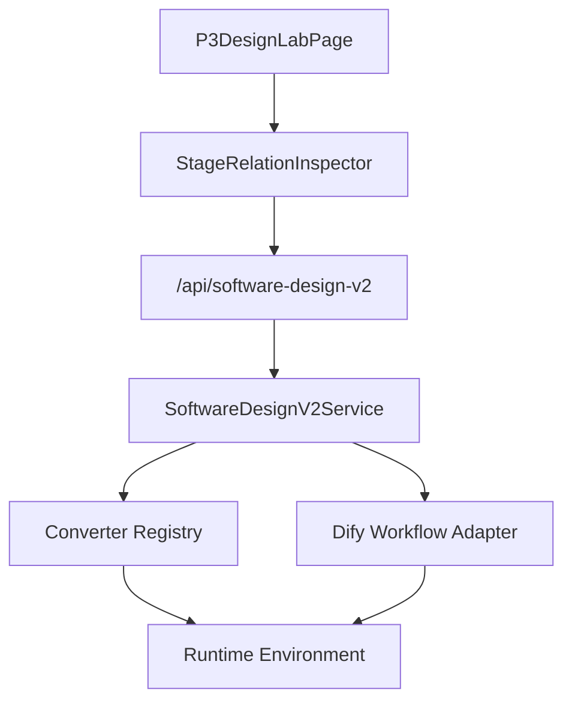

# P3 软件设计系统设计补充：转换器可用性增强

**日期：** 2026-06-29
**所属系统：** P3 软件设计系统
**对应基础设计：** `DOC/CODEX_DOC/02_设计说明/P3_软件设计系统/P3-软件设计系统设计-260515-1715-需规转软设基础转换补充案.md`
**依赖转换器设计：** `DOC/CODEX_DOC/02_设计说明/P3_软件设计系统/P3-软件设计系统设计-260518-0041-插件式转换器落地补充案.md`

## 1. 设计目标

本文补充 P3 软件设计系统中插件式转换器的可用性增强设计。目标是在 P3 Design Lab 执行 `需规 -> 软设文档` 基础转换前，提前暴露默认转换器的外部配置状态，避免用户在缺少 Dify API Key 的环境中点击执行后才得到失败结果。

本文不把转换器可用性设计为新的业务事实源。P3 的权威业务事实仍归属输入包、软设会话、软件设计说明草稿、设计基线、工单投影、评审与冻结等对象。转换器 readiness 只表达当前运行环境是否满足转换器执行前置条件。

## 2. 当前问题

P3 插件式转换器已经支持通过默认 Dify workflow 生成软件设计说明草稿。当前默认转换器为：

```text
requirement-to-sdd-dify-workflow
```

该转换器运行前依赖环境变量提供 Dify API Key：

```text
CODEFACTORY_P3_DIFY_API_KEY
或兼容配置 DIFY_API_KEY
```

原有设计存在以下问题：

1. 转换器发现接口只描述转换器能力，不描述当前环境是否满足运行条件。
2. P3 Design Lab 可以展示“执行基础转换”入口，但无法提前提示缺少 Dify API Key。
3. 用户只有点击执行后，才在转换失败状态中看到配置缺失原因。
4. 前端缺少结构化状态，只能通过 conversion 失败结果反推转换器不可用。
5. 后端虽然能够在调用 Dify 时失败，但缺少独立的配置前置检查语义。

## 3. 总体方案

首版采用“转换器 readiness 模型 + 前端执行入口约束 + 后端强制阻断”的方式：



P3 服务负责计算转换器 readiness、写入会话转换状态、执行前再次校验 readiness，并把缺配置场景记录为明确的 conversion 失败。前端负责展示 readiness，并在缺配置时禁用“执行基础转换”入口。

## 4. Readiness 模型

首版在转换器描述中增加 `readiness` 字段。该字段只表达当前环境下转换器是否可执行，不表达转换结果，也不替代服务健康检查。

建议结构：

```json
{
  "ready": false,
  "status": "missing_configuration",
  "message": "DIFY_API_KEY is not configured for requirement-to-sdd-dify-workflow",
  "required_config_keys": [
    "CODEFACTORY_P3_DIFY_API_KEY",
    "DIFY_API_KEY"
  ],
  "missing_config_keys": [
    "CODEFACTORY_P3_DIFY_API_KEY",
    "DIFY_API_KEY"
  ],
  "configured": {
    "dify_api_key": false
  },
  "operator_hint": "请在本地或部署环境配置 CODEFACTORY_P3_DIFY_API_KEY，或兼容配置 DIFY_API_KEY。"
}
```

字段说明：

| 字段 | 含义 |
| --- | --- |
| `ready` | 当前转换器是否满足执行前置条件 |
| `status` | 当前状态，首版使用 `ready`、`missing_configuration` |
| `message` | 面向接口调用方和调试人员的状态说明 |
| `required_config_keys` | 该转换器需要检查的配置项名称 |
| `missing_config_keys` | 当前环境缺失的配置项名称 |
| `configured` | 配置状态摘要，不包含真实密钥 |
| `operator_hint` | 面向本地部署或运维人员的处理提示 |

readiness 不应包含真实 API Key、Dify 工作台登录信息、完整 Prompt 或内部敏感调用日志。

## 5. 服务改造设计

### 5.1 Converter Registry 和 Service

P3 不在前端硬编码 Dify 配置状态，而是由后端统一计算 readiness。

建议职责划分：

| 模块 | 职责 |
| --- | --- |
| `software_design_v2.service` | 生成转换器描述、创建会话、执行转换、记录失败 |
| Dify converter adapter | 执行真实 Dify workflow 调用 |
| 运行环境配置 | 提供 `CODEFACTORY_P3_DIFY_API_KEY` 或 `DIFY_API_KEY` |

### 5.2 转换器发现

`list_converters()` 返回转换器基础信息时同步返回 readiness：

```text
list_converters()
  -> load registered converters
  -> inspect runtime configuration
  -> append readiness to each converter
  -> return converters
```

对 Dify workflow 型转换器，readiness 至少检查 API Key 是否存在。非 Dify 型转换器可以返回 `ready=true` 且 `required_config_keys=[]`。

### 5.3 创建会话

创建 P3 Design Lab 会话时，应把默认转换器 readiness 写入 conversion 状态：

```text
create_session(payload)
  -> build P3DesignLabSession
  -> resolve default converter
  -> compute readiness
  -> set conversion.converter.readiness
  -> return session
```

这样页面拿到会话后，不需要额外推断转换器是否可执行。

### 5.4 运行转换

运行转换时后端必须再次检查 readiness。前端禁用按钮只是用户体验保护，不能作为唯一防线。

```text
run_conversion(session_id)
  -> load session
  -> resolve converter readiness
  -> if not ready: record conversion_failed and return 400
  -> mark conversion_running
  -> call Dify converter
  -> write design_document / design_baseline / workorder_projection
  -> mark draft_ready
  -> return session
```

该流程保证调用方绕过前端直接请求 conversion 时，后端仍不会调用已知不可用的外部 workflow。

### 5.5 失败记录

缺配置导致的转换失败应写入会话转换状态：

```text
conversion.status = conversion_failed
conversion.error = readiness.message
conversion.converter.readiness = current readiness
```

失败记录不应伪造软设草稿，也不应让会话进入 `draft_ready`。

### 5.6 成功转换后的状态保留

转换成功后仍应保留 converter 与 readiness 摘要，便于页面展示转换来源，也便于后续运行日志、排障和测试断言。

## 6. 前端展示设计

### 6.1 ViewModel

前端 API 类型和工作台 ViewModel 需要承接后端 readiness：

```text
P3DesignConverterReadiness
P3DesignConverter
StageConversionViewModel.converter.readiness
```

adapter 层负责把后端 snake_case 字段转换为前端 camelCase 字段，页面不直接拼装原始 API 对象。

### 6.2 转换控制区

P3 Design Lab 的阶段关系 Inspector 中，`需规文档 -> 软设文档` 关系已经有基础转换控制区。readiness 展示应放在该控制区内，与转换策略和执行按钮保持同一上下文。

缺少 Dify API Key 时：

1. 展示“转换器未就绪”提示。
2. 展示可读的配置缺失原因。
3. 禁用“执行基础转换”按钮。
4. 不发起 conversion POST 请求。

转换器已就绪时：

1. 展示“转换器已就绪”提示。
2. 保持原有执行入口。
3. conversion 结果仍进入原有草稿、基线和投影展示链路。

### 6.3 页面动作边界

前端点击处理函数仍应保留二次 guard：

```text
if converter.readiness.ready is false
  -> do not call runConversion
```

该 guard 用于防止页面状态异步更新或按钮状态异常时发出无效请求。

## 7. API 契约设计

转换器发现接口应返回 readiness：

```text
GET /api/software-design-v2/converters
```

P3 会话详情中的 conversion 状态应包含 converter readiness：

```json
{
  "conversion": {
    "status": "conversion_pending",
    "converter": {
      "converter_id": "requirement-to-sdd-dify-workflow",
      "name": "P3 requirement to SDD Dify workflow",
      "readiness": {
        "ready": false,
        "status": "missing_configuration"
      }
    }
  }
}
```

执行 conversion 时，如果 readiness 不满足，应返回业务错误而不是调用 Dify：

```text
POST /api/software-design-v2/sessions/{session_id}/conversion
  -> 400
  -> session.conversion.status = conversion_failed
```

## 8. 与服务健康检查的关系

readiness 不并入 `/api/health`。

服务健康检查表达 API 进程是否可访问、基础依赖是否正常。转换器 readiness 表达某个可选转换能力在当前环境中是否具备执行前置条件。缺少 Dify API Key 时，API 服务仍可以健康，但 Dify workflow 型转换器不可执行。

## 9. 兼容策略

为了减少改造风险，首版采用增量字段和双重防线：

1. `readiness` 是新增字段，不移除既有 converter 字段。
2. 旧前端即使不读取 readiness，后端也会在 conversion 前阻断缺配置调用。
3. 新前端读取 readiness 后，可以提前展示未就绪状态并禁用按钮。
4. 已有 `conversion_failed` 状态继续复用，不新增独立业务状态。
5. readiness 状态只记录配置摘要，不记录真实密钥值。

## 10. 错误处理

| 场景 | 后端行为 |
| --- | --- |
| 缺少 Dify API Key | 返回 400，记录 `conversion_failed`，不调用 Dify |
| Dify 网络失败 | 返回转换失败，记录远端调用错误摘要 |
| Dify 返回非 JSON | 返回结构错误，保留转换失败状态 |
| Dify 输出缺字段 | 返回输出校验错误 |
| 转换器不存在 | 返回不支持的转换器 |
| 前端绕过禁用状态直接请求 | 后端按 readiness 再次阻断 |

## 11. 测试设计

后端测试：

1. converters 接口返回默认转换器 readiness。
2. 有 Dify API Key 时，默认转换器 readiness 为可执行。
3. 缺少 Dify API Key 时，默认转换器 readiness 为 `missing_configuration`。
4. 创建 P3 会话后，`conversion.converter.readiness` 可见。
5. 缺少 Dify API Key 时执行 conversion 返回 400。
6. 缺配置失败后 session 进入 `conversion_failed`。

前端测试：

1. 页面拿到 missing configuration readiness 后展示“转换器未就绪”。
2. 缺配置时“执行基础转换”按钮禁用。
3. 缺配置时点击处理不发送 conversion 请求。
4. readiness 可用时不影响原有转换控制区渲染。

## 12. 设计风险

| 风险 | 处理 |
| --- | --- |
| 前端把 readiness 当作唯一防线 | 后端 conversion 前必须再次检查 readiness |
| readiness 暴露敏感配置 | 只返回布尔值、配置项名称和提示，不返回真实密钥 |
| 服务健康与转换器可用性混淆 | readiness 不并入 `/api/health` |
| 不同转换器配置规则不同 | readiness 由转换器注册信息和 adapter 约定分别计算 |
| 缺配置失败被误认为业务转换失败 | 使用 `missing_configuration` 状态和明确错误文案 |

## 13. 设计结论

P3 转换器可用性增强应以转换器 readiness 为核心模型，以转换器发现接口和 P3 会话 conversion 状态为承载位置，以前端提示和后端阻断形成双重保护。

该设计将“点击后才失败”的 Dify 配置问题前移为“执行前可见”的转换器状态，同时保持 P3 业务事实、Dify 外部配置和服务健康检查之间的边界。
