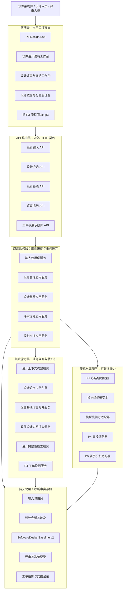
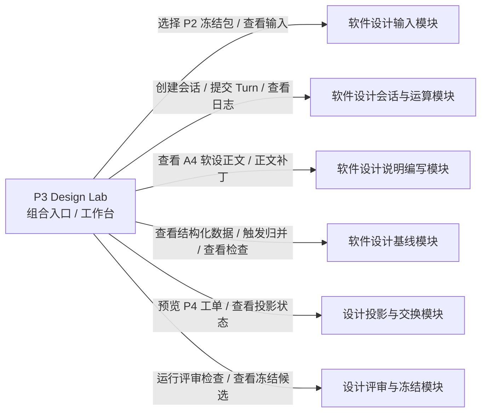
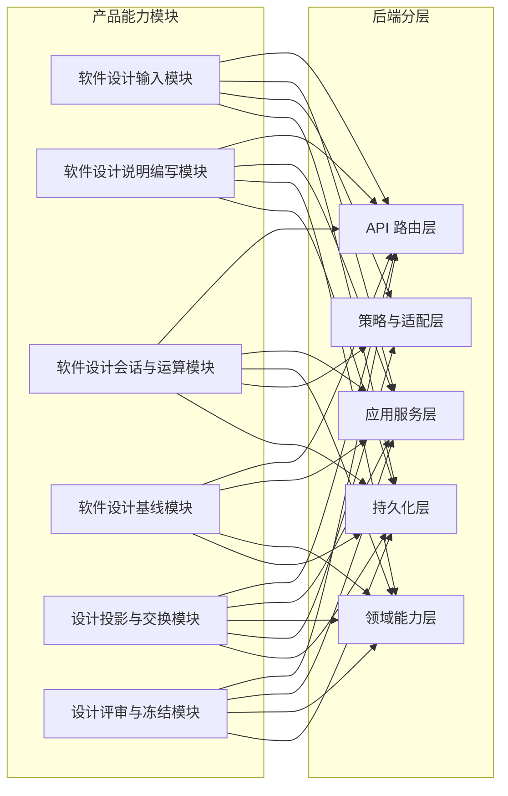
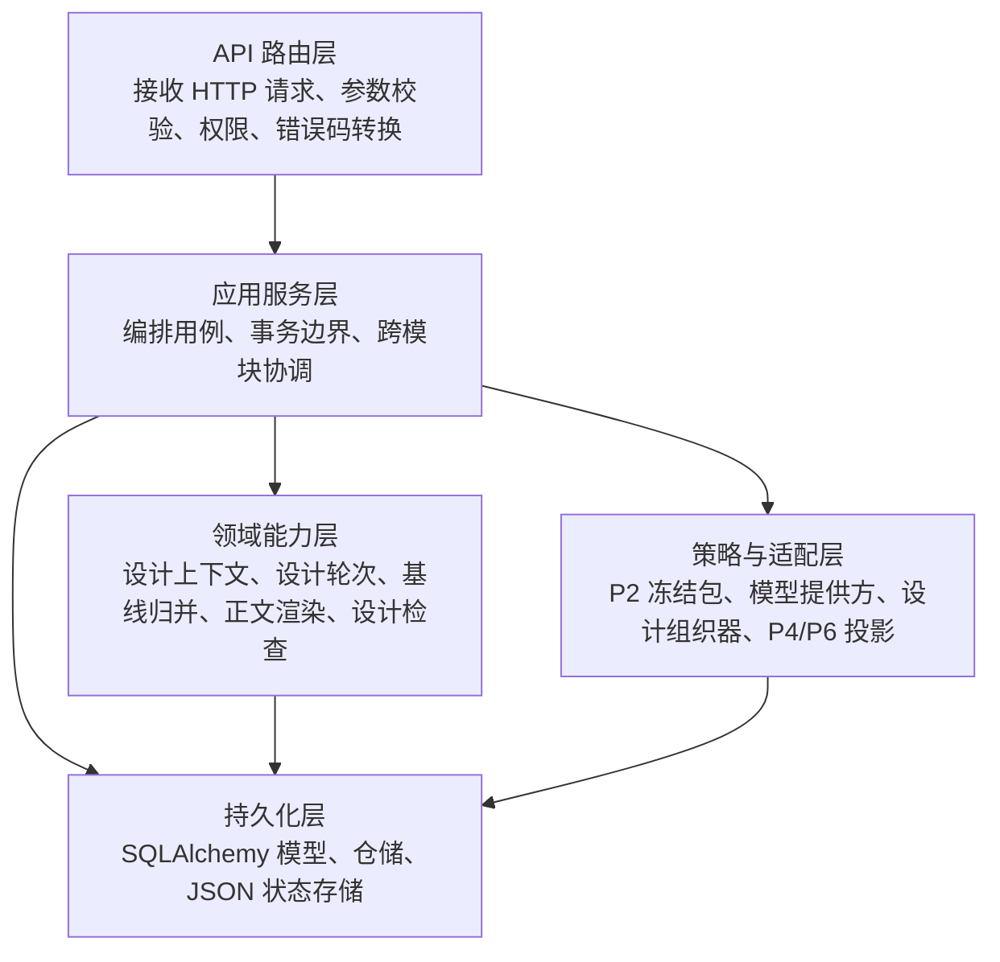
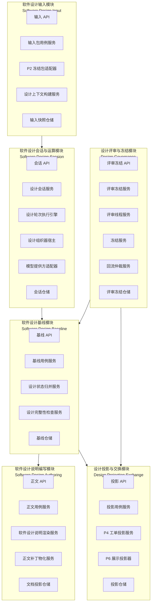
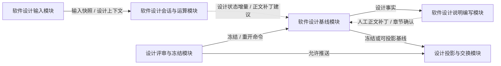
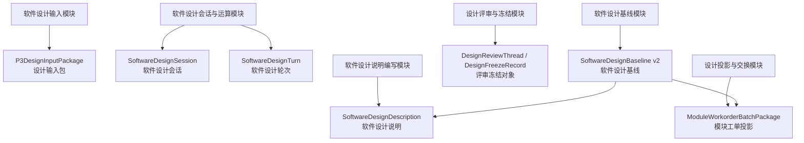
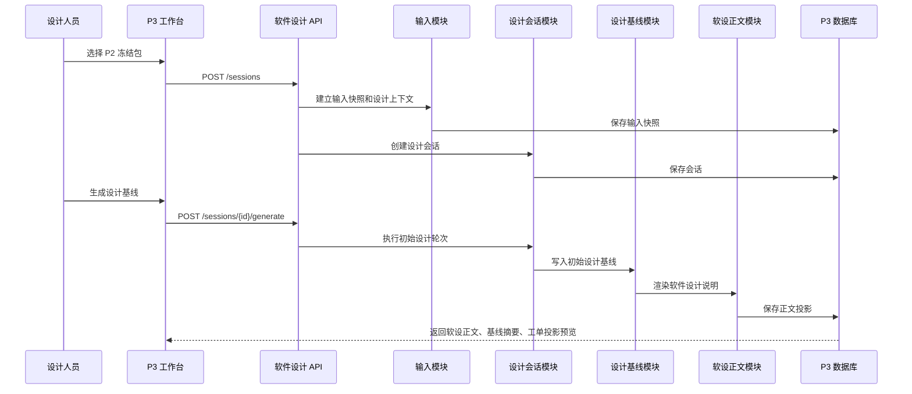
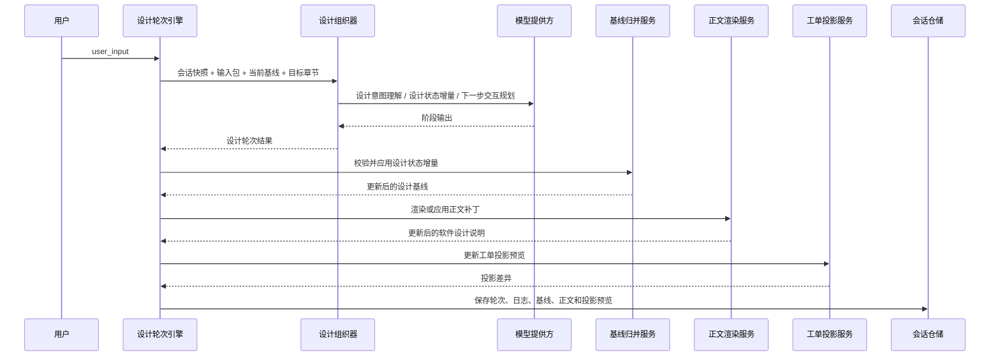
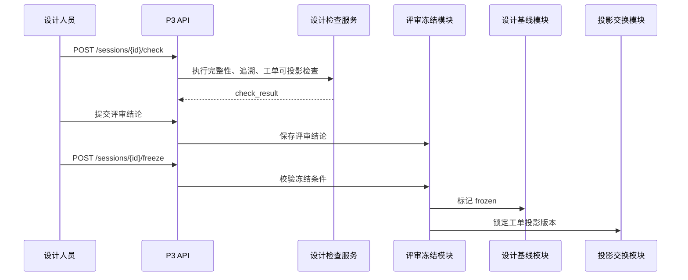

# P3 软件设计系统软件设计说明

> 本文件是 `CodeFactoryV2` 中 `P3 软件设计系统` 的主软件设计说明文档。本文描述本阶段认可的目标态系统设计：系统边界、前端形态、后端架构、模块职责、对象模型、接口、运行流程、设计组织器和验收口径。
>
> 本文不承担实现审查和迁移计划职责；本轮重构依据见 `P3-软件设计系统设计-260510-1453-目标态文档重构补充.md`。
>
> `P3-软件设计系统设计-260512-1745-Lab风格工作台重构补充.md` 是当前 `P3 Design Lab` 界面重构口径，明确新版页面以 `/p2-requirement-analysis-lab` 为主要参考对象。
>
> `P3-软件设计系统设计-260513-0046-DesignLab原型转主设计补充案.md` 已归入本文，用于把 v6 原型确认的需规列表、关联软设、软设双视图、`P4` 工单投影树和回合列表补入主设计。

**日期：** 2026-05-10

**最近更新：** 2026-05-13，归入 `P3 Design Lab` v6 原型转主设计补充案，明确 `Design Lab` 是六个业务模块的组合入口，不是独立业务模块或新单体服务；补入需规列表与多软设关联、软设文档 / 结构化双视图、`P4` 工单投影树和回合列表设计。

**对应节点：**

- `P3` 软件设计系统
- `P3.1` 设计依据与模板中心
- `P3.2` 需求规格说明冻结包接入与设计上下文建立
- `P3.3` 软件设计说明生成、修订与校核
- `P3.4` 结构化软件设计基线维护与冻结
- `P3.5` 模块级工具化描述与 `P4` 工单投影
- `P3.6` 评审、冻结、交接与回流仲裁

**关联正式文档：**

- `DOC/CODEX_DOC/02_设计说明/P2_需求分析系统/P2-需求分析系统设计.md`
- `DOC/CODEX_DOC/02_设计说明/P3_软件设计系统/P3-软件设计系统设计-260512-1745-Lab风格工作台重构补充.md`
- `DOC/CODEX_DOC/02_设计说明/P3_软件设计系统/P3-软件设计系统设计-260513-0046-DesignLab原型转主设计补充案.md`
- `DOC/CODEX_DOC/02_设计说明/P4_工具仓库/P4-工具仓库设计.md`
- `DOC/CODEX_DOC/02_设计说明/P5_软件构建系统/P5-软件构建系统设计.md`
- `DOC/CODEX_DOC/02_设计说明/00_总纲/03-P1-P6数据互联互通与平台交换层设计.md`

## 1. 文档目的与设计口径

### 1.1 文档目的

本文用于回答以下设计问题：

1. `P3` 是什么系统，边界在哪里。
2. 软件设计人员正面工作的对象是什么。
3. `P2` 冻结需求规格说明如何成为 `P3` 正式输入。
4. 前端有哪些页面、区块、状态和文档视图。
5. 后端按什么层次组织，核心模块分别承担什么职责。
6. `SoftwareDesignBaseline v2` 如何成为软件设计事实源。
7. 软件设计说明正文、设计基线、评审冻结和 `P4` 工单投影如何保持同源。
8. API 如何承载设计会话、设计轮次、校核、冻结和交接。
9. 一份需求规格说明如何转化为可冻结的软件设计说明和可交给 `P4` 的模块工单投影。

### 1.2 设计口径

本文采用目标态软件设计说明口径：

- 描述“系统应该如何设计”，不混入“现有代码哪里不足”。
- 描述“模块职责、状态对象和接口”，不把实施步骤写成系统设计。
- 描述“本阶段可实现的理想形态”，不要求一次性覆盖未来所有软件设计自动化能力。
- 设计内容在本文内自包含，读者不需要依赖旧 `P3` 工作层文档才能理解主架构。

### 1.3 术语使用规则

本文面向软件设计评审，优先使用中文概念名。英文名只在第一次出现时作为实现命名对照，或在代码路径、接口字段、类名、枚举值、文件名中使用。

例如：

- 软件设计会话（`SoftwareDesignSession`）。
- 软件设计轮次（`SoftwareDesignTurn`）。
- 软件设计基线（`SoftwareDesignBaseline v2`）。
- 软件设计说明（`SoftwareDesignDescription`）。
- 模块工单投影（`ModuleWorkorderProjection`）。
- 设计组织器（`Software Design Orchestrator`）。
- 设计冻结包（`SoftwareDesignPackage`）。

后续正文若讨论设计概念，应使用中文名；若讨论实现对象、字段或文件，应保留英文名。

### 1.4 系统主路径

`P3` 的主路径是：

```text
读取 P2 冻结需求规格说明包
  -> 创建设计会话并建立设计上下文
    -> 系统维护结构化软件设计状态
      -> 生成并修补软件设计说明 A4 正文
        -> 设计完整性检查与人工校核
          -> 冻结 SoftwareDesignBaseline v2
            -> 输出软件设计说明 + P4 模块工单投影
```

`P3 Design Lab` 是这条主路径的首个原理验证入口和组合工作台。它不新增独立业务事实源，不替代六个业务模块，不拥有设计基线、冻结权或正式工单推送权。旧 `/xx-p3` 订单、审批、评审和推送能力保留为历史流程面和后续治理侧线，但不再作为新版 `P3` 的主架构起点。

主路径在前端落地时采用“产物中心的 Lab 工作台”形态：顶部展示阶段身份和运行状态，左侧用 Lab 导航切换需规输入、软设工作区、`P4` 投影、当前 Turn、检查评审和运行日志，右侧工作区承载对应任务视图。软件设计说明仍是默认主产物，并以 A4 文档纸面嵌入软设工作区；结构化设计基线作为软设工作区的结构化数据视图呈现，不作为独立于软设的页面事实源。

## 2. 系统定位

### 2.1 一句话定位

`P3 软件设计系统` 是面向软件架构师、设计人员和评审人员的软件设计说明编写与设计基线冻结系统。它把 `P2` 冻结需求规格说明包、设计策略、自然语言补充和人工校核收敛为可冻结、可追溯、可交给 `P4` 的软件设计说明、结构化软件设计基线和模块工单投影。

### 2.2 正面工作对象

设计人员正面工作的对象是：

```text
软件设计说明文档
```

不是：

- 旧 `P3Order` 订单。
- 审批表单。
- 裸模块工单列表。
- 模型聊天记录。
- 结构化设计基线 JSON。
- `P4` 工具资产清单。

结构化软件设计基线仍然存在，但它是后台事实状态和下游消费源，用于支撑：

- 软件设计说明正文生成。
- 模块划分和接口设计一致性校核。
- 需求条款到设计章节的追溯。
- 人工评审和冻结。
- `P4` 工单投影。
- `P5` 可行性反馈仲裁。
- `P6` 只读展示投影。

### 2.3 用户角色

| 角色 | 主要目标 | 使用入口 |
| --- | --- | --- |
| 软件架构师 / 设计人员 | 从需求规格说明形成软件设计说明、模块划分、接口和约束 | 软件设计说明工作台、`P3 Design Lab` |
| 设计评审人员 | 审阅设计正文、追溯来源、提出批注并确认冻结 | 设计评审与冻结工作台 |
| `P4` 工具供给人员 / 下游系统 | 获取模块级工具化描述和工单投影 | `P3 -> P4` 交接接口 |
| 平台管理员 / 开发者 | 配置设计模板、设计组织器、模型提供方、检查规则和下游投影策略 | 设计依据与配置管理台 |
| `P6` 观察层 | 读取 `P3` 阶段只读状态、指标和流向 | `P6` 展示投影接口 |

## 3. 业务目标与边界

### 3.1 首版负责

首版 `P3` 负责：

- 只接入 `P2` 新版需求规格编写系统冻结包。
- 展示冻结需求规格说明正文，并保留结构化规格、批注、来源追溯和缺口检查结果。
- 创建设计会话，维护设计策略、设计轮次、设计状态和模型调用审计。
- 生成软件设计说明正文，并以接近 A4 文档形态供人工审阅。
- 维护 `SoftwareDesignBaseline v2`，承载架构、模块、接口、数据、状态、部署、约束和追溯。
- 支持自然语言配置、局部修订、重新生成、补充状态机、补充接口等设计轮次。
- 执行设计完整性检查、需求覆盖检查和下游工单可投影检查。
- 支持人工评审、冻结预览和冻结。
- 从同一设计基线投影出面向 `P4` 的模块工单包。
- 向 `P6` 输出软件设计系统的只读观察态。

### 3.2 首版不负责

首版 `P3` 不负责：

- 编写或修改 `P2` 需求规格说明。
- 消费旧 `/requirements/specs` 规格池。
- 兼容旧 `XX-P2-Sim` 作为新版输入来源。
- 维护 `P4` 工具资产、工具运行队列或真实工具执行。
- 执行 `P5` 软件构建、装配、导出和发布。
- 替代人工架构评审。
- 在没有冻结基线的情况下直接向 `P4` 下发正式供给任务。

### 3.3 上下游边界

```text
P2 冻结需求规格说明包
  -> P3 软件设计系统
    -> 软件设计说明 + SoftwareDesignBaseline v2 + P4 模块工单投影
      -> P4 工具仓库 / P5 软件构建系统
```

`P3` 只能消费 `P2` 冻结态产物，不读取 `P2` 草稿态、会话探索状态或未确认批注作为正式设计输入。

`P4` 只消费 `P3` 冻结或明确标记为可投影的模块工单包，不直接读取 `P2` 需求规格说明推断工具需求。

`P5` 对设计可行性的反馈必须进入 `P3` 仲裁流程，不能直接命令 `P4` 修订旧工具，也不能绕过 `P3` 改写设计基线。

### 3.4 软件设计原则

#### 3.4.1 设计说明优先于流程单

`P3` 坚持“设计说明优先于流程单”。旧订单、审批和工单流程用于治理设计结果，但不应替代设计本身。软件设计的最小可解释单元是：

```text
需求条款 + 设计决策 + 模块 / 接口 / 状态 / 数据对象 + 追溯关系
```

#### 3.4.2 基线优先于正文碎片

软件设计说明正文必须从 `SoftwareDesignBaseline v2` 投影生成或修订。正文可人工编辑，但关键设计事实必须回写或映射到设计基线。禁止只有正文、没有结构化设计状态的冻结结果。

#### 3.4.3 投影同源

软件设计说明、`P4` 工单投影和 `P6` 展示投影必须来自同一个设计基线。不同投影可以有不同展示形态，但不能各自维护互相矛盾的事实。

#### 3.4.4 完成条件

一份设计草稿满足以下条件，才可以进入冻结准备态：

- 输入包来自 `P2` 新版冻结包，且 `p3_consumable=true`。
- 软件设计说明正文已覆盖必填章节。
- 设计基线已包含架构模式、模块划分、接口或数据关系、状态约束和部署 / 运行约束。
- 每个关键模块至少能追溯到一个需求条款或结构化需求节点。
- 阻断型设计完整性检查通过。
- `P4` 工单投影可以生成，且不会缺失模块目标、输入输出、约束和验收要点。
- 人工评审结论允许冻结。

## 4. 总体架构

### 4.1 总体分层



### 4.2 产品能力模块

| 模块 | 中文名 | 主要使用者 | 设计目标 |
| --- | --- | --- | --- |
| `Software Design Input` | 软件设计输入模块 | 设计人员、系统 | 接入 `P2` 冻结包，建立设计上下文和追溯基线 |
| `Software Design Authoring` | 软件设计说明编写模块 | 软件架构师、设计人员 | 生成、修订、校核和审阅软件设计说明正文 |
| `Software Design Session` | 软件设计会话与运算模块 | 设计人员、开发者 | 承载设计轮次、设计组织器、模型调用和过程审计 |
| `Software Design Baseline` | 软件设计基线模块 | 设计人员、评审人员、下游系统 | 维护结构化设计事实、检查、冻结和版本 |
| `Design Projection Exchange` | 设计投影与交换模块 | `P4`、`P5`、`P6` | 输出工单投影、展示投影和回流仲裁输入 |
| `Design Governance` | 设计评审与冻结模块 | 评审人员、负责人 | 管理批注、评审结论、冻结和重开仲裁 |

### 4.3 `P3 Design Lab` 与产品能力模块的解耦关系

`P3 Design Lab` 不是第七个业务模块，也不是六个模块之外的新事实源。它是一个阶段工作台入口，通过前端编排层和 API 适配层把六个模块的能力组合到同一个用户工作面。



解耦映射如下：

| `P3 Design Lab` 区域 / 动作 | 所属业务模块 | 只读输入 | 写入命令 | 禁止事项 |
| --- | --- | --- | --- | --- |
| 输入包视图 | 软件设计输入模块 | `P2` 冻结包、输入快照、来源追溯 | 选择输入包、建立输入快照 | 不兼容旧规格池，不直接写设计基线 |
| 当前 Turn / CLI | 软件设计会话与运算模块 | 当前会话、输入上下文、当前基线摘要 | 提交设计轮次、保存模型调用日志 | 不直接冻结，不直接推送 `P4` |
| 软设工作区 | 软件设计说明编写模块 | 软件设计说明投影、章节状态、检查标记 | 正文补丁、章节确认 | 不把正文当作唯一事实源 |
| 结构化数据视图 | 软件设计基线模块 | `SoftwareDesignBaseline v2` | 基线增量归并、局部确认 | 不读取或修改 `P4` 工具资产 |
| 检查评审视图 | 设计评审与冻结模块 | 检查结果、评审线程、冻结候选 | 提交评审、冻结或重开命令 | 不生成设计内容 |
| `P4` 投影视图 | 设计投影与交换模块 | 冻结或可投影设计基线 | 生成投影、提交推送命令 | 不创造新的设计事实 |
| 运行日志视图 | 软件设计会话与运算模块 | API、Provider、检查器和状态迁移记录 | 记录审计事件 | 不作为正式设计结论 |

因此，`Design Lab` 的代码实现也必须保持分层：

- 页面组件只负责加载、导航选中、命令触发和错误展示。
- Adapter 只负责 DTO 到 ViewModel 的映射，不调用 API、不写业务规则。
- 共性 Lab 组件只消费 ViewModel，不引用 `P3` DTO。
- 六个业务模块分别维护自己的权威状态和命令边界。

### 4.4 产品能力与后端层次关系



每个产品能力模块都不是单一代码层。它们通过 API、应用服务、领域能力、适配器和持久化共同实现。后端第 6 章按软件模块展开这些关系。

## 5. 前端软件设计

### 5.1 模块定位、职责与核心概念

前端软件是 `P3` 的设计工作界面和用户操作编排层。它不拥有需求冻结包、设计模板、设计组织器、模型提供方、检查规则、冻结规则和投影策略等业务默认值；这些对象的权威来源是后端业务模块和配置接口。前端负责把后端下发的输入包、设计会话、设计基线、正文投影、检查结果和工单投影转换为可审阅、可修订、可冻结的工作界面。

#### 5.1.1 技术栈

前端技术栈为：

- React 18
- TypeScript
- Vite
- Ant Design
- Axios API 适配层
- React Router
- Vitest / Testing Library

#### 5.1.2 核心概念定义

| 序号 | 概念 | 实现命名 | 类型 | 定义 |
| --- | --- | --- | --- | --- |
| 1 | 前端运行模块 | `P3 Web Runtime` | 前端模块 | 承载 `P3` 路由、页面编排、配置加载、视图模型转换和领域组件展示的前端运行整体。 |
| 2 | 页面路由对象 | `Route Entry` | 路由入口 | 把 URL 映射到 `P3 Design Lab`、设计说明工作台、评审冻结工作台和旧流程面。 |
| 3 | 页面编排对象 | `Page Orchestrator` | React 页面 / Hook | 管理加载、选中、生成、提交、检查、冻结、错误和弹窗开关，调用 API 适配层。 |
| 4 | 设计文档视图 | `Design Document View` | 前端视图模型 | 把软件设计说明正文渲染为接近 A4 的文档画布，并承载章节、批注和检查标记。 |
| 5 | 结构化设计数据视图 | `Structured Design Data View` | 前端派生对象 | 在软设工作区内展示架构、模块、接口、数据、状态、部署和追溯等结构化设计事实。 |
| 6 | 设计轮次视图 | `Design Turn View` | 前端派生对象 | 展示用户输入、设计意图、设计增量、正文补丁、模型调用日志和下一步建议。 |
| 7 | API 适配对象 | `API Adapter` | 前端服务函数 | 封装 HTTP 请求、响应类型和错误边界，不管理页面状态。 |
| 8 | 页面临时状态 | `Local UI State` | React state | 当前选中输入包、当前 Tab、输入框内容、滚动位置、弹窗开关等只影响界面交互的状态。 |
| 9 | 业务权威状态 | `Authoritative Business State` | 后端状态 | 输入包、设计会话、设计轮次、设计基线、检查结果、冻结状态和工单投影等由后端维护的状态。 |
| 10 | 阶段 Lab 工作台 | `StageLabShell` | 前端共性容器组件 | 承载阶段身份区、左侧 Lab 导航和右侧任务工作区，参考 `/p2-requirement-analysis-lab` 的产品形态。 |
| 11 | 阶段 Lab 工作台视图模型 | `StageLabWorkbenchViewModel` | 前端 ViewModel | 把阶段身份、左侧导航、右侧任务工作区、输入事实、交互、标准文档、质量门禁、投影、运行日志和动作统一为 Lab 外壳输入。 |
| 12 | 标准文档视图模型 | `StandardDocumentViewModel` | 前端 ViewModel | 统一表达需求规格说明和软件设计说明的 A4 文档纸面、章节、正文块、批注和追溯。 |
| 13 | 主产物表面 | `DocumentProductSurface` | 前端共性组件 | 通过正文、目录、检查、追溯、投影、冻结等 Tab 承载阶段标准文档主产物。 |
| 14 | 工作台适配器 | `Workbench Adapter` | 前端纯函数 / 适配模块 | 把 `P3` 后端 DTO 转换为共性工作台 ViewModel，不访问 DOM，不调用 API。 |

#### 5.1.3 前端配置权威原则

| 配置类别 | 权威来源 | 前端责任 |
| --- | --- | --- |
| 输入包列表和可消费条件 | 后端 `P2` 冻结包适配器 | 展示可选输入，不自行兼容旧规格池 |
| 设计模板和章节结构 | 后端设计模板服务 | 按返回结构渲染章节，不硬编码最终模板 |
| 设计生成策略 | 后端配置或设计会话 | 展示和提交策略，不自行决定默认架构 |
| 检查规则 | 后端设计完整性检查服务 | 展示阻断 / 警告 / 通过，不自行判断冻结资格 |
| 冻结和重开规则 | 后端评审冻结模块 | 提交命令并展示状态，不在前端绕过冻结 |
| `P4` 工单投影 | 后端投影服务 | 展示预览和推送状态，不自行拼装正式包 |

### 5.2 前端分层与装载生命周期

#### 5.2.1 分层结构

```text
Route Entry
  -> Page Orchestrator
    -> API Adapter
    -> View Model Builder
      -> Workbench Adapter
        -> StageLabShell
          -> StageLabNavigation
          -> P3 Lab Task Views
          -> Document Product Panels
```

页面组件不直接拼接后端 DTO 字段作为业务判断。复杂转换放入视图模型构造函数或 Hook；领域组件只接收已整理的展示输入。

#### 5.2.2 阶段 Lab 工作台类群设计

`P3` 前端目标态采用阶段 Lab 工作台类群，而不是为 `P3 Design Lab` 单独维护一套静态三栏页面结构。新版工作台主要参考 `/p2-requirement-analysis-lab` 的产品形态：顶部阶段身份区、左侧 Lab 导航、右侧任务工作区。类群分为七类：

| 类群 | 代表命名 | 职责 |
| --- | --- | --- |
| ViewModel 类群 | `StageLabWorkbenchViewModel`、`StageDocumentWorkbenchViewModel`、`StandardDocumentViewModel`、`StageQualityGateViewModel` | 定义 Lab 工作台、兼容文档工作台和标准文档主产物需要的数据结构。 |
| Adapter 类群 | `p3DesignLabWorkbenchAdapter`、后续 `p2RequirementAuthoringWorkbenchAdapter` | 把阶段业务 DTO 转换为共性 ViewModel，隔离业务字段和 UI 组件。 |
| Lab Shell 容器组件 | `StageLabShell`、`StageLabNavigation` | 承载阶段身份、左侧导航、状态指标和右侧任务工作区。 |
| Document Product 组件 | `DocumentProductSurface`、`A4DocumentSurface`、`DocumentOutlinePanel`、`QualityCheckPanel` | 承载正文、目录、检查、追溯、投影和冻结等主产物视图。 |
| P3 Lab 视图组件 | `P3InputPackageView`、`P3SoftwareDesignWorkspaceView`、`P3CurrentTurnView`、`P3StructuredDesignDataView`、`P3QualityReviewView`、`P3ProjectionView`、`P3RuntimeLogView` | 按 Lab 导航项和软设工作区二级视图承载输入、产物、过程、结构化数据、检查、投影和日志。 |
| Stage Page 编排层 | `P3DesignLabPage`、目标态 `P3DesignWorkspacePage` | 负责加载、错误、命令提交和调用 adapter，不直接承载复杂展示映射。 |
| API 合同映射层 | `softwareDesignV2.ts` 与 API DTO 类型 | 封装后端接口，向 adapter 提供稳定 DTO 输入。 |

类群边界规则：

- 共性组件只接受 ViewModel，不接受 `P3DesignLabSession`、`P3DesignInputPackage` 等业务 DTO。
- Adapter 只做数据转换，不调用 API、不访问 DOM、不写 CSS。
- 页面编排层只负责副作用、导航选中和命令提交，不负责正文、检查、投影的细粒度渲染。
- 后端不直接返回前端 ViewModel；ViewModel 是前端适配层产物。

#### 5.2.3 `P2 Lab` 到 `P3 Lab` 的继承映射

`P3 Design Lab` 继承 `/p2-requirement-analysis-lab` 的产品骨架，不复制 `P2` 的业务对象。两者共用的是阶段工作台结构、状态可观测方式和主产物组织方法；差异由 Adapter 和阶段视图组件承担。

| `P2 Lab` 形态 | `P3 Lab` 落点 | 继承内容 | 阶段差异 |
| --- | --- | --- | --- |
| 顶部阶段身份区 | `P3 Software Design Lab` 顶部区 | 阶段名称、副标题、状态标签、主动作紧凑展示 | 状态标签改为输入包、设计会话、设计基线、检查评审、`P4` 投影 |
| 左侧导航 | `StageLabNavigation` | 用导航分解复杂工作，不把全部对象堆在一个页面 | 导航项改为需规输入、软设工作区、`P4` 投影、当前 Turn、检查评审、运行日志 |
| 任务工作区 | `StageLabShell` 右侧工作区 | 根据导航切换任务视图，保持工具台密度 | 默认任务视图是软件设计说明工作区 |
| 当前交互 / Turn | `P3CurrentTurnView` | CLI、解释结果、影响范围、下一步建议聚合展示 | 输入是设计配置和修订意图，不是需求采集问答 |
| 主产物区 | `P3SoftwareDesignWorkspaceView` + `DocumentProductSurface` | 主产物可用正文、目录、追溯、版本等 Tab 组织 | 主产物是软件设计说明，需保留 A4 文档纸面 |
| 过程日志 | `P3RuntimeLogView` | 保留 API、生成器、状态迁移可观测性 | 重点记录设计生成、检查、投影和模型调用 |
| 质量状态 | `P3QualityReviewView` | 用检查结果解释能否进入下一阶段 | 重点是冻结门禁和 `P4` 投影就绪性 |

该映射保证 `P3` 不重新造页面结构。后续若 `P3` 验证成功，`P2` 可以按同一共性工作台类群回迁，但回迁时仍必须通过 `P2` 自己的 Adapter 隔离业务 DTO。

#### 5.2.4 装载生命周期

`P3` 页面装载遵循以下生命周期：

1. 读取页面配置、设计模板和可用输入包。
2. 恢复上次选中的设计会话，或等待用户选择 `P2` 冻结包。
3. 创建或打开设计会话。
4. 读取软件设计说明正文投影、设计基线、设计轮次、检查结果和工单投影。
5. 用户发起生成、修订、检查、冻结或投影动作。
6. 页面重新读取权威状态并重建视图模型。

前端不得在请求失败时伪造已生成设计结果。失败状态必须显式展示。

### 5.3 状态机设计

#### 5.3.1 状态机分层

前端至少区分三类状态机：

| 状态机 | 作用 |
| --- | --- |
| 页面装载状态机 | 表达配置、输入包、会话和正文是否成功加载 |
| 设计交互状态机 | 表达当前能否生成、提交设计轮次、运行检查、冻结或投影 |
| 错误与不可用状态机 | 表达输入包缺失、会话失败、模型失败、检查阻断或冻结失败 |

#### 5.3.2 页面装载状态机

| 状态 | 含义 | 可操作动作 |
| --- | --- | --- |
| `initializing` | 页面刚进入，尚未读取配置 | 无 |
| `loading_inputs` | 正在读取 `P2` 冻结输入包 | 无 |
| `empty_inputs` | 没有可消费输入包 | 刷新、返回 `P2` |
| `ready_to_create` | 已选择输入包，可创建设计会话 | 创建设计会话 |
| `session_loaded` | 设计会话和投影已加载 | 生成、修订、检查 |
| `load_failed` | 配置、输入或会话读取失败 | 重试 |

#### 5.3.3 设计交互状态机

| 状态 | 含义 | 可操作动作 |
| --- | --- | --- |
| `created` | 会话创建，尚未生成基线 | 生成设计基线 |
| `generating` | 正在执行初次生成或重生成 | 等待 |
| `baseline_ready` | 设计基线和正文可审阅 | 设计轮次、检查、工单预览 |
| `checking` | 正在执行完整性检查 | 等待 |
| `ready_to_freeze` | 阻断问题已通过，可发起冻结 | 提交评审、冻结 |
| `frozen` | 设计基线已冻结 | 查看、投影、推送 |
| `projection_ready` | `P4` 工单投影已生成 | 推送 `P4` |
| `failed` | 设计生成或检查失败 | 重试、查看日志 |

#### 5.3.4 错误与不可用状态机

| 错误类型 | 前端展示 | 后续动作 |
| --- | --- | --- |
| 无可消费冻结包 | 显示空态和 `P2` 回流提示 | 返回 `P2` 生成冻结包 |
| 输入包不合格 | 显示 `p3_consumable` 和缺失字段诊断 | 要求重新冻结 |
| 模型 / 组织器失败 | 显示调用失败、阶段、错误原因 | 重试或切换策略 |
| 检查阻断 | 显示阻断项、目标章节和建议动作 | 局部修订或继续设计轮次 |
| 冻结失败 | 显示冻结条件不满足 | 运行检查或补齐缺口 |

### 5.4 页面执行设计

#### 5.4.1 路由结构

| 路由 | 页面 | 定位 |
| --- | --- | --- |
| `/p3-design-lab` | `P3 Design Lab` | 新版需规到软设原理验证入口 |
| `/p3-design` | 软件设计说明工作台 | 目标态正式设计工作台 |
| `/p3-design/reviews` | 设计评审与冻结工作台 | 评审、冻结和回流仲裁 |
| `/p3-design/config` | 设计依据与配置管理台 | 模板、组织器、模型和检查规则配置 |
| `/xx-p3` | 旧 `P3` 流程面 | 历史订单、审批和演示入口 |

首版已存在 `/p3-design-lab` 和 `/xx-p3`。其余路由是目标态正式化方向。

#### 5.4.2 页面区块与后端模块映射

| 页面区块 | 后端模块 | 读取输入 | 写入输出 |
| --- | --- | --- | --- |
| 需求规格说明输入区 | 软件设计输入模块 | `P2` 冻结包、标准正文、结构化规格、批注 | 设计会话输入快照 |
| 自然语言配置 / CLI | 软件设计会话与运算模块 | 设计会话、当前基线、可用策略 | 设计轮次、策略补充、设计补丁 |
| 软件设计说明 A4 正文区 | 软件设计说明编写模块 | 设计文档投影、章节检查结果 | 正文编辑补丁、章节确认 |
| 设计基线摘要区 | 软件设计基线模块 | `SoftwareDesignBaseline v2` | 局部确认、冻结候选 |
| `P4` 工单预览区 | 设计投影与交换模块 | 设计基线、模块划分、约束 | 工单投影、推送命令 |
| 评审冻结区 | 设计评审与冻结模块 | 检查结果、评审线程、冻结候选 | 评审结论、冻结状态 |

#### 5.4.3 页面命令提交规则

- 创建会话必须带输入包标识和生成策略。
- 生成设计基线必须通过后端命令执行，前端不本地生成正式设计。
- 自然语言输入必须形成设计轮次，不直接修改设计基线。
- 检查、冻结和投影必须分别调用后端命令，不允许前端组合状态假装完成。
- 冻结后的正文和设计基线默认只读；若需要重开，必须进入回流仲裁。

### 5.5 `P3 Design Lab` 设计

#### 5.5.1 页面职责

`P3 Design Lab` 用于验证新版 `P3` 的核心链路：

```text
P2 新版冻结包 -> 软件设计说明 -> SoftwareDesignBaseline v2 -> P4 工单投影
```

它不替代正式评审冻结工作台，但必须按目标态对象和 API 设计，避免形成无法迁移的实验页面。

早期原理验证稿中曾定义的“左上需规、左下 CLI、右侧软设正文”是首版验证布局。该布局用于解释 `P2` 冻结包、自然语言配置和软件设计说明之间的最小关系；在本文目标态中，它已经被解耦为 Lab 导航下的多个独立视图，不再作为页面目标结构。

Design Lab 的长期职责限定为：

- 暴露 `P2` 冻结包到 `P3` 设计会话的入口。
- 将软件设计说明、设计基线、检查评审和 `P4` 投影放到同一个工作台观察面。
- 承载自然语言配置和设计轮次入口。
- 展示 API、模型调用、检查器和状态迁移日志。
- 验证六个业务模块之间的协作是否闭环。

Design Lab 不承担以下职责：

- 不保存权威业务状态。
- 不维护独立于 `SoftwareDesignBaseline v2` 的设计事实。
- 不绕过评审冻结模块做冻结判定。
- 不绕过投影交换模块拼装正式 `P4` 工单。
- 不在页面层兼容旧规格池或旧 `P3Order` 主流程。
- 不把原型截图、静态样例文案或页面装饰状态升级为业务事实源。

v6 原型确认后的归并原则是：`Design Lab` 不是第七个业务模块，也不是新的持久化域。它只通过前端编排、Adapter 和 ViewModel 把软件设计输入模块、软件设计说明编写模块、软件设计会话与运算模块、软件设计基线模块、设计投影与交换模块、设计评审与冻结模块组合在同一工作面。页面可以呈现多种视图，但权威事实仍分别归属上述模块。

#### 5.5.2 页面结构

页面采用 `P2 Lab` 风格的三层结构：

1. 顶部阶段身份区：展示 `P3 Software Design Lab`、输入包状态、设计会话状态、设计基线状态、检查评审状态、`P4` 投影状态和主动作。
2. 左侧 Lab 导航：覆盖需规输入、软设工作区、`P4` 投影、当前 Turn、检查评审和运行日志。
3. 右侧任务工作区：根据左侧导航切换视图，默认进入软设工作区。

默认软设工作区仍以软件设计说明为主产物，A4 文档纸面嵌入 Lab 工作区。结构化设计基线不再作为独立主导航，而是作为软设工作区内的结构化数据视图，与文档视图共享同一个当前软设对象。CLI 不再挤在左下角，而是进入“当前 Turn”视图，展示回合列表、用户输入、系统解释、影响范围、设计基线变更、正文变更和下一步建议。

`P3 Design Lab` 不应拥有独立于共性工作台的页面骨架。它应作为 Lab 风格阶段工作台的 `P3` 适配实例：

```text
P3DesignLabPage
  -> load software-design-v2 DTO
  -> p3DesignLabWorkbenchAdapter
  -> StageLabWorkbenchViewModel
  -> StageLabShell
    -> P3InputPackageView
    -> P3SoftwareDesignWorkspaceView
      -> document view
      -> structured data view
    -> P3ProjectionView
    -> P3CurrentTurnView
    -> P3QualityReviewView
    -> P3RuntimeLogView
```

该结构保证 `P3` 的首轮验证结果可以继承 `P2 Lab` 的产品形态，也可以在正式 `/p3-design` 工作台中复用。

Lab 视图之间的业务关系如下：

```text
需规输入与关联软设
  -> 软设工作区
    -> P4 工单投影树
      -> 当前 Turn
        -> 检查评审
          -> 运行日志
```

该顺序表达默认工作理解，不是强制线性流程。用户可以在不同视图间切换，以观察同一设计会话的不同侧面。工作台必须保持以下规则：

- 默认进入软设工作区。
- 没有选中需规对象时，软设工作区显示正式空态。
- 选中需规对象后，右侧展示该需规已经关联的多份软件设计说明。
- 打开或新建软件设计说明后，软设工作区使用该软设作为当前工作对象。
- 结构化数据视图和 `P4` 工单投影树默认跟随当前软设对象。
- 当前 Turn、检查评审和运行日志默认跟随当前设计会话。

#### 5.5.3 顶部阶段身份区

顶部阶段身份区必须像 `P2 Lab` 一样先说明“当前处于哪个阶段、正在解决什么问题、核心对象是否可用”，而不是展示布局比例或静态说明卡片。

顶部区包含：

- 标识：`P3 Software Design Lab`。
- 副标题：`从 P2 需求规格冻结包生成软件设计说明、设计基线和 P4 投影`。
- 状态标签：输入包状态、设计会话状态、设计基线状态、检查评审状态、`P4` 投影状态。
- 主动作：选择 `P2` 冻结包、生成或重新生成、运行检查、冻结候选。
- 运行提示：最近一次生成、检查或投影的时间与结果。

顶部区禁止承载大段设计说明。概念解释应进入文档或导航视图，顶部只表达当前工作台状态和可执行动作。

#### 5.5.4 左侧 Lab 导航

左侧导航是新版 `P3 Design Lab` 的主组织结构。导航项、含义和可用条件如下：

| 导航项 | 视图组件 | 说明 | 可用条件 |
| --- | --- | --- | --- |
| 需规输入 | `P3InputPackageView` | 管理可进入 `P3` 的需求规格说明、选中需规和关联软设列表 | 始终可见；无需规时显示空态 |
| 软设工作区 | `P3SoftwareDesignWorkspaceView` | 默认视图，展示当前软件设计说明文档视图和结构化数据视图 | 始终可见；未打开软设时显示正式空态 |
| `P4` 投影 | `P3ProjectionView` | 展示当前软设可派生出的 `P4` 工单投影树、就绪状态和交接对象 | 生成投影后可用 |
| 当前 Turn | `P3CurrentTurnView` | 承载回合列表、自然语言 CLI、意图解释、影响范围和增量摘要 | 有会话后可提交；无会话时只读提示 |
| 检查评审 | `P3QualityReviewView` | 展示阻断、警告、通过项、证据和冻结门禁 | 生成基线后可运行 |
| 运行日志 | `P3RuntimeLogView` | 展示 API、Provider、检查器、状态迁移和错误重试 | 始终可见 |

每个导航项应显示标题、短说明、状态和关键指标。例如需规输入显示可设计数量和关联软设数量，软设工作区显示当前软设状态，检查评审显示阻断项数量，`P4` 投影显示投影节点数。导航禁用态不能隐藏对象，必须说明不可用原因。顶部和导航区禁止放置与对象区重复的“新建软设”“打开当前软设”等动作；新建、编辑和删除必须靠近关联软设列表对象。

#### 5.5.5 软设工作区视图

软设工作区是默认视图，也是 `P3` 的正式产物区。它的页面结构为：

```text
当前需规 / 生成策略 / 会话状态 / 工作区动作
  -> A4 软件设计说明正文
  -> 设计基线摘要 / 检查状态 / P4 投影状态
```

软件设计说明必须保留 A4 文档质感，但 A4 纸面嵌入 Lab 工作区内部。整页不再以“左侧需规 + 左下 CLI + 右侧 A4”的静态三栏为唯一结构。

软设工作区采用二级视图：

```text
软设工作区
  -> 文档视图
  -> 结构化数据视图
```

文档视图负责：

- 展示 A4 软件设计说明正文。
- 支持章节选中和章节级交互。
- 支持保存草稿、提交复核。
- 展示当前章节对应的设计对象、追溯来源和检查标记。

结构化数据视图负责：

- 展示架构、模块、接口、数据对象、状态机、部署约束和追溯关系。
- 展示结构化字段是否已从正文或模型结果同步。
- 支持生成 `P4` 投影候选。

文档视图和结构化数据视图的切换应位于软设工作区标题栏，因为它切换的是整个工作区的展示形态，不是左侧章节列表的局部过滤。

软设工作区动作收敛规则：

- 已经存在软设草稿时，不显示“生成草稿”。
- 正文编辑状态下允许“保存草稿”。
- 达到检查条件时允许“提交复核”。
- 结构化数据默认与正文和基线同步，不显示“同步正文”。
- 结构化补全由后端生成或 Turn 承担，不显示无边界的“补全结构”。
- 生成 `P4` 投影候选是结构化数据视图的有效动作。

文档视图中的主产物辅助 Tab 建议为：

- 正文。
- 目录。
- 追溯。
- 版本。

正文 Tab 展示 A4 软件设计说明；目录 Tab 展示章节结构和设计对象定位；追溯 Tab 展示 `P2` 条款到设计章节、模块、接口和工单的关系；版本 Tab 展示生成轮次、正文补丁和冻结记录。

#### 5.5.6 当前 Turn 视图

当前 Turn 是自然语言配置和生成解释的一等视图，不再挤在左下角。该视图从“当前一个回合”扩展为“回合列表 + 当前回合详情 + CLI”的组合视图。

该视图承载：

- 回合列表。
- 用户自然语言输入。
- 系统解释出的设计意图。
- 影响范围，包括章节、模块、接口、数据对象和投影对象。
- 对设计基线的变更摘要。
- 对软件设计说明正文的变更摘要。
- 下一步建议。
- CLI 输入框。

CLI 的职责是让设计人员补充设计策略、约束、修订意图和确认信息。它不是 `P3` 的主输入源；`P3` 的主输入源仍然是 `P2` 冻结需求规格说明包。

`P3` 与 `P2` 不同：`P3` 的主输入是需规文档，软设可以自动生成，回合不是唯一工作对象。但只保留当前回合会让从需规到软设的变化过程不可追踪。因此当前 Turn 视图必须展示历史回合，并用回合解释软设为何变成当前状态。回合不得直接改写正文或基线，必须通过设计轮次引擎和归并服务。

#### 5.5.7 结构化数据、检查评审和 `P4` 投影视图

结构化设计数据、检查评审和 `P4` 投影必须来自同一个 `SoftwareDesignBaseline v2`，但在页面上承担不同任务。结构化设计数据是软设工作区的二级视图，检查评审和 `P4` 投影是 Lab 主导航视图。

结构化数据视图展示：

- 架构模式。
- 模块清单和模块职责。
- 接口草案。
- 数据对象。
- 状态机或关键流程。
- `P2` 需求条款追溯关系。

结构化数据视图展示的对象必须来自 `SoftwareDesignBaseline v2`。前端不允许通过解析 A4 正文自行拼装正式结构化设计对象。

检查评审视图展示：

- 阻断项数量。
- 警告项数量。
- 通过项数量。
- 检查规则列表。
- 每条问题的作用范围、证据和建议动作。

该视图回答：当前软设为什么能或不能进入下一阶段。

`P4` 投影视图正式表达为 `P4 工单投影树`，其含义是：

```text
P4 投影 = 从 P3 设计基线派生出的下游工单组织树
```

该视图不是普通列表，而是树型结构，展示：

- 投影包名称。
- 下游目标阶段。
- 模块组或设计分支。
- 模块工单。
- 工具供给任务或接口实现任务。
- 每个节点的来源需求、来源设计对象、就绪状态和阻断原因。

该视图回答：这份软设后面怎么变成可执行工作。主文档避免同时使用“P4 投影”和“工单树”指代两个对象；正式对象可以命名为 `ModuleWorkorderProjectionTree`，其数据来源仍是 `ModuleWorkorderProjection` 或 `ModuleWorkorderBatchPackage`。

#### 5.5.8 空态与不可用态

没有可消费输入包时，页面仍保持 Lab 工作台结构：

- 顶部显示待输入状态。
- 左侧导航仍可见。
- 输入包视图显示“没有可用的 P2 新版冻结包”和选择 / 刷新动作。
- 软设工作区显示正式空态，不显示大片无意义 A4 空白。
- 当前 Turn、结构化数据视图、检查评审和 `P4` 投影显示等待输入包或等待生成的原因。
- 运行日志仍展示加载、过滤和失败信息。

已选择需规但尚未打开或新建软设时，软设工作区显示正式空态，并提示选择既有关联软设或新建软设。已打开软设但尚未生成时，软设工作区可显示 A4 正式空态，当前 Turn 可输入生成策略，结构化数据视图、检查评审和 `P4` 投影显示等待生成。

#### 5.5.9 与正式工作台的关系

`P3 Design Lab` 是正式工作台的能力切片。后续正式化时：

- 输入事实源区进入设计输入模块。
- 当前 Turn、CLI 和运行日志进入设计会话与运算模块。
- A4 软设正文进入软件设计说明编写模块。
- 结构化设计数据进入软件设计基线模块。
- 检查评审和工单投影进入评审冻结模块与投影交换模块。

#### 5.5.10 从 `P3-10` 回并到主设计的内容归属

早期 `P3 Design Lab v2` 专题稿中的有效设计不再作为独立目标态维护，而是按模块归入本文：

| `P3-10` 内容 | 主设计归属 | 解耦处理 |
| --- | --- | --- |
| 只消费 `P2` 新版 authoring 冻结包 | 软件设计输入模块、输入 API、输入包对象 | 固化为输入模块契约，不由页面兼容旧输入 |
| `P3DesignInputPackage` | 设计输入包对象 | 作为 `P2` 冻结包在 `P3` 的输入包装，不直接写基线 |
| `P3DesignSession` | 软件设计会话对象 | 会话保存策略、轮次、Provider 和当前上下文，不拥有冻结权 |
| `P3DesignTurn` | 软件设计轮次对象 | 负责自然语言配置、校正、局部重生成的过程记录 |
| `SoftwareDesignBaseline v2` | 软件设计基线模块 | 作为后台权威设计事实源，不归属 Lab 页面 |
| `software-design-v2` API | API 设计、后端目录结构 | 首版可作为聚合入口，目标态拆回六个业务模块 |
| 旧 `/xx-p3` 关系 | 设计评审与冻结模块、历史流程面 | 旧流程保留为治理侧线，不再作为主事实源 |
| 首版三栏页面布局 | 前端 Lab 工作台设计 | 历史原型布局，目标态改为顶部身份区、左侧导航、右侧任务工作区 |
| v6 需规列表与关联软设 | 软件设计输入模块、软件设计说明编写模块 | 一个需规可以关联多份软设，列表管理和软设编辑解耦 |
| v6 软设文档 / 结构化双视图 | 软件设计说明编写模块、软件设计基线模块 | 文档视图面向人审阅，结构化数据视图面向系统校核和投影候选 |
| v6 `P4` 工单投影树 | 设计投影与交换模块 | `P4` 投影是树型工单组织，不是独立设计事实源 |
| v6 当前 Turn 回合列表 | 软件设计会话与运算模块 | 回合列表解释从需规到软设的生成和修订过程 |

回并后，`P3-10` 只承担历史依据和原理验证说明职责；实现和后续评审以本文为准。

### 5.6 模块接口设计

#### 5.6.1 外部接口

前端通过以下 API 族访问 `P3`：

- `/api/software-design-v2/input-packages`
- `/api/software-design-v2/sessions`
- `/api/software-design-v2/sessions/{session_id}`
- `/api/software-design-v2/sessions/{session_id}/generate`
- `/api/software-design-v2/sessions/{session_id}/turns`
- `/api/software-design-v2/sessions/{session_id}/check`

目标态还需要补充：

- 设计模板 API。
- 设计基线 API。
- 设计评审与冻结 API。
- `P4` 工单投影 API。
- `P6` 展示投影 API。

#### 5.6.2 内部接口

前端内部建议按以下边界组织：

| 内部接口 | 责任 |
| --- | --- |
| `softwareDesignV2.ts` | HTTP API 适配，不持有页面状态 |
| `P3DesignLabPage.tsx` | 页面编排、加载、命令提交和视图状态 |
| `p3DesignLabWorkbenchAdapter` | 把输入包、会话、正文、基线、检查和投影 DTO 转成共性工作台 ViewModel |
| `StageLabShell` | 阶段 Lab 工作台外壳、顶部身份区、左侧导航和右侧工作区 |
| `StageLabNavigation` | Lab 导航项、状态、数量指标和禁用态 |
| `DocumentProductSurface` | 主产物 Tab 容器 |
| `A4DocumentSurface` | 标准 A4 文档纸面 |
| `DocumentOutlinePanel` | 目录、章节、模块和追溯位置展示 |
| `QualityCheckPanel` | 缺口、警告和通过项展示 |
| `StageProjectionPanel` | `P4` 工单投影和下游交接展示 |
| `StageFreezePanel` | 冻结候选、冻结条件和冻结记录展示 |
| `P3InputPackageView` | 需规列表、选中需规、结构化字段、关联软设和待确认项展示 |
| `P3SoftwareDesignWorkspaceView` | 软设工作区，承载 A4 正文、结构化数据视图和产物摘要 |
| `P3CurrentTurnView` | 自然语言输入、解释结果、影响范围和设计增量 |
| `P3StructuredDesignDataView` | 架构、模块、接口、数据对象、状态和追溯展示，作为软设工作区二级视图 |
| `P3QualityReviewView` | 设计检查、证据、建议动作和冻结门禁展示 |
| `P3RuntimeLogView` | API、Provider、检查器和状态迁移日志展示 |

### 5.7 约束、错误处理与模块边界

#### 5.7.1 前端模块不变量

- 前端不兼容旧 `/requirements/specs`。
- 前端不把自然语言输入当作正式需求输入，只作为设计配置和修订输入。
- 前端不绕过后端检查直接标记 `ready_to_freeze`。
- 前端不在冻结后本地修改正文。
- 前端展示的工单预览必须来自后端投影。

#### 5.7.2 错误处理

错误处理必须保留三个层次：

1. 页面可用性错误：输入包为空、会话不存在、网络失败。
2. 设计执行错误：生成失败、轮次失败、模型输出不合格。
3. 设计质量错误：追溯缺失、章节不完整、工单投影缺字段。

#### 5.7.3 与后端模块边界

前端只能提交命令和展示后端状态，不拥有设计基线、冻结资格、工单投影和回流仲裁的最终判断权。

## 6. 后端软件设计

### 6.1 后端技术栈

后端技术栈为：

- Python 3.12
- FastAPI
- SQLAlchemy
- Pydantic
- PostgreSQL
- JSON 字段承载配置对象、设计状态和过程状态
- OpenAI 风格接口模型提供方
- Pytest

### 6.2 后端分层原则

后端采用五层结构。



各层职责：

| 层 | 职责 | 约束 |
| --- | --- | --- |
| API 路由层 | 接收参数、转换错误码、返回 DTO | 不写业务状态机 |
| 应用服务层 | 编排用例、控制事务、协调多个领域服务 | 不承载细粒度设计规则 |
| 领域能力层 | 实现设计上下文、设计轮次、基线归并、正文渲染、检查、冻结规则 | 不直接处理 HTTP |
| 策略与适配层 | 接入 `P2` 冻结包、模型提供方、设计组织器、`P4` 和 `P6` | 不拥有 `P3` 权威状态 |
| 持久化层 | 保存输入快照、会话、轮次、基线、评审和投影 | 不做业务决策 |

### 6.3 后端模块总览

后端按六个业务模块组织，每个业务模块跨越上述五层。



模块与层级关系：

| 后端模块 | API 路由层 | 应用服务层 | 领域能力层 | 策略与适配层 | 持久化层 |
| --- | --- | --- | --- | --- | --- |
| 软件设计输入模块 | 输入 API | 输入包用例服务 | 设计上下文构建 | `P2` 冻结包适配器 | 输入快照仓储 |
| 软件设计会话与运算模块 | 会话 API | 设计会话服务 | 设计轮次执行引擎 | 设计组织器、模型提供方 | 会话仓储 |
| 软件设计说明编写模块 | 正文 API | 正文用例服务 | 正文渲染、正文补丁物化 | 设计模板读取 | 文档投影仓储 |
| 软件设计基线模块 | 基线 API | 基线用例服务 | 设计状态归并、完整性检查 | 无或少量策略读取 | 基线仓储 |
| 设计投影与交换模块 | 投影 API | 投影用例服务 | 工单投影、展示投影 | `P4`、`P6` 适配器 | 投影仓储 |
| 设计评审与冻结模块 | 评审冻结 API | 评审冻结服务 | 评审线程、冻结、重开仲裁 | `P5` 反馈适配 | 评审冻结仓储 |

#### 6.3.1 模块权威状态矩阵

| 后端模块 | 权威对象 | 可写状态 | 只读输入 | 禁止直接写入的对象 |
| --- | --- | --- | --- | --- |
| 软件设计输入模块 | 设计输入包快照 | 输入包元数据、来源追溯、接入状态 | `P2` 冻结包 | 设计基线、评审结论、`P4` 工单 |
| 软件设计会话与运算模块 | 软件设计会话、设计轮次 | 会话消息、轮次、设计增量、模型调用日志 | 输入包、设计基线快照、模板 | 冻结状态、正式工单推送状态 |
| 软件设计说明编写模块 | 软件设计说明投影 | 正文章节、正文补丁、章节批注投影 | 设计基线、模板、检查结果 | 设计基线事实、冻结状态 |
| 软件设计基线模块 | `SoftwareDesignBaseline v2` | 架构、模块、接口、数据、状态、约束、追溯、检查结果 | 输入包、设计轮次、正文补丁 | `P2` 冻结包、`P4` 工具资产 |
| 设计投影与交换模块 | 工单投影、展示投影 | 投影包、投影状态、交接状态 | 冻结或可投影设计基线 | 设计基线事实、评审结论 |
| 设计评审与冻结模块 | 评审线程、冻结记录、回流仲裁记录 | 批注、评审结论、冻结状态、重开结论 | 检查结果、`P5` 反馈 | `P2` 输入包、`P4` 工具资产 |

#### 6.3.2 模块间调用规则



调用约束：

- 会话模块可以建议设计增量，但不能绕过基线模块直接冻结。
- 正文编写模块可以提交正文补丁，但关键设计事实必须由基线模块归并。
- 投影模块只能读取冻结或明确可投影的基线。
- 评审冻结模块只发出冻结、驳回、重开和推送许可，不负责生成设计内容。

### 6.4 软件设计输入模块

#### 6.4.1 模块定位、职责与核心概念

软件设计输入模块负责从 `P2` 读取可消费冻结包，建立 `P3` 设计输入快照。它是 `P2 -> P3` 边界的守门模块。

核心概念：

| 概念 | 实现命名 | 说明 |
| --- | --- | --- |
| 需规候选对象 | `RequirementSpecCandidate` | 可进入 `P3` 的需求规格说明列表项 |
| 设计输入包 | `P3DesignInputPackage` | `P2` 冻结包在 `P3` 中的输入包装 |
| 输入快照 | `DesignInputSnapshot` | 防止 `P2` 后续变化影响当前设计会话 |
| 设计上下文 | `DesignContext` | 从需求正文、结构化规格、批注和知识绑定构造的设计输入上下文 |

首版输入模块不只提供一个当前输入包，还应支持列出可进入 `P3` 的需求规格说明对象。每个需规对象至少包含：

- 需规标识。
- 需规标题。
- 来源 `P2` 冻结包。
- 创建人。
- 创建时间。
- 最近更新时间。
- 当前状态，例如已创建、待设计、设计中、待复核、已完成、已发布。
- 可设计性状态，例如可设计、待复核、阻断。
- 已关联软件设计数量。

选中一条需规后，输入模块提供该需规的详情和关联软设查询入口，但不负责创建或修改软件设计说明正文。

#### 6.4.2 状态机设计

| 状态 | 含义 |
| --- | --- |
| `discovered` | 在 `P2` 冻结包列表中发现可消费输入 |
| `snapshotted` | 已建立输入快照 |
| `context_ready` | 已构建设计上下文 |
| `rejected` | 输入包缺字段、不可消费或已失效 |

#### 6.4.3 模块运行编排设计

```text
读取 P2 冻结包列表
  -> 过滤 p3_consumable=true
    -> 用户选择输入包
      -> 建立输入快照
        -> 构建设计上下文
          -> 交给设计会话模块
```

#### 6.4.4 模块接口设计

| API | 应用服务入口 | 主要领域服务 |
| --- | --- | --- |
| `GET /requirement-specs` | `ListRequirementSpecCandidatesQuery` | `P2FrozenPackageAdapter` |
| `GET /requirement-specs/{requirement_spec_id}` | `GetRequirementSpecCandidateQuery` | `DesignInputRepository` |
| `GET /input-packages` | `ListDesignInputPackagesQuery` | `P2FrozenPackageAdapter` |
| `POST /input-snapshots` | `CreateDesignInputSnapshotCommand` | `DesignContextBuilder` |
| `GET /input-snapshots/{snapshot_id}` | `GetDesignInputSnapshotQuery` | `DesignInputRepository` |

首版 `software-design-v2` 可把输入快照隐含在设计会话创建中，但目标态应显式化。

### 6.5 软件设计会话与运算模块

#### 6.5.1 模块定位、职责与核心概念

软件设计会话与运算模块维护从输入包到设计基线的多轮设计过程。它承载自然语言配置、设计轮次、设计组织器、模型调用和审计日志。

会话不等于正式软件设计说明。会话探索阶段的业务主状态是设计基线候选和设计轮次过程产物；正式冻结必须由设计基线模块和评审冻结模块完成。

核心概念：

- 软件设计会话（`SoftwareDesignSession`）。
- 软件设计轮次（`SoftwareDesignTurn`）。
- 软件设计轮次列表（`SoftwareDesignTurnList`）。
- 设计组织器（`SoftwareDesignOrchestrator`）。
- 设计轮次结果（`SoftwareDesignTurnResult`）。
- 模型调用日志（`ProviderCallLog`）。

当前 Turn 不是单条临时 UI 状态，而应来源于 `SoftwareDesignTurn` 列表。每条回合至少记录：

- 回合标识。
- 所属设计会话。
- 触发来源：初始生成、CLI 修订、章节交互、检查修复、投影生成。
- 用户输入或系统触发说明。
- 解释出的设计意图。
- 影响范围。
- 基线增量摘要。
- 正文补丁摘要。
- 投影影响摘要。
- 运行状态和错误信息。
- 创建时间。

回合列表用于解释“需规进入 `P3` 后，软设如何逐步生成和变化”。页面可以高亮当前回合，但不能只保存当前回合而丢失历史过程。

#### 6.5.2 状态机设计

| 状态 | 含义 |
| --- | --- |
| `created` | 会话已创建，但尚未生成初始设计 |
| `context_ready` | 输入上下文、模板和策略已准备 |
| `generating` | 正在生成初始设计基线和正文 |
| `baseline_ready` | 初始设计基线和正文已生成 |
| `running_turn` | 正在执行一轮设计修订 |
| `checking` | 正在执行设计检查 |
| `ready_to_freeze` | 满足冻结准备条件 |
| `frozen` | 已冻结 |
| `failed` | 生成、轮次或检查失败 |

#### 6.5.3 轮次执行设计

一轮设计轮次的推荐阶段如下：

```text
SoftwareDesignTurn
  Stage 1: design_intent_understanding
  Stage 2: define_design_task
  Stage 3: design_state_delta
  Stage 4: apply_design_state
  Stage 5: design_document_patch
  Stage 6: workorder_projection_preview
  Stage 7: next_design_interaction
  Stage 8: finalize_turn
```

阶段职责：

| 阶段 | 模型调用 | 输出 |
| --- | --- | --- |
| `design_intent_understanding` | 可调用 | 设计意图、目标章节、目标模块、输入关系 |
| `define_design_task` | 不调用 | 本轮任务、非目标、质量约束 |
| `design_state_delta` | 可调用 | 架构、模块、接口、状态、数据、约束增量 |
| `apply_design_state` | 不调用 | 更新后的 `SoftwareDesignBaseline v2` |
| `design_document_patch` | 可调用或系统渲染 | 软件设计说明正文补丁 |
| `workorder_projection_preview` | 不调用 | 工单投影预览差异 |
| `next_design_interaction` | 可调用 | 下一轮确认、选项或冻结建议 |
| `finalize_turn` | 不调用 | 审计、日志、持久化状态 |

#### 6.5.4 模块接口设计

| API | 应用服务入口 | 主要领域服务 |
| --- | --- | --- |
| `POST /sessions` | `CreateSoftwareDesignSessionCommand` | `DesignContextBuilder`、`SoftwareDesignSessionService` |
| `GET /sessions/{session_id}` | `GetSoftwareDesignSessionQuery` | `SoftwareDesignSessionService` |
| `POST /sessions/{session_id}/generate` | `GenerateInitialDesignCommand` | `SoftwareDesignTurnEngine`、`SoftwareDesignOrchestratorHost` |
| `GET /sessions/{session_id}/turns` | `ListSoftwareDesignTurnsQuery` | `SoftwareDesignSessionService` |
| `POST /sessions/{session_id}/turns` | `RunSoftwareDesignTurnCommand` | `SoftwareDesignTurnEngine` |

#### 6.5.5 内部功能组成与类划分

| 子模块 | 目标职责 |
| --- | --- |
| `session_application_service.py` | 会话用例编排 |
| `session_service.py` | 会话状态读取、保存和状态迁移 |
| `turn_engine.py` | 单轮设计执行主入口 |
| `design_intent_service.py` | 设计意图理解结果归一化 |
| `design_delta_service.py` | 设计状态增量校验和采用 |
| `provider_call_log_service.py` | 模型调用日志保存和查询 |
| `session_repository.py` | 会话持久化 |

首版 `apps/api/app/software_design_v2/service.py` 可以作为该模块的最小实现雏形，但目标态应拆分上述职责。

### 6.6 软件设计说明编写模块

#### 6.6.1 模块定位、职责与核心概念

软件设计说明编写模块负责把设计基线投影为可读、可审阅、可批注、可冻结的软件设计说明正文。它是 `P3` 正面工作对象的后台承载模块。

核心概念：

- 软件设计说明文档（`SoftwareDesignDescription`）。
- 设计章节（`DesignDocumentSection`）。
- 设计正文补丁（`DesignDocumentPatch`）。
- 设计批注（`DesignAnnotation`）。
- 关联软件设计（`RelatedSoftwareDesign`）。

一条需求规格说明可以创建多份软件设计说明。每份软件设计说明拥有独立版本、状态、创建时间、更新时间和设计会话。关联软设列表支持新建、编辑、删除；发布、冻结、提交复核等治理动作不在需规输入视图完成，应进入软设工作区或评审冻结模块。

删除软设必须遵循后端状态约束，已冻结或已发布软设不能被普通删除动作直接移除。

#### 6.6.2 状态机设计

| 状态 | 含义 |
| --- | --- |
| `empty` | 尚未生成正文 |
| `draft` | 正文草稿可编辑 |
| `patched` | 有模型或人工补丁已应用 |
| `reviewing` | 正在评审 |
| `ready_to_freeze` | 正文与基线一致性检查通过 |
| `frozen` | 冻结为正式软件设计说明 |

#### 6.6.3 正文渲染设计

软件设计说明正文应优先由系统基于设计基线渲染，模型可参与章节内容生成和润色，但不能绕过基线事实。

标准章节至少包括：

1. 引言、范围和设计依据。
2. 需求规格输入摘要。
3. 总体架构设计。
4. 模块划分与职责。
5. 接口设计。
6. 数据对象与存储设计。
7. 状态机与流程设计。
8. 权限、安全、审计和非功能约束。
9. 部署、运行和配置约束。
10. 需求到设计追溯矩阵。
11. 面向 `P4` 的工具化描述摘要。
12. 待确认项、风险和评审结论。

#### 6.6.4 模块接口设计

| API | 应用服务入口 | 主要领域服务 |
| --- | --- | --- |
| `GET /sessions/{session_id}/design-document` | `GetDesignDocumentQuery` | `DesignDocumentRenderer` |
| `PATCH /sessions/{session_id}/design-document/sections/{section_id}` | `PatchDesignDocumentSectionCommand` | `DesignDocumentPatchService` |
| `POST /sessions/{session_id}/design-document/render` | `RenderDesignDocumentCommand` | `DesignDocumentRenderer` |
| `GET /requirement-specs/{requirement_spec_id}/software-designs` | `ListRelatedSoftwareDesignsQuery` | `DesignDocumentRepository` |
| `POST /requirement-specs/{requirement_spec_id}/software-designs` | `CreateSoftwareDesignForRequirementCommand` | `DesignDocumentApplicationService` |
| `DELETE /software-designs/{software_design_id}` | `DeleteSoftwareDesignCommand` | `DesignDocumentApplicationService` |

### 6.7 软件设计基线模块

#### 6.7.1 模块定位、职责与核心概念

软件设计基线模块维护 `P3` 的结构化设计事实，是 `P3` 内部权威状态。软件设计说明正文、工单投影、展示投影和冻结包都必须追溯到该模块。

`SoftwareDesignBaseline v2` 至少包含：

- `baseline_id`
- `session_id`
- `input_snapshot_id`
- `application_name`
- `architecture_mode`
- `module_decomposition`
- `interface_designs`
- `data_designs`
- `state_machine_designs`
- `deployment_constraints`
- `non_functional_constraints`
- `traceability_matrix`
- `design_annotations`
- `pending_confirmations`
- `check_result`
- `version`
- `status`

#### 6.7.2 状态机设计

| 状态 | 含义 |
| --- | --- |
| `candidate` | 初始候选基线 |
| `draft` | 可持续修订 |
| `checked_with_warnings` | 检查有警告但无阻断 |
| `ready_to_freeze` | 满足冻结条件 |
| `frozen` | 已冻结 |
| `reopened` | 经回流仲裁后重开 |
| `superseded` | 被新版本替代 |

#### 6.7.3 设计完整性检查

结构化数据视图展示的模块、接口、数据对象、状态机和追溯关系必须来自 `SoftwareDesignBaseline v2`。前端不允许通过解析 A4 正文自行拼装正式结构化设计对象。

当用户在结构化数据视图中触发 `生成投影候选` 时，后端应：

1. 读取当前设计基线。
2. 校验投影所需字段。
3. 生成或刷新投影候选。
4. 返回投影树预览和缺失项。
5. 记录运行日志。

设计完整性检查至少覆盖：

| 检查项 | 阻断条件 |
| --- | --- |
| 输入可追溯 | 基线缺少 `P2` 输入包来源 |
| 模块覆盖 | 关键需求无模块承载 |
| 接口完整性 | 模块间存在交互但无接口说明 |
| 数据对象 | 关键业务对象无数据承载说明 |
| 状态机 | 关键流程存在状态变化但无状态设计 |
| 非功能约束 | `P2` 非功能需求未进入设计约束 |
| 工单投影 | 模块工单缺目标、输入输出、约束或验收要点 |

#### 6.7.4 模块接口设计

| API | 应用服务入口 | 主要领域服务 |
| --- | --- | --- |
| `GET /sessions/{session_id}/baseline` | `GetDesignBaselineQuery` | `SoftwareDesignBaselineService` |
| `PATCH /sessions/{session_id}/baseline` | `PatchDesignBaselineCommand` | `DesignBaselineReducer` |
| `POST /sessions/{session_id}/check` | `RunDesignCheckCommand` | `DesignCompletenessChecker` |
| `POST /sessions/{session_id}/freeze` | `FreezeDesignBaselineCommand` | `DesignFreezeService` |

### 6.8 设计投影与交换模块

#### 6.8.1 模块定位、职责与核心概念

设计投影与交换模块负责把设计基线投影给下游系统。它不产生新的设计事实，只负责按下游合同生成不同视图。

核心投影：

- 软件设计说明正式导出。
- `P4` 模块工单投影。
- `P5` 构建输入摘要。
- `P6` 展示投影。

#### 6.8.2 `P4` 工单投影设计

`P4` 模块工单投影是从 `P3` 设计基线派生出的下游工单组织树，不是扁平列表，也不是独立设计事实源。它至少包含：

- 包级总体说明。
- 架构模式。
- 模块列表。
- 模块目标。
- 输入输出。
- 关键接口。
- 数据对象。
- 状态与流程约束。
- 验收要点。
- 推荐工具能力。
- 来源需求条款和设计章节追溯。

树型投影至少包含四类节点：

| 节点类型 | 含义 | 来源 |
| --- | --- | --- |
| `projection_package` | 当前软设派生出的投影包 | 设计会话、设计基线 |
| `module_group` | 模块组、领域分支或设计分支 | 架构设计、模块划分 |
| `module_workorder` | 可交给 `P4` 的模块工单 | 模块职责、接口、数据对象 |
| `supply_task` | 工具供给或实现准备任务 | 工单拆解、接口约束、验收要点 |

每个节点至少包含：

- 节点标识。
- 标题。
- 来源设计对象。
- 来源需求条款。
- 就绪状态。
- 阻断原因。
- 下游目标。

#### 6.8.3 模块接口设计

| API | 应用服务入口 | 主要领域服务 |
| --- | --- | --- |
| `GET /sessions/{session_id}/workorder-projection` | `GetWorkorderProjectionQuery` | `P4WorkorderProjector` |
| `POST /sessions/{session_id}/workorder-projection` | `BuildWorkorderProjectionCommand` | `P4WorkorderProjector` |
| `GET /software-designs/{software_design_id}/p4-projection-tree` | `GetP4ProjectionTreeQuery` | `P4WorkorderProjector` |
| `POST /software-designs/{software_design_id}/p4-projection-candidates` | `BuildP4ProjectionCandidateCommand` | `P4WorkorderProjector` |
| `POST /sessions/{session_id}/push-to-p4` | `PushDesignPackageToP4Command` | `P4ExchangeAdapter` |
| `GET /p6-projection` | `BuildP6ProjectionQuery` | `P6DesignProjector` |

### 6.9 设计评审与冻结模块

#### 6.9.1 模块定位、职责与核心概念

设计评审与冻结模块负责人工评审、批注、冻结、推送许可和 `P5` 回流仲裁。它不直接生成设计内容。

核心概念：

- 评审线程（`DesignReviewThread`）。
- 评审结论（`DesignReviewDecision`）。
- 冻结记录（`DesignFreezeRecord`）。
- 回流仲裁记录（`DesignReopenDecision`）。

#### 6.9.2 冻结规则

冻结必须满足：

- 设计完整性检查无阻断项。
- 软件设计说明正文与设计基线一致。
- `P4` 工单投影可生成。
- 阻断批注已关闭或明确转为后续风险。
- 人工评审结论为通过。

#### 6.9.3 `P5` 回流仲裁

`P5` 反馈进入 `P3` 后，必须先分类：

| 分类 | 处理方式 |
| --- | --- |
| `design_gap` | 重开设计基线，修订软设和工单投影 |
| `supply_gap` | 形成新供给目标，向 `P4` 下发新任务或派生任务 |
| `assembly_or_build_gap` | 回到 `P5` 装配、导出或校验规则整改 |

禁止把所有 `P5` 不兼容都解释为 `P4` 旧工具修订。

## 7. 核心对象模型

### 7.1 持久化对象

| 对象 | 表 / 存储 | 职责 |
| --- | --- | --- |
| `P3DesignInputPackage` | 输入快照表或 JSON 存储 | `P2` 冻结包在 `P3` 的可追溯输入 |
| `SoftwareDesignSession` | 设计会话表 | 设计会话、状态、配置和当前上下文 |
| `SoftwareDesignTurn` | 设计轮次表 / 会话 JSON | 单轮设计输入、模型调用、设计增量和审计 |
| `SoftwareDesignBaseline v2` | 设计基线表 / JSON 存储 | 结构化软件设计事实 |
| `SoftwareDesignDescription` | 文档投影表 / JSON 存储 | 软件设计说明正文投影 |
| `ModuleWorkorderBatchPackage` | 投影包表 / JSON 存储 | 面向 `P4` 的模块工单投影 |
| `DesignReviewThread` | 评审线程表 / JSON 存储 | 批注、讨论和评审意见 |
| `DesignFreezeRecord` | 冻结记录表 / JSON 存储 | 冻结版本、冻结时间和冻结人 |

### 7.2 对象与模块映射



对象模型回答“系统保存什么事实”，模块设计回答“谁负责处理这些事实”。

### 7.3 输入包对象

`P3DesignInputPackage` 至少包含：

当前实现字段：

- `input_package_id`
- `source_document_id`
- `source_title`
- `standard_document`
- `structured_spec`
- `annotations`
- `knowledge_binding`
- `frozen_at`
- `p3_consumable`

目标增强字段：

- `check_result`
- `source_trace`

只有 `p3_consumable=true` 的输入包可以创建设计会话。

当前实现说明：

- 后端 `apps/api/app/software_design_v2/service.py` 当前从 `RequirementAuthoringDocument.frozen_package` 派生 `P3DesignInputPackage`，并未把 `RequirementAuthoringDocument.check_result` 或独立 `source_trace` 直接放入输入包。
- 当前 `P3` 对输入合法性的判断依赖 `p3_consumable=true`、`standard_document`、`structured_spec` 和冻结文档存在性。
- `check_result` 当前属于 `P3DesignLabSession` 的会话检查结果，不是 `P3DesignInputPackage` 的既有字段。
- `source_trace` 当前更多由 `source_document_id`、`knowledge_binding`、`frozen_at`、总纲和阶段设计文档共同提供；后续进入平台交换层时，再收敛为稳定字段。

### 7.4 软件设计会话对象

`SoftwareDesignSession` 至少包含：

- `session_id`
- `input_package`
- `input_snapshot_id`
- `generation_policy`
- `status`
- `design_document`
- `design_baseline`
- `workorder_projection`
- `turns`
- `check_result`
- `frozen_package`
- `runtime_events`
- `created_at`
- `updated_at`

会话是长期状态对象，不是某一轮执行对象。轮次结束后，轮次结果必须回写到会话和设计基线。

当前实现说明：

- 当前后端与前端类型实际对象名是 `P3DesignLabSession`，不是旧式 `P3Order` 或单一 `SoftwareDesignSession` DTO。
- 当前实现未持久化 `input_snapshot_id`、`design_template_id`、`orchestrator_id`、`provider_id` 等独立字段；这些属于后续设计组织器深化时可补充的扩展字段。
- 当前会话核心事实是 `input_package`、`generation_policy`、`design_document`、`design_baseline`、`workorder_projection`、`turns`、`check_result`、`frozen_package` 和 `runtime_events`。

### 7.5 软件设计轮次对象

`SoftwareDesignTurn` 至少包含：

```text
turn_id
session_id
turn_index
previous_interaction
user_input
normalized_input
design_intent
target_design_sections
target_modules
stage_task_definition
stage_quality_constraints
design_state_delta
design_document_patch
workorder_projection_delta
next_design_interaction
stage_audits
provider_call_logs
created_at
```

轮次不等同于聊天消息。一次轮次通常会产生用户消息和系统回应，但轮次本身记录的是处理过程。

### 7.6 软件设计基线对象

`SoftwareDesignBaseline v2` 是 `P3` 的核心权威对象。

至少包含：

- 基线身份：`baseline_id`、`version`、`status`。
- 来源身份：`input_snapshot_id`、`source_document_id`、`requirement_package_version`。
- 总体设计：`application_name`、`architecture_mode`、`architecture_rationale`。
- 模块设计：`modules`、`module_dependencies`。
- 接口设计：`interfaces`。
- 数据设计：`data_objects`、`storage_constraints`。
- 状态与流程：`state_machines`、`process_flows`。
- 运行约束：`deployment_constraints`、`non_functional_constraints`。
- 追溯：`traceability_matrix`。
- 评审：`design_annotations`、`pending_confirmations`。
- 检查：`check_result`。

### 7.7 软件设计说明对象

`SoftwareDesignDescription` 是设计基线的文档投影。

至少包含：

- `document_id`
- `baseline_id`
- `title`
- `status`
- `sections`
- `annotations`
- `rendered_at`
- `frozen_at`

正文可以人工修订，但修订必须以补丁形式记录，并回到设计基线或明确标记为纯文本批注。

### 7.8 模块工单投影对象

`ModuleWorkorderBatchPackage` 至少包含：

- `package_id`
- `baseline_id`
- `package_overview`
- `items`
- `traceability`
- `p4_push_status`
- `created_at`

每个 `items[]` 至少包含：

- `item_id`
- `module_id`
- `title`
- `goal`
- `inputs`
- `outputs`
- `interfaces`
- `constraints`
- `acceptance_points`
- `recommended_tool_capabilities`
- `source_design_refs`
- `source_requirement_refs`

### 7.9 评审与冻结对象

| 对象 | 含义 |
| --- | --- |
| `DesignReviewThread` | 针对章节、模块、接口、数据对象或工单条目的讨论线程 |
| `DesignReviewDecision` | 评审通过、驳回、带条件通过或转后续风险 |
| `DesignFreezeRecord` | 记录冻结基线、冻结文档、冻结工单投影和冻结人 |
| `DesignReopenDecision` | 记录 `P5` 或人工反馈触发的重开仲裁结论 |

### 7.10 前端阶段 Lab / 文档工作台 ViewModel 对象

本节对象不是持久化对象，也不是后端返回 DTO。它们是前端 Adapter 从后端权威状态派生出来的工作台显示合同，用于把 `P3` 页面接入平台级阶段 Lab 工作台和标准文档工作台。

#### 7.10.1 `StageLabWorkbenchViewModel`

`StageLabWorkbenchViewModel` 是新版阶段 Lab 工作台根视图模型，至少包含：

- `identity`：阶段身份、阶段目标、上游来源、下游目标。
- `header`：标题、副标题、状态标签、运行提示和主动作。
- `navigation`：左侧 Lab 导航项、激活项、禁用原因、数量指标和建议跳转项。
- `workspace`：右侧工作区当前视图标识、标题、摘要和视图数据引用。
- `inputFacts`：输入事实源，包括当前 `P2` 冻结包、结构化输入和来源追溯。
- `interaction`：当前 Turn、CLI、解释结果和影响范围。
- `product`：标准文档主产物。
- `baseline`：结构化设计基线摘要和详情入口。
- `quality`：检查评审、冻结门禁和证据。
- `projection`：`P4` 工单投影和交接摘要。
- `runtime`：运行日志、模型调用、API 调用、状态迁移和错误记录。
- `actions`：页面动作、可用性、加载态和失败态。

`P3` 中，该对象由 `p3DesignLabWorkbenchAdapter` 根据 `P3DesignLabInputPackage`、`P3DesignLabSession`、检查结果、设计基线和投影结果生成。共性组件读取该模型组织 Lab 外壳，`P3` 专属视图组件读取其中的阶段数据。

`navigation.items[]` 至少包含：

- `itemId`：`requirement_input`、`design_workspace`、`p4_projection`、`current_turn`、`quality_review`、`runtime_log`。
- `title`
- `description`
- `status`
- `metric`
- `disabledReason`
- `recommended`

`StageLabWorkbenchViewModel` 不包含旧三栏比例字段。布局比例属于具体 CSS 和响应式策略，不进入业务 ViewModel。

`P3 Design Lab` 中，`inputFacts` 应能承载需规列表和选中需规对象，`workspace` 应能区分软设文档视图和结构化数据视图，`projection` 应能承载 `P4` 工单投影树。

#### 7.10.2 `StageDocumentWorkbenchViewModel`

`StageDocumentWorkbenchViewModel` 是兼容文档工作台根视图模型，用于承载已经抽象出的标准文档表面和历史三栏文档工作台。新的 `P3 Design Lab` 优先使用 `StageLabWorkbenchViewModel`，但可继续复用其中的 `product`、`quality`、`projection` 和 `interaction` 子模型。

- `identity`：阶段身份、文档类型、上游来源、下游目标。
- `header`：标题、副标题、状态标签、运行提示。
- `layout`：左右比例、左侧上下比例、默认激活 Tab。
- `inputFacts`：左侧输入事实源。
- `interaction`：左侧交互区。
- `product`：右侧标准文档主产物。
- `quality`：质量检查和冻结门禁摘要。
- `projection`：下游投影和交接包摘要。
- `actions`：页面动作、可用性、加载态。

在新版 `P3 Design Lab` 中，该对象不再作为页面根模型，只作为标准文档主产物、检查、投影和交互子模型的兼容来源。若旧文档工作台或后续 `P2` 回迁需要三栏结构，可继续由对应 Adapter 生成该对象。

#### 7.10.3 `StandardDocumentViewModel`

`StandardDocumentViewModel` 统一表达 A4 标准文档，至少包含：

- `documentId`
- `documentType`
- `title`
- `subtitle`
- `versionLabel`
- `status`
- `page`
- `sections`
- `annotations`
- `traceLinks`

`sections[]` 下沉为正文块 `blocks[]`。正文块至少包含：

- `blockId`
- `kind`：`paragraph`、`clause`、`table`、`list`、`code`、`diagram_placeholder`
- `title`
- `content`
- `anchorId`
- `sourceRefs`
- `qualityRefs`

该模型允许 `P2` 用条款块表达需求规格说明，也允许 `P3` 用段落、列表和表格块表达软件设计说明。

#### 7.10.4 `StageQualityGateViewModel`

`StageQualityGateViewModel` 统一表达检查和冻结门禁，至少包含：

- `status`：`not_run`、`running`、`passed`、`warning`、`blocked`
- `summary.blockingCount`
- `summary.warningCount`
- `summary.passedCount`
- `gates[]`

每个 `gates[]` 至少包含：

- `itemId`
- `severity`
- `title`
- `description`
- `scope`：`input`、`document`、`state`、`projection`、`freeze`
- `anchorId`
- `suggestedAction`

`P3` 的设计完整性检查和 `P2` 的缺口检查均可映射到该对象；检查规则仍由后端业务模块维护。

#### 7.10.5 `StageOutputProjectionViewModel`

`StageOutputProjectionViewModel` 统一表达下游投影和交接包，至少包含：

- `targetStage`
- `packageName`
- `status`
- `sourceDocumentId`
- `sourceStateId`
- `items[]`
- `treeNodes[]`

每个 `items[]` 至少包含：

- `itemId`
- `title`
- `itemType`
- `description`
- `traceRefs`
- `readiness`

每个 `treeNodes[]` 至少包含：

- `nodeId`
- `parentNodeId`
- `nodeType`
- `title`
- `summary`
- `sourceRequirementRefs`
- `sourceDesignRefs`
- `readiness`
- `childrenCount`

`P3` 中，该对象用于展示 `P4` 工单投影树和后续 `P5` 设计输入投影。扁平 `items[]` 可作为兼容摘要，但正式工作区优先使用 `treeNodes[]` 表达组织结构。

#### 7.10.6 `StageInteractionViewModel`

`StageInteractionViewModel` 统一表达人机交互轮次的前端展示，至少包含：

- `mode`：`cli`、`questionnaire`、`form`、`hybrid`
- `title`
- `description`
- `feed[]`
- `composer`
- `lastTurn`

`lastTurn` 至少包含：

- `turnId`
- `userInput`
- `interpretedIntent`
- `affectedScopes`
- `stateEffectSummary`
- `documentEffectSummary`
- `projectionEffectSummary`
- `nextSuggestions`

该对象只抽象交互展示和影响范围，不抽象 `P2` 或 `P3` 的组织器算法。`P3` 中还应提供 `turns[]`，用于展示回合列表；`lastTurn` 只是当前或最近回合的快捷入口。

#### 7.10.7 `StageFreezeViewModel`

`StageFreezeViewModel` 统一表达冻结候选、冻结门禁和冻结记录，至少包含：

- `status`
- `gates`
- `candidateOutputs`
- `frozenRecord`

`P3` 的候选输出包括软件设计说明、`SoftwareDesignBaseline v2` 和 `P4` 模块工单投影。冻结规则仍由设计评审与冻结模块维护。

#### 7.10.8 `RequirementSpecCandidateViewModel`

`RequirementSpecCandidateViewModel` 用于需规输入视图中的列表项，不是后端持久化对象，至少包含：

- `requirementSpecId`
- `title`
- `sourcePackageId`
- `createdBy`
- `createdAt`
- `updatedAt`
- `lifecycleStatus`
- `designabilityStatus`
- `linkedDesignCount`
- `selected`

#### 7.10.9 `RelatedSoftwareDesignViewModel`

`RelatedSoftwareDesignViewModel` 用于选中需规后的关联软设列表，至少包含：

- `softwareDesignId`
- `requirementSpecId`
- `title`
- `versionLabel`
- `status`
- `createdAt`
- `updatedAt`
- `lastTurnId`
- `canEdit`
- `canDelete`
- `canOpen`

#### 7.10.10 `SoftwareDesignWorkspaceViewModel`

`SoftwareDesignWorkspaceViewModel` 用于软设工作区双视图，至少包含：

- `activeDesignId`
- `activeView`：`document`、`structured`
- `document`
- `structuredBaseline`
- `selectedSection`
- `selectedDesignObject`
- `availableActions`
- `reviewState`
- `projectionCandidateState`

#### 7.10.11 `P4WorkorderProjectionTreeViewModel`

`P4WorkorderProjectionTreeViewModel` 用于 `P4` 投影树视图，至少包含：

- `projectionId`
- `sourceDesignId`
- `sourceBaselineId`
- `status`
- `treeNodes[]`
- `blockingItems[]`
- `lastGeneratedAt`

`treeNodes[]` 的字段要求与 `StageOutputProjectionViewModel.treeNodes[]` 保持一致。

#### 7.10.12 Adapter 规则

每个阶段必须有自己的 Adapter：

| Adapter | 输入 | 输出 | 约束 |
| --- | --- | --- | --- |
| `p3DesignLabWorkbenchAdapter` | `P3DesignLabInputPackage`、`P3DesignLabSession`、基线、检查、投影 | `StageLabWorkbenchViewModel`，并复用标准文档子模型 | 不调用 API，不访问 DOM，不写 CSS |
| `p2RequirementAuthoringWorkbenchAdapter` | `RequirementAuthoringDocumentDetail`、模板、工作台配置 | `StageDocumentWorkbenchViewModel` | 用于后续 `P2` 回迁验证 |

Adapter 不允许把业务 DTO 直接透传给共性组件；无法展示但需保留的业务字段应进入调试扩展或 `rawRefs`，不得污染共性模型。

## 8. API 设计

### 8.1 软件设计输入 API

路由前缀：

```text
/api/software-design-v2
```

| 方法 | 路径 | 用途 |
| --- | --- | --- |
| `GET` | `/requirement-specs` | 列出可进入 `P3` 的需求规格说明 |
| `GET` | `/requirement-specs/{requirement_spec_id}` | 读取选中需规对象 |
| `GET` | `/input-packages` | 列出可消费的 `P2` 冻结包 |
| `POST` | `/input-snapshots` | 目标态：建立输入快照 |
| `GET` | `/input-snapshots/{snapshot_id}` | 目标态：读取输入快照 |

### 8.2 软件设计会话 API

| 方法 | 路径 | 用途 |
| --- | --- | --- |
| `POST` | `/sessions` | 创建设计会话 |
| `GET` | `/sessions/{session_id}` | 获取会话详情 |
| `POST` | `/sessions/{session_id}/generate` | 初次生成设计基线、软设正文和工单投影 |
| `GET` | `/sessions/{session_id}/turns` | 列出设计会话回合 |
| `POST` | `/sessions/{session_id}/turns` | 执行一轮设计修订 |

API 到模块命令 / 查询映射：

| API | 应用服务入口 | 主要领域服务 |
| --- | --- | --- |
| `POST /sessions` | `CreateSoftwareDesignSessionCommand` | `DesignContextBuilder`、`SoftwareDesignSessionService` |
| `GET /sessions/{id}` | `GetSoftwareDesignSessionQuery` | `SoftwareDesignSessionService` |
| `POST /sessions/{id}/generate` | `GenerateInitialDesignCommand` | `SoftwareDesignTurnEngine`、`DesignDocumentRenderer` |
| `GET /sessions/{id}/turns` | `ListSoftwareDesignTurnsQuery` | `SoftwareDesignSessionService` |
| `POST /sessions/{id}/turns` | `RunSoftwareDesignTurnCommand` | `SoftwareDesignTurnEngine`、`DesignBaselineReducer` |

### 8.3 软件设计基线与正文 API

| 方法 | 路径 | 用途 |
| --- | --- | --- |
| `GET` | `/requirement-specs/{requirement_spec_id}/software-designs` | 列出该需规关联的软件设计说明 |
| `POST` | `/requirement-specs/{requirement_spec_id}/software-designs` | 为该需规新建一份软件设计说明 |
| `DELETE` | `/software-designs/{software_design_id}` | 删除未冻结、未发布的软件设计说明 |
| `GET` | `/software-designs/{software_design_id}/workspace` | 一次性读取软设工作区需要的正文、结构化摘要、当前会话和动作状态 |
| `PATCH` | `/software-designs/{software_design_id}/document/sections/{section_id}` | 保存章节草稿或章节补丁 |
| `POST` | `/software-designs/{software_design_id}/submit-review` | 提交复核 |
| `GET` | `/sessions/{session_id}/baseline` | 目标态：获取设计基线 |
| `PATCH` | `/sessions/{session_id}/baseline` | 目标态：提交基线补丁 |
| `GET` | `/sessions/{session_id}/design-document` | 目标态：获取软件设计说明正文 |
| `PATCH` | `/sessions/{session_id}/design-document/sections/{section_id}` | 目标态：修订正文章节 |
| `POST` | `/sessions/{session_id}/check` | 执行设计完整性检查 |
| `POST` | `/sessions/{session_id}/freeze` | 目标态：冻结设计基线和软设正文 |

### 8.4 投影与交换 API

| 方法 | 路径 | 用途 |
| --- | --- | --- |
| `GET` | `/sessions/{session_id}/workorder-projection` | 目标态：获取 `P4` 工单投影 |
| `POST` | `/sessions/{session_id}/workorder-projection` | 目标态：重新生成工单投影 |
| `GET` | `/software-designs/{software_design_id}/p4-projection-tree` | 读取当前软设的 `P4` 工单投影树 |
| `POST` | `/software-designs/{software_design_id}/p4-projection-candidates` | 从结构化设计基线生成投影候选 |
| `POST` | `/sessions/{session_id}/push-to-p4` | 目标态：推送给 `P4` |
| `GET` | `/p6-projection` | 目标态：生成 `P6` 展示投影 |

### 8.5 评审冻结与回流 API

| 方法 | 路径 | 用途 |
| --- | --- | --- |
| `GET` | `/sessions/{session_id}/review-threads` | 目标态：列出评审线程 |
| `POST` | `/sessions/{session_id}/review-threads` | 目标态：创建评审线程 |
| `POST` | `/sessions/{session_id}/review-decisions` | 目标态：提交评审结论 |
| `POST` | `/sessions/{session_id}/reopen-decisions` | 目标态：提交回流仲裁结论 |

### 8.6 API DTO 到阶段工作台 ViewModel 的映射

后端 API 返回业务 DTO，不直接返回 `StageLabWorkbenchViewModel` 或 `StageDocumentWorkbenchViewModel`。前端 Adapter 在页面编排层完成映射。

`P3 Design Lab` 的首版映射如下：

| 后端 API / DTO | 前端 Adapter 输入 | ViewModel 输出片段 |
| --- | --- | --- |
| `GET /requirement-specs` 返回的 `RequirementSpecCandidate` | `requirementSpecs` | `inputFacts.requirementSpecs`、`navigation[requirement_input]` |
| `GET /requirement-specs/{id}/software-designs` 返回的关联软设 | `relatedSoftwareDesigns` | `inputFacts.relatedDesigns`、`workspace.activeDesignCandidate` |
| `GET /input-packages` 返回的 `P3DesignLabInputPackage` | `inputPackage` | `identity.upstream`、`inputFacts`、`navigation[requirement_input]` |
| `POST /sessions` 返回的 `P3DesignLabSession` | `session` | `identity`、`header`、`workspace`、`navigation`、`actions` |
| `POST /sessions/{id}/generate` 返回的 `design_document` | `session.design_document` | `product.document` / `StandardDocumentViewModel` |
| `POST /sessions/{id}/generate` 返回的 `design_baseline` | `session.design_baseline` | `baseline`、`product.outline`、`workspace.structuredBaseline`、`projection.sourceStateId` |
| `POST /sessions/{id}/check` 返回的 `check_result` | `session.check_result` | `quality` / `StageQualityGateViewModel`、`navigation[quality_review]` |
| `GET /software-designs/{id}/workspace` 返回的工作区聚合 DTO | `softwareDesignWorkspace` | `SoftwareDesignWorkspaceViewModel`、`product`、`baseline` |
| `GET /software-designs/{id}/p4-projection-tree` 返回的投影树 | `projectionTree` | `P4WorkorderProjectionTreeViewModel`、`projection` / `StageOutputProjectionViewModel`、`navigation[p4_projection]` |
| API、Provider、检查器和状态迁移记录 | `session.runtime_events` | `runtime`、`navigation[runtime_log]` |
| `GET /sessions/{id}/turns` 返回的回合列表 | `SoftwareDesignTurn[]` | `interaction.turns`、`interaction.lastTurn` |
| `POST /sessions/{id}/turns` 返回的轮次结果 | `SoftwareDesignTurn` | `interaction.lastTurn`、`product` 增量、`quality` 增量、`projection` 增量 |

映射约束：

- API DTO 保持业务语义，不能为了前端布局改变后端对象结构。
- ViewModel 保持展示语义，不能承担后端权威状态职责。
- Adapter 是唯一允许了解 DTO 细节和 ViewModel 细节的前端边界。
- 共性组件只消费 ViewModel。
- 页面编排层可以决定何时重新加载 DTO，但不得绕过 Adapter 直接拼 UI。

## 9. 关键运行流程

### 9.1 从需规列表进入软设工作区

```text
用户进入 P3 Design Lab
  -> 前端读取可消费需规列表
    -> 用户选择一条需规
      -> 前端读取需规详情和关联软设列表
        -> 用户打开既有软设或新建软设
          -> 前端加载软设工作区
            -> 展示文档视图或结构化数据视图
```

流程规则：

- 选择需规不等于创建软设。
- 新建软设只建立软设对象和设计会话，不应自动发布。
- 打开软设后，软设工作区才成为主工作对象。

### 9.2 从 `P2` 冻结包生成软件设计说明



目标态中，初始生成可以被表达为一条系统触发的初始设计 Turn：

```text
新建软设
  -> 建立设计会话
    -> 读取 P2 冻结包和输入快照
      -> 执行初始设计 Turn
        -> 生成 SoftwareDesignBaseline v2 初稿
          -> 渲染软件设计说明 A4 正文草稿
            -> 生成 P4 投影候选或等待人工触发
              -> 写入回合列表和运行日志
```

该流程用于解释“软设为何出现”。即使界面默认看到已有草稿，系统设计也必须说明草稿来自初始设计 Turn。

### 9.3 软件设计轮次运行流程



### 9.4 文档视图与结构化数据视图切换流程

```text
用户在软设工作区切换视图
  -> 前端不重新创建业务对象
  -> 前端读取同一 software_design_id 的正文投影或结构化基线摘要
  -> 保存草稿只影响正文补丁
  -> 生成投影候选只读取设计基线并刷新投影候选
```

该流程保证视图切换不是业务状态切换。文档视图和结构化数据视图共享同一份当前软设对象，区别只在展示和命令入口。

### 9.5 设计检查、评审与冻结流程



### 9.6 `P4` 工单投影与推送流程

```text
用户在结构化数据视图触发生成投影候选
  -> 后端读取 SoftwareDesignBaseline v2
    -> 校验模块、接口、数据对象、约束和追溯
      -> 生成 P4 工单投影树
        -> 返回投影树和阻断项
          -> 记录运行日志
            -> 人工审阅投影树
              -> 人工触发 push_to_p4
                -> P4 接收供给目标 / 工具需求
```

生成投影候选或预览不等于正式推送 `P4`。正式推送仍必须经过检查评审和人工触发。

### 9.7 `P5` 可行性反馈仲裁流程

```text
P5 反馈构建 / 装配 / 导出问题
  -> P3 回流仲裁模块分类
    -> design_gap：重开设计基线并重生成软设与工单投影
    -> supply_gap：形成新的 P4 供给目标
    -> assembly_or_build_gap：返回 P5 装配或导出规则整改
```

## 10. 设计组织器与模型调用设计

### 10.1 基础定义

设计组织器是 `P3` 中负责解释设计策略、组织模型调用、输出设计增量和下一步交互的策略对象。它不保存会话，不拥有冻结权，也不直接推送 `P4`。

设计组织器与平台职责边界：

| 责任 | 组织器宿主 | 设计组织器 |
| --- | --- | --- |
| 会话保存 | 是 | 否 |
| API Key 管理 | 是 | 否 |
| 输入包和基线上下文组装 | 是 | 只读使用 |
| 输入输出契约校验 | 是 | 遵守契约 |
| 设计策略 | 否 | 是 |
| 模型提示策略装载 | 是 | 声明 |
| 正式基线写入 | 是 | 否 |
| 冻结和推送 | 是 | 否 |

### 10.2 设计轮次组织策略

设计轮次组织策略定义一轮用户输入如何被拆成多个可审计阶段，以及每个阶段是否调用模型。

一个完整策略至少声明：

- `turn_mode`
- `stages[]`
- `model_calls[]`
- `context_policy`
- `acceptance_policy`
- `failure_blocking_policy`
- `audit_policy`
- `design_task_templates`
- `quality_profiles`
- `baseline_delta_profiles`
- `document_patch_profiles`
- `next_interaction_profiles`

### 10.3 推荐阶段

```text
P3DesignTurnStrategy
  Stage 1: design_intent_understanding
  Stage 2: define_design_task
  Stage 3: design_state_delta
  Stage 4: apply_design_state
  Stage 5: design_document_patch
  Stage 6: render_design_views
  Stage 7: workorder_projection_preview
  Stage 8: next_design_interaction
  Stage 9: finalize_turn
```

### 10.4 提示词组织策略

提示词策略必须服务于设计轮次组织策略的具体阶段。提示词不直接定义系统状态机，也不直接决定冻结。

推荐文件形态：

```text
orchestrators/p3/software-design-v1/
  manifest.json
  ORCHESTRATOR.md
  contract.schema.json
  policy.md
  prompts/
    base_contract.md
    design_intent_understanding.system.md
    design_intent_understanding.user.md
    design_state_delta.system.md
    design_state_delta.user.md
    design_document_patch.system.md
    design_document_patch.user.md
    next_design_interaction.system.md
    next_design_interaction.user.md
  schemas/
    design_intent_understanding.output.schema.json
    design_state_delta.output.schema.json
    design_document_patch.output.schema.json
    next_design_interaction.output.schema.json
  adoption/
    design_intent_understanding.adoption.json
    design_state_delta.adoption.json
    design_document_patch.adoption.json
    next_design_interaction.adoption.json
  design_rules.json
  examples/
  tests/
```

### 10.5 阶段边界

| 阶段 | Prompt 目标 | 不能做的事 |
| --- | --- | --- |
| `design_intent_understanding` | 判断用户要补充架构、模块、接口、状态、数据、约束、冻结还是工单投影 | 不写正文，不改基线 |
| `design_state_delta` | 生成可应用的结构化设计增量 | 不直接冻结，不直接推送 `P4` |
| `design_document_patch` | 基于已采纳设计状态生成正文补丁 | 不创造未进入基线的关键事实 |
| `next_design_interaction` | 基于当前基线和缺口规划下一步 | 不修改设计基线 |

### 10.6 模型调用日志

每次模型调用必须记录：

- 阶段名称。
- 输入摘要。
- 原始请求。
- 原始响应。
- 归一化输出。
- 采用字段。
- 被忽略字段。
- 失败或警告原因。

模型调用日志是设计过程审计材料，不是正式设计结论。正式结论必须进入设计基线或评审记录。

## 11. 设计约束与质量门

### 11.1 命名约束

| 不推荐作为系统能力名 | 原因 | 目标命名 |
| --- | --- | --- |
| `P3Order` 作为新版主对象 | 会把流程治理外壳误当成设计事实源 | 软件设计会话、软件设计基线 |
| `Design Chat` | 会把设计轮次降格成聊天消息 | 软件设计轮次 |
| `Workorder List` | 会丢失包级上下文和追溯 | 模块工单投影 / 批次模块工单包 |
| `Generated Doc` | 无法表达正文与基线同源 | 软件设计说明文档 |

### 11.2 模块边界约束

- 页面只做编排，复杂业务动作放入 Hook、视图模型或 API 适配层。
- `P3 Design Lab` 只做组合入口和原理验证工作台，不作为第七个业务模块。
- `software_design_v2` 只允许作为首版聚合外壳或兼容门面，不得沉积长期权威状态。
- API 路由只做 HTTP 参数与错误转换，不写业务状态机。
- 应用服务只编排用例，不沉积全部领域规则。
- 领域服务承载设计状态、正文渲染、检查、冻结和投影规则。
- 设计组织器策略必须通过包和契约表达。
- 模型提供方不拥有设计基线。
- 设计会话不直接冻结正式结果。
- 软件设计说明正文不得脱离 `SoftwareDesignBaseline v2` 独立成为唯一事实源。
- `P4` 工单投影不得脱离设计基线独立维护。

### 11.3 测试约束

关键测试必须覆盖：

- 只读取 `P2` 新版冻结包。
- 拒绝旧规格池或不可消费输入。
- 创建设计会话。
- 生成软件设计说明正文。
- 生成 `SoftwareDesignBaseline v2`。
- 生成 `P4` 工单投影。
- 设计轮次可以追加设计意图和设计补丁。
- 设计检查能返回阻断 / 警告 / 通过。
- 旧 `/xx-p3` 不因新版 Lab 被破坏。
- 设计组织器输出合同校验和模型调用日志。

## 12. 目标目录结构

### 12.1 后端目录结构

```text
apps/api/app/software_design_input/
  input_application_service.py
  p2_frozen_package_adapter.py
  design_context_builder.py
  input_snapshot_repository.py

apps/api/app/software_design_session/
  session_application_service.py
  session_service.py
  turn_engine.py
  design_intent_service.py
  design_delta_service.py
  provider_call_log_service.py
  session_repository.py

apps/api/app/software_design_authoring/
  design_document_renderer.py
  design_document_patch_service.py
  design_annotation_service.py
  design_document_repository.py

apps/api/app/software_design_baseline/
  baseline_application_service.py
  baseline_service.py
  baseline_reducer.py
  design_completeness_checker.py
  design_freeze_guard.py
  baseline_repository.py

apps/api/app/software_design_exchange/
  p4_workorder_projector.py
  p4_exchange_adapter.py
  p5_feedback_classifier.py
  p6_design_projector.py
  projection_repository.py

apps/api/app/software_design_governance/
  review_application_service.py
  review_thread_service.py
  freeze_service.py
  reopen_decision_service.py
  review_repository.py

apps/api/app/software_design_v2/
  service.py
  models.py
```

`software_design_v2` 是首版 Lab 的最小实现边界；目标态可按上述模块逐步拆分。

该目录的定位是“首版聚合外壳”，不是目标态业务模块。它允许在原理验证阶段集中承接 `/p3-design-lab` 的最小 API、Mock Provider 和样例持久化，但长期不得把输入、会话、正文、基线、投影、评审冻结六类职责都沉积到同一个 `service.py` 中。

拆分原则如下：

| 当前聚合职责 | 目标拆分位置 | 拆分触发条件 |
| --- | --- | --- |
| 输入包发现与过滤 | `software_design_input` | 需要接入真实 `P2` 冻结包或输入快照持久化 |
| 会话创建与 Turn 记录 | `software_design_session` | 需要多轮设计、Provider 日志或组织器宿主 |
| 软设正文生成 | `software_design_authoring` | 需要章节模板、正文补丁或 A4 投影持久化 |
| 设计基线维护 | `software_design_baseline` | 需要结构化基线归并、检查或版本化 |
| `P4` 工单预览 | `software_design_exchange` | 需要正式投影包、推送状态或下游合同 |
| 检查、冻结、重开 | `software_design_governance` | 需要人工评审、冻结记录或 `P5` 回流仲裁 |

只要某项职责出现真实持久化、跨会话复用、下游消费或人工评审，就必须从 `software_design_v2` 聚合外壳中拆出。`software_design_v2` 可以保留为兼容路由或门面服务，但不得继续拥有该职责的权威状态。

### 12.2 前端目录结构

```text
apps/web/src/pages/
  P3DesignLabPage.tsx
  P3DesignWorkspacePage.tsx
  P3DesignReviewPage.tsx
  P3DesignConfigPage.tsx

apps/web/src/pages/adapters/
  p3DesignLabWorkbenchAdapter.ts

apps/web/src/features/software-design-input/
  hooks/
  components/
  api/
  types/

apps/web/src/features/software-design-session/
  hooks/
  components/
  api/
  types/

apps/web/src/features/software-design-authoring/
  hooks/
  components/
  api/
  types/

apps/web/src/features/software-design-baseline/
  hooks/
  components/
  api/
  types/

apps/web/src/features/software-design-exchange/
  hooks/
  components/
  api/
  types/

apps/web/src/components/stageWorkbench/
  StageLabShell.tsx
  StageLabNavigation.tsx
  StageDocumentWorkbench.tsx
  DocumentProductSurface.tsx
  A4DocumentSurface.tsx
  models.ts
  stage-document-workbench.css
  panels/
    DocumentBodyPanel.tsx
    DocumentOutlinePanel.tsx
    QualityCheckPanel.tsx
    TraceabilityPanel.tsx
    StageProjectionPanel.tsx
    StageFreezePanel.tsx

apps/web/src/features/software-design-lab/
  P3InputPackageView.tsx
  P3SoftwareDesignWorkspaceView.tsx
  P3CurrentTurnView.tsx
  P3StructuredDesignDataView.tsx
  P3QualityReviewView.tsx
  P3ProjectionView.tsx
  P3RuntimeLogView.tsx
```

目录约束：

- `components/stageWorkbench/` 只放跨阶段共性组件和 ViewModel 类型，不引用 `P3` 专用 DTO；`StageDocumentWorkbench` 保留为文档工作台兼容组件，新的 `P3 Design Lab` 优先使用 `StageLabShell`。
- `pages/adapters/p3DesignLabWorkbenchAdapter.ts` 负责 `P3` DTO 到共性 ViewModel 的转换。
- `features/software-design-lab/` 放 `P3` 专属 Lab 视图组件，组件只接收 Adapter 输出的 ViewModel 或页面编排层整理后的展示数据。
- 后续 `P2` 回迁时，可以新增 `p2RequirementAuthoringWorkbenchAdapter.ts`，但不得把 `P2` 业务字段写入共性组件。
- `features/software-design-*` 仍负责 `P3` 领域组件、hooks、API 和类型，不替代共性工作台层。

## 13. 验收口径

### 13.1 产品验收

首版产品验收只看：

1. 用户能打开 `P3 Design Lab`。
2. 页面第一眼像 `/p2-requirement-analysis-lab` 的同类产品，而不是当前 `P3` 的静态原型页。
3. 页面只显示 `P2` 新版冻结包，不显示旧规格池入口。
4. 左侧 Lab 导航覆盖输入包、软设工作区、当前 Turn、设计基线、检查评审、`P4` 投影和运行日志。
5. 默认视图突出软件设计说明这一主产物，并保留 A4 文档审阅形态。
6. 当前 Turn 能承载自然语言 CLI、解释结果和影响范围。
7. 设计基线、检查评审、`P4` 投影三个对象有独立视图。
8. 空输入包状态不出现大片无意义空白。
9. 系统能生成 `SoftwareDesignBaseline v2`，并从同一基线投影 `P4` 模块工单预览。
10. 设计检查能解释缺口。
11. 桌面和移动视口不出现文字互相遮挡或按钮不可见。
12. 旧 `/xx-p3` 不被破坏。

### 13.2 架构验收

架构验收检查：

1. 主设计文档是否保持目标态软件设计说明口径。
2. `P3` 正面工作对象是否明确为软件设计说明文档。
3. `SoftwareDesignBaseline v2` 是否作为后台权威状态。
4. 前端页面是否按页面、状态、组件、API 适配分层。
5. 后端模块是否按业务模块和五层结构组织。
6. 设计会话是否不直接冻结正式结果。
7. 设计组织器是否通过包形态和契约接入。
8. `P4` 工单投影是否来自设计基线。
9. `P5` 回流是否经过 `P3` 仲裁。
10. `P3 Design Lab` 是否只是六个业务模块的组合入口，而不是独立业务模块。
11. `software_design_v2` 是否没有沉积输入、会话、正文、基线、投影、冻结的长期权威状态。

### 13.3 测试入口

主要测试入口：

```text
apps/api/tests/test_software_design_v2_api.py
apps/api/tests/test_software_design_api.py
apps/web/src/test/P3DesignLabPage.test.tsx
apps/web/src/test/XXP3Page.test.tsx
apps/web/src/test/P3OrderQueue.test.tsx
apps/web/src/test/P3P4P5SimPages.test.tsx
```

后续新增设计组织器时，应补充：

```text
apps/api/tests/test_software_design_orchestrator_contracts.py
apps/api/tests/test_software_design_turn_engine.py
apps/api/tests/test_software_design_projection.py
```

## 14. 面向 P6 的展示输出接口

`P3` 面向 `P6` 的展示输出遵循 `P6DisplayExportContract v2`。该接口只表达软件设计系统的观察态和展示态，不替代 `P3` 自身的设计工作台、评审冻结和工单包生成流程。

| 合同分组 | `P3` 输出口径 | 展示绑定 |
| --- | --- | --- |
| `stage_overview` | 阶段身份、软件设计系统名称、设计基线与工单包生成总体状态、入口可用性和新鲜度 | 详情卡标题与健康状态 |
| `connected_users` | 正在接入的设计人员、评审人员、架构人员或协同治理角色 | 详情卡顶部用户轨 |
| `system_overall_metrics` | 已形成设计会话数、设计基线数、软件设计说明数、工单投影数等累计承载结果 | 详情卡中段总体状态 |
| `live_counters` | 正在接入需求规格、正在生成设计、正在评审或正在投影工单的数量 / 速率 | 详情卡下段实时状态 |
| `flow_ports` | 左侧为 `P2` 冻结需求规格说明输入；右侧为 `P3 -> P4` 模块工单投影输出，并可表达 `P3 -> P5` 设计基线同步 | 左右端口与流量 |
| `queue_projection` | 设计会话队列、评审队列或工单投影队列 | 底部队列 |
| `source_trace` | 追溯到系统定位、对象模型、接口与冻结流程 | 字段来源、计算口径和展示原因 |

禁止口径：

- 不得把当前设计单、当前冻结状态或当前待评审项作为中段总体状态。
- 不得用旧 `P3Order` 状态替代新版设计基线状态。
- `P5` 反馈必须遵循回流仲裁规则，不得在 `P6` 展示接口中表达为对 `P4` 或 `P3` 的直接修订命令。
- `P3 -> P5` 只表达设计基线同步，不得替代 `P3 -> P4` 模块工单包输出。

## 15. 设计结论

`P3` 不是普通订单审批页面，也不是模块工单列表生成器。它的主系统是软件设计说明编写与设计基线冻结系统。

本阶段目标态由六个业务模块组成：

- 软件设计输入模块。
- 软件设计说明编写模块。
- 软件设计会话与运算模块。
- 软件设计基线模块。
- 设计投影与交换模块。
- 设计评审与冻结模块。

这六个模块通过五层后端架构和分层前端结构协作，最终支撑设计人员完成从 `P2` 冻结需求规格说明到软件设计说明、结构化设计基线和 `P4` 模块工单投影的闭环。

旧 `P3Order`、审批和推送流程仍有治理价值，但在新版 `P3` 中应作为评审冻结和交接治理侧线，而不是主设计事实源。
