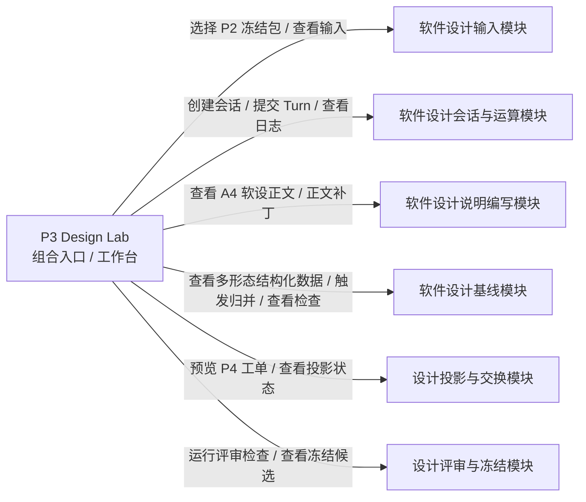
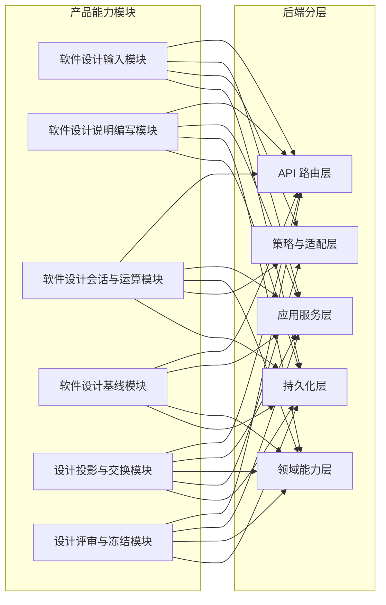
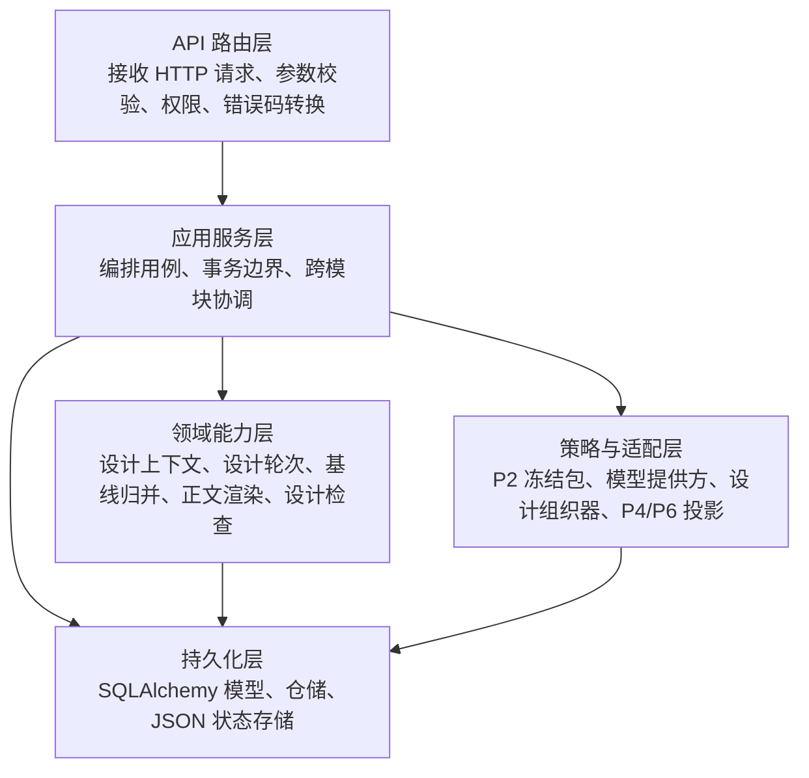
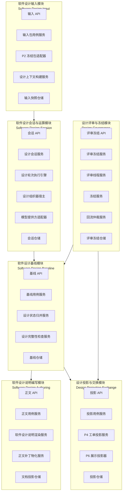
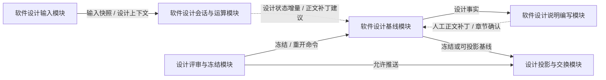
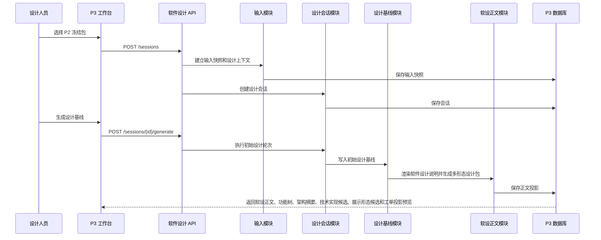
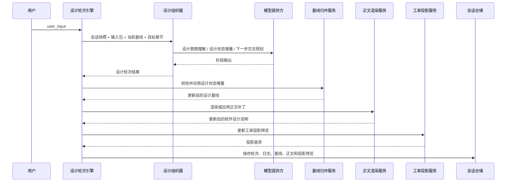
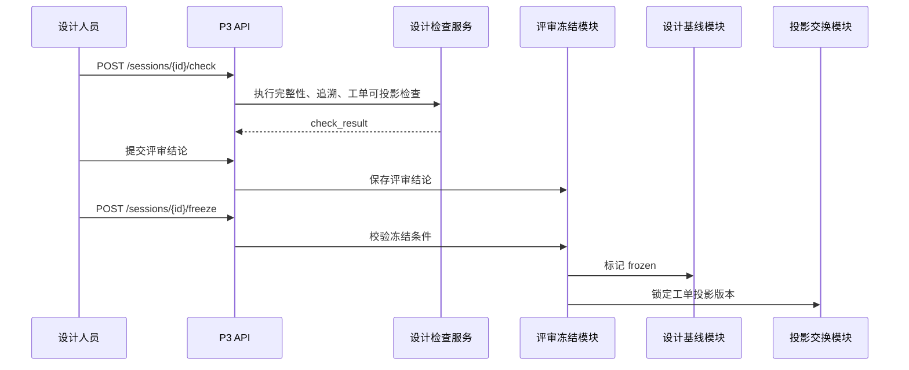

# P3 软件设计系统软件设计说明

> 本文件是 `CodeFactoryV2` 中 `P3 软件设计系统` 的主软件设计说明文档。本文描述本阶段认可的目标态系统设计：系统边界、前端形态、后端架构、模块职责、对象模型、接口、运行流程、设计组织器和验收口径。
>
> 本文是 `P3 软件设计系统` 的目标态设计事实源。历史补充稿只作为设计来源和评审依据，不在本文中承担实现审查、迁移计划或技术债记录职责；本轮重构依据见 `P3-软件设计系统设计-260510-1453-目标态文档重构补充.md`。
>
> `P3-软件设计系统设计-260512-1745-Lab风格工作台重构补充.md` 是新版 `P3 Design Lab` 界面重构口径，明确新版页面以 `/p2-requirement-analysis-lab` 为主要参考对象。
>
> `P3-软件设计系统设计-260513-0046-DesignLab原型转主设计补充案.md` 已归入本文，用于把 v6 原型确认的需规列表、关联软设、软设工作区、`P4` 工单投影树和回合列表补入主设计。
>
> `P3-软件设计系统设计-260516-0214-软设对象多形态设计补充案.md` 已归入本文，用于把软件设计包、功能树、分层架构、真实技术实现、展示形态和 `P4` 投影派生关系补入主设计。
>
> 2026-05-16 原型 v12 与 Canvas PoC v13 已归入本文，用于把 `需规转软设`、`软设工作区`、`P4` 投影合并为统一软设工作区，并明确该工作区采用解耦模块 + 共性 Canvas 视口平台的目标态设计。
>
> `P3-软件设计系统设计-260519-功能树交互对象深化补充案.md` 已归入本文，用于把 `功能树` 从静态示意图升级为可展开、可选择、可拖拽试排并与右侧 `Inspector` 联动的交互对象。功能树主体只承载核心层级结构，统计、追溯状态、待确认、派生来源、过滤和副编辑动作统一进入 `Inspector`。
>
> 2026-05-19 Inspector v15 原型已归入本文，用于明确 `SelectedObjectInspector` 采用“能力 / 共性信息”双页签：能力页承载当前对象的可执行工作，共性信息页显式承载基类字段和分型扩展字段。
>
> 2026-05-20 软设文档目录索引方案已归入本文，用于明确 `软设文档` 形态节点内部必须提供可折叠、可调宽的章节目录索引，`需规文档` 因内容较短默认不提供目录索引。
>
> 2026-05-21 段落级 AI 沟通会话策略已归入本文，用于明确软设章节 / 段落沟通是 `SoftwareDesignSession` 下带 `scope_anchor` 的局部 Turn，不创建段落私有权威会话；AI 输出必须先成为结构化补丁提案，再由用户确认应用。

**日期：** 2026-05-10

**最近更新：** 2026-05-21，归入段落级 AI 沟通会话策略，明确软设章节 / 段落沟通驻留在后台 `SoftwareDesignSession`，前端只提交作用域锚点和用户意图，后台负责上下文组装、摘要压缩、模型调用审计和补丁提案生成。

**对应节点：**

- `P3` 软件设计系统
- `P3.1` 设计依据与模板中心
- `P3.2` 需求规格说明冻结包接入与设计上下文建立
- `P3.3` 软件设计说明生成、修订与校核
- `P3.4` 结构化软件设计基线维护与冻结
- `P3.5` 模块级工具化描述与 `P4` 工单投影
- `P3.6` 评审、冻结、交接与回流仲裁

**关联正式文档：**

- `DOC/CODEX_DOC/02_设计说明/P2_需求分析系统/P2-需求分析系统设计.md`
- `DOC/CODEX_DOC/02_设计说明/P3_软件设计系统/P3-软件设计系统设计-260512-1745-Lab风格工作台重构补充.md`
- `DOC/CODEX_DOC/02_设计说明/P3_软件设计系统/P3-软件设计系统设计-260513-0046-DesignLab原型转主设计补充案.md`
- `DOC/CODEX_DOC/02_设计说明/P4_工具仓库/P4-工具仓库设计.md`
- `DOC/CODEX_DOC/02_设计说明/P5_软件构建系统/P5-软件构建系统设计.md`
- `DOC/CODEX_DOC/02_设计说明/00_总纲/03-P1-P6数据互联互通与平台交换层设计.md`

## 1. 文档目的与设计口径

### 1.1 文档目的

本文用于回答以下设计问题：

1. `P3` 是什么系统，边界在哪里。
2. 软件设计人员正面工作的对象是什么。
3. `P2` 冻结需求规格说明如何成为 `P3` 正式输入。
4. 前端有哪些页面、区块、状态和文档视图。
5. 后端按什么层次组织，核心模块分别承担什么职责。
6. `SoftwareDesignBaseline v2` 如何成为软件设计事实源。
7. 软件设计说明正文、设计基线、评审冻结和 `P4` 工单投影如何保持同源。
8. API 如何承载设计会话、设计轮次、校核、冻结和交接。
9. 一份需求规格说明如何转化为可冻结的软件设计说明和可交给 `P4` 的模块工单投影。

### 1.2 设计口径

本文采用目标态软件设计说明口径：

- 描述“系统应该如何设计”，不混入“现有代码哪里不足”。
- 描述“模块职责、状态对象和接口”，不把实施步骤写成系统设计。
- 描述“本阶段可实现的理想形态”，不要求一次性覆盖未来所有软件设计自动化能力。
- 设计内容在本文内自包含，读者不需要依赖旧 `P3` 工作层文档才能理解主架构。

### 1.3 术语使用规则

本文面向软件设计评审，优先使用中文概念名。英文名只在第一次出现时作为实现命名对照，或在代码路径、接口字段、类名、枚举值、文件名中使用。

例如：

- 软件设计会话（`SoftwareDesignSession`）。
- 软件设计轮次（`SoftwareDesignTurn`）。
- 软件设计基线（`SoftwareDesignBaseline v2`）。
- 软件设计说明（`SoftwareDesignDescription`）。
- 模块工单投影（`ModuleWorkorderProjection`）。
- 设计组织器（`Software Design Orchestrator`）。
- 软件设计包（`SoftwareDesignPackage`）。

后续正文若讨论设计概念，应使用中文名；若讨论实现对象、字段或文件，应保留英文名。

### 1.4 系统主路径

`P3` 的主路径是：

```text
读取 P2 冻结需求规格说明包
  -> 创建设计会话并建立设计上下文
    -> 系统维护结构化软件设计状态
      -> 生成并修补软件设计说明 A4 正文
        -> 设计完整性检查与人工校核
          -> 冻结 SoftwareDesignBaseline v2
            -> 输出软件设计说明 + P4 模块工单投影
```

`P3 Design Lab` 是这条主路径的原理验证入口和组合工作台。它不新增独立业务事实源，不替代六个业务模块，不拥有设计基线、冻结权或正式工单推送权。旧 `/xx-p3` 订单、审批、评审和推送能力保留为历史流程面和治理侧线，但不再作为新版 `P3` 的主架构起点。

主路径在前端落地时采用“产物中心的 Lab 工作台”形态：顶部展示阶段身份和运行状态，左侧 Lab 导航只保留需规输入、软设工作区、当前 Turn、检查评审和运行日志。`需规转软设`、软件设计说明细化和 `P4` 投影不再拆成三个并列一级 Tab，而是统一进入软设工作区内部的形态链。软件设计说明仍是默认主产物，并以 A4 文档投影嵌入软设工作区；功能树、分层架构、真实技术实现、展示形态和 `P4` 投影作为同一 `SoftwareDesignPackage` 的连续形态呈现，不作为独立于软设的页面事实源。

## 2. 系统定位

### 2.1 一句话定位

`P3 软件设计系统` 是面向软件架构师、设计人员和评审人员的软件设计说明编写与设计基线冻结系统。它把 `P2` 冻结需求规格说明包、设计策略、自然语言补充和人工校核收敛为可冻结、可追溯、可交给 `P4` 的软件设计说明、结构化软件设计基线和模块工单投影。

### 2.2 正面工作对象

设计人员正面工作的对象是：

```text
软件设计说明文档
```

不是：

- 旧 `P3Order` 订单。
- 审批表单。
- 裸模块工单列表。
- 模型聊天记录。
- 结构化设计基线 JSON。
- `P4` 工具资产清单。

结构化软件设计基线仍然存在，但它是后台事实状态和下游消费源，用于支撑：

- 软件设计说明正文生成。
- 模块划分和接口设计一致性校核。
- 需求条款到设计章节的追溯。
- 人工评审和冻结。
- `P4` 工单投影。
- `P5` 可行性反馈仲裁。
- `P6` 只读展示投影。

### 2.3 用户角色

| 角色 | 主要目标 | 使用入口 |
| --- | --- | --- |
| 软件架构师 / 设计人员 | 从需求规格说明形成软件设计说明、模块划分、接口和约束 | 软件设计说明工作台、`P3 Design Lab` |
| 设计评审人员 | 审阅设计正文、追溯来源、提出批注并确认冻结 | 设计评审与冻结工作台 |
| `P4` 工具供给人员 / 下游系统 | 获取模块级工具化描述和工单投影 | `P3 -> P4` 交接接口 |
| 平台管理员 / 开发者 | 配置设计模板、设计组织器、模型提供方、检查规则和下游投影策略 | 设计依据与配置管理台 |
| `P6` 观察层 | 读取 `P3` 阶段只读状态、指标和流向 | `P6` 展示投影接口 |

## 3. 业务目标与边界

### 3.1 本阶段负责

本阶段 `P3` 负责：

- 只接入 `P2` 新版需求规格编写系统冻结包。
- 展示冻结需求规格说明正文，并保留结构化规格、批注、来源追溯和缺口检查结果。
- 创建设计会话，维护设计策略、设计轮次、设计状态和模型调用审计。
- 生成软件设计说明正文，并以接近 A4 文档形态供人工审阅。
- 维护 `SoftwareDesignBaseline v2`，承载架构、模块、接口、数据、状态、部署、约束和追溯。
- 支持自然语言配置、局部修订、重新生成、补充状态机、补充接口等设计轮次。
- 执行设计完整性检查、需求覆盖检查和下游工单可投影检查。
- 支持人工评审、冻结预览和冻结。
- 从同一设计基线投影出面向 `P4` 的模块工单包。
- 向 `P6` 输出软件设计系统的只读观察态。

### 3.2 本阶段不负责

本阶段 `P3` 不负责：

- 编写或修改 `P2` 需求规格说明。
- 消费旧 `/requirements/specs` 规格池。
- 兼容旧 `XX-P2-Sim` 作为新版输入来源。
- 维护 `P4` 工具资产、工具运行队列或真实工具执行。
- 执行 `P5` 软件构建、装配、导出和发布。
- 替代人工架构评审。
- 在没有冻结基线的情况下直接向 `P4` 下发正式供给任务。

### 3.3 上下游边界

```text
P2 冻结需求规格说明包
  -> P3 软件设计系统
    -> 软件设计说明 + SoftwareDesignBaseline v2 + P4 模块工单投影
      -> P4 工具仓库 / P5 软件构建系统
```

`P3` 只能消费 `P2` 冻结态产物，不读取 `P2` 草稿态、会话探索状态或未确认批注作为正式设计输入。

`P4` 只消费 `P3` 冻结或明确标记为可投影的模块工单包，不直接读取 `P2` 需求规格说明推断工具需求。

`P5` 对设计可行性的反馈必须进入 `P3` 仲裁流程，不能直接命令 `P4` 修订旧工具，也不能绕过 `P3` 改写设计基线。

### 3.4 软件设计原则

#### 3.4.1 设计说明优先于流程单

`P3` 坚持“设计说明优先于流程单”。旧订单、审批和工单流程用于治理设计结果，但不应替代设计本身。软件设计的最小可解释单元是：

```text
需求条款 + 设计决策 + 模块 / 接口 / 状态 / 数据对象 + 追溯关系
```

#### 3.4.2 基线优先于正文碎片

软件设计说明正文必须从 `SoftwareDesignBaseline v2` 投影生成或修订。正文可人工编辑，但关键设计事实必须回写或映射到设计基线。禁止只有正文、没有结构化设计状态的冻结结果。

#### 3.4.3 投影同源

软件设计说明、功能树、分层架构、真实技术实现、展示形态、`P4` 工单投影和 `P6` 展示投影必须来自同一个软件设计包。不同投影可以有不同展示形态，但不能各自维护互相矛盾的事实。

#### 3.4.4 完成条件

一份设计草稿满足以下条件，才可以进入冻结准备态：

- 输入包来自 `P2` 新版冻结包，且 `p3_consumable=true`。
- 软件设计说明正文已覆盖必填章节。
- 设计基线已包含架构模式、模块划分、接口或数据关系、状态约束和部署 / 运行约束。
- 每个关键模块至少能追溯到一个需求条款或结构化需求节点。
- 阻断型设计完整性检查通过。
- `P4` 工单投影可以生成，且不会缺失模块目标、输入输出、约束和验收要点。
- 人工评审结论允许冻结。

## 4. 总体架构

### 4.1 总体分层


### 4.2 产品能力模块

| 模块 | 中文名 | 主要使用者 | 设计目标 |
| --- | --- | --- | --- |
| `Software Design Input` | 软件设计输入模块 | 设计人员、系统 | 接入 `P2` 冻结包，建立设计上下文和追溯基线 |
| `Software Design Authoring` | 软件设计说明编写模块 | 软件架构师、设计人员 | 生成、修订、校核和审阅软件设计说明正文 |
| `Software Design Session` | 软件设计会话与运算模块 | 设计人员、开发者 | 承载设计轮次、设计组织器、模型调用和过程审计 |
| `Software Design Baseline` | 软件设计基线模块 | 设计人员、评审人员、下游系统 | 维护结构化设计事实、检查、冻结和版本 |
| `Design Projection Exchange` | 设计投影与交换模块 | `P4`、`P5`、`P6` | 输出工单投影、展示投影和回流仲裁输入 |
| `Design Governance` | 设计评审与冻结模块 | 评审人员、负责人 | 管理批注、评审结论、冻结和重开仲裁 |

### 4.3 `P3 Design Lab` 与产品能力模块的解耦关系

`P3 Design Lab` 不是第七个业务模块，也不是六个模块之外的新事实源。它是一个阶段工作台入口，通过前端编排层和 API 适配层把六个模块的能力组合到同一个用户工作面。



解耦映射如下：

| `P3 Design Lab` 区域 / 动作 | 所属业务模块 | 只读输入 | 写入命令 | 禁止事项 |
| --- | --- | --- | --- | --- |
| 需规输入视图 | 软件设计输入模块 | `P2` 冻结包、输入快照、来源追溯、关联软设摘要 | 选择输入包、建立输入快照、查询关联软设 | 不兼容旧规格池，不直接写设计基线 |
| 软设工作区外壳 | 前端编排层 / 共性工作台层 | 当前 `SoftwareDesignPackage` 摘要、当前窗口、选中对象 | 切换窗口、切换选中对象、提交模块命令 | 不保存业务事实，不绕过模块命令 |
| 软设工作区：需规到软设首段 | 软件设计输入模块、软件设计会话与运算模块 | 输入快照、当前会话、生成策略 | 新建软设、执行初始设计 Turn | 不直接生成冻结正文，不跳过会话记录 |
| 软设工作区：A4 文档形态 | 软件设计说明编写模块 | 软件设计说明投影、章节状态、检查标记 | 正文补丁、章节确认 | 不把正文当作唯一事实源 |
| 软设工作区：功能树 / 分层架构 / 技术实现 / 展示形态 | 软件设计基线模块 | `SoftwareDesignPackage`、`SoftwareDesignBaseline v2` | 基线增量归并、局部确认、对象拆分 | 不读取或修改 `P4` 工具资产 |
| 软设工作区：`P4` 投影末段 | 设计投影与交换模块 | 冻结或可投影设计基线、技术实现形态、展示形态 | 生成投影候选、提交推送命令 | 不创造新的设计事实，不作为独立一级事实源 |
| 当前 Turn / CLI | 软件设计会话与运算模块 | 当前会话、输入上下文、当前基线摘要 | 提交设计轮次、保存模型调用日志 | 不直接冻结，不直接推送 `P4` |
| 检查评审视图 | 设计评审与冻结模块 | 检查结果、评审线程、冻结候选 | 提交评审、冻结或重开命令 | 不生成设计内容 |
| 运行日志视图 | 软件设计会话与运算模块 | API、Provider、检查器和状态迁移记录 | 记录审计事件 | 不作为正式设计结论 |

因此，`Design Lab` 的代码实现也必须保持分层：

- 页面组件只负责加载、导航选中、命令触发和错误展示。
- Adapter 只负责 DTO 到 ViewModel 的映射，不调用 API、不写业务规则。
- 共性 Lab 组件只消费 ViewModel，不引用 `P3` DTO。
- 六个业务模块分别维护自己的权威状态和命令边界。

统一软设工作区的“统一”只发生在用户体验和视口编排层，不发生在业务模块层。该工作区必须按下列方式解耦：

- `CanvasWorkspacePlatform` 或等价共性视口平台只负责画布视口、缩放、平移、命中检测、选中态和基础图元渲染。
- `MorphWindowController` 只负责形态链窗口定位、相邻形态切换和当前窗口状态，不负责生成或修改设计事实。
- `DesignDocumentRenderer` 只负责 A4 正文投影的展示与正文编辑补丁入口。
- `FunctionalTreeRenderer`、`LayeredArchitectureRenderer`、`TechnicalImplementationRenderer`、`PresentationShapeRenderer` 和 `P4ProjectionRenderer` 分别负责各自形态的渲染与交互，不互相读取内部状态。
- `SelectedObjectInspector` 只读取当前选中对象 ViewModel，并把操作转发为所属模块命令。
- 各形态之间通过 `SoftwareDesignPackage`、追溯关系和显式命令通信，不通过 DOM、Canvas 图元或前端临时状态互相推断。

### 4.4 产品能力与后端层次关系



每个产品能力模块都不是单一代码层。它们通过 API、应用服务、领域能力、适配器和持久化共同实现。后端第 6 章按软件模块展开这些关系。

## 5. 前端软件设计

### 5.1 模块定位、职责与核心概念

前端软件是 `P3` 的设计工作界面和用户操作编排层。它不拥有需求冻结包、设计模板、设计组织器、模型提供方、检查规则、冻结规则和投影策略等业务默认值；这些对象的权威来源是后端业务模块和配置接口。前端负责把后端下发的输入包、设计会话、设计基线、正文投影、检查结果和工单投影转换为可审阅、可修订、可冻结的工作界面。

#### 5.1.1 技术栈

前端技术栈为：

- React 18
- TypeScript
- Vite
- Ant Design
- Axios API 适配层
- React Router
- Vitest / Testing Library

#### 5.1.2 核心概念定义

| 序号 | 概念 | 实现命名 | 类型 | 定义 |
| --- | --- | --- | --- | --- |
| 1 | 前端运行模块 | `P3 Web Runtime` | 前端模块 | 承载 `P3` 路由、页面编排、配置加载、视图模型转换和领域组件展示的前端运行整体。 |
| 2 | 页面路由对象 | `Route Entry` | 路由入口 | 把 URL 映射到 `P3 Design Lab`、设计说明工作台、评审冻结工作台和旧流程面。 |
| 3 | 页面编排对象 | `Page Orchestrator` | React 页面 / Hook | 管理加载、选中、生成、提交、检查、冻结、错误和弹窗开关，调用 API 适配层。 |
| 4 | 设计文档视图 | `Design Document View` | 前端视图模型 | 把软件设计说明正文渲染为接近 A4 的文档画布，并承载章节、批注和检查标记。 |
| 5 | 软设形态结构化数据 | `Software Design Morph Data View` | 前端派生对象 | 在软设工作区形态链内展示架构、模块、接口、数据、状态、部署和追溯等结构化设计事实。 |
| 6 | 设计轮次视图 | `Design Turn View` | 前端派生对象 | 展示用户输入、设计意图、设计增量、正文补丁、模型调用日志和下一步建议。 |
| 7 | API 适配对象 | `API Adapter` | 前端服务函数 | 封装 HTTP 请求、响应类型和错误边界，不管理页面状态。 |
| 8 | 页面临时状态 | `Local UI State` | React state | 当前选中输入包、当前 Tab、输入框内容、滚动位置、弹窗开关等只影响界面交互的状态。 |
| 9 | 业务权威状态 | `Authoritative Business State` | 后端状态 | 输入包、设计会话、设计轮次、设计基线、检查结果、冻结状态和工单投影等由后端维护的状态。 |
| 10 | 阶段 Lab 工作台 | `StageLabShell` | 前端共性容器组件 | 承载阶段身份区、左侧 Lab 导航和右侧任务工作区，参考 `/p2-requirement-analysis-lab` 的产品形态。 |
| 11 | 阶段 Lab 工作台视图模型 | `StageLabWorkbenchViewModel` | 前端 ViewModel | 把阶段身份、左侧导航、右侧任务工作区、输入事实、交互、标准文档、质量门禁、投影、运行日志和动作统一为 Lab 外壳输入。 |
| 12 | 标准文档视图模型 | `StandardDocumentViewModel` | 前端 ViewModel | 统一表达需求规格说明和软件设计说明的 A4 文档纸面、章节、正文块、批注和追溯。 |
| 13 | 主产物表面 | `DocumentProductSurface` | 前端共性组件 | 通过正文、目录、检查、追溯、投影、冻结等 Tab 承载阶段标准文档主产物。 |
| 14 | 工作台适配器 | `Workbench Adapter` | 前端纯函数 / 适配模块 | 把 `P3` 后端 DTO 转换为共性工作台 ViewModel，不访问 DOM，不调用 API。 |
| 15 | 软设形态画布平台 | `DesignMorphCanvasPlatform` | 前端共性渲染平台 | 承载软设形态链的 Canvas 视口、缩放、平移、命中检测和图元绘制，不拥有业务事实。 |
| 16 | 软设形态渲染器 | `MorphStageRenderer` | 前端渲染模块接口 | 为文档、功能树、分层架构、技术实现、展示形态和 `P4` 投影提供独立渲染与交互适配。 |
| 17 | 软设形态链适配器 | `p3DesignMorphAdapter` | 前端纯函数 / 适配模块 | 把 `StageDocumentWorkbenchViewModel` 映射为 `DesignMorphStageViewModel[]` 和 `DesignMorphWindowViewModel[]`，使页面不再硬编码七段形态链。 |
| 18 | Canvas 渲染注册表 | `designMorphRenderers` | 前端共性渲染注册表 | 按 `layoutKind` 分发 `paper`、`tree`、`architecture`、`table`、`cards` 等 Canvas 基础形态渲染，不读取 `P3` 业务 DTO。 |

#### 5.1.3 前端配置权威原则

| 配置类别 | 权威来源 | 前端责任 |
| --- | --- | --- |
| 输入包列表和可消费条件 | 后端 `P2` 冻结包适配器 | 展示可选输入，不自行兼容旧规格池 |
| 设计模板和章节结构 | 后端设计模板服务 | 按返回结构渲染章节，不硬编码最终模板 |
| 设计生成策略 | 后端配置或设计会话 | 展示和提交策略，不自行决定默认架构 |
| 检查规则 | 后端设计完整性检查服务 | 展示阻断 / 警告 / 通过，不自行判断冻结资格 |
| 冻结和重开规则 | 后端评审冻结模块 | 提交命令并展示状态，不在前端绕过冻结 |
| `P4` 工单投影 | 后端投影服务 | 展示预览和推送状态，不自行拼装正式包 |

### 5.2 前端分层与装载生命周期

#### 5.2.1 分层结构

```text
Route Entry
  -> Page Orchestrator
    -> API Adapter
    -> View Model Builder
      -> Workbench Adapter
        -> StageLabShell
          -> StageLabNavigation
          -> P3 Lab Task Views
          -> Document Product Panels
```

页面组件不直接拼接后端 DTO 字段作为业务判断。复杂转换放入视图模型构造函数或 Hook；领域组件只接收已整理的展示输入。

#### 5.2.2 阶段 Lab 工作台类群设计

`P3` 前端目标态采用阶段 Lab 工作台类群，而不是为 `P3 Design Lab` 单独维护一套静态三栏页面结构。新版工作台主要参考 `/p2-requirement-analysis-lab` 的产品形态：顶部阶段身份区、左侧 Lab 导航、右侧任务工作区。类群分为七类：

| 类群 | 代表命名 | 职责 |
| --- | --- | --- |
| ViewModel 类群 | `StageLabWorkbenchViewModel`、`StageDocumentWorkbenchViewModel`、`StandardDocumentViewModel`、`StageQualityGateViewModel` | 定义 Lab 工作台、兼容文档工作台和标准文档主产物需要的数据结构。 |
| Adapter 类群 | `p3DesignLabWorkbenchAdapter`、后续 `p2RequirementAuthoringWorkbenchAdapter` | 把阶段业务 DTO 转换为共性 ViewModel，隔离业务字段和 UI 组件。 |
| Lab Shell 容器组件 | `StageLabShell`、`StageLabNavigation` | 承载阶段身份、左侧导航、状态指标和右侧任务工作区。 |
| Document Product 组件 | `DocumentProductSurface`、`A4DocumentSurface`、`DocumentOutlinePanel`、`QualityCheckPanel` | 承载正文、目录、检查、追溯、投影和冻结等主产物视图。 |
| P3 Lab 视图组件 | `P3InputPackageView`、`P3SoftwareDesignWorkspaceView`、`P3CurrentTurnView`、`P3QualityReviewView`、`P3RuntimeLogView` | 按 Lab 导航项承载输入、统一软设工作区、过程、检查和日志。`P4` 投影不再是一级 Lab 视图组件。 |
| 软设工作区形态组件 | `MorphWindowTrack`、`MorphPairViewport`、`DesignDocumentStageRenderer`、`FunctionalTreeStageRenderer`、`LayeredArchitectureStageRenderer`、`TechnicalImplementationStageRenderer`、`PresentationShapeStageRenderer`、`P4ProjectionStageRenderer`、`SelectedObjectInspector` | 在统一软设工作区内部解耦承载各形态，不互相越权访问状态。 |
| Canvas 视口平台组件 | `DesignMorphCanvasPlatform`、`CanvasViewportController`、`CanvasTextLayoutEngine`、`CanvasHitTestIndex`、`CanvasRenderScheduler` | 只处理画布视口、文本布局、命中检测、绘制调度和性能，不包含 `P3` 业务规则。 |
| Stage Page 编排层 | `P3DesignLabPage`、目标态 `P3DesignWorkspacePage` | 负责加载、错误、命令提交和调用 adapter，不直接承载复杂展示映射。 |
| API 协议映射层 | `softwareDesignV2.ts` 与 API DTO 类型 | 封装后端接口，向 adapter 提供稳定 DTO 输入。 |

类群边界规则：

- 共性组件只接受 ViewModel，不接受 `P3DesignLabSession`、`P3DesignInputPackage` 等业务 DTO。
- Adapter 只做数据转换，不调用 API、不访问 DOM、不写 CSS。
- 页面编排层只负责副作用、导航选中和命令提交，不负责正文、检查、投影的细粒度渲染。
- 后端不直接返回前端 ViewModel；ViewModel 是前端适配层产物。

页面编排层只调用软设形态链 Adapter 装配软设工作区，不在页面内拼接 `需规文档 -> 软设文档 -> 功能树 -> 分层架构 -> 技术实现 -> 展示形态 -> P4 投影` 的业务链。`p3DesignMorphAdapter` 是该形态链的前端适配入口，负责把工作台 ViewModel 中的输入事实、软件设计说明、设计基线摘要和投影树摘要转换为形态节点与窗口。

`DesignMorphCanvasPlatform` 只消费形态节点、窗口、当前窗口 ID 和窗口变更事件。它不得读取 `P3DesignLabSession`、`SoftwareDesignPackage`、`P3DesignLabInputPackage` 等业务 DTO，也不得自行推导 P3 的七段业务形态。Canvas 内部渲染通过渲染注册表按 `layoutKind` 分发；注册表只表达 `paper / tree / architecture / table / cards` 等基础展示类型，具体业务形态由独立 Renderer 和 Adapter 共同定义。

#### 5.2.3 `P2 Lab` 到 `P3 Lab` 的继承映射

`P3 Design Lab` 继承 `/p2-requirement-analysis-lab` 的产品骨架，不复制 `P2` 的业务对象。两者共用的是阶段工作台结构、状态可观测方式和主产物组织方法；差异由 Adapter 和阶段视图组件承担。

| `P2 Lab` 形态 | `P3 Lab` 落点 | 继承内容 | 阶段差异 |
| --- | --- | --- | --- |
| 顶部阶段身份区 | `P3 Software Design Lab` 顶部区 | 阶段名称、副标题、状态标签、主动作紧凑展示 | 状态标签改为输入包、设计会话、设计基线、检查评审、`P4` 投影 |
| 左侧导航 | `StageLabNavigation` | 用导航分解复杂工作，不把全部对象堆在一个页面 | 导航项改为需规输入、软设工作区、当前 Turn、检查评审、运行日志；`P4` 投影进入软设工作区形态链末端 |
| 任务工作区 | `StageLabShell` 右侧工作区 | 根据导航切换任务视图，保持工具台密度 | 默认进入需规输入；打开或新建软设后聚焦软设工作区 |
| 当前交互 / Turn | `P3CurrentTurnView` | CLI、解释结果、影响范围、下一步建议聚合展示 | 输入是设计配置和修订意图，不是需求采集问答 |
| 主产物区 | `P3SoftwareDesignWorkspaceView` + `DocumentProductSurface` | 主产物可用正文、目录、追溯、版本等 Tab 组织 | 主产物是软件设计说明，需保留 A4 文档纸面 |
| 过程日志 | `P3RuntimeLogView` | 保留 API、生成器、状态迁移可观测性 | 重点记录设计生成、检查、投影和模型调用 |
| 质量状态 | `P3QualityReviewView` | 用检查结果解释能否进入下一阶段 | 重点是冻结门禁和 `P4` 投影就绪性 |

该映射保证 `P3` 不重新造页面结构。`P2` 回迁同一共性工作台类群时，仍必须通过 `P2` 自己的 Adapter 隔离业务 DTO。

#### 5.2.4 装载生命周期

`P3` 页面装载遵循以下生命周期：

1. 读取页面配置、设计模板和可用输入包。
2. 恢复上次选中的设计会话，或等待用户选择 `P2` 冻结包。
3. 创建或打开设计会话。
4. 读取软件设计说明正文投影、设计基线、设计轮次、检查结果和工单投影。
5. 用户发起生成、修订、检查、冻结或投影动作。
6. 页面重新读取权威状态并重建视图模型。

前端不得在请求失败时伪造已生成设计结果。失败状态必须显式展示。

### 5.3 状态机设计

#### 5.3.1 状态机分层

前端至少区分三类状态机：

| 状态机 | 作用 |
| --- | --- |
| 页面装载状态机 | 表达配置、输入包、会话和正文是否成功加载 |
| 设计交互状态机 | 表达当前能否生成、提交设计轮次、运行检查、冻结或投影 |
| 错误与不可用状态机 | 表达输入包缺失、会话失败、模型失败、检查阻断或冻结失败 |

#### 5.3.2 页面装载状态机

| 状态 | 含义 | 可操作动作 |
| --- | --- | --- |
| `initializing` | 页面刚进入，尚未读取配置 | 无 |
| `loading_inputs` | 正在读取 `P2` 冻结输入包 | 无 |
| `empty_inputs` | 没有可消费输入包 | 刷新、返回 `P2` |
| `ready_to_create` | 已选择输入包，可创建设计会话 | 创建设计会话 |
| `session_loaded` | 设计会话和投影已加载 | 生成、修订、检查 |
| `load_failed` | 配置、输入或会话读取失败 | 重试 |

#### 5.3.3 设计交互状态机

| 状态 | 含义 | 可操作动作 |
| --- | --- | --- |
| `created` | 会话创建，尚未生成基线 | 生成设计基线 |
| `generating` | 正在执行初次生成或重生成 | 等待 |
| `baseline_ready` | 设计基线和正文可审阅 | 设计轮次、检查、工单预览 |
| `checking` | 正在执行完整性检查 | 等待 |
| `ready_to_freeze` | 阻断问题已通过，可发起冻结 | 提交评审、冻结 |
| `frozen` | 设计基线已冻结 | 查看、投影、推送 |
| `projection_ready` | `P4` 工单投影已生成 | 推送 `P4` |
| `failed` | 设计生成或检查失败 | 重试、查看日志 |

#### 5.3.4 错误与不可用状态机

| 错误类型 | 前端展示 | 后续动作 |
| --- | --- | --- |
| 无可消费冻结包 | 显示空态和 `P2` 回流提示 | 返回 `P2` 生成冻结包 |
| 输入包不合格 | 显示 `p3_consumable` 和缺失字段诊断 | 要求重新冻结 |
| 模型 / 组织器失败 | 显示调用失败、阶段、错误原因 | 重试或切换策略 |
| 检查阻断 | 显示阻断项、目标章节和建议动作 | 局部修订或继续设计轮次 |
| 冻结失败 | 显示冻结条件不满足 | 运行检查或补齐缺口 |

### 5.4 页面执行设计

#### 5.4.1 路由结构

| 路由 | 页面 | 定位 |
| --- | --- | --- |
| `/p3-design-lab` | `P3 Design Lab` | 新版需规到软设原理验证入口 |
| `/p3-design` | 软件设计说明工作台 | 正式设计工作台 |
| `/p3-design/reviews` | 设计评审与冻结工作台 | 评审、冻结和回流仲裁 |
| `/p3-design/config` | 设计依据与配置管理台 | 模板、组织器、模型和检查规则配置 |
| `/xx-p3` | 旧 `P3` 流程面 | 历史订单、审批和演示入口 |

本阶段优先落地 `/p3-design-lab` 和历史流程面 `/xx-p3`；正式工作台、评审台和配置台按上表保持目标路由边界。

#### 5.4.2 页面区块与后端模块映射

| 页面区块 | 后端模块 | 读取输入 | 写入输出 |
| --- | --- | --- | --- |
| 需求规格说明输入区 | 软件设计输入模块 | `P2` 冻结包、标准正文、结构化规格、批注 | 设计会话输入快照 |
| 自然语言配置 / CLI | 软件设计会话与运算模块 | 设计会话、当前基线、可用策略 | 设计轮次、策略补充、设计补丁 |
| 软件设计说明 A4 正文区 | 软件设计说明编写模块 | 设计文档投影、章节检查结果 | 正文编辑补丁、章节确认 |
| 设计基线摘要区 | 软件设计基线模块 | `SoftwareDesignBaseline v2` | 局部确认、冻结候选 |
| `P4` 工单预览区 | 设计投影与交换模块 | 设计基线、模块划分、约束 | 工单投影、推送命令 |
| 评审冻结区 | 设计评审与冻结模块 | 检查结果、评审线程、冻结候选 | 评审结论、冻结状态 |

#### 5.4.3 页面命令提交规则

- 创建会话必须带输入包标识和生成策略。
- 生成设计基线必须通过后端命令执行，前端不本地生成正式设计。
- 自然语言输入必须形成设计轮次，不直接修改设计基线。
- 检查、冻结和投影必须分别调用后端命令，不允许前端组合状态假装完成。
- 冻结后的正文和设计基线默认只读；若需要重开，必须进入回流仲裁。

### 5.5 `P3 Design Lab` 设计

#### 5.5.1 页面职责

`P3 Design Lab` 用于验证新版 `P3` 的核心链路：

```text
P2 新版冻结包 -> 软件设计说明 -> SoftwareDesignBaseline v2 -> P4 工单投影
```

它不替代正式评审冻结工作台，但必须按目标对象和 API 设计，避免形成无法迁移的实验页面。

早期原理验证稿中曾定义的“左上需规、左下 CLI、右侧软设正文”是早期验证布局。该布局用于解释 `P2` 冻结包、自然语言配置和软件设计说明之间的最小关系；在本文目标设计中，它已经被解耦为 Lab 导航下的多个独立视图，不再作为页面目标结构。

Design Lab 的长期职责限定为：

- 暴露 `P2` 冻结包到 `P3` 设计会话的入口。
- 将软件设计说明、设计基线、检查评审和 `P4` 投影放到同一个工作台观察面。
- 承载自然语言配置和设计轮次入口。
- 展示 API、模型调用、检查器和状态迁移日志。
- 验证六个业务模块之间的协作是否闭环。

Design Lab 不承担以下职责：

- 不保存权威业务状态。
- 不维护独立于 `SoftwareDesignBaseline v2` 的设计事实。
- 不绕过评审冻结模块做冻结判定。
- 不绕过投影交换模块拼装正式 `P4` 工单。
- 不在页面层兼容旧规格池或旧 `P3Order` 主流程。
- 不把原型截图、静态样例文案或页面装饰状态升级为业务事实源。

v6 至 v13 原型确认后的归并原则是：`Design Lab` 不是第七个业务模块，也不是新的持久化域。它只通过前端编排、Adapter、ViewModel 和共性 Canvas 视口平台把软件设计输入模块、软件设计说明编写模块、软件设计会话与运算模块、软件设计基线模块、设计投影与交换模块、设计评审与冻结模块组合在同一工作面。页面可以呈现一体化软设工作区，但权威事实、命令边界和渲染模块仍必须拆分归属。

#### 5.5.2 页面结构

页面采用 `P2 Lab` 风格的三层结构：

1. 顶部阶段身份区：展示 `P3 Software Design Lab`、输入包状态、设计会话状态、设计基线状态、检查评审状态、`P4` 投影状态和主动作。
2. 左侧 Lab 导航：覆盖需规输入、软设工作区、当前 Turn、检查评审和运行日志。
3. 右侧任务工作区：根据左侧导航切换视图，页面首次进入时默认打开需规输入视图；用户新建或打开软件设计说明后自动切入软设工作区。

默认软设工作区仍以软件设计说明为主产物，但不再只是一张 A4 文档页面。`需规转软设`、A4 文档、功能树、分层架构、真实技术实现、展示形态和 `P4` 投影共同构成同一 `SoftwareDesignPackage` 的形态链。它们在用户体验上是一体化软设工作区，在实现上必须按输入、会话、正文、基线、投影、评审等模块边界解耦。CLI 不再挤在左下角，而是进入“当前 Turn”视图，展示回合列表、用户输入、系统解释、影响范围、设计基线变更、正文变更和下一步建议。

`P3 Design Lab` 不应拥有独立于共性工作台的页面骨架。它应作为 Lab 风格阶段工作台的 `P3` 适配实例：

```text
P3DesignLabPage
  -> load software-design DTO
  -> p3DesignLabWorkbenchAdapter
  -> StageLabWorkbenchViewModel
  -> StageLabShell
    -> P3InputPackageView
    -> P3SoftwareDesignWorkspaceView
      -> DesignMorphCanvasPlatform
        -> MorphWindowTrack
        -> DesignDocumentStageRenderer
        -> FunctionalTreeStageRenderer
        -> LayeredArchitectureStageRenderer
        -> TechnicalImplementationStageRenderer
        -> PresentationShapeStageRenderer
        -> P4ProjectionStageRenderer
        -> SelectedObjectInspector
    -> P3CurrentTurnView
    -> P3QualityReviewView
    -> P3RuntimeLogView
```

该结构保证 `P3` 的首轮验证结果可以继承 `P2 Lab` 的产品形态，也可以在正式 `/p3-design` 工作台中复用。

Lab 视图之间的业务关系如下：

```text
需规输入与关联软设
  -> 软设工作区
    -> 当前 Turn
      -> 检查评审
        -> 运行日志
```

该顺序表达默认工作理解，不是强制线性流程。用户可以在不同视图间切换，以观察同一设计会话的不同侧面。`P4` 投影不再作为左侧独立导航项，而是软设工作区形态链末端。工作台必须保持以下规则：

- 默认进入需规输入视图，先展示可进入 `P3` 的需规列表、选中需规对象和关联软设列表。
- 没有选中需规对象时，软设工作区显示正式空态。
- 选中需规对象后，右侧展示该需规已经关联的多份软件设计说明。
- 打开或新建软件设计说明后，软设工作区使用该软设作为当前工作对象。
- 多形态结构化视图和 `P4` 工单投影树默认跟随当前软设对象，并在统一软设工作区内部展示。
- 当前 Turn、检查评审和运行日志默认跟随当前设计会话。

#### 5.5.3 顶部阶段身份区

顶部阶段身份区必须像 `P2 Lab` 一样先说明“当前处于哪个阶段、正在解决什么问题、核心对象是否可用”，而不是展示布局比例或静态说明卡片。

顶部区包含：

- 标识：`P3 Software Design Lab`。
- 副标题：`从 P2 需求规格冻结包生成软件设计说明、设计基线和 P4 投影`。
- 状态标签：输入包状态、设计会话状态、设计基线状态、检查评审状态、`P4` 投影状态。
- 主动作：选择 `P2` 冻结包、生成或重新生成、运行检查、冻结候选。
- 运行提示：最近一次生成、检查或投影的时间与结果。

顶部区禁止承载大段设计说明。概念解释应进入文档或导航视图，顶部只表达当前工作台状态和可执行动作。

#### 5.5.4 左侧 Lab 导航

左侧导航是新版 `P3 Design Lab` 的主组织结构。导航项、含义和可用条件如下：

| 导航项 | 视图组件 | 说明 | 可用条件 |
| --- | --- | --- | --- |
| 需规输入 | `P3InputPackageView` | 管理可进入 `P3` 的需求规格说明、选中需规和关联软设列表 | 始终可见；无需规时显示空态 |
| 软设工作区 | `P3SoftwareDesignWorkspaceView` | 默认视图，统一承载需规转软设、A4 文档、功能树、分层架构、技术实现、展示形态和 `P4` 投影 | 始终可见；未打开软设时显示正式空态 |
| 当前 Turn | `P3CurrentTurnView` | 承载回合列表、自然语言 CLI、意图解释、影响范围和增量摘要 | 有会话后可提交；无会话时只读提示 |
| 检查评审 | `P3QualityReviewView` | 展示阻断、警告、通过项、证据和冻结门禁 | 生成基线后可运行 |
| 运行日志 | `P3RuntimeLogView` | 展示 API、Provider、检查器、状态迁移和错误重试 | 始终可见 |

每个导航项应显示标题、短说明、状态和关键指标。例如需规输入显示可设计数量和关联软设数量，软设工作区显示当前软设状态和形态链窗口，检查评审显示阻断项数量。`P4` 投影节点数应作为软设工作区内部状态或顶部状态标签展示，不再形成左侧独立导航项。导航禁用态不能隐藏对象，必须说明不可用原因。顶部和导航区禁止放置与对象区重复的“新建软设”“打开当前软设”等动作；新建、编辑和删除必须靠近关联软设列表对象。

#### 5.5.5 软设工作区视图

软设工作区是默认视图，也是 `P3` 的正式产物区。它的页面结构为：

```text
当前需规 / 当前软设 / 会话状态 / 检查状态 / 投影状态
  -> 形态滑窗轴
    -> 软设形态 Canvas 视口
      -> 当前窗口中的两个相邻形态
        -> 右侧选中对象 Inspector
```

软件设计说明必须保留 A4 文档质感，但 A4 纸面只是 `SoftwareDesignPackage` 的文档投影之一。整页不再以“左侧需规 + 左下 CLI + 右侧 A4”的静态三栏为目标结构，也不再把 `需规转软设`、`软设工作区`、`P4` 投影拆成三个并列一级 Tab。

软设工作区采用形态链：

```text
软设工作区
  -> 需规
  -> 软设文档
  -> 功能树
  -> 分层架构
  -> 技术实现
  -> 展示形态
  -> P4 投影
```

这些形态不是多个事实源，而是同一 `SoftwareDesignPackage` 的多种可视化投影或内部结构。A4 软件设计说明仍是正式文档投影，但不再是软设的唯一表达。功能树负责承接需规，分层架构负责表达理论软件组织，技术实现负责表达框架、插件和代码承载关系，展示形态负责表达可见模块的候选呈现和交互规则，`P4` 投影负责表达下游工单组织。

形态链默认采用“双元素滑窗”展示：一个窗口只展示两个相邻形态，例如 `需规文档 -> 软设文档`、`软设文档 -> 功能树`、`功能树 -> 分层架构`、`展示形态 -> P4 投影`。顶部滑窗轴用于定位当前窗口，主体视口用于查看和编辑当前窗口，右侧 Inspector 用于处理当前选中对象的追溯、检查和动作。

软设工作区在视觉上是一体化长卷，但实现上必须拆成以下组件模块：

| 组件模块 | 实现命名 | 职责 | 所属业务边界 |
| --- | --- | --- | --- |
| 工作区外壳 | `P3SoftwareDesignWorkspaceView` | 读取 ViewModel、装配滑窗轴、Canvas 视口、Inspector 和动作区 | 前端编排层 |
| 形态链适配器 | `p3DesignMorphAdapter` | 把 `StageDocumentWorkbenchViewModel` 转换为软设形态节点、窗口和约束摘要 | 前端适配层，不访问 DOM，不调用 API |
| 形态窗口控制器 | `MorphWindowController` | 维护当前形态窗口、相邻形态切换、快捷定位 | 前端局部 UI 状态 |
| Canvas 视口平台 | `DesignMorphCanvasPlatform` | 平移、缩放、坐标转换、命中检测、重绘调度、文本测量缓存 | 共性渲染平台，不归属业务模块 |
| Canvas 渲染注册表 | `designMorphRenderers` | 按 `layoutKind` 注册和分发基础 Canvas 形态渲染函数 | 共性渲染平台，不归属业务模块 |
| 文档形态渲染器 | `DesignDocumentStageRenderer` | 渲染 A4 软件设计说明、章节和正文块 | 软件设计说明编写模块 |
| 功能树形态渲染器 | `FunctionalTreeStageRenderer` / `FunctionTreeStageObject` | 渲染功能节点、父子关系、展开收起、节点选择和拖拽试排事件 | 软件设计基线模块 |
| 分层架构形态渲染器 | `LayeredArchitectureStageRenderer` | 渲染展示层、功能层、服务层、数据层、集成层和跨层关系 | 软件设计基线模块 |
| 技术实现形态渲染器 | `TechnicalImplementationStageRenderer` | 渲染真实框架、插件、服务、组件、数据表和代码包承载 | 软件设计基线模块 |
| 展示形态渲染器 | `PresentationShapeStageRenderer` | 渲染可见模块候选位置、交互形态和展示约束 | 软件设计基线模块 / 展示投影输入 |
| `P4` 投影形态渲染器 | `P4ProjectionStageRenderer` | 渲染 `ModuleWorkorderProjectionTree`、就绪状态和交接对象 | 设计投影与交换模块 |
| 选中对象检查器 | `SelectedObjectInspector` | 展示当前对象能力页和共性信息页；能力页承载动作、进度和反馈，共性信息页承载基类字段和分型扩展字段 | 读取当前形态 ViewModel，命令回到所属模块 |

Canvas 视口平台只处理展示和交互基础设施，不保存 `SoftwareDesignPackage`，不生成软件设计说明，不归并基线，不生成 `P4` 投影。各形态渲染器不得直接读取彼此内部状态，只能通过 `SoftwareDesignWorkspaceViewModel`、选中对象事件和模块命令通信。该拆分是后续多分支协作的硬边界：画布平台、A4 文档、功能树、分层架构、技术实现、展示形态、`P4` 投影和 Inspector 可以分别迭代。

渲染注册表只能按展示类型渲染图元，不得承担业务推导。业务形态和展示形态之间的映射必须由 `p3DesignMorphAdapter` 输出的 `layoutKind` 明确表达。文档、功能树、分层架构、技术实现、展示形态和 `P4` 投影应分别拥有独立 Renderer；页面编排层和 Canvas 视口平台不得重新硬编码业务分支。

多分支协作时按以下边界分工：

| 分支 / 子系统方向 | 可写范围 | 不可写范围 | 合并接口 |
| --- | --- | --- | --- |
| Canvas 视口平台 | `DesignMorphCanvasPlatform`、视口状态、文本测量、命中检测、渲染调度 | 任何 `SoftwareDesignPackage` 业务字段、后端 API 协议 | `CanvasNodeViewModel`、`CanvasEdgeViewModel`、选中事件 |
| A4 文档形态 | `DesignDocumentStageRenderer`、文档块渲染、章节选中 | 功能树、分层架构、投影生成逻辑 | `StandardDocumentViewModel`、章节选择事件 |
| 功能树形态 | `FunctionalTreeStageRenderer`、功能节点布局和承接状态 | 正文补丁、技术模块生成 | `FunctionalTreeViewModel`、功能节点选择事件 |
| 分层架构形态 | `LayeredArchitectureStageRenderer`、架构层布局、跨层关系 | 技术实现真实框架绑定、`P4` 工单推送 | `LayeredArchitectureViewModel`、架构节点选择事件 |
| 技术实现形态 | `TechnicalImplementationStageRenderer`、框架/插件/服务承载关系 | 展示形态布局、投影持久化 | `TechnicalImplementationViewModel`、技术模块选择事件 |
| 展示形态 | `PresentationShapeStageRenderer`、可见位置、候选交互、展示约束 | Canvas 平台实现、`P4` 工单结构 | `PresentationShapeViewModel`、展示对象选择事件 |
| `P4` 投影形态 | `P4ProjectionStageRenderer`、投影树展示、投影候选动作 | 设计基线事实生成、`P4` 工具资产维护 | `P4WorkorderProjectionTreeViewModel`、投影命令 |
| Inspector | `SelectedObjectInspector`、追溯、检查、动作入口 | 各形态内部布局、后端业务规则 | `SelectedDesignObjectViewModel`、模块命令 dispatcher |

任何分支需要跨边界读取数据时，必须先扩展 ViewModel 或模块命令协议，不得通过查询 DOM、Canvas 图元私有字段、React 组件内部 state 或临时全局变量绕过边界。

文档视图负责：

- 展示 A4 软件设计说明正文。
- 支持章节选中和章节级交互。
- 支持保存草稿、提交复核。
- 展示当前章节对应的设计对象、追溯来源和检查标记。

功能树视图负责：

- 展示从 `P2` 需求条款和结构化需求节点拆解出的功能节点。
- 展示功能节点与软件设计说明章节、模块、接口和状态流程的追溯关系。
- 支持选中功能节点后查看其设计承接状态、缺失设计项和待确认问题。
- 以 `FunctionTreeViewModel` 表达树形结构，节点至少具备稳定 `nodeId`、`title`、`nodeType`、`status`、来源引用、设计引用和子节点。
- 首版可优先采用 `Ant Design Tree` 等成熟树组件承载树主体，支持展开、收起、搜索、选中和拖拽事件；如果转换器尚未输出权威功能树，可从当前设计基线模块、软设章节和追溯摘要派生基础树，并在 `Inspector` 标识为“由当前设计基线派生”。
- 功能树主体只显示核心树结构：展开/收起控件、节点标题、选中状态、层级缩进、父子连线和必要搜索入口。功能节点总数、已追溯数量、待确认数量、最大层级、派生/转换器来源、节点状态标签、节点追溯数量、拖拽待应用摘要、只看未追溯、只看待确认、只看当前子树等副编辑信息和动作必须放入右侧 `Inspector`，不得堆入树主体。

分层架构视图负责：

- 展示功能节点在展示层、功能层、服务层、数据层和集成层中的分布。
- 展示跨层协作关系、关键调用链、数据流和边界约束。
- 说明一个功能节点由哪些架构层共同承载。

技术实现视图负责：

- 展示真实框架、插件、服务、组件、数据表和代码包对理论架构的承载关系。
- 表达若依、Cesium、插件体系等技术单元横跨多个理论层的情况。
- 支持生成 `P4` 投影候选。

展示形态视图负责：

- 展示可见模块的候选布局、入口位置、交互方式和展示约束。
- 说明展示方案与功能节点、技术模块、原型图和 `P6` 展示投影之间的关系。
- 不替代最终 UI 原型评审，但作为展示方案的设计事实源。

软设工作区形态切换应位于软设工作区内部的滑窗轴或窗口控制器中，因为它切换的是同一设计包的相邻形态窗口，不是左侧 Lab 导航。`P4` 投影不得再作为 Lab 一级视图；它是软设工作区形态链末端，读取同一 `SoftwareDesignPackage` 并由设计投影与交换模块生成。

Canvas 长卷中的“需规文档、软设文档、功能树、分层架构、技术实现、展示形态、`P4` 投影”不是固定装饰块，而是可独立迭代的形态节点。每个形态节点应具备节点级布局状态，基础交互包括通过标题栏或右上角控制点拖拽，通过右下角把手缩放。节点布局状态只属于前端 `canvasViewportState`，不得改变软件设计说明正文、设计基线、功能树、技术实现或 `P4` 投影的业务事实。

顶部形态滑窗必须投影真实节点位置和宽度。节点被拖拽或缩放后，滑窗中的七个节点地标应随之更新，不得继续以等距固定节点作为事实来源。真实视口框仍表示主 Canvas 当前可见世界范围，节点地标只表示形态节点在长卷上的相对位置和尺寸。

顶部滑窗和主体工作区均应由 Canvas 视口平台统一绘制。顶部滑窗不保留“假滑窗”或点击式节点导航，只保留真实视口框、节点地标和可拖拽控制能力：

- 鼠标按住真实视口框中部拖动时，移动主 Canvas 的可见世界范围。
- 鼠标按住真实视口框左右锚点拖动时，改变可见世界宽度，并联动主 Canvas 缩放。
- 鼠标悬停在真实视口框上滚轮缩放时，以当前可见范围中心为锚点同步调整主 Canvas 缩放。
- 形态节点地标的宽度来自 `stageLayouts[stageId].w`，位置来自 `stageLayouts[stageId].x`，不得与主 Canvas 实际节点尺寸脱节。
- 滑窗颜色用于区分不同形态节点和当前窗口，但不作为业务状态事实源。

主体 Canvas 支持三类局部状态：`viewport`、`stageLayouts` 和 `activeWindowId`。这些状态用于恢复用户工作区布局和观察角度，不写入后端设计事实，不影响 `SoftwareDesignPackage` 的正文、基线、投影或冻结判断。

软设工作区允许用户记录和恢复个人布局。底部控制区包含 `记录布局`、`使用布局` 下拉框和删除按钮。记录布局时保存当前 `stageLayouts`、`viewport` 和 `activeWindowId`；使用布局时恢复这些前端展示状态并切换到保存时的形态关系；删除布局前必须弹出确认。该能力是本地工作区偏好，不是团队级设计基线，也不得作为评审冻结证据。

软设工作区的右侧 `Inspector` 必须是上下文检查器，而不是固定堆叠面板。Canvas 长卷中可被选中的对象分为三类：

1. 形态节点对象：例如 `需规文档`、`软设文档`、`功能树`、`分层架构`、`技术实现`、`展示形态` 和 `P4 投影`。
2. 形态节点内部对象：例如需规条款、软设段落、功能树节点、架构层、技术映射行、展示形态卡片和投影树节点。
3. 阶段关系对象：即形态节点之间的箭头，例如 `需规文档 -> 软设文档`、`软设文档 -> 功能树`、`展示形态 -> P4 投影`。

三类对象统一通过 `DesignMorphSelection` 选择协议上报给 `SelectedObjectInspector`。`Inspector` 根据 `kind` 渲染不同内容，但外层选择状态、动作列表、CLI 作用域和高亮规则保持一致。点击框内对象时，`Inspector` 显示对象详情、来源追溯、质量约束和局部动作；点击箭头时，`Inspector` 显示阶段关系的输入输出、转换参数、执行步骤和关系动作；未选中具体对象时，`Inspector` 回退显示当前形态窗口和软件设计会话摘要。

选中功能树节点时，`DesignMorphSelection.kind` 必须为 `function_node`。选择载荷应包含节点类型、所属模块、来源需规、软设引用、架构引用、`P4` 引用、功能树统计、功能树来源和待应用调整摘要。`Inspector` 应显示“功能树概览”，包括功能节点总数、已追溯数量、待确认数量和最大层级，并在需要时显示“由当前设计基线派生”。功能树主体不得重复显示这些统计和状态。

功能树内部事件不得破坏 Canvas 基础交互。对象标题栏拖拽移动整个功能树对象，右下角把手缩放对象；树主体滚轮和节点拖拽只作用于树内部，并通过事件隔离避免误触发 Canvas 平移或阶段对象移动。节点拖拽首版只形成待应用调整，不直接写入软件设计基线。

`SelectedObjectInspector` 内部固定采用“能力 / 共性信息”双页签：

- `能力` 页默认打开，承载当前对象最重要的可执行工作。选中阶段关系时，能力页展示转换控制、转换策略、主动作、进度步骤、当前进展、输出结果、执行反馈和日志入口；选中形态节点或文档块时，能力页展示对象摘要、承接状态、质量反馈和局部动作。
- `共性信息` 页用于显式表达 Inspector 基类抽象。所有可选对象都应按同一结构展示标识、布局、追溯和生命周期；这些字段不应抢占能力页空间，也不能被隐藏到不可发现的角落。
- 阶段关系对象在共性信息页中除基类字段外，还应展示“关系扩展”，包括起点、终点、关系类型、转换策略、视觉宽度和命中宽度等连接对象专属字段。

该双页签结构把产品工作流和技术抽象分开：能力页保证用户点中对象后立即知道“能做什么”，共性信息页保证架构设计中“统一基类 + 分型扩展”的结果可审查、可复用、可扩展。后续新增功能树节点、分层架构模块、技术映射行、展示形态对象和投影节点时，只允许扩展对象的能力页和必要分型扩展，不允许重写 `Inspector` 外壳。

`Inspector` 不承载全局结构化摘要和完整 `P4` 投影树。选中具体对象时，能力页只能展示当前对象追溯、当前对象相关动作、当前对象相关投影分支或工单候选；不得把完整 `ModuleWorkorderProjectionTree` 复制到右侧栏。未选中具体对象时，`Inspector` 可以回退显示工作区级摘要，例如当前追溯流程、架构模式、模块数量和投影节点数量。完整投影树属于 `P4` 投影形态节点，由 `P4ProjectionStageRenderer` 在主 Canvas 中承载。

选中 `软设段落` 或 `软设章节` 时，`Inspector` 能力页应提供“局部 AI 沟通”入口。该入口不是前端私有聊天，也不是每个段落独立创建一个模型会话；它只收集用户对当前段落或章节的自然语言修订意图，并提交到当前 `SoftwareDesignSession` 的 `POST /sessions/{session_id}/turns`。请求必须携带 `turn_type=scoped_design_edit`、`interaction_mode=propose_patch`、`expected_output` 和稳定的 `scope_anchor`。`scope_anchor` 至少包含锚点类型、设计会话 / 文档标识、设计版本、章节 ID、正文块 ID、选择快照和来源需规引用。前端不得拼接长上下文、保存长期会话摘要或把模型记忆放在浏览器缓存中。

局部 AI 沟通的返回结果必须先展示为 `patch_proposal`，例如拆分正文块、补充接口约束、更新追溯引用和质量提示。`Inspector` 只预览补丁提案、质量提示和后续动作，不直接改写 A4 正文、功能树、设计基线或 `P4` 投影。用户确认应用补丁时，后续命令必须进入正文补丁物化服务和设计基线归并服务；拒绝或继续追问也必须追加为同一 `SoftwareDesignSession` 下的 Turn，用于审计、回放和摘要压缩。

阶段对象之间的箭头不是装饰线，而是阶段关系对象。箭头默认态应比普通连线更明显，可见线宽建议不低于 `5px`，命中宽度建议为 `18px` 至 `24px`，并支持悬停态、选中态和活动窗口态。视觉策略明确不在箭头上叠加文字标签，避免“基础转换”“功能拆解”等标签遮挡箭头或在窄间距下形成脏块。关系名称只在底部状态、当前窗口标题和右侧 `Inspector` 中表达。选中箭头时，箭头本身加粗高亮，两端形态节点可轻量关联高亮，但不得抢占关系对象的主视觉。

`需规文档 -> 软设文档` 箭头承载基础转换关系。转换策略、执行基础转换按钮和转换步骤属于该关系对象的 Inspector 内容。只有用户选中 `需规文档 -> 软设文档` 箭头时，才显示转换策略、章节生成粒度、待确认项处理、追溯关系生成、结构化事实生成、四步转换进度和“执行基础转换”动作。选中其他箭头时，`Inspector` 显示对应关系的参数和动作，例如生成功能树、生成分层架构、生成技术映射、生成展示形态或生成投影候选。

栏目内对象选择和阶段关系选择都不得破坏 Canvas 基础交互：标题栏仍负责拖拽形态节点，右下角把手仍负责缩放形态节点，正文滚动仍优先于 Canvas 缩放，空白区域仍负责拖拽主 Canvas 视口。点击对象正文或点击箭头只更新当前选择对象，不得触发节点移动或业务命令。

文档形态节点在 Canvas 上有 DOM 对象层，用于承载 A4 纸面、编辑态和正文块点击。该 DOM 对象层必须跟随 Canvas `viewport` 做统一 `translate + scale`，而不是脱离 Canvas 固定浮在页面上。文档对象层规则如下：

- `需规文档` 和 `软设文档` 节点优先使用 A4 纸面展示，节点内部可以滚动查看长文档。
- `软设文档` 节点必须在 A4 纸面左侧提供可折叠目录索引，用于快速定位软件设计说明章节。目录项来自 `StandardDocumentViewModel.sections` 或等价结构化章节数据，不通过解析正文文本生成；点击目录项只上报对应章节 / 正文块选择并滚动定位，由 `Inspector` 展示该章节的局部属性和动作。
- `软设文档` 目录索引必须支持用户拖拽调整宽度，默认宽度应能容纳常见章节标题，拖拽范围应限制在合理区间，避免过窄不可读或过宽挤压 A4 正文。目录宽度属于文档节点内部 UI 状态，可在折叠 / 展开之间保留，不写入 `SoftwareDesignPackage`、设计基线或后端 DTO。
- `需规文档` 节点默认不提供目录索引。需求规格说明在 `P3` 中是只读输入，内容通常短于软件设计说明；除非后续确认有大规模需规导航需求，否则不在需规文档节点内占用目录宽度。
- 目录索引属于文档形态节点内部能力，不是软设工作区的独立一级 Tab，也不是右侧 `Inspector` 的替代物。目录只负责章节定位；章节状态、追溯、检查、补写和转换动作仍由 `Inspector` 或所属形态节点承载。
- Canvas 文档节点只允许一个滚动职责层：节点正文滚动区负责滚动，`A4DocumentSurface` 在 Canvas 内使用父级滚动模式，只负责渲染连续纸面。长文档不得被固定为单页 A4 高度后在下方露出外层底色；当前阶段采用连续纸面视觉，真正分页另行设计。
- 节点抬头压缩为一行：标题和阶段说明在同一行内展示，避免两行抬头挤占正文空间。
- 文档节点右上角不放置 `A4`、`编辑区`、`更多` 等无完整行为闭环的伪动作；标题栏应尽量完整留给节点拖拽。
- 标题栏拖拽移动节点，右下角把手缩放节点；正文滚动区不触发 Canvas 平移或节点拖拽。
- 点击正文块只上报 `DesignMorphSelection`，让 `Inspector` 显示对应条款或段落，不直接执行保存、转换或发布。

网页全屏是软设工作区的显示模式，不是浏览器原生全屏。用户点击 `网页全屏` 后，只把软设工作区面板以 `position: fixed; inset: 0` 覆盖到页面顶层，压缩抬头为一行，只保留标题和必要动作，包括 `保存草稿`、`生成投影候选`、`缩回工作区`。全屏模式必须遮挡底层 Lab 页面缝隙，底层组件可以仍在 DOM 中但不得视觉穿透或抢占交互。按 `Escape` 或点击 `缩回工作区` 可以退出。

阶段关系 `Inspector` 的能力页采用紧凑排版。顶部只表达“当前选中对象、对象类型、状态”这一行摘要；关系卡片只保留关系名、类型、输入和输出，不展示冗长机械描述。关系类型需要映射为中文短语，例如 `requirement_to_design_document` 显示为 `需规转软设`。关系输入输出采用小字号属性表，避免把“关系类型 / 输入 / 输出”显示成过大的标题。对 `需规文档 -> 软设文档` 关系，能力页必须形成独立的“转换控制”区：用紧凑标签表达输入对象、转换动作和输出对象，随后提供转换策略下拉框、全宽 `执行基础转换` 按钮和四步进度条；四步进度条只显示步骤序号和短标题，并通过当前状态高亮，不再显示重复状态说明或小注释。转换控制区下方保留“当前进展 / 输出结果”两行反馈，用于说明正在识别的功能对象、章节候选、待确认项以及生成后如何切换到软设文档；底部可提供 `预览参数`、`查看转换日志` 等低权重辅助入口。基类字段、布局几何、追溯链和生命周期不得混入能力页抢占主操作区域，应进入共性信息页。

软设工作区动作收敛规则：

- 已经存在软设草稿时，不显示“生成草稿”。
- 正文编辑状态下允许“保存草稿”。
- 达到检查条件时允许“提交复核”。
- 多形态结构化数据默认与正文和设计包同步，不显示“同步正文”。
- 结构化补全由后端生成或 Turn 承担，不显示无边界的“补全结构”。
- 生成 `P4` 投影候选是技术实现形态和展示形态窗口中的有效动作，但命令必须提交到设计投影与交换模块。

文档视图中的主产物辅助 Tab 建议为：

- 正文。
- 目录。
- 追溯。
- 版本。

正文 Tab 展示 A4 软件设计说明；目录 Tab 展示章节结构和设计对象定位；追溯 Tab 展示 `P2` 条款到设计章节、模块、接口和工单的关系；版本 Tab 展示生成轮次、正文补丁和冻结记录。

#### 5.5.6 当前 Turn 视图

当前 Turn 是自然语言配置和生成解释的一等视图，不再挤在左下角。该视图从“当前一个回合”扩展为“回合列表 + 当前回合详情 + CLI”的组合视图。

该视图承载：

- 回合列表。
- 用户自然语言输入。
- 系统解释出的设计意图。
- 影响范围，包括章节、模块、接口、数据对象和投影对象。
- 对设计基线的变更摘要。
- 对软件设计说明正文的变更摘要。
- 下一步建议。
- CLI 输入框。

CLI 的职责是让设计人员补充设计策略、约束、修订意图和确认信息。它不是 `P3` 的主输入源；`P3` 的主输入源仍然是 `P2` 冻结需求规格说明包。

`P3` 与 `P2` 不同：`P3` 的主输入是需规文档，软设可以自动生成，回合不是唯一工作对象。但只保留当前回合会让从需规到软设的变化过程不可追踪。因此当前 Turn 视图必须展示历史回合，并用回合解释软设为何变成当前状态。回合不得直接改写正文或基线，必须通过设计轮次引擎和归并服务。

#### 5.5.7 多形态结构化数据、检查评审和 `P4` 投影

多形态结构化设计数据、检查评审和 `P4` 投影必须来自同一个 `SoftwareDesignPackage`，但在页面上承担不同任务。多形态结构化设计数据是软设工作区形态链的中段，`P4` 投影是软设工作区形态链的末段，检查评审是 Lab 主导航视图。

多形态结构化数据至少展示：

- 功能树，即需规条款和结构化需求节点如何被软设承接。
- 分层架构，即功能节点在展示层、功能层、服务层、数据层和集成层中的分布。
- 真实技术实现，即框架、插件、服务、组件、数据表和代码包如何承载理论架构。
- 展示形态，即可见模块的候选布局、入口位置和交互约束。
- 接口草案。
- 数据对象。
- 状态机或关键流程。
- `P2` 需求条款追溯关系。

多形态结构化数据展示的对象必须来自 `SoftwareDesignPackage`。前端不允许通过解析 A4 正文自行拼装正式结构化设计对象。

检查评审视图展示：

- 阻断项数量。
- 警告项数量。
- 通过项数量。
- 检查规则列表。
- 每条问题的作用范围、证据和建议动作。

该视图回答：当前软设为什么能或不能进入下一阶段。

`P4` 投影形态正式表达为 `P4 工单投影树`，其含义是：

```text
P4 投影 = 从 P3 软件设计包派生出的下游工单组织树
```

更精确地说，`P4` 投影不应直接从 A4 正文生成，也不应只从泛化模块列表生成，而应从 `SoftwareDesignPackage` 中的真实技术实现形态和展示形态继续派生。技术实现形态决定下游需要实现哪些服务、组件、插件、接口和数据承载；展示形态决定可见模块如何进入界面、需要哪些前端交互和展示约束。

该形态不是普通列表，而是树型结构，展示：

- 投影包名称。
- 下游目标阶段。
- 模块组或设计分支。
- 模块工单。
- 工具供给任务或接口实现任务。
- 每个节点的来源需求、来源设计对象、就绪状态和阻断原因。

该形态回答：这份软设后面怎么变成可执行工作。主文档避免同时使用“P4 投影”和“工单树”指代两个对象；正式对象可以命名为 `ModuleWorkorderProjectionTree`，其数据来源仍是 `ModuleWorkorderProjection` 或 `ModuleWorkorderBatchPackage`。

`P4` 投影形态与 `Inspector` 的边界必须明确：`P4` 投影形态展示完整树和树内节点交互；`Inspector` 只在用户选中某个对象、关系或投影节点时展示与该对象直接相关的来源、下游、状态、动作和关联投影分支。这样可以避免 `Inspector` 与 `P4` 投影形态重复，也能保证右侧栏始终是上下文检查器，而不是第二个全局投影视图。

#### 5.5.8 空态与不可用态

没有可消费输入包时，页面仍保持 Lab 工作台结构：

- 顶部显示待输入状态。
- 左侧导航仍可见。
- 输入包视图显示“没有可用的 P2 新版冻结包”和选择 / 刷新动作。
- 软设工作区显示正式空态，不显示大片无意义 A4 空白。
- 当前 Turn、软设工作区形态链、检查评审和运行日志显示等待输入包或等待生成的原因。
- 运行日志仍展示加载、过滤和失败信息。

已选择需规但尚未打开或新建软设时，软设工作区显示正式空态，并提示选择既有关联软设或新建软设。已打开软设但尚未生成时，软设工作区可显示 A4 正式空态，当前 Turn 可输入生成策略，功能树、分层架构、技术实现、展示形态和 `P4` 投影等形态显示等待生成。

#### 5.5.9 与正式工作台的关系

`P3 Design Lab` 是正式工作台的能力切片。在正式工作台中：

- 输入事实源区进入设计输入模块。
- 当前 Turn、CLI 和运行日志进入设计会话与运算模块。
- A4 软设正文进入软件设计说明编写模块。
- 功能树、分层架构、技术实现和展示形态进入软件设计基线模块。
- 检查评审进入评审冻结模块。
- `P4` 投影形态进入设计投影与交换模块，并继续挂载在统一软设工作区中。

#### 5.5.10 从 `P3-10` 回并到主设计的内容归属

早期 `P3 Design Lab v2` 专题稿中的有效设计不再作为独立目标态维护，而是按模块归入本文：

| `P3-10` 内容 | 主设计归属 | 解耦处理 |
| --- | --- | --- |
| 只消费 `P2` 新版 authoring 冻结包 | 软件设计输入模块、输入 API、输入包对象 | 固化为输入模块约定，不由页面兼容旧输入 |
| `P3DesignInputPackage` | 设计输入包对象 | 作为 `P2` 冻结包在 `P3` 的输入包装，不直接写基线 |
| `P3DesignSession` | 软件设计会话对象 | 会话保存策略、轮次、Provider 和当前上下文，不拥有冻结权 |
| `P3DesignTurn` | 软件设计轮次对象 | 负责自然语言配置、校正、局部重生成的过程记录 |
| `SoftwareDesignBaseline v2` | 软件设计基线模块 | 作为后台权威设计事实源，不归属 Lab 页面 |
| 软件设计 API | API 设计、后端目录结构 | 按输入、会话、正文、基线、投影、评审六类业务模块组织 |
| 旧 `/xx-p3` 关系 | 设计评审与冻结模块、历史流程面 | 旧流程保留为治理侧线，不再作为主事实源 |
| 早期三栏页面布局 | 前端 Lab 工作台设计 | 历史原型布局，目标设计改为顶部身份区、左侧导航、右侧任务工作区 |
| v6 需规列表与关联软设 | 软件设计输入模块、软件设计说明编写模块 | 一个需规可以关联多份软设，列表管理和软设编辑解耦 |
| v6 软设文档 / 多形态结构化视图 | 软件设计说明编写模块、软件设计基线模块 | 文档形态面向人审阅，功能树、分层架构、技术实现和展示形态面向系统校核和投影候选 |
| v6 `P4` 工单投影树 | 设计投影与交换模块 | `P4` 投影是树型工单组织，不是独立设计事实源；v12 后并入统一软设工作区末端形态 |
| v6 当前 Turn 回合列表 | 软件设计会话与运算模块 | 回合列表解释从需规到软设的生成和修订过程 |
| v12 合并 Tab 设计 | 前端 Lab 工作台设计 | `需规转软设`、软设细化、`P4` 投影合并为统一软设工作区，左侧不再拆分三个一级 Tab |
| v13 Canvas PoC | 前端共性渲染平台 | Canvas 只做视口、拖拽、缩放、文本布局和命中验证，不拥有业务事实 |

回并后，`P3-10` 只承担历史依据和原理验证说明职责；工程实现和设计评审以本文为准。

### 5.6 模块接口设计

#### 5.6.1 外部接口

前端通过以下 API 族访问 `P3`：

- `/api/software-design/input-packages`
- `/api/software-design/sessions`
- `/api/software-design/sessions/{session_id}`
- `/api/software-design/sessions/{session_id}/generate`
- `/api/software-design/sessions/{session_id}/turns`
- `/api/software-design/sessions/{session_id}/check`
- `/api/software-design/templates`
- `/api/software-design/baselines`
- `/api/software-design/reviews`
- `/api/software-design/projections/p4`
- `/api/software-design/projections/p6`

#### 5.6.2 内部接口

前端内部建议按以下边界组织：

| 内部接口 | 责任 |
| --- | --- |
| `softwareDesignV2.ts` | HTTP API 适配，不持有页面状态 |
| `P3DesignLabPage.tsx` | 页面编排、加载、命令提交和视图状态 |
| `p3DesignLabWorkbenchAdapter` | 把输入包、会话、正文、基线、检查和投影 DTO 转成共性工作台 ViewModel |
| `StageLabShell` | 阶段 Lab 工作台外壳、顶部身份区、左侧导航和右侧工作区 |
| `StageLabNavigation` | Lab 导航项、状态、数量指标和禁用态 |
| `DocumentProductSurface` | 主产物 Tab 容器 |
| `A4DocumentSurface` | 标准 A4 文档纸面 |
| `DocumentOutlinePanel` | 目录、章节、模块和追溯位置展示 |
| `QualityCheckPanel` | 缺口、警告和通过项展示 |
| `StageProjectionPanel` | 共性投影面板，可被 `P4ProjectionStageRenderer` 复用；不得单独形成 `P4` 一级导航视图 |
| `StageFreezePanel` | 冻结候选、冻结条件和冻结记录展示 |
| `P3InputPackageView` | 需规列表、选中需规、结构化字段、关联软设和待确认项展示 |
| `P3SoftwareDesignWorkspaceView` | 统一软设工作区，装配形态滑窗、Canvas 视口、各形态渲染器和 Inspector |
| `DesignMorphCanvasPlatform` | Canvas 视口平台，承载视口拖拽缩放、形态节点拖拽缩放、命中、文本布局和渲染调度 |
| `MorphWindowTrack` | 顶部形态滑窗轴，投影真实视口范围和形态节点相对位置；不把等距节点作为布局事实 |
| `SavedCanvasLayoutStore` / 本地存储适配 | 记录、恢复和删除用户本地 Canvas 布局快照；作为独立适配器向 Canvas 平台提供读写能力 |
| `DesignDocumentStageRenderer` | A4 软件设计说明形态渲染 |
| `FunctionalTreeStageRenderer` | 功能树形态渲染 |
| `LayeredArchitectureStageRenderer` | 分层架构形态渲染 |
| `TechnicalImplementationStageRenderer` | 技术实现形态渲染 |
| `PresentationShapeStageRenderer` | 展示形态渲染 |
| `P4ProjectionStageRenderer` | `P4` 投影末端形态渲染 |
| `SelectedObjectInspector` | 当前选中对象、阶段关系、追溯、检查和动作面板；不直接读取 DOM 或 Canvas 私有状态 |
| `P3CurrentTurnView` | 自然语言输入、解释结果、影响范围和设计增量 |
| `P3QualityReviewView` | 设计检查、证据、建议动作和冻结门禁展示 |
| `P3RuntimeLogView` | API、Provider、检查器和状态迁移日志展示 |

### 5.7 约束、错误处理与模块边界

#### 5.7.1 前端模块不变量

- 前端不兼容旧 `/requirements/specs`。
- 前端不把自然语言输入当作正式需求输入，只作为设计配置和修订输入。
- 前端不绕过后端检查直接标记 `ready_to_freeze`。
- 前端不在冻结后本地修改正文。
- 前端展示的工单预览必须来自后端投影。

#### 5.7.2 错误处理

错误处理必须保留三个层次：

1. 页面可用性错误：输入包为空、会话不存在、网络失败。
2. 设计执行错误：生成失败、轮次失败、模型输出不合格。
3. 设计质量错误：追溯缺失、章节不完整、工单投影缺字段。

#### 5.7.3 与后端模块边界

前端只能提交命令和展示后端状态，不拥有设计基线、冻结资格、工单投影和回流仲裁的最终判断权。

## 6. 后端软件设计

### 6.1 后端技术栈

后端技术栈为：

- Python 3.12
- FastAPI
- SQLAlchemy
- Pydantic
- PostgreSQL
- JSON 字段承载配置对象、设计状态和过程状态
- OpenAI 风格接口模型提供方
- Pytest

### 6.2 后端分层原则

后端采用五层结构。



各层职责：

| 层 | 职责 | 约束 |
| --- | --- | --- |
| API 路由层 | 接收参数、转换错误码、返回 DTO | 不写业务状态机 |
| 应用服务层 | 编排用例、控制事务、协调多个领域服务 | 不承载细粒度设计规则 |
| 领域能力层 | 实现设计上下文、设计轮次、基线归并、正文渲染、检查、冻结规则 | 不直接处理 HTTP |
| 策略与适配层 | 接入 `P2` 冻结包、模型提供方、设计组织器、`P4` 和 `P6` | 不拥有 `P3` 权威状态 |
| 持久化层 | 保存输入快照、会话、轮次、基线、评审和投影 | 不做业务决策 |

### 6.3 后端模块总览

后端按六个业务模块组织，每个业务模块跨越上述五层。



模块与层级关系：

| 后端模块 | API 路由层 | 应用服务层 | 领域能力层 | 策略与适配层 | 持久化层 |
| --- | --- | --- | --- | --- | --- |
| 软件设计输入模块 | 输入 API | 输入包用例服务 | 设计上下文构建 | `P2` 冻结包适配器 | 输入快照仓储 |
| 软件设计会话与运算模块 | 会话 API | 设计会话服务 | 设计轮次执行引擎 | 设计组织器、模型提供方 | 会话仓储 |
| 软件设计说明编写模块 | 正文 API | 正文用例服务 | 正文渲染、正文补丁物化 | 设计模板读取 | 文档投影仓储 |
| 软件设计基线模块 | 基线 API | 基线用例服务 | 设计状态归并、完整性检查 | 无或少量策略读取 | 基线仓储 |
| 设计投影与交换模块 | 投影 API | 投影用例服务 | 工单投影、展示投影 | `P4`、`P6` 适配器 | 投影仓储 |
| 设计评审与冻结模块 | 评审冻结 API | 评审冻结服务 | 评审线程、冻结、重开仲裁 | `P5` 反馈适配 | 评审冻结仓储 |

#### 6.3.1 模块权威状态矩阵

| 后端模块 | 权威对象 | 可写状态 | 只读输入 | 禁止直接写入的对象 |
| --- | --- | --- | --- | --- |
| 软件设计输入模块 | 设计输入包快照 | 输入包元数据、来源追溯、接入状态 | `P2` 冻结包 | 设计基线、评审结论、`P4` 工单 |
| 软件设计会话与运算模块 | 软件设计会话、设计轮次 | 会话消息、轮次、设计增量、模型调用日志 | 输入包、设计基线快照、模板 | 冻结状态、正式工单推送状态 |
| 软件设计说明编写模块 | 软件设计说明投影 | 正文章节、正文补丁、章节批注投影 | 设计基线、模板、检查结果 | 设计基线事实、冻结状态 |
| 软件设计基线模块 | `SoftwareDesignBaseline v2` | 架构、模块、接口、数据、状态、约束、追溯、检查结果 | 输入包、设计轮次、正文补丁 | `P2` 冻结包、`P4` 工具资产 |
| 设计投影与交换模块 | 工单投影、展示投影 | 投影包、投影状态、交接状态 | 冻结或可投影设计基线 | 设计基线事实、评审结论 |
| 设计评审与冻结模块 | 评审线程、冻结记录、回流仲裁记录 | 批注、评审结论、冻结状态、重开结论 | 检查结果、`P5` 反馈 | `P2` 输入包、`P4` 工具资产 |

#### 6.3.2 模块间调用规则



调用约束：

- 会话模块可以建议设计增量，但不能绕过基线模块直接冻结。
- 正文编写模块可以提交正文补丁，但关键设计事实必须由基线模块归并。
- 投影模块只能读取冻结或明确可投影的基线。
- 评审冻结模块只发出冻结、驳回、重开和推送许可，不负责生成设计内容。

### 6.4 软件设计输入模块

#### 6.4.1 模块定位、职责与核心概念

软件设计输入模块负责从 `P2` 读取可消费冻结包，建立 `P3` 设计输入快照。它是 `P2 -> P3` 边界的守门模块。

核心概念：

| 概念 | 实现命名 | 说明 |
| --- | --- | --- |
| 需规候选对象 | `RequirementSpecCandidate` | 可进入 `P3` 的需求规格说明列表项 |
| 设计输入包 | `P3DesignInputPackage` | `P2` 冻结包在 `P3` 中的输入包装 |
| 输入快照 | `DesignInputSnapshot` | 防止 `P2` 后续变化影响当前设计会话 |
| 设计上下文 | `DesignContext` | 从需求正文、结构化规格、批注和知识绑定构造的设计输入上下文 |

输入模块不只提供一个当前输入包，还应支持列出可进入 `P3` 的需求规格说明对象。每个需规对象至少包含：

- 需规标识。
- 需规标题。
- 来源 `P2` 冻结包。
- 创建人。
- 创建时间。
- 最近更新时间。
- 当前状态，例如已创建、待设计、设计中、待复核、已完成、已发布。
- 可设计性状态，例如可设计、待复核、阻断。
- 已关联软件设计数量。

选中一条需规后，输入模块提供该需规的详情和关联软设查询入口，但不负责创建或修改软件设计说明正文。

#### 6.4.2 状态机设计

| 状态 | 含义 |
| --- | --- |
| `discovered` | 在 `P2` 冻结包列表中发现可消费输入 |
| `snapshotted` | 已建立输入快照 |
| `context_ready` | 已构建设计上下文 |
| `rejected` | 输入包缺字段、不可消费或已失效 |

#### 6.4.3 模块运行编排设计

```text
读取 P2 冻结包列表
  -> 过滤 p3_consumable=true
    -> 用户选择输入包
      -> 建立输入快照
        -> 构建设计上下文
          -> 交给设计会话模块
```

#### 6.4.4 模块接口设计

| API | 应用服务入口 | 主要领域服务 |
| --- | --- | --- |
| `GET /requirement-specs` | `ListRequirementSpecCandidatesQuery` | `P2FrozenPackageAdapter` |
| `GET /requirement-specs/{requirement_spec_id}` | `GetRequirementSpecCandidateQuery` | `DesignInputRepository` |
| `GET /input-packages` | `ListDesignInputPackagesQuery` | `P2FrozenPackageAdapter` |
| `POST /input-snapshots` | `CreateDesignInputSnapshotCommand` | `DesignContextBuilder` |
| `GET /input-snapshots/{snapshot_id}` | `GetDesignInputSnapshotQuery` | `DesignInputRepository` |

输入快照必须作为独立设计对象显式建立。设计会话只能引用输入快照，不应把输入快照隐含在会话创建副作用中。

### 6.5 软件设计会话与运算模块

#### 6.5.1 模块定位、职责与核心概念

软件设计会话与运算模块维护从输入包到设计基线的多轮设计过程。它承载自然语言配置、设计轮次、设计组织器、模型调用和审计日志。

会话不等于正式软件设计说明。会话探索阶段的业务主状态是设计基线候选和设计轮次过程产物；正式冻结必须由设计基线模块和评审冻结模块完成。

核心概念：

- 软件设计会话（`SoftwareDesignSession`）。
- 软件设计轮次（`SoftwareDesignTurn`）。
- 软件设计轮次列表（`SoftwareDesignTurnList`）。
- 设计组织器（`SoftwareDesignOrchestrator`）。
- 设计轮次结果（`SoftwareDesignTurnResult`）。
- 设计轮次作用域锚点（`DesignTurnScopeAnchor`）。
- 会话上下文摘要（`SessionContextSummary`）。
- 局部对象讨论摘要（`ScopedObjectDiscussionSummary`）。
- 模型调用日志（`ProviderCallLog`）。

当前 Turn 不是单条临时 UI 状态，而应来源于 `SoftwareDesignTurn` 列表。每条回合至少记录：

- 回合标识。
- 所属设计会话。
- 触发来源：初始生成、CLI 修订、章节交互、检查修复、投影生成。
- 用户输入或系统触发说明。
- 解释出的设计意图。
- 影响范围。
- 基线增量摘要。
- 正文补丁摘要。
- 投影影响摘要。
- 运行状态和错误信息。
- 创建时间。

回合列表用于解释“需规进入 `P3` 后，软设如何逐步生成和变化”。页面可以高亮当前回合，但不能只保存当前回合而丢失历史过程。

章节、段落、功能节点、架构节点、技术映射、展示形态对象、投影节点和阶段关系上的 AI 沟通，都必须表达为同一 `SoftwareDesignSession` 下带 `scope_anchor` 的局部 Turn。系统不得采用“一个段落一个权威聊天会话”的模型，也不得把 Dify 或其他模型供应商的 `conversation_id` 当作 `P3` 会话事实源。供应商会话只能作为 `provider_binding` 或 `provider_call_log` 的执行辅助字段，用于调用连续性、调试和审计。

后台收到 `scoped_design_edit` 后，由设计上下文构建服务根据 `scope_anchor` 组装上下文，至少包括当前输入包摘要、软件设计包摘要、目标章节 / 段落全文、父级和相邻对象摘要、来源需规条款、关联功能树 / 架构 / 技术实现 / 投影对象、全局会话摘要、局部对象摘要和必要的最近 Turn。前端不得自行拼接这些长上下文。

会话模块负责三层记忆：原始 `SoftwareDesignTurn[]` Ledger、全局 `SessionContextSummary`、局部 `ScopedObjectDiscussionSummary`。原始 Turn Ledger 用于审计和回放，不覆盖；摘要是可重建的派生状态，可在 Turn 数量增长、模型上下文预算不足、补丁被采纳或拒绝、会话保存或冻结前更新。

#### 6.5.2 状态机设计

| 状态 | 含义 |
| --- | --- |
| `created` | 会话已创建，但尚未生成初始设计 |
| `context_ready` | 输入上下文、模板和策略已准备 |
| `generating` | 正在生成初始设计基线和正文 |
| `baseline_ready` | 初始设计基线和正文已生成 |
| `running_turn` | 正在执行一轮设计修订 |
| `checking` | 正在执行设计检查 |
| `ready_to_freeze` | 满足冻结准备条件 |
| `frozen` | 已冻结 |
| `failed` | 生成、轮次或检查失败 |

#### 6.5.3 轮次执行设计

一轮设计轮次的推荐阶段如下：

```text
SoftwareDesignTurn
  Stage 1: design_intent_understanding
  Stage 2: define_design_task
  Stage 3: design_state_delta
  Stage 4: apply_design_state
  Stage 5: design_document_patch
  Stage 6: workorder_projection_preview
  Stage 7: next_design_interaction
  Stage 8: finalize_turn
```

阶段职责：

| 阶段 | 模型调用 | 输出 |
| --- | --- | --- |
| `design_intent_understanding` | 可调用 | 设计意图、目标章节、目标模块、输入关系 |
| `define_design_task` | 不调用 | 本轮任务、非目标、质量约束 |
| `design_state_delta` | 可调用 | 架构、模块、接口、状态、数据、约束增量 |
| `apply_design_state` | 不调用 | 更新后的 `SoftwareDesignBaseline v2` |
| `design_document_patch` | 可调用或系统渲染 | 软件设计说明正文补丁 |
| `workorder_projection_preview` | 不调用 | 工单投影预览差异 |
| `next_design_interaction` | 可调用 | 下一轮确认、选项或冻结建议 |
| `finalize_turn` | 不调用 | 审计、日志、持久化状态 |

#### 6.5.4 模块接口设计

| API | 应用服务入口 | 主要领域服务 |
| --- | --- | --- |
| `POST /sessions` | `CreateSoftwareDesignSessionCommand` | `DesignContextBuilder`、`SoftwareDesignSessionService` |
| `GET /sessions/{session_id}` | `GetSoftwareDesignSessionQuery` | `SoftwareDesignSessionService` |
| `POST /sessions/{session_id}/generate` | `GenerateInitialDesignCommand` | `SoftwareDesignTurnEngine`、`SoftwareDesignOrchestratorHost` |
| `GET /sessions/{session_id}/turns` | `ListSoftwareDesignTurnsQuery` | `SoftwareDesignSessionService` |
| `POST /sessions/{session_id}/turns` | `RunSoftwareDesignTurnCommand` | `SoftwareDesignTurnEngine` |

#### 6.5.5 内部功能组成与类划分

| 子模块 | 目标职责 |
| --- | --- |
| `session_application_service.py` | 会话用例编排 |
| `session_service.py` | 会话状态读取、保存和状态迁移 |
| `turn_engine.py` | 单轮设计执行主入口 |
| `design_intent_service.py` | 设计意图理解结果归一化 |
| `design_delta_service.py` | 设计状态增量校验和采用 |
| `provider_call_log_service.py` | 模型调用日志保存和查询 |
| `session_repository.py` | 会话持久化 |

上述职责必须按会话用例编排、会话领域服务、轮次引擎、意图归一化、增量校验、调用日志和持久化仓储拆分，避免单一服务同时承担全部会话与运算规则。

### 6.6 软件设计说明编写模块

#### 6.6.1 模块定位、职责与核心概念

软件设计说明编写模块负责把设计基线投影为可读、可审阅、可批注、可冻结的软件设计说明正文。它是 `P3` 正面工作对象的后台承载模块。

核心概念：

- 软件设计说明文档（`SoftwareDesignDescription`）。
- 设计章节（`DesignDocumentSection`）。
- 设计正文补丁（`DesignDocumentPatch`）。
- 设计批注（`DesignAnnotation`）。
- 关联软件设计（`RelatedSoftwareDesign`）。

一条需求规格说明可以创建多份软件设计说明。每份软件设计说明拥有独立版本、状态、创建时间、更新时间和设计会话。关联软设列表支持新建、编辑、删除；发布、冻结、提交复核等治理动作不在需规输入视图完成，应进入软设工作区或评审冻结模块。

删除软设必须遵循后端状态约束，已冻结或已发布软设不能被普通删除动作直接移除。

#### 6.6.2 状态机设计

| 状态 | 含义 |
| --- | --- |
| `empty` | 尚未生成正文 |
| `draft` | 正文草稿可编辑 |
| `patched` | 有模型或人工补丁已应用 |
| `reviewing` | 正在评审 |
| `ready_to_freeze` | 正文与基线一致性检查通过 |
| `frozen` | 冻结为正式软件设计说明 |

#### 6.6.3 正文渲染设计

软件设计说明正文应优先由系统基于设计基线渲染，模型可参与章节内容生成和润色，但不能绕过基线事实。

标准章节至少包括：

1. 引言、范围和设计依据。
2. 需求规格输入摘要。
3. 总体架构设计。
4. 模块划分与职责。
5. 接口设计。
6. 数据对象与存储设计。
7. 状态机与流程设计。
8. 权限、安全、审计和非功能约束。
9. 部署、运行和配置约束。
10. 需求到设计追溯矩阵。
11. 面向 `P4` 的工具化描述摘要。
12. 待确认项、风险和评审结论。

#### 6.6.4 模块接口设计

| API | 应用服务入口 | 主要领域服务 |
| --- | --- | --- |
| `GET /sessions/{session_id}/design-document` | `GetDesignDocumentQuery` | `DesignDocumentRenderer` |
| `PATCH /sessions/{session_id}/design-document/sections/{section_id}` | `PatchDesignDocumentSectionCommand` | `DesignDocumentPatchService` |
| `POST /sessions/{session_id}/design-document/render` | `RenderDesignDocumentCommand` | `DesignDocumentRenderer` |
| `GET /requirement-specs/{requirement_spec_id}/software-designs` | `ListRelatedSoftwareDesignsQuery` | `DesignDocumentRepository` |
| `POST /requirement-specs/{requirement_spec_id}/software-designs` | `CreateSoftwareDesignForRequirementCommand` | `DesignDocumentApplicationService` |
| `DELETE /software-designs/{software_design_id}` | `DeleteSoftwareDesignCommand` | `DesignDocumentApplicationService` |

### 6.7 软件设计基线模块

#### 6.7.1 模块定位、职责与核心概念

软件设计基线模块维护 `P3` 的结构化设计事实，是 `P3` 内部权威状态。软件设计说明正文、功能树、分层架构、真实技术实现、展示形态、工单投影、展示投影和冻结包都必须追溯到该模块。

目标态中，`SoftwareDesignPackage` 是一份软件设计的完整结构化表达，`SoftwareDesignBaseline v2` 是其中的结构化核心。A4 软件设计说明、图形视图、`P4` 投影和 `P6` 展示投影都从软件设计包派生，不各自维护事实。

`SoftwareDesignBaseline v2` 至少包含：

- `baseline_id`
- `session_id`
- `input_snapshot_id`
- `application_name`
- `architecture_mode`
- `document_projection`
- `functional_tree`
- `layered_architecture`
- `technical_implementation`
- `presentation_shapes`
- `module_decomposition`
- `interface_designs`
- `data_designs`
- `state_machine_designs`
- `deployment_constraints`
- `non_functional_constraints`
- `p4_projection`
- `traceability_matrix`
- `design_annotations`
- `pending_confirmations`
- `check_result`
- `version`
- `status`

#### 6.7.2 状态机设计

| 状态 | 含义 |
| --- | --- |
| `candidate` | 初始候选基线 |
| `draft` | 可持续修订 |
| `checked_with_warnings` | 检查有警告但无阻断 |
| `ready_to_freeze` | 满足冻结条件 |
| `frozen` | 已冻结 |
| `reopened` | 经回流仲裁后重开 |
| `superseded` | 被新版本替代 |

#### 6.7.3 设计完整性检查

多形态结构化视图展示的功能树、分层架构、技术实现、展示形态、模块、接口、数据对象、状态机和追溯关系必须来自 `SoftwareDesignPackage`。前端不允许通过解析 A4 正文自行拼装正式结构化设计对象。

当用户在技术实现视图或展示形态视图中触发 `生成投影候选` 时，后端应：

1. 读取当前设计基线。
2. 校验投影所需字段。
3. 生成或刷新投影候选。
4. 返回投影树预览和缺失项。
5. 记录运行日志。

设计完整性检查至少覆盖：

| 检查项 | 阻断条件 |
| --- | --- |
| 输入可追溯 | 基线缺少 `P2` 输入包来源 |
| 模块覆盖 | 关键需求无模块承载 |
| 接口完整性 | 模块间存在交互但无接口说明 |
| 数据对象 | 关键业务对象无数据承载说明 |
| 状态机 | 关键流程存在状态变化但无状态设计 |
| 技术实现 | 理论模块无真实框架、插件、服务或组件承载说明 |
| 展示形态 | 可见模块无展示位置、候选形态或交互约束 |
| 非功能约束 | `P2` 非功能需求未进入设计约束 |
| 工单投影 | 模块工单缺目标、输入输出、约束或验收要点 |

#### 6.7.4 模块接口设计

| API | 应用服务入口 | 主要领域服务 |
| --- | --- | --- |
| `GET /sessions/{session_id}/baseline` | `GetDesignBaselineQuery` | `SoftwareDesignBaselineService` |
| `PATCH /sessions/{session_id}/baseline` | `PatchDesignBaselineCommand` | `DesignBaselineReducer` |
| `POST /sessions/{session_id}/check` | `RunDesignCheckCommand` | `DesignCompletenessChecker` |
| `POST /sessions/{session_id}/freeze` | `FreezeDesignBaselineCommand` | `DesignFreezeService` |

### 6.8 设计投影与交换模块

#### 6.8.1 模块定位、职责与核心概念

设计投影与交换模块负责把软件设计包投影给下游系统。它不产生新的设计事实，只负责按下游协议生成不同视图。

核心投影：

- 软件设计说明正式导出。
- `P4` 模块工单投影。
- `P5` 构建输入摘要。
- `P6` 展示投影。

#### 6.8.2 `P4` 工单投影设计

`P4` 模块工单投影是从 `P3` 软件设计包派生出的下游工单组织树，不是扁平列表，也不是独立设计事实源。它主要读取真实技术实现形态和展示形态，并回溯到功能树、分层架构、设计基线和需规条款。它至少包含：

- 包级总体说明。
- 架构模式。
- 模块列表。
- 模块目标。
- 输入输出。
- 关键接口。
- 数据对象。
- 状态与流程约束。
- 验收要点。
- 推荐工具能力。
- 来源需求条款和设计章节追溯。

树型投影至少包含四类节点：

| 节点类型 | 含义 | 来源 |
| --- | --- | --- |
| `projection_package` | 当前软设派生出的投影包 | 设计会话、设计基线 |
| `module_group` | 模块组、领域分支或设计分支 | 架构设计、模块划分 |
| `module_workorder` | 可交给 `P4` 的模块工单 | 技术模块、接口、数据对象、展示形态 |
| `supply_task` | 工具供给或实现准备任务 | 技术实现映射、接口约束、展示约束、验收要点 |

每个节点至少包含：

- 节点标识。
- 标题。
- 来源设计对象。
- 来源需求条款。
- 就绪状态。
- 阻断原因。
- 下游目标。

#### 6.8.3 模块接口设计

| API | 应用服务入口 | 主要领域服务 |
| --- | --- | --- |
| `GET /sessions/{session_id}/workorder-projection` | `GetWorkorderProjectionQuery` | `P4WorkorderProjector` |
| `POST /sessions/{session_id}/workorder-projection` | `BuildWorkorderProjectionCommand` | `P4WorkorderProjector` |
| `GET /software-designs/{software_design_id}/p4-projection-tree` | `GetP4ProjectionTreeQuery` | `P4WorkorderProjector` |
| `POST /software-designs/{software_design_id}/p4-projection-candidates` | `BuildP4ProjectionCandidateCommand` | `P4WorkorderProjector` |
| `POST /sessions/{session_id}/push-to-p4` | `PushDesignPackageToP4Command` | `P4ExchangeAdapter` |
| `GET /p6-projection` | `BuildP6ProjectionQuery` | `P6DesignProjector` |

### 6.9 设计评审与冻结模块

#### 6.9.1 模块定位、职责与核心概念

设计评审与冻结模块负责人工评审、批注、冻结、推送许可和 `P5` 回流仲裁。它不直接生成设计内容。

核心概念：

- 评审线程（`DesignReviewThread`）。
- 评审结论（`DesignReviewDecision`）。
- 冻结记录（`DesignFreezeRecord`）。
- 回流仲裁记录（`DesignReopenDecision`）。

#### 6.9.2 冻结规则

冻结必须满足：

- 设计完整性检查无阻断项。
- 软件设计说明正文与设计基线一致。
- `P4` 工单投影可生成。
- 阻断批注已关闭或明确转为后续风险。
- 人工评审结论为通过。

#### 6.9.3 `P5` 回流仲裁

`P5` 反馈进入 `P3` 后，必须先分类：

| 分类 | 处理方式 |
| --- | --- |
| `design_gap` | 重开设计基线，修订软设和工单投影 |
| `supply_gap` | 形成新供给目标，向 `P4` 下发新任务或派生任务 |
| `assembly_or_build_gap` | 回到 `P5` 装配、导出或校验规则整改 |

禁止把所有 `P5` 不兼容都解释为 `P4` 旧工具修订。

## 7. 核心对象模型

### 7.1 持久化对象

| 对象 | 表 / 存储 | 职责 |
| --- | --- | --- |
| `P3DesignInputPackage` | 输入快照表或 JSON 存储 | `P2` 冻结包在 `P3` 的可追溯输入 |
| `SoftwareDesignSession` | 设计会话表 | 设计会话、状态、配置和当前上下文 |
| `SoftwareDesignTurn` | 设计轮次表 / 会话 JSON | 单轮设计输入、模型调用、设计增量和审计 |
| `SoftwareDesignBaseline v2` | 设计基线表 / JSON 存储 | 结构化软件设计事实 |
| `SoftwareDesignDescription` | 文档投影表 / JSON 存储 | 软件设计说明正文投影 |
| `ModuleWorkorderBatchPackage` | 投影包表 / JSON 存储 | 面向 `P4` 的模块工单投影 |
| `DesignReviewThread` | 评审线程表 / JSON 存储 | 批注、讨论和评审意见 |
| `DesignFreezeRecord` | 冻结记录表 / JSON 存储 | 冻结版本、冻结时间和冻结人 |

### 7.2 对象与模块映射

```mermaid
flowchart TB
  Input["P3DesignInputPackage<br/>设计输入包"]
  Session["SoftwareDesignSession<br/>软件设计会话"]
  Turn["SoftwareDesignTurn<br/>软件设计轮次"]
  Package["SoftwareDesignPackage<br/>软件设计包"]
  Baseline["SoftwareDesignBaseline v2<br/>软件设计基线"]
  Document["SoftwareDesignDescription<br/>软件设计说明"]
  FunctionalTree["FunctionalDesignTree<br/>功能树"]
  Architecture["LayeredArchitectureModel<br/>分层架构"]
  Technical["TechnicalImplementationModel<br/>技术实现"]
  Presentation["PresentationShapeSet<br/>展示形态"]
  Workorder["ModuleWorkorderBatchPackage<br/>模块工单投影"]
  Review["DesignReviewThread / DesignFreezeRecord<br/>评审冻结对象"]

  InputModule["软件设计输入模块"]
  SessionModule["软件设计会话与运算模块"]
  BaselineModule["软件设计基线模块"]
  AuthoringModule["软件设计说明编写模块"]
  ProjectionModule["设计投影与交换模块"]
  GovernanceModule["设计评审与冻结模块"]

  InputModule --> Input
  SessionModule --> Session
  SessionModule --> Turn
  BaselineModule --> Package
  BaselineModule --> Baseline
  AuthoringModule --> Document
  ProjectionModule --> Workorder
  GovernanceModule --> Review
  Package --> Baseline
  Package --> Document
  Package --> FunctionalTree
  Package --> Architecture
  Package --> Technical
  Package --> Presentation
  Package --> Workorder
```



对象模型回答“系统保存什么事实”，模块设计回答“谁负责处理这些事实”。

### 7.3 输入包对象

`P3DesignInputPackage` 至少包含：

- `input_package_id`
- `source_document_id`
- `source_title`
- `standard_document`
- `structured_spec`
- `annotations`
- `knowledge_binding`
- `frozen_at`
- `p3_consumable`
- `check_result`
- `source_trace`

只有 `p3_consumable=true` 的输入包可以创建设计会话。

输入包由 `P2` 冻结需求规格说明派生，必须同时携带标准正文、结构化规格、批注、知识绑定、冻结时间、输入可消费标记、检查结果和来源追溯。`P3` 对输入合法性的判断至少依赖 `p3_consumable=true`、标准正文存在、结构化规格存在和冻结状态有效。

### 7.4 软件设计会话对象

`SoftwareDesignSession` 至少包含：

- `session_id`
- `input_package`
- `input_snapshot_id`
- `generation_policy`
- `status`
- `design_document`
- `design_baseline`
- `workorder_projection`
- `turns`
- `check_result`
- `frozen_package`
- `runtime_events`
- `created_at`
- `updated_at`

会话是长期状态对象，不是某一轮执行对象。轮次结束后，轮次结果必须回写到会话和设计基线。

会话应显式关联输入快照、设计模板、设计组织器和模型提供方。会话核心事实包括输入包、生成策略、软件设计说明、设计基线、工单投影、轮次列表、检查结果、冻结包和运行事件；旧式 `P3Order` 不得作为新版会话事实源。

### 7.5 软件设计轮次对象

`SoftwareDesignTurn` 至少包含：

```text
turn_id
session_id
turn_index
previous_interaction
user_input
normalized_input
design_intent
target_design_sections
target_modules
stage_task_definition
stage_quality_constraints
design_state_delta
design_document_patch
workorder_projection_delta
next_design_interaction
stage_audits
provider_call_logs
created_at
```

轮次不等同于聊天消息。一次轮次通常会产生用户消息和系统回应，但轮次本身记录的是处理过程。

当 `turn_type=scoped_design_edit` 时，`SoftwareDesignTurn` 还必须包含：

```text
interaction_mode
scope_anchor
expected_output
patch_proposal
context_receipt
provider_call_audit
```

`scope_anchor` 必须引用稳定对象 ID，不得只依赖 DOM 位置、前端数组下标或屏幕坐标。锚点类型至少覆盖 `design_section`、`design_block`、`text_range`、`function_node`、`architecture_node`、`technical_mapping`、`presentation_shape`、`p4_projection_node` 和 `stage_relation`。`patch_proposal` 是 AI 输出的结构化候选结果，应用前不得直接改写 `design_document` 或 `design_baseline`。

### 7.6 软件设计基线对象

`SoftwareDesignPackage` 是 `P3` 的核心权威对象，`SoftwareDesignBaseline v2` 是该设计包的结构化核心。设计包用于表达一份软设从需规承接、文档投影、架构设计、技术承载、展示形态到下游工单投影的完整链路。

`SoftwareDesignPackage` 至少包含：

- `package_id`
- `session_id`
- `input_snapshot_id`
- `baseline`
- `document_projection`
- `functional_tree`
- `layered_architecture`
- `technical_implementation`
- `presentation_shapes`
- `p4_projection`
- `traceability`
- `status`
- `version`

其中 `traceability` 建议维持如下追溯链：

```text
RequirementClause
  -> FunctionalNode
    -> ArchitectureNode
      -> TechnicalModule
        -> PresentationShape
          -> P4WorkorderNode
```

这条链路用于保证：功能树不是孤立思维导图，分层架构不是脱离需求的抽象图，技术实现不是框架堆砌，展示形态不是临时 UI 想法，`P4` 投影不是凭空生成的工单。

`SoftwareDesignBaseline v2` 至少包含：

- 基线身份：`baseline_id`、`version`、`status`。
- 来源身份：`input_snapshot_id`、`source_document_id`、`requirement_package_version`。
- 总体设计：`application_name`、`architecture_mode`、`architecture_rationale`。
- 功能树：`functional_tree`、`functional_nodes`、`requirement_clause_bindings`。
- 分层架构：`layered_architecture`、`architecture_nodes`、`cross_layer_relations`。
- 真实技术实现：`technical_modules`、`framework_bindings`、`plugin_bindings`、`code_organization_hints`。
- 展示形态：`presentation_shapes`、`interaction_constraints`、`layout_candidates`。
- 模块设计：`modules`、`module_dependencies`。
- 接口设计：`interfaces`。
- 数据设计：`data_objects`、`storage_constraints`。
- 状态与流程：`state_machines`、`process_flows`。
- 运行约束：`deployment_constraints`、`non_functional_constraints`。
- 追溯：`traceability_matrix`。
- 评审：`design_annotations`、`pending_confirmations`。
- 检查：`check_result`。

### 7.7 软件设计说明对象

`SoftwareDesignDescription` 是设计基线的文档投影。

至少包含：

- `document_id`
- `baseline_id`
- `title`
- `status`
- `sections`
- `annotations`
- `rendered_at`
- `frozen_at`

正文可以人工修订，但修订必须以补丁形式记录，并回到设计基线或明确标记为纯文本批注。

### 7.8 模块工单投影对象

`ModuleWorkorderBatchPackage` 至少包含：

- `package_id`
- `baseline_id`
- `package_overview`
- `items`
- `traceability`
- `p4_push_status`
- `created_at`

每个 `items[]` 至少包含：

- `item_id`
- `module_id`
- `title`
- `goal`
- `inputs`
- `outputs`
- `interfaces`
- `constraints`
- `acceptance_points`
- `recommended_tool_capabilities`
- `source_design_refs`
- `source_requirement_refs`

### 7.9 多形态设计节点对象

多形态设计节点是 `SoftwareDesignPackage` 内部对象，不是独立工作流单据。

`FunctionalNode` 至少包含：

- `node_id`
- `parent_id`
- `title`
- `source_requirement_clauses`
- `design_summary`
- `mapped_document_sections`
- `mapped_architecture_nodes`
- `status`

`ArchitectureNode` 至少包含：

- `node_id`
- `layer`：`presentation`、`feature`、`service`、`data`、`integration`
- `title`
- `responsibility`
- `source_functional_nodes`
- `related_technical_modules`
- `dependencies`

`TechnicalModule` 至少包含：

- `module_id`
- `title`
- `implementation_kind`：框架、插件、服务、组件、数据对象、接口适配器等。
- `framework_or_plugin_binding`
- `source_architecture_nodes`
- `source_functional_nodes`
- `presentation_shapes`
- `p4_projection_policy`

`PresentationShape` 至少包含：

- `shape_id`
- `target_technical_module`
- `display_position`
- `layout_candidate`
- `interaction_mode`
- `prototype_binding`
- `p6_projection_hint`

这些对象共同回答“需规中的功能如何变成软件设计、如何落到真实技术承载、如何在界面上出现、如何继续投影给 P4 和 P6”。

### 7.10 评审与冻结对象

| 对象 | 含义 |
| --- | --- |
| `DesignReviewThread` | 针对章节、模块、接口、数据对象或工单条目的讨论线程 |
| `DesignReviewDecision` | 评审通过、驳回、带条件通过或转后续风险 |
| `DesignFreezeRecord` | 记录冻结基线、冻结文档、冻结工单投影和冻结人 |
| `DesignReopenDecision` | 记录 `P5` 或人工反馈触发的重开仲裁结论 |

### 7.11 前端阶段 Lab / 文档工作台 ViewModel 对象

本节对象不是持久化对象，也不是后端返回 DTO。它们是前端 Adapter 从后端权威状态派生出来的工作台显示协议，用于把 `P3` 页面接入平台级阶段 Lab 工作台和标准文档工作台。

#### 7.11.1 `StageLabWorkbenchViewModel`

`StageLabWorkbenchViewModel` 是新版阶段 Lab 工作台根视图模型，至少包含：

- `identity`：阶段身份、阶段目标、上游来源、下游目标。
- `header`：标题、副标题、状态标签、运行提示和主动作。
- `navigation`：左侧 Lab 导航项、激活项、禁用原因、数量指标和建议跳转项。
- `workspace`：右侧工作区当前视图标识、标题、摘要和视图数据引用。
- `inputFacts`：输入事实源，包括当前 `P2` 冻结包、结构化输入和来源追溯。
- `interaction`：当前 Turn、CLI、解释结果和影响范围。
- `product`：标准文档主产物。
- `baseline`：结构化设计基线摘要和详情入口。
- `quality`：检查评审、冻结门禁和证据。
- `projection`：`P4` 工单投影和交接摘要。
- `runtime`：运行日志、模型调用、API 调用、状态迁移和错误记录。
- `actions`：页面动作、可用性、加载态和失败态。

`P3` 中，该对象由 `p3DesignLabWorkbenchAdapter` 根据设计输入包、软件设计会话、检查结果、设计基线和投影结果生成。共性组件读取该模型组织 Lab 外壳，`P3` 专属视图组件读取其中的阶段数据。

`navigation.items[]` 至少包含：

- `itemId`：取值语义至少覆盖需规输入、软设工作区、当前 Turn、检查评审和运行日志。
- `title`
- `description`
- `status`
- `metric`
- `disabledReason`
- `recommended`

`StageLabWorkbenchViewModel` 不包含旧三栏比例字段。布局比例属于具体 CSS 和响应式策略，不进入业务 ViewModel。

`P3 Design Lab` 中，`inputFacts` 应能承载需规列表和选中需规对象，`workspace` 应能区分软设文档、功能树、分层架构、技术实现和展示形态视图，`projection` 应能承载 `P4` 工单投影树。

#### 7.11.2 `StageDocumentWorkbenchViewModel`

`StageDocumentWorkbenchViewModel` 是兼容文档工作台根视图模型，用于承载已经抽象出的标准文档表面和历史三栏文档工作台。新的 `P3 Design Lab` 优先使用 `StageLabWorkbenchViewModel`，但可继续复用其中的 `product`、`quality`、`projection` 和 `interaction` 子模型。

- `identity`：阶段身份、文档类型、上游来源、下游目标。
- `header`：标题、副标题、状态标签、运行提示。
- `layout`：左右比例、左侧上下比例、默认激活 Tab。
- `inputFacts`：左侧输入事实源。
- `interaction`：左侧交互区。
- `product`：右侧标准文档主产物。
- `quality`：质量检查和冻结门禁摘要。
- `projection`：下游投影和交接包摘要。
- `actions`：页面动作、可用性、加载态。

在新版 `P3 Design Lab` 中，该对象不再作为页面根模型，只作为标准文档主产物、检查、投影和交互子模型的兼容来源。若旧文档工作台或后续 `P2` 回迁需要三栏结构，可继续由对应 Adapter 生成该对象。

#### 7.11.3 `StandardDocumentViewModel`

`StandardDocumentViewModel` 统一表达 A4 标准文档，至少包含：

- `documentId`
- `documentType`
- `title`
- `subtitle`
- `versionLabel`
- `status`
- `page`
- `sections`
- `annotations`
- `traceLinks`

`sections[]` 下沉为正文块 `blocks[]`。正文块至少包含：

- `blockId`
- `kind`：`paragraph`、`clause`、`table`、`list`、`code`、`diagram_placeholder`
- `title`
- `content`
- `anchorId`
- `sourceRefs`
- `qualityRefs`

该模型允许 `P2` 用条款块表达需求规格说明，也允许 `P3` 用段落、列表和表格块表达软件设计说明。

#### 7.11.4 `StageQualityGateViewModel`

`StageQualityGateViewModel` 统一表达检查和冻结门禁，至少包含：

- `status`：`not_run`、`running`、`passed`、`warning`、`blocked`
- `summary.blockingCount`
- `summary.warningCount`
- `summary.passedCount`
- `gates[]`

每个 `gates[]` 至少包含：

- `itemId`
- `severity`
- `title`
- `description`
- `scope`：`input`、`document`、`state`、`projection`、`freeze`
- `anchorId`
- `suggestedAction`

`P3` 的设计完整性检查和 `P2` 的缺口检查均可映射到该对象；检查规则仍由后端业务模块维护。

#### 7.11.5 `StageOutputProjectionViewModel`

`StageOutputProjectionViewModel` 统一表达下游投影和交接包，至少包含：

- `targetStage`
- `packageName`
- `status`
- `sourceDocumentId`
- `sourceStateId`
- `items[]`
- `treeNodes[]`

每个 `items[]` 至少包含：

- `itemId`
- `title`
- `itemType`
- `description`
- `traceRefs`
- `readiness`

每个 `treeNodes[]` 至少包含：

- `nodeId`
- `parentNodeId`
- `nodeType`
- `title`
- `summary`
- `sourceRequirementRefs`
- `sourceDesignRefs`
- `readiness`
- `childrenCount`

`P3` 中，该对象用于展示 `P4` 工单投影树和后续 `P5` 设计输入投影。扁平 `items[]` 可作为兼容摘要，但正式工作区优先使用 `treeNodes[]` 表达组织结构。

#### 7.11.6 `StageInteractionViewModel`

`StageInteractionViewModel` 统一表达人机交互轮次的前端展示，至少包含：

- `mode`：`cli`、`questionnaire`、`form`、`hybrid`
- `title`
- `description`
- `feed[]`
- `composer`
- `lastTurn`

`lastTurn` 至少包含：

- `turnId`
- `userInput`
- `interpretedIntent`
- `affectedScopes`
- `stateEffectSummary`
- `documentEffectSummary`
- `projectionEffectSummary`
- `nextSuggestions`

该对象只抽象交互展示和影响范围，不抽象 `P2` 或 `P3` 的组织器算法。`P3` 中还应提供 `turns[]`，用于展示回合列表；`lastTurn` 只是当前或最近回合的快捷入口。

#### 7.11.7 `StageFreezeViewModel`

`StageFreezeViewModel` 统一表达冻结候选、冻结门禁和冻结记录，至少包含：

- `status`
- `gates`
- `candidateOutputs`
- `frozenRecord`

`P3` 的候选输出包括软件设计说明、`SoftwareDesignBaseline v2` 和 `P4` 模块工单投影。冻结规则仍由设计评审与冻结模块维护。

#### 7.11.8 `RequirementSpecCandidateViewModel`

`RequirementSpecCandidateViewModel` 用于需规输入视图中的列表项，不是后端持久化对象，至少包含：

- `requirementSpecId`
- `title`
- `sourcePackageId`
- `createdBy`
- `createdAt`
- `updatedAt`
- `lifecycleStatus`
- `designabilityStatus`
- `linkedDesignCount`
- `selected`

#### 7.11.9 `RelatedSoftwareDesignViewModel`

`RelatedSoftwareDesignViewModel` 用于选中需规后的关联软设列表，至少包含：

- `softwareDesignId`
- `requirementSpecId`
- `title`
- `versionLabel`
- `status`
- `createdAt`
- `updatedAt`
- `lastTurnId`
- `canEdit`
- `canDelete`
- `canOpen`

#### 7.11.10 `SoftwareDesignWorkspaceViewModel`

`SoftwareDesignWorkspaceViewModel` 用于软设工作区多形态视图，至少包含：

- `activeDesignId`
- `activeMorphWindow`：当前双元素形态窗口，语义上覆盖 `requirement_to_document`、`document_to_functional_tree`、`functional_tree_to_layered_architecture`、`layered_architecture_to_technical_implementation`、`technical_implementation_to_presentation_shape`、`presentation_shape_to_p4_projection`。
- `selectedMorphStage`：当前选中的单个形态，例如 `document`、`functional_tree`、`layered_architecture`、`technical_implementation`、`presentation_shape`、`p4_projection`
- `canvasViewportState`：平移、缩放、可见范围、选中对象和视口恢复信息
- `document`
- `structuredBaseline`
- `functionalTree`
- `layeredArchitecture`
- `technicalImplementation`
- `presentationShapes`
- `p4ProjectionTree`
- `selectedSection`
- `selectedDesignObject`
- `selectedObjectTrace`
- `availableActions`
- `reviewState`
- `projectionCandidateState`

`canvasViewportState` 是前端展示状态，不属于后端权威设计事实。它可以保存用户视口偏好、最近选中对象、形态节点布局和工作区恢复信息，但不得影响 `SoftwareDesignPackage` 的业务内容。形态节点布局至少包含 `stageId`、`x`、`y`、`width`、`height`，用于恢复 Canvas 长卷中的局部排布；节点内部业务内容仍来自各形态 ViewModel。

该状态按以下局部模型拆分：

- `CanvasViewportState`：`x`、`y`、`scale`，表示主 Canvas 的平移和缩放。
- `CanvasStageLayoutState`：`x`、`y`、`w`、`h`，表示每个形态节点在长卷世界坐标中的位置和尺寸。
- `activeWindowId`：当前相邻形态关系窗口，例如 `reqdoc`、`docfunc`、`shapep4`。
- `savedLayouts`：本地保存的布局记录集合，保存上述三类状态的快照。
- `DocumentOutlineUiState`：软设文档节点内部目录的折叠状态和当前宽度。该状态只服务当前浏览器内的文档阅读体验，不参与软件设计包冻结、工单投影或多人协作冲突判断。

布局记录对象 `SavedCanvasLayoutRecord` 至少包含：

- `id`：本地布局 ID。
- `name`：本地显示名。
- `createdAt`：记录创建时间。
- `snapshot.activeWindowId`
- `snapshot.stageLayouts`
- `snapshot.viewport`

布局记录只用于浏览器本地恢复，不进入后端 DTO，不随软设冻结，不参与多人协作冲突解决。团队共享布局必须通过独立 `WorkspaceLayoutPreference` 或平台偏好服务承载，不能复用 `SoftwareDesignBaseline v2`。

`SoftwareDesignWorkspaceViewModel` 还必须承载统一选择状态：

- `selectedObject`：当前选中的形态对象、内部对象或阶段关系对象。
- `selectedObjectKind`：`stage`、`stage_relation`、`design_block`、`requirement_clause`、`function_node` 等。
- `selectedObjectActions`：当前对象可执行动作列表。
- `selectedObjectTrace`：当前对象的来源追溯和映射摘要。
- `selectedRelation`：当前选中的阶段关系对象，可与 `selectedObject` 二选一或并存表达。
- `selectedRelationActions`：当前关系对象的动作列表和参数入口。

其中 `selectedObject` 与 `selectedRelation` 均是前端可视状态，不是后端权威事实。`SelectedObjectInspector` 仅消费该选择状态和相关子模型，不直接查询 DOM，也不直接读取 Canvas 私有状态。

软设形态链节点以 `DesignMorphStageViewModel` 输入 `DesignMorphCanvasPlatform`。该对象是 Canvas 平台可消费的共性展示模型，不是后端权威对象，至少包含：

- `id`：形态节点 ID，例如 `requirement`、`document`、`functionTree`、`layeredArchitecture`、`technicalImplementation`、`presentationShape`、`p4Projection`。
- `entityType`：业务实体类型，例如 `requirement_specification`、`software_design_document`、`software_function_tree`、`software_layered_architecture`、`technical_implementation`、`presentation_shape`、`module_workorder_projection`。
- `layoutKind`：Canvas 基础展示类型，例如 `paper`、`tree`、`architecture`、`table`、`cards`。Canvas 只能依据该字段选择渲染器，不得依据 `entityType` 写业务分支。
- `title`、`subtitle`、`summary`、`items`：节点在长卷和语义备份区中的可读展示内容。
- `sourceRefs`：该形态节点追溯到的上游事实或设计对象引用。
- `constraintSummary`：该节点可展示给滑窗、Inspector 或 Canvas 的约束摘要，例如“P3 只读消费”“与正文和需规追溯”“从设计包派生”。
- `document?`：文档类阶段对象的 A4 文档投影。软设文档节点可基于该投影的结构化章节生成内部目录索引；需规文档节点默认不生成目录索引。
- `functionTree?`：功能树阶段对象的树形交互投影。该字段只存在于 `software_function_tree` 阶段，不替代后端设计基线事实。

`FunctionTreeViewModel` 至少包含：

- `treeId`
- `title`
- `origin`：`converter`、`derived` 或 `empty`，用于说明来自转换器输出、当前设计基线派生或空状态。
- `summary.nodeCount`
- `summary.tracedNodeCount`
- `summary.pendingNodeCount`
- `summary.maxDepth`
- `root`

`FunctionTreeNodeViewModel` 至少包含：

- `nodeId`
- `title`
- `nodeType`：`root`、`module`、`capability`、`function`、`interface`、`data`、`state`、`quality` 或 `trace`
- `status`
- `moduleId?`
- `sourceRefs`
- `designRefs`
- `architectureRefs`
- `p4Refs`
- `description?`
- `children`

功能树 ViewModel 的生成优先级为：转换器输出的结构化功能树、当前设计基线与追溯关系派生树、软设章节派生树、空状态。派生树必须在 `Inspector` 中显示来源，不得在树主体中放置“由当前设计基线派生”等说明。树主体的筛选工具仅保留标题搜索、展开全部、收起全部和重置视图；只看未追溯、只看待确认、只看当前子树等带状态语义的过滤入口属于 `Inspector`。

形态窗口以 `DesignMorphWindowViewModel` 表达，至少包含 `id`、`title`、`fromStageId`、`toStageId`。窗口只描述相邻形态之间的展示关系，不负责生成、保存或修改任何业务事实。

`DesignMorphWindowViewModel` 应进一步视为阶段关系对象的轻量视图入口。正式实现中，`fromStageId` 与 `toStageId` 对应一条可选中的 `stage_relation`，窗口标题、箭头视觉和命中区域都应从该关系对象派生，而不是硬编码为纯装饰线。

阶段关系对象由形态窗口 ViewModel 派生。派生结果必须包含：

- `objectId`：关系 ID，等同窗口 ID，例如 `reqdoc`。
- `stageId`：`fromStageId:toStageId` 组合。
- `kind`：固定为 `stage_relation`。
- `title`：关系标题，例如 `需规文档 -> 软设文档`。
- `status`：关系执行状态，例如 `待执行`、`待生成`。
- `sourceRefs`：起点和终点形态节点 ID。
- `actions`：关系动作，例如 `执行基础转换`、`生成功能树`、`生成分层架构`、`生成投影候选`。
- `payload.relationType`：关系类型，例如 `requirement_to_design_document`。
- `payload.inputSummary`、`payload.outputSummary`：关系输入输出摘要。

该派生对象只服务前端选择和 Inspector 展示。真实转换、生成、保存和投影命令仍由后端 API 执行。

#### 7.11.11 `P4WorkorderProjectionTreeViewModel`

`P4WorkorderProjectionTreeViewModel` 用于软设工作区末端 `P4` 投影形态，至少包含：

- `projectionId`
- `sourceDesignId`
- `sourceBaselineId`
- `status`
- `treeNodes[]`
- `blockingItems[]`
- `lastGeneratedAt`

`treeNodes[]` 的字段要求与 `StageOutputProjectionViewModel.treeNodes[]` 保持一致。

#### 7.11.12 Adapter 规则

每个阶段必须有自己的 Adapter：

| Adapter | 输入 | 输出 | 约束 |
| --- | --- | --- | --- |
| `p3DesignLabWorkbenchAdapter` | `P3DesignLabInputPackage`、`P3DesignLabSession`、基线、检查、投影 | `StageLabWorkbenchViewModel`，并复用标准文档子模型 | 不调用 API，不访问 DOM，不写 CSS |
| `p3DesignMorphAdapter` | `StageDocumentWorkbenchViewModel` | `DesignMorphStageViewModel[]`、`DesignMorphWindowViewModel[]` | 只做形态链映射、约束摘要和展示类型选择，不调用 API，不访问 DOM，不渲染 Canvas |
| `p2RequirementAuthoringWorkbenchAdapter` | `RequirementAuthoringDocumentDetail`、模板、工作台配置 | `StageDocumentWorkbenchViewModel` | 用于 `P2` 回迁验证 |

Adapter 不允许把业务 DTO 直接透传给共性组件；无法展示但需保留的业务字段应进入调试扩展或 `rawRefs`，不得污染共性模型。

## 8. API 设计

### 8.1 软件设计输入 API

路由前缀：

```text
/api/software-design
```

| 方法 | 路径 | 用途 |
| --- | --- | --- |
| `GET` | `/requirement-specs` | 列出可进入 `P3` 的需求规格说明 |
| `GET` | `/requirement-specs/{requirement_spec_id}` | 读取选中需规对象 |
| `GET` | `/input-packages` | 列出可消费的 `P2` 冻结包 |
| `POST` | `/input-snapshots` | 建立输入快照 |
| `GET` | `/input-snapshots/{snapshot_id}` | 读取输入快照 |

### 8.2 软件设计会话 API

| 方法 | 路径 | 用途 |
| --- | --- | --- |
| `POST` | `/sessions` | 创建设计会话 |
| `GET` | `/sessions/{session_id}` | 获取会话详情 |
| `POST` | `/sessions/{session_id}/generate` | 初次生成设计基线、软设正文和工单投影 |
| `GET` | `/sessions/{session_id}/turns` | 列出设计会话回合 |
| `POST` | `/sessions/{session_id}/turns` | 执行一轮设计修订 |

API 到模块命令 / 查询映射：

| API | 应用服务入口 | 主要领域服务 |
| --- | --- | --- |
| `POST /sessions` | `CreateSoftwareDesignSessionCommand` | `DesignContextBuilder`、`SoftwareDesignSessionService` |
| `GET /sessions/{id}` | `GetSoftwareDesignSessionQuery` | `SoftwareDesignSessionService` |
| `POST /sessions/{id}/generate` | `GenerateInitialDesignCommand` | `SoftwareDesignTurnEngine`、`DesignDocumentRenderer` |
| `GET /sessions/{id}/turns` | `ListSoftwareDesignTurnsQuery` | `SoftwareDesignSessionService` |
| `POST /sessions/{id}/turns` | `RunSoftwareDesignTurnCommand` | `SoftwareDesignTurnEngine`、`DesignBaselineReducer` |

### 8.3 软件设计基线与正文 API

| 方法 | 路径 | 用途 |
| --- | --- | --- |
| `GET` | `/requirement-specs/{requirement_spec_id}/software-designs` | 列出该需规关联的软件设计说明 |
| `POST` | `/requirement-specs/{requirement_spec_id}/software-designs` | 为该需规新建一份软件设计说明 |
| `DELETE` | `/software-designs/{software_design_id}` | 删除未冻结、未发布的软件设计说明 |
| `GET` | `/software-designs/{software_design_id}/workspace` | 一次性读取软设工作区需要的正文、结构化摘要、当前会话和动作状态 |
| `PATCH` | `/software-designs/{software_design_id}/document/sections/{section_id}` | 保存章节草稿或章节补丁 |
| `GET` | `/software-designs/{software_design_id}/functional-tree` | 读取功能树视图数据 |
| `GET` | `/software-designs/{software_design_id}/layered-architecture` | 读取分层架构视图数据 |
| `GET` | `/software-designs/{software_design_id}/technical-implementation` | 读取真实技术实现视图数据 |
| `GET` | `/software-designs/{software_design_id}/presentation-shapes` | 读取展示形态视图数据 |
| `POST` | `/software-designs/{software_design_id}/submit-review` | 提交复核 |
| `GET` | `/sessions/{session_id}/baseline` | 获取设计基线 |
| `PATCH` | `/sessions/{session_id}/baseline` | 提交基线补丁 |
| `GET` | `/sessions/{session_id}/design-document` | 获取软件设计说明正文 |
| `PATCH` | `/sessions/{session_id}/design-document/sections/{section_id}` | 修订正文章节 |
| `POST` | `/sessions/{session_id}/check` | 执行设计完整性检查 |
| `POST` | `/sessions/{session_id}/freeze` | 冻结设计基线和软设正文 |

### 8.4 投影与交换 API

| 方法 | 路径 | 用途 |
| --- | --- | --- |
| `GET` | `/sessions/{session_id}/workorder-projection` | 获取 `P4` 工单投影 |
| `POST` | `/sessions/{session_id}/workorder-projection` | 重新生成工单投影 |
| `GET` | `/software-designs/{software_design_id}/p4-projection-tree` | 读取当前软设的 `P4` 工单投影树 |
| `POST` | `/software-designs/{software_design_id}/p4-projection-candidates` | 从结构化设计基线生成投影候选 |
| `POST` | `/sessions/{session_id}/push-to-p4` | 推送给 `P4` |
| `GET` | `/p6-projection` | 生成 `P6` 展示投影 |

### 8.5 评审冻结与回流 API

| 方法 | 路径 | 用途 |
| --- | --- | --- |
| `GET` | `/sessions/{session_id}/review-threads` | 列出评审线程 |
| `POST` | `/sessions/{session_id}/review-threads` | 创建评审线程 |
| `POST` | `/sessions/{session_id}/review-decisions` | 提交评审结论 |
| `POST` | `/sessions/{session_id}/reopen-decisions` | 提交回流仲裁结论 |

### 8.6 API DTO 到阶段工作台 ViewModel 的映射

后端 API 返回业务 DTO，不直接返回 `StageLabWorkbenchViewModel` 或 `StageDocumentWorkbenchViewModel`。前端 Adapter 在页面编排层完成映射。

`P3 Design Lab` 的目标映射如下：

| 后端 API / DTO | 前端 Adapter 输入 | ViewModel 输出片段 |
| --- | --- | --- |
| `GET /requirement-specs` 返回的 `RequirementSpecCandidate` | `requirementSpecs` | `inputFacts.requirementSpecs`、`navigation[input]` |
| `GET /requirement-specs/{id}/software-designs` 返回的关联软设 | `relatedSoftwareDesigns` | `inputFacts.relatedDesigns`、`workspace.activeDesignCandidate` |
| `GET /input-packages` 返回的 `P3DesignLabInputPackage` | `inputPackage` | `identity.upstream`、`inputFacts`、`navigation[input]` |
| `POST /sessions` 返回的 `P3DesignLabSession` | `session` | `identity`、`header`、`workspace`、`navigation`、`actions` |
| `POST /sessions/{id}/generate` 返回的 `design_document` | `session.design_document` | `product.document` / `StandardDocumentViewModel` |
| `POST /sessions/{id}/generate` 返回的 `design_baseline` | `session.design_baseline` | `baseline`、`product.outline`、`workspace.structuredBaseline`、`projection.sourceStateId` |
| `POST /sessions/{id}/check` 返回的 `check_result` | `session.check_result` | `quality` / `StageQualityGateViewModel`、`navigation[review]` |
| `GET /software-designs/{id}/workspace` 返回的工作区聚合 DTO | `softwareDesignWorkspace` | `SoftwareDesignWorkspaceViewModel`、`product`、`baseline` |
| `GET /software-designs/{id}/p4-projection-tree` 返回的投影树 | `projectionTree` | `P4WorkorderProjectionTreeViewModel`、`projection` / `StageOutputProjectionViewModel`、`workspace.morphStages[p4Projection]` |
| API、Provider、检查器和状态迁移记录 | `session.runtime_events` | `runtime`、`navigation[log]` |
| `GET /sessions/{id}/turns` 返回的回合列表 | `SoftwareDesignTurn[]` | `interaction.turns`、`interaction.lastTurn` |
| `POST /sessions/{id}/turns` 返回的轮次结果 | `SoftwareDesignTurn` | `interaction.lastTurn`、`product` 增量、`quality` 增量、`projection` 增量 |

映射约束：

- API DTO 保持业务语义，不能为了前端布局改变后端对象结构。
- ViewModel 保持展示语义，不能承担后端权威状态职责。
- Adapter 是唯一允许了解 DTO 细节和 ViewModel 细节的前端边界。
- 共性组件只消费 ViewModel。
- 页面编排层可以决定何时重新加载 DTO，但不得绕过 Adapter 直接拼 UI。

## 9. 关键运行流程

### 9.1 从需规列表进入软设工作区

```text
用户进入 P3 Design Lab
  -> 前端读取可消费需规列表
    -> 用户选择一条需规
      -> 前端读取需规详情和关联软设列表
        -> 用户打开既有软设或新建软设
          -> 前端加载软设工作区
            -> 展示统一软设工作区形态链
              -> 通过双元素滑窗查看需规文档、软设文档、功能树、分层架构、技术实现、展示形态和 P4 投影
```

流程规则：

- 选择需规不等于创建软设。
- 新建软设只建立软设对象和设计会话，不应自动发布。
- 打开软设后，软设工作区才成为主工作对象。
- `P4` 投影不是新的入口工作对象，而是当前软设工作区末端形态。

### 9.2 从 `P2` 冻结包生成软件设计说明



目标态中，初始生成可以被表达为一条系统触发的初始设计 Turn：

```text
新建软设
  -> 建立设计会话
    -> 读取 P2 冻结包和输入快照
      -> 执行初始设计 Turn
        -> 生成 SoftwareDesignPackage 初稿
          -> 生成 SoftwareDesignBaseline v2 结构化核心
            -> 渲染软件设计说明 A4 正文草稿
              -> 生成初始功能树
                -> 生成初始分层架构骨架
                  -> 生成初始技术实现候选
                    -> 生成展示形态候选或空态
                      -> 生成 P4 投影候选或等待人工触发
                        -> 写入回合列表和运行日志
```

该流程用于解释“软设为何出现”。即使界面默认看到已有草稿，系统设计也必须说明草稿来自初始设计 Turn。基础转换阶段不应只生成 A4 文档草稿，而应生成初始软件设计包；文档、功能树、分层架构、技术实现、展示形态和 `P4` 投影候选可以分批补齐，但必须处在同一设计包追溯链中。

### 9.3 软件设计轮次运行流程



### 9.4 多形态视图切换流程

```text
用户在软设工作区切换视图
  -> 前端不重新创建业务对象
  -> 前端读取同一 software_design_id 的正文投影、功能树、分层架构、技术实现或展示形态
  -> 保存草稿只影响正文补丁
  -> 修改结构化形态必须通过基线补丁或设计轮次归并
  -> 生成投影候选读取技术实现和展示形态并刷新投影候选
```

该流程保证视图切换不是业务状态切换。文档视图、功能树视图、分层架构视图、技术实现视图和展示形态视图共享同一份当前软设对象，区别只在展示方式、交互入口和允许触发的命令。

### 9.4.1 形态对象与阶段关系选择流程

```text
用户首次打开 P3 Design Lab
  -> 默认进入需规输入视图
    -> 前端轮询 P2 可消费冻结包
      -> 用户选择需规并查看关联软设
        -> 用户新建或打开软设
          -> 前端切换到软设工作区和 reqdoc / docfunc 窗口
```

```text
用户点击形态节点内部对象
  -> 前端把 DOM / Canvas 命中结果转换为 selectedObject
    -> Inspector 根据对象类型展示来源、状态和局部动作
      -> CLI 作用于当前对象作用域
```

```text
用户点击阶段关系箭头
  -> 前端把箭头命中结果转换为 selectedRelation
    -> Inspector 显示关系参数、输入输出、步骤和主动作
      -> 用户执行关系动作
        -> 后端更新对应转换任务或生成候选
```

```text
用户点击阶段节点标题栏
  -> 若发生拖拽，前端只更新该节点的 stageLayouts
    -> 滑窗地标跟随节点位置和宽度更新
      -> 不触发业务命令
```

```text
用户点击阶段节点标题栏但未拖拽
  -> 前端选中该形态节点
    -> Inspector 显示阶段摘要
      -> 用户仍可继续点击节点内部对象或箭头
```

```text
用户在顶部滑窗拖拽真实视口框
  -> 前端按滑窗比例计算可见世界范围
    -> 更新 CanvasViewportState
      -> 主 Canvas 和文档对象层同步平移或缩放
```

```text
用户记录布局
  -> 前端读取 activeWindowId、stageLayouts、viewport
    -> 保存到本地工作区偏好存储
      -> 使用布局时恢复这些前端展示状态
        -> 删除布局前弹出确认
```

该流程与形态切换流程并行存在，目的是让 `Inspector` 成为统一上下文工作区，而不是固定在某个 Tab 的专属面板。内部对象和关系对象都只改变选择状态，不直接等于业务提交。

### 9.5 设计检查、评审与冻结流程



### 9.6 `P4` 工单投影与推送流程

```text
用户在技术实现视图或展示形态视图触发生成投影候选
  -> 后端读取 SoftwareDesignPackage
    -> 校验功能树、分层架构、技术模块、展示形态、接口、数据对象、约束和追溯
      -> 生成 P4 工单投影树
        -> 返回投影树和阻断项
          -> 记录运行日志
            -> 人工审阅投影树
              -> 人工触发 push_to_p4
                -> P4 接收供给目标 / 工具需求
```

生成投影候选或预览不等于正式推送 `P4`。正式推送仍必须经过检查评审和人工触发。

### 9.7 `P5` 可行性反馈仲裁流程

```text
P5 反馈构建 / 装配 / 导出问题
  -> P3 回流仲裁模块分类
    -> design_gap：重开设计基线并重生成软设与工单投影
    -> supply_gap：形成新的 P4 供给目标
    -> assembly_or_build_gap：返回 P5 装配或导出规则整改
```

## 10. 设计组织器与模型调用设计

### 10.1 基础定义

设计组织器是 `P3` 中负责解释设计策略、组织模型调用、输出设计增量和下一步交互的策略对象。它不保存会话，不拥有冻结权，也不直接推送 `P4`。

设计组织器与平台职责边界：

| 责任 | 组织器宿主 | 设计组织器 |
| --- | --- | --- |
| 会话保存 | 是 | 否 |
| API Key 管理 | 是 | 否 |
| 输入包和基线上下文组装 | 是 | 只读使用 |
| 输入输出协议校验 | 是 | 遵守协议 |
| 设计策略 | 否 | 是 |
| 模型提示策略装载 | 是 | 声明 |
| 正式基线写入 | 是 | 否 |
| 冻结和推送 | 是 | 否 |

### 10.2 设计轮次组织策略

设计轮次组织策略定义一轮用户输入如何被拆成多个可审计阶段，以及每个阶段是否调用模型。

一个完整策略至少声明：

- `turn_mode`
- `stages[]`
- `model_calls[]`
- `context_policy`
- `acceptance_policy`
- `failure_blocking_policy`
- `audit_policy`
- `design_task_templates`
- `quality_profiles`
- `baseline_delta_profiles`
- `document_patch_profiles`
- `next_interaction_profiles`

### 10.3 推荐阶段

```text
P3DesignTurnStrategy
  Stage 1: design_intent_understanding
  Stage 2: define_design_task
  Stage 3: design_state_delta
  Stage 4: apply_design_state
  Stage 5: design_document_patch
  Stage 6: render_design_views
  Stage 7: workorder_projection_preview
  Stage 8: next_design_interaction
  Stage 9: finalize_turn
```

### 10.4 提示词组织策略

提示词策略必须服务于设计轮次组织策略的具体阶段。提示词不直接定义系统状态机，也不直接决定冻结。

推荐文件形态：

```text
orchestrators/p3/software-design-v1/
  manifest.json
  ORCHESTRATOR.md
  protocol.schema.json
  policy.md
  prompts/
    base_protocol.md
    design_intent_understanding.system.md
    design_intent_understanding.user.md
    design_state_delta.system.md
    design_state_delta.user.md
    design_document_patch.system.md
    design_document_patch.user.md
    next_design_interaction.system.md
    next_design_interaction.user.md
  schemas/
    design_intent_understanding.output.schema.json
    design_state_delta.output.schema.json
    design_document_patch.output.schema.json
    next_design_interaction.output.schema.json
  adoption/
    design_intent_understanding.adoption.json
    design_state_delta.adoption.json
    design_document_patch.adoption.json
    next_design_interaction.adoption.json
  design_rules.json
  examples/
  tests/
```

### 10.5 阶段边界

| 阶段 | Prompt 目标 | 不能做的事 |
| --- | --- | --- |
| `design_intent_understanding` | 判断用户要补充架构、模块、接口、状态、数据、约束、冻结还是工单投影 | 不写正文，不改基线 |
| `design_state_delta` | 生成可应用的结构化设计增量 | 不直接冻结，不直接推送 `P4` |
| `design_document_patch` | 基于已采纳设计状态生成正文补丁 | 不创造未进入基线的关键事实 |
| `next_design_interaction` | 基于当前基线和缺口规划下一步 | 不修改设计基线 |

### 10.6 模型调用日志

每次模型调用必须记录：

- 阶段名称。
- 输入摘要。
- 原始请求。
- 原始响应。
- 归一化输出。
- 采用字段。
- 被忽略字段。
- 失败或警告原因。

模型调用日志是设计过程审计材料，不是正式设计结论。正式结论必须进入设计基线或评审记录。

## 11. 设计约束与质量门

### 11.1 命名约束

| 不推荐作为系统能力名 | 原因 | 目标命名 |
| --- | --- | --- |
| `P3Order` 作为新版主对象 | 会把流程治理外壳误当成设计事实源 | 软件设计会话、软件设计基线 |
| `Design Chat` | 会把设计轮次降格成聊天消息 | 软件设计轮次 |
| `Workorder List` | 会丢失包级上下文和追溯 | 模块工单投影 / 批次模块工单包 |
| `Generated Doc` | 无法表达正文与基线同源 | 软件设计说明文档 |

### 11.2 模块边界约束

- 页面只做编排，复杂业务动作放入 Hook、视图模型或 API 适配层。
- `P3 Design Lab` 只做组合入口和原理验证工作台，不作为第七个业务模块。
- 后端权威状态必须归入输入、会话、正文、基线、投影、评审六类业务模块，不得沉积到单一聚合服务。
- API 路由只做 HTTP 参数与错误转换，不写业务状态机。
- 应用服务只编排用例，不沉积全部领域规则。
- 领域服务承载设计状态、正文渲染、检查、冻结和投影规则。
- 设计组织器策略必须通过包和协议表达。
- 模型提供方不拥有设计基线。
- 设计会话不直接冻结正式结果。
- 软件设计说明正文不得脱离 `SoftwareDesignBaseline v2` 独立成为唯一事实源。
- `P4` 工单投影不得脱离设计基线独立维护。

### 11.3 测试约束

关键测试必须覆盖：

- 只读取 `P2` 新版冻结包。
- 拒绝旧规格池或不可消费输入。
- 创建设计会话。
- 生成软件设计说明正文。
- 生成 `SoftwareDesignBaseline v2`。
- 生成 `P4` 工单投影。
- 设计轮次可以追加设计意图和设计补丁。
- 设计检查能返回阻断 / 警告 / 通过。
- 旧 `/xx-p3` 不因新版 Lab 被破坏。
- 设计组织器输出协议校验和模型调用日志。

## 12. 目标目录结构

### 12.1 后端目录结构

```text
apps/api/app/software_design_input/
  input_application_service.py
  p2_frozen_package_adapter.py
  design_context_builder.py
  input_snapshot_repository.py

apps/api/app/software_design_session/
  session_application_service.py
  session_service.py
  turn_engine.py
  design_intent_service.py
  design_delta_service.py
  provider_call_log_service.py
  session_repository.py

apps/api/app/software_design_authoring/
  design_document_renderer.py
  design_document_patch_service.py
  design_annotation_service.py
  design_document_repository.py

apps/api/app/software_design_baseline/
  baseline_application_service.py
  baseline_service.py
  baseline_reducer.py
  design_completeness_checker.py
  design_freeze_guard.py
  baseline_repository.py

apps/api/app/software_design_exchange/
  p4_workorder_projector.py
  p4_exchange_adapter.py
  p5_feedback_classifier.py
  p6_design_projector.py
  projection_repository.py

apps/api/app/software_design_governance/
  review_application_service.py
  review_thread_service.py
  freeze_service.py
  reopen_decision_service.py
  review_repository.py
```

六个后端业务目录分别拥有自己的应用服务、领域服务和仓储接口。跨模块流程通过应用服务和领域事件编排，不通过共享巨型服务或页面层状态拼装。

目标目录结构的职责归属如下：

| 职责 | 目标模块 | 归属原则 |
| --- | --- | --- |
| 输入包发现、过滤、输入快照 | `software_design_input` | 上游输入事实只在输入模块建模和持久化 |
| 会话创建、Turn 记录、Provider 日志、组织器宿主 | `software_design_session` | 过程状态归会话模块，冻结权不归会话模块 |
| 软件设计说明正文、章节模板、正文补丁、A4 投影 | `software_design_authoring` | 人审文档投影归正文模块，事实来源仍回到设计包和基线 |
| 结构化基线、功能树、分层架构、技术实现、展示形态、完整性检查 | `software_design_baseline` | 设计事实和可校核结构归基线模块 |
| `P4` 投影、`P5` 反馈分类、`P6` 只读投影 | `software_design_exchange` | 下游交换包和投影规则归交换模块 |
| 评审线程、冻结、重开仲裁 | `software_design_governance` | 治理结论和冻结记录归评审冻结模块 |

### 12.2 前端目录结构

```text
apps/web/src/pages/
  P3DesignLabPage.tsx
  P3DesignWorkspacePage.tsx
  P3DesignReviewPage.tsx
  P3DesignConfigPage.tsx

apps/web/src/pages/adapters/
  p3DesignLabWorkbenchAdapter.ts

apps/web/src/features/software-design-input/
  hooks/
  components/
  api/
  types/

apps/web/src/features/software-design-session/
  hooks/
  components/
  api/
  types/

apps/web/src/features/software-design-authoring/
  hooks/
  components/
  api/
  types/

apps/web/src/features/software-design-baseline/
  hooks/
  components/
  api/
  types/

apps/web/src/features/software-design-exchange/
  hooks/
  components/
  api/
  types/

apps/web/src/components/stageWorkbench/
  StageLabShell.tsx
  StageLabNavigation.tsx
  StageDocumentWorkbench.tsx
  DocumentProductSurface.tsx
  A4DocumentSurface.tsx
  DesignMorphCanvasPlatform.tsx
  designMorphRenderers.ts
  CanvasViewportController.ts
  CanvasTextLayoutEngine.ts
  CanvasHitTestIndex.ts
  CanvasRenderScheduler.ts
  models.ts
  stage-document-workbench.css
  design-morph-canvas.css
  panels/
    DocumentBodyPanel.tsx
    DocumentOutlinePanel.tsx
    QualityCheckPanel.tsx
    TraceabilityPanel.tsx
    StageProjectionPanel.tsx
    StageFreezePanel.tsx

apps/web/src/features/software-design-lab/
  P3InputPackageView.tsx
  P3SoftwareDesignWorkspaceView.tsx
  MorphWindowTrack.tsx
  DesignDocumentStageRenderer.tsx
  FunctionalTreeStageRenderer.tsx
  LayeredArchitectureStageRenderer.tsx
  TechnicalImplementationStageRenderer.tsx
  PresentationShapeStageRenderer.tsx
  P4ProjectionStageRenderer.tsx
  SelectedObjectInspector.tsx
  P3CurrentTurnView.tsx
  P3QualityReviewView.tsx
  P3RuntimeLogView.tsx
```

目录约束：

- `components/stageWorkbench/` 只放跨阶段共性组件和 ViewModel 类型，不引用 `P3` 专用 DTO；`StageDocumentWorkbench` 保留为文档工作台兼容组件，新的 `P3 Design Lab` 优先使用 `StageLabShell`。
- `components/stageWorkbench/DesignMorphCanvasPlatform*` 只放通用 Canvas 视口能力，不引用 `SoftwareDesignPackage` DTO，不包含 `P3` 业务规则。
- `components/stageWorkbench/designMorphRenderers.ts` 只放 Canvas 基础展示类型的渲染注册表和图元渲染函数；它按 `layoutKind` 分发，不按 `P3` 业务阶段 ID 分发。
- `pages/adapters/p3DesignLabWorkbenchAdapter.ts` 负责 `P3` DTO 到共性 ViewModel 的转换。
- `pages/adapters/p3DesignMorphAdapter.ts` 负责 `StageDocumentWorkbenchViewModel` 到软设形态链 ViewModel 的转换；页面和 Canvas 平台不得重复构造七段形态链。
- `features/software-design-lab/` 放 `P3` 专属 Lab 视图组件和形态渲染器，组件只接收 Adapter 输出的 ViewModel 或页面编排层整理后的展示数据。
- `P4ProjectionStageRenderer` 是软设工作区末端形态，不得重新演化为左侧一级 `P3ProjectionView`。
- `P2` 回迁同一共性工作台时，可以新增 `p2RequirementAuthoringWorkbenchAdapter.ts`，但不得把 `P2` 业务字段写入共性组件。
- `features/software-design-*` 仍负责 `P3` 领域组件、hooks、API 和类型，不替代共性工作台层。

## 13. 验收口径

### 13.1 产品验收

本阶段产品验收只看：

1. 用户能打开 `P3 Design Lab`。
2. 页面第一眼像 `/p2-requirement-analysis-lab` 的同类产品，而不是当前 `P3` 的静态原型页。
3. 页面只显示 `P2` 新版冻结包，不显示旧规格池入口。
4. 左侧 Lab 导航覆盖需规输入、软设工作区、当前 Turn、检查评审和运行日志；`P4` 投影不再作为独立一级 Tab。
5. 新建或打开软件设计说明后，软设工作区突出统一 Canvas 工作面，并保留 A4 文档审阅形态。
6. 当前 Turn 能承载自然语言 CLI、解释结果和影响范围。
7. 软设工作区能通过形态链展示 A4 正文、功能树、分层架构、技术实现、展示形态和 `P4` 投影。
8. 空输入包状态不出现大片无意义空白。
9. 系统能生成 `SoftwareDesignBaseline v2`，并从同一基线投影 `P4` 模块工单预览。
10. 设计检查能解释缺口。
11. 桌面和移动视口不出现文字互相遮挡或按钮不可见。
12. 旧 `/xx-p3` 不被破坏。
13. Canvas 视口平台能够承载大型分层架构对象的拖拽、缩放和定位，不因对象膨胀撑坏页面布局。
14. 点击需规文档、软设文档和其他阶段对象的内部块时，右侧 Inspector 能显示对应对象详情与局部动作。
15. 点击阶段之间的箭头时，右侧 Inspector 能显示对应转换关系的参数、步骤和主动作。
16. `需规文档 -> 软设文档` 关系对象中的转换策略和执行基础转换按钮不再固定占用独立专面板，而是由箭头选择驱动。
17. 首次进入 `/p3-design-lab` 时默认停留在需规输入视图；新建或打开软件设计说明后才进入软设工作区。
18. 顶部滑窗能通过真实视口框拖拽、左右锚点缩放和滚轮缩放联动主 Canvas，不再依赖静态假滑窗或节点点击跳转。
19. 形态节点的标题栏拖拽、右下角缩放和正文内部滚动互不抢占事件，节点位置和尺寸变化能同步反映到顶部滑窗。
20. 软设工作区支持本地记录布局、使用布局和删除布局；删除前有确认，布局恢复不改变后端设计事实。
21. 网页全屏模式只放大软设工作区，抬头压缩为一行，底层 Lab 页面不能通过缝隙可见或抢占交互。
22. 阶段关系箭头不显示覆盖在线上的文字标签；关系名称和参数由底部状态、窗口标题和 `Inspector` 承载。
23. 关系 `Inspector` 采用紧凑信息结构，关系类型、输入、输出不能以夸张字号破坏右侧面板可读性。
24. `软设文档` 形态节点内部提供可折叠、可调宽目录索引，目录项能定位到对应章节或正文块；`需规文档` 形态节点默认不显示目录索引。

### 13.2 架构验收

架构验收检查：

1. 主设计文档是否保持目标态软件设计说明口径。
2. `P3` 正面工作对象是否明确为软件设计说明文档。
3. `SoftwareDesignBaseline v2` 是否作为后台权威状态。
4. 前端页面是否按页面、状态、组件、API 适配分层。
5. 后端模块是否按业务模块和五层结构组织。
6. 设计会话是否不直接冻结正式结果。
7. 设计组织器是否通过包形态和协议接入。
8. `P4` 工单投影是否来自设计基线。
9. `P5` 回流是否经过 `P3` 仲裁。
10. `P3 Design Lab` 是否只是六个业务模块的组合入口，而不是独立业务模块。
11. 输入、会话、正文、基线、投影、冻结是否分别归入对应业务模块，且没有被单一聚合服务长期持有权威状态。
12. 统一软设工作区是否只是体验层合并，内部文档、功能树、分层架构、技术实现、展示形态、`P4` 投影和 Canvas 视口平台是否保持独立组件与命令边界。
13. `DesignMorphSelection` 是否同时覆盖阶段对象、内部对象和阶段关系对象。
14. `SelectedObjectInspector` 是否只消费统一选择状态，不直接查询渲染层私有状态。
15. Canvas 布局记录是否只保存前端展示偏好，不写入 `SoftwareDesignBaseline v2` 或后端 DTO。
16. `DesignMorphCanvasPlatform` 是否只处理视口、布局、命中和绘制，不包含 P3 业务生成规则。

### 13.3 测试入口

目标测试入口：

```text
apps/api/tests/test_software_design_api.py
apps/api/tests/test_software_design_input.py
apps/api/tests/test_software_design_session.py
apps/api/tests/test_software_design_baseline.py
apps/api/tests/test_software_design_exchange.py
apps/api/tests/test_software_design_governance.py
apps/web/src/test/P3DesignLabPage.test.tsx
apps/web/src/test/XXP3Page.test.tsx
apps/web/src/test/P3OrderQueue.test.tsx
apps/web/src/test/P3P4P5SimPages.test.tsx
```

新增设计组织器时，应补充：

```text
apps/api/tests/test_software_design_orchestrator_protocols.py
apps/api/tests/test_software_design_turn_engine.py
apps/api/tests/test_software_design_projection.py
```

## 14. 面向 P6 的展示输出接口

`P3` 面向 `P6` 的展示输出遵循 `P6DisplayExportProtocol v2`。该接口只表达软件设计系统的观察态和展示态，不替代 `P3` 自身的设计工作台、评审冻结和工单包生成流程。

| 协议分组 | `P3` 输出口径 | 展示绑定 |
| --- | --- | --- |
| `stage_overview` | 阶段身份、软件设计系统名称、设计基线与工单包生成总体状态、入口可用性和新鲜度 | 详情卡标题与健康状态 |
| `connected_users` | 正在接入的设计人员、评审人员、架构人员或协同治理角色 | 详情卡顶部用户轨 |
| `system_overall_metrics` | 已形成设计会话数、设计基线数、软件设计说明数、工单投影数等累计承载结果 | 详情卡中段总体状态 |
| `live_counters` | 正在接入需求规格、正在生成设计、正在评审或正在投影工单的数量 / 速率 | 详情卡下段实时状态 |
| `flow_ports` | 左侧为 `P2` 冻结需求规格说明输入；右侧为 `P3 -> P4` 模块工单投影输出，并可表达 `P3 -> P5` 设计基线同步 | 左右端口与流量 |
| `queue_projection` | 设计会话队列、评审队列或工单投影队列 | 底部队列 |
| `source_trace` | 追溯到系统定位、对象模型、接口与冻结流程 | 字段来源、计算口径和展示原因 |

禁止口径：

- 不得把当前设计单、当前冻结状态或当前待评审项作为中段总体状态。
- 不得用旧 `P3Order` 状态替代新版设计基线状态。
- `P5` 反馈必须遵循回流仲裁规则，不得在 `P6` 展示接口中表达为对 `P4` 或 `P3` 的直接修订命令。
- `P3 -> P5` 只表达设计基线同步，不得替代 `P3 -> P4` 模块工单包输出。

## 15. 设计结论

`P3` 不是普通订单审批页面，也不是模块工单列表生成器。它的主系统是软件设计说明编写与设计基线冻结系统。

本阶段目标态由六个业务模块组成：

- 软件设计输入模块。
- 软件设计说明编写模块。
- 软件设计会话与运算模块。
- 软件设计基线模块。
- 设计投影与交换模块。
- 设计评审与冻结模块。

这六个模块通过五层后端架构和分层前端结构协作，最终支撑设计人员完成从 `P2` 冻结需求规格说明到软件设计说明、结构化设计基线和 `P4` 模块工单投影的闭环。

旧 `P3Order`、审批和推送流程仍有治理价值，但在新版 `P3` 中应作为评审冻结和交接治理侧线，而不是主设计事实源。
