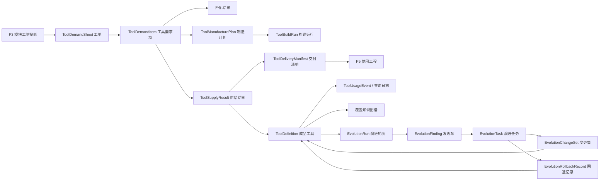

# P4 工具仓库设计-260513-2252-原型 v8 落地补充

**日期：** 2026-05-13

**状态：** 已按用户确认归入主文档

**对应主文档：**

- `DOC/CODEX_DOC/02_设计说明/P4_工具仓库/P4-工具仓库设计.md`

**对应原型事实源：**

- `DOC/CODEX_DOC/08_原型与附图/2026-05-13-023500-CodeFactoryV2-P4工具仓库工单处理与工具构建知识图谱驾驶舱修正版-v8/README.md`

**实现事实源：**

- 前端主页面：`apps/web/src/pages/XXP4Page.tsx`
- 前端 P4 组件：`apps/web/src/components/p4/`
- 前端 API 类型：`apps/web/src/lib/api.ts`
- 后端 P4 路由：`apps/api/app/api/routes/tool_hub_*.py`
- 后端 P4 领域模块：`apps/api/app/tool_hub/`

## 1. 本补充目的

当前 `P4 工具仓库` 已经形成一版可运行实现，也已经完成 v8 原型评审稿。下一步不能只保留原型图，而应把原型中已经收敛的对象关系、工作区组织方式、页面动作、模块映射和接口落点整理成可回并主软件设计说明的补充稿。

本文件用于回答：

1. v8 原型中的各页面视图分别对应 `P4` 的哪些业务对象和后端模块。
2. 当前实现中已有的能力如何映射到 v8 原型。
3. 哪些内容应回并到 `P4-工具仓库设计.md` 的第 5 章前端设计、第 6 章后端设计、第 7 章对象模型、第 8 章 API、第 9 章流程和第 13 章验收口径。
4. 哪些内容仍处于待确认或后续实现范围，不能在归并时写成已经完成的事实。

本文不是主文档替代品。用户确认后，本文稳定结论已归并到 `P4-工具仓库设计.md`；本文保留为归并依据和审阅记录。

## 2. 归并原则

### 2.1 原型图不是业务事实源，设计对象才是事实源

v8 原型作为界面组织和交互口径证据使用。主文档应吸收的是：

- `工单池 -> 工单 -> 工具` 的对象递进关系。
- `工单处理` 作为独立页面视图，负责面向整张工单判断生命周期和完成情况。
- `工具构建` 作为单个工具的匹配、生产、过程值和交付控制页面。
- `取用驾驶舱` 作为工具资产使用态观察入口，而不是普通历史记录表。
- `覆盖知识图谱` 作为业务变化、时序变化、工具覆盖和缺口的关系视图，替代原覆盖矩阵的正式设计口径。
- 成品工具页强调“用在哪些工程中”和“如何演进变化”。
- 演进配置和演进轨迹分别表达行为配置和被演进对象脉络，不能继续用同一模板泛化描述。
- 页面按钮必须来自对象动作和状态约束，不为填充界面而设置。

主文档不应吸收的是：

- 原型中的具体像素、静态样例文案、色值和卡片尺寸。
- 截图编号。
- 演示用假数据。
- 已被用户要求删除的 v1 到 v7 原型路径。

### 2.2 主体结构不重做，只调整对象视图

用户已明确要求：不希望原型主体结构发生变化，仍是在每个界面内部调整内容表达，并额外增加 `工单处理` Tab 页面。

因此本补充不把 `P4` 改造成新的三列并列体系，也不把 `P4` 改造成新的顶层门户。正式口径应为：

```text
P4 工具仓库工作台
  -> 左侧对象导航 / 阶段导航
    -> 工单池与工单
    -> 工单处理
    -> 工具构建
    -> 取用驾驶舱
    -> 工具资源列表
    -> 覆盖知识图谱
    -> 成品工具属性
    -> 演进配置
    -> 演进轨迹
```

其中 `演进配置弹窗` 是 `演进配置` 视图的模态交互状态，不是独立业务 Tab。

### 2.3 现有实现能力不重命名为已完成目标态

当前实现已经存在：

- 总览。
- 输入工序链。
- 自演进巡检。
- 工具仓库。
- 工具资产列表、模拟研制队列、真实工具交付查询、覆盖矩阵。
- 工单列表、工单详情、工具需求项审批、制造进度和供给结果。

v8 原型提出的是下一步软件设计落地口径。归并主文档时必须区分：

| 类型 | 处理方式 |
| --- | --- |
| 当前已经实现且名称可延续的对象 | 作为现有事实写入设计 |
| 当前已经实现但名称或视图组织需要调整的对象 | 写成重命名和视图拆分目标 |
| v8 原型新增但尚未实现的对象 | 写成待实现设计目标 |
| 只用于原型展示的静态内容 | 不进入主文档 |

## 3. v8 原型到主设计的页面视图映射

### 3.1 目标页面视图总表

| v8 视图 | 页面职责 | 主对象 | 主后端模块 | 当前实现映射 |
| --- | --- | --- | --- | --- |
| 工单池与工单 | 展示工单池、选中工单和当前工具的递进关系 | 工具需求单、工具需求项 | 工具需求链模块 | `P4InputChainWorkspace` 已有工单列表和工具需求项 |
| 工单处理 | 管理整张工单生命周期和工单内工具进展 | 工具需求单处理视图 | 工具需求链模块、制造与交付模块 | 当前散落在输入工序链和进度查询中，需要独立视图 |
| 工具构建 | 展示单个工具的匹配、生产、实时过程值和交付控制 | 工具需求项、制造计划、构建运行 | 制造与交付模块、运行协调模块 | 当前已有审定、模拟制造和构建运行，但未形成单工具构建页 |
| 取用驾驶舱 | 展示工具取用热度、热点工具、冷门工具、热点领域和冷门领域 | 工具取用事件、资产使用投影 | 查询投影模块、P5 查询端口 | 当前缺少正式使用事件投影，需要新增或从 P5 查询日志派生 |
| 工具资源列表 | 展示工具资产清单和选中资产摘要 | 工具资产定义 | 工具资产管理模块 | `P4RegistryWorkspace` 已有工具表格和编辑弹窗 |
| 覆盖知识图谱 | 展示业务变化、时序变化和工具覆盖关系 | 覆盖关系图谱 | 工具资产管理模块、查询投影模块 | 当前为 `P4CoverageMatrix`，需要升级为图谱视图 |
| 成品工具属性 | 展示成品工具被哪些工程使用、版本演进和交付清单 | 工具资产、交付清单、使用引用 | 工具资产管理模块、真实工具交付模块 | 当前有 delivery manifest 查询，缺少工程使用和演进关系 |
| 演进配置 | 配置巡检范围、策略、回合和自动化边界 | 巡检配置 | 自演进巡检模块 | `P4EvolutionWorkspace` 已有配置字段 |
| 演进配置弹窗 | 作为演进配置的字段编辑态 | 巡检配置编辑表单 | 自演进巡检模块 | 当前配置直接平铺，目标为 `Config` 模态窗 |
| 演进轨迹 | 展示被演进对象的分支、合入、回退和版本脉络 | 演进任务、变更集、回退记录 | 自演进巡检模块、审计与快照层 | 当前有任务和回退动作，缺少分支轨迹图 |

### 3.2 左侧导航与对象边界

`P4` 的导航应从当前实现的“大模块 Tab”逐步收敛为“对象视图导航”。这不是新增业务模块，而是把已有模块能力按用户理解路径重新组织。

建议正式导航口径如下：

| 导航项 | 不变量 | 不应出现的误解 |
| --- | --- | --- |
| 工单池与工单 | 只表达工单池、当前工单、当前工具的递进选择 | 不写成三列并列体系，不把最右侧叫当前工单 |
| 工单处理 | 以整张工单是否完成为判断口径 | 不用单个工具完成替代工单完成 |
| 工具构建 | 既是匹配，也是生产和交付准备 | 不再叫单工具匹配策略 |
| 取用驾驶舱 | 先看工具如何被用，再看历史记录 | 不作为资产大页的尾部记录表 |
| 工具资源列表 | 管理工具资产列表、筛选、选择和基础属性 | 不承担取用热度和覆盖图谱的全部职责 |
| 覆盖知识图谱 | 表达业务变化、时序变化和覆盖缺口 | 不继续叫覆盖矩阵 |
| 成品工具属性 | 看成品工具用在哪些工程、有哪些版本变化 | 不与工具构建页混同 |
| 演进配置 | 配置巡检和演进行为 | 不把配置字段藏在不可见状态里 |
| 演进轨迹 | 看被演进对象的分支和回退脉络 | 不用普通列表替代关系图 |

## 4. 建议补入主文档第 5 章的内容

### 4.1 补充 `5.1.2 核心概念定义`

建议新增以下前端核心概念：

| 概念 | 前端含义 | 权威来源 |
| --- | --- | --- |
| 工单池 | 可被 `P4` 处理的工具需求单集合 | 工具需求链模块 |
| 当前工单 | 用户从工单池选中的工具需求单 | `ToolDemandSheet` |
| 当前工具 | 当前工单中被选中的叶子工具需求项或已生成工具对象 | `ToolDemandItem` / `ToolDefinition` |
| 工单处理视图 | 面向整张工单生命周期、完成度、阻塞项和工具进展的视图 | 工具需求链投影 |
| 工具构建视图 | 面向单个工具的匹配、生产、过程值和交付控制视图 | `ToolDemandItem`、`ToolManufacturePlan`、`ToolBuildRun` |
| 取用驾驶舱 | 面向工具使用热度、冷热资产和领域取用分布的只读观察视图 | 取用事件投影、P5 查询日志 |
| 覆盖知识图谱 | 面向业务域、工具资产、版本时序、使用热度和缺口的关系视图 | 覆盖图谱投影 |
| 演进轨迹 | 面向工具版本分支、演进任务、合入和回退的关系视图 | 演进任务、变更集、回退记录 |

### 4.2 替换 `5.5.2 页面结构`

当前主文档中 `XX-P4` 页面结构仍是：

```text
总览指标
输入工具链
自演进巡检
工具仓库
真实工具交付
```

建议归并时改成以下目标结构：

```text
页面壳层
  -> 页头：阶段身份、统一状态、新鲜度和必要入口
  -> 左侧对象导航
  -> 主工作区
     -> 工单池与工单
     -> 工单处理
     -> 工具构建
     -> 取用驾驶舱
     -> 工具资源列表
     -> 覆盖知识图谱
     -> 成品工具属性
     -> 演进配置
     -> 演进轨迹
```

设计要点：

- 页头只保留阶段身份、数据新鲜度、必要刷新或诊断入口，不堆叠进入工单、进入工具等对象动作。
- 左侧对象导航负责切换视图，不改变后端事实。
- 对象动作放在对象所在视图内部，尤其是 `进入工单处理` 和 `进入工具构建`。
- `Config` 只出现在演进配置视图中，点击后打开配置模态窗。
- 测试清理按钮属于联调辅助能力，不应作为正式业务按钮进入目标态主设计。

### 4.3 工单池与工单视图

工单池与工单视图用于建立用户对 `P4` 输入对象的第一层理解。该视图不应设计为三列并列体系，而应描述为递进选择关系：

```text
工单池
  -> 选中工单
    -> 选中工具
```

关键规则：

- 左侧区域展示工单池，包含工单名称、编号、来源、状态和关键计数。
- 选中工单后，主区域展示工单名称、编号、来源场景、业务案例、状态、工具数量和工具列表。
- 当前工单区域提供 `进入工单处理` 按钮，因为工单完成判断需要面向整张工单管理。
- 选中某个工具后，工具摘要区域展示工具名称、归属工单、业务域、推荐类型、当前状态和入口动作。
- 工具摘要区域提供 `进入工具构建` 按钮，因为单工具的匹配、生产和过程值需要进入工具构建页。
- 页头不重复提供 `进入工单` 或 `进入工具`。

建议按钮：

| 按钮 | 所在位置 | 触发对象 | 设计依据 |
| --- | --- | --- | --- |
| 查看工单 | 工单池条目 | `ToolDemandSheet` | 从池中选中工单 |
| 进入工单处理 | 当前工单区域 | `ToolDemandSheet` | 进入整单生命周期管理 |
| 查看工具 | 工单工具列表 | `ToolDemandItem` | 选中当前工具 |
| 进入工具构建 | 当前工具摘要 | `ToolDemandItem` | 进入单工具构建过程 |

### 4.4 工单处理视图

`工单处理` 是 v8 新增视图。它的设计重点是：`P4` 以工单作为完成判断口径，而不是只看单个工具是否完成。

工单处理视图应包含：

- 工单生命周期：`submitted / accepted / rejected / withdrawn / closed`。
- 工单审定状态：`pending_review / reviewing / reviewed`。
- 工单交付状态：`not_delivered / delivering / delivered`。
- 工单处理状态：`not_started / processing / partially_ready / ready / failed`。
- 工单内工具总数、待审数、直接交付数、进入研制数、已拒绝数、已可取用数、失败数。
- 阻塞工具列表。
- 可交付工具列表。
- 生命周期事件流。

核心动作：

| 动作 | 允许条件 | 写入对象 |
| --- | --- | --- |
| 驳回当前工单 | 工单未进入终态 | `ToolDemandLifecycleEvent`、`ToolDemandSheet.lifecycle_status` |
| 刷新工单进展 | 任意非终态工单 | 查询投影，不直接推进状态 |
| 进入工具构建 | 选中具体工具 | 前端视图状态 |
| 查看供给结果 | 已有供给结果 | `ToolSupplyResult` 只读查询 |

不建议出现：

- 右上角重复 `进入工单`。
- 与工具构建页重复的单工具过程值详情。
- 在工单处理页直接编辑工具资产基础属性。

### 4.5 工具构建视图

`工具构建` 替代原 `单工具匹配策略`。它表达单个工具从需求项到可交付结果的过程，包括匹配、审定、生产和交付准备。

工具构建视图应包含：

- 工具简介：名称、编号、来源工单、来源节点、业务域、输入类型、输出类型、验收说明。
- 匹配状态：推荐类型、推荐工具、匹配摘要、缺口说明、置信或评分。
- 审定状态：待审、批准直接交付、批准研制、拒绝。
- 开发计划：是否进入模拟研制或真实构建、目标工具名称、预计完成时间、目标时长、当前进度。
- 实时过程值：分析、检查、匹配、制造、验证、交付清单生成等阶段的进度和最近消息。
- 交付控制：供给结果、获取清单、交付清单、建议轮询时间。

与当前实现的关系：

| 当前对象 | 工具构建视图中的位置 |
| --- | --- |
| `ToolDemandItem.analysis_result` | 过程值中的分析阶段 |
| `ToolDemandItem.check_result` | 过程值中的检查阶段 |
| `ToolDemandItem.match_result` | 匹配状态与匹配阶段 |
| `ToolDemandItem.processing_status` | 总体构建状态 |
| `ToolManufacturePlanView` | 开发计划与进度 |
| `ToolBuildRun` | 真实构建运行 |
| `ToolSupplyResult` | 交付控制 |
| `ToolDeliveryManifest` | 成品交付清单 |

建议按钮：

| 按钮 | 触发对象 | 说明 |
| --- | --- | --- |
| 批准直接交付 | `ToolDemandItem` | 生成直接交付供给结果 |
| 批准进入研制 | `ToolDemandItem` | 生成制造计划或构建运行 |
| 拒绝工具需求 | `ToolDemandItem` | 写入拒绝状态和原因 |
| 刷新过程值 | `ToolDemandItem` | 查询进度投影，不隐式推进状态 |
| 查看交付清单 | `ToolSupplyResult` / `ToolDeliveryManifest` | 只读查看可消费信息 |

### 4.6 取用驾驶舱视图

`取用驾驶舱` 应前置于资产页。它回答“工具正在如何被使用”，而不是回答“仓库里有哪些工具”。

目标视图应包含：

- 今日取用次数。
- 正在使用的工具数量。
- 热点工具列表。
- 冷门工具列表。
- 热点领域。
- 冷门领域。
- 最近取用事件流。
- 异常取用或失败取用摘要。

建议新增只读投影：

```text
ToolUsageCockpitProjection
  -> active_usage_count
  -> today_fetch_count
  -> hot_tools
  -> cold_tools
  -> hot_domains
  -> cold_domains
  -> recent_usage_events
  -> failed_usage_events
```

首版数据来源可以分层处理：

1. 已有 `P5 Query Port` 中的 fetch / delivery manifest 查询日志。
2. `P4` 内部工具获取清单查询事件。
3. 后续正式 `ToolUsageEvent` 表。

在没有正式事件表前，主文档应写成“从查询日志或投影派生”，不写成已经有完整取用埋点。

### 4.7 工具资源列表视图

工具资源列表只承担资产清单与基础治理，不再混装取用驾驶舱和覆盖知识图谱。

目标内容：

- 工具名称、摘要、状态、业务域、形态、运行平台、生命周期、验证状态。
- 筛选与排序。
- 选中资产摘要。
- 新建、编辑、归档、打开成品工具属性。

当前 `P4RegistryWorkspace` 已具备：

- 工具表格。
- 新建工具。
- 编辑工具。
- 删除工具。
- 模拟研制队列。

归并时应明确后续拆分：

- `模拟研制队列` 移入 `工具构建` 或 `工单处理`。
- `真实工具交付查询` 移入 `成品工具属性`。
- `覆盖矩阵` 移入 `覆盖知识图谱`。
- 工具资源列表只保留资产清单和基础治理。

### 4.8 覆盖知识图谱视图

当前实现中存在 `P4CoverageMatrix` 和 `ToolHubCoverageMatrix`。v8 已将覆盖矩阵提升为覆盖知识图谱。主文档建议采用以下过渡口径：

- 短期：后端仍可保留 `coverage_matrix` 字段，前端以图谱方式重新投影展示。
- 中期：新增 `ToolCoverageKnowledgeGraphProjection`。
- 长期：如果业务关系复杂度上升，再考虑独立图查询或图数据库，不作为首版必要条件。

覆盖知识图谱至少包含五类节点：

| 节点类型 | 说明 |
| --- | --- |
| 业务域节点 | 工具服务的业务领域 |
| 工具资产节点 | 具体工具资产 |
| 需求来源节点 | 来源工单、来源模块或来源业务变化 |
| 版本时序节点 | 工具版本、演进任务、构建运行 |
| 缺口节点 | 覆盖空白、能力重叠、验证失败、冷门资产 |

至少包含以下关系：

- 业务域覆盖工具。
- 工单需要工具。
- 工具满足需求项。
- 工具被工程取用。
- 工具由某次演进任务改变。
- 工具版本从上一版本演化而来。
- 缺口指向受影响领域或工具。

### 4.9 成品工具属性视图

成品工具页不同于工具构建页。工具构建看“这个工具如何被生产出来”，成品工具属性看“这个工具作为资产如何被使用和演进”。

目标内容：

- 工具身份：名称、slug、版本、形态、打包方式、接入方式、依赖策略。
- 使用工程：被哪些 P5 工程、构建尝试或消费方使用。
- 交付清单：导入路径、依赖、样例宿主、manifest 路径。
- 版本关系：当前版本、上一版本、演进分支、回退点。
- 验证状态：最近验证结果、失败原因、样例用例。
- 取用热度：近期取用次数和趋势。

当前已有 `ToolDeliveryManifest`，但缺少 `使用工程` 和 `版本关系`。归并主文档时应写为后续目标，不写成已完成实现。

### 4.10 演进配置视图和配置弹窗

演进配置视图应表达“怎么配置演进”，包括范围、策略、回合和自动化边界。

目标字段：

- 是否启用巡检。
- 巡检范围：是否纳入草稿工具、业务域、工具形态、风险规则。
- 匹配策略：描述缺失、域模型异常、能力重叠、覆盖空白等规则。
- 交付约束：自动改写允许范围、人工确认边界、回退要求。
- 版本控制：变更集、回退点、版本注记。
- 回合控制：巡检间隔、单轮最大发现数、最大历史轮次。
- 自动执行规则：哪些规则可以自动进入任务。

`Config` 按钮点击后必须打开模态窗。模态窗不是装饰状态，至少应展示：

- 巡检范围。
- 匹配策略。
- 交付约束。
- 版本控制。
- 自动执行规则。
- 保存、取消和恢复默认。

当前 `P4EvolutionWorkspace` 已有配置字段平铺在卡片中。后续目标是把复杂编辑收纳到配置弹窗，主视图只展示配置摘要和关键动作。

### 4.11 演进轨迹视图

演进轨迹视图应给出类似版本分支的概念图，表达被演进对象如何变化。

目标图形元素：

- 主干版本。
- 演进分支。
- 自动改写任务。
- 人工处置任务。
- 合入点。
- 回退点。
- 当前活动版本。
- 失败或废弃分支。

目标数据来源：

- `EvolutionRun`。
- `EvolutionFinding`。
- `EvolutionTask`。
- `EvolutionChangeSet`。
- `EvolutionRollbackRecord`。
- `ToolDefinition` 版本或审计快照。

当前实现已有 `EvolutionTask.rollback_available` 和回退动作，但尚未把变更集与版本分支做成图形投影。归并主文档时应写为目标态补充。

## 5. 建议补入主文档第 6 章的内容

### 5.1 工具需求链模块补充

工具需求链模块应在现有 `6.5` 中补充两个视图职责：

1. 工单池与工单视图。
2. 工单处理视图。

模块必须明确：

- `ToolDemandSheet` 是整张工单的权威对象。
- `ToolDemandItem` 是工单内叶子工具的权威对象。
- 工单完成判断由整张工单聚合状态决定。
- 单个工具完成不能直接代表整张工单完成。

建议新增或明确以下查询方法：

```text
listDemandSheetPool()
getDemandSheetProcessingView(sheet_id)
getDemandSheetLifecycleEvents(sheet_id)
getBlockedDemandItems(sheet_id)
getDeliverableDemandItems(sheet_id)
```

### 5.2 制造与真实工具交付模块补充

制造与真实工具交付模块应支撑 `工具构建` 视图。它不只是后台模拟队列，而是单工具构建过程的事实来源。

建议明确 `ToolBuildProcessView`：

```text
ToolBuildProcessView
  -> demand_item
  -> match_summary
  -> review_state
  -> manufacture_plan
  -> build_run
  -> process_steps
  -> supply_result
  -> delivery_manifest
```

`process_steps` 首版可由现有字段派生：

- `analysis_result`
- `check_result`
- `match_result`
- `ToolManufacturePlanView.status`
- `ToolManufacturePlanView.progress_percent`
- `ToolBuildRun.status`
- `ToolSupplyResult.last_message`

后续如需实时显示，可以采用短轮询或运行事件流。首版不强制引入 WebSocket。

### 5.3 查询投影模块补充

查询投影模块需要从当前总览投影扩展为对象视图投影。

建议补充：

| 投影 | 用途 |
| --- | --- |
| `DemandSheetPoolProjection` | 工单池列表 |
| `DemandSheetProcessingProjection` | 工单生命周期与工具进展 |
| `ToolBuildProcessProjection` | 单工具构建过程 |
| `ToolUsageCockpitProjection` | 取用驾驶舱 |
| `ToolRegistryListProjection` | 工具资源列表 |
| `ToolCoverageKnowledgeGraphProjection` | 覆盖知识图谱 |
| `ToolProfileProjection` | 成品工具属性 |
| `ToolEvolutionLineageProjection` | 演进轨迹 |

这些投影不要求一次性独立落库。首版可以由现有事实对象和现有投影即时组装，但 API 和 ViewModel 应按上述边界设计，避免前端自行拼业务事实。

### 5.4 工具资产管理模块补充

工具资产管理模块应新增“成品工具属性”视角。

除现有 `ToolDefinition` 和 `ToolFetchManifest` 外，目标属性还包括：

- 使用工程列表。
- 取用统计。
- 当前交付清单。
- 版本关系。
- 演进任务引用。
- 验证历史。

首版可以先从 `ToolDeliveryManifest`、`P5 Query Port` 查询日志、`EvolutionTask` 和构建运行派生，不要求一次性建立完整版本图数据库。

### 5.5 自演进巡检模块补充

自演进巡检模块应拆分为两个用户视角：

- `演进配置`：行为配置视角。
- `演进轨迹`：对象变化脉络视角。

模块职责补充：

- 配置保存必须记录操作者和更新时间。
- 触发巡检生成 `EvolutionRun`。
- 发现项处置生成或更新 `EvolutionFinding`。
- 采纳发现项后生成 `EvolutionTask`。
- 自动改写必须生成变更集。
- 回退必须生成回退记录。
- 演进轨迹图从任务、变更集和回退记录派生。

## 6. 建议补入主文档第 7 章的对象模型

### 6.1 新增视图模型对象

建议主文档第 7 章新增以下 ViewModel，不作为新领域事实源：

```text
P4ObjectWorkbenchViewModel
DemandSheetPoolViewModel
DemandSheetProcessingViewModel
ToolBuildProcessViewModel
ToolUsageCockpitViewModel
ToolCoverageKnowledgeGraphViewModel
ToolProfileViewModel
EvolutionConfigDialogViewModel
ToolEvolutionLineageViewModel
```

这些对象用于前端展示和 API DTO 映射。权威事实仍归属于：

- `ToolDemandSheet`
- `ToolDemandItem`
- `ToolManufacturePlan`
- `ToolBuildRun`
- `ToolSupplyResult`
- `ToolDefinition`
- `ToolDeliveryManifest`
- `EvolutionInspectionConfig`
- `EvolutionRun`
- `EvolutionFinding`
- `EvolutionTask`
- `EvolutionChangeSet`
- `EvolutionRollbackRecord`

### 6.2 对象关系图

建议归并主文档时补入以下关系图：



## 7. 建议补入主文档第 8 章的 API 设计

### 7.1 Operator Port 补充

建议补充面向对象视图的查询端口：

```text
GET /tool-hub/operator/workbench/object-view
GET /tool-hub/operator/demand-sheets/{sheet_id}/processing
GET /tool-hub/operator/demand-items/{item_id}/build-process
GET /tool-hub/operator/tools/usage-cockpit
GET /tool-hub/operator/tools/coverage-graph
GET /tool-hub/operator/tools/{tool_id}/profile
GET /tool-hub/operator/tools/{tool_id}/evolution-lineage
```

当前 API 已存在的端口可以继续保留：

- `GET /overview`
- `GET /tools`
- `GET /manufacture-plans`
- `GET /evolution/config`
- `GET /evolution/runs`
- `GET /evolution/tasks`
- `POST /demand-items/{item_id}/review`
- `POST /demand-sheets/{sheet_id}/reject`

新增端口不应重复推进业务状态，只做对象视图组装。

### 7.2 P5 Query Port 补充

取用驾驶舱需要有数据来源。建议在 `P5 Query Port` 查询工具获取清单和交付清单时记录只读取用事件：

```text
ToolUsageEvent
  -> event_id
  -> tool_id
  -> consumer_phase
  -> consumer_project_id
  -> query_type
  -> result_status
  -> occurred_at
```

如果短期不新增持久化事件表，可以先由 API 访问日志或投影仓的轻量日志派生。主设计应明确这是只读观察数据，不允许 `P5` 通过取用事件反写工具资产。

### 7.3 Runtime Port 补充

工具构建和演进轨迹需要运行时过程值。建议 `Internal Runtime Port` 继续承担后台推进，但前端只读取投影：

```text
POST /tool-hub/runtime/run-cycle
POST /tool-hub/runtime/projections/refresh
GET /tool-hub/operator/demand-items/{item_id}/build-process
GET /tool-hub/operator/tools/{tool_id}/evolution-lineage
```

页面的 `刷新过程值` 只读取投影，不能通过查询隐式推进运行时。

## 8. 建议补入主文档第 9 章的关键流程

### 8.1 从工单池进入工单处理

```text
用户进入 P4 工作台
  -> 查看工单池
    -> 选中一张 ToolDemandSheet
      -> 查看工单摘要和工具列表
        -> 点击进入工单处理
          -> 读取 DemandSheetProcessingProjection
            -> 判断整张工单生命周期、审定和交付状态
```

### 8.2 从工单处理进入工具构建

```text
工单处理视图
  -> 选中阻塞工具或待构建工具
    -> 点击进入工具构建
      -> 读取 ToolBuildProcessProjection
        -> 展示匹配、审定、制造、构建运行和交付结果
          -> 用户提交审定或查看交付清单
            -> 命令写入后刷新投影
```

### 8.3 从资产取用进入成品工具属性

```text
取用驾驶舱
  -> 查看热点工具、冷门工具和热点领域
    -> 选择某个工具
      -> 打开成品工具属性
        -> 查看使用工程、交付清单、版本关系和演进引用
```

### 8.4 从覆盖知识图谱进入演进配置和演进轨迹

```text
覆盖知识图谱
  -> 发现覆盖空白或能力重叠
    -> 打开相关工具或缺口节点
      -> 进入演进配置调整巡检策略
        -> 触发巡检
          -> 形成 EvolutionRun / EvolutionFinding / EvolutionTask
            -> 进入演进轨迹查看分支、合入和回退
```

## 9. 建议补入主文档第 13 章的验收口径

### 9.1 产品验收补充

用户验收应能确认：

- 工单池、工单和工具的递进关系表达清楚。
- `进入工单处理` 位于当前工单视图内，不在页头重复。
- `进入工具构建` 位于当前工具摘要或工单处理的具体工具行内。
- 工单处理能看到整张工单的生命周期、工具进展和阻塞点。
- 工具构建能看到简介、匹配状态、开发计划、过程值和交付控制。
- 取用驾驶舱能看到正在使用工具、热点工具、冷门工具、热点领域和冷门领域。
- 工具资源列表、覆盖知识图谱、成品工具属性不混成一个大表格页面。
- 演进配置点击 `Config` 后能看到可编辑字段。
- 演进轨迹以分支或关系图表达，不退化为普通列表。
- 页面按钮都有对象和状态依据，没有无意义填充按钮。

### 9.2 架构验收补充

架构验收应确认：

- 对象视图不新增独立业务事实源。
- 前端 ViewModel 只消费后端 DTO 和查询投影。
- `ToolDemandSheet` 仍是工单权威对象。
- `ToolDemandItem` 仍是单工具需求权威对象。
- `ToolDefinition` 仍是成品工具资产权威对象。
- 取用驾驶舱来源于查询日志或取用事件，不允许反写资产事实。
- 覆盖知识图谱由投影生成，不由前端手工拼接业务事实。
- 演进轨迹由演进任务、变更集和回退记录派生。
- 查询动作不推进制造、构建或演进状态。

### 9.3 测试入口补充

建议新增或调整测试：

- `XXP4Page.test.tsx`：对象导航和视图切换。
- `P4InputChainWorkspace.test.tsx`：工单池、工单和工具递进。
- `P4DemandProcessingWorkspace.test.tsx`：工单处理视图。
- `P4ToolBuildWorkspace.test.tsx`：工具构建过程值。
- `P4UsageCockpit.test.tsx`：取用驾驶舱冷热工具。
- `P4CoverageKnowledgeGraph.test.tsx`：覆盖知识图谱节点和关系。
- `P4ToolProfile.test.tsx`：成品工具属性与交付清单。
- `P4EvolutionConfigDialog.test.tsx`：Config 弹窗字段。
- `P4EvolutionLineage.test.tsx`：演进轨迹分支图。
- 后端新增投影测试，覆盖对象视图 DTO 的来源和一致性。

## 10. 主文档回并清单

用户已确认归并，已按下表回并：

| 主文档章节 | 回并内容 |
| --- | --- |
| 文首补充文档列表 | 增加本文，并在归并后标记已归入 |
| `1.4 系统主路径` | 补充工单池、工单处理、工具构建、取用驾驶舱和资产演进路径 |
| `4.2 产品能力模块` | 补充取用驾驶舱、覆盖知识图谱、对象视图投影的产品能力说明 |
| `5.1.2 核心概念定义` | 增加工单池、当前工单、当前工具、工具构建、取用驾驶舱、覆盖知识图谱、演进轨迹 |
| `5.2 前端分层与装载生命周期` | 调整组件目录和工作台装载生命周期 |
| `5.4.2 页面区块与后端模块映射` | 用对象视图表替换旧的大模块区块表 |
| `5.5 XX-P4 工具仓库工作台设计` | 重写为 v8 对象视图工作台 |
| `6.5 工具需求链模块` | 增加工单池和工单处理职责 |
| `6.6 制造与真实工具交付模块` | 增加工具构建过程视图 |
| `6.7 自演进巡检模块` | 拆出演进配置和演进轨迹视角 |
| `6.9 查询投影与展示模块` | 增加对象视图投影 |
| `7 核心对象模型` | 增加 ViewModel 和对象关系图 |
| `8 API 设计` | 增加对象视图查询端口和取用事件来源 |
| `9 关键运行流程` | 增加工单池到工单处理、工具构建、取用驾驶舱、演进轨迹流程 |
| `13 验收口径` | 增加 v8 对象视图验收点 |

## 11. 后续实现确认项

以下内容已经作为目标口径进入主文档，但在后续实现时仍需要按版本裁剪确认：

1. 左侧对象导航最终是否采用 9 个导航项，还是把 `成品工具属性` 作为工具资源列表的详情态。
2. `取用驾驶舱` 的第一版数据是否允许先从查询日志派生，还是必须新增正式 `ToolUsageEvent`。
3. `覆盖知识图谱` 第一版是否接受由现有覆盖矩阵投影转换为图谱展示，还是必须新增完整图谱 DTO。
4. `演进配置` 的 `Config` 弹窗是否拆成多个页签：巡检范围、匹配策略、交付约束、版本控制。
5. `演进轨迹` 第一版是否只展示演进任务分支，还是必须同时展示工具版本分支。

## 12. 本补充结论

v8 原型已经把 `P4` 的设计概念从当前实现中的四个粗粒度工作区，细化为面向对象的工具资产运营中台。它不推翻现有后端模块，也不要求重新定义 `P4` 的主业务边界；它要求把前端视图、查询投影和验收口径按用户可理解的对象链路重新落地。

本补充建议主文档归并后形成以下稳定口径：

```text
P4 的用户理解路径：
工单池 -> 工单处理 -> 工具构建 -> 资产取用 -> 资产资源 -> 覆盖关系 -> 成品属性 -> 演进配置 -> 演进轨迹

P4 的后端事实路径：
ToolDemandSheet -> ToolDemandItem -> ToolManufacturePlan / ToolBuildRun -> ToolSupplyResult -> ToolDefinition / ToolDeliveryManifest -> EvolutionRun / EvolutionTask / RollbackRecord
```

上述稳定结论已回写到 `P4-工具仓库设计.md`。
