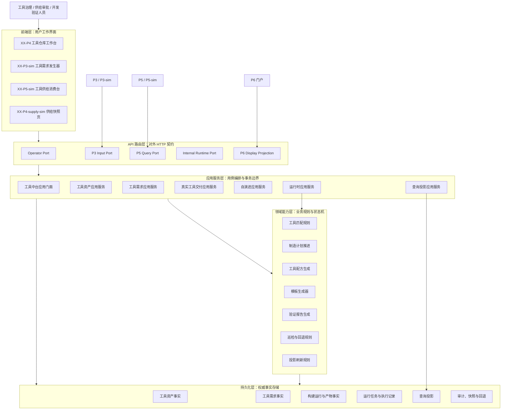
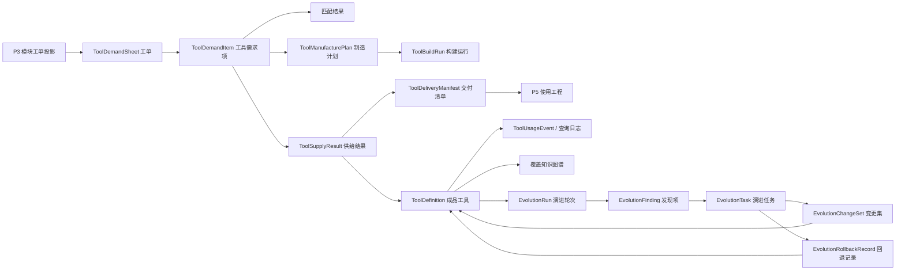

# P4 工具仓库软件设计说明

> 本文件是 `CodeFactoryV2` 中 `P4 工具仓库` 的主软件设计说明文档。本文描述本阶段认可的目标态系统设计：系统边界、前端形态、后端架构、模块职责、对象模型、接口、运行流程、验收口径和文档治理规则。
>
> 本文不承担实现审查和迁移计划职责；相关设计演进、专项论证和阶段性纠偏由独立补充文档承接。补充文档中的稳定结论被采纳后，应回并到本文。
>
> 当前与 `P4` 直接相关的补充文档包括：
>
> - `P4-工具仓库设计-260419-1000-核心业务循环补充.md`
> - `P4-工具仓库设计-260419-1010-真实工具落地验证补充.md`
> - `P4-工具仓库设计-260419-1020-Runtime协调器与队列补充.md`
> - `P4-工具仓库设计-260419-1030-Backend服务边界补充.md`
> - `P4-工具仓库设计-260419-1040-数据与投影模型补充.md`
> - `P4-工具仓库设计-260513-2252-原型v8落地补充.md`

**日期：** 2026-05-12

**最近更新：** 2026-05-13，归入 `P4` 原型 v8 落地补充，明确 `XX-P4` 工作台以对象视图组织：工单池与工单、工单处理、工具构建、取用驾驶舱、工具资源列表、覆盖知识图谱、成品工具属性、演进配置和演进轨迹。

**对应节点：**

- `P4` 工具仓库 / 工具中台
- `P4.1` 工具资产与验证工作台
- `P4.2` 输入工序链闭环
- `P4.3` 自演进巡检闭环
- `P4.4` 后端服务化与运行时演进
- `P4.5` 真实工具落地验证

## 1. 文档目的与设计口径

### 1.1 文档目的

本文用于回答以下设计问题：

1. `P4` 是什么系统，边界在哪里。
2. 工具仓库正面管理的对象是什么。
3. 前端有哪些页面、工作区和状态协作关系。
4. 后端按什么层次组织，核心模块分别承担什么职责。
5. 工具需求单、工具资产、制造计划、自演进任务和真实交付物如何持久化和流转。
6. API 如何承载 `P3 -> P4 -> P5` 主链、操作员工作台、内部运行时和 `P6` 展示投影。
7. 一个工具需求如何从 `P3` 工单进入 `P4`，并形成可供 `P5` 查询和获取的工具供给结果。

### 1.2 设计口径

本文采用目标态软件设计说明口径：

- 描述“系统应该如何设计”，不把实现缺口、提交记录或迁移步骤写成主设计。
- 描述“模块职责、接口、对象和状态机”，不把单次实施计划替代系统设计。
- 描述“本阶段可实现的理想形态”，不要求一次性完成未来所有服务化目标。
- 设计内容在本文内自包含，读者不需要依赖补充文档才能理解 `P4` 主架构。

### 1.3 术语使用规则

本文面向软件设计评审，优先使用中文概念名。英文名只在第一次出现时作为实现命名对照，或在代码路径、接口字段、类名、枚举值、文件名中使用。

例如：

- 工具资产定义（`ToolDefinition`）。
- 工具需求单（`ToolDemandSheet`）。
- 工具需求项（`ToolDemandItem`）。
- 工具制造计划（`ToolManufacturePlan`）。
- 工具供给结果（`ToolSupplyResult`）。
- 工具获取清单（`ToolFetchManifest`）。
- 真实工具构建运行（`ToolBuildRun`）。
- 自演进巡检轮次（`EvolutionRun`）。
- 运行时任务（`RuntimeJob`）。

后续正文若讨论设计概念，应使用中文名；若讨论实现对象、字段或文件，应保留英文名。

### 1.4 系统主路径

`P4` 的主路径是：

```text
接收 P3 冻结后的工具需求单
  -> 进入工单池
    -> 选中当前工单并拆分叶子工具需求项
      -> 进入工单处理，判断整张工单生命周期、工具进展和阻塞点
        -> 进入工具构建，处理单个工具的匹配、审定、生产、验证和交付控制
          -> 已命中项形成工具供给结果
          -> 未命中项形成制造计划或真实工具构建运行
            -> 后台运行时推进制造、生成、验证和投影刷新
              -> 形成成品工具属性、取用驾驶舱和覆盖知识图谱投影
                -> P5 只读查询整单、叶子项进度、获取清单和交付清单
                  -> P6 只读展示 P4 阶段状态
```

`P4.3` 自演进巡检是工具资产池的内部治理路径，不替代 `P3 -> P4 -> P5` 外部供给路径。`P4.5` 真实工具落地验证是在主路径上增加真实产物生成、登记、校验和交付能力，不把工具默认等同为完整页面或完整应用。

从用户工作台理解，`P4` 的对象路径固定为：

```text
工单池 -> 工单处理 -> 工具构建 -> 资产取用 -> 资产资源 -> 覆盖关系 -> 成品属性 -> 演进配置 -> 演进轨迹
```

从后端事实理解，`P4` 的对象路径固定为：

```text
ToolDemandSheet -> ToolDemandItem -> ToolManufacturePlan / ToolBuildRun -> ToolSupplyResult -> ToolDefinition / ToolDeliveryManifest -> EvolutionRun / EvolutionTask / RollbackRecord
```

## 2. 系统定位

### 2.1 一句话定位

`P4 工具仓库` 是软件工厂中的工具资产运行中台。它把 `P3` 输出的模块级工具化需求转化为可匹配、可审定、可制造、可验证、可交付、可供 `P5` 消费的工具资产供给事实。

### 2.2 正面工作对象

`P4` 正面工作的对象是：

```text
可复用工具资产及其供给过程事实
```

不是：

- 普通工具列表。
- 单次页面生成结果。
- `P3` 的软件设计对象。
- `P5` 的最终装配结果。
- `P1` 的知识治理内部状态。
- 页面查询动作隐式推进出来的临时状态。

工具资产可以是前端元组件、后端模块、服务接口、模板包、执行器或未来复合资产。第一批真实工具落地验证默认选择“前端元组件”，而不是整页生成器。

### 2.3 用户角色

| 角色 | 主要目标 | 使用入口 |
| --- | --- | --- |
| 工具资产治理人员 | 登记、修订、验证和归档工具资产 | `XX-P4` 工具资源列表、成品工具属性 |
| 工具供给审批人员 | 审定工具需求项，决定直接交付、进入制造或驳回 | `XX-P4` 工单处理、工具构建 |
| 工具开发人员 / 生成链维护者 | 处理未命中项，生成真实工具产物并完成校验 | `XX-P4` 工具构建、成品工具属性、内部运行时 |
| 自演进巡检人员 | 配置巡检规则，处置发现项，执行回退 | `XX-P4` 演进配置、演进轨迹 |
| `P3` 系统 | 提交冻结后的工具需求单，撤销或查询受理状态 | `P3 Input Port`、`XX-P3-sim` |
| `P5` 系统 | 查询供给结果、获取工具清单和真实产物消费说明 | `P5 Query Port`、`XX-P5-sim` |
| `P6` 系统 | 只读展示工具仓库阶段状态和供给流 | `P6DisplayExportContract` |

## 3. 业务目标与边界

### 3.1 首版负责

首版 `P4` 负责：

- 工具、组件、执行器、模板包等资产的结构化登记。
- 工具分类、标签、输入输出、运行平台、生命周期环节和验证状态管理。
- `P3` 工具需求单受理、叶子项拆分、匹配、审定和完成判定。
- 未命中项的模拟制造推进和真实工具落地验证。
- 工具池自演进巡检、发现项处置、低风险自动改写和回退。
- 统一后台运行语义、任务队列、租约、执行记录和查询投影刷新。
- 对 `P5` 提供只读查询、进度和获取清单接口。
- 对 `P6` 提供只读阶段状态、指标、队列和流向投影。

### 3.2 首版不负责

首版 `P4` 不负责：

- 直接生成 `P3` 的软件设计对象。
- 直接承担 `P5` 的最终软件装配、构建和运行交付。
- 直接读取或改写 `P1` 的知识治理工作态。
- 建设跨全厂通用调度中心。
- 建设多工具依赖图和复杂编排平台。
- 接受 `P5` 对既有工具资产的直接业务语义修订命令。

### 3.3 上下游边界

`P4` 与上下游的边界固定如下：

| 流向 | 输入或输出 | `P4` 的职责边界 |
| --- | --- | --- |
| `P1 -> P4` | 发布态知识摘要、实体、流程、事件、冻结快照 | 只读消费标准知识出口，不读内部治理表和临时 JSON |
| `P3 -> P4` | 冻结后的模块级工具化描述、工具需求单 | 受理、拆项、匹配、审定、制造和供给 |
| `P4 -> P5` | 工具供给结果、工具获取清单、真实工具交付清单 | 只读查询和获取，不让 `P5` 直接改写 `P4` |
| `P5 -> P3 -> P4` | 构建不匹配、供给缺口、设计重开结论 | 必须先由 `P3` 仲裁；只有重新签发的新供给目标才进入 `P4` |
| `P4 -> P6` | 阶段状态、队列、指标、流向和新鲜度 | 只读展示投影，不承担业务反写 |

### 3.4 工具资产治理原则

#### 3.4.1 最小可复用资产优先

`P4` 默认优先治理可复用、可组合、可验证的最小资产，例如前端元组件、后端模块、服务接口和模板包。完整页面或完整应用属于更高层级复合资产，不作为第一批真实工具验证默认样例。

#### 3.4.2 命令、执行和查询分离

`P4` 的同步 API 只负责受理命令、校验边界、写入事实和投递任务；长耗时推进由后台运行时负责；前端与 `P5` 查询只读投影，不得用查询动作反向推进状态。

#### 3.4.3 模拟源和真实源共用合同

`P3-sim`、模拟制造执行器和真实工具构建链必须共用同一套 DTO / schema。模拟数据必须显式标记来源，不得伪装成真实交付。

#### 3.4.4 完成条件

工具需求项只有在下列状态之一成立时才算稳定完成：

- 直接交付项已经形成可查询和可获取的工具供给结果。
- 制造项已经完成制造或真实构建，并形成可查询和可获取的工具供给结果。
- 驳回项已经形成带原因的终态结论。

工具需求单只有全部叶子项进入稳定完成态，且所有批准项均形成可供 `P5` 获取的结果时，才算闭环完成。`已审定` 不等于 `已交付`，`进入制造` 不等于 `已完成`。

## 4. 总体架构

### 4.1 总体分层



### 4.2 产品能力模块

| 模块 | 中文名 | 主要使用者 | 设计目标 |
| --- | --- | --- | --- |
| `Tool Registry` | 工具资产管理模块 | 工具治理人员 | 管理工具定义、分类标签、验证状态和获取清单 |
| `Tool Demand Chain` | 工具需求链模块 | `P3`、供给审批人员 | 受理工具需求单、拆叶子项、匹配、审定、完成判定 |
| `Manufacture and Delivery` | 制造与交付模块 | 工具开发人员、`P5` | 推进未命中项制造、生成供给结果和真实工具交付清单 |
| `Evolution Inspection` | 自演进巡检模块 | 工具治理人员 | 检查工具池质量、形成发现项、生成内部任务和回退记录 |
| `Runtime Coordination` | 运行协调模块 | 系统内部 Worker | 统一管理后台任务、租约、重试、恢复和投影刷新 |
| `Query Projection` | 查询投影模块 | 前端、`P5`、`P6` | 提供总览、列表、进度、供给和展示投影 |
| `Real Tool Delivery` | 真实工具落地验证模块 | `P3`、工具开发人员、`P5` | 生成、登记、验证和交付真实最小工具产物 |
| `Usage Cockpit` | 取用驾驶舱 | 工具治理人员、供给审批人员 | 观察工具取用热度、冷热资产、热点领域和冷门领域 |
| `Coverage Knowledge Graph` | 覆盖知识图谱 | 工具治理人员、架构评审人员 | 表达业务变化、时序变化、工具覆盖、缺口和演进关系 |
| `Tool Profile and Lineage` | 成品工具属性与演进脉络 | 工具治理人员、开发验证人员 | 说明成品工具用在哪些工程、如何交付、如何演进和回退 |

### 4.3 产品能力与后端层次关系

每个产品能力模块都不是单一代码层。它们通过 API、应用服务、领域能力、运行时、仓储和查询投影共同实现。后端第 6 章按软件模块展开这些关系。

## 5. 前端软件设计

### 5.1 模块定位、职责与核心概念

前端软件是 `P4` 的交互呈现和操作编排层。它不拥有工具资产、工具需求、构建运行、巡检发现项、运行任务和查询投影的权威事实；这些对象的权威来源是后端业务模块和配置接口。前端负责把后端下发的工作台快照、任务状态、交付清单和操作结果转换为可操作、可观察、可回归验证的用户界面。

#### 5.1.1 技术栈

前端技术栈为：

- React 18
- TypeScript
- Vite
- Ant Design
- Axios API 适配层
- React Router
- Vitest / Testing Library

#### 5.1.2 核心概念定义

| 概念 | 前端含义 | 权威来源 |
| --- | --- | --- |
| 工作台快照 | `XX-P4` 页面加载时读取的工单、工具、取用、覆盖、演进和交付状态 | 查询投影模块 |
| 对象视图 | 工单池与工单、工单处理、工具构建、取用驾驶舱、工具资源列表、覆盖知识图谱、成品工具属性、演进配置、演进轨迹等页内区块 | 前端路由和工作台配置 |
| 操作命令 | 创建工具、审定需求项、触发巡检、刷新投影、创建真实构建等用户动作 | API 命令端口 |
| 查询投影 | 面向页面展示的只读对象 | 后端查询投影仓储 |
| 真实工具交付清单 | `P5` 消费工具产物所需的导入方式、依赖、版本和产物位置 | 真实工具交付模块 |
| 工单池 | 可被 `P4` 处理的工具需求单集合 | 工具需求链模块 |
| 当前工单 | 用户从工单池选中的工具需求单 | `ToolDemandSheet` |
| 当前工具 | 当前工单中被选中的叶子工具需求项或已生成工具对象 | `ToolDemandItem` / `ToolDefinition` |
| 工单处理视图 | 面向整张工单生命周期、完成度、阻塞项和工具进展的视图 | 工具需求链投影 |
| 工具构建视图 | 面向单个工具的匹配、生产、过程值和交付控制视图 | `ToolDemandItem`、`ToolManufacturePlan`、`ToolBuildRun` |
| 取用驾驶舱 | 面向工具使用热度、冷热资产和领域取用分布的只读观察视图 | 取用事件投影、`P5` 查询日志 |
| 覆盖知识图谱 | 面向业务域、工具资产、版本时序、使用热度和缺口的关系视图 | 覆盖图谱投影 |
| 演进轨迹 | 面向工具版本分支、演进任务、合入和回退的关系视图 | 演进任务、变更集、回退记录 |

#### 5.1.3 前端配置权威原则

`P4` 前端不得在页面中硬编码业务默认值替代后端事实。工具形态、运行平台、生命周期环节、需求单状态、运行任务状态、交付清单字段和真实工具依赖策略均以后端 API 返回为准。前端可以保留轻量默认空态和错误态文案，但不得制造与后端状态冲突的隐式业务事实。

### 5.2 前端分层与装载生命周期

#### 5.2.1 分层结构

```text
pages/
  XXP4Page.tsx
  XXP3SimPage.tsx
  XXP5SimPage.tsx
  XXP4SupplySimPage.tsx
components/p4/
  P4WorkspaceTabs.tsx
  P4MetricsPanel.tsx
  P4DemandSheetPoolWorkspace.tsx
  P4DemandProcessingWorkspace.tsx
  P4ToolBuildWorkspace.tsx
  P4UsageCockpit.tsx
  P4RegistryWorkspace.tsx
  P4CoverageKnowledgeGraph.tsx
  P4ToolProfileWorkspace.tsx
  P4EvolutionConfigWorkspace.tsx
  P4EvolutionLineageWorkspace.tsx
components/p3/
  P3BlueForceGenerator.tsx
  P3AtomicToolRequestGenerator.tsx
components/p5/
  P5DemandQueryPanel.tsx
  P5DeliveryManifestPanel.tsx
lib/
  toolHub.ts
  api.ts
```

#### 5.2.2 装载生命周期

`XX-P4` 页面装载生命周期固定为：

```text
进入路由
  -> 请求 P4 对象工作台快照
    -> 装载工单池、当前工单、当前工具、资产取用、覆盖、演进摘要
      -> 用户切换对象视图
        -> 视图按需读取详情或提交命令
          -> 命令成功后刷新相关投影
            -> 页面只读展示最新投影
```

页面不得通过轮询或详情查询隐式推进制造计划、巡检任务或真实构建运行。需要推进的动作必须提交到内部运行时端口或由后端调度器自动执行。

### 5.3 状态机设计

#### 5.3.1 页面装载状态机

```text
idle -> loading -> ready
loading -> failed
ready -> refreshing -> ready
refreshing -> failed
failed -> loading
```

#### 5.3.2 页面交互状态机

```text
viewing -> submitting_command -> command_accepted -> refreshing_projection -> viewing
submitting_command -> command_failed -> viewing
```

命令接受只表示后端已经登记事实或投递任务，不表示长耗时执行已经完成。

#### 5.3.3 工作区状态机

工作区状态由 URL、页内 Tab 或工作区导航控制。切换工作区只改变前端展示上下文，不改变后端事实对象。

### 5.4 页面执行设计

#### 5.4.1 路由结构

| 路径 | 页面 | 设计职责 |
| --- | --- | --- |
| `/xx-p4` | `XXP4Page` | `P4` 主工作台 |
| `/xx-p3-sim` | `XXP3SimPage` | `P3 -> P4` 工具需求发生器 |
| `/xx-p5-sim` | `XXP5SimPage` | `P5` 查询和消费 `P4` 供给结果 |
| `/xx-p4-supply-sim` | `XXP4SupplySimPage` | 供给快照模拟输出页 |

#### 5.4.2 页面区块与后端模块映射

| 页面视图 | 后端模块 | 读取对象 | 写入对象 |
| --- | --- | --- | --- |
| 工单池与工单 | 工具需求链模块 | `ToolDemandSheet`、`ToolDemandItem` | 无 |
| 工单处理 | 工具需求链模块、制造与交付模块 | `DemandSheetProcessingProjection`、`ToolDemandLifecycleEvent` | 工单驳回、工单处置命令 |
| 工具构建 | 工具需求链模块、制造与交付模块、运行协调模块 | `ToolBuildProcessProjection`、`ToolManufacturePlan`、`ToolBuildRun` | 工具审定、构建请求 |
| 取用驾驶舱 | 查询投影模块、`P5 Query Port` | `ToolUsageCockpitProjection`、取用日志 | 无 |
| 工具资源列表 | 工具资产管理模块 | `ToolDefinition`、`ToolFetchManifest` | 工具创建、更新、归档、删除 |
| 覆盖知识图谱 | 工具资产管理模块、查询投影模块 | `ToolCoverageKnowledgeGraphProjection` | 无 |
| 成品工具属性 | 工具资产管理模块、真实工具交付模块 | `ToolProfileProjection`、`ToolDeliveryManifest` | 工具治理命令 |
| 演进配置 | 自演进巡检模块 | `EvolutionInspectionConfig` | 配置保存、触发巡检 |
| 演进轨迹 | 自演进巡检模块、审计与快照层 | `ToolEvolutionLineageProjection` | 回退命令 |

#### 5.4.3 页面命令提交规则

页面命令必须满足：

- 所有变更类操作走命令 API。
- 成功响应只能解释为命令已受理或事实已写入。
- 后续状态以投影刷新结果为准。
- 失败响应必须展示后端返回的原因，不用本地猜测业务原因。
- 关键操作按钮保留稳定 DOM `id`，便于人工沟通和自动化回归。

### 5.5 `XX-P4` 工具仓库工作台设计

#### 5.5.1 页面职责

`XX-P4` 是 `P4` 的主操作界面，承载工单池、工单处理、工具构建、取用驾驶舱、工具资源列表、覆盖知识图谱、成品工具属性、演进配置和演进轨迹。它不是营销页，也不是门户页，首屏应直接进入可操作工作台。

#### 5.5.2 页面结构

页面结构固定为：

```text
页面壳层
  -> 页头：阶段身份、统一状态、新鲜度和必要诊断入口
  -> 左侧对象导航
  -> 工作区主体
     -> 工单池与工单
     -> 工单处理
     -> 工具构建
     -> 取用驾驶舱
     -> 工具资源列表
     -> 覆盖知识图谱
     -> 成品工具属性
     -> 演进配置
     -> 演进轨迹
```

设计要点：

- 页头只保留阶段身份、数据新鲜度、必要刷新或诊断入口，不堆叠 `进入工单`、`进入工具` 等对象动作。
- 左侧对象导航负责切换视图，不改变后端事实。
- 对象动作放在对象所在视图内部，尤其是 `进入工单处理` 和 `进入工具构建`。
- `Config` 只出现在演进配置视图中，点击后打开配置模态窗。
- 测试清理按钮属于联调辅助能力，不作为正式业务按钮进入目标态工作台。

#### 5.5.3 工作台视觉基线

`P4` 当前正式采用的工作台视觉基线固定为：

- 浅灰工程画布。
- 居中宽版工作台壳层。
- 浅色页头与白色高密度工作卡片。
- 低噪声边框与克制阴影。
- 左侧对象导航。
- 低饱和莫兰迪实色激活态。
- 覆盖知识图谱和演进轨迹作为页面记忆点。

禁止把 `P4` 工作台重做为深色英雄区、大面积装饰渐变、普通表单页或门户式营销页。

#### 5.5.4 工单池与工单视图

工单池与工单视图用于建立用户对 `P4` 输入对象的第一层理解。该视图不采用三列并列体系，而采用递进选择关系：

```text
工单池
  -> 选中工单
    -> 选中工具
```

关键规则：

- 工单池展示工单名称、编号、来源、状态和关键计数。
- 选中工单后，主区域展示工单名称、编号、来源场景、业务案例、状态、工具数量和工具列表。
- 当前工单区域提供 `进入工单处理` 按钮，因为工单完成判断需要面向整张工单管理。
- 选中某个工具后，工具摘要区域展示工具名称、归属工单、业务域、推荐类型、当前状态和入口动作。
- 工具摘要区域提供 `进入工具构建` 按钮，因为单工具的匹配、生产和过程值需要进入工具构建页。
- 页头不重复提供 `进入工单` 或 `进入工具`。

#### 5.5.5 工单处理视图

`工单处理` 以整张工单是否完成为判断口径，而不是以单个工具是否完成为判断口径。

工单处理视图展示：

- 工单生命周期：`submitted / accepted / rejected / withdrawn / closed`。
- 工单审定状态：`pending_review / reviewing / reviewed`。
- 工单交付状态：`not_delivered / delivering / delivered`。
- 工单处理状态：`not_started / processing / partially_ready / ready / failed`。
- 工单内工具总数、待审数、直接交付数、进入研制数、已拒绝数、已可取用数、失败数。
- 阻塞工具列表、可交付工具列表和生命周期事件流。

核心动作：

| 动作 | 允许条件 | 写入对象 |
| --- | --- | --- |
| 驳回当前工单 | 工单未进入终态 | `ToolDemandLifecycleEvent`、`ToolDemandSheet.lifecycle_status` |
| 刷新工单进展 | 任意非终态工单 | 查询投影，不直接推进状态 |
| 进入工具构建 | 选中具体工具 | 前端视图状态 |
| 查看供给结果 | 已有供给结果 | `ToolSupplyResult` 只读查询 |

#### 5.5.6 工具构建视图

`工具构建` 替代原 `单工具匹配策略` 口径。它表达单个工具从需求项到可交付结果的过程，包括匹配、审定、生产和交付准备。

工具构建视图展示：

- 工具简介：名称、编号、来源工单、来源节点、业务域、输入类型、输出类型、验收说明。
- 匹配状态：推荐类型、推荐工具、匹配摘要、缺口说明、置信或评分。
- 审定状态：待审、批准直接交付、批准研制、拒绝。
- 开发计划：是否进入模拟研制或真实构建、目标工具名称、预计完成时间、目标时长、当前进度。
- 实时过程值：分析、检查、匹配、制造、验证、交付清单生成等阶段的进度和最近消息。
- 交付控制：供给结果、获取清单、交付清单、建议轮询时间。

#### 5.5.7 取用驾驶舱视图

`取用驾驶舱` 前置于资产清单。它回答“工具正在如何被使用”，而不是回答“仓库里有哪些工具”。

目标内容包括：

- 今日取用次数。
- 正在使用的工具数量。
- 热点工具列表。
- 冷门工具列表。
- 热点领域。
- 冷门领域。
- 最近取用事件流。
- 异常取用或失败取用摘要。

首版数据可由 `P5 Query Port` 的工具获取清单和交付清单查询日志派生；后续应沉淀正式 `ToolUsageEvent`。

#### 5.5.8 工具资源列表与成品工具属性

工具资源列表只承担资产清单与基础治理，不混装取用驾驶舱和覆盖知识图谱。它展示工具名称、摘要、状态、业务域、形态、运行平台、生命周期、验证状态，并提供新建、编辑、归档和打开成品工具属性的动作。

成品工具属性页不同于工具构建页。工具构建看“这个工具如何被生产出来”，成品工具属性看“这个工具作为资产如何被使用和演进”。

成品工具属性视图展示：

- 工具身份：名称、slug、版本、形态、打包方式、接入方式、依赖策略。
- 使用工程：被哪些 `P5` 工程、构建尝试或消费方使用。
- 交付清单：导入路径、依赖、样例宿主、manifest 路径。
- 版本关系：当前版本、上一版本、演进分支、回退点。
- 验证状态：最近验证结果、失败原因、样例用例。
- 取用热度：近期取用次数和趋势。

#### 5.5.9 覆盖知识图谱视图

覆盖知识图谱替代覆盖矩阵作为正式设计口径。短期后端可保留 `coverage_matrix` 字段并由前端转换为图谱展示，中期新增 `ToolCoverageKnowledgeGraphProjection`。

覆盖知识图谱至少包含五类节点：

| 节点类型 | 说明 |
| --- | --- |
| 业务域节点 | 工具服务的业务领域 |
| 工具资产节点 | 具体工具资产 |
| 需求来源节点 | 来源工单、来源模块或来源业务变化 |
| 版本时序节点 | 工具版本、演进任务、构建运行 |
| 缺口节点 | 覆盖空白、能力重叠、验证失败、冷门资产 |

至少包含以下关系：业务域覆盖工具、工单需要工具、工具满足需求项、工具被工程取用、工具由某次演进任务改变、工具版本从上一版本演化而来、缺口指向受影响领域或工具。

#### 5.5.10 演进配置与演进轨迹

演进配置视图表达“怎么配置演进”，包括巡检范围、匹配策略、交付约束、版本控制、回合控制和自动执行规则。点击 `Config` 后必须打开配置模态窗，模态窗至少包含巡检范围、匹配策略、交付约束、版本控制、自动执行规则、保存、取消和恢复默认。

演进轨迹视图表达被演进对象如何变化。它应提供类似版本分支的概念图，展示主干版本、演进分支、自动改写任务、人工处置任务、合入点、回退点、当前活动版本以及失败或废弃分支。

### 5.6 `P3-sim` 工具需求发生器设计

`P3-sim` 在 `P4` 视角中是标准联调输入台。它负责根据典型场景生成 `ToolDemandSheetCreateRequest`，不承担 `P4` 内部匹配、审定、制造或交付逻辑。

首版预置场景包括：

- 模拟蓝军。
- 导航规划。
- 数据治理。
- 前端元组件需求。

所有场景必须投影为同一种工具需求单协议结构。场景差异只体现在模板内容，不体现在协议结构。

### 5.7 `P5-sim` 工具供给消费台设计

`P5-sim` 用于验证 `P5` 只读消费 `P4` 输出的能力。它可以查询整单、叶子项进度、工具获取清单和真实工具交付清单，但不能修改 `P4` 审定状态、制造计划或工具资产。

### 5.8 前端模块接口设计

前端 API 适配层应至少提供：

- 工具资产查询、创建、更新、删除。
- 工具获取清单查询。
- 工具需求单创建、撤销和查询。
- 工具需求项审定。
- 制造计划和叶子项进度查询。
- 巡检配置读取、更新和触发。
- 发现项决策和任务回退。
- 真实工具构建请求、构建运行查询、产物查询和交付清单查询。
- 内部运行时调试触发入口。

### 5.9 约束、错误处理与模块边界

前端必须遵守：

- 不拥有业务默认值。
- 不用查询动作推进业务状态。
- 不绕过 `P3` 向 `P4` 写入业务语义重开命令。
- 不把模拟交付伪装为真实交付。
- 不在页面中隐藏后端返回的业务失败原因。
- 不用视觉位置替代稳定 DOM `id`。

## 6. 后端软件设计

### 6.1 后端技术栈

后端技术栈为：

- FastAPI
- Pydantic
- SQLAlchemy
- SQLite 测试数据库与 PostgreSQL 运行数据库目标
- 文件系统或对象存储产物仓
- OpenAI-compatible LLM 适配层
- pytest

### 6.2 后端分层原则

`P4` 后端采用模块化单体内强分域设计。当前仍运行在 `codefactory-api` 中，但代码、对象、端口和测试按未来可独立 `P4 backend service` 的边界组织。

后端分层固定为：

1. API 路由层：暴露 `P3 Input / P5 Query / Operator / Internal Runtime` 四类端口。
2. 应用服务层：承接用例编排、事务边界和跨模块调用。
3. 领域能力层：承接匹配、审定、制造、生成、验证、巡检、回退和投影刷新规则。
4. 运行时层：承接任务、租约、重试、执行记录和 Worker 推进。
5. 仓储层：承接业务事实、运行事实、投影、产物和审计记录。

### 6.3 后端模块总览

| 模块 | 中文名 | 主承载文件 | 权威对象 |
| --- | --- | --- | --- |
| `Registry Domain` | 工具资产管理模块 | `registry_service.py`、`repository.py` | `ToolDefinition`、`ToolFetchManifest` |
| `Demand Domain` | 工具需求链模块 | `demand_service.py` | `ToolDemandSheet`、`ToolDemandItem` |
| `Manufacture Domain` | 制造计划模块 | `manufacture_service.py` | `ToolManufacturePlan`、`ToolSupplyResult` |
| `Delivery Domain` | 真实工具交付模块 | `delivery_service.py`、`delivery_repository.py` | `ToolBuildRun`、`ToolArtifactVersion` |
| `Recipe and Generator Domain` | 工具配方与生成模块 | `recipe_service.py`、`generators/query_table_widget.py` | `ToolRecipe`、生成产物 |
| `Evolution Domain` | 自演进巡检模块 | `evolution_service.py` | `EvolutionRun`、`EvolutionFinding`、`EvolutionTask` |
| `Runtime Domain` | 运行协调模块 | `runtime_service.py`、`runtime_repository.py`、`runtime_worker.py` | `RuntimeJob`、`RuntimeLease`、`RuntimeExecutionRecord` |
| `Query Projection Domain` | 查询投影模块 | `query_service.py`、`projection_repository.py`、`snapshot.py` | `OverviewProjection`、`ToolDeliveryProjection`、对象视图投影 |
| `Application Facade` | 工具中台应用门面 | `service.py` | 跨域用例编排 |

### 6.4 工具资产管理模块

#### 6.4.1 模块定位、职责与核心概念

工具资产管理模块负责管理工具定义、分类标签、验证状态、工具形态、宿主约束和获取清单。它回答“系统保存了哪些工具资产，以及其他系统如何使用它们”。

#### 6.4.2 状态机设计

工具资产状态固定为：

```text
draft -> active -> archived
draft -> archived
active -> archived
archived -> active 仅允许经治理操作恢复
```

验证状态独立于资产状态，至少包括：

```text
untested -> pending -> passed
pending -> failed
failed -> pending
passed -> pending
```

#### 6.4.3 模块运行编排设计

工具创建或更新流程：

```text
Operator Port 提交工具定义
  -> 校验 slug 唯一性、分类标签、输入输出、宿主约束
    -> 写入 ToolDefinition
      -> 标记投影脏
        -> 后台或显式刷新 RegistryProjection / OverviewProjection
```

#### 6.4.4 工具对象与生命周期设计

工具资产至少表达：

- 工具身份：`tool_id / slug / name / summary`。
- 工具形态：`tool_form_id / tool_granularity / packaging_type / integration_mode`。
- 依赖策略：`dependency_policy / runtime_dependencies / host_constraints`。
- 业务分类：`primary_domain_id / runtime_platform_ids / lifecycle_stage_ids / tags`。
- 输入输出：`input_types / output_types`。
- 交付引用：`exposed_contract_ref / artifact_manifest_ref`。
- 版本与状态：`version / status / verification_status`。

#### 6.4.5 模块接口设计

外部接口包括：

- 创建工具。
- 更新工具。
- 删除工具。
- 查询工具列表。
- 查询工具详情。
- 查询工具获取清单。

内部接口包括：

- 保存工具定义。
- 读取工具定义。
- 生成工具获取清单。
- 标记工具仓投影脏。

#### 6.4.6 约束、错误处理与模块边界

工具资产模块不拥有工单审定过程、制造计划、自演进发现项和真实构建运行。删除工具必须检查引用关系，失败时返回明确原因。

#### 6.4.7 成品工具属性视角

工具资产管理模块还需要支撑成品工具属性视角。成品工具属性不是新的业务事实源，而是围绕 `ToolDefinition` 汇总：

- 使用工程列表。
- 取用统计。
- 当前交付清单。
- 版本关系。
- 演进任务引用。
- 验证历史。

首版可以先从 `ToolDeliveryManifest`、`P5 Query Port` 查询日志、`EvolutionTask` 和构建运行派生，不要求一次性建立完整版本图数据库。

### 6.5 工具需求链模块

#### 6.5.1 模块定位、职责与核心概念

工具需求链模块负责承接 `P3` 的工具需求单。它管理整单生命周期、叶子项拆分、匹配结果、审定动作和完成判定。

该模块同时支撑 `工单池与工单` 和 `工单处理` 两个前端对象视图：

- `工单池与工单` 负责选择 `ToolDemandSheet`，并展示当前工单与当前工具的递进关系。
- `工单处理` 负责围绕整张 `ToolDemandSheet` 判断生命周期、审定状态、交付状态、处理状态、阻塞工具和可交付工具。

模块必须坚持：`ToolDemandSheet` 是整张工单的权威对象，`ToolDemandItem` 是工单内叶子工具的权威对象；工单完成判断由整张工单聚合状态决定，单个工具完成不能直接代表整张工单完成。

#### 6.5.2 状态机设计

工具需求单至少包含三类并行状态：

- 生命周期状态：`submitted / accepted / withdrawn / rejected / closed`。
- 审定状态：`pending_review / partially_reviewed / reviewed`。
- 交付状态：`not_started / in_progress / partially_delivered / delivered / failed`。

工具需求项审定状态固定为：

```text
pending_review -> approved_delivery
pending_review -> approved_manufacture
pending_review -> rejected
```

#### 6.5.3 模块运行编排设计

工具需求单处理流程：

```text
P3 Input Port 创建工具需求单
  -> Demand Domain 校验来源和幂等键
    -> 写入 ToolDemandSheet
      -> 拆分 ToolDemandItem
        -> 执行可解释匹配
          -> Operator Port 逐项审定
            -> approve_delivery 生成 ToolSupplyResult
            -> approve_manufacture 生成 ToolManufacturePlan 或 ToolBuildRun
            -> reject 写入驳回终态
```

#### 6.5.4 模块接口设计

外部接口包括：

- 创建需求单。
- 撤销需求单。
- 查询整单。
- 查询叶子项。
- 审定叶子项。

内部接口包括：

- 拆分叶子项。
- 执行规则匹配。
- 写入生命周期事件。
- 更新整单完成判定。
- 生成工单池投影。
- 生成工单处理投影。
- 查询阻塞工具和可交付工具。

#### 6.5.5 约束、错误处理与模块边界

`撤销` 属于 `P3` 侧动作，`驳回` 属于 `P4` 侧动作，两者不能混用。需求链模块不直接生成真实工具产物，只负责把需要制造或构建的项交给制造与交付模块。

### 6.6 制造与真实工具交付模块

#### 6.6.1 模块定位、职责与核心概念

制造与真实工具交付模块负责把未命中或需新增的工具需求项推进为可供 `P5` 获取的结果。模拟制造用于验证流程，真实工具交付用于验证可复用最小工具的生成、登记、校验和消费。

该模块同时支撑 `工具构建` 视图。工具构建不是单纯的匹配状态页，而是单个工具从需求项到可交付结果的过程视图，包含匹配、审定、生产、过程值和交付控制。

#### 6.6.2 状态机设计

制造计划状态固定为：

```text
planned -> running -> completed
running -> failed
failed -> planned 仅允许重试
```

真实工具构建运行状态固定为：

```text
requested -> recipe_ready -> generating -> validating -> completed
requested -> failed
generating -> failed
validating -> failed
failed -> requested 仅允许新运行重试
```

#### 6.6.3 模块运行编排设计

真实工具交付流程：

```text
P3-sim 提交前端元组件需求
  -> P4 创建 ToolBuildRequest
    -> Runtime 投递 p4-build 任务
      -> Recipe Service 生成 ToolRecipe
        -> 模板生成器生成 QueryTableWidget 产物
          -> 验证器执行合同、类型和宿主接入校验
            -> Delivery Service 登记 ToolArtifactVersion
              -> 生成 ToolDeliveryManifest
                -> P5 Query Port 获取并理解消费方式
```

#### 6.6.4 模块接口设计

外部接口包括：

- 创建真实工具构建请求。
- 查询构建运行。
- 查询产物版本。
- 查询交付清单。
- 读取产物文件或产物引用。

内部接口包括：

- 创建构建运行。
- 保存工具配方。
- 保存产物版本。
- 保存验证报告。
- 生成交付清单。
- 生成单工具构建过程视图。

#### 6.6.5 工具构建过程视图

建议 `工具构建` 使用 `ToolBuildProcessView` 或同等 DTO：

```text
ToolBuildProcessView
  -> demand_item
  -> match_summary
  -> review_state
  -> manufacture_plan
  -> build_run
  -> process_steps
  -> supply_result
  -> delivery_manifest
```

`process_steps` 首版可由现有字段派生：

- `analysis_result`
- `check_result`
- `match_result`
- `ToolManufacturePlan.status`
- `ToolManufacturePlan.progress_percent`
- `ToolBuildRun.status`
- `ToolSupplyResult.last_message`

后续如需实时显示，可以采用短轮询或运行事件流。首版不强制引入 WebSocket。

#### 6.6.6 约束、错误处理与模块边界

真实工具交付默认不自由生成整页，而是通过结构化 `ToolRecipe` 和确定性模板生成元组件。LLM 只负责结构化设计建议，模板链负责稳定落码，验证链负责准入。

### 6.7 自演进巡检模块

#### 6.7.1 模块定位、职责与核心概念

自演进巡检模块负责工具池内部治理。它扫描工具仓快照，生成发现项，支持人工采纳或忽略，低风险建议可自动改写工具数据，并保留变更集和回退记录。

前端上自演进巡检模块拆为两个用户视角：

- `演进配置`：行为配置视角，回答巡检范围、匹配策略、交付约束、版本控制、回合控制和自动执行规则。
- `演进轨迹`：对象变化脉络视角，回答某个工具或工具族如何分支、合入、失败和回退。

#### 6.7.2 状态机设计

巡检轮次状态固定为：

```text
created -> scanning -> findings_frozen -> closed
scanning -> failed
```

发现项决策状态固定为：

```text
pending -> accepted
pending -> ignored
accepted -> task_created
```

自演进任务状态固定为：

```text
queued -> running -> completed
running -> failed
completed -> rolled_back
```

#### 6.7.3 模块运行编排设计

自演进流程：

```text
手动或定时触发巡检
  -> 生成 EvolutionRun
    -> 扫描工具仓快照
      -> 生成 EvolutionFinding
        -> 操作员 accept / ignore
          -> accept 生成 EvolutionTask
            -> 低风险自动改写并记录 ChangeSet
              -> 必要时执行 RollbackRecord
```

#### 6.7.4 演进配置与轨迹设计

演进配置必须记录操作者和更新时间。点击 `Config` 后打开配置模态窗，模态窗至少编辑：

- 巡检范围。
- 匹配策略。
- 交付约束。
- 版本控制。
- 自动执行规则。

演进轨迹由以下对象派生：

- `EvolutionRun`。
- `EvolutionFinding`。
- `EvolutionTask`。
- `EvolutionChangeSet`。
- `EvolutionRollbackRecord`。
- `ToolDefinition` 版本或审计快照。

演进轨迹视图不直接改写工具资产，只允许通过明确的发现项决策、任务执行或回退命令写入事实。

#### 6.7.5 约束、错误处理与模块边界

自演进巡检只处理工具池内部质量修订，不解释 `P5` 的业务装配失败。任何新的业务目标必须经 `P3` 仲裁后重新签发给 `P4`。

### 6.8 运行协调模块

#### 6.8.1 模块定位、职责与核心概念

运行协调模块负责后台任务、队列、租约、重试、恢复、执行记录和投影刷新。它让需求链、制造链、真实交付链和自演进链共用一套运行语义。

#### 6.8.2 状态机设计

运行任务状态固定为：

```text
queued -> leased -> running -> completed
running -> failed -> queued
running -> failed -> dead_letter
leased -> queued
queued -> cancelled
completed -> rolled_back
```

#### 6.8.3 模块运行编排设计

运行协调流程：

```text
命令或定时器生成 RuntimeJob
  -> Runtime Coordinator 领取可执行任务
    -> 写入租约
      -> Worker 执行业务逻辑
        -> 保存执行记录
          -> 成功后刷新投影
          -> 失败后按规则重试或进入死信
```

#### 6.8.4 约束、错误处理与模块边界

运行协调模块不拥有业务规则，只负责调度。业务结果必须由对应领域模块写入事实对象，运行时只记录执行过程和错误。

### 6.9 查询投影与展示模块

查询投影模块负责把事实对象转为前端、`P5` 和 `P6` 需要的只读视图。它不直接承担业务写入。

关键投影包括：

- `OverviewProjection`。
- `RegistryProjection`。
- `DemandSheetListProjection`。
- `DemandSheetDetailProjection`。
- `DemandItemProgressProjection`。
- `EvolutionWorkspaceProjection`。
- `ToolDeliveryProjection`。
- `P4DisplayExportProjection`。
- `DemandSheetPoolProjection`。
- `DemandSheetProcessingProjection`。
- `ToolBuildProcessProjection`。
- `ToolUsageCockpitProjection`。
- `ToolRegistryListProjection`。
- `ToolCoverageKnowledgeGraphProjection`。
- `ToolProfileProjection`。
- `ToolEvolutionLineageProjection`。

这些投影不要求一次性独立落库。首版可以由现有事实对象和现有投影即时组装，但 API 和 ViewModel 应按上述边界设计，避免前端自行拼业务事实。

#### 6.9.1 取用驾驶舱投影

`ToolUsageCockpitProjection` 用于支撑取用驾驶舱，至少包含：

```text
ToolUsageCockpitProjection
  -> active_usage_count
  -> today_fetch_count
  -> hot_tools
  -> cold_tools
  -> hot_domains
  -> cold_domains
  -> recent_usage_events
  -> failed_usage_events
```

首版数据来源可以是：

1. `P5 Query Port` 中的 fetch / delivery manifest 查询日志。
2. `P4` 内部工具获取清单查询事件。
3. 后续正式 `ToolUsageEvent` 表。

在没有正式事件表前，只能写成“从查询日志或投影派生”，不能宣称已有完整取用埋点。

#### 6.9.2 覆盖知识图谱投影

`ToolCoverageKnowledgeGraphProjection` 用于替代覆盖矩阵的正式展示口径。它至少包含业务域节点、工具资产节点、需求来源节点、版本时序节点和缺口节点，以及覆盖、满足、取用、演进、版本继承和缺口影响关系。

### 6.10 应用门面与跨域编排

工具中台应用门面负责组织跨域用例，例如：

- 创建需求单后触发匹配和投影刷新。
- 审定叶子项后生成供给结果、制造计划或构建运行。
- 构建完成后登记工具产物并刷新 `P5` 交付投影。
- 巡检任务完成后刷新总览、风险和工具仓投影。

应用门面不应把所有业务规则集中成巨型服务；规则仍归属各领域模块。

## 7. 核心对象模型

### 7.1 工具资产对象

| 对象 | 职责 | 权威模块 |
| --- | --- | --- |
| `ToolDefinition` | 工具资产定义、形态、分类、输入输出、宿主约束和版本 | 工具资产管理模块 |
| `ToolVerification` | 工具验证状态、验证记录和失败原因 | 工具资产管理模块 |
| `ToolFetchManifest` | 工具获取方式、入口、依赖、合同版本和产物位置 | 工具资产管理模块 / 交付模块 |

### 7.2 工具需求对象

| 对象 | 职责 | 权威模块 |
| --- | --- | --- |
| `ToolDemandSheet` | 来自 `P3` 的工具需求总单 | 工具需求链模块 |
| `ToolDemandItem` | 进入 `P4` 实际处理的叶子工具需求项 | 工具需求链模块 |
| `ToolDemandLifecycleEvent` | 撤销、驳回、审定、交付等生命周期事件 | 工具需求链模块 |
| `ToolMatchRun` | 一次匹配请求、候选、原因和缺口 | 工具需求链模块 |

### 7.3 制造与交付对象

| 对象 | 职责 | 权威模块 |
| --- | --- | --- |
| `ToolManufacturePlan` | 未命中项的制造计划、进度和结果绑定 | 制造与交付模块 |
| `ToolSupplyResult` | 可供 `P5` 查询和获取的供给结果 | 制造与交付模块 |
| `ToolBuildRequest` | 真实工具构建请求 | 真实工具交付模块 |
| `ToolBuildRun` | 一次真实工具构建运行 | 真实工具交付模块 |
| `ToolArtifactVersion` | 真实工具产物版本、hash 和存储位置 | 真实工具交付模块 |
| `ToolValidationReport` | 验证报告、失败原因和准入结论 | 真实工具交付模块 |
| `ToolDeliveryManifest` | `P5` 消费真实工具所需的交付清单 | 真实工具交付模块 |

### 7.4 自演进对象

| 对象 | 职责 | 权威模块 |
| --- | --- | --- |
| `EvolutionInspectionConfig` | 巡检配置 | 自演进巡检模块 |
| `EvolutionRun` | 巡检轮次 | 自演进巡检模块 |
| `EvolutionFinding` | 巡检发现项 | 自演进巡检模块 |
| `EvolutionTask` | 内部优化任务 | 自演进巡检模块 |
| `EvolutionChangeSet` | 自动改写变更集 | 自演进巡检模块 |
| `EvolutionRollbackRecord` | 回退记录 | 自演进巡检模块 |

### 7.5 运行对象

| 对象 | 职责 | 权威模块 |
| --- | --- | --- |
| `RuntimeJob` | 后台任务 | 运行协调模块 |
| `RuntimeLease` | 任务租约 | 运行协调模块 |
| `RuntimeExecutionRecord` | 执行记录 | 运行协调模块 |
| `RuntimeScheduleState` | 调度器状态 | 运行协调模块 |

### 7.6 对象与模块映射

业务事实对象只能由所属模块写入；其他模块只能通过应用服务、领域事件、运行任务或查询投影协作。页面和下游系统不得直接拼接或修改事实对象。

### 7.7 前端对象视图 ViewModel

以下对象用于前端展示和 API DTO 映射，不作为新的领域事实源：

| ViewModel | 职责 | 权威事实来源 |
| --- | --- | --- |
| `P4ObjectWorkbenchViewModel` | `XX-P4` 对象工作台总体视图 | 查询投影模块 |
| `DemandSheetPoolViewModel` | 工单池与当前工单选择 | `ToolDemandSheet` |
| `DemandSheetProcessingViewModel` | 工单生命周期、工具进展和阻塞点 | `ToolDemandSheet`、`ToolDemandItem`、`ToolDemandLifecycleEvent` |
| `ToolBuildProcessViewModel` | 单工具匹配、生产、过程值和交付控制 | `ToolDemandItem`、`ToolManufacturePlan`、`ToolBuildRun`、`ToolSupplyResult` |
| `ToolUsageCockpitViewModel` | 热点工具、冷门工具和领域取用观察 | `ToolUsageEvent` 或查询日志投影 |
| `ToolCoverageKnowledgeGraphViewModel` | 覆盖知识图谱节点和关系 | 工具资产、工单、取用和演进投影 |
| `ToolProfileViewModel` | 成品工具属性、交付清单和使用工程 | `ToolDefinition`、`ToolDeliveryManifest`、取用投影 |
| `EvolutionConfigDialogViewModel` | 演进配置弹窗字段 | `EvolutionInspectionConfig` |
| `ToolEvolutionLineageViewModel` | 演进分支、合入和回退轨迹 | `EvolutionRun`、`EvolutionTask`、`EvolutionChangeSet`、`EvolutionRollbackRecord` |

### 7.8 对象关系图



## 8. API 设计

### 8.1 `P3 Input Port`

面向 `P3 / P3-sim`，允许：

- 创建工具需求单。
- 撤销工具需求单。
- 查询受理状态。
- 提交前端元组件等真实工具需求。

禁止：

- 直接操作工具仓。
- 直接操作制造计划。
- 直接操作巡检配置。

### 8.2 `Operator Port`

面向 `XX-P4` 操作员工作台，允许：

- 管理工具资产。
- 查询工具详情和获取清单。
- 审定工具需求项。
- 配置和触发巡检。
- 决策发现项和执行回退。
- 创建真实工具构建请求。
- 查询构建运行、产物和验证报告。
- 查询对象视图投影。

面向对象视图的查询端口包括：

```text
GET /tool-hub/operator/workbench/object-view
GET /tool-hub/operator/demand-sheets/{sheet_id}/processing
GET /tool-hub/operator/demand-items/{item_id}/build-process
GET /tool-hub/operator/tools/usage-cockpit
GET /tool-hub/operator/tools/coverage-graph
GET /tool-hub/operator/tools/{tool_id}/profile
GET /tool-hub/operator/tools/{tool_id}/evolution-lineage
```

这些端口只做对象视图组装，不推进业务状态。

### 8.3 `P5 Query Port`

面向 `P5 / P5-sim`，允许：

- 查询工具需求整单。
- 查询叶子项进度。
- 查询工具供给结果。
- 查询工具获取清单。
- 查询真实工具交付清单。
- 记录只读取用事件或查询日志，用于取用驾驶舱。

禁止：

- 审定需求项。
- 推进制造或构建任务。
- 修改工具资产。
- 修改巡检任务。

取用观察事件建议采用：

```text
ToolUsageEvent
  -> event_id
  -> tool_id
  -> consumer_phase
  -> consumer_project_id
  -> query_type
  -> result_status
  -> occurred_at
```

如果短期不新增持久化事件表，可以先由 API 访问日志或投影仓的轻量日志派生。该数据只服务观察，不允许 `P5` 通过取用事件反写工具资产。

### 8.4 `Internal Runtime Port`

面向内部运行时和调试验证，允许：

- 刷新投影。
- 执行一次运行时循环。
- 未来领取、续租和完成任务。

该端口不面向 `P3 / P5 / P6` 暴露业务能力。

### 8.5 `P6 Display Projection`

面向 `P6` 只读展示，输出阶段身份、状态、指标、队列、流向、新鲜度和降级说明，不暴露业务写接口。

## 9. 关键运行流程

### 9.1 `P3 -> P4 -> P5` 工具供给流程

```text
P3 冻结工具化描述
  -> P3 Input Port 创建工具需求单
    -> P4 拆分叶子需求项
      -> P4 执行工具匹配
        -> 操作员逐项审定
          -> 直接交付 / 进入制造 / 驳回
            -> Runtime 推进制造和投影刷新
              -> P5 Query Port 查询结果并获取工具清单
```

### 9.2 从工单池进入工单处理

```text
用户进入 P4 工作台
  -> 查看工单池
    -> 选中一张 ToolDemandSheet
      -> 查看工单摘要和工具列表
        -> 点击进入工单处理
          -> 读取 DemandSheetProcessingProjection
            -> 判断整张工单生命周期、审定和交付状态
```

### 9.3 从工单处理进入工具构建

```text
工单处理视图
  -> 选中阻塞工具或待构建工具
    -> 点击进入工具构建
      -> 读取 ToolBuildProcessProjection
        -> 展示匹配、审定、制造、构建运行和交付结果
          -> 用户提交审定或查看交付清单
            -> 命令写入后刷新投影
```

### 9.4 从资产取用进入成品工具属性

```text
取用驾驶舱
  -> 查看热点工具、冷门工具和热点领域
    -> 选择某个工具
      -> 打开成品工具属性
        -> 查看使用工程、交付清单、版本关系和演进引用
```

### 9.5 从覆盖知识图谱进入演进配置和演进轨迹

```text
覆盖知识图谱
  -> 发现覆盖空白或能力重叠
    -> 打开相关工具或缺口节点
      -> 进入演进配置调整巡检策略
        -> 触发巡检
          -> 形成 EvolutionRun / EvolutionFinding / EvolutionTask
            -> 进入演进轨迹查看分支、合入和回退
```

### 9.6 自演进巡检流程

```text
手动或定时触发巡检
  -> 生成巡检轮次
    -> 扫描工具仓快照
      -> 生成发现项
        -> 人工采纳或忽略
          -> 采纳后生成内部任务
            -> 低风险自动改写并保留回退记录
```

### 9.7 真实工具落地验证流程

```text
P3-sim 提交前端元组件需求
  -> P4 创建真实工具构建运行
    -> LLM 生成结构化 ToolRecipe
      -> 模板生成 QueryTableWidget 元组件
        -> 验证 props schema、类型定义、宿主样例和 manifest
          -> 登记产物版本和验证报告
            -> P5 查询 ToolDeliveryManifest 并理解 import 接入方式
```

### 9.8 `P5` 反馈进入路径

`P5` 装配失败、资产不匹配或构建阻塞默认进入 `P3` 仲裁队列，而不是直接进入 `P4` 命令队列。

标准路径为：

```text
P5 问题报告
  -> P3 仲裁
    -> 设计重开 / P5 规则整改 / 新供给任务
      -> 只有新供给任务进入 P4
```

## 10. 运行时、存储与部署设计

### 10.1 当前运行形态

当前 `P4` 运行在 `codefactory-api` 模块化单体中，使用强分域代码结构、统一运行时抽象和显式查询投影来保证边界清晰。

### 10.2 目标运行形态

未来可演进为：

```text
P4 API Service
  -> Runtime Job Store
  -> Queue Dispatcher / Runtime Coordinator
  -> Worker Pool
  -> Domain Stores
  -> Query Projection Store
  -> Artifact Store
```

### 10.3 存储分层

`P4` 数据分为四层：

- 业务事实层：工具、需求、制造、交付、巡检。
- 运行事实层：任务、租约、执行记录、调度状态。
- 查询投影层：总览、列表、详情、进度、交付、展示。
- 审计与快照层：生命周期事件、变更集、回退记录、产物 hash。

### 10.4 产物仓

真实工具产物默认进入 `.data/tool_hub/artifacts/` 或后续对象存储。产物仓至少保存：

- 源码包或构建产物。
- `manifest.json`。
- `props schema` 或 API schema。
- 类型定义。
- 示例宿主接入样例。
- 验证报告。
- 版本号和 hash。

## 11. 设计约束与质量门

### 11.1 命名约束

- 正式文档优先使用中文主名。
- 代码对象和接口字段保留英文实现名。
- 工具对象不得只写英文内部名而不给中文含义。

### 11.2 模块边界约束

- `P4` 不读上游内部表。
- `P5` 不写 `P4` 内部状态。
- 页面查询不推进后台状态。
- 自演进不解释业务装配失败。
- 真实工具生成链必须经过验证后才能登记为可交付产物。

### 11.3 测试约束

首版回归至少覆盖：

- 工具资产 CRUD 和获取清单。
- 工具需求单创建、撤销、拆项和审定。
- 制造计划推进和 `P5` 查询。
- 自演进巡检、发现项决策和回退。
- 运行任务、租约、执行记录和投影刷新。
- 真实工具构建、产物登记、验证报告和交付清单。
- `XX-P4` 对象视图工作台、工具构建、成品工具属性、覆盖知识图谱和演进轨迹。

## 12. 目标目录结构

### 12.1 后端目录结构

```text
apps/api/app/api/routes/
  tool_hub.py
  tool_hub_deps.py
  tool_hub_operator.py
  tool_hub_p3_input.py
  tool_hub_p5_query.py
  tool_hub_runtime.py

apps/api/app/tool_hub/
  models.py
  repository.py
  registry_service.py
  demand_service.py
  manufacture_service.py
  delivery_service.py
  delivery_repository.py
  recipe_service.py
  evolution_service.py
  runtime_models.py
  runtime_repository.py
  runtime_service.py
  runtime_worker.py
  query_models.py
  query_service.py
  projection_repository.py
  snapshot.py
  generators/
    query_table_widget.py

apps/api/app/db/models/
  tool_hub_delivery.py
```

### 12.2 前端目录结构

```text
apps/web/src/pages/
  XXP4Page.tsx
  XXP3SimPage.tsx
  XXP5SimPage.tsx
  XXP4SupplySimPage.tsx

apps/web/src/components/p4/
  P4WorkspaceTabs.tsx
  P4MetricsPanel.tsx
  P4DemandSheetPoolWorkspace.tsx
  P4DemandProcessingWorkspace.tsx
  P4ToolBuildWorkspace.tsx
  P4UsageCockpit.tsx
  P4RegistryWorkspace.tsx
  P4CoverageKnowledgeGraph.tsx
  P4ToolProfileWorkspace.tsx
  P4EvolutionConfigWorkspace.tsx
  P4EvolutionLineageWorkspace.tsx

apps/web/src/components/p3/
  P3BlueForceGenerator.tsx
  P3AtomicToolRequestGenerator.tsx

apps/web/src/components/p5/
  P5DemandQueryPanel.tsx
  P5DeliveryManifestPanel.tsx
```

## 13. 验收口径

### 13.1 产品验收

产品验收至少确认：

- `/xx-p4` 可进入，并能切换工单池与工单、工单处理、工具构建、取用驾驶舱、工具资源列表、覆盖知识图谱、成品工具属性、演进配置和演进轨迹。
- 工单池、工单和工具的递进关系表达清楚。
- `进入工单处理` 位于当前工单视图内，不在页头重复。
- `进入工具构建` 位于当前工具摘要或工单处理的具体工具行内。
- 工单处理能看到整张工单的生命周期、工具进展和阻塞点。
- 工具构建能看到简介、匹配状态、开发计划、过程值和交付控制。
- 取用驾驶舱能看到正在使用工具、热点工具、冷门工具、热点领域和冷门领域。
- 工具资源列表、覆盖知识图谱、成品工具属性不混成一个大表格页面。
- 演进配置点击 `Config` 后能看到可编辑字段。
- 演进轨迹以分支或关系图表达，不退化为普通列表。
- 页面按钮都有对象和状态依据，没有无意义填充按钮。
- 工具资产可登记、查询、验证和获取清单。
- `P3-sim` 可创建工具需求单，`P4` 可见同一批工单。
- `P4` 可审定叶子项，并将未命中项送入制造或真实构建。
- `P5-sim` 可查询整单、叶子项进度、工具获取信息和真实工具交付清单。
- 自演进巡检可形成发现项、内部任务和回退记录。

### 13.2 架构验收

架构验收至少确认：

- 命令侧、执行侧、查询侧分离。
- `P3 Input / P5 Query / Operator / Internal Runtime` 四类端口边界清晰。
- 事实对象和查询投影分离。
- 对象视图不新增独立业务事实源。
- 前端 ViewModel 只消费后端 DTO 和查询投影。
- `ToolDemandSheet` 仍是工单权威对象。
- `ToolDemandItem` 仍是单工具需求权威对象。
- `ToolDefinition` 仍是成品工具资产权威对象。
- 取用驾驶舱来源于查询日志或取用事件，不允许反写资产事实。
- 覆盖知识图谱由投影生成，不由前端手工拼接业务事实。
- 演进轨迹由演进任务、变更集和回退记录派生。
- 后台任务不由页面查询隐式推进。
- 真实工具交付产物有 manifest、schema、版本、hash 和验证报告。

### 13.3 测试入口

当前重点测试入口包括：

- `apps/api/tests/test_tool_hub_api.py`
- `apps/api/tests/test_tool_hub_demand_chain_api.py`
- `apps/api/tests/test_tool_hub_evolution_api.py`
- `apps/api/tests/test_tool_hub_runtime_service.py`
- `apps/api/tests/test_tool_hub_delivery_api.py`
- `apps/api/tests/test_tool_hub_component_generator.py`
- `apps/web/src/test/XXP4Page.test.tsx`
- `apps/web/src/test/P4RealToolDeliveryWorkspace.test.tsx`
- `apps/web/src/test/P4DemandProcessingWorkspace.test.tsx`
- `apps/web/src/test/P4ToolBuildWorkspace.test.tsx`
- `apps/web/src/test/P4UsageCockpit.test.tsx`
- `apps/web/src/test/P4CoverageKnowledgeGraph.test.tsx`
- `apps/web/src/test/P4ToolProfile.test.tsx`
- `apps/web/src/test/P4EvolutionConfigDialog.test.tsx`
- `apps/web/src/test/P4EvolutionLineage.test.tsx`

## 14. 面向 P6 的展示输出接口

`P4` 面向 `P6` 的展示输出必须遵循 `P6DisplayExportContract v2`。该接口只表达工具仓库的观察态和供给态，不替代 `P4` 工具治理、匹配、开发和自演进运行流程。

| 合同分组 | `P4` 输出口径 | 展示绑定 |
| --- | --- | --- |
| `stage_overview` | 阶段身份、工具仓库名称、工具供给总体状态、入口可用性和新鲜度 | 详情卡标题与健康状态 |
| `connected_users` | 资产治理人员、供给审批人员、开发人员或自演进巡检角色 | 详情卡顶部用户轨 |
| `system_overall_metrics` | 工具资产数、领域工具目录规模、供给结果数、自演进覆盖结果 | 详情卡中段总体状态 |
| `live_counters` | 正在匹配、制造、构建、供给、巡检或输出工具包的数量和速率 | 详情卡下段实时状态 |
| `flow_ports` | 左侧为 `P3` 模块工单包输入；右侧为 `P4 -> P5` 工具供给输出 | 左右端口与当前流量 |
| `queue_projection` | 工具需求队列、制造队列、真实构建队列、供给队列或巡检队列 | 底部队列 |
| `source_trace` | 追溯到本文第 3 至第 10 章及补充文档 | 字段来源、计算口径和展示原因 |

禁止口径：

- 不得把当前供给快照、开放需求单或单次巡检发现项作为总体状态。
- `P5` 业务不匹配不得在 `P6` 展示接口中表达为对 `P4` 的直接修复命令。
- `P4` 的阶段输出端口只连接 `P5`，不得为了视觉对称编造其他输出端口。

## 15. 设计文档治理规则

### 15.1 主文档职责

本文是 `P4` 阶段长期稳定的软件设计说明入口。后续开发、验收、交接和实现映射默认先引用本文。

本文应承载：

- `P4` 系统定位和边界。
- 前后端软件架构。
- 模块职责、接口、对象和状态机。
- 上下游契约。
- 验收口径和质量门。

### 15.2 补充文档职责

补充文档用于承接阶段性深化设计、专项论证、重构依据和待评审方案。补充文档不替代本文承担长期主设计职责。

当前补充文档关系如下：

| 补充文档 | 主要承接内容 | 回并位置 |
| --- | --- | --- |
| `P4-工具仓库设计-260419-1000-核心业务循环补充.md` | 命令、事实、运行、投影、审计的统一业务循环 | 第 3、6、9、10 章 |
| `P4-工具仓库设计-260419-1010-真实工具落地验证补充.md` | 真实最小工具定义、前端元组件样例、产物仓和 AI 生成链 | 第 6、7、9、10 章 |
| `P4-工具仓库设计-260419-1020-Runtime协调器与队列补充.md` | Runtime Coordinator、Worker、Queue、租约、重试和死信 | 第 6、10 章 |
| `P4-工具仓库设计-260419-1030-Backend服务边界补充.md` | 六域分层、四类端口、服务边界和部署形态 | 第 4、6、8、10 章 |
| `P4-工具仓库设计-260419-1040-数据与投影模型补充.md` | 业务事实、运行事实、查询投影、审计快照和存储建议 | 第 7、10 章 |
| `P4-工具仓库设计-260513-2252-原型v8落地补充.md` | 对象视图工作台、工单处理、工具构建、取用驾驶舱、覆盖知识图谱、演进配置和演进轨迹 | 第 1、4、5、6、7、8、9、12、13 章 |

### 15.3 后续新增设计规则

后续新增 `P4` 正式设计必须遵守：

- 主设计文档保持稳定文件名：`P4-工具仓库设计.md`。
- 结构性补充使用命名：`P4-工具仓库设计-YYMMDD-HHMM-补充主题.md`。
- 补充文档经过确认后，稳定结论应回写本文。
- 不再新增 `P4-10`、`P4-20` 这类阶段内局部号专题作为主入口。
- 工作层 `docs/superpowers/` 中形成的关键结论必须同步回 `DOC/CODEX_DOC/`。

## 16. 设计结论

`P4` 的正式软件设计应被理解为一套工具资产运行中台设计，而不是若干专题稿的并列集合。

当前主设计结论固定为：

1. `P4` 以工具资产和供给过程事实为核心工作对象。
2. `P4` 通过标准契约承接 `P3`，通过只读查询和获取接口供给 `P5`。
3. `P4` 工作台采用对象视图组织，用户理解路径为工单池、工单处理、工具构建、取用驾驶舱、工具资源、覆盖知识图谱、成品工具属性、演进配置和演进轨迹。
4. `P4` 内部采用工具资产、工具需求、制造交付、自演进、运行协调和查询投影分域。
5. 后台推进必须由运行时任务驱动，不能由页面查询反向驱动。
6. 真实工具落地验证以可复用最小工具为默认口径，第一批样例为 `React + Ant Design 查询表格元组件`。
7. 后续所有 `P4` 专项设计都应作为主设计补充文档治理，并在稳定后回并到本文。
