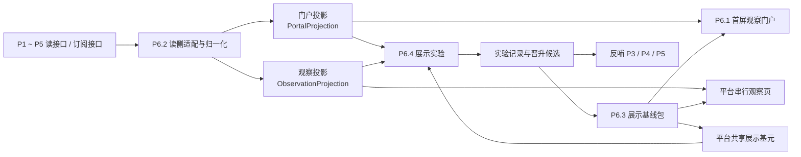
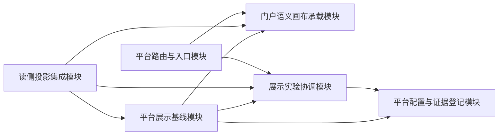
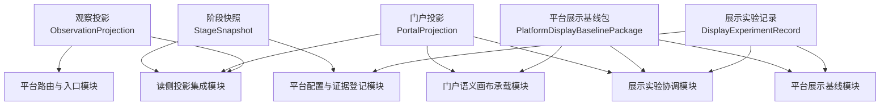
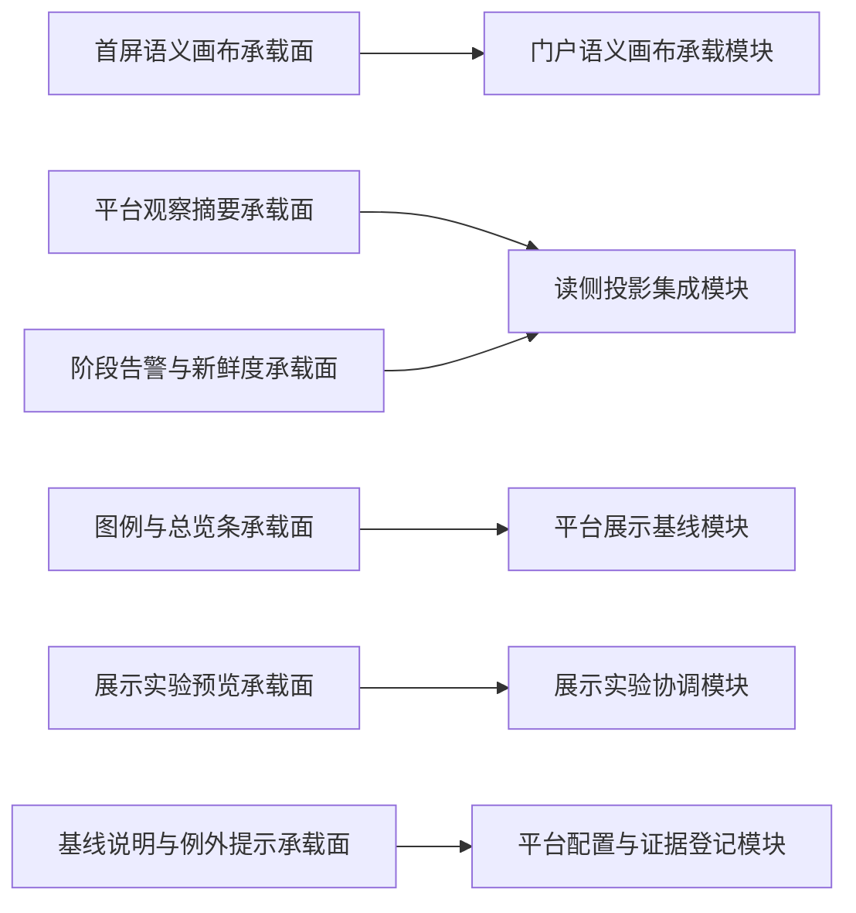

# P6 平台门户、观察与前端展示实验层设计

> 归档说明：本文件归档自 `docs/superpowers/specs/2026-04-17-portal-home-design.md`、`docs/superpowers/specs/2026-04-19-p6-stage-reframing-design.md` 与 `docs/superpowers/specs/2026-04-19-p6-detailed-subsystem-design.md`，作为 `P6` 节点的正式总体设计入口。凡涉及 `P6` 的阶段定位、总输入输出契约、跨专项边界、作用域切换和最小支撑机制，均以本文件为准。
>
> 维护规则：后续若在 `P6.1 ~ P6.4` 的 `brainstorming / specs / plans` 中继续细化设计，必须在同一轮同步回写本文件与对应专项设计文档；本文件优先于工作层文档，作为 `P6` 可评审口径的正式基线。

**日期：** 2026-04-21

**最近补正：** 2026-04-30，按 `P6` 语义画布 v17 及其前序 v15 / v16 原型事实源补正。

**对应节点：**
- `P6` 平台门户、观察与前端展示实验层
- `P6.1` 首屏观察门户
- `P6.2` 跨阶段只读集成与状态投影
- `P6.3` 设计语言与前端展示基线
- `P6.4` 前端展示工具化实验场

**关联正式文档：**
- `DOC/CODEX_DOC/02_设计说明/00_总纲/00-软件工厂平台总体设计.md`
- `DOC/CODEX_DOC/02_设计说明/P6_门户与平台入口/P6.1-首屏观察门户设计.md`
- `DOC/CODEX_DOC/02_设计说明/P6_门户与平台入口/P6.2-跨阶段只读集成与状态投影设计.md`
- `DOC/CODEX_DOC/02_设计说明/P6_门户与平台入口/P6.3-设计语言与前端展示基线设计.md`
- `DOC/CODEX_DOC/02_设计说明/P6_门户与平台入口/P6.4-前端展示工具化实验场设计.md`

**当前原型事实源：**
- `DOC/CODEX_DOC/08_原型与附图/2026-04-30-005207-CodeFactoryV2-P6语义画布流动与P3P5补充原型-v17/`
- `DOC/CODEX_DOC/08_原型与附图/2026-04-30-003923-CodeFactoryV2-P6语义画布端口用户对齐修正版-v16/`
- `DOC/CODEX_DOC/08_原型与附图/2026-04-30-001317-CodeFactoryV2-P6语义画布补充原型-v15/`

`v17` 已获得用户方向确认，可作为下一阶段 `/portal` 扩充开发的原型事实源；`v16` 继续作为端口小圆点和顶部用户对齐依据；`v15` 继续作为五阶段语义画布前序依据。上述确认不等同于已完成运行态实现验收，工程实现仍需按节点合同和验收方法自测。

## 1. 设计定位

`P6` 总体设计不能替代 `P6.1 ~ P6.4` 的专项设计。

`P6` 总文档必须单独锁定以下内容：

- `P6` 当前到底承担什么平台职责
- `P1 ~ P5 -> P6` 的正式只读输入到底是什么
- `P6` 对外到底产出哪些平台级投影、展示基线与实验结论
- `P6.1 ~ P6.4` 各自保存什么事实、负责什么模块、如何协同
- 登录与权限为什么属于 `P6.R1 / P6.R2` 的后置预留能力

`P6` 当前不是“登录 / 权限优先”的阶段，而是“观察、串联、统一和实验优先”的平台层。

## 2. 目标与边界

`P6` 的目标不是替代任何业务子系统，而是在 `P1 ~ P5` 之外形成一个稳定的平台层：

- 提供首屏观察门户
- 提供跨阶段只读集成与状态投影
- 承担平台级设计语言统一
- 承担前端展示工具化实验与验证

### 2.1 当前负责

- 独立门户路由与全屏观察画布
- `P1 ~ P5` 的只读状态串联与统一投影
- 在真实源尚未锁定前提供 `P6` 公共模拟状态源
- 平台级命名、状态表达、视觉 token 和共享展示基元基线
- 展示模板、绑定、布局和预设的实验验证
- 平台级展示结论向 `P3 / P4 / P5` 的反哺

### 2.2 当前不负责

- 真正登录页与完整认证链
- 复杂权限校验执行
- 对 `P1 ~ P5` 的业务写操作
- 跨阶段调度命令中心
- 多人协同编辑门户布局
- 把展示实验直接冻结成正式产品能力

### 2.3 两层结构

`P6` 当前固定采用“两层结构”。

第一层是稳定平台层：

- `P6.1` 首屏观察门户
- `P6.2` 跨阶段只读集成与状态投影
- `P6.3` 设计语言与前端展示基线

第二层是探索验证层：

- `P6.4` 前端展示工具化实验场

后置预留能力固定为：

- `P6.R1` 统一登录接入
- `P6.R2` 权限与角色控制

## 3. 输入输出契约

### 3.1 上游输入

`P6` 当前至少消费三类正式输入：

1. 阶段读侧输入
   - `P1 ~ P5` 的查询接口与后续订阅接口
   - 阶段摘要、入口状态、指标、健康度、告警摘要
2. 平台展示基线输入
   - `P6.3` 统一命名、状态文案、视觉 token、共享展示基元
3. 展示实验输入
   - `P6.4` 模板、绑定、布局、预设、实验记录

对 `P1 ~ P5` 的输入约束固定如下：

- 只允许消费规范化读接口或订阅接口
- 不允许直接读取阶段内部数据库
- 不允许直接抓取页面私有状态
- 不允许把临时脚本结果伪装成正式接口

在 `P1 ~ P5` 真实读接口尚未稳定前，`P6` 首版固定允许两种源模式：

- `mock`
  - 当前首版正式实现
  - 由 `P6.2.5 模拟状态源` 提供公共场景模板和投影结果
- `live`
  - 当前只保留正式接口位
  - 不得伪装为已接通状态

### 3.2 平台输出

`P6` 当前至少产出四类正式输出：

1. 门户级输出
   - `PortalProjection`
   - 五阶段系统运行态卡片、数据流连线、画布状态和图例解释
2. 观察级输出
   - `ObservationProjection`
   - 阶段串行观察、比对和告警摘要
3. 基线级输出
   - `PlatformDisplayBaselinePackage`
   - 命名、状态、token 和共享展示基元基线
4. 实验级输出
   - `DisplayExperimentRecord`
   - 展示晋升候选、实验结论与反哺建议

### 3.3 路由、命名与只读约束

`P6` 首版必须满足以下总约束：

- 首屏门户使用独立路由 `/portal`
- 串行观察页使用独立路由 `/observation`
- `P6` 自身不作为与 `P1 ~ P5` 并列的大业务对象进入门户语义画布
- 门户、串行观察和实验页都只能消费 `P6.2` 的只读投影
- `P6.4` 的实验结果只能通过结论反哺 `P3 / P4 / P5`，不能直接改写阶段内部事实

### 3.4 当前视觉事实源与实现约束

`P6` 当前设计稿把门户体验固定为“星空画布 + 按需浮出详情”的观察方式，而不是传统首页仪表盘。

正式实现和后续原型扩展必须遵守以下口径：

1. `/portal` 首屏本体是一张全屏星空画布，`P1 ~ P5` 的阶段关系、主数据流和运行态势是第一视觉对象。
2. 未选中状态不得把所有详情、抽屉、配置实验和关系规则堆在同一画面；只有用户选中阶段节点后，才允许浮出详情卡或右侧抽屉。
3. `P6.4` 卡片配置实验柜是独立实验页面，不放进 `/portal` 主画布。
4. 五阶段详情卡顶部的用户是动态接入用户，采用方形积木块表达；不得出现添加符号或手动维护成员的暗示。
5. 五阶段详情卡中段表达系统总体状态，即累计能力、累计承载或总体资产规模；当前输入、当前处理、当前评审、当前构建等运行量只能放入实时状态区、端口区或队列区。
6. `P6` 是观察接口，不是 `P1 ~ P5` 的阶段输出端口；不得把 `P6` 画成任一阶段的下游业务接口。
7. 主链固定为 `P1 -> P2 -> P3 -> P4 -> P5`；`P1` 只向 `P2` 供给发布态知识，`P5` 的终端输出为交付目录。
8. `P1` 的外部知识入库通过底部挂载队列表达，不再额外绘制外部入库箭头；`P3 -> P5` 可表达设计基线同步流，但不得替代 `P3 -> P4` 工单包流。

## 4. 平台总体闭环

## 5. 核心对象模型

对象模型回答的是“`P6` 平台层中有哪些稳定事实对象、它们各自保存什么数据”。

它不等于专项文档的全部细节，但必须固定 `P6` 总层的主对象边界。

### 5.1 阶段快照（Stage Snapshot / `StageSnapshot`）

`StageSnapshot` 是 `P6` 面向单个阶段的最小稳定快照。

最小字段至少包括：

- `stage_id`
- `stage_name`
- `summary`
- `status`
- `entry_route`
- `entry_available`
- `metrics`
- `system_overall_metrics`
- `live_counters`
- `flow_ports`
- `connected_users`
- `queue_projection`
- `health_level`
- `captured_at`
- `projection_at`

对象关系约束固定如下：

- 每个阶段在任一稳定时刻都应可被投影为 1 个当前快照
- 门户页和观察页都消费 `StageSnapshot` 的归一化结果，而不是阶段私有结构
- `metrics` 可用于兼容紧凑门户节点；详情卡必须优先使用 `system_overall_metrics`、`live_counters`、`flow_ports`、`connected_users` 和 `queue_projection`
- `system_overall_metrics` 只表达系统总体状态，不得混入当前批次、当前任务或短期待处理量

### 5.2 门户投影（Portal Projection / `PortalProjection`）

`PortalProjection` 是 `P6.1` 首屏门户消费的正式读模型。

最小字段至少包括：

- `node_list`
- `flow_list`
- `artifact_list`
- `portal_summary`
- `knowledge_context`
- `freshness`
- `degraded_reason`

对象关系约束固定如下：

- `PortalProjection` 由多个 `StageSnapshot` 聚合生成
- 个人布局只允许覆盖其渲染位置，不允许改写其语义内容
- `node_list` 在 `P6.1` 当前首屏只映射为 `P1 ~ P5` 五张系统运行态卡片，不扩展为独立行业用户对象或产物对象
- `artifact_list` 只允许作为终端输出、线内 payload 或低干扰注释输入，不作为门户主业务对象

### 5.3 观察投影（Observation Projection / `ObservationProjection`）

`ObservationProjection` 是平台串行观察面消费的正式读模型。

最小字段至少包括：

- `stage_cards`
- `comparison_items`
- `alert_summary`
- `route_actions`
- `focus_stage_id`
- `freshness`

对象关系约束固定如下：

- `ObservationProjection` 服务于顺序观察与跨阶段比对
- 它与 `PortalProjection` 共用上游快照，但不共用渲染结构

### 5.4 平台展示基线包（Display Baseline Package / `PlatformDisplayBaselinePackage`）

`PlatformDisplayBaselinePackage` 是 `P6.3` 对外提供的正式基线包。

最小字段至少包括：

- `token_set_id`
- `stage_naming_baseline_id`
- `status_copy_baseline_id`
- `shared_primitive_refs`
- `exception_rules`
- `version`

对象关系约束固定如下：

- 门户页、观察页和实验页都必须显式继承该基线包
- 阶段例外必须以 `exception_rules` 记录，不能靠口头约定

### 5.5 展示实验记录（Display Experiment Record / `DisplayExperimentRecord`）

`DisplayExperimentRecord` 是 `P6.4` 的正式事实对象。

最小字段至少包括：

- `experiment_id`
- `scenario`
- `template_refs`
- `binding_refs`
- `layout_refs`
- `result_summary`
- `promotion_recommendation`
- `target_stage_refs`
- `created_at`

对象关系约束固定如下：

- 实验记录只引用投影数据和展示基线，不直接持有阶段私有事实
- 实验通过后也只能产出晋升候选，不自动转为正式平台能力

## 6. 核心功能模块设计

模块设计回答的是“`P6` 总体层由哪些平台模块协同、各自负责什么动作、接什么输入、产什么输出”。

### 6.1 模块清单

`P6` 首版固定拆成以下 6 个总体模块：

1. 平台路由与入口模块（Platform Route and Entry）
2. 读侧投影集成模块（Read Projection Integration）
3. 门户语义画布承载模块（Portal Semantic Canvas Host）
4. 平台展示基线模块（Display Baseline Governance）
5. 展示实验协调模块（Display Experiment Coordination）
6. 平台配置与证据登记模块（Platform Config and Evidence Registry）

### 6.2 模块职责、输入和输出

| 模块 | 主要职责 | 可接受输入 | 产出输出 |
| --- | --- | --- | --- |
| 平台路由与入口模块 | 维护 `/portal` 及后续平台观察入口，确保不进入业务壳层 | 路由映射、入口配置 | 当前平台入口上下文 |
| 读侧投影集成模块 | 读取 `P1 ~ P5` 快照、或在首版读取 `P6` 公共模拟状态源，再归一化并聚合投影 | 查询接口、订阅接口、模拟场景模板、快照缓存 | `StageSnapshot`、`PortalProjection`、`ObservationProjection` |
| 门户语义画布承载模块 | 负责首屏语义画布、系统运行态卡片、数据流连线、图例解释和交互 | `PortalProjection`、布局配置、路由映射 | 门户卡片状态、数据流状态、交互状态 |
| 平台展示基线模块 | 管理 token、命名、状态文案和共享展示基元 | 平台基线规则、阶段例外规则 | `PlatformDisplayBaselinePackage` |
| 展示实验协调模块 | 组织模板、绑定、布局、预设和实验结论 | 展示模板、投影数据、基线包 | `DisplayExperimentRecord`、晋升候选 |
| 平台配置与证据登记模块 | 管理图例、推荐布局、实验证据和例外规则登记 | 平台配置、实验结论、验收规则 | 配置快照、证据登记记录 |

### 6.3 模块依赖关系图

## 7. 对象模型与模块设计关系

对象不是模块，模块也不是对象。

- 对象负责保存平台事实
- 模块负责消费平台事实、产出新事实、推进状态变化

### 7.1 对象归属映射

| 对象 | 主要归属模块 | 被哪些模块消费 |
| --- | --- | --- |
| `StageSnapshot` | 读侧投影集成模块 | 门户语义画布承载模块、展示实验协调模块、平台配置与证据登记模块 |
| `PortalProjection` | 读侧投影集成模块 | 门户语义画布承载模块、展示实验协调模块 |
| `ObservationProjection` | 读侧投影集成模块 | 平台路由与入口模块、展示实验协调模块 |
| `PlatformDisplayBaselinePackage` | 平台展示基线模块 | 门户语义画布承载模块、展示实验协调模块、平台配置与证据登记模块 |
| `DisplayExperimentRecord` | 展示实验协调模块 | 平台展示基线模块、平台配置与证据登记模块 |

### 7.2 对象与模块关系图

## 8. 数据来源、作用域与切换规则

### 8.1 三层数据作用域

`P6` 首版固定区分三层平台作用域：

1. 平台全局参考层
   - `P1 ~ P5` 当前稳定快照
   - 平台路由映射
   - 命名、状态、token 和共享展示基元基线
   - 实验模板与预设登记
2. 当前观察作用域层
   - 当前 `PortalProjection`
   - 当前 `ObservationProjection`
   - 当前聚焦阶段
   - 当前告警、健康和新鲜度状态
3. 当前实验作用域层
   - 当前选中的模板、绑定、布局和预设
   - 当前实验预览结果
   - 当前实验记录和晋升建议

### 8.2 切换平台观察焦点时的替换规则

当 `current_stage_focus` 或 `current_platform_view` 被切换时，必须整体替换当前观察作用域层中的以下数据：

- 当前聚焦阶段
- 当前观察卡片序列
- 当前门户高亮状态
- 当前告警摘要
- 当前路由动作提示

以下数据不应因为切换观察焦点而丢失：

- 平台全局参考层中的阶段快照
- 平台展示基线包
- 实验模板与预设列表
- 图例、枚举和说明类配置

### 8.3 展示基线和实验结果对作用域的影响

展示基线的生效规则固定如下：

- 基线包写入平台全局参考层
- 门户页、观察页和实验页都只能继承，不直接篡改
- 阶段例外必须以显式规则登记，不能在页面层临时硬编码

实验结果的生效规则固定如下：

- 实验记录只写入当前实验作用域层和证据登记层
- 实验通过只能生成晋升候选，不直接改写平台全局基线
- 晋升候选被采纳后，才允许进入新的基线包版本

## 9. 页面级交互设计与模块映射

### 9.1 页面入口与壳层

`P6` 当前首版平台入口固定为 `/portal`。

后续可补充：

- 串行观察页
- 展示实验页或实验区

这些页面必须满足：

- 不进入普通业务壳层
- 不在平台层直接承载业务编辑动作
- 不把说明性大表头放在主画布或主观察链之前

### 9.2 风格继承与门户例外

`P6` 总体层不单独定义与 `P6.3` 相冲突的新视觉风格。

总层只固定两件事：

1. 所有平台页面必须继承 `P6.3` 的统一设计语言
2. 允许门户、观察、实验三类页面存在有限的局部例外

当前局部例外固定为：

- 门户页允许使用全屏语义画布与世界坐标语义
- 串行观察页允许使用更强的顺序卡片编排
- 实验页允许出现绑定、布局和预览型工具面板

### 9.3 平台承载面

`P6` 首版平台承载面固定为 6 类：

1. 首屏语义画布承载面
2. 平台观察摘要承载面
3. 图例与总览条承载面
4. 阶段告警与新鲜度承载面
5. 展示实验预览承载面
6. 基线说明与例外提示承载面

### 9.4 承载面到模块映射

| 平台承载面 | 对应模块 | 读取数据 | 写入数据 | 会影响的后续模块 |
| --- | --- | --- | --- | --- |
| 首屏语义画布承载面 | 门户语义画布承载模块 | `PortalProjection`、布局配置、路由映射 | 当前卡片交互状态、个人布局偏好 | 平台配置与证据登记模块 |
| 平台观察摘要承载面 | 读侧投影集成模块 | `ObservationProjection`、阶段快照 | 当前聚焦阶段 | 门户语义画布承载模块、展示实验协调模块 |
| 图例与总览条承载面 | 平台展示基线模块 | 基线包、图例配置、平台指标 | 无直接写入 | 门户语义画布承载模块、平台配置与证据登记模块 |
| 阶段告警与新鲜度承载面 | 读侧投影集成模块 | 健康度、告警、降级状态 | 当前告警查看状态 | 平台路由与入口模块 |
| 展示实验预览承载面 | 展示实验协调模块 | 模板、绑定、布局、投影数据 | `DisplayExperimentRecord` | 平台展示基线模块、平台配置与证据登记模块 |
| 基线说明与例外提示承载面 | 平台配置与证据登记模块 | 基线版本、例外规则、证据登记 | 例外登记、证据链接 | 平台展示基线模块 |

### 9.5 页面-模块关系图

### 9.6 关键交互

平台层至少支持以下关键交互：

- 在门户页单击阶段卡片进行高亮观察
- 在门户页双击阶段卡片，在新标签页打开稳定模块
- 在串行观察面切换阶段聚焦与对比视角
- 在图例与总览条中查看当前知识库、告警与新鲜度状态
- 在实验面中完成模板选择、绑定配置、布局组合和结果登记

## 10. 最小支撑服务与机制设计

`P6` 首版至少需要以下查询服务与支撑机制族：

### 10.1 平台读侧投影查询

- `GET /api/p6/mock-scenarios`
- `GET /api/p6/stage-snapshots?source=<mode>&scenario=<id>`
- `GET /api/p6/portal-projection?source=<mode>&scenario=<id>`
- `GET /api/p6/observation-projection?source=<mode>&scenario=<id>`

其中：

- `mode` 固定预留为 `mock | live`
- 首版只正式实现 `mock`
- `scenario` 首版固定支持 `baseline / review-pressure / delivery-gap`

### 10.2 平台配置与展示基线

- `GET /api/platform-config/display-baseline`
- `GET /api/platform-config/routes`
- `GET /api/platform-config/legend`

### 10.3 展示实验与证据登记

- `GET /api/platform-display/workbench`
- `POST /api/platform-display/experiments`
- `GET /api/platform-display/experiments`
- `GET /api/platform-display/promotion-candidates`

### 10.4 本地布局与个人偏好机制

`P6` 当前允许保留以下本地机制：

- 门户推荐布局与个人布局的本地切换
- 门户视口状态与流视图模式的本地记忆
- 只读展示开关的本地偏好保存

但这些机制只能覆盖前端显示偏好，不允许改变平台语义和阶段事实。

## 11. 验收口径

`P6` 只有同时满足以下条件，才算达到可评审状态：

1. `P6` 总文档已明确固定“稳定平台层 + 探索验证层”的两层结构。
2. `P1 ~ P5 -> P6` 的只读输入边界已在正式设计中写清。
3. `P6` 已明确产出门户投影、观察投影、展示基线包和实验记录四类正式输出。
4. `P6.1 ~ P6.4` 的对象边界、模块边界和协同关系已形成统一口径。
5. `P6` 的作用域切换规则已明确区分平台全局参考层、观察作用域层和实验作用域层。
6. 登录 / 权限已继续保留为 `P6.R1 / P6.R2` 后置能力，不占据当前主线。
7. `P6` 在真实源未稳定前，已明确采用公共模拟状态源作为首版正式读源。

## 12. 与后续节点的关系

- `P6.1` 负责把 `PortalProjection` 落成正式门户画布
- `P6.2` 负责把 `P1 ~ P5` 的读侧契约收敛成平台投影层
- `P6.3` 负责把平台级命名、状态、token 和展示基元收敛成正式基线
- `P6.4` 负责把展示能力的模板、绑定、布局和预设做成可评估实验对象
- `P6.R1 / P6.R2` 在当前主线验收之后再承担统一登录与权限控制

因此，登录和权限不能回流重写当前 `P6` 的阶段定位。

## 13. 风格继承与门户例外

`P6` 总体层默认继承以下正式基线：

- `DOC/CODEX_DOC/02_设计说明/P6_门户与平台入口/P6.3-设计语言与前端展示基线设计.md`
- `DOC/CODEX_DOC/02_设计说明/00_总纲/00-软件工厂平台总体设计.md` 中对平台级信息表达的约束

`P6` 只允许定义以下总体层例外：

- 门户页可以使用语义画布、网格、pin、流光和世界坐标表达
- 串行观察页可以使用更顺序化的卡片链路，而不必完全复刻门户画布
- 实验页可以暴露绑定、布局和预览型操作面板，但不得演化成阶段业务工作台

## 14. 正式文档关系

本节点的正式文档关系固定为：

- 平台总体设计：`DOC/CODEX_DOC/02_设计说明/00_总纲/00-软件工厂平台总体设计.md`
- 阶段计划：`DOC/CODEX_DOC/04_研制计划/06-WBS-P6-门户与平台入口-研制计划.md`
- 专项设计：
  - `DOC/CODEX_DOC/02_设计说明/P6_门户与平台入口/P6.1-首屏观察门户设计.md`
  - `DOC/CODEX_DOC/02_设计说明/P6_门户与平台入口/P6.2-跨阶段只读集成与状态投影设计.md`
  - `DOC/CODEX_DOC/02_设计说明/P6_门户与平台入口/P6.3-设计语言与前端展示基线设计.md`
  - `DOC/CODEX_DOC/02_设计说明/P6_门户与平台入口/P6.4-前端展示工具化实验场设计.md`
- 工作层设计：
  - `docs/superpowers/specs/2026-04-17-portal-home-design.md`
  - `docs/superpowers/specs/2026-04-19-p6-stage-reframing-design.md`
  - `docs/superpowers/specs/2026-04-19-p6-detailed-subsystem-design.md`

本文件只负责 `P6` 的阶段定位、总契约、总对象模型和专项入口；后续若继续补充门户画布、只读投影、展示基线或实验机制，应优先回写对应专项设计，而不是把全部细节继续回灌到本总文档中。
