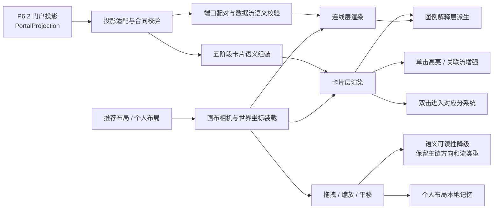
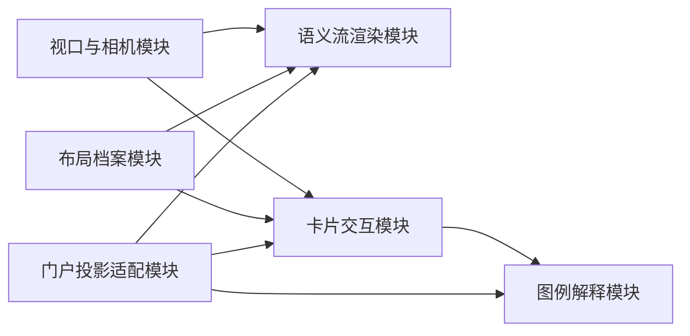
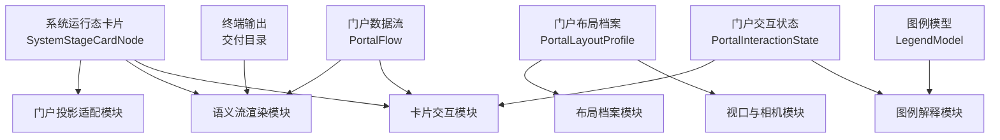
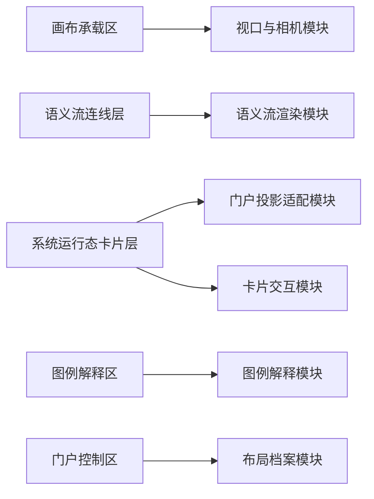

# P6.1 首屏观察门户设计

> 归档说明：本文件归档自 `docs/superpowers/specs/2026-04-17-portal-home-design.md` 与 `docs/superpowers/specs/2026-04-19-p6-detailed-subsystem-design.md`，作为 `P6.1` 节点的正式专项设计入口。凡涉及 `/portal` 的页面身份、投影输入、对象模型、布局模式、交互约束和最小支撑机制，均以本文件为准。
>
> 维护规则：后续若在 `P6.1` 的 `brainstorming / specs / plans` 中继续细化语义画布、系统卡片、数据流连线、图例解释或布局机制，必须在同一轮同步回写本文件；本文件优先于工作层文档，作为 `P6.1` 可评审口径的正式基线。

**日期：** 2026-04-21

**对应节点：**
- `P6.1` 首屏观察门户

**关联正式文档：**
- `DOC/CODEX_DOC/02_设计说明/P6_门户与平台入口/P6-门户与平台入口设计.md`
- `DOC/CODEX_DOC/02_设计说明/P6_门户与平台入口/P6.2-跨阶段只读集成与状态投影设计.md`
- `DOC/CODEX_DOC/02_设计说明/P6_门户与平台入口/P6.3-设计语言与前端展示基线设计.md`
- `DOC/CODEX_DOC/02_设计说明/P6_门户与平台入口/P6.4-前端展示工具化实验场设计.md`

## 1. 设计定位

`P6.1` 不是普通业务页，也不是“系统首页大卡片”。

`P6.1` 必须单独锁定以下内容：

- 平台首屏入口到底承载哪些稳定展示要素
- 门户到底消费什么投影数据和展示合同
- 卡片、连线、画布和图例如何协同
- 单击、双击、拖拽、缩放和流视图切换各自如何生效
- 推荐布局和个人布局的边界到底在哪里

`P6.1` 是 `P6` 稳定平台层中的首个正式实现对象，负责把 `P1 ~ P5` 的阶段关系、主数据流、阶段入口和运行摘要，以可缩放语义画布的方式呈现给用户。

### 1.1 展示形式的本质定义

`P6.1` 的本质不是“首页导航”，而是 `P1 ~ P5` 五阶段系统运行态的可缩放语义画布。

它要回答的核心问题是：

- 哪些分系统正在运行；
- 每个分系统当前被谁接入；
- 每个分系统累计承载了什么、产出了什么；
- 当前有什么知识、规格、工单、工具或交付目录正在流动；
- 这些对象从哪里来、到哪里去；
- 哪条链路通畅、变慢、阻塞或降级；
- 当前视口只是整体画布的一部分，还是足以观察完整主链。

因此，`P6.1` 不能按传统后台首页、流程列表或静态架构图设计。它必须把“运行态”和“流动关系”作为第一表达对象。

### 1.2 四类展示要素

`P6.1` 首屏只承认四类核心展示要素：

| 要素 | 定义 | 为什么存在 | 设计优先级 |
| --- | --- | --- | --- |
| 卡片 | 一个分系统运行态节点 | 承载“这个系统当前是什么状态、谁在用、接入什么、输出什么” | 核心业务要素 |
| 连线 | 分系统之间的数据流通道 | 承载“什么对象从哪个端口流向哪个端口、速率和健康状态如何” | 核心业务要素 |
| 画布 | 可缩放、可平移的观察空间 | 承载五阶段关系、局部放大、全局观察和空间组织 | 承载要素 |
| 图例 | 语义解释器 | 解释卡片、连线、端口、粒子、颜色和状态符号 | 解释要素 |

其中，卡片和连线是业务意义的主体；画布只是承载方式；图例只是解释方式。所谓“背景面板”不是独立要素，只能作为画布视觉风格的一部分，不得抢占卡片和连线的主表达。

### 1.3 能展示什么与不能展示什么

`P6.1` 能展示：

- 五阶段主链和每个分系统的运行态；
- 各分系统顶部接入用户；
- 各分系统总体累计指标；
- 实时输入、输出和处理计数；
- 端口级连接对象；
- 底部队列或挂载对象；
- 阶段间数据流类型、方向、速率和健康状态；
- 在缩放层级允许时展示局部细节。

`P6.1` 不展示：

- `P1 ~ P5` 内部编辑表单；
- 每条原始知识、需求、工单或构建尝试的完整列表；
- 需要大量操作的配置实验柜；
- 破坏五阶段主链观察的常驻大面板；
- 没有合同字段或正式设计依据支撑的临时装饰符号。

对于海量对象，`P6.1` 只展示聚合后的运行态和流动指标；原始明细必须通过双击进入对应分系统或后续浮动详情承接。

## 2. 目标与边界

`P6.1` 的目标不是造一个“能看见模块的首页”，而是形成一张可观察、可跳转、可维持结构语义的正式门户语义画布。

### 2.1 当前负责

- 独立路由 `/portal`
- 全屏、可拖拽、可缩放的语义画布
- `P1 ~ P5` 五张系统运行态卡片的统一表达
- `P1 -> P2 -> P3 -> P4 -> P5 -> 交付目录` 主链数据流的统一表达
- 顶部接入用户积木、底部挂载队列、左右端口和总体 / 实时指标的卡片内表达
- 单击高亮、双击进入模块、流视图切换
- 推荐布局与个人布局的显式切换
- 右上角低干扰数据源 / 场景切换控件
- 低干扰、自适应的图例解释层

### 2.2 当前不负责

- 在门户页直接编辑业务数据
- 弹窗式摘要中心
- 在门户画布中承载 `P6.4` 展示配置实验柜
- 登录与权限流程
- 多人协同编辑布局
- 对 `P1 ~ P5` 反写状态
- 任意增删五阶段系统卡片

### 2.3 门户硬约束

`P6.1` 首版固定遵守以下硬约束：

- 单击卡片只做高亮，不打开遮挡主画布的详情弹窗
- 双击系统卡片直接进入稳定模块路由
- 门户主卡片固定为 `P1 ~ P5` 五个系统运行态卡片；行业用户内化为 `P2` 等系统卡顶部接入用户积木
- 连线必须从端口锚点 / pin 出发，而不是从卡片中心出发
- 个人布局只允许覆盖位置和视口偏好，不允许覆盖卡片、端口和连线语义
- 模拟数据源切换放在门户控制区；当 `P1 ~ P5` 真实读源未完成时，允许提供独立合同模拟器页面向 `P6.2` 提交约定展示合同

### 2.4 画布与缩放约束

画布是动态视口，不是固定 `1920 x 1080` 图片，也不是一个可见的固定背景框。

画布必须遵守以下约束：

- 浏览器视口变化时，画布背景必须铺满整个可见区域。
- `1920 x 1080` 只作为默认桌面原型和推荐布局验证规格，不得作为运行页面的可见边框。
- 默认视口下必须能理解 `P1 -> P2 -> P3 -> P4 -> P5` 主链。
- 缩小时优先保留卡片标题、主链方向和流类型；允许隐藏端口细节、队列标签和小指标。
- 正常视距下展示卡片、端口、流速、用户积木和队列概览。
- 放大时允许展示端口来源、队列项、指标依据和更多局部细节。
- 小屏或窄屏不得强塞完整桌面细节，应降级为“主链关系 + 聚焦卡片 + 流说明”的层级观察。
- 控制区、图例、抽屉和实验台不得长期遮挡核心主链。

缩放层级的设计目标不是简单等比缩小，而是保持运行态语义可读。

## 3. 输入输出契约

### 3.1 门户投影输入

`P6.1` 的主输入不是阶段私有接口，而是 `P6.2` 输出的 `PortalProjection`。

`P6.1` 首版至少消费以下输入：

- `node_list`
- `flow_list`
- `artifact_list`
- `portal_summary`
- `knowledge_context`
- `freshness`
- `degraded_reason`

其中，`node_list` 在首屏展示语义中只允许生成五张系统运行态卡片；`artifact_list` 只允许作为终端输出、线内 payload、轻量注释或未来扩展输入，不得在当前首屏中扩展成与五阶段卡片并列的主业务对象。

### 3.2 卡片显示输入

`P6.1` 的卡片显示输入必须直接来自 `P6.2` 已固定的状态输出契约，而不是由前端页面临时决定。

系统运行态卡片统一至少消费以下显示字段：

- `headline_value`
- `summary_line`
- `metric_items`
- `system_overall_metric_items`
- `live_counter_items`
- `flow_port_items`
- `connected_user_items`
- `queue_projection`
- `display_binding`
- `source_trace`
- `entry_badge`
- `health_badge`
- `timestamp_label`
- `degraded_hint`

参与用户信息首版不作为独立门户对象消费，而是通过 `connected_user_items` 进入系统状态卡顶部。独立参与用户对象只作为后续扩展方向保留，不参与当前五卡片首屏主链。

门户页可以决定这些字段如何排版，但不能改变它们的含义。

### 3.3 布局与视口输入

`P6.1` 首版至少具备以下布局与视口输入：

- `RecommendedLayoutProfile`
- `PersonalLayoutProfile`
- `viewport_state`
- `flow_view_mode`
- `layout_mode`
- `source_mode`
- `scenario_id`

其中：

- `RecommendedLayoutProfile` 由系统提供推荐世界坐标
- `PersonalLayoutProfile` 只覆盖卡片位置和视口偏好

### 3.4 交互状态输出

`P6.1` 每次交互至少输出两层结果：

1. 当前门户交互状态
   - `selected_card_id`
   - `hovered_card_id`
   - `active_flow_view`
   - `camera_state`
2. 当前路由跳转动作
   - `route_target`
   - `route_hint`
   - `route_available`

### 3.5 门户级展示输出

`P6.1` 每次稳定渲染至少形成以下展示输出：

1. 卡片层输出
   - `P1 ~ P5` 五张系统运行态卡片
   - 卡片顶部方形接入用户积木
   - 卡片底部挂载 / 队列对象
   - 卡片左右输入输出端口；其中 `P1` 不显示左侧外部入库端口，外部知识入库由底部知识挂载队列表达
   - 总体累计指标与实时流动计数
2. 连线层输出
   - `P1 -> P2` 知识供给流
   - `P2 -> P3` 需求规格流
   - `P3 -> P4` 模块工单包流
   - `P3 -> P5` 设计基线流
   - `P4 -> P5` 工具供给流
   - `P5 -> 交付目录` 终端交付目录输出流
   - 每条阶段间连线必须具备可感知的流动对象表达，例如小标签、粒子、对象点或象形符号
3. 画布层输出
   - 当前视口与缩放状态
   - 推荐布局或个人布局位置
   - 缩放层级下的显示降级结果
4. 图例层输出
   - 卡片区域语义说明
   - 连线语义、流向、粒子、颜色和健康状态说明
   - 新鲜度、降级和模拟源说明

## 4. 门户最小闭环总流程

这个闭环的重点不是“先画图元再补线”，而是先确认五阶段卡片和端口语义成立，再渲染卡片、连线、画布和图例。若 `P6.2` 无法把相邻端口配成合法 `PortalFlow`，门户页只能展示降级提示，不允许前端为了画面完整自行补造业务连线。

## 5. 核心对象模型

对象模型回答的是“门户页中有哪些稳定事实对象、它们各自保存什么数据”。

它不等于页面模块设计，但必须锁定门户级对象边界。

### 5.1 门户对象总原则

`P6.1` 的业务主体不是泛化的“节点”，而是系统运行态卡片和阶段间数据流连线。

当前首屏对象边界固定如下：

| 对象 | 视觉名称 | 业务地位 | 当前首屏边界 |
| --- | --- | --- | --- |
| `SystemStageCardNode` | 卡片 | 核心业务对象 | 固定 5 张，对应 `P1 ~ P5` |
| `PortalFlow` | 连线 | 核心业务对象 | 固定主链流、`P3 -> P5` 设计基线流和 `P5 -> 交付目录` 终端流 |
| `PortalLayoutProfile` | 布局档案 | 承载对象 | 只记录卡片位置和相机状态 |
| `PortalInteractionState` | 交互状态 | 页面状态对象 | 只记录选中、悬停、视图和路由动作 |
| `LegendModel` | 图例模型 | 解释对象 | 由卡片字段和连线语义派生 |

`PortalProjection.node_list` 是接口技术字段，不等同于“画布上可以任意新增业务对象”。首版只能把 `P1 ~ P5` 映射为五张系统卡片；参与用户、知识挂载、终端交付目录和流转对象必须分别进入卡片内部区域、连线 payload、终端出口或低干扰注释，不得扩展成与五阶段卡片并列的主对象。

对象关系约束固定如下：

- 卡片和连线共同构成首屏业务语义主体。
- 画布和图例不能成为业务主体，只能承载或解释卡片与连线。
- 只有具备稳定路由的系统卡片才允许双击进入模块。
- 技术实现若保留 `PortalNode` 命名，必须在语义上限定为系统卡片投影，不得重新引入独立行业用户对象或产物对象。

### 5.2 系统状态卡节点（System Stage Card Node / `SystemStageCardNode`）

系统状态卡节点在视觉上称为“卡片”。卡片不是普通信息卡，也不是静态流程图节点；它对应一个分系统运行态节点，是 `P6.1` 的核心业务要素。

一张卡片必须回答：

- 当前分系统是什么；
- 当前谁在接入它；
- 这个分系统累计承载和产出了什么；
- 当前正在输入、处理或输出什么；
- 它通过哪些端口和上下游交换对象；
- 它底部正在挂载、吸收或排队处理哪些对象。

每个系统状态卡节点固定采用 7 层信息结构：

1. 顶部接入层
   - `connected_user_items`
   - 方形用户积木，表示当前正在接入该系统的角色或用户
2. 左右端口层
   - `flow_port_items`
   - 左侧输入端口、右侧输出端口，必须绑定主链上下游
   - `P1` 是显式例外：首屏画布不渲染左侧外部知识入库端口，底部挂载队列就是外部知识入库的视觉输入表达
3. 标题层
   - 正式阶段名称
   - `headline_value`
   - 入口可用性标记
4. 总体状态层
   - `system_overall_metric_items`
   - 展示整个分系统的累计承载和累计产出
5. 实时流动层
   - `live_counter_items`
   - 展示正在输入、正在输出或正在处理的数据量
6. 状态页脚层
   - `primary_status`
   - `freshness`
   - `degraded_hint`
   - `health_badge`
   - `timestamp_label`
7. 底部挂载层
   - `queue_projection`
   - 以挂钩 / 队列形式表达知识或对象被顺序吸收，完成后后续项前移

系统状态卡节点的样式结构固定如下：

- 以矩形状态卡为主形态
- 当前五节点同屏推荐宽度约 `356px`、高度约 `276px`
- 使用平台浅色卡面、细边框和阶段识别色强调条
- 保留 pin / 锚点可见性
- 不使用大面积英雄横幅式渐变

状态变化时的视觉行为固定如下：

- 默认态：清晰边框、轻阴影、指标可读
- 悬停态：边框和阴影轻度增强
- 选中态：外环强调、相关连线同步增强
- 降级态：显示降级提示，不隐藏卡片
- 阻塞 / 异常态：通过状态标签和辅助描边表达，不改变卡片基本结构

### 5.3 五阶段系统卡片差异字段

五张系统卡片在门户页中不能只用一套完全同构的文案。

统一骨架相同，但各自必须突出不同的主信息：

| 阶段 | 总体状态优先信息 | 实时流动优先信息 | 端口与队列 |
| --- | --- | --- | --- |
| `P1` | 知识库、已发布知识、领域、贡献者 | 正在入库、供给 `P2` | 不显示左侧外部输入端口；底部知识挂载队列表达外部知识入库、排队吸收和顺序前移；右侧发布态知识只输出到 `P2` |
| `P2` | 支持软件、需求规格、业务对象 | 知识接入、规格输出 | 左接 `P1`；右接 `P3`；行业用户显示为顶部用户积木 |
| `P3` | 支持软件、设计基线、工单包 | 规格接入、工单输出、设计基线同步 | 左接 `P2`；右接 `P4` 输出模块工单包；另有 `P3 -> P5` 设计基线流；底部设计生成队列 |
| `P4` | 工具定义、领域目录、供给结果 | 正在匹配、工具供给 | 左接 `P3`；右接 `P5`；底部工具供给队列 |
| `P5` | 支持软件、交付版本、构建尝试 | 正在装配、目录输出 | 左接 `P4` 工具供给，同时接收 `P3` 设计基线流；右侧终端输出 `交付目录` |

门户页必须保证：

- `P1 ~ P5` 的标题结构一致
- 差异信息只体现在状态卡内部字段，不体现在卡片骨架随意漂移
- `P4 / P5` 不得因为信息更复杂而无限加高卡片

### 5.4 接入用户积木与未来扩展

当前首屏不再绘制独立 `行业用户` 对象。用户角色以 `connected_user_items` 的方式绑定在对应系统卡顶部，采用方形积木显示，表达“当前这个分系统正在被谁使用”。

顶部用户积木固定显示：

- `display_label`
- `role_label`
- `activity_state`
- `connected_at`

用户积木的设计约束固定如下：

- 采用方形小块而不是圆形头像或添加按钮。
- 只表达当前接入状态，不提供手工添加入口。
- 多个用户积木允许在卡片顶部横向排列或轻量堆叠，但不得把卡片主体挤出视口。
- 行业用户作为 `P2` 等卡片顶部接入对象表达，不再占用画布单独位置。
- 独立参与用户对象仅作为未来扩展方向保留；当前首屏不得渲染独立参与用户图层。

### 5.5 门户数据流（Portal Flow / `PortalFlow`）

门户数据流在视觉上称为“连线”。连线不是装饰线，也不是普通依赖关系线；它对应一个阶段间数据流通道，是 `P6.1` 的核心业务要素。

每条连线必须回答：

- 从哪张卡片的哪个端口出来；
- 进入哪张卡片的哪个端口；
- 正在输送什么对象；
- 当前速率是多少；
- 当前健康状态是什么；
- 方向如何表达；
- 是否存在阻塞、降级或终端输出。

最小字段至少包括：

- `flow_id`
- `from_node_id`
- `to_node_id`
- `semantic_type`
- `direction`
- `from_pin`
- `to_pin`
- `render_tone`
- `payload_label`
- `current_rate`
- `health_level`
- `symbol_hint`

对象关系约束固定如下：

- 每条连线都必须声明语义类型
- 连线几何计算必须依附端口锚点，而不是依附卡片中心
- 连线语义必须与起点卡片输出端口、终点卡片输入端口一致
- 连线颜色、线型、粒子和象形符号必须从 `semantic_type` 和 `payload_label` 派生，不能为了视觉装饰任意添加
- 连线上必须有可感知的 payload 流动表达；可以是小对象标签、粒子、点状涌动或象形符号，但不能退化成静态装饰线或静态线名
- `flow.label` 这类通道名称只用于接口语义、调试和图例解释，不作为主画面默认可见标签；主画面可见对象必须是由 `payload_label` 和 `current_rate` 生成的运动 payload 实例
- 运动 payload 数量必须从起点阶段输出端口 `current_rate` 或对应输出类 `live_counters` 派生；例如 `P1 -> P2` 为 `5 条/小时` 时，主画面应生成 5 个“知识”对象沿路径从 P1 输出端流向 P2 输入端
- 端口本身采用小圆点 / pin 表达，不得把“输入外部知识、输出到某系统”等大标签堆在端口旁边
- `P5 -> 交付目录` 是终端输出流，可以连接到终端出口或边界出口，但不能伪装成另一个分系统卡片

首版连线语义固定如下：

| 主链 | 连线语义 | 输送对象 | 推荐视觉表达 | 可挂象形符号 |
| --- | --- | --- | --- | --- |
| `P1 -> P2` | `knowledge_supply` | 发布态知识 | 绿色系、可用虚线或细粒子表示知识持续供给 | 知识点 / 小球 / 文档粒子 |
| `P2 -> P3` | `requirement_to_design` | 需求规格 | 蓝色系、实线箭头表示规格进入设计 | 规格页 / 清单 |
| `P3 -> P4` | `work_order_package` | 模块工单包 | 设计强调色、包裹粒子表示工单包进入工具匹配 | 工单包 / 模块块 |
| `P3 -> P5` | `design_baseline_to_build` | 设计基线 | 粉色或设计强调色、细虚线、基线对象粒子表示可构建设计同步 | 基线 / 设计片段 |
| `P4 -> P5` | `tool_supply` | 工具供给 | 工具强调色、工具粒子表示工具供给进入构建执行 | 工具 / 扳手符号 |
| `P5 -> 交付目录` | `delivery_catalog_output` | 交付目录 | 终端出口线或终端端口，表示目录输出 | 目录 / 出口符号 |

象形符号只允许辅助理解输送对象，不得替代图例、速率信息和流语义；端口旁不放大段文字说明，避免遮挡五卡同屏布局。
当单条连线的真实对象数超过首屏可读预算时，允许进入密度降级，但必须保留真实源数值并显式记录降级状态；不得把抽样数量伪装成真实数量。

### 5.6 终端输出与轻量注释（Terminal Output and Annotation）

当前首屏不把产物建模为与系统卡片并列的主对象。阶段间流转对象优先作为 `PortalFlow.payload_label`、粒子、速率和象形符号表达。

只有两类非卡片对象允许出现在画布上：

1. 终端输出
   - 只用于 `P5 -> 交付目录`
   - 可表现为右侧终端端口、出口标识或画布边界出口
   - 不具备分系统卡片身份，不可双击进入 `P1 ~ P5` 并列模块
2. 轻量注释
   - 只用于解释当前降级、新鲜度、模拟源或评审提示
   - 视觉权重必须低于卡片和连线
   - 不得截断或遮挡五阶段主链

对象关系约束固定如下：

- `artifact_list` 若存在，只能被映射为终端输出、线内 payload 或轻量注释。
- 不得把需求规格、模块工单包、工具供给等中间对象画成独立对象来补足画面。
- 轻量注释允许随卡片或连线高亮联动，但不允许篡改底层 `PortalFlow` 语义。

### 5.7 门户布局档案（Portal Layout Profile / `PortalLayoutProfile`）

门户布局档案记录推荐布局和个人布局的正式边界。

最小字段至少包括：

- `profile_id`
- `profile_kind`
- `card_positions`
- `camera_state`
- `updated_at`

对象关系约束固定如下：

- `system` 布局是推荐布局来源
- `personal` 布局只允许覆盖位置和视口状态
- 两者切换时，不允许导致卡片、端口和连线语义变化

### 5.8 门户交互状态（Portal Interaction State / `PortalInteractionState`）

门户交互状态是页面级当前读写状态对象。

最小字段至少包括：

- `selected_card_id`
- `hovered_card_id`
- `layout_mode`
- `flow_view_mode`
- `camera_state`
- `route_target`

对象关系约束固定如下：

- 交互状态只属于当前页面作用域
- 交互状态不回写 `PortalProjection` 的语义数据

## 6. 核心功能模块设计

模块设计回答的是“谁负责处理门户页的投影、卡片、连线、画布、交互和图例动作”。

### 6.1 模块清单

`P6.1` 首版固定拆成以下 6 个核心功能模块：

1. 门户投影适配模块（Portal Projection Adapter）
2. 视口与相机模块（Viewport and Camera）
3. 布局档案模块（Layout Profile Manager）
4. 语义流渲染模块（Semantic Flow Renderer）
5. 卡片交互模块（Card Interaction Controller）
6. 图例解释模块（Legend Presenter）

### 6.2 模块职责、输入和输出

| 模块 | 主要职责 | 可接受输入 | 产出输出 |
| --- | --- | --- | --- |
| 门户投影适配模块 | 把 `PortalProjection` 转成五张系统卡片、主链数据流、终端输出和图例事实 | `PortalProjection`、卡片状态负载、路由映射 | `SystemStageCardNode`、`PortalFlow`、终端输出、`LegendModel` |
| 视口与相机模块 | 维护世界坐标、平移、缩放和边界 | 视口尺寸、相机状态、拖拽动作 | 当前 `camera_state` |
| 布局档案模块 | 管理推荐布局与个人布局切换、恢复和保存 | 推荐布局、个人布局、卡片拖拽结果 | `PortalLayoutProfile`、当前 `layout_mode` |
| 语义流渲染模块 | 根据卡片位置和端口锚点渲染数据流连线 | `PortalFlow`、卡片位置、流视图模式 | 连线路径、流向、粒子和健康态 |
| 卡片交互模块 | 处理单击高亮、双击跳转和悬停联动 | 卡片事件、路由映射、交互状态 | `PortalInteractionState`、路由动作 |
| 图例解释模块 | 解释卡片区域、连线语义、端口、粒子、颜色、健康态和降级状态 | `LegendModel`、门户摘要、新鲜度、模拟源 | 图例内容、低干扰说明内容 |

### 6.3 模块依赖关系图

## 7. 对象模型与模块设计关系

对象不是模块，模块也不是对象。

- 对象负责保存门户事实
- 模块负责消费门户事实、更新交互状态和推进渲染

### 7.1 对象归属映射

| 对象 | 主要归属模块 | 被哪些模块消费 |
| --- | --- | --- |
| `SystemStageCardNode` | 门户投影适配模块 | 语义流渲染模块、卡片交互模块、图例解释模块 |
| `PortalFlow` | 门户投影适配模块 + 语义流渲染模块 | 卡片交互模块、图例解释模块 |
| 终端输出 | 门户投影适配模块 | 语义流渲染模块、图例解释模块 |
| `PortalLayoutProfile` | 布局档案模块 | 视口与相机模块、语义流渲染模块、卡片交互模块 |
| `PortalInteractionState` | 卡片交互模块 | 图例解释模块、布局档案模块 |
| `LegendModel` | 图例解释模块 | 门户控制区、图例解释层 |

### 7.2 对象与模块关系图

## 8. 数据来源、作用域与切换规则

### 8.1 三层数据作用域

`/portal` 页面固定区分三层数据：

1. 门户全局参考层
   - 当前 `PortalProjection`
   - 当前系统运行态卡片集合
   - 当前门户数据流集合
   - 当前终端输出与轻量注释
   - 路由映射
   - 推荐布局
   - 当前数据源模式
   - 当前场景标识
   - 图例配置与状态字典
2. 当前门户交互作用域层
   - 当前选中卡片
   - 当前悬停卡片
   - 当前流视图模式
   - 当前相机状态
3. 个人布局作用域层
   - 个人卡片位置
   - 个人相机偏好
   - 当前布局模式

### 8.2 切换布局模式时的替换规则

当 `layout_mode` 被切换时，必须整体替换以下数据：

- 当前卡片位置集合
- 当前相机状态
- 当前布局来源标记

以下数据不应因为切换布局模式而丢失：

- `PortalProjection` 本身
- 路由映射
- 数据流语义
- 图例解释配置

### 8.3 切换流视图时的替换规则

当 `flow_view_mode` 在“语义线”和“投影聚合”之间切换时：

- 应替换连线层表达方式
- 应替换卡片间流摘要
- 不应改变底层 `PortalFlow` 语义
- 不应影响卡片跳转路由

### 8.4 单击、双击与拖拽对数据层的影响

单击卡片至少会写入：

- `selected_card_id`
- 相关连线、端口和终端输出的强调状态

双击卡片至少会写入：

- `route_target`
- `route_available`

拖拽卡片至少会写入：

- 当前卡片新位置
- 个人布局档案的更新版本

## 9. 页面级交互设计与模块映射

### 9.1 页面入口与壳层

`P6.1` 正式入口固定为 `/portal`。

页面必须采用独立工作台壳层，并满足：

- 不显示普通业务导航壳层
- 不依赖顶部大表头解释页面身份
- 当前选中的卡片、流视图和布局模式在同一页内可持续回看

### 9.2 风格继承与门户例外

`P6.1` 不单独定义整套平台风格。

本文件只负责记录两件事：

1. 继承 `P6.3` 的平台级设计语言
2. 说明门户页相对平台通用基线的局部例外

`P6.1` 的局部例外固定为：

- 全屏语义画布
- 世界坐标、网格和 pin 语言
- 低干扰、自适应的图例解释层
- 连线流动感和轻量脉冲表达

### 9.3 页面区块

`P6.1` 首版页面固定为 5 个区块：

1. 画布承载区
2. 语义流连线层
3. 系统运行态卡片层
4. 图例解释区
5. 门户控制区

### 9.4 页面区块到模块映射

| 页面区块 | 对应模块 | 读取数据 | 写入数据 | 会影响的后续模块 |
| --- | --- | --- | --- | --- |
| 画布承载区 | 视口与相机模块 | 世界尺寸、相机状态、缩放层级 | 当前 `camera_state` | 语义流渲染模块、卡片交互模块 |
| 语义流连线层 | 语义流渲染模块 | `PortalFlow`、卡片位置、端口锚点、流视图模式 | 当前连线表达状态 | 图例解释模块 |
| 系统运行态卡片层 | 门户投影适配模块 + 卡片交互模块 | `SystemStageCardNode`、路由映射、布局位置 | 当前卡片交互状态 | 图例解释模块、布局档案模块 |
| 图例解释区 | 图例解释模块 | `LegendModel`、门户摘要、新鲜度、模拟源 | 无直接写入 | 无 |
| 门户控制区 | 布局档案模块 | 布局模式、流视图模式、个人布局状态、当前数据源模式、当前场景 | 布局模式切换、场景切换、恢复动作 | 视口与相机模块、语义流渲染模块、门户投影适配模块 |

### 9.5 页面-模块关系图

### 9.6 关键交互

系统运行态卡片层至少支持：

- 单击高亮卡片
- 双击进入模块
- 悬停联动端口、连线和终端输出
- 顶部用户积木和底部挂载队列随卡片一起参与缩放降级

门户控制区至少支持：

- `模拟源` 小型标记
- `基线 / 评审压力 / 交付缺口` 场景切换
- 推荐布局与个人布局切换
- 流视图切换
- 恢复推荐布局

画布承载区至少支持：

- 画布平移
- 画布缩放
- 边界约束和最小留白约束

## 10. 最小支撑服务与机制设计

`P6.1` 首版至少需要以下查询接口与支撑机制：

### 10.1 门户投影查询

- `GET /api/p6/mock-scenarios`
- `GET /api/p6/portal-projection?source=<mode>&scenario=<id>`
- `GET /api/p6/stage-snapshots?source=<mode>&scenario=<id>`

### 10.2 路由与摘要查询

- `GET /api/platform-config/routes`
- `GET /api/platform-config/legend`

### 10.3 推荐布局与个人布局机制

`P6.1` 首版允许采用以下双轨机制：

- 推荐布局由系统配置提供
- 个人布局通过本地存储记录

硬约束固定如下：

- 个人布局不得替代推荐布局成为语义真相来源
- 清除个人布局后，必须可恢复到推荐布局

### 10.4 门户级降级与空态机制

当 `PortalProjection` 暂时不可用时：

- 页面仍保留门户壳层和图例位置
- 以“数据暂不可用”替代静默空白
- 不允许退化成普通业务卡片首页

## 11. 验收口径

`P6.1` 只有同时满足以下条件，才算达到可评审状态：

1. `/portal` 打开后直接进入全屏语义画布。
2. 页面不再依赖顶部大表头解释页面身份。
3. 画布首屏只展示 `P1 ~ P5` 五张系统运行态卡片，不展示独立行业用户对象。
4. 每张卡片具备顶部用户积木、总体状态、实时流动、端口和底部挂载队列的稳定区域；`P1` 外部知识入库只能由底部挂载队列表达，不额外渲染左侧外部入库箭头。
5. 单击卡片只高亮卡片、端口和相关流，不打开遮挡主画布的详情弹窗。
6. 双击卡片可直接进入对应稳定模块。
7. 连线始终从端口锚点 / pin 出发，并在缩放、拖拽后保持对齐。
8. 连线必须表达输送对象、方向、速率、健康状态和合法目标；除主链外必须保留 `P3 -> P5` 设计基线流。
9. 推荐布局与个人布局的边界清晰，不发生语义混改。
10. 图例以低干扰、自适应位置解释卡片和连线语言，不与业务主链争抢视觉中心。
11. 流视图切换只改变展示方式，不改变底层 `PortalFlow` 语义。
12. 缩放和窄屏降级时优先保留主链方向、卡片身份和流类型。
13. 门户页不在主画布内承载 `P6.4` 展示配置实验柜。
14. `P5 -> 交付目录` 只能表现为终端输出流或终端出口，不得表现为第六个分系统卡片。
15. 门户控制区可在不跳页的前提下切换 `P6` 公共模拟场景。

## 12. 与后续节点的关系

- `P6.2` 为 `P6.1` 提供正式门户投影和阶段快照
- `P6.3` 为 `P6.1` 提供命名、状态和展示基元基线
- `P6.4` 为卡片、连线和展示基元提供实验来源，但实验场本身应使用独立页面或独立实验区承载
- `P6.4` 的实验结论只有在被正式采纳后，才允许回写 `P6.1` 的设计基线

因此，`P6.1` 不能越权去承担 `P6.2` 的读侧聚合职责，也不能越权去冻结 `P6.4` 的实验结论。

## 13. 风格继承与门户例外

`P6.1` 默认继承以下正式基线：

- `DOC/CODEX_DOC/02_设计说明/P6_门户与平台入口/P6.3-设计语言与前端展示基线设计.md`
- `DOC/CODEX_DOC/02_设计说明/P6_门户与平台入口/P6-门户与平台入口设计.md` 中对平台层的页面约束

`P6.1` 只允许定义以下门户级例外：

- 系统运行态卡片可以使用更明确的阶段识别色和 pin 标记
- 顶部用户积木和底部挂载队列只能作为卡片内部区域表达，不升级为独立对象
- 终端输出和轻量注释可以采用更低干扰形态，不与系统卡片争主位
- 图例可以使用低饱和说明性卡片或浮层，不升级为视觉中心横幅

## 14. 正式文档关系

本文件的正式文档关系固定为：

- 阶段级总体设计：`DOC/CODEX_DOC/02_设计说明/P6_门户与平台入口/P6-门户与平台入口设计.md`
- 读侧投影设计：`DOC/CODEX_DOC/02_设计说明/P6_门户与平台入口/P6.2-跨阶段只读集成与状态投影设计.md`
- 展示基线设计：`DOC/CODEX_DOC/02_设计说明/P6_门户与平台入口/P6.3-设计语言与前端展示基线设计.md`
- 展示实验设计：`DOC/CODEX_DOC/02_设计说明/P6_门户与平台入口/P6.4-前端展示工具化实验场设计.md`
- 工作层设计：`docs/superpowers/specs/2026-04-17-portal-home-design.md`

如果后续继续补充语义画布、系统卡片、数据流连线、布局模式或关键交互，优先回写本文件；只有在确定会影响整个 `P6` 阶段定位或总作用域时，才同时回写 `P6` 总体设计。
