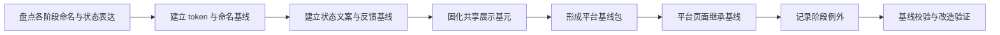
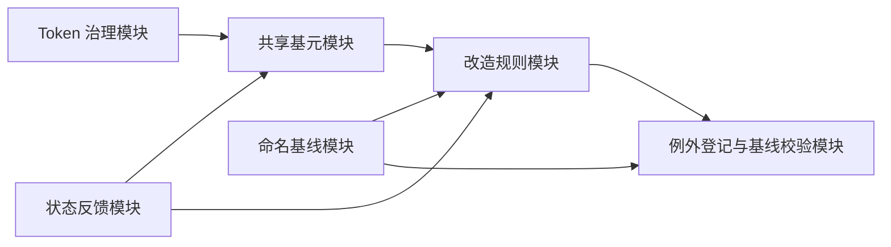
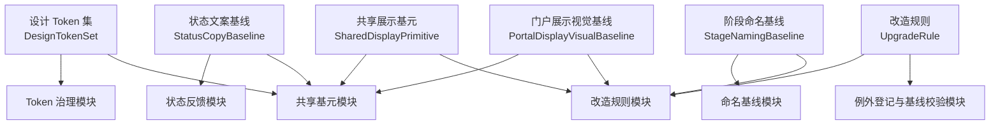
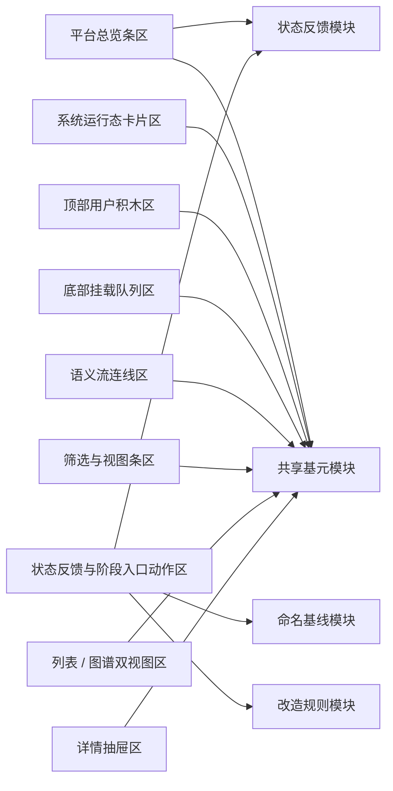

# P6.3 设计语言与前端展示基线设计

> 归档说明：本文件归档自 `docs/superpowers/specs/2026-04-19-p6-detailed-subsystem-design.md`，作为 `P6.3` 节点的正式专项设计入口。凡涉及平台级命名、状态文案、视觉 token、共享展示基元、渐进式改造规则和阶段例外边界，均以本文件为准。
>
> 维护规则：后续若在 `P6.3` 的 `brainstorming / specs / plans` 中继续细化 token、命名、状态映射、共享基元或改造规则，必须在同一轮同步回写本文件；本文件优先于工作层文档，作为 `P6.3` 可评审口径的正式基线。

**日期：** 2026-04-20

**对应节点：**
- `P6.3` 设计语言与前端展示基线

**关联正式文档：**
- `DOC/CODEX_DOC/02_设计说明/P6_门户与平台入口/P6-门户与平台入口设计.md`
- `DOC/CODEX_DOC/02_设计说明/P6_门户与平台入口/P6.1-首屏观察门户设计.md`
- `DOC/CODEX_DOC/02_设计说明/P6_门户与平台入口/P6.2-跨阶段只读集成与状态投影设计.md`
- `DOC/CODEX_DOC/02_设计说明/P6_门户与平台入口/P6.4-前端展示工具化实验场设计.md`

## 1. 设计定位

`P6.3` 不是一份“视觉偏好说明”，也不是一句“以后平台页面要统一”的原则口号。

`P6.3` 必须单独锁定以下内容：

- 平台级命名、状态文案和视觉 token 到底是什么
- 共享展示基元的正式边界是什么
- 平台统一层、阶段继承层、阶段例外层如何区分
- 页面改造时到底由哪些规则判断“已收敛到平台基线”

`P6.3` 负责统一平台级设计语言与前端展示基线，但它统一的是平台语言，而不是强行抹平 `P1 ~ P5` 的业务差异。

## 2. 目标与边界

`P6.3` 的目标不是让所有页面长得一样，而是让跨阶段观察时最容易让用户困惑的部分收敛成统一语言。

### 2.1 当前负责

- 统一平台级阶段命名
- 统一平台级状态文案与状态色
- 统一视觉 token 和共享展示基元
- 固定总览条、筛选条、双视图、详情抽屉和状态反馈的基线
- 固定平台统一层、阶段继承层和阶段例外层的边界

### 2.2 当前不负责

- 重写 `P1 ~ P5` 所有业务页面
- 抹平阶段内部的专有工作台结构
- 覆盖阶段内部业务字段与交互语义
- 以统一名义替代阶段特有的信息表达

### 2.3 基线硬约束

`P6.3` 首版固定遵守以下硬约束：

- 平台级页面必须先继承基线，再声明例外
- “无数据”和“数据暂不可用”必须严格区分
- 跨阶段观察页的状态文案必须映射到统一平台级状态集合
- 阶段例外必须是显式登记规则，不能靠页面临时发挥

## 3. 输入输出契约

### 3.1 基线输入

`P6.3` 首版至少消费以下输入：

- 阶段现有命名集合
- 阶段现有状态文案和状态色
- 阶段现有总览条、筛选条、详情抽屉等页面表达
- `P6.2` 提供的状态快照和降级语义

### 3.2 基线输出

`P6.3` 首版至少输出以下正式对象：

1. `DesignTokenSet`
2. `StageNamingBaseline`
3. `StatusCopyBaseline`
4. `SharedDisplayPrimitive`
5. `PortalDisplayVisualBaseline`
6. `UpgradeRule`

### 3.3 平台级状态映射输出

平台级状态文案优先固定为：

- `待开始`
- `进行中`
- `已完成`
- `待人工验收`
- `阻塞中`
- `数据暂不可用`

若阶段内部仍有更细状态，允许保留，但平台总览必须映射回上述平台级状态集合。

### 3.4 门户展示基线输出

`P6.3` 必须对门户和观察页中的关键展示单元提供正式基线。

至少需要固定以下展示样式对象：

- `SystemStageCardNode`
- `ConnectedUserBlock`
- `MountedQueueItem`
- `FlowPort`
- `PortalFlowLine`
- `TerminalOutput`
- `LegendModel`

门户展示基线至少应锁定：

- 信息层级
- 尺寸等级
- 主次视觉权重
- 状态变化样式
- pin / 锚点可见性约束
- 缩放降级规则

### 3.5 阶段例外输出

`P6.3` 首版允许产出显式例外规则：

- `stage_exception_id`
- `applies_to_stage`
- `reason`
- `allowed_override`
- `expiry_or_review_rule`

没有显式例外规则的页面，不得绕过平台基线。

## 4. 基线收敛总流程

## 5. 核心对象模型

对象模型回答的是“`P6.3` 中有哪些稳定的设计基线对象、它们各自保存什么数据”。

### 5.1 设计 Token 集（Design Token Set / `DesignTokenSet`）

`DesignTokenSet` 是 `P6.3` 的第一核心对象。

最小字段至少包括：

- `token_set_id`
- `color_tokens`
- `spacing_tokens`
- `radius_tokens`
- `shadow_tokens`
- `typography_tokens`
- `version`

对象关系约束固定如下：

- 所有平台级页面必须以 token 集为视觉真相来源
- 页面不得在未登记的情况下绕过 token 集直接定义平台级语义色

### 5.2 阶段命名基线（Stage Naming Baseline / `StageNamingBaseline`）

`StageNamingBaseline` 负责锁定平台级阶段命名。

最小字段至少包括：

- `baseline_id`
- `stage_name_map`
- `forbidden_aliases`
- `notes`
- `version`

对象关系约束固定如下：

- 平台级页面必须统一使用 `P1 ~ P6` 的正式命名
- 未经说明的别称不得进入平台级页面

### 5.3 状态文案基线（Status Copy Baseline / `StatusCopyBaseline`）

`StatusCopyBaseline` 负责锁定平台级状态表达与反馈分类。

最小字段至少包括：

- `baseline_id`
- `platform_status_map`
- `state_color_map`
- `feedback_copy_map`
- `version`

对象关系约束固定如下：

- `无数据` 和 `数据暂不可用` 必须属于两个不同状态分支
- 平台级状态映射不得由页面临时定义

### 5.4 共享展示基元（Shared Display Primitive / `SharedDisplayPrimitive`）

`SharedDisplayPrimitive` 负责锁定平台共用的页面表达单元。

最小字段至少包括：

- `primitive_id`
- `primitive_kind`
- `supported_states`
- `layout_rules`
- `interaction_rules`
- `example_refs`

对象关系约束固定如下：

- 总览条、筛选条、双视图、详情抽屉和状态反馈都属于共享展示基元
- 共享展示基元必须声明交互语义，不能只声明外观

### 5.5 门户展示视觉基线（Portal Display Visual Baseline / `PortalDisplayVisualBaseline`）

`PortalDisplayVisualBaseline` 负责锁定门户语义画布与平台观察面中关键展示单元的显示形态和状态变化规则。

最小字段至少包括：

- `baseline_id`
- `system_stage_card_rules`
- `connected_user_block_rules`
- `mounted_queue_item_rules`
- `flow_port_rules`
- `portal_flow_line_rules`
- `terminal_output_rules`
- `legend_rules`
- `status_annotation_rules`
- `state_transition_rules`
- `size_tiers`

对象关系约束固定如下：

- 系统运行态卡片必须是门户和观察面的视觉主位。
- 顶部接入用户只能以方形用户积木表达，不升级为独立参与用户对象。
- 底部挂载对象只能作为卡片内部队列表达，不升级为独立产物对象。
- 语义流连线必须表达输送对象、方向、速率、健康状态和端口锚点，不得只是装饰线。
- `P1` 的底部挂载队列是外部知识入库的正式视觉输入表达，不得再追加左侧外部知识入库箭头或大标签端口。
- `P3 -> P5` 设计基线流是门户语义画布的正式辅助流，不得被当成装饰线、产物卡片或 `P5 -> P6` 观察接口。
- 终端输出和状态注释必须低于系统卡片和语义流连线，不得抢占主链中心。

门户展示样式规则固定如下：

1. 系统运行态卡片
   - 采用矩形状态卡骨架
   - 必须包含阶段识别、总体状态、实时流动、左右端口、顶部用户积木和底部挂载队列
   - 默认体量大于图例、终端输出和状态注释
2. 顶部接入用户积木
   - 采用方形小块形态
   - 只显示当前接入角色或用户状态
   - 不显示系统级指标栅格，不提供手工添加入口
   - 多个用户积木在同一卡片顶部必须横向对齐，不做随意错落排布
3. 底部挂载队列
   - 以挂钩 / 队列形态表达挂载、吸收和顺序前移
   - 不承担独立跳转入口
   - 对 `P1`，该队列直接表达外部知识入库、等待吸收和完成后补位前移
4. 语义流连线
   - 必须从端口锚点出发
   - 必须使用粒子、小对象标签、点状涌动或象形符号表达输送对象
   - 主画面可见的小对象标签必须是由 `payload_label` 和端口 `current_rate` 派生的运动对象，不允许把 `知识供给`、`需求规格`、`模块工单包` 等通道名称做成静态线名
   - 每个运动对象必须沿源端口到目标端口的路径移动；线条本身的动效只能辅助方向感，不能替代数据驱动的 payload 流
   - 端口采用小圆点 / pin / 可吸附节点样式，不使用大块文字端口标签
   - 不允许用颜色或装饰替代图例、速率信息和流语义
   - 必须覆盖 `P1 -> P2`、`P2 -> P3`、`P3 -> P4`、`P3 -> P5`、`P4 -> P5`、`P5 -> 交付目录`
5. 终端输出与状态注释
   - 以出口、标签或说明性小块为主
   - 仅用于补充状态或告警，不承担主信息密度

展示状态变化基线固定如下：

- 默认态：边框清晰、层级稳定
- 悬停态：轻度增强，不改骨架
- 选中态：强调卡片边框、端口和相关流联动
- 降级态：通过状态标签和辅助描边表达
- 阻塞态：通过状态色和提示文案表达，不整体改造成告警大卡

### 5.6 改造规则（Upgrade Rule / `UpgradeRule`）

`UpgradeRule` 负责锁定平台页面如何渐进式收敛到基线。

最小字段至少包括：

- `rule_id`
- `applies_to_scope`
- `required_primitives`
- `allowed_exceptions`
- `validation_points`
- `priority`

对象关系约束固定如下：

- 平台页、阶段总览页和阶段深业务页适用不同改造优先级
- 未满足校验点的页面不得宣称“已完成基线收敛”

## 6. 核心功能模块设计

模块设计回答的是“谁负责管理 token、命名、状态、基元和改造规则”。

### 6.1 模块清单

`P6.3` 首版固定拆成以下 6 个核心功能模块：

1. Token 治理模块（Token Governance）
2. 命名基线模块（Naming Baseline Manager）
3. 状态反馈模块（State and Feedback Baseline）
4. 共享基元模块（Shared Primitive Registry）
5. 改造规则模块（Upgrade Rule Manager）
6. 例外登记与基线校验模块（Exception and Baseline Audit）

### 6.2 模块职责、输入和输出

| 模块 | 主要职责 | 可接受输入 | 产出输出 |
| --- | --- | --- | --- |
| Token 治理模块 | 管理平台视觉 token 的定义和版本 | 现有样式、平台设计方向 | `DesignTokenSet` |
| 命名基线模块 | 收敛平台正式阶段命名和禁用别称 | 阶段命名现状、正式命名要求 | `StageNamingBaseline` |
| 状态反馈模块 | 固定平台状态集合、状态色和反馈文案 | `P6.2` 状态语义、阶段状态现状 | `StatusCopyBaseline` |
| 共享基元模块 | 定义总览条、系统运行态卡片、用户积木、挂载队列、语义流连线、筛选条、双视图、抽屉等共享基元 | 页面现状、交互约束 | `SharedDisplayPrimitive`、`PortalDisplayVisualBaseline` |
| 改造规则模块 | 规定平台页、阶段页如何渐进式收敛到基线 | 平台页面类型、改造优先级 | `UpgradeRule` |
| 例外登记与基线校验模块 | 登记阶段例外、执行基线校验 | 例外申请、校验清单 | 例外规则、校验结果 |

### 6.3 模块依赖关系图

## 7. 对象模型与模块设计关系

对象不是模块，模块也不是对象。

- 对象负责保存平台设计基线事实
- 模块负责生产、治理、校验和发布这些事实

### 7.1 对象归属映射

| 对象 | 主要归属模块 | 被哪些模块消费 |
| --- | --- | --- |
| `DesignTokenSet` | Token 治理模块 | 共享基元模块、例外登记与基线校验模块 |
| `StageNamingBaseline` | 命名基线模块 | 改造规则模块、例外登记与基线校验模块 |
| `StatusCopyBaseline` | 状态反馈模块 | 共享基元模块、改造规则模块 |
| `SharedDisplayPrimitive` | 共享基元模块 | 门户展示视觉基线、改造规则模块、例外登记与基线校验模块 |
| `PortalDisplayVisualBaseline` | 共享基元模块 | 改造规则模块、例外登记与基线校验模块 |
| `UpgradeRule` | 改造规则模块 | 例外登记与基线校验模块 |

### 7.2 对象与模块关系图

## 8. 数据来源、作用域与切换规则

### 8.1 三层基线作用域

`P6.3` 首版固定区分三层作用域：

1. 平台统一层
   - 统一 token
   - 统一阶段命名
   - 统一平台状态集合
   - 统一共享展示基元
   - 统一门户展示视觉基线
2. 阶段继承层
   - 阶段总览页、入口页对平台基线的继承
   - 阶段级总览条和状态映射
3. 阶段例外层
   - 明确登记的例外视觉或交互规则
   - 到期复核或持续有效说明

### 8.2 切换页面类型时的替换规则

当页面从“平台级页面”切换到“阶段内部页面”时：

- 平台统一层必须继续生效于命名、状态和反馈文案
- 共享展示基元可根据页面类型选择性继承
- 阶段业务布局和深业务交互允许保留个性

### 8.3 状态反馈映射对作用域的影响

状态反馈映射至少会影响以下表达：

- 总览条状态标签
- 空态 / 错误态 / 降级态文案
- 入口按钮状态提示
- 图例和摘要中的状态词

这些内容必须使用 `StatusCopyBaseline`，不得页面自造词。

### 8.4 共享基元与改造规则对作用域的影响

共享基元和改造规则生效后：

- 平台页必须优先使用基线基元
- 阶段总览页应优先继承平台总览条、筛选条和反馈基线
- 阶段深业务页可保留结构个性，但仍要通过基线校验确定例外边界

## 9. 页面级交互设计与模块映射

### 9.1 基线消费页面与壳层

`P6.3` 当前直接服务以下页面类型：

- 平台门户页
- 平台串行观察页
- 阶段总览页
- 展示实验页

这些页面必须满足：

- 先继承基线，再声明例外
- 说明性文字不得压过状态和动作层级
- 状态反馈必须统一分类

### 9.2 风格继承与门户例外

`P6.3` 本身就是平台风格基线，因此本节固定的是“继承顺序”而不是新风格：

1. 平台统一层先于页面个性
2. 共享展示基元先于局部自定义
3. 显式例外登记先于代码实现例外

当前允许的门户级例外固定为：

- 门户语义画布可使用更强的空间结构、pin 语义和流动连线表达
- 阶段深业务页面可保留特有业务图形
- 实验页预览卡可保留更强的配置和绑定语义

### 9.3 页面区块

`P6.3` 首版直接支撑以下 9 类页面区块：

1. 平台总览条区
2. 系统运行态卡片区
3. 顶部用户积木区
4. 底部挂载队列区
5. 语义流连线区
6. 筛选与视图条区
7. 列表 / 图谱双视图区
8. 详情抽屉区
9. 状态反馈与阶段入口动作区

### 9.4 页面区块到模块映射

| 页面区块 | 对应模块 | 读取数据 | 写入数据 | 会影响的后续模块 |
| --- | --- | --- | --- | --- |
| 平台总览条区 | 状态反馈模块 + 共享基元模块 | 平台状态集合、总览条基元 | 无直接写入 | 改造规则模块 |
| 系统运行态卡片区 | 共享基元模块 | `PortalDisplayVisualBaseline`、系统卡片规则 | 无直接写入 | 改造规则模块、例外登记与基线校验模块 |
| 顶部用户积木区 | 共享基元模块 | `PortalDisplayVisualBaseline`、用户积木规则 | 无直接写入 | 改造规则模块 |
| 底部挂载队列区 | 共享基元模块 | `PortalDisplayVisualBaseline`、挂载队列规则 | 无直接写入 | 改造规则模块 |
| 语义流连线区 | 共享基元模块 | `PortalDisplayVisualBaseline`、连线与端口规则 | 无直接写入 | 改造规则模块、例外登记与基线校验模块 |
| 筛选与视图条区 | 共享基元模块 | 筛选条基元、交互规则 | 当前筛选 / 视图状态 | 例外登记与基线校验模块 |
| 列表 / 图谱双视图区 | 共享基元模块 | 双视图基元、交互语义 | 当前视图模式 | 改造规则模块 |
| 详情抽屉区 | 共享基元模块 | 抽屉基元、详情分区规则 | 当前详情打开状态 | 状态反馈模块 |
| 状态反馈与阶段入口动作区 | 状态反馈模块 + 命名基线模块 + 改造规则模块 | 状态文案、反馈分类、阶段命名、入口提示规则 | 当前反馈状态 | 改造规则模块、例外登记与基线校验模块 |

### 9.5 页面-模块关系图

### 9.6 关键交互

平台级页面至少支持：

- 在总览条中稳定展示阶段身份、状态和指标
- 在系统运行态卡片中稳定展示阶段识别、总体状态、实时流动、端口、顶部用户积木和底部挂载队列
- 在语义流连线中稳定展示输送对象、方向、速率、健康状态和端口锚点
- 在顶部用户积木中展示当前接入角色或用户状态，而不复制系统指标栅格
- 在筛选与视图条中区分筛选和视图切换
- 在列表 / 图谱双视图中维持统一详情入口
- 在详情抽屉中按统一分区阅读来源、释义和关系
- 在状态反馈区中区分空态、错误态和降级态

## 10. 最小支撑服务与机制设计

`P6.3` 首版至少需要以下支撑机制与基线登记能力：

### 10.1 Token 与主题登记机制

至少需要登记：

- 平台主色与辅助色
- 状态色
- 字体、字号、间距、圆角和阴影 token
- 版本与生效范围

### 10.2 命名与状态映射登记机制

至少需要登记：

- 平台正式阶段命名
- 禁用别称
- 平台状态集合
- 状态色与反馈文案映射

### 10.3 共享基元规范与示例机制

至少需要登记：

- 总览条基元规范
- 系统运行态卡片规范
- 顶部用户积木规范
- 底部挂载队列规范
- 语义流连线与端口规范
- 终端输出与图例解释规范
- 筛选条基元规范
- 双视图和详情抽屉基元规范
- 对应示例页面或示意稿引用

### 10.4 基线校验与例外审计机制

至少需要登记：

- 当前页面是否已继承平台基线
- 当前页面使用了哪些共享基元
- 是否存在显式例外规则
- 当前校验结论

### 10.5 基线查询接口

`P6.3` 首版当前通过以下接口对外发布平台展示基线与相关配置：

- `GET /api/platform-config/display-baseline`
- `GET /api/platform-config/routes`
- `GET /api/platform-config/legend`

## 11. 验收口径

`P6.3` 只有同时满足以下条件，才算达到可评审状态：

1. 平台级页面的阶段命名、状态文案和状态色已形成正式基线。
2. 系统运行态卡片、顶部用户积木、底部挂载队列、语义流连线、总览条、筛选条、双视图、详情抽屉和状态反馈拥有统一表达基线。
3. “无数据”和“数据暂不可用”有明确区分，不再混用。
4. 平台统一层、阶段继承层和阶段例外层边界清晰。
5. 页面例外可以被显式登记和复核，而不是散落在实现细节中。

## 12. 与后续节点的关系

- `P6.1` 直接消费 `P6.3` 的图形和交互语言
- `P6.2` 提供统一状态语义，支撑 `P6.3` 的状态文案映射
- `P6.4` 在实验中探索可复用展示基元，再反哺 `P6.3`

因此，`P6.3` 负责冻结平台级语言基线，不负责替代 `P6.4` 的实验验证过程。

## 13. 风格继承与门户例外

`P6.3` 默认继承以下正式方向：

- `DOC/CODEX_DOC/02_设计说明/P6_门户与平台入口/P6-门户与平台入口设计.md` 中对平台层的结构约束
- `P6` 的浅底语义画布方向和高信息密度低噪声原则

`P6.3` 只允许定义以下平台级例外：

- 门户页可保留更强的语义画布空间感、pin 语义和流动连线
- 串行观察页可保留更顺序化的卡片编排
- 实验页可暴露模板、绑定和布局的配置型控件

上述例外必须可被基线校验模块识别。当前首屏不得把用户积木、挂载队列或中间产物升级成独立主对象。

## 14. 正式文档关系

本节点的正式文档关系固定为：

- 阶段级总体设计：`DOC/CODEX_DOC/02_设计说明/P6_门户与平台入口/P6-门户与平台入口设计.md`
- 门户专项设计：`DOC/CODEX_DOC/02_设计说明/P6_门户与平台入口/P6.1-首屏观察门户设计.md`
- 读侧投影设计：`DOC/CODEX_DOC/02_设计说明/P6_门户与平台入口/P6.2-跨阶段只读集成与状态投影设计.md`
- 展示实验设计：`DOC/CODEX_DOC/02_设计说明/P6_门户与平台入口/P6.4-前端展示工具化实验场设计.md`
- 工作层设计：`docs/superpowers/specs/2026-04-19-p6-detailed-subsystem-design.md`

如果后续继续补充 token、命名、状态基线、共享展示基元或改造规则，优先回写本文件；只有在确定会影响整个 `P6` 阶段总契约时，才同时回写 `10-P6` 总体设计。
