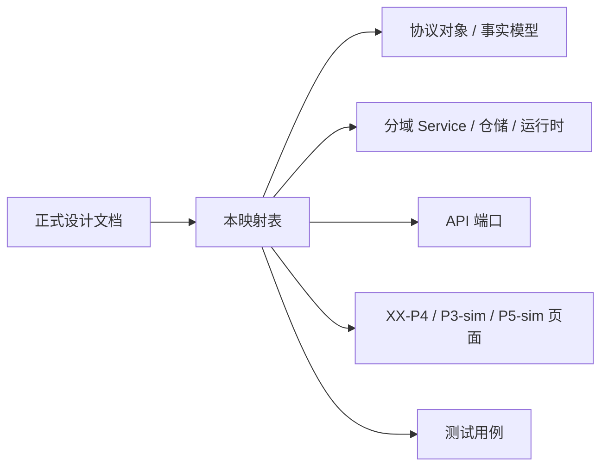

# P4 设计实现映射表

## 1. 文档目标

本文件用于回答 `P4` “正式设计已经写清，但具体落到哪些功能模块、类、接口、测试”这一问题。

它不是新的设计说明，而是 `P4` 正式设计与当前实现之间的桥接索引。

目标：

- 让设计结论能直接追溯到当前代码位置
- 让实现变更时有明确的回写入口
- 避免出现“文档一套、代码一套、关系只存在聊天记录里”的情况

## 2. 使用规则

- 当 `DOC/CODEX_DOC/02_设计说明/` 中的 `P4` 正式设计发生变化时，应同步检查本文件
- 当 `apps/api/app/tool_hub/` 或 `apps/web/src/components/p4/` 发生结构性调整时，应同步更新本文件
- 本文件中的“当前状态”使用三档：
  - `已落地`
  - `部分落地`
  - `待实现`
- 本文件中的“映射类型”使用三档：
  - `严格落地项`
  - `组合落地项`
  - `目标态项`
- `P4` 的工作层设计仍可继续在 `docs/superpowers/` 推演，但正式落地映射以本文件为准

映射类型说明：

- `严格落地项`：
  - 设计对象、端口、入口或测试点已经能定位到单一主承载模块
  - 适合协议对象、路由入口、页面入口、测试入口这类边界清晰对象
- `组合落地项`：
  - 某个设计能力由一个主承载模块加若干协同模块共同实现
  - 适合核心业务循环、跨域协作、投影刷新链路这类跨层能力
- `目标态项`：
  - 正式设计已经固定，但当前实现还只存在部分骨架、历史兼容形态或临时承载位置
  - 适合尚未物理拆分完成的端口、worker、投影存储等

审查口径建议：

- 先看 `主承载模块`，确认这项设计主要落在哪
- 再看 `协同模块`，确认是否只是组合实现而不是实现漂移
- 最后看 `审查证据`，确认是否有外部可见接口、页面或测试支撑

## 3. 当前承载分层

当前 `P4` 实现大体分为六层：

- 协议对象与事实模型：
  - `apps/api/app/tool_hub/models.py`
  - `apps/api/app/tool_hub/runtime_models.py`
  - `apps/api/app/tool_hub/query_models.py`
- 仓储层：
  - `apps/api/app/tool_hub/repository.py`
  - `apps/api/app/tool_hub/runtime_repository.py`
- 分域服务层：
  - `apps/api/app/tool_hub/registry_service.py`
  - `apps/api/app/tool_hub/demand_service.py`
  - `apps/api/app/tool_hub/delivery_service.py`
  - `apps/api/app/tool_hub/manufacture_service.py`
  - `apps/api/app/tool_hub/evolution_service.py`
  - `apps/api/app/tool_hub/query_service.py`
  - `apps/api/app/tool_hub/runtime_service.py`
- 应用门面与编排层：
  - `apps/api/app/tool_hub/service.py`
- API 端口层：
  - `apps/api/app/api/routes/tool_hub.py`
- SQLAlchemy 交付持久化层：
  - `apps/api/app/db/models/tool_hub_delivery.py`
  - `apps/api/app/tool_hub/delivery_repository.py`
- 前端消费与工作台层：
  - `apps/web/src/pages/XXP4Page.tsx`
  - `apps/web/src/pages/XXP3SimPage.tsx`
  - `apps/web/src/pages/XXP5SimPage.tsx`
  - `apps/web/src/components/p4/`
  - `apps/web/src/components/p3/P3AtomicToolRequestGenerator.tsx`
  - `apps/web/src/components/p5/P5DeliveryManifestPanel.tsx`

## 4. 正式设计到实现映射

### 4.1 `P4-工具仓库设计.md`

设计关注点：

- `P4` 的系统定位、业务边界、前端形态、后端分层、对象模型、API、关键运行流程、运行时与验收口径
- 稳定主软件设计说明作为 `P4` 长期设计入口
- 五份时间版补充设计只承担专项论证和演进证据职责，不替代主设计入口

主承载模块：

- `apps/api/app/tool_hub/service.py`
- `apps/web/src/pages/XXP4Page.tsx`

协同模块：

- `apps/api/app/tool_hub/models.py`
- `apps/api/app/tool_hub/registry_service.py`
- `apps/api/app/tool_hub/demand_service.py`
- `apps/api/app/tool_hub/manufacture_service.py`
- `apps/api/app/tool_hub/delivery_service.py`
- `apps/api/app/tool_hub/evolution_service.py`
- `apps/api/app/tool_hub/runtime_service.py`
- `apps/api/app/tool_hub/query_service.py`
- `apps/api/app/api/routes/tool_hub.py`
- `apps/web/src/components/p4/`

审查证据：

- `DOC/CODEX_DOC/02_设计说明/P4_工具仓库/P4-工具仓库设计.md`
- `apps/api/tests/test_tool_hub_api.py`
- `apps/api/tests/test_tool_hub_demand_chain_api.py`
- `apps/api/tests/test_tool_hub_evolution_api.py`
- `apps/api/tests/test_tool_hub_runtime_service.py`
- `apps/api/tests/test_tool_hub_delivery_api.py`
- `apps/web/src/test/XXP4Page.test.tsx`
- `apps/web/src/test/P4RealToolDeliveryWorkspace.test.tsx`

映射类型：

- `组合落地项`

当前状态：

- `已落地`
- 主设计已按 `P2` 的“稳定主软件设计说明 + 时间版补充设计”组织形态整改为当前正式入口
- 当前实现以模块化单体承载 `P4` 工具资产、工具需求、制造交付、自演进、运行协调和查询投影分域
- 后续结构性补充应先进入 `P4-工具仓库设计-YYMMDD-HHMM-补充主题.md`，稳定后回写主设计和本映射表

### 4.2 `P4-工具仓库设计-260419-1000-核心业务循环补充`

设计关注点：

- 命令 -> 事实 -> 后台任务 -> 运行调度 -> 投影 -> 查询 的统一循环
- `P4.2` 与 `P4.3` 共用同一套后台运行语义
- 命令侧、执行侧、查询侧分离

主承载模块：

- `apps/api/app/tool_hub/service.py`

协同模块：

- `apps/api/app/tool_hub/runtime_service.py`
- `apps/api/app/tool_hub/runtime_worker.py`
- `apps/api/app/tool_hub/query_service.py`
- `apps/api/app/tool_hub/projection_repository.py`
- `apps/api/app/tool_hub/snapshot.py`
- `apps/api/app/api/routes/tool_hub.py`

审查证据：

- `apps/api/app/api/routes/tool_hub.py`
- `apps/api/tests/test_tool_hub_api.py`
- `apps/api/tests/test_tool_hub_demand_chain_api.py`
- `apps/api/tests/test_tool_hub_query_service.py`
- `apps/api/tests/test_tool_hub_runtime_service.py`
- `apps/web/src/pages/XXP4Page.tsx`
- `apps/web/src/test/XXP4Page.test.tsx`

映射类型：

- `组合落地项`

当前承载模块：

- `apps/api/app/tool_hub/service.py`
- `apps/api/app/tool_hub/runtime_service.py`
- `apps/api/app/tool_hub/runtime_worker.py`
- `apps/api/app/tool_hub/query_service.py`
- `apps/api/app/tool_hub/projection_repository.py`
- `apps/api/app/tool_hub/snapshot.py`

当前主要类 / 函数：

- `ToolHubService`
- `ToolHubService.refresh_query_projections()`
- `ToolHubRuntimeCoordinator`
- `ToolHubRuntimeWorker`
- `ToolHubRuntimeService.run_once()`
- `ToolHubQueryService.get_state_snapshot()`
- `ToolHubQueryService.refresh_core_projections()`
- `build_tool_hub_snapshot()`

当前 API / 入口：

- `apps/api/app/api/routes/tool_hub.py`
- 代表性入口：
  - `get_tool_hub_overview`
  - `create_demand_sheet`
  - `review_demand_item`
  - `get_demand_item_progress`
  - `create_evolution_run_v2`
  - `decide_evolution_finding`

当前前端消费：

- `apps/web/src/pages/XXP4Page.tsx`
- `apps/web/src/components/p4/P4InputChainWorkspace.tsx`
- `apps/web/src/components/p4/P4EvolutionWorkspace.tsx`
- `apps/web/src/components/p4/P4RegistryWorkspace.tsx`

当前测试：

- `apps/api/tests/test_tool_hub_api.py`
- `apps/api/tests/test_tool_hub_demand_chain_api.py`
- `apps/api/tests/test_tool_hub_query_service.py`
- `apps/api/tests/test_tool_hub_runtime_service.py`
- `apps/web/src/test/XXP4Page.test.tsx`

当前状态：

- `已落地`
- 统一循环已经收敛为“命令写入 -> runtime 推进 -> 投影刷新 -> 查询读取”的首版可运行骨架
- 运行协调器与独立 worker 已物理拆出，核心查询投影已进入显式持久化存储

### 4.3 `P4-工具仓库设计-260419-1020-Runtime协调器与队列补充`

设计关注点：

- `RuntimeJob / RuntimeLease / RuntimeExecutionRecord`
- 队列、租约、重试、回收、死信
- API 进程与 Worker 进程的解耦

主承载模块：

- `apps/api/app/tool_hub/runtime_service.py`

协同模块：

- `apps/api/app/tool_hub/runtime_models.py`
- `apps/api/app/tool_hub/runtime_repository.py`
- `apps/api/app/tool_hub/service.py`
- `apps/api/app/tool_hub/runtime_worker.py`

审查证据：

- `apps/api/app/tool_hub/runtime_models.py`
- `apps/api/app/api/routes/tool_hub_runtime.py`
- `apps/api/tests/test_tool_hub_runtime_repository.py`
- `apps/api/tests/test_tool_hub_runtime_service.py`

映射类型：

- `组合落地项`

当前承载模块：

- `apps/api/app/tool_hub/runtime_models.py`
- `apps/api/app/tool_hub/runtime_repository.py`
- `apps/api/app/tool_hub/runtime_service.py`
- `apps/api/app/tool_hub/service.py`
- `apps/api/app/tool_hub/runtime_worker.py`

当前主要类 / 函数：

- `RuntimeJob`
- `RuntimeLease`
- `RuntimeExecutionRecord`
- `RuntimeRepository.acquire_job()`
- `RuntimeRepository.save_job()`
- `RuntimeRepository.save_execution_record()`
- `ToolHubRuntimeService.enqueue_manufacture_job()`
- `ToolHubRuntimeService.enqueue_evolution_task_job()`
- `ToolHubRuntimeService.run_once()`
- `ToolHubRuntimeCoordinator`
- `ToolHubRuntimeWorker`

当前 API / 入口：

- `apps/api/app/api/routes/tool_hub_runtime.py`
- 首版 `Internal Runtime Port` 已暴露：
  - `POST /api/tool-hub/internal-runtime/projections/refresh`
  - `POST /api/tool-hub/internal-runtime/cycles/run-once`
- 运行时既可由 API 进程触发，也可由 `ToolHubRuntimeWorker` 独立推进

当前测试：

- `apps/api/tests/test_tool_hub_runtime_repository.py`
- `apps/api/tests/test_tool_hub_runtime_service.py`
- `apps/api/tests/test_tool_hub_api.py`

当前状态：

- `已落地`
- 标准任务对象、租约、执行记录、重试、独立 worker 骨架与内部 runtime 端口已经落下第一版
- `dead_letter`、多进程部署和专属 `projection queue` 属于后续增强项，不影响当前规划闭环

### 4.4 `P4-工具仓库设计-260419-1030-Backend服务边界补充`

设计关注点：

- `Registry / Demand / Manufacture / Evolution / Runtime / Query Projection` 六域
- `P3 Input Port / P5 Query Port / Operator Port / Internal Runtime Port`
- 跨域通过事实对象、内部事件或后台任务协作

主承载模块：

- `apps/api/app/tool_hub/service.py`

协同模块：

- `apps/api/app/tool_hub/registry_service.py`
- `apps/api/app/tool_hub/demand_service.py`
- `apps/api/app/tool_hub/manufacture_service.py`
- `apps/api/app/tool_hub/evolution_service.py`
- `apps/api/app/tool_hub/runtime_service.py`
- `apps/api/app/tool_hub/query_service.py`
- `apps/api/app/tool_hub/runtime_worker.py`
- `apps/api/app/api/routes/tool_hub.py`

审查证据：

- `apps/api/app/api/routes/tool_hub.py`
- `apps/api/tests/test_tool_hub_api.py`
- `apps/api/tests/test_tool_hub_demand_chain_api.py`
- `apps/api/tests/test_tool_hub_evolution_api.py`
- `apps/web/src/pages/XXP3SimPage.tsx`
- `apps/web/src/pages/XXP4Page.tsx`
- `apps/web/src/pages/XXP5SimPage.tsx`
- `apps/web/src/test/P3P4P5SimPages.test.tsx`

映射类型：

- `组合落地项`

当前承载模块：

- `apps/api/app/tool_hub/registry_service.py`
- `apps/api/app/tool_hub/demand_service.py`
- `apps/api/app/tool_hub/manufacture_service.py`
- `apps/api/app/tool_hub/evolution_service.py`
- `apps/api/app/tool_hub/runtime_service.py`
- `apps/api/app/tool_hub/query_service.py`
- `apps/api/app/tool_hub/runtime_worker.py`
- `apps/api/app/api/routes/tool_hub.py`
- `apps/api/app/api/routes/tool_hub_deps.py`
- `apps/api/app/api/routes/tool_hub_operator.py`
- `apps/api/app/api/routes/tool_hub_p3_input.py`
- `apps/api/app/api/routes/tool_hub_p5_query.py`
- `apps/api/app/api/routes/tool_hub_runtime.py`

当前主要类 / 函数：

- `RegistryService`
- `DemandService`
- `ManufactureService`
- `EvolutionService`
- `ToolHubRuntimeService`
- `ToolHubQueryService`
- `ToolHubService`

当前 API / 入口：

- `apps/api/app/api/routes/tool_hub.py`
- 当前已物理拆成四类 route 模块：
  - `P3 Input Port` -> `tool_hub_p3_input.py`
  - `P5 Query Port` -> `tool_hub_p5_query.py`
  - `Operator Port` -> `tool_hub_operator.py`
  - `Internal Runtime Port` -> `tool_hub_runtime.py`
- `tool_hub.py` 仅保留聚合入口与兼容导出

当前前端消费：

- `apps/web/src/pages/XXP4Page.tsx`
- `apps/web/src/pages/XXP3SimPage.tsx`
- `apps/web/src/pages/XXP5SimPage.tsx`
- `apps/web/src/lib/toolHub.ts`

当前测试：

- `apps/api/tests/test_tool_hub_api.py`
- `apps/api/tests/test_tool_hub_demand_chain_api.py`
- `apps/api/tests/test_tool_hub_evolution_api.py`
- `apps/web/src/test/P3P4P5SimPages.test.tsx`
- `apps/web/src/test/XXP4Page.test.tsx`

当前状态：

- `已落地`
- 六域 service 与四类端口已经能在代码结构中直接定位
- `ToolHubService` 仍是当前模块化单体的应用门面，但端口物理拆分与内部 runtime 入口已完成

### 4.5 `P4-工具仓库设计-260419-1040-数据与投影模型补充`

设计关注点：

- 权威事实对象、运行事实对象、查询投影、审计与快照四层分离
- 聚合对象与只读投影分离
- 自动改写、回退、快照、审计可追踪

主承载模块：

- `apps/api/app/tool_hub/models.py`

协同模块：

- `apps/api/app/tool_hub/runtime_models.py`
- `apps/api/app/tool_hub/query_models.py`
- `apps/api/app/tool_hub/projection_repository.py`
- `apps/api/app/tool_hub/snapshot.py`
- `apps/api/app/tool_hub/query_service.py`

审查证据：

- `apps/api/app/tool_hub/models.py`
- `apps/api/app/tool_hub/query_models.py`
- `apps/api/tests/test_tool_hub_query_service.py`
- `apps/api/tests/test_tool_hub_api.py`
- `apps/api/tests/test_tool_hub_evolution_api.py`

映射类型：

- `组合落地项`

当前承载模块：

- `apps/api/app/tool_hub/models.py`
- `apps/api/app/tool_hub/runtime_models.py`
- `apps/api/app/tool_hub/query_models.py`
- `apps/api/app/tool_hub/projection_repository.py`
- `apps/api/app/tool_hub/snapshot.py`
- `apps/api/app/tool_hub/query_service.py`

当前主要类 / 函数：

- 业务事实：
  - `ToolDefinition`
  - `ToolDemandSheet`
  - `ToolDemandItem`
  - `ToolManufacturePlan`
  - `EvolutionRun`
  - `EvolutionFinding`
  - `EvolutionTask`
  - `EvolutionChangeSet`
  - `EvolutionRollbackRecord`
- 运行事实：
  - `RuntimeJob`
  - `RuntimeLease`
  - `RuntimeExecutionRecord`
- 查询投影：
  - `OverviewProjection`
  - `ToolListProjection`
  - `EvolutionWorkspaceProjection`
  - `ProjectionRefreshResult`
- 快照与投影构造：
  - `ToolHubStateSnapshot`
  - `build_tool_hub_snapshot()`
  - `project_tool_hub_overview()`

当前 API / 查询承载：

- `apps/api/app/api/routes/tool_hub.py`
- 代表性查询：
  - `get_tool_hub_overview`
  - `list_tool_definitions`
  - `list_demand_sheets`
  - `get_demand_sheet`
  - `list_evolution_runs_v2`
  - `list_evolution_tasks`

当前测试：

- `apps/api/tests/test_tool_hub_query_service.py`
- `apps/api/tests/test_tool_hub_api.py`
- `apps/api/tests/test_tool_hub_evolution_api.py`

当前状态：

- `已落地`
- 事实对象、运行对象与核心查询投影都已形成显式模型
- `Overview / ToolList / EvolutionWorkspace` 三类核心投影已进入独立持久化仓储，并通过刷新链路统一更新
- `ToolHubStateSnapshot` 已退居为投影刷新与诊断来源，而不是正式查询主入口

### 4.6 `P4-工具仓库设计-260419-1010-真实工具落地验证补充`

设计关注点：

- “工具默认是最小可复用元组件，不是页面”的真实交付契约
- `build request -> build run -> artifact -> delivery manifest` 的可执行闭环
- `P3-sim / XX-P4 / P5-sim` 围绕真实前端元组件样例的最小消费链

主承载模块：

- `apps/api/app/tool_hub/delivery_service.py`

协同模块：

- `apps/api/app/tool_hub/models.py`
- `apps/api/app/tool_hub/recipe_service.py`
- `apps/api/app/tool_hub/generators/query_table_widget.py`
- `apps/api/app/tool_hub/runtime_service.py`
- `apps/api/app/db/models/tool_hub_delivery.py`
- `apps/api/app/tool_hub/delivery_repository.py`
- `apps/api/app/api/routes/tool_hub_p3_input.py`
- `apps/api/app/api/routes/tool_hub_operator.py`
- `apps/api/app/api/routes/tool_hub_p5_query.py`
- `apps/web/src/components/p3/P3AtomicToolRequestGenerator.tsx`
- `apps/web/src/components/p4/P4RealToolDeliveryWorkspace.tsx`
- `apps/web/src/components/p5/P5DeliveryManifestPanel.tsx`

审查证据：

- `apps/api/tests/test_tool_hub_api.py`
- `apps/api/tests/test_tool_hub_delivery_repository.py`
- `apps/api/tests/test_tool_hub_delivery_api.py`
- `apps/api/tests/test_tool_hub_component_generator.py`
- `apps/api/tests/test_tool_hub_runtime_service.py`
- `apps/web/src/test/P4RealToolDeliveryWorkspace.test.tsx`
- `apps/web/src/test/XXP4Page.test.tsx`
- `apps/web/src/test/P3P4P5SimPages.test.tsx`

映射类型：

- `组合落地项`

当前承载模块：

- `apps/api/app/tool_hub/models.py`
- `apps/api/app/tool_hub/delivery_service.py`
- `apps/api/app/tool_hub/recipe_service.py`
- `apps/api/app/tool_hub/generators/query_table_widget.py`
- `apps/api/app/tool_hub/runtime_service.py`
- `apps/api/app/db/models/tool_hub_delivery.py`
- `apps/api/app/tool_hub/delivery_repository.py`
- `apps/web/src/components/p3/P3AtomicToolRequestGenerator.tsx`
- `apps/web/src/components/p4/P4RealToolDeliveryWorkspace.tsx`
- `apps/web/src/components/p5/P5DeliveryManifestPanel.tsx`

当前主要类 / 函数：

- `ToolBuildRequest`
- `ToolBuildRun`
- `ToolArtifactVersion`
- `ToolValidationReport`
- `ToolDeliveryManifest`
- `ToolRecipe`
- `DeliveryService.create_frontend_component_build_request()`
- `DeliveryService.execute_build_run()`
- `DeliveryService.get_delivery_manifest()`
- `ToolRecipeService.create_query_table_widget_recipe()`
- `render_query_table_widget()`
- `ToolHubRuntimeService.enqueue_build_job()`
- `ToolHubRuntimeService._execute_build_job()`

当前 API / 入口：

- `POST /api/tool-hub/build-requests/frontend-components`
- `GET /api/tool-hub/build-runs/{build_run_id}`
- `GET /api/tool-hub/tools/{tool_id}/delivery-manifest`
- `GET /api/tool-hub/tools/{tool_id}/fetch`

当前前端消费：

- `apps/web/src/pages/XXP3SimPage.tsx`
- `apps/web/src/pages/XXP4Page.tsx`
- `apps/web/src/pages/XXP5SimPage.tsx`
- `apps/web/src/components/p3/P3AtomicToolRequestGenerator.tsx`
- `apps/web/src/components/p4/P4RealToolDeliveryWorkspace.tsx`
- `apps/web/src/components/p5/P5DeliveryManifestPanel.tsx`

当前测试：

- `apps/api/tests/test_tool_hub_api.py`
- `apps/api/tests/test_tool_hub_delivery_repository.py`
- `apps/api/tests/test_tool_hub_delivery_api.py`
- `apps/api/tests/test_tool_hub_component_generator.py`
- `apps/api/tests/test_tool_hub_runtime_service.py`
- `apps/web/src/test/P4RealToolDeliveryWorkspace.test.tsx`
- `apps/web/src/test/XXP4Page.test.tsx`
- `apps/web/src/test/P3P4P5SimPages.test.tsx`

当前状态：

- `已落地`
- 已从“模拟供给结果”推进到“真实元组件构建、产物登记、manifest 发布与页面消费”的首版闭环
- 首个固定样例为 `React + Ant Design QueryTableWidget`，交付策略固定为 `peer` 依赖 + `import_component`

## 5. 当前已形成的业务闭环映射

### 5.1 输入工序链闭环

主承载模块：

- `apps/api/app/tool_hub/demand_service.py`

协同模块：

- `apps/api/app/tool_hub/manufacture_service.py`
- `apps/api/app/tool_hub/runtime_service.py`
- `apps/api/app/api/routes/tool_hub.py`
- `apps/web/src/components/p4/P4InputChainWorkspace.tsx`

审查证据：

- `apps/api/app/api/routes/tool_hub.py`
- `apps/api/tests/test_tool_hub_demand_chain_api.py`
- `apps/web/src/test/XXP4Page.test.tsx`

映射类型：

- `组合落地项`

当前主要落点：

- 需求单创建：
  - `apps/api/app/tool_hub/demand_service.py`
  - `create_demand_sheet()`
- 需求项审定：
  - `review_demand_item()`
- 研制计划推进：
  - `apps/api/app/tool_hub/manufacture_service.py`
  - `apps/api/app/tool_hub/runtime_service.py`
- 供给结果与进度查询：
  - `get_demand_item_progress`
  - `get_manufacture_plans`
- 前端工作区：
  - `apps/web/src/components/p4/P4InputChainWorkspace.tsx`
  - `apps/web/src/components/p4/P4DemandItemBoard.tsx`
  - `apps/web/src/components/p4/P4SupplyResultPreview.tsx`

对应测试：

- `apps/api/tests/test_tool_hub_demand_chain_api.py`
- `apps/web/src/test/XXP4Page.test.tsx`

当前状态：

- `已落地（MVP）`

### 5.2 自演进巡检闭环

主承载模块：

- `apps/api/app/tool_hub/evolution_service.py`

协同模块：

- `apps/api/app/tool_hub/runtime_service.py`
- `apps/api/app/api/routes/tool_hub.py`
- `apps/web/src/components/p4/P4EvolutionWorkspace.tsx`

审查证据：

- `apps/api/app/api/routes/tool_hub.py`
- `apps/api/tests/test_tool_hub_evolution_api.py`
- `apps/api/tests/test_tool_hub_runtime_service.py`
- `apps/web/src/test/XXP4Page.test.tsx`

映射类型：

- `组合落地项`

当前主要落点：

- 巡检配置：
  - `apps/api/app/tool_hub/evolution_service.py`
  - `get_evolution_config()`
  - `update_evolution_config()`
- 巡检运行：
  - `run_evolution()`
  - `create_evolution_run_v2`
- 发现项决策与自动改写：
  - `decide_evolution_finding()`
  - `enqueue_evolution_task_job()`
- 回退：
  - `rollback_evolution_task()`
- 前端工作区：
  - `apps/web/src/components/p4/P4EvolutionWorkspace.tsx`
  - `apps/web/src/components/p4/P4RunList.tsx`
  - `apps/web/src/components/p4/P4RiskSummary.tsx`

对应测试：

- `apps/api/tests/test_tool_hub_evolution_api.py`
- `apps/api/tests/test_tool_hub_runtime_service.py`
- `apps/web/src/test/XXP4Page.test.tsx`

当前状态：

- `已落地（MVP）`

### 5.3 工具仓库与总览工作台

主承载模块：

- `apps/api/app/tool_hub/registry_service.py`

协同模块：

- `apps/api/app/tool_hub/query_service.py`
- `apps/api/app/tool_hub/snapshot.py`
- `apps/api/app/api/routes/tool_hub.py`
- `apps/web/src/pages/XXP4Page.tsx`

审查证据：

- `apps/api/app/api/routes/tool_hub.py`
- `apps/api/tests/test_tool_hub_api.py`
- `apps/api/tests/test_tool_hub_query_service.py`
- `apps/web/src/test/XXP4Page.test.tsx`
- `apps/web/src/test/P4WorkspaceStyle.test.ts`

映射类型：

- `组合落地项`

当前主要落点：

- 工具仓库：
  - `apps/api/app/tool_hub/registry_service.py`
  - `create_tool()`
  - `update_tool()`
  - `delete_tool()`
- 总览与投影：
  - `apps/api/app/tool_hub/query_service.py`
  - `apps/api/app/tool_hub/snapshot.py`
- 前端页面：
  - `apps/web/src/pages/XXP4Page.tsx`
  - `apps/web/src/components/p4/P4WorkspaceTabs.tsx`
  - `apps/web/src/components/p4/P4RegistryWorkspace.tsx`
  - `apps/web/src/components/p4/P4MetricsPanel.tsx`
  - `apps/web/src/components/p4/P4CoverageMatrix.tsx`

对应测试：

- `apps/api/tests/test_tool_hub_api.py`
- `apps/api/tests/test_tool_hub_query_service.py`
- `apps/web/src/test/XXP4Page.test.tsx`
- `apps/web/src/test/P4WorkspaceStyle.test.ts`

当前状态：

- `已落地（MVP）`

### 5.4 真实元组件交付闭环

主承载模块：

- `apps/api/app/tool_hub/delivery_service.py`

协同模块：

- `apps/api/app/tool_hub/recipe_service.py`
- `apps/api/app/tool_hub/generators/query_table_widget.py`
- `apps/api/app/tool_hub/runtime_service.py`
- `apps/api/app/tool_hub/delivery_repository.py`
- `apps/web/src/components/p3/P3AtomicToolRequestGenerator.tsx`
- `apps/web/src/components/p4/P4RealToolDeliveryWorkspace.tsx`
- `apps/web/src/components/p5/P5DeliveryManifestPanel.tsx`

审查证据：

- `apps/api/tests/test_tool_hub_delivery_repository.py`
- `apps/api/tests/test_tool_hub_delivery_api.py`
- `apps/api/tests/test_tool_hub_component_generator.py`
- `apps/api/tests/test_tool_hub_runtime_service.py`
- `apps/web/src/test/P4RealToolDeliveryWorkspace.test.tsx`
- `apps/web/src/test/P3P4P5SimPages.test.tsx`

映射类型：

- `组合落地项`

当前主要落点：

- `P3-sim` 提交前端元组件需求：
  - `apps/web/src/components/p3/P3AtomicToolRequestGenerator.tsx`
  - `POST /api/tool-hub/build-requests/frontend-components`
- `P4` 运行 build 队列、生成产物并发布 manifest：
  - `apps/api/app/tool_hub/delivery_service.py`
  - `apps/api/app/tool_hub/runtime_service.py`
  - `apps/api/app/tool_hub/generators/query_table_widget.py`
- `XX-P4` 查看真实工具交付信息：
  - `apps/web/src/components/p4/P4RealToolDeliveryWorkspace.tsx`
- `P5-sim` 查询 manifest 并查看接入说明：
  - `apps/web/src/components/p5/P5DeliveryManifestPanel.tsx`

当前状态：

- `已落地（首版样例）`

## 6. 当前缺口与收敛方向

从正式设计到最终目标之间，当前还存在以下差距：

- `ToolHubService` 仍是模块化单体中的应用门面：
  - 当前端口、分域服务和独立 runtime worker 骨架已经拆出
  - 后续若用例继续增厚，应把跨域编排继续拆入更细的 application service，而不是重新扩大门面职责
- 查询投影已形成显式核心投影仓储：
  - 当前已覆盖 `Overview / ToolList / EvolutionWorkspace` 三类核心投影
  - 后续应继续补齐需求单详情、叶子项进度、真实工具交付和 `P6` 展示投影的增量刷新策略
- 运行时已形成任务、租约、执行记录和 worker 骨架：
  - 当前仍运行在模块化单体和本地存储条件下
  - 后续增强项包括专属 projection queue、多进程部署、死信队列和更严格的租约回收策略
- 真实工具交付已形成首版元组件样例：
  - 当前样例固定为 `React + Ant Design QueryTableWidget`
  - 后续应扩大工具类型前，先补齐产物仓治理、版本兼容策略和跨宿主验证规则

## 7. 维护要求

后续新增 `P4` 设计、模块或接口时，至少同步更新以下三个面：

1. 正式主设计文档：`DOC/CODEX_DOC/02_设计说明/P4_工具仓库/P4-工具仓库设计.md`
2. 本映射表：`DOC/CODEX_DOC/03_规范与流程/03_设计实现映射/01-P4-设计实现映射表.md`
3. 相关测试或验收证据：`apps/api/tests/`、`apps/web/src/test/` 或正式测试文档

若未来 `P4` 继续形成结构性专项设计，应按 `P4-工具仓库设计-YYMMDD-HHMM-补充主题.md` 进入补充稿，并在稳定后同步回主设计与本映射表，而不是让关系只保留在 issue 树或聊天记录中。
