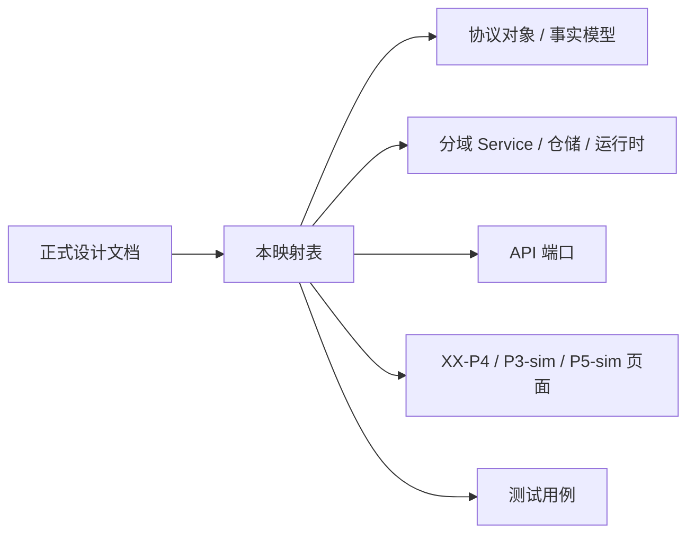

# P4 设计实现映射表

## 1. 文档目标

本文件用于回答 `P4` “正式设计已经写清，但具体落到哪些功能模块、类、接口、测试”这一问题。

它不是新的设计说明，而是 `P4` 正式设计与当前实现之间的桥接索引。

目标：

- 让设计结论能直接追溯到当前代码位置
- 让实现变更时有明确的回写入口
- 避免出现“文档一套、代码一套、关系只存在聊天记录里”的情况

## 2. 使用规则

- 当 `DOC/CODEX_DOC/02_设计说明/` 中的 `P4` 正式设计发生变化时，应同步检查本文件
- 当 `apps/api/app/tool_hub/` 或 `apps/web/src/components/p4/` 发生结构性调整时，应同步更新本文件
- 本文件中的“当前状态”使用三档：
  - `已落地`
  - `部分落地`
  - `待实现`
- 本文件中的“映射类型”使用三档：
  - `严格落地项`
  - `组合落地项`
  - `目标态项`
- `P4` 的工作层设计仍可继续在 `docs/superpowers/` 推演，但正式落地映射以本文件为准

映射类型说明：

- `严格落地项`：
  - 设计对象、端口、入口或测试点已经能定位到单一主承载模块
  - 适合协议对象、路由入口、页面入口、测试入口这类边界清晰对象
- `组合落地项`：
  - 某个设计能力由一个主承载模块加若干协同模块共同实现
  - 适合核心业务循环、跨域协作、投影刷新链路这类跨层能力
- `目标态项`：
  - 正式设计已经固定，但当前实现还只存在部分骨架、历史兼容形态或临时承载位置
  - 适合尚未物理拆分完成的端口、worker、投影存储等

审查口径建议：

- 先看 `主承载模块`，确认这项设计主要落在哪
- 再看 `协同模块`，确认是否只是组合实现而不是实现漂移
- 最后看 `审查证据`，确认是否有外部可见接口、页面或测试支撑

## 3. 当前承载分层

当前 `P4` 实现大体分为六层：

- 协议对象与事实模型：
  - `apps/api/app/tool_hub/models.py`
  - `apps/api/app/tool_hub/runtime_models.py`
  - `apps/api/app/tool_hub/query_models.py`
- 仓储层：
  - `apps/api/app/tool_hub/repository.py`
  - `apps/api/app/tool_hub/runtime_repository.py`
- 分域服务层：
  - `apps/api/app/tool_hub/registry_service.py`
  - `apps/api/app/tool_hub/demand_service.py`
  - `apps/api/app/tool_hub/manufacture_service.py`
  - `apps/api/app/tool_hub/evolution_service.py`
  - `apps/api/app/tool_hub/query_service.py`
  - `apps/api/app/tool_hub/runtime_service.py`
- 应用门面与编排层：
  - `apps/api/app/tool_hub/service.py`
- API 端口层：
  - `apps/api/app/api/routes/tool_hub.py`
- 前端消费与工作台层：
  - `apps/web/src/pages/XXP4Page.tsx`
  - `apps/web/src/pages/XXP3SimPage.tsx`
  - `apps/web/src/pages/XXP5SimPage.tsx`
  - `apps/web/src/components/p4/`

## 4. 正式设计到实现映射

### 4.1 `02-P4-核心业务循环设计`

设计关注点：

- 命令 -> 事实 -> 后台任务 -> 运行调度 -> 投影 -> 查询 的统一循环
- `P4.2` 与 `P4.3` 共用同一套后台运行语义
- 命令侧、执行侧、查询侧分离

主承载模块：

- `apps/api/app/tool_hub/service.py`

协同模块：

- `apps/api/app/tool_hub/runtime_service.py`
- `apps/api/app/tool_hub/query_service.py`
- `apps/api/app/tool_hub/snapshot.py`
- `apps/api/app/api/routes/tool_hub.py`

审查证据：

- `apps/api/app/api/routes/tool_hub.py`
- `apps/api/tests/test_tool_hub_api.py`
- `apps/api/tests/test_tool_hub_demand_chain_api.py`
- `apps/api/tests/test_tool_hub_query_service.py`
- `apps/api/tests/test_tool_hub_runtime_service.py`
- `apps/web/src/pages/XXP4Page.tsx`
- `apps/web/src/test/XXP4Page.test.tsx`

映射类型：

- `组合落地项`

当前承载模块：

- `apps/api/app/tool_hub/service.py`
- `apps/api/app/tool_hub/runtime_service.py`
- `apps/api/app/tool_hub/query_service.py`
- `apps/api/app/tool_hub/snapshot.py`

当前主要类 / 函数：

- `ToolHubService`
- `_ToolHubRuntimeCoordinator`
- `ToolHubRuntimeService.run_once()`
- `ToolHubQueryService.get_state_snapshot()`
- `build_tool_hub_snapshot()`

当前 API / 入口：

- `apps/api/app/api/routes/tool_hub.py`
- 代表性入口：
  - `get_tool_hub_overview`
  - `create_demand_sheet`
  - `review_demand_item`
  - `get_demand_item_progress`
  - `create_evolution_run_v2`
  - `decide_evolution_finding`

当前前端消费：

- `apps/web/src/pages/XXP4Page.tsx`
- `apps/web/src/components/p4/P4InputChainWorkspace.tsx`
- `apps/web/src/components/p4/P4EvolutionWorkspace.tsx`
- `apps/web/src/components/p4/P4RegistryWorkspace.tsx`

当前测试：

- `apps/api/tests/test_tool_hub_api.py`
- `apps/api/tests/test_tool_hub_demand_chain_api.py`
- `apps/api/tests/test_tool_hub_query_service.py`
- `apps/api/tests/test_tool_hub_runtime_service.py`
- `apps/web/src/test/XXP4Page.test.tsx`

当前状态：

- `部分落地`
- 统一循环已经成形，但运行协调器仍以内嵌后台线程形式存在
- 查询侧仍以统一快照拼装为主，尚未完全演进为独立投影存储

### 4.2 `03-P4-Runtime协调器与队列设计`

设计关注点：

- `RuntimeJob / RuntimeLease / RuntimeExecutionRecord`
- 队列、租约、重试、回收、死信
- API 进程与 Worker 进程的解耦

主承载模块：

- `apps/api/app/tool_hub/runtime_service.py`

协同模块：

- `apps/api/app/tool_hub/runtime_models.py`
- `apps/api/app/tool_hub/runtime_repository.py`
- `apps/api/app/tool_hub/service.py`

审查证据：

- `apps/api/app/tool_hub/runtime_models.py`
- `apps/api/tests/test_tool_hub_runtime_repository.py`
- `apps/api/tests/test_tool_hub_runtime_service.py`

映射类型：

- `组合落地项`

当前承载模块：

- `apps/api/app/tool_hub/runtime_models.py`
- `apps/api/app/tool_hub/runtime_repository.py`
- `apps/api/app/tool_hub/runtime_service.py`
- `apps/api/app/tool_hub/service.py`

当前主要类 / 函数：

- `RuntimeJob`
- `RuntimeLease`
- `RuntimeExecutionRecord`
- `RuntimeRepository.acquire_job()`
- `RuntimeRepository.save_job()`
- `RuntimeRepository.save_execution_record()`
- `ToolHubRuntimeService.enqueue_manufacture_job()`
- `ToolHubRuntimeService.enqueue_evolution_task_job()`
- `ToolHubRuntimeService.run_once()`
- `_ToolHubRuntimeCoordinator`

当前 API / 入口：

- 当前没有单独暴露外部 `runtime` 路由
- 运行时主要通过 `ToolHubService.run_runtime_cycle()` 与后台线程推进

当前测试：

- `apps/api/tests/test_tool_hub_runtime_repository.py`
- `apps/api/tests/test_tool_hub_runtime_service.py`

当前状态：

- `部分落地`
- 标准任务对象、租约、执行记录、重试已经落下第一版
- `dead_letter`、独立 `projection queue`、多进程 worker、独立部署边界仍待实现

### 4.3 `04-P4-Backend服务边界设计`

设计关注点：

- `Registry / Demand / Manufacture / Evolution / Runtime / Query Projection` 六域
- `P3 Input Port / P5 Query Port / Operator Port / Internal Runtime Port`
- 跨域通过事实对象、内部事件或后台任务协作

主承载模块：

- `apps/api/app/tool_hub/service.py`

协同模块：

- `apps/api/app/tool_hub/registry_service.py`
- `apps/api/app/tool_hub/demand_service.py`
- `apps/api/app/tool_hub/manufacture_service.py`
- `apps/api/app/tool_hub/evolution_service.py`
- `apps/api/app/tool_hub/runtime_service.py`
- `apps/api/app/tool_hub/query_service.py`
- `apps/api/app/api/routes/tool_hub.py`

审查证据：

- `apps/api/app/api/routes/tool_hub.py`
- `apps/api/tests/test_tool_hub_api.py`
- `apps/api/tests/test_tool_hub_demand_chain_api.py`
- `apps/api/tests/test_tool_hub_evolution_api.py`
- `apps/web/src/pages/XXP3SimPage.tsx`
- `apps/web/src/pages/XXP4Page.tsx`
- `apps/web/src/pages/XXP5SimPage.tsx`
- `apps/web/src/test/P3P4P5SimPages.test.tsx`

映射类型：

- `组合落地项`

当前承载模块：

- `apps/api/app/tool_hub/registry_service.py`
- `apps/api/app/tool_hub/demand_service.py`
- `apps/api/app/tool_hub/manufacture_service.py`
- `apps/api/app/tool_hub/evolution_service.py`
- `apps/api/app/tool_hub/runtime_service.py`
- `apps/api/app/tool_hub/query_service.py`
- `apps/api/app/api/routes/tool_hub.py`

当前主要类 / 函数：

- `RegistryService`
- `DemandService`
- `ManufactureService`
- `EvolutionService`
- `ToolHubRuntimeService`
- `ToolHubQueryService`
- `ToolHubService`

当前 API / 入口：

- `apps/api/app/api/routes/tool_hub.py`
- 当前这个路由文件同时承载：
  - `P3 Input Port`
  - `P5 Query Port`
  - `Operator Port`
- `Internal Runtime Port` 当前仍是进程内调用，不是独立端口

当前前端消费：

- `apps/web/src/pages/XXP4Page.tsx`
- `apps/web/src/pages/XXP3SimPage.tsx`
- `apps/web/src/pages/XXP5SimPage.tsx`
- `apps/web/src/lib/toolHub.ts`

当前测试：

- `apps/api/tests/test_tool_hub_api.py`
- `apps/api/tests/test_tool_hub_demand_chain_api.py`
- `apps/api/tests/test_tool_hub_evolution_api.py`
- `apps/web/src/test/P3P4P5SimPages.test.tsx`
- `apps/web/src/test/XXP4Page.test.tsx`

当前状态：

- `部分落地`
- 分域 service 已拆出，服务边界已能在代码结构中看到
- 但物理端口仍未按 `P3 / P5 / Operator / Runtime` 拆成独立 route 模块
- `ToolHubService` 仍承担较多应用编排职责

### 4.4 `05-P4-数据与投影模型设计`

设计关注点：

- 权威事实对象、运行事实对象、查询投影、审计与快照四层分离
- 聚合对象与只读投影分离
- 自动改写、回退、快照、审计可追踪

主承载模块：

- `apps/api/app/tool_hub/models.py`

协同模块：

- `apps/api/app/tool_hub/runtime_models.py`
- `apps/api/app/tool_hub/query_models.py`
- `apps/api/app/tool_hub/snapshot.py`
- `apps/api/app/tool_hub/query_service.py`

审查证据：

- `apps/api/app/tool_hub/models.py`
- `apps/api/app/tool_hub/query_models.py`
- `apps/api/tests/test_tool_hub_query_service.py`
- `apps/api/tests/test_tool_hub_api.py`
- `apps/api/tests/test_tool_hub_evolution_api.py`

映射类型：

- `组合落地项`

当前承载模块：

- `apps/api/app/tool_hub/models.py`
- `apps/api/app/tool_hub/runtime_models.py`
- `apps/api/app/tool_hub/query_models.py`
- `apps/api/app/tool_hub/snapshot.py`
- `apps/api/app/tool_hub/query_service.py`

当前主要类 / 函数：

- 业务事实：
  - `ToolDefinition`
  - `ToolDemandSheet`
  - `ToolDemandItem`
  - `ToolManufacturePlan`
  - `EvolutionRun`
  - `EvolutionFinding`
  - `EvolutionTask`
  - `EvolutionChangeSet`
  - `EvolutionRollbackRecord`
- 运行事实：
  - `RuntimeJob`
  - `RuntimeLease`
  - `RuntimeExecutionRecord`
- 查询投影：
  - `OverviewProjection`
  - `ToolListProjection`
  - `EvolutionWorkspaceProjection`
- 快照与投影构造：
  - `ToolHubStateSnapshot`
  - `build_tool_hub_snapshot()`
  - `project_tool_hub_overview()`

当前 API / 查询承载：

- `apps/api/app/api/routes/tool_hub.py`
- 代表性查询：
  - `get_tool_hub_overview`
  - `list_tool_definitions`
  - `list_demand_sheets`
  - `get_demand_sheet`
  - `list_evolution_runs_v2`
  - `list_evolution_tasks`

当前测试：

- `apps/api/tests/test_tool_hub_query_service.py`
- `apps/api/tests/test_tool_hub_api.py`
- `apps/api/tests/test_tool_hub_evolution_api.py`

当前状态：

- `部分落地`
- 事实对象与运行对象已经有第一版显式模型
- 投影模型已经存在，但仍主要基于 `snapshot` 即时构造
- 还没有形成独立持久化的投影表或专门的投影刷新链路

## 5. 当前已形成的业务闭环映射

### 5.1 输入工序链闭环

主承载模块：

- `apps/api/app/tool_hub/demand_service.py`

协同模块：

- `apps/api/app/tool_hub/manufacture_service.py`
- `apps/api/app/tool_hub/runtime_service.py`
- `apps/api/app/api/routes/tool_hub.py`
- `apps/web/src/components/p4/P4InputChainWorkspace.tsx`

审查证据：

- `apps/api/app/api/routes/tool_hub.py`
- `apps/api/tests/test_tool_hub_demand_chain_api.py`
- `apps/web/src/test/XXP4Page.test.tsx`

映射类型：

- `组合落地项`

当前主要落点：

- 需求单创建：
  - `apps/api/app/tool_hub/demand_service.py`
  - `create_demand_sheet()`
- 需求项审定：
  - `review_demand_item()`
- 研制计划推进：
  - `apps/api/app/tool_hub/manufacture_service.py`
  - `apps/api/app/tool_hub/runtime_service.py`
- 供给结果与进度查询：
  - `get_demand_item_progress`
  - `get_manufacture_plans`
- 前端工作区：
  - `apps/web/src/components/p4/P4InputChainWorkspace.tsx`
  - `apps/web/src/components/p4/P4DemandItemBoard.tsx`
  - `apps/web/src/components/p4/P4SupplyResultPreview.tsx`

对应测试：

- `apps/api/tests/test_tool_hub_demand_chain_api.py`
- `apps/web/src/test/XXP4Page.test.tsx`

当前状态：

- `已落地（MVP）`

### 5.2 自演进巡检闭环

主承载模块：

- `apps/api/app/tool_hub/evolution_service.py`

协同模块：

- `apps/api/app/tool_hub/runtime_service.py`
- `apps/api/app/api/routes/tool_hub.py`
- `apps/web/src/components/p4/P4EvolutionWorkspace.tsx`

审查证据：

- `apps/api/app/api/routes/tool_hub.py`
- `apps/api/tests/test_tool_hub_evolution_api.py`
- `apps/api/tests/test_tool_hub_runtime_service.py`
- `apps/web/src/test/XXP4Page.test.tsx`

映射类型：

- `组合落地项`

当前主要落点：

- 巡检配置：
  - `apps/api/app/tool_hub/evolution_service.py`
  - `get_evolution_config()`
  - `update_evolution_config()`
- 巡检运行：
  - `run_evolution()`
  - `create_evolution_run_v2`
- 发现项决策与自动改写：
  - `decide_evolution_finding()`
  - `enqueue_evolution_task_job()`
- 回退：
  - `rollback_evolution_task()`
- 前端工作区：
  - `apps/web/src/components/p4/P4EvolutionWorkspace.tsx`
  - `apps/web/src/components/p4/P4RunList.tsx`
  - `apps/web/src/components/p4/P4RiskSummary.tsx`

对应测试：

- `apps/api/tests/test_tool_hub_evolution_api.py`
- `apps/api/tests/test_tool_hub_runtime_service.py`
- `apps/web/src/test/XXP4Page.test.tsx`

当前状态：

- `已落地（MVP）`

### 5.3 工具仓库与总览工作台

主承载模块：

- `apps/api/app/tool_hub/registry_service.py`

协同模块：

- `apps/api/app/tool_hub/query_service.py`
- `apps/api/app/tool_hub/snapshot.py`
- `apps/api/app/api/routes/tool_hub.py`
- `apps/web/src/pages/XXP4Page.tsx`

审查证据：

- `apps/api/app/api/routes/tool_hub.py`
- `apps/api/tests/test_tool_hub_api.py`
- `apps/api/tests/test_tool_hub_query_service.py`
- `apps/web/src/test/XXP4Page.test.tsx`
- `apps/web/src/test/P4WorkspaceStyle.test.ts`

映射类型：

- `组合落地项`

当前主要落点：

- 工具仓库：
  - `apps/api/app/tool_hub/registry_service.py`
  - `create_tool()`
  - `update_tool()`
  - `delete_tool()`
- 总览与投影：
  - `apps/api/app/tool_hub/query_service.py`
  - `apps/api/app/tool_hub/snapshot.py`
- 前端页面：
  - `apps/web/src/pages/XXP4Page.tsx`
  - `apps/web/src/components/p4/P4WorkspaceTabs.tsx`
  - `apps/web/src/components/p4/P4RegistryWorkspace.tsx`
  - `apps/web/src/components/p4/P4MetricsPanel.tsx`
  - `apps/web/src/components/p4/P4CoverageMatrix.tsx`

对应测试：

- `apps/api/tests/test_tool_hub_api.py`
- `apps/api/tests/test_tool_hub_query_service.py`
- `apps/web/src/test/XXP4Page.test.tsx`
- `apps/web/src/test/P4WorkspaceStyle.test.ts`

当前状态：

- `已落地（MVP）`

## 6. 当前缺口与收敛方向

从正式设计到最终目标之间，当前还存在以下差距：

- `ToolHubService` 仍偏大：
  - 目前它既是应用门面，又保留了较多编排与辅助构造逻辑
  - 后续应继续把 use case / orchestration 从门面中下沉到独立应用服务
- `tool_hub.py` 路由仍偏合并：
  - 目前多个端口共用一个 route 文件
  - 后续应按 `P3 Input / P5 Query / Operator / Runtime` 拆开
- 查询投影仍以 `snapshot` 为主：
  - 当前更接近“统一快照 + 即时投影”
  - 后续应逐步演进到“显式投影对象 + 增量刷新”
- 运行时仍为内嵌线程：
  - `_ToolHubRuntimeCoordinator` 仍在 `service.py` 内部
  - 后续应演进为独立 worker 进程或独立服务

## 7. 维护要求

后续新增 `P4` 设计、模块或接口时，至少同步更新以下三个面：

1. 正式设计文档：`DOC/CODEX_DOC/02_设计说明/`
2. 本映射表：`DOC/CODEX_DOC/04_研发文档/01-P4-设计实现映射表.md`
3. 相关测试或验收证据：`apps/api/tests/`、`apps/web/src/test/` 或正式测试文档

若未来 `P4` 继续拆出新的正式三级节点，本文件也应补充相应映射分段，而不是让关系只保留在 issue 树或聊天记录中。
