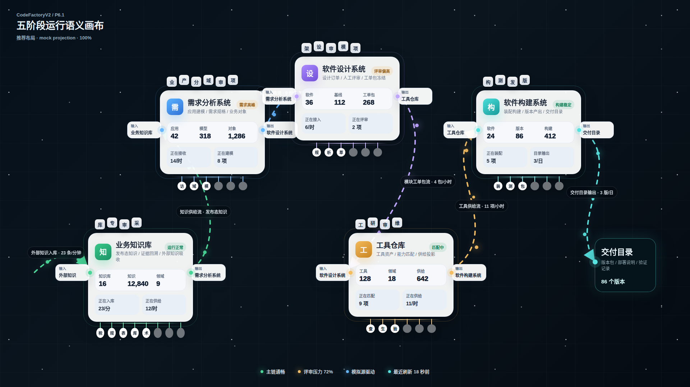
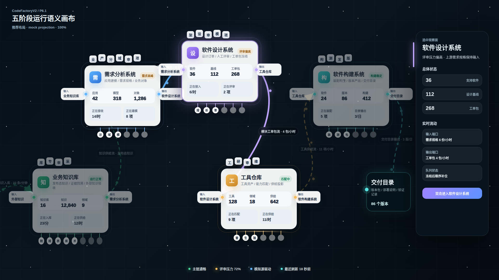
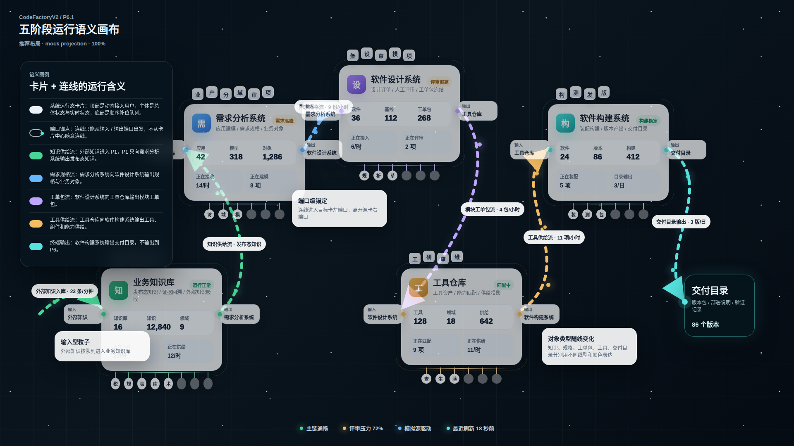

# CodeFactoryV2 P6 语义画布补充原型 v15

生成时间：2026-04-30 00:13:17

- 文档角色：P6.1 五阶段语义画布补充原型评审入口
- 版本目录：`DOC/CODEX_DOC/08_原型与附图/2026-04-30-001317-CodeFactoryV2-P6语义画布补充原型-v15/`
- 当前状态：待用户确认
- 目标路由：`/portal`
- 页面归属：`P6.1` 首屏观察门户、`P6.2` 跨阶段只读集成与状态投影、`P6.3` 设计语言与前端展示基线
- 页面主对象：`PortalProjection`、`SystemStageCardNode`、`PortalFlowLine`、`LegendModel`
- 目标画板规格：三张评审图均为 `1920 x 1080`
- 源文件：`source/v15-semantic-canvas.html`、`source/v15-semantic-canvas.css`

## 1. 本版定位

v15 只补充 P6.1 首屏语义画布的整体原型，不重做已经形成较好结果的卡片详情原型。

本版把已有结论合并到同一套可评审画布中：

1. 继承 v4 的星空式画布、状态拆图和 P3 选中抽屉方向。
2. 继承 v12 的业务知识库卡片结构：顶部方形用户积木、左侧外部知识输入、右侧仅输出到需求分析系统、总体状态、实时状态和底部知识挂载队列。
3. 继承 v14 的 P2-P5 卡片结构：中段是系统总体状态，不是当前批次或临时快照；实时计数独立放在实时区。
4. 补齐五阶段同屏、端口锚定连线、语义流图例和终端交付目录输出。

## 2. 非目标

1. 不覆盖、移动或复写 v4、v12、v14 历史原型包。
2. 不把 `行业用户` 画成独立卡片；行业用户内化为需求分析系统顶部接入用户积木。
3. 不把 P6 画成 P1-P5 的输出接口。
4. 不把 P6.4 卡片配置实验柜塞回门户首屏。
5. 不进入 React 运行页面开发；用户确认前，本版只作为候选原型。

## 3. 共用事实源与设计依据

| 事实源 | 对 v15 的约束 |
| --- | --- |
| 用户最新补充要求 | 旧卡片原型不要丢，不要复写；必须充分参考当前设计结论和旧原型草图 |
| `P6.1-首屏观察门户设计.md` | P6.1 是五阶段运行态可缩放语义画布；核心要素为卡片、连线、画布、图例；卡片和连线是业务主体 |
| `P6.3-设计语言与前端展示基线设计.md` | 门户展示基元包括系统运行态卡片、方形接入用户、底部挂载队列、端口、连线、终端输出和图例 |
| `01-P1-P5到P6状态输出接口规范.md` | 卡片显示需要总体指标、实时计数、端口、接入用户、队列投影和原型来源绑定 |
| v4 星空画布门户原型 | 继承星空画布氛围、总览态 / 选中态拆图、右侧抽屉浮出 |
| v12 业务知识库详情卡 | 继承 P1 卡片结构和 P1 只输出到 P2 的约束 |
| v14 四子系统总体状态卡 | 继承 P2-P5 总体状态口径和顶部用户 / 端口 / 队列结构 |

## 4. 画板规格与布局预算

| 区域 | 规格 / 预算 | 说明 |
| --- | --- | --- |
| 主画板 | `1920 x 1080` | 用于桌面首屏原型验证，不代表运行页面有可见固定边框 |
| 画布 | 全画板铺满 | 背景是承载层，不是独立背景面板；不得出现固定小面板式画布 |
| 五阶段卡片 | 上排 `需求分析系统 / 软件设计系统 / 软件构建系统`，下排 `业务知识库 / 工具仓库` | 延续用户此前认可的五卡同屏排布，同时保留 `P1 -> P2 -> P3 -> P4 -> P5 -> 交付目录` 的主链方向 |
| 卡片结构 | 同屏压缩版 | 保留 v12/v14 的顶部用户积木、端口、总体指标、实时计数、底部队列 |
| 连线 | 从端口锚点出发 | 不从卡片中心随意连线；每条线标注对象类型、速率或业务含义 |
| 选中抽屉 | 右侧浮出，画布相机轻微左移 | 抽屉只在选中态出现，不混入总览态 |
| 图例 | 独立说明态 | 解释卡片、端口、连线、粒子、颜色和终端输出，不常驻挤占主画布 |

## 5. 图文证据链

### 5.1 五阶段语义画布总览态

**评阅状态：待用户确认**

**画板规格：** `1920 x 1080`

**设计依据：**

1. `P6.1` 明确 P6 首屏本体是五阶段运行态语义画布，因此本图把画布铺满整张画板，不再画一个小的斜置背景面板。
2. 用户要求不再保留独立 `行业用户` 卡片，因此本图只保留五张分系统卡片；行业用户以需求分析系统顶部方形接入用户积木表达。
3. 用户要求卡片不要丢失旧成果，因此五张卡都保留 v12/v14 的顶部用户、左右端口、总体状态、实时状态和底部队列。
4. 用户要求 P1 有外部知识输入和下方知识挂载队列，因此业务知识库左侧保留外部知识输入，底部知识挂载队列比其他卡更突出。
5. 正式主链为 `业务知识库 -> 需求分析系统 -> 软件设计系统 -> 工具仓库 -> 软件构建系统 -> 交付目录`，因此 P1 只输出到 P2，P5 输出到交付目录，不输出到 P6。
6. 画布底部只保留无背景运行态信号，避免状态面板抢占主链视觉。

**需要用户判断：**

1. 五卡同屏排布是否已经足够表达“星空画布中的阶段流转”。
2. 同屏压缩卡片是否保留了 v12/v14 的关键结构，没有过度简化。
3. 主链连线的对象类型和方向是否足够直观。



### 5.2 P3 选中抽屉态

**评阅状态：待用户确认**

**画板规格：** `1920 x 1080`

**设计依据：**

1. 用户要求点击子系统后再浮出页面 / 抽屉，因此本图把 P3 抽屉拆成单独状态，不把最复杂状态塞进总览图。
2. `P6.1` 约束单击只做高亮观察，因此本图高亮 P3 及 `P2 -> P3`、`P3 -> P4` 关联流，非相关卡和流降低视觉权重。
3. 抽屉承接 P3 的总体状态、实时流动和端口状态，不替代卡片本体，也不阻断主链。
4. 画布相机轻微左移，为右侧抽屉预留空间；P5 和交付目录仍可见，用于保持上下文。

**需要用户判断：**

1. 选中 P3 后，抽屉是否足够表达“浮动式观察面”，而不是新的常驻后台面板。
2. 抽屉信息密度是否合适，是否需要继续扩展端口明细或告警依据。
3. 相机左移后的主链上下文是否仍然可理解。



### 5.3 语义流与图例说明态

**评阅状态：待用户确认**

**画板规格：** `1920 x 1080`

**设计依据：**

1. 用户要求先把连线是什么、什么东西流、流向代表什么讲清楚，因此本图单独强化语义流和图例。
2. 图例解释卡片、端口、知识供给流、需求规格流、工单包流、工具供给流和终端输出，不把图例作为总览态常驻大面板。
3. 不同对象类型使用不同线色和粒子：知识、规格、工单包、工具、交付目录分别表达，避免所有流线只是一种装饰线。
4. 图例明确 P5 的终端输出是交付目录，不是 P6 接口。

**需要用户判断：**

1. 五类主链对象的线型 / 颜色 / 粒子是否足够区分。
2. 图例是否解释了你关心的“卡片、端口、连线、挂载队列”的业务意义。
3. 是否需要在后续原型中再补一个局部放大态，用于专门观察 P1 知识挂载队列或某条流线。



## 6. 原始材料说明

本版把 v4、v12、v14 的关键截图副本放入 `original/`，用于本轮评审时直接对照继承关系。完整历史包仍保留在主交付目录：

- `DOC/CODEX_DOC/08_原型与附图/2026-04-29-140145-CodeFactoryV2-P6星空画布门户原型-v4/`
- `DOC/CODEX_DOC/08_原型与附图/2026-04-29-183315-CodeFactoryV2-P6业务知识库浅色方形头像端口队列卡详情原型-v12/`
- `DOC/CODEX_DOC/08_原型与附图/2026-04-29-192233-CodeFactoryV2-P6四子系统总体状态卡详情原型-v14/`

v15 未覆盖这些历史包，也未把历史包迁入过程归档目录。

## 7. 原型到实现映射

| 原型区块 | 目标实现含义 | 数据 / 对象来源 | 验收关注点 |
| --- | --- | --- | --- |
| 全屏画布 | `/portal` 的首屏承载层 | `PortalProjection`、布局状态、相机状态 | 必须适应浏览器视口，不出现固定小画布 |
| 五张系统卡 | `SystemStageCardNode` 的同屏压缩表达 | `node_list`、`system_overall_metrics`、`live_counters`、`connected_users`、`queue_projection` | 不得丢顶部用户、端口、总体状态、实时状态和队列 |
| 端口 | `flow_ports` 的锚点表达 | `P6DisplayExportContract.v2.flow_ports` | 连线必须从端口出发 |
| 主链连线 | `PortalFlowLine` | `flow_list` | 不得编造额外下游；P1 只输出 P2，P5 输出交付目录 |
| P3 抽屉 | 选中态观察面 | `selected_card_id`、P3 节点投影 | 只在选中态出现，不常驻 |
| 图例 | `LegendModel` | 卡片规则、端口规则、连线语义规则 | 解释层，不是业务主体 |

## 8. 允许偏差与不可接受偏差

允许偏差：

1. 真实实现可随浏览器尺寸重新计算世界坐标，但默认桌面首屏必须能看懂主链。
2. 同屏卡片可随缩放层级隐藏小标签，但标题、端口方向、总体状态和实时计数不能同时消失。
3. 示例数值可绑定模拟器或真实投影后变化。
4. 线条粒子可用 CSS、SVG、Canvas 或 WebGL 实现，只要对象类型、方向和健康状态可辨认。

不可接受偏差：

1. 覆盖或丢弃 v12/v14 的卡片设计结论。
2. 把 `行业用户` 恢复成独立门户卡片。
3. 把 P6 画成 P1-P5 的输出接口。
4. 把 P6.4 配置实验柜放回 `/portal` 主画布。
5. 连线从卡片中心随意连接，或不表达输送对象类型。
6. 用任意浏览器窗口比例截图替代 `1920 x 1080` 评审图。

## 9. 查看与再生成

重新生成三张截图：

```bash
base="$PWD/DOC/CODEX_DOC/08_原型与附图/2026-04-30-001317-CodeFactoryV2-P6语义画布补充原型-v15"
corepack pnpm --dir apps/web exec playwright screenshot --viewport-size=1920,1080 "file://$base/source/v15-semantic-canvas.html#overview" "$base/01-1920x1080-五阶段语义画布总览态.png"
corepack pnpm --dir apps/web exec playwright screenshot --viewport-size=1920,1080 "file://$base/source/v15-semantic-canvas.html#selected" "$base/02-1920x1080-P3选中抽屉态.png"
corepack pnpm --dir apps/web exec playwright screenshot --viewport-size=1920,1080 "file://$base/source/v15-semantic-canvas.html#legend" "$base/03-1920x1080-语义流与图例说明态.png"
```

## 10. 自检结论

本版已完成以下自检：

1. 三张评审图实际尺寸均为 `1920 x 1080`。
2. 已人工查看截图，总览态未发现五卡压盖、标题换行、端口覆盖总体指标等问题。
3. DOM 检查确认三种状态均有五张系统卡、10 个端口、23 个顶部接入用户积木。
4. DOM 检查确认三种状态下五张卡片、终端交付目录、选中抽屉和图例面板均在 `1920 x 1080` 视口内。
5. v15 包含 `source/`、三张根目录评审 PNG、`original/` 来源材料说明和 README 设计依据。

## 11. 评审结论与后续处理

当前结论：待用户确认。

用户确认前，v15 只作为 P6 语义画布候选原型。若用户确认，本版应与 v12 / v14 一起作为后续 `/portal` 扩充开发的视觉事实源：v15 负责画布、连线、图例和同屏压缩卡，v12 / v14 负责卡片详情结构。

