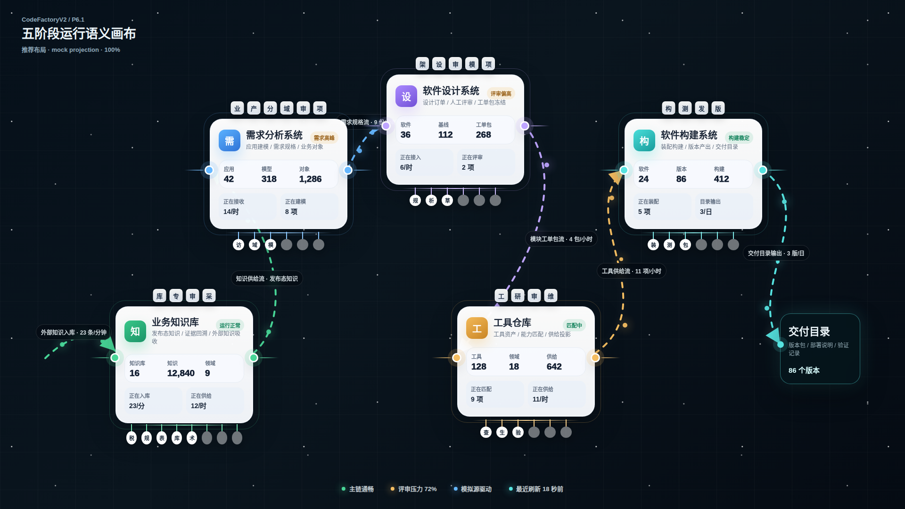
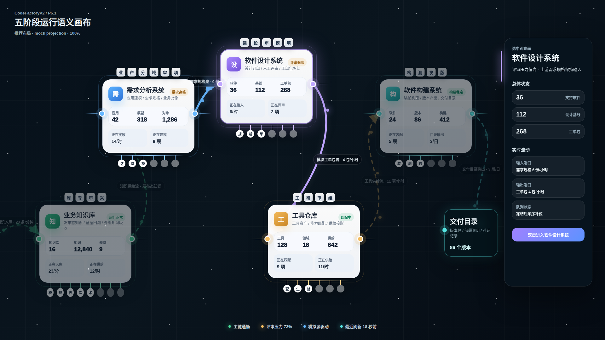
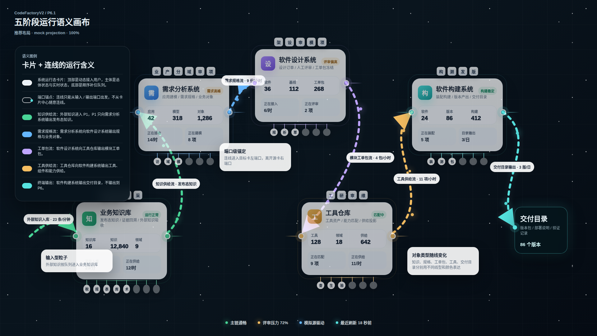

# CodeFactoryV2 P6 语义画布端口用户对齐修正版 v16

生成时间：2026-04-30 00:39:23

- 文档角色：P6.1 五阶段语义画布端口与用户表达修正版评审入口
- 版本目录：`DOC/CODEX_DOC/08_原型与附图/2026-04-30-003923-CodeFactoryV2-P6语义画布端口用户对齐修正版-v16/`
- 当前状态：待用户确认
- 目标路由：`/portal`
- 页面归属：`P6.1` 首屏观察门户、`P6.2` 跨阶段只读集成与状态投影、`P6.3` 设计语言与前端展示基线
- 页面主对象：`PortalProjection`、`SystemStageCardNode`、`PortalFlowLine`、`FlowPort`、`ConnectedUserBlock`
- 目标画板规格：三张评审图均为 `1920 x 1080`
- 源文件：`source/v16-semantic-canvas.html`、`source/v16-semantic-canvas.css`

## 1. 本版定位

v16 是 v15 的评审修正版，只处理用户本轮指出的端口、用户对齐和参考图依据问题。

本版不重做 P6 语义画布方向，不重做 v12 / v14 的详情卡，而是在 v15 基础上修正三项：

1. 卡片输入输出从大文字标签改为小圆形吸附节点。
2. 顶部用户积木统一整齐对齐。
3. 将用户点名认可的浅色卡片参考图放入本版 `original/`，并作为直接设计依据。

## 2. 非目标

1. 不覆盖 v15。
2. 不改动 v12 / v14 卡片详情原型。
3. 不恢复独立行业用户卡。
4. 不把 P6 画成阶段输出接口。
5. 不进入运行页面开发。

## 3. 共用事实源与设计依据

| 事实源 | 对 v16 的约束 |
| --- | --- |
| 用户本轮批注 | 端口不要夸张标签，只做小圆圈 / 吸附节点；用户必须整齐对齐；必须参考主目录中的浅色卡片图 |
| `original/用户点名浅色卡片参考图.png` | 卡片应保持浅色、轻边框、清晰分区、整齐参与人员行和克制状态表达 |
| v15 原型包 | 继承五阶段画布、三状态拆图、主链语义和 P3 抽屉；修正端口与用户表达 |
| v12 业务知识库详情卡 | 保留 P1 顶部接入用户、底部知识挂载队列、总体 / 实时状态结构 |
| v14 四子系统总体状态卡 | 保留 P2-P5 总体状态口径，避免把中段指标退回当前批次 |
| `P6.1-首屏观察门户设计.md` | 卡片和连线是业务核心；画布是承载；图例是解释 |

## 4. 画板规格与布局预算

| 区域 | 规格 / 预算 | v16 修正 |
| --- | --- | --- |
| 主画板 | `1920 x 1080` | 保持桌面整页比例 |
| 卡片端口 | 每个端口视觉节点 `20 x 20` | 端口只做小圆形吸附点，不再显示大标签 |
| 顶部用户 | 单行水平居中 | 所有用户积木纵向对齐，不再错落 |
| 卡片主体 | 浅色轻边框 | 参考用户点名图，降低边框和阴影压迫感 |
| 连线 | 保持端口锚定 | 连线继续表达对象类型和方向，但端口自身不重复写上下游名称 |

## 5. 图文证据链

### 5.1 五阶段语义画布总览态

**评阅状态：待用户确认**

**画板规格：** `1920 x 1080`

**设计依据：**

1. 用户指出输入输出不应做成夸张标签，因此本图所有卡片左右侧都改成小圆形吸附节点。
2. 用户指出顶部用户不应错落，因此本图所有卡片顶部用户积木都在同一水平线上对齐。
3. 用户点名浅色参考图，因此卡片边框、阴影、浅色分区和状态胶囊都向该图靠拢。
4. v15 中已经成立的五阶段主链继续保留，不因端口视觉降噪而改变业务语义。
5. 端口的上下游含义由连线、图例和数据合同承载，不在卡片端口上重复写大标签。

**需要用户判断：**

1. 小圆形吸附端口是否比 v15 的大标签更接近你的设想。
2. 顶部用户积木的整齐度是否符合你说的“这种类型”。
3. 卡片视觉是否更贴近你点名的浅色参考图。



### 5.2 P3 选中抽屉态

**评阅状态：待用户确认**

**画板规格：** `1920 x 1080`

**设计依据：**

1. 选中态继续保留 v15 的 P3 高亮和右侧抽屉，但同步使用小圆形端口。
2. 关联流仍高亮 `P2 -> P3` 与 `P3 -> P4`，非相关卡降低视觉权重。
3. 顶部用户积木在选中态仍保持整齐水平对齐，避免状态切换时产生不必要的跳动。

**需要用户判断：**

1. P3 选中态中小端口是否足够表达输入输出锚点。
2. 抽屉与主画布之间的关系是否仍然清楚。



### 5.3 语义流与图例说明态

**评阅状态：待用户确认**

**画板规格：** `1920 x 1080`

**设计依据：**

1. 图例态解释端口为什么是吸附节点：连线只能从端口进出，不从卡片中心随意连接。
2. 因用户要求端口不要大标签，图例承担端口语义说明，避免总览态重复说明。
3. 五类主链对象继续用不同线色和粒子表达，保持连线业务意义。

**需要用户判断：**

1. 端口变小后，图例对端口语义的解释是否足够。
2. 总览态和图例态的分工是否合适。



## 6. 原始材料说明

本版 `original/` 包含：

- `用户点名浅色卡片参考图.png`：来自主交付目录的用户点名参考图，是 v16 卡片视觉修正的直接依据。
- `v15-总览态问题对照.png`：用于对照 v15 的端口标签和用户错落问题。

## 7. 原型到实现映射

| 原型区块 | 实现含义 | 验收关注点 |
| --- | --- | --- |
| 小圆形端口 | `FlowPort` 的吸附锚点 | 端口可以高亮 / 暗显，但不应变成大文字标签 |
| 顶部用户积木 | `ConnectedUserBlock` | 同一张卡内必须整齐对齐，且不显示添加符号 |
| 卡片浅色主体 | `SystemStageCardNode` | 继承参考图的轻分区和清爽层级 |
| 连线 | `PortalFlowLine` | 负责表达上下游、对象类型、方向和速率 |
| 图例 | `LegendModel` | 用于解释端口和流，不常驻挤占总览态 |

## 8. 允许偏差与不可接受偏差

允许偏差：

1. 端口大小实现时可在 `16 ~ 24px` 内调整，但不能恢复为大文字标签。
2. 用户积木可换成真实头像缩略图或角色缩写，但必须整齐对齐。
3. 线条粒子和动画可由实现方式决定。

不可接受偏差：

1. 再次把输入输出做成大标签。
2. 再次把顶部用户做成错落排布。
3. 丢失用户点名浅色参考图的设计依据。
4. 覆盖 v15 或旧卡片原型。
5. 把 P6 画成输出接口。

## 9. 查看与再生成

```bash
base="$PWD/DOC/CODEX_DOC/08_原型与附图/2026-04-30-003923-CodeFactoryV2-P6语义画布端口用户对齐修正版-v16"
corepack pnpm --dir apps/web exec playwright screenshot --viewport-size=1920,1080 "file://$base/source/v16-semantic-canvas.html#overview" "$base/01-1920x1080-五阶段语义画布总览态.png"
corepack pnpm --dir apps/web exec playwright screenshot --viewport-size=1920,1080 "file://$base/source/v16-semantic-canvas.html#selected" "$base/02-1920x1080-P3选中抽屉态.png"
corepack pnpm --dir apps/web exec playwright screenshot --viewport-size=1920,1080 "file://$base/source/v16-semantic-canvas.html#legend" "$base/03-1920x1080-语义流与图例说明态.png"
```

## 10. 自检结论

本版已完成以下自检：

1. 三张评审图均为 `1920 x 1080`。
2. DOM 检查确认三种状态均有五张系统卡和 10 个端口。
3. DOM 检查确认端口视觉尺寸为 `20 x 20`，端口文字不作为可见标签显示。
4. DOM 检查确认所有用户行纵向偏差为 `0`，即同一行用户完全对齐。
5. 已人工查看三张图，端口不再呈现为大标签，顶部用户整齐对齐。

## 11. 评审结论与后续处理

当前结论：待用户确认。

若用户确认 v16，后续 `/portal` 实现应以 v16 作为画布同屏态、端口、用户行和选中态的事实源；v12 / v14 继续作为卡片详情结构事实源。

