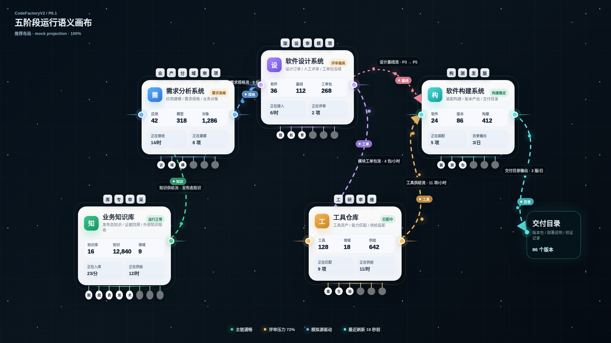
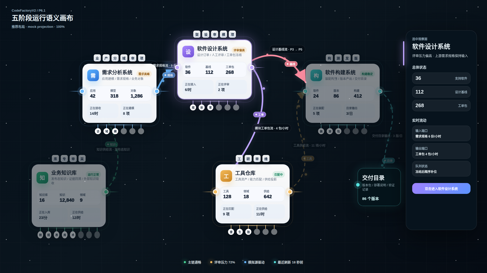
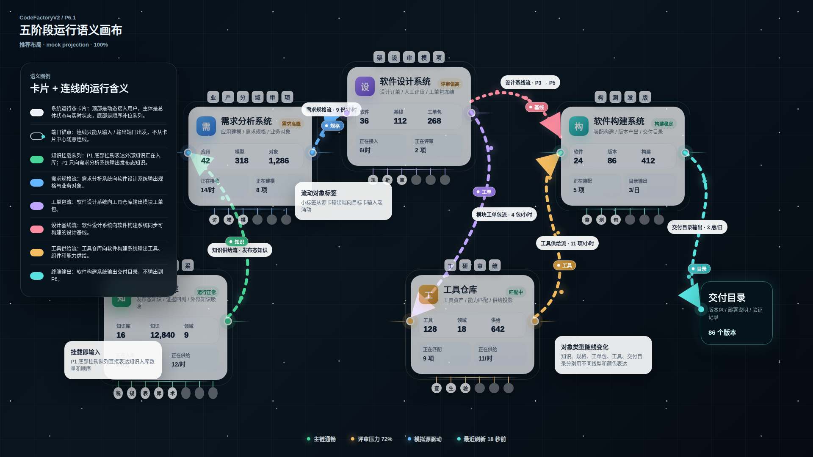

# CodeFactoryV2 P6 语义画布流动与 P3-P5 补充原型 v17

生成时间：2026-04-30 00:52:07

- 文档角色：P6.1 五阶段语义画布流动关系补充修正版评审入口
- 版本目录：`DOC/CODEX_DOC/08_原型与附图/2026-04-30-005207-CodeFactoryV2-P6语义画布流动与P3P5补充原型-v17/`
- 当前状态：用户已确认方向，可作为下一阶段 `/portal` 扩充开发的原型事实源；细节允许在实现中微调
- 目标路由：`/portal`
- 页面归属：`P6.1` 首屏观察门户、`P6.2` 跨阶段只读集成与状态投影、`P6.3` 设计语言与前端展示基线
- 页面主对象：`PortalProjection`、`SystemStageCardNode`、`PortalFlowLine`、`FlowPort`、`MountedQueueItem`
- 目标画板规格：三张评审图均为 `1920 x 1080`
- 源文件：`source/v17-semantic-canvas.html`、`source/v17-semantic-canvas.css`

## 1. 本版定位

v17 是 v16 的关系流动修正版，只处理三项用户批注：

1. 删除 P1 外部知识入库箭头。
2. 增加阶段间数据对象的流动小标签。
3. 补充 `P3 -> P5` 的设计基线流箭头。

本版不重做五卡构图、不重做卡片详情、不改变 v16 已修正的端口小圆点和顶部用户对齐。

## 2. 非目标

1. 不覆盖 v16。
2. 不恢复 P1 外部入库箭头。
3. 不把 P3 到 P5 的箭头解释成 P5 输出到 P6。
4. 不进入运行页面开发。

## 3. 共用事实源与设计依据

| 事实源 | 对 v17 的约束 |
| --- | --- |
| 用户本轮批注 | P1 底部挂载队列已经表达知识入库；连线应有对象流动感；必须补 P3 到 P5 箭头 |
| v16 原型包 | 继承小圆形端口、整齐用户积木、浅色卡片和三状态拆图 |
| v12 业务知识库详情卡 | P1 的下方挂载队列是知识吸收 / 入库队列，不应再被外部箭头重复表达 |
| v14 四子系统总体状态卡 | P3 总体状态包含设计基线，P5 总体状态包含构建与交付，允许表达设计基线向构建系统同步 |
| `P6.1-首屏观察门户设计.md` | 卡片和连线是业务主体；连线要表达对象、方向和状态 |

## 4. 画板规格与布局预算

| 区域 | 规格 / 预算 | v17 修正 |
| --- | --- | --- |
| 主画板 | `1920 x 1080` | 保持桌面整页比例 |
| P1 输入 | 底部挂载队列 | 删除外部知识入库箭头和左侧外部输入端口 |
| 阶段间流动 | 小对象标签 + 粒子 | 每条流线上显示正在流动的对象类型 |
| P3-P5 | 粉色虚线箭头 | 表达设计基线同步到软件构建系统 |
| 主链 | 保持原有方向 | `P1 -> P2 -> P3 -> P4 -> P5 -> 交付目录` 不变 |

## 5. 图文证据链

### 5.1 五阶段语义画布总览态

**评阅状态：用户已确认方向**

**画板规格：** `1920 x 1080`

**设计依据：**

1. 用户指出 P1 底部挂载队列已经表达外部知识入库，因此本图删除左侧 `外部知识入库` 箭头和标签。
2. P1 只保留右侧输出端口到 P2，避免把外部知识输入画成一个多余阶段流。
3. 每条阶段间连线增加小对象标签，表达对象正在从输出端向输入端流动。
4. 新增 P3 到 P5 的设计基线流，表达软件设计系统向软件构建系统同步可构建的设计基线。

**需要用户判断：**

1. P1 不再画外部入库箭头后，底部知识挂载队列是否足够表达入库概念。
2. 小对象标签是否能表达“数据正在流动或涌动”的感觉。
3. P3 到 P5 的箭头位置和语义是否合适。



### 5.2 P3 选中抽屉态

**评阅状态：用户已确认方向**

**画板规格：** `1920 x 1080`

**设计依据：**

1. P3 选中时，`P2 -> P3`、`P3 -> P4` 和新增 `P3 -> P5` 都属于 P3 关联流，应一起保持高亮。
2. P3 到 P5 的设计基线流不是替代 P3 到 P4 的工单包流，而是额外表达软件设计结果对构建系统的直接同步。
3. 抽屉仍只作为选中观察面，不替代主画布。

**需要用户判断：**

1. P3 选中态中三条关联流的高亮是否清楚。
2. 新增 P3 到 P5 箭头是否需要在抽屉中进一步展开说明。



### 5.3 语义流与图例说明态

**评阅状态：用户已确认方向**

**画板规格：** `1920 x 1080`

**设计依据：**

1. 图例态明确 P1 的输入不是外部箭头，而是底部挂载队列。
2. 图例态解释小对象标签的含义：对象从源卡输出端向目标卡输入端涌动。
3. 图例态新增设计基线流说明，避免把 P3 到 P5 误解为主链替代。

**需要用户判断：**

1. 图例是否把 P1 挂载队列、流动标签、P3 到 P5 的区别说明清楚。
2. 是否需要后续再做一张 P1 局部放大态，专门展示挂载队列如何前移。



## 6. 原始材料说明

本版 `original/` 包含：

- `用户点名浅色卡片参考图.png`：继续作为卡片风格参考。
- `v16-总览态问题对照.png`：用于对照 v17 删除 P1 外部箭头、补充流动标签和 P3-P5 箭头的修正。

## 7. 原型到实现映射

| 原型区块 | 实现含义 | 验收关注点 |
| --- | --- | --- |
| P1 底部知识挂载队列 | 外部知识正在入库、排队吸收和顺序前移 | 不应再额外画外部入库箭头 |
| 小对象标签 | 线上的流动 payload | 应从源输出端向目标输入端移动 |
| `P3 -> P5` 设计基线流 | 软件设计系统向软件构建系统同步可构建设计基线 | 不应删除，也不应替代 `P3 -> P4` 工单包流 |
| P1 右侧输出端口 | 发布态知识向 P2 输出 | P1 只输出到 P2 |
| P5 终端输出 | 交付目录 | 不输出到 P6 |

## 8. 允许偏差与不可接受偏差

允许偏差：

1. 流动小标签可在实现中改为动态粒子、对象胶囊或图标。
2. P3 到 P5 的线条曲率可随布局调整。
3. P1 挂载队列可在实现中支持滚动、补位和 hover 明细。

不可接受偏差：

1. 恢复 P1 外部知识入库箭头。
2. 把 P1 底部挂载队列只当装饰，不表达入库和顺序。
3. 删除 P3 到 P5 的箭头。
4. 让流线只剩装饰线，没有对象类型或流动对象表达。
5. 覆盖 v16、v12 或 v14。

## 9. 查看与再生成

```bash
base="$PWD/DOC/CODEX_DOC/08_原型与附图/2026-04-30-005207-CodeFactoryV2-P6语义画布流动与P3P5补充原型-v17"
corepack pnpm --dir apps/web exec playwright screenshot --viewport-size=1920,1080 "file://$base/source/v17-semantic-canvas.html#overview" "$base/01-1920x1080-五阶段语义画布总览态.png"
corepack pnpm --dir apps/web exec playwright screenshot --viewport-size=1920,1080 "file://$base/source/v17-semantic-canvas.html#selected" "$base/02-1920x1080-P3选中抽屉态.png"
corepack pnpm --dir apps/web exec playwright screenshot --viewport-size=1920,1080 "file://$base/source/v17-semantic-canvas.html#legend" "$base/03-1920x1080-语义流与图例说明态.png"
```

## 10. 自检结论

本版已完成以下自检：

1. 三张评审图均为 `1920 x 1080`。
2. DOM 检查确认三种状态均有五张系统卡。
3. DOM 检查确认三种状态端口数为 `9`：P1 外部输入端口已删除，P1 输入由底部挂载队列表达。
4. DOM 检查确认 `external-knowledge` 外部箭头不存在。
5. DOM 检查确认 `design-baseline-direct` 即 `P3 -> P5` 流存在。
6. DOM 检查确认三种状态均有 `6` 个流动小标签。

## 11. 评审结论与后续处理

当前结论：用户已确认方向。

后续 `/portal` 实现应以 v17 作为 P1 输入表达、阶段间流动对象和 P3-P5 关系的事实源；v16 继续作为端口小圆点与用户对齐的前序依据；v12 / v14 继续作为卡片详情结构事实源。

本确认不是逐像素定稿。实现阶段允许在不破坏上述结构事实的前提下，对线条曲率、粒子运动、标签位置、缩放降级和真实数据数值进行工程化微调。
