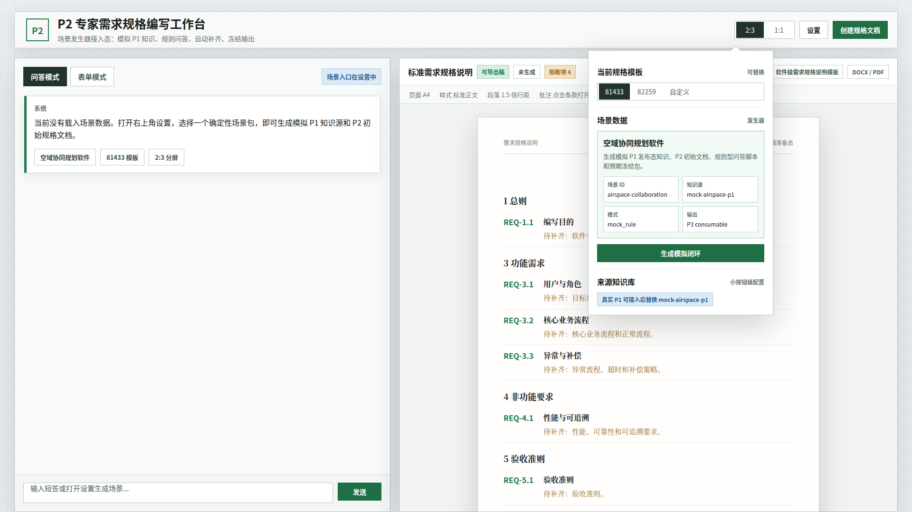
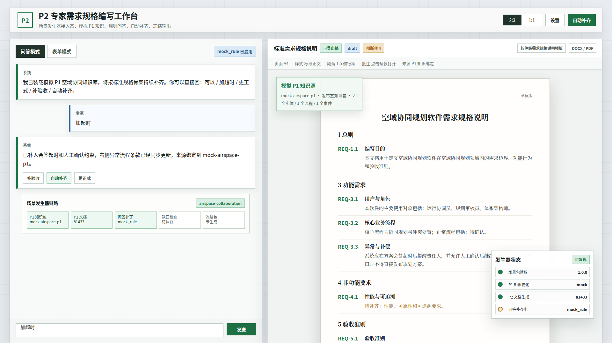
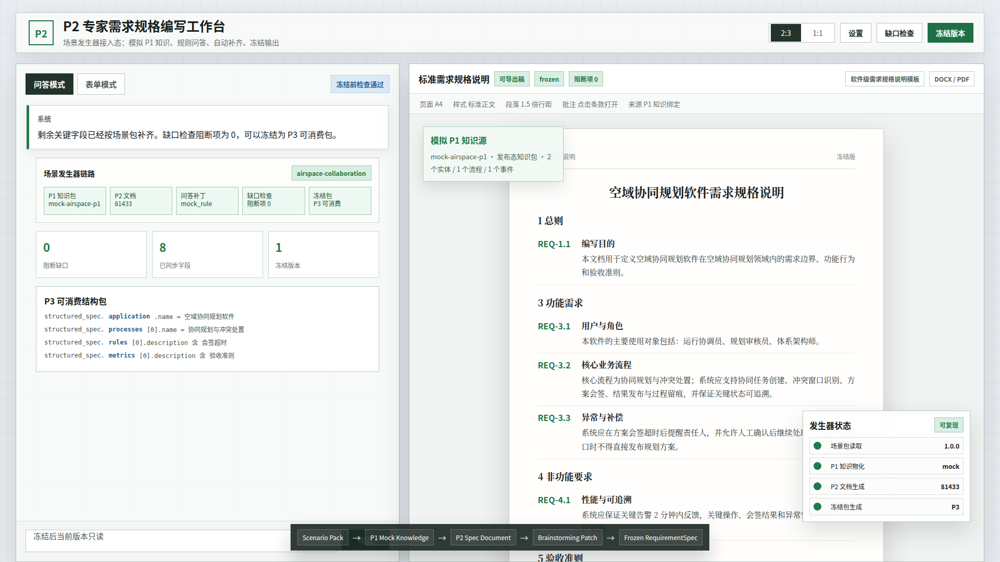

# CodeFactoryV2 P2 场景发生器原型 v1

生成时间：2026-04-30 14:16:44

- 文档角色：`P2-P1 场景数据发生器` 正式原型评审入口
- 版本目录：`DOC/CODEX_DOC/08_原型与附图/2026-04-30-141644-CodeFactoryV2-P2场景发生器原型-v1/`
- 当前状态：已被 v2 替代，不作为实现依据
- 目标路由：`/requirement-authoring`
- 页面归属：`P2` 需求分析系统、`P2` 专题：可配置需求规格说明编写系统
- 页面主对象：`RequirementAuthoringScenario`、`P1MockKnowledge`、`RequirementSpecDocument`、`BrainstormingResponse`、`FrozenRequirementSpec`
- 目标画板规格：三张评审图均为 `1920 x 1080`
- 源文件：`source/p2-scenario-generator-prototype.html`

## 1. 本版定位

本版只画 `P2-P1 场景数据发生器` 与正式 `P2` 专家工作台的结合方式，重点表达三件事：

1. 发生器入口是 `设置` 弹层中的小型配置，不占据主工作区。
2. 生成后仍在正式左右分屏工作台中继续问答和生成标准规格正文。
3. 自动补齐、缺口检查和冻结状态要能让用户直观看到这是一条可复现闭环。

## 2. 非目标

1. 不重做 `P2` 主工作台布局。
2. 不设计管理员模板配置台。
3. 不展示真实 LLM 接入界面。
4. 不把 `P6` 门户状态纳入本版画面。
5. 不以本版原型替代运行态页面测试。

## 3. 共用事实源与设计依据

| 事实源 | 对本版原型的约束 |
| --- | --- |
| `DOC/CODEX_DOC/02_设计说明/P2_需求分析系统/P2-P1场景数据发生器设计.md` | 场景发生器接入正式工作台；默认场景为 `airspace-collaboration`；模拟知识源为 `mock-airspace-p1` |
| `DOC/CODEX_DOC/02_设计说明/P2_需求分析系统/P2-需求分析系统设计-260430-0016-可配置需求规格说明编写系统设计.md` | 左侧只有 `问答模式 / 表单模式` 两个 Tab；右侧为标准需求规格说明正文；批注层不常驻 |
| `DOC/CODEX_DOC/04_研制计划/02.01-WBS-P2-P1场景数据发生器-研制计划.md` | 首版闭环必须覆盖场景列表、模拟知识物化、P2 文档生成、场景问答、自动补齐、缺口检查和冻结 |
| 用户已确认的 P2 主界面口径 | 双工作面板需拉满页面；右侧应有类似 Word 文档的直观感受 |

## 4. 画板规格与布局预算

| 区域 | 规格 / 预算 | 设计说明 |
| --- | --- | --- |
| 主画板 | `1920 x 1080` | 桌面整页原型，保留工作台完整首屏 |
| 顶部栏 | 约 `78px` | 保留分屏比例、设置、缺口检查、冻结等操作 |
| 左侧输入区 | 约 `43%` | 表达问答、发生器链路、补齐状态 |
| 右侧正文区 | 约 `57%` | 表达 Word 式标准规格正文和来源标识 |
| 发生器控件 | 设置弹层或轻量状态卡 | 不常驻挤占主工作流，只在关键状态出现 |

## 5. 图文证据链

### 5.1 场景选择入口态

**评阅状态：待用户确认**

**画板规格：** `1920 x 1080`

**设计依据：**

1. 场景数据发生器是小按钮级配置，放在右上角 `设置` 弹层中。
2. 规格模板仍是真实模板对象，因此模板选择与场景数据选择放在同一设置入口内，但分成两个区块。
3. `生成模拟闭环` 是发生器的主动作，表示一次性生成模拟 `P1` 知识源和 `P2` 初始文档。
4. 主工作区仍保持左问答、右标准正文，不新增第三个输入入口。

**需要用户判断：**

1. 场景发生器入口放在设置弹层里是否足够直观。
2. `生成模拟闭环` 这个按钮文案是否符合你对首版发生器的理解。



### 5.2 模拟知识生成态

**评阅状态：待用户确认**

**画板规格：** `1920 x 1080`

**设计依据：**

1. 生成后右侧出现 `模拟 P1 知识源` 标识，明确当前正文来源是 `mock-airspace-p1`。
2. 问答模式保持 CLI 式短输入，用户可以直接输入 `加超时`，系统自动修补右侧正文。
3. 左侧下方展示发生器链路，但只作为状态证据，不变成新的主工作台。
4. 右下角 `发生器状态` 只显示可复现、mock、模板、问答补齐中等关键信息。

**需要用户判断：**

1. 右侧 `模拟 P1 知识源` 是否醒目但不过度干扰正文阅读。
2. 左侧链路状态是否能解释“发生器已经做了什么、还缺什么”。



### 5.3 自动补齐冻结态

**评阅状态：待用户确认**

**画板规格：** `1920 x 1080`

**设计依据：**

1. 自动补齐后左侧显示阻断缺口、同步字段、冻结版本三个关键指标。
2. `P3 可消费结构包` 以轻量结构路径显示，证明冻结结果不是只生成正文。
3. 右侧正文进入 `frozen` 状态，仍保持标准需求规格说明的纸张感。
4. 右下发生器状态收敛为 `冻结包生成 P3`，表达闭环结束。

**需要用户判断：**

1. 冻结态是否足够清楚地表达“可以交给 P3”。
2. 左侧结构包摘要是否需要更工程化，还是保持当前专家可读粒度。



## 6. 原始材料说明

本版无外部原始图片。`original/README.md` 已记录事实源。

## 7. 原型到实现映射

| 原型区块 | 实现含义 | 验收关注点 |
| --- | --- | --- |
| 设置弹层 / 场景数据 | `GET /api/requirement-authoring/scenarios` 与场景选择控件 | 不占据主工作区；默认场景可见 |
| 生成模拟闭环按钮 | `POST /api/requirement-authoring/scenarios/{scenario_id}/materialize` | 生成后进入正式工作台而不是跳转模拟页 |
| 模拟 P1 知识源标识 | `document.semantic_state.scenario.mock_archive_id` | 必须显示 `mock-airspace-p1` |
| 问答修补 | `POST /documents/{document_id}/scenario-turns` | 输入 `加超时` 后右侧异常条款更新 |
| 自动补齐 | `POST /documents/{document_id}/auto-complete` | 阻断项变为 `0` |
| 冻结版本 | 既有 `check` 与 `freeze` | `frozen_package.p3_consumable = true` |

## 8. 允许偏差与不可接受偏差

允许偏差：

1. 发生器状态卡可以改成抽屉、Popover 或小型侧栏。
2. 指标卡的数字和标签可随后端字段微调。
3. 标准正文具体条款文本可随模板渲染变化。

不可接受偏差：

1. 把发生器做成替代正式 `P2` 工作台的新页面。
2. 把 `补齐` 做成第三个输入 Tab。
3. 生成态没有显示模拟 `P1` 知识源。
4. 冻结态只显示正文，不显示 `P3` 可消费结构包证据。
5. 让用户必须点击“写入正文”才更新右侧文档。

## 9. 查看与再生成

直接打开源文件：

```bash
xdg-open DOC/CODEX_DOC/08_原型与附图/2026-04-30-141644-CodeFactoryV2-P2场景发生器原型-v1/source/p2-scenario-generator-prototype.html
```

重新生成截图：

```bash
base="$PWD/DOC/CODEX_DOC/08_原型与附图/2026-04-30-141644-CodeFactoryV2-P2场景发生器原型-v1"
mkdir -p /tmp/cf-p2-proto
ln -sfn "$base/source/p2-scenario-generator-prototype.html" /tmp/cf-p2-proto/prototype.html
for item in \
  "setup|01-1920x1080-场景选择入口态.png" \
  "materialized|02-1920x1080-模拟知识生成态.png" \
  "freeze|03-1920x1080-自动补齐冻结态.png"; do
  state="${item%%|*}"
  name="${item#*|}"
  tmp="/tmp/cf-p2-proto/${state}-1920x1167.png"
  google-chrome --headless=new --disable-gpu --no-sandbox --hide-scrollbars --window-size=1920,1167 --screenshot="$tmp" "file:///tmp/cf-p2-proto/prototype.html#$state"
  python3 - "$tmp" "$base/$name" <<'PY'
from PIL import Image
import sys
src, dst = sys.argv[1], sys.argv[2]
Image.open(src).convert("RGB").crop((0, 0, 1920, 1080)).save(dst)
PY
done
```

## 10. 自检结论

本版已完成以下自检：

1. 三张评审图均为 `1920 x 1080`。
2. 已实际查看三张截图，未发现错误页、主要面板空白、明显文字重叠或右下状态卡裁切。
3. DOM 检查确认 `#freeze` 状态存在 `P3 可消费`、`空域协同规划软件` 和 `body data-state="freeze"`。
4. 生成态显示 `mock_rule 已启用`、`mock-airspace-p1` 与问答补齐中。
5. 入口态显示 `场景数据` 与 `生成模拟闭环`。
6. 左右工作面板已拉到 1080 画板底部，保留底部输入栏和冻结链路可见。

## 11. 评审结论与后续处理

当前结论：已被 v2 替代。

用户指出本版将发生器放入 `P2` 编辑器设置弹层，并让编辑器显示模拟来源，违反“发生器独立、编辑器来源无感”的边界。本版保留为历史评审证据，不作为后续实现事实源。

替代版本：`DOC/CODEX_DOC/08_原型与附图/2026-04-30-163132-CodeFactoryV2-P2场景发生器独立工作台原型-v2/`
