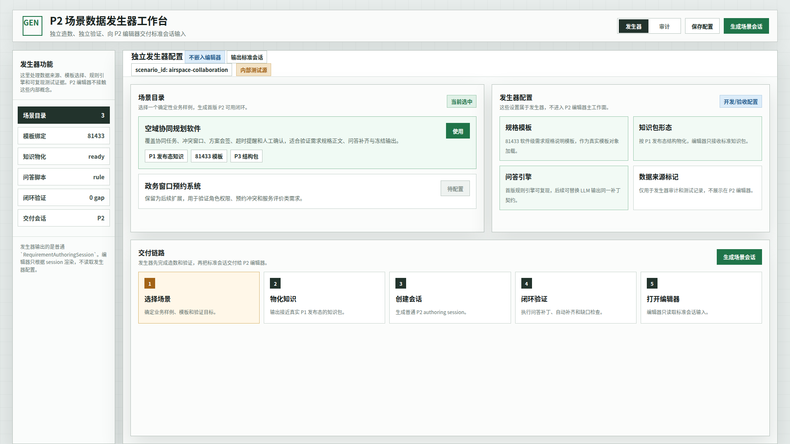
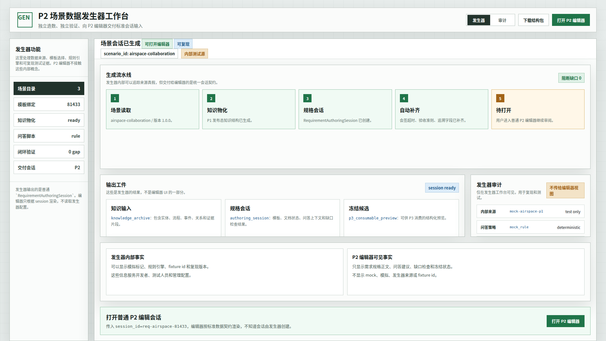
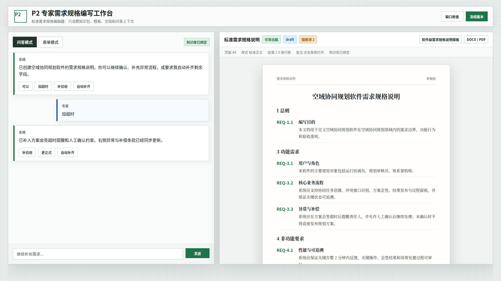

# CodeFactoryV2 P2 场景发生器独立工作台原型 v2

生成时间：2026-04-30 16:31:32

- 文档角色：`P2-P1 场景数据发生器` v2 正式原型评审入口
- 版本目录：`DOC/CODEX_DOC/08_原型与附图/2026-04-30-163132-CodeFactoryV2-P2场景发生器独立工作台原型-v2/`
- 当前状态：已被 v3 替代，不作为实现依据
- 目标路由：`/requirement-scenario-generator`、`/requirement-authoring/:session_id`
- 页面归属：`P2` 需求分析系统、`P2-P1 场景数据发生器`
- 页面主对象：`ScenarioGeneratorWorkbench`、`RequirementAuthoringSession`、`P1KnowledgeArchive`、`BrainstormingContract`、`FrozenRequirementSpec`
- 目标画板规格：三张评审图均为 `1920 x 1080`
- 源文件：`source/p2-scenario-generator-independent-workbench.html`

## 1. 本版定位

本版修正 v1 的核心边界错误：发生器是独立新功能，不是 P2 需求规格编辑器中的设置弹层。

本版表达三件事：

1. 发生器拥有独立工作台，用于配置、造数、验证和交付会话。
2. 发生器内部可以显示 mock、fixture、规则引擎和复现版本。
3. P2 编辑器只消费标准会话输入，不知道数据来源是真实还是模拟。

## 2. 非目标

1. 不把发生器继续塞进 P2 编辑器设置弹层。
2. 不把 mock、模拟、发生器来源显示在编辑器正文区或问答区。
3. 不设计完整管理员配置后台。
4. 不接入真实 LLM。
5. 不以本版原型替代运行态测试。

## 3. 共用事实源与设计依据

| 事实源 | 对本版原型的约束 |
| --- | --- |
| 用户对 v1 的批注意见 | 发生器必须独立成新功能；编辑器来源无感 |
| `DOC/CODEX_DOC/02_设计说明/P2_需求分析系统/P2-P1场景数据发生器设计.md` | 发生器输出标准 `RequirementAuthoringSession`，编辑器不读取发生器内部配置 |
| `DOC/CODEX_DOC/02_设计说明/P2_需求分析系统/P2-可配置需求规格说明编写系统设计.md` | 编辑器仍保持左问答/表单、右标准需求规格正文 |
| `DOC/CODEX_DOC/04_研制计划/02.01-WBS-P2-P1场景数据发生器-研制计划.md` | 首版仍覆盖场景目录、知识物化、问答补齐、缺口检查和冻结 |

## 4. 画板规格与布局预算

| 区域 | 规格 / 预算 | 设计说明 |
| --- | --- | --- |
| 主画板 | `1920 x 1080` | 桌面整页原型 |
| 发生器顶部栏 | 约 `78px` | 独立功能标题、保存、生成、打开编辑器等动作 |
| 发生器侧栏 | 约 `250px` | 场景目录、模板绑定、知识物化、问答脚本、闭环验证、交付会话 |
| 发生器主区 | 剩余宽度 | 配置、流水线、输出工件、审计和交付说明 |
| P2 编辑器态 | 左右分屏 | 只展示标准编辑器，不展示 mock 或发生器来源 |

## 5. 图文证据链

### 5.1 独立发生器工作台

**评阅状态：待用户确认**

**画板规格：** `1920 x 1080`

**设计依据：**

1. 发生器是独立页面，路由为 `/requirement-scenario-generator`。
2. 发生器有自己的侧栏、配置区、场景目录和交付链路。
3. 发生器内部配置明确标注“不嵌入编辑器”“输出标准会话”。
4. 场景数据、模板、问答引擎和来源标记都属于发生器配置，不进入 P2 编辑器主工作面。

**需要用户判断：**

1. 独立工作台的功能密度是否符合你对“发生器”的直观预期。
2. 侧栏里的功能分组是否能覆盖首版配置和验收需求。



### 5.2 生成与验证完成态

**评阅状态：待用户确认**

**画板规格：** `1920 x 1080`

**设计依据：**

1. 发生器内部可以显示 `mock-airspace-p1`、`mock_rule` 等审计信息。
2. 这些审计信息明确标注“不传给编辑器视图”。
3. 输出工件以标准契约表达：知识输入、规格会话、冻结候选。
4. 主动作是 `打开 P2 编辑器`，表达发生器与编辑器之间是交付关系。

**需要用户判断：**

1. 发生器内部审计区是否足够清楚地承载 mock/规则/复现信息。
2. “打开普通 P2 编辑会话”的交付语义是否准确。



### 5.3 普通 P2 编辑器无感态

**评阅状态：待用户确认**

**画板规格：** `1920 x 1080`

**设计依据：**

1. 进入编辑器后不再显示 `mock`、`模拟`、`发生器` 或 fixture id。
2. 编辑器只显示 `知识库已绑定`、问答、表单、标准正文、缺口检查和冻结动作。
3. 右侧仍保持 Word 式标准需求规格说明。
4. 左侧仍只有 `问答模式 / 表单模式` 两个 Tab，没有补齐第三 Tab。

**需要用户判断：**

1. 这个状态是否足以证明编辑器对数据真假无感。
2. 顶部 `知识库已绑定` 这种通用标识是否可接受。



## 6. 原始材料说明

本版无外部原始图片。`original/README.md` 已记录 v1 用户批注和事实源。

## 7. 原型到实现映射

| 原型区块 | 实现含义 | 验收关注点 |
| --- | --- | --- |
| 发生器独立路由 | `/requirement-scenario-generator` | 不是 P2 编辑器设置弹窗 |
| 场景目录 | `GET /api/requirement-authoring/scenarios` | 可选确定性场景 |
| 生成场景会话 | `POST /api/requirement-authoring/scenarios/{scenario_id}/materialize` | 输出标准 `RequirementAuthoringSession` |
| 发生器审计 | 场景运行记录与测试复现信息 | mock 信息只在发生器侧可见 |
| 打开 P2 编辑器 | `/requirement-authoring/:session_id` | 编辑器不显示 mock/模拟/发生器来源 |
| 普通编辑器 | 既有 P2 编辑器 | 左问答/表单，右标准正文 |

## 8. 允许偏差与不可接受偏差

允许偏差：

1. 独立发生器工作台可以放入 P2 功能导航或平台应用菜单。
2. 发生器审计区可以改成抽屉、Tab 或历史记录列表。
3. 输出工件字段名可随实际契约微调。
4. 编辑器中 `知识库已绑定` 可替换为等价的来源无感文案。

不可接受偏差：

1. 将发生器入口放回 P2 编辑器设置弹层。
2. 在 P2 编辑器工作面显示 `mock`、`模拟`、`场景发生器`、fixture id 或规则引擎名。
3. 让编辑器根据真假来源走不同 UI 分支。
4. 把发生器做成只靠按钮触发、没有独立配置和审计界面的隐藏能力。
5. 把 `补齐` 做成第三个输入 Tab。

## 9. 查看与再生成

直接打开源文件：

```bash
xdg-open DOC/CODEX_DOC/08_原型与附图/2026-04-30-163132-CodeFactoryV2-P2场景发生器独立工作台原型-v2/source/p2-scenario-generator-independent-workbench.html
```

重新生成截图：

```bash
base="$PWD/DOC/CODEX_DOC/08_原型与附图/2026-04-30-163132-CodeFactoryV2-P2场景发生器独立工作台原型-v2"
mkdir -p /tmp/cf-p2-generator-v2
ln -sfn "$base/source/p2-scenario-generator-independent-workbench.html" /tmp/cf-p2-generator-v2/prototype.html
for item in \
  "setup|01-1920x1080-独立发生器工作台.png" \
  "run|02-1920x1080-生成与验证完成态.png" \
  "editor|03-1920x1080-普通P2编辑器无感态.png"; do
  state="${item%%|*}"
  name="${item#*|}"
  tmp="/tmp/cf-p2-generator-v2/${state}-1920x1167.png"
  google-chrome --headless=new --disable-gpu --no-sandbox --hide-scrollbars --window-size=1920,1167 --screenshot="$tmp" "file:///tmp/cf-p2-generator-v2/prototype.html#$state"
  python3 - "$tmp" "$base/$name" <<'PY'
from PIL import Image
import sys
src, dst = sys.argv[1], sys.argv[2]
Image.open(src).convert("RGB").crop((0, 0, 1920, 1080)).save(dst)
PY
done
```

## 10. 自检结论

本版已完成以下自检：

1. 三张评审图均为 `1920 x 1080`。
2. 已实际查看三张截图，未发现错误页、主要面板空白、明显文字重叠或底部裁切。
3. 发生器态显示独立工作台、场景目录、配置区、交付链路和生成动作。
4. 生成态显示发生器审计，并明确标注“不传给编辑器视图”。
5. 编辑器态只显示 `知识库已绑定`、问答、标准正文、缺口检查和冻结动作。
6. 源码中编辑器可见块检查确认不包含 `mock`、`模拟`、`发生器`、`fixture`。

## 11. 评审结论与后续处理

当前结论：已被 v3 替代，不作为实现依据。

替代版本：

- `DOC/CODEX_DOC/08_原型与附图/2026-04-30-214734-CodeFactoryV2-XX-P1-Sim原型-v3/README.md`

替代原因：v2 仍把本功能理解为 P2 样例/场景数据发生器，并承担了 P2 不需要的会话生成、问答补齐和冻结验证语义；v3 已改为 `XX-P1-Sim`，只模拟 P1 上游领域知识服务。
