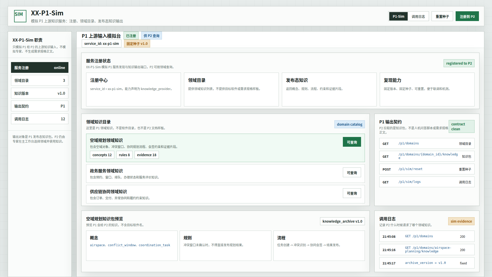
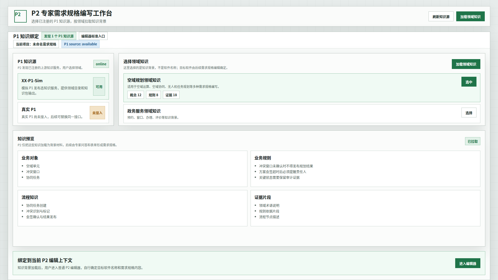
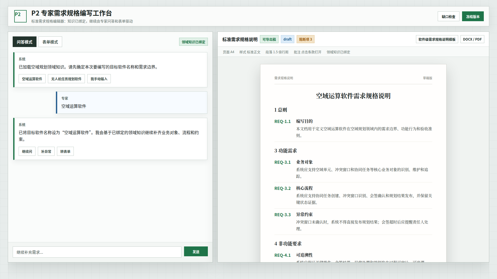

# CodeFactoryV2 XX-P1-Sim 原型 v3

生成时间：2026-04-30 21:47:34

- 文档角色：`XX-P1-Sim` 正式原型评审入口
- 版本目录：`DOC/CODEX_DOC/08_原型与附图/2026-04-30-214734-CodeFactoryV2-XX-P1-Sim原型-v3/`
- 当前状态：待用户确认
- 目标路由：`/xx-p1-sim`、`/requirement-authoring`
- 页面归属：`P2` 需求分析系统的上游联调输入
- 页面主对象：`XXP1SimPage`、`P1KnowledgeProviderRegistration`、`P1DomainKnowledgeArchive`、`RequirementAuthoringKnowledgeBinding`
- 目标画板规格：三张评审图均为 `1920 x 1080`
- 源文件：`source/xx-p1-sim-prototype.html`

## 1. 本版定位

本版废弃“场景数据发生器”“样例数据发生器”的方向，改为既有体系中的 `XX-P1-Sim`。

`XX-P1-Sim` 只模拟 P1 这个上游阶段给 P2 的知识输入端口。它不模拟专家输入，不生成需求规格说明，不生成 P2 文档，不做自动补齐，不做冻结。

## 2. 非目标

1. 不再使用“场景”“样例数据包”“样例项目包”作为正式概念。
2. 不提供“空域协同规划软件”这类成型软件目录。
3. 不模拟人的问答输入。
4. 不生成 P2 标准需求规格正文。
5. 不替代 P2 专家工作台。

## 3. 共用事实源与设计依据

| 事实源 | 对本版原型的约束 |
| --- | --- |
| 用户最新确认 | 命名沿用 `XX-Pn-Sim`；本轮为 `XX-P1-Sim` |
| 既有 `XX-P2-Sim` 口径 | Sim 是为下游提供上游模拟输入，不替代真实阶段 |
| `DOC/CODEX_DOC/02_设计说明/P2_需求分析系统/P2-XX-P1-Sim上游知识服务模拟器设计.md` | 已修正为 P1 上游知识输入模拟器 |
| `DOC/CODEX_DOC/04_研制计划/02.01-WBS-P2-XX-P1-Sim上游知识服务模拟器-研制计划.md` | 已修正为 XX-P1-Sim 实施计划 |

## 4. 画板规格与布局预算

| 区域 | 规格 / 预算 | 设计说明 |
| --- | --- | --- |
| 主画板 | `1920 x 1080` | 桌面整页原型 |
| `XX-P1-Sim` 顶部栏 | 约 `78px` | 服务注册、重置种子、注册到 P2 |
| `XX-P1-Sim` 侧栏 | 约 `250px` | 服务注册、领域目录、知识版本、输出契约、调用日志 |
| P2 知识绑定页 | 全宽工作区 | P2 发现 P1 知识源，选择领域并加载 |
| P2 编辑器态 | 左右分屏 | 领域知识已绑定，用户继续正常编写需求规格 |

## 5. 图文证据链

### 5.1 XX-P1-Sim 模拟输入台

**评阅状态：待用户确认**

**画板规格：** `1920 x 1080`

**设计依据：**

1. 页面命名为 `XX-P1-Sim`，对齐既有 `XX-Pn-Sim` 命名体系。
2. 它模拟的是 P1 发布态知识服务，而不是 P2 数据发生器。
3. 目录对象是领域知识，例如 `空域规划领域知识`，不是成型软件。
4. 输出契约只有 P1 知识相关接口：领域目录、领域知识包、重置、调用日志。

**需要用户判断：**

1. 这个 Sim 页是否符合你对已有模拟输入台的直觉。
2. 领域知识目录是否比“场景/样例/软件目录”更准确。



### 5.2 P2 选择 P1 领域知识

**评阅状态：待用户确认**

**画板规格：** `1920 x 1080`

**设计依据：**

1. P2 主界面发现 `XX-P1-Sim` 注册的 P1 知识源。
2. 用户在 P2 中选择领域知识，例如 `空域规划领域知识`。
3. P2 拉取概念、规则、流程、证据片段作为知识背景。
4. 目标软件名称还未确定，后续由 P2 编辑过程确认。

**需要用户判断：**

1. P2 中选择“领域知识”的位置和语义是否正确。
2. 是否还需要展示真实 P1 未接入、Sim 可替代的状态。



### 5.3 P2 普通编辑态

**评阅状态：待用户确认**

**画板规格：** `1920 x 1080`

**设计依据：**

1. 进入编辑器后，用户自行确定目标软件名称，例如 `空域运算软件`。
2. 编辑器显示 `领域知识已绑定`，不显示 `XX-P1-Sim`、mock、发生器等概念。
3. 左侧仍只有 `问答模式 / 表单模式` 两个 Tab。
4. 右侧仍保持 Word 式标准需求规格说明。

**需要用户判断：**

1. 这个状态是否表达了“Sim 只提供知识输入，P2 自己编辑需求”的边界。
2. `领域知识已绑定` 这个标识是否合适。



## 6. 原始材料说明

本版无外部原始图片。`original/README.md` 已记录 v1/v2 用户批注和事实源。

## 7. 原型到实现映射

| 原型区块 | 实现含义 | 验收关注点 |
| --- | --- | --- |
| `XX-P1-Sim` 独立路由 | `/xx-p1-sim` | 对齐既有 Sim 命名体系 |
| 服务注册 | P1 knowledge provider registration | P2 能发现该知识源 |
| 领域目录 | `GET /p1/domains` | 返回领域知识，不返回软件样例 |
| 知识包输出 | `GET /p1/domains/{domain_id}/knowledge` | 输出概念、规则、流程、证据 |
| P2 知识绑定 | `/requirement-authoring` 中的知识源选择 | 用户在 P2 里选择领域 |
| P2 编辑器 | 普通需求规格编辑器 | 不显示 Sim/mock/发生器概念 |

## 8. 允许偏差与不可接受偏差

允许偏差：

1. `XX-P1-Sim` 可以使用已有 Sim 页面布局组件。
2. P2 知识绑定入口可以是编辑器启动前的面板、侧栏或首步区域。
3. 领域知识字段可随 P1 输出契约调整。

不可接受偏差：

1. 将本功能命名为 P2 场景/样例数据发生器。
2. 在 Sim 中出现成型软件目录，例如 `空域协同规划软件`。
3. 让 Sim 生成需求规格说明、问答补丁、自动补齐或冻结包。
4. 模拟专家输入。
5. P2 编辑器暴露 Sim/mock/发生器来源。

## 9. 查看与再生成

直接打开源文件：

```bash
xdg-open DOC/CODEX_DOC/08_原型与附图/2026-04-30-214734-CodeFactoryV2-XX-P1-Sim原型-v3/source/xx-p1-sim-prototype.html
```

重新生成截图：

```bash
base="$PWD/DOC/CODEX_DOC/08_原型与附图/2026-04-30-214734-CodeFactoryV2-XX-P1-Sim原型-v3"
mkdir -p /tmp/cf-xx-p1-sim-v3
ln -sfn "$base/source/xx-p1-sim-prototype.html" /tmp/cf-xx-p1-sim-v3/prototype.html
for item in \
  "sim|01-1920x1080-XX-P1-Sim模拟输入台.png" \
  "bind|02-1920x1080-P2选择P1领域知识.png" \
  "editor|03-1920x1080-P2普通编辑态.png"; do
  state="${item%%|*}"
  name="${item#*|}"
  tmp="/tmp/cf-xx-p1-sim-v3/${state}-1920x1167.png"
  google-chrome --headless=new --disable-gpu --no-sandbox --hide-scrollbars --window-size=1920,1167 --screenshot="$tmp" "file:///tmp/cf-xx-p1-sim-v3/prototype.html#$state"
  python3 - "$tmp" "$base/$name" <<'PY'
from PIL import Image
import sys
src, dst = sys.argv[1], sys.argv[2]
Image.open(src).convert("RGB").crop((0, 0, 1920, 1080)).save(dst)
PY
done
```

## 10. 自检结论

自检时间：2026-04-30 22:06。

已执行：

1. 使用 `google-chrome --headless=new --window-size=1920,1167` 重新生成三张截图，并裁切为 `1920 x 1080`。
2. 使用 `file` 检查三张 PNG 均为 `1920 x 1080`。
3. 逐张查看截图，确认主要面板没有底部空白、明显重叠、文字溢出或错误裁切。
4. 检查 `XX-P1-Sim` 页面未出现 `空域协同规划软件` 这类成型软件目录；只展示 `空域规划领域知识` 等领域知识。
5. 检查 `P2 普通编辑态` 截图中未显示 `XX-P1-Sim`、`mock`、`模拟` 或 `发生器` 来源概念。

自检结论：通过，待用户确认。

## 11. 评审结论与后续处理

当前结论：待用户确认。

用户确认后，本版可作为 `XX-P1-Sim` 与 P2 知识绑定边界的实现事实源。v1、v2 保留为方向错误的历史原型证据，不再作为实现依据。
