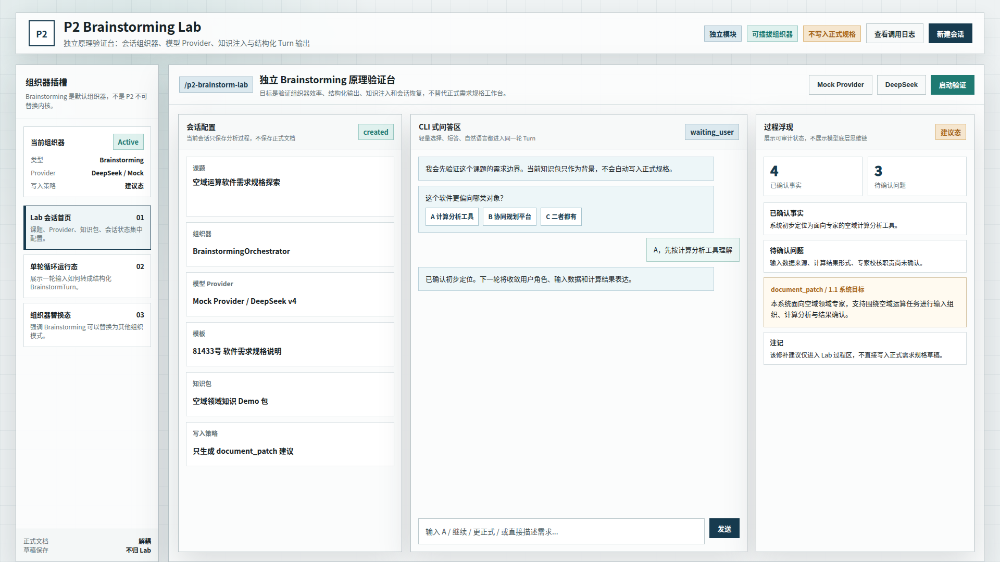
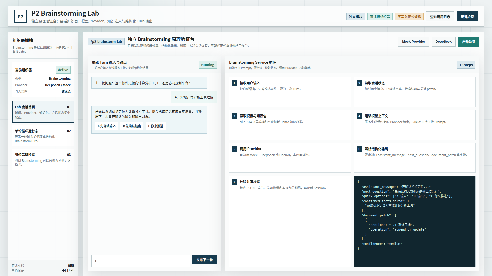
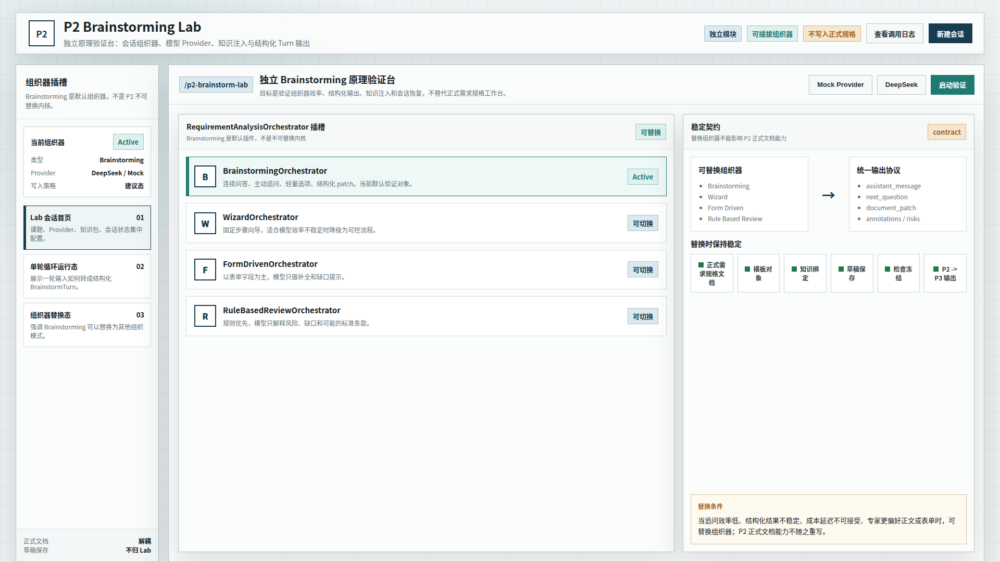

# CodeFactoryV2 P2 Brainstorming Lab 原型 v1

生成时间：2026-05-01

- 文档角色：`P2 Brainstorming Lab` 正式原型评审入口
- 版本目录：`DOC/CODEX_DOC/08_原型与附图/2026-05-01-120854-CodeFactoryV2-P2-Brainstorming-Lab原型-v1/`
- 当前状态：待用户确认
- 目标路由：`/p2-brainstorm-lab`
- 页面归属：`P2` 需求分析系统的独立原理验证台
- 页面主对象：`BrainstormSession`、`BrainstormTurn`、`RequirementAnalysisOrchestrator`、`ModelProvider`
- 目标画板规格：三张评审图均为 `1920 x 1080`
- 源文件：`source/p2-brainstorming-lab-prototype.html`

## 1. 本版定位

本版用于确认 `Brainstorming` 能力的独立原型形态。

它不是正式需求规格编辑器的改造稿，而是一个独立 Lab，用于验证：

1. `Brainstorming` 如何作为后台服务运行。
2. 一轮用户输入如何变成结构化 `BrainstormTurn`。
3. `Brainstorming` 如何作为可插拔组织器，而不是 `P2` 不可替换内核。
4. Lab 只生成 `document_patch` 建议，不直接写入正式需求规格草稿。

## 2. 非目标

1. 不替代当前专家需求规格编写工作台。
2. 不直接生成或冻结正式需求规格说明。
3. 不接入 `P3`。
4. 不在正式文档正文中显示模型底层思维链。
5. 不把 `Brainstorming` 做成不可替换的系统内核。

## 3. 共用事实源与设计依据

| 事实源 | 对本版原型的约束 |
| --- | --- |
| `P2-Brainstorming能力原理验证与架构规划.md` | `Brainstorming` 是独立、解耦、可插拔、可替换的能力模块 |
| 用户最新确认 | 先做独立原型图；强调可替换以降低对运行机制不确定性的风险 |
| `P2-需求规格编写系统原型设计.md` | 正式工作台仍保持问答 / 表单 / 标准正文结构，不被 Lab 替代 |
| `P2-XX-P1-Sim上游知识服务模拟器设计.md` | Lab 可以使用假知识包，但不关心知识来源是真实 P1 还是 Sim |

## 4. 图文证据链

### 4.1 独立 Brainstorming Lab 首页

**评阅状态：待用户确认**

**画板规格：** `1920 x 1080`

**设计依据：**

1. 页面独立命名为 `P2 Brainstorming Lab`。
2. 顶部明确显示 `独立模块 / 可插拔组织器 / 不写入正式规格`。
3. 左侧是组织器插槽摘要，不是正式需求规格编辑器导航。
4. 主区左侧配置会话、组织器、Provider、模板、知识包和写入策略。
5. 中间展示 CLI 式问答。
6. 右侧展示可审计过程状态和 `document_patch` 建议。



### 4.2 单轮循环运行态

**评阅状态：待用户确认**

**画板规格：** `1920 x 1080`

**设计依据：**

1. 展示一轮用户输入如何进入服务循环。
2. 明确前端不拼 Prompt，由服务读取状态、模板、知识包并调用 Provider。
3. 展示模型返回结构化 JSON 后，由服务校验并落状态。
4. 右侧保留 `Brainstorming Service 循环`，帮助理解它不是普通聊天。



### 4.3 可插拔组织器替换态

**评阅状态：待用户确认**

**画板规格：** `1920 x 1080`

**设计依据：**

1. 明确 `BrainstormingOrchestrator` 只是当前默认验证对象。
2. 同一插槽下可切换 `WizardOrchestrator`、`FormDrivenOrchestrator`、`RuleBasedReviewOrchestrator`。
3. 右侧强调统一输出协议。
4. 替换组织器时，正式需求规格文档、模板对象、知识绑定、草稿保存、检查冻结和 `P2 -> P3` 输出保持稳定。



## 5. 原型到实现映射

| 原型区块 | 实现含义 | 验收关注点 |
| --- | --- | --- |
| `P2 Brainstorming Lab` | 独立路由 `/p2-brainstorm-lab` | 不嵌入正式需求规格编辑器 |
| 组织器插槽 | `RequirementAnalysisOrchestrator` 抽象 | Brainstorming 可替换 |
| 会话配置 | `BrainstormSession` | 保存分析过程，不保存正式文档 |
| 单轮循环 | `POST /brainstorm/sessions/{id}/turns` | 输入、状态、Provider、校验、落状态链路清晰 |
| 过程浮现 | `BrainstormTurn` 展示 | 展示事实、问题、patch、注记，不展示底层思维链 |
| 稳定契约 | 正式 P2 文档能力 | 替换组织器不影响模板、草稿、检查、冻结和下游输出 |

## 6. 允许偏差与不可接受偏差

允许偏差：

1. 首版可以先使用 Mock Provider。
2. Lab 可以使用假知识包和假课题。
3. 真实实现时页面布局可以根据代码组件适度调整。

不可接受偏差：

1. 把 Brainstorming 直接写死进正式需求规格编辑器。
2. 让 Lab 直接写入正式需求规格草稿。
3. 把 `document_patch` 当成未经校验的正式正文。
4. 取消组织器可替换边界。
5. 将模型底层思维链作为产品展示内容。

## 7. 查看与再生成

直接打开源文件：

```bash
xdg-open DOC/CODEX_DOC/08_原型与附图/2026-05-01-120854-CodeFactoryV2-P2-Brainstorming-Lab原型-v1/source/p2-brainstorming-lab-prototype.html
```

重新生成截图：

```bash
base="$PWD/DOC/CODEX_DOC/08_原型与附图/2026-05-01-120854-CodeFactoryV2-P2-Brainstorming-Lab原型-v1"
for item in \
  "lab|01-1920x1080-独立BrainstormingLab首页.png" \
  "turn|02-1920x1080-单轮循环运行态.png" \
  "plugin|03-1920x1080-可插拔组织器替换态.png"; do
  state="${item%%|*}"
  name="${item#*|}"
  corepack pnpm --dir apps/web exec playwright screenshot \
    --viewport-size=1920,1080 \
    "file://$base/source/p2-brainstorming-lab-prototype.html#$state" \
    "$base/$name"
done
```
