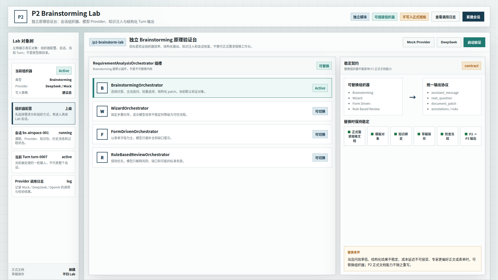
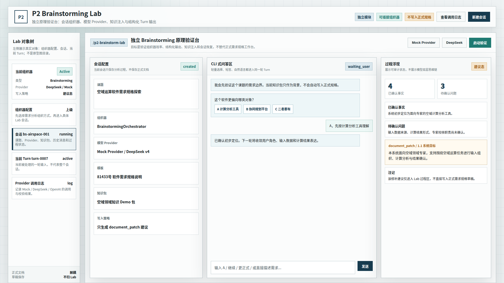
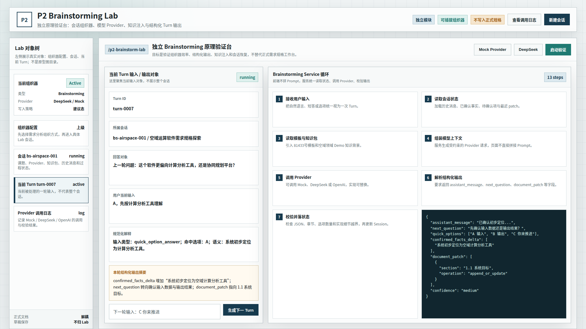

# CodeFactoryV2 P2 Brainstorming Lab 原型 v2

生成时间：2026-05-01 12:33:41

- 文档角色：`P2 Brainstorming Lab` 正式原型评审入口
- 版本目录：`DOC/CODEX_DOC/08_原型与附图/2026-05-01-123341-CodeFactoryV2-P2-Brainstorming-Lab原型-v2/`
- 当前状态：待用户确认（v2 修正稿）
- 目标路由：`/p2-brainstorm-lab`
- 页面归属：`P2` 需求分析系统的独立原理验证台
- 页面主对象：`RequirementAnalysisOrchestrator`、`BrainstormSession`、`BrainstormTurn`、`ModelProvider`
- 目标画板规格：三张评审图均为 `1920 x 1080`
- 源文件：`source/p2-brainstorming-lab-prototype.html`

## 1. 本版定位

本版修正 v1 的三类问题：

1. 左侧不再展示“Lab 首页 / 单轮循环 / 组织器替换”这种评审图目录感对象，改为真实 Lab 对象树。
2. 单轮循环页不再对应整个会话，而是对应当前 `BrainstormTurn` 输入对象。
3. 可插拔组织器配置提升为第一张图和上级入口，先配置组织器，再进入具体会话和单轮处理。

## 2. 非目标

1. 不替代当前专家需求规格编写工作台。
2. 不直接生成或冻结正式需求规格说明。
3. 不接入 `P3`。
4. 不在正式文档正文中显示模型底层思维链。
5. 不把 `Brainstorming` 做成不可替换的系统内核。

## 3. 共用事实源与设计依据

| 事实源 | 对本版原型的约束 |
| --- | --- |
| 用户对 v1 的批注 | 组织器配置应是上级入口；左侧应展示真实对象；单轮态应对应当前输入对象 |
| `P2-Brainstorming能力原理验证与架构规划.md` | `Brainstorming` 是独立、解耦、可插拔、可替换的能力模块 |
| `P2-需求规格编写系统原型设计.md` | 正式工作台仍保持问答 / 表单 / 标准正文结构，不被 Lab 替代 |
| `P2-XX-P1-Sim上游知识服务模拟器设计.md` | Lab 可以使用假知识包，但不关心知识来源是真实 P1 还是 Sim |

## 4. 图文证据链

### 4.1 组织器配置入口

**评阅状态：待用户确认**

**画板规格：** `1920 x 1080`

**设计依据：**

1. 组织器配置是上级入口，应先于会话和单轮运行态出现。
2. `BrainstormingOrchestrator` 只是默认验证对象。
3. 同一插槽下可切换 `WizardOrchestrator`、`FormDrivenOrchestrator`、`RuleBasedReviewOrchestrator`。
4. 右侧强调统一输出协议和稳定契约，避免 Brainstorming 绑定正式 P2 文档能力。



### 4.2 Lab 会话工作台

**评阅状态：待用户确认**

**画板规格：** `1920 x 1080`

**设计依据：**

1. 左侧对象树展示真实对象：组织器配置、会话、当前 Turn、Provider 调用日志。
2. 主区左侧配置当前会话、组织器、Provider、模板、知识包和写入策略。
3. 中间展示 CLI 式问答。
4. 右侧展示可审计过程状态和 `document_patch` 建议。
5. `document_patch` 仍然只进入 Lab 过程区，不直接写入正式需求规格草稿。



### 4.3 当前 Turn 单轮循环

**评阅状态：待用户确认**

**画板规格：** `1920 x 1080`

**设计依据：**

1. 单轮态聚焦 `turn-0007` 这个当前输入对象，不再展示整个会话。
2. 左侧对象树中 `当前 Turn turn-0007` 被选中。
3. Turn 输入区展示所属会话、回答对象、用户当前输入和规范化解释。
4. 右侧展示该 Turn 如何进入 `Brainstorming Service` 循环，并生成结构化 JSON。



## 5. 原型到实现映射

| 原型区块 | 实现含义 | 验收关注点 |
| --- | --- | --- |
| 组织器配置入口 | `RequirementAnalysisOrchestrator` 管理面 | 先配置组织器，再进入具体业务会话 |
| Lab 对象树 | Lab 内部对象导航 | 不再把评审图状态误画成业务页面 |
| 会话工作台 | `BrainstormSession` | 保存分析过程，不保存正式文档 |
| 当前 Turn | `BrainstormTurn` | 单轮输入、规范化解释和结构化输出一一对应 |
| 服务循环 | `POST /brainstorm/sessions/{id}/turns` | 输入、状态、Provider、校验、落状态链路清晰 |
| 稳定契约 | 正式 P2 文档能力 | 替换组织器不影响模板、草稿、检查、冻结和下游输出 |

## 6. 允许偏差与不可接受偏差

允许偏差：

1. 首版可以先使用 Mock Provider。
2. Lab 可以使用假知识包和假课题。
3. 真实实现时页面布局可以根据代码组件适度调整。

不可接受偏差：

1. 把 Brainstorming 直接写死进正式需求规格编辑器。
2. 把左侧对象树做成没有业务含义的图号目录。
3. 让单轮循环态对应整个会话，而不是当前输入对象。
4. 让 Lab 直接写入正式需求规格草稿。
5. 取消组织器可替换边界。
6. 将模型底层思维链作为产品展示内容。

## 7. 查看与再生成

直接打开源文件：

```bash
xdg-open DOC/CODEX_DOC/08_原型与附图/2026-05-01-123341-CodeFactoryV2-P2-Brainstorming-Lab原型-v2/source/p2-brainstorming-lab-prototype.html
```

重新生成截图：

```bash
base="$PWD/DOC/CODEX_DOC/08_原型与附图/2026-05-01-123341-CodeFactoryV2-P2-Brainstorming-Lab原型-v2"
for item in \
  "plugin|01-1920x1080-组织器配置入口.png" \
  "lab|02-1920x1080-Lab会话工作台.png" \
  "turn|03-1920x1080-当前Turn单轮循环.png"; do
  state="${item%%|*}"
  name="${item#*|}"
  corepack pnpm --dir apps/web exec playwright screenshot \
    --viewport-size=1920,1080 \
    "file://$base/source/p2-brainstorming-lab-prototype.html#$state" \
    "$base/$name"
done
```
