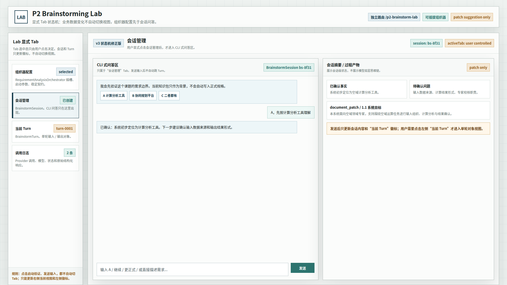

# CodeFactoryV2 P2 Brainstorming Lab 原型 v3

生成时间：2026-05-01 14:15:00

- 文档角色：`P2 Brainstorming Lab` 状态机修正版原型评审入口
- 版本目录：`DOC/CODEX_DOC/08_原型与附图/2026-05-01-141500-CodeFactoryV2-P2-Brainstorming-Lab原型-v3/`
- 当前状态：待用户确认
- 目标路由：`/p2-brainstorm-lab`
- 页面归属：`P2` 需求分析系统的独立原理验证台
- 设计依据：`DOC/CODEX_DOC/02_设计说明/P2_需求分析系统/P2-Brainstorming-Lab状态机与v3原型草案.md`
- 源文件：`source/p2-brainstorming-lab-prototype.html`

## 1. 本版修正目标

v3 针对当前实现和 v2 原型评审中的状态机问题做修正：

1. 左侧改为显式 `Tab`，不是业务对象自动高亮。
2. `组织器配置` 首屏只展示配置流程，不提前展示 `CLI 式问答区`。
3. `CLI 式问答区` 只属于 `会话管理` Tab。
4. `当前 Turn 输入 / 输出对象` 只属于 `当前 Turn` Tab。
5. `调用日志` 独立成 Tab。
6. 点击“启动验证”只创建会话，不自动切换到会话管理。
7. 发送输入只创建 Turn，不自动切换到当前 Turn。

核心规则：

```text
业务数据状态变化 != 界面 Tab 自动切换
```

## 2. 图文证据链

### 2.1 组织器配置 Tab

**画板规格：** `1920 x 1080`

**设计依据：**

1. 首屏默认进入组织器配置。
2. 主区顺序为 `可替换组织器 -> 启动参数 -> 稳定契约 / 输出协议`。
3. 点击“启动验证”后仍停留当前 Tab，只在会话管理 Tab 上显示状态徽标。
4. 此页不展示 `CLI 式问答区`。


### 2.2 会话管理 Tab

**画板规格：** `1920 x 1080`

**设计依据：**

1. 用户显式点击会话管理后，才进入 CLI 式问答区。
2. 会话管理展示 `BrainstormSession`、消息流、输入框、会话摘要和 `document_patch` 建议。
3. 发送输入后只更新会话内容和当前 Turn 徽标，不自动切换 Tab。
4. 实现阶段已补充会话管理细节：user 消息发送后立即上屏；输入框支持多行；快捷选项纵向展示；选项行不可点击，仅右侧“选择 X”按钮触发；快捷选项出现后消息流自动滚到底部。



> 注：本目录截图保留 v3 原型评审时的视觉稿。实现阶段的人测修正以设计说明和实现自检记录为准，未重新生成截图基线。

### 2.3 当前 Turn Tab

**画板规格：** `1920 x 1080`

**设计依据：**

1. 用户显式点击当前 Turn 后，才查看最新 Turn 输入/输出对象。
2. 左侧展示本轮输入对象：`user_input`、`answering`、`normalized_input`、`confirmed_facts_delta`。
3. 右侧展示 `Brainstorming Service` 循环和 `document_patch`。
4. 此页聚焦单轮输入对象，不把整个会话当作当前对象。


### 2.4 调用日志 Tab

**画板规格：** `1920 x 1080`

**设计依据：**

1. 调用日志独立展示 Provider 调用列表和调用详情。
2. 日志用于 Lab 可观测性和调试，不进入正式需求规格文档。
3. 原始结构化响应只作为调试证据，不展示模型底层思维链。


## 3. 与 v2 的差异

| 维度 | v2 | v3 |
| --- | --- | --- |
| 左侧导航 | 真实对象树，但容易被业务状态驱动高亮 | 显式 Tab，只由用户点击切换 |
| 首屏内容 | 仍容易让会话/Turn/配置混在同屏 | 只展示组织器配置三步 |
| CLI 问答区 | 可在首屏视觉中提前出现 | 只在会话管理 Tab |
| 当前 Turn | 已强调当前输入对象 | 独立成当前 Turn Tab |
| 调用日志 | 不是一等视图 | 独立成调用日志 Tab |
| 状态机 | 未明确区分业务状态和视图状态 | 双状态机分离 |

## 4. 原型到实现映射

| v3 原型区块 | 实现建议 |
| --- | --- |
| 左侧显式 Tab | `activeTab` 独立 state，不能由 `session/currentTurn` 自动推导 |
| 组织器配置 Tab | 展示组织器、启动参数、稳定契约；`handleStart()` 后不改 `activeTab` |
| 会话管理 Tab | 展示 CLI 问答区；`handleSend()` 后不改 `activeTab` |
| 当前 Turn Tab | 展示最新 `currentTurn` 输入/输出对象 |
| 调用日志 Tab | 展示 `session.provider_logs` 和选中日志详情 |
| Tab 徽标 | 来自业务状态，但只作提示，不代表选中态 |
| CLI 输入 | 使用多行输入框；Enter 发送，Shift+Enter 换行 |
| 发送反馈 | user 消息立即上屏，Provider 慢响应时显示 pending assistant |
| 快捷选项 | 纵向列表；推荐标签可突出；右侧独立选择按钮防误触 |
| 自动滚动 | 消息、pending、Turn、quick_options 变化时滚动到消息流底部 |

## 5. 查看与再生成

直接打开源文件：

```bash
xdg-open DOC/CODEX_DOC/08_原型与附图/2026-05-01-141500-CodeFactoryV2-P2-Brainstorming-Lab原型-v3/source/p2-brainstorming-lab-prototype.html
```

查看不同状态：

```text
source/p2-brainstorming-lab-prototype.html#config
source/p2-brainstorming-lab-prototype.html#session
source/p2-brainstorming-lab-prototype.html#turn
source/p2-brainstorming-lab-prototype.html#log
```

重新生成截图：

```bash
base="$PWD/DOC/CODEX_DOC/08_原型与附图/2026-05-01-141500-CodeFactoryV2-P2-Brainstorming-Lab原型-v3"
for item in \
  "config|01-1920x1080-组织器配置Tab.png" \
  "session|02-1920x1080-会话管理Tab.png" \
  "turn|03-1920x1080-当前TurnTab.png" \
  "log|04-1920x1080-调用日志Tab.png"; do
  state="${item%%|*}"
  name="${item#*|}"
  corepack pnpm --dir apps/web exec playwright screenshot \
    --viewport-size=1920,1080 \
    "file://$base/source/p2-brainstorming-lab-prototype.html#$state" \
    "$base/$name"
done
```

## 6. 自检结论

已执行原型自检：

- 4 个 hash 状态均可打开。
- 4 个状态标题正确。
- `#config` 状态不显示 `CLI 式问答区`。
- 4 个 1920x1080 画板无横向或纵向溢出。
- 4 张截图均已生成且非空。
