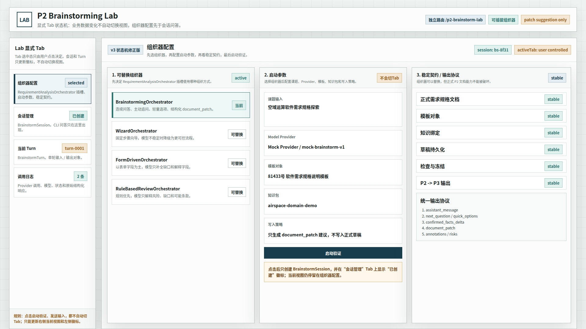
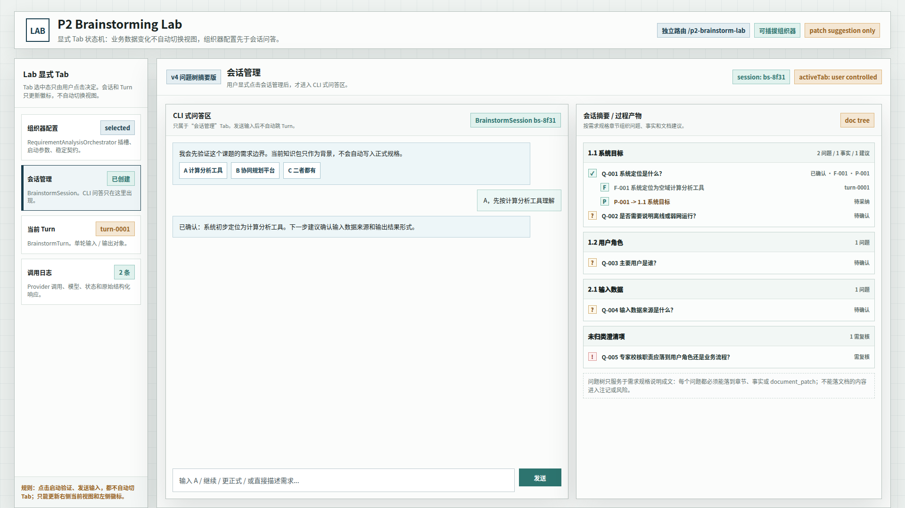
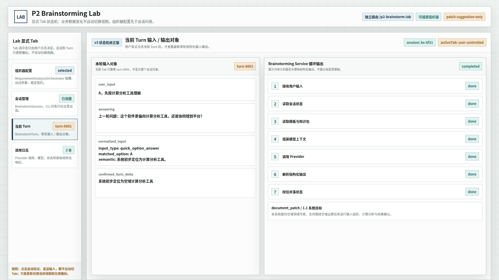
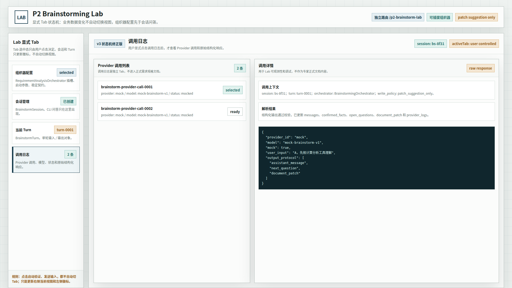

# CodeFactoryV2 P2 Brainstorming Lab 问题树摘要原型 v4

生成时间：2026-05-01 16:15:00

- 文档角色：`P2 Brainstorming Lab` 会话摘要问题树修正版原型评审入口
- 版本目录：`DOC/CODEX_DOC/08_原型与附图/2026-05-01-161500-CodeFactoryV2-P2-Brainstorming-Lab问题树摘要原型-v4/`
- 当前状态：待用户确认
- 目标路由：`/p2-brainstorm-lab`
- 页面归属：`P2` 需求分析系统的独立原理验证台
- 设计依据：`DOC/CODEX_DOC/02_设计说明/P2_需求分析系统/P2-Brainstorming-Lab会话摘要问题树设计草案.md`
- 源文件：`source/p2-brainstorming-lab-prototype.html`

## 1. 本版修正目标

v4 不推翻 v3 原型的整体结构，只替换“会话摘要 / 过程产物”区域。

保留内容：

1. 左侧显式 `Tab` 结构。
2. `组织器配置`、`会话管理`、`当前 Turn`、`调用日志` 四个工作区。
3. `CLI 式问答区` 位于会话管理 Tab。
4. 组织器配置、启动参数、稳定契约、当前 Turn 对象、调用日志等既有模块。
5. `业务数据状态变化 != 界面 Tab 自动切换` 的状态机约束。

本版新增：

1. 将线性的“已确认事实 / 待确认问题 / document_patch”改成面向需求规格章节的问题树。
2. 用 `Q-xxx` 表示问题，用 `F-xxx` 表示已确认事实，用 `P-xxx` 表示文档建议。
3. 每个问题必须能落到需求规格章节、事实或 `document_patch`。
4. 未能明确落章的内容进入“未归类澄清项”，避免污染正文生成逻辑。
5. 树节点状态区分 `待确认`、`已确认`、`需复核`，避免“待确认问题固定写死”的误解。

核心规则：

```text
Brainstorming Lab 的问题树只服务于需求规格说明成文。
它不是通用知识图谱，也不是任务管理器。
```

## 2. 图文证据链

### 2.1 组织器配置 Tab

**画板规格：** `1920 x 1080`

该页沿用 v3 结构：先选择可替换组织器，再配置启动参数，再查看稳定契约 / 输出协议。v4 未调整此页布局。



### 2.2 会话管理 Tab：问题树摘要

**画板规格：** `1920 x 1080`

本版重点调整该页右侧“会话摘要 / 过程产物”区域：

1. 左侧 `CLI 式问答区` 仍占主要宽度，用于持续问答和选择。
2. 右侧摘要区改成紧凑问题树，按需求规格章节组织。
3. `Q-001` 确认后，不再只把事实塞进“已确认事实”列表，而是在原问题下挂接 `F-001` 和 `P-001`。
4. `Q-002`、`Q-003`、`Q-004` 继续保持待确认状态。
5. `Q-005` 进入“未归类澄清项”，提示需要决定它应落入用户角色还是业务流程。



### 2.3 当前 Turn Tab

**画板规格：** `1920 x 1080`

该页沿用 v3 结构：聚焦单轮输入 / 输出对象，不把整个会话当作当前对象。v4 未调整此页布局。



### 2.4 调用日志 Tab

**画板规格：** `1920 x 1080`

该页沿用 v3 结构：Provider 调用列表和调用详情独立展示。v4 未调整此页布局。



## 3. 与 v3 的差异

| 维度 | v3 | v4 |
| --- | --- | --- |
| 会话摘要 | 线性展示已确认事实、待确认问题、document_patch | 章节导向的问题树 |
| 待确认问题 | 容易被理解为固定列表 | 问题节点有状态，可被确认、复核或归类 |
| 已确认事实 | 独立增长 | 挂在对应问题下 |
| document_patch | 独立卡片 | 挂在对应问题和章节下 |
| 章节关系 | 不明显 | 与需求规格章节直接绑定 |
| 设计边界 | 容易扩散成通用过程产物面板 | 明确只服务于需求规格说明成文 |

## 4. 原型到实现映射

| v4 原型区块 | 实现建议 |
| --- | --- |
| `doc-section` | 需求规格模板章节或写作主题 |
| `Q-xxx` | 当前会话的问题节点 |
| `F-xxx` | 由用户确认或模型抽取后等待确认的事实 |
| `P-xxx` | 指向目标章节的 `document_patch` 建议 |
| `未归类澄清项` | 尚未决定落章的内容，不能直接写入正文 |
| 节点状态 | `open`、`confirmed`、`review`、`superseded`、`cancelled` |
| 树形展示 | 默认紧凑展示，避免多行松散卡片堆叠 |

## 5. 查看与再生成

直接打开源文件：

```bash
xdg-open DOC/CODEX_DOC/08_原型与附图/2026-05-01-161500-CodeFactoryV2-P2-Brainstorming-Lab问题树摘要原型-v4/source/p2-brainstorming-lab-prototype.html
```

查看不同状态：

```text
source/p2-brainstorming-lab-prototype.html#config
source/p2-brainstorming-lab-prototype.html#session
source/p2-brainstorming-lab-prototype.html#turn
source/p2-brainstorming-lab-prototype.html#log
```

重新生成会话管理截图：

```bash
base="$PWD/DOC/CODEX_DOC/08_原型与附图/2026-05-01-161500-CodeFactoryV2-P2-Brainstorming-Lab问题树摘要原型-v4"
corepack pnpm --dir apps/web exec playwright screenshot \
  --viewport-size=1920,1080 \
  "file://$base/source/p2-brainstorming-lab-prototype.html#session" \
  "$base/02-1920x1080-会话管理Tab-问题树摘要.png"
```

## 6. 自检结论

已执行原型自检：

- `#session` 状态可打开。
- 会话管理页仍保留 `CLI 式问答区`。
- 会话摘要区已替换为 `doc-tree` 问题树。
- 问题树包含 `Q-001`、`F-001`、`P-001` 的挂接关系。
- 问题树包含 `1.1 系统目标`、`1.2 用户角色`、`2.1 输入数据` 和 `未归类澄清项`。
- 1920x1080 会话管理截图已生成。
