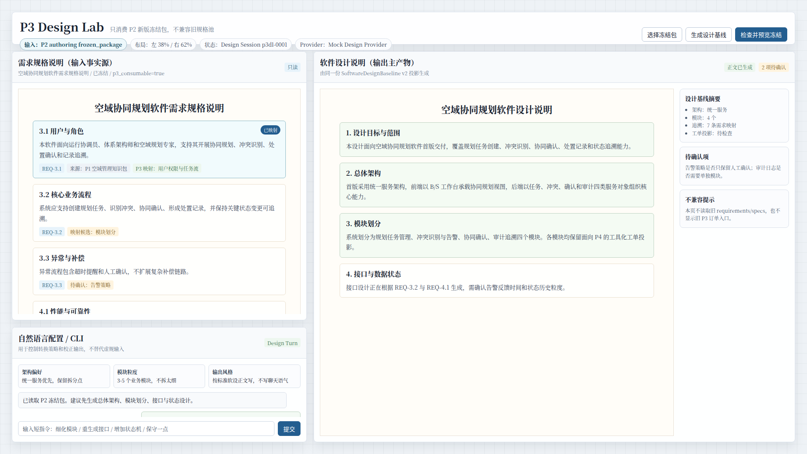
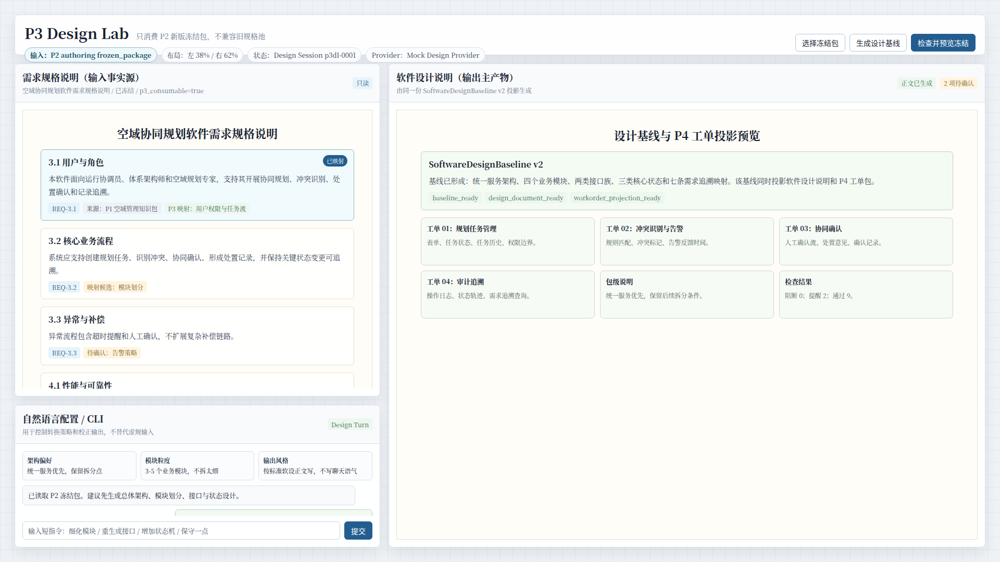

# CodeFactoryV2 P3 Design Lab 原型 v1

生成时间：2026-05-01 19:29:45

- 文档角色：`P3 Design Lab` 正式原型评审入口
- 版本目录：`DOC/CODEX_DOC/08_原型与附图/2026-05-01-192945-CodeFactoryV2-P3-Design-Lab原型-v1/`
- 当前状态：待用户确认
- 目标路由：`/p3-design-lab`
- 页面归属：`P3` 软件设计系统，`P3 v2` 需规到软设核心能力原理验证台
- 页面主对象：`P3DesignInputPackage`、`P3DesignSession`、`P3DesignTurn`、`P3DesignPatch`、`SoftwareDesignBaseline v2`
- 目标画板规格：三张评审图均为 `1920 x 1080`
- 源文件：`source/p3-design-lab-prototype.html`

## 1. 本版定位

本版用于确认 `P3 Design Lab` 的首版页面结构和核心信息关系。

已确认设计前提：

1. `P3 v2` 新增独立 `/p3-design-lab`。
2. 旧 `/xx-p3` 保留为历史流程面，不参与新版核心路径。
3. `P3 v2` 只消费 `P2` 新版 authoring 冻结包。
4. `P3 v2` 绝不兼容旧 `/requirements/specs`。
5. `P3` 的主转换关系是“需求规格说明正文 -> 软件设计说明正文”。
6. 自然语言配置 / CLI 是转换控制和校正通道，不是主输入本体。

## 2. 非目标

本版不解决以下事项：

1. 不实现真实 React 页面。
2. 不接入真实模型 Provider。
3. 不改造旧 `/xx-p3`。
4. 不设计完整审批流、评审流或 `P4` 正式推送流。
5. 不提供旧规格池兼容路径。
6. 不把本原型直接视为最终视觉规范；它是首版结构评审稿。

## 3. 共用事实源与设计依据

| 事实源 | 对本版原型的约束 |
| --- | --- |
| 用户关于 P3 偏离主干的批注 | 当前 P3 过于偏审批流，应回到“需规到软设”的核心能力 |
| 用户关于 P3 三块关系的说明 | 左上展示需规，左下放自然语言配置 / CLI，右侧突出软设正文 |
| `P3-软件设计系统设计.md` | 已吸收 `P3 Design Lab` 的输入契约、对象模型、服务边界和目标态解耦口径 |
| `P2-需求分析系统设计-260430-0016-可配置需求规格说明编写系统设计.md` | 学习 P2 的“标准文档正面产物 + 后台语义状态”方法 |
| `P2-Brainstorming能力原理验证与架构规划.md` | 学习先用独立 Lab 验证核心组织器，再并入正式工作台的方法 |

## 4. 画板规格与布局预算

| 区域 | 规格 / 预算 | 设计说明 |
| --- | --- | --- |
| 主画板 | `1920 x 1080` | 桌面整页原型 |
| 顶部栏 | 约 `78px` | 页面标题、输入契约、当前会话、Provider 和主动作 |
| 主内容 | 剩余高度 | 左右双区 |
| 左侧整体 | 约 `38%` 宽 | 输入事实源和 CLI 控制面 |
| 右侧整体 | 约 `62%` 宽 | 软件设计说明正文主产物 |
| 左上需规 | 左侧高度约 `70%` | 展示 P2 冻结需求规格说明，支持条款定位 |
| 左下 CLI | 左侧高度约 `30%` | 设计生成策略、短指令和本轮 Design Turn |
| 右侧正文 | 右侧主区 | 展示软件设计说明、设计基线摘要和 P4 投影 |

## 5. 图文证据链

### 5.1 Design Lab 总览态

**评阅状态：待用户确认**

**画板规格：** `1920 x 1080`

**设计依据：**

1. `P3` 主关系是“需求规格说明 -> 软件设计说明”，因此右侧软设正文占最大展示权重。
2. 左上需求规格说明必须直接显示标准正文，不只显示摘要或卡片。
3. 左下 CLI 用于配置和校正转换策略，权重低于需规和软设。
4. 顶部明确写出“只消费 P2 新版冻结包，不兼容旧规格池”。

**需要用户判断：**

1. 左侧需规和右侧软设的权重是否符合直觉。
2. CLI 是否足够低调，同时仍能承担策略配置和校正职责。
3. 右侧是否应继续保留设计基线摘要侧栏。

**允许偏差：**

- 实现时可以将右侧摘要改为抽屉或折叠侧栏。
- 左上需规正文可以滚动，本图中底部露出下一节是滚动暗示。



### 5.2 需规到软设条款映射态

**评阅状态：待用户确认**

**画板规格：** `1920 x 1080`

**设计依据：**

1. `P3 v2` 不能只生成大段软设正文，还必须能解释需规条款如何映射到软设章节和模块。
2. `Design Patch` 是自然语言配置 / CLI 一轮交互后的结构化修补意图。
3. 页面需要呈现条款、设计补丁、模块拆分和校验结果，避免再次变成不可审计的生成黑盒。

**需要用户判断：**

1. 映射态是否能表达“需规条款 -> 软设章节 -> 模块工单”的关系。
2. `Design Patch` 是否应作为右侧正文内联块展示，还是放到侧边抽屉。

**允许偏差：**

- 真实实现中映射线可以用更明确的高亮或悬浮连线表达。
- 模块卡片数量可随实际设计基线变化。


### 5.3 设计基线与 P4 工单投影态

**评阅状态：待用户确认**

**画板规格：** `1920 x 1080`

**设计依据：**

1. `P3 Design Lab` 首版验证范围已确认到 `SoftwareDesignBaseline v2`。
2. 软件设计说明、结构化设计基线和 `P4` 工单投影必须同源。
3. 工单投影只作为预览，不等同于旧 `P3` 正式推送流程。

**需要用户判断：**

1. 工单投影是否应在 Lab 中以预览网格展示。
2. 设计基线完成态是否需要保留左侧需规和 CLI，还是可以在完成态进一步扩大右侧输出区。

**允许偏差：**

- 后续实现可把工单投影放进右侧下方 Tab 或抽屉。
- 检查结果字段可随实际服务契约调整。



## 6. 原始材料说明

本版无外部原始图片。详见：

- `original/README.md`

## 7. 原型到实现映射

| 原型区块 | 实现含义 | 验收关注点 |
| --- | --- | --- |
| `/p3-design-lab` 页面 | 新增 P3 v2 独立 Lab | 不替换旧 `/xx-p3` |
| 左上需求规格说明 | `P3DesignInputPackage.standard_document` | 只读展示 P2 新版冻结包正文 |
| 左下 CLI | `P3DesignTurn` 输入和响应 | 控制转换策略，不替代需规输入 |
| 右侧软件设计说明 | `SoftwareDesignBaseline v2` 的文档投影 | 输出主产物，占最大展示权重 |
| 条款映射态 | 需求条款到设计章节、模块和工单的追溯 | 可审计，不是黑盒生成 |
| 工单投影态 | `P4` 模块工单包预览 | 只预览，不直接执行旧推送流程 |

## 8. 允许偏差与不可接受偏差

允许偏差：

1. 右侧摘要区可改为抽屉、Tab 或折叠面板。
2. 左侧需规正文可按真实模板结构调整章节密度。
3. CLI 的提示语和短指令可随服务能力调整。
4. 工单投影的字段名可随 `P4` 接口契约调整。

不可接受偏差：

1. 在 `P3 v2` 中接入旧 `/requirements/specs`。
2. 把旧 `/xx-p3` 的订单审批列表作为新版首屏主对象。
3. 让 CLI 替代需规正文成为主输入。
4. 让软件设计说明正文失去右侧主产物地位。
5. 只展示生成结果，不展示需规到软设的条款映射和设计补丁。
6. 把 Lab 工单预览直接做成正式 `P4` 推送。

## 9. 查看与再生成

直接打开源文件：

```bash
xdg-open DOC/CODEX_DOC/08_原型与附图/2026-05-01-192945-CodeFactoryV2-P3-Design-Lab原型-v1/source/p3-design-lab-prototype.html
```

重新生成截图：

```bash
base="$PWD/DOC/CODEX_DOC/08_原型与附图/2026-05-01-192945-CodeFactoryV2-P3-Design-Lab原型-v1"
for item in \
  "overview|01-1920x1080-Design-Lab总览态.png" \
  "trace|02-1920x1080-需规到软设条款映射态.png" \
  "complete|03-1920x1080-设计基线与P4工单投影态.png"; do
  state="${item%%|*}"
  name="${item#*|}"
  corepack pnpm --dir apps/web exec playwright screenshot \
    --viewport-size=1920,1080 \
    "file://$base/source/p3-design-lab-prototype.html#$state" \
    "$base/$name"
done
```

## 10. 自检结论

本版已完成以下自检：

1. 三张评审图均为 `1920 x 1080`。
2. 已实际查看三张截图，未发现错误页、主面板空白、明显文字重叠或主要内容裁切。
3. 总览态能表达左上需规、左下 CLI、右侧软设正文的权重关系。
4. 条款映射态能表达需规条款到软设章节、模块和 `Design Patch` 的关系。
5. 完成态能表达 `SoftwareDesignBaseline v2` 和 `P4` 工单投影预览。
6. 页面显式写出“只消费 P2 新版冻结包，不兼容旧规格池”。

## 11. 评审结论与后续处理

当前结论：待用户确认。

建议用户重点评审：

1. 三块区域的空间权重是否合理。
2. 右侧是否需要保留设计基线摘要侧栏。
3. 条款映射和工单投影是否足以支撑后续实现。
