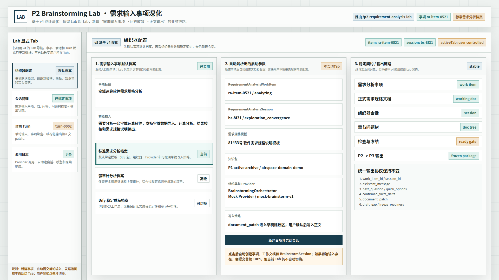
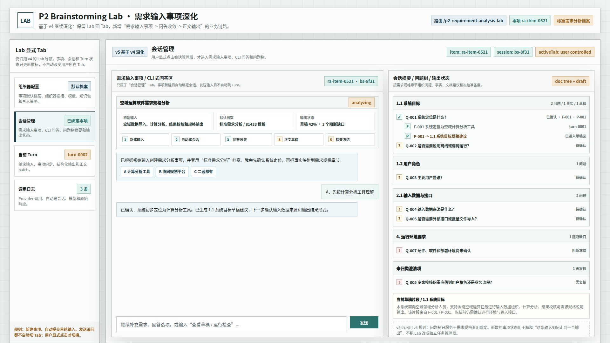
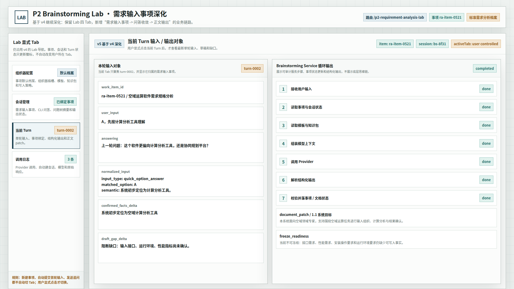
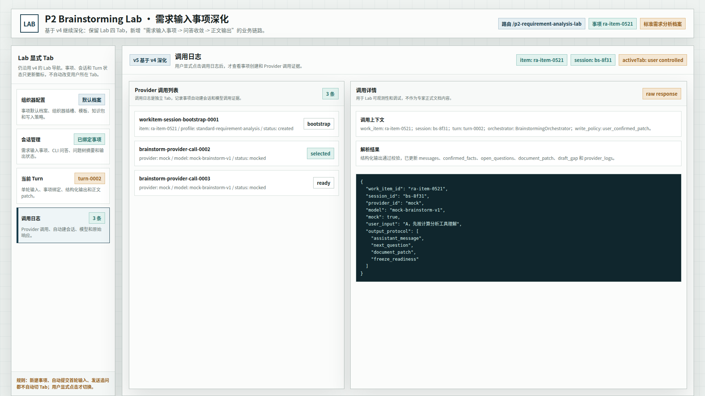

# CodeFactoryV2 P2 Brainstorming Lab 需求输入事项深化原型 v5

生成时间：2026-05-12 20:57:52

- 文档角色：`P2 Brainstorming Lab` 需求输入事项深化版原型评审入口
- 版本目录：`DOC/CODEX_DOC/08_原型与附图/2026-05-12-205752-CodeFactoryV2-P2-Brainstorming-Lab需求输入事项深化原型-v5/`
- 当前状态：待用户确认
- 目标路由：`/p2-requirement-analysis-lab`
- 页面归属：`P2` 需求分析系统的 Lab / 高级诊断台
- 设计依据：
  - `DOC/CODEX_DOC/02_设计说明/P2_需求分析系统/P2-需求分析系统设计-260512-1904-面向用户工作流升级补充.md`
  - `DOC/CODEX_DOC/08_原型与附图/2026-05-01-161500-CodeFactoryV2-P2-Brainstorming-Lab问题树摘要原型-v4/README.md`
  - `DOC/CODEX_DOC/08_原型与附图/2026-05-01-161500-CodeFactoryV2-P2-Brainstorming-Lab问题树摘要原型-v4/source/p2-brainstorming-lab-prototype.html`
  - 用户批注：前两版 2026-05-12 方向偏离 Lab，应删除并基于 v4 继续深化
- 源文件：`source/p2-brainstorming-lab-workitem-prototype.html`

## 1. 本版定位

v5 不重做主界面骨架，仍保留 v4 的四个 Tab、左侧显式状态机和章节问题树表达。

本版只做一件事：把 Lab 的会话管理从“组织器问题树摘要”深化为“需求输入事项驱动的业务入口”，让用户能够看见：

1. 新建一条需求输入事项。
2. 系统自动套用默认档案并创建会话。
3. 通过 CLI 式问答继续收敛问题。
4. 问题树把事实、草稿建议和冻结缺口串起来。

## 2. 非目标

本版不做以下事情：

1. 不把主界面改成独立事项中心。
2. 不把 Lab 改成纯业务 CRUD 工作台。
3. 不删除组织器配置、Turn 和调用日志 Tab。
4. 不把所有内部配置直接暴露给普通用户。
5. 不尝试完成后端实现，只交付面向用户确认的效果原型。

## 3. 画板规格

- 桌面画板：`1920 x 1080`
- 比例：`16:9`
- 目标：整页桌面原型
- 布局预算：左侧导航约 `284px`，右侧工作区占余量；顶部工具条约 `80px`，主体内容区约 `956px`

## 4. 图文证据链

### 4.1 组织器配置 Tab

- 评阅状态：`待用户确认`
- 画板规格：`1920 x 1080`
- 设计依据：事项默认档案先于会话出现，但仍保留组织器、模板、知识包和写入策略
- 需要用户判断的问题：默认档案是否应以“标准需求分析”为主，还是需要更明确的业务模板名
- 允许偏差：按钮文案、档案名称、辅助说明可微调
- 不可接受偏差：不能把配置页重做成另一个主工作台



### 4.2 会话管理 Tab

- 评阅状态：`待用户确认`
- 画板规格：`1920 x 1080`
- 设计依据：用户输入事项、CLI 问答、问题树、草稿建议和冻结准备度必须放在同一视图里
- 需要用户判断的问题：问题树是否还要继续加深到更多章节，还是保持现在这种紧凑密度
- 允许偏差：问题编号、草稿说明、流程文案可微调
- 不可接受偏差：不能把会话页改成纯表单或纯日志页



### 4.3 当前 Turn Tab

- 评阅状态：`待用户确认`
- 画板规格：`1920 x 1080`
- 设计依据：单轮 Turn 需要明确绑定事项，并展示输入、草稿缺口和结构化输出
- 需要用户判断的问题：Turn 页面是否还要保留更多审计字段，还是保持当前这类运行态字段足够
- 允许偏差：字段排布可微调
- 不可接受偏差：不能把整个会话目录塞进当前 Turn



### 4.4 调用日志 Tab

- 评阅状态：`待用户确认`
- 画板规格：`1920 x 1080`
- 设计依据：调用日志要能解释事项创建、自动建会话和 Provider 调用顺序
- 需要用户判断的问题：日志是否需要再加一列“事项阶段”
- 允许偏差：日志条数、详情字段和 raw response 内容可微调
- 不可接受偏差：不能把日志和正式文档混在一起



## 5. 原始材料说明

- 本版没有外部原始图片。
- 本版直接继承 v4 的 Lab 状态机、四 Tab 框架和问题树方向。
- v5 的原型源文件由 v4 源文件复制后继续深化。

## 6. 原型到实现映射

| 原型区块 | 实现含义 |
| --- | --- |
| 事项默认档案 | 需求分析事项创建时自动绑定的配置档 |
| 需求输入事项 | 用户在 P2 的业务入口对象 |
| CLI 式问答区 | 用户继续补充需求和确认事实的主交互区 |
| 问题树摘要 | 需求规格章节、事实、草稿建议和缺口状态的合并视图 |
| 草稿片段 | 需求规格说明工作文档中的当前可读段落 |
| 冻结准备度 | 是否可以冻结并输出给 P3 的判断 |
| 调用日志 | 组织器 / Provider / 会话创建的审计证据 |

## 7. 允许偏差与不可接受偏差

允许偏差：

1. 文案可按实际实现略作简化。
2. 颜色、边距、字号可在同一风格内微调。
3. 问题编号和日志编号可按真实数据重新排列。

不可接受偏差：

1. 不得把主界面改造成全新的布局骨架。
2. 不得把 Tab 逻辑改成自动切换。
3. 不得把需求输入事项隐藏掉，只保留组织器配置。
4. 不得把问题树简化成普通列表。

## 8. 查看与再生成

打开源文件：

```bash
xdg-open DOC/CODEX_DOC/08_原型与附图/2026-05-12-205752-CodeFactoryV2-P2-Brainstorming-Lab需求输入事项深化原型-v5/source/p2-brainstorming-lab-workitem-prototype.html
```

重新生成截图：

```bash
base="$PWD/DOC/CODEX_DOC/08_原型与附图/2026-05-12-205752-CodeFactoryV2-P2-Brainstorming-Lab需求输入事项深化原型-v5"
corepack pnpm --dir apps/web exec playwright screenshot \
  --viewport-size=1920,1080 \
  "file://$base/source/p2-brainstorming-lab-workitem-prototype.html#config" \
  "$base/01-1920x1080-组织器配置Tab.png"
```

将 `#config` 替换为 `#session`、`#turn`、`#log` 可分别生成其余三张图。

## 9. 评审结论与后续处理

- 当前结论：`待用户确认`
- 下一步：如你认可这版方向，我再把 v5 的设计结论同步回设计说明主文档或继续做下一轮细化。
