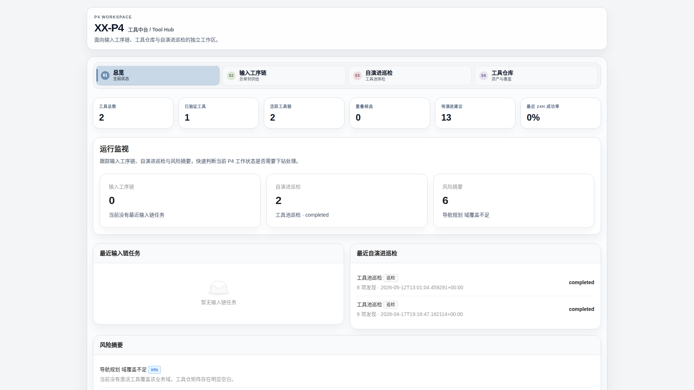
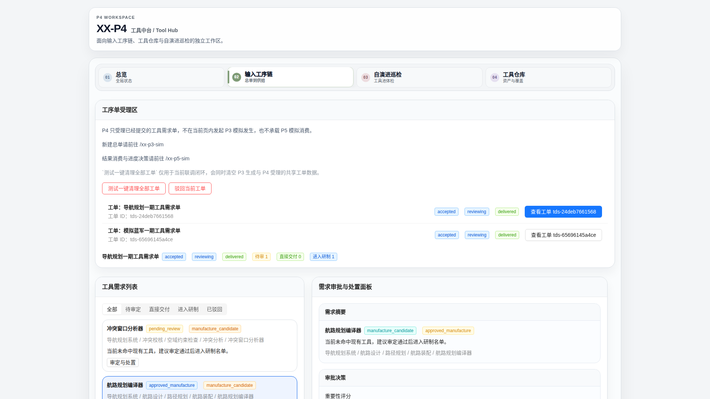
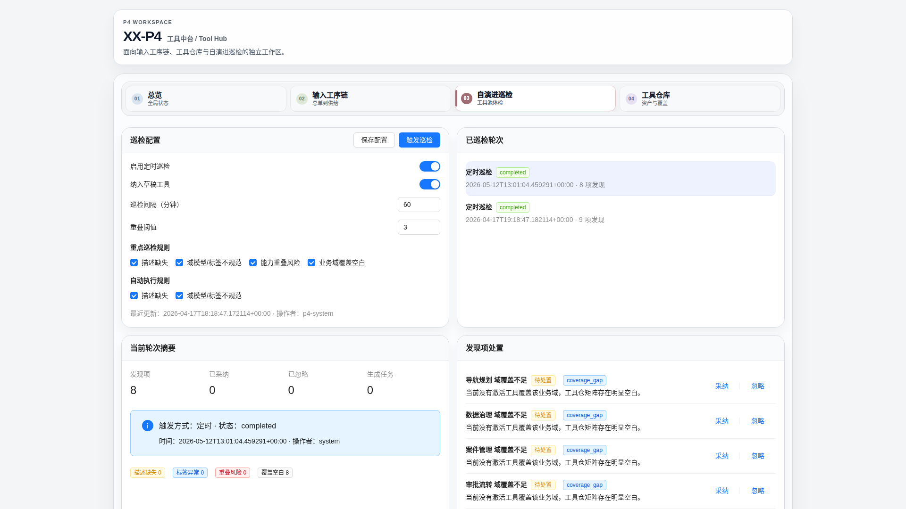
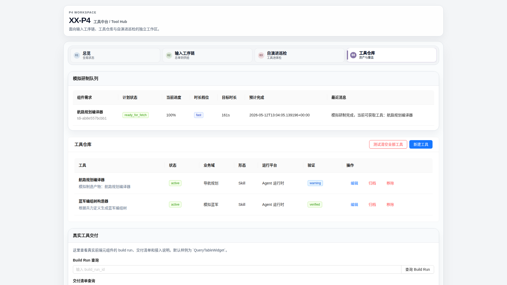
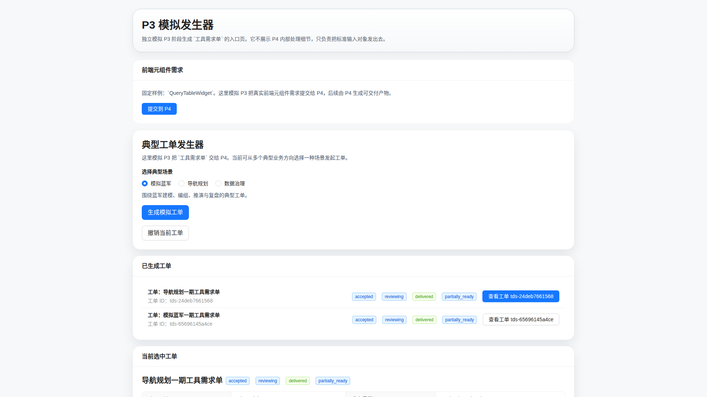
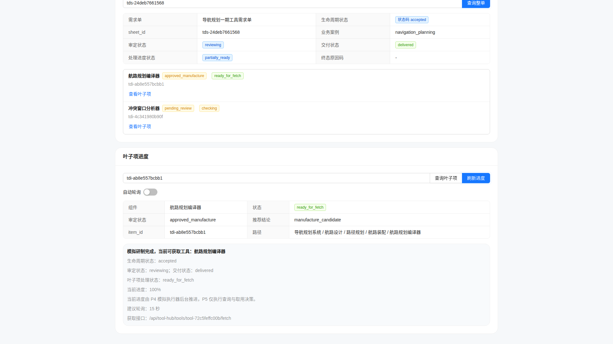
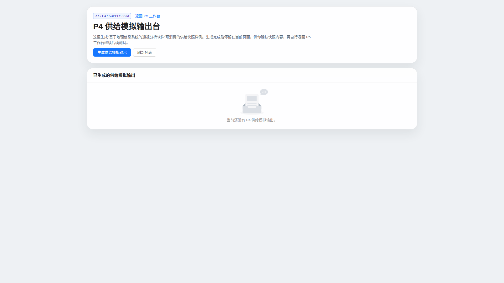
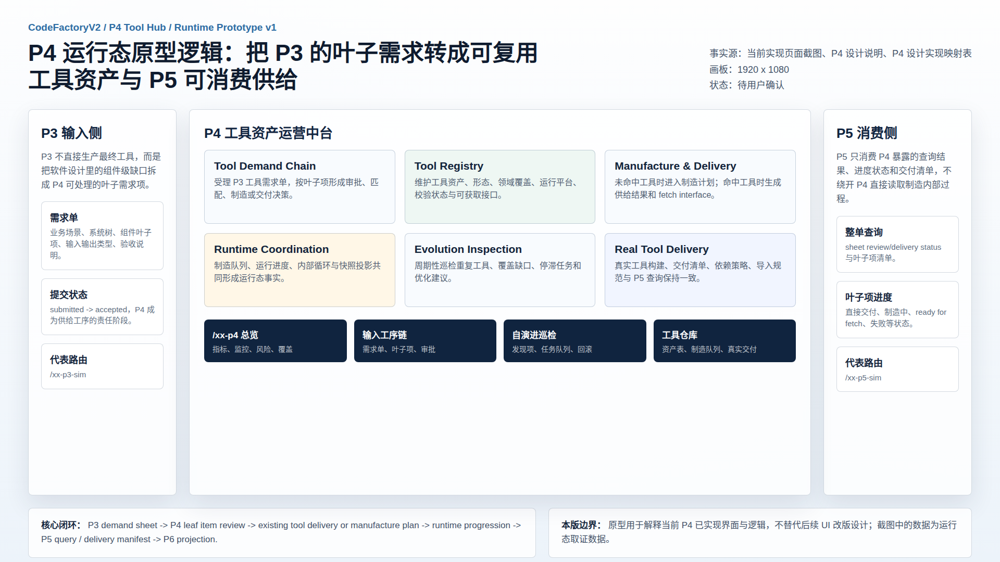

# CodeFactoryV2 P4 工具仓库运行态原型 v1

生成时间：2026-05-12 21:00:13

- 文档角色：`P4 工具仓库` 运行态原型评审入口
- 版本目录：`DOC/CODEX_DOC/08_原型与附图/2026-05-12-210013-CodeFactoryV2-P4工具仓库运行态原型-v1/`
- 当前状态：待用户确认
- 目标路由：`/xx-p4`、`/xx-p3-sim`、`/xx-p5-sim`、`/xx-p4-supply-sim`
- 页面归属：`P4` 工具资产运营中台，附带 P3 输入侧和 P5 消费侧运行态截面
- 页面主对象：`ToolDemandSheet`、`ToolDemandItem`、`ToolDefinition`、`ToolManufacturePlanView`、`EvolutionRun`、`ItemProgressView`
- 目标画板规格：八张评审图均为 `1920 x 1080`
- 源文件：`source/capture-p4-runtime-prototype.mjs`、`source/p4-runtime-prototype-map.html`

## 1. 本版定位

本版用于把当前已经实现的 `P4` 页面重新映射成可评审的原型包。

本版不是空想 UI 原型，而是基于当前 worktree 的运行态页面截图。截图前通过已实现接口准备了代表性数据：`P3` 提交工具需求单，`P4` 完成既有工具匹配、制造队列推进和工具仓库投影，`P5` 查询消费 P4 输出。

## 2. 非目标

1. 不重做 `P4` 前端视觉设计。
2. 不把本版截图直接视为最终 UI 美术规范。
3. 不替代 `P4-工具仓库设计.md` 的软件设计说明。
4. 不承诺所有 P4 子能力已达到最终闭环；本版只标注当前实现能稳定表达的运行态关系。
5. 不把 `/xx-p4-supply-sim` 误认为 P4 主业务闭环；它是 P4 向 P5 构建侧供给样例的辅助页。

## 3. 共用事实源与设计依据

| 事实源 | 对本版原型的约束 |
| --- | --- |
| `DOC/CODEX_DOC/02_设计说明/P4_工具仓库/P4-工具仓库设计.md` | 确认 P4 是工具资产运营中台，主路径是 P3 需求单到 P5 可消费供给 |
| `DOC/CODEX_DOC/03_规范与流程/03_设计实现映射/01-P4-设计实现映射表.md` | 确认 `/xx-p4` 页面、P4 组件组和 API 归属 |
| `apps/web/src/pages/XXP4Page.tsx` | 当前 P4 主工作台由总览、输入工序链、自演进巡检、工具仓库四个工作态组成 |
| `apps/web/src/components/p4/*` | 证明截图中的指标、需求链、制造队列、工具表、巡检和真实交付来自实现组件 |
| `apps/web/src/pages/XXP3SimPage.tsx`、`apps/web/src/pages/XXP5SimPage.tsx` | 证明 P3 输入侧和 P5 消费侧已有独立模拟入口 |
| 当前本地 API 运行态数据 | 提供截图中的需求单、叶子项、工具资产、制造计划和进度状态 |

## 4. 画板规格与布局预算

| 区域 | 规格 / 预算 | 设计说明 |
| --- | --- | --- |
| 主画板 | `1920 x 1080` | 桌面整页运行态截图 |
| P4 顶部 | 页面标题 + 四段式工作态导航 | 保持当前实现原样，方便映射到真实页面 |
| P4 主区 | 随 Tab 展示不同工作态 | 每张图只截一个代表态，避免把所有能力压到同一张图 |
| P3 / P5 辅助图 | 同一视口 | 表达 P4 上下游接口关系，不作为 P4 主界面设计替代 |
| 逻辑关系图 | 固定 `1920 x 1080` HTML 画板 | 补足运行态截图难以直接表达的跨阶段逻辑 |

## 5. 图文证据链

### 5.1 P4 总览态

**评阅状态：待用户确认**

**画板规格：** `1920 x 1080`

**设计依据：** `P4-工具仓库设计.md` 将 P4 定位为工具资产运营中台，因此总览态优先展示工具总数、验证状态、活跃工序链、自演进巡检、风险和覆盖缺口。当前截图来自 `/xx-p4` 默认 `总览` Tab。

**需要用户判断：** 总览态是否足够表达“P4 当前有没有可下钻处理的工具供给风险”。

**允许偏差：** 后续 UI 可以调整指标排序和卡片密度，但必须保留 P4 运行态总览和风险提示。



### 5.2 P4 输入工序链态

**评阅状态：待用户确认**

**画板规格：** `1920 x 1080`

**设计依据：** P4 主输入是 `P3 demand sheet -> leaf demand items`。截图展示 P4 只受理已提交工单，不在 P4 内生成 P3 需求，也不替代 P5 消费；下方展示需求项审批、直接交付与进入研制两类分支。

**需要用户判断：** 该态是否清楚表达“总单受理、叶子项审定、直接交付 / 进入研制”的业务节奏。

**允许偏差：** 真实评审表单字段可调整，但叶子项级审批和供给结果必须可见。



### 5.3 P4 自演进巡检态

**评阅状态：待用户确认**

**画板规格：** `1920 x 1080`

**设计依据：** P4 设计要求工具仓库不只是静态表，还要通过巡检发现重复工具、覆盖缺口、停滞任务和优化建议。截图来自 `/xx-p4` 的 `自演进巡检` Tab。

**需要用户判断：** 自演进态是否应继续作为 P4 主工作台一级 Tab，而不是后台能力。

**允许偏差：** 发现项类型、统计口径和处置按钮文案可随服务契约调整。



### 5.4 P4 工具仓库与真实交付态

**评阅状态：待用户确认**

**画板规格：** `1920 x 1080`

**设计依据：** `Tool Registry`、`Manufacture and Delivery`、`Real Tool Delivery` 是 P4 当前实现的核心投影。截图展示制造队列已经形成 `ready_for_fetch` 工具，工具仓库出现模拟制造产物和既有验证工具，底部保留真实工具交付查询区。

**需要用户判断：** 工具资产表、制造队列和真实交付是否应保持在同一工作态中。

**允许偏差：** 可把真实工具交付拆成二级面板；不可删除制造队列到工具资产的可追溯关系。



### 5.5 P3 提交 P4 工具需求态

**评阅状态：待用户确认**

**画板规格：** `1920 x 1080`

**设计依据：** P4 的输入事实来自 P3 模拟器提交的工具需求单。该图用于证明 P4 的需求入口不是 P4 内部自造，而是 P3 对设计缺口的投影。

**需要用户判断：** P3 辅助截图是否足够支撑 P4 原型包中的输入侧说明。

**允许偏差：** P3 正式页面后续可替换 `/xx-p3-sim`，但 P4 仍应消费结构化需求单。



### 5.6 P5 消费 P4 供给态

**评阅状态：待用户确认**

**画板规格：** `1920 x 1080`

**设计依据：** P5 不改 P4 内部状态，只查询整单、叶子项和进度。截图展示 `导航规划一期工具需求单` 已由 P4 交付，叶子项 `航路规划编译器` 已进入 `ready_for_fetch` 并暴露 fetch 接口。

**需要用户判断：** P5 消费态是否清楚表达 P4 输出的可消费边界。

**允许偏差：** P5 可增加更完整的交付清单视图；不可绕开 P4 查询接口直接读取 P4 制造内部状态。



### 5.7 P4 供给模拟输出态

**评阅状态：待用户确认**

**画板规格：** `1920 x 1080`

**设计依据：** `/xx-p4-supply-sim` 是构建侧供给快照样例输出台，用于 P5 工作台后续测试。它不是 P4 主闭环，但说明 P4 已有辅助供给模拟页面。

**需要用户判断：** 该辅助页是否保留在 P4 原型包中，还是后续移动到 P5 / 构建侧原型包。

**允许偏差：** 后续可把该页从 P4 主导航中弱化；不可把它误标为 P4 主工具需求链。



### 5.8 P4 逻辑关系图

**评阅状态：待用户确认**

**画板规格：** `1920 x 1080`

**设计依据：** 运行态截图能展示页面事实，但不够直观表达跨阶段逻辑。本图把 P3 输入、P4 六类核心模块、P5 消费和核心闭环合并成一张说明图。

**需要用户判断：** 该逻辑图是否能作为后续 P4 设计说明的附图引用。

**允许偏差：** 图中模块排布可调整；核心闭环文本不得偏离 P4 主设计。



## 6. 原始材料说明

本版无外部原始图片。详见：

- `original/README.md`

## 7. 原型到实现映射

| 原型图 | 目标路由 / 源 | 实现组件或接口 | 验收关注点 |
| --- | --- | --- | --- |
| 01 总览态 | `/xx-p4` | `XXP4Page`、`P4MetricsPanel`、`P4RunList`、`P4RiskSummary` | 指标、风险、巡检和覆盖状态可见 |
| 02 输入工序链态 | `/xx-p4` input-chain Tab | `P4InputChainWorkspace`、`P4DemandItemBoard`、`P4SupplyResultPreview` | P3 需求单、叶子项、审批和供给分支可见 |
| 03 自演进巡检态 | `/xx-p4` evolution Tab | `P4EvolutionWorkspace` | 巡检配置、发现项和任务队列可见 |
| 04 工具仓库态 | `/xx-p4` registry Tab | `P4RegistryWorkspace`、`P4CoverageMatrix`、`P4RealToolDeliveryWorkspace` | 制造队列、工具资产表、真实交付入口可见 |
| 05 P3 输入侧 | `/xx-p3-sim` | `XXP3SimPage`、P3 mock generator API | P3 能提交 P4 可受理的需求单 |
| 06 P5 消费侧 | `/xx-p5-sim` | `P5DemandQueryPanel`、`getDemandItemProgress` | P5 可查询整单和叶子项进度 |
| 07 供给模拟输出 | `/xx-p4-supply-sim` | `XXP4SupplySimPage` | 辅助供给快照页面可达 |
| 08 逻辑关系图 | `source/p4-runtime-prototype-map.html` | 静态 HTML 附图 | 跨阶段关系可解释 |

## 8. 逻辑关系说明

P4 当前设计和实现的主闭环是：

`P3 demand sheet -> P4 leaf item review -> existing tool delivery or manufacture plan -> runtime progression -> P5 query / delivery manifest -> P6 projection`

本版截图中的代表数据对应两条分支：

1. `模拟蓝军一期工具需求单` 命中既有工具 `蓝军编组树构造器`，表达 `existing_tool -> approved_delivery`。
2. `导航规划一期工具需求单` 未命中既有工具，`航路规划编译器` 经审定进入制造，Runtime 推进后形成 `ready_for_fetch` 工具，表达 `manufacture_candidate -> approved_manufacture -> ready_for_fetch`。

## 9. 允许偏差与不可接受偏差

允许偏差：

1. 后续 UI 可以压缩卡片、调整列宽和 Tab 文案。
2. 截图中的数据 ID 可随重新运行变化。
3. P5 交付清单面板可在真实工具构建完成后补充更强结果。
4. `/xx-p4-supply-sim` 可在后续归入构建或 P5 辅助原型。

不可接受偏差：

1. 把 P4 设计为单纯静态工具清单，丢失需求链、审定、制造和运行进度。
2. 把 P3 需求生成放入 P4 主工作台，破坏 P3/P4 阶段边界。
3. 让 P5 绕开 P4 查询接口直接消费制造内部状态。
4. 删除工具仓库与制造队列之间的可追溯关系。
5. 把运行态截图误解为已通过的最终视觉规范。

## 10. 查看与再生成

启动服务：

```bash
bash scripts/start_api_dev.sh
bash scripts/start_web_dev.sh
```

准备代表数据的接口调用已记录在 `original/README.md`。重新生成截图：

```bash
P4_PROTO_BASE_URL=http://127.0.0.1:5180 \
P4_PROTO_SHEET_ID=tds-24deb7661568 \
P4_PROTO_ITEM_ID=tdi-ab8e557bcbb1 \
corepack pnpm --dir apps/web exec node \
  "$PWD/DOC/CODEX_DOC/08_原型与附图/2026-05-12-210013-CodeFactoryV2-P4工具仓库运行态原型-v1/source/capture-p4-runtime-prototype.mjs"
```

若重新生成后数据 ID 变化，需要把 `P4_PROTO_SHEET_ID` 和 `P4_PROTO_ITEM_ID` 换成当前 API 返回的实际值。

## 11. 自检结论

本版已完成以下自检：

1. 八张评审图均为 `1920 x 1080`。
2. 已实际查看关键截图，未发现错误页、主面板空白、明显文字重叠或主要内容裁切。
3. P4 四个主工作态均来自当前实现页面。
4. P3 输入侧和 P5 消费侧均来自当前实现页面。
5. 截图脚本可重复执行，并能重新生成八张评审图。
6. P5 交付清单接口对当前模拟制造工具返回 `Delivery manifest not found`，因此本版 P5 图聚焦整单查询和叶子项进度，这是当前稳定可见的消费事实。

## 12. 评审结论与后续处理

当前结论：待用户确认。

建议用户重点评审：

1. P4 四个工作态是否符合当前设计理解。
2. 运行态截图是否足够代表现有实现。
3. 逻辑关系图是否能作为 P4 设计文档附图。
4. `/xx-p4-supply-sim` 是否继续保留在 P4 原型包中。
