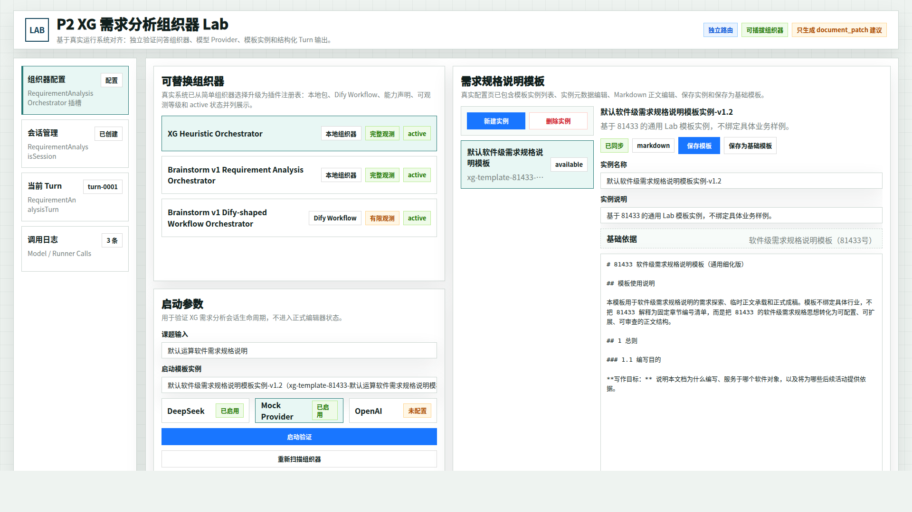
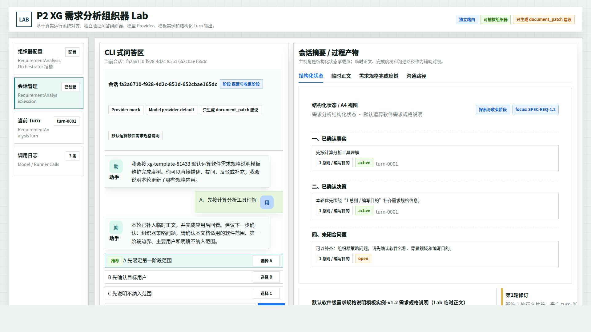
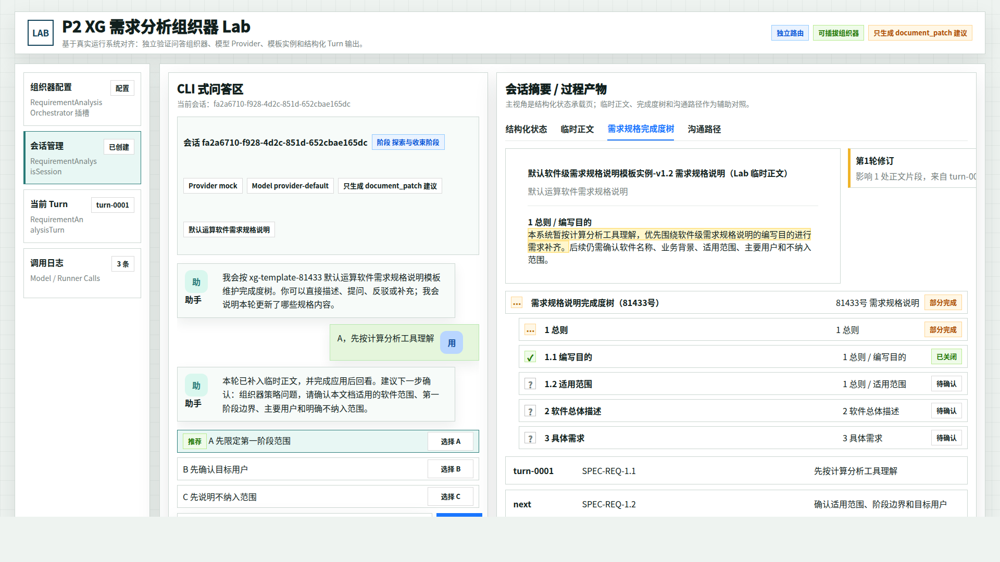
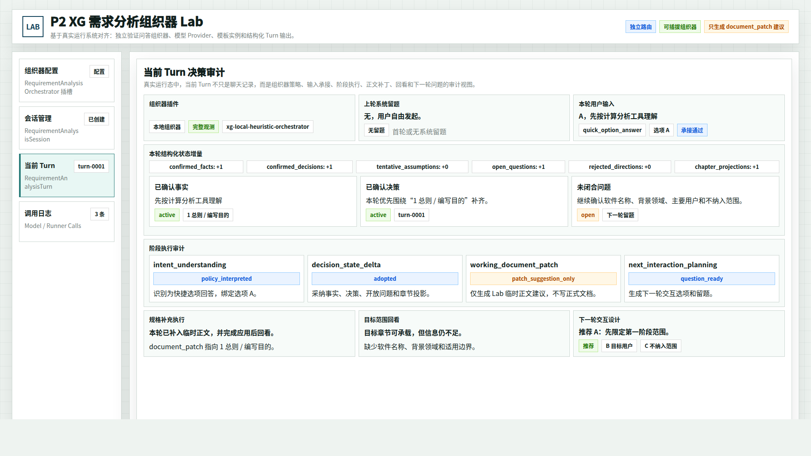
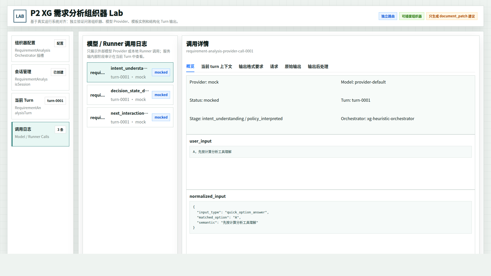
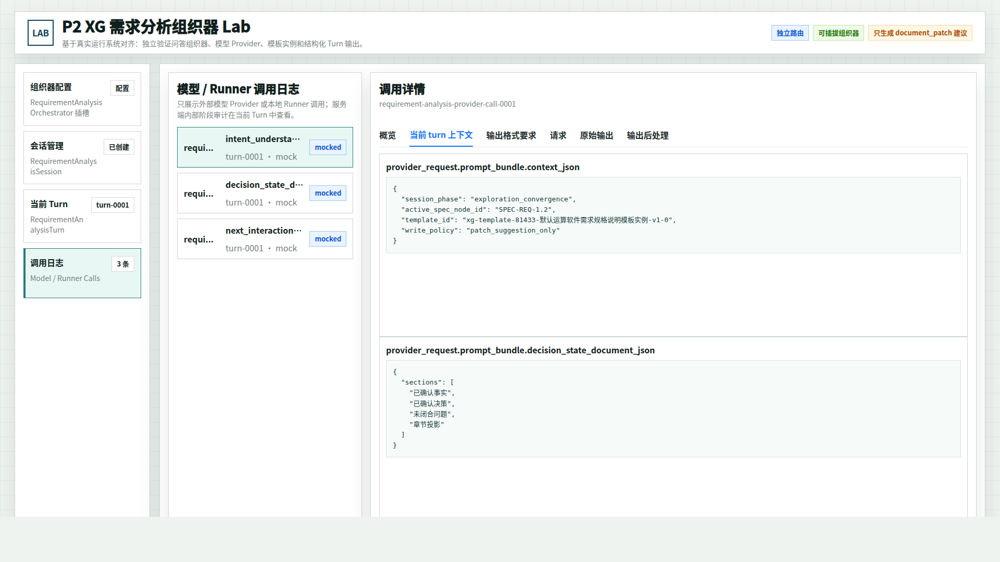

# CodeFactoryV2 P2 Brainstorming Lab 真实系统对齐原型 v6

生成时间：2026-05-12 21:30:00

- 文档角色：`P2 Brainstorming Lab` 真实运行系统对齐版原型评审入口
- 版本目录：`DOC/CODEX_DOC/08_原型与附图/2026-05-12-213000-CodeFactoryV2-P2-Brainstorming-Lab真实系统对齐原型-v6/`
- 当前状态：待用户确认
- 目标路由：`/p2-requirement-analysis-lab`
- 页面归属：`P2` 需求分析系统的 Lab / 组织器验证与高级诊断台
- 源文件：`source/p2-brainstorming-lab-runtime-aligned-prototype.html`

## 1. 本版定位

v6 以真实运行系统截图和当前代码为事实源，重新对齐原型，不再沿 v5 的“需求输入事项工作台化”方向继续扩展主界面。

本版保持真实 Lab 的主骨架：

1. 左侧四个 Tab：组织器配置、会话管理、当前 Turn、调用日志。
2. 顶部仍是 Lab 标识、独立路由、可插拔组织器和写入策略提示。
3. 配置页展示组织器插件、Provider、启动参数、模板实例列表和 Markdown 模板编辑器。
4. 会话页展示 CLI 问答，以及结构化状态、临时正文、需求规格完成度树、沟通路径四个过程产物子视图。
5. 当前 Turn 页展示组织器策略、输入承接、结构化状态增量、阶段执行、正文补丁、回看和下一轮交互。
6. 调用日志页展示 Provider 调用列表和概览 / 当前 turn 上下文等详情子视图。

## 2. 与 v5 的差异

| 对比项 | v5 | v6 |
| --- | --- | --- |
| 事实源 | v4 原型和面向用户工作流补充稿 | 真实运行截图、`RequirementAnalysisLabPage.tsx` 和 API 路由 |
| 主界面 | 保留四 Tab，但引入需求输入事项语义 | 严格回到真实 Lab 四 Tab，不新增事项中心 |
| 配置页 | 表达较概念化 | 对齐真实系统的组织器插件、Provider、模板实例和编辑器 |
| 会话页 | 偏“事项 + 问题树摘要” | 对齐真实系统的 CLI + 过程产物 Tabs |
| Turn 页 | 事项绑定和输出摘要 | 对齐真实系统的多块审计视图 |
| 日志页 | 事项流程日志 | 对齐 Provider / Runner 调用日志详情 |

v5 可作为前序业务化尝试保留，但当前用户评审应以 v6 为准。

## 3. 真实系统事实源

运行截图保存在：

`original/runtime-screens/`

本版主要参照以下真实截图：

- `03-runtime-1920x1080-config-after-start.png`
- `04-runtime-1920x1080-session-decision-state.png`
- `06-runtime-1920x1080-session-working-document.png`
- `07-runtime-1920x1080-session-spec-tree.png`
- `08-runtime-1920x1080-session-turn-path.png`
- `09-runtime-1920x1080-turn-audit.png`
- `10-runtime-1920x1080-log-overview.png`
- `11-runtime-1920x1080-log-context.png`

代码事实源：

- `apps/web/src/pages/RequirementAnalysisLabPage.tsx`
- `apps/web/src/lib/requirementAnalysis.ts`
- `apps/web/src/lib/useRequirementAnalysisLabBootstrap.ts`
- `apps/api/app/api/routes/requirement_analysis.py`

## 4. 评审图

### 4.1 组织器配置 Tab

对齐真实配置页：组织器插件列表、启动参数、Provider、启动模板实例、模板实例列表、实例元数据、Markdown 编辑器、保存模板、保存为基础模板和重新扫描组织器。



### 4.2 会话管理 Tab - 结构化状态

对齐真实会话页主视角：左侧 CLI 式问答，右侧过程产物默认展示结构化状态 A4 视图。



### 4.3 会话管理 Tab - 临时正文

对齐真实系统的 Lab 临时正文投影视图，体现正文块和修订标注。


### 4.4 会话管理 Tab - 完成度树

对齐真实需求规格完成度树，表达章节节点状态、当前 focus 和关闭 / 待确认节点。



### 4.5 会话管理 Tab - 沟通路径

对齐真实沟通路径视图，表达 turn、影响节点和下一轮建议。


### 4.6 当前 Turn Tab

对齐真实 Turn 审计思路，把单轮处理拆成组织器插件、系统留题、用户输入、输入承接、结构化状态增量、阶段执行、规格补充、目标范围回看和下一轮交互设计。



### 4.7 调用日志 Tab - 概览

对齐真实 Provider / Runner 调用日志：左侧调用列表，右侧详情内部分为概览、当前 turn 上下文、输出格式要求、请求、原始输出和输出后处理。



### 4.8 调用日志 Tab - 当前 Turn 上下文

对齐真实调用日志上下文页，强调模型 Provider 真正接收的 `context_json`、`stage_id`、`prompt_id` 和结构化状态投影。



## 5. 原型到实现映射

| 原型区块 | 当前实现映射 |
| --- | --- |
| 四 Tab 左侧导航 | `RequirementAnalysisLabTab = "config" | "session" | "turn" | "log"` |
| 组织器列表 | `getRequirementAnalysisOrchestrators()` 与 `/requirement-analysis/orchestrators` |
| 重新扫描组织器 | `reloadRequirementAnalysisOrchestrators()` 与 `/orchestrators/reload` |
| Provider 选择 | `getRequirementAnalysisProviders()` 与 `/providers` |
| 模板实例列表 / 编辑器 | `/templates`、`/template-bases`、`/templates/{template_id}` |
| 启动验证 | `createRequirementAnalysisSession()` 与 `/sessions` |
| CLI Turn | `createRequirementAnalysisTurn()` 与 `/sessions/{session_id}/turns` |
| 结构化状态 / 临时正文 / 完成度树 / 沟通路径 | `SessionSummary` 内部 Tabs |
| 当前 Turn 审计 | `TurnTab`、`TurnView` 和 `turn_audit_schema` |
| Provider 调用日志 | `LogTab`、`ProviderLogDetail` 和 `provider_log_schema` |

## 6. 允许偏差与不可接受偏差

允许偏差：

1. 原型中的具体会话 id、模板 id、turn id 可随真实数据变化。
2. 长字段截断、标签换行和列表密度可随前端实现微调。
3. Provider 可用性和组织器状态可随本地环境变化。

不可接受偏差：

1. 不得把真实 Lab 改造成新的事项中心或业务首页。
2. 不得删除组织器配置、当前 Turn 和调用日志三类诊断视图。
3. 不得把配置页简化为单一组织器选择。
4. 不得把结构化状态、临时正文、完成度树和沟通路径合并成一个普通摘要。
5. 不得把模型调用日志和 Turn 阶段审计混为一类对象。

## 7. 查看与再生成

打开源文件：

```bash
xdg-open DOC/CODEX_DOC/08_原型与附图/2026-05-12-213000-CodeFactoryV2-P2-Brainstorming-Lab真实系统对齐原型-v6/source/p2-brainstorming-lab-runtime-aligned-prototype.html
```

重新生成单张截图示例：

```bash
base="$PWD/DOC/CODEX_DOC/08_原型与附图/2026-05-12-213000-CodeFactoryV2-P2-Brainstorming-Lab真实系统对齐原型-v6"
google-chrome --headless=new --disable-gpu --no-sandbox --window-size=1920,1080 \
  --screenshot="$base/01-1920x1080-组织器配置Tab.png" \
  "file://$base/source/p2-brainstorming-lab-runtime-aligned-prototype.html#config"
```

将 `#config` 替换为 `#session`、`#doc`、`#tree`、`#path`、`#turn`、`#log`、`#log-context` 可分别生成其余状态。

## 8. 评审结论与后续处理

当前结论：`待用户确认`。

建议后续先确认 v6 是否与真实运行系统方向一致。确认后，再依据 `P2-需求分析系统设计-260512-2130-Lab真实系统同步升级方案补充.md` 决定是否同步主设计文档，而不是直接按 v5 的事项化设想回写主文档。
