# CodeFactoryV2 P1 业务知识库原型效果 v1

生成时间：2026-05-12 23:40:18

- 文档角色：`P1 业务知识库` 当前实现效果说明与评审入口
- 版本目录：`DOC/CODEX_DOC/08_原型与附图/2026-05-12-234018-CodeFactoryV2-P1业务知识库原型效果-v1/`
- 当前状态：按当前代码实现反向整理，待复截运行态页面确认
- 目标路由：`/p1`、`/p1/archives/:archiveId/*`
- 兼容入口：`/archives`、`/documents`、`/documents/intake`、`/policies/*`、`/runtime/*`、`/governance`、`/graph`
- 页面归属：`P1` 业务知识库，覆盖知识库管理、资料接入、策略规则、抽取运行、质量图谱、知识成果、发布输出和系统间输出
- 当前主对象：`archiveId`、`documentSetId`、`policyPackageVersionId`、`runtimeSnapshotId`、`publicationSnapshotId`
- 当前知识对象口径：`entity`、`event`、`process` 为主要一等对象
- 设计依据：`DOC/CODEX_DOC/02_设计说明/P1_业务知识库/P1-业务知识库设计.md`
- 截图来源：复用 `2026-05-05-213407-CodeFactoryV2-P1知识抽取闭环规则重算原型提示词-v1/` 中的历史 P1 方向图，作为当前实现效果的结构参考，不作为逐像素运行截图

## 1. 本版定位

本版不是新的 UI 创意稿，也不是继续扩展早期原型提示词；它用于把已经实现的 `P1` 前端路由、后端 API、页面模块和历史截图材料整理成一份可评审的“原型效果说明”。

本版采用以下事实口径：

1. 当前 `P1` 已经实现完成到可运行、可联调、可演示的工程链路，但知识本体质量尚未达到最终目标态。
2. 当前前端同时存在旧入口、新 `p1Clean` 工作区和 `/p1-legacy` 兼容入口。
3. 当前目标态评审应优先看 `/p1` 与 `/p1/archives/:archiveId/*`，但不能忽略旧入口仍承载部分真实能力。
4. 当前后端不是单一 `/api/p1/*` 面，而是 `/api/archives/*`、`/api/knowledge/archive/*`、`/api/p1/*` 三类 API 并存。
5. 当前结构化知识对象主要是 `entity / event / process`；规则、指标、证据、版本等已经出现在合同和运行态字段中，但尚未全部成为正式知识仓的一等对象。
6. 当前历史截图的主叙事偏生产者视图；下一版原型效果需要在不推翻现有页面的前提下补齐消费者视图。

## 2. 非目标

本版不解决以下事项：

1. 不重新设计新的静态 HTML 原型。
2. 不把历史方向图声明为当前代码逐像素截图。
3. 不声称 `/api/p1/*` 已经完全替代旧 live API。
4. 不声称 `Rule / Metric / Evidence / KnowledgeVersion` 已经完整落地为发布态一等知识对象。
5. 不评估模型抽取质量是否已经满足正式发布要求。
6. 不替代后续用真实运行环境重新截取 `/p1` 工作区页面的验收动作。

## 3. 共用事实源与设计依据

| 事实源 | 对本版原型效果的约束 |
| --- | --- |
| `P1-业务知识库设计.md` | 作为目标态设计和当前实现映射的主说明；其中已经标注当前代码实现状态、API 面和模块差距 |
| `apps/web/src/App.tsx` | 证明旧 P1 主壳、新 `/p1` 工作区、`/p1-legacy` 兼容入口并存 |
| `apps/web/src/features/p1Clean/registry.ts` | 证明新工作区当前分为资料接入、策略规则、抽取运行、质量图谱、知识成果、发布输出、系统间输出七个模块 |
| `apps/web/src/features/p1Clean/P1CleanApp.tsx` | 证明单知识库工作区以 `archiveId` 为上下文，顶部菜单切换模块，并组装策略、运行、发布上下文 |
| `apps/api/app/api/routes/archives.py` | 承载当前知识库注册、策略配置、抽取启动、运行态和文档导入等 live API |
| `apps/api/app/api/routes/knowledge.py` | 承载当前知识浏览、图谱、治理、发布和旧系统输出 API |
| `apps/api/app/api/routes/p1_refactor.py` | 承载新版合同、质量图谱、发布候选和系统间输出接口，其中部分 live、部分 fixture/preview |
| `apps/api/app/extraction/schema.py` | 证明当前结构化抽取顶层对象仍限制为 `entity / event / process` |
| `docs/superpowers/specs/2026-05-11-p1-knowledge-quality-improvement-handoff.md` | 明确当前工程链路成熟度高于知识本体成熟度，质量改造仍是后续重点 |

## 4. 当前真实入口与布局关系

### 4.1 新工作区主路径

| 页面 | 路由 | 当前实现含义 |
| --- | --- | --- |
| 知识库管理入口 | `/p1` | 列出、创建、激活知识库，并进入单知识库工作区 |
| 单知识库工作区总览 | `/p1/archives/:archiveId/overview` | 展示当前知识库上下文、模块边界和模块状态 |
| 资料接入 | `/p1/archives/:archiveId/intake` | 文档集合、导入、解析预检、抽取入队 |
| 策略规则 | `/p1/archives/:archiveId/policy` | 策略包版本、规则字段合同、影响面和增量重建任务 |
| 抽取运行 | `/p1/archives/:archiveId/runtime` | 单文档运行态、阶段状态、SSE 事件流和运行图谱 |
| 质量图谱 | `/p1/archives/:archiveId/quality` | 摘要、图谱、质量报告和门禁解释 |
| 知识成果 | `/p1/archives/:archiveId/results` | 实体、事件、流程、关系、证据和发布概览 |
| 发布输出 | `/p1/archives/:archiveId/publication` | 发布候选快照、治理确认状态和正式发布概览 |
| 系统间输出 | `/p1/archives/:archiveId/system-output` | 正式知识供应合同、接口范围和不可用原因 |

### 4.2 兼容路径

| 页面 | 路由 | 当前作用 |
| --- | --- | --- |
| 旧知识库管理 | `/archives` | 旧主壳下的知识库管理、详情和抽取入口 |
| 旧文档清单 | `/documents` | 查看知识库文档、并入/移出文档 |
| 旧接入解析 | `/documents/intake` | 上传和解析验证 |
| 旧策略/运行解释页面 | `/policies/*`、`/runtime/*` | 策略库、阶段策略、规则合同、版本差异、影响重算、质量门禁、发布候选等方向页面 |
| 旧治理发布 | `/governance` | 对发布候选进行人工审核、合并、发布 |
| 旧知识图谱 | `/graph` | 浏览已发布知识图谱 |
| 重构兼容 shell | `/p1-legacy/*` | P1 重构合同和历史 shell 的过渡入口 |

### 4.3 两类用户角色

历史截图主要表达“如何生产一个知识库”，也就是生产者视图。后续原型效果需要补齐另一条同等重要的线：消费者视图，即“什么样的人看什么样的知识，以及如何围绕目标问题使用知识”。

| 角色 | 目标 | 主要关心 | 不应被迫理解 |
| --- | --- | --- | --- |
| 知识消费者 | 从已经抽取、治理或发布的知识库中查找答案、理解对象、追溯证据、复用知识 | 选择知识库、提出目标问题、浏览结果、查看图谱、打开证据、确认版本状态 | 文档接入、策略配置、抽取阶段、规则合同、增量重算细节 |
| 知识生产者 / 编辑者 | 创建和维护知识库，让知识从资料进入候选态、质量检查、治理确认、正式输出 | 资料接入、策略规则、抽取运行、质量门禁、发布候选、治理确认、系统间输出 | 消费端的简化问答体验和只读阅读路径 |

因此，`P1` 页面不应只是一组生产者工具页。它至少应拆成两条可复用视图：

1. 消费者视图：从“选择知识库 -> 提出目标问题 / 浏览知识 -> 查看答案、对象、关系和证据 -> 确认版本状态”展开。
2. 生产者视图：从“创建/选择知识库 -> 接入资料 -> 配置策略 -> 抽取运行 -> 质量检查 -> 发布治理 -> 系统输出”展开。

### 4.4 消费者视图与生产者视图的切换原则

同一个 `archiveId` 应该驱动两套视图，而不是让用户在两套完全割裂的页面中重新选择上下文。

| 切换点 | 应有行为 | 设计解释 |
| --- | --- | --- |
| 左侧选择知识库 | 中间主区切换为该库的消费概览或生产概览，右侧摘要随同一个 `archiveId` 更新 | 选中“销售合同知识库”后，不应只高亮左侧列表；结果、状态、策略、质量都必须同步切换 |
| 消费者进入知识库 | 默认看到已抽取/已治理/已发布的知识结果和版本状态 | 消费者主要关心“能不能用、用哪一版、能回答什么”，不是抽取过程 |
| 生产者进入知识库 | 默认看到构建状态、资料接入、策略配置和待处理事项 | 生产者需要知道为什么结果还不能发布、下一步该修什么 |
| 策略与质量摘要 | 必须明确标出是“当前结果版本的质量状态”还是“抽取运行中的过程状态” | 如果不标状态，用户会误以为过程指标就是最终知识可信度 |
| 进入编辑 | 从消费者视图可进入生产者/编辑者视图，但需要权限或明确动作 | 只读消费和编辑配置应分离，避免消费者误触生产流程 |

## 5. 图文证据链

> 说明：以下图片来自 2026-05-05 的 P1 历史方向图。它们能帮助评审当前实现的页面意图和模块关系，但不是本工作树即时运行截图。当前代码事实以第 4 节、第 6 节和第 7 节的路由/API 映射为准。
>
> 本节新增角色口径：先补消费者视图，再保留原生产者视图。消费者视图采用与 P2 / P3 原型相近的评审画板风格：左侧 Tab、右侧高密度工作区、明确状态徽标和可复用模块边界；原历史图后移为生产者视图证据链。

### 5.1 消费者视图一：知识库总览驾驶舱

**评阅状态：新增消费者视图草案。**

**页面目标：** 让业务使用者先看到“系统里一共有多少个知识库、每个库什么时候加入、知识量是多少、当前是否可消费”，再进入单库查询。

**建议路由：** `/p1/consume` 或 `/p1/consume/overview`

**目标用户：** 销售、法务、产品、交付、需求分析人员等只需要使用知识结果的人。

**推荐布局：**

| 区域 | 内容 | 说明 |
| --- | --- | --- |
| 左侧 Tab | 知识库总览、知识库查询、对象与证据、图谱探索 | 第一个 Tab 是全局驾驶舱，第二个 Tab 才进入单库查询 |
| 中间驾驶舱 | 库总数、正式库、候选库、不可用库、来源文档数、领域分布 | 先看整体资产，而不是先看某个库的抽取过程 |
| 中间库列表 | 知识库名称、加入时间、知识量、版本状态、消费建议 | 横向比较每个库是否可消费 |
| 右侧选中库快照 | 当前选中库的知识构成、质量摘要、推荐问题 | 选中“销售合同知识库”后只展示结果和可信度，不展示编辑动作 |

**关键交互：**

1. 进入消费者视图默认落在“知识库总览”Tab。
2. 选中某个知识库后，右侧快照同步切换，但不自动进入查询页。
3. 点击“进入知识库查询”后才进入 5.2 的单库查询视图。
4. 候选态和不可用库可以显示在驾驶舱中，但必须明确消费建议。
5. 本页不展示抽取按钮、策略编辑、运行队列和发布候选操作。

**当前可复用实现：**

1. 知识库列表来自 `/api/archives` 和 `p1Clean/modules/knowledgeBaseManagement`。
2. 结果概览可复用 `/api/knowledge/archive/{archive_id}/summary`。
3. 版本状态可复用 `/api/knowledge/archive/{archive_id}/publication` 和 `/api/p1/archives/{archive_id}/system-output` 的可用性判断。
4. 质量摘要可复用 `/api/p1/archives/{archive_id}/quality-graph/report`，但必须绑定当前结果版本显示。

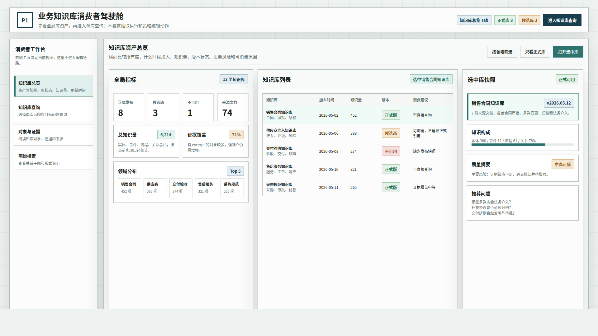

### 5.2 消费者视图二：知识库查询页

**评阅状态：新增消费者视图草案。**

**页面目标：** 选中某个库后，先看到这个库当前结果、版本、可信度、推荐问题和常用对象入口。

**建议路由：** `/p1/archives/:archiveId/consume`

**推荐布局：**

| 区域 | 内容 | 说明 |
| --- | --- | --- |
| 左侧 Tab | 保留消费者工作台 Tab | 用户随时可回到知识库总览 |
| 左中结果指标 | 实体、事件、流程、关系数量，目标问题输入 | 查询入口在单库上下文里出现 |
| 中间推荐查询 | 推荐问题、高频对象、对象类型和证据状态 | 让消费者不必先理解底层数据结构 |
| 右侧版本与可信度 | 版本、质量、策略版本只读、时间线 | 说明当前结果能不能引用 |

**关键交互：**

1. 从 5.1 选中知识库后进入本页。
2. 本页默认显示单库结果概览和推荐问题。
3. 点击推荐问题或输入问题后进入 5.3 的目标问题结果页。
4. 点击高频对象可进入 5.4 的对象证据阅读页。
5. 点击图谱入口可进入 5.5 的图谱探索页。

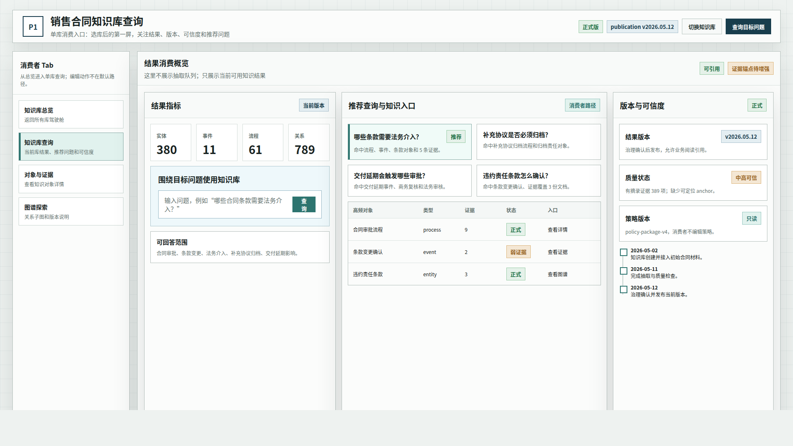

### 5.3 消费者视图三：目标问题驱动的知识结果页

**评阅状态：新增消费者视图草案。**

**页面目标：** 让消费者从一个目标问题进入知识结果，而不是被迫先理解实体、事件、流程的底层分类。

**建议路由：** `/p1/archives/:archiveId/consume/query`

**推荐布局：**

| 区域 | 内容 | 说明 |
| --- | --- | --- |
| 顶部上下文条 | 当前知识库、版本状态、更新时间、可信度摘要 | 保持用户知道答案来自哪个库、哪一版 |
| 目标问题输入 | 自然语言问题、推荐问题、历史问题 | 例如“销售合同审批中哪些条款需要法务介入？” |
| 结果主区 | 直接答案、相关实体/事件/流程、关系路径、引用证据 | 结果先服务问题，再暴露知识结构 |
| 右侧证据与范围 | 来源文档、证据摘录、覆盖范围、未覆盖说明 | 告诉用户答案为什么可信，以及哪里不能回答 |

**关键交互：**

1. 用户输入目标问题后，系统在当前 `archiveId` 的可用结果中检索和组织答案。
2. 结果应同时给出“答案摘要”和“关联知识对象”，避免退化成纯文本问答。
3. 点击任意知识对象可打开详情和证据。
4. 如果证据不足，应明确显示“未充分覆盖”，而不是强行给确定答案。
5. 结果页应允许切换到“图谱视图”和“对象列表视图”，但默认仍围绕问题组织。

**当前可复用实现：**

1. 对象数据可复用 `/api/knowledge/archive/{archive_id}/entities`、`events`、`processes`。
2. 图谱数据可复用 `/api/knowledge/archive/{archive_id}/graph`。
3. 对象详情和证据可复用 `/api/knowledge/archive/{archive_id}/items/{item_id}`。
4. 当前代码尚未形成完整的消费者问答 API，因此本页先作为原型目标；实现时可以先用本地筛选和图谱定位做第一版。

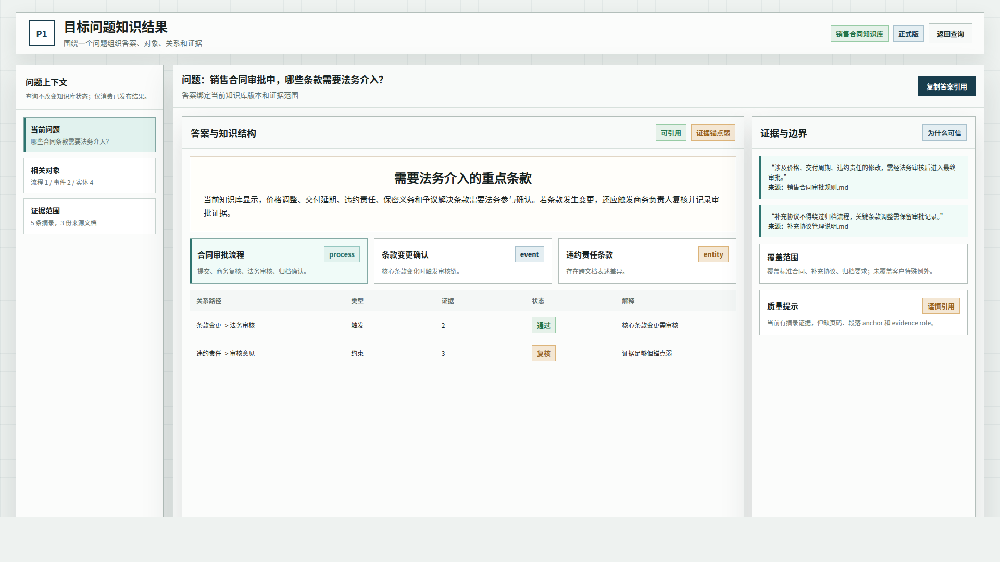

### 5.4 消费者视图四：知识对象与证据阅读页

**评阅状态：新增消费者视图草案。**

**页面目标：** 让消费者能阅读一个知识对象的含义、关系和证据，确认“这条知识是什么、从哪里来、能不能用”。

**建议路由：** `/p1/archives/:archiveId/consume/items/:itemId`

**推荐布局：**

| 区域 | 内容 | 说明 |
| --- | --- | --- |
| 左侧对象导航 | 实体、事件、流程、关系筛选，支持搜索 | 仍按当前实现的 `entity / event / process` 口径组织 |
| 中间对象详情 | 名称、类别、别名、摘要、相关关系、支撑文档 | 不要求消费者理解抽取阶段 |
| 右侧证据面板 | 摘录、来源文档、更新时间、证据覆盖状态 | 证据是消费者信任知识的核心 |
| 底部相关路径 | 上下游关系、相关流程、相关事件 | 帮助消费者从单点知识扩展到业务脉络 |

**关键交互：**

1. 点击对象后，详情区和证据面板同步更新。
2. 证据不足、候选态、被驳回或过期对象必须有明显标记。
3. 点击来源文档只打开只读来源说明，不进入文档接入或解析配置。
4. 生产者可以从同一对象详情进入“修复证据 / 重跑 / 编辑归并”，但这些动作对消费者隐藏。

**当前可复用实现：**

1. `p1Clean/modules/knowledgeResults` 已经有知识成果查看基础。
2. 当前对象类型和统计口径应继续如实显示为实体、事件、流程。
3. 当前 evidence 主要是 excerpt + document_id，强锚点不足应作为质量提示显示。

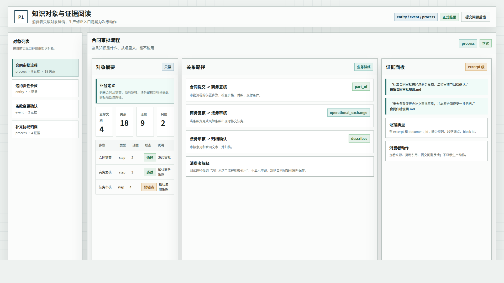

### 5.5 消费者视图五：图谱探索与版本说明页

**评阅状态：新增消费者视图草案。**

**页面目标：** 让消费者从图谱角度理解知识库结构，并确认当前可引用版本。

**建议路由：** `/p1/archives/:archiveId/consume/graph`

**推荐布局：**

| 区域 | 内容 | 说明 |
| --- | --- | --- |
| 顶部版本状态条 | 正式版/候选版/不可用、发布时间、治理状态、质量摘要 | 消费者先判断能不能引用 |
| 左侧筛选 | 对象类型、来源文档、关系类型、质量状态 | 用于缩小图谱范围 |
| 中间图谱 | 节点、关系、路径高亮、目标问题相关子图 | 以理解业务关系为主 |
| 右侧节点详情 | 对象摘要、关系解释、证据入口、相关问题 | 轻量阅读，不暴露编辑控件 |

**关键交互：**

1. 图谱默认展示与当前目标问题或选中对象相关的子图，不应一上来铺满全量节点。
2. 版本状态条必须解释当前图谱来自正式版、候选版还是工作态结果。
3. 对消费者而言，系统间输出合同不是主内容；只有集成用户才需要进入系统间输出页。
4. 如果图谱孤立节点较多，应显示质量提示，而不是让消费者自行判断图谱是否可靠。

**当前可复用实现：**

1. 图谱数据可复用 `/api/knowledge/archive/{archive_id}/graph`。
2. 发布状态可复用 `/api/knowledge/archive/{archive_id}/publication`。
3. 系统间输出可作为“集成视图”入口，不放在普通消费者默认路径。

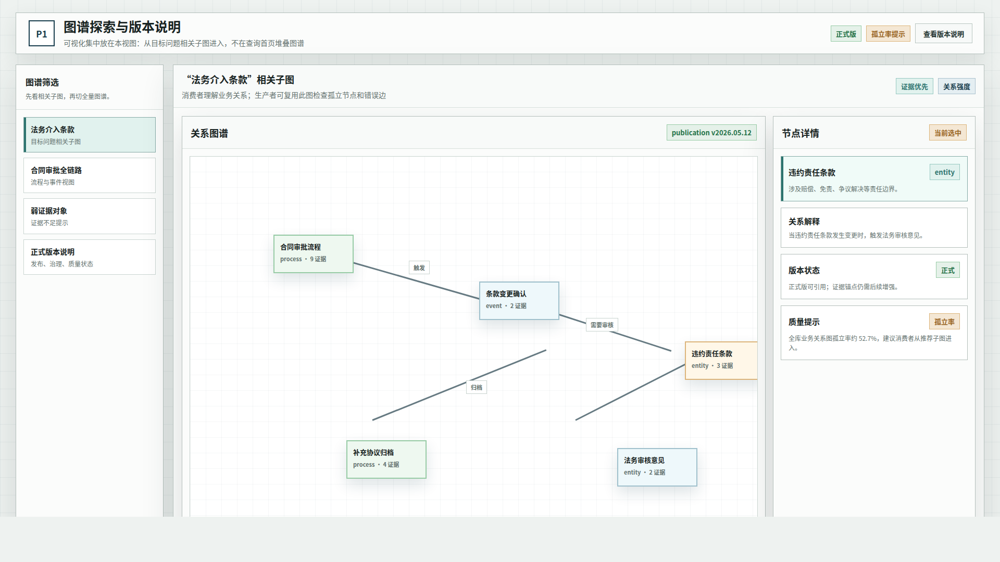

### 5.6 生产者视图证据链说明

以下 5.7 到 5.13 保留现有历史截图。它们当前主要表达生产者 / 编辑者如何维护知识库：创建、接入、抽取、配置、质量检查、治理和输出。消费者视图可以复用其中的知识库选择器、质量摘要、知识成果、图谱和证据面板，但不应默认暴露抽取、策略、重跑和发布候选操作。

### 5.7 知识库管理与抽取启动

**评阅状态：结构方向可参考，当前真实入口应优先对应 `/p1` 与 `/archives`。**

**画板规格：** `1920 x 1080`

**当前实现对应：**

1. `/p1` 中的 `knowledgeBaseManagement` 模块负责知识库列表、创建、激活和进入工作区。
2. `/archives` 仍保留旧主壳下的知识库管理和抽取入口。
3. 后端真实 API 为 `GET /api/archives`、`POST /api/archives`、`POST /api/archives/{archive_id}/activate`、`POST /api/archives/{archive_id}/extract`。

**角色与流程拆分：**

1. 左侧“知识库列表”是两类角色共用的上下文选择器。选中“销售合同知识库”等任意知识库后，中间和右侧都必须按同一个 `archiveId` 同步切换。
2. 中间“当前知识库运行总览”在消费者视图中应改写为“当前知识库结果总览”：重点展示可用知识数量、已发布版本、最近更新时间、可回答问题范围和主要知识类型。
3. 中间“当前知识库运行总览”在生产者视图中才展示接入、抽取、质量、治理等生产进度。
4. 右侧“策略与质量摘要”必须拆成两个状态：策略摘要属于生产者配置状态；质量摘要应明确是“当前结果版本质量”还是“当前抽取运行质量”。消费者默认只看结果版本质量。
5. 顶部或页面入口应提供“查看知识结果 / 编辑知识库”两种模式切换；消费者默认进入查看结果，编辑者默认进入编辑配置。

**需要评审的实现边界：**

1. 新工作区应把“进入单知识库工作区”作为主路径，而不是停留在旧 `/archives` 的综合页。
2. 抽取启动可以在资料接入和抽取运行模块出现，但必须保持同一个 `archiveId` 上下文。
3. 这一类选库入口不应只服务生产者。它应成为消费者和生产者共用的上下文入口，后续视图由角色和动作决定。

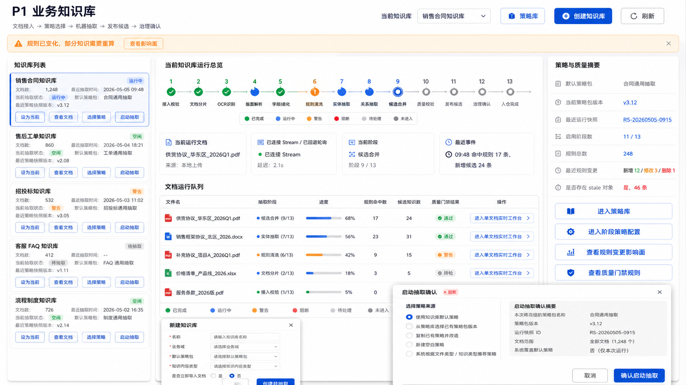

### 5.8 资料接入与解析验证

**评阅状态：结构方向可参考，当前真实入口对应 `/p1/archives/:archiveId/intake` 与 `/documents/intake`。**

**画板规格：** `1920 x 1080`

**当前实现对应：**

1. `p1Clean` 资料接入模块拥有 `/p1/archives/:archiveId/intake`。
2. 当前模块读取文档列表、摘要和 intake snapshot，并支持导入文档、启动整库抽取。
3. 后端涉及 `GET /api/knowledge/archive/{archive_id}/documents`、`GET /api/knowledge/archive/{archive_id}/summary`、`POST /api/archives/{archive_id}/documents/import`、`POST /api/archives/{archive_id}/extract`、`GET /api/p1/archives/{archive_id}/intake`。

**角色与流程拆分：**

1. 本页主要属于生产者 / 编辑者视图，用于维护知识库资料来源和解析预检。
2. 消费者不需要进入资料接入页；消费者只需要在结果页看到“来源文档、证据摘录、版本来源、更新时间”。
3. 可复用模块是“来源文档清单”和“文档级证据入口”。生产者看到文档处理状态，消费者看到该文档支撑了哪些正式知识。

**需要评审的实现边界：**

1. 资料接入只输出 `documentSetId` 和解析预检状态，不编辑策略规则。
2. 历史图中的“13 阶段链路提示”应在当前实现中落到抽取运行模块，不应让 intake 页面承担运行观测职责。
3. 消费者视图不得把解析失败、接入队列、重跑按钮放到主路径；这些内容应收进编辑者模式。

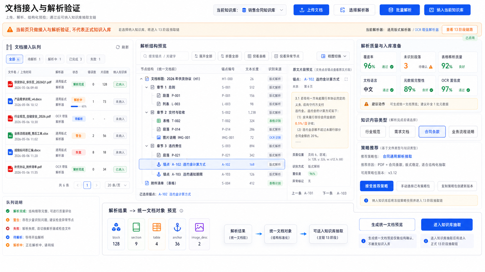

### 5.9 抽取运行工作台

**评阅状态：结构方向可参考，当前真实入口对应 `/p1/archives/:archiveId/runtime`。**

**画板规格：** `1920 x 1080`

**当前实现对应：**

1. `runtime` 模块消费 `archiveId`、`documentSetId`、`policyPackageVersionId`，输出 `runtimeSnapshotId`。
2. 当前页面读取文档列表、单文档运行态和 SSE 运行流，并可触发整库抽取。
3. 后端真实 API 为 `GET /api/archives/{archive_id}/runtime`、`GET /api/archives/{archive_id}/runtime/stream`、`POST /api/archives/{archive_id}/extract`。

**角色与流程拆分：**

1. 本页是生产者 / 编辑者视图，不是消费者默认视图。
2. 消费者关心的是抽取完成后的知识结果，而不是当前阶段运行到哪里、哪条事件流刚产生。
3. 可复用模块是“运行结果摘要”：生产者看到阶段事件、错误、重跑入口；消费者只看到“本结果由哪些资料和策略生成、是否已完成、是否可用”。

**需要评审的实现边界：**

1. 运行工作台可以展示阶段状态、事件流和运行态图谱，但不直接发布正式知识。
2. 当前运行图谱与质量图谱、知识成果图谱是不同视图，文档中不能混为同一数据层。
3. 如果消费者从结果页追溯到生产过程，应是只读追溯，不应暴露重跑、重算、策略编辑等动作。

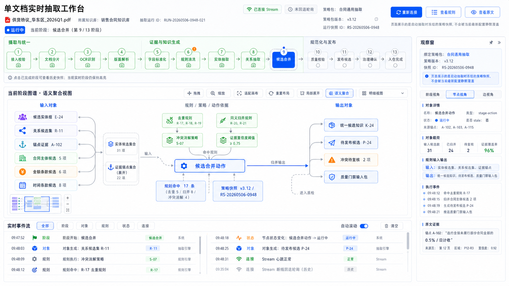

### 5.10 策略规则与规则合同

**评阅状态：结构方向可参考，当前真实入口对应 `/p1/archives/:archiveId/policy`，旧入口对应 `/policies/*`。**

**画板规格：** `1920 x 1080`

**当前实现对应：**

1. `policyRules` 模块负责策略包版本、规则输入输出合同、动作映射、服务端校验错误和影响面摘要。
2. 当前真实 API 主要是 `GET/PUT /api/archives/{archive_id}/policy-config` 和 `GET /api/archives/{archive_id}/incremental-rebuild-tasks`。
3. `/api/p1/refactor/policy-package*` 当前更多是重构合同预览和 fixture/preview。

**角色与流程拆分：**

1. 本页属于生产者 / 编辑者视图，用来决定知识库如何抽取、校验和重算。
2. 消费者不需要理解策略包细节，但需要看到结果页上“当前结果由哪个策略版本生成、策略是否已冻结、是否存在影响结果可信度的配置告警”。
3. 可复用模块是“策略版本摘要”：生产者可编辑；消费者只读，用于解释当前结果为什么可信或为什么仍是候选态。

**需要评审的实现边界：**

1. 策略规则页面输出 `policyPackageVersionId`，不直接推进抽取运行。
2. 规则合同已在页面和合同字段中出现，但规则本身尚未成为发布态知识仓的一等知识对象。
3. 右侧或顶部的策略状态需要明确区分“草稿策略、冻结策略、运行策略、发布结果绑定策略”，否则消费者会把生产配置状态误读为最终知识质量。

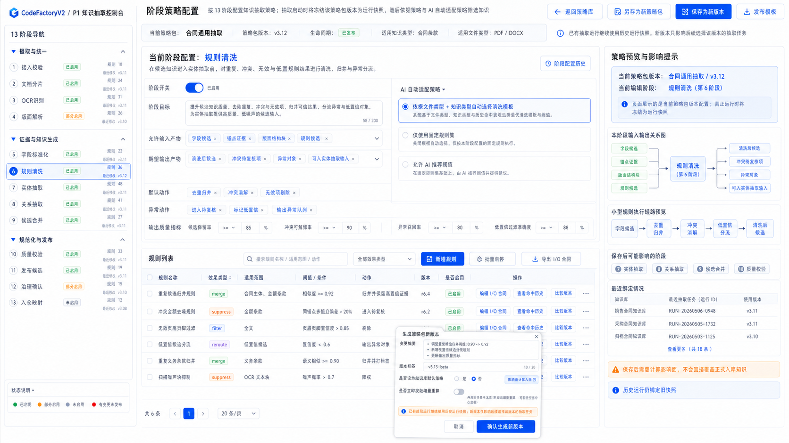

### 5.11 质量图谱与门禁解释

**评阅状态：结构方向可参考，当前真实入口对应 `/p1/archives/:archiveId/quality`，旧入口对应 `/runtime/quality-gate`。**

**画板规格：** `1920 x 1080`

**当前实现对应：**

1. `qualityGraph` 模块消费 `archiveId`、`runtimeSnapshotId`、`policyPackageVersionId`。
2. 当前页面读取知识摘要、图谱和质量图谱报告。
3. 后端涉及 `GET /api/knowledge/archive/{archive_id}/summary`、`GET /api/knowledge/archive/{archive_id}/graph`、`GET /api/p1/archives/{archive_id}/quality-graph/report`。

**角色与流程拆分：**

1. 质量图谱同时服务两类角色，但展示深度不同。
2. 消费者需要看到的是“当前结果是否可用、可信等级、主要风险、证据覆盖、更新时间和版本状态”。
3. 生产者需要看到的是“质量不通过原因、对象级问题、关系级问题、证据缺口、修复入口和重算建议”。
4. 可复用模块是“质量摘要卡”和“问题详情抽屉”：消费者只读摘要，生产者进入修复路径。

**需要评审的实现边界：**

1. 当前质量报告可以解释质量状态，但对象级质量、关系级质量、证据锚点仍是后续重点。
2. 当前质量门禁不能被写成已经完成高质量发布态知识库验收。
3. 消费者视图的质量状态必须绑定某个结果版本，不能展示一个没有版本归属的过程质量。

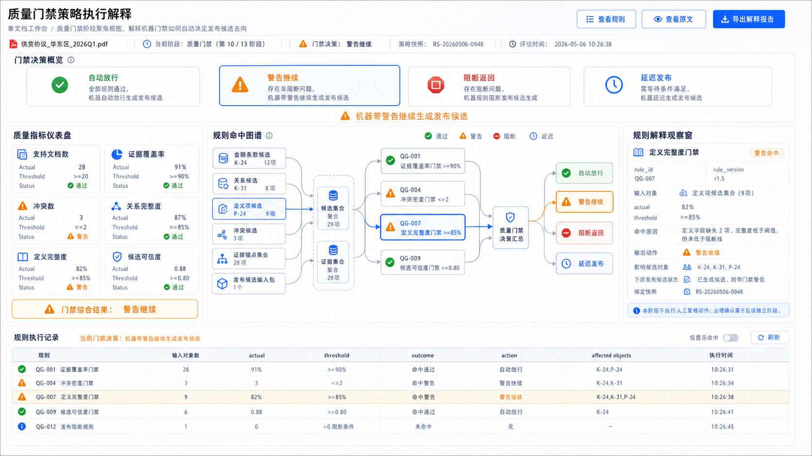

### 5.12 发布输出与治理边界

**评阅状态：结构方向可参考，当前真实入口对应 `/p1/archives/:archiveId/publication`，旧入口对应 `/governance` 和 `/runtime/publication`。**

**画板规格：** `1920 x 1080`

**当前实现对应：**

1. `publication` 模块展示发布候选、候选快照、质量阻断解释和治理确认状态投影。
2. 当前 API 包括 `GET /api/knowledge/archive/{archive_id}/publication` 和 `GET /api/p1/archives/{archive_id}/publication-candidates/latest`。
3. 旧 `/governance` 仍承担候选审核、合并和发布快照等真实治理入口。

**角色与流程拆分：**

1. 本页主要属于生产者 / 治理编辑者视图。
2. 消费者只需要看到“当前使用的是正式版、候选版还是不可用状态”，以及必要的版本说明。
3. 可复用模块是“版本状态条”：生产者看到候选、阻断、治理确认和发布动作；消费者看到正式版本、发布日期、治理状态和是否可引用。

**需要评审的实现边界：**

1. 发布输出模块不等同于系统间正式供应接口。
2. 治理确认前的 publication candidate 不能被下游系统当作正式知识。
3. 消费者视图不应默认展示发布候选操作；候选态最多作为“此库尚未正式发布”的状态提示。

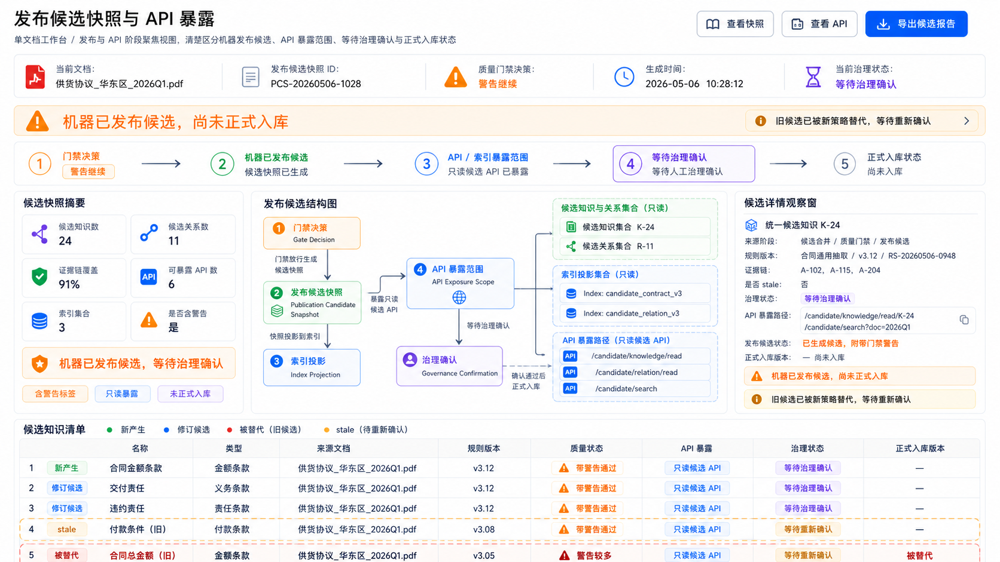

### 5.13 知识成果与系统间输出

**评阅状态：结构方向可参考，当前真实入口对应 `/p1/archives/:archiveId/results`、`/p1/archives/:archiveId/system-output` 和旧 `/graph`。**

**画板规格：** `1920 x 1080`

**当前实现对应：**

1. `knowledgeResults` 模块展示当前知识库的实体、事件、流程、图谱、证据与发布概览。
2. `systemOutput` 模块只消费治理确认后的 `publicationSnapshotId`，未满足条件时返回不可用合同。
3. 当前 API 包括 `/api/knowledge/archive/{archive_id}/summary`、`graph`、`entities`、`events`、`processes`、`items/{item_id}`、`publication` 和 `GET /api/p1/archives/{archive_id}/system-output`。

**角色与流程拆分：**

1. 本页是消费者视图的核心候选：消费者应该从这里进入知识浏览、目标问题、图谱、对象详情和证据追溯。
2. 生产者也会使用该页验收结果，但生产者的后续动作是返回质量、策略、治理或抽取模块修正问题。
3. 消费者视图应新增“目标问题”入口：用户先提出问题，再由系统在当前知识库的已发布或可用结果中定位实体、事件、流程、关系和证据。
4. 可复用模块是“知识对象列表、图谱浏览、对象详情、证据面板、版本状态条”。这些模块既可在消费者工作台使用，也可在生产者验收页使用。

**需要评审的实现边界：**

1. 当前成果统计应如实写成实体、事件、流程，不应提前写成完整规则/指标/证据对象体系。
2. 系统间输出必须以治理确认后的正式快照为输入，不能读取候选态运行临时节点。
3. 消费者默认看到的是结果和证据，不是系统间输出合同；系统间输出属于后续系统或集成用户的专门视图。

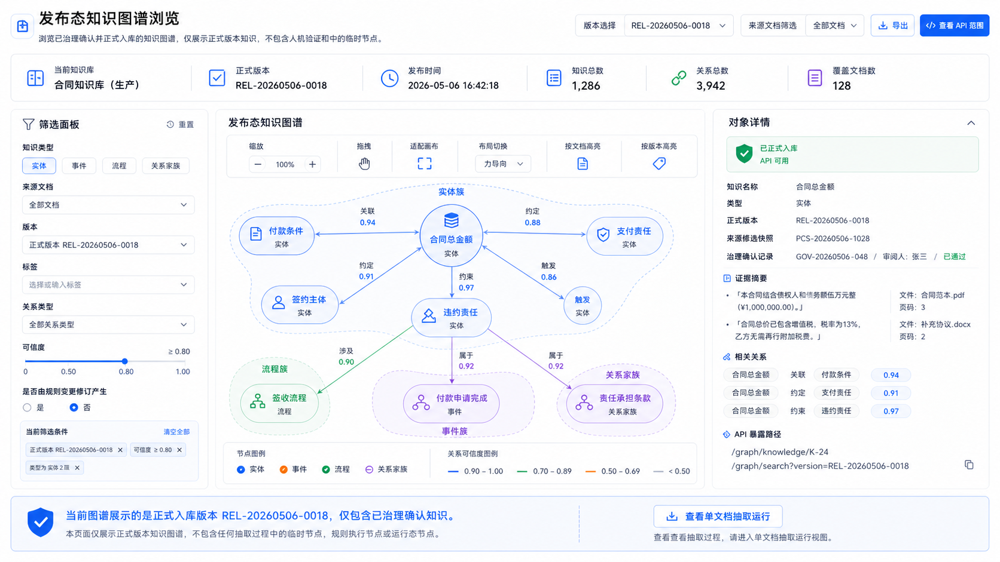

## 6. 原型效果到当前代码映射

| 原型效果区块 | 当前主要路由 | 前端实现 | 后端/API | 当前状态 |
| --- | --- | --- | --- | --- |
| 知识库管理 | `/p1`、`/archives` | `p1Clean/modules/knowledgeBaseManagement`、`ArchiveManagementPage` | `/api/archives` | live |
| 资料接入 | `/p1/archives/:archiveId/intake`、`/documents/intake` | `p1Clean/modules/intake`、`DocumentIntakePage` | `/api/knowledge/archive/*`、`/api/archives/*`、`/api/p1/archives/{id}/intake` | live + 合同包装 |
| 策略规则 | `/p1/archives/:archiveId/policy`、`/policies/*` | `p1Clean/modules/policyRules`、`P1PrototypeWorkflowPages` | `/api/archives/{id}/policy-config`、`/incremental-rebuild-tasks` | live |
| 抽取运行 | `/p1/archives/:archiveId/runtime`、旧 `/archives` 单文档视图 | `p1Clean/modules/runtime` | `/api/archives/{id}/runtime`、`/runtime/stream`、`/extract` | live |
| 质量图谱 | `/p1/archives/:archiveId/quality`、`/runtime/quality-gate` | `p1Clean/modules/qualityGraph` | `/api/knowledge/archive/*`、`/api/p1/archives/{id}/quality-graph/report` | live + 合同报告 |
| 知识成果 | `/p1/archives/:archiveId/results`、`/graph` | `p1Clean/modules/knowledgeResults`、`KnowledgeGraphPage` | `/api/knowledge/archive/{id}/summary/graph/entities/events/processes/items/publication` | live，类型以 entity/event/process 为主 |
| 发布输出 | `/p1/archives/:archiveId/publication`、`/governance`、`/runtime/publication` | `p1Clean/modules/publication`、`GovernancePage` | `/api/knowledge/archive/{id}/publication`、`/api/p1/archives/{id}/publication-candidates/latest` | live + 候选合同 |
| 系统间输出 | `/p1/archives/:archiveId/system-output` | `p1Clean/modules/systemOutput` | `/api/p1/archives/{id}/system-output`、兼容 `/api/knowledge/archive/{id}/system-output` | live，未正式发布时返回不可用合同 |

### 6.1 生产者视图与消费者视图拆分

当前功能模块不能只按“抽取流程”拆分，还需要按“谁使用知识”拆分。否则消费者会被迫看到大量资料接入、策略配置、抽取运行和发布候选内容，生产者也无法复用消费者侧的结果验收组件。

| 可复用模块 | 消费者视图用途 | 生产者 / 编辑者视图用途 | 主要数据锚点 |
| --- | --- | --- | --- |
| 知识库选择器 | 选择要查询或浏览的知识库 | 选择要维护或重建的知识库 | `archiveId` |
| 知识库结果概览 | 查看当前库能回答什么、知识数量、版本状态、最近更新 | 验收本轮抽取/发布结果是否满足预期 | `archiveId`、`publicationSnapshotId` |
| 目标问题入口 | 输入业务问题，定位相关知识、关系和证据 | 用于验证知识库是否覆盖目标问题 | `archiveId`、query text |
| 知识对象列表 | 浏览实体、事件、流程和关系 | 检查抽取结果、发现缺失或误抽对象 | `archiveId`、`documentIds` |
| 图谱浏览 | 理解对象之间的关系和上下游影响 | 检查关系质量、孤立节点和错误边 | `archiveId`、graph filters |
| 证据面板 | 确认某条知识来自哪些文档和摘录 | 判断证据是否足够、是否需要重跑或人工修正 | `itemId`、`documentId` |
| 版本状态条 | 判断当前结果是否正式、候选、过期或不可用 | 推动治理确认、发布或阻断修复 | `publicationSnapshotId`、status |
| 质量摘要卡 | 判断当前结果可信度和主要风险 | 定位质量问题、进入修复路径 | `runtimeSnapshotId`、`policyPackageVersionId` |
| 策略版本摘要 | 只读解释当前结果的生成规则版本 | 编辑、冻结、保存策略版本和影响面 | `policyPackageVersionId` |
| 资料来源摘要 | 查看知识来源文档范围 | 导入、解析、移除、重跑资料 | `documentSetId` |
| 抽取运行面板 | 默认不进入；必要时只读追溯 | 查看阶段、事件流、错误和重跑入口 | `runtimeSnapshotId` |
| 发布治理面板 | 只读查看是否正式发布 | 审核候选、合并、发布、阻断 | `publicationSnapshotId` |

### 6.2 两条主流程

**消费者主流程：**

```text
选择知识库
  -> 查看结果概览和版本状态
  -> 输入目标问题或浏览知识对象
  -> 查看答案相关的实体 / 事件 / 流程 / 关系
  -> 打开证据面板确认来源
  -> 必要时查看质量摘要和版本说明
```

消费者流程的默认页面应是结果消费页，而不是抽取运行页。消费者看到的质量状态必须绑定当前结果版本，避免把生产过程指标误认为最终可信度。

**生产者 / 编辑者主流程：**

```text
选择或创建知识库
  -> 接入资料并完成解析预检
  -> 配置策略规则和合同
  -> 启动抽取并观察运行态
  -> 查看质量图谱和问题详情
  -> 生成发布候选并治理确认
  -> 输出正式知识供应接口
```

生产者流程可以复用消费者的结果概览、图谱、对象详情和证据面板，但必须额外暴露资料、策略、运行、质量修复、发布治理等编辑动作。

### 6.3 第 5 章视图角色归属

| 图文证据链 | 当前偏向 | 消费者侧应复用 | 生产者侧继续保留 |
| --- | --- | --- | --- |
| 5.1 消费者知识库总览驾驶舱 | 消费者 | 主入口，查看所有库、加入时间、知识量、版本状态和消费建议 | 可复用为编辑者选库入口，但编辑动作后置 |
| 5.2 消费者知识库查询页 | 消费者 | 选中单库后看结果、推荐问题、版本、质量和高频对象 | 可用于验收当前库是否具备可消费结果 |
| 5.3 消费者目标问题结果页 | 消费者 | 围绕目标问题组织答案、对象、关系和证据 | 可用于验收知识覆盖是否满足业务问题 |
| 5.4 消费者对象与证据阅读页 | 消费者 | 阅读知识对象、证据、来源和相关关系 | 可用于发现证据不足或对象质量问题 |
| 5.5 消费者图谱探索与版本说明页 | 消费者 | 浏览业务关系、版本状态和可信度 | 可用于检查孤立节点、错误边和发布状态 |
| 5.7 知识库管理与抽取启动 | 生产者为主，两者共用入口 | 知识库选择器、结果概览、版本状态、可回答问题摘要 | 创建库、激活库、抽取入口、策略与质量生产状态 |
| 5.8 资料接入与解析验证 | 生产者 | 来源文档摘要、证据来源范围 | 导入、解析预检、接入队列、抽取入队 |
| 5.9 抽取运行工作台 | 生产者 | 只读运行来源说明、生成时间、结果状态 | 阶段状态、SSE 事件流、重跑、错误处理 |
| 5.10 策略规则与规则合同 | 生产者 | 策略版本只读摘要、结果生成规则说明 | 策略编辑、合同校验、影响面、增量重算 |
| 5.11 质量图谱与门禁解释 | 两者共用，但深度不同 | 可信度、风险摘要、证据覆盖、版本质量 | 质量问题定位、修复入口、对象/关系级检查 |
| 5.12 发布输出与治理边界 | 生产者 / 治理者 | 正式版/候选版/不可用状态说明 | 候选快照、治理确认、发布动作 |
| 5.13 知识成果与系统间输出 | 消费者核心 + 集成视图 | 目标问题、知识浏览、图谱、证据、版本说明 | 结果验收、正式接口检查、系统输出合同 |

## 7. 当前效果边界与未达目标态

| 维度 | 当前已做到 | 仍需注意 |
| --- | --- | --- |
| 工程链路 | 已具备知识库、文档、策略、运行、质量、治理、发布和输出接口 | 新旧路由与 API 面仍并存，需要后续收敛 |
| 前端工作区 | `/p1` 已按模块注册表组织单知识库工作区 | 部分真实能力仍在旧页面，不能只验收 `p1Clean` |
| 抽取对象 | 当前主要支持实体、事件、流程和关系 | 规则、指标、证据、版本尚未全部成为发布态一等对象 |
| 质量解释 | 已有质量图谱、质量报告、门禁解释和发布边界 | 对象级质量、关系级质量、强证据锚点仍不足 |
| 发布输出 | 已区分候选、治理确认、正式系统间输出 | 候选快照不能被当作正式知识供应 |
| 图谱浏览 | 已能浏览摘要、图谱、对象详情和发布概览 | 当前图谱质量不等同于最终可消费领域知识库 |

## 8. 与软件设计说明的对应关系

| 设计说明章节 | 当前原型效果承载 |
| --- | --- |
| `3.6 当前代码入口与阶段映射` | 第 4 节和第 6 节列出新旧路由与阶段映射 |
| `3.7 当前后端 API 面` | 第 6 节列出 `/api/archives/*`、`/api/knowledge/archive/*`、`/api/p1/*` 的页面消费关系 |
| `5.9 当前实现对象模型差距` | 第 1、7 节明确当前知识对象主要是 `entity / event / process` |
| `7.4 当前前端入口现实` | 第 4 节明确旧入口、新工作区和兼容入口并存 |
| `7.5 p1Clean 当前模块与 API 消费矩阵` | 第 6 节按原型效果重新组织模块/API 映射 |
| `9.1 当前已暴露的主要风险` | 第 7 节保留知识质量、证据锚点和 API 收敛风险 |

## 9. 查看与复截建议

本版包含消费者视图静态源文件：

- `source/p1-consumer-views-prototype.html`

查看消费者视图源文件：

```bash
xdg-open DOC/CODEX_DOC/08_原型与附图/2026-05-12-234018-CodeFactoryV2-P1业务知识库原型效果-v1/source/p1-consumer-views-prototype.html
```

查看当前运行态页面应启动真实前后端后访问：

```bash
just api-dev
just web-dev
```

然后按以下路径复截：

```text
/p1
/p1/archives/:archiveId/overview
/p1/archives/:archiveId/intake
/p1/archives/:archiveId/policy
/p1/archives/:archiveId/runtime
/p1/archives/:archiveId/quality
/p1/archives/:archiveId/results
/p1/archives/:archiveId/publication
/p1/archives/:archiveId/system-output
```

复截后建议把真实运行截图放入本目录，并在第 5 节替换历史方向图。

重新生成消费者视图截图：

```bash
base="$PWD/DOC/CODEX_DOC/08_原型与附图/2026-05-12-234018-CodeFactoryV2-P1业务知识库原型效果-v1"
for item in \
  "cockpit|14-1920x1080-消费者知识库总览驾驶舱.png" \
  "query|15-1920x1080-消费者知识库查询页.png" \
  "answer|16-1920x1080-消费者目标问题知识结果页.png" \
  "object|17-1920x1080-消费者知识对象与证据阅读页.png" \
  "graph|18-1920x1080-消费者图谱探索与版本说明页.png"; do
  state="${item%%|*}"
  name="${item#*|}"
  google-chrome --headless --no-sandbox --disable-gpu --window-size=1920,1080 \
    --screenshot="$base/$name" \
    "file://$base/source/p1-consumer-views-prototype.html#$state"
done
```

## 10. 自检结论

本版已完成以下自检：

1. 已核对 `p1Clean` 注册表中的七个模块及其路由。
2. 已核对 `App.tsx` 中旧入口、新 `/p1` 入口和 `/p1-legacy` 入口的并存关系。
3. 已核对 `/api/archives/*`、`/api/knowledge/archive/*`、`/api/p1/*` 的当前职责分布。
4. 已核对当前结构化抽取 schema 的顶层对象仍为 `entity / event / process`。
5. 已将历史 P1 方向图重新标注为结构参考，未声明为当前运行截图。
6. 已生成 5 张消费者视图原型图，规格均为 `1920 x 1080`。

## 11. 评审结论与后续处理

当前结论：本版可作为 `P1` 当前实现效果的文档评审入口，但不应作为最终视觉验收截图包。第 5 章已经先补入 5 张消费者视图原型图，再保留生产者视图证据链；下一步应根据评审意见继续收敛消费者视图，并把真实运行截图逐步替换历史方向图。

建议后续重点评审：

1. 是否接受 `/p1` 作为后续 P1 原型效果和软件设计说明的主入口。
2. 是否接受旧入口在当前阶段继续作为真实能力承载和兼容入口。
3. 是否接受“消费者视图 / 生产者视图”作为 P1 后续原型拆分的基本原则。
4. 消费者视图是否应默认从“知识库总览驾驶舱 -> 单库查询 -> 目标问题结果 -> 证据追溯 -> 图谱与版本状态”展开。
5. 是否需要下一轮以真实运行环境重新截取九张 `/p1` 工作区截图，替换本版历史方向图。
