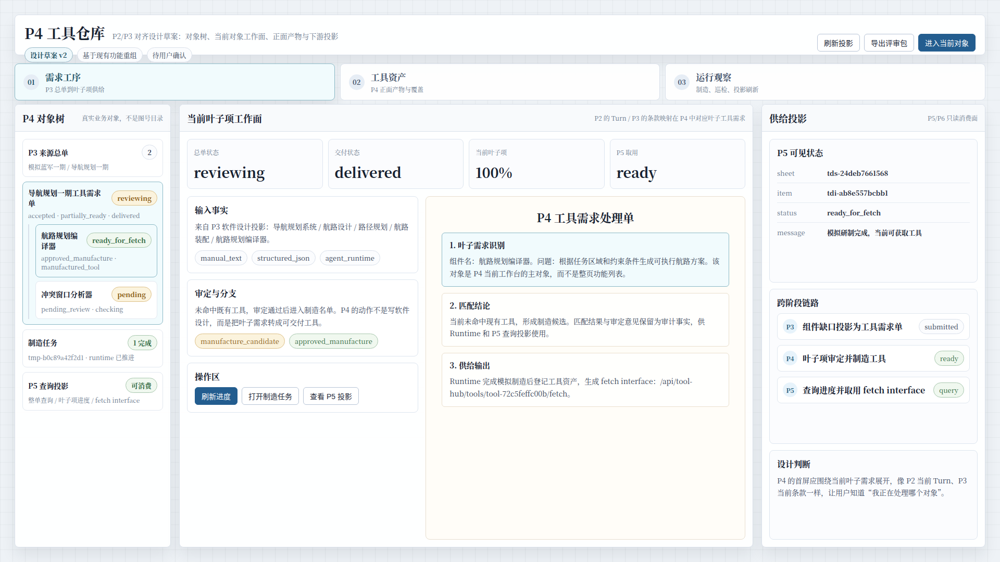
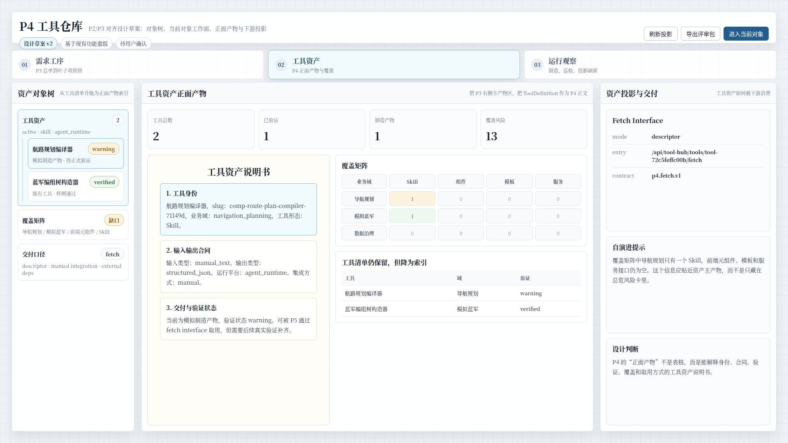
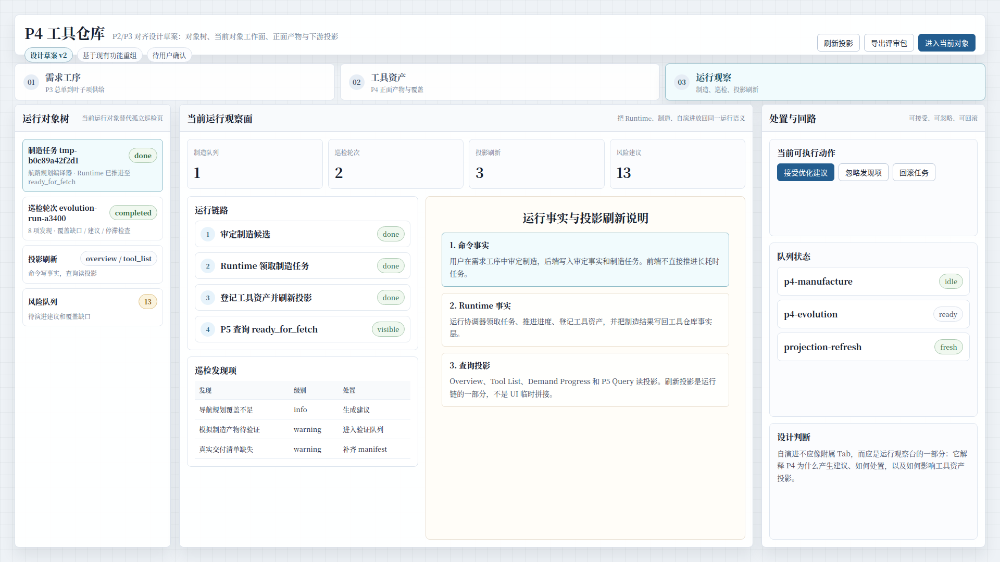

# CodeFactoryV2 P4 工具仓库 P2/P3 对齐设计草案 v2

生成时间：2026-05-12 23:49:21

- 文档角色：`P4 工具仓库` 新设计草案评审入口
- 版本目录：`DOC/CODEX_DOC/08_原型与附图/2026-05-12-234921-CodeFactoryV2-P4工具仓库P2P3对齐设计草案-v2/`
- 当前状态：待用户确认
- 目标路由：后续可映射到 `/xx-p4` 或新版 P4 独立工作台
- 页面归属：`P4` 工具资产运营中台
- 页面主对象：`ToolDemandSheet`、`ToolDemandItem`、`ToolDefinition`、`ToolManufacturePlanView`、`EvolutionRun`、`ItemProgressView`
- 目标画板规格：三张评审图均为 `1920 x 1080`
- 源文件：`source/p4-p2p3-aligned-prototype.html`

## 1. 本版定位

本版回应用户对 `P4 v1` 的批注：当前 P4 已有功能实现，但整体设计概念与 `P2`、`P3` 的工作台组织方式差距较大。

因此本版不再用运行态截图直接归档当前 UI，而是基于现有 P4 能力重新做一版设计草案：

1. 借鉴 `P2` 的真实对象树和当前输入对象工作面。
2. 借鉴 `P3` 的左侧输入事实、右侧正面产物和条款/投影追溯关系。
3. 保留当前 P4 已实现能力：需求单、叶子项审定、工具匹配、制造队列、工具仓库、覆盖矩阵、真实交付、自演进巡检、P5 查询投影。

## 2. 非目标

1. 不直接修改现有 React 实现。
2. 不把本版视为已批准 UI 标准。
3. 不重新定义 P4 后端对象模型。
4. 不新增超出现有 P4 能力边界的业务流程。
5. 不把 P2/P3 的业务对象照搬到 P4；只参考其页面组织方法。

## 3. 共用事实源与设计依据

| 事实源 | 对本版原型的约束 |
| --- | --- |
| 用户本轮批注 | P4 当前设计概念与 P2/P3 差距较大，需要基于现有功能重新做设计草案 |
| `P2 Brainstorming Lab 原型 v2` | 左侧必须是真实业务对象树；当前态应聚焦当前输入对象 |
| `P3 Design Lab 原型 v1` | 主产物区应有明确权重；输入事实、控制区、产物区和投影区要分清 |
| `P4 运行态原型 v1` | 当前 P4 已有功能和数据关系必须保留，不做空想新系统 |
| `P4-工具仓库设计.md` | P4 是工具资产运营中台，主链是 P3 需求单到 P5 可消费供给 |

## 4. 设计草案原则

本版把原来的功能型 Tab：

`总览 / 输入工序链 / 自演进巡检 / 工具仓库`

调整为对象型 Tab：

`需求工序 / 工具资产 / 运行观察`

调整理由：

1. `需求工序` 对应 P2 的当前 Turn、P3 的当前条款：让用户明确“我正在处理哪个 P4 叶子需求”。
2. `工具资产` 对应 P3 的软件设计说明正文：把 `ToolDefinition` 变成 P4 的正面产物，而不是表格中的一行。
3. `运行观察` 把 Runtime、制造、自演进、投影刷新放回同一运行语义，避免自演进像孤立后台配置页。

## 5. 画板规格与布局预算

| 区域 | 规格 / 预算 | 设计说明 |
| --- | --- | --- |
| 主画板 | `1920 x 1080` | 桌面整页设计草案 |
| 顶部栏 | 约 `78px` | 页面标题、版本状态、主动作 |
| 对象型 Tab | 约 `62px` | 需求工序、工具资产、运行观察 |
| 左侧对象树 | 约 `300px` | 借鉴 P2：真实对象树，不是图号目录 |
| 中央工作面 | 自适应主区 | 当前对象的处理面和正面产物 |
| 右侧投影区 | 约 `430px` | P5/P6 只读投影、处置动作和设计判断 |

## 6. 图文证据链

### 6.1 P4 需求工序工作台

**评阅状态：待用户确认**

**画板规格：** `1920 x 1080`

**设计依据：**

1. P2 的当前 Turn 和 P3 的当前条款都让用户明确当前处理对象。
2. P4 的当前处理对象应是 `ToolDemandItem`，不是整页功能集合。
3. 当前已有功能已经支持需求单、叶子项、审定分支、制造结果和 P5 查询投影。

**需要用户判断：**

1. 以“当前叶子项”为 P4 主工作面是否符合直觉。
2. 右侧供给投影是否足够表达 P5/P6 的消费边界。

**允许偏差：**

- 真实实现可以调整对象树密度。
- 操作按钮可随后端权限和接口成熟度调整。



### 6.2 P4 工具资产正面产物台

**评阅状态：待用户确认**

**画板规格：** `1920 x 1080`

**设计依据：**

1. P3 的右侧软件设计说明是正面产物，不只是列表。
2. P4 的正面产物应是可复用工具资产说明书，包含身份、合同、验证、覆盖和取用方式。
3. 当前实现已有 `ToolDefinition`、覆盖矩阵、fetch interface 和工具清单。

**需要用户判断：**

1. 是否认可“工具资产说明书”作为 P4 主产物表达。
2. 覆盖矩阵是否应贴近资产主产物，而不是只出现在总览风险中。

**允许偏差：**

- 工具资产说明书可改为右侧主卡或文档式详情页。
- 工具清单仍可保留，但不应继续占据主表达权重。



### 6.3 P4 运行与自演进观察台

**评阅状态：待用户确认**

**画板规格：** `1920 x 1080`

**设计依据：**

1. P4 设计文档强调后台运行时、制造队列、巡检和投影刷新是一套统一运行语义。
2. 当前 v1 中自演进像独立功能页，本版将它并入运行观察面。
3. 当前实现已有制造任务、巡检轮次、风险建议和投影刷新结果。

**需要用户判断：**

1. 自演进是否应该从独立主 Tab 降为运行观察的一部分。
2. 运行链路 + 巡检发现项 + 处置动作的组合是否足够解释 P4 的后台行为。

**允许偏差：**

- 真实实现可以把队列状态和发现项拆成二级 Tab。
- 回滚、忽略、接受建议的按钮是否开放取决于后端能力。



## 7. 原始材料说明

本版无外部原始图片。详见：

- `original/README.md`

## 8. 原型到实现映射

| 原型区块 | 当前实现来源 | 后续实现含义 |
| --- | --- | --- |
| 需求工序对象树 | `P4InputChainWorkspace`、`P4DemandItemBoard` | 当前 P3 总单、叶子需求、制造任务和 P5 投影合并为对象树 |
| 当前叶子项工作面 | `P4InputChainWorkspace`、`P4SupplyResultPreview` | 以 `ToolDemandItem` 为主对象承载审定、匹配、制造和交付 |
| 工具资产说明书 | `P4RegistryWorkspace`、`getToolDefinitions` | 将 `ToolDefinition` 从表格行提升为 P4 正面产物 |
| 覆盖矩阵 | `P4CoverageMatrix` | 贴近资产主产物，解释覆盖缺口 |
| 运行观察 | `P4EvolutionWorkspace`、`getManufacturePlans` | 将制造队列、自演进、投影刷新统一展示 |
| 右侧投影区 | `P5DemandQueryPanel`、P5 查询 API | 明确 P5/P6 只读消费边界 |

## 9. 允许偏差与不可接受偏差

允许偏差：

1. 后续实现可以继续复用 Ant Design 组件。
2. 三个对象型 Tab 可以在现有 `/xx-p4` 内渐进替换。
3. 当前数据 ID、示例工具名和指标可随运行态变化。
4. 右侧设计判断区可在实现时替换为帮助、审计或验收说明。

不可接受偏差：

1. 继续把左侧对象树做成没有业务含义的图号目录。
2. 让工具资产继续只是表格行，而不是 P4 的正面产物。
3. 让 P4 主工作面脱离当前叶子需求对象。
4. 把自演进巡检做成和制造 / Runtime / 投影刷新无关的孤立页面。
5. 把 P3 需求生成或 P5 消费决策混入 P4 主职责。

## 10. 查看与再生成

直接打开源文件：

```bash
xdg-open DOC/CODEX_DOC/08_原型与附图/2026-05-12-234921-CodeFactoryV2-P4工具仓库P2P3对齐设计草案-v2/source/p4-p2p3-aligned-prototype.html
```

重新生成截图：

```bash
corepack pnpm --dir apps/web exec node \
  "$PWD/DOC/CODEX_DOC/08_原型与附图/2026-05-12-234921-CodeFactoryV2-P4工具仓库P2P3对齐设计草案-v2/source/capture-p4-v2-prototype.mjs"
```

## 11. 自检结论

本版已完成以下自检：

1. 三张评审图均为 `1920 x 1080`。
2. 已实际查看三张截图，未发现错误页、明显文字重叠或主要内容裁切。
3. 三张图分别覆盖需求工序、工具资产、运行观察三个对象型工作态。
4. 源文件可用 hash/query 状态重新生成三张图。
5. 本版明确继承 P2/P3 的对象树和主产物区组织方式，但不照搬 P2/P3 业务对象。

## 12. 评审结论与后续处理

当前结论：待用户确认。

建议重点评审：

1. `需求工序 / 工具资产 / 运行观察` 是否比 v1 的功能型 Tab 更贴近 P2/P3。
2. `工具资产说明书` 是否能代表 P4 的正面产物。
3. 自演进是否应合并入运行观察，而不是继续作为一级独立功能页。
