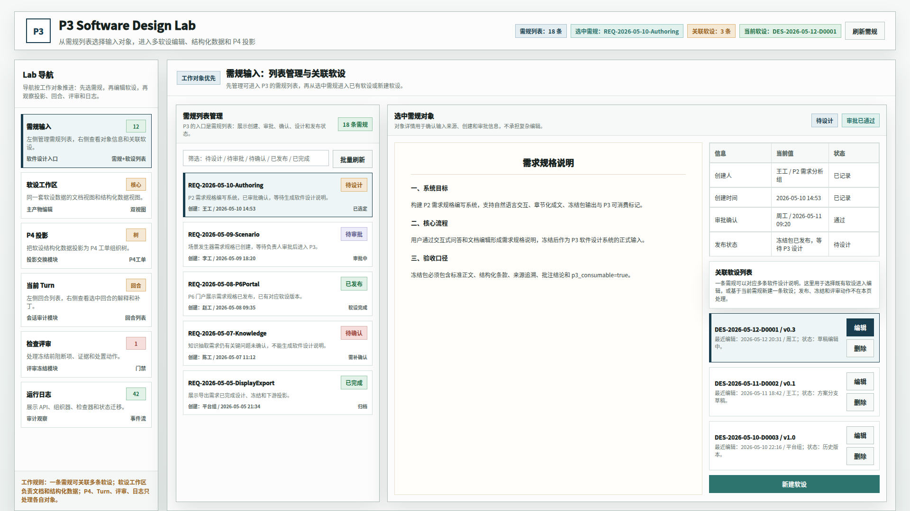
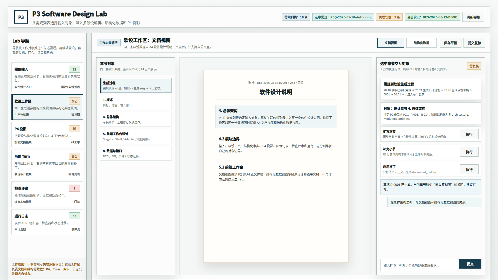
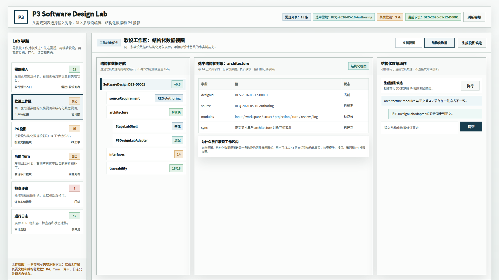
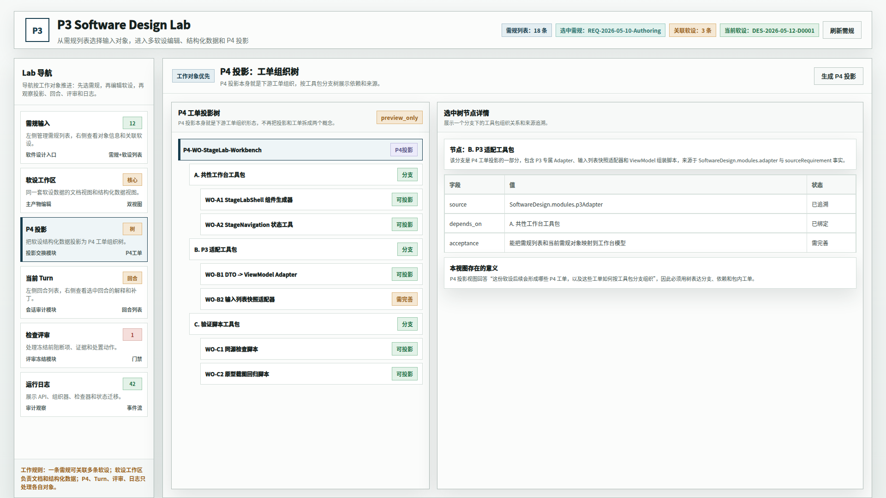
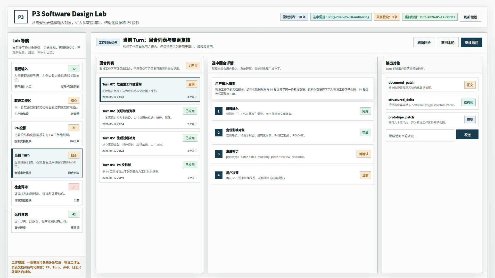
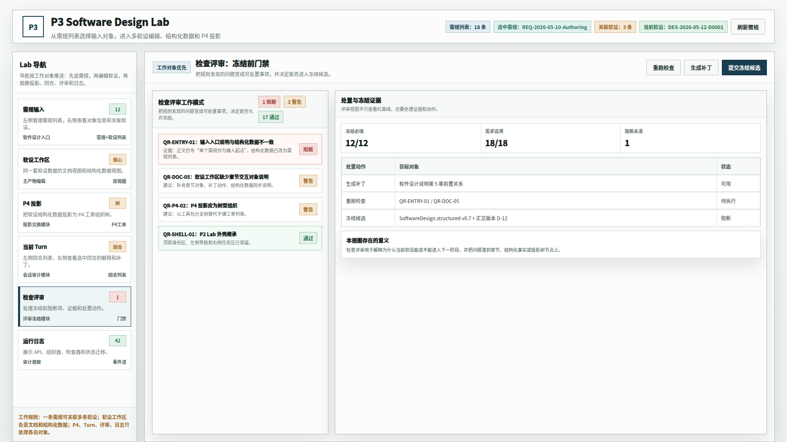
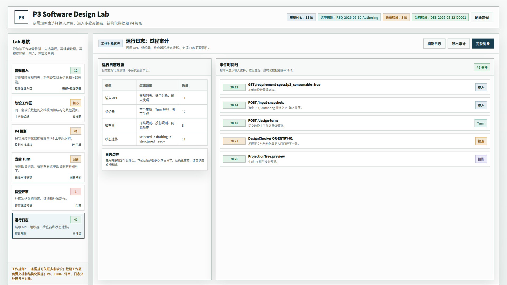

# CodeFactoryV2 P3 Design Lab 动作收敛原型 v6

## 1. 元信息

- 版本包：`2026-05-13-001922-CodeFactoryV2-P3-Design-Lab动作收敛原型-v6`
- 生成时间：2026-05-13 00:19
- 当前状态：待用户确认
- 所属范围：P3 软件设计系统 / Design Lab 原型
- 目标路由：后续实现时映射到 P3 Design Lab 主工作台
- 页面主对象：需规列表、关联软设列表、软件设计说明文档视图、软件设计结构化数据视图、P4 工单投影树、回合列表、检查评审、运行日志
- 目标画板：桌面整页 `1920 x 1080`

## 2. 本版定位

本版继承 v5，只处理用户确认的 6.1 到 6.4 批注，6.5 到 6.7 暂按通过处理，不做主体结构修改。

本版核心调整：

1. 删除 6.1 工作区标题栏的三个重复动作按钮。
2. 全局右上只保留 `刷新需规`，删除重复的 `新建软设` 和 `打开当前软设`。
3. 软设工作区的 `文档视图 / 结构化数据` 切换上移到工作区标题栏。
4. 软设文档视图删除无意义的 `生成/更新草稿`，只保留 `保存草稿` 和 `提交复核`。
5. 软设结构化数据视图删除 `同步正文` 和 `补全结构`，只保留 `生成投影候选`。
6. P4 口径改为 `P4 工单投影树`：P4 投影本身就是下游工单组织形态，不再把投影和工单拆成两个概念。

## 3. 非目标

- 不修改 6.5 当前 Turn、6.6 检查评审、6.7 运行日志的主体结构。
- 不调整需规列表和关联软设列表的业务结构。
- 不实现真实交互，仅提供评审用静态原型。
- 不覆盖 v5 原型包。

## 4. 事实源与设计依据

- 用户 2026-05-13 批注：6.1 工作区左上角三个按钮没有实际意义，应删除。
- 用户 2026-05-13 批注：全局右上角 `刷新需规 / 新建软设 / 打开当前软设` 中，只有刷新需规有意义，另外两个应删除。
- 用户 2026-05-13 批注：软设工作区已经是草稿，`生成草稿` 没有意义；保存草稿可以保留。
- 用户 2026-05-13 批注：`文档视图 / 结构化数据` 是整个可视化区域的切换，不应放在左侧列表，应上移到标题栏。
- 用户 2026-05-13 批注：结构化数据视图中 `同步正文` 默认发生，不需要按钮；`补全结构` 也不需要；`生成投影候选` 可以保留。
- 用户 2026-05-13 批注：P4 投影与工单关系需要讲清楚，P4 投影本身就是工单组织，不应再叫“工单树”造成二义性。
- 用户 2026-05-13 批注：6.5 到 6.7 暂时先通过。

## 5. 画板规格与布局预算

- 截图视口：`1920 x 1080`
- 顶部身份区：只保留状态信息和 `刷新需规`。
- 左侧 Lab 导航：维持六个主 Tab。
- 工作区标题栏：只放当前视图真正需要的动作；软设工作区标题栏承担文档/结构化视图切换。

## 6. 图文证据链

### 6.1 需规输入与关联软设视图

- 评阅状态：待用户确认
- 文件：`01-1920x1080-需规输入与关联软设视图.png`
- 设计依据：删除工作区标题栏三按钮；保留右侧关联软设列表内的编辑、删除、新建软设，因为这些是列表对象的真实动作。
- 需要判断：顶部动作收敛后是否减少混淆。



### 6.2 软设工作区文档视图

- 评阅状态：待用户确认
- 文件：`02-1920x1080-软设工作区文档视图.png`
- 设计依据：视图切换上移到标题栏；文档视图只保留 `保存草稿` 和 `提交复核`。
- 需要判断：文档/结构化切换位置是否符合“整个可视化区域切换”的语义。



### 6.3 软设工作区结构化数据视图

- 评阅状态：待用户确认
- 文件：`03-1920x1080-软设工作区结构化数据视图.png`
- 设计依据：同步正文应默认发生，不需要独立按钮；结构化视图只保留 `生成投影候选`。
- 需要判断：结构化数据动作是否足够收敛。



### 6.4 P4 工单投影树视图

- 评阅状态：待用户确认
- 文件：`04-1920x1080-P4工单投影树视图.png`
- 设计依据：P4 投影本身就是下游工单组织形态，标题、说明和节点名统一为 P4 工单投影。
- 需要判断：P4 投影与工单之间的关系是否比 v5 更清楚。



### 6.5 当前 Turn 回合列表视图

- 评阅状态：本轮暂按通过继承
- 文件：`05-1920x1080-当前Turn回合列表视图.png`
- 设计依据：用户本轮说明 6.5 到 6.7 暂时先不要修改。



### 6.6 检查评审门禁视图

- 评阅状态：本轮暂按通过继承
- 文件：`06-1920x1080-检查评审门禁视图.png`
- 设计依据：用户本轮说明 6.5 到 6.7 暂时先不要修改。



### 6.7 运行日志审计视图

- 评阅状态：本轮暂按通过继承
- 文件：`07-1920x1080-运行日志审计视图.png`
- 设计依据：用户本轮说明 6.5 到 6.7 暂时先不要修改。



## 7. 原始材料说明

本版无外部原始图片。`original/README.md` 记录了参考的仓库内正式文档和历史原型包。

## 8. 原型到实现映射

- `RequirementSpecListView`：需规列表与刷新需规。
- `RelatedSoftwareDesignList`：关联软设列表，保留编辑、删除、新建软设。
- `SoftwareDesignWorkspaceHeader`：承载文档视图/结构化数据切换和当前视图动作。
- `SoftwareDesignDocumentView`：A4 正文、章节对象、保存草稿、提交复核。
- `SoftwareDesignStructuredView`：结构化对象和生成投影候选。
- `P4ProjectionTree`：P4 工单投影组织树。
- `DesignTurnListView`、`DesignReviewGate`、`RuntimeAuditLog`：本轮继承 v5。

## 9. 允许偏差与不可接受偏差

允许偏差：

- 真实实现可调整按钮位置的细节间距。
- 结构化视图可继续补充只读字段和状态说明。

不可接受偏差：

- 6.1 工作区标题栏恢复重复动作按钮。
- 全局右上恢复 `新建软设` 或 `打开当前软设`。
- 文档/结构化切换回到左侧列表内部。
- 结构化数据视图恢复 `同步正文` 或 `补全结构` 按钮。
- P4 投影继续把投影和工单树讲成两个对象。

## 10. 查看与再生成

打开源文件：

```bash
xdg-open "DOC/CODEX_DOC/08_原型与附图/2026-05-13-001922-CodeFactoryV2-P3-Design-Lab动作收敛原型-v6/source/p3-design-lab-action-consolidation-prototype.html"
```

重新生成截图：

```bash
base="$PWD/DOC/CODEX_DOC/08_原型与附图/2026-05-13-001922-CodeFactoryV2-P3-Design-Lab动作收敛原型-v6"
corepack pnpm --dir apps/web exec playwright screenshot --viewport-size=1920,1080 "file://$base/source/p3-design-lab-action-consolidation-prototype.html#input" "$base/01-1920x1080-需规输入与关联软设视图.png"
corepack pnpm --dir apps/web exec playwright screenshot --viewport-size=1920,1080 "file://$base/source/p3-design-lab-action-consolidation-prototype.html#workspace-doc" "$base/02-1920x1080-软设工作区文档视图.png"
corepack pnpm --dir apps/web exec playwright screenshot --viewport-size=1920,1080 "file://$base/source/p3-design-lab-action-consolidation-prototype.html#workspace-struct" "$base/03-1920x1080-软设工作区结构化数据视图.png"
corepack pnpm --dir apps/web exec playwright screenshot --viewport-size=1920,1080 "file://$base/source/p3-design-lab-action-consolidation-prototype.html#p4" "$base/04-1920x1080-P4工单投影树视图.png"
corepack pnpm --dir apps/web exec playwright screenshot --viewport-size=1920,1080 "file://$base/source/p3-design-lab-action-consolidation-prototype.html#turn" "$base/05-1920x1080-当前Turn回合列表视图.png"
corepack pnpm --dir apps/web exec playwright screenshot --viewport-size=1920,1080 "file://$base/source/p3-design-lab-action-consolidation-prototype.html#review" "$base/06-1920x1080-检查评审门禁视图.png"
corepack pnpm --dir apps/web exec playwright screenshot --viewport-size=1920,1080 "file://$base/source/p3-design-lab-action-consolidation-prototype.html#log" "$base/07-1920x1080-运行日志审计视图.png"
```

## 11. 自检记录

- 2026-05-13：Playwright 重新渲染七张 `1920 x 1080` PNG。
- 2026-05-13：人工查看 `01`、`02`、`03`、`04`，确认本轮批注覆盖。
- 2026-05-13：`file *.png` 确认七张图片均为 `1920 x 1080`。
- 2026-05-13：DOM 布局脚本检查七个 hash 的主视图可见区均在画板内，`overflowText=0`。
- 2026-05-13：源码扫描确认无 `生成/更新草稿`、`同步正文`、`补全结构`、`刷新投影`、`检查来源`、`生成工单树`、`查看关系`、`保存视图`、`主动作` 等旧动作口径。

## 12. 评审结论与后续处理

当前结论：待用户确认。

若本版通过，可作为 P3 Design Lab 动作收敛后的原型基线。若仍需调整，应创建 v7 原型包，不覆盖本版图片。
